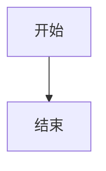

[TOC]

# <span id="test"> Markdown 概述 </span>

Markdown 是一种轻量级标记语言，它允许人们使用易读易写的纯文本格式编写文档。

Markdown 语言在 2004 由约翰·格鲁伯（英语：John Gruber）创建。

Markdown 编写的文档可以导出 HTML 、Word、图像、PDF、Epub 等多种格式的文档。

Markdown 编写的文档后缀为 **.md**, **.markdown**。

# 标题

## 二级标题（格式一）

使用 = 和-标记  

## 二级标题（格式二）

使用#标记

### 三级标题（格式二）

#### 四级标题（格式二）

##### 五级标题（格式二）

###### 六级标题（格式二）

# 段落格式

## 换行

两个以上空格并回车换行   

第二行 
使用空行来换行

第二行

## 字体

*斜体文本* 
_italic text_   

**粗体文本** 
__bord text__   

***粗斜体*** 
___italic bord text___     

## 分隔线

***

* * *

*******

---

- - -

--------

## 删除线

普通文字

~~删除的文字~~

## 下划线

通过 html 标签 <u> 实现

<u>带下划线的文本</u>

## 脚注

创建一个脚注 [^ ps.]

[^ ps.]: 这里是脚注内容

# 列表

Markdown 支持有序列表和无序列表。

## 无序列表

无序列表使用星号(**** *)、加号(* *+* *)或是减号(* *-**)作为列表标记，这些标记后面要添加一个空格，然后再填写内容：

* 星号第一项
* 星号第二项
* 星号第三项

+ 加号第一项
+ 加号第二项
+ 加号第三项

- 减号第一项
- 减号第二项
- 减号第三项

## 有序列表

有序列表使用数字并加上 **.** 号来表示，如：

1. 第一项
2. 第二项
3. 第三项

## 列表嵌套

列表嵌套只需在子列表中的选项前面添加四个空格即可：

1. 第一项
   - 第一项嵌套的第一个元素
   - 第一项嵌套的第二个元素
2. 第二项
   1. 第二项嵌套的第一个元素
   2. 第二项嵌套的第二个元素

## 清单列表

清单列表再选项前面加 `- [ ]` 实现可勾选的列表

- [ ] 未选择
- [x] 已选择

# 区块

Markdown 区块引用是在段落开头使用 **>** 符号 ，然后后面紧跟一个 **空格** 符号：

> 区块引用
>
> 挺好的

## 区块中使用列表

> 区块中的列表：
>
> 1. 第一项
> 2. 第二项
>    1. 第一项嵌套的第一个元素
>    2. 第一项嵌套的第二个元素

## 列表中使用区块

如果要在列表项目内放进区块，那么就需要在 **>** 前添加四个空格的缩进。

列表中使用区块实例如下：

1. 第一项

   > 区块引用
   >
   > 挺好的

2. 第二项

   > 区块引用

# 代码

## 段落中区分函数或代码片段

如果是段落上的一个函数或片段的代码可以用反引号把它包起来，例如：在这个段落中我们使用了 `print()` 函数

## 代码区块

代码区块使用 **4 个空格** 或者一个 **制表符（Tab 键）**。

```java
public class TestCode() {
	public static void main(String[] args) {
		System.out.println("测试打印")；
	}
}
```

你也可以用 **```** 包裹一段代码，并指定一种语言（也可以不指定）：

``` javascript
$(document).ready(function () {
    alert('RUNOOB');
});
```

# 链接

1. 使用中括号 [] 和括弧()

   这是一个链接 [baidu](https://www.baidu.com)

2. 使用砖石符号 <>

   <https://www.baidu.com>

## 高级链接

我们可以通过变量来设置一个链接，变量赋值在文档末尾进行： 类似于脚注

这个链接用 [a] 作为网址变量 [google][a]

这个链接用 [bc] 作为网址变量 [baidu][bc]

[a]: http://www.google.com/
[bc]: https://www.baidu.com/

# 图片

Markdown 图片语法格式如下：


当然，你也可以像网址那样对图片网址使用变量:

这个链接用 [a] 作为网址变量 [picture][a]

[a]: https://www.runoob.com/wp-content/uploads/2019/03/75AA6EBF-CC57-44A6-A585-5EE3DD94E42A.jpg

Markdown 还没有办法指定图片的高度与宽度，如果你需要的话，你可以使用普通的  标签。


# 表格

Markdown 制作表格使用 **|** 来分隔不同的单元格，使用 **-** 来分隔表头和其他行。

| 表头   | 表头   | 表头   |
| ------ | ------ | ------ |
| 单元格 | 单元格 | 单元格 |
| 单元格 | 单元格 | 单元格 |
| 单元格 | 单元格 | 单元格 |

**我们可以设置表格的对齐方式：**

|左对齐|右对齐|居中对齐|
|:-----|-----:|:------:|
|单元格|单元格|单元格|
|单元格|单元格|单元格|
|单元格|单元格|单元格|

# 图片

测试本地图片：

测试网络图片：

图床图片：

# 高级技巧

## 主题

以 typora 编辑器为例，[Themes Gallery — Typora (typoraio.cn)](https://theme.typoraio.cn/) 在网站中获取主题资源

## 支持的 HTML 元素

不在 Markdown 涵盖范围之内的标签，都可以直接在文档里面用 HTML 撰写。

目前支持的 HTML 元素有：`<kbd> <b> <i> <em> <sup> <sub> <br>` 等 ，如：

在这段文字中我们使用了 `<kdb>` 标签 ，来表示按键组合 <kbd> Ctrl </kbd>+<kbd> Alt </kbd>+<kbd> Del </kbd> ；使用了 `<b>` 来表示 <b> 粗体 </b>；使用了 <i> 标签 来表示斜体 </i>

；使用了 `<em>` 标签来呈现 <em> 被强调的文本 </em>；使用了 `<sup>` 来向文档添加 <sub> 脚注 </sub> 以及表示方程式中的指数值时非常有用。如果和 <a> 标签结合起来使用，就可以创建出很好的超链接脚注。使用 `<br>` 标签来换行<br>从这里开始会换行

## 转义

Markdown 支持以下这些符号前面加上反斜杠来帮助插入普通的符号：

```
\   反斜线
`   反引号
*   星号
_   下划线
{}  花括号
[]  方括号
()  小括号
#   井字号
+   加号
-   减号
.   英文句点
!   感叹号
```


Markdown 使用了很多特殊符号来表示特定的意义，如果需要显示特定的符号则需要使用转义字符，Markdown 使用反斜杠转义特殊字符：

**加粗**

\*\*不加粗\*\*

## 公式

当你需要在编辑器中插入数学公式时，可以使用两个美元符 $$ 包裹 TeX 或 LaTeX 格式的数学公式来实现。提交后，问答和文章页会根据需要加载 Mathjax 对数学公式进行渲染。如：
$$
\mathbf{V}_1 \times \mathbf{V}_2 =  \begin{vmatrix} 
\mathbf{i} & \mathbf{j} & \mathbf{k} \\
\frac{\partial X}{\partial u} &  \frac{\partial Y}{\partial u} & 0 \\
\frac{\partial X}{\partial v} &  \frac{\partial Y}{\partial v} & 0 \\
\end{vmatrix}
$$


$$
\Gamma(z) = \int_0^\infty t^{z-1}e^{-t}dt\,.
$$

## <a id="test2"> 锚点与链接（实现标题跳转）</a>

[点击返回顶部](#test)

[点击返回顶部](#Markdown概述)

[点击跳转到区块部分](#区块)

[测试标题相同的情况](#标题)

<div id="Inter-Page"> </div>

## 流程图  

mermaid 美人鱼，是一个类似 markdown，用文本语法来描述文档图形 (流程图、 时序图、甘特图) 的工具，您可以在文档中嵌入一段 mermaid 文本来生成 SVG 形式的图形 比如插入下面的代码



# 通用格式

## 文献引用

- [1] [百度学术](http://xueshu.baidu.com/)
- [2] [Wikipedia](https://en.wikipedia.org/wiki/Main_Page)


