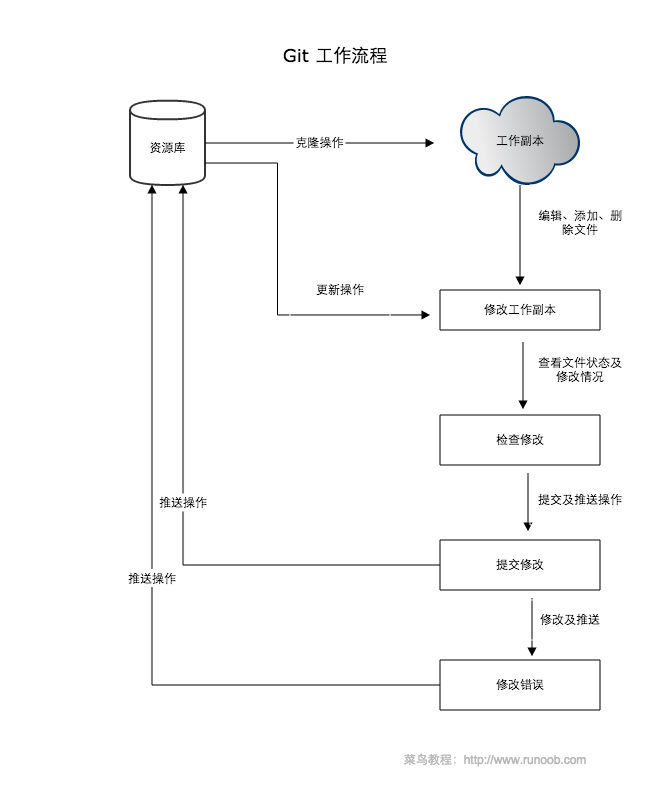
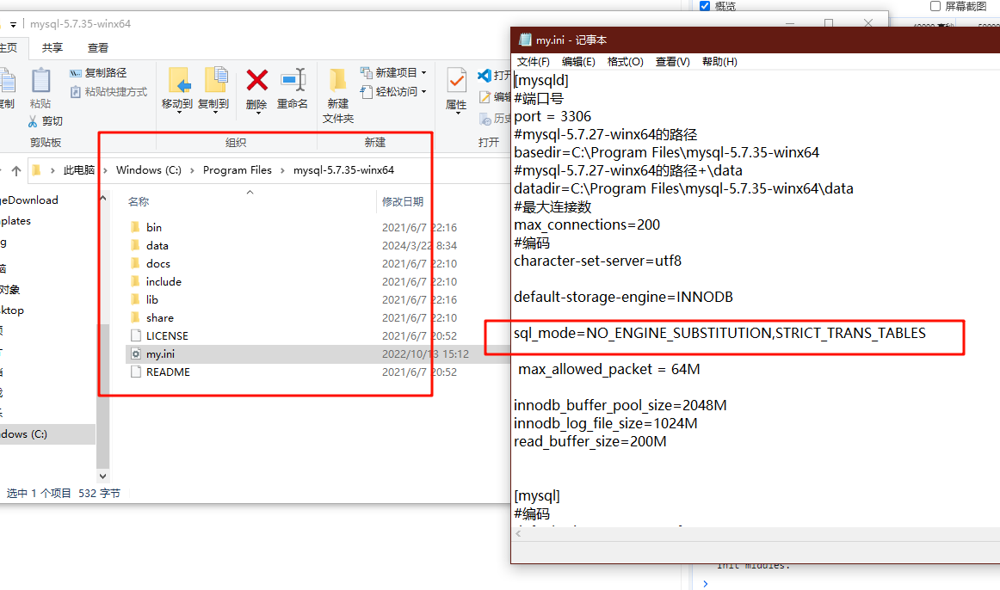
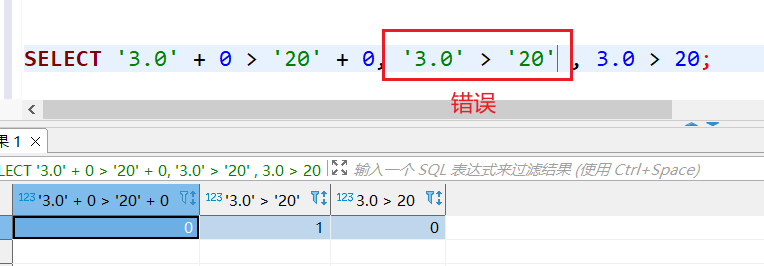
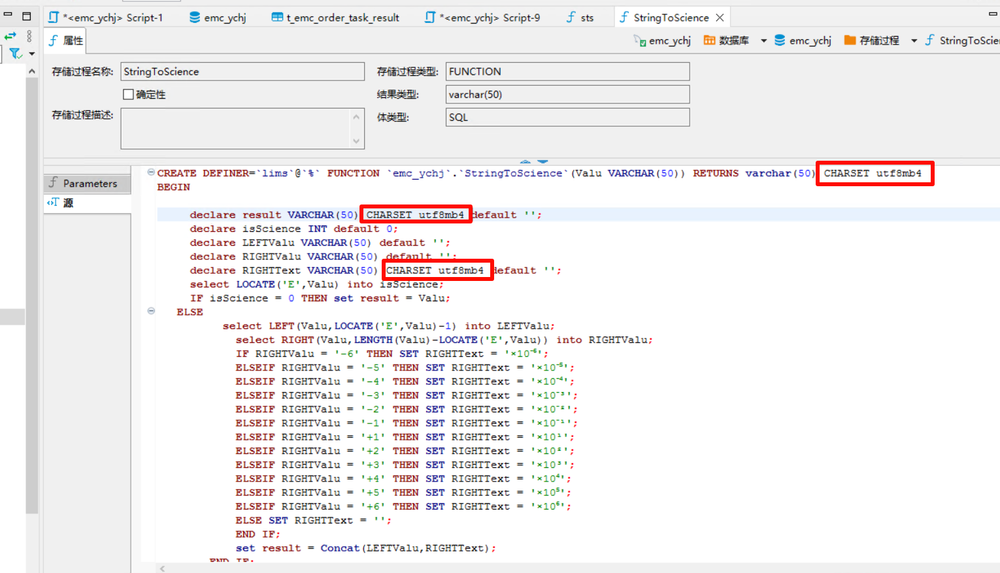
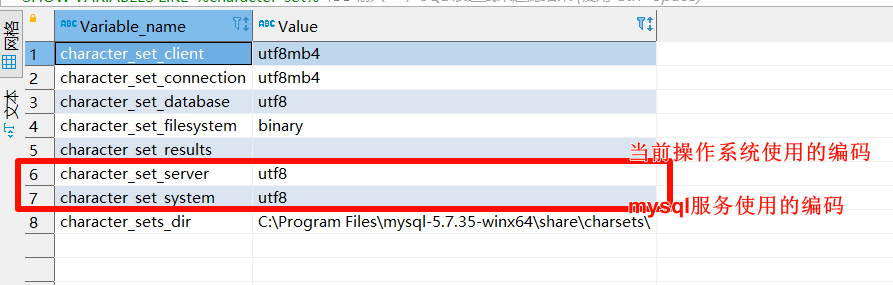
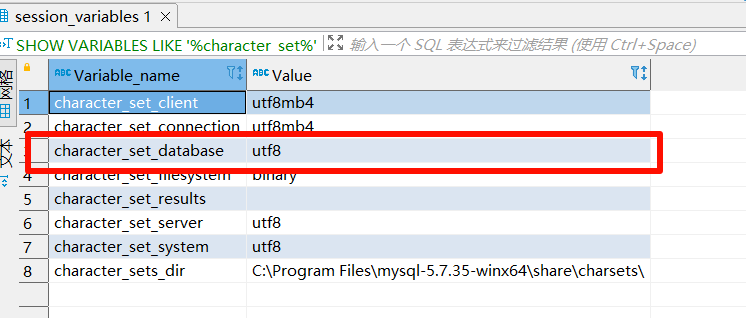
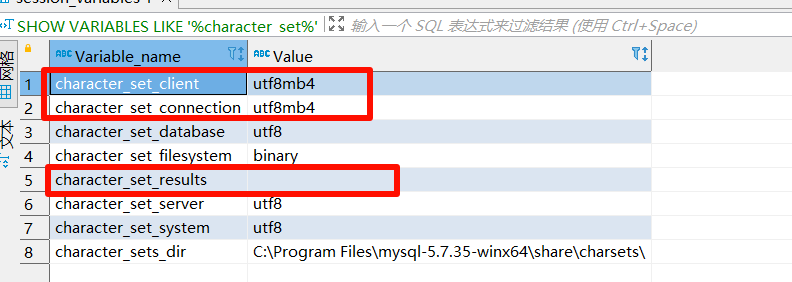
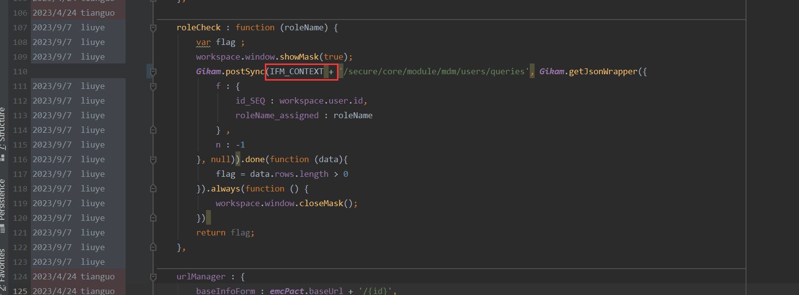
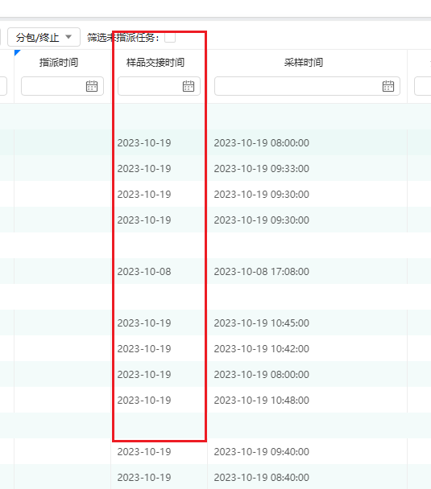
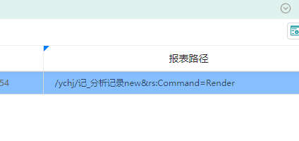

# 集合

## 排序

```java
Collections.sort(list,new Comparator<String>() {
                @Override
                public int compare(String o1, String o2) {
           			return o1.compareTo(o2);
                }
            });
```


# IO

## 图片处理


# GIT



```bash
# 配置个人用户名 密码
git config --global user.name "xxx"
git config --global user.email xxx@sunwayworld.com
# 查询已有的配置信息
git config --list
# git版本
git -version
# 创建仓库 
git init
# 克隆仓库
git clone https://xxx.git
## 提交与修改
git status # 查看仓库状态
git add xxx文件  # 提交到暂存区
git commit -m # 提交暂存区到本地仓库
## 远程操作
git pull # 上传合并
git push # 下载h

## d'lu
git config --global credential.helper store
```

# MYSQL

## 日期处理函数

```sql
-- 当前日期时间
SELECT  SYSDATE(), now(), curdate(), curtime() ;
-- 日期时间加减
SELECT datediff(SYSDATE(),'2019-06-03 12:30:00');
SELECT timediff(curtime(),'12:30:00');
```

## 字符串处理函数

```sql
-- 把字符串拆成多行的方法：可以利用SUBSTRING_INDEX()函数来进行拆分
-- 返回一个 str 的子字符串，在 delimiter 出现 count 次的位置截取。如果 count > 0，从则左边数起，且返回位置前的子串；如果 count < 0，从则右边数起，且返回位置后的子串。
SELECT SUBSTRING_INDEX(str, delimiter, count);
```

## 排序（order by）

```sql
-- 根据音序排序
SELECT * FROM runoob_tbl ORDER BY CONVERT(runoob_title using gbk);
```

## 导出

```bash
mysqldump  -uroot -pSunway_emc --databases emc_lcdp --ignore-table=emc_lcdp.t_core_log > all_database.sql
```

## 导入

MySQL source导入过慢 大sql文件 解决办法

```mysql
set global innodb_flush_log_at_trx_commit=0;
set global max_allowed_packet=1024*1024*20;
set global bulk_insert_buffer_size=32*1024*1024;
set global innodb_buffer_pool_size=32*1024*1024;
 source /root/test.sql
```

> 上面设置的参数只在 当前连接和新连接上生效，永久生效请修改my.cnf。实际使用只会在连接上设置，这些参数在生产环境不适合使用，所以导入成功后请 重启使这些设置失效 。

## sql_mode=only_full_group_by

因为在MySQL 5.7后，MySQL默认开启了SQL_MODE[严格模式](https://so.csdn.net/so/search?q=严格模式&spm=1001.2101.3001.7020)，对数据进行严格校验。如果代码中含有group by聚合操作，那么select中的列，除了使用聚合函数之外的，如max()、min()等，都必须出现在group by中。

```

sql_mode='STRICT_TRANS_TABLES,NO_ZERO_IN_DATE,NO_ZERO_DATE,ERROR_FOR_DIVISION_BY_ZERO,NO_ENGINE_SUBSTITUTION'
```



## 字符集导致排序问题

mysql数据库排序有问题或者区分大小写的情况，多半是字符集和排序规则设置有问题导致的
推荐这个charset=utf8mb3 collate=utf8mb3_general_ci

```sql
/**修改数据库的默认字符集及排序规则**/
alter database emc_kunshanshuiwu charset=utf8mb3 collate=utf8mb3_general_ci;

/**修改表的字符集**/
/**将以下sql的执行结果在命令窗口中执行**/
SELECT CONCAT( 'ALTER TABLE ', TABLE_NAME, ' DEFAULT CHARACTER SET utf8mb3 COLLATE utf8mb3_general_ci;' ) '修正SQL' FROM information_schema.`TABLES`  WHERE  TABLE_SCHEMA = 'emc_kunshanshuiwu';

/**修改表中的字段的字符集**/
/**将以下sql的执行结果在命令窗口中执行**/
SELECT  CONCAT( 'ALTER TABLE ', TABLE_SCHEMA, '.', TABLE_NAME, ' MODIFY COLUMN ', COLUMN_NAME, ' ', COLUMN_TYPE, ' CHARACTER SET utf8mb3 COLLATE utf8mb3_general_ci DEFAULT \'',COLUMN_DEFAULT,'\';' ) '修正SQL'  FROM information_schema.`COLUMNS` 
WHERE COLUMN_DEFAULT is not null AND TABLE_SCHEMA = 'emc_kunshanshuiwu' and  COLLATION_name!='utf8mb3_general_ci';

SELECT  CONCAT( 'ALTER TABLE ', TABLE_SCHEMA, '.', TABLE_NAME, ' MODIFY COLUMN ', COLUMN_NAME, ' ', COLUMN_TYPE, ' CHARACTER SET utf8mb3 COLLATE utf8mb3_general_ci ;' ) '修正SQL'  FROM information_schema.`COLUMNS` 
WHERE COLUMN_DEFAULT is  null AND TABLE_SCHEMA = 'emc_kunshanshuiwu' and  COLLATION_name!='utf8mb3_general_ci';

```

## 数据类型导致排序问题

```mysql
8.033版本中 查询语句含有某些数据类型的字段 会导致分页查询 无法排序
例： t_core_org.ORGNAME 数据类型为LongText导致无法排序 去掉分页 或修改数据类型则ke
SELECT
    *
FROM
    (
    SELECT
        S_.*
    FROM
        (
        SELECT
            T.*
        FROM
            (
            SELECT
                E.*,
                C.ORGNAME AS USEDDEPARTMENTNAME,
                O.ORGNAME AS USEDDEPOSTNAME,
                U.USERNAME AS MAINTAINUSERNAME,
                S.USERNAME AS KEEPUSERNAME
            FROM
                T_EMC_EQUIPT E
            LEFT JOIN T_CORE_ORG C ON
                E.USEDDEPARTMENTID = C.ID
            LEFT JOIN T_CORE_ORG O ON
                E.USEDDEPOSTID = C.ID
            LEFT JOIN T_CORE_USER U ON
                E.MAINTAINUSERID = U.ID
            LEFT JOIN T_CORE_USER S ON
                E.KEEPUSERID = S.ID) T
        WHERE
            ( UPPER(`ORGID`) LIKE CONCAT('1101', '%') )
        ORDER BY
            `equiptId` IS NULL,
            `equiptId` DESC ) S_
    LIMIT 0,
    50) R_;
```


## CAST函数

```
CAST(column AS 类型)
```

新版本数据库出现过问题 

## 比较运算




## 字符集报错 Incorrect string value

myslq 保存表情符号等特殊字符时出错（字符集是utf8）

```
UPDATE user_info SET nickname='?测试' WHERE id=1;  

```

> 报错信息：
> Incorrect string value: '\xF0\x9F\x98\x9D\xE6\xB5...' for column 'nickname' at row 1

utf8字符集本身没有问题，但是mysql的utf8不是真正的utf8，只支持最多3个字节的字符（也就是说mysql的utf8只支持部分utf8字符），而表情符号占四个字节，因此报错。

解决方案：

```mysql
 ALTER TABLE `user_info` CONVERT TO CHARACTER SET  utf8mb4;  # 表的字符集设置为utf8mb4
ALTER TABLE `block_template` CHARSET=utf8mb4; # 表中的字段单独指定utf8mb4
```

存储过程的变量 上也可以看成字段 如果需要赋值特殊的字符（如科学计数法3 ×10⁻⁴）,定义变量时要指定字符集




## 数据库编码

###  系统编码、服务编码



### 文件操作编码

`character_set_filesystem`表示涉及到文件操作的时的编码，如：`LOAD DATA INFILE和SELECT ... INTO OUTFILE语句和LOAD_FILE()`函数中

### 设置数据库、表格、字段字符集



```mysql
SHOW VARIABLES LIKE '%character_set%';
```

```mysql
CREATE database testdb DEFAULT CHARACTER SET utf8mb4 COLLATE utf8mb4_unicode_ci; #数据库建立时直接指定utf8mb4字符集，这样建表和字段时可以不再指定字符集（默认直接使用所在数据库的字符集）

 ALTER TABLE `user_info` CONVERT TO CHARACTER SET  utf8mb4;  # 表的字符集设置为utf8mb4
ALTER TABLE `block_template` CHARSET=utf8mb4; # 表中的字段单独指定utf8mb4
```

### 设置连接字符集

```mysql
SHOW VARIABLES LIKE '%character_set%';
```



`character_set_client`、`character_set_connection`、`character_set_results`是一个mysql连接后mysql客户端和mysql服务器协商的编码规则。

* 设置连接使用的字符集(session有效)

```mysql
SET NAMES utf8mb4 # 相当于如下三个语句：
SET character_set_client ='utf8mb4'; #客户端字符集
SET character_set_connection ='utf8mb4'; #客户端与服务器端连接采用的字符集
SET character_set_results ='utf8mb4'; #查询的结果集使用的字符集，如果不是utf8mb4时查询结果可能会显示乱码
```

* jdbc连接时设置编码(session有效)

```
jdbc:mysql://localhost:3306/testdb?useUnicode=true&characterEncoding=utf8
```

* 服务端设置连接编码my.ini（全局有效）

```ini
[mysqld]
#character-set-client-handshake = FALSE 这个表示跳过客户端设置，直接使用character-set-server，即就算客户端带上了“characterEncoding=xxx”连接参数，也会被忽略  
character-set-client-handshake = FALSE 
character-set-server = utf8mb4 
```


# SQL SERVER

分组实现方法

```sql
SELECT OT.ORDERID ,   STUFF((
            SELECT ','+ CONVERT(VARCHAR(20), _OT.ID)
            FROM T_EMC_ORDER_TASK _OT
            WHERE _OT.ORDERID = OT.orderid
            FOR XML PATH(''))
        , 1, 1, '') AS OTID FROM t_emc_order_task OT GROUP BY OT.orderid;
            
```

# DM SQL

* mysql转达梦8

1. as语句问题：达梦8不支持 "" as xxx或 " " as xxx的写法

2. 不能使用=""的方式来判断空串，需要改为=''(单引号)

3. str_to_date()函数需要更换为to_date()

4. group_concat()函数需要更换为wm_concat()

5. 不能使用select 1=1这样的写法，需要改为select if('1'='1', '1', '0'), '1'='1'这种写法只能放在where 子句中

6. if()函数不可用

7. 参数为空的时候用[column]=#{param}会报类型转换错误，需要用if标签判断空值：

   ```sql
   <if test="id == null">
       id is null
   </if>
   <if test="id != null">
       id = #{id}
   </if>
   ```

8. 有时候会有莫名其妙的找不到列的报错，需要把查询字段变为大写

# redis

## MISCONF Redis is configured to save RDB snapshots

究其原因是因为强制把redis快照关闭了导致不能持久化的问题，在网上查了一些相关解决方案，通过stop-writes-on-bgsave-error值设置为no即可避免这种问题。

有两种修改方法，一种是通过redis命令行修改，

[127.0.0.1](https://www.baidu.com/s?wd=127.0.0.1&tn=24004469_oem_dg&rsv_dl=gh_pl_sl_csd):6379> config set stop-writes-on-bgsave-error no

另一种是直接修改redis.conf配置文件

修改redis.conf文件：vi打开redis-server配置的redis.conf文件，然后使用快捷匹配模式：/stop-writes-on-bgsave-error定位到stop-writes-on-bgsave-error字符串所在位置，接着把后面的yes设置为no即可。


# SW LIMS V12

### 后端

* 获取编号列表

```
List<Long> idLIst = ApplicationContextHelper.getNextIdentityList(equiptList.size());
```

* 子查询字段排序或快查失效

  ```mysql
  再嵌套一层查询即可
  ```

  


* 一对多分组查询优化

```mysql
select A.*, FF.ISREQUIRED from A
  LEFT JOIN ( SELECT F.EQUIPTCALIBRATIONID, GROUP_CONCAT(F.METHODISREQUIRED) AS ISREQUIRED
							  FROM T_EMC_CALIBRATION_FACTOR F
                            GROUP BY F.EQUIPTCALIBRATIONID
						   ) FF ON FF.EQUIPTCALIBRATIONID = A.ID
```

* 从请求中获取id而不是整个对象（数组）

```
        List<Long> idList = (List<Long>) wrapper.parseId(this.getDao().getEntityContext().getIdContext().getType());

```

* update方法易错

```java
service.getDao().update(itemList, updatedColNames);
// 若updateColNames 为空
// 则以List中第一个数据为准来判断更新哪些信息
```


### 前端

* 穿梭框相关参数

```js
leftServerSearch : false, //后台查询关（前端快查开）
rightServerSearch : false,
leftPage:false,
rightPage:false,//分页组件去除
```

* 表单添加标题

```js
 	 north : {
                		 height : '8%',
                		 padding : '0px 0px 0px 300px',
                		 items : [{
                             type : 'form',
                             id : 'emc-system-change-edit-countersign-form',
                             caption : {
                                 text : '系统信息变更确认表',
                                 color : 'black',
                             }
                         }]
                	 },
                	 south : {
                		 height : '92%',
                		 items : [_this.getDetailForm()]
                	 }
```


* 实现确定和取消的框

```js

var modal = Gikam.create('modal', {
                            title: "GIKAM.BUTTON.BACTHUPDATE",
                            width: 400,
                            height: 350,
                        });       

var layout = Gikam.create('layout', { 
            renderTo : modal.window.$dom,
            center : {// 将按钮置于layout中间即可
                items : [ {
                    type : 'btnToolbar',
                    items : [ {
                        type : 'button',
                        text : 'GIKAM.BUTTON.CONFIRM',
                        class : 'blue',// 实现颜色
                        onClick : function() {
                           ...
                        }
                    }, {
                        type : 'button',
                        text : 'GIKAM.BUTTON.CANCEL',
                        onClick : function() {
                            modal.close();
                        }
                    } ]
                } ]
            }
        });
var form = Gikam.create('form', {
            renderTo : layout.options.center.$dom,
            columns : 1,
            titleWidth : 80,
            fields : [ ],
            autoSave : false
        });

```

* 实现批录入框

```js
var selections = Gikam.getComp(gridI).getSelections();
if (Gikam.isEmpty(selections)) {
    Gikam.alert('GIKAM.TIP.CHOOSE_AT_LEAST_ONE_ITEM')
    return;
}
var modal = Gikam.create('modal', {
                            title: "GIKAM.BUTTON.BACTHUPDATE",
                            width: 400,
                            height: 220,
                        });
                        var layout = Gikam.create('layout', {
                            renderTo: modal.window.$dom,
                            center: {
                                items: [{
                                    type: 'btnToolbar',
                                    items: [{
                                        type: 'button',
                                        text: 'GIKAM.BUTTON.CONFIRM',
                                        icon: 'select',
                                        onClick: function () {
                                            if (form.validate()) {
                                                selections.forEach(function (item) {
                                                    for(var key of Object.keys(form.getData())) {
                                                        item[key] = form.getData()[key]
                                                        if (key == 'ext$') {
                                                            for(var extKey of Object.keys(form.getData().ext$)) {
                                                                item.ext$[extKey] = form.getData().ext$[key]
                                                            }
                                                        }
                                                    }
                                                })
                                                workspace.window.showMask(true);
                                                Gikam.put(IFM_CONTEXT+'/secure/gikam/actions/instant', Gikam.getJsonWrapper({}, [ 'emcQuotationDetectionfactorServiceImpl', selections ])).done(function(id) {
                                                    Gikam.getComp(gridId).refresh();
                                                }).always(function() {
                                                    Gikam.getLastModal().window.closeMask();
                                                    modal.close();
                                                });
                                            }
                                        }
                                    }, {
                                        type: 'button',
                                        text: 'GIKAM.BUTTON.CANCEL',
                                        icon: 'cancel',
                                        onClick: function () {
                                            modal.close();
                                        }
                                    }]
                                }]
                            }
                        });
                        var fields = emcQuotationDetectionfactor.getBaseInfoFormFields().filter(f=>f.batchInput);
                        var form = Gikam.create('form', {
                            renderTo: layout.options.center.$dom,
                            fields: fields,
                            columns : 1,
                            titleWidth : 100,
                            autoSave: false
                        });
```


* processRows函数

```js
 Gikam.getComp('emc-run-equipt-use-record-list-grid').processRows({
                        url : '/secure/emc/module/mdm/equipt/equipts/completeUsed',
                        confirm : {
                            msg : 'T_EMC_EQUIPT_USE_RECORD.TIP.MSG.COMPLETEUSED',
                            title : 'GIKAM.BUTTON.IF_COMPLETE',
                        },
                        formatter : function(row) {
                            return row.id;
                        },
                        beforeProcess : function (selectedRowsJson, selectedRows) {
                            selectedRows = selectedRows.filter(row=> (row.editStatus == '2' || row.editStatus == '0'));
                            selectedRowsJson = selectedRows.map(row => {
                                return { id: row.id };
                            });
                        },
                        method : 'put'
                    }).done(function() {
                        Gikam.getComp('emc-run-equipt-use-record-list-grid').refresh();
                    });
```

* 提前设置顶部过滤参数

```
      columnsFill : true,
            headRequestData : {
                testName_CISC : _this.param.testName
            },
```

* preInsert

```js
displayReadonly:false // perInsert是否强制显示出只读字段
```

* 直接获取系统参数

```js
Gikam.getConstantValue()
```

* 路径记得加上 上下文



* 附件设置上传需要报错的属性setUploadData

```js
Gikam.create('simpleUploader', {
                id : 'emc-test-method-detail-formula-pic-uploader',
                dbTable : 'T_EMC_TEST_METHOD',
                bizId : bizId,
                bizCategory : 'scriptPic',
                accept : 'image',
                multiple : false,
                onBeforeUpload : function() {
                    this.setUploadData({
                        ext : 'formulaPic',
                    })
                },

            });
```

* 使用onBeforeUpdate进行自定义grid的数据验证

```js
 onBeforeUpdate : function(data, keys) {
                                    console.log(data);
                                    console.log(keys);
                                    if (!Gikam.isEmpty(data.ext$.additionaldiscount)) {
                                        var value = data.ext$.additionaldiscount;
                                        var row = data.row;
                                        var discount =  value.indexOf('%') > -1 ? value.replace('%','') : value;
                                        if (row.urgenttype == '加急' && discount < 100 ) {
                                            Gikam.alert('加急合同的折扣率不得低于100%');
                                            return false;
                                        }
                                        if (row.urgenttype == '特急' && discount < 150 ) {
                                            Gikam.alert('加急合同的折扣率不得低于150%');
                                            return false;
                                        }
                                    }
                            },
```


### 数据库

当用ext$方式拓展数据库时，尽量使用varchar属性添加字段， 

> 如果含有datetime等日期格式 会导致sql查询时 格式发生变化 而字符串则无此问题

* 日期转换

```mysql
UPDATE t_emc_equipt_use_record SET STARTUSEDATE = date_format(STARTUSEDATE,'%Y-%m-%d') ;
UPDATE t_emc_equipt_use_record SET ENDUSEDATE  = date_format(ENDUSEDATE,'%Y-%m-%d') ;


```

> 用于 datetime数据类型 只需要显示日期部分 搭配一下java注释使用

```java
    @JSONField(format = "yyyy-MM-dd")
    @DateTimeFormat(pattern = "yyyy-MM-dd")
    private LocalDateTime startUseDate;//仪器开始使用日期
```

* 同理，当通过连接查询语句，获取非主表的日期时间格式字段时，应该将其转为字符串格式。

否则前端不会显示时间，只显示日期



```mysql
select 
Q.ACCEPTEDDATE,
concat(DATE_FORMAT(Q.ACCEPTEDDATE,"%Y-%m-%d")," ",DATE_FORMAT(Q.ACCEPTEDDATE,"%H:%i:%s")) ACCEPTEDDATE2,
date_format(Q.ACCEPTEDDATE,'%Y-%m-%d %H:%i:%s') ACCEPTEDDATE3 
from Q;
qi'z
```


## 工作流

* 回退

```js
 	{
                type : 'button',
                text : 'GIKAM.WORKFLOW.BUTTON.UNDO',
                icon : 'reject',
                onClick : function () {
                    _this.undo();
                }
            },


	undo : function() {
        var grid = Gikam.getComp('emc-mtl-receive-search-list-grid');

        Gikam.create('workflow').undo({
            data : grid.getSelections(),
            pageObject : {
                baseUrl : emcMtlReceive.baseUrl,
                workflow : {
                    dbTable : 'T_EMC_MTL_RECEIVE',
                    columns : [ {
                        field : 'id',
                        title : 'T_EMC_MTL_RECEIVE.ID'
                    } ]
                }
            }
        })
    },

```

* 新增下级审核人策略

```java
复写selectBpmnTaskStatus方法

    public default CoreBpmnTaskStatusDTO selectBpmnTaskStatus(RestJsonWrapperBean wrapper) {
        @SuppressWarnings("unchecked")
        List<ID> idList = (List<ID>) wrapper.parseId(this.getDao().getEntityContext().getIdContext().getType());

        if (idList.isEmpty()) {
            return new CoreBpmnTaskStatusDTO();
        }
        
        // 是否是提交或审核通过操作，提交或审核通过操作才会去考虑下一级审核人员的策略
        String pass = wrapper.getParamValue("bpmn_pass");
        
        if ("-1".equals(pass)) { // 撤回
            return new CoreBpmnTaskStatusDTO();
        }
        
        List<CoreBpmnRuntimeSource<T, ID>> sourceList = this.parseRuntimeSource(idList, wrapper);
        
        // 单据流程结束时直接返回
        if (sourceList.stream().anyMatch(s -> ProcessStatus.DONE.name().equalsIgnoreCase(s.getOldItem().getProcessStatus()))) {
            return new CoreBpmnTaskStatusDTO();
        }
        
        CoreBpmnTaskStatusDTO taskStatus = null;
        
        try {
            // 初始化缓存
            BpmnRuntimeCacheProvider.init(sourceList);
            
            for (CoreBpmnRuntimeSource<T, ID> source : sourceList) {
                CoreBpmnTaskStatusDTO sourceStatus = new CoreBpmnTaskStatusDTO();
                
                Element currentElement = BpmnRuntimeCacheProvider.getBpmnRuntimeTaskElement(source);
                
                sourceStatus.setAttachmentStrategy(BpmnDiagramHelper.getAttachmentStrategy(currentElement));
                sourceStatus.setCommentRequired(BpmnDiagramHelper.isCommentRequiredTask(currentElement));
                sourceStatus.setAuthRequired(BpmnDiagramHelper.isAuthRequiredUserTask(currentElement));
                sourceStatus.setTransfer(BpmnDiagramHelper.isTransferTask(currentElement));
                
                // 审核通过
                if ("1".equals(pass)) {
                    // 当前节点的最后一个审核人时，才去判断下一级审核人信息
                    if (BpmnRuntimeCacheProvider.isLastTaskCandidator(source)) {
                        sourceStatus.setNextCandidatorOptStrategy(BpmnDiagramHelper.getNextCandidatorOptStrategy(currentElement));

                        if(isLastTaskProessStatus(BpmnRuntimeCacheProvider.getNextTask(source).getNextTaskElementList())){
                            sourceStatus.setNextCandidatorOptStrategy(NextCandidatorOptStrategy.none);
                        }

                        if (NextCandidatorOptStrategy.assigned.equals(sourceStatus.getNextCandidatorOptStrategy())
                                || NextCandidatorOptStrategy.assignedRole.equals(sourceStatus.getNextCandidatorOptStrategy())) {
                            CoreBpmnInstanceNextTaskElementDTO<ID> nextTaskElement = BpmnRuntimeCacheProvider.getNextTask(source);
                            
                            if (NextCandidatorOptStrategy.assigned.equals(sourceStatus.getNextCandidatorOptStrategy())) {
                                List<Element> nextTaskElementList = nextTaskElement.getNextTaskElementList();
                                
                                List<String> candidatorIdList = new ArrayList<>();
                                List<Long> candidateRoleIdList = new ArrayList<>();
                                
                                CoreBpmnInstanceBean instance = BpmnRuntimeCacheProvider.getBpmnRuntimeInstance(source);
                                
                                // 提交人
                                String initiator = (instance == null ? LocalContextHelper.getLoginUserId() : instance.getInitiator());
                                for (Element taskElement : nextTaskElementList) {
                                    CoreBpmnTaskCandidatorsDTO candidators = BpmnDiagramHelper.getUserTaskCandidators(source, taskElement, initiator);
                                    
                                    if (candidators.getCandidatorIdList() != null) {
                                        candidatorIdList.addAll(candidators.getCandidatorIdList());
                                    }
                                    
                                    if (candidators.getCandidateRoleIdList() != null) {
                                        candidateRoleIdList.addAll(candidators.getCandidateRoleIdList());
                                    }
                                }
                                
                                if (!candidateRoleIdList.isEmpty()) {
                                    CoreRoleUserService roleUserService = ApplicationContextHelper.getBean(CoreRoleUserService.class);
                                    
                                    List<CoreRoleUserBean> roleUserList = roleUserService.getDao().selectListByOneColumnValues(candidateRoleIdList.stream().distinct().collect(Collectors.toList()), "ROLEID");
                                    
                                    roleUserList.forEach(r -> candidatorIdList.add(r.getUserId()));
                                }
                                
                                if (!candidatorIdList.isEmpty()) {
                                    CoreUserService userService = ApplicationContextHelper.getBean(CoreUserService.class);
                                    
                                    List<CoreUserBean> candidatorList = userService.selectListByIds(candidatorIdList.stream().distinct().collect(Collectors.toList()));
                                    
                                    // 过滤相同部门的待审人员
                                    if (CandidatorFilterStrategy.sameDept.equals(BpmnDiagramHelper.getCandidatorFilterStrategy(currentElement))) {
                                        String createdByOrgId = (String) PersistableHelper.getPropertyValue(source.getOldItem(), "createdByOrgId");
                                        
                                        if (!StringUtils.isBlank(createdByOrgId)) {
                                            candidatorList.removeIf(c -> !c.getOrgId().equals(createdByOrgId));
                                        }
                                    }
                                    
                                    sourceStatus.setCandidatorList(candidatorList);
                                }
                            } else if (NextCandidatorOptStrategy.assignedRole.equals(sourceStatus.getNextCandidatorOptStrategy())) {
                                List<Element> nextTaskElementList = nextTaskElement.getNextTaskElementList();
                                
                                List<Long> candidateRoleIdList = new ArrayList<>();
                                
                                CoreBpmnInstanceBean instance = BpmnRuntimeCacheProvider.getBpmnRuntimeInstance(source);
                                
                                // 提交人
                                String initiator = (instance == null ? LocalContextHelper.getLoginUserId() : instance.getInitiator());
                                for (Element taskElement : nextTaskElementList) {
                                    CoreBpmnTaskCandidatorsDTO candidators = BpmnDiagramHelper.getUserTaskCandidators(source, taskElement, initiator);
                                    
                                    if (candidators.getCandidateRoleIdList() != null) {
                                        candidateRoleIdList.addAll(candidators.getCandidateRoleIdList());
                                    }
                                }
                                
                                if (!candidateRoleIdList.isEmpty()) {
                                    CoreRoleService roleService = ApplicationContextHelper.getBean(CoreRoleService.class);
                                    
                                    sourceStatus.setCandidateRoleList(roleService.selectListByIds(candidateRoleIdList.stream().distinct().collect(Collectors.toList())));
                                    
                                }
                            }
                        }
                    }
                }
                
                if (taskStatus == null) {
                    taskStatus = sourceStatus;
                } else {
                    checkAndMerge(taskStatus, sourceStatus);
                }
            }
        } finally {
            BpmnRuntimeCacheProvider.remove();
        }
        
        if (NextCandidatorOptStrategy.assigned.equals(taskStatus.getNextCandidatorOptStrategy())) {
            if (CollectionUtils.isEmpty(taskStatus.getCandidatorList())) {
                throw new BpmnException("CORE.MODULE.SYS.T_CORE_BPMN_PROC.ENGINE.TIP.ASSIGNED_STRATEGY_REQUIRES_CANDIDATORS");
            }
        }
        
        if (NextCandidatorOptStrategy.assignedRole.equals(taskStatus.getNextCandidatorOptStrategy())) {
            if (CollectionUtils.isEmpty(taskStatus.getCandidateRoleList())) {
                throw new BpmnException("CORE.MODULE.SYS.T_CORE_BPMN_PROC.ENGINE.TIP.ASSIGNED_ROLE_STRATEGY_REQUIRES_CANDIDATEROLES");
            }
        }
        
        return taskStatus;
    }

```

* 存在于ext$的字段，排他网关设置 采用小写


* 打开审核流程函数

  

## 报表预览

```

			{
                type: 'button',
                text: 'GIKAM.BUTTON.PREVIEW',
                icon: 'print',
                onClick: function () {
                    Gikam.viewReport('userability', Gikam.getComp('emc-ability-verify-audit-list-grid').getSelections());
                }
            } 
```


# 报错

```
The request was rejected because the URL contained a potentially malicious String "//"
```

路径中出现双斜杠

# 环监业务理解

## 样品

个数=监测方案的周期`*`监测方案频次`*`样品列表的最大采样数

# 前端

## 实现pdf预览

*  pdf.js方式

下载

[Releases · mozilla/pdf.js (github.com)](https://github.com/mozilla/pdf.js/releases)


```html
<!DOCTYPE html>
<html lang="en">
    <head>
        <meta charset="UTF-8">
        <title>测试</title>
        <script type="text/javascript">
            goPage = function(){
                window.location.href="plugin/pdfjs-3.5.141-dist/web/viewer.html?file=" + "";
               
            }
        </script>
    </head>


    <body class="bodyStyle">

        file后可以是pdf.js插件的web内文件路径，也可以是项目的接口（包括文件位置） 需注意接口url分隔符为"/"
    	<div class="divStyle">
    		<input id="inputButton" class="inputStyle" type="button" onclick="goPage()">
		</div>
	</body>
</html>
```

若采用接口返回文件流，其后端写法

```java
 	@RequestMapping("/display")
    public void display (Long id, HttpServletResponse response) {
        Book book = bookService.findOne(id);
        String path = book.getBookDownPath();
        File pdfFile = new File(path);
        response.setContentType("application/pdf");
        try {
            FileInputStream in = new FileInputStream(pdfFile);
            OutputStream out = response.getOutputStream();
            byte[] b = new byte[1024];
            while ((in.read(b)) != -1) {
                out.write(b);
            }
            out.flush();
            in.close();
            out.close();
        } catch (IOException e) {
            e.printStackTrace();
        }
    }
```

* 刷新表格   某个字段的readonly 不一致问题

form全局控制表格的只讀   readonly : true,

```
  type : 'form',
  columns : 4,
  readonly : true,
  id : 'emc-project-query-edit-list-base-info-form',
  fields : emcProjectQuery.getBaseInfoFormFieldsFirst(),
```

接著用第二個form  刷新form   emcProjectQuery.getBaseInfoFormFieldsSecond(),

新的字段將無法只讀

## js懒加载

```js
import('@/vendor/Export2Excel').then(excel => {
  excel.export_json_to_excel(,,,)
})
```

## 实现导出excel

https://blog.csdn.net/weixin_41715751/article/details/121372090

```js
exportData : function() {
     var columns = Gikam.getComp('emc-result-data-summary-list-grid').options.columns;
     var rows = Gikam.getComp('emc-result-data-summary-list-grid').data;
     // 获取需要的数据
     let tHeader = []
     let filterVal = []
     for (var i = 1; i < columns.length; i++) {
         tHeader.push(columns[i].title)
         filterVal.push(columns[i].field)
     }
     var data = this.formatJson(filterVal, rows);

     // 将列名添加到数据中
     var title = {};
     for (let i = 1; i < columns.length; i++) {
         title[columns[i].field] = Gikam.propI18N(columns[i].title);
     };
     data.unshift(title);

     // 数据转为html表格
     var str = '';
     data.forEach(item=>{
         str += '<tr>';
         for (const k in item) {
             var cellValue = Gikam.isEmpty(item[k]) ? '' : item[k];
             //不让表格显示科学计数法或者其他格式
             //方法1 tr里面加 style="mso-number-format:'\@';" 方法2 是改为 = 'XXXX'格式
             //如果纯数字且超过15位
             var reg = /^[0-9]+.?[0-9]*$/;
             if ((cellValue.length>15) && (reg.test(cellValue))){
                 cellValue = '="' + cellValue + '"';
             }
             str+=`<td>${cellValue}</td>`;
         }
         str += '</tr>';
     })

     var worksheet = '数据汇总'
     var uri = 'data:application/vnd.ms-excel;base64,';
     var fileName = '数据汇总';
     // 下载的表格模板数据
     var template = `<html xmlns:o="urn:schemas-microsoft-com:office:office"
xmlns:x="urn:schemas-microsoft-com:office:excel"
xmlns="http://www.w3.org/TR/REC-html40">
<head><!--[if gte mso 9]><xml><x:ExcelWorkbook><x:ExcelWorksheets><x:ExcelWorksheet>
 <x:Name>${worksheet}</x:Name>
 <x:WorksheetOptions><x:DisplayGridlines/></x:WorksheetOptions></x:ExcelWorksheet>
 </x:ExcelWorksheets></x:ExcelWorkbook></xml><![endif]-->
 </head><body><table>${str}</table></body></html>`;

     function base64 (s) { return window.btoa(unescape(encodeURIComponent(s)))}
     // 普通下载
     // window.location.href = uri + base64(template);
     // 指定文件名称下载
     let link = document.createElement('A')
     link.href = uri + base64(template);
     link.download = fileName || 'Workbook.xls'
     link.target = '_blank'
     document.body.appendChild(link)
     link.click()
     document.body.removeChild(link)

 },
```

## iframe嵌入预览ssrs报表

错误参数   rs:Command=Render


报错

```
Refused to display 'http://180.100.202.217:8003/' in a frame because it set 'X-Frame-Options' to 'sameorigin'.

chrome-error://chromewebdata/:1  Refused to display 'http://180.100.202.217:8003/' in a frame because it set 'X-Frame-Options' to 'sameorigin'.
```

正确参数      rs:Embed=true


```
<iframe width="100%"
        height="100%"
        src="报表路径?rs:Embed=true&筛选条件=值"></iframe>

```

但是大部分的报表配置都已配置好了路径



因此要将rs:Command=Render替换为rs:Embed=true

## 表格formatter

改颜色：

对于date datetime字段类型 需使用textStyleFormatter

```js
{
            field : 'monitorDate',
            title : 'T_EMC_ENV_RECORD.MONITORDATE',
            editor : true,
            type : 'date',
            validators : [ 'notEmpty'],
            textStyleFormatter : function(row) {
                if (row.ext$.roomrepeat == '1') {
                    return {
                        backgroundColor : 'tomato'
                    }
                }
            },
        }
```

对于可编辑字段 需使用 formatter

```js
{
            field : 'room',
            title : 'T_EMC_ENV_RECORD.ROOM',
            width : 130,
			type : 'choose',
			category : 'room',
validators : [ 'notEmpty', 'strLength[0,36]' ],
            formatter : function(field,value,index) {
                var row = this.getData()[index];
                return row.ext$.roomrepeat == '1' ? `<p style="color: tomato">${v}</p>` : v;
            }
 }
```


# todo

秋毫检测：

任务审核完，任务的因子有时会出现无

