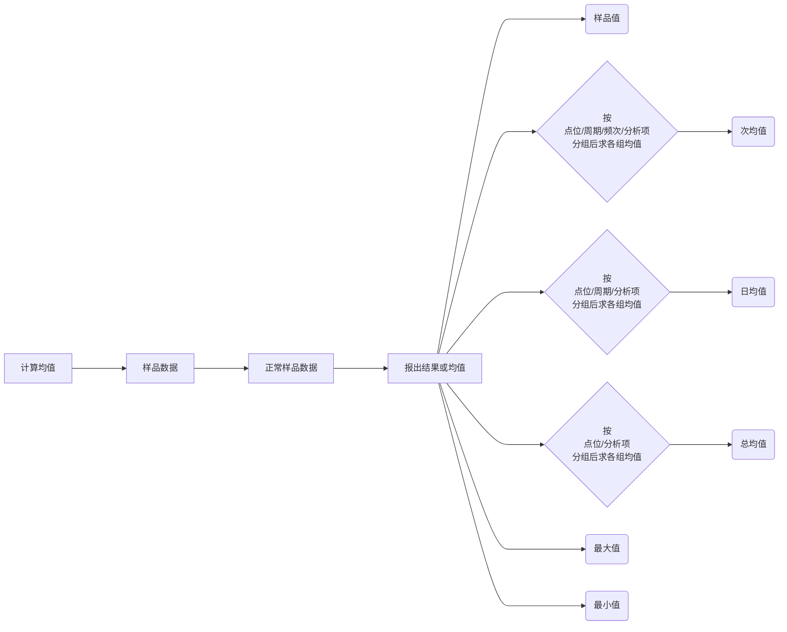
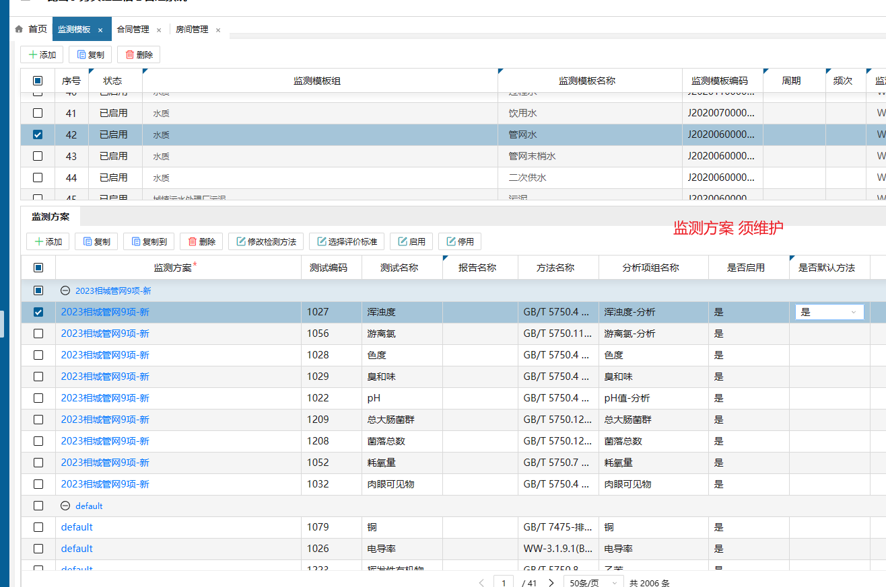
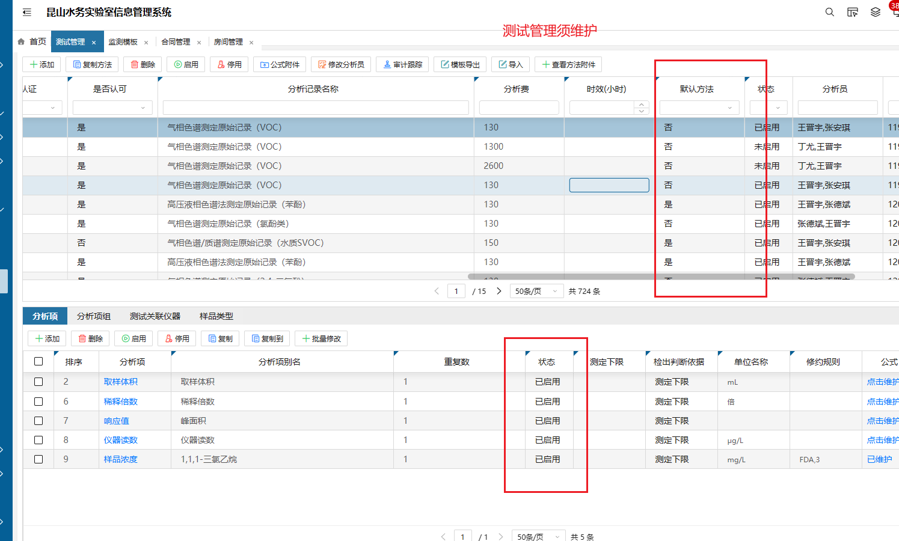
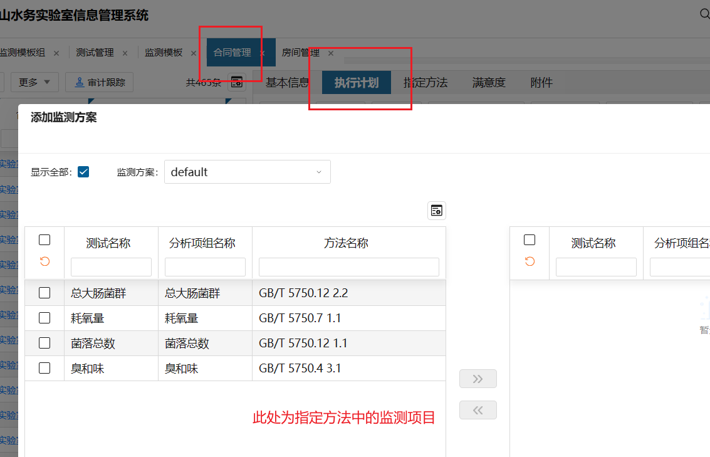

# 广西一体化

**项目方法**

| 查询区域               | 实际查询对象 | 查询条件                                   |
| ---------------------- | ------------ | ------------------------------------------ |
| 监测能力库编辑（添加） | 项目方法     | 不存在已添加的监测能力<br />项目方法已启用 |

**监测方案**

| 查询区域                       | 实际查询对象 | 查询条件                                                     |
| ------------------------------ | ------------ | ------------------------------------------------------------ |
| 监测计划编制<br />（修改测试） |              | 样品类型对应<br />监测方案名称对应<br />本中心<br />分析项已启用 |

**监测能力**

| 查询区域                                    | 实际查询对象             | 查询条件                                                     |
| ------------------------------------------- | ------------------------ | ------------------------------------------------------------ |
| 监测模板<br />（添加监测方案的选择框）      | 参数（T_EMC_TEST_PARAM） | 样品类型对应<br />监测方案名称对应<br />在默认方案里的项目方法<br />本中心<br />存在分析项 |
| 监测模板<br />（点击default默认方案的添加） | 参数（T_EMC_TEST_PARAM） | 样品类型对应<br />监测方案名称对应<br />不在默认方案里的项目方法<br />本中心<br />方法的监测类别对应<br />存在分析项 |


**任务**

| 查询区域         | 查询条件                                                     |
| ---------------- | ------------------------------------------------------------ |
| 采样准备         | status为auditFinished<br />该项目没被取消<br />存在点位（工作流已完成，status为draw）和样品（普通或现场qc）<br />点位的采样人或负责人为当前用户<br />存在当前用户的采样单（工作流为编制且不是从报告退回）或者存在（样品还没添加采样单）<br /> |
| 数据录入         | status为auditFinished<br />本中心<br />存在点位和现场样品<br />存在本用户创建、工作流为编辑、非报告退回的采样单 或 存在已安排的点位，其中现场样品还未添加至采样单 |
| 现场采样（退回） | status为auditFinished<br />工作流已完成 未终止<br />本中心<br />存在点位和现场样品且点位已完成、点位的采样人为当前用户<br />存在本用户创建、工作流为编辑、报告退回（采样单status为reportUndo）的采样单 |
|                  |                                                              |

**点位**

| 查询区域     | 查询条件                                                     |
| ------------ | ------------------------------------------------------------ |
| 采样准备     | 任务对应点位<br />点位的任务没被取消<br />点位状态status为draw<br />工作流已完成 未终止<br />点位下存在未被添加采样单的现场样品<br />当前用户为点位的采样人或现场负责人 |
| 检测项目修改 | 该项目没被取消<br />本中心点位<br />去除实验室质控样的点位<br />存在点位下的因子状态为logged、且为分析因子 |

**采样单**

| 查询区域         | 查询条件                      |
| ---------------- | ----------------------------- |
| 采样准备         |                               |
| 数据录入         |                               |
| 现场采样（退回） |                               |
| 样品接收         | 本中心<br />status为preLogged |

**样品集**

| 查询区域 | 查询条件                                                 |
| -------- | -------------------------------------------------------- |
| 采样准备 | 某个点位下<br />存在样品容器的sampleid存在一个为空就显示 |

**因子**

| 查询区域              | 查询条件                                                     |
| --------------------- | ------------------------------------------------------------ |
| 分析任务指派          | 任务未终止<br />因子类型analysisType为：分析 analysis<br />因子状态status为：logged<br />本中心因子或该用户拥有因子对应项目方法的科室权限 |
| 分析录入-固体废物浸出 | 任务未终止<br />因子状态status为：logged<br />样品类型orderCategory为固废浸出液或固体废物<br />因子类型analysisType为：分析 analysis<br />未添加进固废浸出记录<br />录入人为当前用户（若勾选显示全部则无此条件） |
| 固体样品制备          | ( QCCATEGORYCODE= 'N/A' )<br/>	AND ( SOLIDFLAG <> '1' )<br/>	AND ( STATUS= 'logged' )<br/>	AND ( ORGID= '101014' )<br/>	AND ( ANALYSISTYPE = 'analysis' )<br/>	AND T.ORDERCONTAINERNO = 'NNT230800946'<br/>	AND T.MONITORCATEGORY IN (3, 4, 6) |

**报告**

| 查询区域 | 查询条件                                                     |
| -------- | ------------------------------------------------------------ |
| 报告编制 | 工作流编制状态 draft<br />status为reportEdit<br />本中心<br />没有报告项reportItemId<br />编辑人editor是当前用户<br />若没有编辑人editor则项目负责人projectLeader能看到 |

**报告项**

| 查询区域 | 查询条件                               |
| -------- | -------------------------------------- |
| 报告编制 | 工作流编辑状态<br />创建人<br />本中心 |

**分析计算**

* 修改分析项公式，postUpdate会通过insertFormulaRequired解析公式内容，找到其他关联分析项，并插入t_core_formula_reruired表中。样品触发计算时，通过setupFormulaRequiredList除了找到已选的分析项还会找关联的分析项加入计算中。

* 如果计算前结果已经是 “/” 例如 样品体积=“/” 那么不管计算结果是多少 都不会变 样品体积=“/”
  
* 
  
* ```
  正常样品如果有实验室平行，先跟实验室平行求均值   (总和/总个数)   得到 A
  密码平行如果有实验室平行，先把密码平行和对应的实验室平行算均值   (总和/总个数)
  所有密码平行算均值   (总和/总个数)  得到B
  现场平行如果有实验室平行，先把现场平行和对应的实验室平行算均值  (总和/总个数)
  所有现场平行算均值   (总和/总个数)  得到C
  
  最终均值  A 或者 (A+B)/2   或者 (A+C)/2 或者(A+B+C)/ 3  
  ```

**生成数据**

| 计算内容         | 触发条件                   | 计算方式 |
| ---------------- | -------------------------- | -------- |
| 现场平行计算均值 | 维护【是否计算质控公式】=4 |          |
| 日均值           |                            |          |



**报告号生成**

```mysql
SELECT REPORTNO , KEYX , KEYA , KEYB , KEYC  , teri.* FROM t_emc_report_item teri WHERE KEYX = '梧' AND KEYA = 0 AND KEYB = '2023' ORDER BY CAST(KEYC  AS SIGNED);
SELECT REPORTNO , KEYX , KEYA , KEYB , KEYC  , teri.* FROM t_emc_report_item teri WHERE KEYX = '梧' AND KEYA = 1 AND KEYB = '2023' ORDER BY CAST(KEYC  AS SIGNED);
```

**指标结果**

rn2、rn3、rn4:  斜率、截距、相关系数

rn

# 秋毫检测

分析审核提交

```
// 查询任务下所有分析批的ordertask   筛选 用户具有因子分析科室的权限、分析类型为分析、样品非终止
// 修改样品测试的状态置为done 并插入样品测试操作记录
// 由于是查询批次下的因子 所以涵盖了实验室平行的因子（实验室平行无任务关联）


```

# 昆山水务

* 样品类型 和 监测项目  在【合同管理】中 【指定方法】中维护 

T_EMC_MONITOR_TMPL -> T_EMC_MONITOR_ITEM

添加监测方案：

```
( `DEFAULTFLAG` = '1' )// 测试方法是否默认方法  （若查看全部则无此限制 ）
	AND ( `ISDEFAULT` = '1' ) // 该方案是否默认方法
	AND ( `ACTIVATEDFLAG` = '1' ) // 该方案是否启用
	AND ( `ISENABLE` = '1' ) // 分析项组是否启用
	AND ( `MONITORTMPLID` = 'xxx' ) //监测模板（样品类型）
AND ( `SCHEMENAME` = 'xxx' ) // 方案名称 
```





* 【合同管理】【执行计划】从【指定方法】中选取监测项目



# 通用

对于一个样品结果而言

```
存在以下层级，一般依照此层级进行排序
ORDERNO样品集
ORDERCAONTAINERNO样品
TESTNAME测试
PARAMNO参数
ITEMORDERNO分析项
REPEATNO重复次数
```
