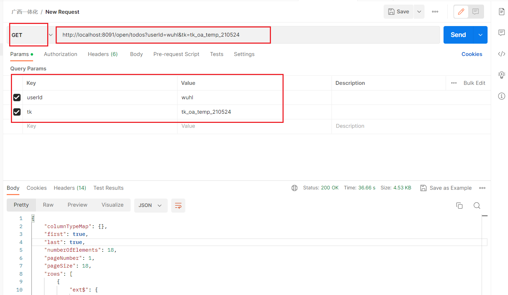

## 用户待办API

**业务功能**

获取LIMS系统用户待办列表

**请求url**

http://ip:port/open/todos

请求方式：GET

**请求参数列表**

| 字段名               | 变量名         | 必填           | 类型   | 说明                                                         |
| -------------------- | -------------- | -------------- | ------ | ------------------------------------------------------------ |
| 系统用户编号或手机号 | userIdOrMobile | 是             | String | 用户编号优先级大于手机号                                     |
| OA令牌               | tk             | 是             | String | 目前可使用令牌：tk_oa_temp_210524                            |
| 类别                 | category       | 否             | String | 待办的类型如下：<br />业务待办——business<br />超期提醒——overdue<br />不传表示查询所有类型的待办 |
| 是否只查询项数       | countOnly      | 否，默认：true | String | 待办的数量                                                   |
| 是否只显示有效待办   | effectiveOnly  | 否，默认：true | String | 有效待办：待办数>0<br />无效待办：待办数=0                   |

**返回结果格式**

```json
{
    "columnTypeMap": {},
    "first": true,
    "last": true,
    "numberOfElements": 18,
    "pageNumber": 1,
    "pageSize": 18,
    "rows": [
        {
            "ext$": {
                "todoiconurl": "/static/icon/todo/010.png"
            },
            "href": "/secure/emc/module/bp/sample/samples/page/edit-list",
            "itemList": [],
            "menuId": "151002",
            "modelName": "现场采样",
            "qty": 1
        },
    ],
    "total": 18,
    "totalMap": {},
    "totalPages": 1
}
```

**示例**



**注意事项**

若待办事项过多，查询耗时会比较长

若待办涉及业务复杂，查询耗时会比较长

