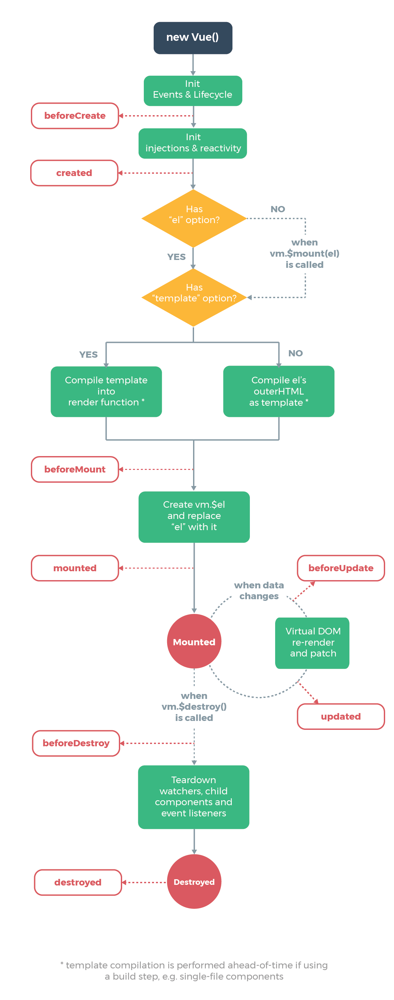

### vue 判断数组是否为空

```
array !==undefined && array.length > 0 
```

### 页面跳转时，传递参数中含有? = &等特殊字符

若传递参数中含有=,?,&等特殊字符 无法正常传递参数 则需要进行编码解码 

传递时使用

```
encodeURIComponent() 
```

接收时使用

```
decodeURIComponent()
```

### 箭头函数的this指向问题

this在运行时确定，即指向[函数调用](https://www.zhihu.com/search?q=函数调用&search_source=Entity&hybrid_search_source=Entity&hybrid_search_extra={"sourceType"%3A"answer"%2C"sourceId"%3A2182053072})对象，除非利用call、apply等方法改变this指向。

箭头函数的this指向于函数[作用域](https://www.zhihu.com/search?q=作用域&search_source=Entity&hybrid_search_source=Entity&hybrid_search_extra={"sourceType"%3A"answer"%2C"sourceId"%3A2182053072})所在的对象

```js
vat that = this;
uni.f({
	success: res=> {
		console.log(this);
	},
	fail: function (res) {
		console.log(that);
	}
});

//错误函数和成功函数打印结果一致
```

### 计时器

设置

```
//选择适合需求的定时器
this.timer = setTimeout( () => {
    // 这里添加您的逻辑		
}, 1000)
this.timer = setInterval( () => {
    // 同上			
}, 1000)
```

关闭

```

onUnload() {
	if(this.timer) {  
		clearTimeout(this.timer);  
		this.timer = null;  
	}  
}
```


## vue2语法 （粗略）

```vue
<view title="hhhh"></view>
<view v-bind:title="t1"></view>// 动态绑定标签属性
<view v-bind:title="t1 + ‘hh’"></view>// 动态绑定标签属性 

<input v-modal:value="title’"></input>// 双向动态绑定标签属性  title值改吧 value也改变
```

let和var定义对象 

```
let遇到xian
```

form表单特性

```vue
<template>
    <view>
        <form v-on:submit="submit">

            <view>
                <input type="text" name="username" ><input/>
    		</view>
            <button form-type="submit" type="primary" ></button>
        </form>
    </view>
</template>
<script>
	export default {
        data() 	{
            return {
                
            }
        },
        methods : {
            submit(e) {
                console.log(e.details.value.username)
            }
        }
    }
</script>
```

计算属性

```
<script>
	export default {
        data() 	{
            return {
                
            }
        },
        methods : {
          
        }
        computed : {
        	compute() {
        	
        	}
        }
    }
</script>
```

### 组件注册

在uni-app工程根目录下的 `components` 目录，创建并存放自定义组件：

```
│─components            	符合vue组件规范的uni-app组件目录
│  └─componentA         	符合‘components/组件名称/组件名称.vue’目录结构，easycom方式可直接使用组件
│  		└─componentA.vue    可复用的componentA组件
│  └─component-a.vue      可复用的component-a组件

```


* 全局注册

`uni-app` 支持配置全局组件，需在 `main.js` 里进行全局注册，注册后就可在所有页面里使用该组件。

```js
	import Vue from 'vue'
	import pageHead from './components/page-head.vue'
	Vue.component('page-head',pageHead)

```


* 局部注册

传统vue规范

```html
	<!-- 在index.vue引入 uni-badge 组件-->
	<template>
		<view>
			<uni-badge text="1"></uni-badge><!-- 3.使用组件 -->
		</view>
	</template>
	<script>
		import uniBadge from '@/components/uni-badge/uni-badge.vue';//1.导入组件（这步属于传统vue规范，但在uni-app的easycom下可以省略这步）
		export default {
			components:{uniBadge }//2.注册组件（这步属于传统vue规范，但在uni-app的easycom下可以省略这步） 
		}
	</script>

```

**通过uni-app的[easycom](https://uniapp.dcloud.io/collocation/pages?id=easycom)：** 将组件引入精简为一步。只要组件安装在项目的 `components` 目录下，并符合 `components/组件名称/组件名称.vue` 目录结构。就可以不用引用、注册，直接在页面中使用。


### 父向子属性传递props

`props` 可以是数组或对象，用于接收来自父组件的数据。`props` 可以是简单的数组，或者使用对象作为替代，对象允许配置高级选项，如类型检测、自定义验证和设置默认值。

```html
	<template>
		<view>
			<!-- 我是子组件componentA -->
			<view>{{age}}</view>
            <view>{{list}}</view>
            <view>{{Obj}}</view>
		</view>
	</template>
	<script>
		export default {
			props: {
				// 检测类型 + 其他验证
				age: {
					type: Number,
					default: 0,
					required: true,
					validator: function(value) {
						return value >= 0
					}
				},
                list : {
                    type : Array,
                    default() : {
                    	return []// 数组或者对象 使用方法返回
                	}
                }
        		Obj: {
            		type : Oject,
                    default() : {
                        return {name : "sds", age : "12"}
                    }
        		}
			}
		}
	</script>

```

### 子向父属性传递emit

```vue
	<template>
		<view>
			<!-- 我是子组件componentA -->
			<view>
                <input type="text" placeholder="请输入。。。" @input="oninput"
			</view>

		</view>
	</template>
	<script>
		export default {
			name : "test",
            data(){
                
            },
            methods : {
                oninput(e) {
                    console.log(e.detail.value)
                    this.$emit("mytext",“test”)
                }
            }
		}
	</script>

```

```vue
	<template>
		<view>
			<!-- 我是父组件componentB -->
		<test title="123",@mytext="onMyText" , @click.native=”onClick“></test>
		<!-- 原生事件绑定函数-->

		</view>
	</template>
	<script>
		export default {
			name : "test",
            data(){
                
            },
            methods : {
                onMyText(e) {
                    console.log(e)
                }
            }
		}
	</script>
```

```
//结果
打印了一次次文本框输入
打印了一次“test"
```

> 子组件不允许修改父组件传过来的值， 因为该值为响应式数据
>
> 只能通过emit将值传给父组件，再传进子组件 来实现

### sync修饰符和update修饰符

简化子组件传递父组件的过程

```vue
<!-- 父组件 -->
	<template>
		<view>
			<syncA :title.sync="title"></syncA>
            <!--省略一个更新事件 update:title="onUpdateTitle"-->
		</view>
	</template>
	<script>
		export default {
			data() {
				return {
					title:"hello vue.js"
				}
			}
            methods : {
            	   <!--省略一个更新事件 -->
            	<!--onUpdateTitle(e) {-->
                <!--    this.title = e;-->
                <!--}-->
           
            }
          
            
		}
	</script>
```

```vue
<!-- 子组件 -->
	<template>
		<view>
			<view @click="changeTitle">{{title}}</view>
		</view>
	</template>
	<script>
		export default {
			props: {
				title: {
					default: "hello"
				},
			},
			methods:{
				changeTitle(){
                    <!--触发一个更新事件  必须带上修饰符-->
					this.$emit('update:title',"uni-app")
				}
			}
		}
	</script>
```

### css样式只在当前生效

```
在使用Vue-Cli 开发时，我们都知道，在组件的<style></style>加上 scoped属性，可以让<style></style>里的样式只在当前组件生效。
```

### 异步改为同步方法 以表单校验为例

```js
// async表示为异步方法
async validateForm()	 {
				var validateFlag = true
                // await表示 后面接Promise对象
				await this.$refs.personInfo.validate().then(res=>{
					console.log('表单数据信息：', res);
				}).catch(err =>{
					console.log('表单错误信息：', err);
					validateFlag = false
				})
				await this.$refs.companyInfo.validate().then(res=>{
					console.log('表单数据信息：', res);
				}).catch(err =>{
					console.log('表单错误信息：', err);
					validateFlag = false
				})

				return validateFlag;

			},
                
                // 提交时得到验证结果
                submit :function(e){
                    this.validateForm().then(res=> {
                        console.log('validateForm：', res);
                    })
                }
```

### promise

Promise 是一个构造函数，new Promise() 可以得到一个 Promise 实例对象，它是一个异步操作，可以用来执行一些异步操作（异步操作不能直接 return 接收执行结果，只能通过回调来接收）

```js
const fs = require('fs')

function getFile(file_path) {
    var promise = new Promise(function (resolve, reject) {
        fs.readFile(file_path, 'utf-8', (err, resp) => {
            if (err) return reject(err)     // 失败的回调
            
            // 成功的回调
            resolve(resp)
        })
    })

    return promise
}

var p = getFile('./files/1.txt')

// 预先指定回调
p.then(function(resp) {
    // 执行成功
    console.log('执行成功：', resp)
}, function(err) {
    // 执行失败
    console.log('执行失败：', err)
})
```

### Vue不能检测通过数组索引直接修改一个数组项

原因：由于JavaScript的限制，Vue不能检测数组和对象的变化

解决办法：

```haxe
this.$set(arr,index,newVal)
```

## uniapp API

### 生命周期



### 页面生命周期

| 函数名            | 说明                                                         | 平台差异说明 | 最低版本 |
| :---------------- | :----------------------------------------------------------- | :----------- | :------- |
| onInit            | 监听页面初始化，其参数同 onLoad 参数，为上个页面传递的数据，参数类型为 Object（用于页面传参），触发时机早于 onLoad | 百度小程序   | 3.1.0+   |
| onPullDownRefresh | 监听用户下拉动作，一般用于下拉刷新，参考[示例](https://uniapp.dcloud.net.cn/api/ui/pulldown) |              |          |
| onReachBottom     | 页面滚动到底部的事件（不是scroll-view滚到底），常用于下拉下一页数据。具体见下方注意事项 |              |          |

### 页面跳转及参数

```
//在起始页面跳转到test.vue页面并传递参数
uni.navigateTo({
	url: 'test?id=1&name=uniapp'
});
```

```javascript
// 在test.vue页面接受参数
export default {
	onLoad: function (option) { //option为object类型，会序列化上个页面传递的参数
		console.log(option.id); //打印出上个页面传递的参数。
		console.log(option.name); //打印出上个页面传递的参数。
		console.log(getCurrentPage())//获取当前页面栈
	}
    	
    <!--小程序不支持-->
    onMounted() {
		console.log(this.$routh.query.name); //打印出上个页面传递的参数。
    }
}
```

### 交互反馈

```js
uni.showToast({
	title: '标题',
	duration: 2000,
    mask : true, //防止触摸穿透
});

```

```js
uni.showLoading({
	title: '加载中'
});
//显示 loading 提示框, 需主动调用 uni.hideLoading 才能关闭提示框。
```

```js
uni.showModal({
	title: '提示',
	content: '这是一个模态弹窗',
	success: function (res) {
		if (res.confirm) {
			console.log('用户点击确定');
		} else if (res.cancel) {
			console.log('用户点击取消');
		}	
	}
});

```

```js
uni.showActionSheet({
	itemList: ['A', 'B', 'C'],
	success: function (res) {
		console.log('选中了第' + (res.tapIndex + 1) + '个按钮');
	},
	fail: function (res) {
		console.log(res.errMsg);
	}
});
//从底部向上弹出操作菜单
```

### tabbar 设置iconfont字体图标

iconfont优先于iconpath

```vue
// pages.json
{
  "tabBar": {
    "iconfontSrc":"static/iconfont.ttf",
    "list": [
      {
        "pagePath": "pages/index/index",
        "text": "Tab1",
        "iconfont": {
          "text": "\ue102",
          "selectedText": "\ue103",
          "fontSize": "17px",
          "color": "#000000",
          "selectedColor": "#0000ff"
        }
      }
    ]
  }
}

```

### 网络请求

```js
uni.request({
    url: `https://www.example.com/request$/{1}`, //仅为示例，并非真实接口地址。 可动态拼接
    data: {
        text: 'uni.request' // 自动拼接参数
    },
    header: {
        'custom-header': 'hello' //自定义请求头信息
    },
    success: (res) => {
        console.log(res.data);
        this.text = 'request success';
    },
    fail: (res) => {

        this.text = 'request fail';
    },
    complete: (res) => {

        this.text = 'request complete';
    }
});

```

### 数据缓存

```js
uni.setStorage({
	key: 'storage_key',
	data: 'hello',
	success: function () {
		console.log('success');
	}
});

```

```js
uni.getStorage({
	key: 'storage_key',
	success: function (res) {
		console.log(res.data);
	}
});

```

通常使用同步方法 getXxxSync setXxxSync

## CSS语法粗略

* position

```
static 即没有定位
fixed 元素的位置相对于浏览器窗口是固定位置。
relative 相对其正常位置
absolute 相对于最近的已定位父元素
```


* padding

一个元素的内边距区域指的是其内容与其边框之间的空间     参数顺序：上右下左

* margin

margin 属性为给定元素设置所有四个（上下左右）方向的外边距属性。也就是 `margin-top`，`margin-right`，`margin-bottom`，和 `margin-left` 四个外边距属性设置的简写。

* white-space

处理元素中的空白 

nowrap 和 normal 一样，连续的空白符会被合并。但文本内的换行无效

* display: -webkit-box;

```css
	display: -webkit-box; /*弹性伸缩盒子模型显示*/
	overflow: hidden;
	-webkit-box-orient: vertical; /*排列方式*/ 
	-webkit-line-clamp: 2; /*显示文本行数(这里控制多少行隐藏)*/
```

* align-items

```
align-items 属性将所有直接子节点上的 align-self 值设置为一个组
Flexbox 和 CSS 网格布局支持此属性
```

* 文本溢出

```css
// 整体效果为   "Is there any tea on t....."
overflow: hidden  ;//元素溢出时所需的行为 此处为隐藏
white-space: nowrap;//设置如何处理元素中的空白   此处为换行无效,可制文本在一行内显示
text-overflow: ellipsis;//  “溢出”事件的发生后行为，前提为上面两个属性   ci'chu显示省略号
 word-break: break-all;//怎样在单词内断行。 此处为整个单词断行
```

* 文本居中

```css
// 垂直居中
height : 10px;
line-height ： 10px ; 
//水平居中
text-align: center
```


## 微信小程序

获取微信公众号二维码 接口 参数为微信号

https://open.weixin.qq.com/qr/code?username=
