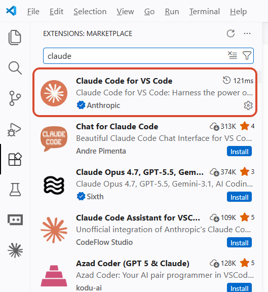
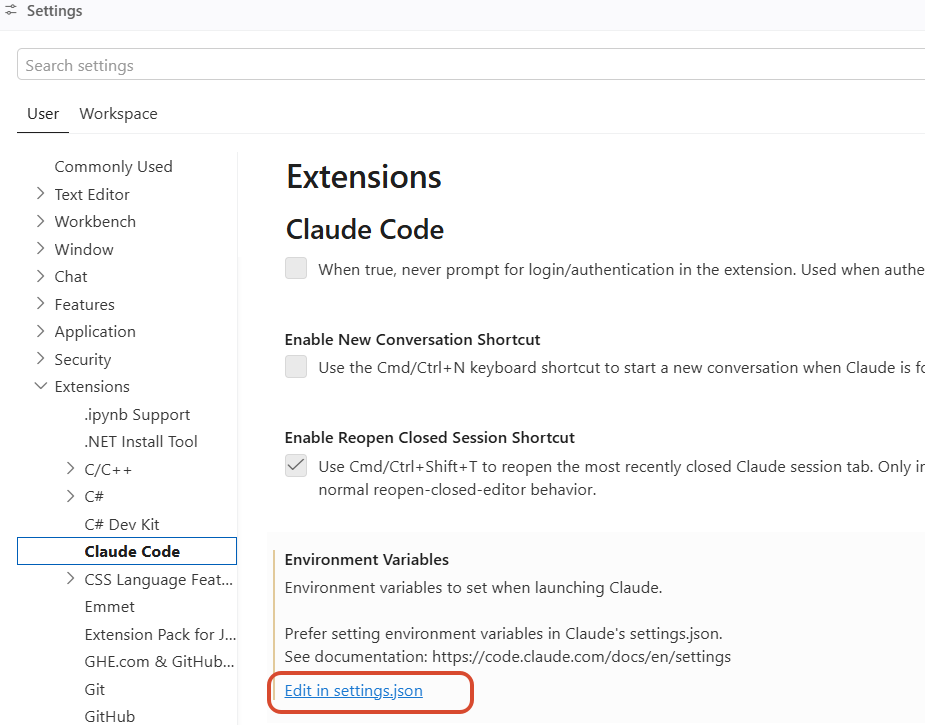
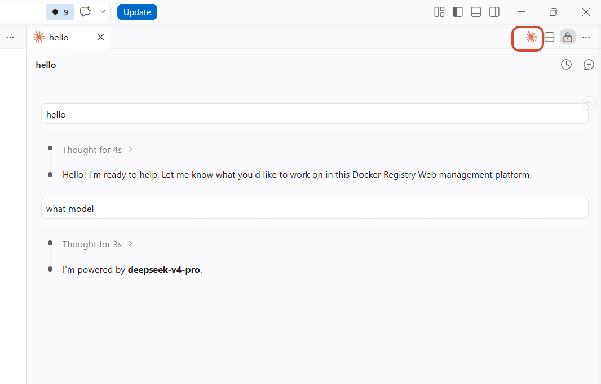

# Claude Code 接入 IDE

让Claude Code 接入 IDE，可以获得类似于 cursor 一般的体验。

安装claude插件



配置claude插件，可配置模型接入的 URL 和 Token等信息



进入 vscode 的 settings.json

```
{
    "claudeCode.environmentVariables": [
        {
            "name": "ANTHROPIC_BASE_URL",
            "value": "你的API URL"
        },
        {
            "name": "ANTHROPIC_AUTH_TOKEN",
            "value": "你的API Token"
        },
        {
            "name": "ANTHROPIC_MODEL",
            "value": "选择模型"
        },
        {
            "name": "CLAUDE_CODE_EFFORT_LEVEL",
            "value": "模型思考深度 low medium max"
        }
    ]
}
```

使用模型

