安利一个功能强大的开源跨平台终端应用程序——Tabby。	

## Tabby 介绍

Tabby 是一款无限可定制的跨平台终端应用程序，支持 Windows、Linux 和 macOS 操作系统。无论你是想进行本地 shell 操作、串行连接、SSH 还是 Telnet，Tabby 都能轻松搞定。它兼容 PowerShell、WSL、Git-Bash、Cygwin、MSYS2、Cmder 和 CMD 等多种终端。

## 核心功能&特性

- 支持 Windows, Mac 和 Linux 操作系统
- 识别本地多种内置 Shell，如 CMD、PowerShell、Git Bash
- 支持 SSH 连接、Telnet 会话、串口连接和套接字连接等
- 通过不同插件扩展功能
- 支持分屏操作，方便多任务处理。
- 具有现代化的 UI 界面，支持自定义配色和主题切换

## 实用功能

### 设置字体

默认字体：

windows 环境推荐字体：Cascadia Code

个人习惯大点粗点的字号看得清楚

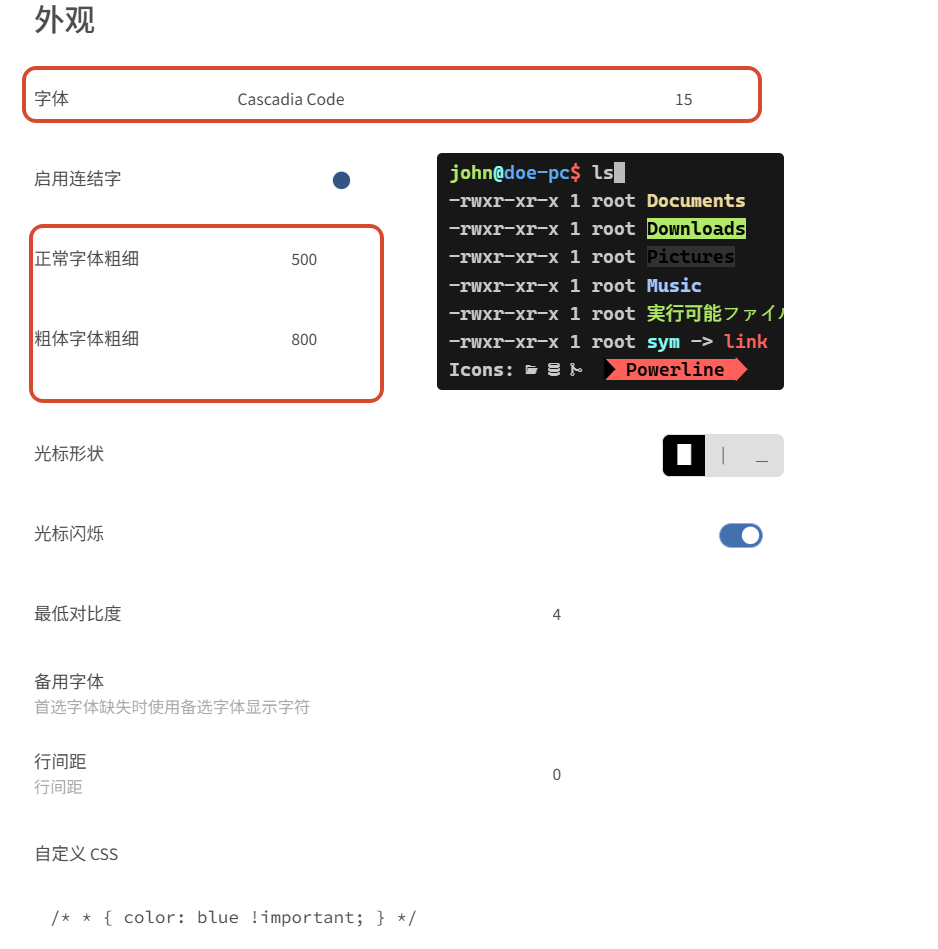

### 设置默认会话

建议 Windows 用户设置 CMD 或 PowerShell 为默认会话，毕竟平常一些小命令还是要在本地上执行，也就能真正抛弃原生的命令提示符了。

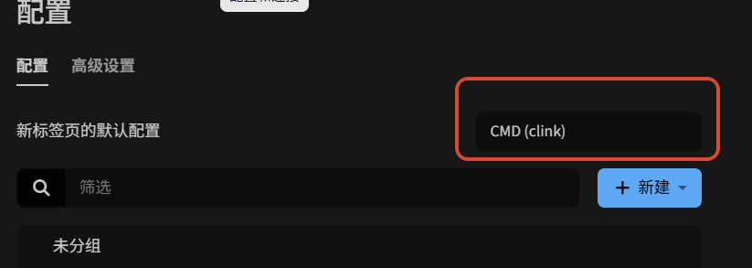

### 开启右键菜单

可以从文件夹中右键打开 Tabby 终端

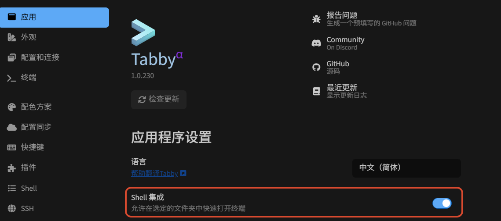

### 分组管理 

通过分组有利于区分连接类型，是远程服务器还是本地 Shell，是云服务器还是你局域网的 NAS。

分组还可以为分组内连接设置统一得配置信息

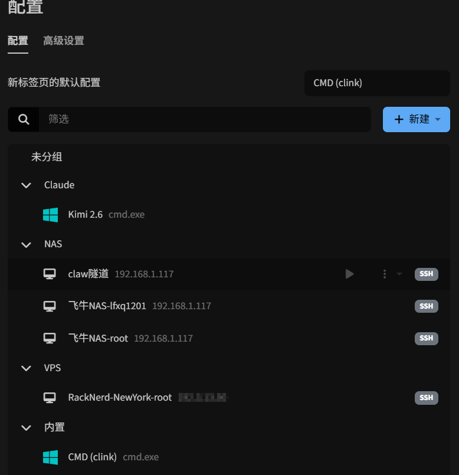

### 环境变量隔离 

平常使用某些软件需要配置环境变量，有些适合放在全局中配置，而例如配置代理环境、配置 Claude 的模型和认证方式等

示例，为 Claude Code 配置两套模型环境：

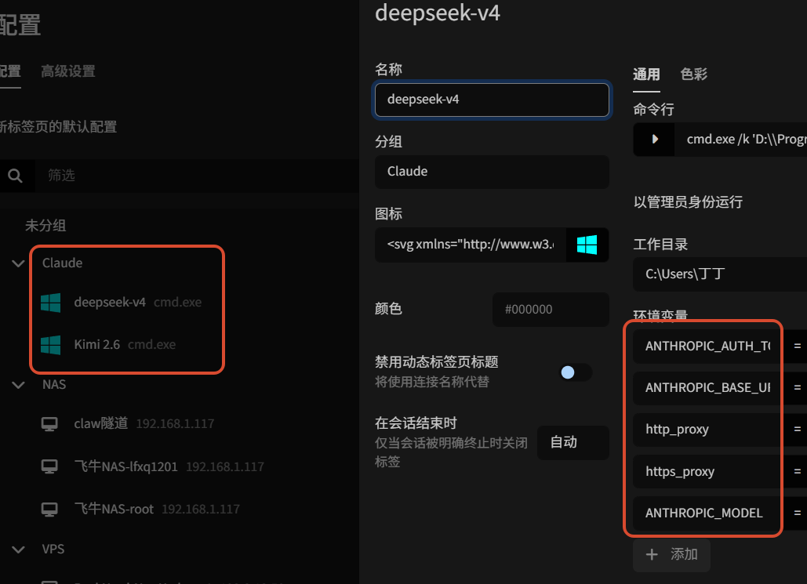

效果如下，不同会话窗口的 Claude 使用不同的模型

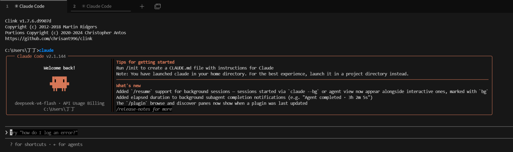

### SFTP&开启 WinSCP

Tabby 中的 SSH 会话可以很方便的开启 SFTP 进行文件传输

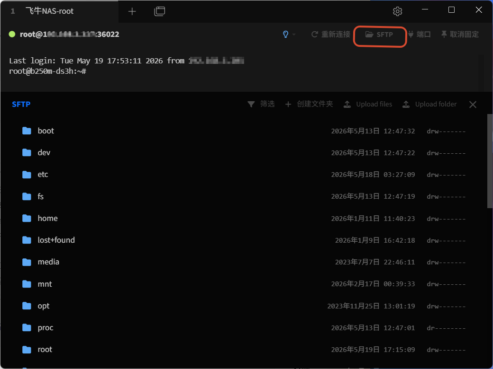

同时可以识别启动电脑上的 WinSCP， 并一键连接会话

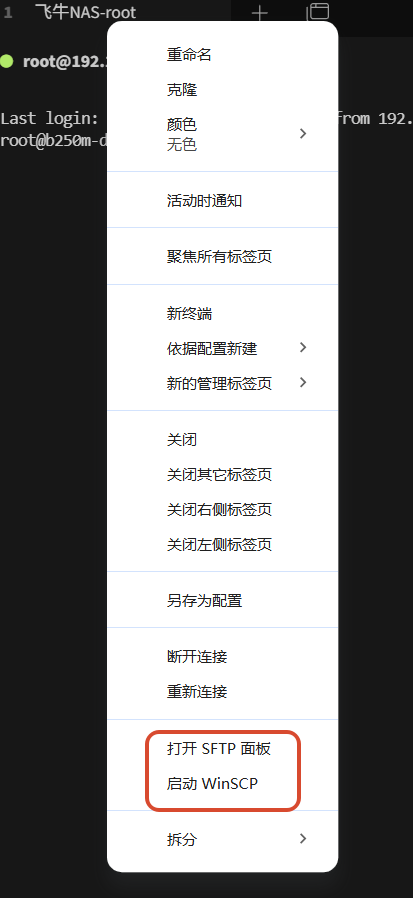

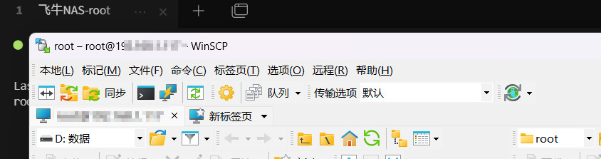

### SSH 端口转发

最近遇到的一个例子就是，OpenClaw 的网关默认是监听回环地址的端口，但是我为了安全性和隔离，将其部署在 NAS 机器的 Docker 容器中，当我需要在日程电脑上访问网关就需要开启 SSH 端口转发，通过 `127.0.0.1:18789` 来访问 OpenClaw 网关。

如下配置使得，我们保持会话开启，无需输入命令和密码即可完成端口转发，代替原先的 `SSH -p 22-N -L 127.0.0.1:18789:127.0.0.1:18789 用户名@远程服务器IP`

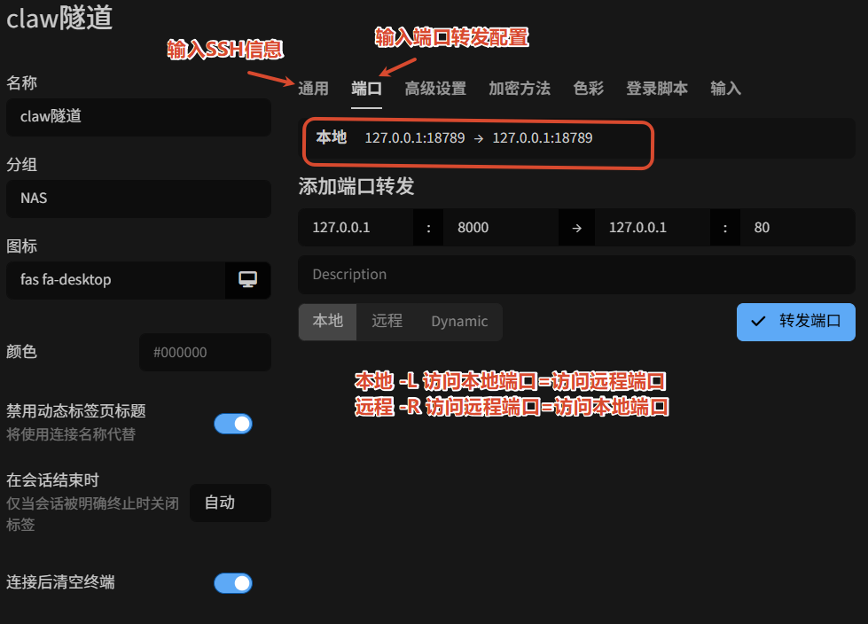

或者在会话中添加

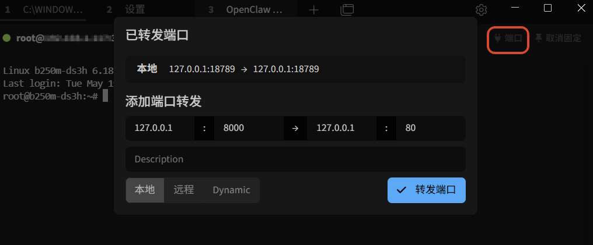

## 插件扩展

[Tabby Background Plugin](https://github.com/moemoechu/tabby-background)：设置背景图

[Highlight Plugin](https://github.com/moemoechu/tabby-highlight)：高亮错误、警告等信息

[sync-config plugin](https://github.com/starxg/terminus-sync-config#readme)：保持配置到 git仓库 的 Gist (小型代码托管）中

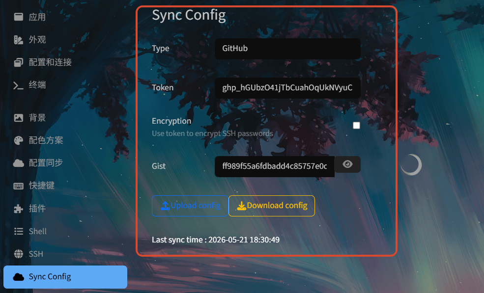

## 总结

日常学习工作中，我已经习惯了这款开源终端软件，帮助我管理各种服务器、执行系统命令、完成编程开发等。

