# 飞牛系统 EXT4 簇大小与空间浪费问题，通过修改文件系统格式临时解决

## 原因

> 在平日工作学习时，经常使用飞牛同步来双向同步我的工作区，这样当我换了设备也只需要同步即可获取一模一样的工作区文件夹，有利于异地办公。

为了不影响我的希捷存储盘的休眠状态，这些文件通常都是放在 128GB 固态盘的存储空间中，可以说是十分紧凑了，但我认为工作文件哪有多少，只要注意清理就不会占满的。然而最近使用时发现，同步时出现了很多错误，才知道我给用户分配的 10 GB 空间已经被占满了。


当我一次又一次的从 5G 到 10G 到 15G 为用户扩大空间，却发现它的胃口倒是越来越大，而我的工作区大小才不到 4GB。

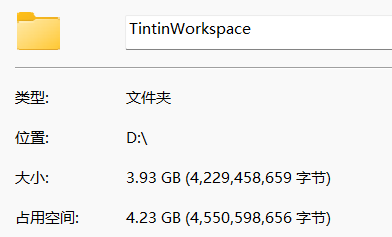

原来，工作区里面包含很多构建过的代码项目，因此存在巨量的小文件，每一个小文件都会占用一个基本单位的磁盘空间，导致占用空间与实际大小差别很大。

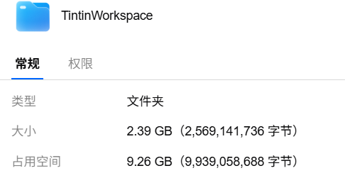

## 磁盘存储概念 

> 在想解决办法之前，我是想搞清楚到底多大的单位，才导致实际大小和占用空间产生这么大的差异。

- **扇区**：磁盘最小的物理存储单元，是磁头从磁盘中读取数据的最小单位（一般 512B），即磁头每次从磁盘中读取数据，都是一个扇区一个扇区读的。
- **块/簇**：由于操作系统无法对数目众多的扇区进行寻址，所以操作系统就将相邻的扇区组合在一起形成一个块/簇，然后再对块/簇进行管理（每个块/簇可以包括 2、4、8、16、 32 或 64 个扇区）。在 Windows 下，FAT，FAT32 和 NTFS 文件系统中叫做簇（cluster）；在 Linux 下如 Ext4 等文件系统中叫做块（block）。
-  简单来说，扇区是对物理层的硬盘而言，块和簇是对逻辑层的文件系统而言。

首先我的应用空间是使用了 ext4 格式的文件系统，当我把同样的文件夹放到 btrfs 格式的分区里，它的占用空间就没那么大了

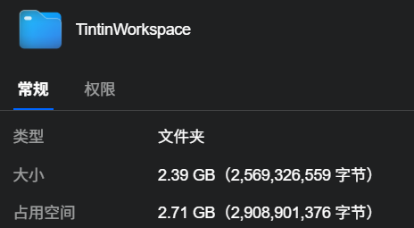

实际上两种格式的默认块大小都是 4KB，于是我接着测试它真实的块大小（实际上只需要创建一个小文本文件看看占用空间即可）

确认目录挂载的设备：

```bash
df -hT [目录路径]
```

查看真实的块大小

```bash
tune2fs -l [设备名] | grep -E "Block size"
```

首先我查看了固态里的系统分区的块大小是 4KB，这使得我的系统分区分配 25GB 还是绰绰有余的。

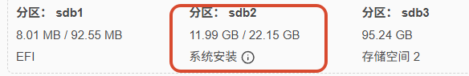

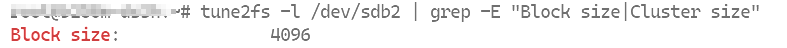

再去查看我的存储分区的块大小，发现多出了一个 Cluster size 是 64KB，每个小文件将会占用 64 KB 的簇大小，也难怪我的工作区文件夹会如此侵占空间。

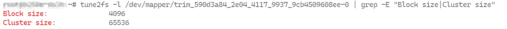

经过询问 AI 后得知，这种格式化方式是因为启用了 ext4 的 **bigalloc** 特性 (EXT4_FEATURE_RO_COMPAT_BIGALLOC) 将 ext4 更改为使用集群分配，使得 ext4 块分配位图中的每个位都寻址 2 的幂次个块，将多个连续块（如 16 个）绑定为一个簇（64 KB），尤其适用于 TB 级以上、以大文件为主的场景。


也就是说，绝大多数 Linux 发行版在格式化系统分区（如 `/`、`/boot`）是不会不会启用 bigalloc 特性的，而飞牛作为一个 NAS 系统，默认用户创建存储空间时是为了存储大文件（如影视、音乐、文档）等，如果选择了 ext4 格式，默认是以 64KB 的簇大小格式化分区的。

## 解决方法

> 我的打算是直接将固态盘的存储分区改为 Btrfs 格式，因为它也是 4KB 的块大小，而且不会有 bigalloc 特性。

查阅了论坛关于文件格式的帖子 [^1][^2] 以后，发现 btrfs 的稳定性不是很适合我这台东拼西凑的小机器，但目前也只能死马当活马医了，只要做好备份就没问题。

而且明白了 bigalloc 特性是否开启或者簇大小应该由用户创建存储空间进行决定，而不是作为默认选项，尤其是遇到固态盘的不同使用场景，例如 1TB 的固态可以分为应用盘（适合 4KB 块大小）、下载盘（适合 64KB 簇大小）。希望飞牛官方尽快提供解决方案——最好的方法就是针对 ext4 的格式化方式给用户提供更多选项，毕竟选用 ext4 文件系统才是符合大部分用户的稳定性需求的。

如今，我才发现我本该为应用空间格式化 btrfs，为主存储空间格式化 ext4，而目前是完全反了。

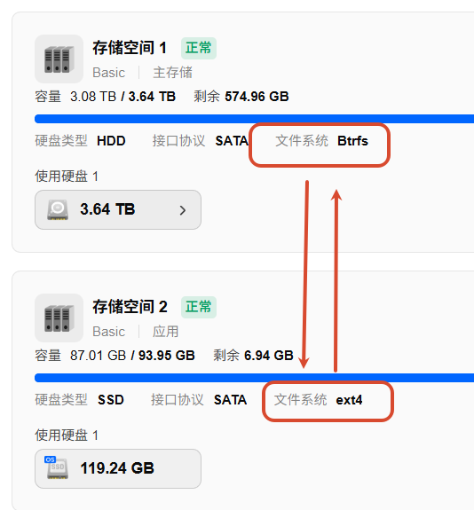

把主存盘的文件系统格式改成 ext4 这是一项大工程，因为我只有一个盘，因此只能等我以后升级设备时再去解决。以下是将我的应用空间文件系统格式改成 Btrfs 的流程：

- 备份应用盘的所有数据（包括个人文件和 Docker 配置等）

  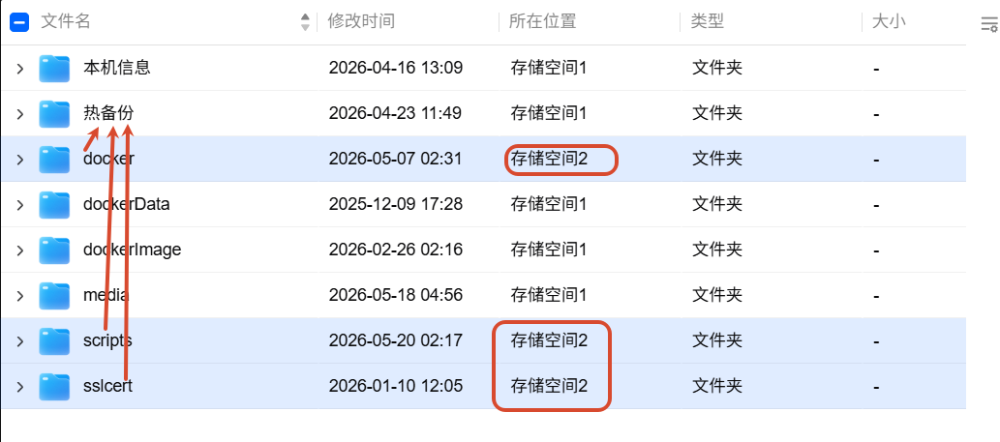

  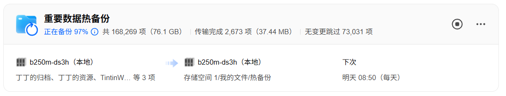

- 备份虚拟机

  

- 关闭 docker、卸载所有飞牛应用

  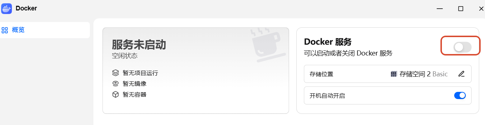

  

- 删除并格式化应用盘，然后将原先的 docker、个人数据、应用还原，完成。

  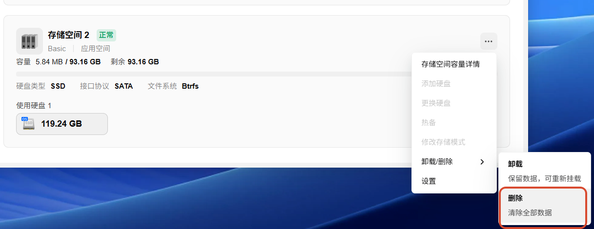

  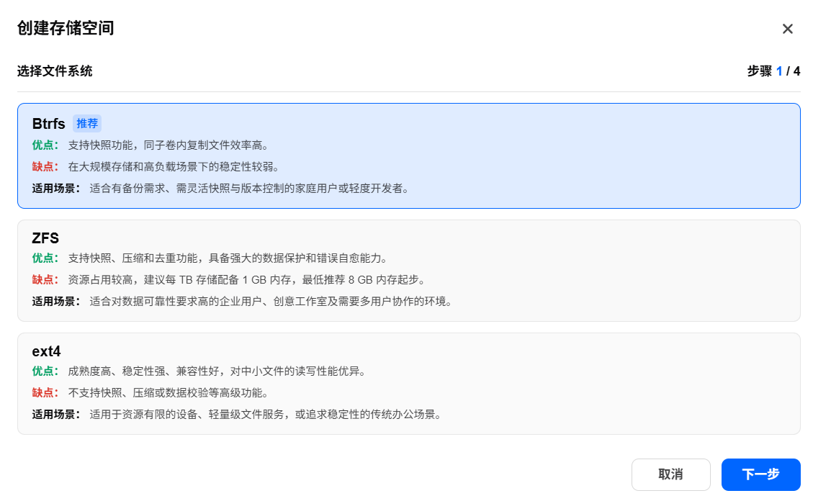

最终效果：在还原了大部分的数据、容器和应用以后，我的固态盘仿佛重获新生。由于我少用了几个容器以及运行时间不长，原先几乎占满 80GB，现在预计只需要占用 50GB 即可。

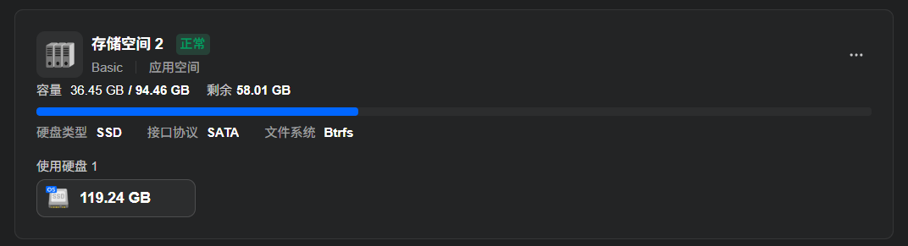

- [^1]: [存储空间由 btrfs 更换成 ext4，世界一下安静了！ - 建议反馈 飞牛私有云论坛 fnOS](https://club.fnnas.com/forum.php?mod=viewthread&tid=63711&highlight=)
- [^2]: [关于存储空间 ext4 格式的簇大小 - 建议反馈 飞牛私有云论坛 fnOS](https://club.fnnas.com/forum.php?mod=viewthread&tid=28494&highlight=)
- [^3]: [SSD(固态硬盘)和HDD（机械硬盘）哪个更适合用btrfs – 心得体会](https://www.dnote.cn/posts/4028)
