[TOC]


# 1 Docker简介

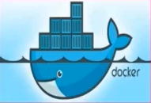

## 1.1 Docker为什么出现

其他开发人员身处的环境配置也各有不同。您正在开发的应用依赖于您当前的配置且还要依赖于某些配置文件。此外，您的企业还拥有标准化的测试和生产环境，且具有自身的配置和一系列支持文件。您希望尽可能多在本地模拟这些环境而不产生重新创建服务器环境的开销。请问？您要如何确保应用能够在这些环境中运行和通过质量检测？并且在部署过程中不出现令人头疼的版本、配置问题，也无需重新编写代码和进行故障修复？

答案就是使用容器。Docker之所以发展如此迅速，也是因为它对此给出了一个标准化的解决方案-----**系统平滑移植，容器虚拟化技术**。

环境配置相当麻烦，换一台机器，就要重来一次，费力费时。很多人想到，能不能从根本上解决问题，**软件可以带环境安装**？也就是说，安装的时候，把原始环境一模一样地复制过来。开发人员利用 Docker 可以消除协作编码时“在我的机器上可正常工作”的问题。

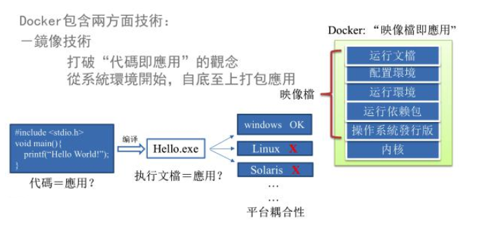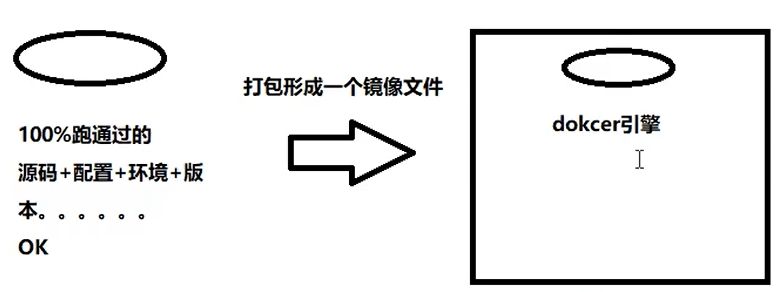

之前在服务器配置一个应用的运行环境，要安装各种软件，就拿尚硅谷电商项目的环境来说，Java/RabbitMQ/MySQL/JDBC驱动包等。安装和配置这些东西有多麻烦就不说了，它还不能跨平台。假如我们是在 Windows 上安装的这些环境，到了 Linux 又得重新装。况且就算不跨操作系统，换另一台同样操作系统的服务器，要移植应用也是非常麻烦的。

传统上认为，软件编码开发/测试结束后，所产出的成果即是程序或是能够编译执行的二进制字节码等(java为例)。而为了让这些程序可以顺利执行，开发团队也得准备完整的部署文件，让维运团队得以部署应用程式，开发需要清楚的告诉运维部署团队，用的全部配置文件+所有软件环境。不过，即便如此，仍然常常发生部署失败的状况。**Docker的出现使得Docker得以打破过去「程序即应用」的观念。透过镜像(images)将作业系统核心除外，运作应用程式所需要的系统环境，由下而上打包，达到应用程式跨平台间的无缝接轨运作。**

## 1.2 Docker理念

Docker是基于**Go语言**实现的云开源项目。
Docker的主要目标是“Build，Ship and Run Any App,Anywhere”，也就是通过对应用组件的封装、分发、部署、运行等生命周期的管理，使用户的APP（可以是一个WEB应用或数据库应用等等）及其运行环境能够做到**“一次镜像，处处运行”**。

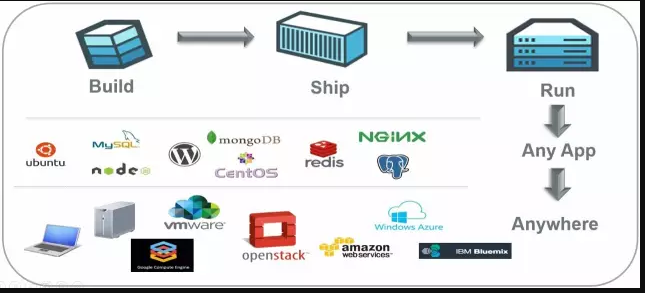

Linux容器技术的出现就解决了这样一个问题，而 Docker 就是在它的基础上发展过来的。将应用打成镜像，通过镜像成为运行在Docker容器上面的实例，而 Docker容器在任何操作系统上都是一致的，这就实现了跨平台、跨服务器。**只需要一次配置好环境，换到别的机子上就可以一键部署好，大大简化了操作。**

 **总结**

解决了运行环境和配置问题的软件容器，
方便做持续集成并有助于整体发布的**容器虚拟化技术**。

## 1.3 容器与虚拟机比较

### 1.3.1 容器发展史

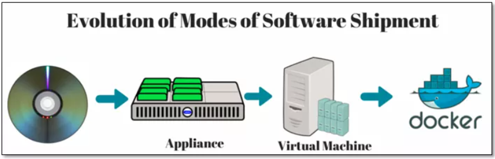

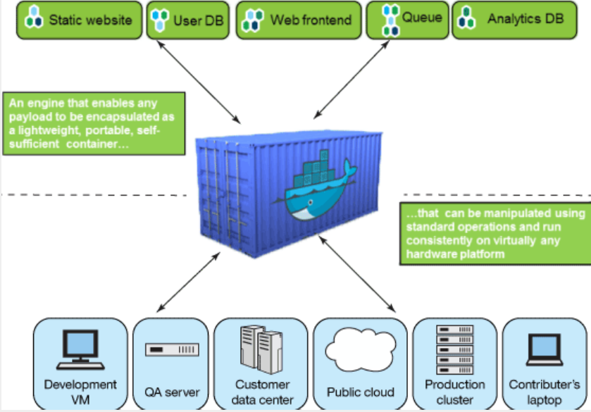

### 1.3.2 传统虚拟机技术

虚拟机（virtual machine）就是带环境安装的一种解决方案。
它可以在一种操作系统里面运行另一种操作系统，比如在Windows10系统里面运行Linux系统CentOS7。应用程序对此毫无感知，因为虚拟机看上去跟真实系统一模一样，而对于底层系统来说，虚拟机就是一个普通文件，不需要了就删掉，对其他部分毫无影响。这类虚拟机完美的运行了另一套系统，能够使应用程序，操作系统和硬件三者之间的逻辑不变。  

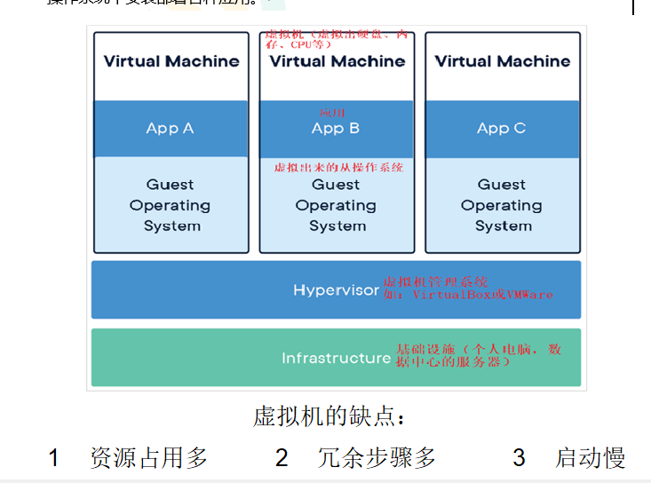

### 1.3.3 容器虚拟化技术

由于前面虚拟机存在某些缺点，Linux发展出了另一种虚拟化技术：**Linux容器(Linux Containers，缩写为 LXC)**

Linux容器是**与系统其他部分隔离开**的一系列进程，从另一个镜像运行，并由该镜像提供支持进程所需的全部文件。容器提供的镜像包含了应用的所有依赖项，因而在从开发到测试再到生产的整个过程中，它都具有可移植性和一致性。

Linux 容器不是模拟一个完整的操作系统而是对进程进行隔离。有了容器，就可以将软件运行所需的所有资源打包到一个隔离的容器中。**容器与虚拟机不同，不需要捆绑一整套操作系统，只需要软件工作所需的库资源和设置。**系统因此而变得高效轻量并保证部署在任何环境中的软件都能始终如一地运行。

   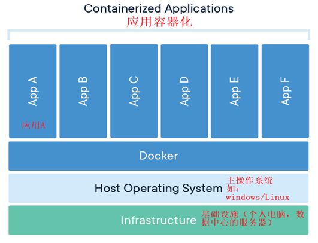

传统虚拟机：在硬件层面进行虚拟化

Docker：在操作系统层面实现虚拟化 

### 1.3.4 对比

比较了 Docker 和传统虚拟化方式的不同之处：

* 传统虚拟机技术是**虚拟出一套硬件**后，**在其上运行一个完整操作系统**，在该系统上再运行所需应用进程；
* 容器内的应用进程**直接运行于宿主的内核**，容器内没有自己的内核且也没有进行硬件虚拟。因此容器要比传统虚拟机更为轻便。
* 每个容器之间互相隔离，每个容器有自己的文件系统 ，容器之间进程不会相互影响，能区分计算资源。

## 1.4 Docker的影响

技术职位级别变化

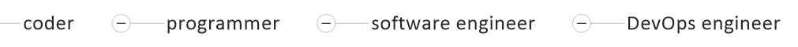

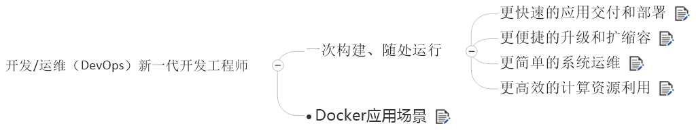

应用环境

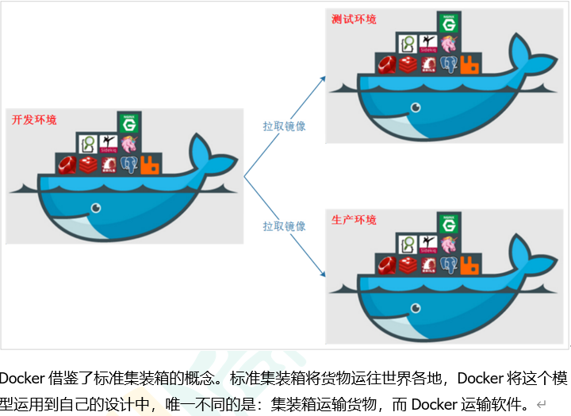

## 1.5 官网

http://www.docker.com

Docker镜像仓库 https://hub.docker.com/

# 2 Docker安装

## 2.1 系统前提

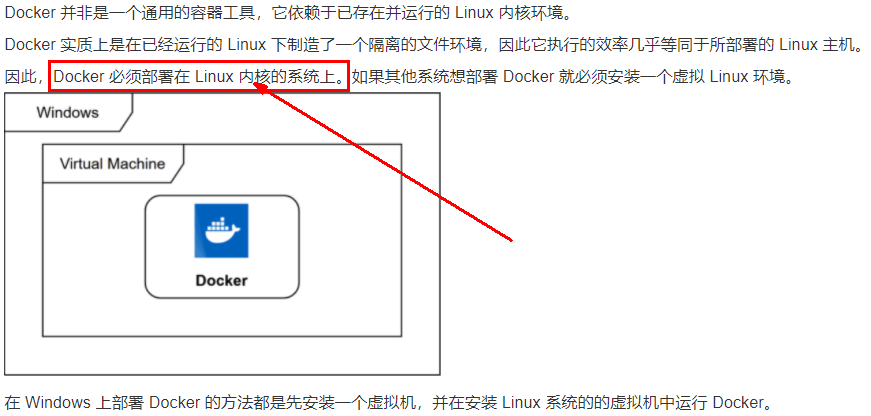
目前，CentOS 仅发行版本中的内核支持 Docker。Docker 运行在CentOS 7 (64-bit)上，

```bash
[tintin@hadoop102 ~]$ cat /etc/redhat-release 
CentOS Linux release 7.5.1804 (Core) 
[tintin@hadoop102 ~]$ uname -r
3.10.0-862.el7.x86_64

```

## 2.2 Docker三要素

### 2.2.1 镜像

Docker 镜像（Image）就是一个只读的模板。镜像可以用来创建 Docker **容器**，一个镜像可以创建很多容器。

它也相当于是一个**root文件系统**。比如官方镜像 centos:7 就包含了完整的一套 centos:7 最小系统的 root 文件系统。
相当于容器的“源代码”，docker镜像文件类似于Java的类模板，而docker容器实例类似于java中new出来的实例对象。

### 2.2.2 容器

* 从面向对象角度

  Docker 利用容器（Container）独立运行的一个或一组应用，应用程序或服务运行在容器里面，**容器就类似于一个虚拟化的运行环境**，容器是用镜像创建的运行实例。就像是Java中的类和实例对象一样，镜像是静态的定义，容器是镜像运行时的实体。容器为镜像提供了一个标准的和隔离的运行环境，它可以被启动、开始、停止、删除。每个容器都是相互隔离的、保证安全的平台

* 从镜像容器角度
  可以把容器看做是一个**简易版的 Linux 环境**（包括root用户权限、进程空间、用户空间和网络空间等）和运行在其中的应用程序。

### 2.2.3 仓库

仓库（Repository）是集中存放镜像文件的场所。

类似于
**Maven仓库，存放各种jar包的地方；**
**github仓库，存放各种git项目的地方；**

Docker公司提供的官方registry被称为Docker Hub，存放各种镜像模板的地方。

仓库分为公开仓库（Public）和私有仓库（Private）两种形式。
最大的公开仓库是 Docker Hub(https://hub.docker.com/)，
存放了数量庞大的镜像供用户下载。国内的公开仓库包括阿里云 、网易云等

### 2.2.4 总结

Docker 本身是一个容器运行载体或称之为管理引擎。我们把应用程序和配置依赖打包好形成一个可交付的运行环境，这个打包好的运行环境就是image镜像文件。只有通过这个镜像文件才能生成Docker容器实例(类似Java中new出来一个对象)。

## 2.3 Docker平台架构图解

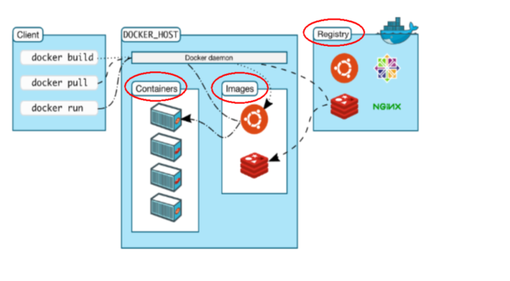

Docker是一个Client-Server结构的系统，Docker守护进程运行在主机上， 然后通过Socket连接从客户端访问，守护进程从客户端接受命令并管理运行在主机上的容器。 容器，是一个运行时环境，就是我们前面说到的集装箱。可以对比mysql演示对比讲解

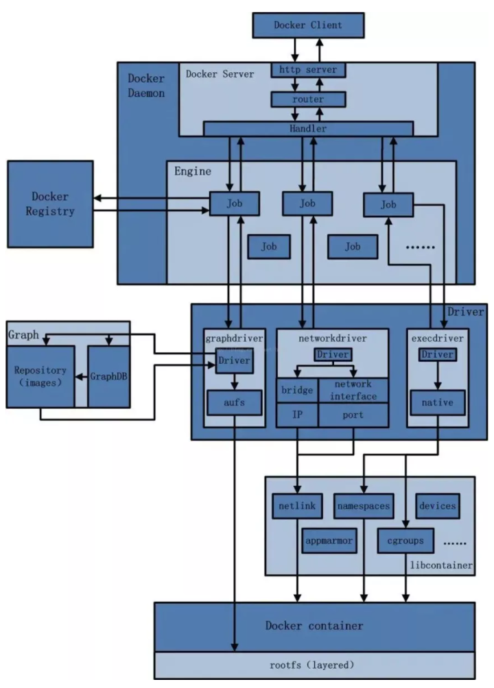

## 2.4 Docker在CentOS7上安装

[Install Docker Engine on CentOS | Docker Documentation](https://docs.docker.com/engine/install/centos/)

卸载旧版本

```bash
$ sudo yum remove docker \
                  docker-client \
                  docker-client-latest \
                  docker-common \
                  docker-latest \
                  docker-latest-logrotate \
                  docker-logrotate \
                  docker-engine
```

安装gcc相关

安装yum-utils

```bash
$ sudo yum install -y yum-utils
```

设置稳定的仓库

```bash
[tintin@hadoop102 ~]$ sudo yum-config-manager --add-repo   http://mirrors.aliyun.com/docker-ce/linux/centos/docker-ce.repo
已加载插件：fastestmirror, langpacks
adding repo from: http://mirrors.aliyun.com/docker-ce/linux/centos/docker-ce.repo
grabbing file http://mirrors.aliyun.com/docker-ce/linux/centos/docker-ce.repo to /etc/yum.repos.d/docker-ce.repo
repo saved to /etc/yum.repos.d/docker-ce.repo

```

更新yum软件包索引

```bash
[tintin@hadoop102 ~]$ yum makecache fast
```

安装Docker ce

```bash
[tintin@hadoop102 ~]$ yum -y install docker-ce docker-ce-cli containerd.io
```

启动Docker

```bash
systemctl start docker
```

测试

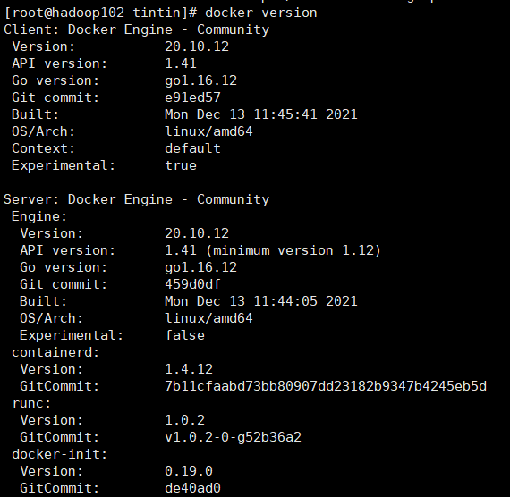

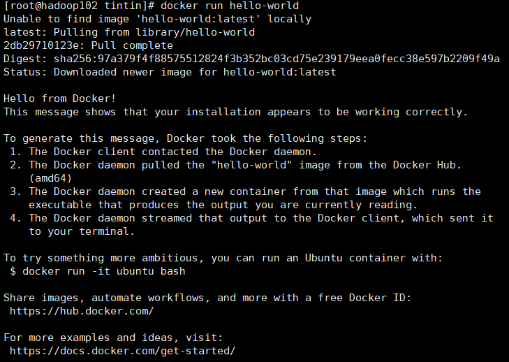

关闭docker

```bash
systemctl stop docker 
```

卸载docker

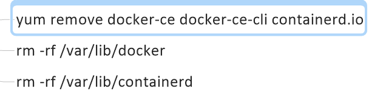

阿里云镜像加速

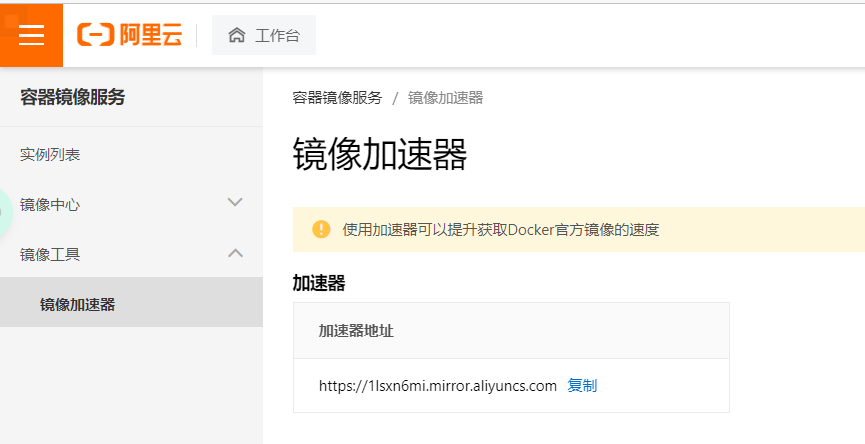

```bash
sudo mkdir -p /etc/docker
sudo tee /etc/assets/daemon.json <<-'EOF'
{
  "registry-mirrors": ["https://1lsxn6mi.mirror.aliyuncs.com"]
}
EOF
sudo systemctl daemon-reload
sudo systemctl restart docker
```

测试运行将会被加速

docker run命令的作用

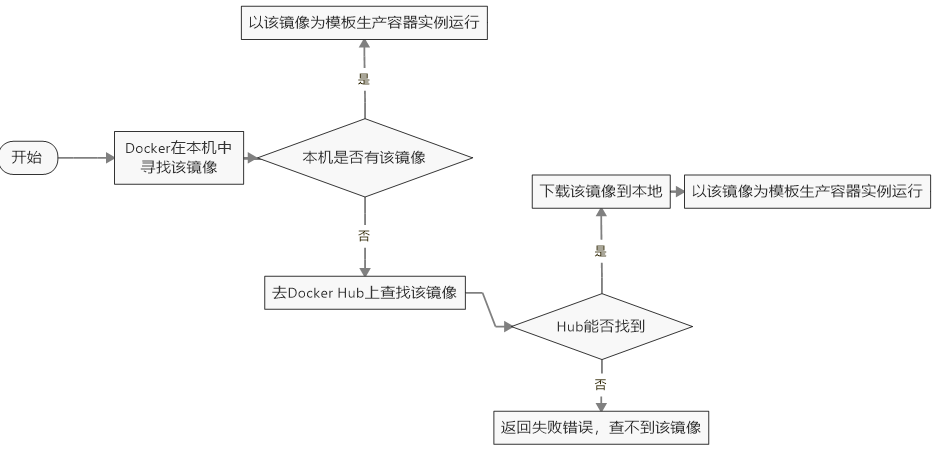

## 2.5 为什么docker比vm虚拟机快

[与vm虚拟机对比](#1.3.4 对比)

* docker不需要Hypervisor(虚拟机)实现硬件资源虚拟化,运行在docker容器上的程序直接使用的都是实际物理机的硬件资源。
* docker利用的是宿主机的内核,而不需要加载操作系统OS内核

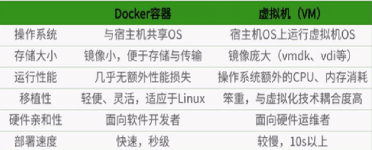

# 3 Docker常用命令

## 3.1 帮助启动类命令

```bash
启动docker： systemctl start docker
开机自启docker：systemctl enable docker
停止docker： systemctl stop docker
重启docker： systemctl restart docker
查看docker状态： systemctl status docker
查看docker概要信息： docker info
查看docker总体帮助文档： docker --help
查看docker命令帮助文档： docker 具体命令 --help
```


## 3.2 镜像命令

docker images 列出本地主机上的镜像

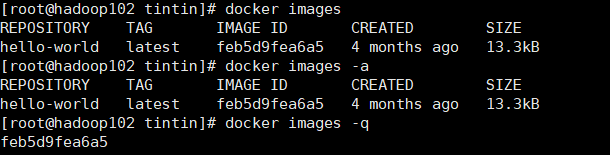

docker search 某个XXX镜像名字 

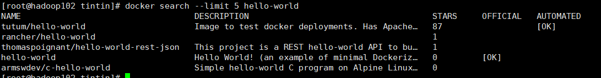

docker pull 某个XXX镜像名字 下载镜像

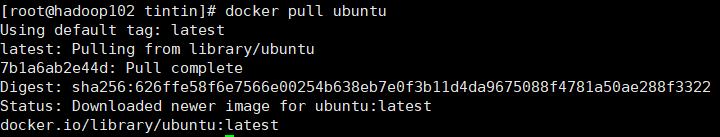

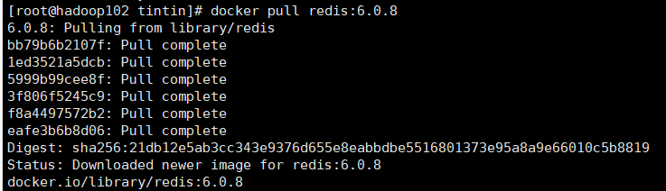

docker system df 查看镜像/容器/数据卷所占的空间

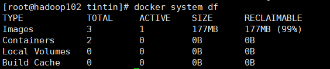

docker rmi 某个XXX镜像名字或ID 删除镜像

docker rmi -f 某个XXX镜像名字或ID 强制删除（可能会删除正在使用的镜像）

docker rmi -f $(docker images -qa) 删除全部

面试题：谈谈docker虚悬镜像是什么？ 仓库名、标签都是<none>的镜像，俗称虚悬镜像dangling image

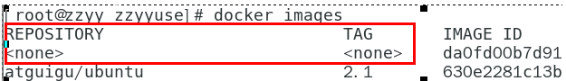

docker rmi $(docker images -f "dangling=true" -q) 删除空悬镜像

docker image prune 删除未使用的镜像

## 3.3 容器命令

### 3.3.1 新建+启动容器 

docker run [OPTIONS] IMAGE [COMMAND] [ARG...]

--name="容器新名字"       为容器指定一个名称；
-d: 后台运行容器并返回容器ID，也即启动守护式容器(后台运行)；

-i：以交互模式运行容器，通常与 -t 同时使用；
-t：为容器重新分配一个伪输入终端，通常与 -i 同时使用；
也即启动交互式容器(前台有伪终端，等待交互)；

-P: 随机端口映射，大写P
-p: 指定端口映射，小写p

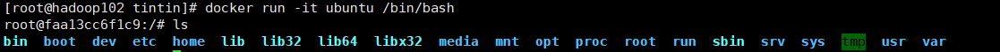

### 3.3.2  列出当前所有正在运行的容器

docker ps [OPTIONS]

-a :列出当前所有正在运行的容器+历史上运行过的
-l :显示最近创建的容器。
-n：显示最近n个创建的容器。
-q :静默模式，只显示容器编号。

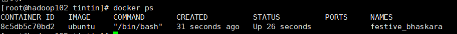

### 3.3.3 退出容器

exit 退出，容器停止

ctrl+p+q 退出，容器不停止

### 3.3.4 对已有容器进行操作

开启已停止的容器 docker start 容器ID或者容器名

重启容器 docker restart 容器ID或者容器名

停止容器 docker stop 容器ID或者容器名 （或exit 退出所有前台进程，容器停止）

强制停止容器 docker kill 容器ID或容器名

删除已停止的容器 docker rm 容器ID

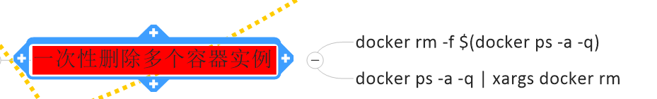

### 3.3.5 后台启动守护式容器

docker run -d 容器名

然后docker ps -a 进行查看, 会发现容器已经退出
很重要的要说明的一点: Docker容器后台运行,就必须有一个前台进程.
容器运行的命令如果不是那些一直挂起的命令（比如运行top，tail），就是会自动退出的。

### 3.3.6 监控容器

查看容器日志 docker logs 容器ID

查看容器内运行的进程 docker top 容器ID

查看容器内部细节 docker inspect 容器ID

### 3.3.6 与正在运行的容器交互

docker exec -it 容器ID bashShell

重新进入docker attach 容器ID

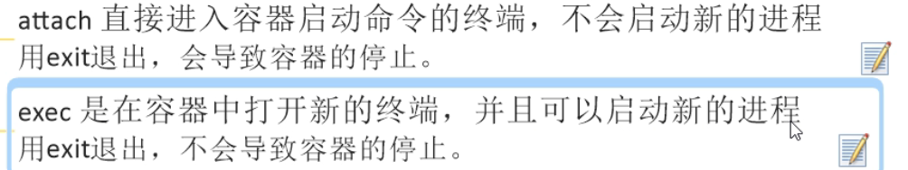

一般用-d后台启动的程序，再用exec进入对应容器实例

推荐大家使用 docker exec 命令，因为退出容器终端，不会导致容器的停止。

### 3.3.7 从容器内拷贝文件到主机上

docker cp  容器ID:容器内路径 目的主机路径


### 3.3.8 导入和导出容器

docker export 容器ID > 文件名.tar  导出容器的内容留作为一个tar归档文件[对应import命令]

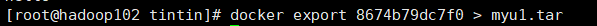

docker import - 镜像用户/镜像名:镜像版本号 导出容器的内容留作为一个tar归档文件[对应import命令]

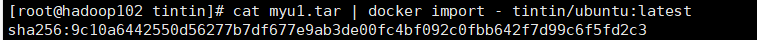

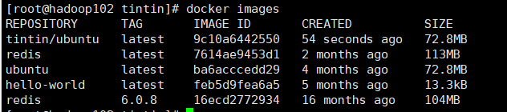

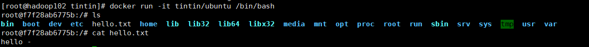

## 3.4 总结

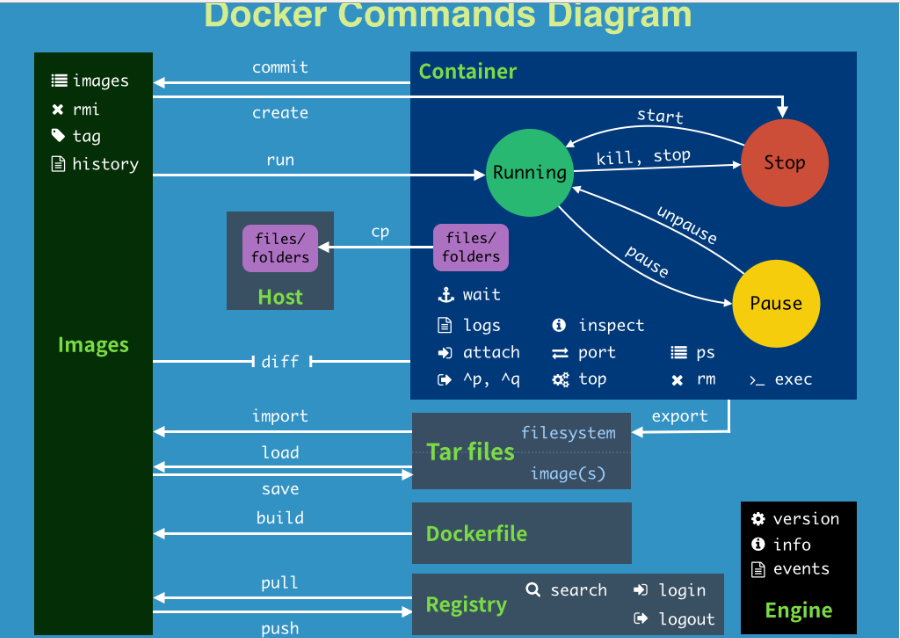


# 4 Docker镜像

## 4.1 镜像概念

是一种轻量级、可执行的独立软件包，它包含运行某个软件所需的所有内容，我们把应用程序和配置依赖打包好形成一个可交付的运行环境(包括**代码、运行时需要的库、环境变量和配置文件**等)，这个打包好的运行环境就是image镜像文件。

### 4.1.1镜像分层

以我们的pull为例，在下载的过程中我们可以看到docker的镜像好像是在一层一层的在下载，镜像是分层的

### 4.1.2 UnionFS（联合文件系统）

Union文件系统（UnionFS）是一种分层、轻量级并且高性能的文件系统，它支持对文件系统的修改作为一次提交来一层层的叠加，同时可以将不同目录挂载到同一个虚拟文件系统下(unite several directories into a single virtual filesystem)。Union 文件系统是 Docker 镜像的基础。镜像可以通过分层来进行继承，基于基础镜像（没有父镜像），可以制作各种具体的应用镜像。

一次同时加载多个文件系统，但从外面看起来，只能看到一个文件系统，联合加载会把各层文件系统叠加起来，这样最终的文件系统会包含所有底层的文件和目录

### 4.1.3 镜像加载原理

docker的镜像实际上由一层一层的文件系统组成，这种层级的文件系统UnionFS。

bootfs(boot file system)主要包含bootloader和kernel，bootloader主要是引导加载kernel，在Docker镜像的最底层是引导文件系统bootfs。

rootfs (root file system) ，在bootfs之上。包含的就是典型 Linux 系统中的 /dev, /proc, /bin, /etc 等标准目录和文件。rootfs就是各种不同的操作系统发行版，比如Ubuntu，Centos等等。 

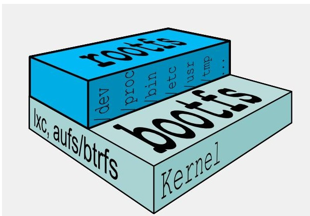

以安装centos为例，平时我们安装进虚拟机的CentOS都是好几个G，为什么docker这里才200M。因为Docker容器中，对于一个精简的OS，rootfs可以很小，只需要包括最基本的命令、工具和程序库就可以了，因为底层直接用Host的kernel，自己只需要提供 rootfs 就行了。

### 4.1.3 镜像分层的原因

镜像分层最大的一个好处就是共享资源，方便复制迁移，就是为了复用。

比如说有多个镜像都从相同的 base 镜像构建而来，那么 Docker Host 只需在磁盘上保存一份 base 镜像；
同时内存中也只需加载一份 base 镜像，就可以为所有容器服务了。而且镜像的每一层都可以被共享。

## 4.2 镜像层与容器层

当容器启动时，一个新的可写层被加载到镜像的顶部。这一层通常被称作“容器层”，“容器层”之下的都叫“镜像层”。

所有对容器的改动 - 无论添加、删除、还是修改文件都只会发生在容器层中。只有容器层是**可写的**，容器层下面的所有镜像层都是**只读的**。


## 4.3 Docker镜像commit操作

docker commit提交容器副本使之成为一个新的镜像

docker commit -m="提交的描述信息" -a="作者" 容器ID 要创建的目标镜像名:[标签名]

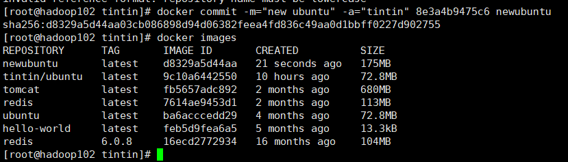

## 4.4 总结

Docker中的镜像分层，支持通过扩展现有镜像，创建新的镜像。类似Java继承于一个Base基础类，自己再按需扩展。
新镜像是从 base 镜像一层一层叠加生成的。每安装一个软件，就在现有镜像的基础上增加一层

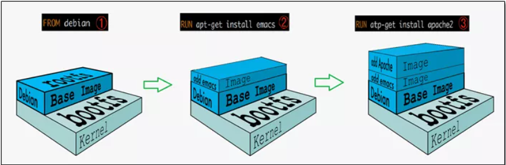

# 5 本地镜像发布到阿里云

## 5.1 流程

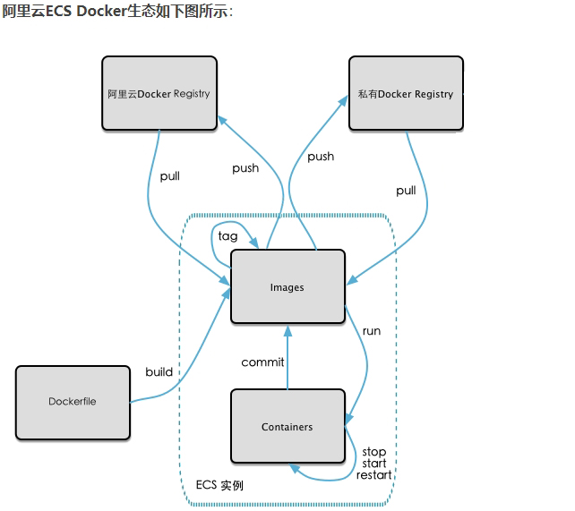

## 5.2 平台

[容器镜像服务 (aliyun.com)](https://cr.console.aliyun.com/cn-hangzhou/instances)

## 5.3 创建镜像仓库

个人实例

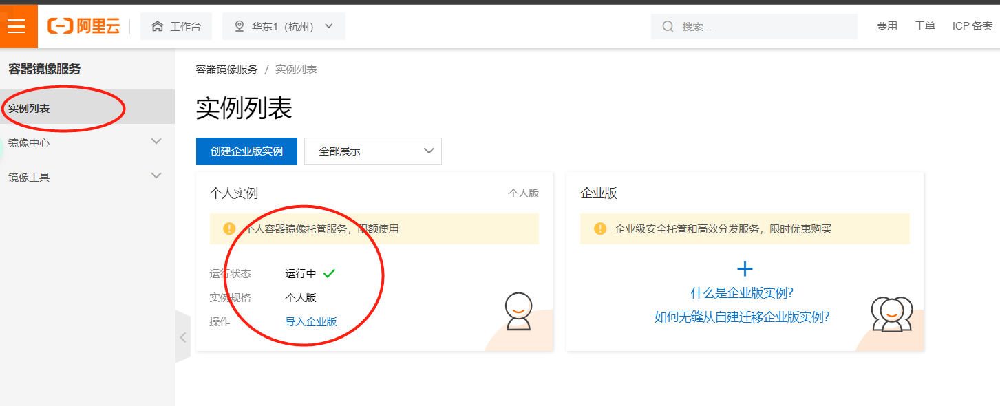

命名空间

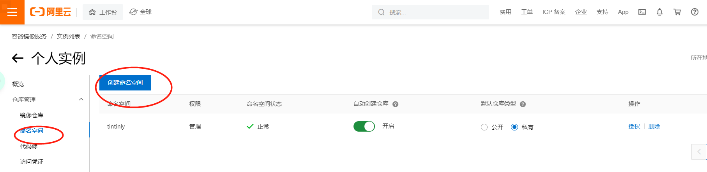

镜像仓库

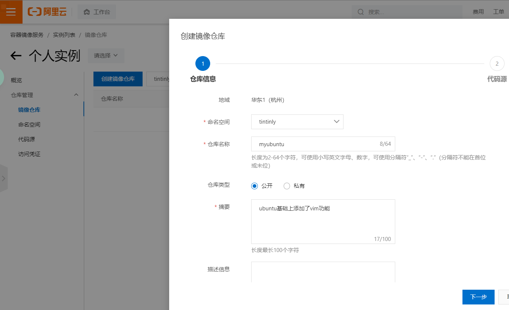

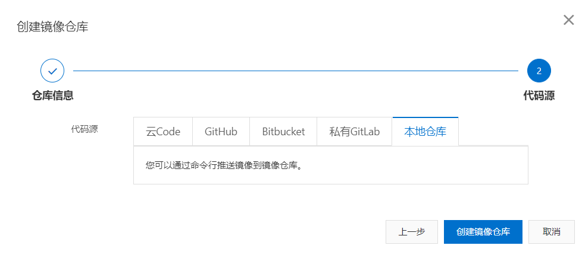

### 5.3 将镜像推送到阿里云

```bash
$ docker login --username=我就是大名丁丁的鼎鼎 registry.cn-hangzhou.aliyuncs.com # 登录
$ docker tag [ImageId] registry.cn-hangzhou.aliyuncs.com/tintinly/myubuntu:[镜像版本号] 
$ docker push registry.cn-hangzhou.aliyuncs.com/tintinly/myubuntu:[镜像版本号]
```

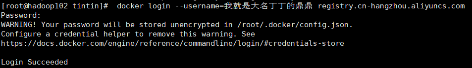

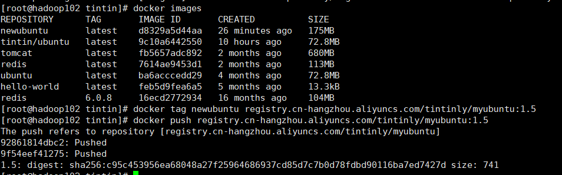

## 5.4 从仓库中拉取镜像

```bash
$ docker pull registry.cn-hangzhou.aliyuncs.com/tintinly/myubuntu:[镜像版本号]
```

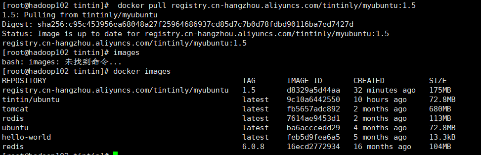

# 5 本地镜像发布到私有库

## 5.1 私有库

1 官方Docker Hub地址：https://hub.docker.com/，中国大陆访问太慢了且准备被阿里云取代的趋势，不太主流。

2 Dockerhub、阿里云这样的公共镜像仓库可能不太方便，涉及机密的公司不可能提供镜像给公网，所以需要创建一个本地私人仓库供给团队使用，基于公司内部项目构建镜像。

**Docker Registry是官方提供的工具，可以用于构建私有镜像仓库**

## 5.2 将本地镜像推送到私有库

下载镜像 Registry

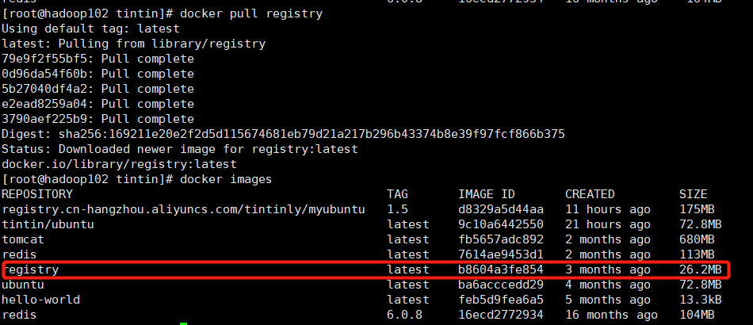

运行私有库Registry，相当于本地有个私有Docker hub

```bash
 
$ docker run -d -p 5000:5000  -v /zzyyuse/myregistry/:/tmp/registry --privileged=true registry
# 默认情况，仓库被创建在容器的/var/lib/registry目录下，建议自行用容器卷映射，方便于宿主机联调
```

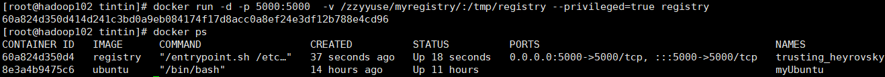

**Docker Compose 方式部署**

```yaml
services:
  registry:
    image: registry:2
    container_name: docker-registry
    restart: unless-stopped
    ports:
      - "35000:5000"
    environment:
      # 可选：配置存储路径（默认使用容器内的 /var/lib/registry）
      REGISTRY_STORAGE_FILESYSTEM_ROOTDIRECTORY: /data
    volumes:
      # 将主机目录挂载到容器内，持久化镜像数据
      - ./registry-data:/data
      - /vol1/1000/dockerImage:/var/lib/registry
```


```
curl验证私服库上有什么镜像 curl -XGET http://192.168.111.162:5000/v2/_catalog
```

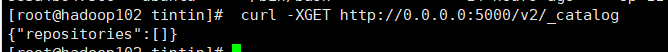

可以看到，目前私服库没有任何镜像上传过。。。。。。

上传镜像

```bash
$ docker   tag   镜像:Tag   Host:Port/Repository:Tag # 将新镜像nettoolubuntu:1.2修改符合私服规范的Tag
$ vim /etc/assets/daemon.json # 修改配置文件使之支持http  "insecure-registries": ["192.168.111.162:5000"] 重启
$ docker push Host:Port/Repository:Tag # push推送到私服库
```

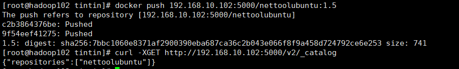

下载镜像

```bash
$ docker pull 192.168.10.102:5000/nettoolubuntu:1.5
```

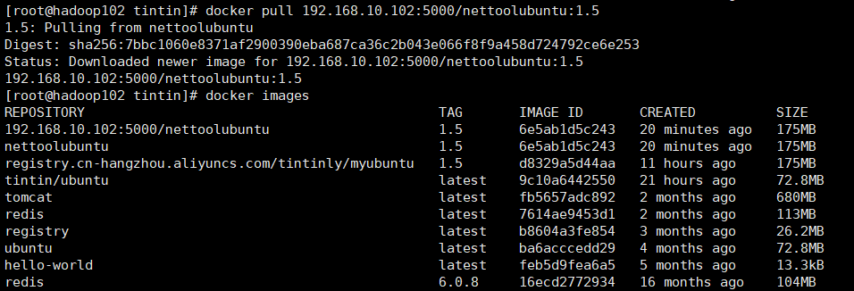

# 7 Docker容器数据卷

## 7.1 允许挂载目录

CentOS7安全模块会比之前系统版本加强，不安全的会先禁止，所以目录挂载的情况被默认为不安全的行为，
在SELinux里面挂载目录被禁止掉了额，如果要开启，我们一般使用--privileged=true命令，扩大容器的权限解决挂载目录没有权限的问题，也即使用该参数，container内的root拥有真正的root权限，否则，container内的root只是外部的一个普通用户权限。

Docker挂载主机目录访问如果出现cannot open directory .: Permission denied
解决办法：在挂载目录后多加一个`--privileged=true`参数即可

## 7.2 容器数据卷的意义

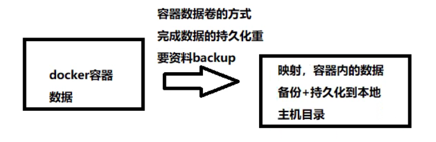

 将运用与运行的环境打包镜像，run后形成容器实例运行 ，但是我们对数据的要求希望是**持久化**的

Docker容器产生的数据，如果不备份，那么当容器实例删除后，容器内的数据自然也就没有了。
为了能保存数据在docker中我们使用卷。

特点：

1. 数据卷可在容器之间共享或重用数据
2. 卷中的更改可以直接实时生效，爽
3. 数据卷中的更改不会包含在镜像的更新中
4. 数据卷的生命周期一直持续到没有容器使用它为止

## 7.3 容器数据卷是什么

卷就是目录或文件，存在于一个或多个容器中，由docker挂载到容器，但不属于联合文件系统，因此能够绕过Union File System提供一些用于持续存储或共享数据的特性：

卷的设计目的就是**数据的持久化，完全独立于容器的生存周期，因此Docker不会在容器删除时删除其挂载的数据卷**

```bash
 $ docker run -it --privileged=true -v /宿主机绝对路径目录:/容器内目录      镜像名 # 运行容器将docker容器内的数据保存进宿主机的磁盘中
```

## 7.4 挂载容器数据卷案例

### 7.4.1 宿主vs容器之间映射添加容器卷

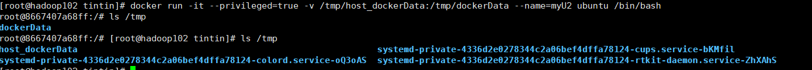

查看数据卷是否挂载成功

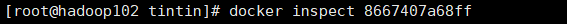

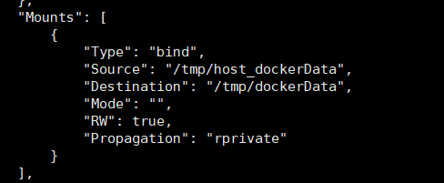

容器与宿主机之间数据共享

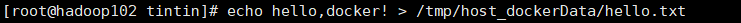

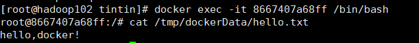

**假设docker容器stop，主机修改，docker容器重启看数据依然同步。**

### 7.4.2 读写规则映射添加说明

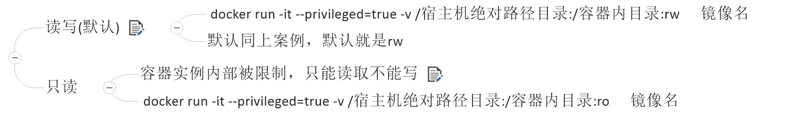

### 7.4.3 卷的继承和共享 

```bash
$ docker run -it  --privileged=true --volumes-from 父类  --name u2 ubuntu # 继承了父容器的挂载规则 生命周期也与父容器无关
```

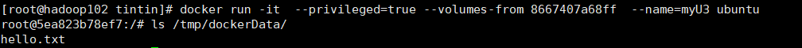

宿主机和能与多个继承容器共享

# 8 Docker常规安装

## 8.1 总体步骤

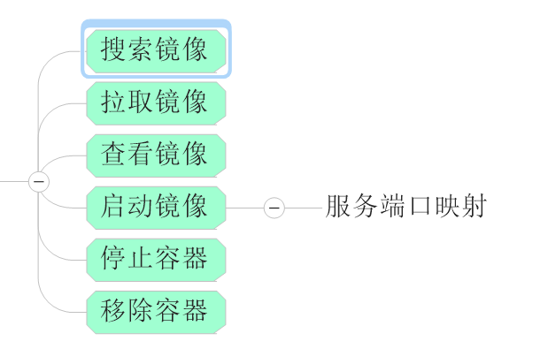

## 8.2 Tomcat

```
docker search tomcat

docker pull tomcat

docker images

docker run -it -p 8080:8080 tomcat
```

打不开首页

可能没有映射端口或者没有关闭防火墙

把webapps.dist目录换成webapps

## 8.3 MySQL

```
docker run -p 3306:3306 -e MYSQL_ROOT_PASSWORD=123456 -d mysql:5.7
docker ps
docker exec -it 容器ID /bin/bash
mysql -uroot -p
```

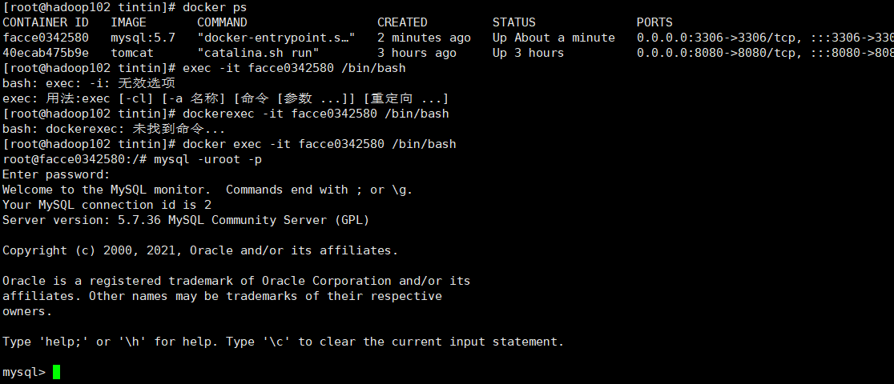

外部主机连接

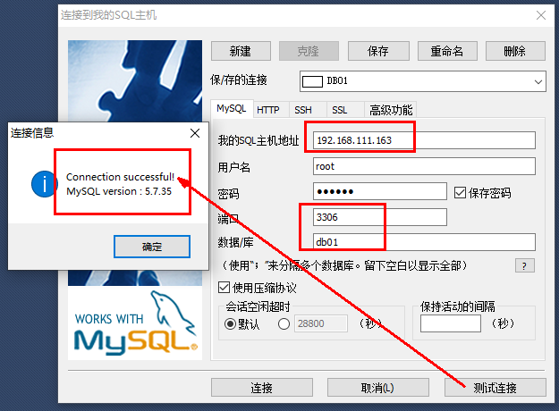

问题：docker上默认字符集编码隐患

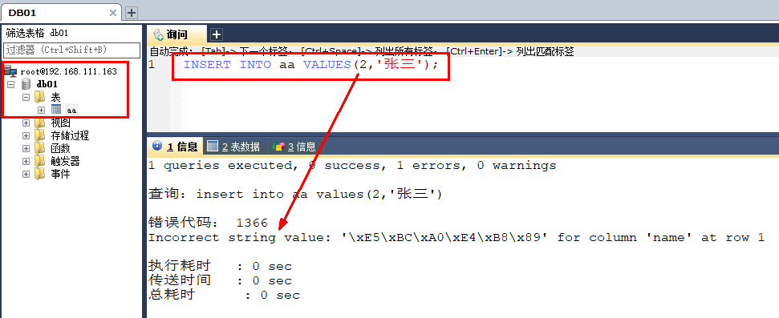

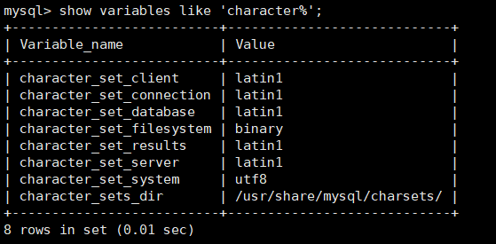

**实战(容器持久化)**

新建mysql容器实例

```bash
$ docker run -d -p 3306:3306 --privileged=true -v /zzyyuse/mysql/log:/var/log/mysql -v /zzyyuse/mysql/data:/var/lib/mysql -v /zzyyuse/mysql/conf:/etc/mysql/conf.d -e MYSQL_ROOT_PASSWORD=123456  --name mysql mysql:5.7

```

通过容器卷同步my.cnf给mysql容器实例

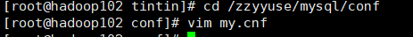

```
[client]
default_character_set=utf8
[mysqld]
collation_server = utf8_general_ci
character_set_server = utf8
```

解决中文编码问题

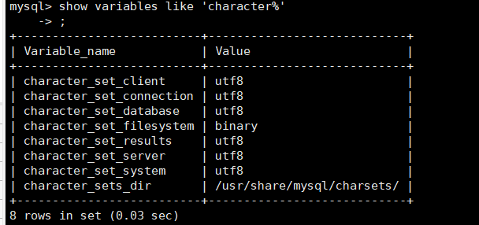

同时删除容器后重新建立实例，数据与配置依然存在

## 8.4 redis

拷贝配置文件到数据卷目录中

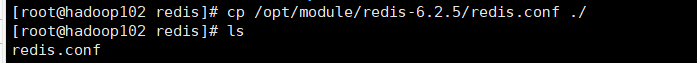

修改配置文件

```
3 /app/redis目录下修改redis.conf文件
  3.1 开启redis验证    可选
    requirepass 123

  3.2 允许redis外地连接  必须
     注释掉 # bind 127.0.0.1

  3.3   daemonize no
     将daemonize yes注释起来或者 daemonize no设置，因为该配置和docker run中-d参数冲突，会导致容器一直启动失败

  3.4 开启redis数据持久化  appendonly yes  可选
```

 新建实例

```bash
$ docker run  -p 6379:6379 --name myr3 --privileged=true -v /app/redis/redis.conf:/etc/redis/redis.conf -v /app/redis/data:/data -d redis:6.0.8 redis-server /etc/redis/redis.conf
```

# 9 制作镜像

## 9.1 使用 docker commit（从运行中的容器创建镜像）

步骤 1：拉取基础镜像并启动容器

```shell
docker pull ubuntu:22.04
docker run -it --name my_container ubuntu:22.04 /bin/bash
```

步骤 2：在容器内做修改（比如安装软件）

```shell
apt update
apt install -y nginx
nginx -v
```

步骤3：在主机上封装整个容器为新镜像

```shell
docker ps -a
docker commit my_container my_nginx_image:v1

```

步骤 4：验证新镜像

```shell
docker images
docker run -it my_nginx_image:v1 /bin/bash
```

## 9.2 使用 Dockerfile

编写Dockerfile

```dockerfile
# 使用官方 Ubuntu 22.04 作为基础镜像
FROM ubuntu:22.04

# 设置环境变量，避免 apt 弹出交互提示
ENV DEBIAN_FRONTEND=noninteractive

# 更新系统并安装 nginx
RUN apt update && \
    apt install -y nginx && \
    rm -rf /var/lib/apt/lists/*

# 暴露 80 端口（文档说明用途，实际运行需配合 -p）
EXPOSE 80

# 启动 nginx（前台运行，否则容器会退出）
CMD ["nginx", "-g", "daemon off;"]
```

构建镜像并清理构筑缓存

```bash
docker build -t my_nginx_image_from_dockerfile:v1 .
docker builder prune -a --force
```

运行镜像

```shell
# 后台运行，并映射 8080 主机端口到容器 80 端口
docker run -d -p 8080:80 --name my_web my_nginx_image_from_dockerfile:v1
```

Dockerfile优化方式（多阶段构建、减小体积等）

* 使用 .dockerignore 忽略无关文件
* 合并 RUN 命令减少层数
* 使用更小的基础镜像（如 alpine）
* 多阶段构建（适用于编译型语言如 Go、Java）

# 10 Docker 磁盘优化

**清理未使用的容器、镜像和网络**

```shell
# 删除所有已停止的容器
docker container prune
# 删除未被任何容器使用的镜像
docker image prune
# 删除未被使用的网络
docker network prune
# 删除所有未使用的容器、镜像、网络和数据卷：
docker system prune
```

**清理构建缓存**

```shell
# 清理所有未使用的构建缓存
docker builder prune
# 包括中间层缓存
docker builder prune --all
```

**清理未使用的数据卷**

```shell
# 查看哪些数据卷可以清理：
docker volume ls -f dangling=true
#  删除所有未被容器引用的数据卷
docker volume prune
```

**查看磁盘占用情况**

```shell
docker system df
```

