[TOC]

# Git 起源

Git 是一个分布式版本控制系统，缔造者是大名鼎鼎的林纳斯·托瓦茲 (Linus Torvalds)，Git 最初的目的是为了能更好的管理 Linux 内核源码。

Linus 作为项目的管理员并没有借助任何配置管理工具，而是以手工方式通过 patch 来合并大家提交的代码。因为他对代码版本管理工具非常挑剔，无论是商用的 clearcase，还是开源的 CVS、SVN 都入不了他的法眼。BitKeeper 让 Linux 社区免费使用，但最终收回使用权。于是 Linus 只能写一个全新的版本控制系统，只用了 10 天时间就用 C 语言完成了第一个版本。

如果选历史上最伟大的一次 Git 代码提交，那一定是这 Git 工具项目本身的第一次代码提交。这次代码提交无疑是开创性的，如果说 Linux 项目促成了开源软件的成功并改写了软件行业的格局，那么 Git 则是改变了全世界开发者的工作方式和写作方式。

Git 和传统的版本控制工具 CVS、SVN 有不小的区别，前者关心的是文件的整体性是否发生了改变，后两者更关心文件内容上的差异。

# Git 安装

进入 Git 官网 [Git (git-scm.com)](https://git-scm.com/)，点击 *Downloads* 下载并安装


打开 Git Bash, 输入 git 回车得到如下图 即完成


试验环境

```bsah
git --version
git version 2.33.1.windows.1
```

# Git 分布式版本控制系统

## Git 概述

​	Git 是一个免费的、开源的 **分布式版本控制系统**, 可以快速高效地处理从小型到大型的各种项目
​	Git 易于学习, 占地面积小, 性能极快。它具有廉价的本地库, 方便的暂存区域和多个工作流分支等特性。其性能优于 Subversion、CVS、 Perforce 和 Clear Case 等版本控制工具。

### 什么是版本控制

​	版本控制是一种记录文件内容变化, 以便将来 **査阅特定版本修订情况** 的系统。
​	版本控制其实最重要的是可以记录文件修改历史记录, 从而让用户能够查看历史版本方便版本切换。

### 为什么要版本控制

个人开发过渡到团队协作

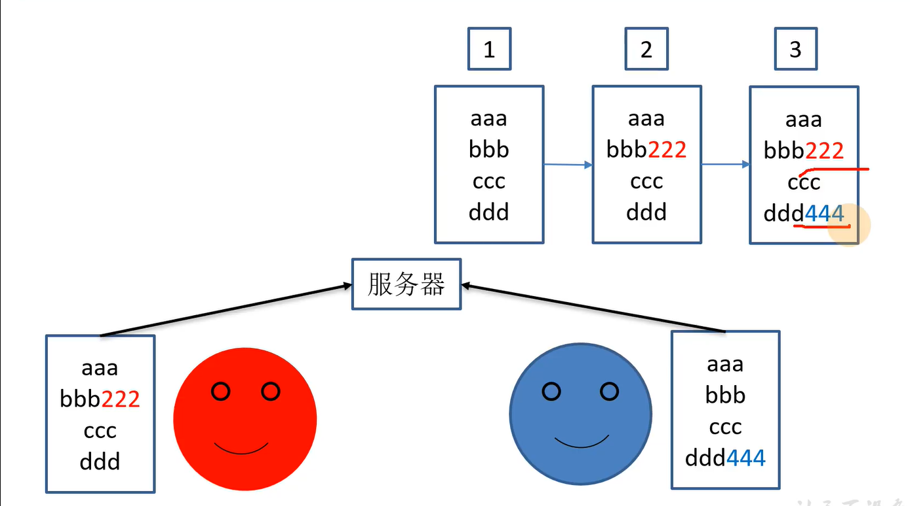

### 版本控制工具

* 集中式版本控制工具

  CVS、**SVN(Subversion)**、VSS...

  * 集中化的版本控制系统诸如 CVS、SVN 等, 都有一个 **单一的集中管理的服务器, 保存所有文件的修订版本**, 而协同工作的人们都通过客户端连到这台服务器, 取出最新的文件或者提交更新。多年以来, 这已成为版本控制系统的标准做法。
  * 这种做法带来了许多好处, 每个人都可以在一定程度上看到项目中的其他人正在做些什么。而管理员也可以轻松掌控每个开发者的权限, 并且管理一个集中化的版本控制系统, 要远比在各个客户端上维护本地数据库来得轻松容易。
  * 事分两面, 有好有坏。这么做显而易见的缺点是 **中央服务器的单点故障**。如果服务器宕机一小时, 那么在这一小时内, 谁都无法提交更新, 也就无法协同工作。

* 分布式版本控制工具

  Git、Mercurial、Bazaar、Darcs...

  * 像 Git 这种分布式版本控制工具, 客户端提取的不是最新版本的文件快照, 而是把代码仓库完整地镜像下来(本地库)。这样任何一处协同工作用的文件发生故障, 事后都可以用其他客户端的本地仓库进行恢复。因为每个客户端的每一次文件提取操作, 实际上都是一次对整个文件仓库的完整备份。

  * 分布式的版本控制系统出现之后解决了集中式版本控制系统的缺陷
    1. 服务器断网的情况下也可以进行开发(因为版本控制是在本地进行的)
    2. 每个客户端保存的也都是整个完整的项目(包含历史记录, 更加安全)

### Git 历史

​	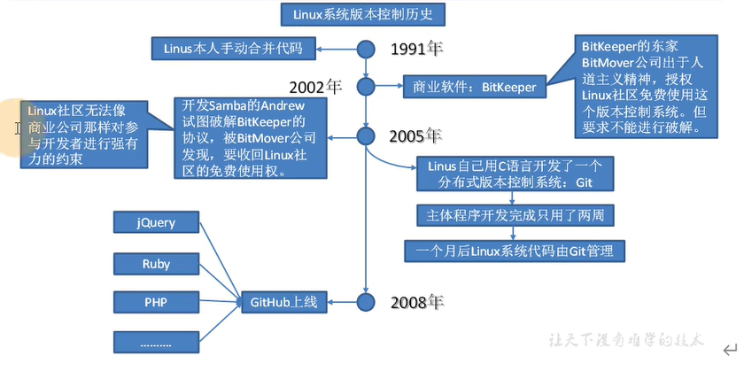 

### 工作机制


### Git 和代码托管中心

代码托管中心是基于网络服务器的远程代码仓库, 一般我们简单称为 **远程库**

* 局域网
  GitLab
* 互联网
  Github(外网)
  Gitee 码云(国内网站)

## Git 常用命令

参考 [常用 Git 命令清单 - 阮一峰的网络日志](https://www.ruanyifeng.com/blog/2015/12/git-cheat-sheet.html)

专有名词

- Workspace：工作区
- Index / Stage：暂存区
- Repository：仓库区（或本地仓库）
- Remote：远程仓库

### 新建本地代码库

```bash
# 在当前目录新建一个Git代码库
git init

# 新建一个目录，将其初始化为Git代码库
git init [project-name]

# 下载一个项目和它的整个代码历史
git clone [url]
```

查看.git 文件

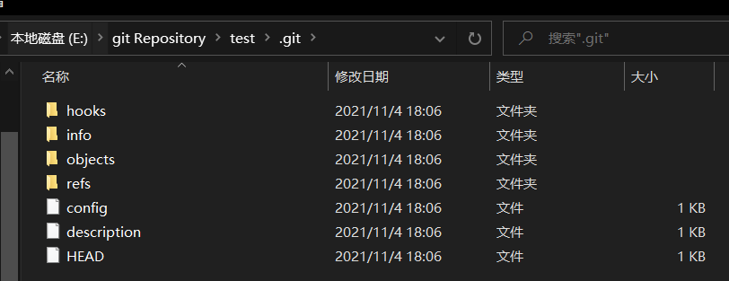

### 配置

Git 的设置文件为 `.gitconfig`，它可以在用户主目录下（全局配置），也可以在项目目录下（项目配置）。

```bash
# 显示当前的Git配置
git config --list

# 编辑Git配置文件
git config -e [--global]

# 设置提交代码时的用户信息
git config [--global] user.name "[name]"
git config [--global] user.email "[email address]"
```

说明： 用户信息的作用是区分不同操作者身份。用户的签名信息在每一个版本的提交信息中能够看到, 以此确认本次提交是谁做的。Git 首次安裝必须设置一下用户签名, 否则无法提交代码。

> 注意：这里设置用户签名和将来登录 Github(或其他代码托管中心)的账号没有任何关系。 

### 暂存区操作

```shell
# 添加指定文件到暂存区
git add [file1] [file2] ...

# 添加指定目录到暂存区，包括子目录
git add [dir]

# 添加当前目录的所有文件到暂存区
git add .

# 添加每个变化前，都会要求确认
# 对于同一个文件的多处变化，可以实现分次提交
git add -p

# 删除工作区文件，并且将这次删除放入暂存区
git rm [file1] [file2] ...

# 停止追踪指定文件，但该文件会保留在工作区
git rm --cached [file]

# 改名文件，并且将这个改名放入暂存区
git mv [file-original] [file-renamed]

```

### 代码提交

将暂存区的文件提交到本地库中

```bash
# 提交暂存区到仓库区
git commit -m [message]

# 提交暂存区的指定文件到仓库区
git commit [file1] [file2] ... -m [message]

# 提交工作区自上次commit之后的变化，直接到仓库区
git commit -a

# 提交时显示所有diff信息
git commit -v

# 使用一次新的commit，替代上一次提交
# 如果代码没有任何新变化，则用来改写上一次commit的提交信息
git commit --amend -m [message]

# 重做上一次commit，并包括指定文件的新变化
git commit --amend [file1] [file2] ...
```

### 分支

[分支操作](#分支的操作)

### 标签

tag 就是 对某次 commit 的一个标识，相当于起了一个别名。

例如，在项目发布某个版本的时候，针对最后一次 commit 起一个 v1.0.100 这样的标签来标识里程碑的意义。

```shell

# 列出所有tag
git tag

# 新建一个tag在当前commit
git tag [tag]

# 新建一个tag在指定commit
git tag [tag] [commit]

# 删除本地tag
git tag -d [tag]

# 删除远程tag
git push origin :refs/tags/[tagName]

# 查看tag信息
git show [tag]

# 提交指定tag
git push [remote] [tag]

# 提交所有tag
git push [remote] --tags

# 新建一个分支，指向某个tag
git checkout -b [branch] [tag]
```

### 查看状态或历史版本

```shell

# 显示有变更的文件
git status

# 显示当前分支的版本历史
git log

# 显示commit历史，以及每次commit发生变更的文件
git log --stat

# 搜索提交历史，根据关键词
git log -S [keyword]

# 显示某个commit之后的所有变动，每个commit占据一行
git log [tag] HEAD --pretty=format:%s

# 显示某个commit之后的所有变动，其"提交说明"必须符合搜索条件
git log [tag] HEAD --grep feature

# 显示某个文件的版本历史，包括文件改名
git log --follow [file]
git whatchanged [file]

# 显示指定文件相关的每一次diff
git log -p [file]

# 显示过去5次提交
git log -5 --pretty --oneline

# 显示所有提交过的用户，按提交次数排序
git shortlog -sn

# 显示指定文件是什么人在什么时间修改过
git blame [file]

# 显示暂存区和工作区的差异
git diff

# 显示暂存区和上一个commit的差异
git diff --cached [file]

# 显示工作区与当前分支最新commit之间的差异
git diff HEAD

# 显示两次提交之间的差异
git diff [first-branch]...[second-branch]

# 显示今天你写了多少行代码
git diff --shortstat "@{0 day ago}"

# 显示某次提交的元数据和内容变化
git show [commit]

# 显示某次提交发生变化的文件
git show --name-only [commit]

# 显示某次提交时，某个文件的内容
git show [commit]:[filename]

# 显示当前分支的最近几次提交
git reflog
```

### 远程同步

```shell
# 下载远程仓库的所有变动
git fetch [remote]

# 显示所有远程仓库
git remote -v

# 显示某个远程仓库的信息
git remote show [remote]

# 增加一个新的远程仓库，并命名
git remote add [shortname] [url]

# 取回远程仓库的变化，并与本地分支合并
git pull [remote] [branch]

# 上传本地指定分支到远程仓库
git push [remote] [branch]

# 强行推送当前分支到远程仓库，即使有冲突
git push [remote] --force

# 推送所有分支到远程仓库
git push [remote] --all
```

### 版本穿梭

```bash
# 恢复暂存区的指定文件到工作区
git checkout [file]

# 恢复某个commit的指定文件到暂存区和工作区
git checkout [commit] [file]

# 恢复暂存区的所有文件到工作区
git checkout .

# 重置暂存区的指定文件，与上一次commit保持一致，但工作区不变
git reset [file]

# 重置暂存区与工作区，与上一次commit保持一致
git reset --hard

# 重置当前分支的HEAD为指定commit，但暂存区和工作区不变
git reset --soft [commit]

# 重置当前分支的指针为指定commit，同时重置暂存区，但工作区不变
git reset [commit]

# 重置当前分支的HEAD为指定commit，同时重置暂存区和工作区
git reset --hard [commit]

# 重置当前HEAD为指定commit，但保持暂存区和工作区不变
git reset --keep [commit]

# 新建一个commit，用来撤销指定commit
# 后者的所有变化都将被前者抵消，并且应用到当前分支
git revert [commit]

# 暂时将未提交的变化移除，稍后再移入
git stash
git stash pop
```

> [commit] 可以为 `HEAD^` 表示上一个版本，即上一次的 commit，也可以写成 `HEAD~1`，想要撤回前两次的 commit，想要都撤回，可以使用 `HEAD~2`，依此类推。

Git 切换版本, 底层其实是移动的 HEAD 指针, 具体原理如下图所示。


### 其他

```shell
# 生成一个可供发布的压缩包
git archive

# 撤销对某个文件的所有未提交更改，还原文件到最近提交的状态
git restore <file> 

# 撤销当前目录所有未提交更改，还原文件到最近提交的状态
git restore . 
```

> git restore 更多地用于操作工作区和暂存区的内容，而 git reset 通常用于重置提交点。  功能上有重复

## Git 分支

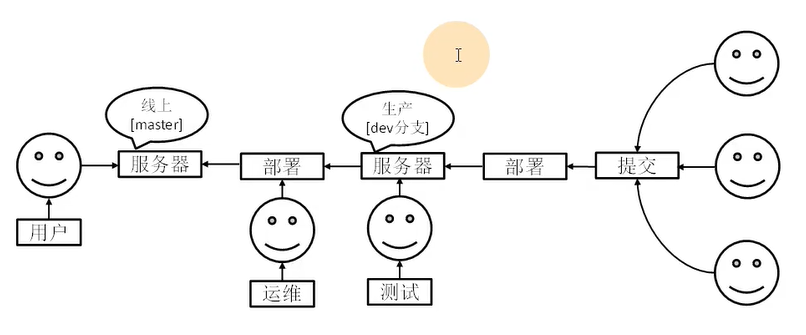

### 什么是分支

在版本控制过程中, 同时推进多个任务, 为每个任务, 我们就可以创建每个任务的单独分支。**使用分支意味着程序员可以把自己的工作从开发主线上分离开来, 开发自己分支的时候, 不会影响主线分支的运行。** 对于初学者而言, 分支可以简单理解为副本, 一个分支就是个单独的副本。(分支底层其实也是指针的引用)

### 分支的好处

同时并行推进多个功能开发, 提高开发效率。各个分支在开发过程中, 如果某一个分支开发失败, 不会对其他分支有任何影响。失败
的分支删除重新开始即可。

### 分支的操作

```shell
# 列出所有本地分支
git branch

# 列出所有远程分支
git branch -r

# 列出所有本地分支和远程分支
git branch -a

# 新建一个分支，但依然停留在当前分支
git branch [branch-name]

# 新建一个分支，并切换到该分支
git checkout -b [branch]

# 新建一个分支，指向指定commit
git branch [branch] [commit]

# 新建一个分支，与指定的远程分支建立追踪关系
git branch --track [branch] [remote-branch]

# 切换到指定分支，并更新工作区
$ git checkout [branch-name]

# 切换到上一个分支
git checkout -

# 建立追踪关系，在现有分支与指定的远程分支之间
git branch --set-upstream [branch] [remote-branch]

# 合并指定分支到当前分支
git merge [branch]

# 选择一个commit，合并进当前分支
git cherry-pick [commit]

# 删除分支
git branch -d [branch-name]

# 删除远程分支
git push origin --delete [branch-name]
git branch -dr [remote/branch]
```

### 分支冲突

冲突产生的原因:

合并分支时, 两个分支在同一个文件的同一个位置有两套完全不同的修改。Git 无法替我们决定使用哪一个。必须人为决定新代码内容。

```bash
82129@DESKTOP-R0J8UMG MINGW64 /e/git Repository/test (master)
$ git merge hot-fix
Auto-merging hello.txt
CONFLICT (content): Merge conflict in hello.txt
Automatic merge failed; fix conflicts and then commit the result.

82129@DESKTOP-R0J8UMG MINGW64 /e/git Repository/test (master|MERGING)
$ git status
On branch master
You have unmerged paths.
  (fix conflicts and run "git commit")
  (use "git merge --abort" to abort the merge)

Unmerged paths:
  (use "git add <file>..." to mark resolution)
        both modified:   hello.txt

no changes added to commit (use "git add" and/or "git commit -a")

```


解决冲突

1. 编辑有冲突的文件, 删除特殊符号, 决定要使用的内容

2. 添加到暂存区

3. 执行提交(注意: 此时使用 git commit 命令时不能带文件名)

```bash
82129@DESKTOP-R0J8UMG MINGW64 /e/git Repository/test (master|MERGING)
$ vim hello.txt

82129@DESKTOP-R0J8UMG MINGW64 /e/git Repository/test (master|MERGING)
$ git add hello.txt

82129@DESKTOP-R0J8UMG MINGW64 /e/git Repository/test (master|MERGING)
$ git commit -m "merge test"
[master 0461bd8] merge test

82129@DESKTOP-R0J8UMG MINGW64 /e/git Repository/test (master)
$ cat hello.txt
hello tintin! hello git!
hello tintin! hello git!

hello tintin! hello git!

hello tintin! this file had been editted! hot fixed by on branch "hot-fix"

updated by brance "master"
edited by branch "hot-fix"

```

### 创建分支与切换分支图解


master、hot-fix 其实都是指向具体版本记录的指针。当前所在的分支, 其实是由 HEAD 决定的。

所以创建分支的本质就是多创建一个指针
	HEAD 如果指向 master, 那么我们现在就在 master 分支上。
	HEAD 如果执行 hotfix, 那么我们现在就在 hotfix 分支上
	所以切换分支的本质就是移动 HEAD 指针。

## GIt 团队协作机制

### 团队内协作


### 跨团队协作


## Github 操作

Ps: 全球最大同性交友网站, 技术宅男的天堂, 新世界的大门, 你还在等什么?

###  创建远程仓库

### 远程仓库操作

| 命令名称                           | 作用                                                     |
| ---------------------------------- | -------------------------------------------------------- |
| git remote -v                      | 查看当前所有远程地址别名                                 |
| git remote add 别名 远程地址       | 起别名                                                   |
| git push 远程库地址别名 分支       | 推送本地分支的内容到远程仓库                             |
| git clone 远程地址                 | 将远程仓库的内容克隆到本地                               |
| git pull 远程库地址别名 远程分支名 | 将远程仓库对于分支最新内容拉下来后与当前本地分支直解合并 |

#### 创建远程库别名

```bash
82129@DESKTOP-R0J8UMG MINGW64 /e/git repository/test (master)
$ git remote -v

82129@DESKTOP-R0J8UMG MINGW64 /e/git repository/test (master)
$ git remote add test https://github.com/TintinLY/test.git

82129@DESKTOP-R0J8UMG MINGW64 /e/git repository/test (master)
$ git remote -v
test    https://github.com/TintinLY/test.git (fetch)
test    https://github.com/TintinLY/test.git (push)

```

#### 推送本地分支到远程仓库

```bash
82129@DESKTOP-R0J8UMG MINGW64 /e/git repository/test (master)
$ git branch -v
  hot-fix 355f767 hot-fix edited
* master  0461bd8 merge test

82129@DESKTOP-R0J8UMG MINGW64 /e/git repository/test (master)
$ git push test master
fatal: unable to access 'https://github.com/TintinLY/test.git/': Failed to connect to github.com port 443 after 21098 ms: Timed out

82129@DESKTOP-R0J8UMG MINGW64 /e/git repository/test (master)
$ git push test master
Enumerating objects: 21, done.
Counting objects: 100% (21/21), done.
Delta compression using up to 4 threads
Compressing objects: 100% (14/14), done.
Writing objects: 100% (21/21), 1.60 KiB | 205.00 KiB/s, done.
Total 21 (delta 5), reused 0 (delta 0), pack-reused 0
remote: Resolving deltas: 100% (5/5), done.
To https://github.com/TintinLY/test.git
 * [new branch]      master -> master

```


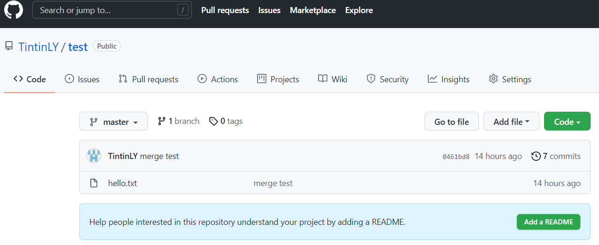

#### 拉取远程仓库到本地库

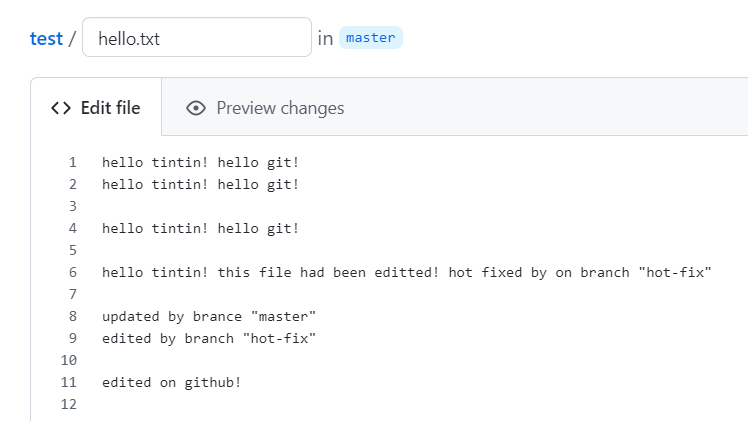

```bash
82129@DESKTOP-R0J8UMG MINGW64 /e/git repository/test (master)
$ git pull test master
remote: Enumerating objects: 5, done.
remote: Counting objects: 100% (5/5), done.
remote: Compressing objects: 100% (2/2), done.
remote: Total 3 (delta 1), reused 0 (delta 0), pack-reused 0
Unpacking objects: 100% (3/3), 664 bytes | 73.00 KiB/s, done.
From https://github.com/TintinLY/test
 * branch            master     -> FETCH_HEAD
   0461bd8..17194d0  master     -> test/master
Updating 0461bd8..17194d0
Fast-forward
 hello.txt | 2 ++
 1 file changed, 2 insertions(+)

82129@DESKTOP-R0J8UMG MINGW64 /e/git repository/test (master)
$ git status
On branch master
nothing to commit, working tree clean

```

#### 克隆远程库到本地

```bash
82129@DESKTOP-R0J8UMG MINGW64 /e/git repository
$ git clone https://github.com/TintinLY/test.git
fatal: destination path 'test' already exists and is not an empty directory.

82129@DESKTOP-R0J8UMG MINGW64 /e/git repository
$ git clone https://github.com/TintinLY/test2.git
Cloning into 'test2'...
remote: Enumerating objects: 6, done.
remote: Counting objects: 100% (6/6), done.
remote: Compressing objects: 100% (3/3), done.
remote: Total 6 (delta 0), reused 0 (delta 0), pack-reused 0
Receiving objects: 100% (6/6), done.

82129@DESKTOP-R0J8UMG MINGW64 /e/git repository
$ cd test2

82129@DESKTOP-R0J8UMG MINGW64 /e/git repository/test2 (main)
$ git remote -v
origin  https://github.com/TintinLY/test2.git (fetch)
origin  https://github.com/TintinLY/test2.git (push)

```

> 小结: clone 会做如下操作。1、拉取代码。2、初始化本地仓库。3、创建别名 origin

#### 邀请加入团队

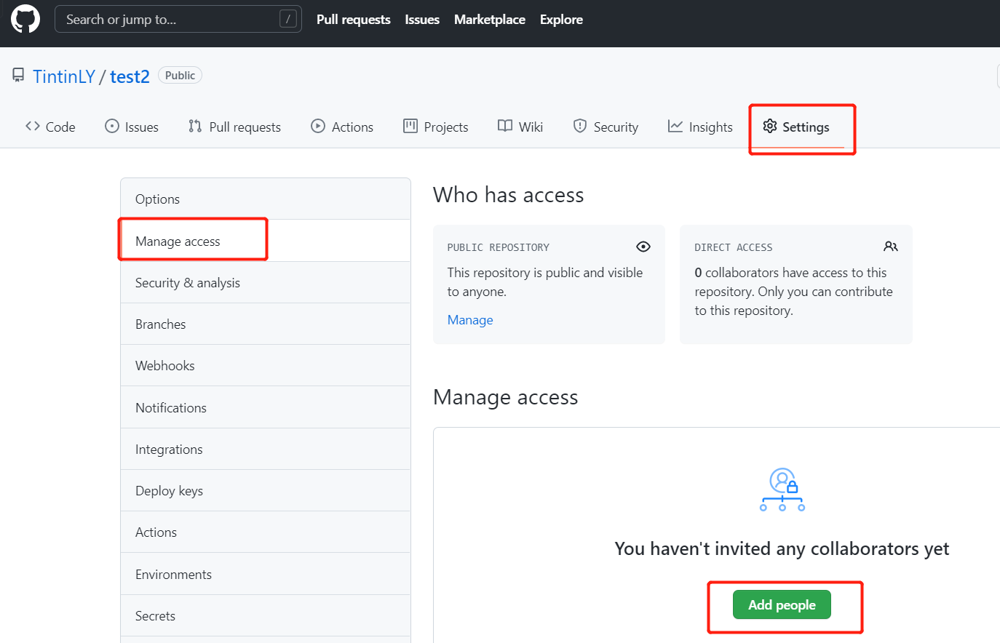

被邀请账户点击链接获得邀请函并接收或拒绝

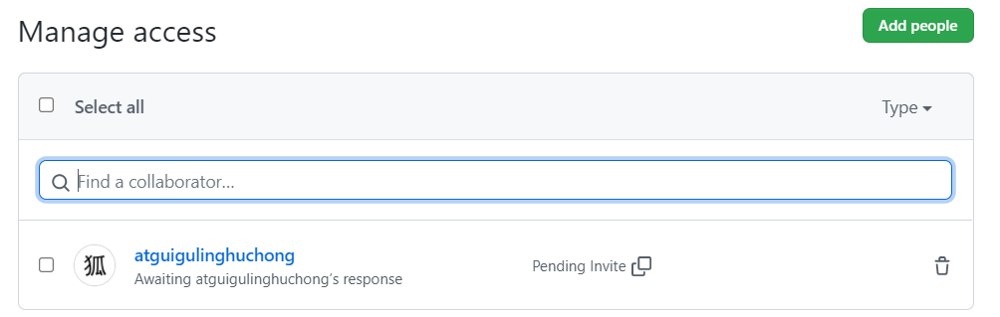

### 跨团队协作


### SSH 免登录

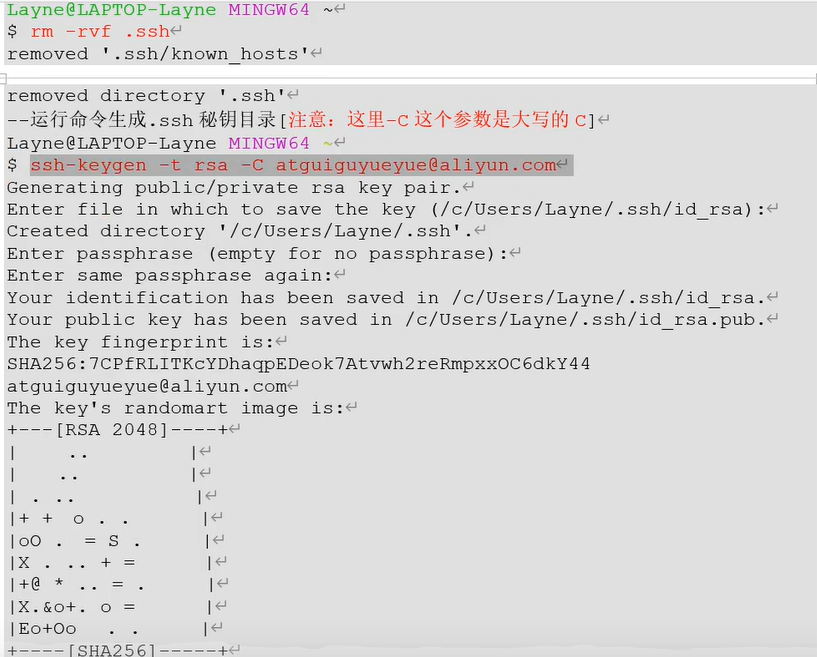

[磁盘下的 ssh 密钥路径](C:\Users\82129\.ssh)


复制公钥内容粘贴到 github 上

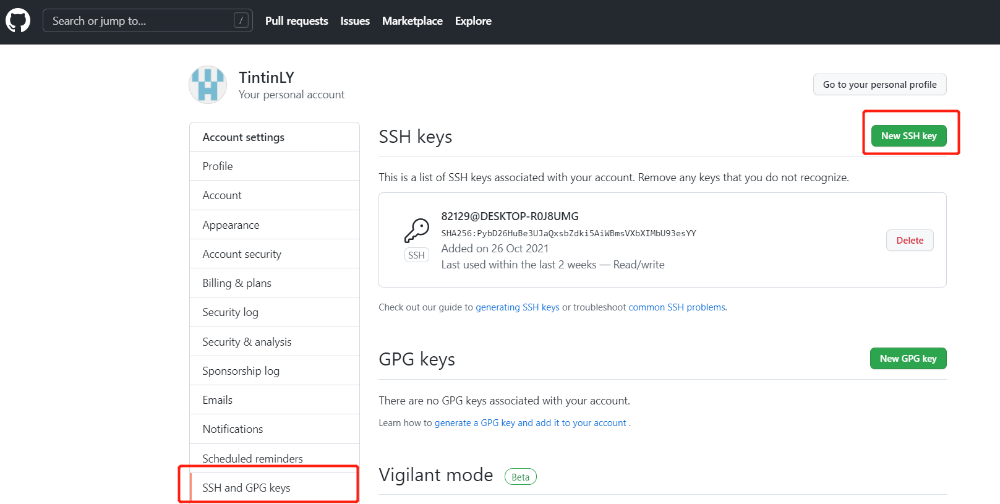

利用 ssh 链接可以拉取或推送文件

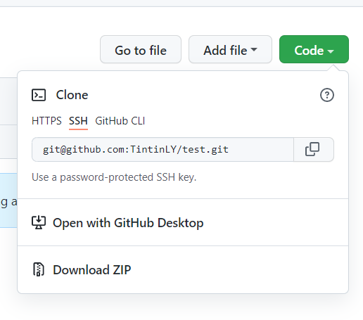

```bash
82129@DESKTOP-R0J8UMG MINGW64 /e/git repository/test (master)
$ git pull git@github.com:TintinLY/test.git master
remote: Enumerating objects: 5, done.
remote: Counting objects: 100% (5/5), done.
remote: Compressing objects: 100% (2/2), done.
remote: Total 3 (delta 1), reused 0 (delta 0), pack-reused 0
Unpacking objects: 100% (3/3), 654 bytes | 72.00 KiB/s, done.
From github.com:TintinLY/test
 * branch            master     -> FETCH_HEAD
Updating 17194d0..3643863
Fast-forward
 hello.txt | 2 ++
 1 file changed, 2 insertions(+)

```

## 7 IDEA 集成 Git

### 7.1 配置 Git 忽略

与顼目的实际功能无关, 不参与服务器上部署运行。把它们忽略掉能够屏蔽 IDE 工具之间的差异。

1. 创建忽略规则文件 ⅹ XXX.Ignore(前缀名随便起, 建议是 git. ignore)
   这个文件的存放位置原则上在哪里都可以, 为了便于让~ gitconfig 文件引用, 建议也放在用户目录下

   编辑本地忽略配置文件，文件名任意 (git.ignore)

```
## Compiled class file 
*.class

## Log file 
*.log

## BlueJ files 
*.ctxt

## Mobile Tools for Java (J2ME)
.mtj.tmp/

## Package Files ##
*.jar 
*.war 
*.nar 
*.ear 
*.zip
*.tar.gz 
*.rar

## virtual machine crash logs, see http://www.java.com/en/download/help/error_hotspot.xml
hs_err_pid*

.classpath
.project
.settings
target
```

2. 在 gitconfig 文件中引用忽略配置文件(此文件在 Windows 的家目录中)

   ```
   [filter "lfs"]
   	clean = git-lfs clean -- %f
   	smudge = git-lfs smudge -- %f
   	process = git-lfs filter-process
   	required = true
   [user]
   	name = Tintin
   	email = 821294434@qq.com
   [core]
   	excludesfile = C:/Users/82129/git.ignore
   
   ```

> 注意：这里路径中一定要使用“/”，不能使用“\”

### 7.2 定位 Git 程序

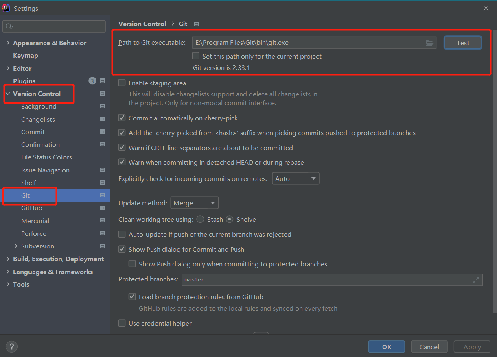

### 7.3 初始化到本地库

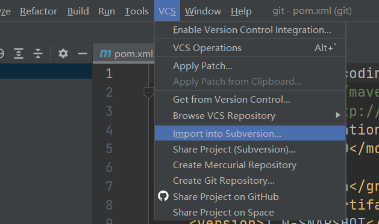


### 7.4 添加到暂存区

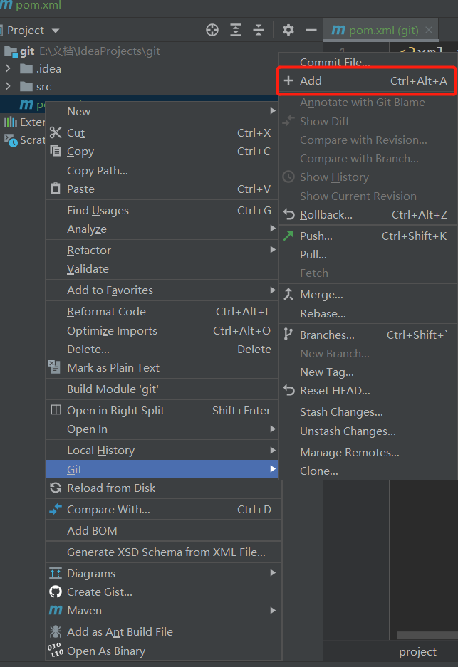

新建文件时自动识别


### 7.5 提交到本地库

### 7.6 切换版本


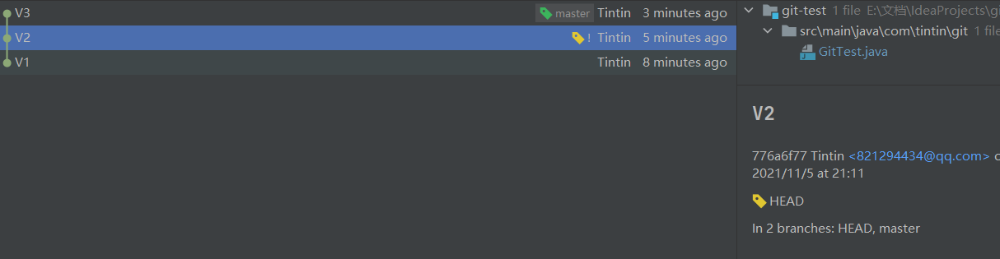

### 7.7 创建分支

### 7.8 切换分支

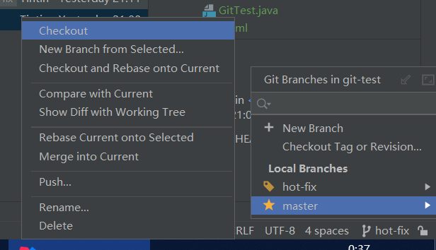

### 7.9 合并分支


### 7.10 解决冲突


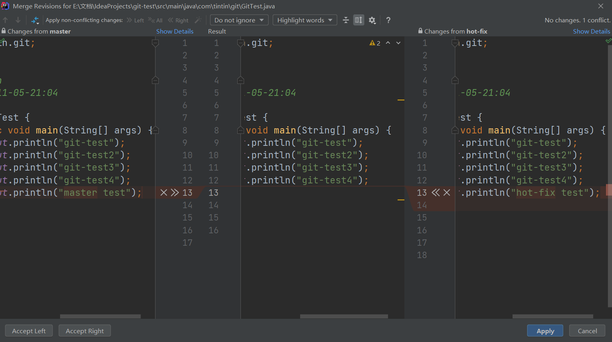


## 8 IDEA 集成 GitHub

### 8.1 设置 GitHub 账号


### 8.2 分享工程到 GitHub


### 8.3 push

### 8.4 pull

注意: pu 是拉取远端仓库代码到本地, 如果远程库代码和本地库代码不一致, 会自动合并, 如果自动合并失败, 还会涉及到手动解决冲突的问题。4

### 8.5 clone


## 9 国内代码托运中心 码云 Gitee

### 9.1 简介

码云是开源中国推出的基于 Git 的代码托管服务中心, 网址是 htps:/ gitee. com, 使用方式跟 Github 一样, 而且它还是一个中文网站, 如果你英文不是很好它是最好的选择

### 9.2 注册登录

### 9.3 创建远程库 


### 9.4 IDEA 集成 Gitee

#### 9.4.1 安装插件

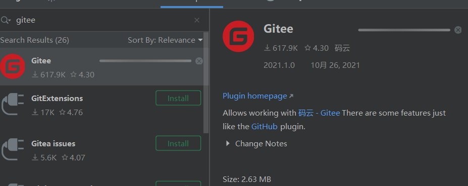

#### 9.4.2 连接 Gitee

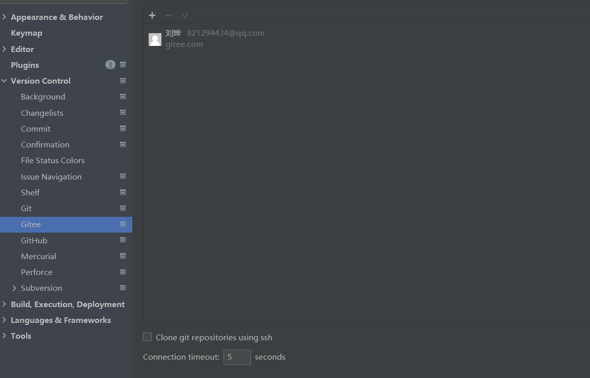

### 9.5 码云复制 GitHub 项目

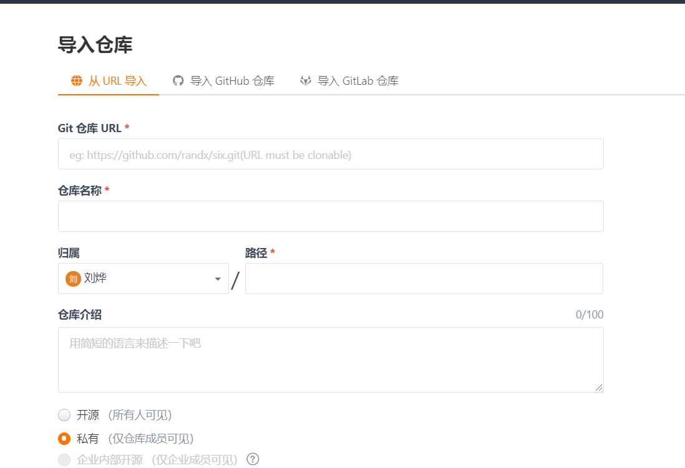

更新项目


## 10 自建代码托管平台 GitLab

### 10.1 简介

Gitlab 是由 GitlabInc.开发, 使用 MT 许可证的基于网络的 Git 仓库管理工具, 且具有 wik 和 isue 跟踪功能。使用 Git 作为代码管理工具, 并在此基础上搭建起来的 web 服务 Gitlab 由乌克兰程序员 Dmitriy Zaporozhets 和 valery Sizov 开发, 它使用 Ruby 语言写成。后来, 一些部分用 Go 语言重写。截止 2018 年 5 月, 该公司约有 290 名团队成员, 以及 2000 多名开源贡献者。 Gitlab 被 BM, Sony, JulichResearch Center, NASA, Alibaba, Invincea, OrEilly Media, Leibniz-Rechenzentrum(IRZ), CERN, SpaceX 等组织使用。

### 10.2 官网

[Iterate faster, innovate together | GitLab](https://about.gitlab.com/)

### 10.3 GitLab 安装 

#### 10.3.1 服务器准备 

准备一个系统为 CentOS7 以上版本的服务器，要求内存 4G，磁盘 50G。 

关闭防火墙，并且配置好主机名和 IP，保证服务器可以上网。 

此教程使用虚拟机：主机名：gitlab-server IP 地址：192.168.6.200 

#### 10.3.2 安装包准备 

Yum 在线安装 gitlab- ce 时，需要下载几百 M 的安装文件，非常耗时，所以最好提前把 所需 RPM 包下载到本地，然后使用离线 rpm 的方式安装。 

下载地址： https://packages.gitlab.com/gitlab/gitlabce/packages/el/7/gitlab-ce-13.10.2-ce.0.el7.x86_64.rpm 注：资料里提供了此 rpm 包，直接将此包上传到服务器/opt/module 目录下即可。

 #### 10.3.3 编写安装脚本 

安装 gitlab 步骤比较繁琐，因此我们可以参考官网编写 gitlab 的安装脚本。

```
 [root@gitlab-server module]## vim gitlab-install.sh sudo rpm -ivh /opt/module/gitlab-ce-13.10.2-ce.0.el7.x86_64.rpm sudo yum install -y curl policycoreutils-python openssh-server croniesudo lokkit -s http -s ssh sudo yum install -y postfix sudo service postfix start sudo chkconfig postfix on curl https://packages.gitlab.com/install/repositories/gitlab/gitlabce/script.rpm.sh | sudo bash sudo EXTERNAL_URL="http://gitlab.example.com" yum -y install gitlabce
```

 给脚本增加执行权限

```
 [root@gitlab-server module]## chmod +x gitlab-install.sh [root@gitlab-server module]## ll 总用量 403104 -rw-r--r--. 1 root root 412774002 4 月 7 15:47 gitlab-ce-13.10.2- ce.0.el7.x86_64.rpm -rwxr-xr-x. 1 root root 416 4 月 7 15:49 gitlab-install.sh 
```

然后执行该脚本，开始安装 gitlab-ce。注意一定要保证服务器可以上网。

```
 [root@gitlab-server module]## ./gitlab-install.sh  警告：/opt/module/gitlab-ce-13.10.2-ce.0.el7.x86_64.rpm: 头 V4  RSA/SHA1 Signature, 密钥 ID f27eab47: NOKEY 准备中... ########################################  [100%] 正在升级/安装... 1:gitlab-ce-13.10.2-ce.0.el7  ######################################## [100%] 。 。 。 。 。 。 
```

#### 10.3.4 初始化 GitLab 服务 

执行以下命令初始化 GitLab 服务，过程大概需要几分钟，耐心等待…

```
 [root@gitlab-server module]## gitlab-ctl reconfigure 。 。 。 。 。 。 Running handlers: Running handlers complete Chef Client finished, 425/608 resources updated in 03 minutes 08  seconds gitlab Reconfigured! 
```


#### 10.3.5 启动 GitLab 服务 

执行以下命令启动 GitLab 服务，如需停止，执行 gitlab-ctl stop

```
 [root@gitlab-server module]## gitlab-ctl start ok: run: alertmanager: (pid 6812) 134s ok: run: gitaly: (pid 6740) 135s ok: run: gitlab-monitor: (pid 6765) 135s  ok: run: gitlab-workhorse: (pid 6722) 136s ok: run: logrotate: (pid 5994) 197s ok: run: nginx: (pid 5930) 203s ok: run: node-exporter: (pid 6234) 185s ok: run: postgres-exporter: (pid 6834) 133s ok: run: postgresql: (pid 5456) 257s ok: run: prometheus: (pid 6777) 134s ok: run: redis: (pid 5327) 263s ok: run: redis-exporter: (pid 6391) 173s ok: run: sidekiq: (pid 5797) 215s ok: run: unicorn: (pid 5728) 221s 
```


#### 10.3.6 使用浏览器访问 GitLab 

使用主机名或者 IP 地址即可访问 GitLab 服务。需要提前配一下 windows 的 hosts 文件


首次登陆之前，需要修改下 GitLab 提供的 root 账户的密码，要求 8 位以上，包含大小 写子母和特殊符号。因此我们修改密码为 Atguigu.123456 然后使用修改后的密码登录 GitLab。

#### 10.3.7 GitLab 创建远程库

#### 10.3.8 IDEA 集成 GitLab

安装 GitLab 插件

设置 GitLab 插件

注意：gitlab 网页上复制过来的连接是：http://gitlab.example.com/root/git-test.git， 需要手动修改为：http://gitlab-server/root/git-test.git 选择 gitlab 远程连接，进行 push。