[TOC]

# 1 注册GitHub

注册GitHub详细步骤：

打开官网:[GitHub官网](https://link.zhihu.com/?target=https%3A//github.com/)

***sign up*** 注册

填完上图中的昵称、邮箱地址（QQ/163邮箱都行）、密码（确保至少有15个字符或至少包括数字和小写字母的8个字符），再验证完成注册

点击创建仓库，得到第一个工程hello

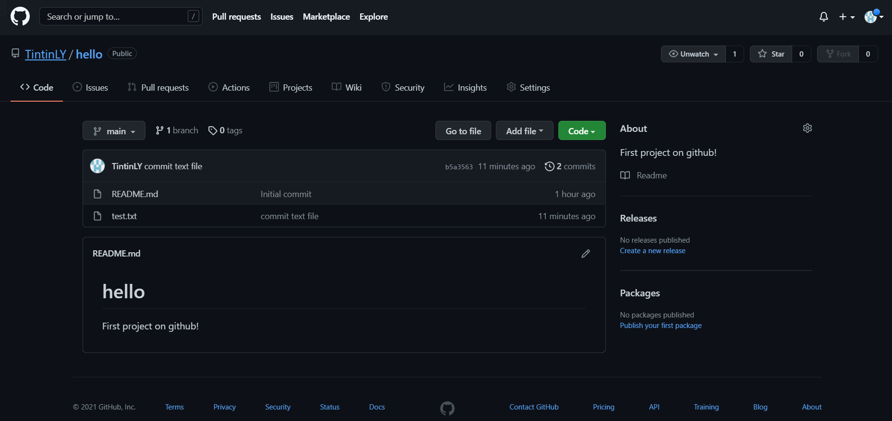

# 2 Git安装

进入Git官网[Git (git-scm.com)](https://git-scm.com/)，点击 ***Downloads*** 下载并安装

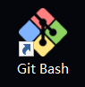

打开 Git Bash, 输入git 回车得到如下图 即完成

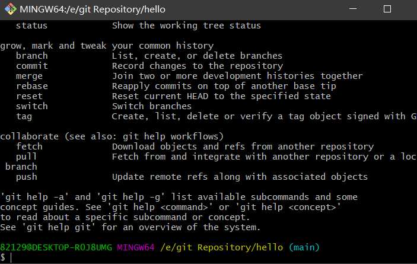

# 3 绑定GitHub并提交文件

在GitHub可以直解上传文件，但是由于网络原因不好用

所以我们利用SSH来完成GitHub的绑定并提交文件，方便快捷。

> SSH（安全外壳协议，Secure Shell 的缩写）是建立在应用层基础上的安全协议。SSH 是目前较可靠，专为远程登录会话和其他网络服务提供安全性的协议，利用 SSH 协议可以有效防止远程管理过程中的信息泄露问题。简单来说，SSH就是保障你的账户安全，将你的数据加密压缩，不仅防止其他人截获你的数据，还能加快传输速度。如果想详细了解的话，可以看这篇文章：[详述 SSH 的原理及其应用 - CSDN](https://link.zhihu.com/?target=https%3A//blog.csdn.net/qq_35246620/article/details/54317740)，

下面就详细介绍如何绑定GitHub和提交文件。

## 绑定GitHub

要用git上传文件到GitHub首先得利用SSH登录远程主机

登录方式有两种：一种是口令登录；另一种是公钥登录。

口令登录使得每次都要输入密码十分麻烦，而公钥登录省去了输入密码的步骤。首先我们得在GitHub添加SSH key配置，而要想生成SSH key，首先要安装SSH，git bash自带了SSH。

检验SSH是否安装。打开Git Bash 输入ssh，出现下图即可

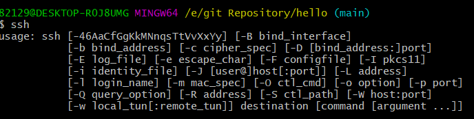

生成密钥。输入 ssh-keygen -t rsa 命令***（注意空格）*** 敲四次回车键，之后就就会生成两个文件，分别为秘钥 id_rsa.txt 和公钥 id_rsa.pub。

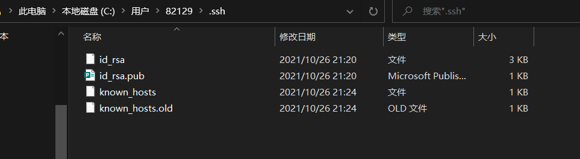

接下来我们要做的事情就是把公钥 id_rsa.pub 的内容添加到 GitHub。复制公钥 id_rsa.pub 文件里的内容，你可以通过目录找到 id_rsa.pub 文件的位置，用记事本打开文件复制。如果你实在找不到文件也没有关系，按照以下步骤直接在 Git Bash 上打开就行：

```bash
$ cd ~/.ssh 
$ ls
$ cat id_rsa.pub
```

> ps:
> ***git中的复制粘贴不是 Ctrl+C 和 Ctrl+V，而是 Ctrl+insert 和Shift+insert***

下来进入我们的 GitHub 主页，先点击右上角，再点击 ***settings\*** ：

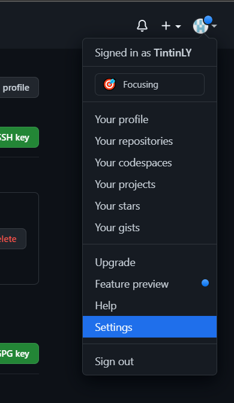

如下图，先点击 ***SSH and GPG keys，\***再点击 ***New SSH key.***

将复制的公钥 id_rsa.pub 的内容粘贴到 key 内，再点击 ***Add SSH key，\***如下图：

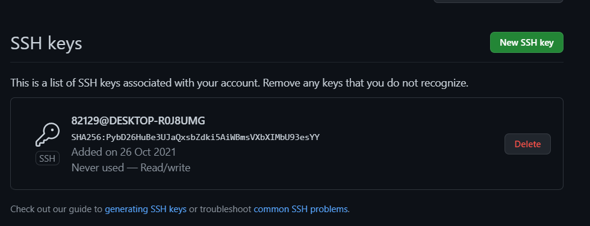

验证是否成功，我们可以通过在 Git Bash 中输入 ` ssh -T git@github.com` 进行检验：

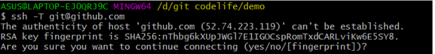

第一次会出现这种情况，填 yes 就行，若出现下图中的情况，则表明绑定成功：

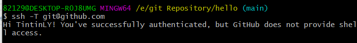

## 提交文件

提交文件有两种方法：

### 第一种：本地没有 git 仓库

1. 直接将远程仓库 clone 到本地；
2. 将文件添加并 commit 到本地仓库；
3. 将本地仓库的内容push到远程仓库。

### 第二种：本地有 Git 仓库，并且我们已经进行了多次 commit 操作

1. 建立一个本地仓库进入，init 初始化；
2. 关联远程仓库；
3. 同步远程仓库和本地仓库；
4. 将文件添加提交到本地仓库；
5. 将本地仓库的内容 push 到远程仓库。

### 克隆远程仓库到本地

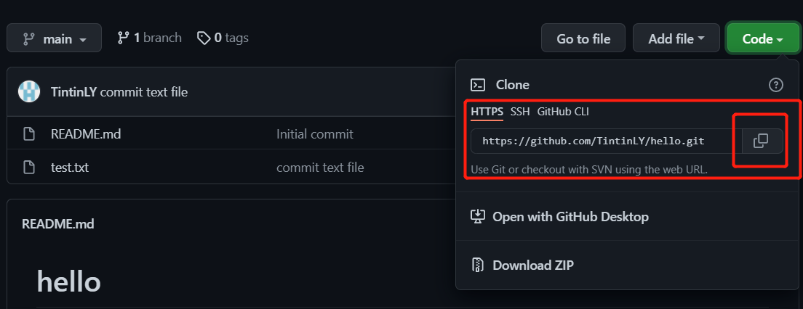

```bash
$ cd "E:\git Repository"
$ git clone https://github.com/TintinLY/hello.git
```

得到内容与远程仓库一致的本地仓库

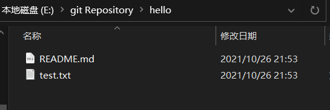

### 已有本地仓库关联远程仓库

首先，我们建立一个本地仓库 demo，使用 git init 命令初始化这个仓库

```bash
cd "E:\git Repository\hello"
$ git init
```

修改当前仓库的分支名与远程仓库的分支名一致

```bash
$ git branch -m master main
```

关联远程仓库

```bash
$ git remote add origin https://github.com/TintinLY/hello.git
```

同步远程仓库与本地仓库

```bash
$ git pull origin main
```

回到本地仓库，发现我们已经把远程仓库的内容同步到了本地仓库：

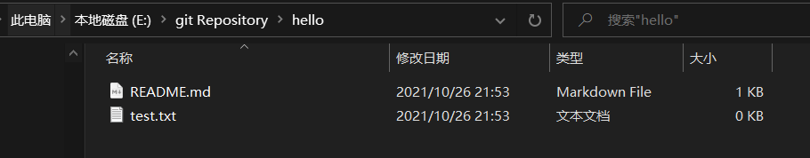

### 上传文件

创建一个 text.txt 测试文件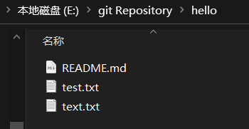

查看仓库状态

```bash
$ git status
```

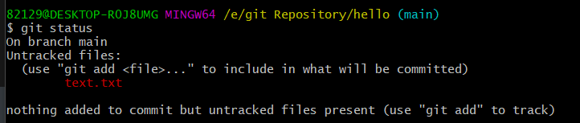

hello 已经是一个 Git 仓库了，而我们刚刚创建的文件 text.txt 没有被追踪，也就是没有提交到本地仓库。

现在我们使用 git add 命令将文件添加到了「临时缓冲区」，再用 git commit -m "提交信息" 将其提交到本地仓库，如下图：

```bash
$ git add text.txt
$ git commit -m "commit text file"
```

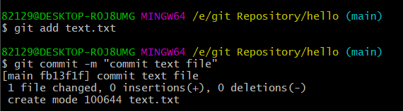

查看仓库提交日志：

```bash
$ git log
```

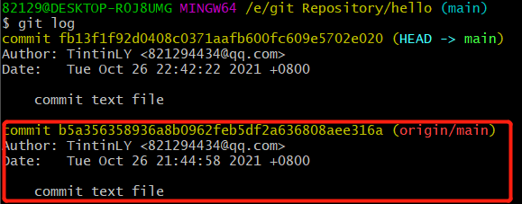

再输入 git status 查看一下仓库状态：

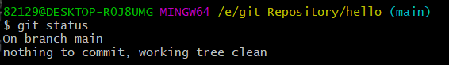

将本地仓库提交到远程仓库，origin是远程主机的名字，若出现连接出错可以使用git init命令重新初始化本地仓库

```bash
$ git init
$ git push origin main
```

第一次上传需要输入密码，验证成功后，如下图：

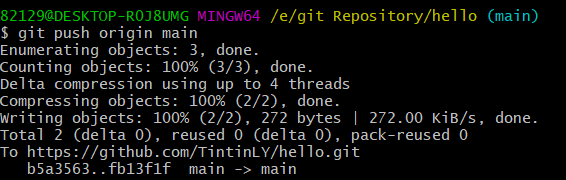

刷新 GitHub 中 text 仓库：

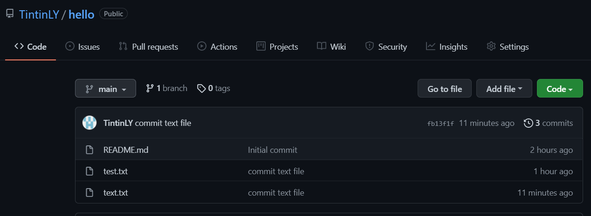

# 4 购买域名

# 5 安装node.js和Hexo

## 安装nodejs

下载地址：[node.js官网](https://link.zhihu.com/?target=https%3A//nodejs.org/en/) 安装

安装完成可以用打开cmd检验一下是否安装成功，用 node -v 和 npm -v 命令检查版本，如下图：

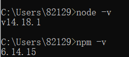

**设置npm在安装全局模块时的路径和环境变量**

因为如果不设置的话，安装模块的时候就会把模块装到C盘，占用C盘的空间，并且有可能安装好hexo后却无法使用。

在 nodejs 文件夹中新建两个空文件夹 node_cache、node_global，

打开cmd，输入如下两个命令：

```bash
npm config set prefix "E:\nodejs\node_global"

npm config set cache "E:\nodejs\node_cache"
```

设置环境变量：**win10系统 --> 打开控制面板 --> 系统 -->高级系统设置 --> 环境变量 ，**然后在系统变量中新建一个变量名为“NODE_PATH”  E:\Program Files\nodejs\node_global\node_modules

然后编辑用户变量里的Path，将相应npm的路径改为：E:\Program Files\nodejs\node_global

在 cmd 命令下执行 npm install webpack -g ：

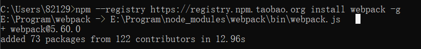

## 安装Hexo

Hexo就是我们的个人博客网站的框架，在安装之前，我们要先在GitHub上创立一个仓库，

仓库名格式 用户名.github.io

接下来就是安装Hexo，首先在D盘建立一个文件夹 Blog，点开 Blog 文件夹，鼠标右键打开 Git Bush Here，输入npm命令安装Hexo：

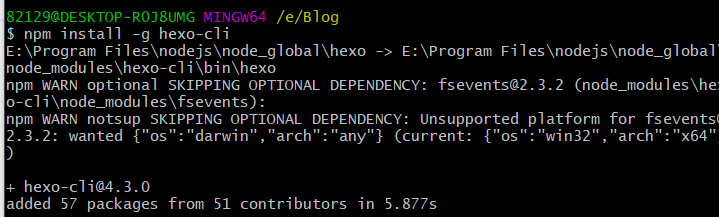


> # 安装npm包的时候报错rollbackFailedOptional: verb npm-session
>
> 1. 可以临时使用淘宝镜像
>    npm --registry https://registry.npm.taobao.org install 你想安装的npm包名称
> 2. 安装淘宝镜像
>    npm install -g cnpm --registry=https://registry.npm.taobao.org
>    cnpm install 你想安装的npm包名称
>    然后就可以像使用npm一样使用cnpm进行安装了

安装完成后，输入 hexo init 命令初始化博客：

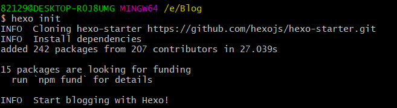

然后输入 hexo g 静态部署：

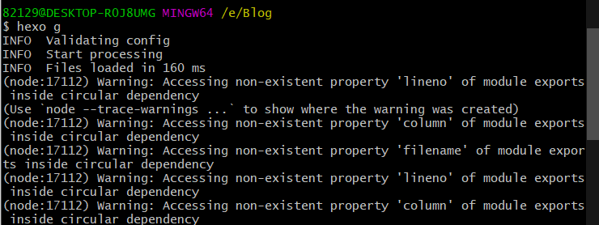

这时网页已经部署完成，输入 hexo s 命令可以查看：


浏览器输入[Hexo](http://localhost:4000/)就可以打开新部署的网页：

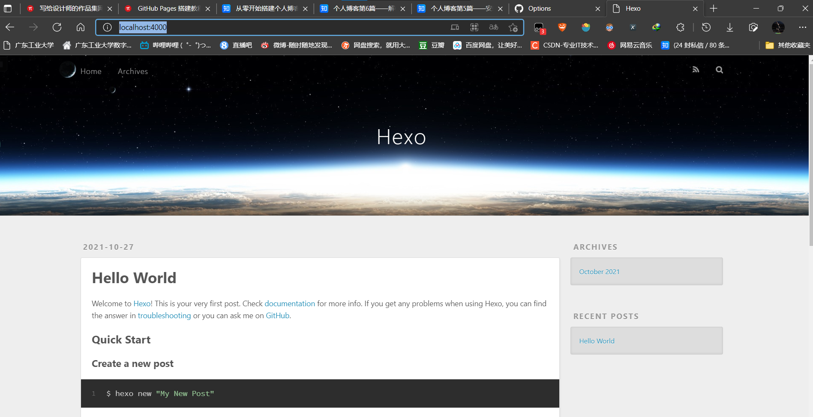

## 将Hexo部署到GitHub

现在回到我们的 Blog 文件夹，用笔记本打开 _config.yml 文件

下滑到文件底部，填上如下内容：

```yml
# Deployment
## Docs: https://hexo.io/docs/one-command-deployment
deploy:
  type: git
  repository: https://github.com/TintinLY/TintinLY.github.io.git  #你的仓库地址
  branch: main
```

然后回到 Blog 文件夹中，打开 Git Bash，安装Git部署插件，输入命令

```bash
npm install hexo-deployer-git --save
```

然后分别输入以下三条命令：

```bash
hexo clean   #清除缓存文件 db.json 和已生成的静态文件 public
hexo g       #生成网站静态文件到默认设置的 public 文件夹(hexo generate 的缩写)
hexo d       #自动生成网站静态文件，并部署到设定的仓库(hexo deploy 的缩写)
```

> 或使用这条指令 hexo d -g 部署到仓库中

现在虽然可以访问我们的网站，但是网址是GitHub提供的：[Hexo (tintinly.github.io)](https://tintinly.github.io/) 而我们想使用我们自己的个性化域名

# 6 解析域名

# 7 设置next主题

## 更换主题

当前用得最多的是next主题，那为什么用得多呢？当然是符合大多数人的审美。我使用的是next(v7.7.1)，下载地址：[theme-next/hexo-theme-next](https://link.zhihu.com/?target=https%3A//github.com/theme-next/hexo-theme-next)

打开博客根目录Blog文件夹，右键Git Bash，输入如下代码将next主题下载到目录Blog/themes：

```bash
git clone https://github.com/theme-next/hexo-theme-next themes/next
```

打开根目录下的_config.yml(称为**站点配置文件**)，修改主题（**注意冒号后都要有空格**）：

```yml
# Site
title: 枫叶苑  #标题
subtitle: ''
description: 选择有时候比努力更重要     #简介或者格言
keywords:
author: 枫叶     #作者
language: zh-CN     #主题语言
timezone: Asia/Shanghai    #中国的时区

# Extensions
## Plugins: https://hexo.io/plugins/
## Themes: https://hexo.io/themes/
theme: next   #主题改为next
```

next主题有四种，如下图依次为Muse、Mist、Pisces、Gemini（反正我没看出来后两个有什么区别）：

打开目录Blog/themes/next/下的_config.yml（称为**主题配置文件**），只要将你选的主题前的#删除就行了：

# 8 优化主题

参考

[个人博客第8篇——优化主题（持续更新） - 知乎 (zhihu.com)](https://zhuanlan.zhihu.com/p/106060640)

## 1 设置菜单

打开主题配置文件即themes/next下的_config.yml，查找menu，将前面的#删除就行了：

```text
menu:
  home: / || home                      #首页
  archives: /archives/ || archive      #归档
  categories: /categories/ || th       #分类
  tags: /tags/ || tags                 #标签
  about: /about/ || user               #关于
  resources: /resources/ || download   #资源
  #schedule: /schedule/ || calendar    #日历
  #sitemap: /sitemap.xml || sitemap    #站点地图，供搜索引擎爬取
  #commonweal: /404/ || heartbeat      #腾讯公益404
```

“||”前面的是目标链接，后面的是图标名称，next使用的图标全是[图标库 - Font Awesome 中文网](https://link.zhihu.com/?target=http%3A//www.fontawesome.com.cn/faicons/%23web-application)这一网站的，有想用的图标直接在fontawesome上面找图标的名称就行。resources是我自己添加的。

新添加的菜单需要翻译对应的中文，打开theme/next/languages/zh-CN.yml，在menu下设置：

```text
menu:
  home: 首页
  archives: 归档
  categories: 分类
  tags: 标签
  about: 关于
  resources: 资源
  search: 搜索
```

在根目录下打开Git Bash，输入如下代码：

```text
hexo new page "categories"
hexo new page "tags"
hexo new page "about"
hexo new page "resources"
```

此时在根目录的sources文件夹下会生成categories、tags、about、resources四个文件，每个文件中有一个`index.md`文件，修改内容分别如下：

```text
---
title: 分类
date: 2020-02-10 22:07:08
type: "categories"
comments: false
---

---
title: 标签
date: 2020-02-10 22:07:08
type: "tags"
comments: false
---

---
title: 关于
date: 2020-02-10 22:07:08
type: "about"
comments: false
---

---
title: 资源
date: 2020-02-10 22:07:08
type: "resources"
comments: false
---
```

注：如果有启用评论，默认页面带有评论。需要关闭的话，添加字段comments并将值设置为false。

## 2 设置建站时间

打开主题配置文件即themes/next下的_config.yml，查找since：

```text
footer:
  # Specify the date when the site was setup. If not defined, current year will be used.
  since: 2020-02   #建站时间
```

## 3  设置头像

打开主题配置文件即themes/next下的_config.yml，查找avatar，url后是图片的链接地址：

```text
# Sidebar Avatar
avatar:
  # Replace the default image and set the url here.
  url: /images/avatar.gif   #图片的位置，也可以是http://xxx.com/avatar.png
  # If true, the avatar will be dispalyed in circle.
  rounded: true   #头像展示在圈里
  # If true, the avatar will be rotated with the cursor.
  rotated: false  #头像随光标旋转
```

然后将你要的头像图片复制到themes/next/source/images里，重命名为avatar.png。

## 4  网站图标设置

我是在这个网站找的图标，免费的图标素材网站：[Easyicon](https://link.zhihu.com/?target=https%3A//www.easyicon.net/1220579-maple_leaf_icon.html)

下载16x16和32x32的图标后，打开主题配置文件，查找favicon，只要修改small和medium为你的图标路径：

```text
favicon:
  small: /images/favicon-16x16.png
  medium: /images/favicon-32x32.png
  apple_touch_icon: /images/apple-touch-icon-next.png
  safari_pinned_tab: /images/logo.svg
  #android_manifest: /images/manifest.json
  #ms_browserconfig: /images/browserconfig.xml
```

## 5 设置动态背景

## 6  设置背景图片

打开主题配置文件即themes/next下的_config.yml，将 style: source/_data/styles.styl 取消注释：

```text
custom_file_path:
  style: source/_data/styles.styl
```

打开根目录Blog/source创建文件_data/styles.styl，添加以下内容：

```text
// 添加背景图片
body {
      background: url(images/background.png);//自己喜欢的图片地址
      background-size: cover;
      background-repeat: no-repeat;
      background-attachment: fixed;
      background-position: 50% 50%;
}
```

## 7 主页文章添加阴影效果

打开themes/next/source/css/_common/conponents/post/post.styl，修改.post-block，如下：

```text
.use-motion {
  if (hexo-config('motion.transition.post_block')) {
    .post-block {
      opacity: 0;
      margin-top: 60px;
      margin-bottom: 60px;
      padding: 25px;
      background:rgba(255,255,255,0.9) none repeat scroll !important;
      -webkit-box-shadow: 0 0 5px rgba(202, 203, 203, .5);
      -moz-box-shadow: 0 0 5px rgba(202, 203, 204, .5);

    }
    .pagination, .comments{
      opacity: 0;
    }
  }
```

还有一种方法打开Blog/source/_date/style.styl文件，添加以下代码：

```text
// 主页文章添加阴影效果
.post {
   margin-top: 60px;
   margin-bottom: 60px;
   padding: 25px;
   -webkit-box-shadow: 0 0 5px rgba(202, 203, 203, .5);
   -moz-box-shadow: 0 0 5px rgba(202, 203, 204, .5);
```

## 8  添加顶部加载条

在themes/next目录下打开Git Bash，输入：

```text
git clone https://github.com/theme-next/theme-next-pace source/lib/pace
```

打开**主题配置文件**即themes/next下的_config.yml，找到pace，将enable：false改为true，你还可以选择类型（theme）：

```text
pace:
  enable: true
  # Themes list:
  # big-counter | bounce | barber-shop | center-atom | center-circle | center-radar | center-simple
  # corner-indicator | fill-left | flat-top | flash | loading-bar | mac-osx | material | minimal
  theme: minimal
```

## 9 设置预览摘要

next（v7.7.1）已经没有如下代码：

```text
auto_excerpt:
  enable: true
  length: 150
```

所以不需要设置，只要我们在文章中插入 <!-- more -->，该标签之上的是摘要，之后的内容不可见，需点击全文阅读按钮：

```text
 <!-- more -->
```

## 10 设置侧边栏显示效果

打开**主题配置文件**即themes/next下的_config.yml，找到Sidebar Settings，设置：

```text
sidebar:
  # Sidebar Position. #设置侧边栏位置
  position: left
  #position: right

  #  - post    默认显示模式
  #  - always  一直显示
  #  - hide    初始隐藏
  #  - remove  移除侧边栏
  display: post
```

## 11  侧边栏推荐阅读

打开**主题配置文件**即themes/next下的_config.yml，搜索links（里面写你想要的链接）：

```text
links_settings:
  icon: link
  title: 链接网站  #修改名称

links:
  #Title: http://yoursite.com
  百度: https://baidu.com
  鱼C论坛: https://fishc.com.cn
```

## 12 添加社交链接

打开**主题配置文件**即themes/next下的_config.yml，搜索social：

```text
social:
  GitHub: https://github.com/fengye97 || github
  E-Mail: mailto:yinhongfei1018@163.com || envelope
  知乎: https://www.zhihu.com/people/mai-nv-hai-de-xiao-huo-chai-35-19 || gratipay
  CSDN: https://https://blog.csdn.net/Later_001 || codiepie
```

“||”前面的是链接，后面的是[ FontAwesome](https://link.zhihu.com/?target=http%3A//www.fontawesome.com.cn/faicons/%23web-application)图标名称。

## 13 设置博文内链接为蓝色

打开themes/next/source/css/_common/components/post/post.styl文件，将下面的代码复制到文件最后：

```text
.post-body p a{
     color: #0593d3;
     border-bottom: none;
     &:hover {
       color: #0477ab;
       text-decoration: underline;
     }
   }
```

## 14. 显示文章字数和阅读时长

从根目录Blog打开Git Bash，执行下面的命令，安装插件：

```text
npm install hexo-wordcount --save
```

然后打开**站点配置文件，**在文件末尾加上下面的代码：

```text
symbols_count_time:
  symbols: true                # 文章字数统计
  time: true                   # 文章阅读时长
  total_symbols: true          # 站点总字数统计
  total_time: true             # 站点总阅读时长
  exclude_codeblock: false     # 排除代码字数统计
```

效果如下图：


## 15 显示站点文章总字数（另一种统计站点总字数的方法）

从根目录Blog打开Git Bash，执行下面的命令，安装插件：

```text
npm install hexo-wordcount --save
```

然后在/themes/next/layout/_partials/footer.swig文件尾部加上：

```text
<div class="theme-info">
  <div class="powered-by"></div>
  <span class="post-count">博客全站共{{ totalcount(site) }}字</span>
</div>
```

## 16 设置文章末尾”本文结束”标记

在路径/themes/next/layout/_macro 中新建 passage-end-tag.swig 文件,并添加以下内容：

```text
<div>
    
        <div style="text-align:center;color: #ccc;font-size:24px;">-------------本文结束<i class="fa fa-paw"></i>感谢您的阅读-------------</div>
    
</div>
```

接着打开/themes/next/layout/_macro/post.swig文件，在post-footer前添加代码：

```text
 
   <div>
     
   </div>
 
```

具体位置如下图：


然后打开**主题配置文件**（_config.yml)，在末尾添加：

```text
# 文章末尾添加“本文结束”标记
passage_end_tag:
  enabled: true
```

完成以上设置之后，在每篇文章之后都会添加如下效果图的样子：

## 17  文章末尾添加版权说明

查找**主题配置文件**themes/next/_config.yml中的creative_commons：

```text
creative_commons:
  license: by-nc-sa
  sidebar: false
  post: true  # 将false改为true即可显示版权信息
  language:
```

效果图：


## 18 添加访问量统计

打开**主题配置文件**即themes/next下的_config.yml，找到busuanzi_count，改为true：

```text
busuanzi_count:
  enable: true
```

打开/themes/next/layout/_partials/footer.swig，在最后添加如下内容：

```text

    <script async src="//dn-lbstatics.qbox.me/busuanzi/2.3/busuanzi.pure.mini.js"></script>

    <span id="busuanzi_container_site_pv">总访问量<span id="busuanzi_value_site_pv"></span>次</span>
    <span class="post-meta-divider">|</span>
    <span id="busuanzi_container_site_uv">总访客数<span id="busuanzi_value_site_uv"></span>人</span>
    <span class="post-meta-divider">|</span>
<!-- 不蒜子计数初始值纠正 -->
<script>
$(document).ready(function() {

    var int = setInterval(fixCount, 50);  // 50ms周期检测函数
    var countOffset = 20000;  // 初始化首次数据

    function fixCount() {            
       if (document.getElementById("busuanzi_container_site_pv").style.display != "none")
        {
            $("#busuanzi_value_site_pv").html(parseInt($("#busuanzi_value_site_pv").html()) + countOffset); 
            clearInterval(int);
        }                  
        if ($("#busuanzi_container_site_pv").css("display") != "none")
        {
            $("#busuanzi_value_site_uv").html(parseInt($("#busuanzi_value_site_uv").html()) + countOffset); // 加上初始数据 
            clearInterval(int); // 停止检测
        }  
    }
       	
});
</script> 

```

## 19 添加评论功能


我采用的是leanCloud

```
# Valine
# For more information: https://valine.js.org, https://github.com/xCss/Valine
valine:
  enable: true
  appid: PFljDxR0Q9DIjrqrI1KC61n5-gzGzoHsz # Your leancloud application appid
  appkey: 62eMAFVIEcPIQkulk2C3a9gP # Your leancloud application appkey
  notify: false # Mail notifier
  verify: false # Verification code
  placeholder: Just go go # Comment box placeholder
  avatar: mm # Gravatar style
  guest_info: nick,mail,link # Custom comment header
  pageSize: 10 # Pagination size
  language: # Language, available values: en, zh-cn
  visitor: false # Article reading statistic
  comment_count: true # If false, comment count will only be displayed in post page, not in home page
  recordIP: false # Whether to record the commenter IP
  serverURLs: # When the custom domain name is enabled, fill it in here (it will be detected automatically by default, no need to fill in)
  #post_meta_order: 0
```

## 20. 添加Fork me on Github

有两种，分别是：


选择你喜欢的类型，打开[小猫](https://link.zhihu.com/?target=http%3A//tholman.com/github-corners/)或者[字](https://link.zhihu.com/?target=https%3A//github.blog/2008-12-19-github-ribbons/)，复制代码添加到themes/next/layout/_layout.swig文件中，放在<div class="headband"></div>后面：

```text
<div class="headband"></div>
    <a href="https://github.com/fengye97" class="github-corner" aria-label="View source 
```

## 21 安装RSS插件

为什么要安装RSS插件呢？不了解的可以看看这篇文章：[rss订阅是什么意思?为什么要使用RSS?](https://link.zhihu.com/?target=http%3A//www.netshop168.com/article-85934.html)简单来说，RSS是一种协议，允许网站将其内容或其部分内容提供给其他网站或应用程序。通过使用RSS，可以节省宝贵的时间，并将各个站点提供的新闻和信息组织到一个中心点进行查看，也可以通过从使用RSS联合其内容的其他站点导入新闻来向你的站点添加新闻。

### （1）安装hexo-generator-feed插件

RSS需要有一个Feed链接，而这个链接需要靠hexo-generator-feed插件来生成，所以第一步需要添加插件，在Blog根目录打开Git Bash执行安装指令：

```text
npm install hexo-generator-feed --save
```

### （2）配置feed信息

在**站点配置文件**末尾加上如下代码：

```text
feed:
  type: rss2
  path: rss2.xml
  limit: 10
  hub:
  content: 'true'
```

### （3）配置rss

打开**主题配置文件，**搜索rss，将前面的#去掉：

```text
follow_me:
  #Twitter: https://twitter.com/username || twitter
  #Telegram: https://t.me/channel_name || telegram
  微信: /images/wechat_channel.jpg || wechat
  RSS: /atom.xml || rss
```

效果如图：


## 21 博文置顶

### （1）安装插件

在根目录Blog打开Git Bash，执行下面的命令：

```text
npm uninstall hexo-generator-index --save
npm install hexo-generator-index-pin-top --save
```

### （2）设置置顶标志

打开blog/themes/next/layout/_macro目录下的post.swig文件，定位到<div class="post-meta">标签下，插入如下代码：

```text

  <i class="fa fa-thumb-tack"></i>
  <font color=7D26CD>置顶</font>
  <span class="post-meta-divider">|</span>

```

### （3）在文章中添加top

然后在需要置顶的文章的Front-matter中加上top: true即可，如下：

```text
---
title: Hello World

top: true

---
```

效果如图：


## 22 图片可点击放大查看，放大后可关闭（fancybox可能有点问题，暂时未实现）

打开**主题配置文件**_config.yml，搜索fancybox，设置其值为true：

```text
fancybox: true
```

进入到theme/next文件夹下，打开Git Bash，输入如下代码：

```text
git clone theme-next/theme-next-fancybox3 source/lib/fancybox
```

## 23 代码块样式自定义

打开根目录Blog/source/_data/styles.styl，添加以下内容：

```text
// Custom styles.
code {
    color: #ff7600;
    background: #fbf7f8;
    margin: 2px;
}
// 大代码块的自定义样式
.highlight, pre {
    margin: 5px 0;
    padding: 5px;
    border-radius: 3px;
}
.highlight, code, pre {
    border: 1px solid #d6d6d6;
}
```

效果图：


## 24 本地搜索

打开cmd安装插件：

```text
npm install hexo-generator-search
```

查找主题配置文件themes/next/_config.yml中的local_search ：

```text
local_search:
  enable: true
  trigger: manual   #手动，按回车键或搜索按钮触发搜索
```

## 25 添加 README.md 文件

每个项目下一般都有一个 `README.md` 文件，但是使用 hexo 部署到仓库后，项目下是没有 `README.md` 文件的。

在 Hexo 目录下的 `source` 根目录下添加一个 `README.md` 文件，修改站点配置文件 _`config.yml `，将 `skip_render` 参数的值设置为

```
skip_render: README.md # 忽略渲染部署文件
```

保存退出即可。再次使用 `hexo d` 命令部署博客的时候就不会在渲染 README.md 这个文件了。

## 26 自定义鼠标样式

打开`themes/next/source/css/_custom/custom.styl`,在里面写下如下代码

```css
// 鼠标样式
  * {
      cursor: url("http://om8u46rmb.bkt.clouddn.com/sword2.ico"),auto!important
  }
  :active {
      cursor: url("http://om8u46rmb.bkt.clouddn.com/sword1.ico"),auto!important
  }
```

其中 url 里面必须是 ico 图片，ico 图片可以上传到网上（我是使用七牛云图床），然后获取外链，复制到 url 里就行了

## 27 加上萌萌的宠物

**具体实现方法**
在终端切换到你的博客的路径里，然后输入如下代码：

```cmake
npm install -save hexo-helper-live2d
```

~~然后打开`Hexo/blog/themes/next/layout`
的`_layout.swig`,将下面代码放到`</body>`之前：~~

(**注意，由于官方更新了包，所以画删除线的不用弄**)

然后在在 `hexo` 的 `_config.yml `中添加参数：（具体配置可以看[官方文档](https://link.segmentfault.com/?enc=yd2tpAH2nQP0M4kHXs4yDA%3D%3D.c%2FZpNtEX3PPBWcqO0Z%2Bg%2FqN9xEyZz3q6wnrhiApyX5DRgRqj%2FozjlP0g2%2BvKVR6d)）

```yaml
live2d:
  enable: true
  scriptFrom: local
  pluginRootPath: live2dw/
  pluginJsPath: lib/
  pluginModelPath: assets/
  model:
    use: live2d-widget-model-wanko
  display:
    position: right
    width: 150
    height: 300
  mobile:
    show: true
```

然后hexo clean ，hexo g ，hexo d 就可以看到了。

## 28 点击爆炸效果

跟那个红心是差不多的，首先在`themes/next/source/js/src`里面建一个叫fireworks.js的文件，复制效果代码：

打开`themes/next/layout/_layout.swig`,在`</body>`上面写下如下代码：

```django

   <canvas class="fireworks" style="position: fixed;left: 0;top: 0;z-index: 1; pointer-events: none;" ></canvas> 
   <script type="text/javascript" src="//cdn.bootcss.com/animejs/2.2.0/anime.min.js"></script> 
   <script type="text/javascript" src="/js/src/fireworks.js"></script>

```

打开主题配置文件，在里面最后写下：

```yaml
# Fireworks
fireworks: true
```

## 29 Hexo添加文章时自动打开编辑器

首先在Hexo目录下的scripts目录中创建一个JavaScript脚本文件。
如果没有这个scripts目录，则新建一个。
scripts目录新建的JavaScript脚本文件可以任意取名。
通过这个脚本，我们用其来监听hexo new这个动作，并在检测到hexo new之后，执行编辑器打开的命令。

将下列内容写入你的脚本：

```
var spawn = require('child_process').exec;
hexo.on('new', function(data){
  spawn('start  "markdown编辑器绝对路径.exe" ' + data.path);
});
```


