[TOC]

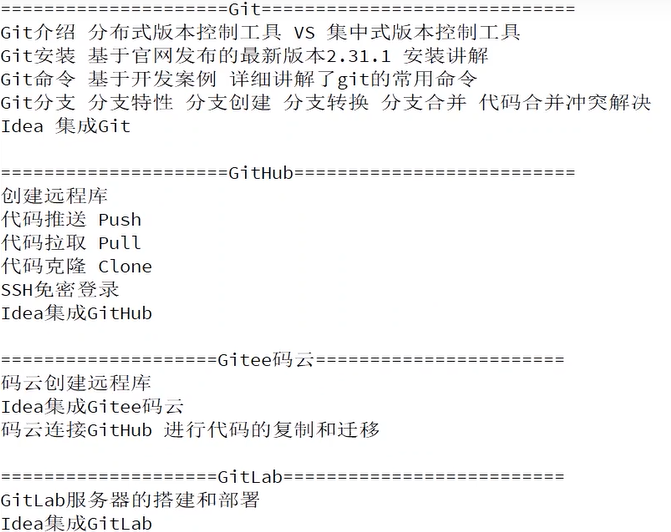

# 试验环境

```bash
82129@DESKTOP-R0J8UMG MINGW64 ~
$ git --version
git version 2.33.1.windows.1

```


# 1 Git概述

​	Git是一个免费的、开源的**分布式版本控制系统**,可以快速高效地处理从小型到大型的各种项目
​	Git易于学习,占地面积小,性能极快。它具有廉价的本地库,方便的暂存区域和多个工作流分支等特性。其性能优于 Subversion、CVS、 Perforce和 Clear Case等版本控制工具。

## 1.1 什么是版本控制

​	版本控制是一种记录文件内容变化,以便将来**査阅特定版本修订情况**的系统。
​	版本控制其实最重要的是可以记录文件修改历史记录,从而让用户能够查看历史版本方便版本切换。

## 1.2 为什么要版本控制

个人开发过渡到团队协作


## 1.3 版本控制工具

* 集中式版本控制工具

  CVS、**SVN(Subversion)**、VSS...

  * 集中化的版本控制系统诸如CVS、SVN等,都有一个**单一的集中管理的服务器,保存所有文件的修订版本**,而协同工作的人们都通过客户端连到这台服务器,取出最新的文件或者提交更新。多年以来,这已成为版本控制系统的标准做法。
  * 这种做法带来了许多好处,每个人都可以在一定程度上看到项目中的其他人正在做些什么。而管理员也可以轻松掌控每个开发者的权限,并且管理一个集中化的版本控制系统,要远比在各个客户端上维护本地数据库来得轻松容易。
  * 事分两面,有好有坏。这么做显而易见的缺点是**中央服务器的单点故障**。如果服务器宕机一小时,那么在这一小时内,谁都无法提交更新,也就无法协同工作。

* 分布式版本控制工具

  Git、Mercurial、Bazaar、Darcs...

  * 像Git这种分布式版本控制工具,客户端提取的不是最新版本的文件快照,而是把代码仓库完整地镜像下来(本地库)。这样任何一处协同工作用的文件发生故障,事后都可以用其他客户端的本地仓库进行恢复。因为每个客户端的每一次文件提取操作,实际上都是一次对整个文件仓库的完整备份。

  * 分布式的版本控制系统出现之后解决了集中式版本控制系统的缺陷
    1. 服务器断网的情况下也可以进行开发(因为版本控制是在本地进行的)
    2. 每个客户端保存的也都是整个完整的项目(包含历史记录,更加安全)

## 1.3 Git历史

​	 

## 1.5 工作机制

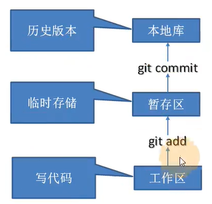

## 1.6 Git和代码托管中心

代码托管中心是基于网络服务器的远程代码仓库,一般我们简单称为**远程库**

* 局域网
  GitLab
* 互联网
  Github(外网)
  Gitee码云(国内网站)

# 2 Git安装

[G]: GitHub+Hexo搭建博客.md#2Git安装

[Git安装][G]

# 3 Git常用命令

| 命令名称                             | 作用           |
| ------------------------------------ | -------------- |
| git config --global user.name 用户名 | 设置用户签名   |
| git config --global user.email 邮箱  | 设置用户签名   |
| git init                             | 初始化本地库   |
| git status                           | 查看本地库状态 |
| git add 文件名                       | 添加到暂存区   |
| git commit -m "日志信息" 文件名      | 提交到本地库   |
| git reflog                           | 查看历史记录   |
| git reset --hard 版本号              | 版本穿梭       |

## 3.1 设置用户签名

```bash
82129@DESKTOP-R0J8UMG MINGW64 /e/桌面
$ git config --global user.name Tintin

82129@DESKTOP-R0J8UMG MINGW64 /e/桌面
$ git config --global user.email 821294434@qq.com

82129@DESKTOP-R0J8UMG MINGW64 /e/桌面
$ cd ~

82129@DESKTOP-R0J8UMG MINGW64 ~
$ cat ./.gitconfig
[filter "lfs"]
        clean = git-lfs clean -- %f
        smudge = git-lfs smudge -- %f
        process = git-lfs filter-process
        required = true
[user]
        name = Tintin
        email = 821294434@qq.com

```

说明:
签名的作用是区分不同操作者身份。用户的签名信息在每一个版本的提交信息中能够看到,以此确认本次提交是谁做的。Git首次安裝必须设置一下用户签名,否则无法提交代码。

> ※注意:这里设置用户签名和将来登录 Github(或其他代码托管中心)的账号没有任何关系。 

## 3.2 初始化本地库

初始化

```bash
82129@DESKTOP-R0J8UMG MINGW64 /e/git Repository/test
$ git init
Initialized empty Git repository in E:/git Repository/test/.git/
82129@DESKTOP-R0J8UMG MINGW64 /e/git Repository/test (master)
```

查看.git文件

```bash
$ ll -a
total 4
drwxr-xr-x 1 82129 197609 0 Nov  4 18:06 ./
drwxr-xr-x 1 82129 197609 0 Nov  4 18:06 ../
drwxr-xr-x 1 82129 197609 0 Nov  4 18:06 .git/

82129@DESKTOP-R0J8UMG MINGW64 /e/git Repository/test (master)
$ cd .git

82129@DESKTOP-R0J8UMG MINGW64 /e/git Repository/test/.git (GIT_DIR!)
$ ll
total 7
-rw-r--r-- 1 82129 197609  23 Nov  4 18:06 HEAD
-rw-r--r-- 1 82129 197609 130 Nov  4 18:06 config
-rw-r--r-- 1 82129 197609  73 Nov  4 18:06 description
drwxr-xr-x 1 82129 197609   0 Nov  4 18:06 hooks/
drwxr-xr-x 1 82129 197609   0 Nov  4 18:06 info/
drwxr-xr-x 1 82129 197609   0 Nov  4 18:06 objects/
drwxr-xr-x 1 82129 197609   0 Nov  4 18:06 refs/
```


## 3.3 查看本地库状态

第一次查看

```bash
82129@DESKTOP-R0J8UMG MINGW64 /e/git Repository/test (master)
$ git status
On branch master

No commits yet

nothing to commit (create/copy files and use "git add" to track)
```

新建文件

```bash


82129@DESKTOP-R0J8UMG MINGW64 /e/git Repository/test (master)
$ vim hello.txt

82129@DESKTOP-R0J8UMG MINGW64 /e/git Repository/test (master)
$ cat hello.txt
hello tintin! hello git!
hello tintin! hello git!

hello tintin! hello git!

hello tintin! hello git!

hello tintin! hello git!

hello tintin! hello git!

hello tintin! hello git!

hello tintin! hello git!
```

查看状态（检测到为追踪的文件）

```bash
82129@DESKTOP-R0J8UMG MINGW64 /e/git Repository/test (master)
$ git status
On branch master

No commits yet

Untracked files:
  (use "git add <file>..." to include in what will be committed)
        hello.txt

nothing added to commit but untracked files present (use "git add" to track)

```


## 3.4 添加到暂存区

将工作区文件添加到暂存区

```bash
82129@DESKTOP-R0J8UMG MINGW64 /e/git Repository/test (master)
$ git add hello.txt
warning: LF will be replaced by CRLF in hello.txt.
The file will have its original line endings in your working directory

```

查看状态（检测到暂存区有新文件）

```bash
82129@DESKTOP-R0J8UMG MINGW64 /e/git Repository/test (master)
$ git status
On branch master

No commits yet

Changes to be committed:
  (use "git rm --cached <file>..." to unstage)
        new file:   hello.txt


```

删除暂存区的文件

```bash
82129@DESKTOP-R0J8UMG MINGW64 /e/git Repository/test (master)
$ git rm --cached hello.txt
rm 'hello.txt'

82129@DESKTOP-R0J8UMG MINGW64 /e/git Repository/test (master)
$ ll
total 1
-rw-r--r-- 1 82129 197609 209 Nov  4 19:28 hello.txt

82129@DESKTOP-R0J8UMG MINGW64 /e/git Repository/test (master)
$ git status
On branch master

No commits yet

Untracked files:
  (use "git add <file>..." to include in what will be committed)
        hello.txt

nothing added to commit but untracked files present (use "git add" to track)

```

## 3.5 提交本地库

将暂存区的文件提交到本地库中

```bash
82129@DESKTOP-R0J8UMG MINGW64 /e/git Repository/test (master)
$ git commit -m "V1" hello.txt
warning: LF will be replaced by CRLF in hello.txt.
The file will have its original line endings in your working directory
[master (root-commit) a5908a3] V1
 1 file changed, 17 insertions(+)
 create mode 100644 hello.txt

```

查看状态（没有文件需要提交）

```bash
82129@DESKTOP-R0J8UMG MINGW64 /e/git Repository/test (master)
$ git status
On branch master
nothing to commit, working tree clean

```

查看日志

```bash
82129@DESKTOP-R0J8UMG MINGW64 /e/git Repository/test (master)
$ git reflog
a5908a3 (HEAD -> master) HEAD@{0}: commit (initial): V1

82129@DESKTOP-R0J8UMG MINGW64 /e/git Repository/test (master)
$ git log
commit a5908a39aa3e94eeb24a33dd76c337e7dca09f91 (HEAD -> master)
Author: Tintin <821294434@qq.com>
Date:   Thu Nov 4 19:36:57 2021 +0800

    V1

```

## 3.6 修改文件

修改后查看状态

```bash
82129@DESKTOP-R0J8UMG MINGW64 /e/git Repository/test (master)
$ vim hello.txt

82129@DESKTOP-R0J8UMG MINGW64 /e/git Repository/test (master)
$ git status
On branch master
Changes not staged for commit:
  (use "git add <file>..." to update what will be committed)
  (use "git restore <file>..." to discard changes in working directory)
        modified:   hello.txt

no changes added to commit (use "git add" and/or "git commit -a")

```

修改的文件添加到暂存区

```bash
82129@DESKTOP-R0J8UMG MINGW64 /e/git Repository/test (master)
$ git add hello.txt
warning: LF will be replaced by CRLF in hello.txt.
The file will have its original line endings in your working directory

82129@DESKTOP-R0J8UMG MINGW64 /e/git Repository/test (master)
$ git status
On branch master
Changes to be committed:
  (use "git restore --staged <file>..." to unstage)
        modified:   hello.txt

```

撤销修改

```bash
82129@DESKTOP-R0J8UMG MINGW64 /e/git Repository/test (master)
$ git restore --staged hello.txt


82129@DESKTOP-R0J8UMG MINGW64 /e/git Repository/test (master)
$ git status
On branch master
Changes not staged for commit:
  (use "git add <file>..." to update what will be committed)
  (use "git restore <file>..." to discard changes in working directory)
        modified:   hello.txt

no changes added to commit (use "git add" and/or "git commit -a")

```

添加到本地库

```bash

82129@DESKTOP-R0J8UMG MINGW64 /e/git Repository/test (master)
$ git commit -m "V3" hello.txt
warning: LF will be replaced by CRLF in hello.txt.
The file will have its original line endings in your working directory
[master 94bbf6f] V3
 1 file changed, 1 insertion(+), 2 deletions(-)

```

查看日志

```bash
82129@DESKTOP-R0J8UMG MINGW64 /e/git Repository/test (master)
$ git reflog
94bbf6f (HEAD -> master) HEAD@{0}: commit: V3
f07c8f3 HEAD@{1}: commit: V2
a5908a3 HEAD@{2}: commit (initial): V1

82129@DESKTOP-R0J8UMG MINGW64 /e/git Repository/test (master)
$ git log
commit 94bbf6f479ea90808f2a67f4076f7be0de90594b (HEAD -> master)
Author: Tintin <821294434@qq.com>
Date:   Thu Nov 4 19:51:42 2021 +0800

    V3

commit f07c8f3c3ba34ef871aca2a01aa7749d08a5a64b
Author: Tintin <821294434@qq.com>
Date:   Thu Nov 4 19:46:44 2021 +0800

    V2

commit a5908a39aa3e94eeb24a33dd76c337e7dca09f91
Author: Tintin <821294434@qq.com>
Date:   Thu Nov 4 19:36:57 2021 +0800

    V1

```

## 3.7 查看历史版本

查看历史版本

```bash
82129@DESKTOP-R0J8UMG MINGW64 /e/git Repository/test (master)
$ git reflog
94bbf6f (HEAD -> master) HEAD@{0}: commit: V3
f07c8f3 HEAD@{1}: commit: V2
a5908a3 HEAD@{2}: commit (initial): V1

82129@DESKTOP-R0J8UMG MINGW64 /e/git Repository/test (master)
$ git log
commit 94bbf6f479ea90808f2a67f4076f7be0de90594b (HEAD -> master)
Author: Tintin <821294434@qq.com>
Date:   Thu Nov 4 19:51:42 2021 +0800

    V3

commit f07c8f3c3ba34ef871aca2a01aa7749d08a5a64b
Author: Tintin <821294434@qq.com>
Date:   Thu Nov 4 19:46:44 2021 +0800

    V2

commit a5908a39aa3e94eeb24a33dd76c337e7dca09f91
Author: Tintin <821294434@qq.com>
Date:   Thu Nov 4 19:36:57 2021 +0800

    V1
```

版本穿梭

```bash
82129@DESKTOP-R0J8UMG MINGW64 /e/git Repository/test (master)
$ git reflog
94bbf6f (HEAD -> master) HEAD@{0}: commit: V3
f07c8f3 HEAD@{1}: commit: V2
a5908a3 HEAD@{2}: commit (initial): V1

82129@DESKTOP-R0J8UMG MINGW64 /e/git Repository/test (master)
$ git reset --hard f07c8f3
HEAD is now at f07c8f3 V2

82129@DESKTOP-R0J8UMG MINGW64 /e/git Repository/test (master)
$ git reflog
f07c8f3 (HEAD -> master) HEAD@{0}: reset: moving to f07c8f3
94bbf6f HEAD@{1}: commit: V3
f07c8f3 (HEAD -> master) HEAD@{2}: commit: V2
a5908a3 HEAD@{3}: commit (initial): V1

```

Git切换版本,底层其实是移动的HEAD指针,具体原理如下图所示。

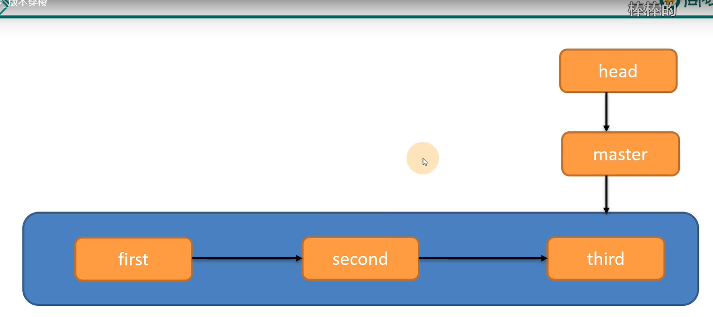

## 3.8 其他

```bash
# 将 文件夹取消版本控制(这里也可以放文件)，
git rm -r --cached ".gitignore"
```


# 4 Git分支操作


## 4.1 什么是分支

​	在版本控制过程中,同时推进多个任务,为每个任务,我们就可以创建每个任务的单独分支。**使用分支意味着程序员可以把自己的工作从开发主线上分离开来,开发自己分支的时候,不会影响主线分支的运行。**对于初学者而言,分支可以简单理解为副本,一个分支就是个单独的副本。(分支底层其实也是指针的引用)

## 4.2 分支的好处

同时并行推进多个功能开发,提高开发效率。各个分支在开发过程中,如果某一个分支开发失败,不会对其他分支有任何影响。失败
的分支删除重新开始即可。

## 4.4 分支的操作

| 命令名称            | 作用                         |
| ------------------- | ---------------------------- |
| git branch 分支名   | 创建分支                     |
| git branch -v       | 查看分支                     |
| git checkout 分支名 | 切换分支                     |
| git merge 分支名    | 把指定的分支合并到当前分支上 |

### 4.3.1 查看分支

```bash
82129@DESKTOP-R0J8UMG MINGW64 /e/git Repository/test (master)
$ git branch -v
* master 94bbf6f V3

```

### 4.3.2 创建分支

```bash
82129@DESKTOP-R0J8UMG MINGW64 /e/git Repository/test (master)
$ git branch hot-fix

82129@DESKTOP-R0J8UMG MINGW64 /e/git Repository/test (master)
$ git branch -v
  hot-fix 94bbf6f V3
* master  94bbf6f V3

```

### 4.3.3 修改分支

```bash
82129@DESKTOP-R0J8UMG MINGW64 /e/git Repository/test (master)
$ git checkout hot-fix
Switched to branch 'hot-fix'

82129@DESKTOP-R0J8UMG MINGW64 /e/git Repository/test (hot-fix)
$ git branch -v
* hot-fix 94bbf6f V3
  master  94bbf6f V3
```

在不同分支依旧可以新建修改提交文件

```bash
82129@DESKTOP-R0J8UMG MINGW64 /e/git Repository/test (hot-fix)
$ vim hello.txt

82129@DESKTOP-R0J8UMG MINGW64 /e/git Repository/test (hot-fix)
$ cat hello.txt
hello tintin! hello git!
hello tintin! hello git!

hello tintin! hello git!

hello tintin! this file had been editted! hot fixed by on branch "hot-fix"

82129@DESKTOP-R0J8UMG MINGW64 /e/git Repository/test (hot-fix)
$ git status
On branch hot-fix
Changes not staged for commit:
  (use "git add <file>..." to update what will be committed)
  (use "git restore <file>..." to discard changes in working directory)
        modified:   hello.txt

no changes added to commit (use "git add" and/or "git commit -a")

82129@DESKTOP-R0J8UMG MINGW64 /e/git Repository/test (hot-fix)
$ git add hello.txt

82129@DESKTOP-R0J8UMG MINGW64 /e/git Repository/test (hot-fix)
$ git status
On branch hot-fix
Changes to be committed:
  (use "git restore --staged <file>..." to unstage)
        modified:   hello.txt


82129@DESKTOP-R0J8UMG MINGW64 /e/git Repository/test (hot-fix)
$ git commit -m "hot-fix V1" hello.txt
[hot-fix 5151216] hot-fix V1
 1 file changed, 1 insertion(+), 1 deletion(-)

82129@DESKTOP-R0J8UMG MINGW64 /e/git Repository/test (hot-fix)
$ git reflog
5151216 (HEAD -> hot-fix) HEAD@{0}: commit: hot-fix V1
94bbf6f (master) HEAD@{1}: checkout: moving from master to hot-fix
94bbf6f (master) HEAD@{2}: reset: moving to 94bbf6f
f07c8f3 HEAD@{3}: reset: moving to f07c8f3
94bbf6f (master) HEAD@{4}: commit: V3
f07c8f3 HEAD@{5}: commit: V2
a5908a3 HEAD@{6}: commit (initial): V1

```

### 4.3.4 合并分支

```bash
82129@DESKTOP-R0J8UMG MINGW64 /e/git Repository/test (hot-fix)
$ git checkout master
Switched to branch 'master'

82129@DESKTOP-R0J8UMG MINGW64 /e/git Repository/test (master)
$ git merge hot-fix
Updating 94bbf6f..5151216
Fast-forward
 hello.txt | 2 +-
 1 file changed, 1 insertion(+), 1 deletion(-)

82129@DESKTOP-R0J8UMG MINGW64 /e/git Repository/test (master)
$ git status
On branch master
nothing to commit, working tree clean

82129@DESKTOP-R0J8UMG MINGW64 /e/git Repository/test (master)
$ cat hello.txt
hello tintin! hello git!
hello tintin! hello git!

hello tintin! hello git!

hello tintin! this file had been editted! hot fixed by on branch "hot-fix"

```

### 4.3.5 产生冲突

冲突产生的原因:

合并分支时,两个分支在同一个文件的同一个位置有两套完全不同的修改。Git无法替我们决定使用哪一个。必须人为决定新代码内容。

```bash
82129@DESKTOP-R0J8UMG MINGW64 /e/git Repository/test (master)
$ git merge hot-fix
Auto-merging hello.txt
CONFLICT (content): Merge conflict in hello.txt
Automatic merge failed; fix conflicts and then commit the result.

82129@DESKTOP-R0J8UMG MINGW64 /e/git Repository/test (master|MERGING)
$ git status
On branch master
You have unmerged paths.
  (fix conflicts and run "git commit")
  (use "git merge --abort" to abort the merge)

Unmerged paths:
  (use "git add <file>..." to mark resolution)
        both modified:   hello.txt

no changes added to commit (use "git add" and/or "git commit -a")

```

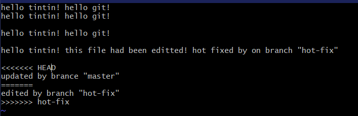

### 4.3.6 解决冲突

1. 编辑有冲突的文件,删除特殊符号,决定要使用的内容

2. 添加到暂存区

3. 执行提交(注意:此时使用 git commit命令时不能带文件名)

```bash
82129@DESKTOP-R0J8UMG MINGW64 /e/git Repository/test (master|MERGING)
$ vim hello.txt

82129@DESKTOP-R0J8UMG MINGW64 /e/git Repository/test (master|MERGING)
$ git add hello.txt

82129@DESKTOP-R0J8UMG MINGW64 /e/git Repository/test (master|MERGING)
$ git commit -m "merge test"
[master 0461bd8] merge test

82129@DESKTOP-R0J8UMG MINGW64 /e/git Repository/test (master)
$ cat hello.txt
hello tintin! hello git!
hello tintin! hello git!

hello tintin! hello git!

hello tintin! this file had been editted! hot fixed by on branch "hot-fix"

updated by brance "master"
edited by branch "hot-fix"

```

## 创建分支与切换分支图解

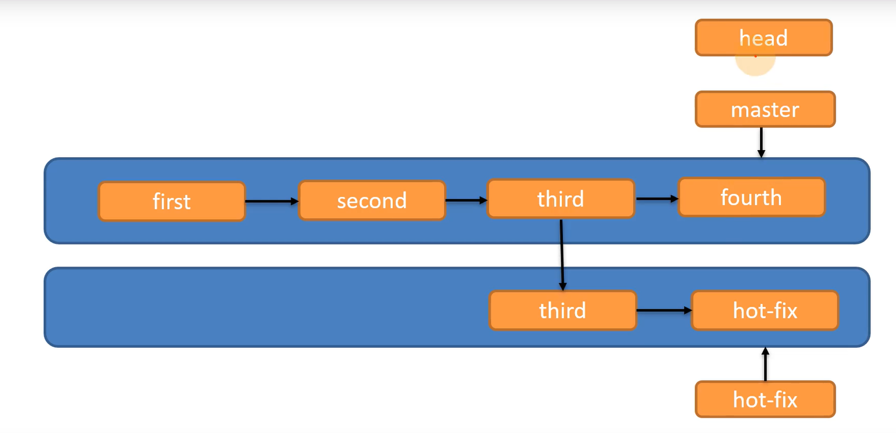

master、hot-fix其实都是指向具体版本记录的指针。当前所在的分支,其实是由HEAD决定的。

所以创建分支的本质就是多创建一个指针
	HEAD如果指向 master,那么我们现在就在 master分支上。
	HEAD如果执行 hotfix,那么我们现在就在 hotfix分支上
	所以切换分支的本质就是移动HEAD指针。

# 5 GIt团队协作机制

## 5.1 团队内协作

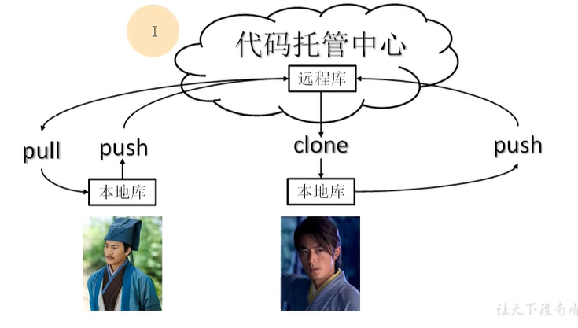

## 5.2 跨团队协作

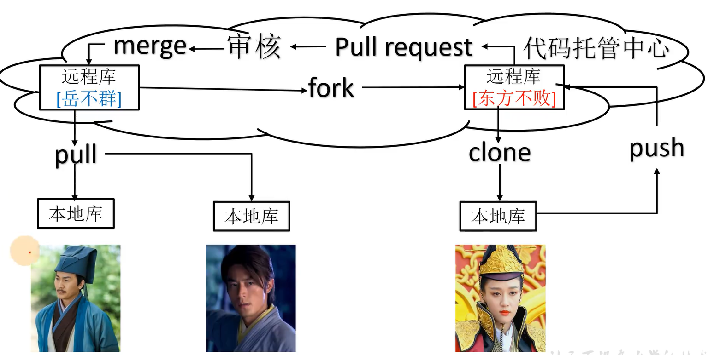

# 6 Github操作

Ps:全球最大同性交友网站,技术宅男的天堂,新世界的大门,你还在等什么?

## 6.1 创建远程仓库

## 6.2 远程仓库操作

| 命令名称                           | 作用                                                     |
| ---------------------------------- | -------------------------------------------------------- |
| git remote -v                      | 查看当前所有远程地址别名                                 |
| git remote add 别名 远程地址       | 起别名                                                   |
| git push 远程库地址别名 分支       | 推送本地分支的内容到远程仓库                             |
| git clone 远程地址                 | 将远程仓库的内容克隆到本地                               |
| git pull 远程库地址别名 远程分支名 | 将远程仓库对于分支最新内容拉下来后与当前本地分支直解合并 |

### 6.2.1 创建远程库别名

```bash
82129@DESKTOP-R0J8UMG MINGW64 /e/git repository/test (master)
$ git remote -v

82129@DESKTOP-R0J8UMG MINGW64 /e/git repository/test (master)
$ git remote add test https://github.com/TintinLY/test.git

82129@DESKTOP-R0J8UMG MINGW64 /e/git repository/test (master)
$ git remote -v
test    https://github.com/TintinLY/test.git (fetch)
test    https://github.com/TintinLY/test.git (push)

```

### 6.2.2 推送本地分支到远程仓库

```bash
82129@DESKTOP-R0J8UMG MINGW64 /e/git repository/test (master)
$ git branch -v
  hot-fix 355f767 hot-fix edited
* master  0461bd8 merge test

82129@DESKTOP-R0J8UMG MINGW64 /e/git repository/test (master)
$ git push test master
fatal: unable to access 'https://github.com/TintinLY/test.git/': Failed to connect to github.com port 443 after 21098 ms: Timed out

82129@DESKTOP-R0J8UMG MINGW64 /e/git repository/test (master)
$ git push test master
Enumerating objects: 21, done.
Counting objects: 100% (21/21), done.
Delta compression using up to 4 threads
Compressing objects: 100% (14/14), done.
Writing objects: 100% (21/21), 1.60 KiB | 205.00 KiB/s, done.
Total 21 (delta 5), reused 0 (delta 0), pack-reused 0
remote: Resolving deltas: 100% (5/5), done.
To https://github.com/TintinLY/test.git
 * [new branch]      master -> master

```


### 6.2.3 拉取远程仓库到本地库


```bash
82129@DESKTOP-R0J8UMG MINGW64 /e/git repository/test (master)
$ git pull test master
remote: Enumerating objects: 5, done.
remote: Counting objects: 100% (5/5), done.
remote: Compressing objects: 100% (2/2), done.
remote: Total 3 (delta 1), reused 0 (delta 0), pack-reused 0
Unpacking objects: 100% (3/3), 664 bytes | 73.00 KiB/s, done.
From https://github.com/TintinLY/test
 * branch            master     -> FETCH_HEAD
   0461bd8..17194d0  master     -> test/master
Updating 0461bd8..17194d0
Fast-forward
 hello.txt | 2 ++
 1 file changed, 2 insertions(+)

82129@DESKTOP-R0J8UMG MINGW64 /e/git repository/test (master)
$ git status
On branch master
nothing to commit, working tree clean

```

### 6.2.4 克隆远程库到本地

```bash
82129@DESKTOP-R0J8UMG MINGW64 /e/git repository
$ git clone https://github.com/TintinLY/test.git
fatal: destination path 'test' already exists and is not an empty directory.

82129@DESKTOP-R0J8UMG MINGW64 /e/git repository
$ git clone https://github.com/TintinLY/test2.git
Cloning into 'test2'...
remote: Enumerating objects: 6, done.
remote: Counting objects: 100% (6/6), done.
remote: Compressing objects: 100% (3/3), done.
remote: Total 6 (delta 0), reused 0 (delta 0), pack-reused 0
Receiving objects: 100% (6/6), done.

82129@DESKTOP-R0J8UMG MINGW64 /e/git repository
$ cd test2

82129@DESKTOP-R0J8UMG MINGW64 /e/git repository/test2 (main)
$ git remote -v
origin  https://github.com/TintinLY/test2.git (fetch)
origin  https://github.com/TintinLY/test2.git (push)

```

> 小结: clone会做如下操作。1、拉取代码。2、初始化本地仓库。3、创建别名origin

### 6.2.5 邀请加入团队


被邀请账户点击链接获得邀请函并接收或拒绝


## 6.3 跨团队协作


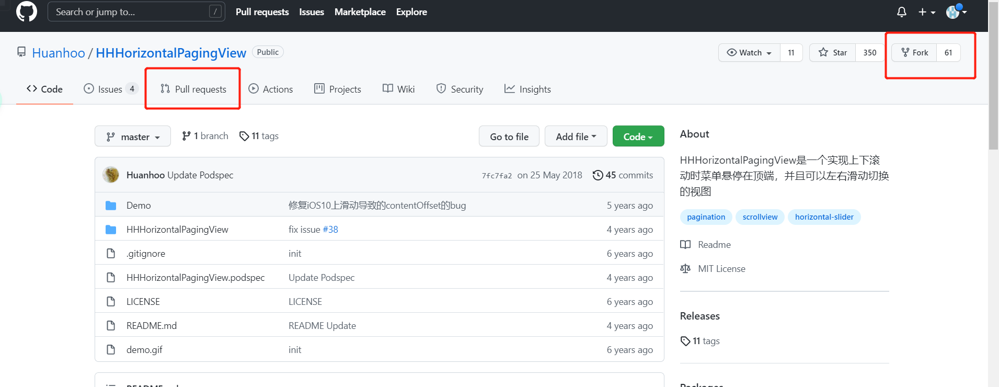

## 6.4 SSH免登录


[磁盘下的ssh密钥路径](C:\Users\82129\.ssh)

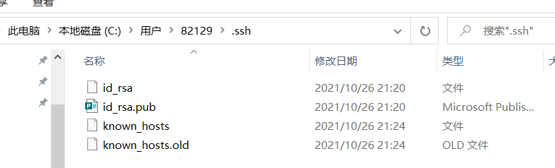

复制公钥内容粘贴到github上


利用ssh链接可以拉取或推送文件


```bash
82129@DESKTOP-R0J8UMG MINGW64 /e/git repository/test (master)
$ git pull git@github.com:TintinLY/test.git master
remote: Enumerating objects: 5, done.
remote: Counting objects: 100% (5/5), done.
remote: Compressing objects: 100% (2/2), done.
remote: Total 3 (delta 1), reused 0 (delta 0), pack-reused 0
Unpacking objects: 100% (3/3), 654 bytes | 72.00 KiB/s, done.
From github.com:TintinLY/test
 * branch            master     -> FETCH_HEAD
Updating 17194d0..3643863
Fast-forward
 hello.txt | 2 ++
 1 file changed, 2 insertions(+)

```

# 7 IDEA集成Git

## 7.1 配置Git忽略

与顼目的实际功能无关,不参与服务器上部署运行。把它们忽略掉能够屏蔽IDE工具之间的差异。

1. 创建忽略规则文件ⅹ XXX.Ignore(前缀名随便起,建议是 git. ignore)
   这个文件的存放位置原则上在哪里都可以,为了便于让~ gitconfig文件引用,建议也放在用户目录下

   编辑本地忽略配置文件，文件名任意 (git.ignore)

```
# Compiled class file 
*.class

# Log file 
*.log

# BlueJ files 
*.ctxt

# Mobile Tools for Java (J2ME)
.mtj.tmp/

# Package Files #
*.jar 
*.war 
*.nar 
*.ear 
*.zip
*.tar.gz 
*.rar

# virtual machine crash logs, see http://www.java.com/en/download/help/error_hotspot.xml
hs_err_pid*

.classpath
.project
.settings
target
```

2. 在 gitconfig文件中引用忽略配置文件(此文件在 Windows的家目录中)

   ```
   [filter "lfs"]
   	clean = git-lfs clean -- %f
   	smudge = git-lfs smudge -- %f
   	process = git-lfs filter-process
   	required = true
   [user]
   	name = Tintin
   	email = 821294434@qq.com
   [core]
   	excludesfile = C:/Users/82129/git.ignore
   
   ```

> 注意：这里路径中一定要使用“/”，不能使用“\”

## 7.2 定位Git程序


## 7.3 初始化到本地库


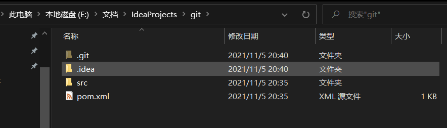

## 7.4 添加到暂存区


新建文件时自动识别

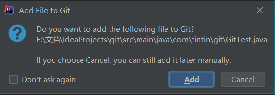

## 7.5 提交到本地库

## 7.6 切换版本

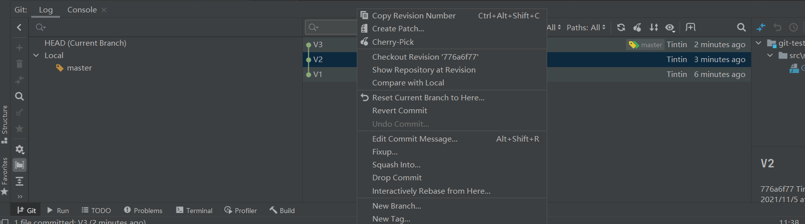


## 7.7 创建分支

## 7.8 切换分支


## 7.9 合并分支

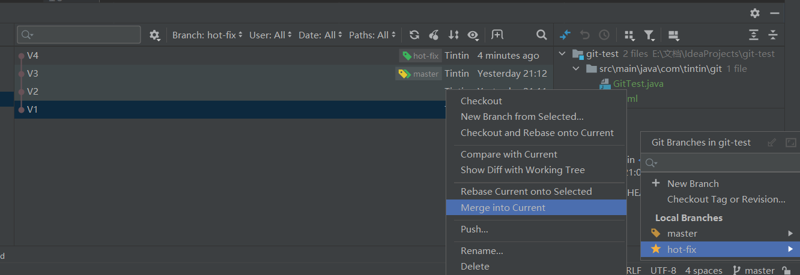

## 7.10 解决冲突

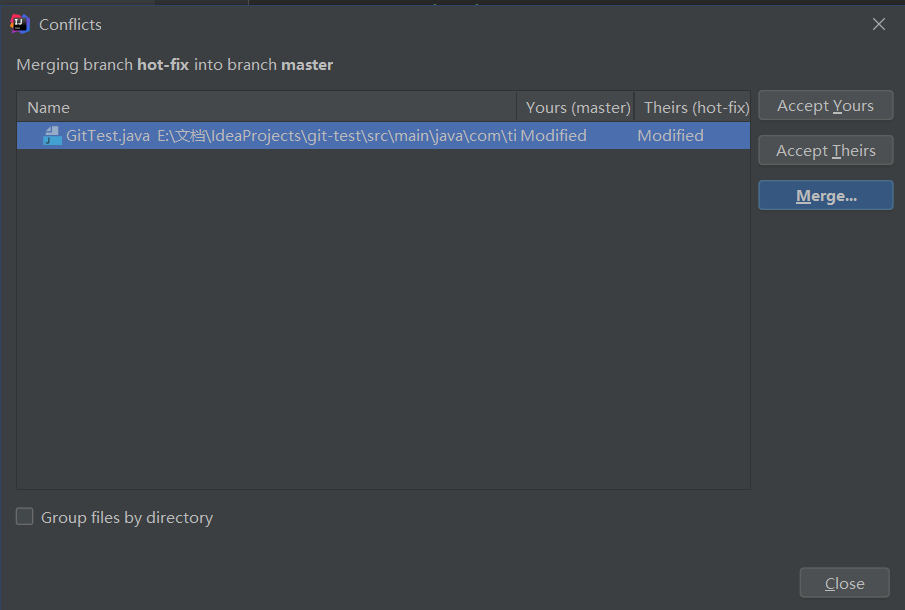


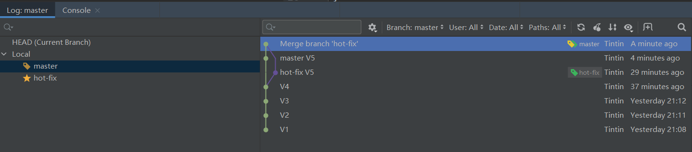

# 8 IDEA集成GitHub

## 8.1 设置GitHub账号

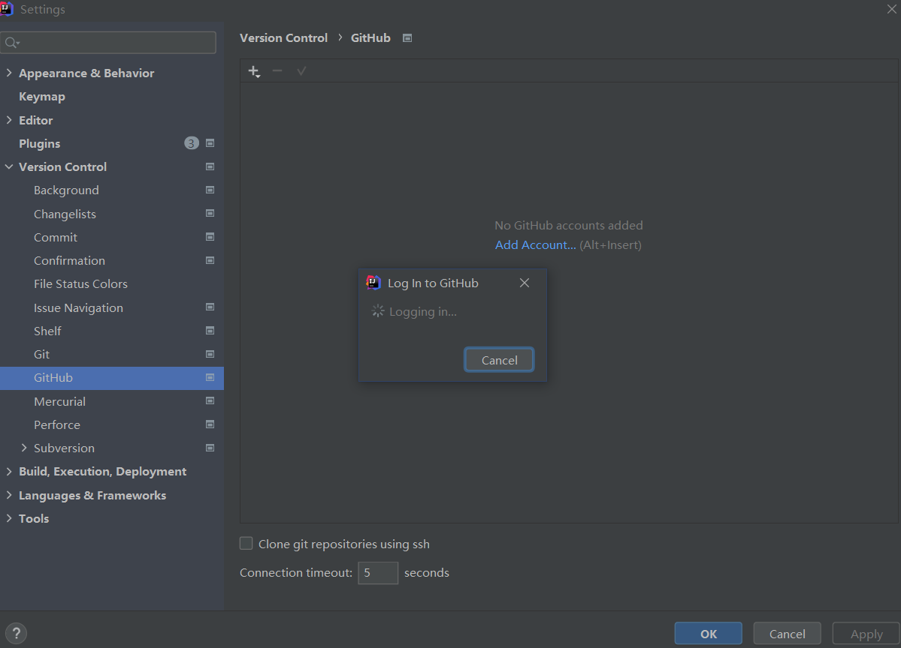

## 8.2 分享工程到GitHub

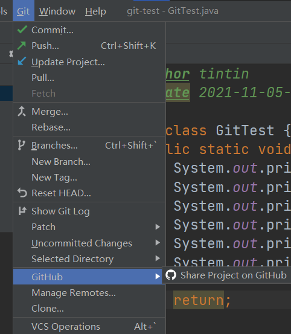

## 8.3 push

## 8.4 pull

注意:pu是拉取远端仓库代码到本地,如果远程库代码和本地库代码不一致,会自动合并,如果自动合并失败,还会涉及到手动解决冲突的问题。4

## 8.5 clone

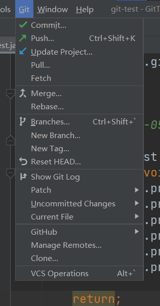

# 9 国内代码托运中心 码云Gitee

## 9.1 简介

码云是开源中国推出的基于Git的代码托管服务中心,网址是htps:/ gitee. com,使用方式跟 Github一样,而且它还是一个中文网站,如果你英文不是很好它是最好的选择

## 9.2注册登录

## 9.3 创建远程库 

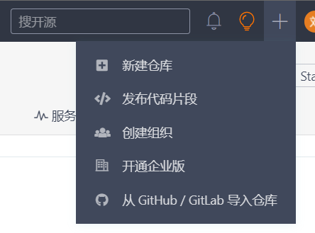

## 9.4 IDEA集成Gitee

### 9.4.1 安装插件


### 9.4.2 连接Gitee


## 9.5 码云复制GitHub项目


更新项目

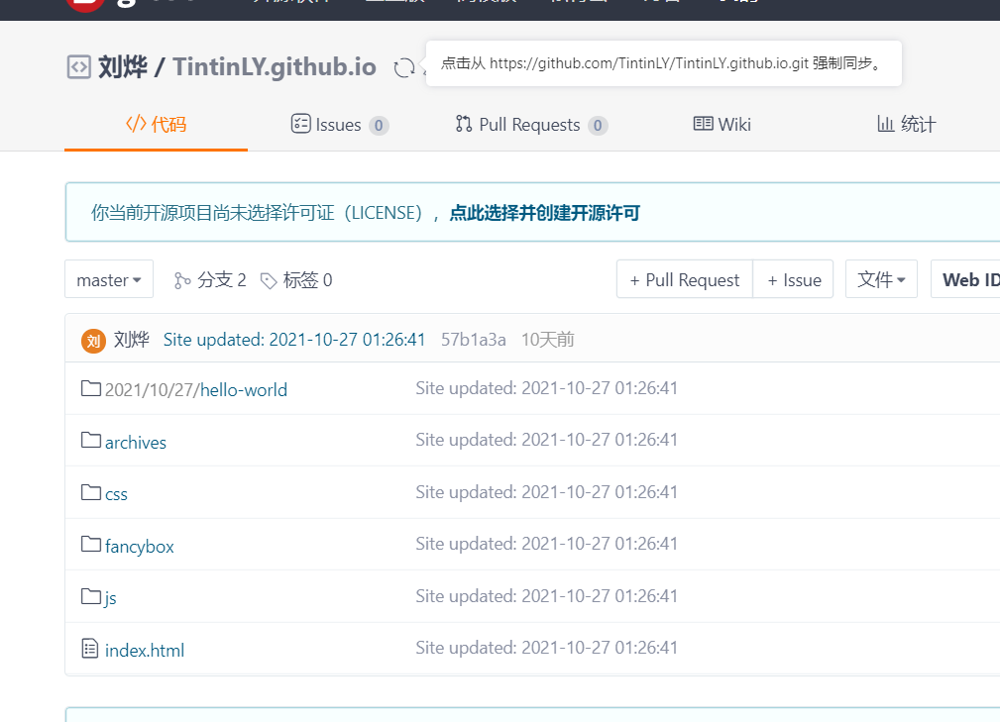

# 10 自建代码托管平台GitLab

## 10.1 简介

Gitlab是由 GitlabInc.开发,使用MT许可证的基于网络的Git仓库管理工具,且具有wik和isue跟踪功能。使用Git作为代码管理工具,并在此基础上搭建起来的web服务Gitlab由乌克兰程序员 Dmitriy Zaporozhets和 valery Sizov开发,它使用Ruby语言写成。后来,一些部分用Go语言重写。截止2018年5月,该公司约有290名团队成员,以及2000多名开源贡献者。 Gitlab被BM,Sony, JulichResearch Center,NASA, Alibaba,Invincea, OrEilly Media, Leibniz-Rechenzentrum(IRZ),CERN, SpaceX等组织使用。

## 10.2 官网

[Iterate faster, innovate together | GitLab](https://about.gitlab.com/)

## 10.3 GitLab 安装 

### 10.3.1 服务器准备 

准备一个系统为 CentOS7 以上版本的服务器，要求内存 4G，磁盘 50G。 

关闭防火墙，并且配置好主机名和 IP，保证服务器可以上网。 

此教程使用虚拟机：主机名：gitlab-server IP 地址：192.168.6.200 

### 10.3.2 安装包准备 

Yum 在线安装 gitlab- ce 时，需要下载几百 M 的安装文件，非常耗时，所以最好提前把 所需 RPM 包下载到本地，然后使用离线 rpm 的方式安装。 

下载地址： https://packages.gitlab.com/gitlab/gitlabce/packages/el/7/gitlab-ce-13.10.2-ce.0.el7.x86_64.rpm 注：资料里提供了此 rpm 包，直接将此包上传到服务器/opt/module 目录下即可。

 ### 10.3.3 编写安装脚本 

安装 gitlab 步骤比较繁琐，因此我们可以参考官网编写 gitlab 的安装脚本。

```
 [root@gitlab-server module]# vim gitlab-install.sh sudo rpm -ivh /opt/module/gitlab-ce-13.10.2-ce.0.el7.x86_64.rpm sudo yum install -y curl policycoreutils-python openssh-server croniesudo lokkit -s http -s ssh sudo yum install -y postfix sudo service postfix start sudo chkconfig postfix on curl https://packages.gitlab.com/install/repositories/gitlab/gitlabce/script.rpm.sh | sudo bash sudo EXTERNAL_URL="http://gitlab.example.com" yum -y install gitlabce
```

 给脚本增加执行权限

```
 [root@gitlab-server module]# chmod +x gitlab-install.sh [root@gitlab-server module]# ll 总用量 403104 -rw-r--r--. 1 root root 412774002 4 月 7 15:47 gitlab-ce-13.10.2- ce.0.el7.x86_64.rpm -rwxr-xr-x. 1 root root 416 4 月 7 15:49 gitlab-install.sh 
```

然后执行该脚本，开始安装 gitlab-ce。注意一定要保证服务器可以上网。

```
 [root@gitlab-server module]# ./gitlab-install.sh  警告：/opt/module/gitlab-ce-13.10.2-ce.0.el7.x86_64.rpm: 头 V4  RSA/SHA1 Signature, 密钥 ID f27eab47: NOKEY 准备中... #################################  [100%] 正在升级/安装... 1:gitlab-ce-13.10.2-ce.0.el7  ################################# [100%] 。 。 。 。 。 。 
```

### 10.3.4 初始化 GitLab 服务 

执行以下命令初始化 GitLab 服务，过程大概需要几分钟，耐心等待…

```
 [root@gitlab-server module]# gitlab-ctl reconfigure 。 。 。 。 。 。 Running handlers: Running handlers complete Chef Client finished, 425/608 resources updated in 03 minutes 08  seconds gitlab Reconfigured! 
```


### 10.3.5 启动 GitLab 服务 

执行以下命令启动 GitLab 服务，如需停止，执行 gitlab-ctl stop

```
 [root@gitlab-server module]# gitlab-ctl start ok: run: alertmanager: (pid 6812) 134s ok: run: gitaly: (pid 6740) 135s ok: run: gitlab-monitor: (pid 6765) 135s  ok: run: gitlab-workhorse: (pid 6722) 136s ok: run: logrotate: (pid 5994) 197s ok: run: nginx: (pid 5930) 203s ok: run: node-exporter: (pid 6234) 185s ok: run: postgres-exporter: (pid 6834) 133s ok: run: postgresql: (pid 5456) 257s ok: run: prometheus: (pid 6777) 134s ok: run: redis: (pid 5327) 263s ok: run: redis-exporter: (pid 6391) 173s ok: run: sidekiq: (pid 5797) 215s ok: run: unicorn: (pid 5728) 221s 
```


### 10.3.6 使用浏览器访问 GitLab 

使用主机名或者 IP 地址即可访问 GitLab 服务。需要提前配一下 windows 的 hosts 文件

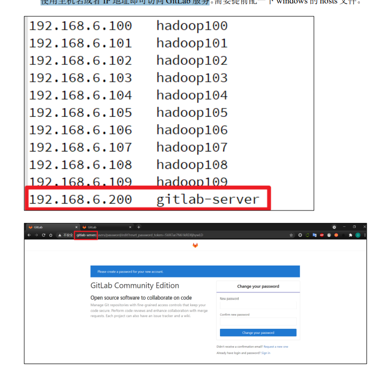

首次登陆之前，需要修改下 GitLab 提供的 root 账户的密码，要求 8 位以上，包含大小 写子母和特殊符号。因此我们修改密码为 Atguigu.123456 然后使用修改后的密码登录 GitLab。

### 10.3.7 GitLab 创建远程库

### 10.3.8 IDEA 集成 GitLab

安装 GitLab 插件

设置 GitLab 插件

注意：gitlab 网页上复制过来的连接是：http://gitlab.example.com/root/git-test.git， 需要手动修改为：http://gitlab-server/root/git-test.git 选择 gitlab 远程连接，进行 push。
