[TOC]

# 笔记介绍

笔记基本参考《深入理解 Java 虚拟机：JVM 高级特性与最佳实践（第 3 版）》

# 第一部分 走进 Java

## Java 特性的实现原理

口号“Write Once，Run Anywhere”

### Java 的优点

* 结构严谨、面向对象。

* 摆脱了硬件平台的束缚，实现“一次编写，到处运行”的理想。

* 一种相对安全的内存管理和访问机制，避免了绝大部分内存泄漏和指针越界问题。

* 热点代码检测和运行时编译及优化，这使得 Java 应用能随着运行时间的增长而获得更高的性能。

### Java 的技术体系

JDK（Java Development Kit）：支持 Java 程序开发的最小环境。大致包括三部分：Java 程序设计语言、Java 虚拟机、Java 类库。

JRE（Java Runtime Environment）：支持 Java 程序运行的标准环境。大致包括两部分：Java 虚拟机、Java 类库中的 Java SE API 子集


> JDK 以 OpenJDK/OracleJDK 最为流行，其中的 HotSpot 虚拟机目前业界占统治地位

Java 技术体系拆分为三个方向。由 Java1.2 开始。

* Java ME：面向移动终端的 Java 平台。对 Java API 有所精简，加入了移动终端的针对性支持。

* Java SE：面向桌面级应用的 Java 平台。

* Java EE：面向多层架构的企业的 Java 平台，对 Java SE 针对性的扩充。一般以 javax.*作为包名。后来如 JDBC、JMS、Servlet 等部分重要的组件也进入 Java SE 核心包中。Java EE 在 2018 年被 Oracle 废弃，成为 Eclipse 的 Jakarta EE。

### Java 的发展历程


### Java 虚拟机家族

* 始祖：Sun Classic VM

作为 Java 虚拟机始祖，发布于在 Sun 公司的 JDK 1.0。只能以纯解释器方式来执行 Java 代码。外挂编译器无法与解释器配合工作，每次编译执行都要将所有代码进行编译，其执行效率也和传统的 C/C++程序有很大差距。

* 雏形：Exact VM

发布于在 Sun 公司的 JDK 1.2。加入热点探测、两级即时编译器、编译器与解释器混合工作模式，提升效率，已经具备现代高性能虚拟机雏形。但只在 Solaris 操作系统发布，就被 HotSpot VM 所取代。

> 准确式内存管理（Exact Memory Management），可以判断内存中某个位置的数据是指向了实际数据的内存地址的引用类型，还是一个实际数据。

* 最流行：HotSpot VM

目前使用范围最广的 Java 虚拟机。Sun 公司为了即时编译的优秀理念和实际成果，收购了 Longview Technologies 公司并引进了 HotSpot VM。在 JDK1.2 中发布，与 Sun Classic VM 并存。在 JDK1.3 中转为默认虚拟机。

如它名称中的 HotSpot 指的就是它的热点代码探测技术，可以通过执行计数器 找出最具有编译价值的代码，然后通知即时编译器以方法为单位进行编译。

JDK 8 时期，把原来 BEA JRockit 中的优秀特性融合到 HotSpot 之中，移除掉永久代，吸收了 JRockit 的 Java Mission Control 监控工具等功能。

* 移动、嵌入式：Mobile/Embedded VM

面向移动和嵌入式市场的 Java 虚拟机，如 CDC 虚拟机、KVM 虚拟机、Java SE Embedded（由 hotspot 裁剪而来）。

* 二选：BEA JRockit/IBM J9 VM

HotSpot 除外的三大虚拟机之二分别是 BEA System 公司的 JRockit 与 IBM 公司的 IBM J9。

BEA 被 Oracle 收购后，JRockit 现已不再继续发展。

IBM J9 虚拟机的职责分离与模块化做得比 HotSpot 更优秀，如果为了学习虚拟机技术而去阅读源码，更加模块化的 OpenJ9 代码其实是比 HotSpot 更好的选择。如果为了使用 Java 虚拟机时多一种选择，那可以通过 AdoptOpenJDK 来 获得采用 OpenJ9 搭配上 OpenJDK 其他类库组成的完整 JDK。

* 软硬合璧：BEA Liquid VM/Azul VM

非通用硬件平台，而与特定硬件平台绑定、软硬件配合工作的专有虚拟机。

* 非 Java 体系：Apache Harmony/Google Android Dalvik VM

Apache Harmony 是一个 Apache 软件基金会旗下以 Apache License 协议开源的实际兼容于 JDK 5 和 JDK 6 的 Java 程序运行平台，但是并没有通过 TCK 认证，其平台的虚拟机无法当成 Java 虚拟机来介绍。

Dalvik 虚拟机曾经是 Android 平台的核心组成部分之一，并不是一个 Java 虚拟机，它没有遵循《Java 虚拟机规范》，不能直接执行 Java 的 Class 文件，使用寄存器架构而不是 Java 虚拟机中常见的栈架构。但是执行的 DEX（Dalvik Executable）文件可以通过 Class 文件转化而来，使用 Java 语法编写应用程序，可以直接使用绝大部分的 Java API 等。后来可以提前编译的 ART 虚拟机代替了即时编译的 Dalvik 虚拟机。

* 理想夭折：Microsoft JVM

早期为了在 IE 浏览器中运行 Java Applets 程序而诞生。被 SUN 公司控告，微软赔偿并去除 Windows 的 Java 平台。

* 非主流领域

基本集中在移动、嵌 入式应用

KVM、Java Card VM、Squawk VM、JavaInJava、Maxine VM、Jikes RVM、IKVM.NET 等

### Java 技术未来

Java 的话事权不在于语法多么先进好用，而是来自它庞大的用户群和极其成熟的软件生态。

其他语言在某一领域的优势明显：互联网之于 JavaScript、人工智能之于 Python，微服务之于 Golang。但 Java 已经尽可能在每一个领域都博得席位。

#### 无语言倾向：Graal VM

Graal VM 被官方称为“Universal VM”和“Polyglot VM”，这是一个在 HotSpot 虚拟机基础上增强而成 的跨语言全栈虚拟机，可以作为“任何语言”的运行平台使用。口号“Run Programs Faster Anywhere”


Graal VM 的基本工作原理是将这些语言的源代码（例如 JavaScript）或源代码编译后的中间格式 （例如 LLVM 字节码）通过解释器转换为能被 Graal VM 接受的中间表示。这个过程称为程序特化（Specialized，也常被称为 Partial Evaluation）。

#### 新一代即时编译器：Graal 编译器

#### 向 Native 迈进

近几年，大型单体应用架构向小型微服务应用架构发展，Java 的启动时间相对较长，需要预热才能达到最高性能等特点就显得相悖于这样 的应用场景。

早期改善措施

* 跨进程的、可以面向用户程序的类型信息共享。允许把加载解析后的类型信息缓存起来，从而提升下次启动速度，原本 CDS 只支 持 Java 标准库，在 JDK 10 时的 AppCDS 开始支持用户的程序代码
* 无操作的垃圾收集器。只做内存分配而不做回收的收集器，对于运行完就退出的应用十分合适

彻底方案

* 提前编译（Ahead of Time Compilation，AOT）。提前编译是相对于即时编译的概念，Java 虚拟机加载这些已经预编译成二进制库之后就能够直接调用。但是破坏了 Java“一次编写，到处运行”的承诺，

#### HotSpot 的改进

经过一系列的重构与开放，HotSpot 虚拟机逐渐从时间的侵蚀中挣脱出来，虽然代码复杂度还在增 长，体积仍在变大，但其架构并未老朽，而是拥有了越来越多的开放性和扩展性。

#### 语言语法持续增强

语言特性和语法糖不论有没有，程序也照样能写，但即使只是可有可无的语法糖，也是直接影响语言使用者的幸福感程度的关键指标。

# 第二部分 自动内存管理

## Java 内存区域与内存溢出异常

### Java 与 C 的内存机制

C 或 C++的开发人员拥有每一个对象的所有权。

Java 开发人员，在虚拟机的自动内存管理机制下，无需配对写 delete/free 代码，不容易出现内存泄漏和内存溢出问题。但一旦发生问题，如果不了解虚拟机机制，排查错误将变得艰难。

### 运行时数据区域

Java 虚拟机在执行 Java 程序的过程中会把它所管理的内存划分为若干个不同的数据区域。其中，有各线程共享的数据区，也有各线程独立拥有的数据区。


#### 程序计数器

可以看作是当前线程所执行的字节码的行号指示器，字节码解释器工作时就是通过改变这个计数器的值来选取下一条需要执行的字节码指令。

线程私有。当线程轮流切换，处理器时间片轮转，一个单核处理器（或多核处理器的一个核心）某一时刻只会有一个线程在执行。因此线程切换后要想恢复到原执行位置，每条线程都需要有一个独立的计数器。

#### 虚拟机栈

虚拟机栈（VM Stack）描述的是 Java 方法执行的线程内存模型：每个方法被执行的时候，Java 虚拟机都会同步创建一个栈帧（Stack Frame）用于存储局部变量表、操作数栈、动态连接、方法出口等信息。

线程私有。生命周期与线程相同。

该内存区域的两类异常状况：

* StackOverflowError 异常。线程请求的栈深度大于虚拟机所允许的深度。
* OutOfMemoryError 异常。当栈扩展时无法申请到足够的内存。

局部变量表。存放了编译期可知的基本数据类型、对象引用（要么指向对象起始位置，要么指向代表对象的句柄）、returnAddress 类型（指向了一条字节码指令的地址）。

> 这些数据类型以局部变量槽（Slot）来表示。例如，64 位长度的 long 和 double 类型的数据会占用两个变量槽。
>
> 局部变量表所需的内存空间在编译期间完成分配，当进入一个方法时，这个方法需要在栈帧中分配的变量槽的数量是完全确定 的，在方法运行期间不会改变局部变量表的大小。
>
> 1 个变量槽占用 32 个比特、64 个比特，或者更多由虚拟机自行决定。

#### 本地方法栈

本地方法栈（Native Method Stacks）的作用类似虚拟机栈至于 Java 方法，本地方法栈为本地方法服务。

有的虚拟机如 Hot-Spot 虚拟机将二者合二为一。

#### Java 堆

此内存区域的唯一目的就是存放对象实例，“几乎”所有的对象实例都在这里分配内存。

> 现代虚拟机通过优化技术（如逃逸分析）可以决定对象是否需要分配到堆上，从而提升性能。

Java 堆是垃圾收集器管理的内存区域，因此也被称为 GC 堆（Garbage Collected Heep）。

> 从回收内存的角度看，大部分垃圾回收器都是根据分代收集理论设计，出现“新生代”、“老年代”、“永久代”等名词只是部分垃圾收集器的共同特性或设计风格，而非 Java 虚拟机的固有内存布局。
>
> 例如 HotSpot 虚拟机的垃圾回收器是基于“经典分代”来设计。经典分代指新生代（Eden 和两个 Survivor）、老年代这种划分。

线程共享。但是可以从 Eden 区中划分出多个线程私有的分配缓冲区（Thread Local Allocation Buffer，TLAB），以提升对象分配时的效率。（是否使用 TLAB 通过参数-XX:+/-UseTLAB 来配置）

> 无论是哪个区域，存储的都只能是对象的实例，将 Java 堆细分的目的只是为了更好地回收内存，或者更快地分配内存

物理上，Java 堆可以处于不连续的内存空间中。但大多数虚拟机为了简单和存储高效，要求连续的存储空间。

当前主流虚拟机的 Java 堆被实现为可扩展的。堆扩展通过参数-Xmx 和-Xms 设定。

> *-Xms* 表示 JVM 启动时分配的初始堆内存大小。例如，*-Xms512m* 表示 JVM 启动时分配 512MB 的堆内存。合理设置初始值可以减少堆内存动态扩展的频率，从而提升性能。
>
> *-Xmx* 表示 JVM 运行时允许的最大堆内存大小。例如，*-Xmx2g* 表示堆内存最大可扩展至 2GB。当堆内存达到此限制时，JVM 会触发垃圾回收。如果垃圾回收后仍无法满足内存需求，则会抛出 OutOfMemoryError 异常。

#### 方法区

它用于存储已被虚拟机加载的类型信息、常量、静态变量、即时编译器编译后的代码缓存等数据。与 Java 堆一样是各个线程共享的内存区域， 实际上在规范中描述为堆的一个逻辑部分。但在 HotSpot 虚拟机中，其别名叫作“非堆”（Non-Heap），目的是与 Java 堆区分开来。

不同版本的 Java 其方法区的实现方式不同：

JDK 8 以前，HotSpot 虚拟机设计团队选择把收集器的分代设计扩展至方法区（或者说是使用永久代的方式来实现方法区），因此很多程序员会将方法区称为“永久代”。例如，将字符串常量池和静态变量放在堆空间的永久代。实际上在其他虚拟机方法区的实现有另一套逻辑。方法区的实现细节不属于 Java 虚拟机规范内。

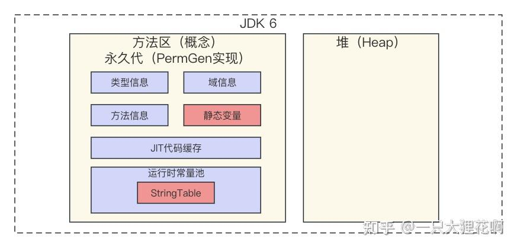

JDK7 时，为了避免方法区频繁溢出，将字符串常量池和静态变量这两个容易造成方法区溢出的部分移动到了堆内存当中去。

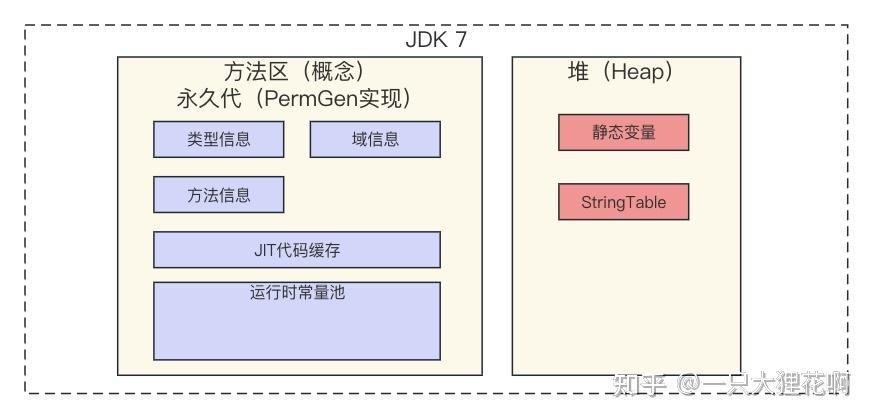

JDK8 时，完全用元空间来代替永久代了，Hot-Spot 改为采用本地内存（Native Memory）来实现方法区。

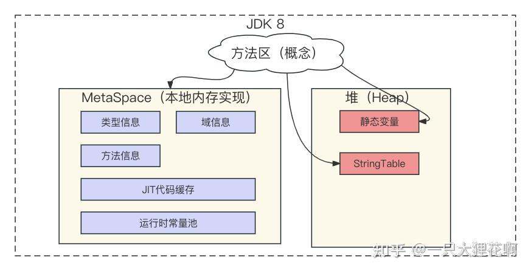

方法区无法满足新的内存分配需求时，将抛出 OutOfMemoryError 异常

#### 运行时常量池

运行时常量池（Runtime Constant Pool）方法区的一部分。Class 文件中除了有类的版本、字段、方法、接口等描述信息外，还有一项信息是常量池表（Constant Pool Table），用于存放编译期生成的各种字面量与符号引用，这部分内容将在类加载后存放到方法区的运行时常量池中。

具有动态性，除了 Class 文件加载，运行期间也可以将新的常量放入池中。例如调用 String 类的 intern()方法。

#### 直接内存

直接内存（Direct Memory）并不是虚拟机运行时数据区的一部分。

JDK 1.4 中新加入了 NIO（New Input/Output）类，引入了一种基于通道（Channel）与缓冲区 （Buffer）的 I/O 方式，它可以使用 Native 函数库直接分配堆外内存，然后通过一个存储在 Java 堆里面的 DirectByteBuffer 对象作为这块内存的引用进行操作。这样能在一些场景中显著提高性能，因为避免了 在 Java 堆和 Native 堆中来回复制数据。

### HotSpot 虚拟机 Java 堆中对象

#### 对象的创建

语言层面，仅仅一个 new 关键字。

虚拟机层面：

1. 检查引用参数是否能在常量池中定位到一个类的符号引用，并且检查该符号引用的代表的类是否被加载、解析和初始化过。
2. 根据已加载的类对象可以确定对象所需内存大小，为新生对象分配内存。
3. 实例数据赋零值（默认值）。此时对象不赋初始值也能直接使用。
4. 对象进行必要的设置，放在对象的对象头。
5. 调用构造函数，即 class 文件的的 `<init>()` 方法，进行初始化。

#### 对象的内存布局

HotSpot 虚拟机里，对象在堆内存中的存储布局可以划分为三个部分：对象头（Header）、实例数据（Instance Data）和对齐填充（Padding）。

对象头（Object Header）：

* 对象自身的运行时数据（markword）。官方称为 Mark Word。哈希码（HashCode）、GC 分代年龄、锁状态标志、线程持有的锁、偏向线程 ID、偏向时间戳等。大小 64 位或 32 位。
* 类型指针（class pointer）。即对象指向它的类型元数据的指针。
* 用于记录数组长度的数据（若为数组）

实例数据（Instance Data）：对象真正存储的有效信息。字段在内存的存储顺序（由-XX: FieldsAllocationStyle 参数配置），通常为 long/double、int、short/char、byte/boolean、oop。子类之中较窄的变量也允许插入父类变量的空隙（由+XX：CompactFields 参数配置）

对齐填充（Padding）：无特殊含义，满足 "对象的大小都必须是 8 字节的整数倍" 的虚拟机规范，则通过对齐填充来补全。

#### 对象的访问与定位

reference 数据仅被规定为一个指向对象的引用，如何定位并访问堆中对象的具体位置视虚拟机而定。

主流的访问方式：句柄和直接指针。

* 句柄：堆中划出一块句柄池。reference 存储对象的句柄地址。句柄中包含了对象实例地址与对象所属类型地址。好处：节省了一次指针定位的时间开销。垃圾回收导致对象移动时，无需修改 reference 值，只会改变句柄中的对象实例地址。


* 直接指针：reference 中存储的直接就是对象地址。因此对象内存需要放置访问类型数据。好处：节省了一次指针定位的时间开销。


### OutOfMemoryError 异常

除了程序计数器外，虚拟机内存的其他几个运行时区域都有发生 OutOfMemoryError（OOM）异常的可能。

根据导致 OOM 异常的对象是否有用，可分为以下两种情况

* 内存泄漏：申请内存后，没有释放不再使用的空间。例如，程序不再使用某些对象，但垃圾回收器无法回收它们。

* 内存溢出：程序申请内存超出所能提供的最大内存。例如，一次性从数据库中读取大量数据。

出现 OOM 异常的时候 Dump 出当前的内存堆转储快照以便进行事后分析(由参数-XX:+HeapDumpOnOutOfMemoryError 配置)。

#### Java 堆溢出

例-Xms20m -Xmx20m

将最小值-Xms 参数与最大值-Xmx 参数设置为足够小且一样（避免堆自动扩展），容易产生 OOM 异常

```java
/**
 * VM Args：-Xms20m -Xmx20m -XX:+HeapDumpOnOutOfMemoryError
 *
 * @author zzm
 */
public class HeapOOM {

    static class OOMObject {
    }

    public static void main(String[] args) {
        List<OOMObject> list = new ArrayList<OOMObject>();

        while (true) {
            list.add(new OOMObject());
        }
    }
}
```

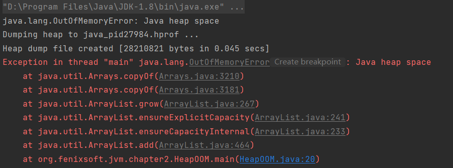

解决方案：

1. 应确认内存中导致 OOM 的对象是否是必要的，即确认是否发生内存泄漏。
2. 若是内存泄漏，通过工具查看泄漏对象到 GC Roots 的引用链，定位内存泄漏的代码位置。
3. 若不是内存泄漏，尝试向上调整堆参数，尝试优化程序设计合理性。

#### 虚拟机栈和本地方法栈溢出

HotSpot 虚拟机不区分虚拟机栈和本地方法栈（大小由参数-Xoss 配置），栈容量只能由-Xss 参数来设定。

栈的两种异常：

1. 如果线程请求的栈深度大于虚拟机所允许的最大深度，将抛出 StackOverflowError 异常。
2. 如果虚拟机的栈内存允许动态扩展，当扩展栈容量无法申请到足够的内存时，将抛出 OutOfMemoryError 异常。

由于 HotSpot 不支持栈的动态扩展，因此线程运行时，不会因为扩展栈容量而导致内存溢出，只会因为栈容量无法容纳新的栈帧而导致 StackOverflowError 异常。

StackOverflowError 解决方法：会有明确错误堆栈可供分析，相对而言比较容易定位到问题所在

但是在多线程的情况下，创建线程也可以导致内存溢出异常。为每个线程分配到的栈内存越大（例，-Xss2M ），可以建立的线程数量自然就越少，建立线程时就越容易把剩下的内存耗尽。

```java
public class JavaVMStackOOM {

    private void dontStop() {
        while (true) {
        }
    }

    public void stackLeakByThread() {
        while (true) {
            Thread thread = new Thread(new Runnable() {
                @Override
                public void run() {
                    dontStop();
                }
            });
            thread.start();
        }
    }

    public static void main(String[] args) throws Throwable {
        JavaVMStackOOM oom = new JavaVMStackOOM();
        oom.stackLeakByThread();
    }
}
```

OutOfMemoryError 解决方法：Classic 虚拟机单线程情况，增加栈容量。HostSpot 多线程情况，通过“减少内存”减少栈容量的手段来解决内存溢出的方式。

#### 方法区和运行时常量池溢出

方法区的变化

1. HotSpot 虚拟机 JDK 6 通过永久代（通过-XX: PermSize 参数配置初始永久代空间，-XX: MaxPermSize 参数配置最大永久代空间）来实现方法区。

2. 从 JDK 7 方法区开始逐步“去永久代”的计划，例如存放在永久代的字符串常量池和静态变量被移至 Java 堆之中。

3. JDK 8 中完全使用元空间（通过-XX: MetaspaceSize 参数配置初始永久代空间。-XX: MaxMetaspaceSize 参数配置最大永久代空间，默认是-1，即不限制，或者说只受限于本地内存大小）来实现方法区。
4. 其他配置：-XX: MinMetaspaceFreeRatio：作用是在垃圾收集之后控制最小的元空间剩余容量的百分比，可减少因为元空间不足导致的垃圾收集的频率。类似的还有-XX: Max-MetaspaceFreeRatio，用于控制最 大的元空间剩余容量的百分比。

在 JDK6 永久代中：缩小永久代空间，使用 String:: intern()不断的向常量池添加 String 字符串，会出现 OutOfMemoryError: PermGen space

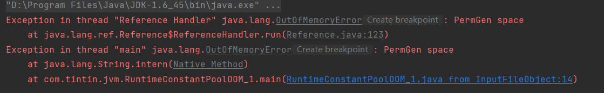

在 JDK7 永久代或 JDK8 元空间中：用上诉测试探讨已无意义，缩小永久代大小或者元空间大小，都不会出现内存溢出溢出，因为原本存放在永久代的字符串常量池被移至 Java 堆之中。此时限制 Java 堆的容量（通过-Xmx 参数配置）会在堆中产生溢出。

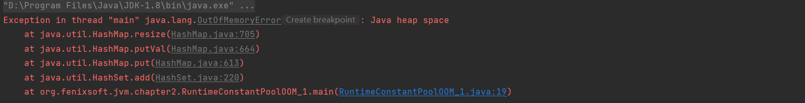

#### 本机直接内存溢出

直接内存（Direct Memory）的容量大小可通过-XX: MaxDirectMemorySize 参数来指定。默认与 Java 堆最大值-Xmx 一致。

使用 DirectByteBuffer 分配内存，通过计算得知内存无法分配，会抛出内存溢 出异常，但实际并无申请内存这个操作。

真正申请分配内存的方法是 Unsafe:: allocateMemory()，此时必须通过反射获取 Unsafe 实例进行内存分配。

```java
/**
 * VM Args：-Xmx20M -XX:MaxDirectMemorySize=10M
 *
 * @author zzm
 */
public class DirectMemoryOOM {

    private static final int _1MB = 1024 * 1024;

    public static void main(String[] args) throws Exception {
        Field unsafeField = Unsafe.class.getDeclaredFields()[0];
        unsafeField.setAccessible(true);
        Unsafe unsafe = (Unsafe) unsafeField.get(null);
        while (true) {
            unsafe.allocateMemory(_1MB);
        }
    }
}
```

查找原因：在日志中找不到明显异常，dump 文件很小。典型的间接使用 DirectMemory 就是 NIO。

## 垃圾收集器与内存分配策略

并行与并发是 [并发编程](../Java并发编程/Java并发编程.md#多核 CPU) 中的专有名词，在谈论垃圾收集器的上下文语境中，它们的含义如下：

* **并行 (Parallel)** ：并行描述的是多条垃圾收集器线程之间的关系，说明同一时间有多条这样的线程在协同工作，此时通常默认用户线程是处于等待状态。
* **并发 (Concurrent)** ：并发描述的是垃圾收集器线程与用户线程之间的关系，说明同一时间垃圾收集器线程与用户线程都在运行。但由于垃圾收集器线程会占用一部分系统资源，所以程序的吞吐量依然会受到一定影响。

### 关注区域

栈解决程序如何运行的问题。每个线程都会创建一个虚拟机栈，内部保存一个个栈帧，对应着每一个方法的调用。对于栈来说不存在垃圾回收问题（栈存在溢出的情况）。

而 Java 堆和方法区这两个区域则有着很显著的不确定性，处于运行期间，才知道程序会创建哪些对象，创建多少个对象。垃圾收集器所关注的正是这部分内存该如何管理。

### 判断对象是否可回收

对象“死亡”即不可能再被任何途径使用的对象，此时垃圾回收器可以回收它。

#### 引用计数算法

在对象添加一个引用计数器，引用该对象计数器值加一，引用失效则减一，计数器归零代表对象不再被使用了。

此方法有很多例外情况需要考虑，如下：

当对象 A 与对象 B 的互相引用，导致引用计数器无法归零，垃圾回收器无法回收。

```java
		objA.instance = objB;
        objB.instance = objA;
        objA = null;
        objB = null;
```

因此，主流的 Java 虚拟机不是选择引用计数算法判断对象是否存活的。

#### 可达性分析算法

Java、C#、Lisp 的内存管理子系统都使用可达性分析算法。

基本思路：从根对象节点（GC Roots）起始，根据引用关系向下搜索，如果某个对象到“GC Roots”间没有任何引用链相连（得名于图论的可达性），则证明此对象是不可能再被使用的。

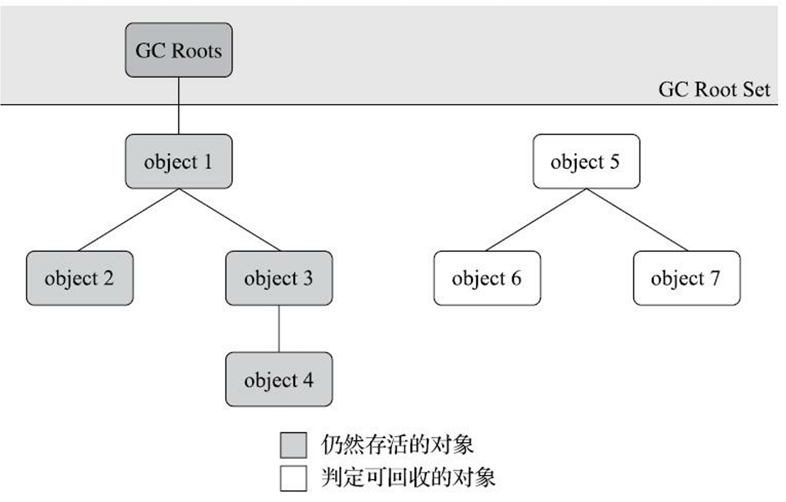

可以作为 GC Roots 的对象：

* 在 **虚拟机栈**（栈帧中的本地变量表）中引用的对象，譬如各个线程被调用的方法堆栈中使用到的参数、局部变量、临时变量等。
* 在 **方法区** 中类静态属性引用的对象，譬如 Java 类的引用类型静态变量。

* 在 **方法区** 中常量引用的对象，譬如字符串常量池（String Table）里的引用。
* 在 **本地方法栈** 中 JNI（即通常所说的 Native 方法）引用的对象。
* Java 虚拟机 **内部** 的引用，如基本数据类型对应的 Class 对象，一些常驻的异常对象（比如 NullPointExcepiton、OutOfMemoryError）等，还有系统类加载器。
* 所有被同步锁（**synchronized** 关键字）持有的对象。
* 反映 Java 虚拟机内部情况的 JMXBean、JVMTI 中注册的回调、本地代码缓存等。

除了上述固定的的 GC Roots 对象，其他对象也会“临时性”地加入。例如，发生分代收集或局部回收时，回收区域内的对象完全有可能被位于堆中其他区域的对象所引用。

#### 回收关键——引用

JDK1.2 之前定义，如果 reference 类型的数据中存储的数值代表的是另外一块内存的起始地址，则该 reference 数据就时某块内存或某个对象的引用。

此时，对象只有“被引用”和“未被引用”两种状态，无法描述那些内存足够时希望可以暂时缓存的对象。

JDK1.2 之后，引用分为强引用、软引用、弱引用、虚引用。

* 强引用。普遍存在的引用赋值，类如 `Object obj=new Object()`
* 软引用。提供了 `SoftReference` 类来描述仍有用但非必须的对象。当垃圾收集器开始工作不会回收被软引用的对象，直到内存溢出前会对它们进行第二次回收，若还未回收足够，则抛出内存溢出异常。
* 弱引用。提供了 `WeakReference` 类。强度比软引用更弱一些。当垃圾收集器开始工作，无论当前内存是否足够，都会回收掉只被弱引用关联的对象。
* 虚引用。提供了 `PhantomReference` 类来描述最弱的引用，不会对象的生存周期发生影响。为一个对象设置虚引用关联的唯一目的只是为了能在这个对象被收集器回收时收到一个系统通知。

#### finalize()方法

如果对象在进行可达性分析后发现没有与 GC Roots 相连接的引用链，仍要经历两次标记。

第一次筛选：是否重写了 `finalize()` 方法且从未执行过。否则垃圾回收，是则进入 F-Queue 队列等待执行 `finalize()`

第二次筛选：`finalize()` 是否使对象重新与引用链上的任何一个对象建立关联。否则垃圾回收，是则逃逸。

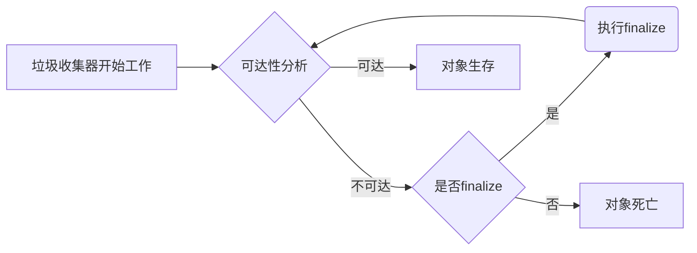
```mermaid
graph LR
A[垃圾收集器开始工作] --> C{可达性分析}
    C -->|不可达| D{是否finalize}
    D -->|是| G(执行finalize)
    G --> C{可达性分析}
    D -->|否| F[对象死亡]
    C -->|可达| E[对象生存]
```

不鼓励使用 `finalize()` 方法来拯救对象。而且 `finalize()` 方法能做的所有工作，如释放资源，使用 try-finally 或者其他方式都可以做得更好、 更及时。

#### 回收方法区

《Java 虚拟机规范》提出方法区中实现垃圾收集是非必要的。JDK11 的 ZGC 收集器就不支持类卸载。方法区垃圾回收的性价比比较低。

废弃的常量的回收判定与堆中回收对象类似，判断其他地方是否有引用这个字面量。

类型的回收判定很苛刻。

1. 该类所有的实例都已经被回收
2. 加载该类的类加载器已经被回收
3. 该类对应的 Java.lang.Class 对象没有在任何地方被引用

JVM 通过-Xnoclassgc 参数控制类型回收

### 垃圾收集算法

垃圾收集算法可以划分为“引用计数式垃圾收集”（Reference Counting GC）和“追踪式垃圾收集”（Tracing GC）两大类，也常被称作“直接垃圾收集”和“间接 垃圾收集”。主流 Java 虚拟机主要涉及追踪式垃圾收集的算法。

#### 分代收集理论

> 下一代收集思想可能是“全区域不分代收集的设计”

分代收集理论基于以下假说：

1. 弱分代假说（Weak Generational Hypothesis）：绝大多数对象都是朝生夕灭的。
2. 强分代假说（Strong Generational Hypothesis）：熬过越多次垃圾收集过程的对象就越难以消亡。
3. 跨代引用假说（Intergenerational Reference Hypothesis）：跨代引用相对于同代引用来说仅占极少数

设计原则与好处：将内存 Java 堆划分为不同区域，将回收对象按照年龄分配到不同区域存储。对于存活年龄短的区域，每次回收时，多关注如何保留和转移少量存活的对象，而不是去标记大量将被回收的对象。对于存活年龄长的区域，可以以较低的频率去回收，大大减少垃圾收集时间开销。

基本名词：Java 堆通常划分为新生代 （Young Generation）和老年代（Old Generation）两个区域[。新生代的垃圾回收称为 Minor GC/Young GC，老年代的垃圾收集行为称为 Major GC/Old GC，而 G1 收集器会有针对新生代区域和老年代部分区域的混合收集称为 Mixed GC。以上针对分代分区域的部分回收也叫 Partial GC，与之相反的是收集整个 Java 堆的 Full GC。

跨代引用问题与解决：假如存在跨代引用，例如新生代对象被老年代对象所引用，新生代对象的可达性分析过程中，遍历固定的 GC Roots 还不够，还需要额外遍历整个老年代中所有对象来确保对象是否应该回收，反之亦然，从而带来很大的性能负担。因此简单的处理方法是，在新生代建立“记忆集”（Remembered Set），把老年代划分成若干小块，标识出老年代存在跨代引用的对象，将其加入 GC ROOT 进行扫描

#### 标记-清除算法

要么标记需回收对象，回收清除标记的对象。要么标记存活的对象，回收清除未标记的对象。

缺点：

* 执行效率由于对象数量的增长而降低。大量的对象导致频繁标记和清除的动作。
* 标记、清除之后会产生大量不连续的内存碎片，可能导致大型对象无法找到连续的存储空间而触发另一次垃圾收集。

#### 标记-复制算法

**半区复制策略**

将新生代内存划分为两个容量相等的两块，每次只使用其中一块，当这块内存用完了，将其还存活的对象复制到另外一块上面，同时抹除掉这块内存的所有空间。

好处：

* 无需个个清除，而是直接抹除内存空间，提升效率。

* 复制后的空间按序分配，不存在内存空间碎片。

缺点：

* 若存活的对象很多，内存间复制的开销大。
* 内存缩为原来一半，浪费严重。

> 新生代中的对象有 98%熬不过第一轮收集。因此 并不需要按照 1∶1 的比例来划分新生代的内存空间。

**Appel 式回收策略**

Andrew Appel 针对象“朝生夕灭”特点提出 Appel 式回收。把新生代分为一块较大的 Eden 空间和两块较小的 Survivor 空间，每次分配内存只使用 Eden 和其中一块 Survivor。垃圾收集时，另一块 Survivor 用于存活对象的复制，其他空间直接抹除。HotSpot 虚拟机默认 Eden 和 Survivor1 和 Survivor2 的大小比例是 8∶1：1。假如一次 Minor GC 之后超过 10%的对象存活，则可能需要老年代进行分配担保。

#### 标记-整理算法

当对象存活率高时，每一次收集都是一次大量复制的开销，复制所需的无用空间或者分配担保空间浪费也越多。因此标记复制法不建议应用在老年代上。

在标记-清理算法的基础上，为了解决内存空间碎片问题，移动则内存回收时会更复杂，不移动则内存分配时会更复杂。如果不移动，空间碎片化问题就只能依赖更为复杂的内存分配器和内存访问器来解决。

而对存活回收后对象进行移动，就是标记-整理算法，也叫标记-压缩算法。进行对象移动的垃圾回收停顿时间比标记清理算法停顿时间长很多，但从整个程序的吞吐量来看，移动对象更划算，因为内存分配和访问相比垃圾收集频率要高得多。

### HotSpot 的算法细节实现

#### 根节点枚举

为了保障一致性，迄今为止，所有收集器在根节点枚举这一步骤时都是必须暂停用户线程的。

一致性：整个枚举期间执行子系统，处于一个一致性的快照中，因此根节点集合的对象引用关系不能处于不断变化的情况，必须停顿所有用户线程。

快速枚举：停顿必须要短暂，得益于准确式 GC。在 HotSpot 的实现中，是使用一组称为 OOPMap 的数据结构来达到这个目的的，首先在类加载完成的时候，HotSpot 就把对象内什么偏移量上是什么类型的数据计算出来，GC 在扫描的时候，就可以根据 OOPMap 上记录的信息准确定位到哪个区域中有对象的引用，这样大大减少了通过逐个遍历来找出对象引用的时间消耗。

#### 安全点

实际上 HotSpot 也的确没有为每条指令都生成 OopMap，如果为每一条指令都生成 对应的 OopMap，那将会需要大量的额外存储空间。在指令流的“特定的位置”记录了这些信息，这些位置被称为安全点（Safepoint）。安全点不能太多以至于回收过于频繁，也不能太少以至于让收集器等待时间过长。

抢先式中断：GC 线程直接停顿所有用户线程，并检查用户线程是否处于安全点，若不在则恢复用户线程直至跑到安全线程。（不怎么用的方式）

主动式中断：用户线程处于安全点或者分配内存时，主动去询问中断标志，为真时则在最近的安全点上主动中断挂起。

#### 安全区域

当程序不执行时，例如用户线程处于 Sleep 或 Blocked 状态，此时用户线程既不能响应虚拟机的中断请求，也不能主动跑到安全点中断自己，则需要引入安全区域。

安全区域：在某一段代码片段之中，引用关系不会发生变化，在这个区域中任意地方开始垃圾收集都是安全的。

当垃圾回收中断发生时，无需关心处于安全区域的用户线程。而处于安全区域的线程离开安全区域时，需要检查虚拟机是否有且完成了根节点枚举任务，完成了才能离开安全区域。

#### 记忆集与卡表

为解决部分区域（Partial GC）收集时，对象跨代（跨区域）引用所带来的问题，垃圾收集器在新生代中建立了名为记忆集（Remembered Set）的数据结构。

最简单的实现：各种记录粒度的数组。

```java
// 收集器只需要通过记忆集判断出某一块非收集区域是否存在有指向了收集区域的指针就可以了，并不需要了解这些跨代指针的全部细节
Class RememberedSet {
 	Object[] objectSet[OBJECT_INTERGENERATIONAL_REFERENCE_SIZE]; // 对象精度。精确到一个对象，对象里就有跨区指针。
 	Object[] machineCodeSet[OBJECT_INTERGENERATIONAL_REFERENCE_SIZE]; // 二进制字长精度。精确到一个机器字长，该字就有跨区指针。
 	Object[] cardSet[OBJECT_INTERGENERATIONAL_REFERENCE_SIZE]; // 卡精度。精确到一块内存区域，区域里就有跨区指针。
 }
```

卡表：就是采用卡精度的方式对记忆集的实现形式。将一个堆空间设计为由多个卡页组成，每个卡页的大小通常都是 2 的 n 次幂（例 HotSpot 为 512）字节数。字节数组 [^1] CARD_TABLE 的第 0、1、2 号元素，则分别对应了由起始地址（数组内存里的起始地址）开始的前三个卡页内存块。若卡页内存在任意对象的字段是跨区指针，则成为元素变脏，标识为 1，否则标识为 0。“脏”的卡页里的对象将会加入到 GC ROOTS 里扫描。

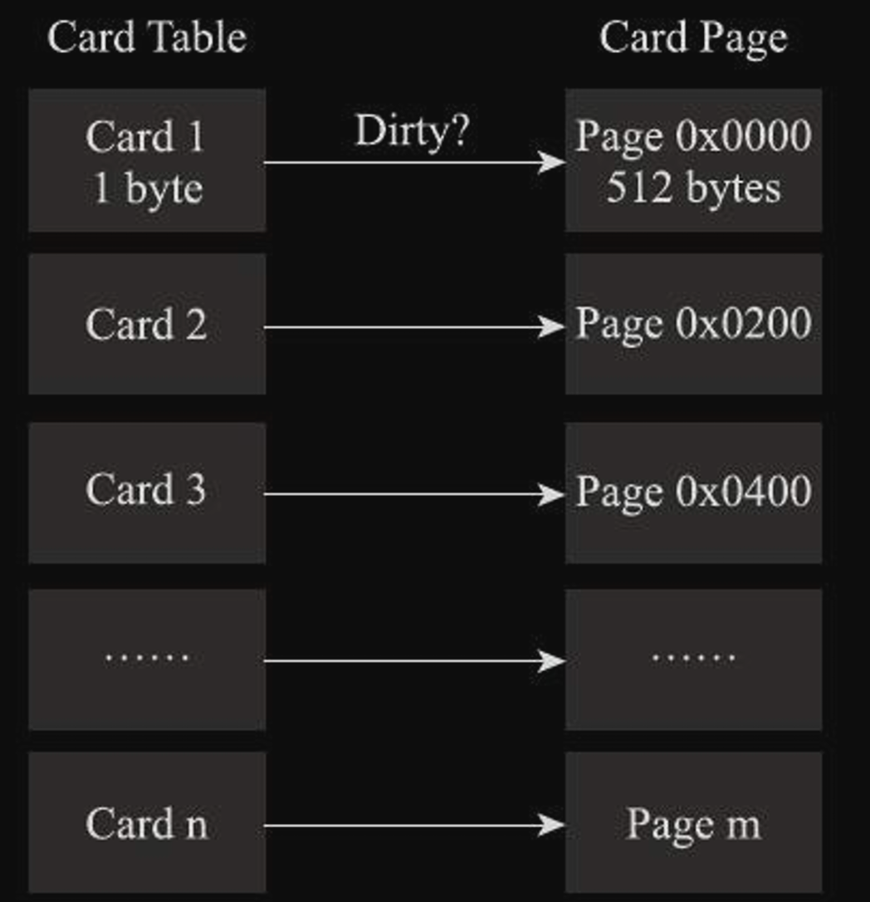

[^1]:之所以使用byte数组而不是bit数组主要是速度上的考量，现代计算机硬件都是最小按字节寻址的

#### 写屏障

记忆集/卡表可以存储跨代引用信息的存储，当引用类型的字段赋值本区域的对象那一瞬就代表了数据变脏，此时就需要更新维护记忆集/卡表。

HotSpot 虚拟机里是通过写屏障（Write Barrier）技术维护卡表状态的。写屏障可以理解为在虚拟机层面对“引用类型字段赋值”这个动作进行 AOP 切片。在引用对象赋值时会产生一个环形（Around）通知，供程序执行额外的动作，也就是说赋值的前后都在写屏障的覆盖范畴内，分为写前屏障（Pre-Write Barrier）和写后屏障（Post-Write Barrier）。

```java
void oop_field_store(oop* field, oop new_value) {
 // 引用字段赋值操作
*field = new_value;
 // 写后屏障，在这里完成卡表状态更新
post_write_barrier(field, new_value);
}
```

两个问题：

* 使用写屏障会产生额外的开销，但比起 Minor GC 直接扫描老年代对象快得多。

* “伪共享”（False Sharing）问题。假设 CPU 缓存行大小为 64 字节，由于一个卡表项占 1 个字节，这意味着，64 个卡表项将共享同一个缓存行。

  HotSpot 每个卡页为 512 字节，那么一个缓存行将对应 64 个卡页一共 64*512 = 32KB。如果不同线程对对象引用的更新操作，恰好位于同一个 32KB 区域内，这将导致同时更新卡表的同一个缓存行，从而造成缓存行的写回、无效化或者同步操作，间接影响程序性能。

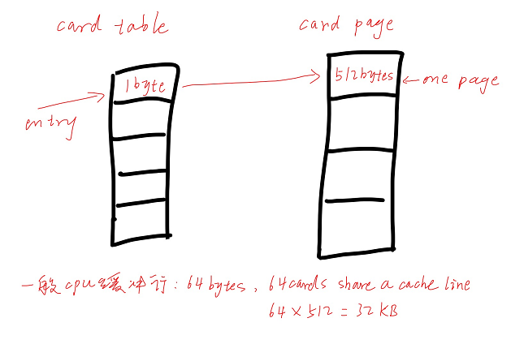


参数-XX:+UseCondCardMark，用来决定是否开启卡表更新的条件判断，开启如下会增加一次额外判断的开销，但能够避免伪共享问题。是否打开要根据应用实际运行情况来进行测试权衡

```java
if (CARD_TABLE [this address >> 9] != 0)
 CARD_TABLE [this address >> 9] = 0;
```

#### 并发的可达性分析

想解决或者降低用户线程的停顿，尝试并发的可达性分析。

为什么必须在一个能保障一致性的快照上才能进行对象图的遍历？因为如果用户线程与收集器是并发工作，从存活对象向下扫描其引用时，同时用户线程在修改引用关系——即修改对象图的结构，可能出现两种后果。

* 一种是把原本消亡的对象错误标记为存活。这种对象属于浮动垃圾，下次垃圾收集就会消灭掉。

* 另一种是把原本存活的对象错误标记为已消亡，这就是非常致命的后果了。发生后者这种致命的问题是由于：`未扫描的对象` 从 `扫描中的对象` 引用中脱离后，加入到 `已扫描的对象` 导致。

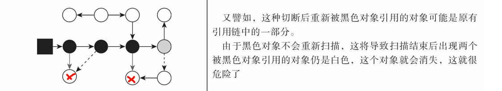 [^三色标记图]

解决并发扫描时的对象消失问题：增量更新（Incremental Update）和原始快照（Snapshot At The Beginning， SATB）

* 增量更新：当 `已扫描的对象` 插入 `未扫描的对象` 的引用关系时，将这个新插入的引用记录下来，等并发扫描结束后在重新扫描一遍，即 `已扫描的对象` 改为未扫描状态再重新遍历整个树。CMS 使用。
* 原始快照：当 `扫描中的对象` 准备删除 `未扫描的对象` 的引用关系时，将被删的引用记录下来，等并发扫描结束后重新扫描一遍，确定这个被删的引用对象是否依然被存活的元素所引用。G1、Shenandoah 使用 [^原始快照适用]

以上两种解决方案的插入引用的记录或删除引用的记录都是通过写屏障实现的

[^三色标记图]:已扫描的对象——黑色、未扫描的对象——白色、扫描中的对象——灰色
[^原始快照适用]:因为G1、Shenandoah其都基于Region的堆内存布局，每次参与收集的回收集不大，反向确认某对象是否被其他对象引用的效率高。

### 经典垃圾收集器

收集算法是内存回收的方法论，那垃圾收集器就是内存回收的实践者。“经典”介于在 JDK 7 Update 4 之后 JDK 11 之前，区别于高性能低延迟收集器。

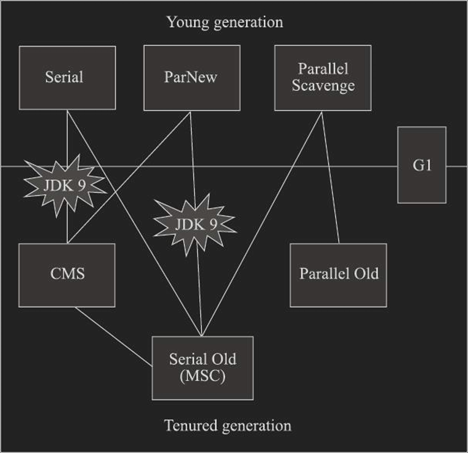

#### Serial 收集器

最基础、历史最悠久的单线程工作收集器。基于标记-复制算法实现的年轻代收集器。垃圾收集时必须暂停其他所有工作线程，“Stop The World”直到收集结束。实际上，虚拟机发展至今用户线程的停顿时间在持续缩短，但是仍然没有办法彻底消除。

依然是 HotSpot 虚拟机运行在客户端模式下的默认新生代收集器，简单而高效，用于收集能力的额外内存消耗最小，没有线程交互的开销，适用于用户桌面的应用场景以及近年来流行的部分微服务应用，停顿时间完全可以控制在十几、几十毫秒。

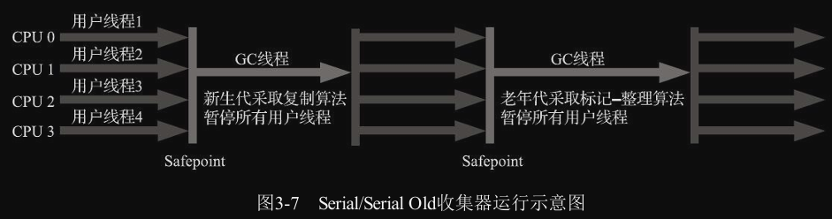

#### ParNew 收集器

ParNew 收集器实质上是 Serial 收集器的多线程并行版本。

ParNew 收集器除了支持多线程并行收集之外，其他与 Serial 收集器相比并没有太多创新之处。

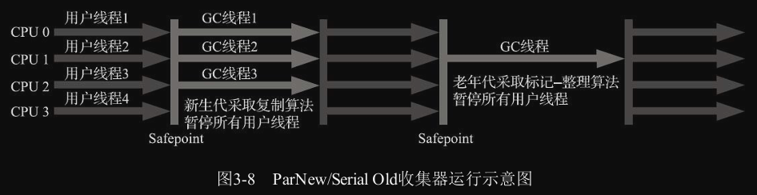

#### Parallel Scavenge 收集器

同样是一款是基于标记-复制算法实现的新生代收集器、支持并行收集的多线程收集器。

Parallel Scavenge 收集器的关注点不是尽可能地缩短垃圾收集时用户线程的停顿时间，其目标是达到一个可控制的吞吐 量（Throughput），因此它也经常被称作“吞吐量优先收集器”。

Parallel Scavenge 收集器提供了两个参数用于精确控制吞吐量。

-XX: MaxGCPauseMillis 参数：控制最大垃圾收集停顿时间。代价：牺牲吞吐量和新生代空间。系统把新生代调得小一些，虽然垃圾收集快了，但是收集行为发生更加频繁了，吞吐量也降下来。例如，原来 10 秒收集一次、每次停顿 100 毫秒，现在变成 5 秒收集一次、每次停顿 70 毫秒。

-XX: GCTimeRatio 参数：直接设置吞吐量大小

-XX:+UseAdaptiveSizePolicy：虚拟机会根据当前系统的运行情况收集性能监控信息，动态调整这些参数以提供最合适的停顿时间或者最大的吞吐量。这种调节方式称为垃圾收集的自适应的调节策略

#### Serial Old 收集器

Serial Old 收集器是 Serial 收集器的老年代版本。属于单线程收集器，使用标记-整理算法。


#### Parallel Old 收集器

Parallel Old 收集器是 Parallel Scavenge 收集器的老年代版本。支持多线程并发收集，使用标记-整理算法。

Parallel Old 问世之前，Parallel Scavenge 无法与其他表现良好的老年代收集器（如 CMS）配合工作，被 Serial Old 收集器的性能拖累。这种组合的总吞吐量甚至不一 定比 ParNew 加 CMS 的组合来得优秀。

直到 Parallel Old 收集器出现后，“吞吐量优先”收集器终于有了比较名副其实的搭配组合。

#### CMS 收集器

CMS（Concurrent Mark Sweep）收集器是一种以获取最短回收停顿时间为目标的收集器。从名字看出是基于标记-清除（Mark Sweep）算法实现的。

它的运作过程相对于前面几种收集器来说要更复杂一些，整个过程分为四个步骤

1. 初始标记。标记 GC Root 直接关联的对象，暂停用户线程但速度很快。
2. 并发标记。从 GC Root 直接关联的对象开始，遍历整个对象图，耗时较长但不暂停用户线程。
3. 重新标记。修正并发标记期间，因用户继续运作导致一部分对象其标记产生变动的标记记录。暂停用户线程但远比并发标记耗时短。
4. 并发清除。清理删除掉被标记的对象但不移动，因此可以与用户线程并发。

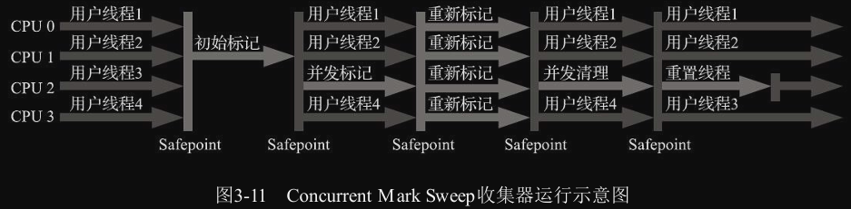

追求低停顿的一次成功尝试，缺点：

* 并发阶段，占用计算能力，导致程序变慢吞吐量降低。
* 无法等到老年代被填满后才进行收集，必须预留空间给并发阶段时用户进程运行产生的''浮动垃圾对象“，否则“Concurrent Mode Failure”失败会导致 Full GC。-XX: CMSInitiatingOccu-pancyFraction：调整 CMS 的触发百分比。用户应在生产环境中根据实际应用情况来权衡设置，过高可能导致预留内存不足“并发失败”，过低导致内存回收频繁，降低了性能。
* 重新标记解读依然有很长的 STW 时间。
* 收集结束时会有大量空间碎片产生。

#### Garbage First 收集器

Garbage First（简称 G1）收集器是垃圾收集器技术发展历史上的里程碑式的成果。JDK 9 发布之 日，G1 宣告取代 Parallel Scavenge 加 Parallel Old 组合，成为服务端模式下的默认垃圾收集器，CMS 被声明为不推荐使用（Deprecate）的收集器，-XX:+UseConcMarkSweepGC 来开启 CMS 收集器，且会收到弃用警告。

G1 收集器作了思想上的改变，跳出了分代收集这个樊笼。它可以面向堆内存任何部分来组成回收集（Collection Set，一般简称 CSet）进行回收，衡量标准不再是它属于哪个分代，而是哪块内存中存放的垃圾数量最多，回收收益最大，这就是 G1 收集器的 Mixed GC 模式。

目标：消耗在垃圾收集上的时间大概率不超过 N 毫秒，替代 CMS 收集器。

关键：**基于 Region 的堆内存布局**、**具有优先级的区域回收**

G1 收集器不再坚持固定大小以及固定数量的分代区域划分，而是把连续的 Java 堆划分为多个大小相等的独立区域（Region）。每个 Region 作为单次回收的最小单元，扮演新生代的 Eden 空间、新生代的 Survivor 空间、老年代空间。虽然保留了分代的概念，但 Region 的划分可以避免全区域的垃圾收集，G1 收集器去跟踪每一个 region 里垃圾的回收价值（回收空间/回收所需时间），并在后台维护一个优先级列表，每次根据用户设定运行的收集停顿时间（由参数-XX: MaxGCPauseMillis 指定，默认值是 200 毫秒），优先处理回收价值高的 Region，这便是 Garbage First 名字的来源。

> Humongous 区域专门用来存储大对象（大小超过 Region 空间一般的对象）。-XX: G1HeapRegionSize 可以设置 Region 的大小。而大小超过 Region 容量的超级大对象将被存于连续的 Humongous Region。通常作为老年代 的一部分来进行看待。

难点：

* 跨 Region 引用对象。解决：每个 Region 使用 [记忆集](#3.3.1 分代收集理论) 与 [卡表](#3.4.4 记忆集与卡表) 找到指向自己的其他 Region，但比以往收集器的卡表实现起来更复杂数量更多。（10%至 20%）
* 与 CMS 一样，如果内存回收的速度赶不上内存分配的速度也会 FullGC。解决：需调优参数
* 并发标记阶段保证收集线程与用户线程互不干扰地运行。用户线程改变对象引用关系时，必须保证其不能打破原本的对象图结构，导致标记结果出现错误。解决：CMS 收集器采用 [增量更新算法](#3.4.6 并发的可达性分析) 实现，而 G1 收集器则是通过 [原始快照（SATB）算法](#3.4.6 并发的可达性分析) 来实现的。
* 建立起可靠的停顿预测模型。用户通过-XX: MaxGCPauseMillis 参数指定的停顿时间。因此，G1 收集器必须精确预测不超过预期停顿时间的最高收益垃圾收集计划

大致可划分为以下四个步骤：

1. 初始标记。标记 GC Root 直接关联的对象。用户线程几乎无暂停。
2. 并发标记。从 GC Root 开始对堆中对象，遍历整个对象图。用户线程无暂停，耗时较长。
3. 最终标记。处理并发阶段结束后仍遗留下来的最后那少量的 SATB 记录。用户线程短暂的暂停
4. 筛选成本。更新 Region 的统计数据，对各个 Region 的回收价值和成本进行排序，根据用户所期望的停顿时间来制定回收计划，自由选择任意多个 Region 构成回收集。接着就是将存活对象复制到新的空 Region，清空旧 Region。涉及到对象的移动，因此必须暂停用户线程。

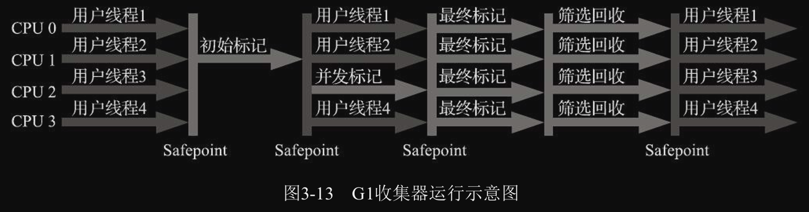

先进垃圾收集器的设计导向：从 G1 开始，从追求一次把整个 Java 堆全部清理干净，变为追求能够应付应用的内存分配速率 。

与 CMS 的对比

|                  | G1                                                           | CMS                                                          |
| ---------------- | ------------------------------------------------------------ | ------------------------------------------------------------ |
| 基础算法         | 整体：标记-整理。局部：标记-复制                             | 标记-清理                                                    |
| 是否产生空间碎片 | 否                                                           | 是，需要额外进行碎片整理                                     |
| 内存占用         | Region 过多导致记忆集等内存消耗过大                           | CMS 的卡表就相当简单， 只有唯一一份                           |
| 执行负载         | 写后屏障来更新维护更繁琐的卡表；<br />原始快照（SATB）算法需要写前屏障来跟踪并发标记时的指针变化，但比增量更新快；<br />写前屏障和写后屏障中要做的事情都放到队列里，然后再异步处理 | 写后屏障来更新维护卡表；<br />增量更新算法在重复标记阶段停顿时间过长； |
| 应用场景         | 大内存应用                                                   | 小内存应用                                                   |

### 低延迟垃圾收集器

内存占用、吞吐量和延迟这三项指标构成了一个“不可能三角”。

硬件性能增长，对软件系统的处理能力是有直接助益的，硬件的规格和性能越高，也有助于降低收集器运行时对应用程序的影响，换句话说，吞吐量会更高，但对延迟反而会带来负面的效果，因为堆内存越大，耗费的时间更多。因此，垃圾收集器越来越重视延迟这个性能指标。

CMS 和 G1 之前的全部收集器，工作的所有步骤都会产生“Stop The World”式的停顿。CMS 和 G1 通过增量更新和 [原始快照](#3.4.6 并发的可达性分析) 技术都实现了并发标记。G1 收集器虽然按更小的粒度进行回收，但整理阶段依旧出现时间过长的停顿。CMS 收集器使用标记-清理算法，虽然会避免了对象移动带来的停顿，但随着空间视频淤积最终也难逃内存整理的停顿。

Shenandoah 和 ZGC 两款低延迟垃圾收集器，几乎整个工作过程全部都是并发的，只有初始标记、最终标记有短暂的停顿，这部分停顿的时间基本上是固定 的，与堆的容量、堆中对象的数量没有正比例关系。

目标：任意堆内存大小下垃圾收集时间限制在十毫秒以内的低延迟

#### Shenandoah 收集器

第一款不由 Oracle（包括以前的 Sun）公 司的虚拟机团队所领导开发的 HotSpot 垃圾收集器。Oracle 拒绝在 OracleJDK 中支持 Shenandoah 收集器，条件编译完全排除 Shenandoah 的代码，OpenJDK 才会包含 Shenandoah 收集器。

Shenandoah 收集器和 G1，有着相似的堆内存布局，在初始标记、并发标记等许多阶段的处理思路上都高度一致，二者的特性相互借鉴甚至共享。

三大核心改进：回收阶段并行、默认不使用分代收集、使用“连接矩阵”的全局数据结构替代记忆集来记录跨 Region 的引用关系

工作过程大致划分为以下九个阶段：

1. 初始标记：与 G1 一致，标记与 GC Roots 直接关联的对象。短暂停顿。
2. **并发标记**：与 G1 一致，从与 GC Roots 直接关联的对象遍历对象图。与用户线程并发
3. 最终标记&成本筛选：与 G1 一致，处理剩余的 SATB 扫描，按用户设置设定运行的收集停顿时间筛选最有价值的回收集。短暂停顿。
4. 并发清理：只清理整个区域内没有一个存活对象的 Region（Immediate Garbage Region）。
5. **并发回收**：把回收集里面的存活对象先复制一份到其他未被使用的 Region 之 中。移动对象的同时，用户线程仍然可能不停对被移动的对象进行读写访问。
6. 初始引用更新：这个阶段只是为了建立一个线程集合点，确保所有并发回收阶段中进行的收集器线程都已完成分配给它们的对象移动任务而已。
7. **并发引用更新**：真正开始进行引用更新操作，把引用类型旧值改为新值即可。
8. 最终引用更新：修正存在于 GC Roots 中的引用。
9. 并发清理：与第一次并发清理一样。引用更新后，原回收集将不存在任何可达的存活对象。

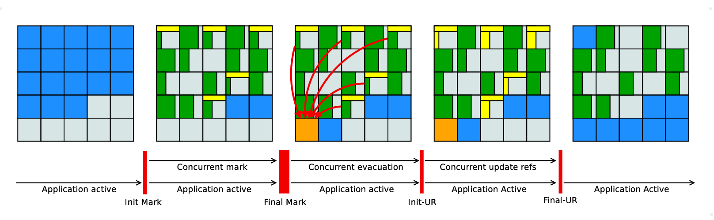

并行整理的关键技术——Brooks Pointer 转发指针

Brooks Pointer 在原有对象布局结构的最前面统一增加一个新的引用字段，与句柄定位存在与句柄池中不一样，转发指针是分散存放在每一个对象头前面。当对象拥有了一份新的副本时，只需要修改一处指针的值，即旧对象上转发指针的引用位置，使其指向新对象，便可将所有对该对象的访问转 发到新的副本上。

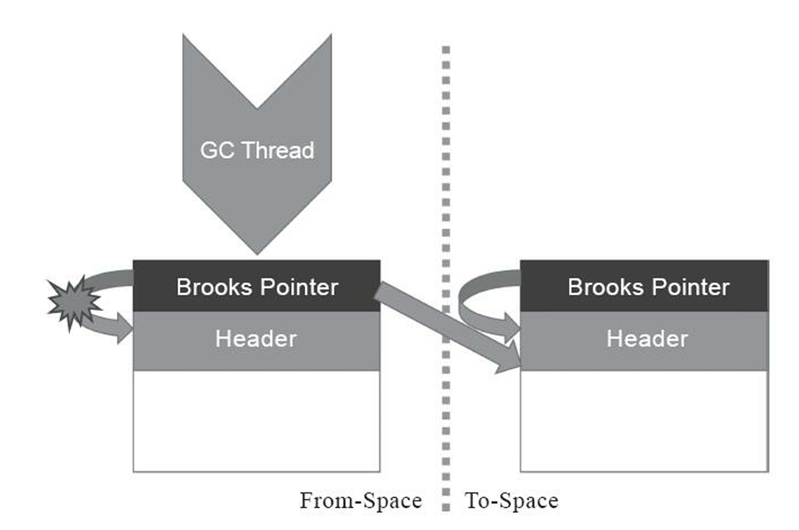

缺点一：每次对象访问会带来一次额外的转向开销

缺点二：当收集器线程复制了对象副本后，在转发指针更新之前，用户线程更新操作就会更新到旧对象而不是新对象。多线程竞争问题需要锁或者 CAS 操作来保证并发时对象的访问正确性的。

缺点三：既然更新的是新对象，读的时候返回的结果也应该是新对象。实际上整个对象访问的范畴很大，Shenandoah 不得不同时设置读、写屏障去拦截。读屏障的代价，这是比写屏障更大的。

并行整理负担与缺陷加上类似其他收集器用于维护卡表、用于实现并发标记的处理任务，造成 Shenandoah 的高运行负担。Shenandoah 停顿时间极短，但未实现最大停顿时间控制在十毫秒以内的目标，而吞吐量方面则出现了很明显的下降，其总运行时间是所有测试收集器中最长的。

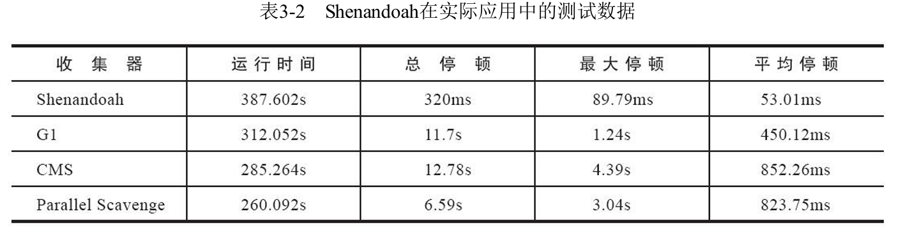

#### ZGC 收集器

Z Garbage Collector 低延迟垃圾收集器，是 Azul System 公司独步天下的 PGC（Pauseless GC）和 C4（Concurrent Continuously Compacting Collector）收集器的同胞兄弟，术语不同但实质内容几乎是一模一样的。

主要特征：基于 Region 内存布局、不设分代、使用读屏障、染色指针和内存多重映射等技术实现并发整理、低延迟

**基于 Region（也称为 Page 或者 ZPage）的堆内存布局**

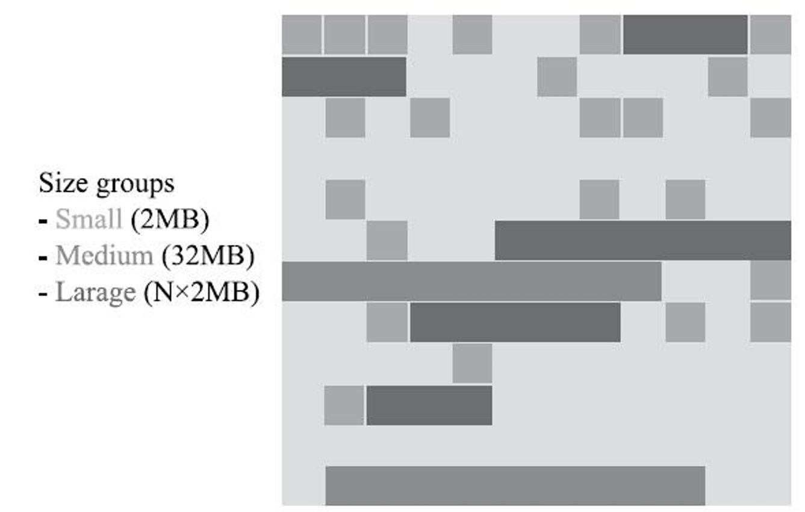

**并发整理算法实现的核心技术——染色指针、Region 里的转发表**

追踪式收集算法的标记阶段需要给对象打上三色标记，HotSpot 虚拟机的几种收集器有不同的标记实现方案：Serial 收集器把标记直接记录在对象头上、G1 和 Shenandoah 把标记记录在与对象相互独立的数据结构 BitMap 上、ZGC 的染色指针 [^寻址空间限制] 直接把标记信息记在引用对象的指针上。这时，原先说的可达性分析是遍历对象 图来标记对象，巧妙地变成了遍历“引用图”来标记“引用”了。

通过指针上的四个标志信息，虚拟机可以直接从指针中看到其引用对象的

* 三色标记状态
* 是否进入了重分配集（即被移动过）
* 是否只能通过 finalize()方法才能被访问

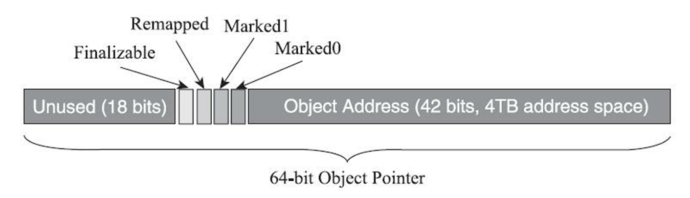

ZGC 的运作过程大致可划分为以下四个大的阶段：

1. 并发标记。遍历对象图做可达性分析，标记阶段会更新染色指针中的 Marked 0、Marked 1 标志。前后也要经过类似于 G1、Shenandoah 的初始标记、最终标记（尽管 ZGC 中的名字不叫这些）的短暂停顿。
2. 并发预备重分配。根据特定的查询条件统计得出本次收集过程要清理哪些 Region，组成重分配集（Relocation Set）。这不像 G1 那样是在做收益优先的回收计划，ZGC 是扫描全堆省去记忆集的维护成本，此次预备只是决定哪些 Region 会被释放和 Region 里的对象被复制并整理。
3. 并发重分配。重分配是 ZGC 执行过程中的核心阶段，这个过程要把重分配集中的存活对象复制到新的 Region 上，维护一个转发表（Forward Table），记录从旧对象到新对象的转向关系。ZGC 收集器能仅从引用上的染色指针就明确得知一个对象是否处于重分配集之中。若用户线程访问了该重分配的对象，会被内存屏障截获，该访问会通过转发表被转发至复制后的新对象，同时修正更新该引用的值，该行为被称为指针的“自愈”，这种方式只需要慢一次，不像 Shenandoah 的转发指针多次访问陷入多次转发。当 region 所有存活对象都复制完成，可以释放旧 region 但不能删除转发表，因为用户线程还有可能访问旧指针，需要转发表进行“自愈”。得益于转发表，ZGC 无需像 Shenandoah 那样特意等待引用更新这个过程才能释放 Region。
4. 并发重映射：修正整个堆中指向重分配集中旧对象的所有引用，本质上和并发引用更新阶段一样的，但是 ZGC 的并发重映射不是一个迫切的任务。重映射清理这些旧引用的主要目的是为了用户线程第一次访问不变慢以及还有清理结束后释放转发表这样的附带收益。ZGC 甚至把这个工作合并到了下一次垃圾收集循环中的并发标记阶段里去完成，因为两个工作都是要遍历对象的。

ZGC 的特点、好处：

* 无需处理跨代引用：全堆并发扫描，不用像 G1、Shenandoah 那样通过写屏障来维护记忆集。Region 记忆集占用大量空间、写屏障造成额外负担。

* 暂时无分代：连 CMS 中只记录新生代和老年代间引用的卡表也没有。
* 短暂停顿：初始标记、最终标记的短暂停顿也只与 GC Roots 大小相关而与堆内存大小无关。

ZGC 的缺点、展望

* 浮动垃圾：假设完整的一次并发收集是 10 分钟同时应用的对象分配速率很高，将创造大量朝生夕灭的的新对象，产生了大量的浮动垃圾。由于回收周期过长，回收到的内存空间持续小于期间并发产生的浮动垃圾所占的空间，堆中剩余的空间就越来越小了。临时解决：提升堆空间。根本解决：引入收集更频繁的年轻代。
* 无法支持 NUMA 内存分配，以保证高效内存访问

ZGC 的吞吐量达到 Parallel Scavenge 的 99%，直接超越了 G1。停顿时间与 Parallel Scavenge、G1 拉开了两个数量级的差距，控制在十毫秒之内。

[^寻址空间限制]:Linux下64位指针的高18位不能用来寻址，剩余的46位指针最大的寻址空间64TB（2的46次幂）内存能够充分满足大型服务器的需要。ZGC的染色指针技术将下64位指针高4位提取出来存储四个标志信息，进一步压缩了原本就只有46位的地址空间，也直接导致 ZGC能够管理的内存不可以超过4TB（2的42次幂），不能支持32位平台，不能支持压缩指针（-XX: +UseCompressedOops）等诸多约束

### 选择合适的垃圾回收器

Epsilon 收集器——传统 Java 有着内存占用较大，在容器中启动时间长，即时编译需要缓慢优化等特点。短时间、小规模的应用只要运行数分钟甚至数秒， 只要 Java 虚拟机能正确分配内存，在堆耗尽之前就会退出，那显然运行负载极小、没有任何回收行为 的 Epsilon 便是很恰当的选择。

根据关注点选择：吞吐量（数据分析、科学计算类）、延迟（客户协议应用）、内存占用（客户端应用、嵌入式）

根据硬件设施选择：

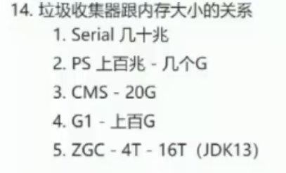

带商业技术支持——C4 收集器

注重延迟、无足够预算——ZGC

稳定性、win 系统——Shenandoah

遗留系统——CMS/G1

| 垃圾收集器                                     | 适用场景                                   | 类型                                                         | 优点                                               | 缺点                                                         |
| ---------------------------------------------- | ------------------------------------------ | ------------------------------------------------------------ | -------------------------------------------------- | ------------------------------------------------------------ |
| Serial 串行收集器                              | 单核 CPU ， 单线程程序或小型 Java 应用。   | 单线程<br />新生代 Serial 使用 标记-复制算法<br />老年代 Serial Old 使用标记-整理算法 | 简单高效                                           | 用户线程停顿时间很长                                         |
| Parallel 并行收集器                            | 多核 CPU，后台处理任务，注重吞吐量的应用。 | 多线程<br />新生代 Parallel Scavenge 使用 标记-复制算法<br />老年代 Parallel Old 使用标记-整理算法 | pspo 组合注重吞吐量（即减少 GC 总时间）             | 用户线程停顿时间较长                                         |
| CMS（Concurrent Mark-Sweep）并发标记清理收集器 | 对响应时间要求高的应用，如 Web 服务        | 多线程<br />新生代 ParNew 使用 标记-复制算法<br />老年代 CMS 使用标记-清理算法 | 并发标记降低停顿时间                               | 会产生内存碎片。 <br />对 CPU 资源敏感，并发阶段可能影响性能 |
| G1（Garbage First）并发收集器                  | 大型内存、多核 CPU、高实时性要求的应用     | 分区（Region）<br />标记-复制算法<br />成本评估、优先回收垃圾最多的区域 | 可控单次回收停顿时间<br />减少全堆扫描，内存碎片少 | 记忆集、内存屏障等实现复杂，调优成本高                       |
| Shenandoah 并发收集器                          | G1 无法满足需要更低停顿时间的高性能系统。   | 分区（Region）<br />标记-复制算法<br />并发整理、低延迟      | 比 G1 停顿时间明显低                                 | 适配性不如 G1                                                |
| ZGC（Z Garbage Collector）并发收集器           | 超大内存应用，对延迟敏感的系统             | 分区（Region）<br />标记-复制算法<br />高度并发、极低延迟    | 停顿时间与堆大小无关<br />高效处理大内存场景       | CPU 开销较高                                                 |

[官网推荐](https://docs.oracle.com/javase/8/docs/technotes/guides/vm/gctuning/collectors.html#sthref28)：让服务器自己来选择收集器、优先调整堆的大小来进行优化。达不到要求则按照以下引导进行选择

* 如果内存小于 100M，使用串行收集器
* 如果是单核，并且没有停顿时间要求，使用串行或 JVM 自己选
* 如果性能最重要，且允许停顿时间超过 1 秒，选择并行或 JVM 自己选
* 如果响应时间最重要，并且不能超过 1 秒，使用并发收集器

#### 虚拟机及垃圾收集器日志

JDK 9 HotSpot 所有功能的日志都收归到了“-Xlog”参数上。

```
-Xlog[:[selector][:[output][:[decorators][:output-options]]]]
```

#### 3.7.4 垃圾收集器参数

| 参数                           | 描述                                                         |
| :----------------------------- | :----------------------------------------------------------- |
| UseParNewGC                    | 打开此开关后，使用 ParNew + Serial Old 的收集器组合进行内存回收，在 JDK 9 后不再支持 |
| UseConcMarkSweepGC             | 打开此开关后，使用 ParNew + CMS + Serial Old 的收集器组合进行内存回收。Serial Old 收集器将作为 CMS 收集器出现 “Concurrent Mode Failure” 失败后的备份数据使用 |
| UseParallelGC                  | JDK 9 之前虚拟机运行在 Server 模式下的默认值，打开此开关后，使用 Parallel Scavenge + Serial Old (PS MarkSweep) 的收集器组合进行内存回收 |
| UseParallelOldGC               | 打开此开关后，使用 Parallel Scavenge + Parallel Old 的收集器组合进行内存回收 |
| SurvivorRatio                  | 新生代中 Eden 区域与 Survivor 区域的容量比值，默认为 8，代表 Eden：Survivor = 8： |
| PretenureSizeThreshold         | 直接开启到老年代的对象大小，设置这个参数后，大于这个参数的对象将直接在老年代分配 |
| MaxTenuringThreshold           | 开启到老年代的对象年龄。每个对象在坚持过一次 Minor GC 之后，年龄就增加 1，当超过这个参数的时候进入老年代 |
| UseAdaptiveSizePolicy          | 动态调整 Java 堆中各个区域的大小以及进入老年代的年龄         |
| HandlePromotionFailure         | 是否允许分配相关失败，即老年代的剩余空间不足以应付新生代的整个 Eden 和 Survivor 区的所有对象都存活的极端情况 |
| ParallelGCTThreads             | 设置并行 GC 时进行内存回收的数据数                           |
| GCTimeRatio                    | GC 时间占总时间的比率，默认值为 99，即允许 1% 的 GC 时间。仅在使用 Parallel Scavenge 收集器时生效 |
| MaxGCPauseMillis               | 设置 GC 的最大停顿时间。仅在使用 Parallel Scavenge 收集器时生效 |
| CMSInitiatingOccupancyFraction | 设置 CMS 收集器在老年代空间被使用多少后触发放映效果。默认值为 68%，仅在使用 CMS 收集器时生效 |
| UseCMSCompactAtFullCollection  | 设置 CMS 收集器在完成放映效果后是否要进行一次内存碎片整理。仅在使用 CMS 收集器时生效，此参数从 JDK 9 开始废弃 |
| CMSFullGCsBeforeCompaction     | 设置 CMS 收集器在进行若干次放映效果后再启动一次内存碎片整理。仅在使用 CMS 收集器时生效，此参数从 JDK 9 开始废弃 |
| UseGIGC                        | 使用 G1 收集器，这个是 JDK 9 后的 Server 模式默认值          |
| G1HeapRegionSize = n             | 设置 Region 大小，并非最终值                                 |
| MaxGCPauseMillis               | 设置 G1 收集过程目标时间，默认值是 200ms，不是硬件条件       |
| G1NewSizePercent               | 新生代最小值，默认值是 5%                                    |
| G1MaxNewSizePercent            | 新生代最大值，默认值是 60%                                   |
| ParallelGCTThreads             | 用户线程结构期间并行执行的收集器线程数                       |
| ConcGCTThreads = n               | 并发标记，并发整理的执行线程数，对不同的收集器，根据其能够开发的阶段，有不同的含义 |
| InitiatingHeapOccupancyPercent | 设置触发标记周期的 Java 堆占用率阈值。默认值是 45%。这里的 Java 堆占比指的是 non_young_capacity_bytes，包括 old+humongous |
| UseShenandoahGC                | 使用 Shenandoah 收集器。这个选项在 OracleJDK 中不被支持，只能在 OpenJDK 12 或者某些支持 Shenandoah 的 Backport 发行版本使用。目前仍然要配合 -XX:+UnlockExperimentalVMOptions 使用 |
| ShenandoahGCHeuristics         | Shenandoah 何时启动一次 GC 过程，其可选值有 adaptive、static、compact、passive、aggressive |
| UseZGC                         | 使用 ZGC 收集器，目前仍然要配合 -XX:+UnlockExperimentalVMOptions 使用 |
| UseNUMA                        | 启用 NUMA 内存分配支持，目前只有 Parallel 和 ZGC 支持，以后 G1 收集器可能也会支持该选项 |

### 实战：内存分配与回收策略

自动内存管理最根本的目标是自动化地解决两个问题：自动给对象分配内存以及自动回收分配给对象的内存。

对象分配的规则并不是固定的，《Java 虚拟机规范》并未规定新对象的创建和存储细节，这取决于虚拟机当前使用的是哪一种垃圾收集器，以及虚拟机中与内存相关的参数的设定。

使用 HotSpot 虚拟机，以客户端模式运行，使用 **Serial 加 Serial Old** 客户端默认收集器组合下的内存分配和回收的策略，展示若干最基本的内存分配原则，代码去验证这些原则。

#### 对象优先在 Eden 分配

对象的内存分配，从概念上讲，应该都是在堆上分配（而实际上也有可能经过即时编译后被拆散为标量类型并间接地在栈上分配）。

大多数情况下，对象在新生代 Eden 区中分配。当 Eden 区没有足够空间进行分配时，虚拟机将发起 一次 Minor GC。

```java
private static final int _1MB = 1024 * 1024;

    /**
     * VM参数：-verbose:gc -Xms20M -Xmx20M -Xmn10M -XX:+PrintGCDetails -XX:SurvivorRatio=8
     */
    public static void testAllocation() {
        byte[] allocation1, allocation2, allocation3, allocation4;
        allocation1 = new byte[2 * _1MB];
        allocation2 = new byte[2 * _1MB];
        allocation3 = new byte[2 * _1MB];
        allocation4 = new byte[4 * _1MB];  // eden满 出现一次Minor GC
    }
    
```

测试结果

```
[GC [DefNew: 6993K->194K(9216K), 0.0028878 secs] 6993K->6338K(19456K), 0.0029025 secs] [Times: user=0.00 sys=0.00, real=0.00 secs] 
Heap
 def new generation   total 9216K, used 4784K [0x00000000f9a00000, 0x00000000fa400000, 0x00000000fa400000)
  eden space 8192K,  56% used [0x00000000f9a00000, 0x00000000f9e7b6d8, 0x00000000fa200000)
  from space 1024K,  19% used [0x00000000fa300000, 0x00000000fa330ae0, 0x00000000fa400000)
  to   space 1024K,   0% used [0x00000000fa200000, 0x00000000fa200000, 0x00000000fa300000)
 tenured generation   total 10240K, used 6144K [0x00000000fa400000, 0x00000000fae00000, 0x00000000fae00000)
   the space 10240K,  60% used [0x00000000fa400000, 0x00000000faa00030, 0x00000000faa00200, 0x00000000fae00000)
 compacting perm gen  total 21248K, used 3598K [0x00000000fae00000, 0x00000000fc2c0000, 0x0000000100000000)
   the space 21248K,  16% used [0x00000000fae00000, 0x00000000fb183ad8, 0x00000000fb183c00, 0x00000000fc2c0000)
No shared spaces configured.
```

如上，年轻代 eden 大小 8×1024KB、年轻代大小 survivor 1024KB，老年代大小 10×1024KB，永久代方法区 21248KB

1. allocation4 创建空间时，eden 剩余空间已不足，发生 Minor GC。
2. 由于 eden 的三个 2MB 对象无法放入 survivor 空间，只能通过分配担保机制转移至年老代。
3. 收集结束后，allocation4 成功分配进 eden 空间

#### 大对象直接进入老年代

大对象就是指需要大量连续内存空间的 Java 对象，大对象可以是那种很长的字符串，或者元素数量很庞大的数组，本节例子中的 byte [] 数组就是典型的大对象。

写程序的时候应注意避免声明一群“朝生夕灭”的“短命大对象”。大对象容易导致在新生代的空间碎片里找不到位置提前触发垃圾收集。且每次垃圾回收存活的大对象需要高额的内存复制开销。-XX: PretenureSizeThreshold 参数，指定大于该设置值的对象直接在老年代分配，这样做的目的就是避免在 Eden 区及两个 Survivor 区 之间来回复制，产生大量的内存复制操作。

```java
/**
     * VM参数：-verbose:gc -Xms20M -Xmx20M -Xmn10M -XX:+PrintGCDetails -XX:SurvivorRatio=8
     * -XX:PretenureSizeThreshold=3145728
     */
    public static void testPretenureSizeThreshold() {
        byte[] allocation;
        allocation = new byte[4 * _1MB];  //直接分配在老年代中
    }
```

```
Heap
 def new generation   total 9216K, used 1013K [0x00000000f9a00000, 0x00000000fa400000, 0x00000000fa400000)
  eden space 8192K,  12% used [0x00000000f9a00000, 0x00000000f9afd688, 0x00000000fa200000)
  from space 1024K,   0% used [0x00000000fa200000, 0x00000000fa200000, 0x00000000fa300000)
  to   space 1024K,   0% used [0x00000000fa300000, 0x00000000fa300000, 0x00000000fa400000)
 tenured generation   total 10240K, used 4096K [0x00000000fa400000, 0x00000000fae00000, 0x00000000fae00000)
   the space 10240K,  40% used [0x00000000fa400000, 0x00000000fa800010, 0x00000000fa800200, 0x00000000fae00000)
 compacting perm gen  total 21248K, used 3430K [0x00000000fae00000, 0x00000000fc2c0000, 0x0000000100000000)
   the space 21248K,  16% used [0x00000000fae00000, 0x00000000fb159880, 0x00000000fb159a00, 0x00000000fc2c0000)
No shared spaces configured.
```

#### 长期存活的对象将进入老年代

新生代和老年代的回收策略各不相同，那内存回收时就必须能决策哪些对象应当放在新生代，哪些对象放在老年代中。对象在 Survivor 区中每熬过一次 Minor GC，年龄就增加 1 岁，当它的年龄增加到一定程度，就会被晋升到老年代中。参数-XX: MaxTenuringThreshold 设置对象晋升老年代的年龄阈值（默认为 15）。

```java
private static final int _1MB = 1024 * 1024;
 /**
 * VM参数：-verbose:gc -Xms20M -Xmx20M -Xmn10M -XX:+PrintGCDetails -XX:Survivor
   Ratio=8 -XX:MaxTenuringThreshold=1
 * -XX:+PrintTenuringDistribution
 */
 @SuppressWarnings("unused")
 public static void testTenuringThreshold() {
    byte[] allocation1, allocation2, allocation3;
    allocation1 = new byte[_1MB / 4];   // 什么时候进入老年代决定于XX:MaxTenuring
                                                   Threshold设置
    allocation2 = new byte[4 * _1MB];
    allocation3 = new byte[4 * _1MB]; // eden满 第一次Minor GC
    allocation3 = null;
    allocation3 = new byte[4 * _1MB]; // eden满 第二次Minor GC
 }
```

结果：年龄阈值 1 时，allocation1 两次 GC 后将进入老年代。年龄阈值 2 时，allocation1 两次 GC 后没进入老年代，而是存在 survivor 空间。

```
  
  from space 1024K,   0% used [0x00000000fa200000, 0x00000000fa200430, 0x00000000fa300000)
  to   space 1024K,   0% used [0x00000000fa300000, 0x00000000fa300000, 0x00000000fa400000)
  
  from space 1024K,  43% used [0x00000000fa200000, 0x00000000fa26fed8, 0x00000000fa300000)
  to   space 1024K,   0% used [0x00000000fa300000, 0x00000000fa300000, 0x00000000fa400000)
```

#### 动态对象年龄判定

如果在 Survivor 空间中相同年龄所有对象大小的总和大于 Survivor 空间的一半，年龄大于或等于该年龄的对象也可以直接进入老年代。

```java
/**
     * VM参数：-verbose:gc -Xms20M -Xmx20M -Xmn10M -XX:+PrintGCDetails -XX:SurvivorRatio=8 -XX:MaxTenuringThreshold=15
     * -XX:+PrintTenuringDistribution
     */
    public static void testTenuringThreshold2() {
        byte[] allocation1, allocation2, allocation3, allocation4;
        allocation1 = new byte[_1MB / 4];   // allocation1+allocation2大于survivo空间一半
        allocation2 = new byte[_1MB / 4];
        allocation3 = new byte[4 * _1MB];
        allocation4 = new byte[4 * _1MB]; // eden满 第一次Minor GC
        allocation4 = null;
        allocation4 = new byte[4 * _1MB]; // eden满 第二次Minor GC
    }
```

结果：两次 GC 后，allocation1 和 allocation2 一起进入老年代。测试至少年龄为 2 才会触发动态对象年龄判定。因此一次 GC 不行。

```
from space 1024K,   0% used [0x00000000fa200000, 0x00000000fa2000f0, 0x00000000fa300000)
to   space 1024K,   0% used [0x00000000fa300000, 0x00000000fa300000, 0x00000000fa400000)
```

#### 空间分配担保

Minor GC 之前，虚拟机必须先检查老年代最大可用的连续空间是否大于新生代所有对象总空间，如果成立则这次 MinorGC 安全。如果不成立，则虚拟机会先查看 XX：HandlePromotionFailure 参数的设置值是否允许担保失败（Handle Promotion Failure），如果允许则继续检查老年代最大可用的连续空间是否大于历次晋升到老年代对象的平均大小，如果大于则尝试本次 Minor GC。如果小于或者不允许担保则要改为进行一次 Full GC。

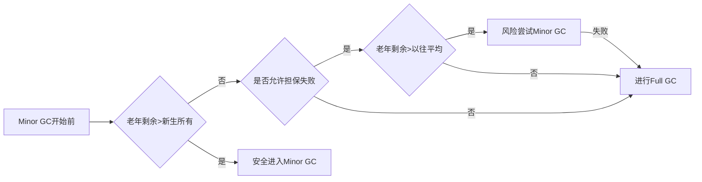
```mermaid
graph LR
a[Minor GC开始前] --> c{老年剩余>新生所有}
    c -->|否| d{是否允许担保失败}
    d -->|是| g{老年剩余>以往平均}
    g -->|是| h[风险尝试Minor GC]
    h -->|失败| f
    g -->|否| f
    d -->|否| f[进行Full GC]
    c -->|是| e[安全进入Minor GC]
```


## 虚拟机性能监控、故障处理工具

### 概述

为系统定位问题

关键：基础知识、日积月累的经验

依据：异常堆栈、虚拟机运行日志、垃圾收集器日志、线程快照 （threaddump/javacore 文件）、堆转储快照（heapdump/hprof 文件）等

工具：虚拟机故障处理、 分析的工具

### 基础故障处理工具

JDK 的 bin 目录下各种小工具

根据软件可用性和授 权的不同划分成三类：商业授权工具（商业付费）、正式支持工具（长期支持）、实验性工具

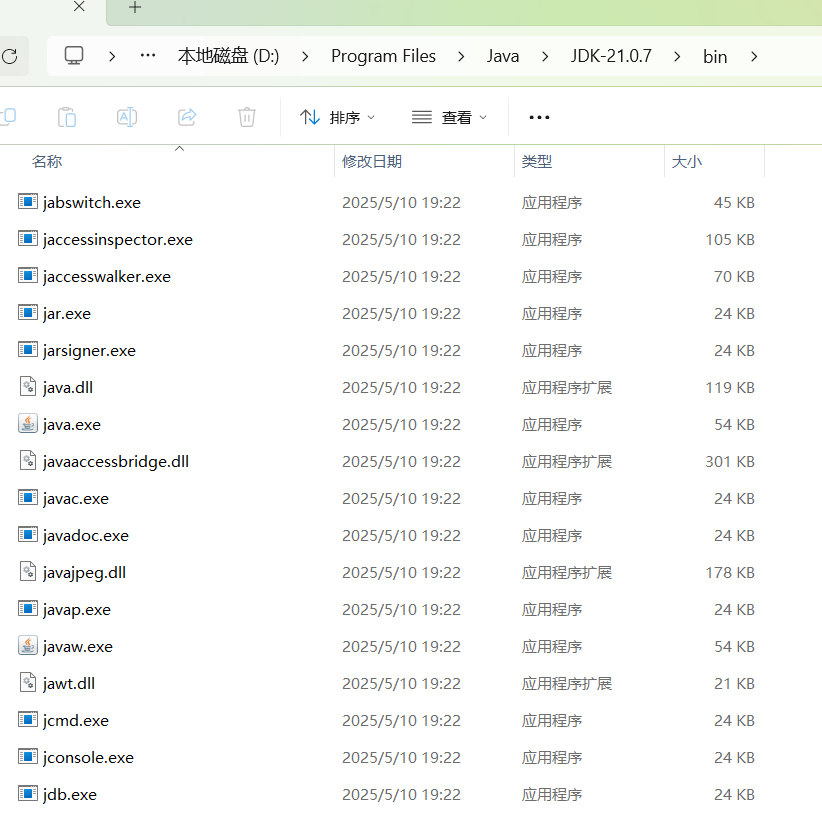

命令行工具大多仅是一层薄包装而 已，真正的功能代码是实现在 JDK 的工具类库中的

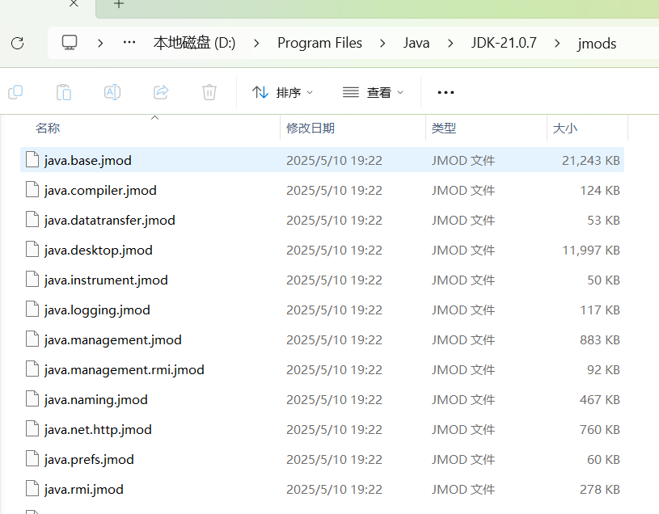

JDK 开发团队选择采用 Java 语言本身来实现这些故障处理工具，使得开发者可以选择直接在应用程序中提供功能强大的监控分析功能。

需要用到的大部分工具监控运行程序时，程序启动时请添加参 数“-Dcom.sun.management.jmxremote”开启 JMX 管理功能，JDK6 以上 JMX 管理默认开启。

#### jps：虚拟机进程状况工具

jps（JVM Process Status Tool），名称和功能都和 UNIX 的 ps 命令类似。可以列出正在运行的虚拟机进 程，并显示虚拟机执行主类（Main Class，main()函数所在的类）名称以及这些进程的本地虚拟机唯一 ID（LVMID，Local Virtual Machine Identifier）。根据 windows 任务管理器或者 UNIX 的 ps 命令也可以查出 LVMID，但如果同时启动了多个虚拟机进程，进程名称一样时，那就必须依赖 jps 命令显示主类的功能才能区分了。

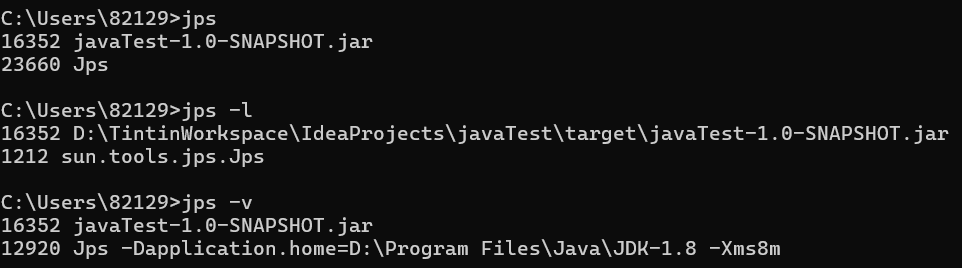

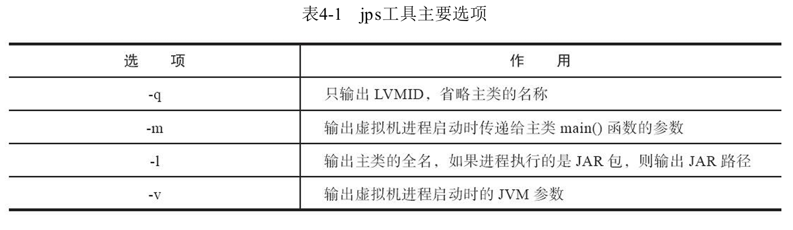

#### jstat：虚拟机统计信息监视工具

jstat（JVM Statistics Monitoring Tool）是用于监视虚拟机各种运行状态信息的命令行工具。它可以显示本地或者远程虚拟机进程中的 **类加载**、**内存**、垃圾收集、即时编译等运行时数据。

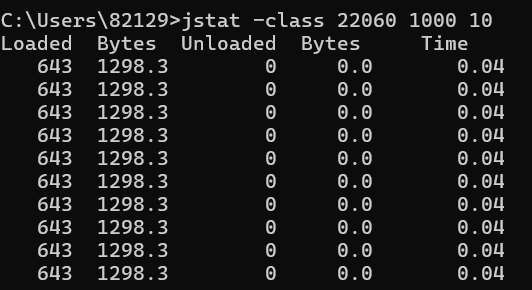

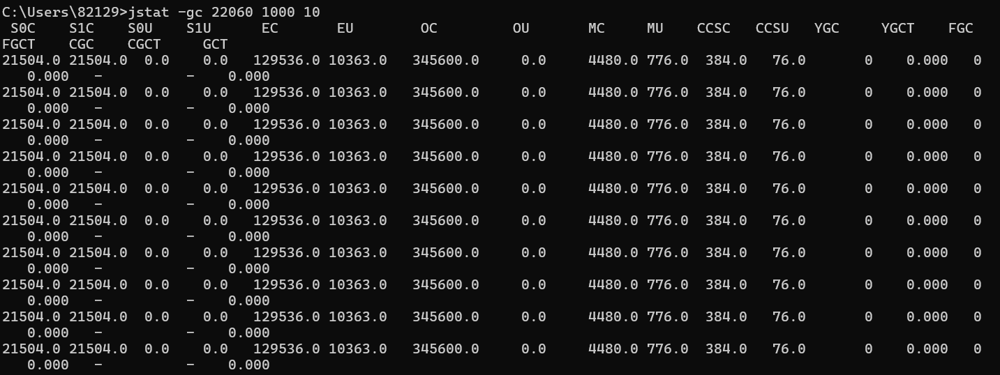

```
每250=毫秒查询一次进程2764垃圾收集状况，一共查询20次
jstat -gc 2764 250 20
```

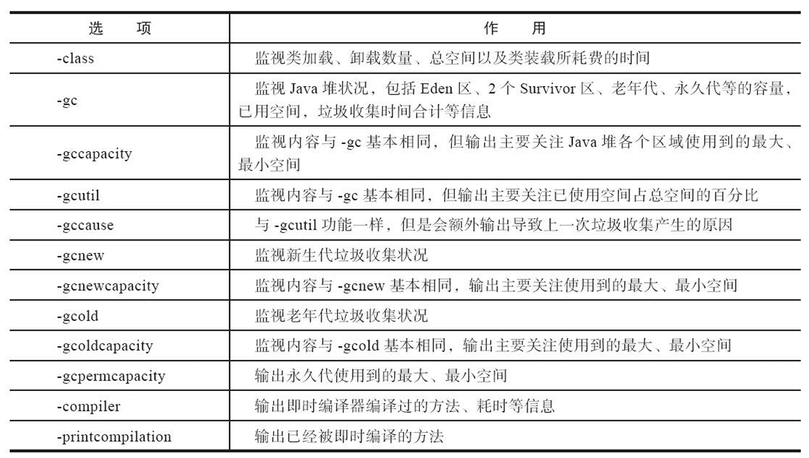

```
jstat -gcutil 2764
查询各个运行时数据区的内存空间占用率和各种类型GC的总耗时
```

#### jinfo：Java 配置信息工作

jinfo（Configuration Info for Java）的作用是实时查看和调整虚拟机各项参数。jps -v 可以显示启动时显式指定的参数列表。其他参数的系统默认值可以用 jinfo -flag 选项查询。

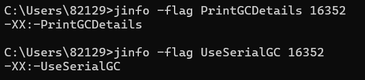

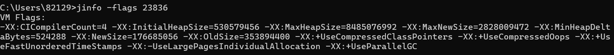

#### jmap：Java 内存映像工具

获取 Java 堆转储快照的方式

XX：+HeapDumpOnOutOfMemoryError 参数：内存溢出异常自动转储

-XX:+HeapDumpOnCtrlBreak 参数：使用 [Ctrl]+[Break] 键

jmap（Memory Map for Java）命令：获取堆转储快照也能查询 finalize 执行队列、Java 堆和方法区的 详细信息，如空间使用率、当前用的是哪种收集器等

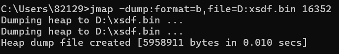

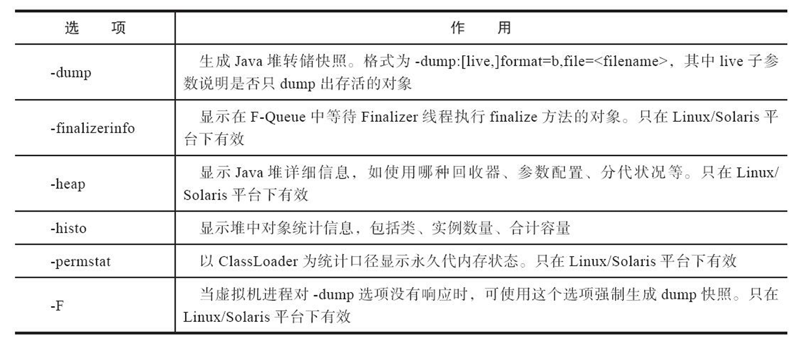

#### jhat：虚拟机堆转储快照分析工具

JDK 提供 jhat（JVM Heap Analysis Tool）命令与 jmap 搭配使用，来分析 jmap 生成的堆转储快照。jhat 内置了一个微型的 HTTP/Web 服务器，生成堆转储快照的分析结果后，可以在浏览器中查看。

缺点：耗费硬件资源、分析功能相对来说比较简陋

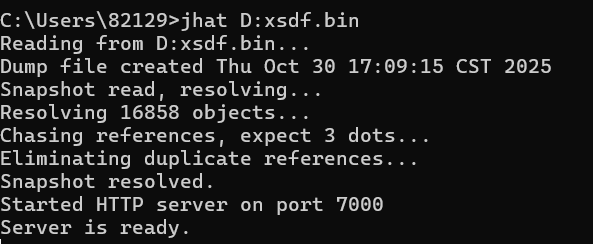

屏幕显示“Server is ready.”的提示后，用户在浏览器中输入 <http://localhost>: 7000/可以看到分析结 果

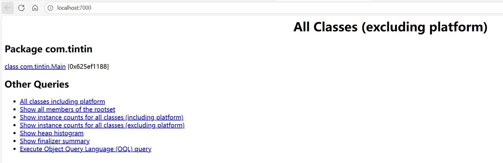

#### jstack：Java 堆栈跟踪工具

jstack（Stack Trace for Java）命令用于生成虚拟机当前时刻的线程快照（一般称为 threaddump 或者 javacore 文件）。线程快照就是当前虚拟机内每一条线程正在执行的方法堆栈的集合，生成线程快照的 目的通常是定位线程出现长时间停顿的原因，如线程间死锁、死循环、请求外部资源导致的长时间挂 起等，都是导致线程长时间停顿的常见原因。

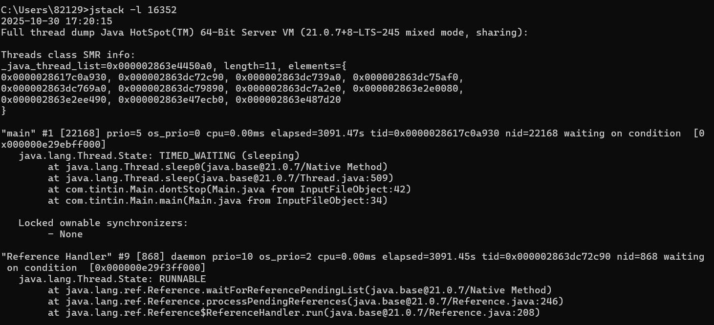

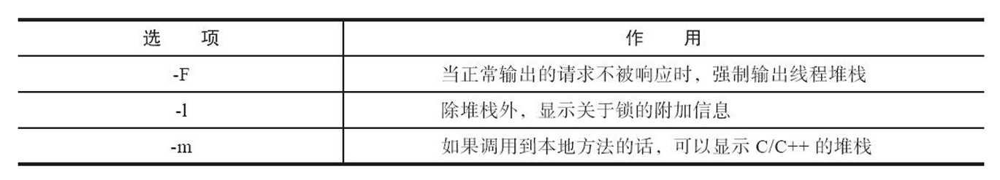

#### 基础性能监控和故障处理工具汇总

| 名称          | 主要作用                                                     |
| :------------ | :----------------------------------------------------------- |
| jps           | JVM Process Status Tool，显示指定系统内所有的 HotSpot 虚拟机进程 |
| jstat         | JVM Statistics Monitoring Tool，用于收集 Hotspot 虚拟机各方面的运行数据 |
| jstadd        | JVM Statistics Monitoring Tool Daemon，jstat 的守护程序，启动一个 RMI 服务器应用程序，用于监视测试的 HotSpot 虚拟机的创建和终止，并提供一个界面，允许远程监控工具附加到本地系统上运行的虚拟机。在 JDK 9 中集成到了 JHSDB 中 |
| jinfo         | Configuration Info for Java，显示虚拟机配置信息。在 JDK 9 中集成到了 JHSDB 中 |
| jmap          | Memory Map for Java，生成虚拟机的内存存储快照（heapdump 文件）。在 JDK 9 中集成到了 JHSDB 中 |
| jhat          | JVM Heap Analysis Tool，用于分析堆转储快照，它会建立一个 HTTP/Web 服务器，让用户可以在浏览器上查看分析结果。在 JDK 9 中被 JHSDB 代替 |
| jstack        | Stack Trace for Java，显示虚拟机的线程快照。在 JDK 9 中集成到了 JHSDB 中 |
| **jhsdb**     | Java HotSpot Debugger，一个基于 Serviceability Agent 的 HotSpot 进程调试器，从 JDK 9 开始提供 |
| jsadebugd     | Java Serviceability Agent Debug Daemon，适用于 Java 的可维护性代理调试守护程序，主要用于附加到指定的 Java 进程、核心文件，或充当一个调试服务器 |
| jcmd          | JVM Command，虚拟机诊断命令工具，将诊断命令请求发送到正在运行的 Java 虚拟机。从 JDK 7 开始提供 |
| **jconsole**  | Java Console，用于监控 Java 虚拟机的使用 JMX 规范的图形工具。它可以监控本地和远程 Java 虚拟机，还可以监控和管理应用程序 |
| **jmc**       | Java Mission Control，包含用于监控和管理 Java 应用程序的工具，而不会引入与这些工具相关的性能开销。开发者可以使用 jmc 命令来创建 JMC 工具，从 JDK 7 Update 40 开始集成到 OracleJDK 中 |
| **jvisualvm** | Java VisualVM，一种图形化工具，可在 Java 虚拟机中运行时提供有关基于 Java 技术的应用程序（Java 应用程序）的详细信息。Java VisualVM 提供内存和 CPU 分析、堆转储分析、内存泄漏检测、MBean 访问和垃圾收集。从 JDK 6 Update 7 开始提供；从 JDK 9 开始不再打包入 JDK 中，但仍保持更新发展，可以独立下载 |

### 可视化故障处理工具

JConsole、 JHSDB、VisualVM 和 JMC

#### JHSDB：基于服务性代理的调试工具

JDK 5 HSDB 出现。JDK 9 提供。和 JCMD 一样整合了所有基础工具所提供的专项功能。还具有可视化的故障处理功能。

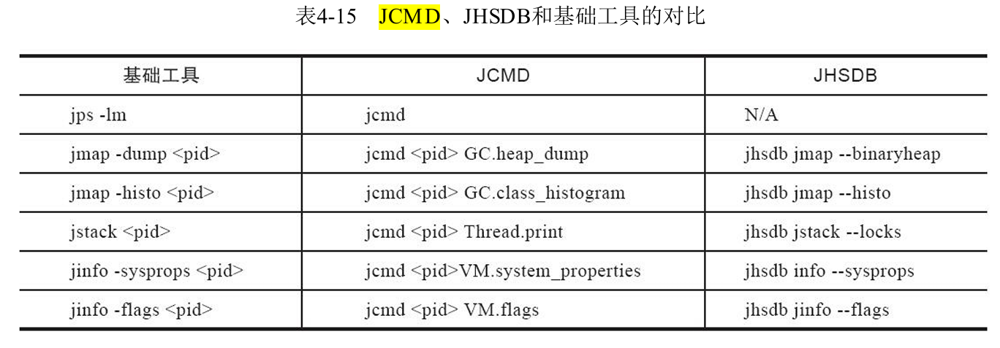

JHSDB 是一款基于服务性代理（Serviceability Agent，SA）实现的进程外调试工具。它在一个独立的 Java 虚拟机的进程里，通过 HotSpot 提供的用于映射 Java 虚拟机运行信息的 API 集合，分析其他 HotSpot 虚拟机的内部数据。或者它直接从 HotSpot 虚拟机进程内存中 dump 出来的转储快照里还原出它的运行状态细节。

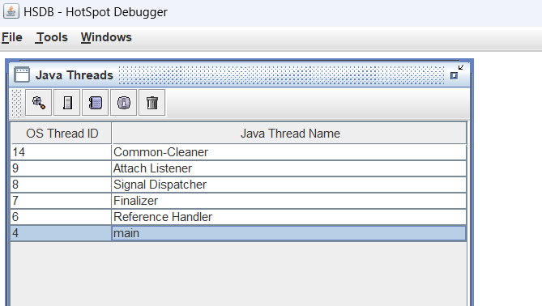

#### JConsole：Java 监视与管理控制台

JConsole（Java Monitoring and Management Console）是一款基于 JMX（Java Manage-ment Extensions）的可视化监视、管理工具。它的主要功能是通过 JMX 的 MBean（Managed Bean）对系统进 行信息收集和参数动态调整。

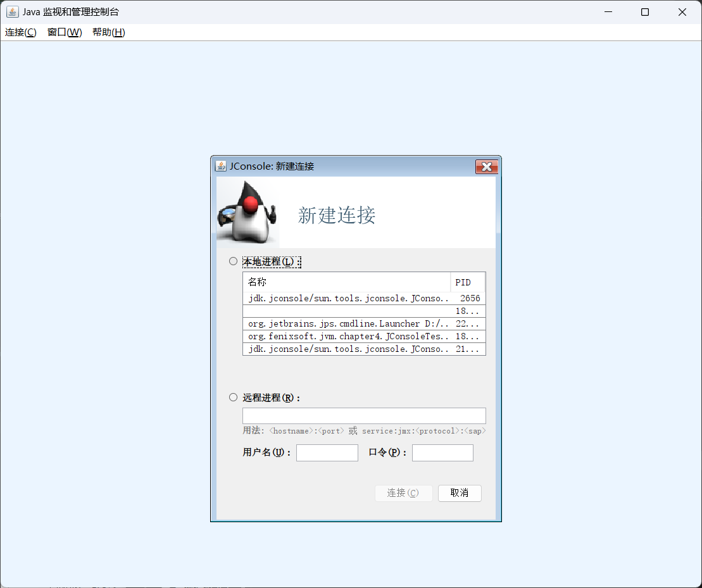

可以内存监控、查看线程、查看线程死锁

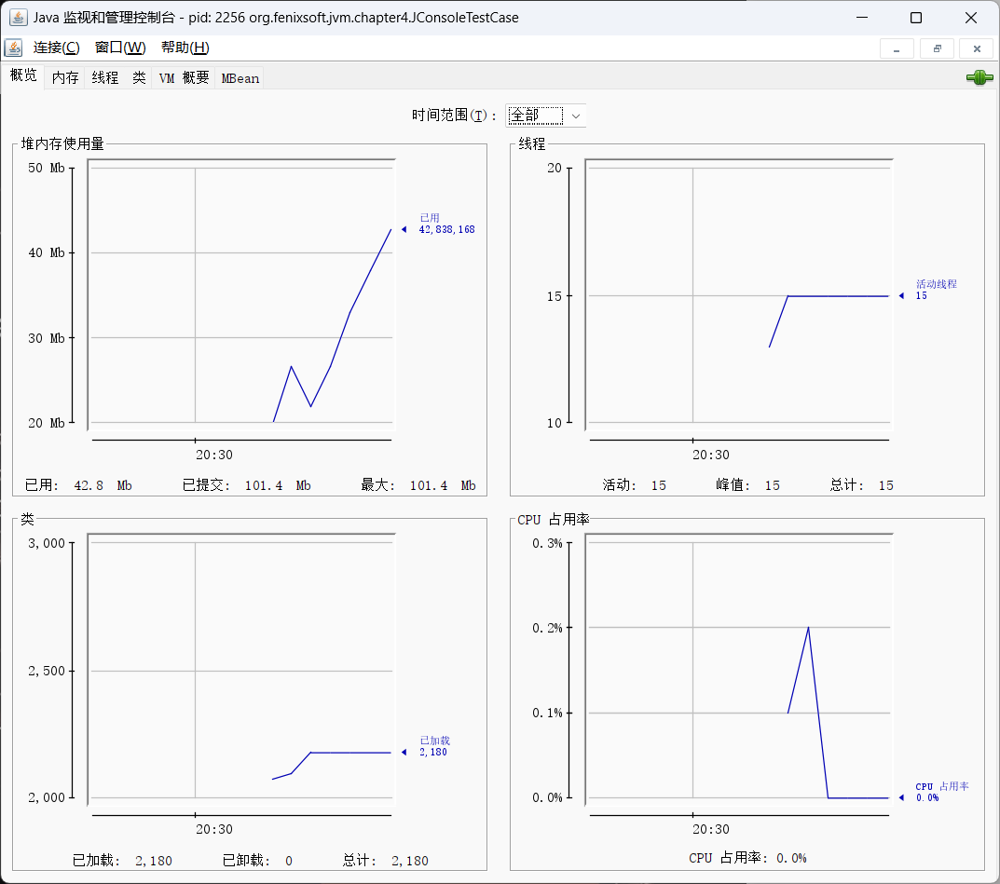

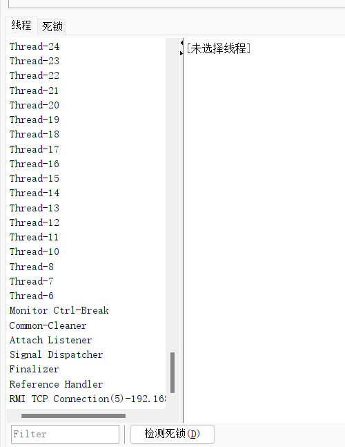

#### VisualVM：多合-故障处理工具

VisualVM 中“概述”“监视”“线程”“MBeans”的功能与 JConsole 差别不大。

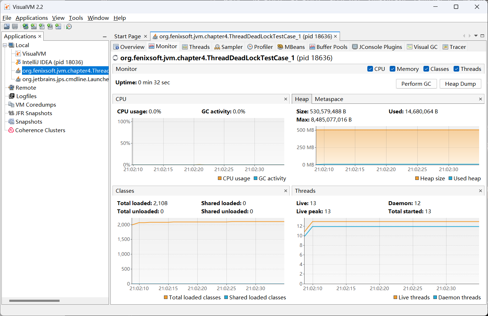

生成、浏览堆转储快照

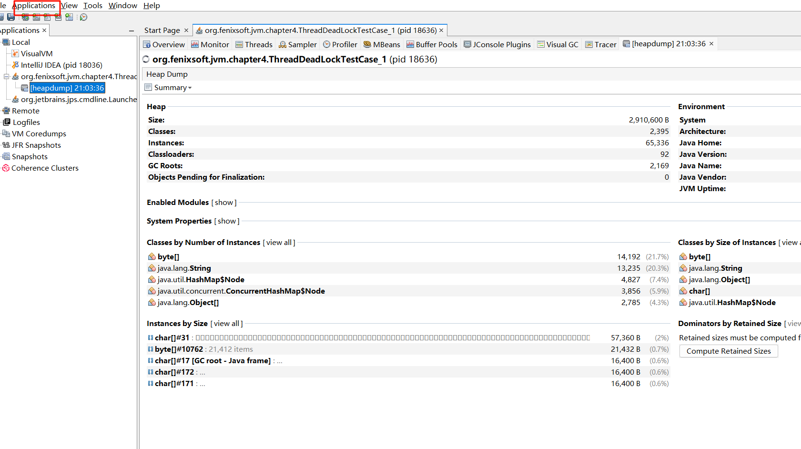

分析程序性能

VisualVM 提供了程序运行期间方法级的处理器执行时间分析以及内存分析。做 Profiling 分析肯定会对程序运行性能有比较大的影响，所以一般不在生产环境使用这项功能，或者改用 JMC 来完成，JMC 的 Profiling 能力更强，对应用的影响非常轻微。

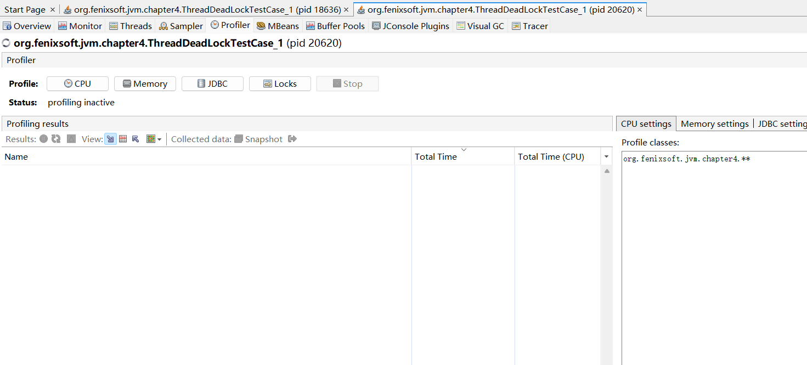

具备了通过插件扩展功能的能力，BTrace 动态日志跟踪，BTrace 的用途很广泛，打印调用堆栈、参数、返回值只是它最基础的使用形式。可以使用 BTrace 进行性能监视、定位连接泄漏、内存泄漏、解决多线程竞争问题等

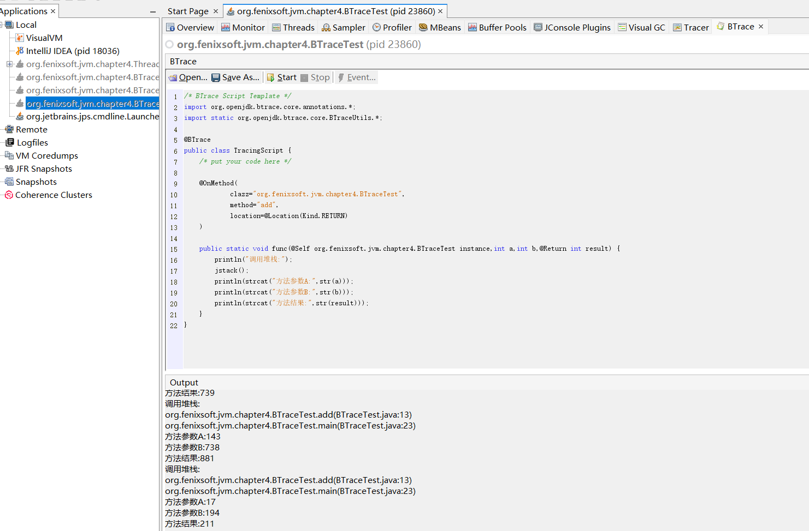

#### Java Mission Control：可持续在线的监控工具

JMC 最初是 BEA 公司的产品。和 JCONSOLE 一样 JMC 与虚拟机之间同样采取 JMX 协议进行通信，显示来自虚拟机 MBean 提供的数据。JFR 是一套内建在 HotSpot 虚拟机里面的监控和基于事件的信息搜集框架，JMC 作为 JFR 的分析工具，展示来自 JFR 的数据。

### HotSpot 虚拟机插件及工具

* Ideal Graph Visualizer：用于可视化展示 C2 即时编译器是如何将字节码转化为理想图，然后转化为 机器码的。
* Client Compiler Visualizer：用于查看 C1 即时编译器生成高级中间表示（HIR），转换成低级中 间表示（LIR）和做物理寄存器分配的过程。
* MakeDeps：帮助处理 HotSpot 的编译依赖的工具。
* Project Creator：帮忙生成 Visual Studio 的.project 文件的工具。
* LogCompilation：将-XX:+LogCompilation 输出的日志整理成更容易阅读的格式的工具。 ·HSDIS：即时编译器的反汇编插件。


HSDIS 插件的作用是让 HotSpot 的-XX:+PrintAssembly 指令调用它来把即时编译器动态生成的本 地代码还原为汇编代码输出，同时还会自动产生大量非常有价值的注释，这样我们就可以通过输出的 汇编代码来从最本质的角度分析问题。

## 调优案例分析与实战

### 案例分析

如何在不改变已有软硬件版本和规格的前提下， 调整部署和配置策略去解决或者缓解问题。

#### 大内存硬件上的程序部署策略

业务：15 万 PV/日 在线文档类型网站

硬件：四路志强处理器、16GB 物理内存（大内存）、64 位 CentOS 5.4 操作系统、Resin 作为 Web 服务器

软件：64 位的 JDK 5

初始参数：-Xmx = 12GB、-Xms = 12GB

GC 条件：HotSpot 虚拟机是以服务端模式运行，默认使用的是吞吐量优先收集器，回收 12GB 的 Java 堆，一次 Full GC 的停顿时间就高达 14 秒。

部署方式：单个 Java 虚拟机实例

实际问题：使用一段时间后，网站经常不定期出现长时间失去响应。

原因：访问文档时会把文档从磁盘提取到内存中，导致内 存中出现很多由文档序列化产生的大对象，这些大对象大多在分配时就直接进入了老年代，这些大对象大多在分配时就直接进入了老年代，没有在 Minor GC 中被清理掉。而且过大的堆内存进行回收会带来的长时间的停顿。使用 Parallel Scavenge/Old 收集器：前提是必须把应用的 Full GC 频率控制得足够低，至少要低到不会在用户使用过程中发生。例如，使用时间不要出现 Full GC，深夜执行定时任务触发一次 Full GC 甚至重启，来保持内存可用空间稳定。

解决方案：建立 5 个 32 位 JDK 的逻辑集群，每个进程按 2GB 内存计算（其中堆固定为 1.5GB），建立一个 Apache 服务作为前端均衡代理作为访问门户，改为 CMS 收集器进行垃圾回收。

**单个 Java 虚拟机实例来管理大内存**

* 回收大块堆内存而导致的长时间停顿。G1 收集器增量分次回收。ZGC 和 Shenandoah 收集器成熟得到相对彻底地解决。
* 大内存必须有 64 位 Java 虚拟机的支持，压缩指针（若开启）、处理器缓存行容量（Cache Line）等因素导致性能下降。
* 相同的程序在 64 位虚拟机中消耗的内存一般比 32 位虚拟机要大，这是由于指针膨胀，以及数据类 型对齐补白等因素导致的，可以开启（默认即开启）压缩指针功能来缓解。
* 必须保证应用程序足够稳定。要是发生了堆内存溢出，堆转储文件可能高达十几 GB 乃至更大的，难以导出和分析。必须应用 JMC 这种能够在生产环境中进行的运维工具。

**建立逻辑集群来管理大内存**

一台物理机器上启动多个应用服务器进程，每个服务器进程分配不同端口，前端搭建一个负载均衡器，反向代理的方式来分配访问请求。

* 节点竞争全局的资源，各个节点如果同时访问某个磁盘文件，容易导致 I/O 异常。
* 使用 32 位 Java 虚拟机作为集群节点。受到 32 位的内存限制。
* 很难最高效率地利用某些资源池，因为在各个节点建立自己独立的连接池。集中式的 JNDI 来解决。
* 大量使用本地缓存的应用，会造成内存浪费。因为每一个逻辑节点都有缓存了。集中式缓存来解决。

#### 集群间同步导致的内存溢出

业务：基于 B/S 的 MIS 系统

硬件：两台双路处理器、8GB 内存的 HP 小型机

软件：64 位的 JDK 5 、应用中间件是 WebLogic 9.2

部署方式：每台机器 3 个 WebLogic 实例，构成一个 6 个节点的亲合式集群，节点之 间没有进行 Session 同步。

实际问题：有一些需求要实现部分数据在各个节点间共享。最开始这些数据是存放在数据库中的，但由于读写频繁、竞争很激烈，性能影响较大，后面使用 JBossCache 构建了一个全局缓存。全局缓存启用后，服务正常使用了一段较长的时间。但在最近不定期出现多次的内存溢出问 题。

原因：JBossCache 是基于自家的 JGroups 进行集群间的数据通信。由于信息有传输失败需要重发的可能性，在确认所有注册在 GMS（Group Membership Service）的 节点都收到正确的信息前，发送的信息必须在内存中保留。当网络情况不能满足传输要求时，重发数据在内存中不断堆积，很快就产生了内存溢出。

#### 堆外内存导致的溢出错

业务：基于 B/S 的电子考试系统

硬件：普通 PC 机，Core i5 CPU，4GB 内存，运行 32 位 Windows 操作系统。

软件：逆向 AJAX 技术、CometD 1.1.1 作为服 务端推送框架、服务器是 Jetty 7.1.4

GC 条件：HotSpot 虚拟机是以服务端模式运行，默认使用的是吞吐量优先收集器，回收 12GB 的 Java 堆，一次 Full GC 的停顿时间就高达 14 秒。

部署方式：单个 Java 虚拟机实例

实际问题：测试期间发现服务端不定时抛出内存溢出异常。使用 jstat 检查垃圾收集并不频繁，Eden 区、Survivor 区、老年代以及方 法区的内存全部都很稳定，压力并不大。

```
异常堆栈
[org.eclipse.jetty.util.log] handle failed java.lang.OutOfMemoryError: null
 at sun.misc.Unsafe.allocateMemory(Native Method)
 at java.nio.DirectByteBuffer.<init>(DirectByteBuffer.java:99)
 at java.nio.ByteBuffer.allocateDirect(ByteBuffer.java:288)
 at org.eclipse.jetty.io.nio.DirectNIOBuffer.<init>
 ……
```

原因：本案 例中使用的 CometD 1.1.1 框架，正好有大量的 NIO 操作需要使用到直接内存。32 位 Windows 平台的单进程内存限制是 2GB，其中划了 1.6GB 给 Java 堆，而 Direct Memory 耗用的内存并不算入这 1.6GB 的堆之内，因此它最大 也只能在剩余的 0.4GB 空间中再分出一部分而已。直接内存却不能像新生代、老年代那样，发现空间不足了就主 动通知收集器进行垃圾回收，它只能等待老年代满后 Full GC 出现后，“顺便”帮它清理掉内存的废弃对 象。

**小内存或者 32 位的应用问题**

* 直接内存：可通过-XX: MaxDirectMemorySize 调整大小，内存不足时抛出 OutOf-MemoryError 或 者 OutOfMemoryError：Direct buffer memory。

* 线程堆栈：可通过-Xss 调整大小，内存不足时抛出 StackOverflowError（如果线程请求的栈深度大于虚拟机所允许的深度）或者 OutOfMemoryError（如果 Java 虚拟机栈容量可以动态扩展，当栈扩展时无法申请到足够的内存）。
* Socket 缓存区：每个 Socket 连接都 Receive 和 Send 两个缓存区各占内存，连接过多如果无法分配，可能会抛出 IOException：Too many open files 异常。
* JNI 代码：如果代码中使用了 JNI 调用本地库，那本地库使用的内存也不在堆中，而是占用 Java 虚 拟机的本地方法栈和本地内存的。
* 虚拟机和垃圾收集器：虚拟机、垃圾收集器的工作也是要消耗一定数量的内存的。

#### 外部命令导致系统缓慢

业务：数字校园应用系统

硬件：四路处理器的 Solaris 10 操作系统

软件：中间件为 GlassFish 服务 器

部署方式：单个 Java 虚拟机实例

实际问题：处理器使用率很高，最消耗处理器资源的竟然是“fork”系统调用。

原因：每个用户请求的处理都需要执行一个外部 Shell 脚 本来获得系统的一些信息。执行这个 Shell 脚本是通过 Java 的 Runtime.getRuntime().exec()方法来调用的。频繁执行这个操作，系统的消耗必然会很大。

解决：改用 Java 的 API 去获取这些信息

#### 服务器虚拟机进程崩溃

业务：基于 B/S 的 MIS 系统

硬件：两台双路处理器、8GB 内存的 HP 系统

软件：WebLogic 9.2

部署方式：多个 Java 虚拟机实例集群

实际问题：频繁出现集群节点的虚拟机进程自动关闭的现象，每个节点的虚拟机崩溃之前，都发生过大量相同的异常，

```
异常堆栈
java.net.SocketException: Connection reset
 at java.net.SocketInputStream.read(SocketInputStream.java:168)
 at java.io.BufferedInputStream.fill(BufferedInputStream.java:218)
 at java.io.BufferedInputStream.read(BufferedInputStream.java:235)
 at org.apache.axis.transport.http.HTTPSender.readHeadersFromSocket(HTTPSender.java:583)
 at org.apache.axis.transport.http.HTTPSender.invoke(HTTPSender.java:143)
 ... 99 more
```

原因：与一个 OA 门户做了集成，在 MIS 系统工作流的待办事项变化时，要通过 Web 服务通知 OA 门户系统，把待办事项的变化同步到 OA 门户 之中。且 OA 门户的接口调用时间长容易导致超时中断。由于 MIS 系统的用户多，待办事项变化很快，为了不被 OA 系统速度拖累，使用了异步的方式调用 Web 服务，但由于两边服务速度的完全不对等，时间越长就累积了越多 Web 服务没有调用完成，导致在 等待的线程和 Socket 连接越来越多，最终超过虚拟机的承受能力后导致虚拟机进程崩溃。

解决：通知 OA 门户 方修复无法使用的集成接口，将异步调用改为生产者/消费者模式的消息队列实现

#### 不恰当数据结构导致内存占用过大

业务：后台 RPC 服务器

硬件：64 位 Java 虚拟机

初始参数：内存配置为-Xms4g-Xmx8g-Xmn1g

GC 条件：使用 ParNew 加 CMS 的收集器组合

实际问题：业务上需要每 10 分钟加载一个约 80MB 的数据文件到内存进行数据分析，这些数据会在内存中形成超过 100 万个 HashMapEntry，在这段时间里面 Minor GC 就会造成超过 500 毫秒的停顿

原因：在分析数据文件期间，800MB 的 Eden 空间很快被填满引发垃圾收集，但 Minor GC 之后，新生代中绝大部分对象依然是存活的。把这些对象复制到 Survivor 并维持这些对象引用的正确性就成为一个沉重的负担，因 此导致垃圾收集的暂停时间明显变长。

临时解决：-XX: SurvivorRatio = 65536、-XX: MaxTenuringThreshold = 0 或者-XX:+Always-Tenure 即直接将 Survivor 空间去掉、让新生代中存活的对象在第一次 Minor GC 后立即进入老年代，等到 Major GC 的时候再去清理它们。

根本解决：HashMap 结构来存储数据文件空间效率太低了，改成其他形式。

#### 由 Windows 虚拟内存导致的长时间停顿

业务：带心跳检测功能的 GUI 桌面程序

初始参数：所需的内存并不大（-Xmx256m）

GC 条件：使用 ParNew 加 CMS 的收集器组合

实际问题：心跳检测有误报的可能，查询日志发现误报的原因是程序会偶尔出现间隔约一分钟的时间完全无日志输出，处于停顿状态。大部分收集时间都控制在 100 毫秒以内，但偶尔就出现一次接近 1 分钟的长时间收集过程。

原因：程序在最小化时它的工作内存被 自动交换到磁盘的页面文件之中了，这样发生垃圾收集时就有可能因为恢复页面文件的操作导致不正常的垃圾收集停顿。

根本解决：加入参数“-Dsun.awt.keepWorkingSetOnMinimize = true” 保证程序在恢复最小化时能够立即响 应

#### 由安全点导致长时间停顿

问题：比较大的承担公共计算任务的离线 HBase 集群，运行在 JDK 8 上，使用 G1 收集器。离线分析任务对延迟又不会特别敏感，所以将-XX: MaxGCPauseMillis 参数设置到了 500 毫秒。运行一段时间后发现垃圾收集的停顿经常达到 3 秒以 上，而且实际垃圾收集器进行回收的动作就只占其中的几百毫秒

原因：加入参数-XX: +PrintSafepointStatistics 和-XX: PrintSafepointStatisticsCount = 1 去查看安全点日志，等待所有用户线程进入到安全点，但是 有两个线程特别慢，导致发生了很长时间的自旋等待。由于部分线程已经走到了安全点，但还有一些特别慢的线程并没有到，所以垃圾收集线程无法开始工 作，只能空转（自旋）等待。

解决：添加-XX: +SafepointTimeout 和-XX: SafepointTimeoutDelay = 2000 两个参数，让虚拟机在等到线程进入安全点的 时间超过 2000 毫秒时就认定为超时，输出导致问题的线程名称。HotSpot 虚拟机为了避免安全点过多带来过重的负担，对循环 还有一项优化措施，认为循环次数较少的话，执行时间应该也不会太长，所以使用 int 类型或范围更小 的数据类型作为索引值的循环默认是不会被放置安全点的。但该问题线程单次执行就很慢。因此解决问题可以设置-XX:+UseCountedLoopSafepoints 参数去强制在可数循环中也放置安全点或修改缓慢代码。

### 实战：Eclipse 运行速度调优

硬件：为 ThinkPad X201，Intel i5 CPU，4GB 物理内存，运行 32 位 Windows 7 系统

软件：HotSpot 1.5 b64

初始参数：-Xmx: 512m -Dcom.sun.management.jmxremote 启用 jmx 管理

Java 程序三大非用户程序时间：类加载时间、编译（即时编译）时间、GC 时间

* 升级 JDK 版本

版本升级在某些方面带来了一定性能改善

* 编译时间和类加载时间的优化

JDK 6 中新加入类型检查验证器，部分机器出现缓慢时，可以通过参数-Xverify：none 禁止掉字节码验证过程

-Xint 来禁止编译器运作，强制虚拟机对字节码采用纯解释方式执行，省去了即时编译所需的启动时间损耗，但程序启动总耗时会陡增，因为即时编译可以提升解释执行的速度问题。如果一段 Java 方法被调用次数到达一定程度，就会被判定为热代码交给即时编译器即 时编译为本地代码，提高运行速度（这就是 HotSpot 虚拟机名字的来由）。

* 垃圾收集时间优化

在 Eclipse 启动的原始数据样本中，短短 15 秒，类共发生了 19 次 Full GC 和 378 次 Minor GC，一共 397 次 GC 共造成了超过 4 秒的停顿，也就是超过 1/4 的时间都是在做垃圾收集

启动时，出现频繁 Minor GC，是由于虚拟机分配给新生代的空间太小导致，有必要使用-Xmn 参数手工调整新生代的大小。

Full GC 是由于老年代和永久代空间容量扩展导致的，总耗时占了绝大部分的垃圾收集时间。因此要将-Xms 和-XX: PermSize 参数值设置为-Xmx 和-XX: MaxPermSize 参数值一样，启动的时候就把堆内存和永久代空间固定下来，避免运行时自动扩展

代码调用 System.gc()显式触发的垃圾收集，加入参数-XX:+DisableExplicitGC 屏 蔽掉 System.gc()。

* 选择收集器降低延迟

客户端模式下虚拟机年轻代和老年代默认使用串行收集器。参数-XX:+UseConc-MarkSweepGC 替换成老年代 CMS 收集器（新生代默认使用 Parnew 收集器）后，老年代停顿时间大幅下降，并发收集的总时间也明显缩短。新生代收集由于使用了多线程标记复制时间也有所缩短。

最终 eclipse.ini 配置的参数，-vmargs 的意思是设置 JVM 参数，从-vmargs 开始都是 JVM 的参数。

```
-vm
 D:/_DevSpace/jdk1.6.0_21/bin/javaw.exe
 -startup
 plugins/org.eclipse.equinox.launcher_1.0.201.R35x_v20090715.jar
 --launcher.library
 plugins/org.eclipse.equinox.launcher.win32.win32.x86_1.0.200.v20090519
 -product
 org.eclipse.epp.package.jee.product
 -showsplash
 org.eclipse.platform
 -vmargs
 -Dcom.sun.management.jmxremote
 -Dosgi.requiredJavaVersion=1.5
 -Xverify:none
 -Xmx512m
-Xms512m
-Xmn128m
-XX:PermSize=96m
-XX:MaxPermSize=96m
-XX:+DisableExplicitGC
-Xnoclassgc
-XX:+UseParNewGC
-XX:+UseConcMarkSweepGC 
-XX:CMSInitiatingOccupancyFraction=85

```

# 第三部分 虚拟机执行子系统

## 类文件结构

### 概述

编写的程序编译成二进制本地机器码（Native Code）已不再是唯一的选择，越来越多的程序语 言选择了与操作系统和机器指令集无关的、平台中立的格式作为程序编译后的存储格式。

### 无关性的基石

**平台无关性**

Java 在刚刚诞生之时曾经提出过一个非常著名的宣传口号“一次编写，到处运行 （Write Once，Run Anywhere）”。首先，世界不能只有 wintel 这一软硬平台的存在，各种不同的硬件体系结构、各种不同的操作系统肯定将会长期并存发展。。“与平台无关”的理想最终只有实现在操作系统以上的应用层。运行在各种不同硬件平台和操作系统上的 Java 虚拟机，这些虚拟机都可以载入和执行同一种平台无关的字节码，从而实现了程序的“一次编写，到处运行”。

**语言无关性**

为了让其他语言运行在 Java 虚拟机之上，设计者们刻意把 Java 的规范拆分成了《Java 语言规范》（The Java Language Specification）及《Java 虚拟机规范》 （The Java Virtual Machine Specification）两部分。2018 年，发布了基于 HotSpot 扩展而来 的 Graal VM，发展出一大批运行在 Java 虚拟机之上的语言， 如 Kotlin、Clojure、Groovy、JRuby、JPython、Scala 等。实现语言无关性的基础仍然是虚拟机和字节码存储格式。Java 虚拟机只与它只与“Class 文件”这种特定的二进制文件格式所关联，使用不同的编译器把不同语言的源程序代码编译成 Class 文件，从而实现了“Run Programs Faster Anywhere”。

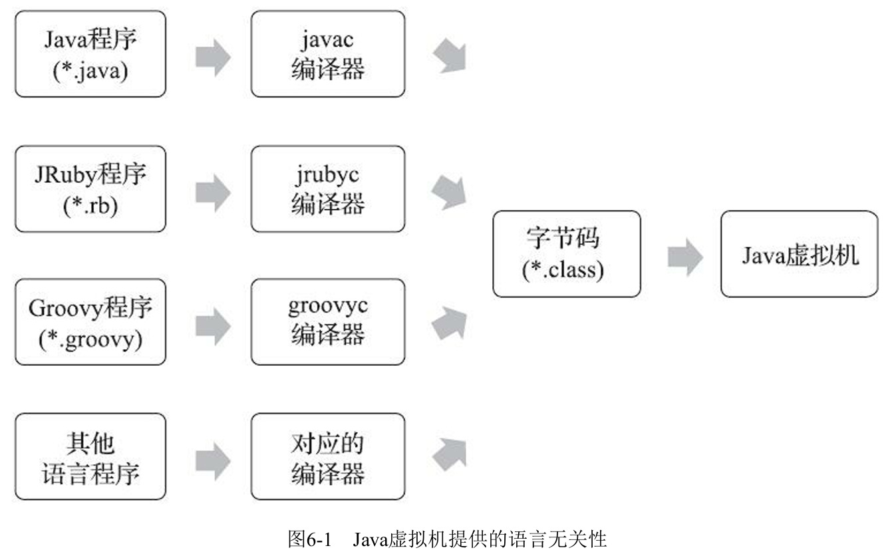

### Class 类文件的结构

Java 技术能够一直保持着非常良好的向后兼容性，Class 文件结构的稳定功不可没。

* 任何一个 Class 文件都对应着唯一的一个类或接口的定义信息（package-info.class、module-info.class 等完全描述性的文件除外）
  * 但类或接口也可以动态生成，直接送入类加载器中，因此 Class 文件实际上不需要以磁盘文件的形式存在。

* Class 文件是一组以 8 个字节为基础单位的二进制流，各个数据项目顺序紧凑地排列，没有空隙存在。
* Class 文件格式采用一种类似于 C 语言结构体的伪结构来存储数据，这种伪结构中只有两种数据类型：“无符号数”和“表”。
  * 无符号数属于基本的数据类型，以 u1、u2、u4、u8 来分别代表 1 个字节、2 个字节、4 个字节和 8 个 字节的无符号数。
  * 表是由多个无符号数或者其他表作为数据项构成的复合数据类型，表的命名习惯性地以“_info”结尾。整个 Class 文件本质上也可以视 作是一张表。

| 类型           | 名称                | 含义                        | 数量                    |
| -------------- | ------------------- | --------------------------- | ----------------------- |
| u4             | magic               | 模数                        | 1                       |
| u2             | minor_version       | 次版本号                    | 1                       |
| u2             | major_version       | 主版本号                    | 1                       |
| u2             | constant_pool_count | 常量池容量计数值（从 1 开始） | 1                       |
| cp_info        | constant_pool       | 常量池                      | constant_pool_count - 1 |
| u2             | access_flags        | 访问标志                    | 1                       |
| u2             | this_class          | 类索引                      | 1                       |
| u2             | super_class         | 父类索引                    | 1                       |
| u2             | interfaces_count    | 接口索引计数值              | 1                       |
| u2             | interfaces          | 接口索引集合                | interfaces_count        |
| u2             | fields_count        | 字段计数值                  | 1                       |
| field_info     | fields              | 字段表集合                  | fields_count            |
| u2             | methods_count       | 方法计数值                  | 1                       |
| method_info    | methods             | 方法表集合                  | methods_count           |
| u2             | attributes_count    | 属性计数值                  | 1                       |
| attribute_info | attributes          | 属性表集合                  | attributes_count        |

示例代码

```java
package org.fenixsoft.jvm.chapter6;

public class TestClass {
    private int m;

    public TestClass() {
    }

    public int inc() {
        return this.m + 1;
    }
}

```

字节码

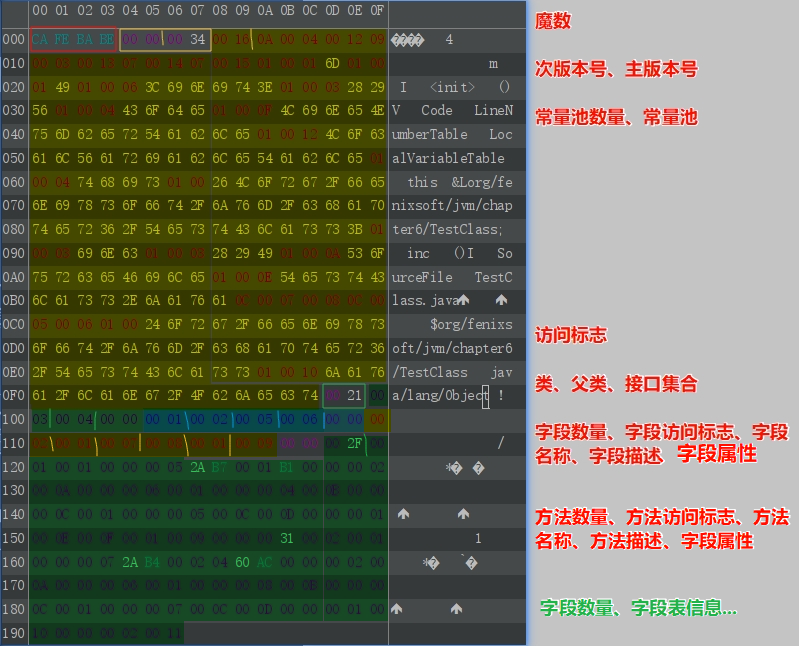

#### 魔数与 Class 文件的版本

每个 Class 文件的头 4 个字节被称为魔数（Magic Number），它的唯一作用是确定这个文件是否为 一个能被虚拟机接受的 Class 文件。Class 文件的魔数的值为 0xCAFEBABE（咖啡宝贝？）。

紧接着魔数的 4 个字节存储的是 Class 文件的版本号。第 5 和第 6 个字节是次版本号，第 7 和第 8 个字节是主版本号。Java 的版本号是从 45 开始的，高版本的 JDK 能 向下兼容以前版本的 Class 文件，因此 jdk1.1 支持版本号为 45.0～45.65535 的 Class 文件，JDK 1.2 则能支持 45.0～46.65535 的 Class 文件。

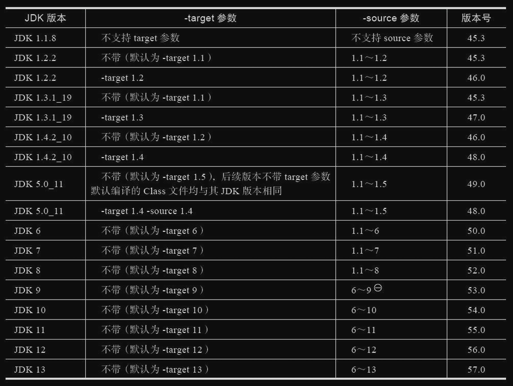

#### 常量池

常量池可以比喻为 Class 文件里的资源仓库。

常量池的入口需要放置一项 u2 类型的数据，代表常 量池容量计数值（constant_pool_count）。这个容量计数是从 1 而不是 0 开始。

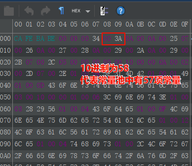

常量池主要存放两大类常量：

* 字面量（Literal）
  * 文本字符串
  * 被声明为 final 的常量值
* 符号引用（Symbolic References）
  * 被模块导出或者开放的包（Package）
  * 类和接口的全限定名（Fully Qualified Name）
  * 字段的名称和描述符（Descriptor）
  * 方法的名称和描述符
  * 方法句柄和方法类型（Method Handle、Method Type、Invoke Dynamic）
  * 动态调用点和动态常量（Dynamically-Computed Call Site、Dynamically-Computed Constant）

Java 代码编译时，没有 C 或 C++那样有“连接”这一步骤，而是在虚拟机作类加载时进行动态连接。因此在 Class 文件中没有各个方法、字段最终在内存中的布局信息。当虚拟机做类加载时，将会从常量池获得对应的符号引用，再在类创建时或运行时解析、翻译到具体的内存地址之中。

常量池中每一项常量都是一个表，共有十几种结构各不相同的表结构数据。但每一类常量表都有一个共同的特点，表结构起始的第一位是个 u1 类型的标志位（tag）用于代表当前常量属于哪种常量类型。标志值如下图第二列。

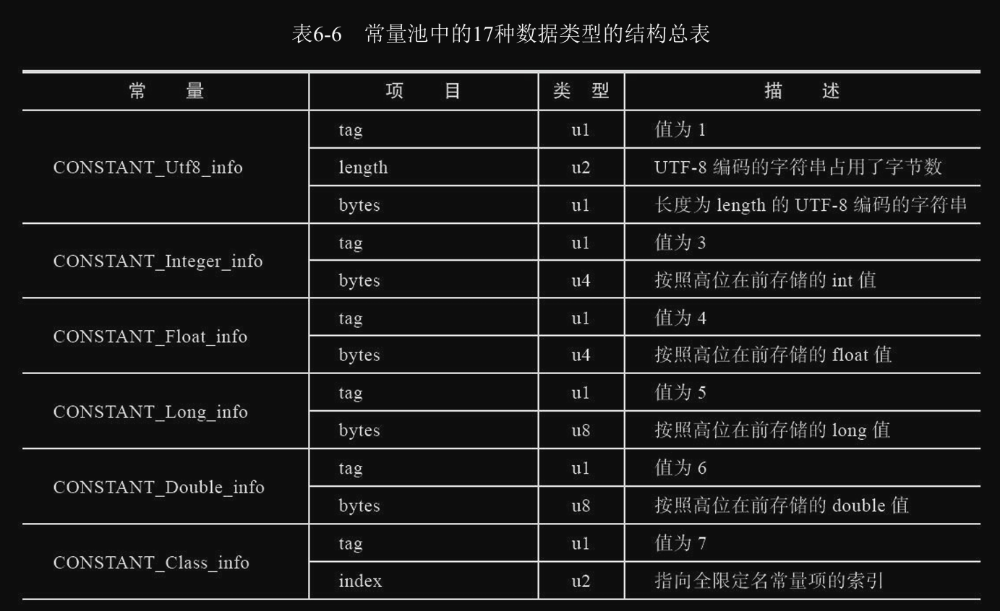

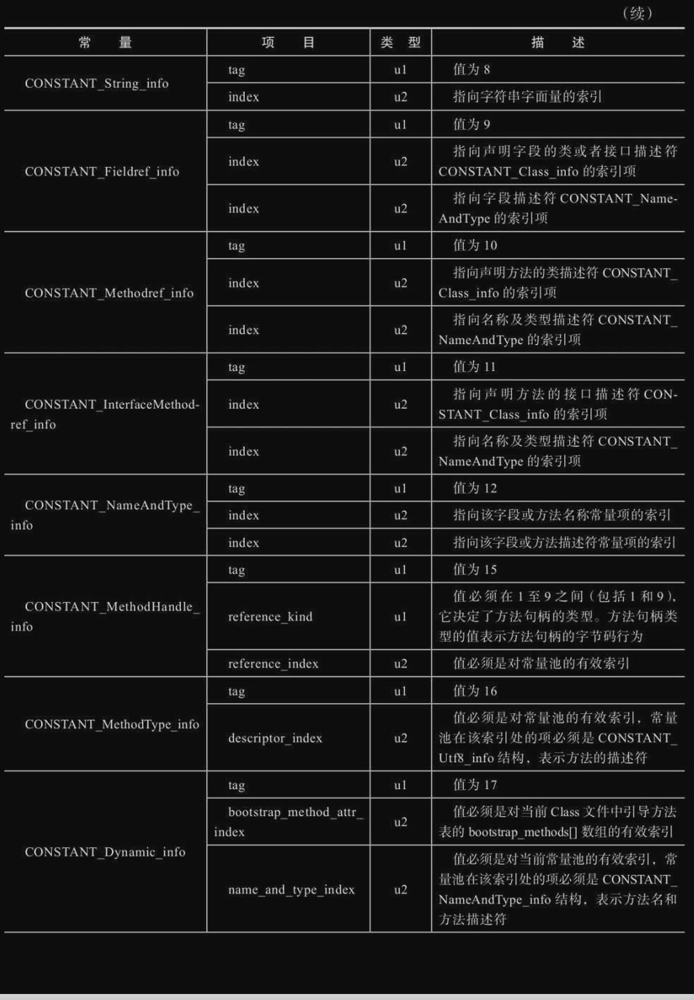

在 JDK 的 bin 目录中，Oracle 公司已经为我们 准备好一个专门用于分析 Class 文件字节码的工具：javap。

#### 访问标志

常量池结束之后，紧接着的 2 个字节代表访问标志（access_flags），用于识别一些类或者接口层次的访问信息。如下图 16 个标志位只用到了 9 个，没用到标志位或判断为否的标志位为 0。

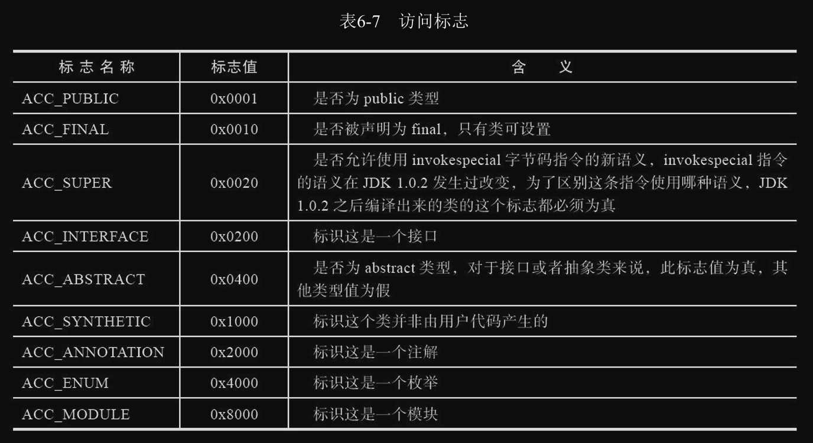

#### 类索引、父类索引与接口索引集合

类索引（this_class）和父类索引（super_class）都是一个 u2 类型的数据，而接口索引集合 （interfaces）是一组 u2 类型的数据的集合。如果该类没有实现任何接口，则该计数器值为 0。

#### 字段表集合

字段表（field_info）用于描述接口或者类中声明的变量，包括字段访问标志、字段名称、字段描述、字段属性。

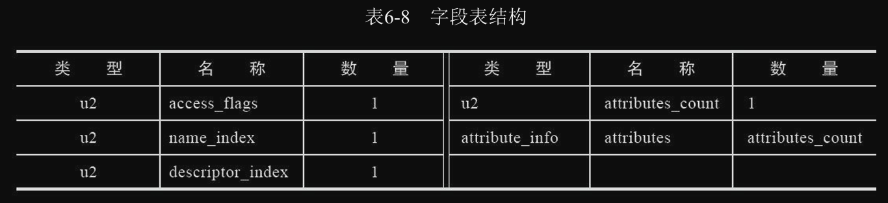

access_flags 字段的访问标志和类的访问标志差不多，16 个标志位仅用到了 9 个。

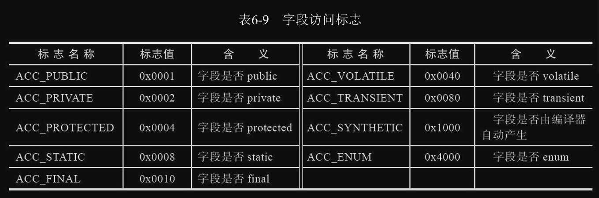

如果字段申明位 final 并赋值。字段的值存放在“Constant Value”的属性表里。

#### 方法表集合

Class 文件存储 格式中对方法的描述与对字段的描述采用了几乎完全一致的方式

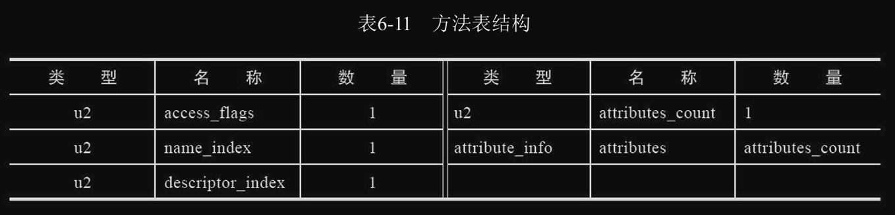

访问标志

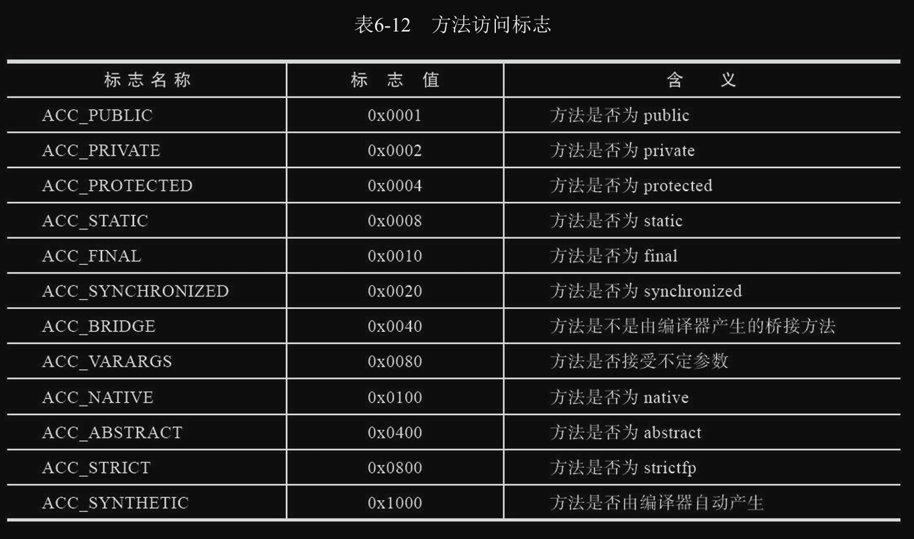

构造器方法也记录在方法集合中。

方法里面的代码存放在方法属性表集合中一个名为“Code”的属性里面。

如果父类方法在子类中没有被重写（Override），方法表集合中就不会出 现来自父类的方法信息

#### 属性表集合

Class 文件、字段表、方法表都可以 携带自己的属性表集合，以描述某些场景专有的信息。

与 Class 文件中其他的数据项目要求严格的顺序、长度和内容不同，属性表集合的限制稍微宽松一 些，不再要求各个属性表具有严格顺序。

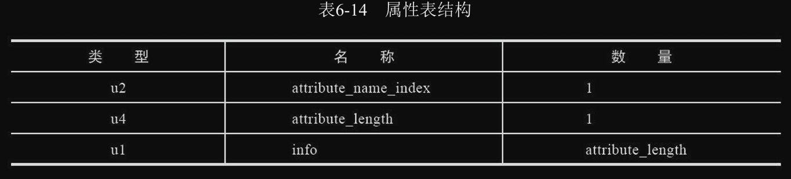

attribute_name_index：指向 CONSTANT_Utf8_info 型常量的索引。根据属性表不同，固定为常量“Code”、“Constant Value”、“Deprecated”等

attribute_length：属性值的长度

info：不同属性的属性值在 Class 文件中结构不同。

### 字节码指令简介

Java 虚拟机的指令由一个字节长度的、代表着某种特定操作含义的数字（称为操作码，Opcode）和零至多个代表此操作所需的参数（称为操作数，Operand）构成。

特点：

* 操作码的长度为一个字节（即 0～255），意味着指令集的操作码总数不能够超过 256 条。

* 编译后代码的操作数长度不对齐，导致解释执行字节码时将损失一些性能，但可以省略掉大量的填充和间隔符号，获得短小精干的编译代码。

Java 虚拟机解释器基本执行模型

```
do {
	自动计算PC寄存器的值加1;
	根据PC寄存器指示的位置，从字节码流中取出操作码;
 	if (字节码存在操作数) 从字节码流中取出操作数;
	执行操作码所定义的操作;
} while (字节码流长度 > 0);
```

#### 字节码与数据类型

有些字节码指令的操作码助记符有特殊的字符来表明专门为哪种数据类型服务，如 iload、fload 等。i 代表 int，l 代表 long，s 代表 short，b 代表 byte，c 代表 char，f 代表 float，d 代表 double，a 代表 reference。还有与数据类型无关的指令，如无条件跳转指令 goto。

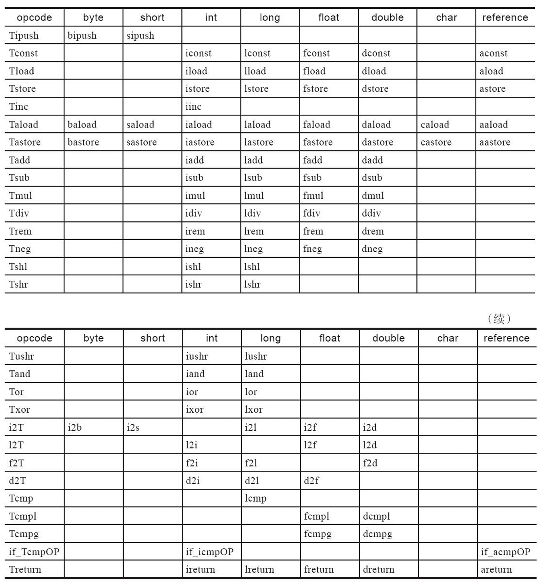

大部分指令都没有支持整数类型 byte、char 和 short，大多数对于 boolean、byte、short 和 char 类型数据的操作，实际上都是使用相应的对 int 类 型作为运算类型（Computational Type）来进行的。

#### 加载和存储指令

加载和存储指令用于将数据在栈帧中的局部变量表和操作数栈

* 将一个局部变量加载到操作栈：Tload
* 将一个数值从操作数栈存储到局部变量表：Tstore
* 将一个常量加载到操作数栈：Tipush、ldc、Tconst
* 扩充局部变量表的访问索引的指令：wide

#### 运算指令

算术指令用于对两个操作数栈上的值进行某种特定运算，并把结果重新存入到操作栈顶。

* 加法指令：Tadd
* 减法指令：Tsub
* 乘法指令：Tmul
* 除法指令：Tdiv
* 求余指令：Trem
* 取反指令：Tneg
* 位移指令：Tshl
* 按位或指令：Tor
* 按位与指令：Tand
* 按位异或指令：Txor
* 局部变量自增指令：Tinc
* 比较指令：Tcmp、Tcmpg、Tcmpl

数据运算可能会导致溢出。

有除法指令（Tdiv）以及求余指令（Trem）中当出现除数为零时会导致虚拟机抛出 ArithmeticException 异常。

处理浮点数运算时，不会抛出任何运行时异常。溢出时，使用有符号的无穷大表示。结果没有明确的数学定义，则使用 NaN（Not a Number）值来表示。

完全支持 IEEE754 浮点数标准。

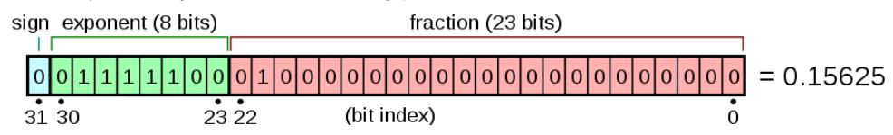

符号 s (sign)：负数 s = 1 ，正数 s = 0

$$
S = 0B = 0D
$$


阶码 E (exponent)：表示浮点数的幂次，是 2 的 E 次幂（E 可能为负，用来表示特别接近于 0 的数），因此要引入偏置，表示范围是 1~254 变为-126 到+127（全 0 和全 1 为特殊表示）。阶码作为 2 的幂对尾数进行位移，阶码指明了小数点在数据中的位置。真值 = 移码 - 偏置值（127）。

$$
E = 01111100B - 01111111B = 124D-127D = -3D
$$

尾数 M (fraction)：一个接近与 0 的二进制的小数。真值 = 1 + 0.尾数部分

$$
M = 1B + 0.01B = 1.01B = 1 + 2^-1 + 2^-2 ≈ 1.25D
$$


浮点数公式 ：

$$
V = (-1)^s × M × 2^E
$$

浮点数值：

$$
V = 1.25 × 2^-3 = 0.15625
$$

阶码为 00000000 时，尾数 M 的真值 = 0.尾数部分

阶码为 11111111 时，尾数 M 全为 0，表示无穷大；尾数 M 不全为 0，表示 NaN（Not a Number）

#### 类型转换指令

类型转换指令可以将两种不同的数值类型相互转换，这些转换操作一般用于实现用户代码中的显 式类型转换操作，或是 [字节码指令集中数据类型相关指令无法与数据类型 一一对应的问题](#6.4.1 字节码与数据类型)。

宽化类型转换无须显式的转换指令：i2l、i2f、i2d、l2f、l2d、f2d

窄化类型转换必须显式地使用转换指令：i2b、i2c、l2i、f2i、f2l、d2i、d2l、d2f

窄化类型转换可能会导致 转换结果产生不同的正负号、不同的数量级的情况，转换过程很可能会导致数值的精度丢失。

浮点值窄化转换整数类型：

* NaN -> int 类型或 long 类型的 0
* 无穷大 -> int 类型或 long 类型的最大或者最小正数
* 普通浮点数 -> 向零舍入模式取整，即所有小数部分的有效字节都会被丢弃掉

double 类型窄化转换 float 类型：

* NaN -> NaN
* 无穷大 -> 无穷大
* 普通浮点数绝对值太大 -> 无穷大
* 普通浮点数绝对值太小 -> 正负 0
* 普通浮点数 -> 最接近数舍入模式舍入

#### 对象创建与访问指令

虚拟机对类实例和数组的创建与操作使用了不同的字节码指令，而且数组和普通类的类型创建过程是不同的。

* 创建类实例的指令：new
* 创建数组的指令：newarray、anewarray、multianewarray
* 访问类字段（static 字段，或者称为类变量）和实例字段（非 static 字段，或者称为实例变量）的 指令：getfield、putfield、getstatic、putstatic
* 把一个数组元素加载到操作数栈的指令：baload、caload、saload、iaload、laload、faload、 daload、aaload
* 将一个操作数栈的值储存到数组元素中的指令：bastore、castore、sastore、iastore、fastore、 dastore、aastore
* 取数组长度的指令：arraylength
* 检查类实例类型的指令：instanceof、checkcast

#### 操作数栈管理指令

* 将操作数栈的栈顶一个或两个元素出栈：pop、pop2
* 复制栈顶一个或两个数值并将复制值或双份的复制值重新压入栈顶：dup、dup2、dup_x1、 dup2_x1、dup_x2、dup2_x2
* 将栈最顶端的两个数值互换：swap

#### 控制转移指令

控制转移指令通过有条件或无条件地修改 PC 寄存 器的值，让 Java 虚拟机有条件或无条件地从指定位置指令的下一条指令继续执行程序。

* 条件分支：ifeq、iflt、ifle、ifne、ifgt、ifge、ifnull、ifnonnull、if_icmpeq、if_icmpne、if_icmplt、 if_icmpgt、if_icmple、if_icmpge、if_acmpeq 和 if_acmpne
* 复合条件分支：tableswitch、lookupswitch
* 无条件分支：goto、goto_w、jsr、jsr_w、ret

#### 方法调用和返回指令

* invokevirtual 指令：用于调用对象的实例方法，根据对象的实际类型进行分派（虚方法分派）， 这也是 Java 语言中最常见的方法分派方式。
* invokeinterface 指令：用于调用接口方法，它会在运行时搜索一个实现了这个接口方法的对象，找出适合的方法进行调用。
* invokespecial 指令：用于调用一些需要特殊处理的实例方法，包括实例初始化方法、私有方法和父类方法。
* invokestatic 指令：用于调用类静态方法（static 方法）。
* invokedynamic 指令：用于在运行时动态解析出调用点限定符所引用的方法。并执行该方法。前面四条调用指令的分派逻辑都固化在 Java 虚拟机内部，用户无法改变，而 invokedynamic 指令的分派逻辑 是由用户所设定的引导方法决定的。
* 方法返回指令：Treturn

#### 异常处理指令

在 Java 程序中显式抛出异常的操作（throw 语句）都由 athrow 指令来实现

处理异常（catch 语句）不是由字节码指令来实现的，而是采用异常表来完成。

#### 同步指令

**synchronized 修饰代码块**

`synchronized` 语句块需要两条指令支持

* `monitorenter`：以栈定元素作为锁，开始同步
* `monitorexit`：退出同步

```java
// 同步代码块
void onlyMe(Foo f) {
    synchronized(f) {
        doSomething();
    }
 }
```

生成字节码序列

```java
Method void onlyMe(Foo)
 0 aload_1                         // 将对象f入栈
1 dup                        　　 // 复制栈顶元素（即f的引用）
2 astore_2                        // 将栈顶元素存储到局部变量表变量槽 2中
3 monitorenter                    // 以栈定元素（即f）作为锁，开始同步
4 aload_0                         // 将局部变量槽 0（即this指针）的元素入栈
5 invokevirtual #5                // 调用doSomething()方法
8 aload_2                         // 将局部变量Slow 2的元素（即f）入栈
9 monitorexit                     // 退出同步
10 goto 18                        // 方法正常结束，跳转到18返回
13 astore_3                       // 从这步开始是异常路径，见下面异常表的Taget 13
 14 aload_2                        // 将局部变量Slow 2的元素（即f）入栈
15 monitorexit                    // 退出同步
16 aload_3                        // 将局部变量Slow 3的元素（即异常对象）入栈
17 athrow                         // 把异常对象重新抛出给onlyMe()方法的调用者
18 return                         // 方法正常返回
Exception table:
 FromTo Target Type
   4    10     13 any
  13    16     13 any
```

`synchronized` 代码块同步在需要同步的代码块开始的位置插入 `monitorenter` 指令，在同步结束的位置或者异常出现的位置插入 `monitorexit` 指令；JVM 要保证 `monitorentry` 和 `monitorexit` 都是成对出现的，任何对象都有一个 monitor 与之对应，即使是异常完成时依然可以正确配对执行。

**synchronized 修饰方法**

`synchronized` 方法同步不再是通过插入 `monitorentry` 和 `monitorexit` 指令实现，而是由方法调用指令来读取运行时常量池中的 `ACC_SYNCHRONIZED` 标志**隐式**实现的，如果方法表结构（method_info Structure）中的 `ACC_SYNCHRONIZED` 标志被设置，那么线程在执行方法前会先去获取对象的 monitor 对象，如果获取成功则执行方法代码，执行完毕后释放 monitor 对象，如果 monitor 对象已经被其它线程获取，那么当前线程被阻塞。

```java
public class SyncMethod {
   public int i;
   public synchronized void syncTask(){
           i++;
   }
}
```

```java
public synchronized void syncTask();
    descriptor: ()V
    //方法标识ACC_PUBLIC代表public修饰，ACC_SYNCHRONIZED指明该方法为同步方法
    flags: ACC_PUBLIC, ACC_SYNCHRONIZED
    Code:
      stack=3, locals=1, args_size=1
         0: aload_0
         1: dup
         2: getfield      #2                  // Field i:I
         5: iconst_1
         6: iadd
         7: putfield      #2                  // Field i:I
        10: return
      LineNumberTable:
        line 12: 0
        line 13: 10
}
```

### 公有设计，私有实现

《Java 虚拟机规范》描绘了 Java 虚拟机应有的共同程序存储格式：Class 文件格式以及字节码指令集。

虚拟机在后台如何处理 Class 文件是设计者的事情

### Class 文件结构的发展

Class 文件结构一直处于一个相对比较稳定的状态，Class 文件的主体结构、 字节码指令的语义和数量几乎没有出现过变动，所有对 Class 文件格式的改进，都集中在访问标志、 属性表这些设计上原本就是可扩展的数据结构中添加新内容。

### 本章小结

Class 文件是 Java 虚拟机执行引擎的数据入口，也是 Java 技术体系的基础支柱之一。了解 Class 文件 的结构对后面进一步了解虚拟机执行引擎有很重要的意义。

## 虚拟机类加载机制

### 概述

Java 虚拟机把描述类的数据从 Class 文件加载到内存，并对数据进行校验、转换解析和初始化，最终形成可以被虚拟机直接使用的 Java 类型，这个过程被称作虚拟机的类加载机制。Java 语言的编译时不需要进行连接，类型的加载、连接和初始化过程都是在程序运行期间完成 的。

劣势：提前编译会面临额外的困难，稍微增加一些类加载时的性能开销

好处：运行期动态加载和动态连接为 Java 应用提供了极高的扩展性和灵活性

### 类加载的时机

一个类型的生命周期的七个阶段：

1. 加载 （Loading）
2. 验证（Verification）"连接" 阶段
3. 准备（Preparation）"连接" 阶段
4. 解析（Resolution）"连接" 阶段
5. 初始化 （Initialization）
6. 使用（Using）
7. 卸载（Unloading）

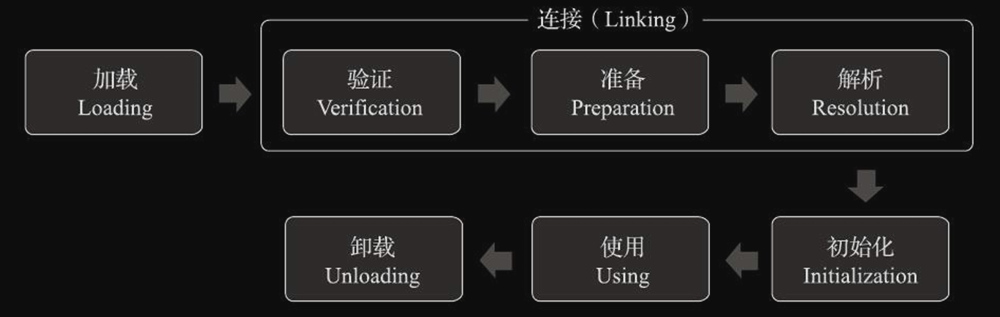

加载、验证、准备、初始化和卸载这五个阶段的顺序是确定的。

解析阶段某些情况下可以在初始化阶段之后再开始， 这是为了支持 Java 语言的运行时绑定特性（也称为动态绑定或晚期绑定）。

加载、验证、准备阶段虚拟机并没有进行强制约束其开始的情况。

类的初始化有且只有六种情况会激活，这六种行为被称为对一个类型进行主动引用：

1. 当虚拟机启动时，用户需要指定一个要执行的主类，虚拟机会先初始化这个主类。
2. 遇到 new、getstatic、putstatic 或 invokestatic 这四条字节码指令
   * 使用 new 关键字实例化对象
   * 读取或设置在该类型里面定义（不能是其父类定义的）的非 final 静态字段（final 的静态字段会放入常量池）
   * 调用该类型定义或重写的静态方法
3. 类的初始化前，需要先触发其父类的初始化
4. 当一个接口中定义了 JDK 8 新加入的默认方法，接口的实现类的初始化前，需要先触发该接口的初始化
5. 使用 Java.lang.reflect 包的方法对类型进行反射调用
6. 用 JDK 7 新加入的动态语言支持，一个 Java.lang.invoke.MethodHandle 实例最后的解 析结果为 REF_getStatic、REF_putStatic、REF_invokeStatic、REF_newInvokeSpecial 四种类型的方法句 柄，并且这个方法句柄对应的类没有进行过初始化，则需要先触发其初始化。

除此之外，所有引用类型的方式都不会触发初始化，称为被动引用。

### 类加载的过程

#### 加载

加载阶段 Java 虚拟机完成的三个步骤：

1. 通过一个类的全限定名来获取定义此类的二进制字节流
   * 不局限于从 xxx.class 的磁盘文件中获取
   * 可以使用内置的 C 语言开发的引导类加载器（Bootstrap Class Loader）或自己定义的类加载器（重写一个类加载器的 findClass()或 loadClass()方法）获取字节流
   * 数组类本身不通过类加载器创建，它是由 Java 虚拟机直接在内存中动态构造出来的。
2. 将这个字节流所代表的静态存储结构转化为方法区的运行时数据结构
3. 在 Java 堆内存中生成一个代表这个类的 Java.lang.Class 对象，作为方法区这个类的各种数据的访问入口。

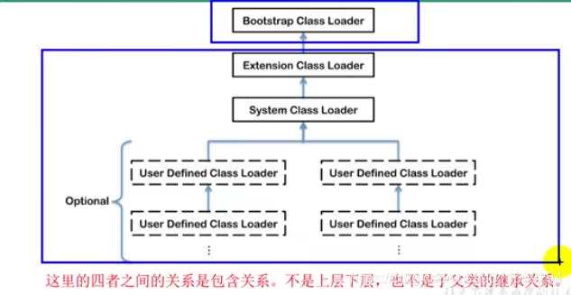

#### 验证

验证是连接阶段的第一步，这一阶段的目的是确保 Class 文件的字节流中包含的信息符合《Java 虚 拟机规范》的全部约束要求，保证这些信息被当作代码运行后不会危害虚拟机自身的安全。

1. 文件格式验证（Class 文件格式的规范）
   * 开头魔数是否 0xCAFEBABE
   * 主次版本当前 Java 虚拟机是否支持
   * 常量是否支持
   * 索引值指向的常量是否存在
   * CONSTANT_Utf8_info 型的常量是否符合 UTF-8 编码
   * 是否有被删除的或附加的其他信息...
2. 元数据验证（字节码信息的语义分析）
   * 是否有父类（除 Java.lang.Object 外）
   * 是否继承了不允许被继承的被 final 修饰的类
   * 非抽象类是否实现了其父类或接口之中要求实现的所有方法
   * 类中的字段、方法是否与父类产生矛盾（覆盖了 final 字段、重载不规范）
3. 字节码验证（数据流分析和控制流分析，确定程序语义是合法的、符合逻辑的）
4. 符号引用验证（对类自身以外的引用进行匹配性校验）

如果程序运行的全部代码（包括自己编写的、第三方包中的、从外部加载的、动态生成的等所有代码）都 已经被反复使用和验证过，在生产环境的实施阶段就可以考虑使用-Xverify：none 参数来关闭大部分的 类验证措施，以缩短虚拟机类加载的时间。

#### 准备

准备阶段是正式为类中定义的变量（即静态变量，被 static 修饰的变量）分配内存并设置类变量初始值的阶段。

如果是非 final 修饰的类变量，只是分配内存不代表执行了初始化，准备阶段类变量的初始值“通常情况”下是数据类型的零值。

如果是 final 修饰的类变量，类字段的字段属性表中存在 ConstantValue 属性，准备阶段变量值就会被初始化为 ConstantValue 属性所指定的初始值。

#### 解析

解析阶段是 Java 虚拟机将常量池内的符号引用替换为直接引用的过程。

符号引用：与虚拟机实现的内存布局无关，符号引用以一组符号来描述所引用的目标，符号可以是任何 形式的字面量。

直接引用：和虚拟机实现的内存布局直接相关，它可以是直接指向目标的指针、相对偏移量或者是一个能间接定位到目标的句柄。

解析动作主要针对类或接口、字段、类方法、接口方法、方法类型、方法句柄和调用点限定符这 7 类符号引用进行，但未必所有方法都能在这个阶段完成解析，如虚方法是在真正使用的时候才进行 [解析](#8.3.2 分派)。

#### 初始化

类的初始化阶段是类加载过程的最后一个步骤。初始化阶段就是执行类构造器 `<clinit>()` 方法的过程。

`<clinit>()` 并不是程序员在 Java 代码中直接编写 的方法，它是 Javac 编译器的自动生成物，`<clinit>()` 方法是由编译器自动收集类中的所有类变量的赋值动作和静态语句块（static{}块）中的 语句合并产生的。

如果一个类中没有静态语句块，也没有对变量的赋值操作，那么编译器可以不为这个类生成 `<clinit>()` 方法。

### 类加载器

Java 虚拟机设计团队有意把类加载阶段中的“通过一个类的全限定名来获取描述该类的二进制字节流”这个动作放到 Java 虚拟机外部去实现，以便让应用程序自己决定如何去获取所需的类。实现“加载”这个动作的代码被称为“类加载器”（Class Loader）。

类加载器最初是为了满足 Java Applet 的需求而设计出来的，在今天用在浏览器上的 Java Applet 技术基本上已经被淘汰。

#### 类与类加载器

类和加载它的类加载器一起共同确立其在 Java 虚拟机中的唯一性。

这两个类来源于同一个 Class 文件，只要加载它们的类加载器不同，那这两个类就必定不相等。

#### 双亲委派模型

Java 虚拟机只存在两种不同的类加载器。

* 启动类加载器（Bootstrap ClassLoader）：使用 C++语言实现，是虚拟机自身的一部分。负责加载 `<JAVA_HOME>\lib` 目录和-Xbootclasspath 参数所指定的路径中的类库

* 其他所有类加载器：由 Java 语言实现，独立存在于虚拟机外部，全都继承自抽象类 Java.lang.ClassLoader。

  * 扩展类加载器（Extension Class Loader）：负责加载 `<JAVA_HOME>\lib\ext` 目录和 Java.ext.dirs 系统变量所 指定的路径中的类库

  * 应用程序类加载器（Application Class Loader）：负责加载用户类路径 （ClassPath）中的类库。一般情况就是默认的类加载器，称为“系统类加载器”。
* 自定义类加载器（User Class Loader）：

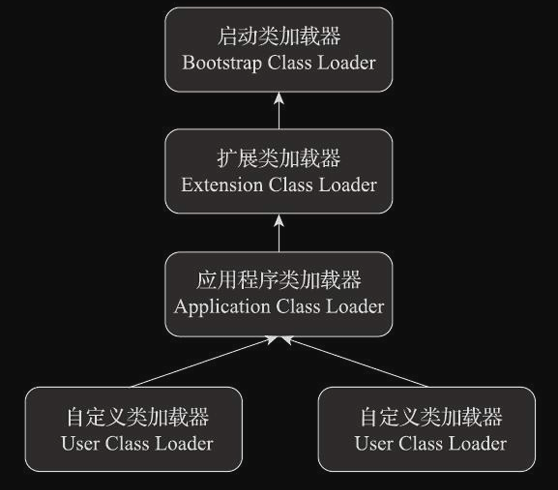

定义：双亲委派机制指除了顶层的启动类加载器外，其余的类加载器都应有自己的父类加载器。这里类加载器之间的父子关系一般不是以继承（Inheritance）的关系来实现的，而是通常使用组合（Composition）关系来复用父加载器的代码。这个机制不具有强制性约束力，只是类加载器实现的推荐的最佳实践。

工作过程：类加载器收到了类加载的请求，它首先不会自己去尝试加载这个类，而是把这个请求委派给父类加载器去完成，因此所有的加载请求最终都应该传送到最顶层的启动类加载器中，只有当父加载器反馈自己无法完成这个加载请求时，子加载器才会尝试自己去完成加载。

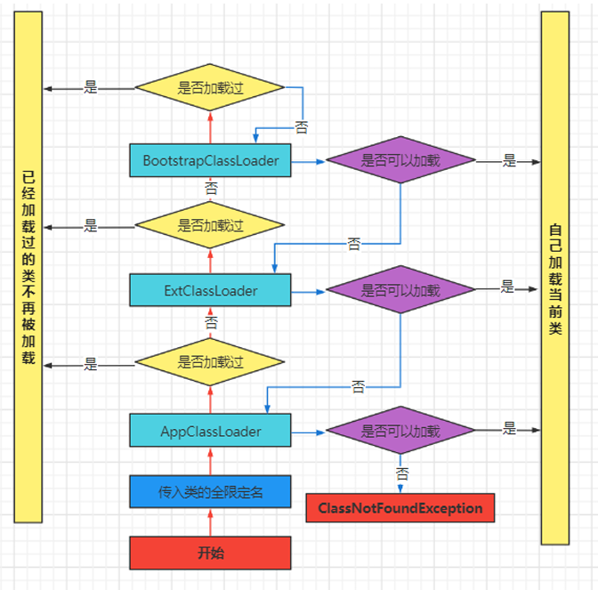

好处：无论哪一个类加载器要加载这个类，最终都是委派给处于模型最顶端的启动类加载器进行加载，因此 Object 类在程序的各种类加载器环境中都能够保证是同一个类。

#### 破坏双亲委派模型

### Java 模块化系统

JDK 9 中引入的 Java 模块化系统（Java Platform Module System，JPMS）是对 Java 技术的一次重 要升级，为了能够实现模块化的关键目标——可配置的封装隔离机制。

#### 模块的兼容性

#### 模块化下的类加载器

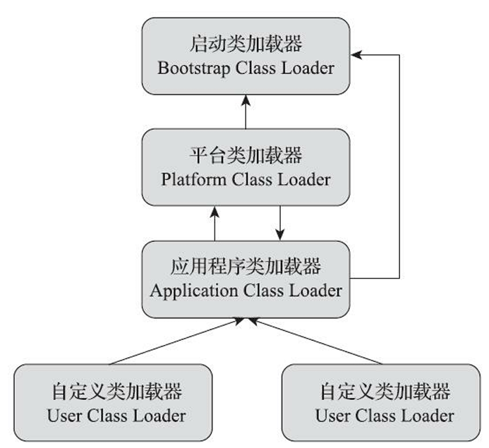

在 Java 模块化系统明确规定了三个类加载器负责各自加载的模块

## 虚拟机字节码执行引擎

### 概述

执行引擎是 Java 虚拟机核心的组成部分之一。

在不同的虚拟机实现中，执行引擎在执行字节码的 时候，通常会有解释执行（通过解释器执行）和编译执行（通过即时编译器产生本地代码执行）两种 选择，也可能两者兼备

#### 运行时栈帧结构

Java 虚拟机以方法作为最基本的执行单元，“栈帧”（Stack Frame）是虚拟机运行时数据区中的 [虚拟机栈](#2.2.2 虚拟机栈) 元素，用于支持虚拟机进行方法调用和方法执行背后的数据结构。

每 一个方法从调用开始至执行结束的过程，都对应着一个栈帧在虚拟机栈里面从入栈到出栈的过程。

每一个栈帧都包括了局部变量表、操作数栈、动态连接、方法返回地址和一些额外的附加信息。这些信息在 Class 文件格式的方法表中大多都能找到静态对照物。

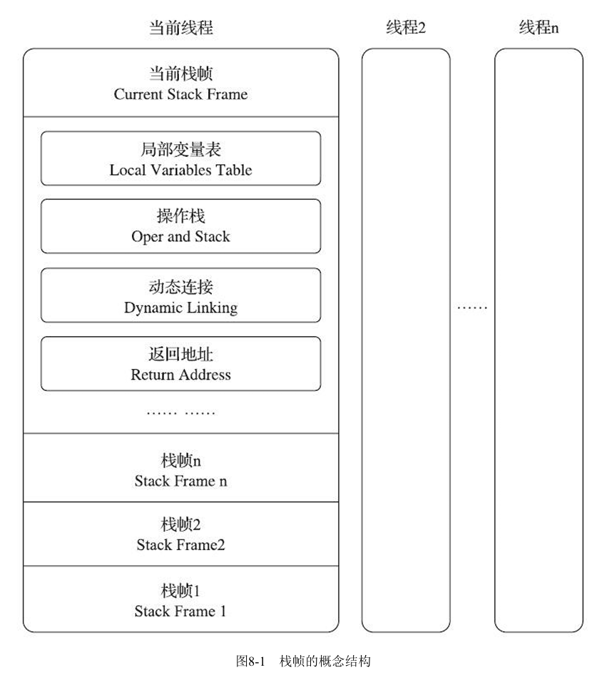

#### 局部变量表

局部变量表（Local Variables Table）是一组变量值的存储空间，用于存放方法参数和方法内部定义 的局部变量。

局部变量表的容量以变量槽（Variable Slot）为最小单位。虚拟机规范每个变量槽都应该能存放一个 boolean、 byte、char、short、int、float、reference 或 returnAddress 类型的数据。

每个变量槽都能存放 Java 中占用不超过 32 位存储空间的数据类型，如 boolean、byte、char、short、int、 float、reference 和 returnAddress [^returnAddress]。对于 64 位的数据类型 long 和 double，Java 虚拟机会以高位对齐的方式为其分配两个连续的变量槽空间。

Java 虚拟机通过索引定位（从 0 开始至局部变量表最大数量）的方式使用局部变量表。

局部变量表的变量顺序：方法所属对象实例的引用（如果有）——> 方法内部定义的参数——> 作用域分配的变量

变量槽的重用：当前字节码 PC 计数器的值已经超出了某个变量的作用域，该变量所在的变量槽就可以被其他新变量所重用（可重用不代表其数据已消失）。因此某些引用类型的变量可能离开了作用域，垃圾收集可能依然无法被回收其引用的对象，必须等到新的变量对其重用或者将变量显式地设置为 null 才能被回收。

局部变量和类变量的初始值：类的字段变量在准备阶段赋予系统初始值，在初始化阶段赋予程序员定义的初始值，因此初始化阶段可以不赋值。而局部变量定义了而不赋值完全不能使用。

[^returnAddress]: returnAddress类型目前已经很少见了，它是为字节 码指令jsr、jsr_w和ret服务的，指向了一条字节码指令的地址，曾经使用这几条指令来实现异常处理时的跳转，如今异常处理的跳转改为采用异常表实现。

#### 操作数栈

操作数栈（Operand Stack）也常被称为操作栈，它是一个后入先出（Last In First Out，LIFO） 栈。

编译器的数据流分析工作保证 Code 属性的 max_stacks 数据项就是操作数栈的最大深度。32 位数据类型所占的栈容量为 1，64 位数据类型所占的栈容量为 2。

方法的执行过程中，会有各种字节码指令往操作数栈中写入和提取内容，也就是出栈和入栈操作。

大多虚拟机的实现里都会进行一些优化处理，令两个栈帧出现一部分重叠。让下面栈帧的部分操作数 栈与上面栈帧的部分局部变量表重叠在一起。方法调用时就可以直接共用一部分数据，无须进行额外的参数复制传递，也节约了空间。

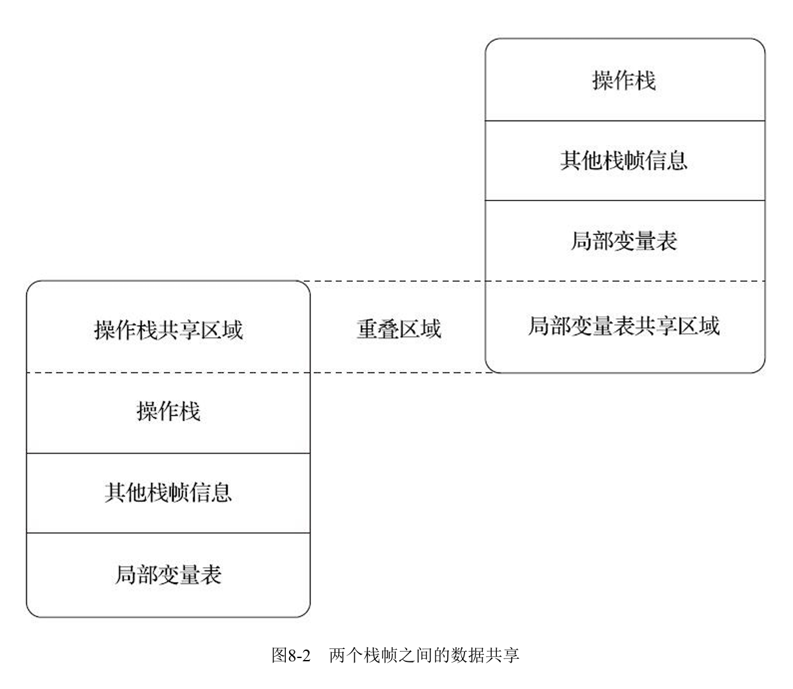

Java 虚拟机的解释执行引擎被称为“基于栈的执行引擎”，其中“栈”就是指操作数栈。

#### 动态连接

每个栈帧都包含一个指向运行时常量池中该栈帧所属方法的引用，持有这个引用是为了支持方法调用过程中的动态连接（Dynamic Linking）。

Class 文件的常量池中存有大量的符号引用，而字节码中的方法调用指令就以常量池里指向方法的符号引用作为参数。

这些符号引用转化成直接引用的两个方式：

* [静态解析](#8.3.1 解析)：类加载阶段或者第一次使用的时候就被转化为直接引用

* 动态连接：每一次运行期间都转化为直接引用

#### 方法返回地址

当一个方法开始执行后，只有两种方式退出这个方法。

* 执行引擎遇到任意一个方法返回的字节码指令，将返回值（或无）传递给上层的方法调用者，称为“正常调用完成”（Normal Method Invocation Completion）
* 方法执行的过程中遇到了异常（不论是虚拟机内部异常还是用 athrow 字节码指令产生的异常），且无匹配的异常处理器就会导致方法退出，称为“异常调用完成（Abrupt Method Invocation Completion）”。

方法退出之后，方法返回地址是用来帮助恢复它的上层主调方法 [^主调方法] 的执行状态。

[^主调方法]: 调用当前方法的方法称为调用者或者主调方法

#### 附加信息

可能为了增加一些规范里没有描述的信息，附加信息是否存在完全取决于具体的虚拟机实现。

一 般会把动态连接、方法返回地址与其他附加信息全部归为一类，称为栈帧信息。

### 方法调用

方法调用并不等同于方法中的代码被执行，方法调用阶段唯一的任务就是确定被调用方法的版本 （即调用哪一个方法）。

由于编译过程中，没有传统的“连接”步骤，存放在 Class 文件中有关方法调用的都是符号引用，而不是实际运行时内存布局中的入口地址。因此 Java 方法的调用比较复杂，某些方法调用需要在类加载期间进行解析，某些甚至到运行期间才能确定目标方法的直接引用。

#### 解析

类加载的 [解析阶段](#7.3.4 解析)，会将方法的一部分符号引用转化为直接引用，这种解析能够成立的前提是合方法在程序真正运行之前就有一个可确定的调用版本，并且这个方法的调用版本在运行期是不可改变的，即“编译期可知，运行期不可变”。这类方法的调用被称为解析（Resolution）。

**静态方法** 与类型直接关联，**私有方法** 在外部不可访问，决定了它们都不可能重写出其他版本，因此适合在类加载阶段进行解析。

[方法调用的指令](#6.4.8 方法调用和返回指令) 中，invokestatic 和 invokespecial 指令调用的方法，**静态方法**、**私有方法**、**实例构造器**、**父类方法** 4 种，再加上 **被 final 修饰的方法**（虽然由于历史设计的原因，final 方法是使用 invokevirtual 指令来调用的，但是它也无法被覆盖），这 5 种方法称为非虚方法，类加载的时候就可以把符号引用解析为该方法的直接引用。

```java
/**
 * 方法静态解析演示
*
 * @author zzm
 */
 public class StaticResolution {
 public static void sayHello() {
 System.out.println("hello world");
    }
    public static void main(String[] args) {
        StaticResolution.sayHello();
    }
 }
```

```java
javap -verbose StaticResolution
 public static void main(java.lang.String[]);
    Code:
        Stack=0, Locals=1, Args_size=1
        0:   invokestatic    #31; //Method sayHello:()V
        3:   return
    LineNumberTable:
        line 15: 0
        line 16: 3
```

例中，通过 invokestatic 命令来调用 sayHello()方 法，而且其调用的方法版本已经在编译时就明确以常量池项（31 号常量池项）的形式固化在字节码指令的参数之中。

#### 分派

另一种主要的方法调用形式：分派（Dispatch）调用则要复杂许多，它可能是静态的也可能是动态的，按照分派依据的宗量数可分为单分派和多分派。

Java 多态性在分派调用过程有很多基本体现。

* 静态分派

“分派”一词本身具有动态性，意味“分派”的方法无法像“解析”的方法其版本是固定的，通常需要明确具体调用的版本。

“静态”一词表示，虚拟机实际上已经通过某种判定方式将方法版本在编译期选择下来。

假如一个方法有多个重载版本

```java
package org.fenixsoft.polymorphic;
 /**
 * 方法静态分派演示
 * @author zzm
 */
 public class StaticDispatch {
    static abstract class Human {
    }
    static class Man extends Human {
    }
    static class Woman extends Human {
    }
    public void sayHello(Human guy) {
        System.out.println("hello,guy!");
    }
    public void sayHello(Man guy) {
        System.out.println("hello,gentleman!");
    }
    public void sayHello(Woman guy) {
        System.out.println("hello,lady!");
    }
    public static void main(String[] args) {
        Human man = new Man();
        Human woman = new Woman();
        StaticDispatch sr = new StaticDispatch();
        sr.sayHello(man);
        sr.sayHello(woman);
    }
}
```

运行结果：最终执行的 sayHello 方法都是以 Human 作为参数。

```
hello,guy!
hello,guy!
```

在编译阶段，Javac 编译器就根据参数的静态类型，而非对象的运行时可变的实际类型，决定了会使用哪个重载版本。

由于编译期就选中了 sayHello(Human)为调用目标，这个方法的符号引用会写入到 invokevirtual 指令的参数中，因此静态分派发生在编译阶段，更应该归到“解析”而不是“分派”之中。

* 动态分派

动态分派与 Java 语言多态性的另外 一个重要体现——重写（Override）有着很密切的关联

```java
package org.fenixsoft.polymorphic;
 /**
 * 方法动态分派演示
 * @author zzm
 */
 public class DynamicDispatch {
    static abstract class Human {
        protected abstract void sayHello();
    }
    static class Man extends Human {
        @Override
        protected void sayHello() {
            System.out.println("man say hello");
        }
    }
    static class Woman extends Human {
        @Override
        protected void sayHello() {
            System.out.println("woman say hello");
        }
    }
    public static void main(String[] args) {
        Human man = new Man();
        Human woman = new Woman();
        man.sayHello();
        woman.sayHello();
        man = new Woman();
        man.sayHello();
    }
}
```

运行结果：

```
man say hello
woman say hello
woman say hello
```

invokevirtual 指令的运行时解析过程 [4] 大致分为以下几步：

1. 找到操作数栈顶的第一个元素所指向的对象的实际类型，记作 C
2. 若在 C 中找到与常量中的描述符和简单名称都相符的方法，则进行访问权限校验，通过则返回这个方法的直接引用，不通过则返回 Java.lang.IllegalAccessError 异常。
3. 若 C 中没找到，则从下往上依次对 C 的各个父类进行第二步的搜索和验证过程。
4. 若始终没找到，则抛出 Java.lang.AbstractMethodError 异常。

invokevirtual 指令并不是把常量池中方法的符号引用解析到直接引用上就结束了，还会根据方法接收者的实际类型来选择方法版本，这个过程就是 Java 语言中方法重写的本质。多态性的根源在于虚方法调用指令 invokevirtual 的执行逻辑。

由此看出，这种多态性对方法是有效，而字段却不可能是虚的。当子类声明了与父类同名的字段时，内存中两个字段都会存在，访问这个两个同名字段时会根据对象的静态类型去选择具体的字段值。

```java
package org.fenixsoft.polymorphic;
 /**
 * 字段不参与多态
 * @author zzm
 */
 public class FieldHasNoPolymorphic {
    static class Father {
        public int money = 1;
        public Father() {
            money = 2;
            showMeTheMoney();
        }
        public void showMeTheMoney() {
            System.out.println("I am Father, i have $" + money);
        }
    }
    static class Son extends Father {
        public int money = 3;
        public Son() {
            money = 4;
            showMeTheMoney();
        }
        public void showMeTheMoney() {
            System.out.println("I am Son,  i have $" + money);
        }
    }
    public static void main(String[] args) {
        Father gay = new Son();
        System.out.println("This gay has $" + gay.money);
    }
 }
```

输出结果：

```
I am Son, i have $0
I am Son, i have $4
This gay has $2
```

* 单分派与多分派

方法的接收者与方法的参数统称为方法的宗量

Java 语言的静态分派属于多分派类型。既要考虑方法的接受者的静态类型，又要考虑方法参数的类型，继而确定和产生方法调用指令和参数。

Java 语言的动态分派属于单分派类型，只考虑方法的接受者的实际类型，invokevirtual 指令需要选择方法版本

* 动态分派的实现

动态分派是执行非常频繁的动作，而且动态分派的方法版本选择过程需要运行时在接收者类型的方法元数据中搜索合适的目标方法

常见的优化手段是为类型在方法区中建立一个虚方法表（Virtual Method Table）和接口方法表（Interface Method Table），分别对应 invokevirtual 指令和 invokeinterface 指令。

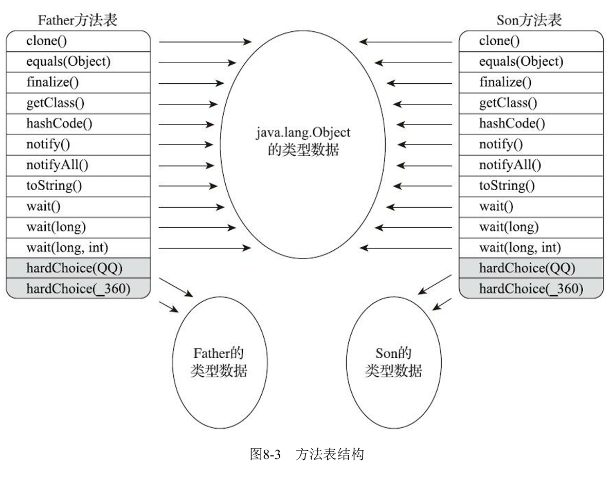

如果子类中重写了父类的方法，子类虚方法表中的地址会被替换为指向子类实现版本的入口地址，否则和父类虚方法表对应地址一致，指向父类实现版本的入口地址（如 clone()方法指向 Object 类型）。

虚方法表一般在类加载的连接阶段进行初始化，准备了类的变量初始值后，虚拟机会把 该类的虚方法表也一同初始化完毕

### 动态类型语言支持

为了实现动态类型语言（Dynamically Typed Language），JDK 7 的发布了字节码首位新成员——invokedynamic 指令。

#### 动态类型语言

静态类型语言：编译期就进行类型检查过程的语言，譬如 C++和 Java 等

动态类型语言：类型检查的主体过程是在运行期而不是编译期进行的，譬如 APL、Clojure、Erlang、Groovy、 JavaScript 等

什么是“连接时、运行时”

一门语言的哪一种检查行为要在运行期进行，哪一种检查要在编译期进行并没有什么必然的因果逻辑关系，关键是在语言规范中人为设立的约定。例如，C 语言在编译期时就会发现数组的索引不能为负数，而 Java 在运行到那一行时才会抛出 NegativeArraySizeException 运行时异常。

什么是“类型检查”

```java
obj.println("hello world");
```

假设 obj 的静态类型为 Java.io.PrintStream，哪怕 obj 的实际类型确实包含有 println(String)方法相同签名方法，obj 的实际类型也必须为 Java.io.PrintStream 的子类（实现该接口的类），否则代码无法运行，因为类型检查不合法。

而在 ECMAScript（JavaScript）中情况则不一样，只要这种类型的方法定义中确实包含有 println(String)方法，能够找到相同签名的方 法，调用便可成功。

产生这个差异的根本原因就是，Java 虚拟机在编译期间却已将 println(String)方法完整的符号引用（一项 CONSTANT_InterfaceMethodref_info 常量）生成出来，并作为 invokevirtual 指令的参数（#4）存储到 Class 文件中。

```
invokevirtual #4; //Method java/io/PrintStream.println:(Ljava/lang/String;)V
```

这个符号引用包含了该方法定义在哪个具体类型之中、方法的名字以及参数顺序、参数类型和方 法返回值等信息。而 ECMAScript 等动态类型语言以编译器在编译时最多只能确定方法名称、参数、返回值这些信息，其变量本身没有类型，只有变量值才有类型。

#### Java 与动态类型

坚持实现其他语言运行于 Java 虚拟机之上的愿景。

#### Java.lang.invoke 包

JDK 7 时新加入的 Java.lang.invoke 包，提供一种新的动态确定目标方法的机制——“方法句柄”（Method Handle），不依靠符号引用来确定调用的目标方法。

```Java
 /**
 * JSR 292 MethodHandle基础用法演示
 * @author zzm
 */
 public class MethodHandleTest {
    static class ClassA {
        public void println(String s) {
            System.out.println(s);
        }
    }
    public static void main(String[] args) throws Throwable {
        Object obj = System.currentTimeMillis() % 2 == 0 ? System.out : new ClassA();

        // 无论obj最终是哪个实现类，都能正确调用到println方法。

        Class aClass = obj.getClass();
        String MethodName = "println";
        MethodType methodType = MethodType.methodType(void.class, String.class);
        Object[] params = new Object[] {"sdfsdfx"};

        MethodHandle methodHandle = lookup().findVirtual(aClass, MethodName, methodType).bindTo(obj);

        methodHandle.invokeExact(params);
    }
 }
```

MethodHandle 在使用方法和效果上与 Reflection 有众多相似之处，但有些区别。

* Reflection 和 MethodHandle 机制本质上都是在模拟方法调用，但 Reflection 是在模拟 Java 代码层次的方法调用，而 MethodHandle 是在模拟字节码层次的方法调用。
* Java.lang.reflect.Method 对象比 Java.lang.invoke.MethodHandle 对象包含的信息更多。通俗说，Reflection 是重量级，而 MethodHandle 是轻量级。
* Reflection API 的设计目标是只为 Java 语言服务的。MethodHandle 则设计为可服务于所有 Java 虚拟机之上的语言。

#### invokedynamic 指令

某种意义上可以说 invokedynamic 指令与 MethodHandle 机制的作用是一样的，都是为了解决原有 4 条“invoke*”指令方法分派规则完全固化在虚拟机之中的问题。

每一处含有 invokedynamic 指令的位置都被称作“动态调用点（Dynamically-Computed Call Site）”，指令的第一个参数不再是代表方法符号引用的 CONSTANT_Methodref_info 常量，而是变为伴随 invokedynamic 指令新加入的 CONSTANT_InvokeDynamic_info 常量

CONSTANT_InvokeDynamic_info 常量可以得到 3 项信息：引导方法 （Bootstrap Method，该方法存放在新增的 BootstrapMethods 属性中）、方法类型（MethodType）和 名称。引导方法是有固定的参数，并且返回值规定是 Java.lang.invoke.CallSite 对象，这个对象代表了真 正要执行的目标方法调用。

### 基于栈的字节码解释执行引擎

Java 虚拟机的执行引擎在执行 Class 文件中的代码的时候都有解释执行（通过解释器执行）和编译执行（通过即时编译器产生本地代码执行）两种选择。

甚至 Jaotc、GCJ，Excelsior JET 等编译器可以通过源码直接生成本地代码。

#### 解释执行

无论是解释还是编译，也无论是物理机还是虚拟机，大部分的程序代码转换成物理机的目标代码或虚拟机能执行的指令集之前，都需要经过下图各个步骤

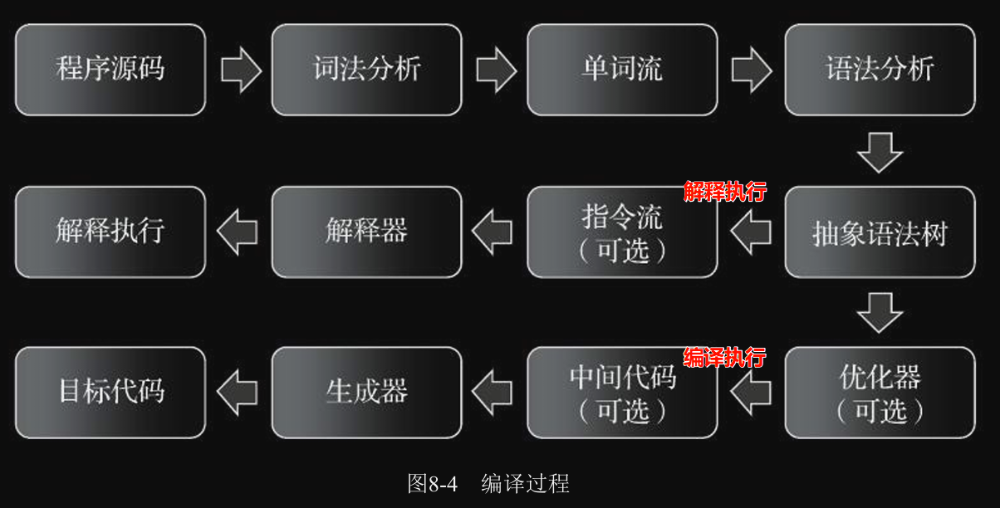

执行前先对程序源码进行词法分析和语法 分析处理，把源码转化为抽象语法树（Abstract Syntax Tree，AST）。

C/C++：从程序源码到抽象语法树再到目标代码形成一个独立的编译器，独立于执行引擎——编译后执行

Java：把生成抽象语法树前的步骤实现为一个半独立的编译器——对编译后的字节码边解释边执行

JavaScript：把所有步骤和执行引擎全部集中封装在一个封闭的黑匣子之中——对源代码边解释边执行

#### 基于栈的指令集与基于寄存器的指令集

Javac 编译器输出的字节码指令流，基本上是一种基于栈的指令集架构（Instruction Set Architecture，ISA），指令大部分都是零地址指令，它们依赖操作数栈进行工作。

优点：可移植，代码相对更加紧凑（字节码中每个字节就对应一条指令，而多地址指令集中还需要存放参数）

劣势：出入栈操作本身就产生了相当大量的指令、栈在内存上实现，因此执行速度会相对慢上一点

基于寄存器的指令集，指令依赖寄存器进行工作，由物理硬件直接支持。

优点：物理机主流的架构、执行速度快

劣势：受到硬件的约束

#### 基于栈的解释器执行过程

```java
public int calc() {
    int a = 100;
    int b = 200;
    int c = 300;
    return (a + b) * c;
 }
```

```java
public int calc();
    Code:
        Stack=2, Locals=4, Args_size=1
         0:   bipush  100 // 单字节的整型常量值（-128～127）推入操作数栈顶
         2:   istore_1 // 将操作数栈顶的整型值出栈并存放到第1个局部变量槽中 
         3:   sipush  200 // 单字节的整型常量值（-32768~32767）推入操作数栈顶
         6:   istore_2 // 将操作数栈顶的整型值出栈并存放到第2个局部变量槽中
         7:   sipush  300 // 单字节的整型常量值（-32768~32767）推入操作数栈顶
        10:  istore_3 // 将操作数栈顶的整型值出栈并存放到第3个局部变量槽中
        11:  iload_1 // 把第1个变量槽的整型值入栈
        12:  iload_2 // 把第2个变量槽的整型值入栈
        13:  iadd // 将操作数栈中头两个栈顶元素出栈，做整型加法
        14:  iload_3 // 把第3个变量槽的整型值入栈
        15:  imul // 将操作数栈中头两个栈顶元素出栈，做整型乘法
        16:  ireturn // 方法返回
 }
```

上面的执行过程仅仅是一种概念模型，虚拟机最终会对执行过程做出一系列优化来提高 性能，实际的运作过程并不会完全符合概念模型的描述。

## 类加载及执行子系统的案例与实战

### Tomcat：正统的类加载器架构

Tomcat 是主流的 Java Web 服务器，同时也是用 Java 语言来实现的。

一般来说，为了避免类库依赖问题（同一个库的不同版本被引入），独立的 Web 应用进程之间、服务器进程和 Web 应用进程之间，类库应该相互独立。

又为了避免内存空间的浪费，相同的 Java 类库也应该实现互相共享。

* 放置在/common 目录中。类库可被 Tomcat 和所有的 Web 应用程序共同使用。
* 放置在/server 目录中。类库可被 Tomcat 使用，对所有的 Web 应用程序都不可见。
* 放置在/shared 目录中。类库可被所有的 Web 应用程序共同使用，但对 Tomcat 自己不可见。
* 放置在/WebApp/WEB-INF 目录中。类库仅仅可以被该 Web 应用程序使用，对 Tomcat 和其他 Web 应 用程序都不可见。

为了支持这套目录结构，并对目录里面的类库进行加载和隔离，Tomcat 自定义了多个类加载器， 这些类加载器按照经典的双亲委派模型来实现

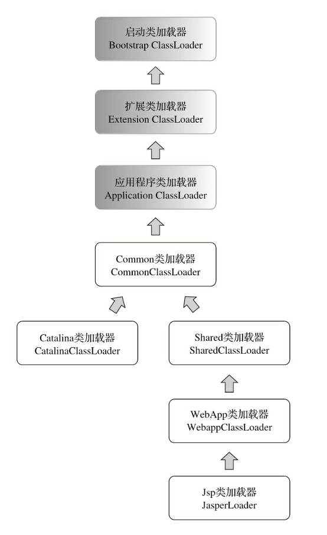


# 第四部分 程序编译与代码优化

Java 的“编译期”是比较含糊的说法

* 前端编译器：把 *.Java 文件转变成*.class 文件的过程。JDK 的 Javac。
* 即时编译器（常称 JIT 编译器，Just In Time Compiler）：运行期把字节码转变成本地机器码的过程。HotSpot 的 C1、C2 编译器、Graal 编译器。
* 提前编译器（常称 AOT 编译器，Ahead Of Time Compiler）：直接把程序编译成与目标机器指令集相关的二进制代码。JDK 的 Jaotc、GNU 的 GCJ。

第一类编译过程可视为前端编译，第二、三类编译过程可视为后端编译。

## 前端编译与优化

### 概述

Java 虚拟机设计团队选择把对性能的优化全部集中到运行期的即时编译器中，这样可以让其他语言用非 Javac 编译生成的字节码也同样能享受到编译器优化措施所带来的性能红利。

Javac 这类前端编译器对代码的运行效率几乎没有任何优化措施，但做了许多针对 Java 语言编码过程的优化措施来降低程序员的编码复杂度、提高编码效率。

Java 中即时编译器在运行期的优化过程，支撑了程序执行效率的不断提升；而前端编译器在编译期的优化过程，支撑着程序员的 编码效率和语言使用者的幸福感的提高。

### Javac 编译器

Javac 本身就是一个由 Java 语言编写的程序，为了解它的编译过程提供了遍历

#### Javac 的源码与调试

在 JDK 6 以前，Javac 并不属于标准 Java SE API 的一部分，它实现代码单独存放在 tools.jar 中，要在 程序中使用的话就必须把这个库放到类路径上。

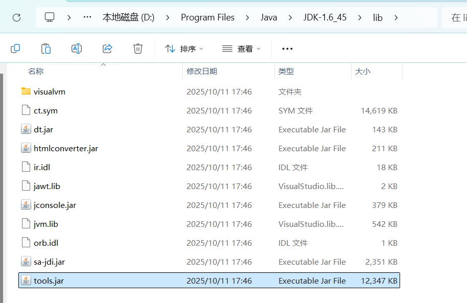

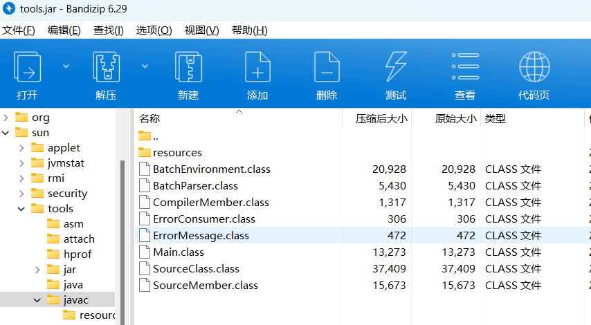

JDK 6 后放在 JDK_SRC_HOME/langtools/src/share/classes/com/sun/tools/javac

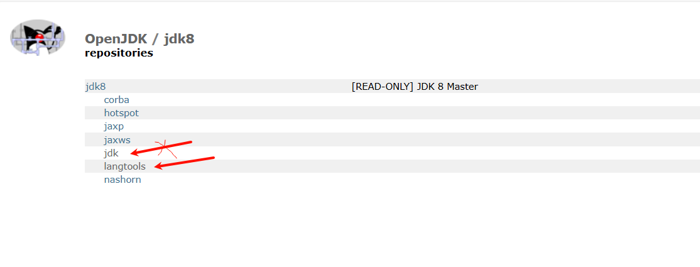

JDK 9 后放在 JDK_SRC_HOME/src/jdk.compiler/share/classes/com/sun/tools/javac

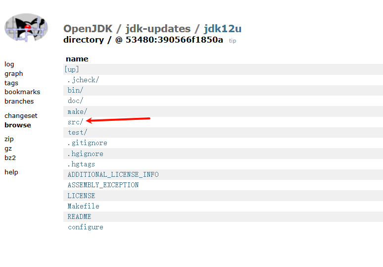

编译过程大致可以分为 1 个准备过程和 3 个处理过程

1. 准备过程：初始化插入式注解处理器。
2. 解析与填充符号表过程
   * 词法、语法分析。将源代码的字符流转变为标记集合，构造出抽象语法树。
   * 填充符号表。产生符号地址和符号信息。
3. 插入式注解处理器的注解处理
4. 分析与字节码生成过程

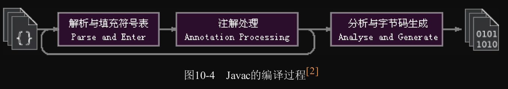

源码分析：

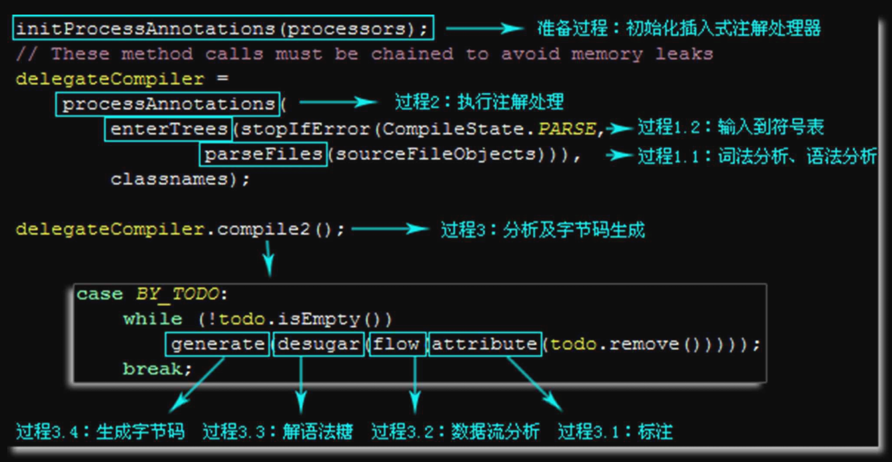

#### 解析与填充符号表

解析过程就包括了经典程序编译原理中词法分析和语法分析两个步骤

1. 解析——词法分析

将源代码的字符流转变为标记（Token）集合。单个字符是程序编写时的最小元素，标记才是编译时的最小元素。例如“int a = a + b”包含了 "int"、"a"、"="、"b"、"+"、"2" 六个标记

1. 解析——语法分析

根据标记序列构造抽象语法树（Abstract Syntax Tree，AST）。抽象语法树的每一个节点都代表着程序代码中的一个语法结构（Syntax Construct），例如包、类型、修饰符、运算符、接口、返回值甚至连代码注释等都可以是一种特定的语法结构。

1. 填充符号表

对符号表进行填充的过程。符号表（Symbol Table）是由一组符号地址和 符号信息构成的数据结构，其登记的内容将用于后续的分析。

#### 注解处理器

JDK 5 之后，Java 语言提供了对注解（Annotations）的支持。插入式注解处理器可以理解为编译器的插件，工作时，编译器将回到解析及填充符号表的过程重新处理，称为一个轮次，循环直到所有处理器都完成工作。

譬如 Java 著名的编码效率工具 Lombok，它可以通过注解来实现自动产生 getter/setter 方法、进行空置检查、生成受查异常表、产生 equals()和 hashCode()方法，等等。

插入式注解处理器可以帮助开发人员消除 Java 的冗长代码。

#### 语义分析与字节码生成

语法分析之后，编译器获得了程序代码的抽象语法树来表示一个结构正确的源程序，但无法保证源程序的语义是符合逻辑的。

语义分析的主要任务：

1. 标注检查：变量使用前是否已被声明、变量与赋值之间的数据类型是否能够匹配等等
2. 数据及控制流分析：局部变量在使用前是否有赋值、方法的每条路径是否都有返回值、是否所有的受查异常都被正确处理等等
3. 解语法糖

字节码生成：语法树、符号表转化成字节码指令写到磁盘中，以及少量的代码添加和转换。

### Java 语法糖的味道

除了本节中介绍的泛型、自动装箱、自动拆箱、遍历循环、变长参数和条件编译之外，Java 语言 还有不少其他的语法糖，如内部类、枚举类、断言语句、数值字面量、对枚举和字符串的 switch 支持、try 语句中定义和关闭资源（JDK 7 开始支持）、Lambda 表达式（从 JDK 8 开始支持）

#### 泛型

#### 自动装箱、拆箱与遍历循环

#### 条件编译

### 实战：插入式注解处理器

## 后端编译与优化

### 概述

无论是提前编译器抑或即时编译器，都不是 Java 虚拟机必需的组成部分，但是后端编译器编译性能的好坏、代码优化质量的高低却是衡量一款商用虚拟机优秀与否的关键指标之一。

## 即时编译器

HotSpot、OpenJ9 中，Java 程序最初都是通过解释器 （Interpreter）进行解释执行的，当虚拟机发现某个方法或代码块的运行特别频繁，就会把这些代码认定为“热点代码”（Hot Spot Code）并编译成本地机器码，以提升热点代码的执行效率。完成这个任务的后端编译器被称 为即时编译器。

### 解释器与编译器

HotSpot 虚拟机中内置了两个（或三个）即时编译器，其中有两个编译器存在已久，分别被称 为“客户端编译器”（Client Compiler）和“服务端编译器”（Server Compiler），或者简称为 C1 编译器和 C2 编译器（部分资料和 JDK 源码中 C2 也叫 Opto 编译器）。第三个是 Graal 编译器（为了代替 C2）

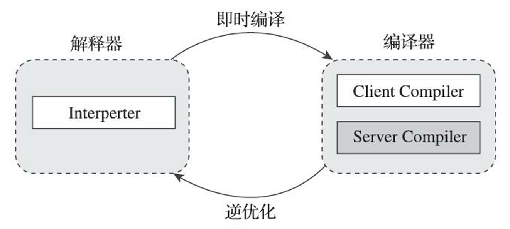

解释器与编译器搭配使用的方式在虚拟机中被称为“混合模式”（Mixed Mode），参数“-Xint”强制虚拟机运行于“解释模 式”（Interpreted Mode），参数“-Xcomp”强制虚拟机运行于“编译模式”（Compiled Mode）。

由于即时编译器编译本地代码需要占用程序运行时间，通常要编译出优化程度越高的代码，所花费的时间便会越长；为了编译出优化程度更高的代码，解释器可能还要替编译器收集性能监控信 息，这对解释执行阶段的速度也有所影响。为了 **程序启动响应速度** 和 **运行效率** 达到最佳平衡，HotSpot 虚拟机在编译子系统中加入了分层编译的功能。

0. 程序纯解释执行，解释器不开启性能监控。
1. 解释器+客户端编译器，简单可靠的稳定优化，解释器不开启性能监控。
2. 解释器+客户端编译器，解释器仅开启方法及回边次数统计等有限的性能监控功能。
3. 解释器+客户端编译器，解释器开启全部性能监控。
4. 解释器+服务端编译器，解释器开启性能监控。编译器可以进行激进优化，耗时更长。

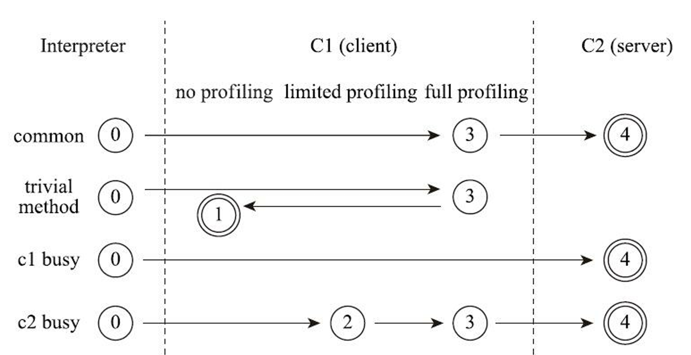

#### 编译对象与触发条件

热点代码主要有两类：

* 被多次调用的方法。
* 被多次执行的循环体。

对于这两种情况，编译的目标对象都是整个方法体，而不会是单独的循环体。后者编译动作是由循环体所触发的，依旧必须以整个方法作为编译对象，但执行入口会稍有不同。

即时编译被触发的条件：

* 基于采样的热点探测：周期性 地检查各个线程的调用栈顶，哪个方法经常出现在栈顶，就是“热点方法”。
* 基于计数器的热点探测：会为 每个方法（甚至是代码块）建立计数器，统计方法的执行次数，执行次数超过一定阈值的方法就是“热点方法”。Hotspot 为每个方法准备了两类计数器：方法调用计数器（Invocation Counter）和回边计数器（Back Edge Counter）。两个计数器之和阈值一旦溢出，就会触发即时编译。


方法调用计数器统计的并不是方法被调用的绝对次数，而是一个相对的执行频率，超过一定时间限度，若方法调用计数器统计数值仍然没超过阈值则会减少一半，这个过程称为方法调用计数器热度的衰减。使用-XX: CompileThreshold 参数设置方法调用即时编译阈值，使用-XX: CounterHalfLifeTime 参数设置半衰周期的时间。使用参数-XX: UseCounterDecay 来关闭热度衰减，只统计方法调用的绝对次数。

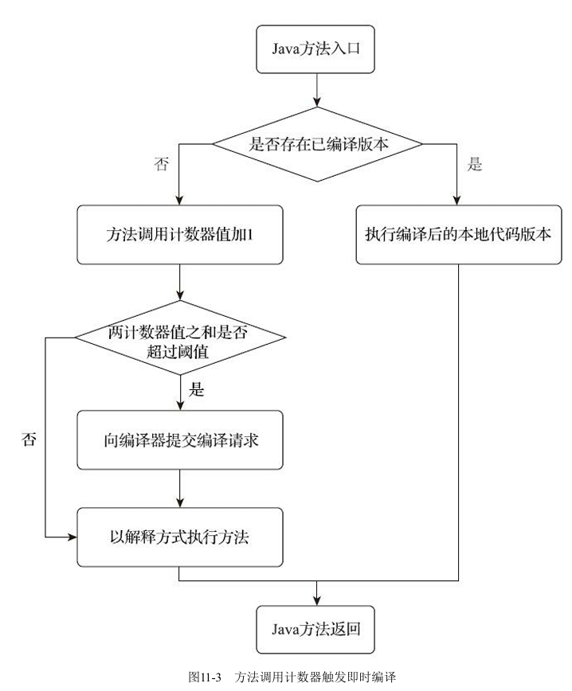

回边计数器统计字节码中遇到控制流向后跳转的指令（回边）的次数。因为执行到一半方法会判断是否触发编译或者替换已经即时编译的方法，被称为“栈上替换”（On Stack Replacement，OSR），即方法的栈帧还在栈上，方法就被替换了。Hotspot 不使用-XX: BackEdgeThreshold 参数来设置阈值。但使用-XX: OnStackReplacePercentage 参数可以间接调整。

$$ {客户端模式}
-XX: BackEdgeThreshold = -XX: CompileThreshold  *  -XX: OnStackReplacePercentage / 100
$$

$$ {服务端模式}
-XX: BackEdgeThreshold = -XX: CompileThreshold  *  (-XX: OnStackReplacePercentage - -XX:
InterpreterProfilePercentage) / 100
$$


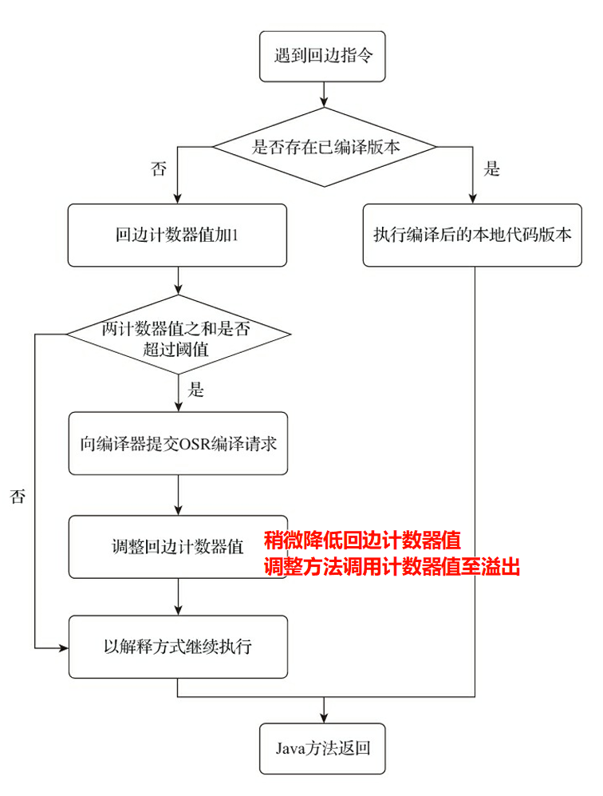

#### 11.2.3 编译过程

客户端编译器是一个相对简单快速的三段式编译器。主要的关注点 在于局部性的优化，而放弃了许多耗时较长的全局优化手段。

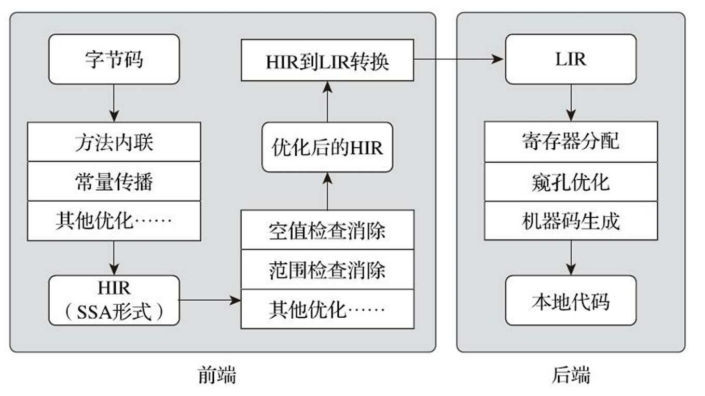

而服务端编译器则是专门面向服务端的典型应用场景，并为服务端的性能配置针对性调整过的编 译器，也是一个能容忍很高优化复杂度的高级编译器，几乎能达到 GNU C++编译器使用-O2 参数时的优化强度。

简单的优化动作：无用代码消除（Dead Code Elimination）、循环展开 （Loop Unrolling）、循环表达式外提（Loop Expression Hoisting）、消除公共子表达式（Common Subexpression Elimination）、常量传播（Constant Propagation）、基本块重排序（Basic Block Reordering）等

Java 语言特性相关的优化：范围检查消除（Range Check Elimination）、空值检查消除（Null Check Elimination）等

预测性激进优化：守护内联（Guarded Inlining）、分支频率预测 （Branch Frequency Prediction）等

#### 实战：查看及分析即时编译结果

### 提前编译器

IBM 公司第一款用于 Java 语言的提前编译器 IBM HPCJ、GNU Compiler for Java、Android 提前编译的 ART（Android Runtime）

#### 提前编译的优劣得失

提前编译的两条明显的分支：

* 与传统 C、C++编译器类似 的，在程序运行之前把程序代码编译成机器码的静态翻译工作

传统的提前编译能避免即时编译占用程序大量运行时间和运算资源的弱点。

* 把原本即时编译器在运行时要做的编译工作提前做好并保存下来，下次运行到这些代码

本质是给即时编译器做缓存加速，去改善 Java 程序的启动时间，以及需要一段时间预热后才能到达最高性能的问题。这种提前编译被称为动态提前编译（Dynamic AOT）或者索性就大大方方地直接叫即时编译缓存（JIT Caching）。

* 提前编译的代码输出质量

提前编译因为没有执行时间和资源限制的压力，能够毫无顾忌地使用重负载的优化手段，但终究是静态分析，而即时编译器能够进行性能分析制导优化、激进预测性优化、链接时优化。

#### 实战：Jaotc 的提前编译

### 编译器优化技术

#### 优化技术概览

```java
static class B {
    int value;
    final int get() {
        return value;
    }
 }
 public void foo() {
    y = b.get();
    // ...do stuff...
    z = b.get();
    sum = y + z;
 }
```

方法内联：一是去除方法调用的成本（如查找方法版本、建立栈帧等）； 二是为其他优化建立良好的基础。

```java
public void foo() {
    y = b.value;
    // ...do stuff...
    z = b.value;
    sum = y + z;
 }
```

冗余访问消除（Redundant Loads Elimination）：公共子表达式消除（Common Subexpression Elimination）

```java
public  void foo() {
    y = b.value;
    // ...do stuff...
    z = y;
    sum = y + z;
 }
```

复写传播（Copy Propagation）：去掉没有必要使用的变量

```java
public  void foo() {
     y = b.value;
     // ...do stuff...
     y = y;
     sum = y + y;
 }
```

无用代码消除（Dead Code Elimination）：去除永不执行或无意义的代码

```java
public  void foo() {
     y = b.value;
     // ...do stuff...
     sum = y + y;
 }
```

* 最重要的优化技术之一：方法内联。
* 最前沿的优化技术之一：逃逸分析。
* 语言无关的经典优化技术之一：公共子表达式消除。
* 语言相关的经典优化技术之一：数组边界检查消除。

#### 方法内联

方法内联的优化行为理解起来是没有任何困难的，不过就是把目标方法的代码原封不动地“复制”到发起调用的方法之中，避免发生真实的方法调用而已。

Java 语言中默认的实例方法是虚方法，对于一个虚方法，编译器静态地去做内联的时候很难确定应该使用哪个方法版本。

解决方法：**类型继承关系分析**（Class Hierarchy Analysis，CHA）技术

* 如果是非虚方法，那么直接进行内联就可以了
* 如果遇到虚方法，则会向 CHA 查询此方法在当 前程序状态下是否真的有多个目标版本可供选择，如果查询到只有一个版本，那就可以假设“应用程序的全貌就是现在运行的这个样子”来进行内联，这种内联被称为守护内联（Guarded Inlining）。由于方法的动态连接特性，运行中途可能会加载新的类型从而改变 CHA 的结论，因此这种内联属于激进预测性优化，必须预留好“逃生门”，当新的子类进入，必须抛弃已经编译的代码，退回到解释状态进行执行。
* 假如向 CHA 查询出来的结果是该方法确实有多个版本的目标方法可供选择，使用内联缓存（Inline Cache）的方式来缩减方法调用的开销，此时方法调用是发生的，但是比直接查虚方法表快一些。

#### 逃逸分析

与类型继承关系分析一样，不是直接优化代码的手段，而是为其他优化措施提供依据的分析技术。‘

基本原理：分析对象动态作用域，当一个对象在方法里面被定义后，，它可能被外部方法所引用，例如作为调用参数传递到其他方法中，这种称为 **方法逃逸**；甚至还有可能被外部线程访 问到，譬如赋值给可以在其他线程中访问的实例变量，这种称为 **线程逃逸**；

针对不同的逃逸程度，可能为这个对象实 例采取不同程度的优化：

* 栈上分配（Stack Allocations）。如果确定一个对象不会逃逸出线程之外，让这个对象在栈上分配内存，对象所占用的内存空间就可以随栈帧出栈而销毁。栈上分配可以支持方法逃逸，但不能支持线程逃逸。
* 标量替换（Scalar Replacement）。若一个数据已经无法再分解成更小的数据来表示了，Java 虚拟 机中的原始数据类型（int、long 等数值类型及 reference 类型等）都不能再进一步分解了，那么这些数据 就可以被称为标量，否则就是聚合量（Aggregate）。Java 对象就是一个典型的聚合量，将 Java 对象恢复成原始类型来访问就是标量替换。假如证明一个对象不会被方法外部访问，且可以拆散，则程序执行时可能不创建对象，而是创建若干个成员变量来使用。如果对象永不逃逸，则标量替换是在栈上分配基础上可以做的进一步优化。
* 同步消除（Synchronization Elimination）。线程同步本身是一个相对耗时的过程，若确定对象永不逃逸，无法被其他线程访问，这个变量的读写肯定就不会有竞争，对这个变量实施的同步措施也就可以安全地消除掉。

参数-XX:+DoEscapeAnalysis 来手动开启逃逸分析

#### 公共子表达式消除

如果一个表达式 E 之前已经被计算过了，并且从先前的计算到现在 E 中所有变量的值都没有发生变化，那么 E 的这次出现就称为公共子表达式。没有必要花时间再对公共子表达式重新进行计算，只需要直 接用前面计算过的表达式结果代替 E。

可能（取决于哪种虚拟机的编译器以及具体的上下文而定）进行另外一种优化 ——代数化简。

```java
int d = E * 12 + a + (a + E);
```

```java
int d = E * 13 + a + a;
```

#### 数组边界检查消除

Java 语言是一门动态安全的语言，对数组的读写访问也不像 C、C++那样实质上就是 裸指针操作。

Java 语言中访问数组元素将会自动进行上下界 的范围检查，否则将抛出一个运行时异常： Java.lang.ArrayIndexOutOfBoundsException。

为了安全，数组边界检查肯定是要做的，但不一定要在运行期间一次不漏地进行，如果通过数据流分析就可以判定循环变量的取值范围永远在区间[0，foo.length)之内，那么在循环中就可 以把整个数组的上下界检查消除掉，这可以节省很多次的条件判断操作。

与语言相关的其他消除操作还有不少，如自动装箱消除（Autobox Elimination）、安全点消除 （Safepoint Elimination）、消除反射（Dereflection）等

#### 实战：深入理解 Graal 编译器

# 第五部分 高效并发

* Amdahl 定律通过系统中并行化与串行化的比重来描述多处理器系统能获得的运算加速能力

* 摩尔定律则用于描述处理器晶体管数量与运行效率之间的发展关系

这两个定律的更替代表了近年来硬件 发展从追求处理器频率到追求多核心并行处理的发展过程。

## Java 内存模型与线程

### 概述

计算机的运算速度与它的存储和通信子系统的速度差距太大，大量的时间都花费在磁盘 I/O、网络通信或者数据库访问上。 如果不希望处理器在大部分时间里都处于等待其他资源的空闲状态，可以让计算机同时处理几项任务把处理器 的运算能力“压榨”出来。

一个服务端要同时对多个客户端提供服务，则是另一个更 具体的并发应用场景。每秒事务处理数（Transactions Per Second， TPS）是衡量一个服务性能的高低好坏的重要指标之一。

### 硬件的效率与一致性

物理计算机中的并发问题与虚拟机中的并发问题由很多类似之处。

由于计算机 的存储设备与处理器的运算速度有着几个数量级的差距，所以现代计算机系统都不得不加入一层或多 层读写速度尽可能接近处理器运算速度的高 **速缓存**（Cache）来作为内存与处理器之间的缓冲。

基于高速缓存的存储交互很好地解决了处理器与内存速度之间的矛盾，但引入了一个新的问题：**缓存一致性**（Cache Coherence）。当多个处理器的运算任务都涉及同一块主内存区域时，将可能导致各自的缓存数据不一致。为了解决一致性的问题，需要各个处理器访问缓存时都遵循一些协 议。

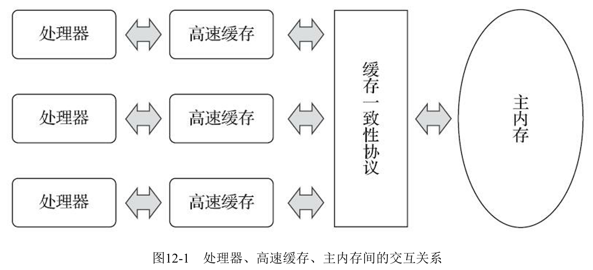

**乱序执行**（Out-Of-Order Execution）优化，处理器会在计算之后将乱序执行的结果重组，保证该结果与顺序执行的结果是一致的。因此如果存在一个计算任务依赖另外一个计算任务的中间结果，那么其顺序性并不能靠代码 的先后顺序来保证。Java 虚拟机的即时编译器中也有指令重排序 （Instruction Reorder）优化。

### Java 内存模型

《Java 虚拟机规范》中曾试图定义一种“Java 内存模型”（Java Memory Model，JMM）来屏蔽各种硬件和操作系统的内存访问差异，以实现让 Java 程序在各种平台下都能达到一致的内存访问效果。

主流程序语言（如 C 和 C++等）直接使用物理硬件和操作系统的内存模型，因此有可能导致程序在一套平台上并发完全正常，而在另外一套平台上并发访问却经常出错，必须针对不同平台来编写程序。

#### 主内存与工作内存

Java 内存模型规定了所有的变量都存储在主内存（Main Memory）中，虚拟机的主内存可以类比物理硬件的内存。每条线程 还有自己的工作内存（Working Memory），虚拟机的工作内存可以类比处理器高速缓存，线程的工作内存中保存了被该线程使用的变量的主内存副本，线程对变量的所有操作（读取、赋值等）都必须在工作内 存中进行，而不能直接读写主内存中的数据。

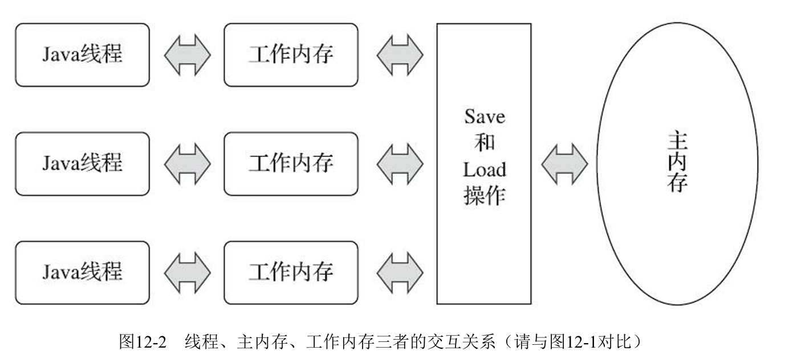

**JMM 与 Java 内存区域划分的区别与联系**

主内存和工作内存的划分，和 Java 内存区域中的 Java 堆、栈、方法区等并不是同一 个层次的对内存的划分。勉强来说，主内存主要对应于 Java 堆中的对象实例数据部分，而工作内存则对应于虚拟机栈中的部分区域。从基础层次上说，主内存直接对应于物理硬件的内存，为了获取更快的运行速度，虚拟机可能会让工作内存优先存储于寄存器和高速缓存中。

#### 内存间交互操作

Java 内存模型中定义了以下 8 种操作来完成，一个变量如何从主内存拷贝到工作内存、如何从工作内存同步回主内存这一类的实现细节。

* lock（锁定）：作用于主内存的变量，它把一个变量标识为一条线程独占的状态。
* unlock（解锁）：作用于主内存的变量，它把一个处于锁定状态的变量释放出来，释放后的变量 才可以被其他线程锁定。
* read（读取）：作用于主内存的变量，它把一个变量的值从主内存传输到线程的工作内存中，以便随后的 load 动作使用。
* load（载入）：作用于工作内存的变量，它把 read 操作从主内存中得到的变量值放入工作内存的变量副本中。
* use（使用）：作用于工作内存的变量，它把工作内存中一个变量的值传递给执行引擎，每当虚 拟机遇到一个需要使用变量的值的字节码指令时将会执行这个操作。
* assign（赋值）：作用于工作内存的变量，它把一个从执行引擎接收的值赋给工作内存的变量， 每当虚拟机遇到一个给变量赋值的字节码指令时执行这个操作。
* store（存储）：作用于工作内存的变量，它把工作内存中一个变量的值传送到主内存中，以便随后的 write 操作使用。
* write（写入）：作用于主内存的变量，它把 store 操作从工作内存中得到的变量的值放入主内存的 变量中。

强制规则：

* read 和 load 操作之一、store 和 write 操作之一不得单独出现，且必须按顺序执行（不要求连续执行）。
* assign 操作发生后，必须同步 store 和 write 操作回主内存。
* store 和 write 操作同步回主内存之前，必须有 1 个以上 assign 操作。
* 使用变量（user 或 store）时，必须先初始化（load 或 assign）
* 同一时间只允许一个线程对变量进行 lock 操作。变量被执行 lock 操作后，将会清空所有工作内存中此变量的值。
* unlock 只能对被同一线程 lock 过的变量操作。unlock 操作次数必须和 lock 次数一致，变量才会被解锁。unlock 之前必须把此变量同步回主内存。

#### 对于 volatile 型变量的特殊规则

关键字 volatile 是 Java 虚拟机提供的最轻量级的同步机制。

当一个变量被定义成 volatile 之后，它将具备两项特性：

* 变量对所有线程的可见。volatile 变量对所有线程是立即可见的，对 volatile 变量所有的写操作都能立刻反映到其他线程之中。
* 禁止指令重排序优化。

```java
Map configOptions;
 char[] configText;
 // 此变量必须定义为volatile
 volatile boolean initialized = false;

 // 假设以下代码在线程A中执行
// 模拟读取配置信息，当读取完成后
// 将initialized设置为true,通知其他线程配置可用
configOptions = new HashMap();
 configText = readConfigFile(fileName);
 processConfigOptions(configText, configOptions);
 initialized = true;

 // 假设以下代码在线程B中执行
// 等待initialized为true，代表线程A已经把配置信息初始化完成
while (!initialized) {
 sleep();
 }
 // 使用线程A中初始化好的配置信息
doSomethingWithConfig();
```

以上是一段用 Java 写的伪代码，实际上指令重排序是机器级别的优化。initialized 变量时没有使用 volatile 修饰，就可能会由于指令重排序的优化，导致位于线程 A 中最后一条 代码“initialized = true”被提前执行，这样在线程 B 中使用配置信息的代码 就可能出现错误，而 volatile 关键字则可以避免此类情况的发生。

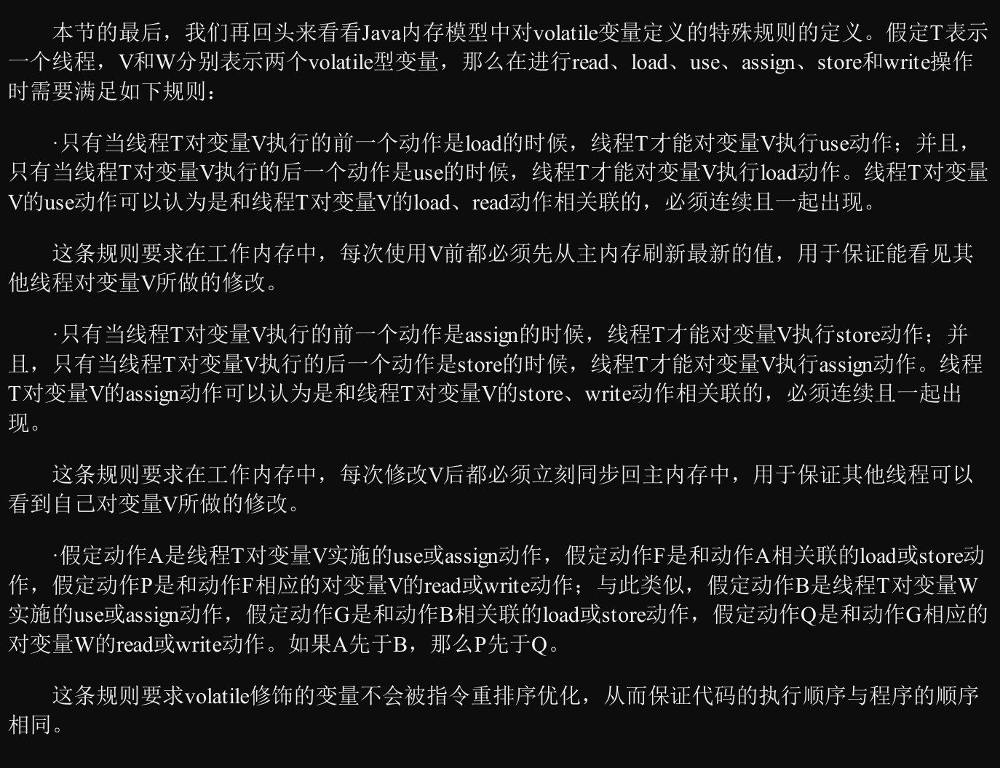

#### 针对 long 和 double 型变量的特殊规则

Java 内存模型要求 lock、unlock、read、load、assign、use、store、write 这八种操作都具有原子性。

但是对于 64 位的数据类型（long 和 double），在模型中特别定义了一条宽松的规定：允许虚拟机将没有 被 volatile 修饰的 64 位数据的读写操作划分为两次 32 位的操作来进行，即允许虚拟机实现自行选择是否要保证 64 位数据类型的 load、store、read 和 write 这四个操作的原子性，这就是所谓的“long 和 double 的非原子性协定”（Non-Atomic Treatment of double and long Variables）。

假若 32 位机器上更新 double 或 long 类型，不是单个操作，不加 volatile 的话 ，并发情况下针对某个元素的访问可能出现脏读。

#### 原子性、可见性与有序性

并发编程中，**原子性、可见性和有序性** 是确保程序正确执行的三大特性。

Java 内存模型是围绕着在并发过程中如何处理原子性、可见性和有序性这三个特征来建立的：

1. 原子性（Atomicity）

read、load、assign、use、store 和 write 这六个原子性变量操作直接保证了——除去 long 和 double 存在非原子性协定，基本数据类型的访问、读写都是具备原子性的。

假如应用场景需要一个更大范围的原子性保证，Java 内存模型还提供了 lock 和 unlock 操作来满足这种需求。

但虚拟机未把 lock 和 unlock 操作直接开放给用户使用，而是提供了更高层次的字节码指令令 monitorenter 和 monitorexit 来隐式地使用这两个操作。反映为 Java 代码中的 synchronized 块之间的操作也具备原子性。

1. 可见性（Visibility）

可见性就是指当一个线程修改了共享变量的值时，其他线程能够立即得知这个修改。

* volatile 关键字修饰变量，通过在变量修改后将新值同步回主内 存，在变量读取前从主内存刷新变量值来实现可见性的。
* synchronized 代码块中，执行 unlock 操作之前，必须先把此变量同步回主内存中从而实现可见性。
* final 修饰的字段在构造器中一旦被初始化完成，通过内存屏障确保构造器退出前没有把“this”的引用传递出去，其他线程中就能看见 final 字段的初始化后的值，而不会看到未初始化的状态，因此具备可见性。

1. 有序性（Ordering）

Java 在“一个线程内似表现为串行的语义”，但由于“指令重排序”现象和“工作内存与主内存同步延迟”现象，多线程的操作表现为无序。

通过 volatile 和 synchronized 两个关键字来保证线程之间操作的有序性。

> **synchronized 的“万能”** 也间接造就了它被程序员滥用的局面，越“万能”的并发控制，通常会伴随着越大的性能影响

#### 先行发生原则

如果 Java 内存模型中所有的有序性都仅靠 volatile 和 synchronized 来完成，那么有很多操作都将会变得非常啰嗦。

“先行发生”（Happens-Before）的原则是判断数据是否存在竞争，线程是否安全的非常有用的手段。

* 程序次序规则：在一个线程内，按照控制流顺序，书写在前面的操作先行 发生于书写在后面的操作。
* 管程锁定规则：一个 unlock 操作先行发生于时间上更晚的对同一个锁的 lock 操作。
* volatile 变量规则：对一个 volatile 变量的写操作先行发生于时间上更晚的对这个变量的读操作。
* 线程启动规则（Thread Start Rule）：Thread 对象的 start()方法先行发生于此线程的每一个动作。
* 线程终止规则（Thread Termination Rule）：线程中的所有操作都先行发生于对此线程的终止检测，我们可以通过 Thread:: join()方法是否结束、Thread:: isAlive()的返回值等手段检测线程是否已经终止执行。
* 线程中断规则（Thread Interruption Rule）：对线程 interrupt()方法的调用先行发生于被中断线程的代码检测到中断事件的发生，可以通过 Thread:: interrupted()方法检测到是否有中断发生。
* 对象终结规则（Finalizer Rule）：一个对象的初始化完成（构造函数执行结束）先行发生于它的 finalize()方法的开始。
* 传递性（Transitivity）：如果操作 A 先行发生于操作 B，操作 B 先行发生于操作 C，那就可以得出操作 A 先行发生于操作 C 的结论。

时间先后顺序与先行发生原则之间基本没有因果关系， 所以我们衡量并发安全问题的时候不要受时间顺序的干扰，一切必须以先行发生原则为准。

### Java 与线程

并发不一定要依赖多线程（如 PHP 中很常见的多进程并发），但是在 Java 里面谈论并发，基本上都与线程脱不开关系。

#### 线程的实现

每个已经调用过 start()方法且还未结束的 Java.lang.Thread 类的实例就代表着一个线程。Java.lang.Thread 类的所有关键方法都被声明为 Native，意味着 Java 线程没有使用或无法使用平台无关的手段来实现（可能是为了执行效率）。

实现线程主要有三种方式：使用内核线程实现（1：1 实现），使用用户线程实现（1：N 实现），使用用户线程加轻量级进程混合实现（N：M 实现）。

1. 内核线程的实现

使用内核线程实现的方式也被称为 1：1 实现。

内核线程（Kernel-Level Thread，KLT）就是直接由操作系统内核（Kernel，下称内核）支持的线程，这种线程由内核来完成线程切换，内核通过操纵调度器（Scheduler）对线程进行调度，并负责将线程的任务映射到各个处理器上。

但是程序一般不会直接使用内核线程，而是使用内核线程的一种高级接口——轻量级进程，轻量级进程就是我们通常意义上所讲的线程。轻量级进程与内核线程之间 1：1 的关系称为一对一的线程模型。

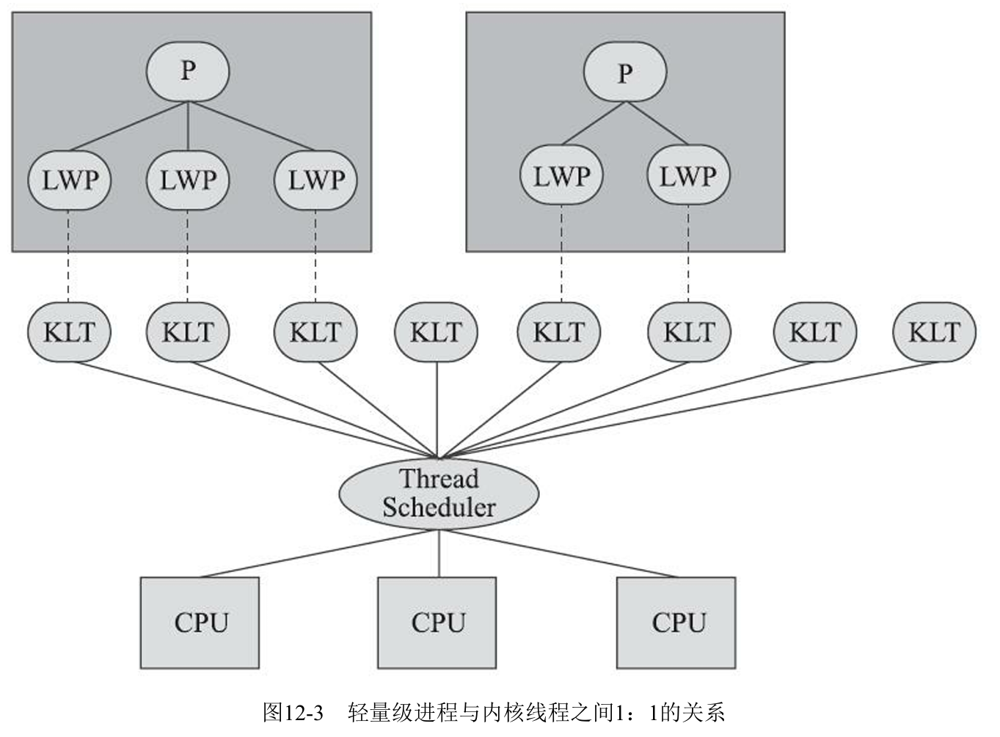

局限性：线程的创建、析构和同步，都需要进行系统调用。系统调用代价相对较高，需要在用户态（User Mode）和内核态（Kernel Mode）中来回切换。每个轻量级进程需要有一个内核线程的支持，轻量级进程要消耗一定的内核资源。

1. 用户线程实现

使用用户线程实现的方式被称为 1：N 实现。系统内核不能感知到用户线程的存在及如何实现的。用户线程的建立、同步、销毁和调度完全在用户态中完成，不需要内核的帮助。这种进程与用户线程之 间 1：N 的关系称为一对多的线程模型。

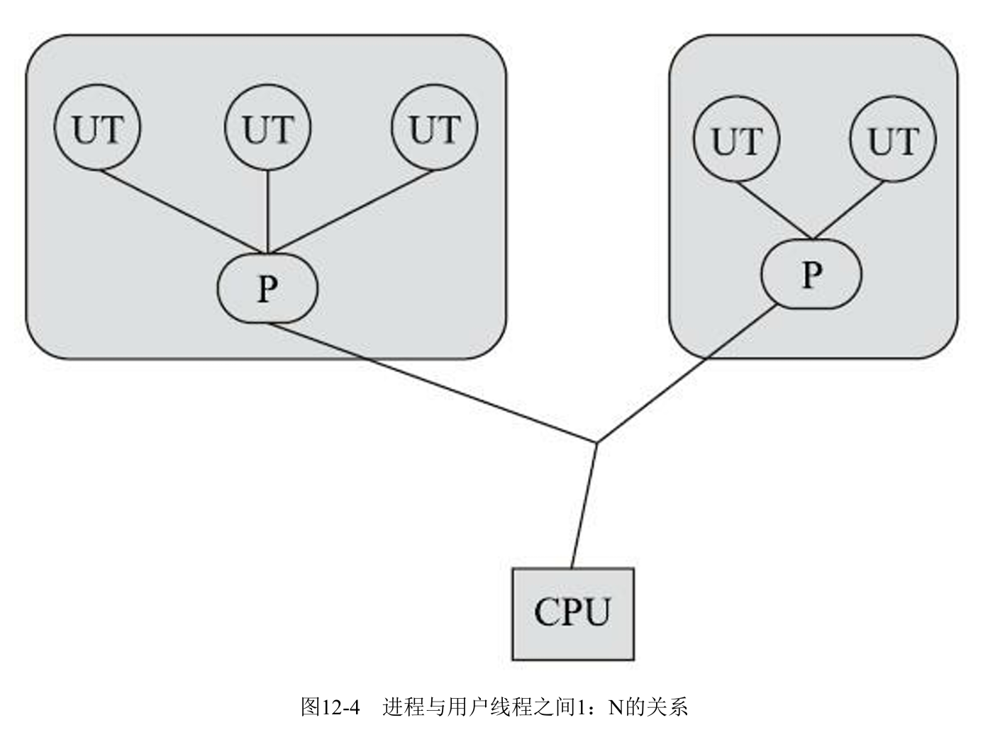

1. 混合实现

将内核线程与用户线程一 起使用的实现方式，被称为 N：M 实现。

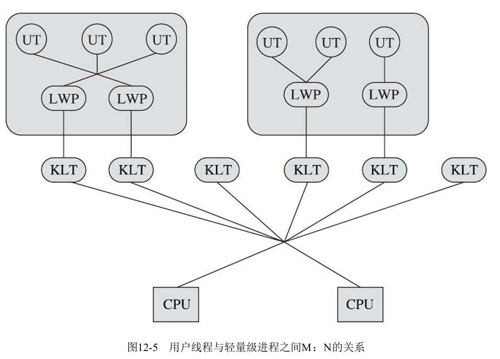

1. Java 线程的实现

早期 Classic 虚拟机上（JDK 1.2 以前），是基于一种被称为“绿色线程”（Green Threads）的用户线程实现的

从 JDK 1.3 起，“主流”平台上的“主流”商用 Java 虚拟机的线程模型普遍都被替换为基于操作系统原生线程模型来实现，即采用 1：1 的线程模型。

Java 线程如何实现并不受 Java 虚拟机规范的约束。HotSpot 的每一个 Java 线程都是直接映射到一个操作系统原生线程来实现的，中间没有额外的间接结构，所以 HotSpot 自己是不会去干涉线程调度的。

#### Java 线程调度

线程调度是指系统为线程分配处理器使用权的过程，调度主要方式有两种，分别是协同式（Cooperative Threads-Scheduling）线程调度和抢占式（Preemptive Threads-Scheduling）线程调度。

* 协同式调度的多线程系统，线程的执行时间由线程本身来控制，线程把自己的工作执行 完了之后，要主动通知系统切换到另外一个线程上去。

好处：一般没有什么线程同步的问题

坏处：线程执行时间不可控制，若代码出错不结束，线程会一直阻塞。

* 抢占式调度的多线程系统，每个线程将由系统来分配执行时间，线程的切换不由线程本身来决定。Java 使用的线程调度方式就是抢占式 调度。

线程优先级：Java 语言一共设置了 10 个级别的线程优先级，但不见得与原生系统的线程优先级概念一一对应。优先级可能会被系统自行改变，例如在 Windows 系统中存在一个叫“优先级推进器”的功能，当系统发现一个线程被执行得特别频繁时，可能会越过线程优先级去为它分配执行时间。

#### 状态转换

Java 语言定义了 6 种线程状态。

* 新建（New）：创建后尚未启动
* 运行（Runnable）：包括操作系统线程状态中的 Running 和 Ready，也就是说线程有可能正在执行，也有可能正在等待着操作系统为它分配执行时间。
* 无限期等待（Waiting）：线程不会被分配处理器执行时间，直到被其他线程显式唤醒
  * Object:: wait()——Object:: notify()/Object:: notifyAll()
  * Thread:: join()
  * LockSupport:: park()——LockSupport.unpark(Thread)
* 限期等待（Timed Waiting）：线程不会被分配处理器执行时间，直到一定时间由系统自动唤醒
  * Thread:: sleep(Timeout)
  * Object:: wait(Timeout)
  * Thread:: join(Timeout)
  * LockSupport:: parkNanos()
  * LockSupport:: parkUntil()
* 阻塞（Blocked）：“阻塞状态”与“等待状态”的区别是，线程阻塞正在等待着获取到一个排它锁，无需等待一段时间，无需唤醒动作的发生。
* 结束（Terminated）：已经结束执行

 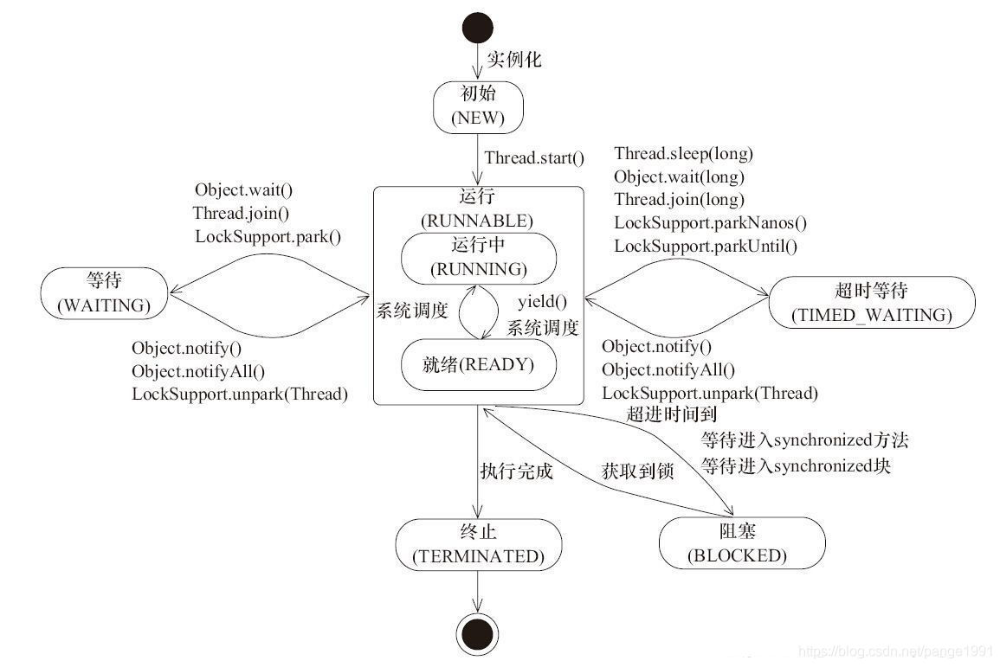

### Java 与协程

#### 内核线程的局限

现代 B/S 系统中一次对外部业务请求的响 应，往往需要分布在不同机器上的大量服务共同协作来实现，这种服务细分的架构在减少单个服务复 杂度、增加复用性的同时，也不可避免地增加了服务的数量，缩短了留给每个服务的响应时间。

1：1 的内核线程模型是如今 Java 虚拟机线程实现的主流选择，但是这种映射到操作系统上的线程天然的缺陷是切换、调度成本高昂，系统能容纳的线程数量也很有限。现在在每个请求本身的执行时间变得很短、数量变得很多的前提下，用户线程切换的开销甚至可能会接近用于计算本身的开销，这就会造成严重的浪费。

#### 协程的复苏

内核线程的调度成本主要来自于用户态与核心态之间的状态转换，而这两种状态转换的开销主要来自于响应中断、保护和恢复执行现场的成本。

```
线程A -> 系统中断 -> 线程B
```

当中断发生，由线程 A 切换至线程 B，操作系统首先要把线程 A 的上下文数据妥善保管好，然后把寄存器、内存分页等恢复到线程 B 挂起时候的状态，以便线程 B 后续的重新激活。这种保护和恢复现场的工 作，免不了涉及一系列数据在各种寄存器、缓存中的来回拷贝，当然不可能是一种轻量级的操作。

用户线程的调度实际上也需要保护和恢复现场，但是调度工作交到程序员手上，可以通过某些方法巧妙缩减这些开销。如古老的操作系统（譬如 DOS）天生不支持多线程，需要采用一种”栈纠缠“、用户自行模拟多线程的模式。

随着操作系统开始提供多线程的支持，最初多数的用户线程是被设计成协同式调度 （Cooperative Scheduling）的，所以它有了一个别名——**“协程”（Coroutine）**。

64 位 Linux 上 HotSpot 的线程栈 容量默认是 1MB，所以 Java 虚拟机里线程池容量达到两百就已经不算 小了。一个协程的栈通常在几百个字节到几 KB 之间，同时并存的协程数量可数以十万计。

#### Java 的解决方案

纤程（Fiber）就是一种典型 的有栈协程。

## 线程安全与锁优化

### 概述

对于本章的 主题“高效并发”来说，首先需要保证并发的正确性，然后在此基础上来实现高效。

### Java 语言中的线程安全

#### Java 语言中的线程安全

在 Java 语言中，线程安全具体是如何体现的？

按照线程安全的“安全程度”由强至弱来排序，我们可以将 Java 语言中各种操作共享的数据分为以下五类：不可变、绝对线程安全、相对线程安全、线程兼容和线程对立。

1. 不可变

不可变 （Immutable）的对象一定是线程安全的。

基本数据类型在定义时使用 final 关键字修饰 它就可以保证它是不可变的。

对象则需要自行保证其行为不会对其状态产生任何影响才行。最简单的就是把对象里面带有状态的变量都声明为 final，这样在构造函数结束之后，它就是不可变的。

类比 Java.lang.String 类的对象实例，它是一个典型的不可变对象，用户调用它的 substring()、replace()和 concat()这些方法都不会影响它原来的值，只会返回一个新构造的字符串对象。同属不可变类型的，常用的还有枚举类型及 Java.lang.Number 的部分子类，如 Long 和 Double 等数值包装类型、BigInteger 和 BigDecimal 等大数据类型。

1. 绝对线程安全

“不管运行时环境如何，调用者都不需要任何额外的同步措施”

在 Java API 中标注自己是线程安全的类，大多数都不是绝对的线程安全。

1. 相对线程安全

相对线程安全就是我们通常意义上所讲的线程安全，它需要保证对这个对象单次的操作是线程安全的。

对于一些特定顺序的连续调用，就可能需要在调用端使用额外的同步手段来保证调用的正确性。

```java
// 线程安全测试
private static Vector<Integer> vector = new Vector<Integer>();
 public static void main(String[] args) {
    while (true) {
        for (int i = 0; i < 10; i++) {
            vector.add(i);
        }
        
        Thread removeThread = new Thread(new Runnable() {
            @Override
            public void run() {
                //synchronized (vector) { // 这样修改后才安全
                    for (int i = 0; i < vector.size(); i++) {
                        vector.remove(i);
                    }
                //}
            }
        });
        
        Thread printThread = new Thread(new Runnable() {
            @Override
            public void run() {
                //synchronized (vector) { // 这样修改后才安全
                    for (int i = 0; i < vector.size(); i++) {
                        System.out.println((vector.get(i)));
                    }
                //}
            }
        });
        
        removeThread.start();
        printThread.start();
        
        //不要同时产生过多的线程，否则会导致操作系统假死
        while (Thread.activeCount() > 20);
    }
 }

// 运行结果：ArrayIndexOutOfBoundsException异常
// 原因：线程访问vetor时，如果另一个线程恰好在错误的时间里删除了一个元素，导致序号i已经不再可用，再用i访问数组就会抛出一个ArrayIndexOutOfBoundsException异常。
```

在 Java 语言中，大部分声称线程安全的类都属于这种类型，例如 Vector、HashTable、Collections 的 synchronizedCollection()方法包装的集合等。

假如这些类型一定要做到绝对的线程安全，那就必须在它内部维护一组一致性的快照访问才行，每次对其中元素进行改动都要产生新的快照，这样要付出的时间和空间成本都是非常大的。

1. 线程兼容

Java 类库 API 中大部分的类都是线程兼容的，如与前面的 Vector 和 HashTable 相对应的集合类 ArrayList 和 HashMap 等。也就是常说的”这个类不是线程安全的“

1. 线程对立

线程对立是指不管调用端是否采取了同步措施，都无法在多线程环境中并发使用代码。

假如 suspend()中断的线程就是即将要执行 resume()的那个线程，那就 肯定要产生死锁了。常见的线程对立 的操作还有 System.setIn()、Sytem.setOut()和 System.runFinalizersOnExit()等。

#### 线程安全的实现方法

1. 互斥同步

互斥同步（Mutual Exclusion & Synchronization）是一种最常见也是最主要的并发正确性保障手段。同步是指在多个线程并发访问共享数据时，保证共享数据在同一个时刻只被一条线程使用。互斥是实现同步的一种手段，临界区（Critical Section）、互斥量 （Mutex）和信号量（Semaphore）都是常见的互斥实现方式。互斥是因，同步是果；

最基本的互斥同步手段就是 **synchronized** 关键字，这是一种块结构的同步语法。synchronized 关键字经过 Javac 编译之后，会在同步块的前后分别形成 monitorenter 和 monitorexit 这两个字节码指令。synchronized 可以明确指定一个对象参数，作为这两个字节码指令要锁定和解锁的对象，不指定则默认取代码所在的对象实例或类型对应的 Class 对象。

monitorenter 首先获取对象的锁，若没有锁定或当前线程已经持有该对象的锁，就把计数器的值加一，monitorexit 会将锁计数器的值减一。一旦计数器的值为零，锁就被释放了。如果获取对象的锁失败，则当前线程被阻塞，直到该对象的锁被释放为止。

从执行成本的角度看，持有锁是一个重量级（Heavy-Weight）的操作。Java 的线程是映射到操作系统的原生内核线程之上的，如果要阻塞或唤醒一条线程，就不可避免地陷入用户态到核心态的转换中，耗费很多的处理器时间。而虚拟机本身也会进行一些优化，譬如在通知操作系统阻塞线程之前加入一段自旋等待过程， 以避免频繁地切入核心态之中。

JDK5 提供了 Java.util.concurrent 包，其中的 **Java.util.concurrent.locks.Lock 接口** 可以以非块结构（Non-Block Structured）来实现互斥同步。从而摆脱了语言特性的束缚，改为在类库层面去实现同步，也为日后扩展更多不同特性的锁提供广阔空间

**重入锁**（ReentrantLock）是 Lock 接口最常见的一种实现。它与 synchronized 一样是可重入的，相比之下有以下三种高级功能。等待可中断：是指当持有锁的线程长期不释放锁的时候，正在等待的线程可以选择放弃等待，转为处理其他事务。公平锁：多个线程在等待同一个锁时，必须按照申请锁的时间顺序来依次获得锁。ReentrantLock 可以通过构造函数要求使用公平锁，但是会影响性能。锁绑定多个条件：多次调用 newCondition()方法可以同时绑定多个 Condition 对象

Lock 应该确保在 finally 块中释放锁，否则一旦受同步保护的代码块中抛出异常，则有可能永远不 会释放持有的锁。而 synchronized 是在 Java 语法层面的同步，足够清晰，也足够简单。

1. 非阻塞同步

互斥同步面临的主要问题是进行线程阻塞和唤醒所带来的性能开销，因此这种同步也被称为阻塞同步。互斥同步属于一种 **悲观的并发策略**，其总是认为只要不去做正确的同步措施（例如加锁），那就肯定会出现问题，无论共享的数据是否真的会出现竞争，它都会进行加锁导致用户态到核心态转换、维护锁计数器和检查是否有被阻塞的线程需要被唤醒等开销。

基于冲突检测的乐观并发策略，就是不管风险，先进行操作，如果没有其他线程争 用共享数据，操作成功；如果共享的数据的确被争用，产生了冲突，那再进行其他的补偿措施。因为不再需要把线程阻塞挂起，因此这种同步操作被称为非阻塞同步。

这种同步必须要求操作和冲突检测这两个步骤具备原子性，只能靠硬件保证某些从语义上看起来需要多次操作的行为可以只通过一条处理器指令就能完成。在单核 CPU 上只需要依赖一个指令实现，假如是多核 CPU，那么多个核之间也依赖系统底层的 Lock 来保证同步。

* 测试并设置（Test-and-Set）；
* 获取并增加（Fetch-and-Increment）；
* 交换（Swap）；
* 比较并交换（Compare-and-Swap，**CAS**）；
* 加载链接/条件储存（Load-Linked/Store-Conditional，下文称 LL/SC）。

Java 里最终暴露出来的是 CAS 操作。CAS 指令需要有三个操作数，分别是内存位置（用 V 表示）、旧的预期值（用 A 表示）和准备设置的新值（用 B 表示），CAS 指令执行时，当且仅当 V 符合 A 时，处理器才会用 B 更新 V 的值，否则它就不执行更新。UnSafe 类种有本地方法的 CAS 操作；J.U.C 包里面的整数原子类可以在语言层面上使用 CAS。

1. 其他方案（非同步方案）

* 可重入代码（Reentrant Code）
* 线程本地存储（Thread Local Storage）

### 锁优化

高效并发是从 JDK 5 升级到 JDK 6 后一项重要的改进项，HotSpot 虚拟机开发团队在这个版本上花 费了大量的资源去实现各种锁优化技术。如适应性自旋（Adaptive Spinning）、锁消除（Lock Elimination）、锁膨胀（Lock Coarsening）、轻量级锁（Lightweight Locking）、偏向锁（Biased Locking）等。这些技术都是为了在线程之间更高效地共享数据及解决竞争问题，从而提高程序的执行 效率。

#### 自旋锁与自适应自旋

互斥同步对性能最大的影响是阻塞的实现，挂起线程和恢复线程的操作都需要转入内核态中完成，给 Java 虚拟机的并发性能带来影响。

假如共享数据的锁定状态只会持续很短的一段时间，为了 这段时间去挂起和恢复线程并不值得。

使用-XX:+UseSpinning 参数来开启自旋锁。让后面请求锁的那个线程“稍等一会”，但不放弃处理器的执行时间，看看持有锁的线程是否很快就会释放锁。为了让线程等待，我们只须让线程执行一个忙循环（自旋），这项技术就是所谓的自旋锁。

自旋的次数默认 10 次，使用参数-XX：PreBlockSpin 来自行更改自旋的次数。在 JDK 6 中对自旋锁的优化，引入了自适应的自旋。自旋的时间不再是固定的，而是由前一次在同一个锁上的自旋时间及锁的拥有者的状态来决定的。

#### 锁消除

锁消除是指虚拟机即时编译器在运行时，对一些代码要求同步，但是对被检测到不可能存在共享数据竞争的锁进行消除。

锁消除的主要判定依据来源于逃逸分析的数据支持，如果判断到一段代码中，在堆上的所有数据都不会逃逸出去被其他线程访问到，那就可以把它们当作栈上数据对待，认为它们是线程私有的，同步加锁自然就无须再进行。

#### 锁粗化

如果一系列的连续操作都对同一个对象反复加锁和 解锁，甚至加锁操作是出现在循环体之中的，那即使没有线程竞争，频繁地进行互斥同步操作也会导 致不必要的性能损耗。

锁粗化：如果虚拟机探测到有这样一串零碎的操作都对同一个对象加锁或者循环体内的加锁操作，将会把加锁同步的范围扩展（粗化）到整个操作序列的外部。

#### 轻量级锁

它设计的初衷是在没有多线程竞争的前提下，减少传统的重量级锁使用操作系统互斥量产生的性能消耗。

HotSpot 虚拟机的对象头（Object Header）有一部分用于存储对象自身的运行时数据，如哈希码（HashCode）、GC 分代年龄（Generational GC Age） 等。这部分数据的长度在 32 位和 64 位的 Java 虚拟机中分别会占用 32 个或 64 个比特，官方称它为“Mark Word”。这部分是实现轻量级锁和偏向锁的关键。

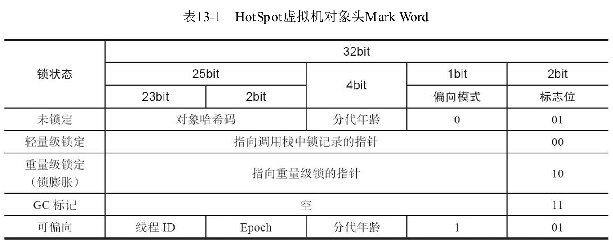

轻量级锁工作过程：

1. 在代码即将进入 同步块的时候，如果此同步对象没有被锁定（锁标志位为“01”状态），虚拟机首先将在当前线程的栈帧中建立一个名为锁记录（Lock Record）的空间，用于存储锁对象目前的 Mark Word 的拷贝。

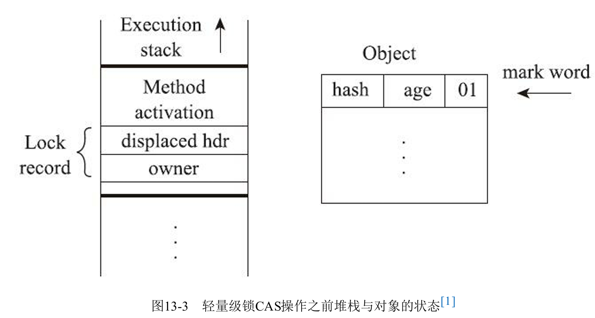

2. CAS 操作尝试把对象的 Mark Word 更新为指向 Lock Record 的指针。更新动作成功，即代表该线程拥有了这个对象的锁，并且对象 Mark Word 的锁标志位将变为”00“，此对象处于轻量级锁定状态。

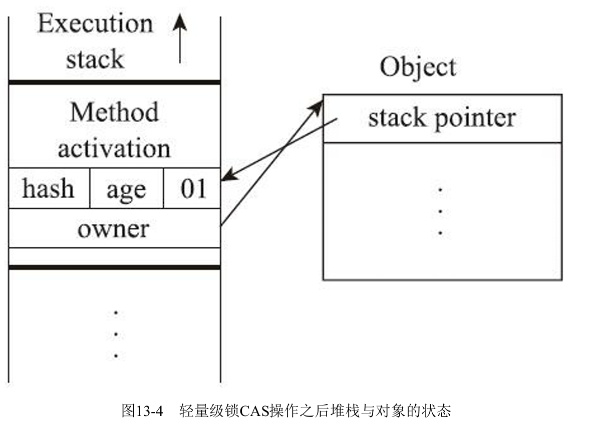

3. 如果这个更新操作失败了，那就意味着至少存在一条线程与当前线程竞争获取该对象的锁。首先检查对象的 Mark Word 是否指向当前线程的栈帧，如果是则说明当前线程已经拥有了这个对象的锁，直接进入同步代码块即可。如果不是那轻量级锁就不再有效，必须要膨胀为重量级锁，锁标志的状态值变为“10”，此时 Mark Word 中存储的就是指向重量级锁（互斥量）的指针，后面等待锁的线程也必须进入阻塞状态。这个轻量级锁竞争过程可以是自旋过程，即循环一定次数来判断锁是否能够被成功获取。

4. 解锁过程也同样是通过 CAS 操作来进行的，如果对象的 Mark Word 仍然指向线程的锁记录，那就用 CAS 操作把对象当前的 Mark Word 和线程中复制的 Displaced Mark Word 替换回来。如果替换失败说明锁已经膨胀为重量级锁，则说明有其他线程尝试过获取该锁，就要在释放锁的同时，唤醒被挂起的线程。

轻量级锁能提升程序同步性能的依据是一条指导经验“对于绝大部分的锁，在整个同步周期内都是不存在竞争的”。如果确实存在锁竞争，轻量级锁比起重量级锁额外发生了 CAS 操作的开销。

#### 偏向锁

偏向锁也是 JDK 6 中引入的一项锁优化措施，它的目的是消除数据在无竞争情况下的同步原语， 进一步提高程序的运行性能。偏向锁比起轻量锁在无竞争的情况下把整个同步都消除掉，连 CAS 操作都不去做了。

这个锁会偏向于第一个获得它的线 程，如果在接下来的执行过程中，该锁一直没有被其他的线程获取，则持有偏向锁的线程将永远不需要再进行同步。

偏向锁工作过程：

1. 当锁对象第一次被线程获取的时候，虚拟机将会把对象头中的标志位设置为“01”、把偏向模式设置为“1”，表示进入偏向模式。同时使用 CAS 操作把获取到这个锁的线程的 ID 记录在对象的 Mark Word 之中。持有偏向锁的线程以后每次进入这个锁相关的同步块时，虚拟机都可以不再进行任何同步操作。
2. 第一个线程结束后，偏向锁是不会释放的。一旦出现另外一个线程去尝试获取这个锁的情况，偏向模式就马上宣告结束。撤销偏向后标志位恢复到未锁定（标志位 为“01”）或轻量级锁定（标志位为“00”）的状态。
3. 后续的同步操作就按照上面介绍的轻量级锁那样去执行


对象哈希码问题：当对象进入偏向状态的时候 Mark Word 大部分的空间（23 个比特）都用于存储持有锁的线程 ID，原有存储对象哈希码的空间被覆盖了。首先在 Java 语言里面一个对象如果计算过哈希码，为了依赖哈希码的功能 API 无出错风险，就应该一直保持该值不变。Object:: hashCode()方法正是通过在对象头中存储计算结果来保证第一次计算之后，后续的的调用取到的哈希码值永不改变。因此，当一个对象计算过了一致性哈希码后，就再也无法进入偏向状态。处于偏向状态的对象计算一致性哈希码时，锁会膨胀为重量级锁。

偏向锁比起轻量锁，可以进一步提高带有同步但无竞争的程序性能。

# 附录部分

## JVM 参数列表

### 内存相关

| 参数                 | 描述                                            |
| -------------------- | ----------------------------------------------- |
| -Xmx                 | 堆最大空间大小，默认为物理内存的 1/2             |
| -Xms                 | 堆初始空间大小，默认为物理内存的 1/64            |
| -Xmn                 | 年轻代空间的大小，默认为整个堆内存的 1/4         |
| -Xss                 | 每个线程的堆栈大小，默认为 256K 或 1M              |
| -XX: NewRatio         | 年轻代与年老代的比值                            |
| -XX: SurvivorRatio    | 年轻代中 Eden 区与 Survivor 区的大小比值，默认为 8:1 |
| -XX: MaxPermSize      | 最大永久代大小，jdk8 之前才有永久代。            |
| -XX: PermSize         | 初始永久代大小，jdk8 之前才有永久代。            |
| -XX: MaxMetaspaceSize | 元空间最大大小                                  |
| -XX: MetaspaceSize    | 元空间初始大小                                  |

### 垃圾收集器分类

| 参数                    | 描述                                                         |
| ----------------------- | ------------------------------------------------------------ |
| -XX:+UseSerialGC        | 新生代使用 Serial，默认老年代使用 Serial Old（虚拟机运行在 Client 模式下的默认值） |
| -XX:+UseParNewGC        | 新生代使用 ParNew，默认老年代使用 Serial Old                   |
| -XX:+UseParallelGC      | 新生代使用 ParallelScanvenge，默认老年代使用 Serial Old        |
| -XX:+UseParallerOldGC   | 老年代使用 Parallel Old，默认新生代使用 ParallelScanvenge（虚拟机运行在 Server 模式下的默认值） |
| -XX:+UseConcMarkSweepGC | 老年代使用 CMS，默认新生代使用 ParNew，                        |
| -XX:+UseG1GC            | 使用 G1（JDK 9 之后的默认收集器）                              |

### 吞吐量优先收集器相关

| 参数                       | 描述                                                         |
| -------------------------- | ------------------------------------------------------------ |
| -XX: MaxGCPauseMills        | 一个大于 0 的毫秒数，收集器将尽可能地保证内存回收花费的时间不超过设定值。 |
| -XX: GCTimeRatio            | 一个大于 0 且小于 100 的整数，也就是垃圾收集时间占总时间的比率，相当于是吞吐量的倒数 |
| -XX:+UseAdaptiveSizePolicy | 不需要手工指定-Xmn -XX: SurvivorRatio -XX: PretenureSizeThreshold。<br />虚拟机会根据当前系统的运行情况收集性能监控信息，动态调整这些参数以提供最合适的停顿时间或者最大的吞吐量 |

### 并发标记清除收集器相关

| 参数                               | 描述                                                         |
| ---------------------------------- | ------------------------------------------------------------ |
| -XX: CMSInitiatingOccupancyFraction | 老年代预留一部分空间提供并发收集时的程序运作使用（默认 68%），可以适当调高参数以便降低内存回收次数从而获取更好的性能。 |
| -XX:+UseCMSCompactAtFullCollection | 用于在 CMS 收集器顶不住要进行 FullGC 时开启内存碎片的合并整理过程（默认就是开启的） |
| -XX: CMSFullGCsBeforeCompaction     | 执行多少次不压缩的 Full GC 后，下一次 FullGC 时进行碎片整理（默认为 0） |

### GC 相关

| 参数                            | 描述                                             |
| :------------------------------ | :----------------------------------------------- |
| -XX:+PrintGCDetails             | 告诉虚拟机在发生垃圾收集行 为时打印内存回收日志  |
| -XX:+PrintTenuringDistribution  | 在每次新生代 GC 时，打印出幸存区中对象的年龄分布。 |
| -XX:+HeapDumpOnOutOfMemoryError | 出现 OOM 异常的时候 Dump 出当前的内存堆转储快照      |
| -XX:+DisableExplicitGC          | 禁止人工触发垃圾收集（屏蔽 System.gc()）          |
| --Xnoclassgc                    | 不对类型进行回收                                 |

### 编译相关

| 参数                             | 描述                                                         |
| :------------------------------- | :----------------------------------------------------------- |
| -XX: CompileThreshold             | 方法调用计数器阈值                                           |
| -XX: UseCounterDecay              | 关闭热度衰减                                                 |
| -XX: CounterHalfLifeTime          | 半衰周期的时间，单位是秒                                     |
| -XX: BackEdgeThreshold            | 代表回边计数器的阈值，实际上并无使用。                       |
| -XX: InterpreterProfilePercentage | 解释器监控比率，用于计算回边计数器的阈值                     |
| -XX: OnStack ReplacePercentage    | 栈上替换（OSR）比率，用于计算回边计数器的阈值                |
| -XX:-BackgroundCompilation       | 禁止后台编译。提交编译请求后阻塞等待，直到编译完成执行编译器输出的本地代码 |
| -XX:+DoEscapeAnalysis            | 开启逃逸分析                                                 |
| -XX:+PrintEscapeAnalysis         | 查看逃逸分析结果                                             |
| -XX:+EliminateAllocations        | 开启标量替换                                                 |
| +XX:+EliminateLocks              | 开启同步消 除                                                |

### 并发相关

| 参数                  | 描述                   |
| :-------------------- | :--------------------- |
| -XX:+UseSpinning      | 开启自旋锁             |
| -XX: PreBlockSpin      | 自旋次数的默认值是十次 |
| -XX:+UseBiasedLocking | 开启偏向锁，默认开启   |
