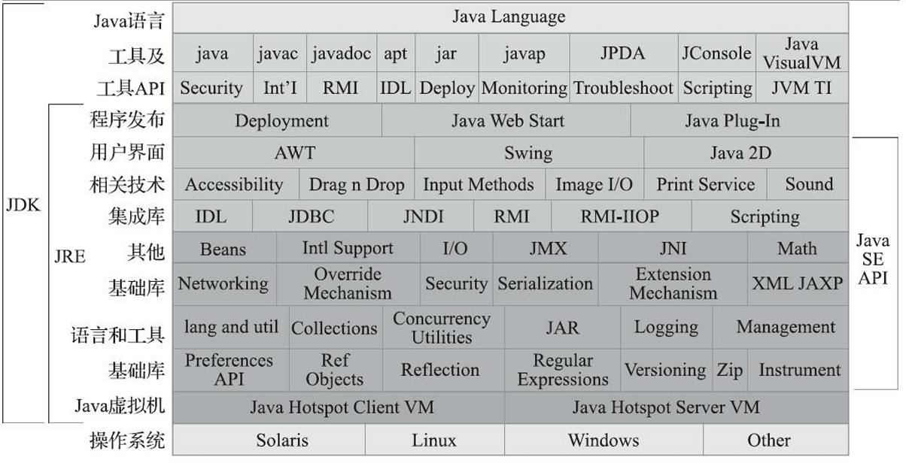
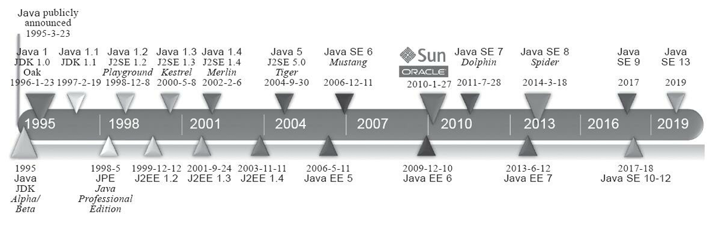
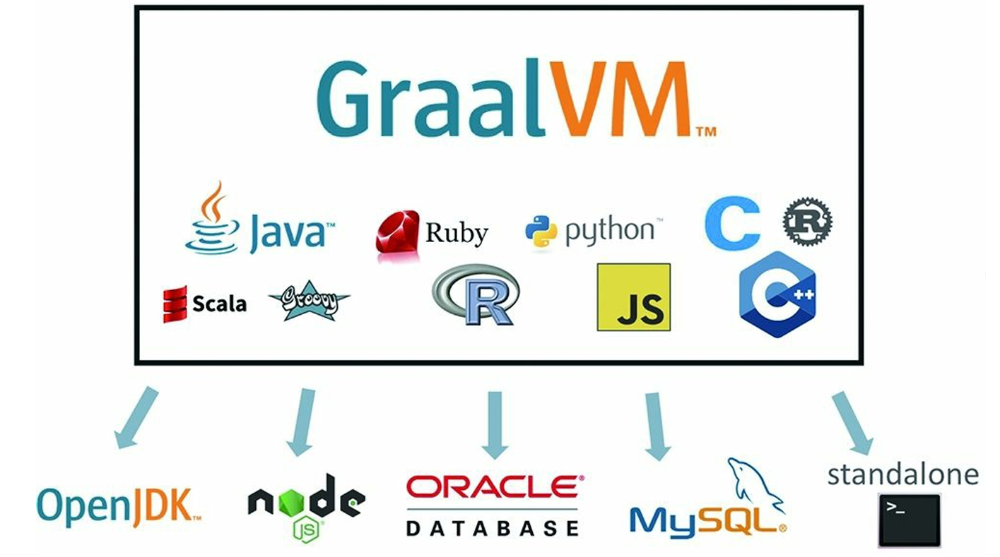
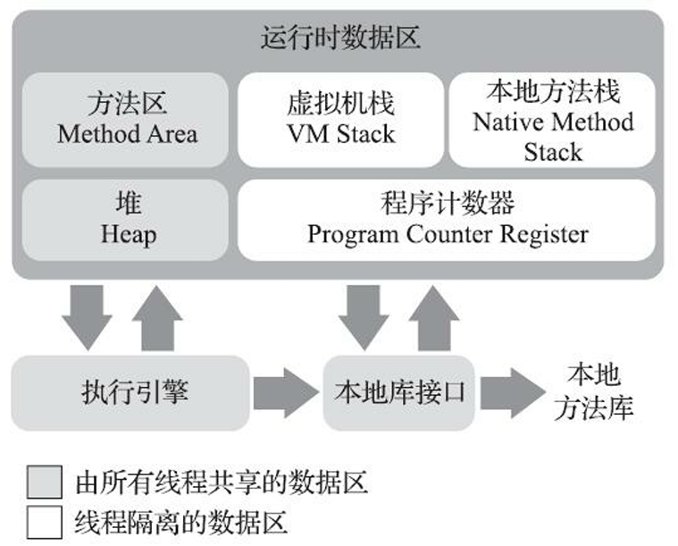
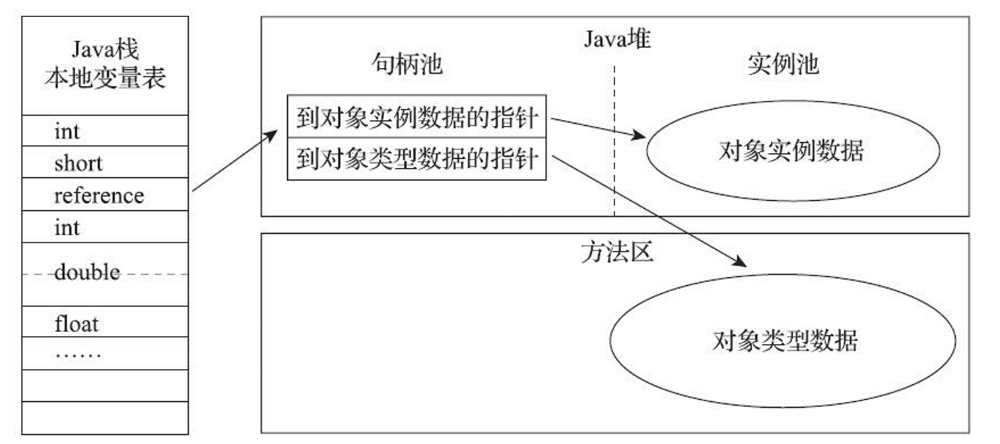
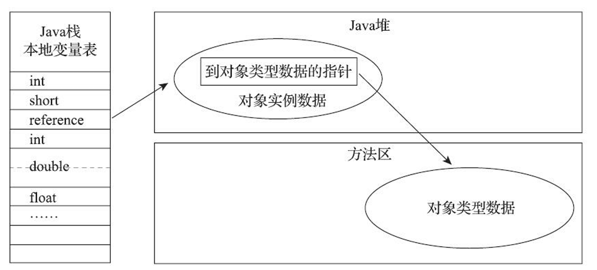

# 走进Java

## 1 Java特性的实现原理

口号“Write Once，Run Anywhere”

### 1.1 Java的优点

* 结构严谨、面向对象。

* 摆脱了硬件平台的束缚，实现“一次编写，到处运行”的理想。

* 一种相对安全的内存管理和访问机制，避免了绝大部分内存泄漏和指针越界问题。

* 热点代码检测和运行时编译及优化，这使得Java应用能随着运行时间的增长而获得更高的性能。

### 1.2 Java的技术体系

JDK（Java Development Kit）：支持Java程序开发的最小环境。大致包括三部分：Java程序设计语言、Java虚拟机、Java类库。

JRE（Java Runtime Environment）：支持Java程序运行的标准环境。大致包括两部分：Java虚拟机、Java类库中的Java SE API子集

> JDK以OpenJDK/OracleJDK最为流行，其中的HotSpot虚拟机目前业界占统治地位

Java技术体系拆分为三个方向。由Java1.2开始。

* Java ME：面向移动终端的Java平台。对Java API 有所精简，加入了移动终端的针对性支持。

* Java SE：面向桌面级应用的Java平台。

* Java EE：面向多层架构的企业的Java平台，对Java SE针对性的扩充。一般以javax.*作为包名。后来如JDBC、JMS、Servlet等部分重要的组件也进入Java SE核心包中。Java EE在2018年被Oracle废弃，成为Eclipse的Jakarta EE。

### 1.3 Java的发展历程

### 1.4 Java虚拟机家族

* 始祖：Sun Classic VM

作为Java虚拟机始祖，发布于在Sun公司的JDK 1.0。只能以纯解释器方式来执行Java代码。外挂编译器无法与解释器配合工作，每次编译执行都要将所有代码进行编译，其执行效率也和传统的C/C++程序有很大差距。

* 雏形：Exact VM

发布于在Sun公司的JDK 1.2。加入热点探测、两级即时编译器、编译器与解释器混合工作模式，提升效率，已经具备现代高性能虚拟机雏形。但只在Solaris操作系统发布，就被HotSpot VM所取代。

> 准确式内存管理（Exact Memory Management），可以判断内存中某个位置的数据是指向了实际数据的内存地址的引用类型，还是一个实际数据。

* 最流行：HotSpot VM

目前使用范围最广的Java虚拟机。Sun公司为了即时编译的优秀理念和实际成果，收购了Longview Technologies公司并引进了HotSpot VM。在JDK1.2中发布，与Sun Classic VM并存。在JDK1.3中转为默认虚拟机。

如它名称中的HotSpot指的就是它的热点代码探测技术，可以通过执行计数器 找出最具有编译价值的代码，然后通知即时编译器以方法为单位进行编译。

JDK 8时期，把原来BEA JRockit中的优秀特性融合到 HotSpot之中，移除掉永久代，吸收了JRockit的Java Mission Control监控工具等功能。

* 移动、嵌入式：Mobile/Embedded VM

面向移动和嵌入式市场的Java虚拟机，如CDC虚拟机、KVM虚拟机、Java SE Embedded（由hotspot裁剪而来）。

* 二选：BEA JRockit/IBM J9 VM

HotSpot除外的三大虚拟机之二分别是BEA System公司的JRockit与 IBM公司的IBM J9。

BEA被Oracle收购后，JRockit现已不再继续发展。

IBM J9虚拟机的职责分离与模块化做得比HotSpot更优秀，如果为了学习虚拟机技术而去阅读源码，更加模块化的OpenJ9代码其实是比HotSpot更好的选择。如果为了使用Java虚拟机时多一种选择，那可以通过AdoptOpenJDK来 获得采用OpenJ9搭配上OpenJDK其他类库组成的完整JDK。

* 软硬合璧：BEA Liquid VM/Azul VM

非通用硬件平台，而与特定硬件平台绑定、软硬件配合工作的专有虚拟机。

* 非Java体系：Apache Harmony/Google Android Dalvik VM

Apache Harmony是一个Apache软件基金会旗下以Apache License协议开源的实际兼容于JDK 5和 JDK 6的Java程序运行平台，但是并没有通过TCK认证，其平台的虚拟机无法当成Java虚拟机来介绍。

Dalvik虚拟机曾经是Android平台的核心组成部分之一，并不是一个Java虚拟机，它没有遵循《Java虚拟机规范》，不能直接执行Java的 Class文件，使用寄存器架构而不是Java虚拟机中常见的栈架构。但是执行的DEX（Dalvik Executable）文件可以通过Class文件转化而来，使用Java语法编写应用程序，可以直接使用绝大部分的Java API等。后来可以提前编译的ART虚拟机代替了即时编译的Dalvik虚拟机。

* 理想夭折：Microsoft JVM

早期为了在IE浏览器中运行Java Applets程序而诞生。被SUN公司控告，微软赔偿并去除Windows的Java平台。

* 非主流领域

基本集中在移动、嵌 入式应用

KVM、Java Card VM、Squawk VM、JavaInJava、Maxine VM、Jikes RVM、IKVM.NET等

### 1.5 Java技术未来

Java的话事权不在于语法多么先进好用，而是来自它庞大的用户群和极其成熟的软件生态。

其他语言在某一领域的优势明显：互联网之于JavaScript、人工智能之于Python，微服务之于Golang。但Java已经尽可能在每一个领域都博得席位。

#### 1.5.1 无语言倾向：Graal VM

Graal VM被官方称为“Universal VM”和“Polyglot VM”，这是一个在HotSpot虚拟机基础上增强而成 的跨语言全栈虚拟机，可以作为“任何语言”的运行平台使用。口号“Run Programs Faster Anywhere”

Graal VM的基本工作原理是将这些语言的源代码（例如JavaScript）或源代码编译后的中间格式 （例如LLVM字节码）通过解释器转换为能被Graal VM接受的中间表示。这个过程称为程序特化（Specialized，也常被称为Partial Evaluation）。

#### 1.5.2 新一代即时编译器：Graal编译器

#### 1.5.3 向Native迈进

近几年，大型单体应用架构向小型微服务应用架构发展，Java的启动时间相对较长，需要预热才能达到最高性能等特点就显得相悖于这样 的应用场景。

早期改善措施

* 跨进程的、可以面向用户程序的类型信息共享。允许把加载解析后的类型信息缓存起来，从而提升下次启动速度，原本CDS只支 持Java标准库，在JDK 10时的AppCDS开始支持用户的程序代码
* 无操作的垃圾收集器。只做内存分配而不做回收的收集器，对于运行完就退出的应用十分合适

彻底方案

* 提前编译（Ahead of Time Compilation，AOT）。提前编译是相对于即时编译的概念，Java虚拟机加载这些已经预编译成二进制库之后就能够直接调用。但是破坏了Java“一次编写，到处运行”的承诺，

#### 1.5.4  HotSpot的改进

经过一系列的重构与开放，HotSpot虚拟机逐渐从时间的侵蚀中挣脱出来，虽然代码复杂度还在增 长，体积仍在变大，但其架构并未老朽，而是拥有了越来越多的开放性和扩展性。

#### 1.5.5  语言语法持续增强

语言特性和语法糖不论有没有，程序也照样能写，但即使只是可有可无的语法糖，也是直接影响语言使用者的幸福感程度的关键指标。

# 自动内存管理

## 2 Java内存区域与内存溢出异常

### 2.1 Java与C的内存机制

C或C++的开发人员拥有每一个对象的所有权。

Java开发人员，在虚拟机的自动内存管理机制下，无需配对写delete/free代码，不容易出现内存泄漏和内存溢出问题。但一旦发生问题，如果不了解虚拟机机制，排查错误将变得艰难。

### 2.2 运行时数据区域

Java虚拟机在执行Java程序的过程中会把它所管理的内存划分为若干个不同的数据区域。其中，有各线程共享的数据区，也有各线程独立拥有的数据区。

#### 2.2.1 程序计数器

可以看作是当前线程所执行的字节码的行号指示器，字节码解释器工作时就是通过改变这个计数器的值来选取下一条需要执行的字节码指令。

线程私有。当线程轮流切换，处理器时间片轮转，一个单核处理器（或多核处理器的一个核心）某一时刻只会有一个线程在执行。因此线程切换后要想恢复到原执行位置，每条线程都需要有一个独立的计数器。

#### 2.2.2 虚拟机栈

虚拟机栈（VM Stack）描述的是Java方法执行的线程内存模型：每个方法被执行的时候，Java虚拟机都会同步创建一个栈帧（Stack Frame）用于存储局部变量表、操作数栈、动态连接、方法出口等信息。

线程私有。生命周期与线程相同。

该内存区域的两类异常状况：

* StackOverflowError异常。线程请求的栈深度大于虚拟机所允许的深度。
* OutOfMemoryError异常。当栈扩展时无法申请到足够的内存。

局部变量表。存放了编译期可知的基本数据类型、对象引用（要么指向对象起始位置，要么指向代表对象的句柄）、returnAddress 类型（指向了一条字节码指令的地址）。

> 这些数据类型以局部变量槽（Slot）来表示。例如，64位长度的long和 double类型的数据会占用两个变量槽。
>
> 局部变量表所需的内存空间在编译期间完成分配，当进入一个方法时，这个方法需要在栈帧中分配的变量槽的数量是完全确定 的，在方法运行期间不会改变局部变量表的大小。
>
> 1个变量槽占用32个比特、64个比特，或者更多由虚拟机自行决定。

#### 2.2.3 本地方法栈

本地方法栈（Native Method Stacks）的作用类似虚拟机栈至于Java方法，本地方法栈为本地方法服务。

有的虚拟机如Hot-Spot虚拟机将二者合二为一。

#### 2.2.4 Java堆

此内存区域的唯一目的就是存放对象实例，“几乎”所有的对象实例都在这里分配内存。

> 现代虚拟机通过优化技术（如逃逸分析）可以决定对象是否需要分配到堆上，从而提升性能。

Java堆是垃圾收集器管理的内存区域，因此也被称为GC堆（Garbage Collected Heep）。

> 从回收内存的角度看，大部分垃圾回收器都是根据分代收集理论设计，出现“新生代”、“老年代”、“永久代”等名词只是部分垃圾收集器的共同特性或设计风格，而非Java虚拟机的固有内存布局。
>
> 例如HotSpot虚拟机的垃圾回收器是基于“经典分代”来设计。经典分代指新生代（Eden和两个Survivor）、老年代这种划分。

线程共享。但是可以从Eden区中划分出多个线程私有的分配缓冲区（Thread Local Allocation Buffer，TLAB），以提升对象分配时的效率。（是否使用TLAB通过参数-XX:+/-UseTLAB来配置）

> 无论是哪个区域，存储的都只能是对象的实例，将Java 堆细分的目的只是为了更好地回收内存，或者更快地分配内存

物理上，Java堆可以处于不连续的内存空间中。但大多数虚拟机为了简单和存储高效，要求连续的存储空间。

当前主流虚拟机的Java堆被实现为可扩展的。堆扩展通过参数-Xmx和-Xms设定。

> *-Xms* 表示 JVM 启动时分配的初始堆内存大小。例如，*-Xms512m* 表示 JVM 启动时分配 512MB 的堆内存。合理设置初始值可以减少堆内存动态扩展的频率，从而提升性能。
>
> *-Xmx* 表示 JVM 运行时允许的最大堆内存大小。例如，*-Xmx2g* 表示堆内存最大可扩展至 2GB。当堆内存达到此限制时，JVM 会触发垃圾回收。如果垃圾回收后仍无法满足内存需求，则会抛出 OutOfMemoryError异常。

#### 2.2.5 方法区

它用于存储已被虚拟机加载的类型信息、常量、静态变量、即时编译器编译后的代码缓存等数据。与Java堆一样是各个线程共享的内存区域， 实际上在规范中描述为堆的一个逻辑部分，但其别名叫作“非堆”（Non-Heap），目的是与Java堆区分开来。

JDK 8以前，HotSpot虚拟机设计团队选择把收集器的分代设计扩展至方法区（或者说是使用永久代的方式来实现方法区），因此很多程序员会将方法区成为“永久代”。例如，将字符串常量池、静态变量放在堆空间的永久代。实际上在其他虚拟机方法区的实现有另一套逻辑。方法区的实现细节不属于Java虚拟机规范内。

JDK8时，Hot-Spot已经改为采用本地内存（Native Memory）来实现方法区。

方法区无法满足新的内存分配需求时，将抛出 OutOfMemoryError异常

#### 2.2.6 运行时常量池

运行时常量池（Runtime Constant Pool）方法区的一部分。Class文件中除了有类的版本、字 段、方法、接口等描述信息外，还有一项信息是常量池表（Constant Pool Table），用于存放编译期生成的各种字面量与符号引用，这部分内容将在类加载后存放到方法区的运行时常量池中。

具有动态性，除了Class文件加载，运行期间也可以将新的常量放入池中。例如调用String类的 intern()方法。

#### 2.2.7 直接内存

直接内存（Direct Memory）并不是虚拟机运行时数据区的一部分。

JDK 1.4中新加入了NIO（New Input/Output）类，引入了一种基于通道（Channel）与缓冲区 （Buffer）的I/O方式，它可以使用Native函数库直接分配堆外内存，然后通过一个存储在Java堆里面的DirectByteBuffer对象作为这块内存的引用进行操作。这样能在一些场景中显著提高性能，因为避免了 在Java堆和Native堆中来回复制数据。

### 2.3　HotSpot虚拟机Java堆中对象

#### 2.3.1　对象的创建

语言层面，仅仅一个new关键字。

虚拟机层面：

1. 检查引用参数是否能在常量池中定位到一个类的符号引用，并且检查该符号引用的代表的类是否被加载、解析和初始化过。
2. 根据已加载的类对象可以确定对象所需内存大小，为新生对象分配内存。
3. 实例数据赋零值（默认值）。此时对象不赋初始值也能直接使用。
4. 对象进行必要的设置，放在对象的对象头。
5. 调用构造函数，即class文件的的`<init>()`方法，进行初始化。

#### 2.3.2 对象的内存布局

HotSpot虚拟机里，对象在堆内存中的存储布局可以划分为三个部分：对象头（Header）、实例数据（Instance Data）和对齐填充（Padding）。

对象头：

* 对象自身的运行时数据，官方称为Mark Word。哈希码（HashCode）、GC分代年龄、锁状态标志、线程持有的锁、偏向线程ID、偏向时间戳等。大小64位或32位。
* 类型指针，即对象指向它的类型元数据的指针。
* 用于记录数组长度的数据（若为数组）

实例数据：对象真正存储的有效信息。字段在内存的存储顺序（由-XX:FieldsAllocationStyle参数配置），通常为long/double、int、short/char、byte/boolean、oop。子类之中较窄的变量也允许插入父类变量的空隙（由+XX：CompactFields参数配置）

对齐填充：无特殊含义，满足"对象的大小都必须是8字节的整数倍"的虚拟机规范，则通过对齐填充来补全。

对象

#### 2.3.3 对象的访问与定位

reference数据仅被规定为一个指向对象的引用，如何定位并访问堆中对象的具体位置视虚拟机而定。

主流的访问方式：句柄和直接指针。

* 句柄：堆中划出一块句柄池。reference存储对象的句柄地址。句柄中包含了对象实例地址与对象所属类型地址。好处：节省了一次指针定位的时间开销。垃圾回收导致对象移动时，无需修改reference值，只会改变句柄中的对象实例地址。

* 直接指针：reference中存储的直接就是对象地址。因此对象内存需要放置访问类型数据。好处：节省了一次指针定位的时间开销。

### 2.4 OutOfMemoryError异常

除了程序计数器外，虚拟机内存的其他几个运行时区域都有发生OutOfMemoryError（OOM）异常的可能。

根据导致OOM异常的对象是否有用，可分为以下两种情况

* 内存泄漏：申请内存后，没有释放不再使用的空间。例如，程序不再使用某些对象，但垃圾回收器无法回收它们。

* 内存溢出：程序申请内存超出所能提供的最大内存。例如，一次性从数据库中读取大量数据。

出现OOM异常的时候Dump出当前的内存堆转储快照以便进行事后分析(由参数-XX:+HeapDumpOnOutOf-MemoryError配置)。

#### 2.4.1 Java堆溢出

例-Xms20m -Xmx20m 

将最小值-Xms参数与最大值-Xmx参数设置为足够小且一样（避免堆自动扩展），容易产生OOM异常

解决方案：

1. 应确认内存中导致OOM的对象是否是必要的，即确认是否发生内存泄漏。
2. 若是内存泄漏，通过工具查看泄漏对象到GC Roots的引用链，定位内存泄漏的代码位置。
3. 若不是内存泄漏，尝试向上调整堆参数，尝试优化程序设计合理性。

## 3 垃圾收集器与内存分配策略

## 4 虚拟机性能监控、故障处理工具

## 5 调优案例分析与实战

