[TOC]

# 1-JVM与Java体系结构

## 1-前言

大部分Java开发人员,除会在项目中使用到与Java平台相关的各种高精尖技术,对于Java技术的核心Java虚拟机了解甚少。


### 开发人员如何看待上层框架

* 些有一定工作经验的开发人员,打心眼儿里觉得SSM、微服务等上层技术才是重点,基础技术并不重要,这其实是一种本末倒置的“病态”。
* 如果我们把核心类库的API比做数学公式的话,那么Java虚拟机的知识就好比公式的推导过程。

### 架构师的思考

* 参与现有系统的性能优化,重构,保证平台性能和稳定性
* 根据业务场景和需求,决定技术方向,做技术选型
* 能够独立架构和设计海量数据下高并发分布式解决方案,满足功能和非功能需求
* 解决各类潜在系统风险,核心功能的架构与代码编写
* 分析系统瓶颈,解决各种疑难杂症,性能调优等

### 为什么学习JVM

* 面试的需要(BATJ、TMD、PKQ等面试都爱问)
* 中高级程序员必备技能
  * 项目管理、调优的需要
* 追求极客的精神
  * 比如:垃圾回收算法、JIT、底层原理

### Java vs C++

垃圾收集机制为我们打理了很多繁琐的工作,大大提高了开发的效率,但是,垃圾收集也不是万能的,懂得JM内部的内存结构、工作机制,是设计高扩展性应用和诊断运行时问题的基础也是Java工程师进阶的必备能力。

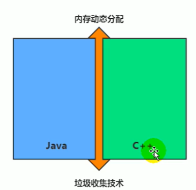

## 2-面向人群与参考书目

《深入理解Java虚拟机：JVM高级特性与最佳实践》

《The Java Language Specification-JavaSE8》

《The Java Virtual Machine Specification-JavaSE8》

## 3-Java和JVM简介

### Java：跨平台的语言

Java是目前应用最为广泛的软件开发平台之一。随着Java以及Java社区的不断壮大
Java也早已不再是简简单单的一门计算机语言了,它更是一个平台、一种文化、个社区。

* 作为一个平台,Java虚拟机扮演着举足轻重的作用。
  * GroovY、Scala、 JRuby、Kot1in等都是Java平台的一部分
* 作为一种文化,Java几乎成为了“开源”的代名词了
  * 第三方开源软件和框架。如 mcat、 struts, MyBatis, Spring等。
  * 就连JDK和JM自身也有不少开源的实现,如 OpenJDK、 Harmony
* 作为一个社区,Java拥有全世界最多的技术拥护者和开源社区支持,有数不清的
  论坛和资料。从桌面应用软件、嵌入式开发到企业级应用、后台服务器、中间件,
  都可以看到Java的身影。其应用形式之复杂、参与人数之众多也令人咋舌。

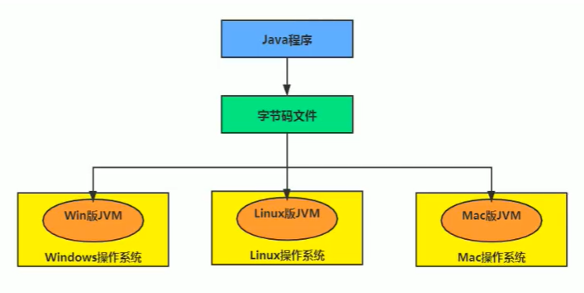

> "write once，run anywhere."

### JVM：跨语言的平台

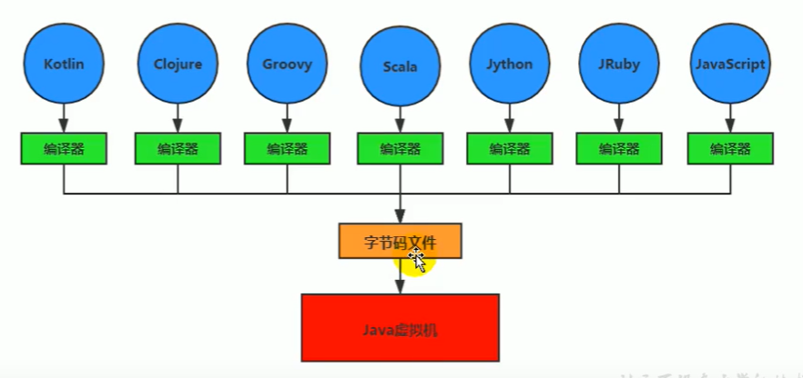

> *  随着Java7的正式发布,Java虚拟机的设计者们通过JsR-292规范基本实现在Java虚拟机平台上运行非Java语言编写的程序
> * Java虚拟机根本不关心运行在其内部的程序到底是使用何种编程语言编写的,它只关心“字节码”文件。也就是说Java虚拟机拥有语言无关性,并不会单纯地与Java语言“终身绑定”,只要其他编程语言的编译结果满足并包含Java虚拟机的内部指令集、符号表以及其他的辅助信息,它就是一个有效的字节码文件,就能够被虚拟机所识别并装载运行。

### 总结

Java不是最强大的语言,但是M是最强大的虚拟机。

### 字节码

我们平时说的java字节码,指的是用java语言编译成的字节码。准确的说任何能在jm平台上执行的字节码格式都是一样的。所以应该统称为:jm字节码。

不同的编译器,可以编译出相同的字节码文件,字节码文件也可以在不同的JVM上运行。

Java虚拟机与Java语言并没有必然的联系,它只与特定的二进制文件格式—class文件格式所关联,class文件中包含了Java虚拟机指
令集(或者称为字节码、 Bytecodes)和符号表,还有一些其他辅助信息。

###　多语言混合编程

Java平台上的多语言混合编程正成为主流,通过特定领域的语言去解决特定领域的问题是当前软件开发应对日趋复杂的项目需求的一个方向。

试想一下,在一个项目之中,并行处理用clojure语言编写,展示层使用Jruby/ Rails,中间层则是Java,每个应用层都将使用不同的编程语言来完成,而且,接口对每一层的开发者都是透明的,各种语言之间的交互不存在任何困难,就像使用自己语言的原生AP工一样方便,因为它们最终都运行在一个虚拟机之上。

## 4-Java发展的重大事件

* 1990年,在Sun计算机公司中,由 Patrick Naughton、 Mikesheridan及James Gos1ing领导的小组 Green Team,开发出的新的程序语言,命名为oak后期命名为Java
* 1995年,Sun正式发布Java和 HotJava产品,Java首次公开亮相。
* 1996年1月23日 Sun Microsystems发布了JDK1.0。
* 1998年,JK1.2版本发布。同时,sun发布了JsP/serv1et、EJB规范,以及将Java分成了J2EE、J2SE和J2ME。这表明了Java开始向企业、桌面应用和移动设备应用3大领域挺进。
* 2000年,JDK1.3发布, Java HotSpot Virtua1 Machine正式发布,成为Java的默认虚拟机
* 2002年,JDK1.4发布,古老的classlc虚拟机退出历史舞台
* 2003年年底,Java平台的Sca1a正式发布,同年 Groovy也加入了Java阵营
* 2004年,JDK1.5发布。同时JDK1.5改名为 JavaSE5.0。
* 2006年,JDK6发布。同年,Java开源并建立了 OpenJDK。顺理成章, Hotspot虚拟机也成为了 oenUDK中的默认虚拟机。
* 2007年,Java平台迎来了新伙伴 Clojure。
* 2008年,oracle收购了BEA,得到了 JRockit虚拟机。
* 2009年, Twitter宣布把后台大部分程序从Ruby迁移到Fsca1a,这是Java平台的又一次
  大规模应用。
* 2010年,oracle收购了sun,获得Java商标和最具价值的 Hotspot虚拟机。此时,Oracle拥有市场占用率最高的两款虚拟机 HotSpot和 jRockit,并计划在未来对它们进行整合: Hotrockit
* 2011年,JDK7发布。在JDK1.7u4中,正式启用了新的垃圾回收器G1
* 2017年,JDK9发布。将G1设置为默认GC,替代CMs
* 同年,IBM的J9开源,形成了现在的 Open U9社区
* 2018年, Android的Java侵权案判决,Goog1e赔偿oracle计88亿美元
* 同年,oracle宣告 JavaEe成为历史名词,JDBC、JMs、serv1et赠予Ec1ipse基金会
* 同年,JDK11发布,LTS版本的JDK,发布革命性的zGC,调整JDK授权许可
* 2019年,JDK12发布,加入 Redhat领导开发的 Shenandoah gc

### OpenJDK和OracleJDK

在JDK11之前,Orac1eJDK中还会存在一些 OpenJDK中没有的、闭源的功能。但在JDK1中,我们可以认为 OpenJDK和orac1eJDK代码实质上已经完全一致的程度。

## 5-虚拟机和Java虚拟机

### 虚拟机

所谓虚拟机( Virtual Machine),就是一台虚拟的计算机。它是一款软件,用来执行一系列虚拟计算机指令。大体上,虚拟机可以分为系统虚拟机和程序虚拟机。

* 大名鼎鼎的 VIsua1Box, VMware就属于系统虚拟机,它们完全是对物理计算机的仿真,提供了一个可运行完整操作系统的软件平台
* 程序虚拟机的典型代表就是Java虚拟机,它专门为执行单个计算机程序而设计,在Java虚拟机中执行的指令我们称为Java字节码指令。

无论是系统虚拟机还是程序虚拟机,在上面运行的软件都被限制于虚拟机提供的资源中。

###　Java虚拟机

Java虚拟机就是二进制字节码的运行环境,负责装载字节码到其内部,解释/编译为对应平台上的机器指令执行。每一条Java指令,Java虚拟机规范中都有详细定义,如怎么取操作数,怎么处理操作数,处理结果放在哪里

* 一次编译,到处运行
* 自动内存管理
* 自动垃圾回收功能

### JVM的位置

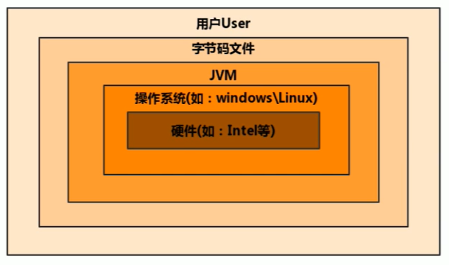

> JⅥM是运行在操作系统之上的,它与硬件没有直接的交互

### JDK的构成

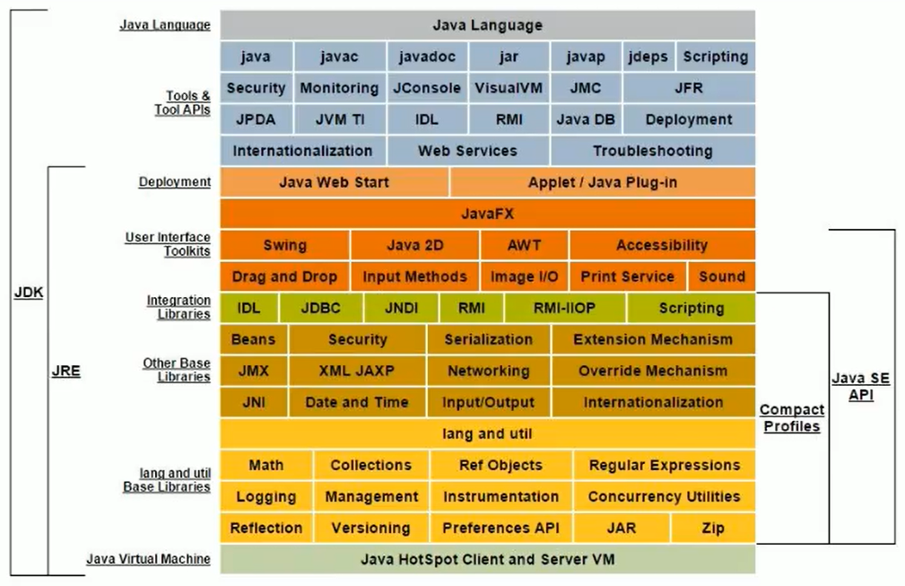

###Google的Andriod系统结构

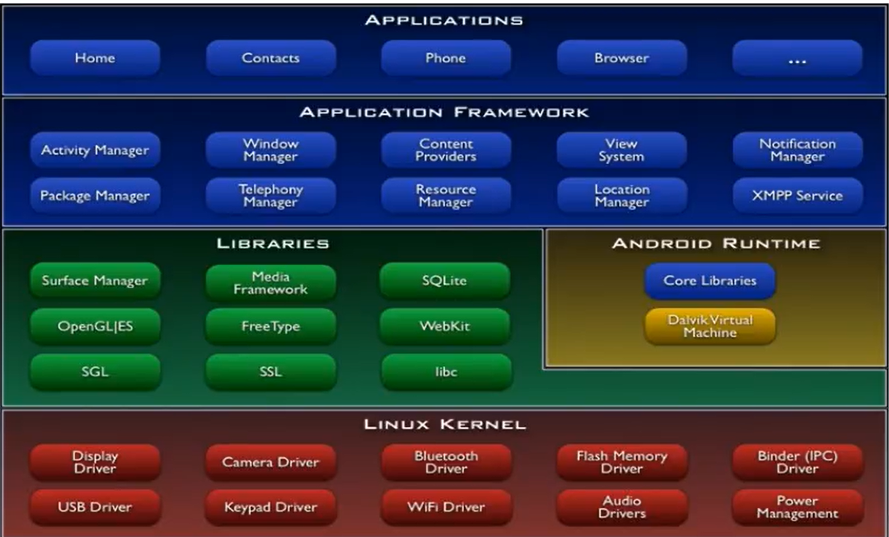

## 6-JVM的整体结构

Hotspot VM是目前市面上高性能虚拟机的代表作之一,它采用解释器与即时编译器并存的架构

在今天,Java程序的运行性能早已脱胎换骨,已经达到了可以和c/C++程序一较高下的地步

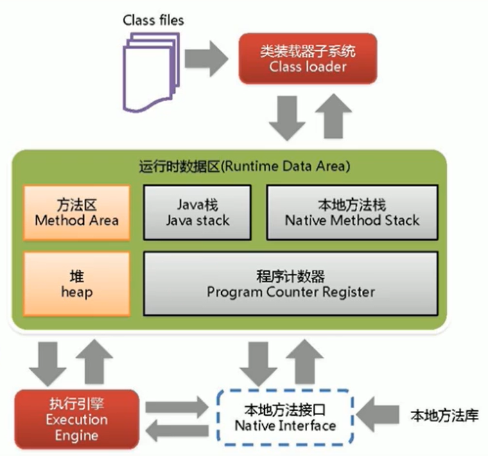

## 7-Java代码的执行流程

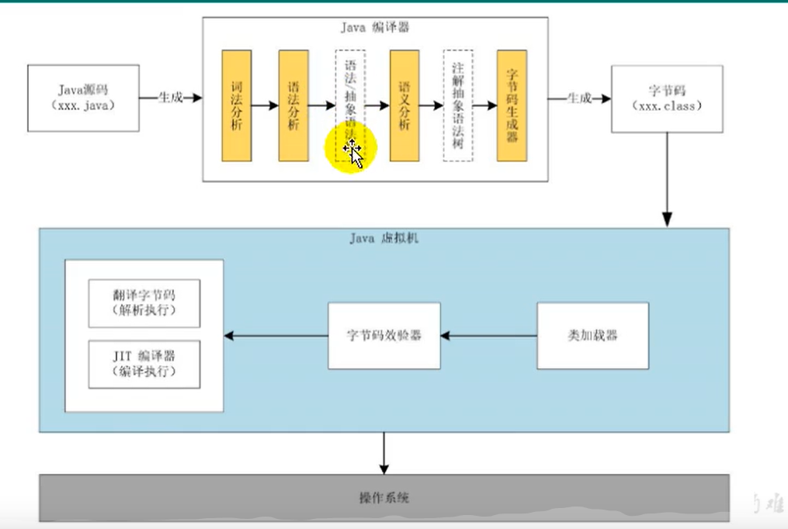

## 8-JVM的架构模型

Java编译器输入的指令流基木上是一种**基于栈的指令集架构**,另外一种指令集架构贝是基于寄存器的指令集架构。

具体来说:这两种架构之间的区别

* 基于栈式架构的特点

  * 设计和实现更简单,适用于资源受限的系统;

  * 避开了寄存器的分配难题:使用零地址指令方式分配。
  * 指令流中的指令大部分是零地址指令,其执行过程依赖于操作栈。指令集更小编译器容易实现。
  * 不需要硬件支持,可移植性更好,更好实现跨平台

* 基于寄存器架构的特点

  * 典型的应用是x86的二进制指令集:比如传统的PC以及 droid的Davlik虚
    拟机。
  * 指令集架构则完全依赖硬件,可移植性差
  * 性能优秀和执行更高效
  * 花费更少的指令去完成一项操作。
    
  * 在大部分情况下,基于寄存器架构的指令集往往都以一地址指令、二地址和三地址指令为主,而基于栈式架构的指令集却是以零地址指令为主

```java
        //int i = 2 + 3;
        int i = 2;
        int j = 3;
        int k = i + j;
//.class反编译后  javap -v StackStruTest.class      
         0: iconst_2
         1: istore_1
         2: iconst_3
         3: istore_2
         4: iload_1
         5: iload_2
         6: iadd
         7: istore_3

```

### 总结

由于跨平台性的设计,Java的指令都是根据栈来设计的。**不同平台CPU架构不同,**所以不能设计为基于寄存器的。

优点是跨平台,指令集小,编译器容易实现,缺点是性能下降,实现同样的功能需要更多的指令。时至今日,尽管嵌入式平台已经不是Java程序的主流运行平台了(准确来说应该是 Hot SpotVM的宿主环境已经不局限于嵌入式平台了),那么为什么不将架构更换为基于寄存器的架构呢?

> 栈:
> 跨平台性、指令集小、指令多;执行性能比寄存器差

## 9-JVM的生命周期

### 类加载器

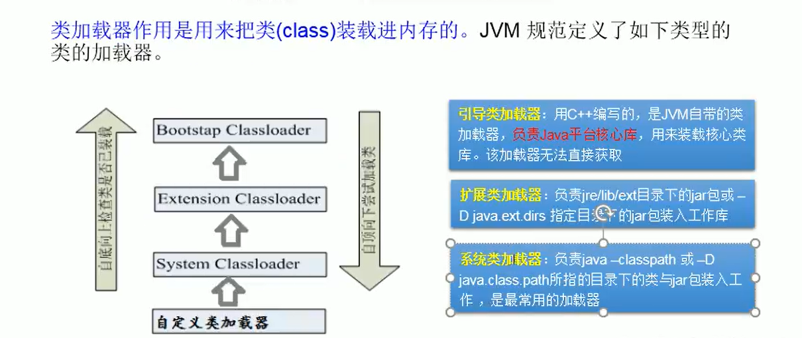

### 虚拟机的启动

Java虚拟机的启动是通过引导类加载器( bootstrap classl loader)创建一个初始类( initial class)来完成的,这个类是由虚拟机的具体实现指定的。

### 虚拟机的执行

一个运行中的Java虚拟机有着一个清晰的任务:执行Java程序。

程序开始执行时他才运行,程序结束时他就停止。

执行一个所谓的Java程序的时候,真真正正在执行的是一个叫做Java虚拟机的进程

### 虚拟机的退出

有如下的几种情况:

* 程序正常执行结束
* 程序在执行过程中遇到了异常或错误而异常终止
* 由于操作系统岀现错误而导致Java虚拟机进程终止
* 某线程调用 Runtime类或 System类的exit方法,或 Runtime类的halt方法,并且Java安全管理器也允许这次exi或ha1t操作。
* 除此之外( Java Native interface)规范描述了用JIInvocation apt来加载或卸载Java虚拟机时,Java虚拟机的退出情况。

## 10-JVM的发展历程

### Sun Classic VM

第一款

只提供解释器，JIT编译器需要外挂，外挂时接管虚拟机，解释器无法配合工作。

hotspot内置了此虚拟机

### Exact VM

jdk1.2起

准确式内存管理

* 也可以叫Non- Conservative/ Accurate Memory management
* 虚拟机可以知道内存中某个位置的数据具体是什么类型。

具备现代高性能虚拟机的雏形

* 热点探测
* 编译器与解释器混合工作模式

限制平台中使用，终被取代

### SUN公司的 Hotspot VM

Hotspot历史

* 最初由一家名为“ Longview Technologies"的小公司设计
* 1997年,此公司被Sun收购;2009年,sun公司被甲骨文收购。
* JDK1.3时, Hotspot VM成为默认虚拟机

目前 Hotspot占有绝对的市场地位,称霸武林

* 不管是现在仍在广泛使用的JDK6,还是使用比例较多的JDκ8中,默认的虚拟机都是Hotspot
* sun/Orac1eJDK和 OpenJDK的默认虚拟机
* 因此木课程中默认介绍的虚拟机都是 Hotspot,相关机制也主要是指 HotSpot的GC机制。(比如其他两个商用虚拟机都没有方法区的概念)

从服务器、桌面到移动端、嵌入式都有应用。

名称中的 Hot spot指的就是它的热点代码探测技术

* 通过计数器找到最具编译价值代码,触发即时编译或栈上替换
* 通过编译器与解释器协同工作,在最优化的程序响应时间与最佳执行性能中取得平衡

### BEA的 JRockit

专注于服务端应用

* 不关注程序启用，内部无解释器实现，全靠即时编译器执行

世界上最快的JVM

优势：全面的java运行时解决方案组合

* JRockit Real Time
* MissionControl

被Oracle收购，与HotSpot整合

### IBM的J9

市场定位与 Hotspot接近,服务器端、桌面应用、嵌入式等多用途VM

广泛用于IBM的各种Java产品。

2017年左右,工BM发布了开源J9wM,命名为 open9,交给Eclipse基金
会管理,也称为Eclipse openj9

### KVM和cDc/ ClDC Hotspot

JavaME产品线的虚拟机

Kw简单新量。高植,面向更低端的设备上还维持自己的一片市场

* 智能控制器、传感器
* 老人手机、经济欠发达地区的功能手机

### AZul VM

这里AzuM和 BEA LiquidⅦM是与**特定硬件平台**绑定、软硬件配合的专有虚拟机

* 高性能Java虚拟机中的战斗机。

Azu1ⅥM是 Azul Systems公司在 Hotspot基础上进行大量改进,运行于Azul Systems公司的专有硬件vega系统上的Java虚拟机。

每个Azu1W实例都可以管理至少数十个CPU和数百GB内存的硬件资源,并提供在巨大内存范围内实现可控的GC时间的垃圾收集据、专有硬件优化的线程调度等优秀特性。

### Llquid VM

高性能Java虚拟机中的战斗机。

BEA公司开发的,直接运行在自家 Hypervisor系统上

LiquidM即是现在的 JRockit ve( irtua1 Edition), LiquidVM不需要操作系统的支持,或者说它自己本身实现了一个专用操作系统的必要功能,如线程调度、文件系统、网络支持等。

### Apache Harmony

它是IBM和Intel联合开发的开源JVM,

虽然目前并没有 Apache Harmony被大规模商用的案例,但是它的Java类库代码吸纳进了 Android sDK。

### Microsoft jVM

微软为了在IE3浏览器中支持 Java applets,开发了 Microsoft jvi

1997年,Sun以侵犯商标、不正当竞争罪名指控微软成功,赔了sun很多钱。微软在 WindowsXP sp3中抹掉了其VW。现在 windows上安装的jdk都是 HotSpot。

### Taobao jVM

AliJVM团队发布

基于 OpenJDK开了自己的定制版本A1 ibabajDE,简称AJDK。是整个阿里Java体系的基石。

基于 OpenJDK Hot SpotⅥM发布的国内第一个优化、深度定制且开源的高性能服务器版Java虚拟机。

* 创新的 GCIH( Gc invisible heap)技术实现了。off-heap,即将生命周期较长的Java对象从heap中移到heap之外,并且GC不能管理GCIH内部的Java对象,以此达到降低GC的回收频率和提升GC的回收效率的目的。

* GCIH中的对象还能够在多个Java虚拟机进程中实现共享

硬件严重依赖intel的cpu,损失兼容性，提高性能

### Dalvik VM(非Java虚拟机)

Dalvik vm只能称作虚拟机,而不能称作“Java虚拟机”,它没有遵循Java虚拟机规范

不能直接执行Java的C1ass文件

基于寄存器架构,不是jvm的栈架构。

执行的是编译以后的dex(Da] vik executable)文件。执行效率比较高。

* 它执行的dex( Dalvik executab1e)文件可以通过c1ass文件转化而来，**使用Java语法编写应用程序,可以直接使用大部分的 Java api等。**

### 总结

具体J的内存结构,其实取决于其实现,不同厂商的JM,或者同一厂商发布的不同版本,都有可能存在一定差异。

### 前瞻Graal VM

"Run Programs Faster Anywhere"

Graal vm在 Hotspot vM基础上增强而成的跨语言全栈虚拟机,可以作为“任何语言”的运行平台使用。语言包括:Java、 Scala、 Groovy、Kot1in;C、C+、JavaScript、 Ruby、 Python、R等

如果说 Hotspot有一天真的被取代,Graa1ⅦM希望最大。但是Java的软件生态没有丝亳变化。

# 2-类加载子系统

## 1-内存结构概述

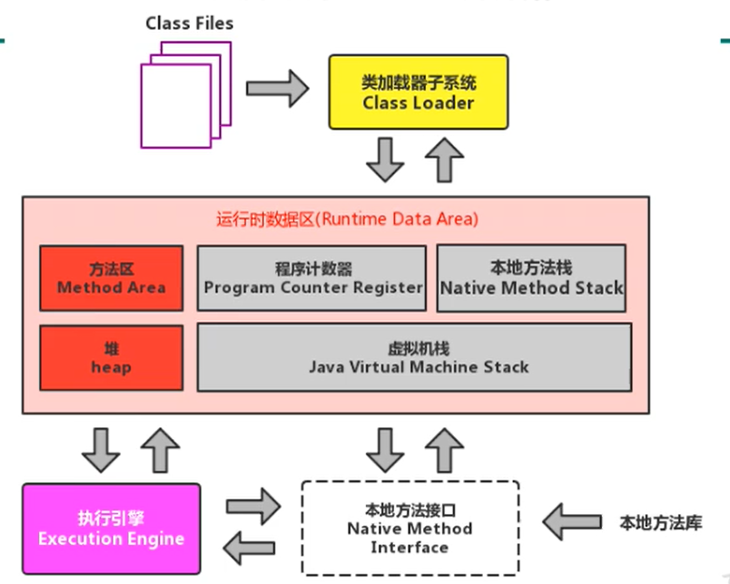

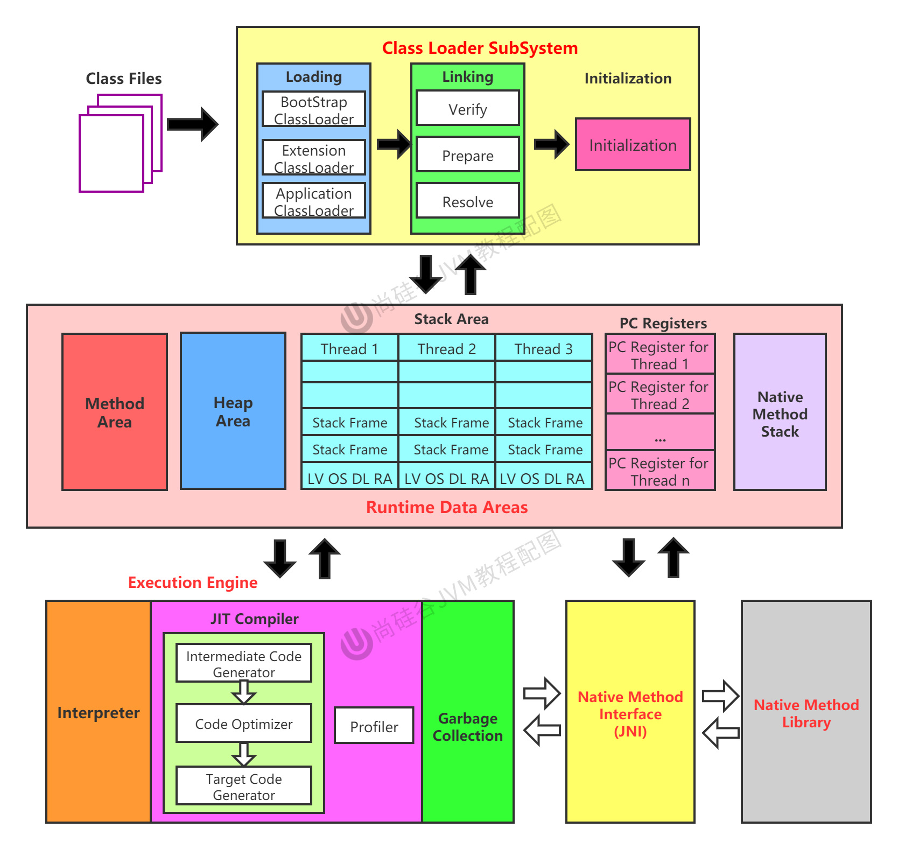

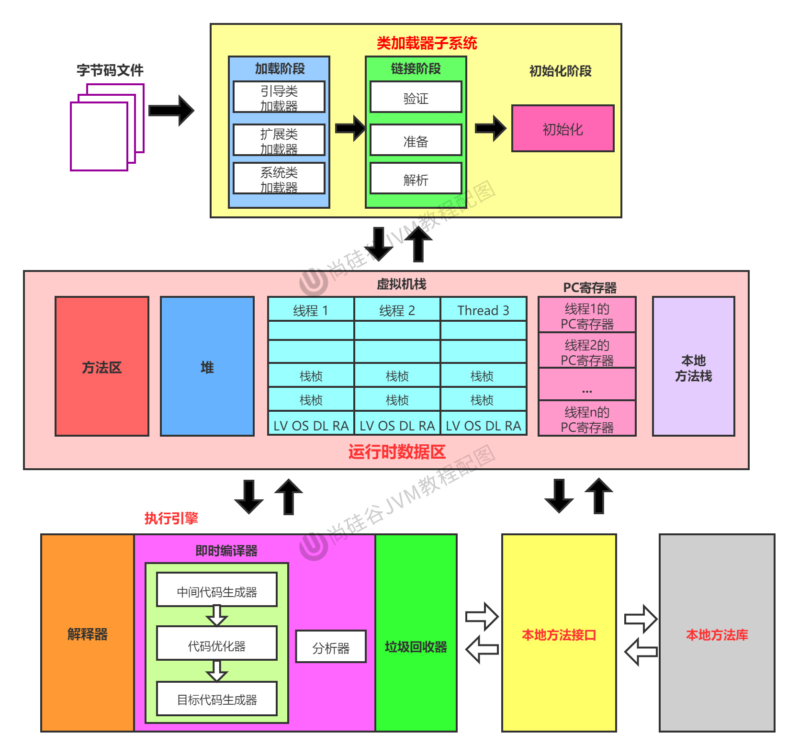

## 2-类加载器子系统与类的加载过程

### 类加载器子系统的作用

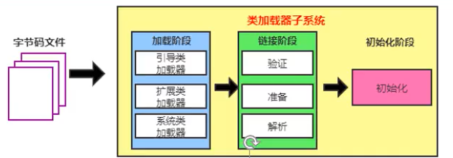

类加载器子系统负责从文件系统或者网络中加载C1ass文件,c1ass文件在文件开头有特定的文件标识。

Classloader只负责c1ass文件的加载,至于它是否可以运行,则由 ExecutionEngine决定。

加载的类信息存放于一块称为方法区的内存空间。除了类的信息外,方法区中还会存放运行时常量池信息,可能还包括字符串字面量和数字常量(这部分常量信息是Class文件中常量池部分的内存映射)

### 类加载器ClassLoader的角色

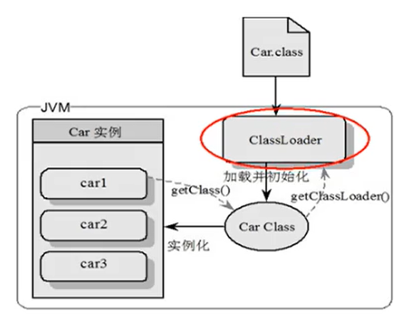

1. class fi1e存在于本地硬盘上,可以理解为设计师画在纸上的模板,而最终这个模板在执行的时候是要加载到JJVM当中来
   根据这个文件实例化出n个一模一样的例。

2. class file加载到JM中,被称为DNA元数据模板,放在方法区

3. 在.C1ass文件->JM->最终成为元数据模板,此过程就要一个运输工具(类装载器class loader),扮演一个快递员的角色

### 工具介绍

用idea插件

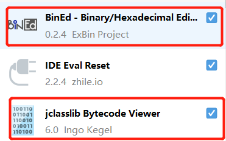

替代软件


### 类的加载过程

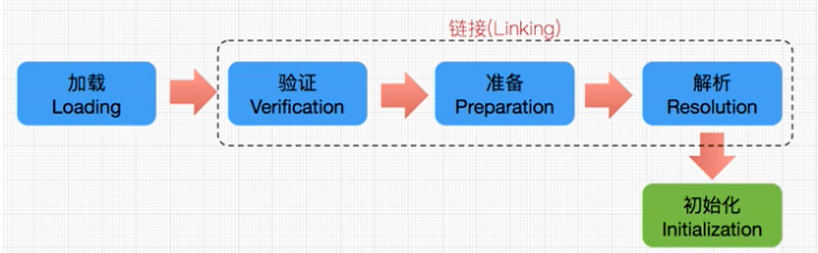

### 加载

1. 通过一个类的全限定名获取定义此类的二进制字节流
2. 将这个字节流所代表的静态存储结构转化为方法区的运行时数据结构
3. 在内存中生成一个代表这个类的ava.lang. Class对象,作为方法区这个类的各种数据的访问入口

加载.class文件的方式

> 从本地系统中直接加载
> 通过网络获取,典型场景: Web Applet
> 从zip压缩包中读取,成为日后jar、war格式的基础
> 运行时计算生成,使用最多的是:动态代理技术
> 由其他文件生成,典型场景:JSP应用
> 从专有数据库中提取.c1ass文件,比较少见
> 从加密文中获取,典型的防cass文件被反编译的保护措施

### 链接

* 验证( Verify)

  * 目的在于确保Class文件的字节流中包含信息符合当前虚拟机要求,保证被加载类的正确性,不会危害虚拟机自身安全。
  * 主要包括四种验证,文件袼式验证,元数据验证,字节码验证,符号引用验证

  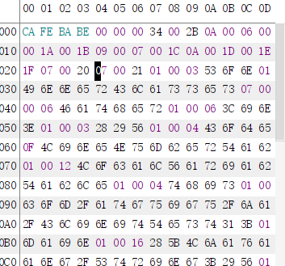

* 准备( Prepare):
  * 为**类变量**分配内存并且设置该类变量的默认初始值,即零值。
  * 这里不包含用final修饰的 static,因为final在编译的时候就会分配了,准备阶段会显式初始化;
  * 这里不会为实例变量分配初始化,类变量会分配在方法区中,而实例变量是会随着对象一起分配到Java堆中。

* 解析( Resolve):
  * 将常量池内的符号引用转换为直接引用的过程。
  * 事实上,解析操作往往会伴随着JVM在执行完初始化之后再执行。
  * 符号引用就是一组符号来描述所引用的目标。符号引用的字面量形式明确定义在《Java虚拟机规范》的Class文件格式中。直接引用就是直接指向目标的指针、相对偏移量或一个间接定位到目标的句柄。
  * 解析动作主要针对类或接口、字段、类方法、接口方法、方法类型等。对应常量池中的CONSTANT Class info, CONSTANT Fieldref info, CONSTANT Methodref infos

### 初始化

初始化阶段就是执行类构造器方法`<c1init>()`的过程

此方法不霩定义,是 Javac编译器自动收集类中**所以类变量的赋值动作和静态代码块中的语句**合并而来。（若没有这些语句则没有`<clinit>()`类构造器方法）

构造器方法中指令按语句在源文件中出现的**顺序执行**。

`<clinit>()`不同于类的构造器。(关联:构造器是虚拟机视角下的`<init>()`）

若该类具有父类,JVM会保证子类的`<c1init>()`执行前,父类的`<clinit>()`已经执行完毕。

虚拟机必须保证一个类的`<clinit>()`方法在多线程下被同步加锁。

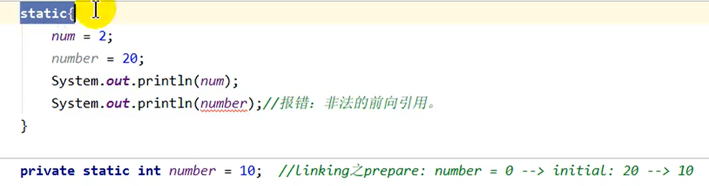

## 3-类加载器的分类

JVM支持两中类型加载器：引导类加载器和自定义类加载器

* 引导类加载器：非Java语言实现，C/C++实现

* 自定义类加载器：所有派生于抽象类ClassLoader的类加载器

最常见三种：


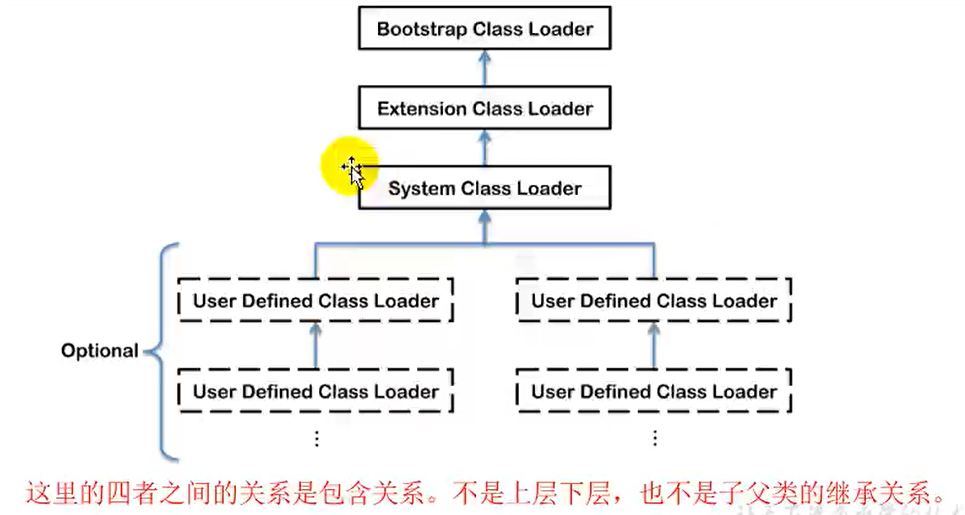

```java
        //获取系统类加载器
        ClassLoader systemClassLoader = ClassLoader.getSystemClassLoader();
        System.out.println(systemClassLoader);//sun.misc.Launcher$AppClassLoader@18b4aac2

        //获取其上层：扩展类加载器
        ClassLoader extClassLoader = systemClassLoader.getParent();
        System.out.println(extClassLoader);//sun.misc.Launcher$ExtClassLoader@1540e19d

        //获取其上层：获取不到引导类加载器
        ClassLoader bootstrapClassLoader = extClassLoader.getParent();
        System.out.println(bootstrapClassLoader);//null

        //对于用户自定义类来说：默认使用系统类加载器进行加载
        ClassLoader classLoader = ClassLoaderTest.class.getClassLoader();
        System.out.println(classLoader);//sun.misc.Launcher$AppClassLoader@18b4aac2

        //String类使用引导类加载器进行加载的。---> Java的核心类库都是使用引导类加载器进行加载的。
        ClassLoader classLoader1 = String.class.getClassLoader();
        System.out.println(classLoader1);//null
```

### 虚拟机自带的加载器

启动类加载器(引导类加载器, Bootstrap C1 assloader)

* 这个类加载使用C/C++语言实现的,嵌套在JVM內部
* 它用来加载Java的**核心库**( JAVA HOME/jre/lib/rt.jar、resources.jar或sun.boot,class,path路径下的内容),用于提供JVM自身需要的类
* 并不继承于java.lang.classloader,没有父加载器。

* 加载扩展类和应用程序类加载器,并指定为他们的父类加载器。
* **出于安全考虑, Bootstrap启动类加载器只加载包名为**java、 Javax、sun等开头**的类

扩展类加载器(Extension classloader)

* Java语言编写,由sun.misc. Launcher$ExtClassloader实现
* 派生于Classloader类
* 父类加载器为启动类加载器
* 从java.ext,dirs系统属性所指定的目录中加载类库,或从JDK的安装目录的jre/lib/ext子目录(扩展目录)下加载类库。如果用户创建的JAR放在此目录下,也会自动由扩展类加载器加载。

应用程序类加载器(系统类加载器,AppC1 assloader)

* java语言编写,由sun.misc. LaunchersAppclassloader实现
* 派生于C1 assloader类
* 父类加载器为扩展类加载器
* 它负责加载环境变量c1 asspath或系统属性java.c1ass,path指定路径下的类库
* 该类加载是程序中默认的类加载器,一般来说,Java应用的类都是由它来完成加载
* 通过c1 assloader# getSystemClassloader()方法可以获取到该类加载器

### 用户自定义类加载器

* 在Java的日常应用程序开发中,类的加载几乎是由上述3种类加载器相互配合执行的,在必要时,我们还可以自定义类加载器,来定制类的加载方式
* 为什么要自定义类加载器?
  * 隔离加载类
  * 修改类加载的方式
  * 扩展加载源
  * 防止源码泄漏

## 4-ClassLoader使用说明

Classloader类,它是一个抽象类,其后所有的类加载器都继承自Classloader(不包括启动类加载器)

### 获取ClassLoader实例 

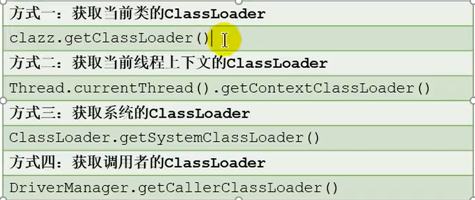

## 5-双亲委派机制

Java虚拟机对class文件采用的是按需加载的方式,也就是说当需要使用该类时才会将它的class文件加载到内存生成class对象。而且加载某个类的class文件时,Java虚拟机采用的是双亲委派模式,即把请求交由父类处理,它是一种任务委派模式。

### 工作原理

1) 如果一个类加载器收到了类加载请求,它并不会自己先去加载,而是把这个请求委托给父类的加载器去执
2) 如果父类加载器还存在其父类加载器,则进一步向上委托,依次递归请求最终将到达顶层的启动类加载器
3) 如果父类加载器可以完成类加载任务,就成功返回,倘若父类加载器无法完成此加载任务,子加载器才会尝试自己去加载,这就是双亲委派模式

例一：

```java
package java.lang;

/**
 * @author shkstart
 * @create 2020 上午 11:40
 */

public class String {
    //
    static{
        System.out.println("我是自定义的String类的静态代码块");
    }
    //错误: 在类 java.lang.String 中找不到 main 方法
    public static void main(String[] args) {
        System.out.println("hello,String");
    }
}

//报错
//错误: 在类 java.lang.String 中找不到 main 方法, 请将 main 方法定义为:
//   public static void main(String[] args)
//否则 JavaFX 应用程序类必须扩展javafx.application.Application
```

例二：

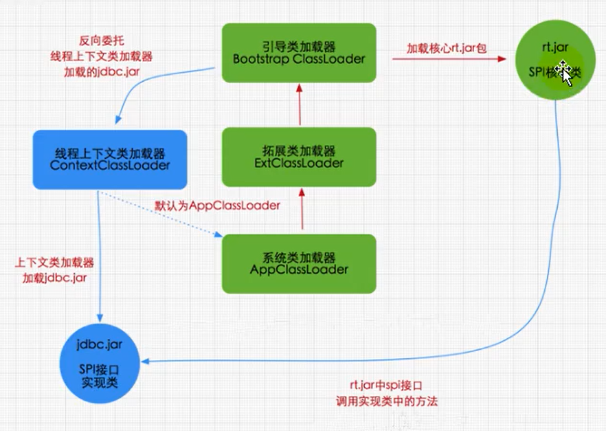

### 优势

避免类的重复加载

保护程序安全,防止核心API被随意篡改 自定义类:java.1ang. string 自定义类:java.1ang. Shkstart

### 沙箱安全机制

自定义 string类,但是在加载自定义 string类的时候会率先使用引导类加载器加载,而导类加载器在加载的过程中会先加载jdk自带的文件rt.jar包中java\ lang\String.c1ass),报错信息说没有main方法,就是因为加载的是rt.jar包中的 String类。这样可以保证对java核心源代码的保护,这就是沙箱安全机制。

## 6-其他

在JVM中表示两个 class对象是否为同一个类存在两个必要条件:
>类的完整类名必须一致,包括包名。
>加载这个类的C1 assloader(指Classloader实例对象)必须相同。

### 对加载器的引用

JWM必须知道一个类型是由启动加载器加载的还是由用户类加载器加载的Ⅰ如果一·个类型是由用户类加载器加载的,那么JM会将这个类加载器的一个引用作为类型信息的一部分保存在方法区中。当解析一个类型到另一个类型的引用的时候,JW需要保证这两个类型的类加载器是相同的。

### 类的主动使用和被动使用

主动使用,又分为七种情况:

* 创建类的实例
* 访问某个类或接口的静态变量,或者对该静态变量赋值
* 调用类的静态方法
* 反射(比如:C1ass. forName(com. atguigu.Test〃))
* 初始化一个类的子类
* Java虚拟机启动时被标明为启动类的类
* JDK7开始提供的动态语言支持:
* java.1ang. invoke. Methodhandle实例的解析结果ree getstatic、 REE putstatic、 ReF invokestatic句柄对应的类没有初始化,则初始化

除了以上七种情况,其他使用Java类的方式都被看作是对类的被动使用,都不会导致类的初始化。

# 3-运行时数据区概述及线程

## 1-概述

经典布局

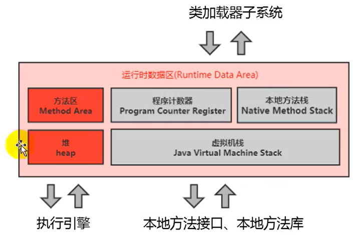

内存是非常重要的系统资源,是硬盘和CpU的中间仓库及桥梁,承载着操作系统和应用程序的实时运行。JⅧM内存布局规定了Java在运行过程中内存申请、分配、管理的策略,保证了JⅥ的高效稳定运行。**不同的JVM对于内存的划分方式和管理机制存在着部分差异**。结合JⅥM虚拟机规范,来探讨一下经典的JM內存布局。

灰色的为单独线程私有的,红色的为多个线程共享的。即
每个线程:独立包括程序计数器、栈、本地栈（随线程开始和结束而创建销毁）
线程间共享:堆、堆外内存(永久代或元空间、代码缓存（随虚拟机的启动而创建，退出而销毁）

## 2-线程

线程是一个程序里的运行单元。JVM允许一个应用有多个线程并行V的执行。

在 Hotspot J里,每个线程都与操作系统的本地线程直接映射。当一个Java线程准备好执行以后,此时一个操作系统的本地线程也同时创建。Java线程执行终止后,本地线程也会回收。

操作系统负责所有线程的安排调度到任何一个可用的CPU上。一旦本地线程初始化成功,它就会调用Java线程中的run()方法。

**JVM系统线程**

* 如果你使用 jconsole或者是任何一个调试工具,都能看到在后台有许多线程
  在运行。这些后台线程不包括调用 public static void main( string[的main线程以及所有这个main线程自己创建的线程。
* 这些主要的后台系统线程在 Hotspot JVM里主要是以下几个
  * 虚拟机线程:这种线程的操作是需要JM达到安全点才会出现。这些操作必须在不
    同的线程中发生的原因是他们都需要W达到安全点,这样堆才不会变化,这种线
    程的执行类型包括〃stop-the- world"的垃圾收集,线程栈收集,线程挂起以及
    偏向锁撤销
  * 周期任务线程:这种线程是时间周期事件的体现(比如中断),他们一般用于周期性
    操作的调度执行
  * Gc线程:这种线程对在JVM里不同种类的垃圾收集行为提供了支持。
  * 编译线程:这种线程在运行时会将字节码编译成到本地代码。
  * 信号调度线程:这种线程接收信号并发送给JM,在它内部通过调用适当的方法进
    行处理。

# 4-程序计数器（PC寄存器）

## 1-Program Counter Register 介绍

JVM中的程序计数寄存器( Program Counter Register)中, Register的命名源于CPU的寄存器,寄存器存储指令相关的现场信息。CPU只有把数据装馘到寄存器才能够运行。

这里,并非是广义上所指的物理寄存器,或许将其翻译为PC计数器(或指令计数器)会更加贴切(也称为程序钩子),并且也不容易引起一些不必要的误会。JM中的PC寄存器是对物理pC寄存器的一种抽象模拟

作用：PC寄存器用来存储指向下一条指令的地址,也即将要执行的指令代码。执行引擎读取下一条指令。

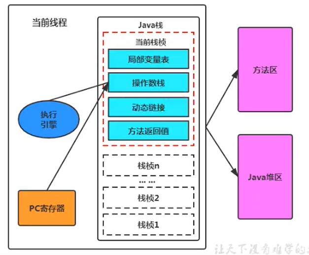

它是一块很小的内存空间,几乎可以忽略不记。也是运行速度最快的存储区域。

在JVM规范中,每个线程都有它自己的程序计数器,是线程私有的,生命周期与线程的生命周期保持一致。

任何时间一个线程都只有一个方法在执行,也就是所谓的当前方法。程序计数器会存储当前线程正在执行的Java方法的JVM指令地址:;或者,如果是在执行 native方法,则是未指定值( undefined)。

它是程序控制流的指示器,分支、循环、跳转、异常处理、线程恢复等基础功能都需要依赖这个计数器来完成。

节码解释器工作时就是通过改变这个计数器的值来选取下一条需要执行的字节码指令。

它是唯一一个在Java虚拟机规范中没有规定任何 Outotmemoryerror情况的区域。

## 2-举例说明

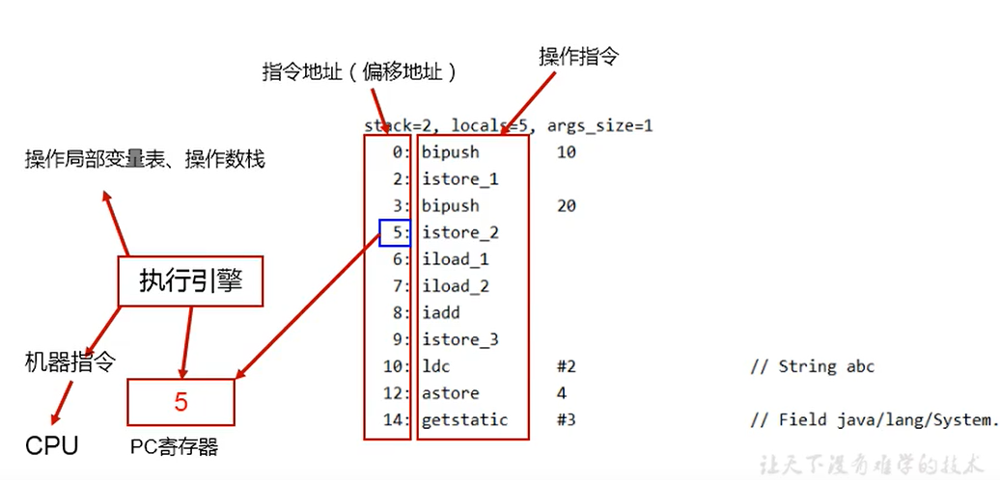

## 3-两个常见问题

1. **使用PC寄存器存储字节码指令地址有什么用呢?**
   **为什么使用PC寄存器记录当前线程的执行地址呢?**

因为CpU需要不停的切换各个线程,这时候切换回来以后,就得知道接着从哪开始继续执行
JVM的字节码解释器就需要通过改变PC寄存器的值来明确下一条应该执行什么样的字节码指令。

2. **PC寄存器为什么会被设定为线程私有?**

我们都知道所谓的多线程在一个特定的时间段内只会执行其中某一个线程的方法,CPU会不停地做任务切换,这样必然导致经常中断或恢复,如何保证分毫无差呢?为了能够准确地记录各个线程正在执行的当前字节码指令地址,最好的办法自然是为每一个线程都分配一个PC寄存器,这样一来各个线程之间便可以进行独立计算,从而不会出现相互干扰的情况。

### cpu时间片

CPU时间片即CPU分配给各个程序的时间,每个线程被分配一个时间段,称作它的时间片。
在宏观上:我们可以同时打开多个应用程序,每个程序并行不悖,同时运行
但在微观上:由于只有一个CPU,一次只能处理程序要求的一部分如何处理公平,一种方法就是引入时间片,每个程序轮流执行。

由于CPU时间片轮限制,众多线程在拼发执行过程中,任何一个确定的时刻,一个处理器或者多核处理器中的一个内核,只会执行某个线程中的一条指令这样必然导致经常中断或恢复,如何保证分毫无差呢?每个线程在创建后,都会产生自己的程序计数器和栈帧,程序计数器在各个线程之间互不影响

# 5-虚拟机栈

## 1-虚拟机栈概述

### 出现背景

由于跨平台性的设计,Java的指令都是根据栈来设计的。不同平台CPU架构不同,所以不能设计为基于寄存器的。
**优点是跨平台,指令集小,编译器容易实现,缺点是性能下降,实现同样的功能需要更多的指令。**

### 内存中的栈和堆

栈是运行时的单位,而堆是存储的单位。
即:栈解决程序的运行问题,即程序如何执行,或者说如何处理数据。堆解决的是数据存储的问题,即数据怎么放、放在哪儿

### 虚拟机栈的基本内容

* Java虚拟机栈是什么?
  Java虚拟机栈( Java virtual Machine stack),早期也叫Java栈。
  每个线程在创建时都会创建一个虚拟机栈,其内部保存一个个的栈帧( Stack frame),对应着一次次的Java方法调用。

  是线程私有的

* 生命周期
  生命周期和线程一致。
* 作用
  主管Java程序的运行,它保存方法的局部变量、部分结果,并参与方法的
  调用和返回。
* 栈的特点
  * 栈是一种快速有效的分配存储方武,访问速度仅次于程序计数器。
    JVM直接对Java栈的操作只有两个
    * 每个方法执行,伴随着进栈(入栈、压栈)
    * 执行结束后的出栈工作
  * 对于栈来说不存在垃圾回收问题,存在内存溢出问题

### 栈中可能出现的异常

Java虚拟机规范允许Java栈的大小是动态的或者是固定不变的

如果Java虚拟机采用固定大小的虚拟机栈，如果线程请求分配的栈容量超过Java虚拟机栈允许的最大容量,Java虚拟机将会抛出一个StackoverflowError异常。

如果Java虚拟机栈可以动态扩展,并且在尝试扩展的时候无法中请到足够的内存,或者在**创建新的线程时没有足够的内存去创建对应的虚拟机栈,**那Java虚拟机将会抛出一个 OutofmemoryError异常。

### 设置栈内存大小

我们可以使用参数-Xss选项来设置线程的最大栈空间,栈的大小直接决定了函数调用的最大可达深度


## 2-栈的存储单位

### 栈中存储栈帧

每个线程都有自己的栈,栈中的数据都是以栈帧( Stack Frame)的格式存在。
在这个线程上正在执行的**每个方法都各自对应一个栈帧**( Stack frame)
栈帧是一个内存区块,是一个数据集,维系着方法执行过程中的各种数据信息。

###　栈的运行原理

JVM直接对Java栈的操作只有两个,就是对栈帧的压栈和岀栈,遵循“先进后出”/“后进先出”原则。

在一条活动线程中,一个时间点上,只会有一个活动的栈帧。即只有当前正在执行的方法的栈帧(栈顶栈帧)是有效的,这个栈帧被称为当前栈帧( Current frame),与当前栈帧相对应的方法就是当前方法( CurrentMethod),定义这个方法的类就是当前类( Current Class)   

执行引擎运行的所有字节码指令只针对当前栈帧进行操作。

如果在该方法中调用了其他方法,对应的新的栈帧会被创建出来,放在栈的顶端,成为新的当前帧。


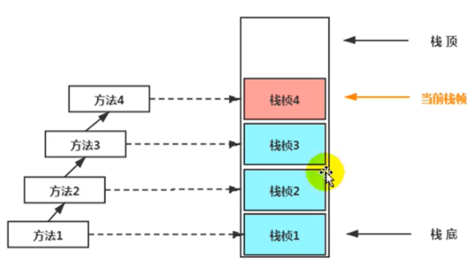

如果当前方法调用了其他方法,方法返回之所,当前栈帧会传回此方法的执行结果
给前一个栈帧,接着,虚拟机会丢弃当前栈唢,使得前一个栈帧重新成为当前栈帧

Java方法有两种返回函数的方式,一种是正常的函数返回,使用 return指令;另
外一种是抛岀异常。不管使用哪种方式,都会导致栈帧被弹出。

### 栈帧中存储着什么

* **局部变量表(Loca1 Variables)**
* **操作数栈( Operand stack)(或表达式栈)**
* 动态链接( Dynamic Linking)(或指向运行时常量池的方法引用
* 方法返回地址( Return address)(或方法正常退出或者异常退出的定义)
* 一些附加信息

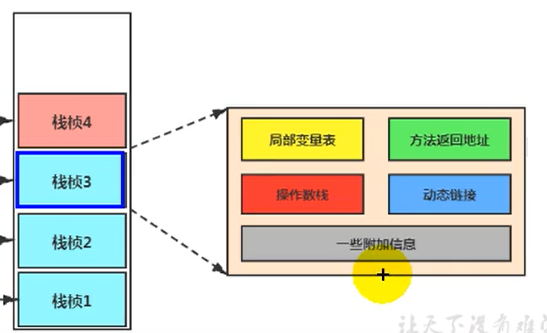

## 3-局部变量表

局部变量表也被称之为局部变量数组或本地变量表

定义为一个数字数组,主要用于存储方法参数和定义在方法体内的局部变量这些数据类型包括各类**基本数据类型、对象引用( reference),以及returnAddress类型。**

由于局部变量表是建立在线程的栈上,是线程的私有数据,因此**不存在数据安全问题**

**局部变量表所需的容量大小是在编译期确定下来的,**并保存在方法的Code属性的 maximum local variables数据项中。在方法运行期间是不会改变局部变量表的大小的


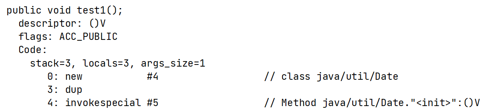

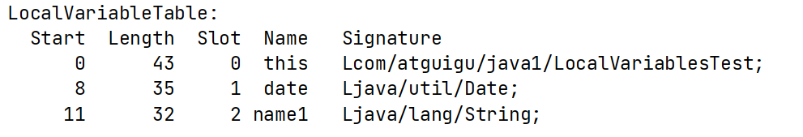

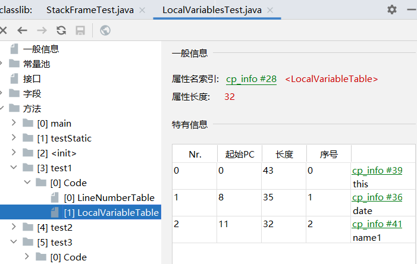

方法嵌套调用的次数由栈的大小决定。一般来说,栈越大,方法嵌套调用次数越多。对一个函数而言,它的参数和局部变量越多,使得局部变量表膨胀,它的栈帧就越大,以满足方法调用所需传递的信息增大的需求。进而函数调用就会占用更多的栈空间,导致其嵌套调用次数就会减少

**局部变量表中的变量只在当前方法调用中有效**。在方法执行时,虚拟机通过使用局部变量表完成参数值到参数变量列表的传递过程。当方法调用结束后,随着方法栈帧的销毁,局部变量表也会随之销毁。

### 关于Slot

参数值的存放总是在局部变量数组的 index0开始,到数组长度-1的索引结束

局部变量表,最基本的存储单元是slot(变量槽)

局部变量表中存放编译期可知的各种基本数据类型(8种),引用类型( reference), returnaddress类型

在局部变量表里,32位以内的类型只占用一个slot(包括returnAddress类型),64位的类型(long和double)占用两个slot。byte、 short、char在存储前被转换为int, boolean也被转换为int,0表示false,非0表示true。long和double则占据两个slot。‘

JVM为局部变量表中的每个Slot分配一个访问索引，通过索引访问到局部变量表中的局部变量值（64bit的局部变量只需要前一个索引）

当前帧是构造方法或实例方法创建，则该对象引用this会存放在index为0的slot处

### 静态变量与局部变量的对比

按照在类中声明的位置分类：

* 成员变量：使用前默认初始化
  * 类变量：链接的准备阶段默认赋值，初始化阶段显式赋值
  * 实例变量：随对象创建在堆空间分配实例变量空间，并默认赋值
* 局部变量：必须显式赋值

> 补充说明：
>
> 在栈帧中,与性能调优关系最为密切的部分就是前面提到的局部变量表。在方法执行时,虚拟机使用局部变量表完成方法的传递。
> **局部变量表中的变量也是重要的垃圾回收根节点,只要被局部变量表中直接或间接引用的对象都不会被回收。**

## 4-操作数栈(Operand Stack)

> 栈：可以使用**数组**或链表（真实数据结构）来实现

###　概念

后进先出的操作数栈（表达式栈）

**操作数栈，在方法的执行过程中，根据字节码指令，往栈中写入数据或提取数据，即入栈、出栈**

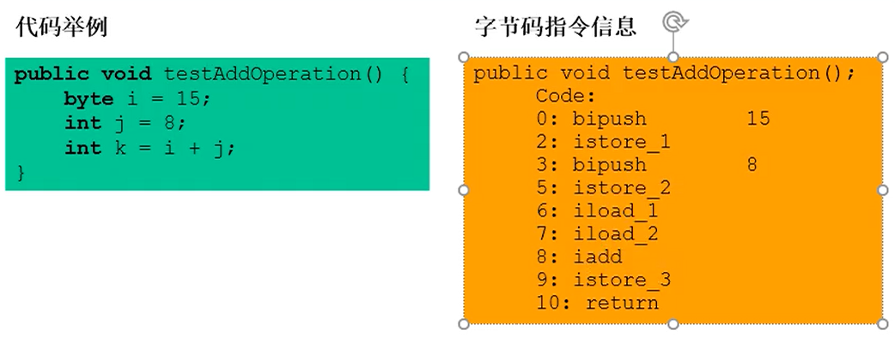

**主要用于保存计算过程的中间结果，同时作为计算过程的变量临时的存储空间。**

方法刚开始执行，一个新的栈帧被创建出来，丰富的操作数栈也为空

拥有一个明确的栈深度用于存储数值，在编译期定义好，Code属性中max_stack的值

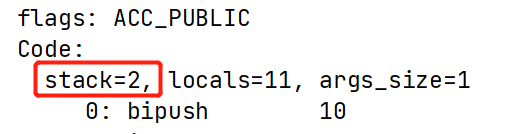

栈中任何一个元素为Java数据类型32bit一个栈单位 64bit两个栈单位

如果被调用的方法带有返回值的话**,其返回值将会被压入当前栈帧的操作数栈中,并更新PC寄存器中下一条需要执行的字节码指令。**

操作数栈中元素的数据类型必须与字节码指令的序列严格匹配,这由编译器在编译器期间进行验证,同时在类加载过程中的类检验阶段的数据流分析阶段要再次验证。

另外,我们说Java虚拟机的解释引擎是**基于栈的执行引擎,其中的栈指的就是操作数栈。**

## 5-代码追踪

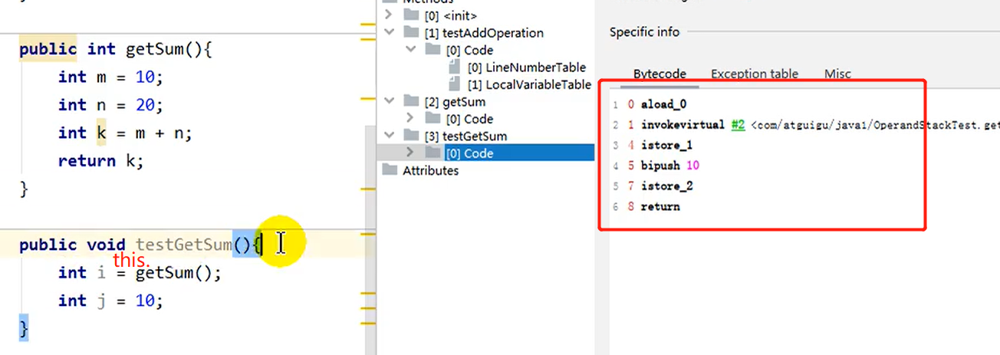

aload_0：从当前栈帧的局部变量表中获取this对象到操作数栈；invokevirtual：调用实例方法getSum();
istore_1:将getSum()返回值保存在局部变量表中。

## 6-栈顶缓存技术(Top Of Stack Caching)

前面提过,基于栈式架构的虚拟机所使用的零地址指令更加紧凑,但完
成一项操作的时候必然需要使用更多的入栈和出栈指令,这同时也就意味着将需要更多的指令分派( instruction dispatch)次数和内存
读/写次数。
由于操作数是存储在内存中的,因此频繁地执行内存读/写操作必然会影响执行速度。为了解决这个问题, otspot的设计者们提出了顶
缓存(ToS,T。p-of- Stack Cashing)技术,**将栈顶元素全部缓存在物理cPU的寄存器中,以此降低对内存的读/写次数,提升执行引擎的**
**执行效率。**

## 7-动态链接(Dynamic Linking)

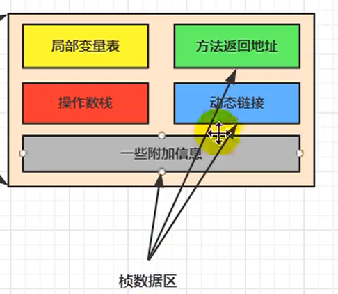

### 指向运行时常量池的方法引用

每一个栈帧内部都包含一个指向**运行时常量池**中该栈帧所属方法的引用。目的是为了支持当前方法代码的能够实现动态链接。比如：invokedynamic指令

在Java源文件被编译到字节码文件中时,所有的变量和方法引用都作
为符号引用( Symbolic Reference)保存在class文件的常量池里。
比如:描述一个方法调用了另外的其他方法时,就是通过常量池中指向
方法的符号引用来表示的,那么**动态链接的作用就是为了将这些符号引用转换为调用方法的直接引用。**

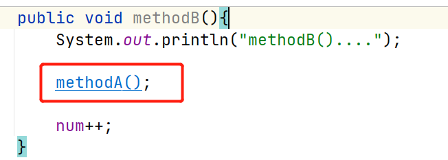


> 为什么需要常量池呢?
>
> 常量池的作用,就是为了提供一些符号和常量,便于指令的识别。
>
> 由于会有多个实例调用方法，通过动态链接指向常量池的方法引用就可以可以节省栈帧的空间

