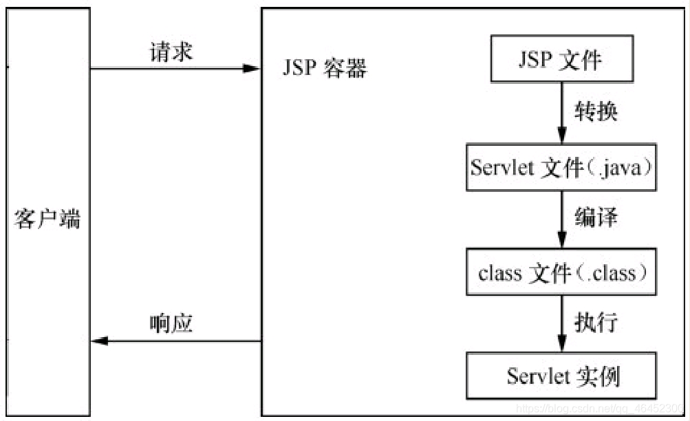
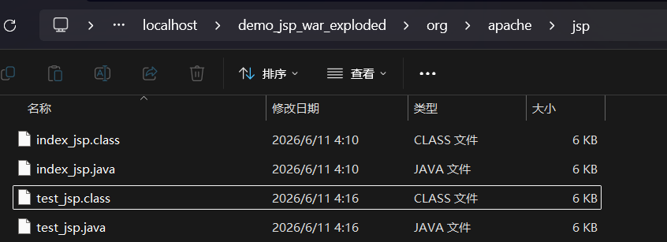

## 什么是 JSP

JSP 全称 Java Server Pages，是一种动态网页开发技术。

它是建立在 Servlet 规范之上的动态网页开发技术。在 JSP 文件中，HTML 代码与 Java 代码共同存在，使用 JSP 标签在 HTML 网页中插入 Java 代码，HTML 代码用来实现网页中静态内容的显示， Java 代码用来实现网页中动态内容的显示。

为了与传统 HTML 有所区别，JSP 文件的扩展名为 ．jsp。

## JSP 的优势

- 跨平台：JSP 是基于 Java 语言的，所以也是跨平台的，可以应用于不同的系统。当从一个平台移植到另一个平台时，JSP 和 JavaBean 的代码并不需要重新编译，这是因为 Java 的字节码是与平台无关的，这也应验了 Java 语言“一次编译，到处运行”的特点。
- 业务代码相分离：在使用 JSP 技术开发 Web 应用时，可以将界面的开发与应用程序的开发分离开。开发人员使用 HTML 来设计界面，使用 JSP 标签和脚本来动态生成页面上的内容。在服务器端，JSP 引擎（或容器，本书中指 Tomcat）负责解析 JSP 标签和脚本程序，生成所请求的内容，并将执行结果以 HTML 页面的形式返回到浏览器。
- 组件重用：JSP 中可以使用 JavaBean 编写业务组件，也就是使用一个 JavaBean 类封装业务处理代码或者作为一个数据存储模型，在 JSP 页面中，甚至在整个项目中，都可以重复使用这个 JavaBean。同时，JavaBean 也可以应用到其他 Java 应用程序中。
- 预编译：用户第 1 次通过浏览器访问 JSP 页面时，服务器将对 JSP 页面代码进行编译，并且仅执行一次编译。编译好的代码将被保存，在用户下一次访问时，会直接执行编译好的代码。这样不仅节约了服务器的 CPU 资源，还大大地提升了客户端的访问速度。

## 对比 CGI 程序

JSP 程序与 CGI 程序有着相似的功能。

CGI 即 **Common Gateway Interface**，译作“**通用网关接口**”。

1. Web 服务器在接收到用户浏览器的 HTTP 请求后，会将各类 HTTP 请求中的信息以 **环境变量** 的方式写入 OS，同时调用 CGI 程序。
2. CGI 程序会通过语言本身库函数来获取环境变量，从而获得数据输入，或是通过标准输入（stdin）获取数据。
3. CGI 向标准输出去写入数据，即可构造出数据（比如 HTML 页面）返回给浏览器

```c++
#include <iostream>
using namespace std;
 
int main ()
{
    
   cout << "Content-type:text/html\r\n\r\n";
   cout << "<html>\n";
   cout << "<head>\n";
   cout << "<title>Hello World - 第一个 CGI 程序</title>\n";
   cout << "</head>\n";
   cout << "<body>\n";
   cout << "<h2>Hello World! 这是我的第一个 CGI 程序</h2>\n";
   cout << "</body>\n";
   cout << "</html>\n";
   
   return 0;
}
```

而 JSP 文件编译成一个 Java class 文件，其代码的格式就与 CGI 的编程规范相似。

但和 CGI 程序相比，JSP 程序有如下优势：

- 性能更加优越，因为 JSP 可以直接在 HTML 网页中动态嵌入元素而不需要单独引用 CGI 文件。
- 服务器调用的是已经编译好的 JSP 文件，而不像 CGI/Perl 那样必须先载入解释器和目标脚本。
- JSP 基于 Java Servlet API，因此，JSP 拥有各种强大的企业级 Java API，包括 JDBC，JNDI，EJB，JAXP 等等。
- JSP 页面可以与处理业务逻辑的 Servlet 一起使用，这种模式被 Java servlet 模板引擎所支持。

## 和 Servlet 的关系

- JSP 文件在容器中会转换成 Servlet 执行，JSP 属于对 Servlet 的一种高级封装，本质还是 Servlet。
- JSP 是简化的 Servlet 设计，在 HTML 标签中嵌套 Java 代码，用以高效开发 Web 应用的动态网页。有些 Servlet 会通过打印语句输出 HTML 标签来在浏览器中显示页面，由于设置 html 响应体需要大量 `response.getWrite().println()` 逐行打印，JSP 便可以高效的代替这些显示页面的 Servlet，同时 JSP 直接在 HTML 页面中编写，有利于美化页面。
- 二者可以形成分工，JSP 作为请求发起页面和请求结束页面，Servlet 一般用于请求中处理数据环节。

## JSP 运行原理

JSP 的工作模式是请求/响应模式，客户端首先发出 HTTP 请求，JSP 程序收到请求后进行处理并返回处理结果。在一个 JSP 文件第 1 次被请求时，JSP 引擎（容器）把该 JSP 文件转换成为一个 Servlet，而这个 **引擎本身也是一个 Servlet**。



JSP 的具体运行过程：

1. 客户端发出请求，请求访问 JSP 文件。

2. JSP 容器先将 JSP 文件转换成一个 Java 源文件(Java Servlet 源程序)，在转换过程中，如果发现 JSP 文件中存在任何语法错误，则中断转换过程，并向服务端和客户端返回出错信息。

3. 如果转换成功，则 JSP 容器会将生成的 Java 源文件编译成相应的字节码文件 `*.class`。该 class 文件就是一个 Servlet，Servlet 容器会像处理其他 Servlet 一样处理它。

   

4. 由 Servlet 容器加载转换后的 Servlet 类(class 文件)创建一个该 Servlet(JSP 页面的转换结果)的实例，并执行 Servlet 的 jspInit()方法。jsInit()方法在 Servlet 的整个生命周期中只会执行一次。

5. 执行 `jspService()` 方法处理客户端的请求。对于每一个请求，JSP 容器都会创建一个新的线程处理它。如果多个客户端同时请求该 JSP 文件，则 JSP 容器会创建多个线程，使每一个客户端请求都对应一个线程。

   - 如果 JSP 文件被修改了，则服务器将根据设置决定是否对该文件重新进行编译，如果需要重新编译，则使用重新编译后的结果取代内存中的 Servlet，并继续上述处理过程。
   - 如果系统出现资源不足等问题，JSP 容器可能会以某种不确定的方式将 Servlet 从内存中移除，发生这种情况的时候，首先会调用 `jspDestroy()`方法，然后 Servlet 实例会被作为“垃圾”进行处理。

6. 当请求处理完成后，响应对象由JSP容器接收，并将HTML格式的响应信息发送回客户端。

编译后的 Servlet 类示例代码：

```java
public final class index_jsp extends org.apache.jasper.runtime.HttpJspBase
    implements org.apache.jasper.runtime.JspSourceDependent,
                 org.apache.jasper.runtime.JspSourceImports,
                 org.apache.jasper.runtime.JspSourceDirectives {

  private static final jakarta.servlet.jsp.JspFactory _jspxFactory =
          jakarta.servlet.jsp.JspFactory.getDefaultFactory();

  private static java.util.Map<java.lang.String,java.lang.Long> _jspx_dependants;

  private static final java.util.Set<java.lang.String> _jspx_imports_packages;

  private static final java.util.Set<java.lang.String> _jspx_imports_classes;

  static {
    _jspx_imports_packages = new java.util.LinkedHashSet<>(4);
    _jspx_imports_packages.add("jakarta.servlet");
    _jspx_imports_packages.add("jakarta.servlet.http");
    _jspx_imports_packages.add("jakarta.servlet.jsp");
    _jspx_imports_classes = null;
  }

  private volatile jakarta.el.ExpressionFactory _el_expressionfactory;
  private volatile org.apache.tomcat.InstanceManager _jsp_instancemanager;

  public java.util.Map<java.lang.String,java.lang.Long> getDependants() {
    return _jspx_dependants;
  }

  public java.util.Set<java.lang.String> getPackageImports() {
    return _jspx_imports_packages;
  }

  public java.util.Set<java.lang.String> getClassImports() {
    return _jspx_imports_classes;
  }

  public boolean getErrorOnELNotFound() {
    return false;
  }

  public jakarta.el.ExpressionFactory _jsp_getExpressionFactory() {
    // ...
  }

  public void _jspInit() {
  }

  public void _jspDestroy() {
  }

  public void _jspService(final jakarta.servlet.http.HttpServletRequest request, final jakarta.servlet.http.HttpServletResponse response)
      throws java.io.IOException, jakarta.servlet.ServletException {
 	  // ...
    }

    final jakarta.servlet.jsp.PageContext pageContext;
    jakarta.servlet.http.HttpSession session = null;
    final jakarta.servlet.ServletContext application;
    final jakarta.servlet.ServletConfig config;
    jakarta.servlet.jsp.JspWriter out = null;
    final java.lang.Object page = this;
    jakarta.servlet.jsp.JspWriter _jspx_out = null;
    jakarta.servlet.jsp.PageContext _jspx_page_context = null;


    try {
      response.setContentType("text/html; charset=UTF-8");
      pageContext = _jspxFactory.getPageContext(this, request, response,
      			null, true, 8192, true);
      _jspx_page_context = pageContext;
      application = pageContext.getServletContext();
      config = pageContext.getServletConfig();
      session = pageContext.getSession();
      out = pageContext.getOut();
      _jspx_out = out;

      out.write("\n");
      out.write("<!DOCTYPE html>\n");
      out.write("<html>\n");
      out.write("<head>\n");
      out.write("    <title>JSP - Hello World</title>\n");
      out.write("</head>\n");
      out.write("<body>\n");
      out.write("<h1>");
      out.print( "Hello World!" );
      out.write("\n");
      out.write("</h1>\n");
      out.write("<br/>\n");
      out.write("<a href=\"hello-servlet\">Hello Servlet</a>\n");
      out.write("</body>\n");
      out.write("</html>");
    } catch (java.lang.Throwable t) {
      if (!(t instanceof jakarta.servlet.jsp.SkipPageException)){
        out = _jspx_out;
        if (out != null && out.getBufferSize() != 0)
          try {
            if (response.isCommitted()) {
              out.flush();
            } else {
              out.clearBuffer();
            }
          } catch (java.io.IOException e) {}
        if (_jspx_page_context != null) _jspx_page_context.handlePageException(t);
        else throw new ServletException(t);
      }
    } finally {
      _jspxFactory.releasePageContext(_jspx_page_context);
    }
  }
}

```

