# 技术栈介绍

前端视图基础:

* HTML：主要用于网页主体结构搭建
* CSS：主要用于页面美化
* JavaScript：主要用于页面元素动态处理


后端运行环境：Tomcat、JavaEE+MVC（主要讲解 Servlet）

进阶：最新语法要求 ES6、前端运行环境 Nodejs+npm、项目构建工具 vite、完整前端框架 Vue3、Router3、axios 等


# HTML

[HTML 参考](../../前端/HTML/index.md)

# CSS

[CSS 参考](../../前端/CSS/index.md)

# JavaScript

[JavaScript 参考](../../前端/JavaScript/index.md)

# XML

[XML 参考](../../前端/XML/index.md)

# Tomcat

## Web 服务器

一种运行在物理服务器上的软件，用于处理 HTTP 协议请求。它能接收客户端（如浏览器）发来的 HTTP 请求，并返回静态内容（如 HTML、CSS、图片等）。

常见的 Java Web 服务器：Tomcat、Jetty、JBoss。

## Servlet

Servlet 本质是一个接口，Java 并没有对它做任何实现，仅提供了 Servlet 这么一个规范，它作为一个抽象层，定义了一个最简单的请求-响应处理模式，Servlet 可以动态生成响应内容（如 JSON、HTML 页面），处理业务逻辑、数据库交互等。

## Tomcat

Tomcat 是 Apache 软件基金会一个开源、免费的 Web 服务器。它实现了 Java Servlet、JSP、WebSocket 等规范，能够运行 Java Web 应用。

### Catalina

Tomcat 是 ⼀ 个由 ⼀ 系列可配置（conf/server.xml）的组件构成的 Web 容器，⽽Catalina 是 Tomcat 的 servlet 容器。可以认为整个 Tomcat 就是 ⼀ 个 Catalina 实例，Tomcat 负责解析 Tomcat 的配置 ⽂ 件（server.xml）, 以此来创建服务器 Server 组件并进 ⾏ 管理。

Tomcat 启动的时候会初始化 这个实例 Catalina 实例通过加载 server.xml 完成其他实例的创建，创建并管理 ⼀ 个 Server，Server 创建并管理多个服务，每个服务 ⼜ 可以有多个 Connector 和 ⼀ 个 Container。

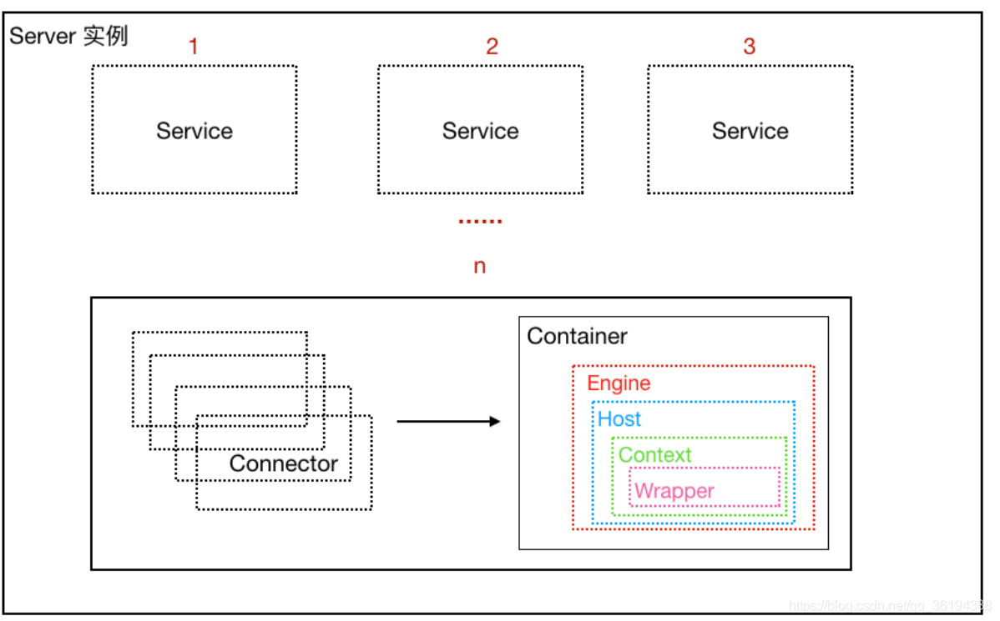

### Server

服务器表示整个 Catalina Servlet 容器以及其它组件，负责组装并启动 Servlaet 引擎, Tomcat 连接器。Server 通过实现 Lifecycle 接 ⼝，提供了 ⼀ 种优雅的启动和关闭整个系统的 ⽅ 式。

### Service

服务，是 Server 内部的组件，⼀ 个 Server 包含多个 Service。Service 将若 ⼲ 个 Connector 组件绑定到 ⼀ 个 Container。

### Container

容器，负责处理 ⽤ 户的 servlet 请求，并返回对象给 web⽤ 户的模块

Container 组件下有 ⼏ 种具体的组件，分别是 Engine、Host、Context 和 Wrapper。这 4 种组件（容器）是 ⽗⼦ 关系。Tomcat 通过 ⼀ 种分层的架构 ，使得 Servlet 容器具有很好的灵活性。


## Tomcat 安装

下载：[Apache Tomcat® - Welcome!](https://tomcat.apache.org/)

配置环境变量： `JAVA_HOME`


启动 `bin/startup.bat`

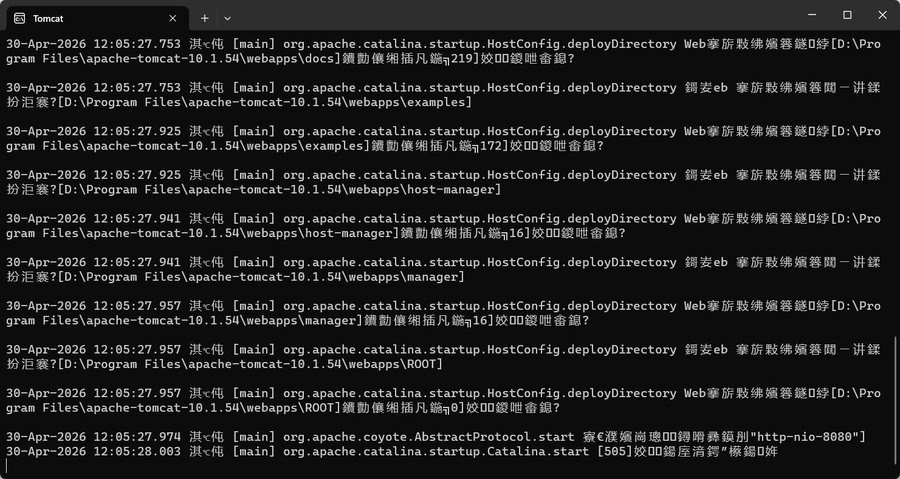

验证 http://localhost: 8080


乱码问题：Windows 命令行窗口在中文语言地区通常为 GBK 编码

方法一：修改 Tomcat 日志编码为 GBK，修改 `conf/logging.properties` 配置

```properties
java.util.logging.ConsoleHandler.encoding = GBK
```

方法二：临时修改命令行编码为 UTF-8

```shell
# 命令行中执行以下命令，编码会临时变为 UTF-8，关闭窗口后即失效
chcp 65001
```

方法三：永久修改

## Tomcat 目录

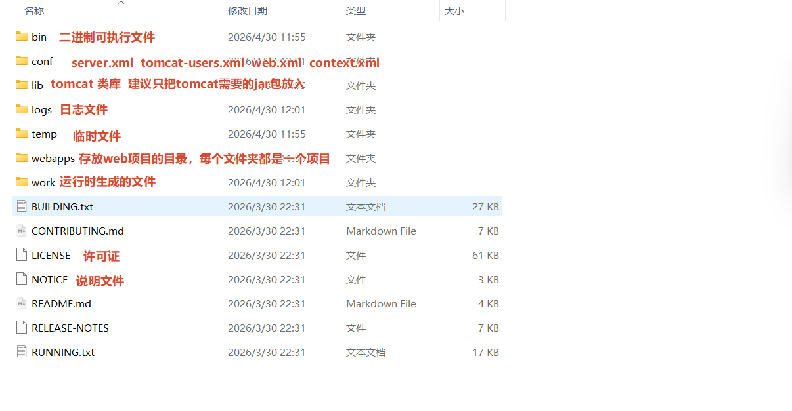

## Web 项目结构


* examples 应用根目录
  * static，一般存放 css、js、img 等静态资源
  * WEB-INF ，受保护的资源目录，浏览器无法通过 URL 直接访问的目录。
    * classes，由 java 源码生成的源代码、配置文件的目录。字节码根路径
    * lib，项目依赖的 jar 编译后出现的目录
    * web.xml， web 项目的基本配置文件
  * index.html，作为默认欢迎页


## Tomcat 配置

### conf/server.xml

Server 实例：即一个 JVM，它监听在 8005 端口以接收 shutdown 命令。同物理机中，多个 Server 实例需要配置它们使用不同的端口

```xml
<Server port="8005" shutdown="SHUTDOWN">
```

Service ： 主要用于关联一个引擎和与此引擎相关的连接器

```xml
<Service name="Catalina">
```

Connector ：连接器，一个引擎可以有一个或多个连接器。`conf/server.xml` 文件中， `<Connector>` 标签，可以修改监听端口、连接器使用协议等。位于 Service  中。

```xml
<Connector port="8080" protocol="HTTP/1.1"
               connectionTimeout="20000"
               redirectPort="8443"
               maxParameterCount="1000"
               />
```

Engine ： Servlet 处理器的一个实例，即 Servlet 引擎，位于 Service  中

```xml
<Engine name="Catalina" defaultHost="localhost">
```

Host：用于接收请求并进行相应处理的虚拟主机。Tomcat 允许单台服务器通过不同域名承载多个独立应用。位于 Engine 中

Context ：代表指定一个 Web 应用，每个 Web 应用都是一个 WAR 文件，或文件的目录；没有配置 Context 属性，则该虚拟主机默认支持运行多个项目。

* path：即浏览器访问项目的访问路径（应用上下文）。
* docBase：相应的 Web 应用程序的存放位置；也可以使用相对路径，起始路径为此 Context 所属 Host 中 `appBase` 定义的路径；

```xml
<Host name="localhost" appBase="webapps" unpackWARs="true" autoDeploy="true">
	<Context path="/demo" docBase="D:\demo" />
</Host>
```

### conf/tomcat-user.xml

 首先 ，在 `conf/server.xml` 配置加载 tomcat-user.xml

```xml
<GlobalNamingResources>
    <!-- Editable user database that can also be used by
         UserDatabaseRealm to authenticate users
    -->
    <Resource auth="Container" description="User database that can be updated and saved" factory="org.apache.catalina.users.MemoryUserDatabaseFactory" name="UserDatabase" pathname="conf/tomcat-users.xml" type="org.apache.catalina.UserDatabase"/>
  </GlobalNamingResources>
```

role 元素 和 user 元素 位于 tomcat-user 元素下

```xml
  <role rolename="manager-gui"/>
  <role rolename="manager-status"/>
  <role rolename="manager-script"/>
  <role rolename="manager-jmx"/>

  <user username="gui" password="password" roles="manager-gui"/>    <!--访问HTML界面。-->
  <user username="status" password="password" roles="manager-status"/>    <!--仅访问“服务器状态”页面。-->
  <user username="script" password="password" roles="manager-script "/>    <!--访问本文档中描述的工具友好的纯文本界面以及“服务器状态”页面。-->
  <user username="jmx" password="password" roles="manager-jmx"/>    <!--访问JMX代理接口和“服务器状态”页面。-->
  <user username="both" password="password" roles="manager-status,manager-jmx"/>    <!--仅访问“服务器状态”页面和访问JMX代理接口和“服务器状态”页面。-->

```

添加了角色与用户以后，可以访问默认的虚拟主机管理应用 `host-manager` 和应用管理应用 `manager`

### conf/web.xml

mime-mapping ：记录了返回的文件类型和应该设置的 MIME 类型

servlet：配置了一些默认的 servlet，例如  org.apache.catalina.servlets.DefaultServlet 处理所有其他 servlet 没有映射到的请求，特别用于提供静态资源（HTML、CSS、JS、图片等）和目录列表（如果启用）。

session-config：session-timeout 表示 session 的限制时间，不设置则保持 1 分钟

## Tomcat 项目部署

Web 应用程序：编译好的项目或打包成 war 的项目

存放位置：webapps 或 非 webapps 的其他目录（需配置 `Context  docBase` 属性）

> 除了在 `conf/server.xml` 的集中式配置以外，tomcat 还允许分散式配置 `conf/Catalina/{主机名}/{应用名}.xml`，独立管理而且可以热部署，修改后无需重启，生产环境中能有效避免因修改 `server.xml` 出错而影响整个 Tomcat 运行
>
> 建议 XML 文件的 `Context path` 属性要和文件名保持一致。如果 `Context path` 属性为空则对应文件为 `ROOT.xml`
>
> ```xml
> <!--conf/Catalina/localhost/app.xml-->
> <Context path="/app" docBase="D:\mywebapps\app" />
> ```

## IDEA 开发并通过 Tomcat 部署运行 WEB 项目

关联 Tomcat


方案一：创建 JavaEE 项目（更方便）


方案二：创建空项目或 maven 项目，添加 web 目录框架，

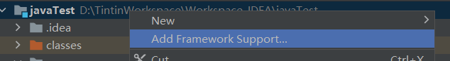


关联对应 web.xml


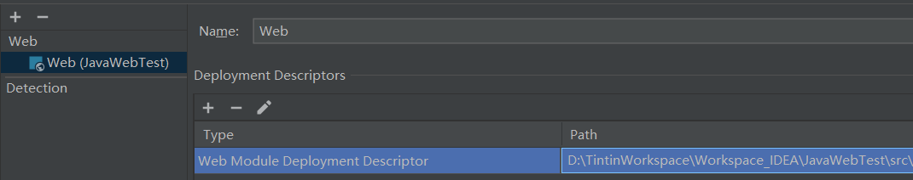

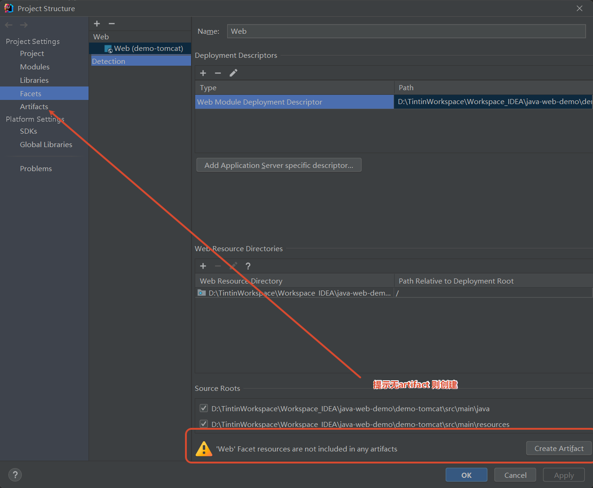

Artifacts 表示某个 module 要如何打包，可以简单地理解为一个 module 有了 Artifacts 就可以部署到应用服务器中了。


编译构建

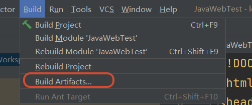

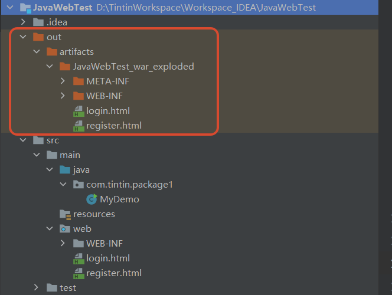

部署运行

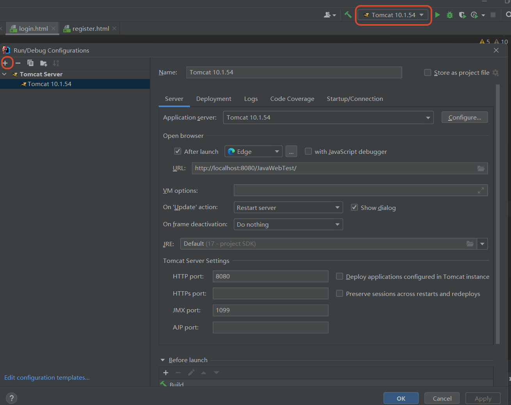


测试 http://localhost: 8080/JavaWebTest/login.html


### IDEA 启动 Tomcat 部署 WEB 项目原理

IDEA 并没有直接进将编译好的项目放入 Tomcat 的 webapps 中；

IDEA 根据关联的 Tomcat，创建了一个 Tomcat 副本（类似，`C:/Users/丁丁/AppData/Local/JetBrains/IntelliJIdea2021.2/tomcat/000d7481-7795-4a8f-b1f4-7c3ac03dabac/conf/`），该副本不是一个完整的 tomcat，副本里只是准备了和当前项目相关的配置文件。IDEA 启动 Tomcat 时，是让本地 Tomcat 程序按照 Tomcat 副本里的配置文件运行；


# HTTP 协议

[HTTP 协议参考](../../计算机基础/计算机网络/index.md#HTTP)

# Servlet

## Servlet 简介

> 静态资源&动态资源
>
> 静态资源：无需程序运行生成的资源，在程序运行之前就有的资源。例如 html、css、图像文件、音频文件、视频文件。
>
> 动态资源：需要程序运行时通过代码生成的的资源，运行前无法确定，运行时动态生成。例如 Servlet、Thymeleaf。

Servlet （server applet）类似于运行在服务端（Tomcat）的 Java 小程序，是 sun 公司提供一套定义 **动态资源规范**；代码层面上 Servlet 就是一个 **接口**。

Servlet 可以用来接收、处理客户端请求、响应给浏览器的动态资源。在整个 Web 应用中，Servlet 主要负责接收处理请求、协同调度功能以及响应数据。我们可以把 Servlet 称为 Web 应用中的 **控制器**。

不是所有的 JAVA 类都能用于处理客户端请求，能处理客户端请求并做出响应的一套技术标准就是 Servlet。

Servlet 是运行在服务端的，所以 Servlet 必须在 WEB 项目中开发且在 Tomcat 这样的服务容器中运行。它们的分工类似于餐厅中的服务员与厨师如下图：

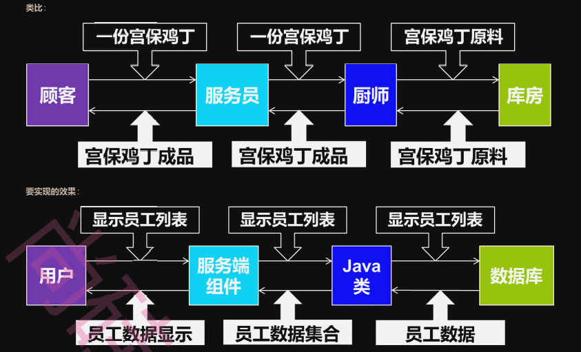

## Tomcat 与 Servlet 的搭配工作原理

1. Tomcat 接收到请求后，会将请求报文的信息转换一个 **HttpServletRequest 对象**，该对象中包含了请求中的请求行、请求头、请求体。
2. Tomcat 同时创建了一个 **HttpServletResponse 对象**，该对象用于承装要响应给客户端的信息，后面该对象会被转换成响应的报文响应行、响应头、响应体
3. 开发者事先创建了一个 Servlet 接口的实现类，主要重写 `service(ServletRequest servletRequest, ServletResponse servletResponse)` 方法，它将负责接收请求对象和处理响应。
   1. Servlet 从 ServletRequest 对象中获取请求的所有信息（参数）
   2. Servlet 根据参数生成要响应给客户端的数据
   3. Servlet 将响应的数据放入 ServletResponse 对象

4. Tomcat 根据请求中的资源路径找到对应的 servlet，将 servlet 实例化，调用 service 方法，同时将 HttpServletRequest 和 HttpServletResponse 对象作为参数传入。

5. 等待 servlet 执行完，从 HttpServletResponse 对象中取出数据，组装成 HTTP 响应报文，发送给客户端。


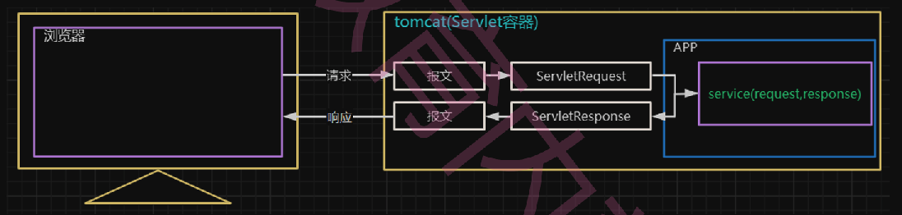

Tomcat + Servlet 架构的核心分工就是 Tomcat 负责接收请求，Servlet 负责处理请求，起到承前启后的作用。

## Servlet 实战

创建页面

```html
<!DOCTYPE html>
<html lang="en">
<head>
    <meta charset="UTF-8">
    <title>Title</title>
</head>
<body>
    <form action="checkUser" method="post">
        用户名：<input type="text" name="username">
        <input type="submit" value="校验"/>
    </form>
</body>
</html>
```

自定义一个类，继承 HttpServlet 类；重写 service 方法，该方法主要就是用于处理用户请求的服务方法。

> 总之要实现 Servlet 接口，而 HttpServlet 也是 Servlet 接口实现类， 存在于 Tomcat 的 jar 包中，可以从 Maven 导入或手动导入。
>
> 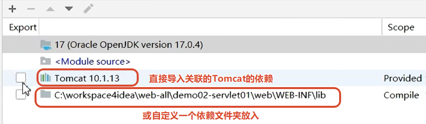
>
> 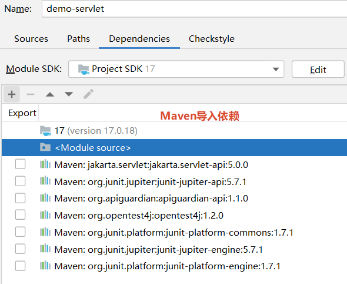
>
> 但不管怎么引入，只是为了开发使用，而 Tomcat 服务运行时，由 Tomcat 自身提供依赖。
>
> 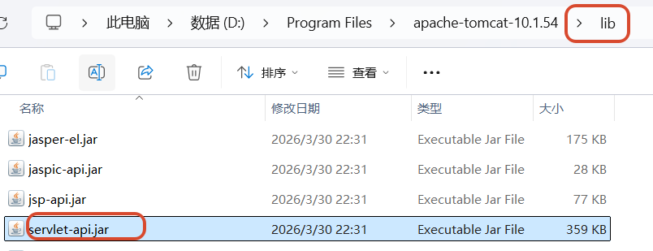
>
> 我们开发时只需确保两者版本一致就行，因此建议把依赖生命周期设置为 Provided。
>
> 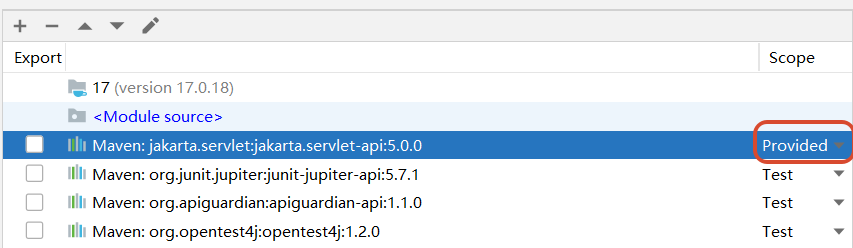

* HttpServletRequest 代表请求对象，是有请求报文经过 Tomcat 转换而来的，通过该对象可以获取请求中的信息；
* HttpServletResponse 代表响应对象，该对象会被 Tomcat 转换为响应的报文，通过该对象可以设置响应中的信息；

Servlet 对象的生命周期（创建、初始化、处理服务、销毁）是由 Tomcat 管理的，无需自己 new；HttpServletRequest 和 HttpServletResponse 两个对象也是由 Tomcat 负责转换，在调用 service 方法时传入给我们用的；

```java
public class UserServlet extends HttpServlet {

    @Override
    protected void service(HttpServletRequest req, HttpServletResponse resp) throws ServletException, IOException {
        // 从请求对象中获取参数
        String username = req.getParameter("username");
        // 处理业务的代码
        String info = "no";
        if ("tintinly".equals(username)) {
            info = "yes";
        }
        resp.setHeader("Content-Type", "text/html");
        // 响应数据放入响应对象中
        PrintWriter writer = resp.getWriter();
        writer.write(info);
    }
}

```

配置 web.xml。Servlet 并不是文件系统中实际存在的文件或者目录，所以为了能够请求到该资源，需要为其配置映射路径;
Servlet 的请求映射路径配置在 web.xml 中；

`<url-pattern>` 中可以使用一些通配写法：

* `/` 表示通配所有资源，不包括 jsp 文件；
* `/*` 表示通配所有资源，包括 jsp 文件；
* `/a/*` 匹配所有以 a 目录为前缀的映射路径；
* `*.action` 匹配所有以 action 为后缀的映射路径

```xml
<?xml version="1.0" encoding="UTF-8"?>
<web-app xmlns="https://jakarta.ee/xml/ns/jakartaee"
         xmlns:xsi="http://www.w3.org/2001/XMLSchema-instance"
         xsi:schemaLocation="https://jakarta.ee/xml/ns/jakartaee https://jakarta.ee/xml/ns/jakartaee/web-app_5_0.xsd"
         version="5.0">
    <!-- 配置Servlet类 -->
    <servlet>
        <servlet-name>userServlet</servlet-name> <!-- 用于关联请求的映射路径 随意定义，见名知意就好-->
        <servlet-class>com.tintin.demoservlet.UserServlet</servlet-class> <!-- 告诉Tomcat需要实例化的类 -->
    </servlet>
    <!--  配置某个Servlet的映射路径 -->
    <servlet-mapping>
        <servlet-name>userServlet</servlet-name>
        <url-pattern>/checkUser</url-pattern>
    </servlet-mapping>
    
    <servlet> <!-- 可以 一对多 servlet-mapping-->
        <servlet-name>servlet1</servlet-name>
        <servlet-class>com.tintin.demoservlet.Servlet1</servlet-class>
    </servlet>
    <servlet-mapping>
        <servlet-name>servlet1</servlet-name> <!-- 可以 一对多 url-pattern -->
        <url-pattern>/s1</url-pattern> <!-- 精确匹配-->
        <url-pattern>/ss1</url-pattern>
    </servlet-mapping>
    <servlet-mapping>
        <servlet-name>servlet1</servlet-name>
        <!--<url-pattern>/</url-pattern>--> <!-- 匹配全部 不可匹配 jsp 文件 例如 访问 /sss1/index.jsp 返回的是jsp文件 -->
        <!--<url-pattern>/*</url-pattern>--> <!-- 匹配全部 且可匹配 jsp 文件 例如 访问 /sss1/index.jsp 执行Servlet-->
        <!--<url-pattern>/sss1/*</url-pattern>--> <!-- 模糊匹配 匹配所有以 sss1 目录为前缀的映射路径；-->
        <!--<url-pattern>*.sss1</url-pattern>--> <!-- 匹配所有以 .sss1 为后缀的映射路径-->
    </servlet-mapping>
</web-app>
```

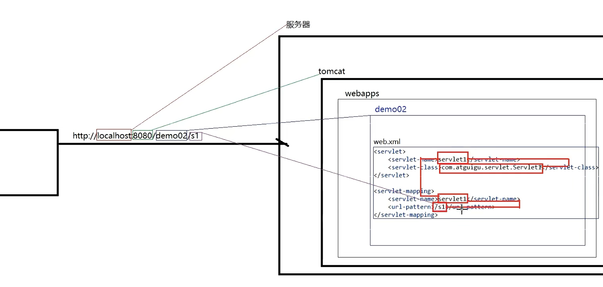

## Servlet 注解方式配置

### @WebServlet

```
// @WebServlet("/s2")
// @WebServlet(value="/s2")
// @WebServlet(value={"/s2"})
// @WebServlet(urlPatterns={"/s2"})
@WebServlet(name = "servlet2", urlPatterns = {"/ss2", "sss2"})
public class Servlet2 extends HttpServlet {

    @Override
    protected void service(HttpServletRequest req, HttpServletResponse resp) throws ServletException, IOException {

        System.out.println("Servlet2 执行了");
        resp.getWriter().write("Servlet2");
    }
}
```

## Servlet 生命周期

**生命周期**

应用程序中的对象不仅在空间上有层次结构的关系，在时间上也会因为处于程序运行过程中的不同阶段而表现出不同状态和不同行为，这就是对象的生命周期。简单来说，生命周期就是对象在容器中从开始创建到销毁的过程。

**Servlet 容器**

Servlet 对象是 Servlet 容器创建的，生命周期方法都是由容器（目前我们使用的是 Tomcat)调用的）。这一点和我们之前所编写的代码有很大不同。在今后的学习中我们会看到，越来越多的对象交给容器或框架来创建，越来越多的方法由容器或框架来调用，开发人员要尽可能多的将精力放在业务逻辑的实现上。

 **Servlet 生命周期测试**

Tomcat 创建 Servlet 对象 采取单例模式，一个 Servlet 类在整个应用程序生命周期中只有一个实例，并且多个请求会共享这个实例，这种方式称为单实例多线程，即多个线程同时访问同一个 Servlet 实例，因此操作成员变量会存在线程安全问题

```java
/**
 * loadOnStartup 默认值是-1含义是tomcat启动时不会实例化该servLet 正整数含义是tomcat在启动时，实例化该servLet的顺序
 * <servlet>
 *     <load-on-startup>-1</load-on-startup>
 * </servlet>
 * 不建议写1~5 因为这是tomcat的web.xml配置的servlet使用了的
 * 例如 servlet default 的load-on-startup是1
 * 任何没被自定义servlet匹配的请求路径 都会到 org.apache.catalina.servlets.DefaultServlet， 其作用基本上把找到的文件输出给浏览器
 */
@WebServlet(urlPatterns = "/life-circle-servlet", loadOnStartup = 1)
public class LifeCircleServlet extends HttpServlet {

    /**
     * 1 实例化——第一次请求
     * 2 初始化——构造完毕
     * 3接收请求，处理请求服务—每一次请求
     * 4销毁——关闭请求
     *
     * ServLet在Tomcat中是单例的
     * Servlet的成员变量在多个线程栈之中是共享的
     * 不建议在service方法中修改成员变量在并发请求时，会引发线程安全问题
     */

    public LifeCircleServlet() {
        System.out.println("实例化");
    }

    @Override
    public void init() throws ServletException {
        System.out.println("初始化");
    }

    @Override
    protected void service(HttpServletRequest req, HttpServletResponse resp) throws ServletException, IOException {
        System.out.println("执行了服务");
    }

    @Override
    public void destroy() {
        System.out.println("销毁");
    }
}

/*
实例化
初始化
执行了服务
执行了服务
执行了服务
执行了服务
执行了服务
销毁
*/
```

## Servlet 继承结构

### Servlet 接口

```java
public interface Servlet {
    // 构造完毕后，由 调用初始化方法
    void init(ServletConfig var1) throws ServletException;

    // 获得 ServletConfig对象的方法
    ServletConfig getServletConfig();

    // 接收用户请求，响应信息的方法
    void service(ServletRequest var1, ServletResponse var2) throws ServletException, IOException;

    // 返回Servlet字符串形式描述信息
    String getServletInfo();

    // 销毁，资源释放
    void destroy();
}
```

### GenericServlet 抽象类

实现了 Servlet 接口，对大部分方法进行平庸实现的重写，即无具体代码

```java
public abstract class GenericServlet implements Servlet, ServletConfig, Serializable {
    private static final long serialVersionUID = -8592279577370996712L;
    private transient ServletConfig config;

    /* 仅看 Servlet的实现部分 */
    public void destroy() {
        //平庸实现，无具体代码
    }

    public ServletConfig getServletConfig() { // 简单返回已有的ServletConfig
        return this.config;
    }

    public String getServletInfo() { // 简单返回空字符串
        return "";
    }

    public void init(ServletConfig config) throws ServletException {
        this.config = config; // 存储 传过来的ServletConfig
        this.init(); // 执行 init()
    }

    public void init() throws ServletException { 
    }

  
	// 未重写的抽象方法
    public abstract void service(ServletRequest var1, ServletResponse var2) throws ServletException, IOException;

    
}
```

### HttpServlet 抽象类

继承了 GenericServlet 抽象类，虽然是抽象类但是没有抽象方法，它禁止了直接被实例化，同时提供了默认实现，让子类按需覆盖。

```java
public abstract class HttpServlet extends GenericServlet {
    public void service(ServletRequest req, ServletResponse res) throws ServletException, IOException {
        // 主要用于参数类型父转子，即向下转型，然后调用
        if (req instanceof HttpServletRequest && res instanceof HttpServletResponse) {
            HttpServletRequest request = (HttpServletRequest)req;
            HttpServletResponse response = (HttpServletResponse)res;
            this.service(request, response); // 调用重载的service方法
        } else {
            throw new ServletException("non-HTTP request or response");
        }
    }
    
    protected void service(HttpServletRequest req, HttpServletResponse resp) throws ServletException, IOException {
        String method = req.getMethod(); // 获取请求方式
        long lastModified;
        // 根据请求方式分发调用具体的处理逻辑 doxxx()
        if (method.equals("GET")) {
            lastModified = this.getLastModified(req);
            // 判断是否需要用缓存
            if (lastModified == -1L) {
                this.doGet(req, resp);
            } else {
                long ifModifiedSince = req.getDateHeader("If-Modified-Since");
                if (ifModifiedSince < lastModified) {
                    this.maybeSetLastModified(resp, lastModified);
                    this.doGet(req, resp);
                } else {
                    resp.setStatus(304);
                }
            }
        } else if (method.equals("HEAD")) {
            lastModified = this.getLastModified(req);
            this.maybeSetLastModified(resp, lastModified);
            this.doHead(req, resp);
        } else if (method.equals("POST")) {
            this.doPost(req, resp);
        } else if (method.equals("PUT")) {
            this.doPut(req, resp);
        } else if (method.equals("DELETE")) {
            this.doDelete(req, resp);
        } else if (method.equals("OPTIONS")) {
            this.doOptions(req, resp);
        } else if (method.equals("TRACE")) {
            this.doTrace(req, resp);
        } else {
            String errMsg = lStrings.getString("http.method_not_implemented");
            Object[] errArgs = new Object[]{method};
            errMsg = MessageFormat.format(errMsg, errArgs);
            resp.sendError(501, errMsg);
        }

    }
    
    // 响应405，请求方式不允许
    protected void doGet(HttpServletRequest req, HttpServletResponse resp) throws ServletException, IOException {
        String protocol = req.getProtocol();
        String msg = lStrings.getString("http.method_get_not_supported");
        resp.sendError(this.getMethodNotSupportedCode(protocol), msg);
    }
}

```

### 自定义 Servlet

```java
@WebServlet("/do")
public class DoServlet extends HttpServlet {

	
    // 自定义Servlet中，必须要对处理请求的方法进行重写：
    // 要么重写service方法;
    // 要么重写doXXX方法;
        
    // doGet 定义处理get请求的逻辑
    @Override
    protected void doGet(HttpServletRequest req, HttpServletResponse resp) throws ServletException, IOException {
        resp.getWriter().write("处理 get 请求");
    }

    // doPost 定义处理post请求的逻辑
    @Override
    protected void doPost(HttpServletRequest req, HttpServletResponse resp) throws ServletException, IOException {
        resp.getWriter().write("处理 post 请求");
    }
    
    // 其他请求方式未定义处理逻辑，则默认响应405

}
```

> 后续使用 SpringMVC 框架，则无需继承 HttpServlet

## ServletConfig

### ServletConfig 是什么

为 Servlet 提供初始配置参数的一种对象，每个 Servlet 都有自己独立唯一的 ServletConfig 对象

Tomcat 的 Servlet 容器会为每个 Servlet 实例化一个 ServletConfig 对象，并通过 Servlet 生命周期的 init 方法传入给 Servlet 作为属性

```java
public interface ServletConfig {
    String getServletName();

    ServletContext getServletContext();

    String getInitParameter(String var1);

    Enumeration<String> getInitParameterNames();
}
```

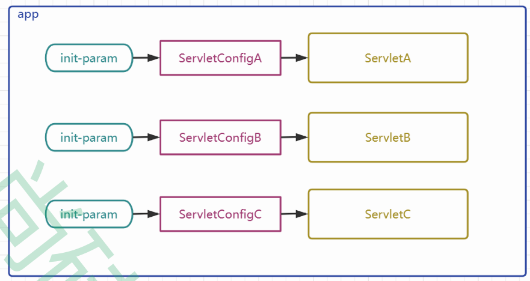

### ServletConfig 使用

例，定义初始参数

```xml
<web-app >
    <servlet>
        <servlet-name>servlet2</servlet-name>
        <servlet-class>com.tintin.demoservlet.Servlet1</servlet-class>
        <!--配置Servlet的初始参数 对应ServletConfig的对象信息-->
        <init-param>
            <param-name>keyA</param-name>
            <param-value>valueA</param-value>
        </init-param>
        <init-param>
            <param-name>keyB</param-name>
            <param-value>valueB</param-value>
        </init-param>
    </servlet>
    <servlet-mapping>
        <servlet-name>servlet2</servlet-name>
        <url-pattern>/s2</url-pattern>
    </servlet-mapping>
</web-app>
```

或

```java
@WebServlet(
        value = "/s2",
        initParams = {
                @WebInitParam(name = "k1", value = "v1"),
                @WebInitParam(name = "k1", value = "v1")
        })
```

Tomcat 会将这些初始参数等配置成 ServletConfig 对象，并作为方法参数传入 init 方法中。

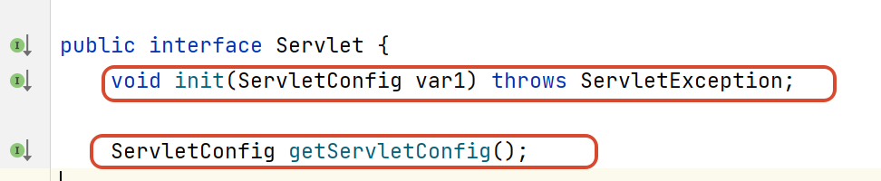

获取 Servlet 中 ServletConfig 的属性值

```java
public class Servlet2 extends HttpServlet {

    @Override
    protected void service(HttpServletRequest req, HttpServletResponse resp) throws ServletException, IOException {

        System.out.println("Servlet2 执行了");

        String servletName = getServletConfig().getServletName();
        resp.getWriter().println(servletName);

        ServletContext servletContext = getServletConfig().getServletContext();
        resp.getWriter().println(servletContext);

        Enumeration<String> initParameterNames = getServletConfig().getInitParameterNames();
        while (initParameterNames.hasMoreElements()) {
            String initParameter = getServletConfig().getInitParameter(initParameterNames.nextElement());
            resp.getWriter().println(initParameter);
        }
    }
}
```

## ServletContext

### ServletContext 是什么

ServletContext 对象有称呼为上下文对象，或者叫应用域对象; 容器会为每个 app 创建一个独立的唯一的 ServletContext 对象;

ServletContext 对象为所有的 Servlet 所共享；

ServletContext 可以为所有的 Servlet 提供初始配置参数；

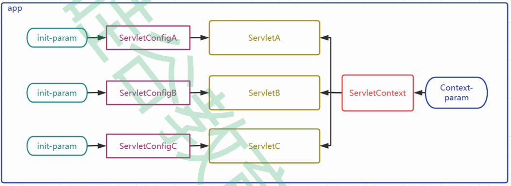

### ServletContext 使用

配置 ServletContext  参数

```xml
<web-app>
	<context-param>
        <param-name>encoding</param-name>
        <param-value>utf-8</param-value>
    </context-param>
    <context-param>
        <param-name>projectName</param-name>
        <param-value>demo-servlet</param-value>
    </context-param>
</web-app>
```

* 获取 ServletContext  的参数
* 获取资源的磁盘路径
* 获取项目的上下文路径
* 获取域对象

```java
public class Servlet2 extends HttpServlet {

    @Override
    protected void service(HttpServletRequest req, HttpServletResponse resp) throws ServletException, IOException {

        System.out.println("Servlet2 执行了");

        ServletContext servletContext1 = getServletContext();
        ServletContext servletContext2 = getServletConfig().getServletContext();
        ServletContext servletContext3 = req.getServletContext();
        System.out.println(servletContext1 == servletContext2);
        System.out.println(servletContext1 == servletContext3);
        // 获取初始参数
        Enumeration<String> names = servletContext1.getInitParameterNames();
        while (names.hasMoreElements()) {
            String paramName = names.nextElement();
            resp.getWriter().println(servletContext1.getInitParameter(paramName));
        }
    }
}

```

域对象是一些用于在一些特定的范围内存储数据和传递数据的对象，不同的范围称为不同的“域”，不同的域对象代表不同的域，共享数据的范围也不同；ServletContext 代表应用，所以 ServletContext 域也叫作应用域，是 webapp 中最大的域，可以在本应用内实现数据的共享和传递；webapp 中的三大域对象，分别是应用域，会话域，请求域。

```java
@Override
    protected void service(HttpServletRequest req, HttpServletResponse resp) throws ServletException, IOException {
        ServletContext servletContext = getServletContext();
        PrintWriter writer = resp.getWriter();
        // 获取资源在项目部署位置的磁盘路径
        String upload = servletContext.getRealPath("upload");
        writer.println(upload); // D:\demo-servlet\demo-servlet\target\demo-servlet-1.0-SNAPSHOT\upload

        // 获取项目的上下文
        String contextPath = servletContext.getContextPath();
        writer.println(contextPath); // /demo_servlet

        // 域对象 API
        servletContext.setAttribute("key", "value");
        Object key = servletContext.getAttribute("key");
        writer.println(key); // value
        servletContext.removeAttribute("key");
        Object k = servletContext.getAttribute("key");
        writer.println(k); // null
    }
```

## HttpServletRequest

HttpServletRequest 是一个接口，其父接口是 ServletRequest；HttpServletRequest 是 Tomcat 将请求报文转换封装而来的对象，在 Tomcat 调用 service 方法时传入；HttpServletRequest 代表客户端发来的请求，请求中的所有信息都可以通过该对象获得;

* 获取请求行信息
* 获取请求头信息
* 获取请求参数信息
* 获取 servlet 隐射路径、servletcontext、cookie、session 等
* 设置请求体字符集

```java
@WebServlet("/s4")
public class Servlet4 extends HttpServlet {

    @Override
    protected void service(HttpServletRequest req, HttpServletResponse resp) throws ServletException, IOException {
        PrintWriter writer = resp.getWriter();

        // 请求行相关
        writer.println("请求行：");
        writer.println(req.getMethod()); // 请求方式
        writer.println(req.getScheme()); // 请求协议
        writer.println(req.getProtocol()); // 请求协议版本
        writer.println(req.getRequestURI()); // 请求的URI 项目内的资源路径
        writer.println(req.getRequestURL()); // 请求的URL 项目内的资源的完整路径

        writer.println(req.getLocalPort()); // 本应用的端口
        writer.println(req.getServerPort()); // 客户端（浏览器）发送请求时使用的端口 与应用实际端口不一样，因为可能存在代理
        writer.println(req.getRemotePort()); // 客户端（浏览器）的端口


        // 请求头相关
        writer.println("请求头：");
        Enumeration<String> headerNames = req.getHeaderNames();
        while (headerNames.hasMoreElements()) {
            String headerName = headerNames.nextElement();
            writer.println(headerName + ":" + req.getHeader(headerName));
        }

        // 请求参数相关
        writer.println("请求参数：");
        // 获取键值对形式的参数 无论这些参数是查询参数还是请求体参数
        writer.println("username=" + req.getParameter("username")); // 根据参数名获取单个参数值
        writer.println("password=" + req.getParameter("password"));
        writer.println("hobby=" + Arrays.toString(req.getParameterValues("hobby"))); // 根据参数名获取多个参数值

        // 获取所有参数名
        Enumeration<String> parameterNames = req.getParameterNames();
        while (parameterNames.hasMoreElements()) {
            String parameterName = parameterNames.nextElement();
            String[] parameterValues = req.getParameterValues(parameterName);
            if (parameterValues.length == 1) {
                writer.println(parameterName + ":" + parameterValues[0]);
            } else {
                writer.println(parameterName + ":" + Arrays.toString(parameterValues));
            }
        }

        // 获取所有参数的map集合
        Map<String, String[]> parameterMap = req.getParameterMap();
        Set<Map.Entry<String, String[]>> entries = parameterMap.entrySet();
        entries.forEach(entry -> {
            if (entry.getValue().length == 1) {
                writer.println(entry.getKey() + ":" + entry.getValue()[0]);
            } else {
                writer.println(entry.getKey() + ":" + Arrays.toString(entry.getValue()));
            }
        });

        // 获取非键值对形式的参数 如 json串 文件
//        BufferedReader reader = req.getReader(); // 字符流
//        ServletInputStream inputStream = req.getInputStream();// 文件流

        // 其他相关
        ServletContext servletContext = req.getServletContext();
        String servletPath = req.getServletPath();
        Cookie[] cookies = req.getCookies();
        HttpSession session = req.getSession();
        req.setCharacterEncoding("utf-8");
    }
}
```


## HttpServletResponse

HttpServletResponse 是一个接口，其父接口是 ServletResponse；HttpServletResponse 是 Tomcat 预先创建的，在 Tomcat 调用 service 方法时传入；HttpServletResponse 代表对客户端的响应，该对象会被转换成响应的报文发送给客户端，通过该对象我们可以设置响应信息；

* 设置响应行（状态码）
* 设置响应头
* 设置响应体（字符流输出或字节流输出）
* 设置 Cookie、响应错误、指定响应体字符集

```java
@WebServlet("/s5")
public class Servlet5 extends HttpServlet {

    @Override
    protected void service(HttpServletRequest req, HttpServletResponse resp) throws ServletException, IOException {
        // 响应行相关
        resp.setStatus(666);

        String info = ("<h1>hello world</h1>");
        // 响应头相关
        resp.setHeader("h1", "v1");
//        resp.setHeader("Content-Type", "text/html");
//        resp.setHeader("Content-Length", info.length());
        resp.setContentType("text/html");
        resp.setContentLength(info.length());

        // 响应体相关
        PrintWriter writer = resp.getWriter(); // 获取向响应体中的输入文本的字符输出流
        writer.write(info);
//        writer.println("...");
//        ServletOutputStream outputStream = resp.getOutputStream(); // 获取向响应体中的输入字节的二进制输出流
        
        // 其他相关
        resp.sendError(404, "error");
        resp.addCookie(new Cookie("key", "value"));
        resp.setCharacterEncoding("utf-8");
    }
}
```

## 请求转发和响应重定向

请求转发和响应重定向是 web 应用中间接访问项目资源的两种手段，也是 Servlet 控制页面跳转的两种手段

请求转发通过 HttpServletRequest 实现，响应重定向通过 HttpServletResponse 实现

### 请求转发

**流程**

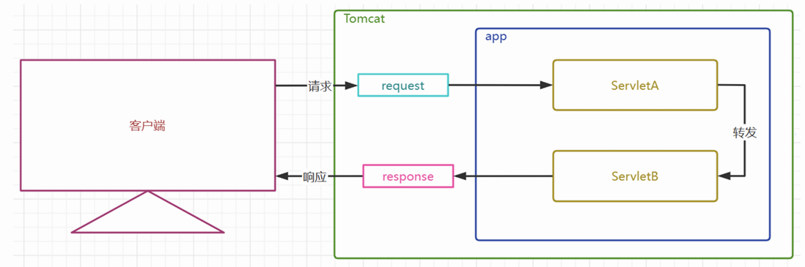

**特点**

* 请求转发通过 HttpServletRequest 对象获取请求转发器实现；
* 请求转发是服务器 **内部的行为**，对客户端是屏蔽的；
* 客户端只发送了一次请求，客户端地址栏不变；
* 服务端只产生了一对请求和响应对象，这一对请求和响应对象会继续传递给下一个资源；
* 因为全程只有一个 HttpServletRequset 对象，所以请求参数可以传递, 请求域中的数据也可以传递；
* 请求转发可以转发给其他 Servlet 动态资源，也可以转发给一些静态资源以实现页面跳转；
* 请求转发可以转发给 WEB-INF 下受保护的资源；
* 请求转发不能转发到本项目以外的外部资源；

**使用**

```java
@WebServlet("/forward")
public class ForwardServlet extends HttpServlet {
    @Override
    protected void service(HttpServletRequest req, HttpServletResponse resp) {
        // 请求转发
        try {
            // 获取请求转发器
//            RequestDispatcher requestDispatcher = req.getRequestDispatcher("/final"); // 转发至Servlet
//            RequestDispatcher requestDispatcher = req.getRequestDispatcher("ssss1/index.html"); // 转发至资源页面
//            RequestDispatcher requestDispatcher = req.getRequestDispatcher("upload/a.txt"); // 转发至资源文件
            RequestDispatcher requestDispatcher = req.getRequestDispatcher("WEB-INF/web.xml"); // 可以访问WEB-INF下的文件
            // 做出转发动作
            requestDispatcher.forward(req, resp);
        } catch (Exception e) {
            e.printStackTrace();
        }
    }
}
```

### 响应重定向

**流程**

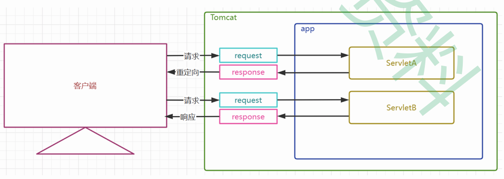

**特点**

* 响应重定向通过 HttpServletResponse 对象的 sendRedirect 方法实现；
* 响应重定向是服务端通过 302 响应码和路径，告诉客户端自己去找其他资源，是在服务端提示下的客户端的行为；
* 客户端至少发送了两次请求，客户端地址栏是要变化的；
* 服务端产生了多对请求和响应对象，且请求和响应对象不会传递给下一个资源; 
* 因为全程产生了多个 HttpServletRequset 对象，所以请求参数不可以传递，请求域中的数据也不可以传递；
* 重定向可以是其他 servlet 动态资源，也可以是一些静态资源以实现页面跳转； 
* 重定向不可以到给 WEB-INF 下受保护的资源；
* 重定向可以到本项目以外的外部资源；

**使用**

```java
@WebServlet("/redirect")
public class RedirectServlet extends HttpServlet {

    @Override
    protected void service(HttpServletRequest req, HttpServletResponse resp) throws IOException {
        // 重定向
        System.out.println("redirectServlet 准备做响应重定向");
        // 设置header 的方式
//        resp.setStatus(302);
//        resp.setHeader("Location", "final");

        // 使用sendRedirect
        resp.sendRedirect("final"); // 重定向到其他servlet
//        resp.sendRedirect("sss1/index.html"); // 重定向到其他资源
//        resp.sendRedirect("https://www.baidu.com"); // 重定向到外部链接
//        resp.sendRedirect("WEB-INF/web.xml"); // 无法访问WEB-INF
    }
}
```

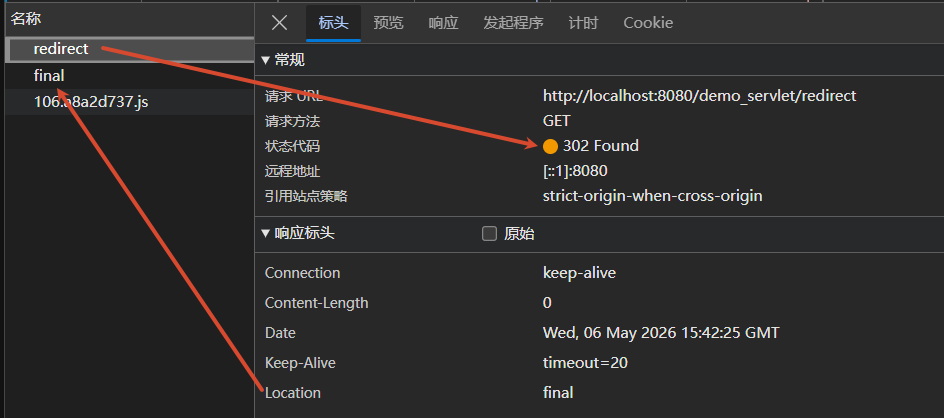

## 乱码问题和路径问题

### 乱码问题

**根本原因**

1. 数据的编码和解码使用的不是同一个字符集
2. 使用了不支持某个语言文字的字符集

**各字符集兼容性**

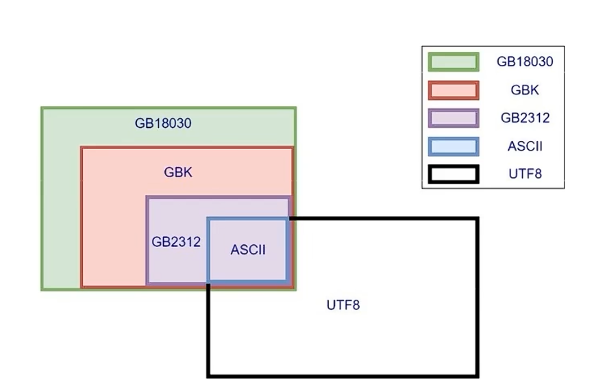

**HTML 乱码**

解决

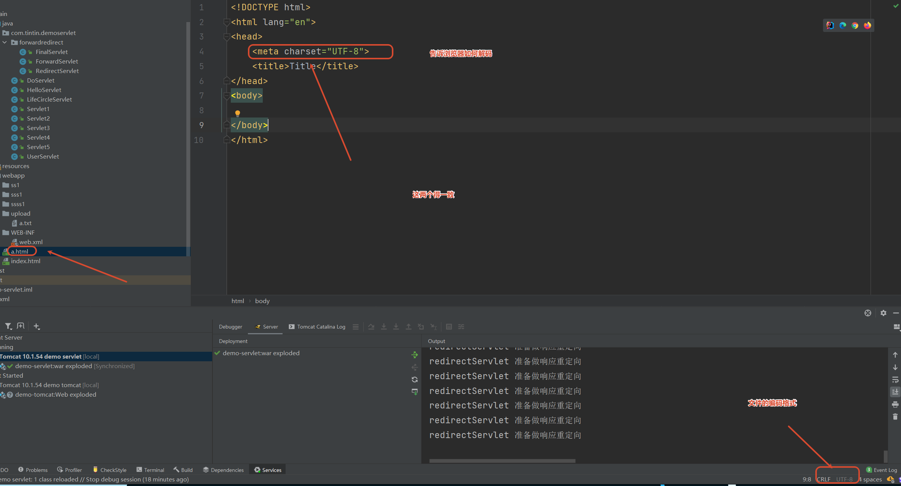

建议设置项目文件的字符集要使用一个支持中文的字符集。将 Global Encoding 全局字符集，Project Encoding 项目字符集，PropertiesFiles 属性配置文件字符集设置为 UTF-8。

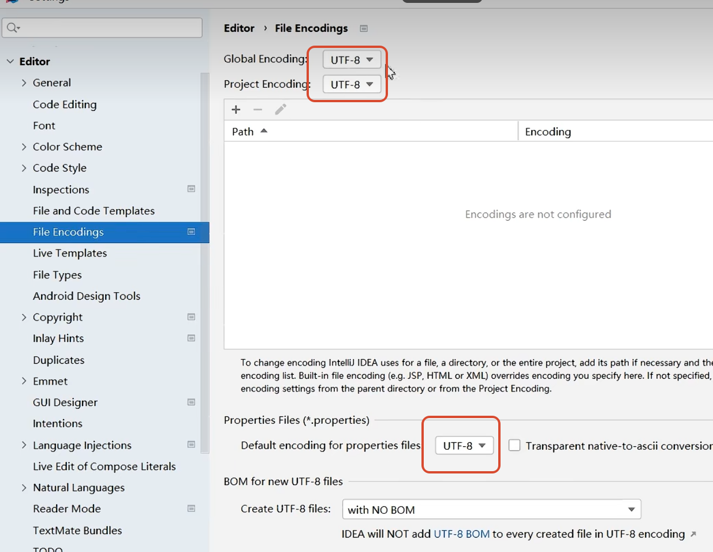

**Tomcat 控制台输出乱码**

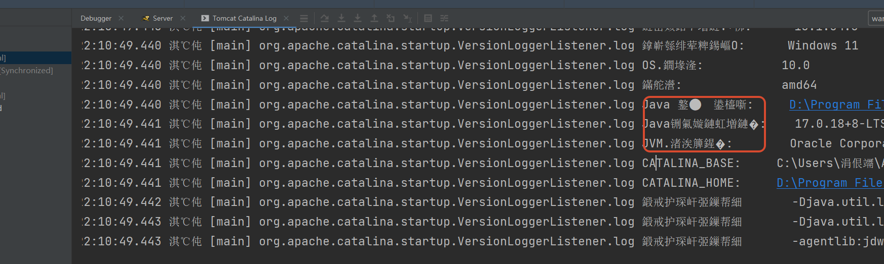

解决

在 tomcat10.1.7 这个版本中，修改 Tomcat/conf/logging.properties 中，所有的 uTF-8 为 GBK 即可。因为大多数 windows 电脑环境都是 GBK，除非改过。

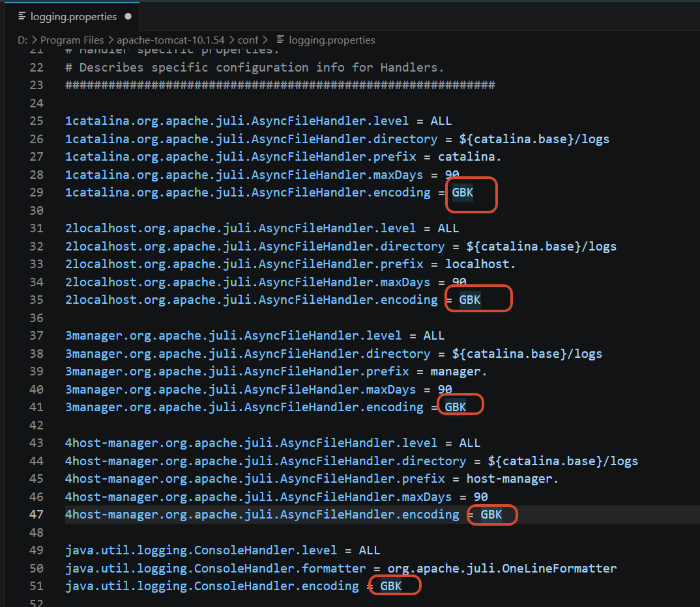

**Java 程序控制台输出乱码**

解决：确保 JVM 加载.class 文件时和编译时的字符集一致，通常为 UTF-8。

**get 请求乱码问题**

分析：GET 方式提交参数的方式是将参数放到 URL 后面，如果使用的不是 UTF-8，那么会对参数进行 URL 编码处理；HTML 中的 `<meta charset='字符集'/>` 影响了 GET 方式提交参数的 URL 编码；Tomcat10.1.7 的 URI 编码默认为 UTF-8；当 GET 方式提交的参数 URL 编码和 Tomcat10.1.7 默认的 URI 编码不一致时，就会出现乱码；

例如 


```java
@Override
    protected void doGet(HttpServletRequest req, HttpServletResponse resp) throws ServletException, IOException {
        resp.getWriter().write(req.getParameter("username")); 
    }
// 打印出来的是否乱码 取决于tomcat用什么格式解码URL，是否与浏览器编码URL的格式时一致
```

Tomcat10 版本内部默认使用的 URL 解码格式是 UTF-8，同时我们编写的 HTML 文件也是 UTF-8 编码，因此不会有 get 请求乱码问题，除非两者不一致。

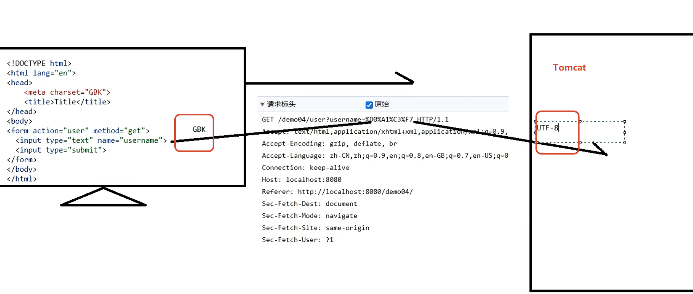

如需更改 Tomcat 的 URL 的解码格式如下

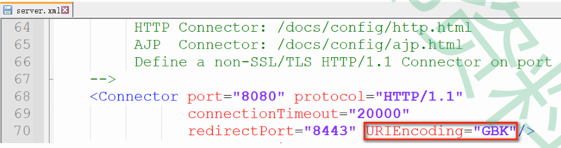


**post 请求乱码问题**

分析： form 表单的 POST 请求将参数放在请求体中进行发送；请求体使用的字符集受到了 `<meta charset="字符集"/>` 的影响；Tomcat10.1.7 默认使用 UTF-8 字符集对请求体进行解析； 如果请求体的 URL 转码和 Tomcat 的请求体解析编码不一致，就容易出现乱码;

例如


```java
	@Override
    protected void doPost(HttpServletRequest req, HttpServletResponse resp) throws ServletException, IOException {
        resp.getWriter().write(req.getParameter("username"));
    }
// 打印出来的是否乱码 取决于tomcat用什么格式解码URL，是否与浏览器编码URL的格式时一致
```

Tomcat10 版本内部默认使用的 请求体解码格式是 UTF-8，同时我们使用 UTF-8 集提交请求体 ，因此不会有 post 请求乱码问题，除非两者不一致。

如需设置解析请求体使用的编码格式

```java
	@Override
    protected void doPost(HttpServletRequest req, HttpServletResponse resp) throws ServletException, IOException {
		req.setCharacterEncoding("GBK");
        resp.getWriter().write(req.getParameter("username"));
    }
// 此时会乱码
// 澹ぇ澶?
```

**响应乱码问题**

分析： 在 Tomcat10 中，向响应体中放入的数据默认使用了工程编码 UTF-8；浏览器在接收响应信息时，使用了不同的字符集或者是不支持中文的字符集（例如 windows 浏览器默认 GBK）就会出现乱码。

例如：

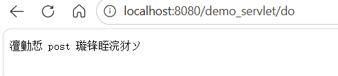

解决：设置请求头 Content-Type 告诉浏览器如何解析响应体。

```java
@Override
    protected void doPost(HttpServletRequest req, HttpServletResponse resp) throws ServletException, IOException {
//        resp.setCharacterEncoding("GBK"); // 设置响应体的编码方式 tomcat10 默认 utf-8 不推荐改成GBK去适应浏览器默认的解码方式
        resp.setContentType("text/html;charset = UTF-8"); // 请求头告诉浏览器的解码方式
        resp.getWriter().write("处理 post 请求");
    }
```

### 路径问题

- 相对路径
  - 相对路径的规则是以当前资源所在的路径为出发点去寻找目标资源；
  - 相对路径不以 `/` 开头；
  - 在 file 协议下，使用的是磁盘路径；
  - 在 http 协议下，使用的是 url 路径；
  - 相对路径中可以使用 `./` 表示当前资源所在路径，可以省略不写；
  - 相对路径中可以使用 `../` 表示当前资源所在路径的上一层路径，需要时要手动添加；
  - 缺点：假如是经过 **请求转发** 至当前页面，那么相对路径获取资源可能会有问题，因为路径还是请求转发前的，而不是当前页面所在路径。
  
- 绝对路径
  - 绝对路径的规则是使用以一个固定的路径做出出发点去寻找目标资源，和当前资源所在的路径没有关系；
  
  - 绝对路径要以 `/` 开头；
  
  - 绝对路径的写法中，不以当前资源的所在路径为出发点, 所以不会出现 `./` 和 `../` 开头；
  
  - 不同的项目和不同的协议下，绝对路径的基础位置可能不同，要通过测试确定；
  
  - 优点：无论当前资源位置在哪，寻找目标资源路径的写法都一致；
  
  - 缺点：绝对路径要补充项目上下文
  
    解决方案一（不推荐）：
  
    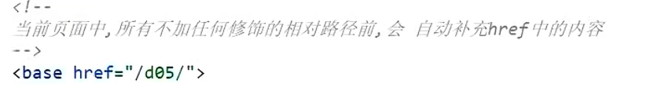
  
    解决方案二（完美）：把项目上下文定义为 `/`，也就没有项目上下文对路径的影响了。
  
- 应用场景：
  1. 前端代码中，href、src、action 等属性；
  2. 请求转发和重定向中的路径；
  
- 响应重定向写的路径和前端的写的路径规则是一样的。

- 请求转发系的写的相对路径和前端的写的相对路径规则是一样的，但是写绝对路径是无需添加项目上下文的，其起始地址就是项目上下文。

## MVC 架构模式

MVC（Model View Controller）是软件工程中的一种软件架构模式，它把软件系统分为 **模型、视图 和控制器** 三个基本部分。用一种业务逻辑、数据、界面显示分离的方法组织代码，将业务逻辑聚集到一个部件里面，在改进和个性化定制界面及用户交互的同时，不需要重新编写业务逻辑。

- Model 模型层：存放和数据库对象的实体类以及一些用于存储非数据库表完整相关的 VO 对象 。存放一些对数据进行逻辑运算操作的的一些业务处理代码。
  - 实体类包（pojo/entity/bean）：专门存放数据库表对应的实体类（PO）和封装某些属性、与特定的业务逻辑相关的对象（VO）。
  - 数据库访问包（dao/mapper）：专门存放对数据库不同表格 CURD 方法封装的类。
  - 服务包（service）：专门存放对数据进行逻辑运算的类（BO）。
  
  >  PO (Persistent Object)、VO (Value Object) 一般都属于 POJO (Plain Old Java Object)，属于简单的 Java 对象，通常用于表示数据结构。
  
- View 视图层：存放一些视图文件相关的代码 html css js 等。在前后端分离的项目中，后端已经没有视图文件，该层次已经衍化成独立的前端项自。

  - web 目录下的视图资源 html css js img 等
  - 或前端工程化的文件夹

- Controller 控制层：接收客户端请求，获得请求数据。将准备好的数据响应给客户端。

  - 控制层包（controller）

## Servlet 开发案例

文件总结构

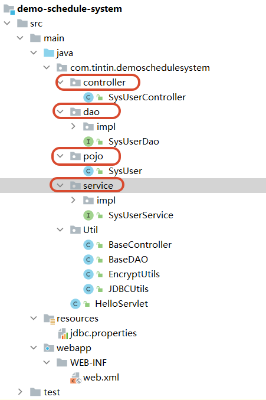

### 建立数据库，创建表

...

### 创建 pojo

* 实体类的类名和表格名称应该对应（对应不是一致）实体类的属性名和表格的列名应该对应
* 每个属性都必须是私有的
* 每个属性都应该具备 getter、setter 
* 必须具备无参构造器
* 应该实现序列化接口（缓存分布式项目数据传递 可能会将对象序列化）
* 应该重写类的 hashcode 和 eguals 方法（集合存储数据时会用到）
* toString 方法是否重写都可以

可以使用 lombok 帮助生成以上内容。步骤：安装插件，开启注解生成代码的功能，导入 lombok 依赖，在实体类上添加注解

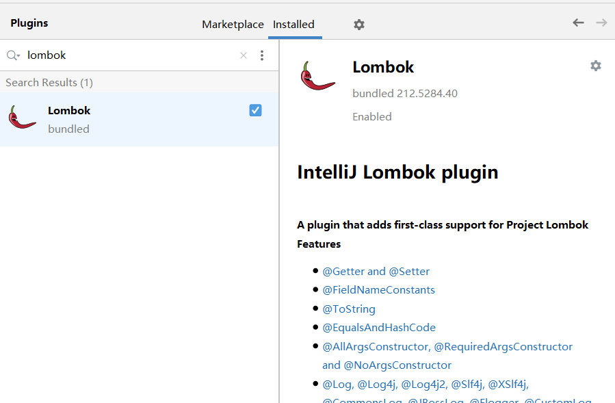

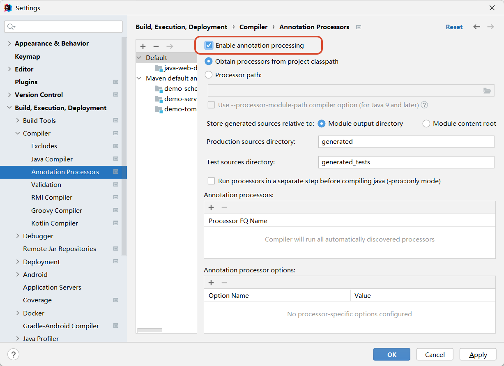

```java
@AllArgsConstructor // 添加了全参构造函数
@NoArgsConstructor // 添加了无参构造函数
//@Getter // 添加了getter方法
//@Setter // 添加了setter方法
//@EqualsAndHashCode // 添加了equals和hashCode方法
//@ToString // 添加了toString方法
@Data // 添加了@Getter、@Setter、@EqualsAndHashCode、@ToString
public class SysUser {
    private Integer id;
    private String username;
    private String password;
}
```

### JDBC 工具类

导入依赖

```xml
		<!-- JDBC 驱动 -->
        <dependency>
            <groupId>com.mysql</groupId>
            <artifactId>mysql-connector-j</artifactId>
            <version>8.0.31</version>
        </dependency>
        <!-- druid 连接池 -->
        <dependency>
            <groupId>com.alibaba</groupId>
            <artifactId>druid</artifactId>
            <version>1.2.8</version>
        </dependency>
```

准备 jdbc.properties 文件

```properties
# Druid连接池配置
druid.driverClassName=com.mysql.cj.jdbc.Driver
druid.url=jdbc:mysql://192.168.1.117:33306/test?useSSL=false&serverTimezone=Asia/Shanghai&characterEncoding=utf-8
druid.username=root
druid.password=123456

```

JDBC 工具类&通用 DAO 基类

[详见](../Java开发经验/index.md#Druid)

### dao 处理

Data access Object 数据访问对象，该类中用于定义针对表格的 CRUD 的方法，DAO 层一般需要定义接口和实现类。

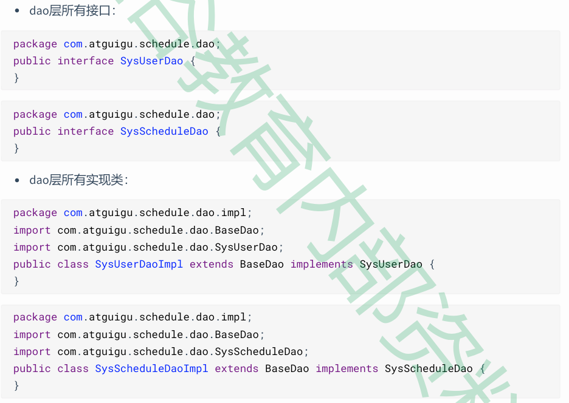

### service 处理

service 层定义核心的业务处理逻辑

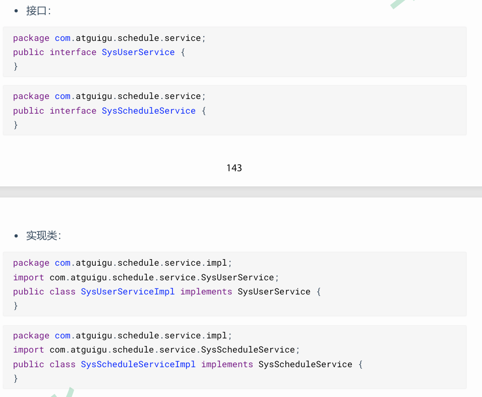

### Controller 处理

```java
@WebServlet("/sysUser/*")
public class SysUserController extends HttpServlet {

    @Override
    protected void service(HttpServletRequest req, HttpServletResponse resp) throws IOException {
        resp.setContentType("text/html;charset = UTF-8");
        // 根据路径判断是增删改查
        String requestURI = req.getRequestURI();
        String suffix = requestURI.substring(requestURI.lastIndexOf("/") + 1);
//        switch (suffix) {
//            case "add":
//                // 添加
//                add(req, resp);
//                break;
//            case "delete":
//                // 删除
//                delete(req, resp);
//                break;
//            case "update":
//                // 修改
//                update(req, resp);
//                break;
//            case "query":
//                // 查询
//                query(req, resp);
//                break;
//            default:
//                break;
//        }
        Class<? extends SysUserController> aClass = this.getClass();
        try {
            Method method = aClass.getDeclaredMethod(suffix, HttpServletRequest.class, HttpServletResponse.class);
            method.invoke(this, req, resp);
        } catch (NoSuchMethodException | InvocationTargetException | IllegalAccessException e) {
            e.printStackTrace();
        }

    }

    private void add(HttpServletRequest req, HttpServletResponse resp) throws IOException {
        resp.getWriter().write("添加用户");
    }
    private void delete(HttpServletRequest req, HttpServletResponse resp) throws IOException {
        resp.getWriter().write("删除用户");
    }
    private void update(HttpServletRequest req, HttpServletResponse resp) throws IOException {
        resp.getWriter().write("修改用户");
    }
    private void query(HttpServletRequest req, HttpServletResponse resp) throws IOException {
        resp.getWriter().write("查询用户");
    }

}
```

或者提取为 BaseDao

```java
public class BaseController extends HttpServlet {
    @Override
    protected void service(HttpServletRequest req, HttpServletResponse resp) throws IOException {
        resp.setContentType("text/html;charset = UTF-8");
        // 根据路径判断是增删改查
        String requestURI = req.getRequestURI();
        String suffix = requestURI.substring(requestURI.lastIndexOf("/") + 1);
        Class<? extends BaseController> aClass = this.getClass();
        try {
            Method method = aClass.getDeclaredMethod(suffix, HttpServletRequest.class, HttpServletResponse.class);
            method.setAccessible(true); // 破解访问限制
            method.invoke(this, req, resp);
        } catch (NoSuchMethodException | InvocationTargetException | IllegalAccessException e) {
            e.printStackTrace();
        }

    }
}
```

控制器继承 BaseDao 即可

### 加密工具类

[详见](../Java开发经验/index.md#MessageDigestJava开发经验)

### view 页面编写

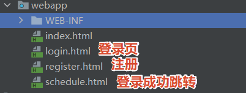

### 注册&登录业务

仅展示了 Controller 层

```java
@WebServlet("/user/*")
public class SysUserController extends BaseController {

    private SysUserService sysUserService = new SysUserServiceImpl();

    private void register(HttpServletRequest req, HttpServletResponse resp) throws IOException {
        // 接收参数
        String username = req.getParameter("username");
        String password = req.getParameter("password");
        // 调用业务层方法
        SysUser registerInfo = new SysUser(null, username, password);
        SysUserServiceImpl sysUserService = new SysUserServiceImpl();
        int success = sysUserService.register(registerInfo);
        // 注册结束作页面跳转
        if (success == 1) {
            resp.sendRedirect("/login.html");
        } else {
            resp.getWriter().write("注册失败");
        }
    }

    private void login(HttpServletRequest req, HttpServletResponse resp) throws IOException {
        // 获取用户名和密码
        String username = req.getParameter("username");
        String password = req.getParameter("password");
        // 调用业务层方法
        SysUser loginUser = sysUserService.findByUserName(username);
        // 如果用户名存在
        if (loginUser != null) {
            if (loginUser.getPassword().equals(EncryptUtils.md5(password))) {
                // 登录成功
                resp.sendRedirect("/schedule.html");
            } else {
                // 登录失败
                resp.getWriter().write("密码有误");
            }
        } else {
            resp.getWriter().write("用户名不存在");
        }
    }

}
```

# Servlet 会话管理

## 会话管理概述

### 会话管理意义

HTTP 是无状态（stateless）协议，HTTP 对于交互性场景没有记忆能力，HTTP 协议自身不对请求和响应之间的通信状态不做持久化处理。简单理解就是浏览器发送请求，服务器接收并响应，但是服务器不记录请求是否来自哪个浏览器，服务器没记录浏览器的特征，就是客户端的状态。

HTTP 的无状态性使得服务器的处理逻辑变得简便，降低了服务器的实现复杂度和资源消耗。这符合早期 web 传输静态文档的需求，但是在现代 Web 应用种，一些复杂的业务场景下是需要通过在客户端和服务器之间来回传递“状态信息”来模拟出“有状态”的，这需要 HTTP 以外的一些机制来实现。

### 会话管理实现方式

1. URL 重写与隐藏表单域

   在一些简单或古老的场景中，状态信息会被直接嵌入到 URL 的查询字符串中（如 ?sessionid = abc123），或者作为隐藏字段放在 HTML 表单里。这些信息会随着下一次请求被发送回服务器。

2. Cookie

   在客户端保留少量数据的技术，主要通过响应头向客户端响应一些客户端要保留的信息

3. Session

   在服务端保留更多数据的技术，主要通过 HttpSession 对象保存一些和客户端相关的信息

4. Tokens（如 JWT）

## Cookie

### Cookie 简介

cookie 是一种客户端会话技术，cookie 由服务端产生，它是服务器存放在浏览器的一小份数据，浏览器以后每次访问该服务器的时候都会将这小份数据携带到服务器去。

- 服务端创建 cookie, 将 cookie 放入响应对象中, Tomcat 容器将 cookie 转化为 set-cookie 响应头，响应给客户端
- 客户端在收到 cookie 的响应头时, 在下次请求该服务的资源时，会以 cookie 请求头的形式携带之前收到的 Cookie
- cookie 是一种键值对格式的数据，从 tomcat 8.5 开始可以保存中文，但是不推荐
- 由于 cookie 是存储于客户端的数据, 比较容易暴露，一般不存储一些敏感或者影响安全的数据

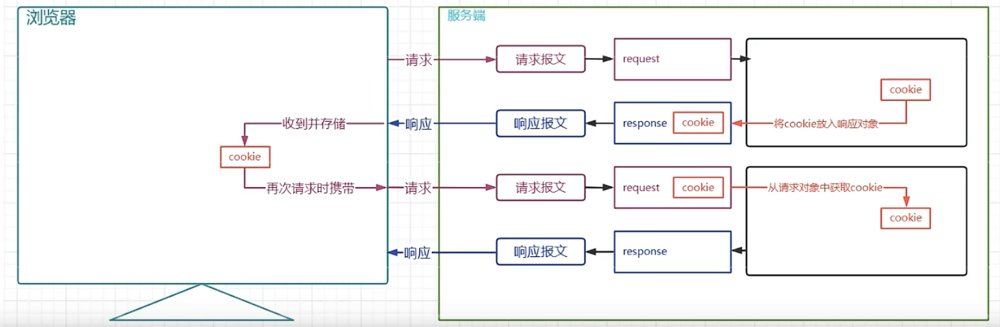

应用场景：

1. 保存用户名
2. 保持电影播放进度
3. ...

### Cookie 的使用

服务端响应时设置 cookie

```java
@WebServlet("/cookie")
public class CookieServlet extends HttpServlet {

    @Override
    protected void service(HttpServletRequest req, HttpServletResponse resp) throws ServletException, IOException {
        // 返回cookie
        Cookie cookie1 = new Cookie("key1", "value1");
        Cookie cookie2 = new Cookie("key2", "value2");

        resp.addCookie(cookie1);
        resp.addCookie(cookie2);
    }
}
```


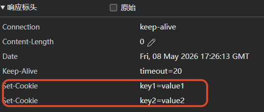

客户端请求时带上 cookie

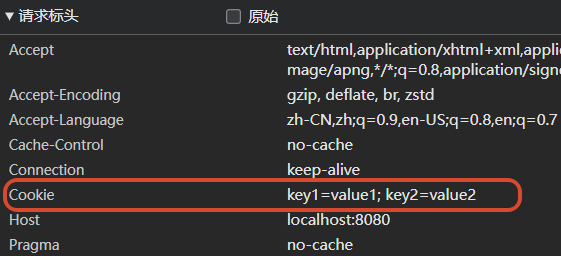

服务端获取 cookie

```java
@WebServlet("/get-cookie")
public class GetCookieServlet extends HttpServlet {
    @Override
    protected void service(HttpServletRequest req, HttpServletResponse resp) throws ServletException, IOException {
        Cookie[] cookies = req.getCookies();
        if (cookies != null) {
            for (Cookie cookie : cookies) {
                System.out.println(cookie.getName() + "=" + cookie.getValue());
            }
        }
    }
}
```

### Cookie 的时效性

默认情况下 Cookie 的有效期是一次会话范围内，我们可以通过 Cookie 的 setMaxAge(l)方法让 Cookie 持久化保存到浏览器上。

* 会话级 Cookie
  * 服务器端并没有明确指定 Cookie 的存在时间；
  * 在浏览器端，Cookie 数据存在于内存中；
  * 只要浏览器还开着，Cookie 数据就一直都在；
  * 浏览器关闭，内存中的 Cookie 数据就会被释放；
* 持久化 Cookie
  * 服务器端明确设置了 Cookie 的存在时间;。在浏览器端，Cookie 数据会被保存到硬盘上；
  * Cookie 在硬盘上存在的时间根据服务器端限定的时间来管控，不受浏览器关闭的影响；
  * 持久化 Cookie 到达了预设的时间会被释放；

通过 `cookie.setMaxAge(int expiry)` 设置持久化时间，参数单位是秒，表示 cookie 的持久化时间，如果设置参数为 o，表示将浏览器中保存的该 cookie 删除。

```java
		Cookie cookie = new Cookie("key", "value");
        cookie.setMaxAge(5);
```

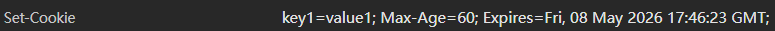

### Cookie 的提交路径

访问互联网资源时不需要每次都需要把所有 Cookie 带上。访问不同的资源时，可以携带不同的 cookie，可以通过 Cookie 的 `setPath(String path)` 对 Cookie 的路径进行设置。

```java
@WebServlet("/set-cookie")
public class SetCookieServlet extends HttpServlet {

    @Override
    protected void service(HttpServletRequest req, HttpServletResponse resp) throws ServletException, IOException {
        // 返回cookie
        Cookie cookie1 = new Cookie("key1", "value1");
        Cookie cookie2 = new Cookie("key2", "value2");
        cookie1.setPath("/demo-servlet/get-cookie");
        cookie2.setPath("/demo-servlet/set-cookie");
        resp.addCookie(cookie1);
        resp.addCookie(cookie2);
    }
}
```


## Session

### Sesson 简介

HttpSession 是一种保留更多信息在服务端的一种技术, 服务器会为每一个客户端开辟一块内存空间, 即 session 对象.客户端在发送请求时, 都可以使用自己的 session.这样服务端就可以通过 session 来记录某个客户端的状态了

- 服务端在为客户端创建 session 时，会同时将 session 对象的 id，即 JSESSIONID 以 cookie 的形式放入响应对象
- 后端创建完 session 后，客户端会收到一个特殊的 cookie，叫做 JSESSIONID
- 客户端下一次请求时携带 JSESSIONID, 后端收到后，根据 JSESSIONID 找到对应的 session 对象
- 通过该机制, 服务端通过 session 就可以存储一些专门针对某个客户端的信息了
- session 也是域对象

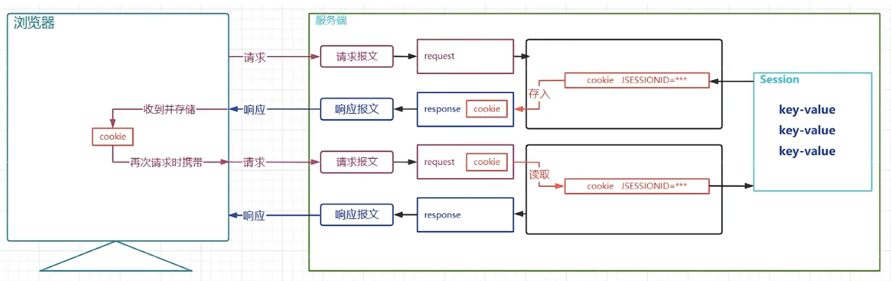

应用场景

1. 记录用户的登录状态
   用户登录后，将用户的账号等敏感信息存入 session
2. 记录用户操作的历史
   例如记录用户的访问痕迹，用户的购物车信息等临时性的信息

### HttpSession 的使用

定义表单提交用户名

服务端将用户名存入 session，此时会设置 jSessionId 的 cookie

```java
@WebServlet("/set-session")
public class SetSessionServlet extends HttpServlet {
    @Override
    protected void service(HttpServletRequest req, HttpServletResponse resp) throws ServletException, IOException {
        resp.setContentType("text/html;charset=UTF-8");
        PrintWriter writer = resp.getWriter();
        // 获取请求的username 参数
        String username = req.getParameter("username");
        // 创建session
        HttpSession session = req.getSession();
        String jSessionId = session.getId();
        session.setAttribute("username", username);
        if (session.isNew()) {
            writer.println("创建了一个新的session：" + jSessionId);
        } else {
            writer.println("获取了一个旧的session：" + jSessionId);
        }
        writer.println("设置了 username:" + username);
    }
}
```

服务端从响应收到 jSessionId  cookie 

另一个请求携带了 jSessionId  ，服务端根据 jSessionId 获取 session 然后从 session 获取用户名

```java
@WebServlet("/get-cookie")
public class GetCookieServlet extends HttpServlet {
    @Override
    protected void service(HttpServletRequest req, HttpServletResponse resp) throws ServletException, IOException {
        Cookie[] cookies = req.getCookies();
        if (cookies != null) {
            for (Cookie cookie : cookies) {
                System.out.println(cookie.getName() + "=" + cookie.getValue());
            }
        }
    }
}
```

`getSession()` 方法的逻辑

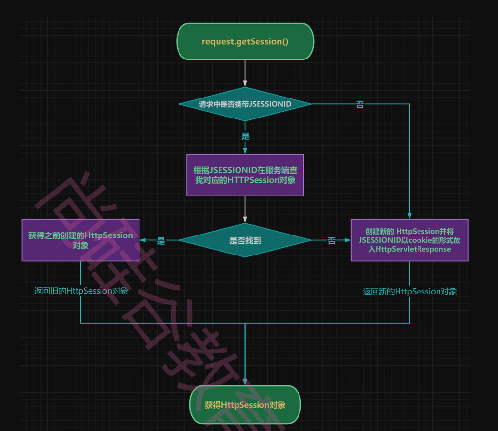

### HttpSession 的时效性

设置 session 的时效的原因

- 用户量很大之后，Session 对象相应的也要创建很多。如果一味创建不释放，那么服务器端的内存迟早要被耗尽；
- 客户端关闭行为无法被服务端直接侦测，或者客户端较长时间不操作也经常出现，类似这些的情况，就需要对 session 的时限进行设置了;

默认的 session 最大闲置时间（两次使用同一个 session 中的间隔时间）在 `Tomcat/conf/web.xml` 配置为 30 分钟。

```xml
    <session-config>
        <session-timeout>30</session-timeout>
    </session-config>
```

也可以通过 HttpSession 的 API 对最大闲置时间进行设定。

```java
//设置最大闲置时间
session.setMaxInactiveInterval(60);
```

也可以直接让 session 失效。

```java
// 直接让session失效
session.invalidate();
```

## 三大域对象

* 请求域（HttpServletRequest）：传递数据的范围是一次请求之内及请求转发
* 会话域（HttpSession）：传递数据的范围是一次会话之内，可以跨多个请求
* 应用域（ServletContext）：传递数据的范围是本应用之内，可以跨多个会话

> 还有一个最小的域对象，page：作用范围是整个 *JSP* 页面，是四大作用域中最小的一个；生命周期是当对 *JSP* 的请求时开始，当响应结束时销毁。对 *page* 对象的引用通常存储在 *pageContext* 对象中。

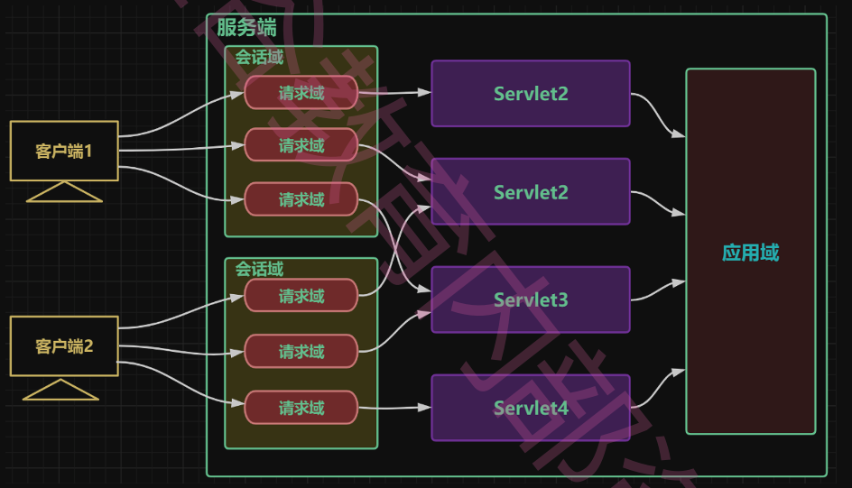

域对象的使用

| API                                         | 功能                    |
| ------------------------------------------- | ----------------------- |
| void setAttribute(String name, String value) | 向域对象中添加/修改数据 |
| Object getAttribute(String name);           | 从域对象中获取数据      |
| void removeAttribute(String name);          | 移除域对象中的数据      |

## 会话管理开发案例

需求说明：通过 SysLoginController 登录成功时，要将登录用户的信息放入 session 域 ，帮助其他业务判断用户是否登录。

```java
@WebServlet("/user/*")
public class SysUserController extends BaseController {

    private SysUserService sysUserService = new SysUserServiceImpl();

    private void login(HttpServletRequest req, HttpServletResponse resp) throws IOException {
        // 获取用户名和密码
        String username = req.getParameter("username");
        String password = req.getParameter("password");
        // 调用业务层方法
        SysUser loginUser = sysUserService.findByUserName(username);
        // 如果用户名存在
        if (loginUser != null) {
            if (loginUser.getPassword().equals(EncryptUtils.md5(password))) {
                // 登录成功
                HttpSession session = req.getSession();
                session.setAttribute("loginUser", loginUser);
                resp.sendRedirect("/schedule.html");
            } else {
                // 登录失败
                resp.getWriter().write("密码有误");
            }
        } else {
            resp.getWriter().write("用户名不存在");
        }
    }

}

```


# Servlet 过滤器

## 过滤器概述

Filter, 即过滤器，是 JAVAEE 技术规范之一，作用目标资源的请求进行过滤的一套技术规范，是 JavaWeb 项目中最为实用的技术之一

- Filter 接口定义了过滤器的开发规范，所有的过滤器都要实现该接口
- Filter 的工作位置是项目中所有目标资源之前，容器在创建 HttpServletRequest 和 HttpServletResponse 对象后，会先调用 Filter 的 doFilter 方法
- Filter 的 doFilter 方法可以控制请求是否继续，如果放行，则请求继续，如果拒绝, 则请求到此为止, 由过滤器本身做出响应
- Filter 不仅可以对请求做出过滤, 也可以在目标资源做出响应前, 对响应再次进行处理
- Filter 是 GOF 中 **责任链模式** 的典型案例

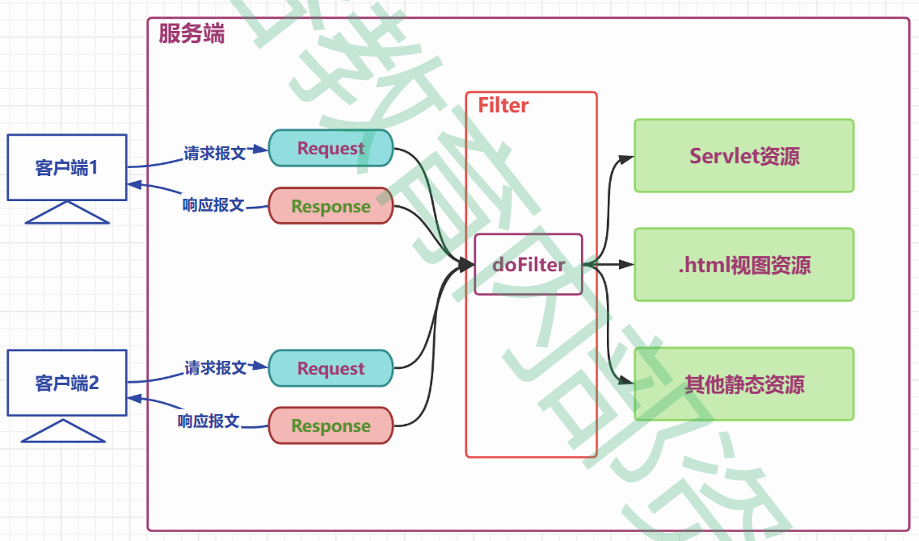

应用场景：登录权限检查，解决网站乱码，过滤敏感字符，日志记录，性能分析，跨域问题.…

## Filter 接口

```java
public interface Filter {
    // 初始化 传入初始配置信息 FilterConfig
    default void init(FilterConfig filterConfig) throws ServletException {
    }

    // 核心方法 过滤请求并决定是否放行
    void doFilter(ServletRequest var1, ServletResponse var2, FilterChain var3) throws IOException, ServletException;

    // 销毁方法 容器回收过滤器之前调用
    default void destroy() {
    }
}
```

## 使用 Filter 

实现 filter 接口

```java
public class LoggingFilter implements Filter {


    @Override
    public void doFilter(ServletRequest servletRequest, ServletResponse servletResponse, FilterChain filterChain) throws IOException, ServletException {
        // 请求到达目标资源前的功能代码
        System.out.println("LoggingFilter before work");
        // 放行代码
        filterChain.doFilter(servletRequest, servletResponse);
        // 响应离开目标资源后的功能代码
        System.out.println("LoggingFilter after work");
    }
}
```

通过 web.xml 配置

```xml
<!--配置filter-->
    <filter>
        <filter-name>loggingFilter</filter-name>
        <filter-class>com.tintin.demoservlet.filter.LoggingFilter</filter-class>
    </filter>
    <!--为filter配置目标资源-->
    <filter-mapping>
        <filter-name>loggingFilter</filter-name>
        <!--根据servlet确定目标资源-->
        <servlet-name>servlet1</servlet-name>
        <servlet-name>servlet2</servlet-name>
        <!--根据url确定目标资源-->
        <url-pattern>/*</url-pattern>
    </filter-mapping>
```

效果

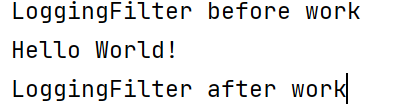

打印日志实践

```java
public class LoggingFilter implements Filter {

    private SimpleDateFormat sdf = new SimpleDateFormat("yyyy-MM-dd HH:mm:ss");

    @Override
    public void doFilter(ServletRequest servletRequest, ServletResponse servletResponse, FilterChain filterChain) throws IOException, ServletException {
        // 请求到达目标资源前的功能代码
        HttpServletRequest httpServletRequest = (HttpServletRequest) servletRequest;
        String requestURI = httpServletRequest.getRequestURI();
        System.out.println(requestURI + "资源访问时间：" + sdf.format(new Date()));
        long t1 = System.currentTimeMillis();
        // 放行代码
        filterChain.doFilter(servletRequest, servletResponse);
        // 响应离开目标资源后的功能代码
        long t2 = System.currentTimeMillis();
        System.out.println(requestURI + "资源访问耗时：" + (t2 - t1) + "ms");
    }
}
```

## Filter 的生命周期

```java
public class LifeCircleFilter implements Filter {

    /**
     * 1 实例化 —— 第一次请求
     * 2 初始化 —— 构造方法之后
     * 3 执行过滤 —— 每一次请求
     * 4 销毁 —— Tomcat容器关闭时
     */
    public LifeCircleFilter() {
        System.out.println("LifeCircleFilter实例化");
    }

    @Override
    public void init(FilterConfig filterConfig) throws ServletException {
        System.out.println("LifeCircleFilter初始化");
    }

    @Override
    public void doFilter(ServletRequest servletRequest, ServletResponse servletResponse, FilterChain filterChain) throws IOException, ServletException {
        System.out.println("LifeCircleFilter已执行");
        filterChain.doFilter(servletRequest, servletResponse);
        System.out.println("LifeCircleFilter已放行请求");
    }

    @Override
    public void destroy() {
        System.out.println("LifeCircleFilter销毁");
    }
}
/*
LifeCircleFilter实例化
LifeCircleFilter初始化
LifeCircleFilter已执行
LifeCircleFilter已放行请求
LifeCircleFilter销毁
*/
```

## FilterChain 过滤器链

已个 web 项目中可以同时定义多个过滤器，多个过滤器对同一个资源进行过滤时，工作位置有先后，整体形成一个工作链，称为过滤器链。

- 过滤器链中的过滤器的顺序由 `filter-mapping` 顺序决定；
- 每个过滤器过滤的范围不同，针对同一个资源来说，过滤器链中的过滤器个数可能是不同的；
- 如果某个 Filter 是使用 `ServletName` 进行匹配规则的配置，那么这个 Filter 执行的优先级要更低；

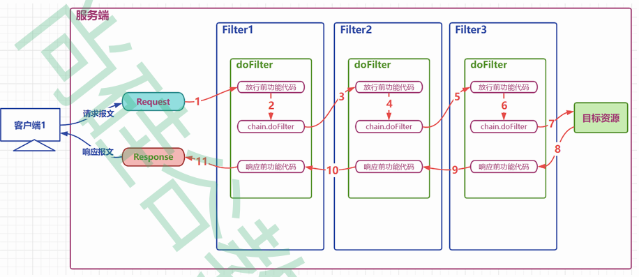

## 注解方式配置 Filter

```java
@WebFilter(
        filterName = "annotationFilter", // 在servlet3.0之后，过滤的顺序，使用过滤器名的自然排序。
        urlPatterns = "/*",
        servletNames = {"Servlet1", "Servlet2"},
        initParams = {@WebInitParam(name = "k1", value = "v1"), @WebInitParam(name = "k2", value = "v2")})
public class AnnotationFilter implements Filter {
    @Override
    public void doFilter(ServletRequest servletRequest, ServletResponse servletResponse, FilterChain filterChain) throws IOException, ServletException {
        System.out.println("AnnotationFilter已执行");
        filterChain.doFilter(servletRequest, servletResponse);
        System.out.println("AnnotationFilter已放行请求");
    }
}
```

## 过滤器开发案例

需求说明：未登录状态下不允许访问 showShedule.html 和 SysScheduleController 相关增删改处理，重定向到 login.html，登录成功后可以自由访问。

```java
@WebFilter(urlPatterns = {"/schedule/*", "/schedule.html"})
public class LoginFilter implements Filter {

    @Override
    public void doFilter(ServletRequest servletRequest, ServletResponse servletResponse, FilterChain filterChain) throws IOException, ServletException {
        // 请求对象响应对象向下转型
        HttpServletRequest httpServletRequest = (HttpServletRequest) servletRequest;
        HttpServletResponse httpServletResponse = (HttpServletResponse) servletResponse;
        // 获取session 判断域值（登录用户对象）是否存在 存在则放行，不存在则重定向到登录页面
        HttpSession session = httpServletRequest.getSession();
        Object loginUser = session.getAttribute("loginUser");
        if (loginUser != null) {
            filterChain.doFilter(servletRequest, servletResponse);
        } else {
            httpServletResponse.sendRedirect("/login.html");
        }
    }
}
```


# Servlet 监听器

## 监听器概述

监听器：专门用于对域对象对象身上发生的事件或状态改变进行监听和相应处理的对象；

- 监听器是 GOF 设计模式中，观察者模式的典型案例;
- 监听器使用的感受类似 JS 中的事件，被观察的对象发生某些情况时，自动触发代码的执行；
- 监听器并不监听 web 项目中的所有组件，仅仅是对三大域对象做相关的事件监听;

监听器的分类：

web 中定义八个监听器接口作为监听器的规范，这八个接口按照不同的标准可以形成不同的分类

- 按监听的对象划分：
  - application 域监听器： `ServletContextListener` `ServletContextAttributeListener`
  - session 域监听器： `HttpSessionListener` `HttpSessionAttributeListener` `HttpSessionBindingListener` `HttpSessionActivationListener` 
  - request 域监听器： `ServletRequestListener` `ServletRequestAttributeListener`
- 按监听的事件分：
  - 域对象的创建和销毀监听器：`ServletContextListener` `HttpSessionListener` `ServletRequestListener` 
  - 域对象数据增删改事件监听器：`ServletContextAttributeListener` `HttpSessionAttributeListener` `ServletRequestAttributeListener` 
  - 其他监听器： `HttpSessionBindingListener` `HttpSessionActivationListener`

## 监听域对象创建、销毁、属性增删改

以 session 域监听器为例

监听域对象创建、销毁

```java
@WebListener
public class SessionListener implements HttpSessionListener {
    @Override
    public void sessionCreated(HttpSessionEvent se) {
        HttpSession session = se.getSession();
        System.out.println("session:" + session.getId() + "创建了");
    }

    @Override
    public void sessionDestroyed(HttpSessionEvent se) {
        HttpSession session = se.getSession();
        System.out.println("session:" + session.getId() + "销毁了");
    }
}
```

监听域对象属性增删改

```java
@WebListener
public class SessionAttributeListener implements HttpSessionAttributeListener {
    @Override
    public void attributeAdded(HttpSessionBindingEvent event) {
        HttpSession session = event.getSession();
        System.out.println("session:" + session.getId() + "属性添加 " + event.getName() + "=" + event.getValue());
    }

    @Override
    public void attributeRemoved(HttpSessionBindingEvent event) {
        HttpSession session = event.getSession();
        System.out.println("session:" + session.getId() + "属性替换 " + event.getName() + "=" + event.getValue());
    }

    @Override
    public void attributeReplaced(HttpSessionBindingEvent event) {
        HttpSession session = event.getSession();
        System.out.println("session:" + session.getId() + "属性替换 " + event.getName() + "=" + event.getValue());
    }
}
```

## Session 绑定监听、钝化活化监听

HttpSessionBindingListener 监听当前监听器对象在 Session 域中的增加与移除

HttpSessionActivationListener 监听某个对象在 Session 中的序列化与反序列化

# Ajax

## 什么是 Ajax 

* AJAX = Asynchronous JavaScript and XML （异步的 JavaScript 和 XML）； 
* AJAX 不是新的编程语言，而是一种使用现有标准的新方法；
* AJAX 最大的优点是在不重新加载整个页面的情况下，可以与服务器交换数据并更新部分网页内容；
* AJAX 不需要任何浏览器插件，但需要用户允许 JavaScript 在浏览器上执行；
* JavaScript 原生对象 XMLHttpRequest 只是实现 Ajax 的一种方式；

工作原理：

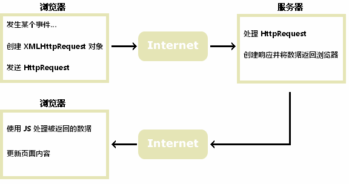

> HTTP 的天然工作模式就是“请求-响应”的同步模式，在发送数据和得到数据的过程中有一个等待的过程，等待的过程并不消耗 CPU，但是会让当前线程陷入等待。例如请求一个页面，等待页面出现的过程。
>
> 在编程模型层面上，我们可以实现出同步 IO 和异步 IO 的客户端与服务端的交互模式。
>
> * 同步：调用一个 HTTP 请求函数后，代码就停在那里，直到拿到响应才继续往下走。
> * 异步：异步地向服务器发送请求，在等待响应的过程中，不会阻塞当前页面，在这种情况下，浏览器可以做自己的事情。直到成功获取响应后，浏览器才开始处理响应数据。例如 JS 的 XMLHttpRequest 、jquery 的$.ajax、VUE 的 axios ，这些都是实现 ajax 技术 的 API。

## XMLHttpRequest

XMLHttpRequest 是 AJAX 的基础。XMLHttpRequest 用于在后台与服务器交换数据。这意味着可以在不重新加载整个网页的情况下，对网页的某部分进行更新。

> 所有现代浏览器均支持 XMLHttpRequest 对象（IE5 和 IE6 使用 ActiveXObject）。

```html
<!DOCTYPE html>
<html lang="en">
<head>
    <meta charset="UTF-8">
    <title>Title</title>
    <script>
        function getMessage(){
            // 实例化一个XMLHttpRequest对象
            var xhr = new XMLHttpRequest();
            // 设置请求方式和 URL
            xhr.open('get','/demo_servlet/hello-servlet');
            // 设置回调函数
            // readyState 1 2 3 4
            // status 响应行状态码
            xhr.onreadystatechange = function(){
                if(xhr.readyState === 4){
                    if(xhr.status >= 200 && xhr.status < 300){
                        document.getElementById('div1').innerHTML = xhr.responseText;
                    }else{
                        alert('请求失败');
                    }
                }
            }
            xhr.send();
        }
    </script>
</head>
<body>
    <button onclick="getMessage()">点我测试ajax</button>
    <div id="div1"></div>
</body>
</html>
```

## Ajax 开发案例

需求：注册提交前校验用户名是否占用功能

添加公共 JSON 数据响应类（统一格式：由前后端一起遵守）

```java
/**
 * 统一 API 响应结果封装
 * @param <T> 数据类型
 */
public class Result<T> implements Serializable {

    private static final long serialVersionUID = 1L;

    // 默认成功码
    private static final int DEFAULT_SUCCESS_CODE = 200;
    // 默认失败码
    private static final int DEFAULT_ERROR_CODE = 500;

    // 状态码
    private int code;
    // 提示消息
    private String message;
    // 返回数据
    private T data;

    /**
     * 无参构造（JSON 序列化需要）
     */
    public Result() {

    }

    /**
     * 全参构造（私有，通过工厂方法调用）
     */
    private Result(int code, String message, T data) {
        this.code = code;
        this.message = message;
        this.data = data;
    }

    // ==================== 成功响应 ====================

    /**
     * 成功响应（无数据）
     */
    public static <T> Result<T> success() {
        return new Result<>(DEFAULT_SUCCESS_CODE, "success", null);
    }

    /**
     * 成功响应（带数据）
     */
    public static <T> Result<T> success(T data) {
        return new Result<>(DEFAULT_SUCCESS_CODE, "success", data);
    }

    // ==================== 失败响应 ====================

    /**
     * 失败响应（带数据）
     */
    public static <T> Result<T> error(T data) {
        return new Result<>(DEFAULT_ERROR_CODE, "error", data);
    }

    // ==================== 链式设置（方便进一步定制） ====================

    public Result<T> code(int code) {
        this.code = code;
        return this;
    }

    public Result<T> message(String message) {
        this.message = message;
        return this;
    }

    public Result<T> data(T data) {
        this.data = data;
        return this;
    }

    // ==================== Getter / Setter ====================

    public int getCode() {
        return code;
    }

    public void setCode(int code) {
        this.code = code;
    }

    public String getMessage() {
        return message;
    }

    public void setMessage(String message) {
        this.message = message;
    }

    public T getData() {
        return data;
    }

    public void setData(T data) {
        this.data = data;
    }


    @Override
    public String toString() {
        return "Result{" +
                "code=" + code +
                ", message='" + message + '\'' +
                ", data=" + data +
                '}';
    }
}
```

webutils 工具类

页面 js 代码

```javascript
function checkUsername() {
            var usernameInput = document.getElementById("input-username");
            var usernameSpan = document.getElementById("span-username");
            var username = usernameInput.value.trim();
            if (username === "") {
                usernameSpan.textContent = "用户名不能为空";
                usernameSpan.style.color = "red";
                return false;
            }
            var usernameRegex = /^[a-zA-Z0-9_]{3,20}$/;
            if (!usernameRegex.test(username)) {
                usernameSpan.textContent = "用户名必须由3-20个字母、数字或下划线组成";
                usernameSpan.style.color = "red";
                return false;
            }
            // 格式校验通过，校验用户名是否占用
            var xhr = new XMLHttpRequest();
            xhr.open("GET", "/user/checkUsername?username=" + username);
            xhr.onreadystatechange = function () {
                if (xhr.readyState === 4 && xhr.status === 200) {
                    var result = JSON.parse(xhr.responseText);
                    if (result.code === 200) {
                        usernameSpan.textContent = result.data;
                        usernameSpan.style.color = "green";
                        return true;
                    }  else {
                        if (result.data != null)
                        usernameSpan.textContent = result.data;
                        usernameSpan.style.color = "red";
                    }
                    return false;
                }
            };
            xhr.send();
            // usernameSpan.textContent = "OK";
            // usernameSpan.style.color = "green";
            return true;
        }
```

# 前端工程化

## 前端工程化概述

前端工程化是使用软件工程的方法来单独解决前端的开发流程中模块化、组件化、规范化、自动化的问题，其主要目的为了提高效率和降低成本。

前端工程化实现技术栈，例如：

* ECMAScript6：VUE3 中大量使用 ES6 语法

* Nodejs：前端项目运行环境

* npm：依赖下载工具;

* Vite：前端项目构建工具

* VUE3：优秀的渐进式前端框架

* Router：通过路由实现页面切换

* Pinia：通过状态管理实现组件数据传递;

* Axios：ajax 异步请求封装技术实现前后端数据交互

* Element-plus：可以提供丰富的快速构建网页的组件仓库

  还有 [Bootstrap](https://getbootstrap.com/) 和 [Tailwind CSS](https://www.tailwindcss.cn/) ， 他们与 JS 的耦合程度更低，灵活性更高，尤其是 Tailwind CSS 采用原子级别的样式，JS 不参与样式。

## ECMAScript6

[ECMAScript6 参考](../../前端/ECMAScript6/index.md)

## Node.js 运行环境 

### Node.js 简介

Node.js 是一个基于 ChromeV8 引擎的 JavaScript 运行时环境，可以使 JavaScript 运行在服务器端。使用 Node.js，可以方便地开发服务器端应用程序，如 Web 应用、API、后端服务，还可以通过 Node.js 构建命令行工具等。

相比于传统的服务器端语言（如 PHP、Java、Python 等），Node.js 具有以下特点:

- 单线程，但是采用了事件驱动、异步 1/O 模型，可以处理高并发请求；
- 轻量级，使用 C++编写的 V8 引擎让 Node.js 的运行速度很快；
- 模块化，Node.js 内置了大量模块，同时也可以通过第三方模块扩展功能；
- 跨平台，可以在 Windows、Linux、Mac 等多种平台下运行；

Node.js 的核心是其管理事件和异步 I/O 的能力。Node.js 的异步 l/O 使其能够处理大量并发请求，并且能够避免在等待 I/O 资源时造成的阻塞。此外，Node.js 还拥有高性能网络库和文件系统库，可用于搭建 WebSocket 服务器、上传文件等。在 Node.js 中，我们可以使用 JavaScript 来编写服务器端程序，这也使得前端开发人员可以利用自己已经熟悉的技能来开发服务器端程序，同时也让 JavaScript 成为一种全栈语言。Node.js 受到了广泛的应用，包括了大型企业级应用、云计算、物联网、游戏开发等领域。常用的 Node.js 框架包括 Express、Koa、Egg.js 等，它们能够显著提高开发效率和代码质量。

### Node.js 安装及使用

[Node.js — 让 JavaScript 无处不在 - Node.js 运行环境](https://node.org.cn/en)

```shell
# 定义 app.js 文件并编写代码
# 使用node运行
node app.js
```

## NPM 依赖下载

NPM 全称 Node Package Manager，是 Node.js 包管理工具，是全球最大的模块生态系统，里面所有的模块都是开源免费的；也是 Node.js 的包管理工具，相当于后端的 Maven 的部分功能。

安装 Nodejs，通常也会自动安装 npm 包管理工具

npm 安装依赖包时默认使用官方源，若要切换源，如阿里镜像源，执行以下命令：

```shell
npm config registry https://registry.npmmirror.com
npm config get registyr # 查看
```

配置全局依赖的下载存储位置：

```shell
 npm config prefix "D:/GlobalNodeModules"
 npm config get prefix
```

升级 npm

```shell
npm -v
npm install -g npm@9.6.6
npm -v
```

常见命令

| 命令                                  | 说明                                                         |
| :------------------------------------ | :----------------------------------------------------------- |
| `npm init`                            | 初始化一个新的 `package.json` 文件，交互式输入信息。<br />进入一个文件夹中，执行 npminit 命令后，npm 会引导您在命令行界面上回答一些问题，例如项目名称、版本号、作者、许可证等信息，并最终生成一个 package.json 文件。package.json 信息会包含项基本信息！类似 maven 的 pom.xml。 |
| `npm init -y`                         | 快速创建带有默认设置的 `package.json` 文件。                 |
| `npm install package-name@version`    | 当前目录安装指定包。（存储在当前项目的 node_modules 文件夹中） |
| `npm install -g package-name@version` | 全局安装指定包，使其在系统范围内可用。（存储在 prefix 配置的文件夹中） |
| `npm install`                         | 安装 `package.json` 中列出的所有依赖。                       |
| `npm install package-name --save-dev` | 安装包并添加到 `devDependencies`。                           |
| `npm update package-name`             | 更新指定的依赖包。                                           |
| `npm uninstall package-name`          | 卸载指定的依赖包。                                           |
| `npm uninstall -g package-name`       | 全局卸载指定的包。                                           |
| `npm list`                            | 查看当前项目的已安装依赖包列表。                             |
| `npm list -g --depth=0`               | 查看全局已安装的依赖包列表（不展开依赖树）。                 |
| `npm info package-name`               | 查看包的详细信息，包括版本和依赖等。                         |
| `npm login`                           | 登录到 NPM 账号。                                            |
| `npm publish`                         | 发布当前包到 NPM 注册表。                                    |
| `npm unpublish package-name`          | 从 NPM 注册表中撤销发布的包（一般限 24 小时内）。            |
| `npm cache clean --force`             | 清理 NPM 缓存。                                              |
| `npm audit`                           | 检查项目依赖中的安全漏洞。                                   |
| `npm audit fix`                       | 自动修复已知的漏洞。                                         |
| `npm run script-name`                 | 运行 `package.json` 中定义的脚本，例如 `npm run start`。     |
| `npm start`                           | 运行 `start` 脚本（等同于 `npm run start`）。                |
| `npm test`                            | 运行 `test` 脚本。                                           |
| `npm build`                           | 运行 `build` 脚本。                                          |
| `npm outdated`                        | 列出项目中有可更新版本的依赖包。                             |
| `npm version patch/minor/major`       | 更新 `package.json` 中的版本号，自动更新版本。               |
| `npm ci`                              | 使用 `package-lock.json` 快速安装依赖，适用于 CI/CD 环境。   |

[查看所有依赖](https://www.npmjs.com)

本地安装与全局安装的区别

| 特性     | 本地安装                          | 全局安装                      |
| :------- | :-------------------------------- | :---------------------------- |
| 安装范围 | 仅在当前项目中可用                | 在系统的全局环境中可用        |
| 命令使用 | `npm install package-name`        | `npm install -g package-name` |
| 安装位置 | `node_modules` 目录               | 系统全局目录（依 OS 而异）    |
| 使用场景 | 项目依赖（库、框架）              | CLI 工具、项目生成器          |
| 访问方式 | 通过 `require()` 或 `import` 使用 | 在命令行中直接使用            |
| 依赖声明 | 在 `package.json` 中记录          | 不在 `package.json` 中记录    |
| 版本控制 | 不同项目中可用不同版本            | 系统中只保留一个版本          |
| 权限问题 | 无需特殊权限                      | 可能需要管理员权限            |

package.json 是 Node.js 项目中的一个核心文件，包含了项目的元数据、依赖、脚本等信息。

npm 脚本是一组在 package.json 文件中的 scripts 字段定义的可执行命令，通过 `npm run <脚本名>` 执行。npm 脚本可用于启动应用程序，运行测试，生成文档等，还可以自定义命令以及配置需要运行的脚本。

```json
{
  "name": "my-project", // 项目的名称，通常是小写字母和连字符。
  "version": "1.0.0", // 项目的版本号，遵循 语义化版本规范 (SemVer)。
  "description": "A simple Node.js project", // 项目的简短描述。
  "main": "app.js", // 项目的入口文件，默认为 index.js。
  "scripts": { // 定义项目可执行的脚本命令，如 npm start。
    "start": "node app.js",
    "test": "echo \"Error: no test specified\" && exit 1"
    "build": "webpack"
  },
  "dependencies": { // 项目运行时需要的依赖库，会在安装（npm install）时加入 node_modules，或是 npm install <module> 时在这里记录
    "express": "^4.17.1"
  },
  "devDependencies": { // 开发时使用的依赖库，不会在生产环境中安装。
    "nodemon": "^2.0.20"
  },
  "keywords": ["node", "npm", "example"], // 关键字数组，有助于描述项目并在 NPM 搜索中找到项目。
  "author": "Your Name", // 项目的作者信息。
  "license": "MIT" // 项目的许可证类型，如 MIT、ISC。
}
```

scripts 对象包含 start、test 和 build 三个脚本。当您运行 npm run start 时，将运行 node index.js，并启动应用程序。同样，运 npm run test 时，将运 Jest 测试套件，而 npm run build 将运 webpack 命令以生成最终的构建输出。

总之，`npm run` 命令为您提供了一种在 package.json 文件中定义和管理一组指令的方法，可以在项目中快速且灵活地运行各种操作。

## Vue3 前端框架

### Vue 简介

[Vue](https://cn.vuejs.org/)（发音为/vjui/，类似 view）是一款用于构建用户界面的渐进式 JavaScript 框架。它基于标准 HTML、CSS 和 JavaScript 构建，并提供了一套声明式的、组件化的编程模型，帮助你高效地开发用户界面。无论是简单还是复杂的界面，Vue 都可以胜任。

Vue 的两个核心功能：

* 声明式渲染：Vue 基于标准 HTML 拓展了一套模板语法，使得我们可以声明式地描述最终输出的 HTML 和 JavaScript 状态之间的关系；
* 响应性：Vue 会自动跟踪 JavaScript 状态并在其发生变化时响应式地更新 DOM；

作者：[尤雨溪 Evan You](https://evanyou.me/)

### Vue 快速体验

非工程化的方式

```html
<!DOCTYPE html>
<html lang="en">
<head>
    <meta charset="UTF-8">
    <meta name="viewport" content="width=device-width, initial-scale=1.0">
    <title>Document</title>
    <!--<script src="https://cdn.jsdelivr.net/npm/vue@2/dist/vue.js"></script>--> <!-- vue 2-->
    <script src="https://cdn.jsdelivr.net/npm/vue@3/dist/vue.global.js"></script> <!-- vue 3-->
    <script>
        window.onload = function() {
            // Vue 3
            const app = Vue.createApp({
                setup() {
                    // Vue 会对这里的数据进行代理，任何对这里的数据修改都会触发视图更新
                    let message = "hello"
                    let headLine = 'vue'
                    let colorStyle =  { "background-color": 'aqua' }
                    function changeMessage() {
                        message = "hello world"
                    }
                    function changeColor() {
                        colorStyle = { "background-color": 'red' }
                    }
                    function alertMessage() {
                        alert(message)
                    }
                    return { message, headLine, colorStyle, changeMessage, changeColor, alertMessage }
                }
            });

            app.mount('#app');
        }
    </script>
</head>
<body>
    <div id="app">
        <h1 v-text="message" v-bind:style="colorStyle">Hello vue!</h1>
        <h1>{{message}}</h1>
        <button @click="alertMessage">弹出message</button>
    </div>
</body>
</html>
```

## Vite 项目构建 

### vite 简介

> 在浏览器支持 ES 模块之前，JavaScript 并没有提供原生机制让开发者以模块化的方式进行开发。这也正是我们对“打包”这个概念熟悉的原因：使用工具抓取、处理并将我们的源码模块串联成可以在浏览器中运行的文件。时过境迁，我们见证了诸如 webpack、Rollup 和 Parcel 等工具的变迁，它们极大地改善了前端开发者的开发体验。

痛点

- 当我们开始构建越来越大型的应用时，需要处理的 JavaScript 代码量也呈指数级增长
- 包含数干个模块的大型项自相当普遍。基于 JavaScript 开发的工具就会开始遇到性能瓶颈：通常需要很长时间（甚至是几分钟！）才能启动开发服务器，即使使用模块热替换（HMR），文件修改后的效果也需要几秒钟才能在浏览器中反映出来。如此循环往复，迟钝的反馈会极大地影响开发者的开发效率和幸福感；

[Vite | 下一代的前端工具链](https://cn.vitejs.dev/)

前端工程化的作用包括但不限于以下几个方面：

1. 快速创建项目：使用脚手架可以快速搭建项目基本框架，避免从零开始搭建项目的重复劳动和繁琐操作，从而节省时间和精力；
2. 统一的工程化规范：前端脚手架可以预设项目目录结构、代码规范、git 提交规范等统一的工程化规范，让不同开发者在同一个项目上编写出风格一致的代码，提高协作效率和质量；
3. 代码模板和组件库：前端脚手架可以包含一些常用的代码模板和组件库，使开发者在实现常见功能时不再重复造轮子，避免因为轮子质量不高带来的麻烦，能够更加专注于项自的业务逻辑；
4. 自动化构建和部署：前端脚手架可以自动进行代码打包、压缩、合并、编译等常见的构建工作，可以通过集成自动化部署脚本，自动将代码部署到测试、生产环境等;

### 通过 vite 使 vue3 项目工程化

```shell
# npm create 是一个强大的命令，用于快速创建新的项目模板。它通过调用特定的初始化器（initializer）来生成项目结构和必要的配置文件，从而简化开发者的工作流程。
npm create vite

# 首次需要下载 create-vite.js 依赖
# 输入项目名称 如 demo-vite-vue3
# 选择 vue + javascript
# 选择通过npm安装所有依赖（或后续手动 npm install）

# 进入目录
cd ./demo-vite-vue3
# 运行
npm run dev
```

测试

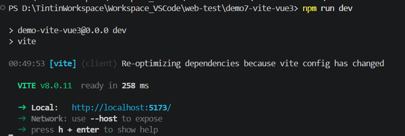

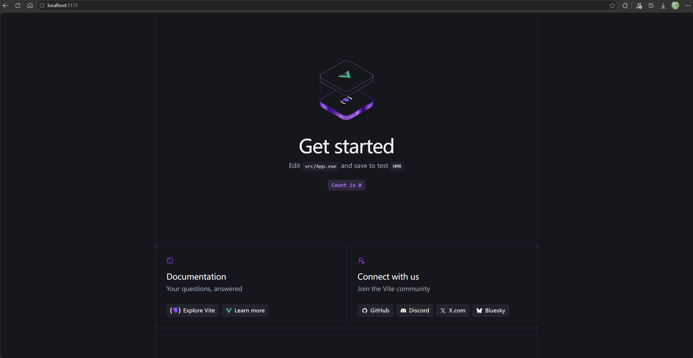

### JavaScript or TypeScript

TS 是 JS 的一个超集，使用 TS 之后，JS 的语法更加的像 JAVA，实际开发中用的确实更多，但 TS 不是非学不可，不用 TS 仍然可以正常开发工程化的前端项目，对于学 JAVA 的我们来说，学习 TS 非常容易，但也要时间建议学完完整的前端工程化内容，然后再根据需求单独学习 TS 即可。

### Vue3 项目的目录结构

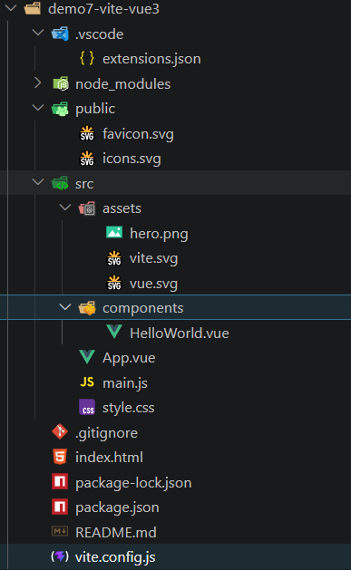

* public 目录：用于存放一些公共资源，如 HTML 文件、图像、字体等，这些资源会被直接复制到构建出的自标自录中。
* src 目录：存放项目的源代码，包括 JavaScript、CSS、Vue 组件、图像和字体等资源。在开发过程中，这些文件会被 Vite 实时编译和处理，并在浏览器中进行实时预览和调试。以下是 src 内部划分建议：
  - assets 目录：用于存放一些项目中用到的静态资源，如图片、字体、样式文件等。components／ 目录：用于存放组件相关的文件。组件是代码复用的一种方式，用于抽象出一个可复用的 ∪ 部件，方便在不同的场景中进行重复使用。
  - layouts 目录：用于存放布局组件的文件。布局组件通常负责整个应用程序的整体布局，如头部、底部、导航菜单等。
  - pages 目录：用于存放页面级别的组件文件，通常是路由对应的组件文件。在这个目录下，可以创建对应的文件夹，用于存储不同的页面组件。
  - plugins 目录：用于存放 Vite 插件相关的文件，可以按需加载不同的插件来实现不同的功能，如自动化测试、代码压缩等。
  - router 目录：用于存放 Vue.js 的路由配置文件，负责管理视图和 URL 之间的映射关系，方便实现页面之间的跳转和数据传递。
  - store 目录：用于存放 Vuex 状态管理相关的文件，负责管理应用程序中的数据和状态，方便统一管理和共享数据，提高开发效率。
  - uti1s 目录：用于存放一些通用的工具函数，如日期处理函数、字符串操作函数等。
* vite.configjs 文件：Vite 的配置文件，可以通过该文件配置项目的参数、插件、打包优化等。该文件可以使用 CommonJS 或 ES6 模块的语法进行配置。
* package.json 文件：标准的 Node.js 项目配置文件，包含了项目的基本信息和依赖关系。其中可以通过 scripts 字段定义几个命令，如 dev、build、serve 等，用于启动开发、构建和启动本地服务器等操作。

Vite 项目的入口为 src/main.js 文件，这是 Vue.js 应用程序的启动文件，也是整个前端应用程序的入口文件。在该文件中，通常会引入 Vue.js 及其相关插件和组件，同时会创建 Vue 实例，挂载到 HTML 页面上指定的 DOM 元素中。

运行设置端口号：(vite.config.js)。

```js
import { defineConfig } from 'vite'
import vue from '@vitejs/plugin-vue'

// https://vite.dev/config/
export default defineConfig({
  plugins: [vue()],
  server: {
    port : 3000
  }
})
```

### 单文件组件 SFC

Vue 的单文件组件 (即 `*.vue` 文件，英文 Single-File Component，简称 SFC) 是一种特殊的文件格式，使我们能够将一个 Vue 组件的模板、逻辑与样式封装在单个文件中。

* 一个页面作为整体，是由多个部分组成的，每个部分在这里就可以理解为一个组件；
* 每个 `.vue` 文件就可以理解为一个组件，多个 `.vue` 文件可以构成一个整体页面；
* 组件化给我们带来的另一个好处就是组件的复用和维护非常的方便;

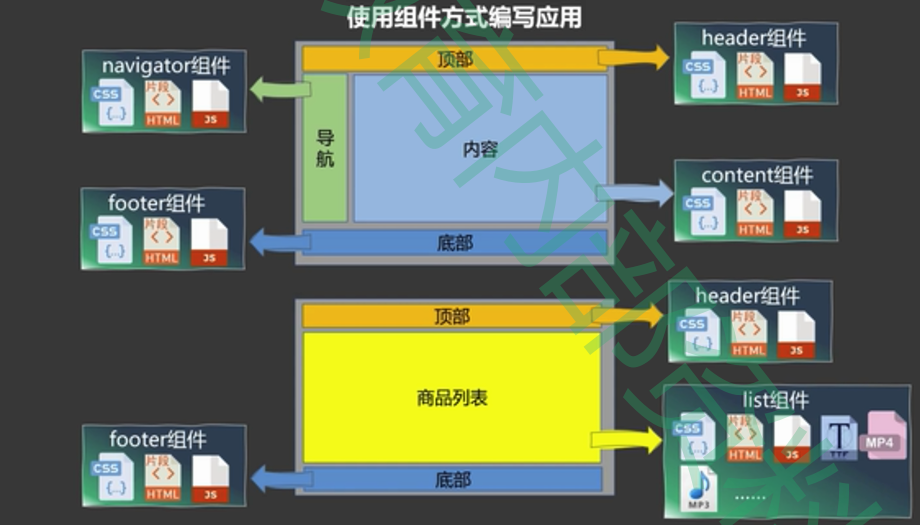

`.vue` 文件的组成：

* 传统的页面有 html 文件 css 文件和 js 文件三个文件组成(多文件组件）；
* vue 将这文件合并成一个 vue 文件(Single-File Component，简称 SFC，单文件组件); vue 文件对 js/css/html 统一封装，这是 VUE 中的概念，该文件由三个部分组成 `<script><template> <style> `
  * `template` 标签代表组件的 html 部分代码，代替传统的 html 文件；
  * `script` 标签代表组件的 js 代码，代替传统的 js 文件；
  *  `style` 标签代表组件的 css 样式代码，代替传统的 css 文件；

如何组织这些文件：

index.html 是项目的入口，其中 `<div id= 'app'></div>` 是用于挂载所有组建的元素；

index.html 中的 script 标签引入了一个 main.js 文件，具体的挂载过程在 main.js 中执行；

```html
<!doctype html>
<html lang="en">
  <head>
    <meta charset="UTF-8" />
    <link rel="icon" type="image/svg+xml" href="/favicon.svg" />
    <meta name="viewport" content="width=device-width, initial-scale=1.0" />
    <title>demo-vite-vue3</title>
  </head>
  <body>
    <div id="app"></div>
    <script type="module" src="/src/main.js"></script><!--将 App.vue 挂载到 div 中-->
  </body>
</html>

```

main.js 是 vue 工程中非常重要的文件，他决定这项目使用哪些依赖，导入的第一个组件；

```js
import { createApp } from 'vue' // 从vue框架导入 createApp
import './style.css' // 全局样式
import App from './App.vue' //  导入 App.vue 组件

createApp(App).mount('#app') // 使用 App.vue 生成对象 并挂载到全局div中

```

App.vue 是 vue 中的核心组件，所有的其他组件都要通过该组件进行导入，该组件通过路由可以控制页面的切换；

```vue
<script setup>
import HelloWorld from './components/HelloWorld.vue' // 引入组件
</script>

<template>
  <HelloWorld /> <!--通过引入的别名 使用组件-->
</template>

```

总体结构

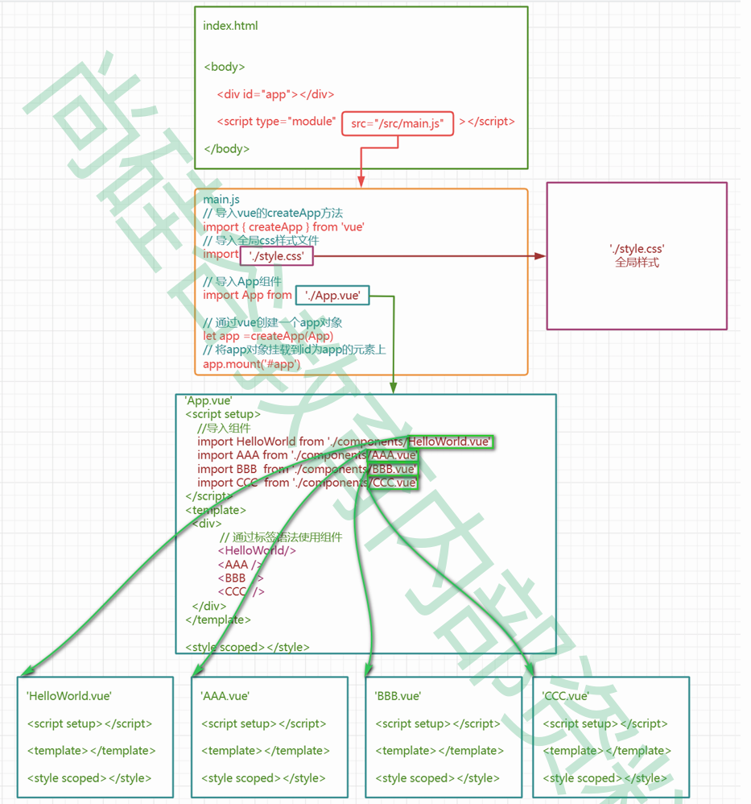

### CSS 样式导入

1. 全局引入 main.js;

```js
// main.js书写引入的资源的相对路径即可！
import'./style/reset.css'
```

2. vue 文件 script 代码引入;

```
<script setup>
import './style/reset.css'
</script>
```

3. Vue 文件 style 代码引入;

```
<style scoped>
@import './style/reset.css
</style>
```

### 选项式和组合式

**选项式 API (Options API)**

关于响应式的含义，见下方 [响应式数据](#响应式数据与 setup 函数语法糖) 讲解

```vue
<script>
export default {
  // data() 返回的属性将会成为响应式的状态
  // 并且暴露在 `this` 上
  data() {
    return {
      count: 0
    }
  },

  // methods 是一些用来更改状态与触发更新的函数
  // 它们可以在模板中作为事件处理器绑定
  methods: {
    increment() {
      this.count++
    }
  },

  // 生命周期钩子会在组件生命周期的各个不同阶段被调用
  // 例如这个函数就会在组件挂载完成后被调用
  mounted() {
    console.log(`The initial count is ${this.count}.`)
  }
}
</script>

<template>
  <button @click="increment">Count is: {{ count }}</button>
</template>
```

**组合式 API (Composition API)**

见下方 [响应式数据](#响应式数据与 setup 函数语法糖) 讲解，组合式 API 通常搭配 setup 函数语法糖

### 响应式数据与 setup 函数语法糖

- 响应式数据：在数据变化时，vue 框架会将变量最新的值更新到 dom 树中，页面数据就是实时最新的
- 非响应式数据：在数据变化时，vue 框架不会将变量最新的值更新到 dom 树中，页面数据就不是实时最新的

Vue2 中，数据不做特殊处理，默认就是响应式的。Vue3 中，数据要经过 ref/reactive 函数的处理才是响应式的。ref（reactive）函数时 vue 框中给我们提供的方法，导入进来即可使用。

>  在 script 标签中，操作 ref 的响应式数据需要操作 ref 对象的 value 。

```vue
<script type="module">
	//存储vue页面逻辑js代码
    import {ref} from 'vue'
    export default{
        setup( ) {	
            //let counter = 1 非响应
            let counter = ref(1)
            function increase(){
                //通过.value修改响应式数据
                counter.value++
            }
            function decrease(){
            	counter.value--
            }
            return {
            	counter,increase,decrease
            }
        }
    }
</script>
<template>
    <div>育内部资
    <button @click="decrease()">-</button>{{ counter }}
    <button @click="increase()">+</button></div>
</template>
<style scoped>
	button{
    	border: 1px solid red;
    }
</style>
```

setup 函数语法糖

这个 `setup` attribute 是一个标识，告诉 Vue 需要在编译时进行一些处理，让我们可以更简洁地使用组合式 API。比如，`<script setup>` 中的导入和顶层变量/函数都能够在模板中直接使用。

```vue
<script setup>
    let a = 1;
</script>
<!--等价于-->
<script>
    export default{
        setup( ) {
            let a = 1
            return {
            	a
            }
        }
    }
</script>
```

## Vue 基础

### 模板语法

```vue
<script setup>
    import { ref } from 'vue'
    // 定义一些数据和函数
    let msg = 'Hello Vue3'
    let styleMsg = '<strong style="color: red;">Hello Vue3</strong>'
    let name = 'Li Hua'
    let age = 18
    let isActive = true
    let getMsg = () => {
        return 'Hello Vue3'
    }
    let imgUrl = 'https://vuejs.org/images/logo.png'
    let officialWebsites = [
        { name: 'Vue.js', url: 'https://vuejs.org/', logo: 'https://vuejs.org/images/logo.png' },
        { name: 'React', url: 'https://reactjs.org/', logo: 'https://reactjs.org/images/logo.png' },
        { name: 'Angular', url: 'https://angular.io/', logo: 'https://angular.io/images/logo.png' }
    ]
    let carts = [
        { id: 1, name: '苹果', price: 5 },
        { id: 2, name: '香蕉', price: 3 },
        { id: 3, name: '橘子', price: 4 }
    ]
    function getCartTotal() {
        return carts.reduce((total, cart) => total + cart.price, 0)
    }
    function handleClick() {
        alert('按钮被点击了！')
    }
    let clickCount = ref(0);
    function clickCountAdd() {
        clickCount.value++
    }
    function hrefConfirm(event) {
        if (!confirm('你确定要离开吗？')) {
            event.preventDefault()
        }
    }
    function hrefStop(event) {
        alert('阻止离开')
    }
</script>
<template>
  <div>
    <h2>一. 模板语法</h2>

    <h3>
        文本插值 使用“Mustache”语法，即双大括号<br/>
        插值表达式是将数据渲染到元素的指定位置的手段之一<br/>
        插值表达式不绝对依赖标签，其位置相对自由<br/>
        插值表达式中支持 JavaScript 的运算表达式<br/>
        插值表达式中也支持函数的调用<br/>
    </h3>
    <p>消息 : "{{ msg }}"</p>
    <p>返回消息："{{ getMsg() }}""</p>
    <p>姓名: {{ name }}</p>
    <p>姓氏: {{ name.split(' ')[0] }}</p>
    <p>名字: {{ name.split(' ')[1] }}</p>
    <p>年龄: {{ age }}</p>
    <p>是否成年: {{ age >= 18 ? '是' : '否' }}</p>
    <p>状态: {{ isActive ? '激活' : '未激活' }}</p>
    <p>购物车第一项: {{ carts[0]?.name || '无' }}</p>
    <p>购物车总价: {{ getCartTotal() }}</p>
    

    <h3>
        文本渲染指令 v-html v-text 写在开始标签中<br/>
        支持字符串模板，支持 JavaScript 运算表达式，支持函数调用<br/>
        v-html 会将字符串解析为 HTML 代码并渲染到页面上；<br/>
        v-text 会将字符串作为纯文本渲染到页面上；<br/>
    </h3>
    <p v-text="msg"></p>
    <p v-text="getMsg()"></p>
    <p v-html="styleMsg"></p>
    <p v-text="`你好，这是一条信息：${msg}`"></p>
    <p v-text="age >= 18 ? '已成年' : '未成年'"></p>
    <p v-html="`<strong>你好，这是一条信息：</strong><em>${msg}</em>`"></p>

    <h3>
        属性渲染指令 v-bind 写在开始标签中<br/>
        由于插值表达式不能直接放在标签的属性中，要渲染元素的属性就应该使用v-bind<br/>
        v-bind可以用于渲染任何元素的属性，语法为v-bind:属性名="数据名"，可以简写为:属性名="数据名"<br/>
    </h3>
    
    
    
    <a :href="officialWebsites[0].url" target="_blank">{{ officialWebsites[0].name }}</a>

    <h3>
        事件绑定指令 v-on 可以监听 DOM 事件，触发执行 JS 代码<br/>
        v-on 用于绑定事件监听器，语法为v-on:事件名="方法名"，可以简写为@事件名="方法名"<br/>
        vue 中的事件名为 html 的事件名去掉 on 前缀，例如：click、mouseover、keydown 等<br/>
        绑定修饰符有 .stop 阻止事件冒泡、.prevent 阻止默认事件、.capture 添加事件捕获、.self 只当事件发生在元素本身时触发<br/>
    </h3>
    <button @click="handleClick()">点击我</button>
    <button @click.once="handleClick()">点击我（只会弹出一次）</button>
    <button @click="clickCount++">点击次数: {{ clickCount }}</button><!--内联事件处理-->
    <button @click="clickCountAdd()">点击次数: {{ clickCount }}</button><!--方法事件处理-->
    <a href="https://www.baidu.com" target="_blank" @click="hrefConfirm">点击我（阻止默认事件）</a>
    <a href="https://www.baidu.com" target="_blank" @click.prevent="hrefStop">点击我（阻止默认事件）</a>
    
  </div>
</template>
```

### 响应式基础

```vue
<script setup>
    import { ref, reactive, toRef, toRefs} from 'vue'
    let clickCount = 0;
    function clickCountAdd() {
        clickCount++
        console.log(clickCount)
    }
    let clickCount2 = ref(0);
    function clickCountAdd2() {
        clickCount2.value++
    }
    let clickCount3 = ref(0);
    let person = {
        name: '张三',
        age: 18
    }
    let person2 = reactive({
        name: '张三',
        age: 18
    })
    let p_age = toRef(person2, 'age')
    let {name:s_name, age:s_age} = toRefs(person2)
    console.log(p_age.value)
    console.log(s_name.value, s_age.value)
</script>
<template>
  <div>
    <h1>响应式基础</h1>
    <h2>
        让数据变得响应式的两个方式
        ref()：适用于基本数据类型，返回一个包含 value 属性的对象；在 js 中操作需要通过 .value 访问 在<br/>
        reactive()：适用于对象类型，返回一个代理对象；无需.value 直接访问对象名.属性名即可<br/>
        toRef()：将reactive响应式数据中的某个属性转换为ref响应式数据<br/>
        toRefs()：同时将reactive响应式数据中的多个属性转换为ref响应式数据<br/>
    </h2>
    <button @click="clickCountAdd">非响应式的点击次数: {{ clickCount }}</button>
    <button @click="clickCountAdd2">响应式的点击次数: {{ clickCount2 }}</button>
    <button @click="clickCount3++">响应式的点击次数: {{ clickCount3 }}</button>
    <button @click="person.age++;console.log(person)">非响应式的对象属性: {{ person.name }} - {{ person.age }}</button>
    <button @click="person2.age++;">响应式的对象属性: {{ person2.name }} - {{ person2.age }}</button>
  </div>
</template>
```

### 条件渲染&列表渲染

```vue
<script setup>
  import { ref, reactive} from 'vue';
  let flag = ref(true);
  let items = reactive([
    { name: 'vue3', id: 1 },
    { name: 'react', id: 2 },
    { name: 'angular', id: 3 }
  ])
  let carts = reactive([
    { name: 'chips', id: 1, price: 100 , number: 5},
    { name: 'candy', id: 2, price: 200 , number: 8},
    { name: 'cookies', id: 3, price: 300 , number: 3}
  ])
</script>
<template>
  <div>
    <h2>条件渲染&列表渲染</h2>
    <h3>
        v-if='表达式'只会在指令的表达式返回真值时才被渲染<br/>
        也可以使用v-else为v-if添加个“else区块”。<br/>
        一个个v-else元素必须跟在一个v-if元素后面，否则它将不会被识别。<br/>
        v-if 是直接将元素从 DOM 中添加或删除
    </h3>
    <button @click="flag = !flag">{{ flag ? '隐藏' : '显示' }}</button>
    <div v-if="flag" class="mydiv" >条件为真时显示</div>
    <span v-else >条件为假时显示</span>


    <h3>
        另一个可以用来按条件显示一个元素的指令是v-show<br/>
        其用法基本一样：不同之处在于v-show会在DOM渲染中保留该元素<br/>
        v-show仅切换了该元素上名为display的CSS属性<br/>
        v-show不持在&lt;template&gt;元素上使用，也不能和v-else搭配使用<br/>
    </h3>
    <button @click="flag = !flag">{{ flag ? '隐藏' : '显示' }}</button>
    <div v-show="flag" class="mydiv" >条件为真时显示</div>

    <h3>
      我们可以使用v-for指令基于一个数组来渲染一个列表<br/>
      v-for指令的值需要使用item in items 形式的特殊语法，其中items是源数据的数组，而item是迭代项的别名<br/>
      在v-for块中可以完整地访问父作用域内的属性和变量<br/>
      v-for也支持使用可选的第二个参数表示当前项的位置索引
    </h3>
    <ul>
      <li v-for="(item, index) in items" :key="item.id">{{ index }} - {{ item.name }}</li>
    </ul>
    <table class="mytable">
      <thead>
        <tr>
            <th>序号</th>
            <th>名称</th>
            <th>价格</th>
            <th>数量</th>
            <th>总价</th>
            <th>操作</th>
        </tr>
      </thead>
      <tbody>
        <tr v-for="(cart, index) in carts" :key="cart.id">
          <td>{{ index + 1 }}</td>
          <td>{{ cart.name }}</td>
          <td>{{ cart.price }}</td>
          <td>{{ cart.number }}</td>
          <td>{{ cart.price * cart.number }}</td>
          <td><button @click="carts.splice(index, 1)">删除</button></td>
        </tr>
        <tr v-if="carts.length === 0">
          <td colspan="6">购物车空空如也</td>
        </tr>
        <tr v-else>
          <td colspan="6">总价：{{ carts.reduce((total, cart) => total + cart.price * cart.number, 0) }}</td>
        </tr>
      </tbody>
    </table>
    <button @click="carts.splice(0, carts.length)">清空购物车</button>
    <button @click="carts = reactive([])">清空购物车-无法清空-除非等到下一次渲染</button>

  </div>
</template>
<style scoped>
  .mydiv{
    margin: 0 auto;
    width: 200px;
    height: 100px;
    background-color: #ccc;
  }
  
  .mytable{
    margin: 0 auto;
    border: 1px solid #ccc;
    border-collapse: collapse;
  }

  .mytable th, .mytable td{
    border: 1px solid #ccc;
    padding: 5px 10px;
  }
</style>
```

### 双向绑定

```vue
<script setup>
    import { ref, reactive } from 'vue';
    let msg = ref('hello vue3');
    let user = reactive({
        username: 'tintin',
        password: '123456',
        hobbies: [],
        gender: 'male',
        nationality: 'china'
    })

    const clearForm = () => {
        user.username = '';
        user.password = '';
        user.hobbies = [];
        user.gender = 'male';
        user.nationality = 'china';
        user.intro = '';
    }
</script>
<template>
  <div>
    <h2>双向绑定</h2>
    <h3>
        单向绑定：响应式数据的变化会更新dom树，但是dom树上用户的操作造成的数据改变 不会同步更新到响应式数据<br/>
        双向绑定：响应式数据的变化会更新dom树，但是dom树上用户的操作造成的数据改变 会同步更新到响应式数据<br/>
        用户通过表单标签才能够输入数据，所以双向绑定通常都是应用到表单标签上的<br/>
        V-model专门用于双向绑定表单标签的value属性，语法为v-model：value=''，可以简写为V-model=''<br/>
        v-model还可以用于各种不同类型的输入&lt;textarea&gt;、&lt;select&gt;元素;<br/>
    </h3>
    <input type="text" v-model="msg">
    <p>{{msg}}</p>
    账户：<input type="text" v-model="user.username"><br/>
    密码：<input type="password" v-model="user.password"><br/>
    性别：<input type="radio" value="male" v-model="user.gender">男
    <input type="radio" value="female" v-model="user.gender">女<br/>
    爱好：<input type="checkbox" value="1" v-model="user.hobbies">吃饭
    <input type="checkbox" value="2" v-model="user.hobbies">睡觉
    <input type="checkbox" value="3" v-model="user.hobbies">打豆豆<br/>
    国籍：<select v-model="user.nationality">
        <option value="china">中国</option>
        <option value="usa">美国</option>
        <option value="japan">日本</option>
    </select><br/>
    简介：<textarea v-model="user.intro"></textarea><br/>
    <button @click="clearForm()">清空</button>
    <p>{{user}}</p>
  </div>
</template>
```

### 计算属性

```vue
<script setup>
    import { computed, reactive, ref } from 'vue';
    let devaloper = reactive({
        name: 'tintin',
        languages: [ 'JavaScript', 'Vue', 'Java' ]
    });
    let execCount = 0;
    let execTimes = 0;
    function introduce() {
        execCount++;
        return `我叫${devaloper.name}，我会${devaloper.languages.join('、')}`;
    }
    let intro = computed(() => {
        execTimes++;
        return `我叫${devaloper.name}，我会${devaloper.languages.join('、')}`;
    })
</script>
<template>
  <div>
    <h2>属性计算</h2>
    <h3>
        函数调用 通过方法返回数据 每使用一次 执行一次
        通过计算属性获得数据每次使用是，如果和上次使用时，数据没有变化，则直接使用上一次的结果
    </h3>
    <p>个人介绍：{{ introduce() }}</p>
    <p>个人介绍：{{ introduce() }}</p>
    <p>个人介绍：{{ introduce() }}</p>
    <p>个人介绍：{{ introduce() }}</p>
    <p>个人介绍：{{ intro }}</p>
    <p>个人介绍：{{ intro }}</p>
    <p>个人介绍：{{ intro }}</p>
    <p>个人介绍：{{ intro }}</p>
    <p>函数调用次数：{{ execCount }}</p>
    <p>计算属性执行次数：{{ execTimes }}</p>
  </div>
</template>
```

### 数据监听

```vue
<script setup>
    import { reactive, ref, watch, watchEffect } from 'vue';
    let fullname = ref('')
    let firstname = ref('丁丁')
    let family = reactive({
        name : '刘'
    })

    // // 监听单个响应式数据的变化
    // watch(firstname, (newVal, oldVal) => {
    //     fullname.value = `${newVal} ${family.name}`;
    // }, { immediate: true })

    // // 深度监听对象属性的变化
    // watch(family, (newVal, oldVal) => {
    //     fullname.value = `${firstname.value} ${newVal.name}`;
    // }, { deep: true, immediate: true})

    // watchEffect 会在组件挂载时立即执行一次，并且在响应式数据发生变化时自动重新执行
    watchEffect(() => {
        fullname.value = `${firstname.value} ${family.name}`;
    })
</script>
<template>
    <div>
        <h2>数据监听器</h2>
        <h3>
            计算属性允许我们声明性地计算衍生值。然而在有些情况下，我们需要在状态变化时执行一些“副作用”<br/>
            例如更改DOM，或是根据异步操作的结果去修改另一处的状态。<br/>
            我们可以使用watch函数在每次响应式状态发生变化时触发回调函数<br/>
        </h3>
        <input type="text" v-model="firstname" placeholder="请输入名字">
        <input type="text" v-model="family.name" placeholder="请输入姓氏">
        <p>全名：{{ fullname }}</p>
    </div>
</template>
```

### vue 生命周期


### 组件基础及开发案例

案例需求：创建一个页面，包含头部和菜单以及内容显示区域，每个区域使用独立组建！

```vue
<script setup>
  import Content from './components/Content.vue';
  import Header from './components/Header.vue';
  import Navigator from './components/Navigator.vue';
</script>

<template>
  <div>
      <Header class="header"/>
      <Navigator class="navigator"/>
      <Content class="content"/>
  </div>
</template>

<style>
  .header {
    height: 50px;
    background-color: #eee;
    line-height: 50px;
    padding: 0 20px;
    border : 1px solid #ccc;
  }
  .navigator {
    width: 200px;
    background-color: #eee;
    float: left;
    height: 100vh;
    border : 1px solid #ccc;
  }
  .content {
    margin-left: 200px;
    padding: 20px;
    border : 1px solid #ccc;
  }
</style>

```

数据子传父

```vue
<!--Navigator.vue-->
<script setup>
    import { defineEmits } from 'vue';
    const emit = defineEmits(['menuClick']);
    // 定义一个事件，事件名称为menuClick，事件参数为menu名称
</script>
<template>
    <div>
        <ul>
            <li @click="emit('menuClick', '首页')">首页</li>
            <li @click="emit('menuClick', '学员管理')">学员管理</li>
            <li @click="emit('menuClick', '课程管理')">课程管理</li>
            <li @click="emit('menuClick', '考试管理')">考试管理</li>
            <li @click="emit('menuClick', '图书管理')">图书管理</li>
            <li @click="emit('menuClick', '关于我们')">关于我们</li>
            <li @click="emit('menuClick', '联系我们')">联系我们</li>
        </ul>
    </div>
</template>
<style scoped>
</style>
```

```vue
<!--App.vue-->
<script setup>
  let menu = ref('');
  let menuClicked = function(menuName) {
    menu.value = menuName;
    // alert('你点击了菜单：' + menu);
  }
</script>
<Navigator @menuClick="menuClicked" class="navigator"/>
```

数据父传子

```vue
<!--App.vue-->
<script setup>
  let menu = ref('');
</script>
<Content class="content" :menu="menu"/><!-- 将menu参数传入-->
```

```vue
<!--Content.vue-->
<script setup>
    // 接收父组件的menu参数
    import { defineProps } from 'vue';
    defineProps({
        menu: String
    })
</script>
<p3>{{ menu }}</p3><br/>
```

## Vue 路由机制 router

### 路由简介

[Vue Router | Vue.js 的官方路由](https://router.vuejs.org/zh/)

路由就是根据不同的 URL 地址展示不同的内容或页面。

* 单页应用程序（SPA）中，路由可以实现不同视图之间的无刷新切换，提升用户体验；
* 路由还可以实现页面的认证和权限控制，保护用户的隐私和安全；
* 路由还可以利用浏览器的前进与后退，帮助用户更好地回到之前访问过的页面；

> 服务端路由指的是服务器根据用户访问的 URL 路径返回不同的响应结果。当我们在一个传统的服务端渲染的 web 应用中点击一个链接时，浏览器会从服务端获得全新的 HTML，然后重新加载整个页面。然而，在单页面应用中，客户端的 JavaScript 可以拦截页面的跳转请求，动态获取新的数据，然后在无需重新加载的情况下更新当前页面。这样通常可以带来更顺滑的用户体验，尤其是在更偏向“应用”的场景下，因为这类场景下用户通常会在很长的一段时间中做出多次交互。

### 路由开发案例

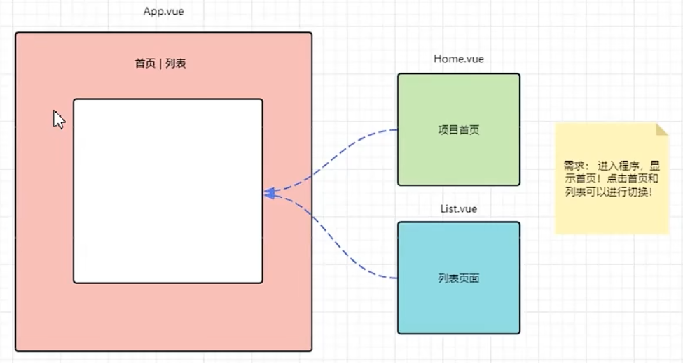

创建项目和导入路由依赖：

```shell
npm create vite//创建项目
cd 项目文件夹//进入项目文件夹
npm install//安装项目需求依赖
npm install vue-router@4--save //安装全局的vue-router 4版本
```

准备页面

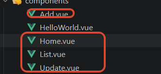

路由配置 `router/router.js`

```js
// 导入路由创建的相关方法
import {createRouter, createWebHashHistory} from 'vue-router'
import Home from '../components/Home.vue'
import List from '../components/List.vue'
import Add from '../components/Add.vue'
import Update from '../components/Update.vue'

// 创建路由对象
const router = createRouter({
    // history 用于记录路由的历史记录，createWebHashHistory 使用 hash 模式
    history: createWebHashHistory(),
    // routes 用于定义路由规则如路径与组件的映射关系
    routes: [
        {
            path: '/',
            redirect: '/home' // 重定向地址栏 / 为 /home
        },
        {
            path: '/home',
            component: Home
        },
        {
            path: '/list',
            // component: List,
            components: {
                default: List, // 默认视图显示 List 组件
                listView: List // 命名视图显示 List 组件
            }
        },
        {
            path: '/add',
            component: Add
        },
        {
            path: '/update',
            component: Update,
            props: true
        }
    ]
})

export default router;
```

全局引入 `main.js`

```js
import { createApp } from 'vue'
import './style.css'
import App from './App.vue'
// 全局导入路由对象
import router from './router/router.js';

const app = createApp(App);
app.use(router);
app.mount('#app')
```

添加路由页面位置

```vue
<script setup>
</script>

<template>
  App 开始的内容
  <h3>router-link 帮助修改浏览器地址  ip:host/#/后面的路径</h3>
  <router-link to="/home">Home</router-link>
  <router-link to="/list">List</router-link>
  <router-link to="/add">Add</router-link>
  <router-link to="/update">Update</router-link>
  <!-- <a href="#" @click.prevent="router.push('/home')">Home</a>
  <a href="#" @click.prevent="router.push('/list')">List</a>
  <a href="#" @click.prevent="router.push('/add')">Add</a>
  <a href="#" @click.prevent="router.push('/update')">Update</a> -->
  <!---->
  <router-view></router-view>
  <router-view name="listView"></router-view> <!-- 仅显示list -->
  App 结束的内容
</template>

```

### 编程式路由

声明式路由，点击后只能切换/list 对应组件，是固定的。

通过 useRouter 编程式路由，动态决定向那个组件切换的路由。

```vue
<script setup>
</script>

<template>
  <!-- 声明式路由 -->
  <router-link to="/home">Home</router-link>
  <router-link to="/list">List</router-link>
  <router-link to="/add">Add</router-link>
  <router-link to="/update">Update</router-link>
  <!-- 编程式路由 -->
  <a href="#" @click.prevent="router.push('/home')">Home</a>
  <a href="#" @click.prevent="router.push('/list')">List</a>
  <a href="#" @click.prevent="router.push('/add')">Add</a>
  <a href="#" @click.prevent="router.push('/update')">Update</a>
  
  <router-view></router-view>
</template>

```

### 路由传参

配置路由

```
		{
            path: '/detail/:id', // 用于路径传参
            component: Detail
        },
        {
            path: '/detail',  // 用于键值对传参
            component: Detail
        }
```

传递参数

```vue
<script setup>
import { useRouter } from 'vue-router'
let router = useRouter()
</script>

<template>
  <!-- 路由传参-->
  <router-link to="/detail/1">显示序号为1 的item 路径传参</router-link> <!--路径参数-->
  <router-link to="/detail?id=2">序号为2 的item 键值对传参</router-link> <!--查询参数-->
  <button @click="router.push('/detail/3')">序号为3 的item 路径传参</button> <!--路径参数-->
  <button @click="router.push({path: '/detail', query: {id: 4}})">序号为4 的item 键值对传参</button> <!--查询参数-->

  <router-view></router-view>
</template>

```

接收参数

```vue
<script setup>
// 接收传递过来的路径参数
// 在Vue 3和VueRouter 4中，你可以使用useRoute这个函数从Vue的组合式APl中获取路由对象;
// useRoute方法返回的是当前的route对象，你可以用它来获取关于当前路由的信息，如当前的路径、键值对参数等；
    import { useRoute } from 'vue-router'
    import { ref, onUpdated } from 'vue'
    let route = useRoute()
    let p_id = ref(route.params.id) // 接收路径参数
    let q_id = ref(route.query.id) // 接收键值对参数
    // 接收键值对参数
    
    onUpdated(() => {
        p_id.value = route.params.id
        q_id.value = route.query.id
    })
</script>
<template>
    <div>
        Detail <br/>
        路径参数 p_id = {{ p_id }} <br/>
        键值对参数 q_id = {{ q_id }} <br/>
    </div>
</template>
<style scoped>
</style>
```

### 路由守卫

在 Vue3 中，路由守卫是用于在路由切换期间进行一些特定任务的回调函数。路由守卫可以用于许多任务，例如验证用户是否已登录、在路由切换前提供确认提示、请求数据等。Vue3 为路由守卫提供了全面的支持，并提供了以下几种类型的路由守卫：

1. 全局前置守卫：在路由切换前被调用，可以用于验证用户是否已登录、中断导航、请求数据等。
2. 全局后置守卫：在路由切换之后被调用，可以用于处理数据、操作 DOM、记录日志等。
3. 守卫代码的位置：在 router.js 中

> 类似于 java 的 servlet API 的 filter 过滤器

设置路由守卫 router.js 

```js
// 设置全局前置守卫  每次路由跳转之前执行回调函数
router.beforeEach((to, from, next) => {
    // to 将要访问的路径
    // from 代表从哪个路径跳转而来
    // next 是一个函数，表示放行
    // next() 放行 next('/login') 强制跳转
    console.log('beforeEach', to.fullPath, from.fullPath)
    next()
})

// 设置全局后置守卫  每次路由跳转之后执行回调函数
router.afterEach((to, from) => {
    // to 将要访问的路径
    // from 代表从哪个路径跳转而来
    console.log('afterEach', to.fullPath, from.fullPath)
})
```

### 路由开发案例

登录页面，进行登录认证存储 token

```vue
<script setup>
import { ref } from 'vue'
import { useRouter } from 'vue-router'
const router = useRouter()
let username = ref('')
let password = ref('')

function login() {
    // 简单登录验证
    if ((username.value === 'admin' && password.value === 'admin') || (username.value === 'root' && password.value === '123456')) {
        console.log('登录成功')
        
        // 将token保存在浏览器中
        sessionStorage.setItem('token', username.value)
        // 跳转到首页
        router.push('/home')
    } else {
        alert('用户名密码错误')
    }
}
</script>
<template>
    <div>
        账号：<input type="text" v-model="username"></input>
        密码：<input type="password" v-model="password"></input>
        <button @click="login">登录</button>
    </div>
</template>
<style scoped>
</style>
```

首页 为欢迎页面，并且有登出功能

```vue
<script setup>
import { useRouter } from 'vue-router'
const router = useRouter()
function logout() {
    // 删除token
    sessionStorage.removeItem('token')
    // 跳转到登录页面
    router.push('/login')
}
let username = sessionStorage.getItem('token')
</script>
<template>
    <div>
        <h1>Welcome Home, {{ username }}</h1>
        <button @click="logout">登出</button>
    </div>
</template>
<style scoped>
</style>
```

全局前置守卫 验证是否登录

```js
// 设置全局前置守卫  每次路由跳转之前执行回调函数
router.beforeEach((to, from, next) => {
    // to 将要访问的路径
    // from 代表从哪个路径跳转而来
    // next 是一个函数，表示放行
    // next() 放行 next('/login') 强制跳转
    console.log('beforeEach', to.fullPath, from.fullPath)
    if (to.path == '/login') {
        next()
    } else {
        // 获取 token
        let token = sessionStorage.getItem('token')
        if (!token) {
            // 如果没有 token，强制跳转到登录页面
            next('/login')
        } else {
            // 如果有 token，继续访问
            next()
        }
    }
    next()
})
```

## Vue 案例开发

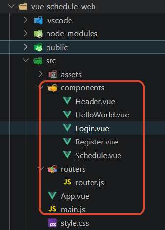

## Vue 数据交互 axios

### Promise 简介

> * 普通函数：正常调用的函数，一般函数执行完毕后才会继续执行下一行代码。
> * 回调函数：特殊的函数，表示未来才会执行的一些功能，后续代码不会等待该函数执行完毕就开始执行了。

前端中的异步编程技术，类似 Java 中的多线程+线程结果回调

**Promise** 是异步编程的一种解决方案，比传统的解决方案回调函数和事件更合理和更强大。它由社区最早提出和实现，ES6 将其写进了语言标准，统一了用法，原生提供了 Promise 对象；所谓 Promise，简单说就是一个容器，里面保存着某个未来才会结束的事件（通常是一个异步操作）的结果。从语法上说，Promise 是一个对象，从它可以获取异步操作的消息。Promise 提供统一的 API，各种异步操作都可以用同样的方法进行处理；

Promise 对象有以下两个特点：

1. Promise 对象代表一个异步操作，有三种状态：Pending（进行中）、Resolved（已完成，又称 Fulfilled）和 Rejected（已失败）。只有异步操作的结果，可以决定当前是哪一种状态，任何其他操作都无法改变这个状态。这也是 Ρromise 这个名字的由来，它的英语意思就是“承诺”表示其他手段无法改变；
2. 一旦状态改变，就不会再变，任何时候都可以得到这个结果。Promise 对象的状态改变，只有两种可能：从 Pending 变为 Resolved 和从 Pending 变为 Rejected。只要这两种情况发生，状态就凝固了，不会再变了，会一直保持这个结果;

### Promise 基本用法 

```html
<!DOCTYPE html>
<html lang="en">
<head>
    <meta charset="UTF-8">
    <title>Document</title>
    <script>
        // 创建promise
        let promise = new Promise((resolve, reject) => {
            console.log('promise is pending')
            // 随机数小于0.5时，promise成功，否则失败
            let rand = Math.random()
            if (rand < 0.33) {
                resolve(rand)
            } else if (rand < 0.67) {
                throw new Error(' 0.33 <= rand < 0.67')
            }else {
                reject(rand)
            }
        })

        // 其他代码
        console.log("other code1")

        // 等待promise完成的代码
        promise.then(value => {
            // promise成功时执行的代码
            console.log('promise success ' + value)
        }, value => {
            // promise失败时执行的代码
            // 也可以在catch中写 二选一即可
            console.log('promise fail ' + value)
        }).catch(value => {
            // promise失败时执行的代码
            // 等价于promise.then(null, value)
            // 还能捕获promise的错误
            console.log(value)
        })
    </script>
</head>
<body>
    
</body>
</html>
```

### async 和 await 的使用

async 和 await 是 ES6 中用于处理异步操作的新特性。通常，异步操作会涉及到 Promise 对象，而 async/await 则是在 Promise 基础上提供了更加直观和易于使用的语法。

async 用于标识函数

1. async 用于标识函数，async 标识的函数的返回值会变成一个 Promise 对象；
2. 如果函数内部返回的数据是一个非 Promise 对象，async 函数的结果会返回一个成功状态 Promise 对
   象；
3. 如果函数内部返回的是一个 Promise 对象，则 async 函数返回的状态与结果由该对象决定；
4. 如果函数内部抛出的是一个异常，则 async 函数返回的是一个失败的 Promise 对象；
5. async 其实就是给我们提供了一个快捷声明回调函数的语法，有了它无需编写 new Promise(……)这样的代码了；

await 位于方法调用前

1. await 右侧的表达式一般为一个 Promise 对象，但是也可以是一个其他值;
2. 如果表达式是 Promise 对象，await 返回的是 Promise 成功的值;
3. 如果表达式是其他值，则直接返回该值；
4. await 会等右边的 Promise 对象执行结束，然后再获取结果，所在方法的后续代码也会等待 await 的执行;
5. await 必须在 async 函数中，但是 async 函数中可以没有 await;
6. 如果 await 右边的 Promise 失败了，就会抛出异常，可以通过 try.catch 捕获处理；
7. await 其实就是给我们提供了一个快捷获得 Promise 对象成功状态的语法，无需编写 promise.then(....)这样的代码了；


```html
<!DOCTYPE html>
<html lang="en">
<head>
    <meta charset="UTF-8">
    <meta name="viewport" content="width=device-width, initial-scale=1.0">
    <title>Document</title>
    <script>
        // 其他代码
        console.log("other code1")


        // async/await
        // let asyncFunc = async () => {...}
        async function asyncFunc1() {
            let rand = Math.random()
            if (rand < 0.33) {
                return rand
            } else if (rand < 0.67) {
                throw new Error(' 0.33 <= rand < 0.67')
            }else {
                return new Promise((resolve, reject) => {
                    reject(rand)
                })
            }
        }
        asyncFunc1().then(value => {
            console.log('asyncFunc1 success ' + value)
        }).catch(value => {
            console.log('asyncFunc1 fail ' + value)
        })

        async function asyncFunc2() {
            let value = await 38;
            console.log('asyncFunc2 await got ' + value)
            let str = await "abc";
            console.log('asyncFunc2 await got ' + str)
            let successPromise = await Promise.resolve(42);
            console.log('asyncFunc2 await got ' + successPromise)
            try {
                let failPromise = await Promise.reject("something wrong")
            } catch (error) {
                console.log('asyncFunc2 catch ' + error)
            }
            try {
                let res = await asyncFunc1()
                console.log('asyncFunc2 await got ' + res)
            } catch (error) {
                console.log('asyncFunc2 catch ' + error)
            }
            console.log('asyncFunc2 end')
        }
        asyncFunc2();


        // 其他代码
        console.log('other code2')
    </script>
</head>
<body>
    
</body>
</html>
```

### Axios  简介

[axios | Promise based HTTP client](https://axios.rest/zh/)

axios 是一个基于 Promise 网络请求库，作用于 node.js 和浏览器中。它是 isomorphic 的（即同一套代码可以运行在浏览器和 node.js 中）。在服务端它使用原生 node.js http 模块，而在客户端 （浏览端）则使用 XMLHttpRequests。它有如下特性：

- 从浏览器创建 XMLHttpRequests 
- 从 node.js 创建 http 请求
- 支持 Promise API 
- 拦截请求和响应
- 转换请求和响应数据
- 取消请求
- 自动转换 JSON 数据
- 客户端支持防御 XSRF

### Axios 的使用

[axios 请求配置详见](https://axios.rest/zh/pages/advanced/request-config)

[axios 响应结构详见](https://axios.rest/zh/pages/advanced/response-schema.html)

可以通过 promise 处理异步请求

也可以通过 async 和 await 处理异步请求

```vue
<script setup>
import axios from 'axios'
import { ref } from 'vue'

/**
 * 获取IP
 */
let ipData = ref({})


// 配置请求三要素
let promise = axios({
  method: 'get', // 请求方法
  url: 'https://uapis.cn/api/v1/network/myip', // 请求地址
  data: { // 请求参数 如果是get请求，参数会以键值对的形式拼接在url后面，如果是post请求，参数会以JSON的形式放在请求体中。

  },
  params: {// 请求参数 都是以键值对的形式拼接在url后面

  },
  headers: {// 请求头 
    // 'Content-Type': 'application/json'
  }
})

promise.then(res => {
  /*
  响应结构如下：
  response响应结果对象
  data服务端响应回来的数据
  status响应状态码 200
  statusText响应状态描述 OK
  headers本次响应的所有响应头
  config本次请求的配置信息 
  request本次请求发送时所使用XMLHttpRequest对象
  */
  Object.assign(ipData.value, res.data)
}).catch(err => {
  console.log(err)
});


/**
 * 获取每日一言
 */
let dailyQuoteData = ref({})

function getDailyQuote() {
  axios({
    method: 'get',
    url: 'https://uapis.cn/api/v1/saying',
    data: {
    }
  }).then(res => {
    Object.assign(dailyQuoteData.value, res.data)
  }).catch(err => {
    console.log(err)
  })
}
async function asyncGetDailyQuote() { // 以 async/await 的方式处理异步请求
  let res = await axios({
    method: 'get',
    url: 'https://uapis.cn/api/v1/saying',
    data: {
    }
  })
  Object.assign(dailyQuoteData.value, res.data)
}
getDailyQuote();

// 敏感词检测
let inputText = ref('')
let resultData = ref({})

function detectSensitiveWords() {
  if (!inputText.value) {
    // 清空结果数据
    resultData.value = {}
    return
  }
  axios({
    method: 'post', // post请求
    url: 'https://uapis.cn/api/v1/text/profanitycheck',
    data: {
      text: inputText.value
    }
  }).then(res => {
    resultData.value = res.data
    console.log(resultData.value)
  }).catch(err => {
    console.log(err)
  })
}
</script>

<template>
  <div>
    <h3>{{ ipData }}</h3>
    <button @click="asyncGetDailyQuote">切换每日一言</button>
    <h3>{{ dailyQuoteData.text }}</h3>
    敏感词检测：<input type="text" v-model="inputText" placeholder="请输入要检测的文本">
    <button @click="detectSensitiveWords">检测</button>
    <div v-if="Object.keys(resultData).length !== 0">
      <h3 v-if="resultData.forbidden_words && resultData.forbidden_words.length > 0"> 检测到违禁词：{{ resultData.forbidden_words }}</h3>
      <h3 v-if="resultData.masked_text && resultData.masked_text.indexOf('*') !== -1">屏蔽后的词：{{ resultData.masked_text }}</h3>
      <h3 v-else>未检测到违禁词</h3>
    </div>
  </div>
</template>

```

### axios get 函数和 post 函数

```js
// get
axios.get(url[， config])
// 例
axios.get(
    "https://api.example.com",
    {
        params:{},
        header:{}
    }
)
// post    
axios.post(url[, data[, configl])
// 例
axios.post(
    "https://api.example.com",
    {
        key1:value1,
        key1:value1
    },
    {
        params:{},
        header:{}
    }
) 

```

### axios 拦截器

声明一个 axios 实例并配置

* 基础路径等
* 请求拦截器
* 响应拦截器

```js
import axios from 'axios'

const axiosInstance = axios.create({
    // 请求的基础URL
    baseURL: 'https://uapis.cn/api/v1',
    // 请求超时时间
    timeout: 5000
})

// 设置请求拦截器
axiosInstance.interceptors.request.use(
    config => {
        // 请求之前，对请求配置进行处理
        // 例如：添加请求头、添加请求参数等
        console.log("请求拦截")
        config.headers['Accept'] = 'application/json,text/plain,text/html,*/*'
        return config
    },
    error => {
        return Promise.reject(error)
    }
)

// 设置响应拦截器
axiosInstance.interceptors.response.use(
    response => {
        // 响应成功，对响应数据进行处理
        // 例如：解析JSON数据、处理错误码等
        console.log("响应拦截")
        return response
    },
    error => {
        return Promise.reject(error)
    }
)

export default axiosInstance
```

发送请求

```js
import axiosInstance from './axios.js'

// 通过axios实例发送请求
let carrierData = ref({})
function getCarrierData() {
  axiosInstance.get('/misc/tracking/carriers').then(res => {
    Object.assign(carrierData.value, res.data)
  }).catch(err => {
    console.log(err)
  })
}
getCarrierData()
```

## axios 开发案例

### axios 开发案例需求

注册：填写时向服务器发送校验请求并提示，提交后验证注册状态，成功则跳转登录页
登录：填写时向服务器发送检验请求并提示，提交后登录认证，成功则跳转首页

### 前端处理

安装 axios 依赖

```shell
npm install axios
```

配置 axios 实例

```js
import axios from 'axios'

// 创建 axios 实例
const axiosInstance = axios.create({
  baseURL: 'http://localhost:8080', 
  timeout: 5000,
  headers: { 'Content-Type': 'application/json' },
});

// 设置请求拦截器
axiosInstance.interceptors.request.use(
    config => {
        return config
    },
    error => {
        return Promise.reject(error)
    }
)

// 设置响应拦截器
axiosInstance.interceptors.response.use(
    response => {
        return response
    },
    error => {
        return Promise.reject(error)
    }
)


export default axiosInstance
```

注册校验用户名

```js
async function checkUsername() {
    // 定义正则
    let usernameReg = /^[a-zA-Z0-9]{5,10}$/
    // 校验
    if (!usernameReg.test(registUser.username)) {
        // 提示
        usernameMsg.value = "不合法"
        return false
    }
    // 校验用户名是否被占用
    let {data} = await request.get('/user/checkUsername', {
        params: {
            username: registUser.username
        }
    });
    console.log(data)
    if (data.code != 200) {
        usernameMsg.value = "已被占用"
        return false
    }
    // 通过校验
    usernameMsg.value = "OK"
    return true
}
```

注册提交

```js
async function register() {
    // 校验
    let checkUsernameFlag = await checkUsername();
    let checkUserPwdFlag = await checkUserPwd();
    let checkReUserPwdFlag = await checkReUserPwd();
    if (!checkUsernameFlag || !checkUserPwdFlag || !checkReUserPwdFlag) {
        return
    }
    // 校验通过,发送注册请求
    let {data} = await request.post('/user/register', {
        username: registUser.username,
        password: registUser.userPwd
    });
    if (data.code != 200) {
        // 提示
        alert(data.message)
        return
    }
    // 提示
    alert(data.message)
    // 跳转登录页
    router.push('/login')
}
```

登录

```js
async function login() {
    // 校验用户名和密码
    if (!checkUsername() || !checkUserPwd()) {
        return false
    }
    // 登录
    let {data} = await request.post('/user/login', {
        username: loginUser.username,
        password: loginUser.userPwd
    })
    
    alert(data.message)
    // 登录成功
    if (data.code == 200) {
        // 登录成功,跳转到首页
        router.push('/schedule')
    }
}
```


### 跨域问题处理

同源策略（Sameoriginpolicy）是浏览器最核心也最基本的安全功能，如果缺少了同源策略，则浏览器的正常功能可能都会受到影响。可以说 Web 是构建在同源策略基础之上的，浏览器只是针对同源策略的一种实现。同源策略会阻止一个域的 javascript 脚本和另外一个域的内容进行交互。所谓同源（即指在同一个域）就是两个页面具有相同的协议（protocol），主机（host）和端口号（port）。

前后端分离模式下，客户端请求前端服务器获取视图资源，然后客户端自行向后端服务器获取数据资源，前端服务器的协议，IP 和端口和后端服务器很可能是不一样的，这样就产生了跨域

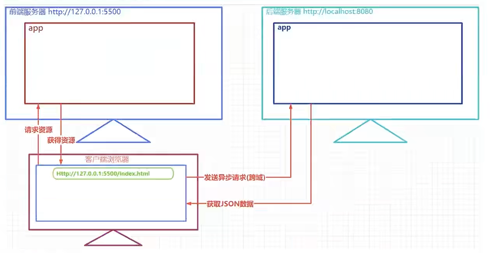

解决方案一代理

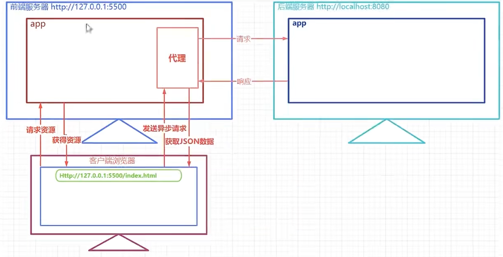

解决方案二跨域过滤器

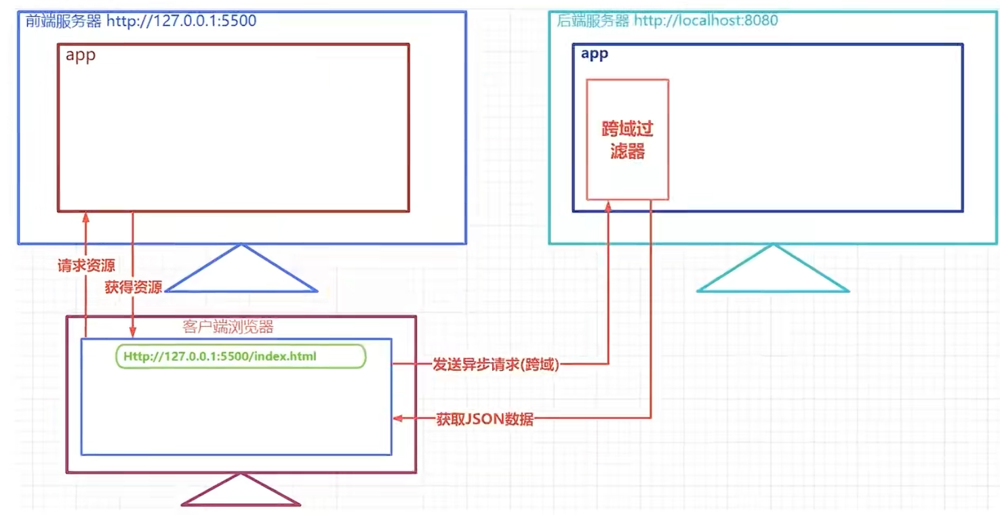

```java
@WebFilter("/*")
public class CrossFilter implements Filter {

    @Override
    public void doFilter(ServletRequest servletRequest, ServletResponse servletResponse, FilterChain filterChain) throws IOException, ServletException {
        HttpServletRequest httpServletRequest = (HttpServletRequest) servletRequest;
        HttpServletResponse httpServletResponse = (HttpServletResponse) servletResponse;
        httpServletResponse.setHeader("Access-Control-Allow-Origin", "*");
        httpServletResponse.setHeader("Access-Control-Allow-Methods", "POST, GET, PUT,OPTIONS, DELETE, HEAD");
        httpServletResponse.setHeader("Access-Control-Max-Age", "3600");
        httpServletResponse.setHeader("Access-Control-Allow-Headers", "access-control-allow-origin, authority, content-type, version-info, X-Requested-With");
        // 如果是跨域预检请求,则直接在此响应200业务码
        if(httpServletRequest.getMethod().equalsIgnoreCase("OPTIONS")){
            WebUtils.writeJson(httpServletResponse,Result.success());
        }else{
            // 非预检请求,放行即可
            filterChain.doFilter(servletRequest, servletResponse);
        }
    }
}
```

> 在 MVC 框架中，只需要添加 @CrossFilter 注解即可

改造后端代码 以适用前后端分离

## Vue 状态管理 Pinia

### Pinia 简介

如何实现多个组件之间的数据传递?

- 方式 1：组件传参；
- 方式 2：路由传参；
- 方式 3：通过 SessionStorage 和 LocalStorage 传递
- 方式 4：通过 Pinia 状态管理定义共享数据；

[Pinia | The intuitive store for Vue.js](https://pinia.vuejs.org/zh/)

当我们有多个组件共享一个共同的状态（数据源）时，多个视图可能都依赖于同一份状态。来自不同视图的交互也可能需要更改同一份状态。虽然我们的手动状态管理解决方案（props，组件间通信，模块化）在简单的场景中已经足够了，但是在大规模的生产应用中还有很多其他事项需要考虑：

### Pinia 的使用

引入依赖

```shell
npm install pinia
```

main.js 创建 pinia

```js
import { createApp } from 'vue'
import './style.css'
import router from './routers/router'
import App from './App.vue'
import {createPinia} from 'pinia'

const pinia = createPinia()
const app = createApp(App)
app.use(router)
app.use(pinia)
app.mount('#app')

```

./stores/store.js 配置 pinia 的一些存储对象

```js
import { defineStore } from 'pinia'

//定义数据并且对外暴露
//store就是定义共享状态的包装对象

//内部包含四个属性：
// id 唯一标识
// state完整类型推理，推荐使用箭头函数存放的数据
// getters类似属性计算，存储放对数据
// actions 是存储数据的复杂业务逻辑方法

// 理解：
// store类似Java中的实体类，id就是类名，
// state就是装数据值的属性
// getters就是get方法，
// actions就是对数据操作的其他方法
export const MyStore = defineStore('MyStore',
    {
        id: 'MyStore', // 必须唯一
        state: () => {
            return {
                token: 'sdcsdcsdc',
                userInfo: {
                    name: '张三',
                    email: 'zhangsan@example.com'
                }
            }
        },
        getters: {
            // 可以定义获取数据或计算数据的函数
            getToken() {
                return this.token
            },
            getUserInfo() {
                return this.userInfo
            },
        },
        actions: {
            // 可以定义修改数据的函数
            setToken(token) {
                this.token = token
            },
            setUserInfo(userInfo) {
                this.userInfo = userInfo
            }
        }
    }
)
```

### Pinia 开发案例

。。。

## Vue UI 框架Element-plus

Element Plus 是一套基于 Vue 3 的开源 UI 组件库，是由饿了么前端团队开发的升级版本 Element Ul。Element Plus 提供了丰富的 Ul 组件、易于使用的 API 接口和灵活的主题定制功能，可以帮助开发者快速构建高质量的 Web 应用程序。

* Element Plus 支持按需加载，且不依赖于任何第三方 CSs 库，它可以轻松地集成到任何 Vue.js 项目中。Element Plus 的文档十分清晰，提供了各种组件的使用方法和示例代码，方便开发者快速上手。
* ElementPlus 目前已经推出了大量的常用 U 组件，如按钮、表单、表格、对话框、选项卡等，此外还提供了一些高级组件，如日期选择器、时间选择器、级联选择器、滑块、颜色选择器等。这些组件具有一致的设计和可靠的代码质量，可以为开发者提供稳定的使用体验。
* 与 ElementUI 相比，ElementPlus 采用了现代化的技术架构和更加先进的设计理念，同时具备更好的性能和更好的兼容性。
* ElementPlus 的更新迭代也更加频繁，可以为开发者提供更好的使用体验和更多的功能特性。

[一个 Vue 3 UI 框架 | Element Plus](https://element-plus.org/zh-CN/)

# 微头条项目开发

## 微头条业务简介

> 微头条新闻发布和浏览平台,主要包含业务如下

+ 用户功能
  + 注册功能
  + 登录功能
+ 头条新闻
  + 新闻的分页浏览
  + 通过标题关键字搜索新闻
  + 查看新闻详情
  + 新闻的修改和删除
+ 权限控制
  + 用户只能修改和自己发布的头条新闻

## 技术栈介绍

> 前端技术栈

+ ES6作为基础JS语法
+ nodejs用于运行环境
+ npm用于项目依赖管理工具
+ vite用于项目的构建架工具
+ Vue3用于项目数据的渲染框架
+ Axios用于前后端数据的交互
+ Router用于页面的跳转
+ Pinia用于存储用户的数据
+ LocalStorage作为用户校验token的存储手段
+ Element-Plus提供组件

> 后端技术栈

+ JAVA作为开发语言,版本为JDK17
+ Tomcat作为服务容器,版本为10.1.7
+ Mysql8用于项目存储数据
+ Servlet用于控制层实现前后端数据交互
+ JDBC用于实现数据的CURD
+ Druid用于提供数据源的连接池
+ MD5用于用户密码的加密
+ Jwt用于token的生成和校验
+ Jackson用于转换JSON
+ Filter用于用户登录校验和跨域处理
+ Lombok用于处理实体类

## 流程

[8_第八章 微头条项目开发.html](assets\08_第八章 微头条项目开发.html)