# 基础部分

## 多线程发展史

### 单任务时代

**手工操作**

最初的计算机，只能接受一些特定的指令，用户输入一个指令，计算机就做出一个操作。工作流程是由程序员首先把程序写到纸上，再由操作员照着穿孔成卡片，输入到计算机上，计算机计算得到结果打印出来，程序员最后拿到打印出来的结果。

任务的调度依赖于操作员在机房里面来回递取程序卡片和打印结果，造成计算机存在大量的空闲状态 。

**批处理系统**

用户将多个需要执行的程序写在磁带上，然后交由计算机去读取并逐个执行这些程序，并将输出结果写在另一个磁带上。批处理操作系统的好处在于，计算机会一直处于运算状态，合理的利用了计算机资源。批处理操作系统的指令运行方式仍然是串行的，内存中始终只有一个程序在运行。

批处理操作系统虽然能够解决计算机的空闲问题，但是当某一个作业因为等待磁盘或者其他 I/O 操作而暂停，那 CPU 就只能阻塞直到该 I/O 完成，对于 CPU 操作密集型的程序，I/O 操作相对较少，因此浪费的时间也很少。但是对于 I/O 操作较多的场景来说，CPU 的资源是属于严重浪费的。

> 多道批处理系统：相比于单道批处理系统，当某道程序因某种原因如执行 I/O 操作时而不能继续运行放弃 CPU 时，操作系统会调度另一程序运行，这样就尽量利用了 CPU 的资源，提高系统效率。

### 多进程时代

**分时系统**

把内存划分为多个块，不同的应用程序使用着各自的内存空间互不干涉，正在运行的程序就是进程，保存着程序每一个时刻运行的状态。CPU 在不同的进程之间切换执行，这样的话当 CPU 执行一个任务 IO 等待的时候可以切换到另外一个任务上去执行指令，不必在 IO 上浪费时间，这样让 CPU 的资源更合理的运用起来，看起来就像一直处于工作状态。

**时间片轮转**

CPU 采用时间片轮转的方式运行进程，CPU 为每个进程分配一个很短的时间段，称作它的时间片。如果在时间片结束时进程还在运行，则暂停这个进程的运行，并且 CPU 分配给另一个进程（这个过程叫做 **上下文切换**）。进程 + CPU 时间片轮转的操作系统（分时系统），宏观上看起来同一时间段执行。事实上，任意具体时刻都只有一个任务在占用一个 CPU 核心资源。

### 多线程时代

为了一个进程可以处理多个子任务，进一步提升效率。人们让 CPU 选择了基于粒度更小的线程来调度执行任务，一个进程可以创建很多个线程，每个线程负责一个单独的子任务，CPU 会在线程之间来回切换的工作，同理任意具体时刻都只有一个线程在占用一个 CPU 核心资源。比起任务进程切换需要切换内存映射地址，一个进程创建的所有线程，都是共享一个内存空间的，线程做任务切换成本更低。

例如，用 word 文档编辑内容的时候，保存内容会写入磁盘，这个操作比较慢，如果需要等待内容写入后才可以编辑，体验较差，因此将 word 进程里的保存任务和编辑任务通过线程区分，实现保存内容时能够实时编辑的功能。

### 多核 CPU

多核时代是计算机处理器技术发展的关键阶段，始于 2006 年秋季英特尔信息技术峰会，推出全球首款多核处理器。摩尔定律似乎在 CPU 核心扩展上继续得以验证。

之前我们只有一个 CPU，所以在某一个时间片之内永远只会有一个线程执行指令，因为时间片的单位太小以至于我们感知不到，以为多个程序的线程是“同时”执行的，但是进入了多核 CPU 时代后，多核心控制器可以同一时间执行不通过线程上的任务，从而真正意义上实现了多任务同时执行。

这里产生两个概念，就是并行和并发。

**并行**：指同时执行多个任务的能力。一个 CPU 核心运行一个线程，因此只有在多核心 CPU 架构中，每个核心执行各自的任务，实现真正的同时进行。

**并发**：指同时处理多个任务的能力。单个处理器内，多个任务快速交替执行，使得在宏观上看起来像是多个任务同时进行，但处理器在同一个时间点只有一个任务在执行。通常我们会通过 TPS 或者 QPS 来表示某某系统支持的并发数是多少。

#### CPU 缓存

CPU 觉得每次去内存里面读写数据太慢了，为了更快的读写数据，所以 CPU 和内存之间加了中间缓存（L1, L2, L3 缓存），每次都是先从自己的缓存读写数据，这样 CPU 的利用率又提高了。

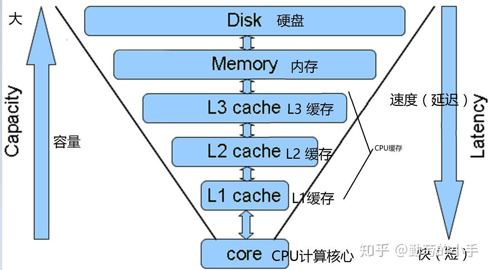

#### 超线程

超线程（HT）是 Intel 的 CPU 的概念，实际学名为同步多线程（SMT，Simultaneous Multithreading）技术。

SMT 技术虽然是提升多线程下表现的性能，但 SMT 实际上是提升 CPU 单核性能大背景下的“副产品”，在从前没有多核处理器的时候，一个物理 CPU 只有一个物理内核，SMT 技术可以把一个物理线程模拟出两个线程来使用，使得单个核心用起来像两个核一样，以充分发挥 CPU 的性能。

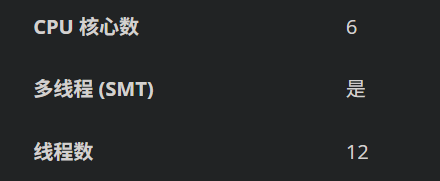

一般情况下，`逻辑CPU= 物理CPU个数（一般是1） * 每颗核数`，如果我们的电脑 CPU 支持同步多线程技术且开启的话，逻辑 CPU 的个数是核数的 2 倍，`逻辑CPU = 物理CPU个数（一般是1） * 每颗核数 * 2`

## 进程和线程

### 定义

进程是对运行时程序的封装，是系统进行 **资源调度和分配** 的基本单位，实现了操作系统的并发。

线程就是是进程的子任务，也是 **CPU 调度和分派** 的基本单位，实现了进程内部的并发。

### 多线程代替多进程的好处

* 进程间的通信比较复杂。线程间的通信比较简单，而且线程在同一进程中可以共享资源。
* 进程是重量级的，多线程方式的系统开销更小。

### 进程和线程的区别

本质的区别是 **是否单独占有内存地址空间及其它系统资源（比如 I/O）**：

进程是操作系统进行资源分配的基本单位；线程是操作系统进行调度的基本单位，即 CPU 分配时间的单位 。

进程独占一定内存空间，进程间内存隔离；线程共享所属进程中占有的内存地址空间和资源。

进程的创建和销毁的开销较大；线程创建和销毁开销较小。

### 上下文切换

上下文（Context）指的是进程运行占据 CPU 时的所有状态信息，常见如下：

* 程序计数器（Program Counter, PC）：记录下一条要执行的指令地址；
* 各种通用寄存器的值；
* 栈指针（Stack Pointer）；

这些信息被保存到该进程的控制块（PCB, Process Control Block）中。

CPU 通过时间片分配算法来循环执行任务，当前任务的时间片结束后会切换到下一个任务。在切换前会保存上一个任务的状态，以便下次切换回这个任务时，可以再加载这个任务的状态。

CPU 从一个线程切换到另一个线程时，保存当前或线程的运行状态，并加载新进程的运行状态的过程就是上下文切换。

> 上下文切换会消耗大量的 CPU 时间，故线程也不是越多越好。如何减少系统中上下文切换次数，是提升多线程性能的一个重点课题。

## 创建线程

### Thread 类和 Runnable 接口

JDK 提供了 `Thread` 类来实现 Java 的“线程”类。而 `Thread` 类是一个 `Runnable` 接口的实现类。

线程的具体工作内容可以以继承 `Thread` 类和实现 `Runnable` 接口两种方式进行定义。

**继承 Thread 类**

```java
public class Demo {
    public static class MyThread extends Thread {
        @Override
        public void run() {
            System.out.println("MyThread");
        }
    }

    public static void main(String[] args) {
        Thread myThread = new MyThread();
        myThread.start(); // start()方法后，虚拟机会先为我们创建一个线程，然后等到这个线程第一次得到时间片时再调用run()方法
    }
}
```

**实现 Runnable 接口**

```java
// Thread类 run()默认执行 runnable的任务
public class Thread implements Runnable {
    @Override
    public void run() {
        if (target != null) {
            target.run();
        }
    }
}

```

```java
@FunctionalInterface
public interface Runnable {
    public abstract void run();
}
```

```java
public class Demo {
    public static class MyThread implements Runnable {
        @Override
        public void run() {
            System.out.println("MyThread");
        }
    }

    public static void main(String[] args) {
        new Thread(new MyThread()).start();

        // Java 8 函数式编程，可以省略MyThread类
        new Thread(() -> {
            System.out.println("Java 8 匿名内部类");
        }).start();
    }
}
```

**Thread 类构造方法**

```java
public class Thread implements Runnable {
    // 两个对用于支持ThreadLocal的私有属性
    ThreadLocal.ThreadLocalMap threadLocals = null;
	ThreadLocal.ThreadLocalMap inheritableThreadLocals = null;
    
    // 常用构造方法
    public Thread(Runnable target) {
        init(null, target, "Thread-" + nextThreadNum(), 0);
    }
	public Thread(Runnable target, String name) {
        init(null, target, name, 0);
    }
    
    //init方法里初始化AccessControlContext类型的私有属性
    private void init(ThreadGroup g, Runnable target, String name,
                      long stackSize, AccessControlContext acc,
                      boolean inheritThreadLocals) {
        ...
        this.inheritedAccessControlContext = acc != null ? acc : AccessController.getContext();
        ...
    }
	
}

```

**Thread 类的常见方法**

```java
	public static void main(String[] args) {
        
    
        Thread.currentThread(); // 返回当前正在执行的线程对象（引用）；
        Thread.sleep(1l); // 使当前线程睡眠一段时间；
        Thread.yield(); // 声明当前线程愿意让出对当前处理器的占用
    
    	Thread thread = new Thread();
        thread.join(); // 当前线程等待另一个线程执行完毕之后再继续执行，内部调用的是Object类的wait方法实现的；
        thread.start(); // 开始执行线程的方法，java虚拟机会调用线程内的run()方法
    }
```

### Callable 接口、Future 接口 与 FutureTask 类

`Thread` 来创建一个新的线程有一个弊端，就是 `run` 方法是没有返回值的。JDK 提供了 `Callable + Future` 接口与 `FutureTask` 类，都位于 `java.util.concurrent` 包下，让开启的线程执行完成后有一个 **返回值**，这也是所谓的 **“异步”** 模型。

**Callable + Future**

`Callable` 与 `Runnable` 类似，同样是只有一个抽象方法的函数式接口。不同的是，`Callable` 提供的方法是 **有返回值** 的，而且支持 **泛型**。`Callable` 一般是配合线程池工具 `ExecutorService` 来使用的。

```java
public class CallableDemo  {

    // 自定义Callable
    static class Task implements Callable<Integer> {
        @Override
        public Integer call() throws Exception {
            // 模拟计算需要一秒
            Thread.sleep(1000);
            return 2;
        }

    }

    public static void main(String args[]){
        // 使用
        ExecutorService executor = Executors.newCachedThreadPool();
        Task task = new Task();
        Future<Integer> result = executor.submit(task);

        // 函数式编程
        /*Future<Integer> result = executor.submit(() -> {
            // 模拟计算需要一秒
            Thread.sleep(1000);
            return 2;
        });*/

        // 注意调用get方法会阻塞当前线程，直到得到结果。
        // 所以实际编码中建议使用可以设置超时时间的重载get方法。
        try {
            System.out.println(result.get());
        } catch (InterruptedException e) {
            e.printStackTrace();
        } catch (ExecutionException e) {
            e.printStackTrace();
        }
    }
}
```

这里只介绍 `ExecutorService` 可以使用 `submit` 方法来让一个 `Callable` 接口执行。它会返回一个 `Future` ，我们后续的程序可以通过这个 `Future` 的 `get` 方法得到结果。

**Future 常见方法**

`Future` 接口只有几个比较简单的方法：

```java
public abstract interface Future<V> {
    public abstract boolean cancel(boolean paramBoolean); // 试图取消一个线程的执行 paramBoolean表示是否采用中断的方式取消线程执行
    public abstract boolean isCancelled(); // 判断任务是否被取消
    public abstract boolean isDone(); // 判断任务是否完成
    public abstract V get() throws InterruptedException, ExecutionException; // 等待任务完成，获取执行结果，如果任务取消会抛出异常
    public abstract V get(long paramLong, TimeUnit paramTimeUnit) 
            throws InterruptedException, ExecutionException, TimeoutException; // 同get()，如果任务取消或等待超时会抛出异常
}
```

有时候，为了让任务有能够取消的功能，也用 `Callable` 来代替 `Runnable`。声明 `Future<?>` 形式类型也可以返回 `null` 作为底层任务的结果。

**FutureTask**

`FutureTask` 是实现的 `RunnableFuture` 接口的，而 `RunnableFuture` 接口同时继承了 `Runnable` 接口和 `Future` 接口。

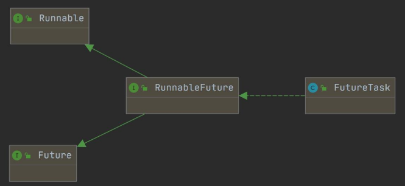

`FutureTask` 类帮助程序员实现了较为复杂的 `Future` 接口以供使用。

```java
public class FutureTaskDemo {

    public static void main(String[] args) {
        // 使用
        ExecutorService executor = Executors.newCachedThreadPool();

        // 构造方法接收一个 Callable 函数式接口 
        FutureTask<Integer> futureTask = new FutureTask<Integer>(() -> {
            // 模拟计算需要一秒
            Thread.sleep(1000);
            return 2;
        });

        executor.submit(futureTask);

        // 注意调用get方法会阻塞当前线程，直到得到结果。
        // 所以实际编码中建议使用可以设置超时时间的重载get方法。
        try {
            System.out.println(futureTask.get());
        } catch (InterruptedException e) {
            e.printStackTrace();
        } catch (ExecutionException e) {
            e.printStackTrace();
        };
    }
}
```

使用 `FutureTask` 直接取 `get` 取值，而上面的 Demo 是通过 `submit` 方法返回的 `Future` 去取值。

`FutureTask` 的几个状态

```java
/**
  *
  * state可能的状态转变路径如下：
  * NEW -> COMPLETING -> NORMAL
  * NEW -> COMPLETING -> EXCEPTIONAL
  * NEW -> CANCELLED
  * NEW -> INTERRUPTING -> INTERRUPTED
  */
private volatile int state;
private static final int NEW          = 0;
private static final int COMPLETING   = 1;
private static final int NORMAL       = 2;
private static final int EXCEPTIONAL  = 3;
private static final int CANCELLED    = 4;
private static final int INTERRUPTING = 5;
private static final int INTERRUPTED  = 6;
```

## 线程组和线程优先级

### 线程组

每个 Thread 必然存在于一个 ThreadGroup 中，Thread 不能独立于 ThreadGroup 存在。

执行 main() 方法线程和线程组的名字都是 main。

如果在 `new Thread` 时没有显式指定，那么默认将父线程 （当前执行 `new Thread` 的线程）线程组设置为自己的线程组。

```java
public class Thread implements Runnable {
    // 显示指定
    public Thread(ThreadGroup group, Runnable target) {
        init(group, target, "Thread-" + nextThreadNum(), 0);
    }
}
```

线程组可以形成了一个标准的 **向下引用** 的树状结构，不会产生相互引用的问题，导致 GC 回收相互引用的线程失效。

```java
public class ThreadGroup implements Thread.UncaughtExceptionHandler {
    
    // 父线程
    private final ThreadGroup parent;
    
    String name;
    
    // 属于该线程组的线程
    Thread threads[];

    // 子线程组
    ThreadGroup groups[];
    
}
```

### 线程的优先级

```java
    public static void main(String[] args) {
        Thread thread = new Thread();
        thread.setPriority(5);
        thread.start();
    }
```

线程的优先级会在线程被调用之前设定。Java 中线程优先级范围是 1~10，默认的线程优先级为 5。Java 只是给操作系统一个优先级的参考值，线程最终在操作系统的 **优先级是多少还是由操作系统决定**。

Java 提供一个 **线程调度器** 来监视和控制处于 **RUNNABLE 状态** 的线程。线程的调度策略采用 **抢占式**，优先级高的线程比优先级低的线程会有 **更大的几率优先执行**。

线程组可以限制线程的最大优先级 MaxPriority，其线程使用的优先级将不能超过线程组的最大优先级。

### 线程组的常用方法及数据结构

常用方法

```java
public static void main(String[] args) {
        ThreadGroup threadGroup = Thread.currentThread().getThreadGroup();

        // 获取当前的线程组名字
        System.out.println(threadGroup.getName());

        // 复制线程数组到线程组
        Thread[] threads = new Thread[2];
        threadGroup.enumerate(threads);

        // 线程组统一异常处理
        ThreadGroup threadGroup1 = new ThreadGroup("group1") {
            // 继承ThreadGroup并重新定义以下方法
            // 在线程成员抛出unchecked exception
            // 会执行此方法
            public void uncaughtException(Thread t, Throwable e) {
                System.out.println(t.getName() + ": " + e.getMessage());
            }
        };

        new Thread(threadGroup1, ()->{
            throw new RuntimeException("测试异常");
        }).start();
    }

// 输出结果
// main
// Thread-0: 测试异常
```

构造函数

```java
// 私有构造函数
private ThreadGroup() { 
    this.name = "system";
    this.maxPriority = Thread.MAX_PRIORITY;
    this.parent = null;
}

// 默认是以当前ThreadGroup传入作为parent  ThreadGroup，新线程组的父线程组是目前正在运行线程的线程组。
public ThreadGroup(String name) {
    this(Thread.currentThread().getThreadGroup(), name);
}

// 构造函数
public ThreadGroup(ThreadGroup parent, String name) {
    this(checkParentAccess(parent), parent, name);
}

// 私有构造函数，主要的构造函数
private ThreadGroup(Void unused, ThreadGroup parent, String name) {
    this.name = name;
    this.maxPriority = parent.maxPriority;
    this.daemon = parent.daemon;
    this.vmAllowSuspension = parent.vmAllowSuspension;
    this.parent = parent;
    parent.add(this);
}
```

数据结构

```java
public class ThreadGroup implements Thread.UncaughtExceptionHandler { 
	private final ThreadGroup parent; // 父亲ThreadGroup 
    String name; // ThreadGroupr 的名称 
    int maxPriority; // 线程最大优先级 
    boolean destroyed; // 是否被销毁 
    boolean daemon; // 是否守护线程 
    boolean vmAllowSuspension; // 是否可以中断 
    int nUnstartedThreads = 0; // 还未启动的线程 
    int nthreads; // ThreadGroup中线程数目 
    Thread threads[]; // ThreadGroup中的线程 
    int ngroups; // 线程组数目 
    ThreadGroup groups[]; // 线程组数组 
}
```

总结来说，线程组是一个树状的结构，每个线程组下面可以有多个线程或者线程组。线程组可以起到统一控制线程的优先级和检查线程的权限的作用。

## Java 线程的状态及切换

### 操作系统中的线程状态转换

在操作系统中，线程被视为轻量级的进程，所以线程状态其实和进程状态是一致的。

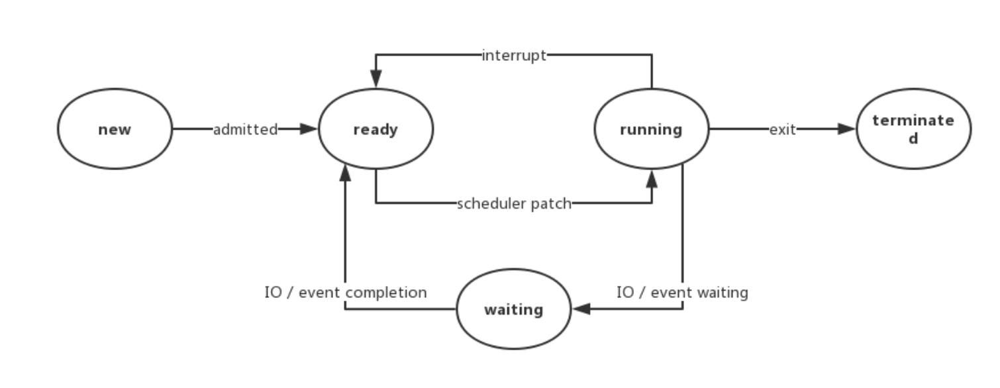

操作系统线程主要有以下三个状态：

* 就绪状态(ready)：线程正在等待使用 CPU，经调度程序调用之后可进入 running 状态。
* 执行状态(running)：线程正在使用 CPU。
* 等待状态(waiting): 线程经过等待事件的调用或者正在等待其他资源（如 I/O）。

### Java 线程的状态及切换

```java
// Thread.State 源码
public enum State { 
    NEW, // 创建了线程但没有调用start()方法，重复调用start()抛出异常
    RUNNABLE, // 当前线程正在运行中。处于RUNNABLE状态的线程在Java虚拟机中运行，也有可能在等待CPU分配资源。
    BLOCKED, // 阻塞状态。处于BLOCKED状态的线程正等待锁的释放以进入同步区。
    WAITING, // 等待状态。处于等待状态的线程变成RUNNABLE状态需要其他线程唤醒。
    TIMED_WAITING, // 超时等待状态。线程等待一个具体的时间，时间到后会被自动唤醒。
    TERMINATED; // 终止状态。此时线程已执行完毕。
} 
```

**线程状态的转换**

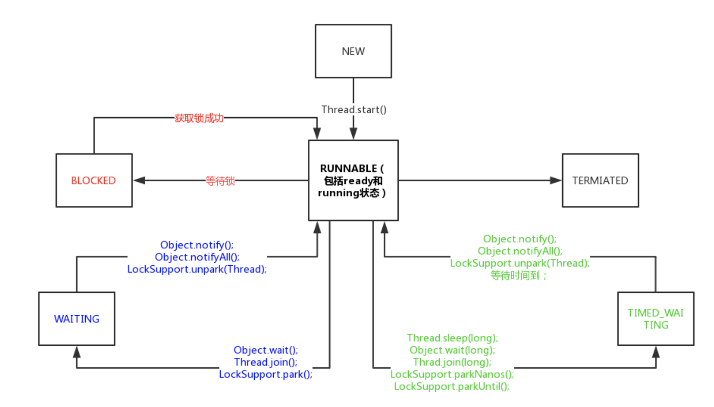

**BLOCKED <-> RUNNABLE**

```java
public void blockedTest() throws InterruptedException {
    Thread a = new Thread(new Runnable() {
        @Override
        public void run() {
            testMethod();
        }
    }, "a");
    Thread b = new Thread(new Runnable() {
        @Override
        public void run() {
            testMethod();
        }
    }, "b");
    
    a.start();
    Thread.sleep(1000L); // 需要注意这里main线程休眠了1000毫秒，而testMethod()里休眠了2000毫秒
    b.start();
    System.out.println(a.getName() + ":" + a.getState()); // 输出 TIMED_WAITING
    System.out.println(b.getName() + ":" + b.getState()); // 输出 BLOCKED
}

// 同步方法争夺锁
private synchronized void testMethod() {
    try {
        Thread.sleep(2000L);
    } catch (InterruptedException e) {
        e.printStackTrace();
    }
}
```

**WAITING <-> RUNNABLE**

`Object.wait()`：调用 `wait()` 方法前线程必须持有对象的锁。调用 `wait()` 方法时，持有锁的线程会释放当前的锁，进入等待队列，直到时间到或者有其他线程调用 `notify()` / `notifyAll()` 方法唤醒等待锁的线程。

关键点：

* `wait()` 方法和 `notify()` / `notifyAll()` 方法必须在 `Synchronized` 方法或代码块中。
* 调用 `wait` 的线程和 `notify` 的线程必须拥有相同对象锁。
* `notifyAll()` 方法唤醒所有等待锁的线程（变为 runnable），不一定会马上把时间片分给刚才放弃锁的那个线程，具体要看系统的调度。

```java
	static Object object = new Object();
    public static void waitDemo() throws InterruptedException {
        new Thread(() -> {
            System.out.println("线程 A 开始");
            synchronized (object){
                System.out.println("线程 A 获取锁");
                try {
                    System.out.println("线程 A 释放锁并等待锁");
                    object.wait();
                    System.out.println("A 线程重新获取到锁，继续进行");
                } catch (InterruptedException e) {
                    e.printStackTrace();
                }
                System.out.println("结束线程 A");
            }
        }, "线程 A").start();


        new Thread(() -> {
            System.out.println("线程 B 开始");
            try {
                Thread.sleep(500L); // 保证线程 A 先获取锁
            } catch (InterruptedException e) {
                e.printStackTrace();
            }
            synchronized (object){
                System.out.println("线程 B 获取锁");
                object.notify();
                System.out.println("线程 B 通知唤醒线程 A");
                try {
                    // 试验执行完 notify() 方法后，A 线程是否能立即获取到锁
                    Thread.sleep(2000L);
                } catch (InterruptedException e) {
                    e.printStackTrace();
                }
                System.out.println("结束线程 B");
            }
        }, "线程 B").start();
    }
/*
线程 A 开始
线程 A 获取锁
线程 A 释放锁并等待锁
线程 B 开始
线程 B 获取锁
线程 B 通知唤醒线程 A
结束线程 B
A 线程重新获取到锁，继续进行
结束线程 A
*/
```

`Thread.join()`：调用此方法的线程被阻塞，直到该方法完成以后（对应线程转为 Terminate），才能继续运行

```java
public static void joinDemo() throws InterruptedException {
        Thread mainThread = Thread.currentThread();
        Thread threadA = new Thread(() -> {
            System.out.println("开始线程 A");
            System.out.println("MainThread state is " + mainThread.getState());
            System.out.println("结束线程 A");
        }, "线程 A");

        threadA.start();
        threadA.join();
    }
/*
开始线程 A
MainThread state is WAITING
结束线程 A
*/
```

源码来看，实际上 `join` 方法就是调用了 `wait` 方法来使得线程阻塞，一直到线程结束运行。`join` 实例方法被 `synchronized` 修饰，因此主线程持有了加锁的对象即 `threadA`，`wait` 方法被调用以后，主线程（持有锁的线程）进入等待队列， `threadA` 不被影响。

那么主线程在那里被唤醒呢？ 其实是 jvm 虚拟机中存在方法 `lock.notify_all(thread)`，在 `threadA` 线程结束以后，会调用该方法，最后唤醒主线程。

```java
public class Thread implements Runnable {
    public final synchronized void join(long millis) throws InterruptedException {
        long base = System.currentTimeMillis();
        long now = 0;

        if (millis < 0) {
            throw new IllegalArgumentException("timeout value is negative");
        }

        if (millis == 0) {
            while (isAlive()) {
                wait(0);
            }
        } else {
            while (isAlive()) {
                long delay = millis - now;
                if (delay <= 0) {
                    break;
                }
                wait(delay);
                now = System.currentTimeMillis() - base;
            }
        }
    }
}

```

**TIMED_WAITING  <-> RUNNABLE**

TIMED_WAITING 与 WAITING 状态类似，只是 TIMED_WAITING 状态等待的时间是指定的。

`Thread.sleep(long)`：使当前线程睡眠指定时间。需要注意这里的“睡眠”只是暂时使线程停止执行，并不会释放锁。时间到后，线程会重新进入 RUNNABLE 状态。

`Object.wait(long)`：和 `wait()` 类似，但调用 `wait(long)` 就算其他线程不来唤醒它，经过指定时间之后它会自动唤醒，拥有去争夺锁的资格。

`Thread.join(long)`：和 `join()` 类似，但调用 `join(long)` 的线程不必一直等该方法完成（对应线程转为 Terminate），经过指定时间之后，也能恢复执行。

**线程中断**

线程中断机制是一种协作机制。需要注意，通过中断操作并不能直接终止一 个线程，而是通知需要被中断的线程自行处理。

* `interrupt()`：中断线程。这里的中断线程并不会立即停止线程，而是设置线程的中断状态为 true（默认是 flase）
* `interrupted()`：测试当前线程是否被中断。线程的中断状态受这个方法的影响，意思是调用一次使线程中断状态设置为 true，连续 调用两次会使得这个线程的中断状态重新转为 false；

```java
	public static boolean interrupted() {
        return currentThread().isInterrupted(true); // 传入 true 则影响线程中断状态 
    }

    private native boolean isInterrupted(boolean ClearInterrupted);
```

* `isInterrupted()`：测试当前线程是否被中断。与上面方法不同的是调用 这个方法并不会影响线程的中断状态。

```java
	public boolean isInterrupted() {
        return isInterrupted(false); // 传入 false 则不影响线程中断状态 
    }

    
    private native boolean isInterrupted(boolean ClearInterrupted);
```

## 多线程产生的问题

多线程可以解决 CPU 运算速度和 IO 速度的不平衡问题，充分利用多核 CPU 的计算能力，但是也存在一些弊端。

### 线程安全问题

并发编程中，**原子性、可见性和有序性** 是确保程序正确执行的三大特性。

#### 原子性问题

例子：举一个银行转账的例子，比如从账户 A 向账户 B 转 1000 元，那么必然包括 2 个操作：从账户 A 减去 1000 元，往账户 B 加上 1000 元，两个操作都成功才意味着一次转账最终成功。如果从 A 的账户扣减了 1000 元之后，操作突然终止了，账户 B 没有增加 1000 元，那便出现问题。

根源：CPU 切换线程。

原子性（atomicity）：即一个操作或者多个操作，要么全部执行并且执行的过程不会被任何因素打断，要么就都不执行。

原子操作：是一个单一、不可分割的操作，物理体现为不会被线程切换打断，这类操作就具有原子性。

在 Java 中，即使是一条简单的语句，也不一定是原子操作，因为编译器会把拆分成多个指令交给 CPU 执行。

```java
int i = 0; // 这是原子操作，因为它是一个单一的、不可分割的步骤。
i++;   // 这不是原子操作。这实际上是一个 "read-modify-write" 操作，它包括了读取 i 的值，增加 i，然后写回 i。
int j = i; // 这是原子操作，因为它是一个单一的、不可分割的步骤。
i = i + 1; // 这不是原子操作。和 i++ 一样，这也是一个 "read-modify-write" 操作。
```

在单线程环境下，不管是原子操作还是非原子操作都不会出现原子性问题。但是在多线程环境下，在执行非原子操作或包含多个操作的事务的时候就很有可能出现问题，因为 CPU 会在执行某一个指令的时候切换线程，这个时候就可能出现执行结果与我们预期结果不符合的情况。

> **事务** 是指一组作为一个单元执行的操作，确保要么全部成功，要么全部失败，这种特性被称为 **ACID** 特性，其中就包含原子性。

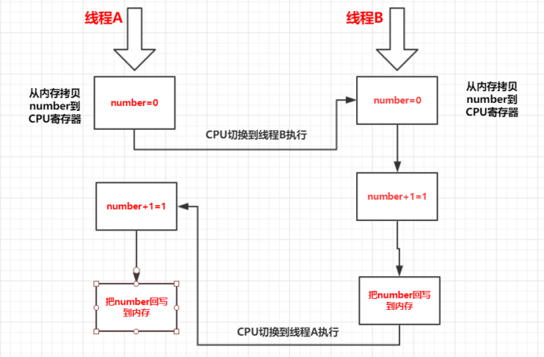

例子

```java
public class AtomicityProblem {

    private static int i = 0; // 多个线程只操作一个变量
    
    public static void main(String[] args) throws InterruptedException {
        int numThreads = 2;
        int numIncrementsPerThread = 100000;

        Thread[] threads = new Thread[numThreads];

        for (int j = 0; j < numThreads; j++) {
            threads[j] = new Thread(() -> {
                for (int k = 0; k < numIncrementsPerThread; k++) {
                    i++; // 非原子操作
                }
            });
            threads[j].start();
        }

        for (Thread thread : threads) {
            thread.join();
        }

        System.out.println("Final value of i = " + i);
        System.out.println("Expected value = " + (numThreads * numIncrementsPerThread));
    }
}
/*
Final value of i = 113321
Expected value = 200000
*/
```

Java 提供的原子性的保障：锁机制（`synchronized`、`Lock`）、CAS（`Atomic*` 类）。

#### 可见性问题

根源：多个 [CPU 高速缓存](#CPU 缓存)。

在单核 CPU 时代只会有一个 CPU 和 CPU 缓存区，一个线程把共享变量更新到 CPU 缓存后另外一个线程是可以马上看见的，因为他们操作的是同一个缓存，所以他们操作后的结果不存在可见性问题。

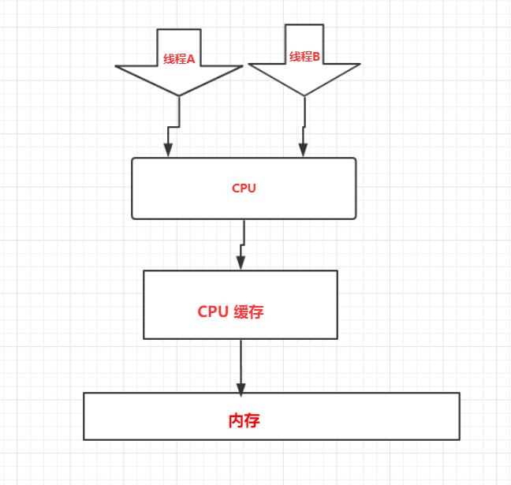

而多核 CPU 每个核心控制器工作的时候都会有自己独立的 CPU 缓存，如果两个线程同时操作一个共享变量，但因为在不同的 CPU 执行，所以他们只能查看和更新自己 CPU 缓存里的变量值，导致共享变量的操作结果无法预期。

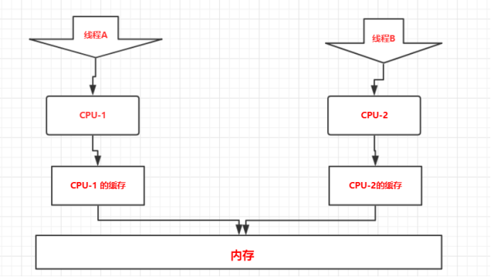

Java 提供的可见性的保障：初始化可见（`final`）、读写可见（`volatile`）都依赖于内存屏障强制将变量的最新值刷新到主内存。当然锁机制可以使得代码块与代码块之间可见。

#### 有序性问题

根源：指令重排序可能导致共享变量的修改对其他线程不可见。

> [指令重排序](#JMM 与指令重排序)：改变指令的执行顺序，但是确保程序的执行结果最终的一致性（仅在单线程内），提高处理速度，同时把 CPU 的资源利用起来，这样就能就能提升整个计算机的效率。指令重排只可能发生在毫无关系的指令之间, 如果指令之间存在依赖关系, 则不会重排。

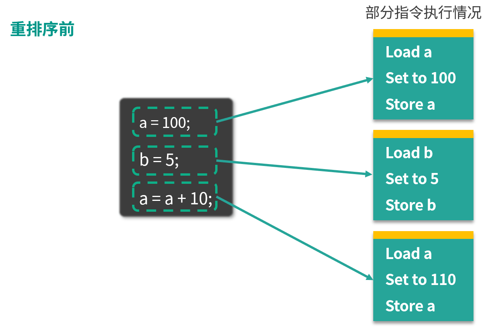

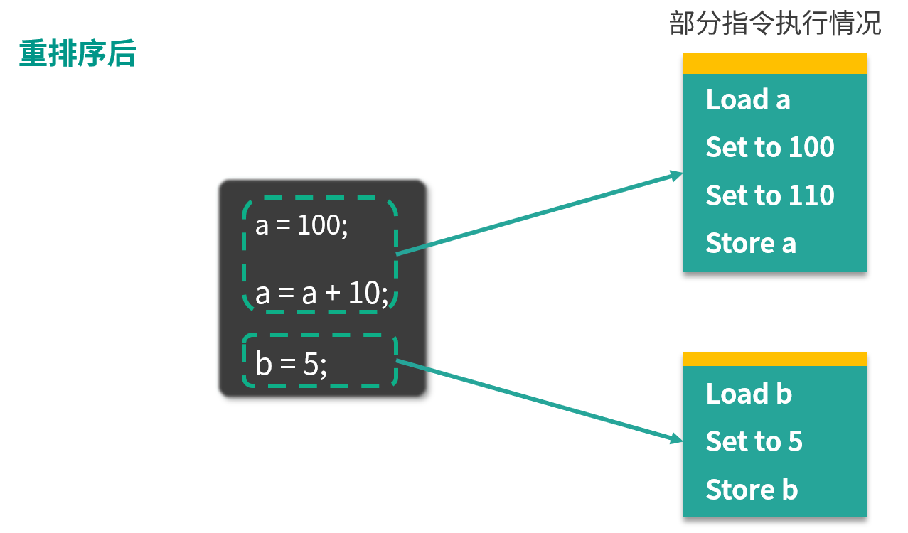

[三种重排序场景](#JMM 与指令重排序)

Java 提供的有序性的保障：禁止重排序（`volatile`）依赖于内存屏障。当然锁机制可以使得代码块与代码块之间有序。

### 活跃性问题

为了解决上诉线程安全问题，可以采取传统的加锁的方式来解决，但如果使用锁机制不当也容易引入其他问题，比如死锁。

#### 死锁

定义：死锁是指两个或多个线程在执行过程中，因争夺共享资源而造成的一种互相等待的僵局。在这种状态下，若无外力干预，所有相关线程都将无法继续执行。


一个死锁的发生，必须同时满足以下四个条件。只要破坏其中任意一个，就能有效预防死锁。

1. 互斥 (Mutual Exclusion，Mutex)：一个资源在同一时刻只能被一个线程占有。如果其他线程请求该资源，则必须等待，直到资源被释放。
2. 请求与保持 (Hold and Wait)：一个线程在请求其他资源而被阻塞时，并不会释放自己已经占有的资源。
3. 不剥夺 (No Preemption)：线程已经获得的资源，在未使用完毕之前，不能被其他线程强行剥夺，只能由持有该资源的线程自己主动释放。
4. 循环等待 (Circular Wait)：存在一个线程资源的循环等待链。线程 T1 等待线程 T2 的资源，线程 T2 等待线程 T3 的资源，...，而线程 Tn 等待线程 T1 的资源，形成一个闭环。

处理死锁的三种策略：预防、避免、检测与解除。

1. 预防：通过破坏四个必要条件中的一个或多个来预防死锁的产生。
2. 避免：这是一种更动态的方法，在运行时判断资源分配是否会将系统带入“不安全状态”。如银行家算法，在实际系统中应用较少。
3. 检测与解除：允许死锁发生，但系统会持续监控，一旦检测到死锁，就采取措施解除。在 Java 中，可以通过 jstack 命令行工具或 ThreadMXBean API 来检测死锁。一旦检测到死锁，中断其中一个或多个线程（强制释放资源），或者直接重启服务。

#### 活锁

定义：活锁是指两个或多个线程互相礼让，都在尝试避免死锁，但因为过于“积极”地响应对方的状态，导致它们持续地改变自己的状态，却无法取得任何实质性的进展。通常是由于事件逻辑的错误设计，两个线程试图响应对方的操作，线程没有被阻塞，但不断重复同一系列操作而无法执行后续有用的逻辑，不断消耗 CPU 资源。


处理活锁的方式：

* 引入随机性：在重试之前，引入随机的等待时间。
* 优先级：给予其中一个线程更高的优先级，使其能优先执行完成。

#### 饥饿

定义：饥饿是指一个或多个线程由于无法获得所需的 CPU 时间或其他资源，导致它们长时间甚至永远无法执行，最终无法完成任务。

产生原因：

* 线程优先级不当：高优先级的线程一直在运行消耗 CPU，所有的低优先级线程一直处于等待；
* 线程被永久堵塞在一个等待进入同步块的状态，而其他线程总是能在它之前持续地对该同步块进行访问；
* 死循环：某个线程进入死循环，长时间不释放 CPU。

为了避免饥饿就要确保所有线程都有机会获得所需的资源，如使用公平锁、避免设置过高的线程优先级、代码确保线程能及时释放资源等

### 性能问题

如果顺利的解决线程安全问题且保证了线程的活跃性，多线程并发一定比单线程串行执行快吗？答案是不一定，因为多线程有 **创建线程** 和 **线程上下文切换** 的开销。

创建线程是直接向系统申请资源的，对操作系统来说，创建一个线程的代价是十分昂贵的，需要给它分配内存、列入调度等。

线程创建完之后，还会遇到线程上下文切换。

一般减少上下文切换的方法有：无锁并发编程思想（如 `ConcurrentHashMap` 的数据分段访问）、乐观锁的方式（CAS 算法）、协程（单线程里的多任务调度）

# 原理部分

## Java 内存模型

[Java 内存模型（Java Memory Model, JMM）是 Java 虚拟机（JVM）的一部分](../JVM/index.md#Java 内存模型)，其核心使命是解决多线程环境下由 CPU 缓存和指令重排序引发的三大难题：**原子性、可见性和有序性**。

### 并发编程模型

**两个关键问题**

* 线程间如何通信？即：线程之间以何种机制来交换信息
* 线程间如何同步？即：线程以何种机制来控制不同线程间发生的相对顺序

有两种并发模型可以解决这两个问题：

* 消息传递并发模型
* 共享内存并发模型

区别如下图所示：

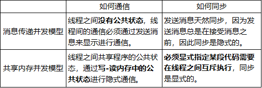

Java 虚拟机使用的是共享内存并发模型。

### 运行时内存的划分

在运行时数据区中，对于每一个线程来说，栈都是私有的，而堆是共有的。

在栈中的变量（局部变量、方法定义参数、异常处理器参数）不会在线程之间共享，也就不会有内存可见性的问题，也不受内存模型的影响。

而在堆中的变量是线程共享的，本文称为共享变量。内存可见性是针对的 **共享变量**。

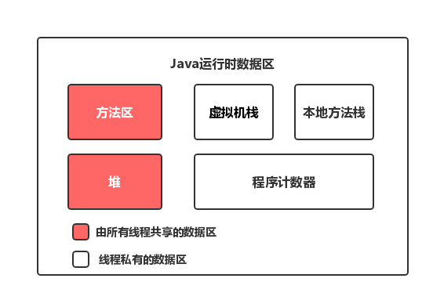

### 内存可见性问题如何发生

**物理层面**

现代计算机为了高效，往往会在高速缓存区中缓存共享变量，CPU 访问缓存区比访问内存要快得多，[CPU 缓存不一致](#可见性问题) 导致了内存不可见问题。

**抽象层面**

Java 线程之间的通信采用的是共享内存模型，指的就是 Java 内存模型，Java 内存模型决定一个线程对共享变量的写入何时对另一个线程可见。

Java 内存模型规定了所有的变量存在主内存中，每个线程都有一个私有的本地内存，保存了被该线程使用的变量的主内存副本，线程对变量的所有操作（读取、赋值等）都必须在工作内存中进行，而不能直接读写主内存中的数据。

> 主内存和本地内存是 Java 内存模型的一个抽象概念，并不真实存在。本地内存可以类比物理内存。而本地内存可以类比 CPU 缓存，涵盖了缓存、写缓冲区、寄存器等。
>
> JMM 的核心目的，是为了屏蔽不同硬件和操作系统的内存访问差异。不同的硬件架构（如 x86、ARM、PowerPC）有不同的缓存一致性协议（如 MESI）、不同级别的缓存、甚至有些架构没有缓存，本地内存的概念可以抹平这些差异性。
>
> 现代 CPU 必然有缓存、写缓冲、寄存器等，本地内存概念是对这些物理现实的诚实映射，同时规范这些概念便于利用物理性质提升性能，为了获取更快的运行速度，虚拟机可能会让工作内存优先存储于寄存器和高速缓存中。

JMM 的抽象示意图如图所示：


从图中可以看出：线程 A 无法直接访问线程 B 的工作内存，线程间通信必须经过主内存。假如线程 1 修改了共享变量后，由于内存不可见性，那么其他的线程去主存里面就读取到的就可能是线程 1 修改之前的变量。

### JMM 如何保证内存可见性

`volatile` 关键字可以保证多线程操作共享变量的可见性以及禁止指令重排序

`synchronized` 关键字不仅保证可见性，同时也保证了原子性（互斥性）和代码块与代码块之间的有序性。

在底层，JMM 是通过内存屏障来实现内存的可见性以及禁止重排序。

### JMM 与 Java 运行时内存区域的关系

这里所讲的主内存、工作内存与 Java 内存区域中的 Java 堆、栈、方法区等并不是同一个层次的内存划分，这两者基本上是没有关系的。

如果两者一定要勉强对应起来，那从变量、主内存、工作内存的定义来看，主内存主要包括方法区和堆。每个线程都有一个工作内存，工作内存中主要包括两个部分，一个是属于该线程私有的栈和对主存部分变量拷贝的寄存器（包括程序计数器 PC 和 CPU 工作的高速缓存区）。

### JMM 与指令重排序

计算机在执行程序时，为了提高性能，编译器和处理器常常会对指令做重排。

```
a = b + c;
d = e - f ;
```

先加载 b、c（注意，即有可能先加载 b，也有可能先加载 c），但是在执行 add(b, c)的时候，需要等待 b、c 装载结束才能继续执行，也就是增加了停顿，那么后面的指令也会依次有停顿, 这降低了计算机的执行效率。

为了减少这个停顿，我们可以先加载 e 和 f, 然后再去加载 add(b, c), 这样做对程序（串行）是没有影响的, 但却减少了停顿。既然 add(b, c)需要停顿，那还不如去做一些有意义的事情。

综上所述，指令重排对于提高 CPU 处理性能十分必要。虽然由此带来了乱序的问题，但是这点牺牲是值得的。

指令重排一般分为以下三种：

* 编译器优化重排：编译器（包括 JVM、JIT 编译器等）出于优化的目的，在不改变单线程程序语义的前提下，可以重新安排语句的执行顺序。
* 指令并行重排：和编译器优化类似，现代处理器采用了指令级并行技术来将多条指令重叠执行。如果不存在数据依赖性（即后一个执行的语句无需依赖前面执行的语句的结果），处理器可以改变语句对应的机器指令的执行顺序。
* 内存系统重排：由于 CPU 通过缓冲区的方式进行延迟写入内存，导致其他线程看不到修改结果，表面上看起来像是发生了重顺序。内存“重排序”其实是造成可见性问题的主要原因所在

**as-if-serial**

as-if-serial 规则是 Java 并发编程中的一个重要概念。它的意思是：**无论编译器和处理器如何重排序指令，只要单线程程序的执行结果不变**。

为了遵守 as-if-serial 规则，编译器和处理器不会对存在数据依赖关系的操作进行重排序，因为这种重排序会改变执行结果。

```java
int a = 1;
int b = 2;
int c = a + b;
在这个例子中，a 和 c 之间存在数据依赖关系，b 和 c 之间也存在数据依赖关系。因此，c 不能被重排序到 a 和 b 之前。
```

指令重排可以保证串行语义一致，但是没有义务保证多线程间的语义也一致。所以在多线程下，指令重排序可能会导致一些问题。

### JMM 与顺序一致性模型

**顺序一致性模型**

顺序一致性内存模型是一个 **理想化** 的理论参考模型，它为程序员提供了 **极强的内存可见性保证**。

顺序一致性模型有两大特性：

* 一个线程中的所有操作必须按照程序的顺序（即 Java 代码的顺序）来执行。
* 不管程序是否同步，所有线程都只能看到一个单一的操作执行顺序。即在顺序一致性模型中，每个操作必须是原子性的，且立刻对所有线程可见。

举个例子，假设有两个线程 A 和 B 并发执行，线程 A 有 3 个操作，他们在程序中的顺序是 A1-> A2-> A3，线程 B 也有 3 个操作，B1-> B2-> B3。

正确使用了同步：A 线程的 3 个操作执行后释放锁，B 线程获取同一个锁。在顺序一致性模型中的执行效果如下：

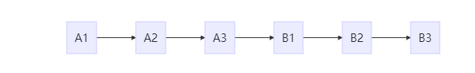

操作的执行整体上有序，并且两个线程都只能看到这个执行顺序。

没有使用同步。在顺序一致性模型中的执行效果如下：


操作的执行整体上无序，但是两个线程都只能看到这个执行顺序。之所以可以得到这个保证，是因为顺序一致性模型中的 **每个操作必须立即对任意线程可见**。

 **JMM 无法保证顺序一致性**。

在当前线程把写过的数据缓存在本地内存中，在没有刷新到主内存之前，这个写操作仅对当前线程可见；从其他线程的角度来观察，这个写操作根本没有被当前线程所执行。只有当前线程把本地内存中写过的数据刷新到主内存之后，这个写操作才对其他线程可见。在这种情况下，当前线程和其他线程看到的执行顺序是不一样的。

**JMM 中同步程序**

在顺序一致性模型中，所有操作完全按照程序的顺序串行执行。但是 JMM 中，临界区内（同步块或同步方法中）的代码可以发生重排序。虽然线程 A 在临界区做了重排序，但是因为锁的特性，线程 B 无法观察到线程 A 在临界区的重排序。这种重排序既提高了执行效率，又没有改变程序的执行结果。同时，JMM 会在退出临界区和进入临界区做特殊的处理，使得在临界区内程序获得与顺序一致性模型相同的内存视图。由此可见，JMM 的具体实现方针是：在不改变（正确同步的）程序执行结果的前提下，尽量为编译期和处理器的优化打开方便之门。

因此，JMM 对于正确同步多线程程序的内存一致性做了以下保证：**如果程序是正确同步的，程序的执行将具有顺序一致性**。即程序的执行结果和该程序在顺序一致性模型中执行的结果相同。这里的同步包括使用 `volatile`、`final`、`synchronized` 等关键字实现的同步。但是如果我们开发者没有正确使用 `volatile`、`final`、`synchronized` 等关键字，那么即便是使用了同步，JMM 也不会有内存可见性的保证，很可能会导致程序出错，并且不可重现，很难排查。

**JMM 中未同步程序**

对于未同步的多线程，JMM 只提供最小安全性：线程读取到的值，要么是之前某个线程写入的值，要么是默认值，不会无中生有。为了实现这个安全性，JVM 在堆上分配对象时，首先会对内存空间清零，然后才会在上面分配对象（这两个操作是同步的）。JMM 没有保证未同步程序的执行结果与该程序在顺序一致性模型中执行结果一致。因为如果要保证执行结果一致，那么 JMM 需要禁止大量的优化，对程序的执行性能会产生很大的影响。

因此，当程序未正确同步的时候，就可能存在数据竞争，运行的结果往往充满了不确定性，比如读发生在了写之前，可能就会读到错误的值；

> 数据竞争：在一个线程中写一个变量，在另一个线程读同一个变量，并且写和读没有通过同步来排序。

### happens-before

一方面，我们开发者需要 JMM 提供一个强大的内存模型来编写代码；另一方面，编译器和处理器希望 JMM 对它们的束缚越少越好，这样它们就可以尽可能多的做优化来提高性能，希望的是一个 **弱的内存模型**。

JMM 考虑了这两种需求，并且找到了平衡点：

* 对编译器和处理器来说，**只要不改变程序的执行结果（单线程程序和正确同步了的多线程程序），编译器和处理器怎么优化都行。** 也就是 as-if-serial。

* 对于开发者来说，JMM 提供的 **happens-before 规则（先行发生原则）**，是判断数据是否存在竞争，线程是否安全的非常有用的手段。开发者只要遵循 happens-before 规则，那么我们写的程序就能保证在 JMM 中具有强的内存可见性。

happens-before 关系的定义如下：

1. 如果一个操作 happens-before 另一个操作，那么第一个操作的执行结果将对第二个操作可见，而且第一个操作的执行顺序排在第二个操作之前。
2. 两个操作之间存在 happens-before 关系，并不意味着 Java 平台的具体实现必须要按照 happens-before 关系指定的顺序来执行。

从第二点可以看出，happens-before 关系本质上和 as-if-serial 语义是一回事。如果重排序之后的执行结果，与按 happens-before 关系来执行的结果一致，那么 JMM 也允许这样的重排序。as-if-serial 语义保证单线程内重排序后的执行结果和程序代码本身应有的结果是一致的，happens-before 关系保证正确同步的多线程程序的执行结果不被重排序改变。

在 Java 中，有以下天然的 happens-before（下文称为“先行发生”） 关系：

* 程序次序规则：在一个线程内，按照控制流顺序，书写在前面的操作先行发生于书写在后面的操作。
* 管程锁定规则：一个 `unlock` 操作先行发生于时间上更晚的对同一个锁的 `lock` 操作。
* volatile 变量规则：对一个 `volatile` 变量的写操作先行发生于时间上更晚的对这个变量的读操作。
* 线程启动规则（Thread Start Rule）：Thread 对象的 `start()` 方法先行发生于此线程的每一个动作。
* 线程终止规则（Thread Termination Rule）：线程中的所有操作都先行发生于对此线程的终止检测，我们可以通过 Thread:: join()方法是否结束、Thread:: isAlive()的返回值等手段检测线程是否已经终止执行。
* 线程中断规则（Thread Interruption Rule）：对线程 `interrupt()` 方法的调用先行发生于被中断线程的代码检测到中断事件的发生，可以通过 Thread:: interrupted()方法检测到是否有中断发生。
* 对象终结规则（Finalizer Rule）：一个对象的初始化完成（构造函数执行结束）先行发生于它的 `finalize()` 方法的开始。
* 传递性（Transitivity）：如果操作 A 先行发生于操作 B，操作 B 先行发生于操作 C，那就可以得出操作 A 先行发生于操作 C 的结论。

举例：

```java
int a = 1; // A操作
int b = 2; // B操作
int sum = a + b;// C 操作
System.out.println(sum);
```

根据 happens-before 规则的程序次序规则，假如只有一个线程，那么不难得出：

```java
A happens-before B 
B happens-before C 
A happens-before C
```

注意，真正在执行指令的时候，其实 JVM 有可能对操作 A & B 进行重排序，因为无论先执行 A 还是 B，他们都对对方是可见的，并且不影响执行结果。时间先后顺序与先行发生原则之间基本没有因果关系。

所以，不用关心 JVM 到底是怎样执行的，衡量并发安全问题的时候不要受时间顺序的干扰，一切必须以 happens-before 规则为准。

## volatile 关键字

### volatile 关键字的特性

* 保证变量的内存可见性
  
* 禁止指令重排（Java 5 起）

### volatile 如何保证内存可见性

```java
public class VolatileExample {
    int a = 0;
    volatile boolean flag = false;

    public void writer() {
        a = 1; // step 1
        flag = true; // step 2
    }

    public void reader() {
        if (flag) { // step 3
            System.out.println(a); // step 4
        }
    }
}
```

示例代码中，使用 `volatile` 关键字修饰了一个 `boolean` 类型的变量 `flag`。

当一个线程对 `volatile` 修饰的变量进行 **写操作**（比如 step 2）时，JMM 会立即把该线程对应的本地内存中的共享变量的值刷新到主内存；当一个线程对 `volatile` 修饰的变量进行 **读操作**（比如 step 3）时，JMM 会把立即该线程对应的本地内存置为无效，从主内存中读取共享变量的值。

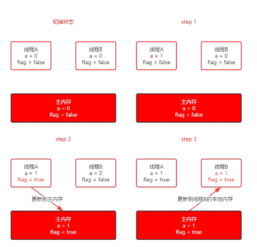

> 在这一点上 `volatile` 与锁具有相同的内存效果
>
> `volatile` 变量的写和锁的释放具有相同的内存语义
>
> `volatile` 变量的读和锁的获取具有相同的内存语义。

如果 `flag` 变量没有用 `volatile` 修饰，在 step 2，线程 A 的本地内存里面的变量就不会立即更新到主内存，那随后线程 B 也同样不会去主内存拿最新的值，仍然使用线程 B 本地内存缓存的变量的值 `a = 0，flag = false`。

### volatile 禁止指令重排

**禁止指令重排**

在 JSR-133 之前的旧的 Java 内存模型中，是允许 `volatile` 变量与普通变量重排序的。那上面的案例中，可能就会被重排序成下列时序来执行：

```
线程A写volatile变量，step 2，设置flag为true；
线程B读同一个volatile，step 3，读取到flag为true；
线程B读普通变量，step 4，读取到 a = 0；
线程A修改普通变量，step 1，设置 a = 1；
```

可见，如果 volatile 变量与普通变量发生了重排序，虽然 volatile 变量能保证内存可见性，也可能导致普通变量读取错误。

为了提供一种比锁更轻量级的线程间的通信机制，JSR-133 专家组决定增强 `volatile` 的内存语义：严格限制编译器和处理器对 volatile 变量与普通变量的重排序。

> 至此，volatile 的写-读也与锁的释放-获取具有相同的内存语义了

**内存屏障**

JVM 是通过 **内存屏障** 来实现限制处理器的重排序的。当我们使用 `volatile` 关键字来修饰一个变量时，Java 内存模型会插入内存屏障（一个处理器指令，可以对 CPU 或编译器重排序做出约束）来确保以下两点：

* 写屏障（Write Barrier）：当一个 `volatile` 变量被写入时，写屏障确保在该屏障之前的所有变量的写入操作都提交到主内存。
* 读屏障（Read Barrier）：当读取一个 `volatile` 变量时，读屏障确保在该屏障之后的所有读操作都从主内存中读取。

因此当程序执行到 volatile 变量的读操作或者写操作时，在其前面操作的更改肯定已经全部进行，且结果对后面的操作可见；在其后面的操作肯定还没有进行；在进行指令优化时，不能将 volatile 变量的语句放在其后面执行，也不能把 volatile 变量后面的语句放到其前面执行。

**happens before 规则之 volatile 变量规则**

happens-before 规则是一个给程序员使用的规则，只要程序员在写代码的时候遵循这个规则，JVM 就能保证指令在多线程之间的顺序性符合程序员的预期。

volatile 基于 happens before 关系的 volatile 变量规则来实现禁止指令重排序

[volatile 变量规则](#happens-before)：对一个 `volatile` 变量的写操作先行发生于时间上更晚的对这个变量的读操作。

```
根据程序次序规则，step 1 happens before step 2; step 3 happens before step 1  
根据 volatile 规则，step 2 happens before step 3
根据传递性规则，step 1 happens before step 4。


分别对应下图
黑色箭头表示程序顺序规则；
橙色箭头表示 volatile 规则；
蓝色箭头表示根据传递性规则组合后的保证。
```

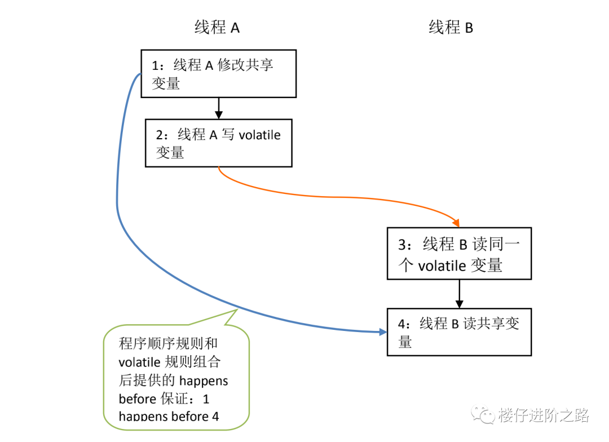

### **volatile** 无法保证原子性

示例：10 个线程同时对变量 `inc` 进行自增操作

```java
public class volatileTest {
    public volatile int inc = 0;
    public void increase() {
        inc++;
    }
    public static void main(String[] args) {
        final volatileTest test = new volatileTest();
        for(int i=0;i<10;i++){
            new Thread(){
                public void run() {
                    for(int j=0;j<1000;j++)
                        test.increase();
                };
            }.start();
        }
        while(Thread.activeCount()>1)  //保证前面的线程都执行完
            Thread.yield();
        System.out.println("inc output:" + test.inc);
    }
}
// inc output:8182     
// 结果不符合预期
```

假设某一时间段，线程 A 和 线程 B 同时对同一个 `volatile int i` 执行 `i++` 操作，初始值为 `0`。

1. 线程 A 读取 `i` 的值为 `0`。（然后被操作系统挂起，线程 B 开始执行）
2. 线程 B 读取 `i` 的值仍为 `0`。
3. 线程 B 将值修改为 `1` 并写回主内存。
4. 线程 A 恢复执行，它手里持有的值依然是之前读取的 `0`，它将其加 `1` 得到 `1`，然后写回主内存。

虽然 `volatile` 保证了线程 B 写入后，线程 2 能立刻看到主内存的最新值（可见性），但它无法阻止线程 A 在读取之后、写入之前，被其他线程打断。

解决方案：

* 采用 `synchronized` 或 `ReentrantLock`
* 采用原子类 `AtomicInteger`

### 场景：懒汉式-双重校验锁的单例模式

[设计模式之单例模式的实现](../设计模式/index.md#创建型 - 单例模式 Singleton )

```Java
public class Singleton {

    private volatile static Singleton uniqueInstance;

    private Singleton() {
    }

    public static Singleton getUniqueInstance() {
        if (uniqueInstance == null) {
            synchronized (Singleton.class) {
                if (uniqueInstance == null) {
                    uniqueInstance = new Singleton();
                }
            }
        }
        return uniqueInstance;
    }
}
```

上诉例子中，

构造方法被声明为 `private`，阻止了外部代码使用 `new` 来创建 `Singleton` 实例。

第一次 `if (uniqueInstance == null)` 检查是否已经存在  `Singleton` 实例。如果不存在，才进入同步代码块。避免线程频繁的等待带来性能损耗。

`synchronized` 避免在多线程环境下多个线程获取锁后去实例化 `Singleton` 的问题，保证了 `Singleton` 类只能被实例化一次。

使用 volatile 关键字是为了防止 `uniqueInstance = new Singleton()`，因为创建对象代码分为三个子步骤：

1. 为对象分配足够的内存空间，伪代码 `memory = allocate()`
2. 初始化对象的成员变量，伪代码 `ctorInstanc(memory)`
3. 将内存地址赋值引用变量（uniqueInstance），伪代码 `instance = memory`

如果不使用 volatile 关键字，JVM 可能会对这三个子步骤进行指令重排，1-> 3-> 2。

这种重排序会导致 `uniqueInstance` 引用在对象完全初始化之前就被其他线程访问到。

因此，我们可以为 `uniqueInstance` 变量添加 volatile 关键字是必要的来，禁止指令重排序，确保对象的初始化完成后再将其赋值给 `uniqueInstance`。

## synchronized 关键字

> 临界区：在同一时刻只允许一个进程或线程执行的代码段。

### 同步实例方法

通过在方法声明中加入 `synchronized` 关键字，可以保证在任意时刻，只有一个线程能执行该方法。

```java
public class AccountingSync implements Runnable {
    //共享资源(临界资源)
    static int i = 0;
    // synchronized 同步方法
    public synchronized void increase() {
        i ++;
    }
    @Override
    public void run() {
        for(int j=0;j<1000000;j++){
            increase();
        }
    }
}
```

当 `synchronized` 同步实例方法时，锁的是当前对象 `this`。

正确同步：

```java
public class Test {
     public static void main(String args[]) throws InterruptedException {
        AccountingSync instance = new AccountingSync();
        Thread t1 = new Thread(instance);
        Thread t2 = new Thread(instance);
        t1.start();
        t2.start();
        t1.join();
        t2.join();
        System.out.println("static, i output:" + i);
    }
}
/**
 * 输出结果:
 * static, i output:2000000
 */
```

错误同步：

```java
public class Test {
     public static void main(String args[]) throws InterruptedException {
        // new 两个AccountingSync新实例
        Thread t1 = new Thread(new AccountingSyncBad());
        Thread t2 = new Thread(new AccountingSyncBad());
        t1.start();
        t2.start();
        t1.join();
        t2.join();
        System.out.println("static, i output:" + i);
    }
}
/**
 * 输出结果:
 * static, i output:1224617
 */
```

虽然使用了 `synchronized` 同步 `increase` 方法，但却 `new` 了两个不同的对象来调用 `increase` 方法，这也就意味着存在着两个不同的对象锁，因此 t1 和 t2 都会进入各自的对象锁，也就是说 t1 和 t2 线程使用的是不同的锁，因此线程安全是无法保证的。

### 同步静态方法

当 `synchronized` 同步静态方法时，锁的是当前类的 Class 对象，不属于某个对象。

```java
public class AccountingSyncClass implements Runnable {
    static int i = 0;
    /**
     * 同步静态方法,锁是当前class对象，也就是
     * AccountingSyncClass类对应的class对象
     */
    public static synchronized void increase() {
        i++;
    }
    
    @Override
    public void run() {
        for(int j=0;j<1000000;j++){
            increase();
        }
    }
    public static void main(String[] args) throws InterruptedException {
        //new新实例
        Thread t1=new Thread(new AccountingSyncClass());
        //new新实例
        Thread t2=new Thread(new AccountingSyncClass());
        //启动线程
        t1.start();t2.start();
        t1.join();t2.join();
        System.out.println(i);
    }
}
/**
 * 输出结果:
 * 2000000
 */
```

### 同步代码块

某些情况下，我们编写的方法代码量比较多，存在一些比较耗时的操作，而需要同步的代码块只有一小部分，如果直接对整个方法进行同步，可能会得不偿失，此时我们可以使用同步代码块的方式对需要同步的代码进行包裹。

```java
// 关键字在代码块上，锁为括号里面的对象
public void blockLock() {
    Object o = new Object();
    synchronized (o) {
        // code
    }
}
```

通过上面的例子，可知以下两个写法等价

```java
// 关键字在实例方法上，锁为当前实例
public synchronized void instanceLock() {
    // code
}

// 关键字在代码块上，锁为括号里面的对象
public void blockLock() {
    synchronized (this) {
        // code
    }
}
```

同理，下面这两个方法也应该是等价的：

```java
// 关键字在静态方法上，锁为当前Class对象
public static synchronized void classLock() {
    // code
}

// 关键字在代码块上，锁为括号里面的对象
public void blockLock() {
    synchronized (this.getClass()) {
        // code
    }
}
```

### synchronized 与 happens before

[管程锁定规则](#happens-before)：一个 `unlock` 操作先行发生于时间上更晚的对同一个锁的 `lock` 操作。

```java
class MonitorExample {
    int a = 0;
    public synchronized void writer() {  //1
        a++;                             //2
    }                                    //3
    public synchronized void reader() {  //4
        int i = a;                       //5
        //……
    }                                    //6
}
```

```
根据程序次序规则，1 happens before 2, 2 happens before 3; 4 happens before 5, 5 happens before 6。
根据监视器锁规则，3 happens before 4。
根据 happens before 的传递性，2 happens before 5。

分别对应下图
黑色箭头表示程序顺序规则；
橙色箭头表示监视器锁规则；
蓝色箭头表示根据传递性规则组合后的保证。
```

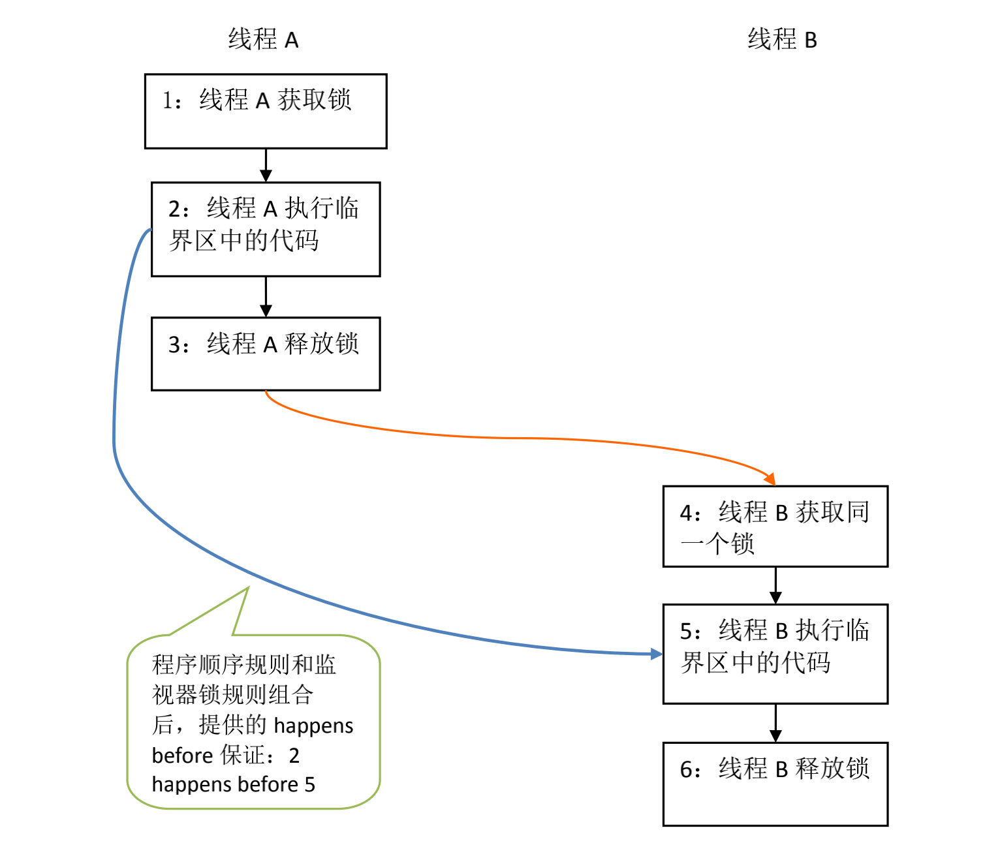

也就是说，`synchronized` 会防止临界区内的代码与外部代码发生重排序，`writer()` 方法中 a++ 的执行和 `reader()` 方法中 a 的读取之间存在 happens-before 关系，保证了执行顺序和内存可见性。

### synchronized 的可重入性

从互斥锁的设计上来说，当一个线程试图操作一个由其他线程持有的对象锁的临界资源时，将会处于阻塞状态，但当一个线程再次请求自己持有对象锁的临界资源时，这种情况属于重入锁，请求将会成功。

`synchronized` 就是可重入锁，因此一个线程调用 `synchronized` 方法的同时，在其方法体内部调用该对象另一个 `synchronized` 方法是允许的，如下：

```java
public class AccountingSync implements Runnable{
    static AccountingSync instance=new AccountingSync();
    static int i=0;
    static int j=0;

    @Override
    public void run() {
        for(int j=0;j<1000000;j++){
            //this,当前实例对象锁
            synchronized(this){
                i++;
                increase(); //synchronized的可重入性
            }
        }
    }

    public synchronized void increase(){
        j++;
    }

    public static void main(String[] args) throws InterruptedException {
        Thread t1=new Thread(instance);
        Thread t2=new Thread(instance);
        t1.start();t2.start();
        t1.join();t2.join();
        System.out.println(i);
    }
}
```

此程序中的 `synchronized(this)` 和 `synchronized` 方法都使用了同一个锁对象（当前的 AccountingSync 实例），并且对静态变量 i 和 j 进行了增加操作，因此，在多线程环境下，也能保证 i 和 j 的操作是线程安全的。

## synchronized 的四种锁状态

### 锁的四种状态

在 JDK 1.6 以前，所有的锁都是”重量级“锁，因为使用的是操作系统的互斥锁，当一个线程持有锁时，其他试图进入 `synchronized` 块的线程将被阻塞，直到锁被释放。涉及到了线程上下文切换和用户态与内核态的切换，因此效率较低。

JDK 1.6 为了减少获得锁和释放锁带来的性能消耗，引入了“偏向锁”和“轻量级锁“的概念，对 synchronized 做了一次重大的升级，升级后的 synchronized 性能可以说上了一个新台阶。

此后一个对象其实有四种锁状态，它们级别由低到高依次是：

1. 无锁状态
2. 偏向锁状态
3. 轻量级锁状态
4. 重量级锁状态

**锁升级**

几种锁会随着竞争情况逐渐升级，[锁的升级](../JVM/index.md#锁优化) 很容易发生

**锁降级**

锁降级发生的条件就比较苛刻了，锁降级发生在 Stop The World（Java 垃圾回收中的一个重要概念，JVM 篇会细讲）期间，当 JVM 进入安全点的时候，会检查是否有闲置的锁，然后进行降级。

### 锁信息的存放位置

HotSpot 虚拟机里，对象在堆内存中的存储布局可以划分为三个部分：对象头（Header）、实例数据（Instance Data）和对齐填充（Padding）。

每个 Java 对象都有 [对象头](../JVM/index.md#对象的内存布局)。如果是非数组类型，则用 2 个字宽来存储对象头，如果是数组，则会用 3 个字宽来存储对象头。在 32 位处理器中，一个字宽是 32 位；在 64 位虚拟机中，一个字宽是 64 位。

对象头的内容如下表：

| 内容                   | 说明                               | 长度     |
| ---------------------- | ---------------------------------- | -------- |
| Mark Word              | 存储对象的 hashCode 或 **锁信息** 等 | 32/64bit |
| Class Metadata Address | 存储到对象类型数据的指针           | 32/64bit |
| Array length           | 数组的长度（如果是数组）           | 32/64bit |

Mark Word 的格式：

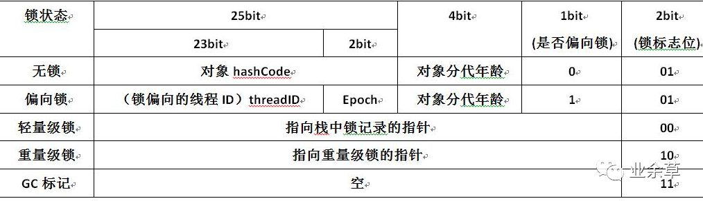

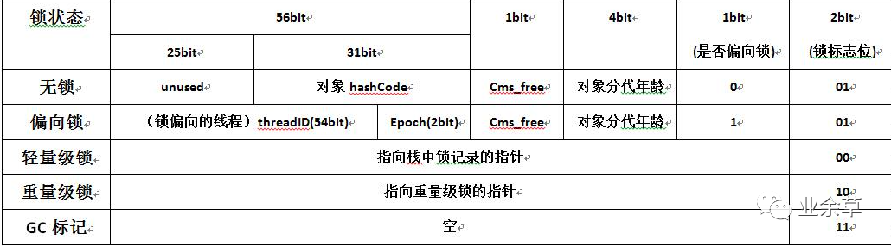

由图可知，当对象状态为偏向锁时，`Mark Word` 存储的是偏向的线程 ID；当状态为轻量级锁时，`Mark Word` 存储的是指向线程栈中 `Lock Record` 的指针；当状态为重量级锁时，`Mark Word` 为指向堆中的 `monitor`（监视器）对象的指针。

> 对象头 Mark Word 中的重量级锁指针指向的是 monitor （监视器）对象，也就是通常所说的对象的内置锁，该对象是在 HotSpot 底层 C++语言编写的。监视器包括两个重要部分，一个是锁，一个是等待/通知机制，后者是通过 Object 类中的 wait(), notify(), notifyAll()等方法实现的（我们会在讲 [Condition](#等待通知条件Condition) 和 [生产者-消费者模式](#../设计模式/设计模式)）详细地讲。

### 无锁状态

如果未开启偏向锁功能 `-XX:UseBiasedLocking=false`，或者在偏向延迟 `-XX:BiasedLockingStartupDelay=5` 内创建对象，则创建的都是普通无锁对象。

Mark Word 中锁标志位是否为 ”01”、偏向模式是否为 “0”。

### 偏向锁

Hotspot 的作者经过以往的研究发现大多数情况下锁不仅不存在多线程竞争，而且总是由同一线程反复的去获取/释放一个（轻量级锁或者重量级锁），不断的加解锁显然是没有必要的，造成了资源的浪费。，于是引入了偏向锁。

偏向锁会偏向于第一个访问锁的线程，如果在接下来的运行过程中，该锁没有被其他的线程访问，则持有偏向锁的线程将永远不需要触发同步。也就是说，**偏向锁在资源无竞争情况下消除了同步语句**，连 CAS 操作都不做了，提高了程序的运行性能。

**实现原理**

当锁对象第一次被线程获取的时候，虚拟机将会把对象头中的标志位设置为“01”、把偏向模式设置为“1”，表示进入偏向模式。同时会在对象头和栈帧中的锁记录里存储锁的偏向的线程 ID。且偏向锁是不会主动释放锁。

后续有线程请求锁的流程：

1. 确认是否为可偏向状态，即访问 Mark Word 中锁标志位是否为 ”01”、偏向模式是否为 “1”。
   1. 不可偏向，走轻量级锁流程或重量级锁流程。

   2. 可偏向，比对 Mark Word 里的线程 ID 是否与当前线程 ID 一致。
      1. 一致，表示偏向锁已偏向当前线程，无需使用 CAS 来加锁、解锁，直接进入代码。

      2. 不一致，表示偏向锁未偏向（匿名偏向锁）或已偏向其他线程，尝试使用 CAS 来替换 Mark Word 里面的线程 ID 为新线程的 ID。
         1. 成功，表示偏向锁未偏向或之前的线程不存在了， Mark Word 里面的线程 ID 设置为新线程的 ID，锁不会升级，仍然为偏向锁；

         2. 失败，表示之前的线程仍然存在，那么暂停之前的线程，撤销偏向锁，设置锁标志位为 “00”，设置偏向模式为 “0”，升级为轻量级锁，会按照轻量级锁的方式进行竞争锁。


> CAS: Compare and Swap
>
> 比较并设置。用于在硬件层面上提供 **原子性操作**。在 Intel 处理器中，比较并交换通过指令 cmpxchg 实现。 比较是否和给定的数值一致，如果一致则修改，不一致则不修改。

线程竞争偏向锁的过程如下：

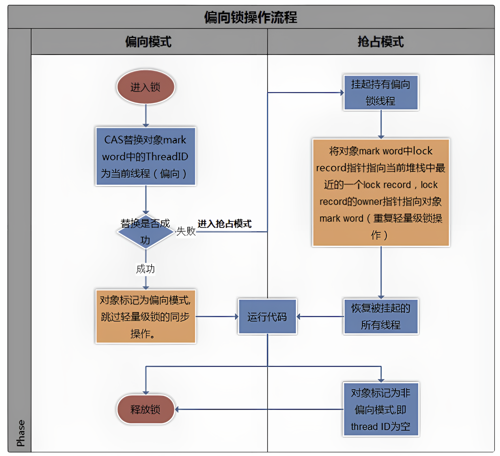

**偏向锁的撤销**

偏向锁只有遇到其他线程尝试竞争偏向锁时，持有偏向锁的线程才会释放锁，线程不会主动去释放偏向锁。

偏向锁升级成轻量级锁时，会暂停拥有偏向锁的线程，重置偏向锁标识，这个过程看起来容易，实则开销还是很大的，大概的过程如下：

1. 在一个安全点（在这个时间点上没有字节码正在执行）停止拥有锁的线程。
2. 遍历线程栈，如果存在锁记录的话，需要修复锁记录和 Mark Word，使其变成无锁状态。
3. 唤醒被停止的线程，将当前锁升级成轻量级锁。

如果应用程序里所有的锁通常出于竞争状态，那么偏向锁就会是一种累赘，对于这种情况，我们可以一开始就把偏向锁这个默认功能给关闭 `-XX:UseBiasedLocking=false`

为了开启是有延迟的，

偏向锁的获得和撤销：

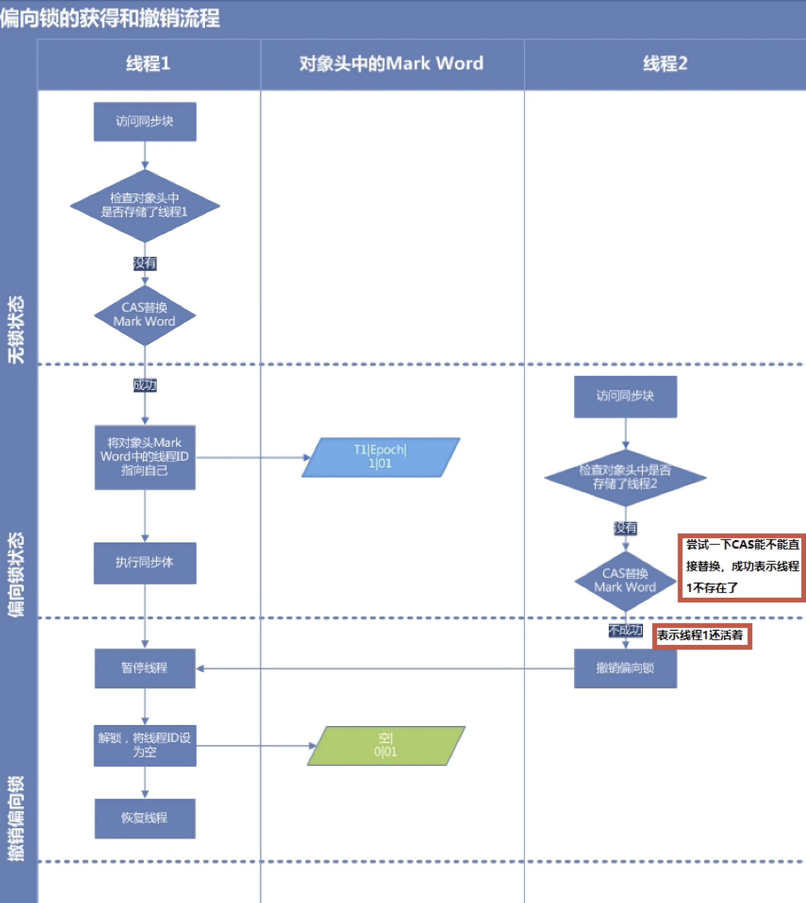

**hashCode 方法调用的影响**

当对象进入偏向状态的时候 Mark Word 大部分的空间（23 个比特）都用于存储持有锁的线程 ID，原有存储对象哈希码的空间被覆盖了。

Java 语言里面一个对象如果计算过哈希码，为了依赖哈希码的功能 API 无出错风险，就应该一直保持该值不变（强烈推荐但不强制，因为用户可以重载 `hashCode()`）。它通过在对象头中存储计算结果来保证第一次计算之后，再次调用该方法取到的哈希码值永远不会再发生改变。

因此，当一个对象已经计算过一致性哈希码后，它就再也无法进入偏向锁状态了。

**告别偏向锁**

从 JDK 15 开始，默认就是 disabled，除非显示的通过 `UseBiasedLocking 开启`。

偏向锁给 JVM 增加了巨大的复杂性，只有少数非常有经验的程序员才能理解整个过程，维护成本很高，大大阻碍了开发新特性的进程。

### 轻量级锁

轻量级锁考虑的是竞争锁对象的线程不多，而且线程持有锁的时间也不长的情景。因为阻塞线程需要 CPU 从用户态转到内核态，代价较大，如果刚刚阻塞不久这个锁就被释放了，那这个代价就有点得不偿失了，因此这个时候就干脆不阻塞这个线程，让它自旋这等待锁释放。

针对这种情况，JVM 采用轻量级锁来避免线程的阻塞与唤醒。

**实现原理**

1. JVM 会为每个线程在当前线程的栈帧中创建用于存储锁记录（Lock Record）的空间，我们称为 Displaced Mark Word。如果一个线程获得锁的时候发现是轻量级锁，会把锁的 Mark Word 复制到自己的 Displaced Mark Word 里面。
2. CAS 操作将锁的 Mark Word 替换为指向锁记录的指针。如果成功，即代表该线程拥有了这个对象的锁，如果失败，表示 Mark Word 已经被替换成了其他线程的锁记录，说明在与其它线程竞争锁，当前线程就尝试使用自旋来获取锁。

**自旋锁与自适应自旋**

自旋代表不断尝试去获取锁，一般用循环来实现。使用 `-XX:+UseSpinning` 参数来开启自旋锁。

自旋是需要消耗 CPU 的，如果一直获取不到锁的话，那该线程就一直处在自旋状态，白白浪费 CPU 资源。解决这个问题最简单的办法就是指定自旋的次数，例如让其循环 10 次，如果还没获取到锁就进入阻塞状态。使用参数 `-XX：PreBlockSpin` 来自行更改自旋的次数。

在 JDK 6 自旋锁变为默认开启，且对自旋锁的优化采用了更聪明的方式——适应性自旋，自旋的时间不再是固定的，而是由前一次在同一个锁上的自旋时间及锁的拥有者的状态来决定的。简单来说就是线程如果自旋成功了，则下次自旋的次数会更多，如果自旋失败了，则自旋的次数就会减少。

**轻量级锁的释放**

> 自旋也不是一直进行下去的，如果自旋到一定程度（和 JVM、操作系统相关），依然没有获取到锁，称为自旋失败，那么这个线程会阻塞。同时这个锁就会升级成重量级锁。

在释放锁时，当前线程会使用 CAS 操作将 Displaced Mark Word 的内容复制回锁的 Mark Word 里面。如果没有发生竞争，那么这个复制的操作会成功。如果有其他线程因为自旋多次导致轻量级锁升级成了重量级锁，那么 CAS 操作会失败，此时会释放锁并唤醒被阻塞的线程。

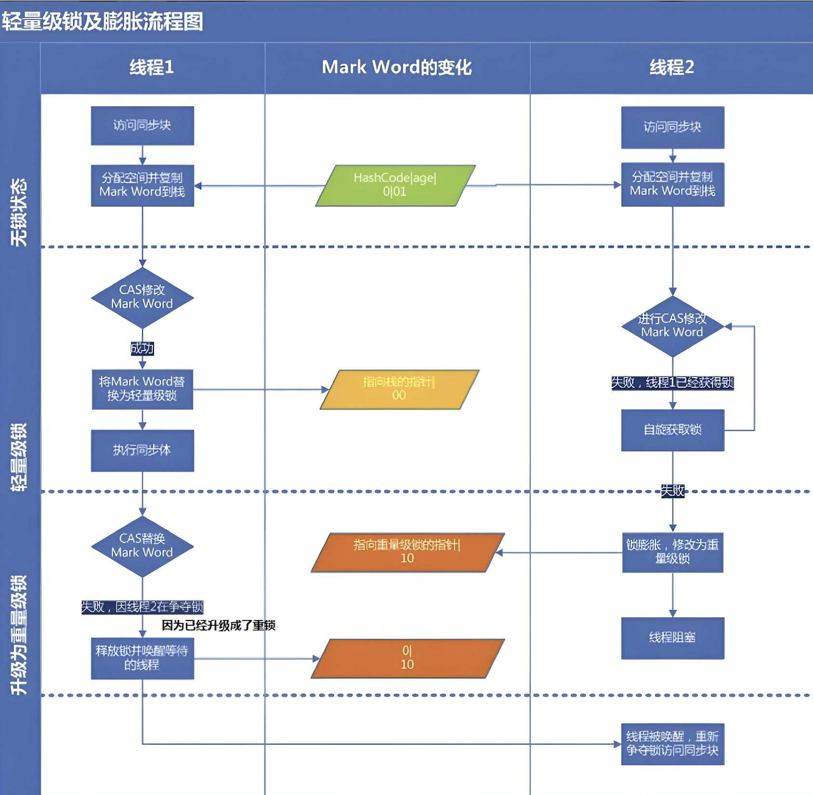

### 重量级锁

当另外一个线程执行到同步块的时候，由于它没有对应 `monitor` 的所有权，就会被阻塞，此时控制权只能交给操作系统，也就会从 `user mode` 切换到 `kernel mode`, 由操作系统来负责线程间的调度和线程的状态变更, 这就需要频繁的在这两个模式下切换（**上下文转换**）。

因此重量级锁效率很低，使得开发者常常诟病 `synchronized` 关键字的同步机制，但被阻塞的线程不会消耗 CPU。

**实现原理**

重量级锁对应的锁标志位是 10，存储了指向重量级监视器锁的指针。在 Hotspot 中，这个指针指向了监视器（monitor）对象，该对象是由 C++语言编写的，由 `ObjectMonitor` 对象实现。

```java
ObjectMonitor::ObjectMonitor() {  
  _header       = NULL;  
  _count       = 0; // 用来记录该对象被线程获取锁的次数
  _waiters      = 0,  
  _recursions   = 0; // 线程的重入次数。syncronized是一个可重入锁
  _object       = NULL;  
  _owner        = NULL; // 标识持有ObjectMonitor对象的线程
  _WaitSet      = NULL; // 等待线程（处于wait状态的线程）组成的双向循环链表，_WaitSet是第一个节点
  _WaitSetLock  = 0 ;  
  _Responsible  = NULL ;  
  _succ         = NULL ;  
  _cxq          = NULL ; // 多线程竞争锁进入时的单向链表。线程挂起，因此syncronized是一个重量级锁
  FreeNext      = NULL ;  
  _EntryList    = NULL ; // 阻塞线程（处于block状态的线程）组成的双向循环链表，可从中唤醒线程结点，_EntryList是第一个节点
  _SpinFreq     = 0 ;  
  _SpinClock    = 0 ;  
  OwnerIsThread = 0 ;  
}  
```

当多个线程同时请求某个对象锁时，对象锁会设置几种状态用来区分请求的线程，线程在获取锁的几个状态的转换如下：

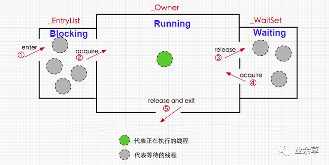

`ObjectMonitor` 中有两个队列，`WaitSet` 和 `EntryList`，用来保存 `ObjectWaiter` 对象列表(每个等待锁的线程都会被封装成 `ObjectWaiter` 对象)，`owner` 指向持有 `ObjectMonitor` 对象的线程。

当多个线程同时访问一段同步代码时，首先会进入 `EntryList` 集合，当线程获取到对象的 `monitor` 后进入 `Owner` 区域并把 `monitor` 中的 `owner` 变量设置为当前线程，同时 `monitor` 中的计数器 `count` 加 1。

若线程调用 `wait()` 方法，将释放当前持有的 `monitor`，`owner` 变量恢复为 `null`，`count` 自减 1，同时该线程进入 `WaitSet` 集合中等待被唤醒。当被 `notify()` 唤醒后，会将线程从 `WaitSet` 移动到 `EntryList` 中去。若当前线程执行完毕也将释放 `monitor` 并复位变量的值，以便其他线程进入获取 `monitor`。

> 需要注意的是，当调用一个锁对象的 `wait` 或 `notify` 方法时，如当前锁的状态是偏向锁或轻量级锁则会先膨胀成重量级锁。

**如何获取 monitor 对象**

[同步代码块依赖于同步指令，同步方法依赖于运行时常量池中的 `ACC_SYNCHRONIZED` 标志](../JVM/index.md#同步指令)

### 锁的升级过程总结

每一个线程在准备获取共享资源时： 

第一步，检查 MarkWord 里面是不是放的自己的 ThreadId , 如果是，表示当前线程是处于 “偏向锁” 。

第二步，如果 MarkWord 不是自己的 ThreadId，锁升级，这时候，用 CAS 来执行切换，新的线程根据 MarkWord 里面现有的 ThreadId，通知之前线程暂停，之前线程将 Markword 的内容置为空。

第三步，两个线程都把锁对象的 HashCode 复制到自己新建的用于存储锁的记录空间，接着开始通过 CAS 操作， 把锁对象的 MarKword 的内容修改为自己新建的记录空间的地址的方式竞争 MarkWord。

第四步，第三步中成功执行 CAS 的获得资源，失败的则进入自旋 。

第五步，自旋的线程在自旋过程中，成功获得资源(即之前获的资源的线程执行完成并释放了共享资源)，则整个状态依然处于 轻量级锁的状态，如果自旋失败 。

第六步，进入重量级锁的状态，这个时候，自旋的线程进行阻塞，等待之前线程执行完成并唤醒自己

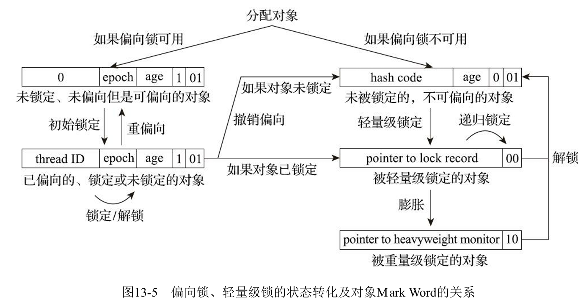

## 乐观锁与 CAS

### 乐观锁与悲观锁

**悲观锁**

对于悲观锁来说，它总是认为每次访问共享资源时会发生冲突，所以必须对每次数据操作加上锁，以保证临界区的程序同一时间只能有一个线程在执行。

**乐观锁**

乐观锁总是假设对共享资源的访问没有冲突，线程可以不停地执行，无需加锁也无需等待。一旦多个线程发生冲突，乐观锁通常使用一种称为 CAS 的技术来保证线程执行的安全性。由于乐观锁假想操作中没有锁的存在，因此不太可能出现死锁的情况。

> 悲观锁多用于”写多读少“的环境，避免频繁失败和重试影响性能；乐观锁多用于“读多写少“的环境，避免频繁加锁影响性能；

### CAS 是什么

CAS（比较与交换，Compare and swap）是乐观锁最常见的实现算法。

**工作原理**

在 CAS 中，有这样三个值：

- V：要更新的变量(var)
- E：预期值(expected)
- N：新值(new)

比较并交换的过程如下：

判断 V 是否等于 E，如果等于，将 V 的值设置为 N；如果不等，说明已经有其它线程更新了 V，于是当前线程放弃更新，什么都不做。

**保证变量操作的原子性**

CAS 是一种原子操作，它是一种系统原语，是一条 CPU 的原子指令，从 CPU 层面已经保证它的 **原子性**。

**重试或放弃**

当多个线程同时使用 CAS 操作一个变量时，只有一个会胜出，并成功更新，其余均会失败，但失败的线程并不会被挂起，仅是被告知失败，并且允许再次尝试，当然也允许失败的线程放弃操作。

###  CAS 的 JAVA 实现 - Unsafe 类

在 Java 中，如果一个方法是 native 的，那 Java 就不负责具体实现它，而是交给底层的 JVM 使用 c 或者 c++去实现

在 Java 中，有一个 `Unsafe` 类，它在 `sun.misc` 包中。它里面是一些 `native` 方法，其中就有几个关于 CAS 的：

```java
public final native boolean compareAndSwapObject(Object o, long offset,Object expected, Object x);
public final native boolean compareAndSwapInt(Object o, long offset,int expected,int x);
public final native boolean compareAndSwapLong(Object o, long offset,long expected,long x);
```

- Object o，这个参数代表你想要进行操作的对象。
- long offset，这个参数是你想要操作的 o 对象中的某个字段的偏移量。这个偏移量可以通过 Unsafe 类的 `objectFieldOffset` 方法获得。
- Object expected，这个参数是预期值。
- Object  x，这个参数是你想要更新的值。

`Unsafe` 中对 CAS 的实现是 C++写的，它的具体实现和操作系统、CPU 都有关系。

> Linux 的 X86 下主要是通过 `cmpxchgl` 这个指令在 CPU 级完成 CAS 操作的，但在多处理器情况下必须使用 `lock` 指令加锁来完成。当然不同的操作系统和处理器的实现会有所不同

`Unsafe` 是 Java 内部提供的一个用于执行低安全级别操作的类，它提供了许多能够绕过 Java 安全检查的方法，因此里面还有其它方法用于不同的用途。比如支持线程挂起和恢复的 `park` 和 `unpark`， LockSupport 类底层就是调用了这两个方法。还有支持反射操作的 `allocateInstance()` 方法。[详见](#Unsafe 类及其应用)

### 原子操作类

JDK 提供了一些用于原子操作的类，在 `java.util.concurrent.atomic` 包下面，他们就使用了 `Unsafe` 类的几个支持 CAS 的方法。这些类支持原子操作（即线程安全而无需同步）在单个变量上，这大大减少了并发编程的复杂性。

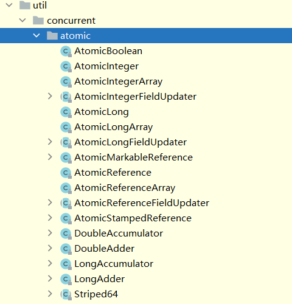

**原子操作的基本数据类型**

* AtomicBoolean：以原子更新的方式更新 boolean；
* AtomicInteger：以原子更新的方式更新 Integer;
* AtomicLong：以原子更新的方式更新 Long；

```java
public class AtomicDemo {
    private static AtomicInteger atomicInteger = new AtomicInteger(1);

    public static void main(String[] args) {
        System.out.println(atomicInteger.getAndIncrement());
        System.out.println(atomicInteger.get());
    }
}
// 1
// 2
```

**原子操作的数组类型**

* AtomicIntegerArray：这个类提供了一些原子更新 int 整数数组的方法。
* AtomicLongArray：这个类提供了一些原子更新 long 型证书数组的方法。
* AtomicReferenceArray：这个类提供了一些原子更新引用类型数组的方法。

```java
public class AtomicDemo {
    private static int[] value = new int[]{1, 2, 3};
    private static AtomicIntegerArray integerArray = new AtomicIntegerArray(value);

    public static void main(String[] args) {
        //对数组中索引为1的位置的元素加5
        int result = integerArray.getAndAdd(1, 5);
        System.out.println(integerArray.get(1));
        System.out.println(result);
    }
}
// 2
// 7
```

**原子操作的引用类型**

* AtomicReference：原子更新引用类型；
* AtomicReferenceFieldUpdater：原子更新引用类型里的字段；
* AtomicMarkableReference：原子更新带有标记位的引用类型；

```java
public class AtomicDemo {

    private static AtomicReference<User> reference = new AtomicReference<>();

    public static void main(String[] args) {
        User user1 = new User("a", 1);
        reference.set(user1);
        User user2 = new User("b",2);
        // user1 = user2 是非原子操作
        User user = reference.getAndSet(user2);
        System.out.println(user);
        System.out.println(reference.get());
    }

    static class User {
        private String userName;
        private int age;

        public User(String userName, int age) {
            this.userName = userName;
            this.age = age;
        }

        @Override
        public String toString() {
            return "User{" +
                    "userName='" + userName + '\'' +
                    ", age=" + age +
                    '}';
        }
    }
}
// User{userName='a', age=1}
// User{userName='b', age=2}
```

**原子更新字段类型**

* AtomicIntegeFieldUpdater：原子更新整型字段类；
* AtomicLongFieldUpdater：原子更新长整型字段类；
* AtomicStampedReference：原子更新引用类型字段，这种更新方式会带有版本号，是为了解决 [CAS 的 ABA 问题](#ABA 问题)

```java
public class AtomicDemo {

    private static AtomicIntegerFieldUpdater updater = AtomicIntegerFieldUpdater.newUpdater(User.class,"age");
    public static void main(String[] args) {
        User user = new User("a", 1);
        int oldValue = updater.getAndAdd(user, 5);
        System.out.println(oldValue);
        System.out.println(updater.get(user));
    }

    static class User {
        private String userName;
        public volatile int age;

        public User(String userName, int age) {
            this.userName = userName;
            this.age = age;
        }

        @Override
        public String toString() {
            return "User{" +
                    "userName='" + userName + '\'' +
                    ", age=" + age +
                    '}';
        }
    }
}
// 1
// 6
```

**以 `AtomicInteger` 类为例**

1. `addAndGet(int delta)` ：增加给定的 delta，并获取新值。
2. `incrementAndGet()`：增加 1，并获取新值。
3. `getAndSet(int newValue)`：获取当前值，并将新值设置为 newValue。
4. `getAndIncrement()`：获取当前值，并增加 1。

`AtomicInteger` 类的 `getAndAdd()` 方法是通过调用 `Unsafe` 类的方法实现的。

```java
public class AtomicInteger extends Number implements java.io.Serializable {
    
    private static final Unsafe unsafe = Unsafe.getUnsafe();
    
    public final int getAndAdd(int delta) {
        return unsafe.getAndAddInt(this, valueOffset, delta);
    }
}
```

这里使用的是 do-while 循环。这种循环不多见，它的目的是保证循环体内的语句至少会被执行一遍。这样才能保证 return 的值是我们期望的值。

```java
public final class Unsafe {
    public final int getAndAddInt(Object var1, long var2, int var4) {
        int var5;
        do {
            var5 = this.getIntVolatile(var1, var2); // 通过当前对象 var1 和字段的偏移量 var2 得到指定字段的值 var5
        } while(!this.compareAndSwapInt(var1, var2, var5, var5 + var4)); 
        // 进行 CAS 操作 
        // 若 对象 var1 在内存地址 var2 处的值等于预期值 var5，则将该位置的值更新为 var5 + var4，并返回 true；
        // 否则 不做任何操作并返回 false

        return var5; // 返回原来的值 var5
    }
}
```

### CAS 的三大问题

#### ABA 问题

所谓的 ABA 问题，就是一个值原来是 A，变成了 B，又变回了 A。这个时候使用 CAS 是检查不出变化的，但实际上却被更新了两次。

ABA 问题的解决思路是在变量前面追加上 **版本号或者时间戳**。从 JDK 1.5 开始，JDK 的 atomic 包里提供了一个类 `AtomicStampedReference` 类来解决 ABA 问题。

这个类的 `compareAndSet` 方法的作用是首先检查当前引用是否等于预期引用，并且检查当前标志是否等于预期标志，如果二者都相等，才使用 CAS 设置为新的值和标志。

```java
public class AtomicStampedReference<V> {
    public boolean compareAndSet(V   expectedReference,
                                 V   newReference,
                                 int expectedStamp,
                                 int newStamp) {
        Pair<V> current = pair;
        return
            expectedReference == current.reference &&
            expectedStamp == current.stamp &&
            ((newReference == current.reference &&
              newStamp == current.stamp) ||
             casPair(current, Pair.of(newReference, newStamp)));
    }
}

```

#### 长时间自旋

CAS 多与自旋结合。如果自旋 CAS 长时间不成功，会占用大量的 CPU 资源。

解决思路是让 JVM 支持处理器提供的 pause 指令。

pause 指令能让自旋失败时 cpu 睡眠一小段时间再继续自旋，从而使得读操作的频率降低很多，为解决内存顺序冲突而导致的 CPU 流水线重排的代价也会小很多。

#### 多个共享变量的原子操作

当对一个共享变量执行操作时，CAS 能够保证该变量的原子性。但是对于多个共享变量，CAS 就无法保证操作的原子性，这时通常有两种做法：

1. 使用 `AtomicReference` 类保证对象之间的原子性，把多个变量放到一个对象里面进行 CAS 操作；
2. 使用锁。锁内的临界区代码可以保证只有当前线程能操作

## 抽象队列同步器 AQS

### AQS 简介

AQS 是 AbstractQueuedSynchronizer 的简称，即抽象队列同步器。

- 抽象：抽象类，只实现一些主要逻辑，有些方法由子类实现；
- 队列：使用先进先出（FIFO）队列存储数据；
- 同步：实现了同步的功能。

作用：AQS 是一个用来构建锁和同步器的框架，使用 AQS 能简单且高效地构造出应用广泛的同步器，比如我们提到的 `ReentrantLock`，`Semaphore`，`ReentrantReadWriteLock`，`SynchronousQueue`，`FutureTask` 等等皆是基于 AQS 的。

### AQS 的数据结构

AQS 内部使用了一个 volatile 的 int 类型变量 `state` 来作为资源的标识。对于 `state` 的存储和处理方式决定了各类同步器的核心功能。

AQS  定义了几个获取和改变 state 的 protected 方法，其中 compareAndSetState 的实现依赖于 `Unsafe` 的 `compareAndSwapInt()` 方法。

```java
public abstract class AbstractQueuedSynchronizer extends AbstractOwnableSynchronizer implements java.io.Serializable {
    
    private volatile int state;
    
    protected final int getState() {
        return state;
    }
    
	protected final void setState(int newState) {
        state = newState;
    }

    protected final boolean compareAndSetState(int expect, int update) {
        // See below for intrinsics setup to support this
        return unsafe.compareAndSwapInt(this, stateOffset, expect, update);
    }
    
}
```

AQS 内部使用了一个先进先出（FIFO）的双端队列，并使用了两个引用 `head` 和 `tail` 用于标识队列的头部和尾部。

AQS 并不直接储存线程，而是储存拥有线程的 Node 节点。

```java
public abstract class AbstractQueuedSynchronizer extends AbstractOwnableSynchronizer implements java.io.Serializable {
    
    private transient volatile Node head;

    private transient volatile Node tail;
}
```

其数据结构如下图所示：

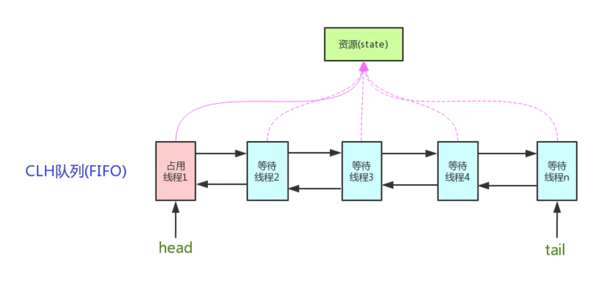

### AQS 的 Node 节点

资源有两种共享模式，或者说两种同步方式：

* 独占模式（Exclusive）：资源是独占的，一次只能有一个线程获取。如 [ReentrantLock](#可重入锁 ReentrantLock)。
* 共享模式（Share）：同时可以被多个线程获取，具体的资源个数可以通过参数指定。例如如 [Semaphore](#Semaphore)/[CountDownLatch](#CountDownLatch)。

> 一般情况下，子类只需要根据需求实现其中一种模式就可以，当然也有同时实现两种模式的同步类，如 [ReadWriteLock](#读写锁 ReentrantReadWriteLock)。

AQS 中关于这两种资源共享模式的定义源码均在内部类 Node 中。

```java
public abstract class AbstractQueuedSynchronizer extends AbstractOwnableSynchronizer implements java.io.Serializable {
    static final class Node {
        
        // 标记一个结点（对应的线程）在共享模式下等待
        static final Node SHARED = new Node();
        // 标记一个结点（对应的线程）在独占模式下等待
        static final Node EXCLUSIVE = null;

        // waitStatus的值，表示该结点（对应的线程）已被取消
        static final int CANCELLED = 1;
        // waitStatus的值，表示后继结点（对应的线程）需要被唤醒
        static final int SIGNAL = -1;
        // waitStatus的值，表示该结点（对应的线程）在等待某一条件
        static final int CONDITION = -2;
        /* waitStatus的值，表示有资源可用，新head结点需要继续唤醒后继结点（共享模式下，多线程并发释放资源，而head唤醒其后继结点后，需要把多出来的资源留给后面的结点；设置新的head结点时，会继续唤醒其后继结点）*/
        static final int PROPAGATE = -3;
        // 等待状态，取值范围，-3，-2，-1，0，1
        volatile int waitStatus;
        
        volatile Node prev; // 前驱结点
        volatile Node next; // 后继结点
        
        volatile Thread thread; // 结点对应的线程
        
        Node nextWaiter; // 等待队列里下一个等待条件的结点


        // 判断共享模式的方法
        final boolean isShared() {
            return nextWaiter == SHARED;
        }

        Node() {  
        }

        Node(Thread thread, Node mode) {     // addWaiter()使用 用于创建不同两种模式的节点
            this.nextWaiter = mode;
            this.thread = thread;
        }

        Node(Thread thread, int waitStatus) { // Condition 
            this.waitStatus = waitStatus;
            this.thread = thread;
        }

        // 其它方法忽略，可以参考具体的源码
    }
    
    // AQS里面的addWaiter私有方法
    private Node addWaiter(Node mode) {
        // 使用了Node的这个构造函数
        Node node = new Node(Thread.currentThread(), mode);
        // 其它代码省略
    }
}


```

> 通过 Node 我们可以实现两种队列
>
> 一是通过 prev 和 next 实现 CLH 队列（线程同步队列, 双向队列）。CLH （Craig, Landin, and Hagersten）队列是一种基于链表结构的自旋锁等待队列。
>
> 二是 nextWaiter 实现 Condition 条件上的等待线程队列(单向队列)，这个 Condition 主要用在 ReentrantLock 类中。

### AQS 源码解析

AQS 的设计是基于 [模板方法模式](../设计模式/设计模式.md#行为型 - 模板方法模式 Template Method) 的，它有一些方法必须要子类去实现的，这些方法虽然都是 `protected` 的，但是它们并没有在 AQS 具体实现，而是直接抛出异常。

```java
public abstract class AbstractQueuedSynchronizer extends AbstractOwnableSynchronizer implements java.io.Serializable {
	
	protected boolean tryAcquire(int arg) { // 独占模式。尝试获取资源，成功则返回 true，失败则返回 false。
        throw new UnsupportedOperationException();
    }

    protected boolean tryRelease(int arg) { // 独占模式。尝试释放资源，成功则返回 true，失败则返回 false。
        throw new UnsupportedOperationException();
    }

    protected int tryAcquireShared(int arg) { // 共享模式。尝试获取资源。负数表示失败；0 表示成功，但没有剩余可用资源；正数表示成功，且有剩余资源。
        throw new UnsupportedOperationException();
    }

    protected boolean tryReleaseShared(int arg) { // 共享模式。尝试释放资源，如果释放后允许唤醒后续等待结点返回 true，否则返回 false。
        throw new UnsupportedOperationException();
    }

    protected boolean isHeldExclusively() { // 该线程是否正在独占资源。仅condition 队列用到
        throw new UnsupportedOperationException();
    }
}
```

**获取资源**

当前线程想要获取资源的入口是 `acquire(int arg)` 方法。arg 是要获取的资源的个数，在独占模式下始终为 1。我们先来看看这个方法的逻辑：

```java
public abstract class AbstractQueuedSynchronizer extends AbstractOwnableSynchronizer implements java.io.Serializable {
	public final void acquire(int arg) {
        if (!tryAcquire(arg) &&
            acquireQueued(addWaiter(Node.EXCLUSIVE), arg))
            selfInterrupt(); // Thread.currentThread().interrupt(); 表示 设置线程的中断状态为 true（默认是 flase）并不会立即停止线程
    }
}

```

首先调用 `tryAcquire(arg)` 尝试去获取资源。前面提到了这个方法是在子类具体实现的，可参考 [ReentrantLock](#可重入锁 ReentrantLock)。

如果获取资源失败，就通过 `addWaiter(Node.EXCLUSIVE)` 方法把这个线程插入到等待队列中。其中传入的参数代表要插入的 Node 是独占式的。这个方法的具体实现：

```java
public abstract class AbstractQueuedSynchronizer extends AbstractOwnableSynchronizer implements java.io.Serializable {
	private Node addWaiter(Node mode) {
        // 生成该线程对应的Node节点
        Node node = new Node(Thread.currentThread(), mode);
        // 将Node插入队列中
        Node pred = tail;
        if (pred != null) {
            node.prev = pred;
            // 使用CAS尝试，如果成功就返回
            if (compareAndSetTail(pred, node)) {
                pred.next = node;
                return node;
            }
        }
        // 如果等待队列为空或者上述CAS失败，再自旋CAS插入
        enq(node);
        return node;
    }

    // 自旋CAS插入等待队列
    private Node enq(final Node node) {
        for (;;) {
            Node t = tail;
            if (t == null) {
                if (compareAndSetHead(new Node())) // 创建了一个虚拟的节点设置为头节点 表示正在占用资源的线程
                    tail = head;
            } else {
                node.prev = t;
                if (compareAndSetTail(t, node)) { // 然后才把 当前线程的节点 插入到尾部
                    t.next = node;
                    return t;
                }
            }
        }
    }
}

```

> `addWaiter()` 的基本含义就是在队列的尾部插入并返回新的 Node 节点，但是需要注意的是由于 AQS 中会存在多个线程同时争夺资源的情况，因此肯定会出现多个线程同时插入节点的操作，在这里是通过 CAS 自旋的方式保证了操作的线程安全性。

通过 `addWaiter` 方法，已经把一个 Node 放到等待队列尾部后，要通过 `acquireQueued` 方法使得处于等待队列的结点从头结点一个一个去获取资源的。

```java
public abstract class AbstractQueuedSynchronizer extends AbstractOwnableSynchronizer implements java.io.Serializable {
	final boolean acquireQueued(final Node node, int arg) {
        boolean failed = true;
        try {
            boolean interrupted = false;
            // 自旋
            for (;;) {
                final Node p = node.predecessor();
                // 如果node的前驱结点p是head，表示node是第二个结点，就可以尝试去获取资源了
                if (p == head && tryAcquire(arg)) {
                    // 拿到资源后，将head指向该结点。
                    // 所以head所指的结点，就是当前获取到资源的那个结点或null。
                    setHead(node); 
                    p.next = null; // help GC
                    failed = false;
                    return interrupted;
                }
                // 如果自己可以休息了，就进入waiting状态，直到被unpark()
                if (shouldParkAfterFailedAcquire(p, node) &&
                    parkAndCheckInterrupt())
                    interrupted = true;
            }
        } finally {
            if (failed)
                cancelAcquire(node);
        }
    }
}

```

这里 `parkAndCheckInterrupt` 方法内部使用到了 LockSupport.park(this)，顺便简单介绍一下 park。

LockSupport 类是 Java 6 引入的一个类，提供了基本的线程同步原语。LockSupport 实际上是调用了 Unsafe 类里的函数，归结到 Unsafe 里，只有两个函数：

- `park(boolean isAbsolute, long time)`：阻塞当前线程
- `unpark(Thread jthread)`：使给定的线程停止阻塞

所以 结点进入等待队列后，是调用 park 使它进入阻塞状态的。只有头结点的线程是处于活跃状态的。

当然，获取资源的方法除了 `acquire` 外，还有以下三个：

- `acquireInterruptibly`：申请可中断的资源（独占模式）
- `acquireShared`：申请共享模式的资源
- `acquireSharedInterruptibly`：申请可中断的资源（共享模式）

 **释放资源**

在 AQS 中只有一小段实现。

```java
public abstract class AbstractQueuedSynchronizer extends AbstractOwnableSynchronizer implements java.io.Serializable {
    public final boolean release(int arg) {
        if (tryRelease(arg)) {
            Node h = head;
            if (h != null && h.waitStatus != 0)
                unparkSuccessor(h);
            return true;
        }
        return false;
    }

    private void unparkSuccessor(Node node) {
        // 如果状态是负数，尝试把它设置为0
        int ws = node.waitStatus;
        if (ws < 0)
            compareAndSetWaitStatus(node, ws, 0);
        // 得到头结点的后继结点head.next
        Node s = node.next;
        // 如果这个后继结点为空或者状态大于0
        // 通过前面的定义我们知道，大于0只有一种可能，就是这个结点已被取消
        if (s == null || s.waitStatus > 0) {
            s = null;
            // 等待队列中所有还有用的结点，都向前移动
            for (Node t = tail; t != null && t != node; t = t.prev)
                if (t.waitStatus <= 0)
                    s = t;
        }
        // 如果后继结点不为空，
        if (s != null)
            LockSupport.unpark(s.thread);
    }
}
```

在 `java.util.concurrent.locks.ReentrantLock` 的实现中，`tryRelease(arg)` 会减少持有锁的数量，如果持有锁的数量变为 0，释放锁并返回 true。

如果 `tryRelease(arg)` 成功释放了锁，那么接下来会检查队列的头结点。如果头结点存在并且 waitStatus 不为 0（这意味着有线程在等待），那么会调用 `unparkSuccessor(Node h)` 方法来唤醒等待的线程。

### 实战：利用 AQS 定制互斥同步器

```java
import java.util.concurrent.locks.AbstractQueuedSynchronizer;

public class Mutex {

    private static class Sync extends AbstractQueuedSynchronizer {
        @Override
        protected boolean tryAcquire(int arg) {
            if (compareAndSetState(0, 1)) {
                setExclusiveOwnerThread(Thread.currentThread());
                return true;
            }
            return false;
        }

        @Override
        protected boolean tryRelease(int arg) {
            if (getState() == 0) {
                throw new IllegalMonitorStateException();
            }
            setExclusiveOwnerThread(null);
            setState(0);
            return true;
        }

        @Override
        protected boolean isHeldExclusively() {
            return getState() == 1;
        }
    }

    private final Sync sync = new Sync();

    public void lock() {
        sync.acquire(1);
    }

    public void unlock() {
        sync.release(1);
    }

    public boolean isLocked() {
        return sync.isHeldExclusively();
    }
}
```

假设有一个线程不安全的资源，我们需要确保在任何时刻只有一个线程能访问它，那么就可以使用这个 Mutex 锁来确保线程安全。

```java
public class Resource {
    private Mutex mutex = new Mutex();

    public void use() {
        mutex.lock();
        try {
            // 对资源的操作
        } finally {
            mutex.unlock();
        }
    }
}
```

# JDK 工具部分

## 锁分类

### 乐观锁 VS 悲观锁

区分：线程是否要锁住同步资源。

乐观锁与悲观锁是一种广义上的概念，体现了看待线程同步的不同角度

**悲观锁**

对于同一个数据的并发操作，悲观锁认为自己在使用数据的时候一定有别的线程来修改数据，因此在获取数据的时候会先加锁，确保数据不会被别的线程修改。Java 中，`synchronized` 关键字 是最典型的悲观锁。

**乐观锁**

观锁认为自己在使用数据时不会有别的线程修改数据，所以不会加锁，只是在更新数据的时候会去判断之前有没有别的线程更新了这个数据。如果这个数据没有被更新，当前线程将自己修改的数据写入。如果数据已经被其他线程更新，则根据不同的实现方式执行不同的操作（例如报错或者自动重试）。最常采用的是 [CAS 算法](#乐观锁与 CAS)，Java 原子类的递增操作就通过 CAS 自旋实现的。

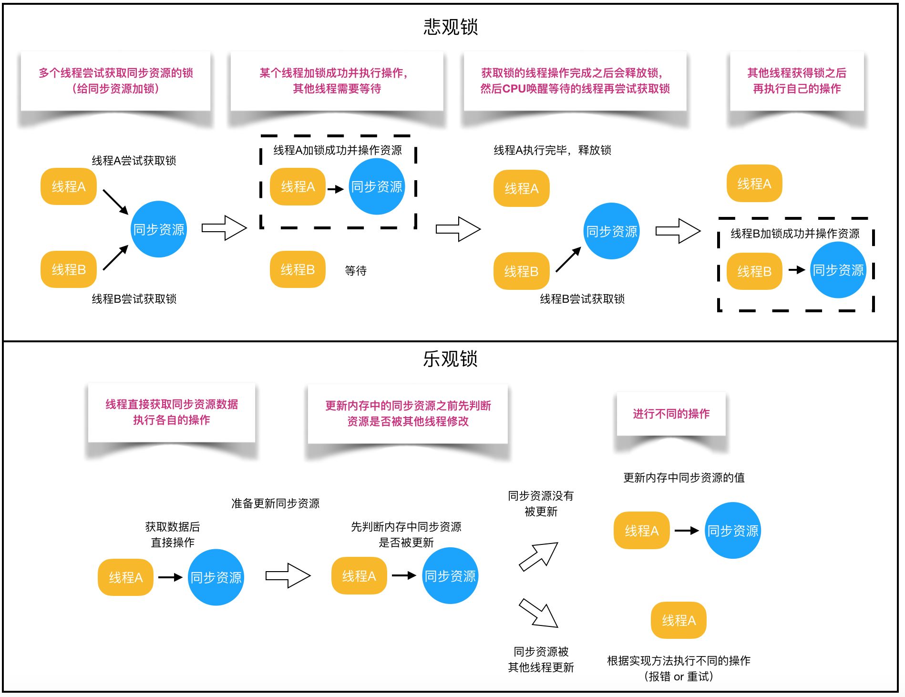

### 自旋锁 VS 适应性自旋锁

阻塞或唤醒一个 Java 线程需要操作系统切换 CPU 状态来完成，这种状态转换需要耗费处理器时间。如果同步代码块中的内容过于简单，状态转换消耗的时间有可能比用户代码执行的时间还要长。

**自旋锁**

而在许多场景中，同步资源的锁定时间很短，为了这一小段时间去切换线程，线程挂起和恢复线程花费的时间可能会让系统得不偿失。我们可以让后面那个请求锁的线程不放弃 CPU 的执行时间，看看持有锁的线程是否会很快释放锁。通常是让当前线程进行自旋，如果在自旋完成后前面锁定同步资源的线程已经释放了锁，那么当前线程就可以不用阻塞而是直接获取同步资源，从而避免切换线程的开销。

自旋锁在 JDK1.4.2 中引入，使用 `-XX:+UseSpinning` 来开启。

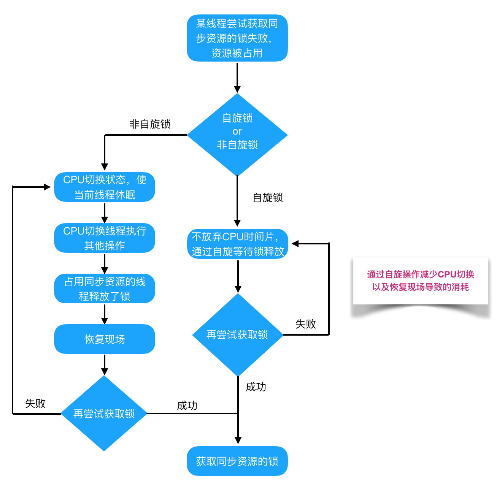

自旋锁本身是有缺点的，它不能代替阻塞。自旋等待虽然避免了线程切换的开销，但它要占用处理器时间。如果锁被占用的时间很短，自旋等待的效果就会非常好。反之，如果锁被占用的时间很长，那么自旋的线程只会白白浪费处理器资源。所以，自旋等待的时间必须要有一定的限度，如果自旋超过了限定次数（默认是 10 次，可以使用 `-XX:PreBlockSpin` 来更改）没有成功获得锁，就应当挂起线程。

> 自旋锁的实现原理同样也是 [CAS](#原子操作 - 例 AtomicInteger 类)，`AtomicInteger` 中调用 `unsafe` 进行自增操作的源码中的 do-while 循环就是一个自旋操作，如果修改数值失败则通过循环来执行自旋，直至修改成功。

**适应性自旋锁**

JDK 6 中自旋锁变为默认开启，并且引入了自适应的自旋锁（适应性自旋锁）。

自适应意味着自旋的时间（次数）不再固定，而是由前一次在同一个锁上的自旋时间及锁的拥有者的状态来决定。如果在同一个锁对象上，自旋刚刚成功获得过锁，并且持有锁的线程正在运行中，那么虚拟机就会认为这次自旋也是很有可能再次成功的，进而它将允许自旋等待更长的时间。如果对于某个锁，自旋很少成功获得过，那在以后尝试获取这个锁时将可能省略掉自旋过程，直接阻塞线程，避免浪费处理器资源。

### 无锁偏向锁轻量级锁重量级锁

这四种锁的分类是专门针对 `synchronized` 的，详见 [synchronized 的四种锁状态](#synchronized 的四种锁状态)

### 可重入锁 VS 非可重复锁

**可重入锁一定程度上避免死锁**

可重入锁又名递归锁，是指同一个线程在外层方法获取锁的时候，再进入该线程的内层方法会自动获取锁（前提：重新请求的锁和之前一致），不会因为之前已经获取过还没释放而阻塞。可重入锁的一个优点就是可以一定程度避免死锁。Java 中 [ReentrantLock](#可重入锁 ReentrantLock) 和 [synchronized](#synchronized 的可重入性) 都是可重入锁。

```java
public class Widget {
    public synchronized void doSomething() {
        System.out.println("方法1执行...");
        doOthers();
    }

    public synchronized void doOthers() {
        System.out.println("方法2执行...");
    }
}
```

因为 `synchronized`  内置锁是可重入的，所以同一个线程在调用 `doOthers()` 时可以直接获得当前对象的锁，进入 `doOthers()` 进行操作。

如果是一个不可重入锁，那么当前线程在调用 `doOthers()` 之前，需要将执行 `doSomething()` 时获取当前对象的锁释放掉，实际上该对象锁已经被当前线程所持有，且无法释放。所以此时会出现死锁。

**非可重入锁重复调用同步资源时出现死锁**

通过重入锁 `ReentrantLock` 以及非可重入锁 `NonReentrantLock` 的源码来对比分析

当线程尝试获取锁时，可重入锁先尝试获取并更新 `status` 值，如果 `status == 0` 表示没有其他线程在执行同步代码，则把 status 置为 1，当前线程开始执行。如果 `status != 0`，则判断当前线程是否获取到了这个锁，如果是的话执行 `status+1`，且当前线程可以再次获取锁。

释放锁时，可重入锁同样会先获取当前 status 的值，在当前线程是持有锁的线程的前提下。如果 `status-1 == 0`，则表示当前线程所有重复获取锁的操作都已经执行完毕，然后该线程才会真正释放锁。

```java
public class ReentrantLock implements Lock, java.io.Serializable {
    private final Sync sync;
    
	abstract static class Sync extends AbstractQueuedSynchronizer {
		final boolean nonfairTryAcquire(int acquires) {
            
            int c = getState();
            // ...
            else if (current == getExclusiveOwnerThread()) {
                int nextc = c + acquires;
                // ...
                return true;
            }
            return false;
        }

        protected final boolean tryRelease(int releases) {
            int c = getState() - releases;
            // ...
            setState(c);
            return free;
        }
	}
}
```

而非可重入锁获取锁时，是直接获取并尝试更新当前 status 的值，如果 `status != 0` 的话会导致其获取锁失败，当前线程阻塞。

释放锁时则是在确定当前线程是持有锁的线程之后，直接将 `status` 置为 0，将锁释放。

### 公平锁 VS 非公平锁

这里的“公平”，其实通俗意义来说就是“先来后到”，也就是 FIFO。如果对一个锁来说，先对锁获取请求的线程一定会先被满足，后对锁获取请求的线程后被满足，那这个锁就是公平的。反之，那就是不公平的。

一般情况下，非公平锁能提升一定的效率。但是非公平锁可能会发生 [线程饥饿](#饥饿)（有一些线程长时间得不到锁）的情况。所以要根据实际的需求来选择非公平锁和公平锁。

`ReentrantLock` 支持非公平锁和公平锁两种。

**吞吐量**

在计算机科学和性能评估中，吞吐量（Throughput）是一个衡量系统处理能力的指标。它描述了单位时间内系统能够处理的事务或操作数量。吞吐量可以用来评估系统的效率和性能，例如，每秒钟完成多少次请求或操作。

非公平锁不保证等待获取锁的线程的顺序。当锁被释放时，哪个线程能够获取该锁并不遵循任何特定的顺序。这种方式通常效率较高，因为线程不需要按照队列顺序等待，从而可以减少上下文切换和调度开销，提高吞吐量。

公平锁则确保等待获取锁的线程将按照它们请求锁的顺序来获取锁。第一个请求锁的线程将是第一个获得锁的线程，以此类推。虽然公平锁的行为更容易预测，但由于需要维护一个明确的队列顺序，可能会增加额外的开销，从而降低吞吐量。

### 读写锁和排它锁

**排它锁**

 `synchronized` 和 `ReentrantLock`，其实都是“排它锁”。也就是说，这些锁在同一时刻只允许一个线程进行访问。

**读写锁**

而读写锁可以在同一时刻允许多个读线程访问。Java 提供了 [ReentrantReadWriteLock](#读写锁 ReentrantReadWriteLock) 类作为读写锁的默认实现，内部维护了两个锁：一个读锁，一个写锁。通过分离读锁和写锁，使得在“读多写少”的环境下，大大地提高了性能。

**独享锁与共享锁**

排它锁也叫独享锁，如果线程 T 对数据 A 加上排它锁后，则其他线程不能再对 A 加任何类型的锁。获得排它锁的线程既能读数据又能修改数据。

与之对应的，就是共享锁，指该锁可被多个线程所持有。如果线程 T 对数据 A 加上共享锁后，则其他线程只能对 A 再加共享锁，不能加排它锁。获得共享锁的线程只能读数据，不能修改数据。

**读写锁实现**

ReentrantReadWriteLock 有两把锁：ReadLock 和 WriteLock，由词知意，一个读锁一个写锁，合称“读写锁”。ReadLock 和 WriteLock 都是靠继承了 AQS 的内部类 Sync 实现的锁。这种结构在 `CountDownLatch`、`Semaphore`、`ReentrantLock` 里面也都存在。

```java
public class ReentrantReadWriteLock implements ReadWriteLock, java.io.Serializable {
    private static final long serialVersionUID = -6992448646407690164L;
    
    private final ReentrantReadWriteLock.ReadLock readerLock;
    
    private final ReentrantReadWriteLock.WriteLock writerLock;
    
    final Sync sync;
    
    public ReentrantReadWriteLock(boolean fair) {
        sync = fair ? new FairSync() : new NonfairSync();
        readerLock = new ReadLock(this);
        writerLock = new WriteLock(this);
    }
    
    public static class ReadLock implements Lock, java.io.Serializable {
        private final Sync sync;

        protected ReadLock(ReentrantReadWriteLock lock) {
            sync = lock.sync;
        }
    }
    
    public static class WriteLock implements Lock, java.io.Serializable {
        private final Sync sync;

        
        protected WriteLock(ReentrantReadWriteLock lock) {
            sync = lock.sync;
        }
    }
}
```

读锁是共享锁，写锁是独享锁。读锁的共享锁可保证并发读非常高效，而读写、写读、写写的过程互斥，因为读锁和写锁是分离的。所以 `ReentrantReadWriteLock` 的并发性相比一般的互斥锁有了很大提升。

**state 值存储方式**

在独享锁中，state 值就是重入的次数，通常是 0 或者 1，在共享锁中 state 就是持有锁的数量。

但是在 `ReentrantReadWriteLock` 中有读、写两把锁，所以需要在一个整型变量 state 上分别描述读锁和写锁的数量（或者也可以叫状态）。于是将 state 变量“按位切割”切分成了两个部分，高 16 位表示读锁状态（读锁个数），低 16 位表示写锁状态（写锁个数）。如下图所示：

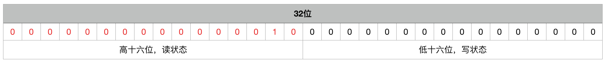

## JUC - 锁

locks 包是提供一些并发锁的工具类的。

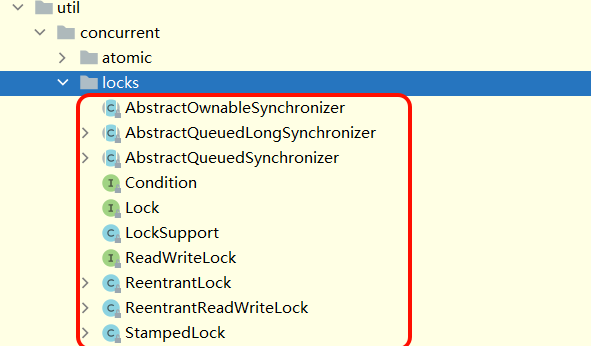

### AQS/AQLS/AOS

**AQS**（[AbstractQueuedSynchronizer](#抽象队列同步器 AQS)），是在 JDK 1.5 发布的，提供了一个“队列同步器”的基本功能实现。

**AQLS**（AbstractQueuedLongSynchronizer），是在 JDK 1.6 发布，它的代码跟 AQS 几乎一样，只是把资源的类型变成了 `long` 类型。

```java
public abstract class AbstractQueuedLongSynchronizer extends AbstractOwnableSynchronizer implements java.io.Serializable {
    private volatile long state;
}
```

AQS 和 AQLS 都继承了一个类叫 **AOS**（AbstractOwnableSynchronizer）。这个类也是在 JDK 1.6 中出现的。用于表示锁与持有者之间的关系（独占模式）。核心作用是记录独占模式下的持有线程。

```java
public abstract class AbstractOwnableSynchronizer implements java.io.Serializable {

    private transient Thread exclusiveOwnerThread;

    protected final void setExclusiveOwnerThread(Thread thread) {
        exclusiveOwnerThread = thread;
    }

    protected final Thread getExclusiveOwnerThread() {
        return exclusiveOwnerThread;
    }
}
```

### 接口 Condition/Lock/ReadWriteLock

locks 包下共有三个接口：`Condition`、`Lock`、`ReadWriteLock`。

`Lock` 接口里面有一些获取锁和释放锁的方法声明

```java
public interface Lock {
    void lock();

    void lockInterruptibly() throws InterruptedException;

    boolean tryLock();
    
    boolean tryLock(long time, TimeUnit unit) throws InterruptedException;

    void unlock();

    Condition newCondition();
}
```

 `ReadWriteLock` 里面只有两个方法，分别返回“读锁”和“写锁”

```java
public interface ReadWriteLock {
    Lock readLock();
    Lock writeLock();
}
```

`Lock` 接口中有一个方法可以获得一个 `Condition`。`Condition` 接口也提供了类似 Object 的方法，可以配合 `Lock` 来实现等待/通知模式。

```java
public interface Condition {
    void await() throws InterruptedException; // 类似 Object.wait()

    void awaitUninterruptibly();
    
    long awaitNanos(long nanosTimeout) throws InterruptedException;

    boolean await(long time, TimeUnit unit) throws InterruptedException; // 类似 Object.wait(long timeout)

    boolean awaitUntil(Date deadline) throws InterruptedException;

    void signal(); // 类似 Object.notify()
    
    void signalAll(); // 类似 Object.notifyAll()
}
```

Condition 和 Object 的 wait/notify 基本相似。但 Condition 类似于 Object 的等待/通知机制的加强版。

| 方法名称                  | 描述                                                         |
| ------------------------- | ------------------------------------------------------------ |
| `await()`                 | 当前线程进入等待状态直到被通知或者中断；                     |
| `awaitUninterruptibly()`  | 当前线程进入等待状态直到被通知，在此过程中对中断信号不敏感，不支持中断当前线程 |
| `awaitNanos(long)`        | 当前线程进入等待状态，直到被通知、中断或者超时（等待指定的纳秒时间）。 |
| `await(long , TimeUnit )` | 当前线程进入等待状态，直到被通知、中断或者超时（等待指定的单位时间）。 |
| `awaitUntil(Date)`        | 当前线程进入等待状态，直到被通知、中断或者超时（等待直到指定的截止日期）。 |
| `signal()`                | 唤醒一个等待在 Condition 上的线程，被唤醒的线程在方法返回前必须获得与 Condition 对象关联的锁 |
| `signalAll()`             | 唤醒所有等待在 Condition 上的线程，能够从 await()等方法返回的线程必须先获得与 Condition 对象关联的锁 |

#### Condition 机制详解

创建一个 `Condition` 对象可以通过 `lock.newCondition()` 来创建，这个方法实际上会通过同步器 `sync` 来 `new` 一个 `ConditionObject` 的对象

```java
public class ReentrantLock implements Lock, java.io.Serializable {
	public Condition newCondition() {
        return sync.newCondition();
    }
}
```

`ConditionObject` 是 `AQS` 的一个内部类

```java
public abstract class AbstractQueuedSynchronizer extends AbstractOwnableSynchronizer implements java.io.Serializable {
    public class ConditionObject implements Condition, java.io.Serializable {
        public ConditionObject() { }
    }
}
```

AQS 内部维护了一个先进先出（FIFO）的双端队列，并使用了两个引用 head 和 tail 用于标识队列的头部和尾部。`Condition` 内部也使用了同样的方式，内部维护了一个先进先出（FIFO）的单向队列，我们把它称为等待队列。

所有调用 `await` 方法的线程都会加入到等待队列中，并且线程状态均为等待状态。`firstWaiter` 指向首节点，`lastWaiter` 指向尾节点

```java
public abstract class AbstractQueuedSynchronizer extends AbstractOwnableSynchronizer implements java.io.Serializable {
    public class ConditionObject implements Condition, java.io.Serializable {
        private transient Node firstWaiter;
    	private transient Node lastWaiter;
    }
}
```

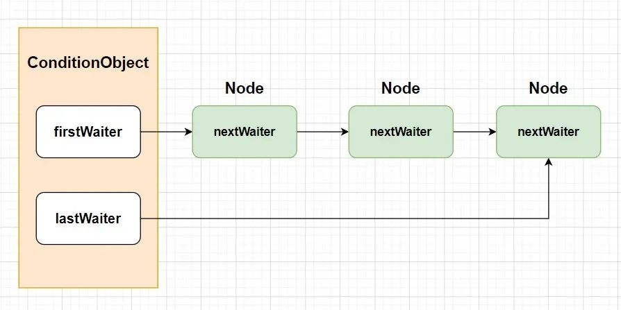

`Node` 中的 `nextWaiter` 指向队列中的下一个节点。并且进入到等待队列的 `Node` 节点状态都会被设置为 `CONDITION`。

```java
static final class Node {
        static final int CONDITION = -2;

        volatile int waitStatus;

        Node nextWaiter;
    }
```

`ReentrantLock` 等 AQS 是可以持有一个同步队列和多个等待队列的，因为我们可以多次调用 `newCondition()` 方法创建多个 `Condition` 对象，也就是一个 `lock` 可以持有多个等待队列。而如果是 Object 方式的话，就只能有一个同步队列和一个等待队列。

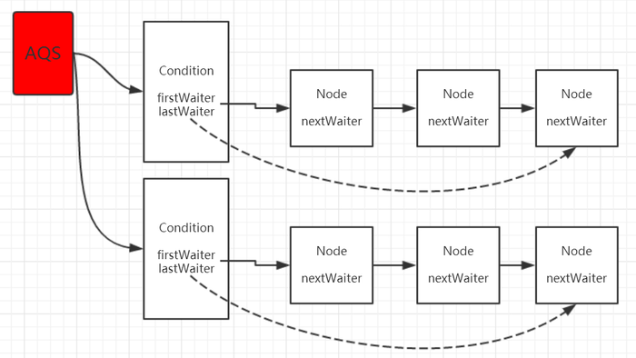

多个等待队列示例

```java
/*
考虑这个简单的有界缓冲区 BoundedBuffer，其中生产者放入元素，消费者取出元素。我们将使用两个 Condition：一个表示缓冲区不为空（用于消费者等待），另一个表示缓冲区不满（用于生产者等待）。
生产者调用 put 方法放入元素，如果缓冲区已满，则等待 notFull 条件。消费者调用 take 方法取出元素，如果缓冲区为空，则等待 notEmpty 条件。当一个元素被放入或取出时，相应的条件会发出信号，唤醒等待的线程。
*/

public class BoundedBuffer<T> {
    private final LinkedList<T> buffer;  // 使用 LinkedList 作为缓冲区
    private final int capacity;          // 缓冲区最大容量
    private final ReentrantLock lock;    // 互斥锁
    private final Condition notEmpty;    // 缓冲区非空条件
    private final Condition notFull;     // 缓冲区非满条件

    public BoundedBuffer(int capacity) {
        this.capacity = capacity;
        this.buffer = new LinkedList<>();
        this.lock = new ReentrantLock();
        this.notEmpty = lock.newCondition();
        this.notFull = lock.newCondition();
    }

    // 放入一个元素
    public void put(T item) throws InterruptedException {
        lock.lock();
        try {
            // 如果缓冲区满，等待
            while (buffer.size() == capacity) {
                notFull.await();
            }
            buffer.add(item);
            // 通知可能正在等待的消费者
            notEmpty.signal();
        } finally {
            lock.unlock();
        }
    }

    // 取出一个元素
    public T take() throws InterruptedException {
        lock.lock();
        try {
            // 如果缓冲区空，等待
            while (buffer.isEmpty()) {
                notEmpty.await();
            }
            T item = buffer.removeFirst();
            // 通知可能正在等待的生产者
            notFull.signal();
            return item;
        } finally {
            lock.unlock();
        }
    }
}
```

使用多个 Condition 对象的主要优点是为锁提供了更细粒度的控制，可以实现更复杂的同步场景，比如上面提到的有界缓冲区。

**Condition 的 await 方法**

当调用 `condition.await()` 方法后会使当前获取锁的线程进入到等待队列，如果该线程能够从 `await()` 方法返回的话，一定是该线程获取了与 Condition 相关联的锁。

当前线程调用 `condition.await()` 方法后，会释放 lock 然后加入到等待队列，直到被 `signal/signalAll` 方法唤醒。

```java
public final void await() throws InterruptedException {
    if (Thread.interrupted())
        throw new InterruptedException();
	// 1. 将当前线程包装成Node，尾插入到等待队列中
    Node node = addConditionWaiter();
	// 2. 释放当前线程所占用的lock，在释放的过程中会唤醒同步队列中的下一个节点
    int savedState = fullyRelease(node);
    int interruptMode = 0;
    while (!isOnSyncQueue(node)) {
		// 3. 当前线程进入到等待状态
        LockSupport.park(this);
        if ((interruptMode = checkInterruptWhileWaiting(node)) != 0)
            break;
    }
	// 4. 自旋等待获取到同步状态（即获取到lock）
    if (acquireQueued(node, savedState) && interruptMode != THROW_IE)
        interruptMode = REINTERRUPT;
    if (node.nextWaiter != null) // clean up if cancelled
        unlinkCancelledWaiters();
	// 5. 处理被中断的情况
    if (interruptMode != 0)
        reportInterruptAfterWait(interruptMode);
}
```

怎样将当前线程添加到等待队列中？调用 `addConditionWaiter` 方法会将当前线程添加到等待队列中。

```java
private Node addConditionWaiter() {
    Node t = lastWaiter;
    if (t != null && t.waitStatus != Node.CONDITION) {
        //将不处于等待状态的节点从等待队列中移除
        unlinkCancelledWaiters();
        t = lastWaiter;
    }
    Node node = new Node(Thread.currentThread(), Node.CONDITION);
    if (t == null) //尾节点为空
        firstWaiter = node; //将首节点指向node
    else
        t.nextWaiter = node; //将尾节点的nextWaiter指向node节点
    lastWaiter = node; //尾节点指向node
    return node;
}
```

综上，该方法通过尾插入的方式将当前线程封装的 Node 插入到等待队列中，同时可以看出，`Condtion` 的等待队列是一个不带虚拟头节点的单向链式队列（链表的第一个节点就是第一个实际的数据节点），而 AQS 同步队列是一个 [带虚拟头节点的双向链式队列](#AQS 源码解析)（一个特殊的空节点作为链表的开头），这是两者的一个区别。

如何释放锁？由 `fullyRelease` 方法实现，将当前节点插入到等待对列之后，会使当前线程释放 `lock`。

```java
final int fullyRelease(Node node) {
    boolean failed = true;
    try {
        int savedState = getState(); //获取当前锁的state
        if (release(savedState)) {
            failed = false;
            return savedState;
        } else {
            throw new IllegalMonitorStateException();
        }
    } finally {
        if (failed)
            node.waitStatus = Node.CANCELLED; //释放锁失败的话将节点状态置为取消
    }
}
```

综上，该方法调用 AQS 的模板方法 `release` 释放 AQS 的同步状态，在释放的过程中会唤醒同步队列中的下一个节点，如果释放成功则正常返回，若失败的话就抛出异常。

如何从 `await` 方法退出呢？首先 `await` 方法 最终会走到这个循环，然后通过 `LockSupport.park(this)` 使当前线程进入等待状态，那么要想退出 `await`，第一个前提条件就是要先退出这个 while 循环，出口就只两个地方。

1. while 循环中的逻辑判断为 false。
2. 走到 break 退出 while 循环；

```java
while (!isOnSyncQueue(node)) {
	// 3. 当前线程进入到等待状态
    LockSupport.park(this);
    if ((interruptMode = checkInterruptWhileWaiting(node)) != 0)
        break;
}
```

出现第 1 种情况的条件是 **当前节点被移动到了同步队列中**（即其他线程调用了 `condition` 的 `signal` 或者 `signalAll` 方法），使得 `while` 中逻辑判断为 `false` 后结束 `while` 循环。

`isOnSyncQueue` 方法用于判断当前线程所在的 Node 是否在同步队列中。

```java
	final boolean isOnSyncQueue(Node node) {
        if (node.waitStatus == Node.CONDITION || node.prev == null)
            return false;
        if (node.next != null) 
            return true;
        return findNodeFromTail(node);
    }
```

如果当前节点的 `waitStatus=-2`，说明它在等待队列中，返回 `false`；如果当前节点有前驱节点，则证明它在 AQS 队列中，但是前驱节点为空，说明它是头节点，而头节点是不参与锁竞争的，也返回 `false`。如果当前节点既不在等待队列中，又不是 AQS 中的头节点且存在 next 节点，说明它存在于 AQS 中，直接返回 `true`。

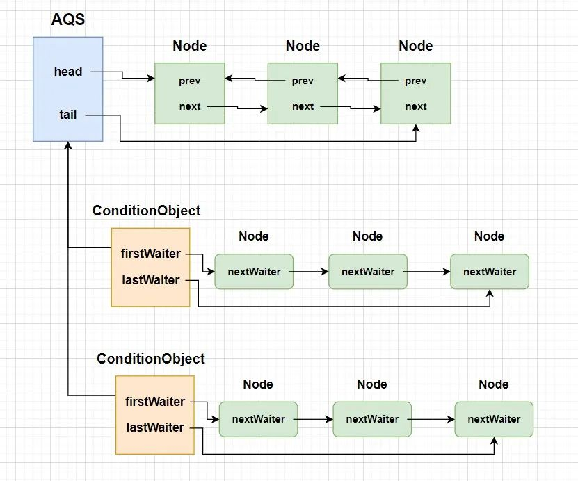

出现第 2 种情况的条件是 **当前等待的线程被中断后代码会走到 break 退出**

总结，调用 `condition.await` 方法的线程必须是已经获得了 lock 的线程，也就是当前线程是同步队列中的头节点。调用该方法后会使得当前线程所封装的 Node 尾插入到等待队列中。而 `condition.awaitNanos`、`condition.awaitUtil` 这两个方法还额外支持超时机制，`condition.awaitUninterruptibly()` 使得等待状态的退出不会响应线程中断。

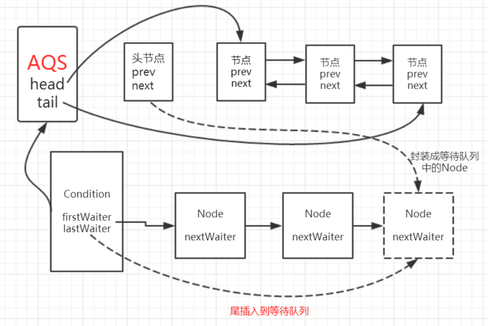

**condition 的 signal/signalAll 方法**

调用 `condition` 的 `signal` 或者 `signalAll` 方法可以将等待队列中等待时间最长的节点移动到同步队列中，使得该节点能够有机会获得 lock。等待队列是先进先出（FIFO）的，所以等待队列的头节点必然会是等待时间最长的节点，也就是每次调用 `condition` 的 `signal` 方法都会将头节点移动到同步队列中。

```java
	public final void signal() {
        //1. 先检测当前线程是否已经获取lock
        if (!isHeldExclusively())
            throw new IllegalMonitorStateException();
        //2. 获取等待队列中第一个节点，之后的操作都是针对这个节点
        Node first = firstWaiter;
        if (first != null)
            doSignal(first);
    }
```

`doSignal` 将头节点从等待队列中移除，且调用 `transferForSignal` 方法

```java
    private void doSignal(Node first) {
        do {
            if ( (firstWaiter = first.nextWaiter) == null)
                lastWaiter = null;
            //1. 将头节点从等待队列中移除
            first.nextWaiter = null;
            //2. while中transferForSignal方法对头节点做真正的处理
        } while (!transferForSignal(first) &&
                    (first = firstWaiter) != null);
    }
```

`transferForSignal` 方法，将头节点的状态更改为 `0`，并且调用 enq 方法，将该节点尾插入到同步队列中

```java
    final boolean transferForSignal(Node node) {

        //1. 更新状态为0
        if (!compareAndSetWaitStatus(node, Node.CONDITION, 0))
            return false;

        //2.将该节点移入到同步队列中去
        Node p = enq(node);
        int ws = p.waitStatus;
        if (ws > 0 || !compareAndSetWaitStatus(p, ws, Node.SIGNAL))
            LockSupport.unpark(node.thread);
        return true;
    }
```

总结，调用 `condition.signal` 方法的前提条件是当前线程已经获取了 lock，该方法会使等待队列中的头节点即等待时间最长的那个节点移入到同步队列，而移入到同步队列后才有机会被唤醒，即从 await 方法中的 `LockSupport.park(this)` 方法中返回，才有机会让调用 await 方法的线程成功退出。

`sigllAll` 与 `sigal` 方法的区别体现在 `doSignalAll` 方法上，该方法会将等待队列中的每一个节点都移入到同步队列中，即“通知”当前调用 `condition.await()` 方法的每一个线程。

```java
    private void doSignalAll(Node first) {
        lastWaiter = firstWaiter = null;
        do {
            Node next = first.nextWaiter;
            first.nextWaiter = null;
            transferForSignal(first);
            first = next;
        } while (first != null);
    }
```

**等待/通知机制**

通过 `condition` 的 `await` 和 `signal/signalAll` 方法就可以实现等待/通知机制，这种机制能够解决最经典的问题就是 [生产者与消费者问题](#)。

await、signal 和 signalAll 方法就像一个开关，控制着线程 A（等待方）和线程 B（通知方）。它们之间的关系可以用下面这幅图来说明

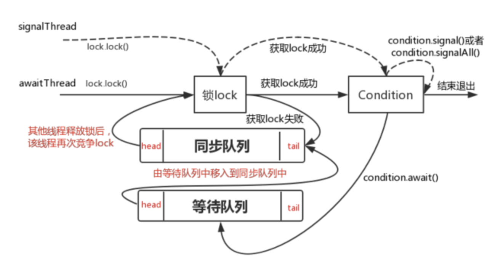

线程 awaitThread 先通过 `lock.lock()` 方法获取锁，成功后调用 condition.await 方法进入等待队列，而另一个线程 signalThread 通过 `lock.lock()` 方法获取锁成功后调用了 condition.signal 或者 signalAll 方法，使得线程 awaitThread 能够有机会移入到同步队列中，当其他线程释放 lock 后使得线程 awaitThread 能够有机会获取 lock，从而使得线程 awaitThread 能够从 await 方法中退出并执行后续操作。如果 awaitThread 获取 lock 失败会直接进入到同步队列。

**简单使用示例**

```java
/*
开启了两个线程 waiter 和 signaler，waiter 线程开始执行的时候由于条件不满足，执行 condition.await 方法使该线程进入等待状态，同时释放锁，signaler 线程获取到锁之后更改条件，并通知所有的等待线程，然后释放锁。这时，waiter 线程获取到锁，由于 signaler 线程更改了条件，此时相对于 waiter 来说，条件满足，继续执行。
*/
public class AwaitSignal {
    private static ReentrantLock lock = new ReentrantLock();
    private static Condition condition = lock.newCondition();
    private static volatile boolean flag = false;

    public static void main(String[] args) {
        Thread waiter = new Thread(new waiter());
        waiter.start();
        Thread signaler = new Thread(new signaler());
        signaler.start();
    }

    static class waiter implements Runnable {

        @Override
        public void run() {
            lock.lock();
            try {
                while (!flag) {
                    System.out.println(Thread.currentThread().getName() + "当前条件不满足等待");
                    try {
                        condition.await();
                    } catch (InterruptedException e) {
                        e.printStackTrace();
                    }
                }
                System.out.println(Thread.currentThread().getName() + "接收到通知条件满足");
            } finally {
                lock.unlock();
            }
        }
    }

    static class signaler implements Runnable {

        @Override
        public void run() {
            lock.lock();
            try {
                flag = true;
                System.out.println(Thread.currentThread().getName() + "使条件成立发送通知");
                condition.signalAll();
            } finally {
                lock.unlock();
            }
        }
    }
}
/*
Thread-0当前条件不满足等待
Thread-1使条件成立发送通知
Thread-0接收到通知条件满足
*/
```

### 并发线程阻塞唤醒类 LockSupport

`LockSupprot` 用来阻塞和唤醒线程，底层实现依赖于 [Unsafe 类](魔法类 Unsafe)。

**简单使用例子**

当 counterThread 数到 500 时，它会唤醒 mainThread。而 mainThread 在调用 park 方法时会被阻塞，直到被 unpark。

```java
public class LockSupportDemo1 {
    public static void main(String[] args) {
        Thread mainThread = Thread.currentThread();

        // 创建一个线程从1数到1000
        Thread counterThread = new Thread(() -> {
            for (int i = 1; i <= 1000; i++) {
                System.out.println(i);
                if (i == 500) {
                    // 当数到500时，唤醒主线程
                    LockSupport.unpark(mainThread);
                }
            }
        });

        counterThread.start();

        // 主线程调用park
        LockSupport.park();
        System.out.println("Main thread was unparked.");
    }
}
/*
...
522
523
Main thread was unparked.
524
525
...
*/
```

**阻塞线程方法**

* `void park()`：阻塞当前线程，如果调用 unpark 方法或线程被中断，则该线程将变得可运行。请注意，park 不会抛出 InterruptedException，因此线程必须单独检查其中断状态。
* `void park(Object blocker)`：功能同方法 1，入参增加一个 Object 对象，用来记录导致线程阻塞的对象，方便问题排查。
* `void parkNanos(long nanos)`：阻塞当前线程一定的纳秒时间，或直到被 unpark 调用，或线程被中断。
* `void parkNanos(Object blocker, long nanos)`：功能同方法 3，入参增加一个 Object 对象，用来记录导致线程阻塞的对象，方便问题排查。
* `void parkUntil(long deadline)`：阻塞当前线程直到某个指定的截止时间（以毫秒为单位），或直到被 unpark 调用，或线程被中断。
* `void parkUntil(Object blocker, long deadline)`：功能同方法 5，入参增加一个 Object 对象，用来记录导致线程阻塞的对象，方便问题排查。

**唤醒线程方法**

* `void unpark(Thread thread)`：唤醒一个由 park 方法阻塞的线程。如果该线程未被阻塞，那么下一次调用 park 时将立即返回。这允许“先发制人”式的唤醒机制。

**Dump 线程**

下面是一个简单的例子，通过 LockSupport 阻塞线程，然后通过 Intellij IDEA 查看 dump 线程信息。

```java
public class LockSupportDemo {
    public static void main(String[] args) {
        LockSupport.park();
    }
}
```

调用 park()方法 dump 线程：

```
"main" #1 prio=5 os_prio=0 tid=0x02cdcc00 nid=0x2b48 waiting on condition [0x00d6f000]
   java.lang.Thread.State: WAITING (parking)
        at sun.misc.Unsafe.park(Native Method)
        at java.util.concurrent.locks.LockSupport.park(LockSupport.java:304)
        at learn.LockSupportDemo.main(LockSupportDemo.java:7)
```

调用 park(Object blocker)方法 dump 线程

```
"main" #1 prio=5 os_prio=0 tid=0x0069cc00 nid=0x6c0 waiting on condition [0x00dcf000]
   java.lang.Thread.State: WAITING (parking)
        at sun.misc.Unsafe.park(Native Method)
        - parking to wait for  <0x048c2d18> (a java.lang.String)
        at java.util.concurrent.locks.LockSupport.park(LockSupport.java:175)
        at learn.LockSupportDemo.main(LockSupportDemo.java:7)
```

分别调用无参和有参的 `park` 方法，然后通过 dump 线程信息可以看出，带 Object 的 park 方法相较于无参的 park 方法会增加 `parking to wait for <0x048c2d18> (a java.lang.String）` 的信息，这种信息类似于记录“案发现场”，有助于我们开发者迅速发现问题并解决问题。

> "Dump 线程" 通常是指获取线程的当前状态和调用堆栈的详细快照。这可以提供关于线程正在执行什么操作以及线程在代码的哪个部分的重要信息。
>
> 线程转储中可能包括的一些信息：
>
> - 线程 ID 和名称：线程的唯一标识符和可读名称。
> - 线程状态：线程的当前状态，例如运行（RUNNABLE）、等待（WAITING）、睡眠（TIMED_WAITING）或阻塞（BLOCKED）。
> - 调用堆栈：线程的调用堆栈跟踪，显示线程从当前执行点回溯到初始调用的完整方法调用序列。
> - 锁信息：如果线程正在等待或持有锁，线程转储通常还包括有关这些锁的信息。
>
> 线程转储可以通过各种方式获得，例如使用 Java 的 jstack 工具，或从 Java VisualVM、Java Mission Control 等工具获取。

**与 synchronzed 的区别**

`synchronzed` 会使线程阻塞，线程会进入 BLOCKED 状态，而调用 `LockSupprt` 方法阻塞线程会使线程进入到 WAITING 状态。

**设计思路**

设计原理的核心：许可。

* park：挂起当前线程，等待一个许可
* unpark：为 某个线程提供一个许可，唤醒某个指定的线程

为什么推荐使用 LockSupport 来做线程的阻塞与唤醒（线程间协同工作），因为它具备如下优点：

- 以线程为操作对象更符合阻塞线程的直观语义
- 操作更精准，可以准确地唤醒某一个线程（notify 随机唤醒一个线程，notifyAll 唤醒所有等待的线程）
- 无需竞争锁对象（以线程作为操作对象），不会因竞争锁对象产生死锁问题
- unpark 与 park 没有严格的执行顺序，不会因执行顺序引起死锁问题，比如「Thread.suspend 和 Thread.resume」没按照严格顺序执行，就会产生死锁

有 3 个独立的线程，一个只会输出 A，一个只会输出 B，一个只会输出 C，在三个线程启动的情况下，请用合理的方式让他们按顺序打印 ABCABC。

```java
public class ABCPrinter {
    private static Thread t1, t2, t3;

    public static void main(String[] args) {
        t1 = new Thread(() -> {
            for (int i = 0; i < 2; i++) {
                LockSupport.park();
                System.out.print("A");
                LockSupport.unpark(t2);
            }
        });

        t2 = new Thread(() -> {
            for (int i = 0; i < 2; i++) {
                LockSupport.park();
                System.out.print("B");
                LockSupport.unpark(t3);
            }
        });

        t3 = new Thread(() -> {
            for (int i = 0; i < 2; i++) {
                LockSupport.park();
                System.out.print("C");
                LockSupport.unpark(t1);
            }
        });

        t1.start();
        t2.start();
        t3.start();

        // 主线程稍微等待一下，确保其他线程已经启动并且进入park状态。
        try {
            Thread.sleep(100);
        } catch (InterruptedException e) {
            e.printStackTrace();
        }

        // 启动整个流程
        LockSupport.unpark(t1);
    }
}
```


### 可重入锁 ReentrantLock

`ReentrantLock` 是 Lock 接口的默认实现，实现了锁的基本功能。

`ReentrantLock` 内部有一个抽象类 `Sync`，继承了 [AQS](#抽象队列同步器 AQS)，自己实现了一个同步器。两个非抽象类 `NonfairSync` 和 `FairSync`，它们都继承了 `Sync`。从名字上可以看得出，分别是”非公平同步器“和”公平同步器“的意思。这意味着 `ReentrantLock` 可以支持”公平锁“和”非公平锁“。

```java
public class ReentrantLock implements Lock, java.io.Serializable {
    private final Sync sync;
    
    abstract static class Sync extends AbstractQueuedSynchronizer {}
    static final class FairSync extends Sync {}
    static final class NonfairSync extends Sync {}
}
```

它们的实现都是都是”排他锁“，不能共享。都调用了 [AOS](#AQS/AQLS/AOS) 的 `setExclusiveOwnerThread` 方法。

```java
	protected final boolean tryAcquire(int acquires) {
        // ...
        setExclusiveOwnerThread(current);
        // ...
    }

```

 `ReentrantLock` 的构造方法里，可以传入一个 `boolean` 类型的参数，来指定它是否是一个公平锁，默认情况下是非公平的。这个参数一旦实例化后就不能修改，只能通过 isFair()方法来查看。

```java
public class ReentrantLock implements Lock, java.io.Serializable {
    public ReentrantLock() {
        sync = new NonfairSync();
    }

   
    public ReentrantLock(boolean fair) {
        sync = fair ? new FairSync() : new NonfairSync();
    }
    
    public final boolean isFair() {
        return sync instanceof FairSync;
    }
}	

```

`ReentrantLock` 支持重入性，表示能够对共享资源重复加锁，即当前线程获取该锁后再次获取不会被阻塞。

要想支持重入性，就要解决两个问题：

1. 在线程获取锁的时候，如果已经获取锁的线程是当前线程的话则直接再次获取成功；
2. 由于锁会被获取 n 次，那么只有锁在被释放同样的 n 次之后，该锁才算是完全释放成功。

以公平锁获取锁为例

```java
public class ReentrantLock implements Lock, java.io.Serializable {

    public void lock() {
        sync.lock();
    }
    
    static final class FairSync extends Sync {
        
        final void lock() {
            acquire(1);
        }
        
    	protected final boolean tryAcquire(int acquires) {
            final Thread current = Thread.currentThread();
            int c = getState();
            //1. 如果该锁未被任何线程占有，该锁能被当前线程获取
            if (c == 0) {
                if (!hasQueuedPredecessors() &&
                    compareAndSetState(0, acquires)) {
                    setExclusiveOwnerThread(current);
                    return true;
                }
            }
            //2.若被占有，检查占有线程是否是当前线程
            else if (current == getExclusiveOwnerThread()) {
                // 3. 再次获取，计数加一
                int nextc = c + acquires;
                if (nextc < 0)
                    throw new Error("Maximum lock count exceeded");
                setState(nextc);
                return true;
            }
            return false;
        }
    }
}	
```

```java
public class ReentrantLock implements Lock, java.io.Serializable {

    public void unlock() {
        sync.release(1);
    }
    
    static final class FairSync extends Sync {
        
    	protected final boolean tryRelease(int releases) {
            int c = getState() - releases;
            if (Thread.currentThread() != getExclusiveOwnerThread())
                throw new IllegalMonitorStateException();
            boolean free = false;
            if (c == 0) {
                free = true;
                setExclusiveOwnerThread(null);
            }
            setState(c);
            return free;
        }
    }
}	
```

ReentrantLock 支持两种锁：公平锁和非公平锁。何谓公平性，是针对获取锁而言的，如果一个锁是公平的，那么锁的获取顺序就应该符合请求上的绝对时间顺序，满足 FIFO。

```java
public class ReentrantLock implements Lock, java.io.Serializable {

    public void lock() {
        sync.lock();
    }
    
    static final class UnFairSync extends Sync {
        
        final void lock() {
            if (compareAndSetState(0, 1))
                setExclusiveOwnerThread(Thread.currentThread());
            else
                acquire(1);
        }
        
    	final boolean nonfairTryAcquire(int acquires) {
            final Thread current = Thread.currentThread();
            int c = getState
            if (c == 0) {
                if (compareAndSetState(0, acquires)) { // 少了 !hasQueuedPredecessors() &&
                    setExclusiveOwnerThread(current);
                    return true;
                }
            }
            else if (current == getExclusiveOwnerThread()) {
                int nextc = c + acquires;
                if (nextc < 0) // overflow
                    throw new Error("Maximum lock count exceeded");
                setState(nextc);
                return true;
            }
            return false;
        }
    }
}
	
```

非公平锁获取锁 `nonfairTryAcquire(）` 逻辑与 `tryAcquire()` 基本上一致，不同在于少了 `hasQueuedPredecessors` 的逻辑判断。从方法名就可以知道该方法用来判断当前节点在同步队列中是否有前驱节点的，如果有前驱节点，说明有线程比当前线程更早的请求资源，根据公平性，当前线程请求资源失败。如果当前节点没有前驱节点，才有做后面逻辑判断的必要性。

**简单使用示例**

```java
/*
    Counter 类使用了一个 ReentrantLock 来保护 count 变量的访问。
    increment 方法首先获取锁，然后增加计数，并在 finally 块中释放锁。这确保了即使方法中抛出异常，锁也会被正确释放。
    两个线程来并发执行 increment 操作。由于使用了锁，因此对 count 变量的访问是串行化的，结果是正确的。
*/
public class Counter {
    private final ReentrantLock lock = new ReentrantLock();
    private int count = 0;

    public void increment() {
        lock.lock(); // 获取锁
        try {
            count++;
            System.out.println("增量 " + Thread.currentThread().getName() + ": " + count);
        } finally {
            lock.unlock(); // 释放锁
        }
    }

    public static void main(String[] args) {
        Counter counter = new Counter();

        Runnable task = () -> {
            for (int i = 0; i < 1000; i++) {
                counter.increment();
            }
        };

        Thread thread1 = new Thread(task);
        Thread thread2 = new Thread(task);

        thread1.start();
        thread2.start();

        try {
            thread1.join();
            thread2.join();
        } catch (InterruptedException e) {
            e.printStackTrace();
        }

        System.out.println("最终结果: " + counter.count);
    }
}
```

**与 synchronized 对比**

* `ReentrantLock` 是一个类，而 `synchronized` 是 Java 中的关键字；
* `ReentrantLock` 可以实现多路选择通知（可以绑定多个 Condition），而 `synchronized` 只能通过 wait 和 notify/notifyAll 方法唤醒一个线程或者唤醒全部线程（单路通知）；
* `ReentrantLock` 必须手动释放锁。通常需要在 `finally` 块中调用 `unlock` 方法以确保锁被正确释放，而 `synchronized` 会自动释放锁，当同步块执行完毕时，由 JVM 自动释放，不需要手动操作。
* `ReentrantLock` 通常提供更好的性能，特别是在高竞争环境下。`synchronized` 在某些情况下，性能可能稍差一些，但随着 JDK 版本的升级，性能差距已经不大了。

### 读写锁 ReentrantReadWriteLock

`ReentrantReadWriteLock` 是 Java 的一种读写锁，它允许多个读线程同时访问，但只允许一个写线程访问（会阻塞所有的读写线程）。这种锁的设计可以提高性能，特别是在读操作的数量远远超过写操作的情况下。

`ReentrantReadWriteLock` 是 `ReadWriteLock` 接口的默认实现。它与 `ReentrantLock` 的功能类似，同样是可重入的，支持非公平锁和公平锁。不同的是，它还支持”读写锁“。

它同样是内部维护了两个同步器，一个公平同步器，一个非公平同步器。维护了两个 `Lock` 的实现类 `ReadLock` 和 `WriteLock`。这两个内部类用的是外部类的同步器。

```java
public class ReentrantReadWriteLock implements ReadWriteLock, java.io.Serializable {
    private final ReentrantReadWriteLock.ReadLock readerLock;
    private final ReentrantReadWriteLock.WriteLock writerLock;
    final Sync sync;
    
    public ReentrantReadWriteLock() {
        this(false);
    }

    // 构造方法，初始化读写锁 且指定公平锁或非公平锁
    public ReentrantReadWriteLock(boolean fair) {
        sync = fair ? new FairSync() : new NonfairSync();
        readerLock = new ReadLock(this);
        writerLock = new WriteLock(this);
    }
    
    abstract static class Sync extends AbstractQueuedSynchronizer {}
    static final class NonfairSync extends Sync {}
    static final class FairSync extends Sync {}
    
    public static class WriteLock implements Lock, java.io.Serializable {
        private final Sync sync;

        protected WriteLock(ReentrantReadWriteLock lock) {
            sync = lock.sync; // 使用主类的同步器
        }
    }
    
    public static class ReadLock implements Lock, java.io.Serializable {
        private final Sync sync;

        protected ReadLock(ReentrantReadWriteLock lock) {
            sync = lock.sync; // 使用主类的同步器
        }
    }
    
    // 获取读锁和写锁的方法
    public ReentrantReadWriteLock.WriteLock writeLock() { return writerLock; }
    public ReentrantReadWriteLock.ReadLock  readLock()  { return readerLock; }
}
```

`ReentrantReadWriteLock` 也 **支持重入**，读锁获取后能再次获取；写锁获取之后能够再次获取写锁，同时也能够获取读锁；

**获取读写状态**

分析 `exclusiveCount` 方法。`EXCLUSIVE_MASK` 为 1 左移 16 位然后减 1，即为 0x0000FFFF。而 `exclusiveCount` 方法是将同步状态（state 为 int 类型）与 0x0000FFFF 相与，即取同步状态的低 16 位。因此同步状态的低 16 位用来表示写锁（独享/排他锁）的获取次数。

```java
static final int SHARED_SHIFT   = 16;
static final int EXCLUSIVE_MASK = (1 << SHARED_SHIFT) - 1;        
static int exclusiveCount(int c) { return c & EXCLUSIVE_MASK; }
```

同理同步状态的高 16 位用来表示读锁（共享锁）的获取次数。

```java
static final int SHARED_SHIFT   = 16;
static int sharedCount(int c)    { return c >>> SHARED_SHIFT; }
```

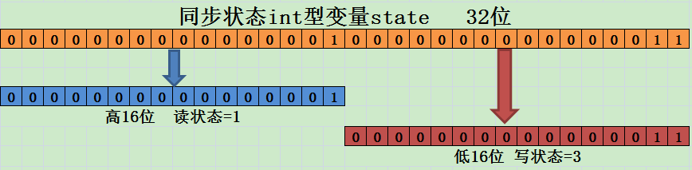

**写锁的获取**

```java
public class ReentrantReadWriteLock implements ReadWriteLock, java.io.Serializable {
    abstract static class Sync extends AbstractQueuedSynchronizer {
        protected final boolean tryAcquire(int acquires) {
            Thread current = Thread.currentThread();
            int c = getState(); // 1. 获取写锁当前的同步状态
            int w = exclusiveCount(c); // 2. 获取写锁获取的次数
            if (c != 0) {
                // 显然 c != 0 而 w == 0 则 读锁数大于0
                // 3.1 当读锁已被读线程获取或者当前线程不是已经获取写锁的线程的话
			   // 当前线程获取写锁失败
                if (w == 0 || current != getExclusiveOwnerThread())
                    return false;
                if (w + exclusiveCount(acquires) > MAX_COUNT)
                    throw new Error("Maximum lock count exceeded");
                // 3.2 当前线程获取写锁，支持可重复加锁
                setState(c + acquires);
                return true;
            }
            // 3.3  c = 0 写锁未被任何线程获取，当前线程可获取写锁
            if (writerShouldBlock() ||
                !compareAndSetState(c, c + acquires))
                return false;
            setExclusiveOwnerThread(current);
            return true;
        }
    }	
}
```

总结写锁的获取：当读锁已经被读线程获取或者写锁已经被其他写线程获取，则写锁获取失败；否则，获取成功并支持重入，增加写状态。

**写锁的释放**

```java
public class ReentrantReadWriteLock implements ReadWriteLock, java.io.Serializable {
    abstract static class Sync extends AbstractQueuedSynchronizer {
    	protected final boolean tryRelease(int releases) {
            if (!isHeldExclusively())
                throw new IllegalMonitorStateException();
            int nextc = getState() - releases; //1. 同步状态减去释放数   因为写状态恰好是由同步状态的低 16 位表示的。
            boolean free = exclusiveCount(nextc) == 0;  //2. 得到的写状态是否为0，为0则释放写锁
            if (free)
                setExclusiveOwnerThread(null); // 独占线程设为空
            setState(nextc); //3. 不为0则更新同步状态
            return free;
        }
    }
    
    public static class WriteLock implements Lock, java.io.Serializable {
         public void unlock() {
            sync.release(1);
        }
    }
}
```

写锁的释放与 `ReentrantLock` 基本一致

**读锁的获取**

读锁不是独占式锁，即同一时刻该锁可以被多个读线程获取，也就是一种共享式锁。

```java
public class ReentrantReadWriteLock implements ReadWriteLock, java.io.Serializable {
    abstract static class Sync extends AbstractQueuedSynchronizer {
        protected final int tryAcquireShared(int unused) {
            Thread current = Thread.currentThread();
            int c = getState();
            //1. 如果写锁已经被获取并且获取写锁的线程不是当前线程的话，当前
			// 线程获取读锁失败返回-1
            if (exclusiveCount(c) != 0 &&
                getExclusiveOwnerThread() != current)
                return -1;
            int r = sharedCount(c);
            if (!readerShouldBlock() &&
                r < MAX_COUNT &&
                compareAndSetState(c, c + SHARED_UNIT)) { //2. 当前线程获取读锁  同步状态需要加上 SHARED_UNIT 即0x00010000 使得高 16 位 + 1
                //3. 下面的代码主要是新增的一些功能，比如getReadHoldCount()方法
				//返回当前获取读锁的次数
                if (r == 0) {
                    firstReader = current;
                    firstReaderHoldCount = 1;
                } else if (firstReader == current) {
                    firstReaderHoldCount++;
                } else {
                    HoldCounter rh = cachedHoldCounter;
                    if (rh == null || rh.tid != getThreadId(current))
                        cachedHoldCounter = rh = readHolds.get();
                    else if (rh.count == 0)
                        readHolds.set(rh);
                    rh.count++;
                }
                return 1;
            }
            return fullTryAcquireShared(current);
        }
    }
}
```

当写锁被其他线程获取后，读锁获取失败，否则获取成功，会利用 CAS 更新同步状态。

**读锁的释放**

```java
public class ReentrantReadWriteLock implements ReadWriteLock, java.io.Serializable {
    abstract static class Sync extends AbstractQueuedSynchronizer {
        protected final boolean tryReleaseShared(int unused) {
            Thread current = Thread.currentThread();
            // 前面还是为了实现getReadHoldCount等新功能
            if (firstReader == current) {
                // assert firstReaderHoldCount > 0;
                if (firstReaderHoldCount == 1)
                    firstReader = null;
                else
                    firstReaderHoldCount--;
            } else {
                HoldCounter rh = cachedHoldCounter;
                if (rh == null || rh.tid != getThreadId(current))
                    rh = readHolds.get();
                int count = rh.count;
                if (count <= 1) {
                    readHolds.remove();
                    if (count <= 0)
                        throw unmatchedUnlockException();
                }
                --rh.count;
            }
            for (;;) {
                int c = getState();
                // 读锁释放 将同步状态减去读状态即可
                int nextc = c - SHARED_UNIT;
                if (compareAndSetState(c, nextc))
                    return nextc == 0;
            }
        }
    }
}

```

**锁降级**

写锁降级是一种允许写锁转换为读锁的过程。示例如下：

```java
ReentrantReadWriteLock lock = new ReentrantReadWriteLock();
ReentrantReadWriteLock.WriteLock writeLock = lock.writeLock();
ReentrantReadWriteLock.ReadLock readLock = lock.readLock();

writeLock.lock(); // 获取写锁
try {
    // 执行写操作
    readLock.lock(); // 获取读锁
} finally {
    writeLock.unlock(); // 释放写锁
}

try {
    // 执行读操作
} finally {
    readLock.unlock(); // 释放读锁
}
```

- 获取写锁：线程首先获取写锁，确保在修改数据时排它访问。
- 获取读锁：在写锁保持的同时，线程可以再次获取读锁。
- 释放写锁：线程保持读锁的同时释放写锁。
- 释放读锁：最后线程释放读锁。

写锁降级为读锁的过程有助于保持数据的一致性，而不影响并发读取的性能。通过这种方式，线程可以继续保持对数据的独占访问权限，直到它准备允许其他线程共享读取访问。这样可以确保在写操作和随后的读操作之间的数据一致性，并且允许其他读取线程并发访问。

使用读写锁的代码可能看起来比使用简单的互斥锁更复杂，但它提供了更精细的并发控制，可能会提高多线程应用程序的性能。

**简单使用示例**

```java
public class SharedResource {
    private final ReentrantReadWriteLock lock = new ReentrantReadWriteLock();
    private int data = 0;

    public void write(int value) {
        lock.writeLock().lock(); // 获取写锁
        try {
            data = value;
            System.out.println("写 " + Thread.currentThread().getName() + ": " + data);
        } finally {
            lock.writeLock().unlock(); // 释放写锁
        }
    }

    public void read() {
        lock.readLock().lock(); // 获取读锁
        try {
            System.out.println("读 " + Thread.currentThread().getName() + ": " + data);
        } finally {
            lock.readLock().unlock(); // 释放读锁
        }
    }

    public static void main(String[] args) {
        SharedResource sharedResource = new SharedResource();

        // 创建读线程
        Thread readThread1 = new Thread(() -> {
            for (int i = 0; i < 5; i++) {
                sharedResource.read();
            }
        });

        Thread readThread2 = new Thread(() -> {
            for (int i = 0; i < 5; i++) {
                sharedResource.read();
            }
        });

        // 创建写线程
        Thread writeThread = new Thread(() -> {
            for (int i = 0; i < 5; i++) {
                sharedResource.write(i);
            }
        });

        readThread1.start();
        readThread2.start();
        writeThread.start();

        try {
            readThread1.join();
            readThread2.join();
            writeThread.join();
        } catch (InterruptedException e) {
            e.printStackTrace();
        }
    }
}
/*
读 Thread-0: 0
读 Thread-1: 0
写 Thread-2: 0
写 Thread-2: 1
写 Thread-2: 2
写 Thread-2: 3
写 Thread-2: 4
读 Thread-0: 4
读 Thread-1: 4
读 Thread-0: 4
读 Thread-1: 4
读 Thread-0: 4
读 Thread-1: 4
读 Thread-0: 4
读 Thread-1: 4
*/
```

在 `main` 方法中，我们创建了两个读线程和一个写线程。由于 `ReentrantReadWriteLock` 允许多个读取操作同时进行，因此读线程可以同时运行。然而，写入操作会被串行化，并且在写入操作进行时，读取操作将被阻塞。

`ReentrantReadWriteLock` 实现了读写锁，但它有一个小弊端，就是在“写”操作的时候，其它线程不能写也不能读。我们称这种现象为“写饥饿”，这个问题在 `StampedLock` 类得到解决。

### 锁王 StampedLock

`StampedLock` 类是 Java 8 才发布的。

`StampedLock` 没有实现 `Lock` 接口和 `ReadWriteLock` 接口，但它实现了“读写锁”的功能，并且性能比 `ReentrantReadWriteLock` 更高。

`StampedLock` 还把读锁分为了“乐观读锁”和“悲观读锁”两种。

StampedLock 不会发生“写饥饿”的现象。核心思想在于，在 **读的时候如果发生了写，应该通过重试的方式来获取新的值，而不应该阻塞写操作**。这种模式也就是典型的无锁编程思想，和 CAS 自旋的思想一样。

**简单使用示例**

```java
class Point {
   private double x, y;
   private final StampedLock sl = new StampedLock();

   // 写锁的使用
   void move(double deltaX, double deltaY) {
     long stamp = sl.writeLock(); // 获取写锁
     try {
       x += deltaX;
       y += deltaY;
     } finally {
       sl.unlockWrite(stamp); // 释放写锁
     }
   }

   // 乐观读锁的使用
   double distanceFromOrigin() {
     long stamp = sl.tryOptimisticRead(); // 获取乐观读锁
     double currentX = x, currentY = y;
     if (!sl.validate(stamp)) { // //检查乐观读锁后是否有其他写锁发生，有则返回false
        stamp = sl.readLock(); // 获取一个悲观读锁
        try {
          currentX = x;
          currentY = y;
        } finally {
           sl.unlockRead(stamp); // 释放悲观读锁
        }
     }
     return Math.sqrt(currentX * currentX + currentY * currentY);
   }

   // 悲观读锁以及读锁升级写锁的使用
   void moveIfAtOrigin(double newX, double newY) {
     long stamp = sl.readLock(); // 悲观读锁
     try {
       while (x == 0.0 && y == 0.0) {
         // 读锁尝试转换为写锁：转换成功后相当于获取了写锁，转换失败相当于有写锁被占用
         long ws = sl.tryConvertToWriteLock(stamp);

         if (ws != 0L) { // 如果转换成功
           stamp = ws; // 读锁的票据更新为写锁的
           x = newX;
           y = newY;
           break;
         }
         else { // 如果转换失败
           sl.unlockRead(stamp); // 释放读锁
           stamp = sl.writeLock(); // 强制获取写锁
         }
       }
     } finally {
       sl.unlock(stamp); // 释放所有锁
     }
   }
}
```

乐观读锁的意思就是先假定在这个锁获取期间，共享变量不会被改变，既然假定不会被改变，那就不需要上锁。

在获取乐观读锁之后进行了一些操作，然后又调用了 `validate` 方法，这个方法就是用来验证 `tryOptimisticRead` 之后，是否有写操作执行过，如果有，则获取一个悲观读锁，这里的悲观读锁和 `ReentrantReadWriteLock` 中的读锁类似，也是个共享锁。

`StampedLock` 获取锁会返回一个 `long` 类型的变量，释放锁的时候再把这个变量传进去。

```java
// 用于操作state后获取stamp的值
private static final int LG_READERS = 7;
private static final long RUNIT = 1L;               //0000 0000 0001
private static final long WBIT  = 1L << LG_READERS; //0000 1000 0000
private static final long RBITS = WBIT - 1L;        //0000 0111 1111
private static final long RFULL = RBITS - 1L;       //0000 0111 1110
private static final long ABITS = RBITS | WBIT;     //0000 1111 1111
private static final long SBITS = ~RBITS;           //1111 1000 0000

// 初始化时state的值
private static final long ORIGIN = WBIT << 1;       //0001 0000 0000

// 锁共享变量state
private transient volatile long state;
// 读锁溢出时用来存储多出的读锁
private transient int readerOverflow;
```

StampedLock 用这个 long 类型的变量的前 7 位（LG_READERS）来表示读锁，每获取一个悲观读锁，就加 1（RUNIT），每释放一个悲观读锁，就减 1。而悲观读锁最多只能装 128 个（7 位限制），很容易溢出，所以用一个 int 类型的变量来存储溢出的悲观读锁。

**与 ReentrantReadWriteLock 对比**

1、可重入性：`ReentrantReadWriteLock` 支持可重入，即在一个线程中可以多次获取读锁或写锁。`StampedLock` 则不支持可重入。

2、乐观读锁：`StampedLock` 提供了乐观读锁机制，允许一个线程在没有任何写入操作发生的情况下读取数据，从而提高了性能。而 `ReentrantReadWriteLock` 没有提供这样的机制。

3、锁降级：`StampedLock` 提供了从写锁到读锁的降级功能，这在某些场景下可以提供额外的灵活性。`ReentrantReadWriteLock` 不直接提供这样的功能。

4、API 复杂性：由于提供了乐观读锁和锁降级功能，`StampedLock` 的 API 相对复杂一些，需要更小心地使用以避免死锁和其他问题。`ReentrantReadWriteLock` 的 API 相对更直观和容易使用。

`StampedLock` 提供了更高的性能和灵活性，但也带来了更复杂的使用方式。`ReentrantReadWriteLock` 则相对简单和直观，特别适用于没有高并发读的场景。

## JUC - 通信工具类

 JUC 包下的其他工具类，比如 Semaphore、CountDownLatch、CyclicBarrier、Exchanger、Phaser 等通信工具类

### Semaphore

`Semaphore` 是一个计数信号量，它的作用是限制可以访问某些资源（物理或逻辑的）的线程数目。

`Semaphore` 的构造方法可以指定信号量的数目，也可以指定是否是公平的。

```java
public class Semaphore implements java.io.Serializable {
    private static final long serialVersionUID = -3222578661600680210L;
    private final Sync sync;

    abstract static class Sync extends AbstractQueuedSynchronizer {}
    
    static final class NonfairSync extends Sync {}

    static final class FairSync extends Sync {}
    
    public Semaphore(int permits) {
        sync = new NonfairSync(permits);
    }
    
    public Semaphore(int permits, boolean fair) {
        sync = fair ? new FairSync(permits) : new NonfairSync(permits);
    }

}
```

`Semaphore` 有两个主要的方法：`acquire()` 和 `release()`。`acquire()` 方法会尝试获取一个信号量，如果获取不到，就会阻塞当前线程，直到有线程释放信号量。`release()` 方法会释放一个信号量，释放之后，会唤醒一个等待的线程。

```java
public class ResourcePool {
    private final Semaphore semaphore;

    public ResourcePool(int limit) {
        this.semaphore = new Semaphore(limit);
    }

    public void useResource() {
        try {
            semaphore.acquire();
            // 使用资源
            System.out.println("资源开始使用了 " + Thread.currentThread().getName());
            Thread.sleep(1000); // 模拟资源使用时间
        } catch (InterruptedException e) {
            e.printStackTrace();
        } finally {
            semaphore.release();
            System.out.println("资源释放了 " + Thread.currentThread().getName());
        }
    }

    public static void main(String[] args) {
        ResourcePool pool = new ResourcePool(3); // 限制3个线程同时访问资源

        for (int i = 0; i < 10; i++) {
            new Thread(pool::useResource).start();
        }
    }
}
/*
只有三个线程同时访问资源
*/
```

### CountDownLatch

`CountDownLatch` 是一个同步工具类，它允许一个或多个线程一直等待，直到其他线程的操作执行完后再执行。

`CountDownLatch` 有一个计数器，可以通过 `countDown()` 方法对计数器的数目进行减一操作，也可以通过 `await()` 方法来阻塞当前线程，直到计数器的值为 0。

`CountDownLatch` 一般用来控制线程等待，它可以让某个线程一直等待直到倒计时结束，再开始执行。

```java
public class InitializationDemo {

    public static void main(String[] args) throws InterruptedException {
        // 创建一个倒计数为 3 的 CountDownLatch
        CountDownLatch latch = new CountDownLatch(3);

        Thread service1 = new Thread(new Service("服务 1", 2000, latch));
        Thread service2 = new Thread(new Service("服务 2", 3000, latch));
        Thread service3 = new Thread(new Service("服务 3", 4000, latch));

        service1.start();
        service2.start();
        service3.start();

        // 等待所有服务初始化完成
        latch.await();
        System.out.println("所有服务都准备好了");
    }

    static class Service implements Runnable {
        private final String name;
        private final int timeToStart;
        private final CountDownLatch latch;

        public Service(String name, int timeToStart, CountDownLatch latch) {
            this.name = name;
            this.timeToStart = timeToStart;
            this.latch = latch;
        }

        @Override
        public void run() {
            try {
                Thread.sleep(timeToStart);
            } catch (InterruptedException e) {
                e.printStackTrace();
            }
            System.out.println(name + " 准备好了");
            latch.countDown(); // 减少倒计数
        }
    }
}
/*
服务 1 准备好了
服务 2 准备好了
服务 3 准备好了
所有服务都准备好了
*/
```

在这个示例中，我们有三个服务，每个服务都在一个单独的线程中启动，并需要一些时间来初始化。主线程使用 `CountDownLatch` 等待这三个服务全部启动完成后，再继续执行。

每个服务启动完毕后都会调用 `countDown()` 方法。

主线程通过调用 `await()` 方法等待，直到倒计数变为零，然后继续执行。

### CyclicBarrier

`CyclicBarrier` 是一个同步工具类，它允许一组线程互相等待，直到到达某个公共屏障点（common barrier point）。

`CyclicBarrier` 可以用于多线程计算数据，最后合并计算结果的应用场景。比如我们用一个 Excel 保存了用户所有银行流水，每个 sheet 保存一个账户近一年的每笔银行流水，现在需要统计用户的日均银行流水，先用多线程处理每个 sheet 里的银行流水，都执行完之后，得到每个 sheet 的日均银行流水，最后，再用 barrierAction 用这些线程的计算结果，计算出整个 Excel 的日均银行流水。

`CyclicBarrier` 还有一个有参构造方法，可以指定一个 Runnable，这个 Runnable 会在 `CyclicBarrier` 的计数器为 0 的时候执行，用来完成更复杂的任务。

```java
	public CyclicBarrier(int parties, Runnable barrierAction) {
        if (parties <= 0) throw new IllegalArgumentException();
        this.parties = parties;
        this.count = parties;
        this.barrierCommand = barrierAction;
    }
```

**简单使用示例**

```java
public class CyclicBarrierDemo {

    public static void main(String[] args) {
        int numberOfThreads = 3; // 线程数量
        CyclicBarrier barrier = new CyclicBarrier(numberOfThreads, () -> {
            // 当所有线程都到达障碍点时执行的操作
            System.out.println("所有线程都已到达屏障，进入下一阶段");
        });

        for (int i = 0; i < numberOfThreads; i++) {
            new Thread(new Task(barrier), "Thread " + (i + 1)).start();
        }
    }

    static class Task implements Runnable {
        private final CyclicBarrier barrier;

        public Task(CyclicBarrier barrier) {
            this.barrier = barrier;
        }

        @Override
        public void run() {
            try {
                System.out.println(Thread.currentThread().getName() + " 正在屏障处等待");
                barrier.await(); // 等待所有线程到达障碍点
                System.out.println(Thread.currentThread().getName() + " 已越过屏障.");
            } catch (Exception e) {
                e.printStackTrace();
            }
        }
    }
}
/*
Thread 1 正在屏障处等待
Thread 3 正在屏障处等待
Thread 2 正在屏障处等待
所有线程都已到达屏障，进入下一阶段
Thread 2 已越过屏障.
Thread 1 已越过屏障.
Thread 3 已越过屏障.
*/
```

### Exchanger

`Exchanger` 是一个用于线程间协作的工具类。Exchanger 用于进行线程间的数据交换。它提供一个同步点，在这个同步点，两个线程可以交换彼此的数据。

这两个线程通过 exchange 方法交换数据，如果第一个线程先执行 exchange 方法，它会一直等待第二个线程也执行 exchange 方法，当两个线程都到达同步点时，这两个线程就可以交换数据，将本线程生产出来的数据传递给对方。可以用于遗传算法、校对工作和数据同步等场景。

**简单使用示例**

```java
public class ExchangerDemo {

    public static void main(String[] args) {
        Exchanger<String> exchanger = new Exchanger<>();

        new Thread(() -> {
            try {
                String data1 = "data1";
                System.out.println(Thread.currentThread().getName() + " 正在把 " + data1 + " 交换出去");
                Thread.sleep(1000); // 模拟线程处理耗时
                String data2 = exchanger.exchange(data1);
                System.out.println(Thread.currentThread().getName() + " 交换到了 " + data2);
            } catch (InterruptedException e) {
                e.printStackTrace();
            }
        }, "Thread 1").start();

        new Thread(() -> {
            try {
                String data1 = "data2";
                System.out.println(Thread.currentThread().getName() + " 正在把 " + data1 + " 交换出去");
                Thread.sleep(2000); // 模拟线程处理耗时
                String data2 = exchanger.exchange(data1);
                System.out.println(Thread.currentThread().getName() + " 交换到了 " + data2);
            } catch (InterruptedException e) {
                e.printStackTrace();
            }
        }, "Thread 2").start();
    }
}
```

### Phaser

`Phaser` 是一个同步工具类，它可以让多个线程在某个时刻一起完成任务。

`Phaser` 可以理解为一个线程的计数器，它可以将这个计数器加一或减一。当这个计数器的值为 0 的时候，所有调用 `await()` 方法而在等待的线程就会继续执行。

`Phaser` 的计数器可以被动态地更新，也可以被动态地增加或减少。Phaser 还提供了一些方法来帮助我们更好地控制线程的到达。

`Phaser` 的主要作用是让多个线程协同完成某个任务，通过控制每个阶段的开始和结束来确保线程之间的同步和协作，协调多个线程的执行，提高系统的并发能力和响应能力。

```java
public class PhaserDemo {

    public static void main(String[] args) {
        Phaser phaser = new Phaser(3); // 3 个线程共同完成任务

        new Thread(new Task(phaser), "Thread 1").start();
        new Thread(new Task(phaser), "Thread 2").start();
        new Thread(new Task(phaser), "Thread 3").start();
    }

    static class Task implements Runnable {
        private final Phaser phaser;

        public Task(Phaser phaser) {
            this.phaser = phaser;
        }

        @Override
        public void run() {
            System.out.println(Thread.currentThread().getName() + " 完成了第一步操作");
            phaser.arriveAndAwaitAdvance(); // 等待其他线程完成第一步操作
            System.out.println(Thread.currentThread().getName() + " 完成了第二步操作");
            phaser.arriveAndAwaitAdvance(); // 等待其他线程完成第二步操作
            System.out.println(Thread.currentThread().getName() + " 完成了第三步操作");
            phaser.arriveAndAwaitAdvance(); // 等待其他线程完成第三步操作
        }
    }
}
```

## JUC - 并发容器

Java 的并发集合容器提供了在多线程环境中高效访问和操作的数据结构。这些容器通过内部的同步机制实现了线程安全，使得开发者无需显式同步代码就能在并发环境下安全使用

java.util 包下提供了一些容器类（[集合框架](../Java集合/index.md)），其中 Vector 和 Hashtable 是线程安全的，但实现方式比较粗暴，通过在方法上加 [sychronized](#synchronized 关键字) 关键字实现。

即便是 Vector 这样线程安全的类，在应对多线程的复合操作时也需要在客户端继续加锁以保证原子性。

```java
/*
当方法一获取到了vector的 size 之后，方法二已经执行完毕，这样就会导致程序出现错误。
需要在内部加锁来保证 vector 上的原子性操作 如方法三与方法四组合
*/
public class TestVector {
	private Vector<String> vector;

	//方法一
	public  Object getLast(Vector vector) {
	    int lastIndex = vector.size() - 1;
	    return vector.get(lastIndex);
	}

	//方法二
	public  void deleteLast(Vector vector) {
	    int lastIndex = vector.size() - 1;
	    vector.remove(lastIndex);
	}

	//方法三
	public  Object getLastSysnchronized(Vector vector) {
		synchronized(vector){
			int lastIndex = vector.size() - 1;
			return vector.get(lastIndex);
		}
	}

	//方法四
	public  void deleteLastSysnchronized(Vector vector) {
		synchronized (vector){
			int lastIndex = vector.size() - 1;
			vector.remove(lastIndex);
		}
	}

}
```

于是并发容器就应用而生了，它们是线程安全的，可以在多线程环境下高效地访问和操作数据，而不需要额外的同步措施。

### 并发容器框架

整体架构如下图所示：

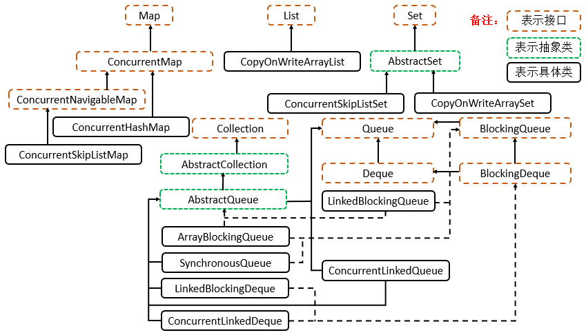

以下介绍实现容器线程安全的一些机制

#### CopyOnWrite

**写时复制机制**

CopyOnWrite 是计算机设计领域的一种优化策略，也是一种在并发场景下常用的设计思想——写入时复制。

写入时复制，就是指当有多个调用者同时去请求一个资源数据的时候，有一个调用者出于某些原因需要对当前的数据源进行修改，这个时候系统将会复制一个当前数据源的副本给调用者修改。

**写实复制容器**

CopyOnWrite 容器即写时复制的容器，当我们往一个容器中添加元素的时候，不直接往容器中添加，而是将当前容器进行 copy，复制出来一个新的容器，然后向新容器中添加我们需要的元素，最后将原容器的引用指向新容器。

**好处**

这样做的好处在于，我们可以在并发的场景下对容器进行 "读操作" 而 **不需要 "加锁"**，从而达到读写分离的目的。

Java 并发包里提供了两个使用 CopyOnWrite 机制实现的并发容器，分别是 [CopyOnWriteArrayList](#CopyOnWriteArrayList) 和 CopyOnWriteArraySet（不常用）。

#### 非阻塞式容器

**CAS 算法**

利用 `Unsafe` 类的 CAS（Compare-And-Swap）原子操作，配合循环重试（自旋）实现无锁更新

* `ConcurrentLinkedQueue` 基于链表，使用 CAS 操作头尾指针和节点 `next` 引用。
* `ConcurrentSkipListMap` 基于跳表，对索引节点使用 CAS 无锁插入/删除。

**特点**

非阻塞，高吞吐量，但可能造成 CPU 自旋开销。

#### 分段锁/细粒度锁

它的核心思想是将数据结构分成若干部分，每部分有自己的锁。当一个线程访问数据结构的一部分时，只需获取对应部分的锁，而不是整个数据结构的锁。这样，不同线程可以同时访问数据结构的不同部分，从而提高并发性能。

`ConcurrentHashMap` 在 JDK 1.7 底层为散列表桶数组 `Segment`， 采用分段锁 `ReentrantLock`，JDK 1.8 引入了数组加链表加红黑树的结构，使用更细粒度的锁。并发度极高，支持任意并发读写

#### 阻塞队列

假设一种场景，生产者一直生产资源，消费者一直消费资源，资源存储在一个缓冲池中，生产者将生产的资源存进缓冲池中，消费者从缓冲池中拿到资源进行消费，就是的生产者-消费者模式。

该模式能够简化开发过程，一方面消除了生产者类与消费者类之间的代码依赖性，另一方面将生产数据的过程与使用数据的过程解耦简化负载。

JDK 提供了阻塞队列（BlockingQueue）实现 **等待-唤醒** 逻辑，只管往里面存、取就行，而不用担心多线程环境下存、取共享变量的线程安全问题。

### 并发 List

#### CopyOnWriteArrayList

CopyOnWriteArrayList 是线程安全的，可以在多线程环境下使用。CopyOnWriteArrayList 遵循写时复制的原则，每当对列表进行修改（例如添加、删除或更改元素）时，都会创建列表的一个新副本，这个新副本会替换旧的列表，而对旧列表的所有读取操作仍然可以继续。

[参考](../Java集合/index.md#CopyOnWriteList)

### 并发 Map

#### ConcurrentMap 接口

ConcurrentMap 接口继承了 Map 接口，在 Map 接口的基础上又定义了四个方法：

```java
public interface ConcurrentMap<K, V> extends Map<K, V> {

    //插入元素  与原有 put 方法不同的是，putIfAbsent 如果插入的 key 相同，则不替换原有的 value 值；
    V putIfAbsent(K key, V value);

    //移除元素
    boolean remove(Object key, Object value);

    //替换元素
    boolean replace(K key, V oldValue, V newValue);

    //替换元素
    V replace(K key, V value);

}
```

`Map` 接口中这些方法的默认实现（Java 8+）并不保证原子性

`ConcurrentMap` 重新定义 `putIfAbsent`、`remove`、`replace` 等方法，主要是为了强调并强制实现原子性和明确并发语义

#### ConcurrentHashMap

`ConcurrentHashMap` 同 `HashMap` 一样，也是基于散列表的 map，但是它提供了一种与 `Hashtable` 完全不同的加锁策略，提供了更高效的并发性和伸缩性。

`HashMap` 在多线程环境下扩容会出现 CPU 接近 100% 的情况，因为 `HashMap` 并不是线程安全的，我们可以通过 `Collections` 的 ` synchronizedMap(Map<K,V> m)` 将 `HashMap` 包装成一个线程安全的 map。

**ConcurrentHashMap 的变化之 JDK1.7**

`ConcurrentHashMap` 在 JDK 1.7 中，提供了一种细粒度的加锁机制，这种机制叫分段锁 （Lock Striping）。整个哈希表被分为多个段，每个段都独立锁定。读取操作不需要锁，写入操作仅锁定相关的段。这减小了锁冲突的几率，从而提高了并发性能。

这种机制的优点：在并发环境下将实现更高的吞吐量，而在单线程环境下只损失非常小的性能。

有些方法需要跨段，比如 `size()`、`isEmpty()`、`containsValue()`，它们可能需要锁定整个表而不仅仅是某个段，这需要按顺序锁定所有段，操作完后，再按顺序释放所有段的锁。


一个 `ConcurrentHashMap` 里包含一个 `Segment` 数组；一个 `Segment` 里包含一个 `HashEntry` 数组；每个 `HashEntry` 是一个链表结构的元素；

整个 `ConcurrentHashMap` 的结构如下

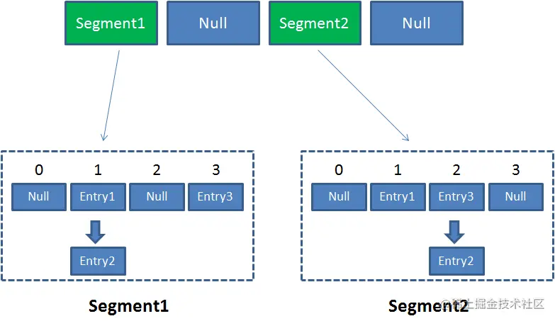

```java
public class ConcurrentHashMap<K, V> extends AbstractMap<K, V> implements ConcurrentMap<K, V>, Serializable {
    final Segment<K,V>[] segments;
    static final class Segment<K,V> extends ReentrantLock implements Serializable {
        transient volatile HashEntry<K,V>[] table;
    }
    static final class HashEntry<K,V> {
        final int hash;
        final K key;
        volatile V value;
        volatile HashEntry<K,V> next;
    }
}
```

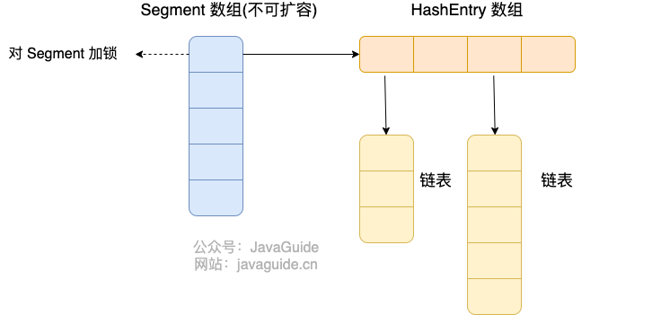

可以说，ConcurrentHashMap 是一个二级哈希表。在一个总的哈希表下面，有若干个子哈希表。其读写过程如下：

读取时，`get` 方法：

- 为输入的 Key 做 Hash 运算，得到 hash 值。
- 通过 hash 值，定位到对应的 Segment 对象
- 再次通过 hash 值，定位到 Segment 当中数组的具体位置。

写入时，`put` 方法：

- 为输入的 Key 做 Hash 运算，得到 hash 值。
- 通过 hash 值，定位到对应的 Segment 对象
- 获取可重入锁
- 再次通过 hash 值，定位到 Segment 当中数组的具体位置。
- 插入或覆盖 HashEntry 对象。
- 释放锁。

**ConcurrentHashMap 的变化之 JDK1.8**

主要做了两个优化：

* 链表会在长度达到 8 的时候转化为红黑树，这样可以提升大量冲突时候的查询效率；这更应该算作 HashMap 的优化
* 以某个位置的头结点（链表的头结点或红黑树的 root 结点）为锁，配合自旋+ CAS 避免不必要的锁开销，进一步提升并发性能。

也就是说，JDK1.8 中的 ConcurrentHashMap 取消了 Segment 分段锁，采用 CAS + synchronized 来保证并发安全性，整个容器只分为一个 Segment，即 table 数组。

**ConcurrentHashMap 的数据结构**

ConcurrentHashMap 的底层容器为装载 Node 的数组，采用懒加载的方式，直到第一次插入数据的时候才会进行初始化操作，数组的大小总是为 2 的幂次方

```java
public class ConcurrentHashMap<K,V> extends AbstractMap<K,V> implements ConcurrentMap<K,V>, Serializable {
    transient volatile Node<K,V>[] table;
    private transient volatile int sizeCtl; // 用来控制 table 数组的大小  根据是否初始化和是否正在扩容有几种情况
    private transient volatile Node<K,V>[] nextTable; // 扩容时使用，平时为 null，只有在扩容的时候才为非 null
    private static final sun.misc.Unsafe U; // Unsafe类 实现 CAS 算法用于保证线程安全性 在静态代码块中初始化
	
    static class Node<K,V> implements Map.Entry<K,V> { // 主要存放 key-value 对，并且具有 next 域
        final K key;
        volatile V val;
        volatile Node<K,V> next;
    }
    
    static final class TreeNode<K,V> extends Node<K,V> { //  红黑树的操作是针对 TreeBin 类的
        TreeNode<K,V> parent; 
        TreeNode<K,V> left;
        TreeNode<K,V> right;
        TreeNode<K,V> prev;  
        boolean red;
    }
}

```

树节点 TreeNode，继承于承载数据的 Node 类。

而 TreeBin 是对 TreeNode 的再一次封装，并不负责用户的 key、value 信息，而是封装了很多 TreeNode 节点。实际的 ConcurrentHashMap “数组”中，存放的都是 TreeBin 对象，而不是 TreeNode 对象。

```java
public class ConcurrentHashMap<K,V> extends AbstractMap<K,V> implements ConcurrentMap<K,V>, Serializable {
    
    static final class TreeNode<K,V> extends Node<K,V> {
        TreeNode<K,V> parent; 
        TreeNode<K,V> left;
        TreeNode<K,V> right;
        TreeNode<K,V> prev;  
        boolean red;
    }
    
    static final class TreeBin<K,V> extends Node<K,V> {
        TreeNode<K,V> root;
        volatile TreeNode<K,V> first;
        volatile Thread waiter;
        volatile int lockState;

        static final int WRITER = 1;
        static final int WAITER = 2;
        static final int READER = 4;
    }
}
```

**ConcurrentHashMap 的方法**

构造时，table 数组还未初始化，初始化放在第一次插入数据时，默认大小为 16。当调用构造方法之后，sizeCtl 的大小就代表了 ConcurrentHashMap 的大小，即 table 数组的长度。`tableSizeFor` 方法 使得 ConcurrentHashMap 的大小一定是 2 的幂次方

```java
public class ConcurrentHashMap<K,V> extends AbstractMap<K,V> implements ConcurrentMap<K,V>, Serializable {
	// 1. 构造一个空的map，即table数组还未初始化，初始化放在第一次插入数据时，默认大小为16
    ConcurrentHashMap();
    // 2. 给定map的大小
    public ConcurrentHashMap(int initialCapacity) {
        //1. 小于0直接抛异常
        if (initialCapacity < 0)
            throw new IllegalArgumentException();
        //2. 判断是否超过了允许的最大值，超过了话则取最大值，否则再对该值进一步处理
        int cap = ((initialCapacity >= (MAXIMUM_CAPACITY >>> 1)) ?
                   MAXIMUM_CAPACITY :
                   tableSizeFor(initialCapacity + (initialCapacity >>> 1) + 1)); // ConcurrentHashMap 的大小一定是 2 的幂次方
        //3. 赋值给sizeCtl
        this.sizeCtl = cap;
    }
    // 3. 给定一个map
    ConcurrentHashMap(Map<? extends K, ? extends V> m);
    // 4. 给定map的大小以及加载因子
    ConcurrentHashMap(int initialCapacity, float loadFactor);
    // 5. 给定map大小，加载因子以及并发度（预计同时操作数据的线程）
    ConcurrentHashMap(int initialCapacity,float loadFactor, int concurrencyLevel);
}

```

table 数组真正初始化的方法是 `initTable` 方法

```java
public class ConcurrentHashMap<K,V> extends AbstractMap<K,V> implements ConcurrentMap<K,V>, Serializable {
	private final Node<K,V>[] initTable() {
        Node<K,V>[] tab; int sc;
        while ((tab = table) == null || tab.length == 0) {
            // 1. 保证只有一个线程正在进行初始化操作
            if ((sc = sizeCtl) < 0)
                Thread.yield(); 
            else if (U.compareAndSwapInt(this, SIZECTL, sc, -1)) { // 正在进行初始化的线程会调用 U.compareAndSwapInt 方法将 sizeCtl 改为 -1，即正在初始化的状态。
                try {
                    if ((tab = table) == null || tab.length == 0) {
                        // 2. 得出数组的大小
                        int n = (sc > 0) ? sc : DEFAULT_CAPACITY;
                        @SuppressWarnings("unchecked")
                        // 3. 这里才真正的初始化数组
                        Node<K,V>[] nt = (Node<K,V>[])new Node<?,?>[n];
                        table = tab = nt;
                        // 4. 计算数组中可用的大小：实际大小n*0.75（加载因子）
                        sc = n - (n >>> 2);
                    }
                } finally {
                    sizeCtl = sc; // 最终sizeCtl 成为当前数据容器的可用容量 即临界值
                }
                break;
            }
        }
        return tab;
    }
}

```

put 方法。

确定好数组的索引 i 后，可以调用 `tabAt()` 方法获取该位置上的元素，如果当前 Node 为 null 的话，可以直接用 `casTabAt` 方法将新值插入。

如果当前节点不为 null，且该节点为特殊节点（forwardingNode），就说明当前 concurrentHashMap 正在进行扩容操作。

当出现哈希冲突的时候，采用拉链法的解决方案，将 hash 值相同的节点转换成链表的形式。当 `table[i]` 不为 null 并且不是 forwardingNode 时，以及当前 Node 的 hash 值大于 `0（fh >= 0）` 时，说明当前节点为链表的头节点，那么向 ConcurrentHashMap 插入新值就是向这个链表插入新值。

在 JDK 1.8 版本中，为了防止拉链过长，当链表长度超过 8（默认值）时，链表就转换为红黑树，利用红黑树快速增删改查的特点可以提高 ConcurrentHashMap 的性能。

当完成数据新节点插入后，会进一步对当前链表大小进行调整。

```java
public class ConcurrentHashMap<K,V> extends AbstractMap<K,V> implements ConcurrentMap<K,V>, Serializable {
    public V put(K key, V value) {
        return putVal(key, value, false);
    }

    final V putVal(K key, V value, boolean onlyIfAbsent) {
        if (key == null || value == null) throw new NullPointerException();
        int hash = spread(key.hashCode()); //1. 计算key的hash值
        int binCount = 0;
        for (Node<K,V>[] tab = table;;) {
            Node<K,V> f; int n, i, fh;
            if (tab == null || (n = tab.length) == 0)  //2. 如果当前table还没有初始化先调用initTable方法将tab进行初始化
                tab = initTable(); 
            else if ((f = tabAt(tab, i = (n - 1) & hash)) == null) { //3. tab中索引为i的位置的元素为null，则直接使用CAS将值插入即可
                if (casTabAt(tab, i, null,
                             new Node<K,V>(hash, key, value, null)))
                    break;
            }
            else if ((fh = f.hash) == MOVED) //4. 当前正在扩容
                tab = helpTransfer(tab, f);
            else {
                V oldVal = null;
                synchronized (f) {
                    if (tabAt(tab, i) == f) {
                        if (fh >= 0) { //5. 当前为链表，在链表中插入新的键值对
                            binCount = 1;
                            for (Node<K,V> e = f;; ++binCount) {
                                K ek;
                                if (e.hash == hash &&
                                    ((ek = e.key) == key ||
                                     (ek != null && key.equals(ek)))) { // 如果在链表中找到了与待插入的 key 相同的节点，就直接覆盖；
                                    oldVal = e.val;
                                    if (!onlyIfAbsent)
                                        e.val = value;
                                    break;
                                }
                                Node<K,V> pred = e;
                                if ((e = e.next) == null) { // 如果找到链表的末尾都还没找到的话，直接将待插入的键值对追加到链表的末尾。
                                    pred.next = new Node<K,V>(hash, key,
                                                              value, null);
                                    break;
                                }
                            }
                        }
                        else if (f instanceof TreeBin) { // 6.当前为红黑树，将新的键值对插入到红黑树中
                            Node<K,V> p;
                            binCount = 2;
                            if ((p = ((TreeBin<K,V>)f).putTreeVal(hash, key,
                                                           value)) != null) { // 如果在红黑树中存在 Key 相同（hash 值相等并且 equals 方法判断为 true）的节点，就覆盖旧值，否则向红黑树追加新节点。
                                oldVal = p.val;
                                if (!onlyIfAbsent)
                                    p.val = value;
                            }
                        }
                    }
                }
                if (binCount != 0) { // 7.插入完键值对后再根据实际大小看是否需要转换成红黑树
                    if (binCount >= TREEIFY_THRESHOLD)
                        treeifyBin(tab, i);
                    if (oldVal != null)
                        return oldVal;
                    break;
                }
            }
        }
        addCount(1L, binCount); // 8.对当前容量大小进行检查，如果超过了临界值（实际大小*加载因子）就需要扩容
        return null;
    }
}
```

get 方法。

```java
public V get(Object key) {
    Node<K,V>[] tab; Node<K,V> e, p; int n, eh; K ek;
	// 1. 重hash
    int h = spread(key.hashCode());
    if ((tab = table) != null && (n = tab.length) > 0 &&
        (e = tabAt(tab, (n - 1) & h)) != null) {
        // 2. table[i]桶节点的key与查找的key相同，则直接返回
		if ((eh = e.hash) == h) {
            if ((ek = e.key) == key || (ek != null && key.equals(ek)))
                return e.val;
        }
		// 3. 当前节点hash小于0说明为树节点，在红黑树中查找即可
        else if (eh < 0)
            return (p = e.find(h, key)) != null ? p.val : null;
        while ((e = e.next) != null) {
		//4. 从链表中查找，查找到则返回该节点的value，否则就返回null即可
            if (e.hash == h &&
                ((ek = e.key) == key || (ek != null && key.equals(ek))))
                return e.val;
        }
    }
    return null;
}
```

transfer 方法。

当 ConcurrentHashMap 容量不足的时候，需要对 table 进行扩容。这个方法的基本思想跟 HashMap 很像，但由于支持并发扩容，所以要复杂一些。

size 相关。

对于 ConcurrentHashMap 来说，这个 table 里到底装了多少东西是不确定的，因为不可能在调用 size() 方法的时候“stop the world”让其他线程都停下来去统计，对于这个不确定的 size，ConcurrentHashMap 仍然花费了大量的力气。

#### ConcurrentSkipListMap

`ConcurrentNavigableMap` 接口继承了 `NavigableMap` 接口，这个接口提供了针对给定搜索目标返回最接近匹配项的导航方法。

`ConcurrentSkipListMap` 类，它的底层使用的是跳表（SkipList）。跳表是一种”空间换时间“的数据结构，可以使用 CAS 来保证并发安全性。

与 `ConcurrentHashMap` 的读密集操作相比，`ConcurrentSkipListMap` 的读和写操作的性能相对较低。这是由其数据结构导致的，因为跳表的插入和删除需要更复杂的指针操作。然而，`ConcurrentSkipListMap` 提供了有序性，这是 `ConcurrentHashMap` 所没有的。

`ConcurrentSkipListMap` 适用于需要线程安全的同时又需要元素有序的场合。如果不需要有序，`ConcurrentHashMap` 可能是更好的选择，因为它通常具有更高的性能。

### 并发 Queue

JDK 提供了队列和双端队列的线程安全类：`ConcurrentLinkedQueue` 和 `ConcurrentLinkedDeque`。这两个类是使用 CAS 来实现线程安全的。

#### ConcurrentLinkedQueue

ConcurrentLinkedQueue 实现了 Queue 是一种先进先出（FIFO，First-In-First-Out）的队列。

ConcurrentLinkedQueue  是 `java.util.concurrent`（JUC） 包下的一个线程安全的队列实现。

ConcurrentLinkedQueue 不再使用传统的锁机制来保护数据安全，而是依靠底层原子的操作（如 CAS）来实现。

**数据结构**

```java
public class ConcurrentLinkedQueue<E> extends AbstractQueue<E> implements Queue<E>, java.io.Serializable {
    private transient volatile Node<E> head;
    private transient volatile Node<E> tail;
    private static class Node<E> {
        volatile E item; // 数据域
        volatile Node<E> next; // 指向下一个节点从而构成链式队列
    }
    public ConcurrentLinkedQueue() {
        head = tail = new Node<E>(null);
    }
}
```

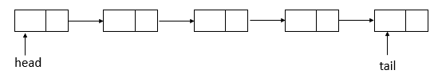

当调用无参构造方法，队列的初始状态中 head 和 tail 指向同一个节点 Node0，该节点的 item 字段为 null，next 字段也为 null。

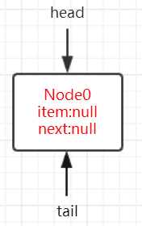

在队列进行出队入队的时候，免不了要对节点进行操作，在多线程环境下就很容易出现线程安全问题。ConcurrentLinkedQueue 选择使用 CAS 来保证线程安全：

```java
//更改Node中的数据域item
boolean casItem(E cmp, E val) {
    return UNSAFE.compareAndSwapObject(this, itemOffset, cmp, val);
}
//更改Node中的指针域next
void lazySetNext(Node<E> val) {
    UNSAFE.putOrderedObject(this, nextOffset, val);
}
//更改Node中的指针域next
boolean casNext(Node<E> cmp, Node<E> val) {
    return UNSAFE.compareAndSwapObject(this, nextOffset, cmp, val);
}
```

### 阻塞队列 BlockingQueue

BlockingQueue 是 Java 中的一个接口，它代表了一个线程安全的队列，不仅可以由多个线程并发访问，还添加了等待/通知机制，以便在队列为空时阻塞获取元素的线程，直到队列变得可用，或者在队列满时阻塞插入元素的线程，直到队列变得可用。

**BlockingQueue 的操作方法**

| 方法\处理方式 | 抛出异常  | 返回特殊值 |  一直阻塞  |      超时退出      |
| :-----------: | :-------: | :--------: | :--------: | :----------------: |
|   插入方法    |  add(e)   |  offer(e)  | **put(e)** | offer(e, time, unit) |
|   移除方法    | remove()  |   poll()   | **take()** |  poll(time, unit)   |
|   检查方法    | element() |   peek()   |     -      |         -          |

**BlockingQueue 的实现类**

- `ArrayBlockingQueue`：底层结构为数组的有界阻塞队列。可在声明的时候设置公平标志为 true，否则线程调度不能保证绝对的公平
- `LinkedBlockingQueue`：由链表结构组成的有界阻塞队列
- `DelayQueue`：无界阻塞队列。用于存放实现了 Delayed 接口的元素，这些元素只能在其到期时才能从队列中取走。这使得 DelayQueue 成为实现时间基于优先级的调度服务的理想选择。
- `PriorityBlockingQueue`：基于优先级的无界阻塞队列。可以通过实现 Comparable 接口来定义自然排序或提供比较器 Comparator 来进行定制排序。
- `SynchronousQueue`：特殊的阻塞队列，不存储任何元素，每一个插入操作必须等待另一个线程的移除操作。
- `LinkedTransferQueue` ：基于链表结构的无界传输队列。`transfer(E e)`，将元素转移到等待的消费者，如果不存在等待的消费者，则元素会入队并阻塞直到该元素被消费。

> 队列：操作符合先进先出（FIFO）的原则。
>
> 有界：大小是在构造时就确定了，并且在之后不能更改。这个界限提供了流量控制，有助于资源的合理使用。
>
> 无界：
>
> 阻塞：当队列容量满时，尝试将元素放入队列将导致阻塞；尝试从一个空的队列取出元素也会阻塞。
>
> 公平：最先等待的线程能够最先访问到 BlockingQueue。
>
> 优先级：元素在队列中的排序遵循自然排序或者通过提供的比较器进行定制排序。

**ArrayBlockingQueue 与 LinkedBlockingQueue 的比较**

* ArrayBlockingQueue 基于数组实现，而 LinkedBlockingQueue 基于链表实现；
* ArrayBlockingQueue 使用一个单独的 ReentrantLock 来控制对队列的访问，而 LinkedBlockingQueue 使用两个锁（putLock 和 takeLock），一个用于放入操作，另一个用于取出操作。锁分离，很适合生产和消费频率差不多的场景，这样生产和消费互不干涉的执行，能达到不错的效率。

### 并发 Set

`ConcurrentSkipListSet` 是线程安全的有序集合。底层是使用 ConcurrentSkipListMap 来实现。

`CopyOnWriteArraySet` 底层使用 `CopyOnWriteArrayList`，写操作（add、remove）会复制整个数组，适合 **读多写极少** 的场景（如事件监听器集合）。

Set 日常开发中用的并不多，所以这里就不展开细讲了。

## ThreadLocal

ThreadLocal 是 Java 中提供的一种用于实现线程局部变量的工具类。它允许每个线程都拥有自己的独立副本，从而实现线程隔离。既然每个线程有自己的实例副本，且其它线程不可访问，那就不存在多线程间共享的问题。

这就是一种“空间换时间”的思想，每个线程拥有自己的非共享资源，虽然内存占用变大了，但由于不需要同步，也就减少了线程可能存在的阻塞问题，从而提高时间上的效率。

ThreadLocal 并不在 java.util.concurrent 并发包下，而是在 java.lang 包下。

### ThreadLocal

**set 方法**

```java
public class ThreadLocal<T> {
    public void set(T value) {
        Thread t = Thread.currentThread(); // 获取当前线程实例对象
        ThreadLocalMap map = getMap(t); // 通过当前线程实例获取到ThreadLocalMap对象
        if (map != null) { // 如果Map不为null,则以当前ThreadLocal实例为key,值为value进行存入
            map.set(this, value);
        } else { // map为null,则新建ThreadLocalMap并存入value
            createMap(t, value);
        }
    }
}

```

**get 方法**

```java
public class ThreadLocal<T> {
    public T get() {
        Thread t = Thread.currentThread(); // 获取当前线程的实例对象
        ThreadLocalMap map = getMap(t); // 通过当前线程实例获取到ThreadLocalMap对象
        if (map != null) { // 获取map中当前ThreadLocal实例为key的值的entry
            ThreadLocalMap.Entry e = map.getEntry(this);
            if (e != null) {
                @SuppressWarnings("unchecked")
                T result = (T)e.value;
                return result;
            }
        }
        return setInitialValue(); // 若map为null或者entry为null的话通过该方法初始化，并返回该方法返回的value 
        
    }
    
    private T setInitialValue() {
        T value = initialValue(); // initialValue 方法是通过 protected 修饰的，因此 ThreadLocal 的子类可以重写该方法给一个合适的初始值。
        Thread t = Thread.currentThread();
        ThreadLocalMap map = getMap(t);
        if (map != null)
            map.set(this, value);
        else
            createMap(t, value);
        return value;
    }
}

```

withInitial 方法可以返回 一个 SuppliedThreadLocal 用于定制 initialValue 方法。

**remove 方法**

```java
public void remove() {
	//1. 获取当前线程的ThreadLocalMap
	ThreadLocalMap m = getMap(Thread.currentThread());
 	if (m != null)
		//2. 从map中删除以当前ThreadLocal实例为key的键值对
		m.remove(this);
}
```

### ThreadLocalMap

通过源码我们知道，value 是存放在 ThreadLocalMap 里的。

```java
public class ThreadLocal<T> {
    void createMap(Thread t, T firstValue) { // set 时，map为空则创建新的
        t.ThreadLocals = new ThreadLocalMap(this, firstValue);
    }
    ThreadLocalMap getMap(Thread t) { // 获取map时，直接返回当前线程对象 t 的一个成员变量 ThreadLocals
        return t.threadLocals;
    }
    
    static class ThreadLocalMap {
        
        private Entry[] table; //  和大多数容器一样 维护内部容器
        static class Entry extends WeakReference<ThreadLocal<?>> { // 使用弱引用作为键允许垃圾收集器在不再需要的情况下回收 ThreadLocal 实例。
            Object value;

            Entry(ThreadLocal<?> k, Object v) { // 以当前 ThreadLocal 实例为 key，值为 Entry 往这个 ThreadLocalMap 中存放。
                super(k);
                value = v;
            }
        }
    }
}
public class Thread implements Runnable {
    ThreadLocal.ThreadLocalMap threadLocals = null;
}
```

Thread、ThreadLocal、ThreadLocalMap、Entry 之间的关系：

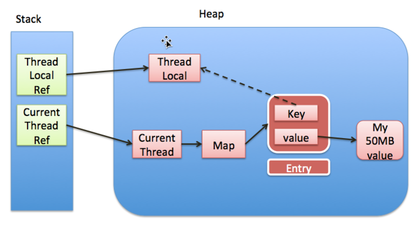

Entry 的 key 为弱引用，意味着当 ThreadLocal 外部强引用被置为 null（`ThreadLocalInstance=null`）时，根据可达性分析，ThreadLocal 实例此时没有任何一条链路引用它，所以系统 GC 的时候 ThreadLocal 会被回收。

ThreadLocalMap 就会出现 key 为 null 的 Entry，也就没办法访问这些 key 对应的 value，但是 如果线程迟迟不结束的话，这些 key 为 null 的 value 就会一直存在一条强引用链：Thread Ref -> Thread -> ThreaLocalMap -> Entry -> value，无法回收就会造成内存泄漏。

除非等到 thread 运行结束，上述对象垃圾回收时都会被系统回收。但实际开发中，线程为了复用是不会主动结束的，比如说数据库连接池，过大的线程池可能会增加内存泄漏的风险，因此合理配置线程池的大小和线程的存活时间有助于减轻这个问题。

**哈希表**

ThreadLocalMap 底层是定制好的哈希表

但 ThreadLocalMap 是使用 **开放地址法** 来处理哈希冲突的，和 HashMap 不同，之所以采用不同的方式主要是因为：ThreadLocalMap 中的哈希值分散的比较均匀，很少会出现冲突。并且 ThreadLocalMap 经常需要清除无用的对象，冲突的概率就更小了。

在开放地址法中有三种方式来寻找其他的位置，分别是「线性探测」、「二次探测」、「再哈希法」。ThreadLocalMap  使用的是线性探测的方式。

**hashCode** 

ThreadLocal 的 hashCode 是通过 nextHashCode() 方法获取的，该方法实际上是用 AtomicInteger 加上 0x61c88647 来实现的。

0x61c88647 是一个魔数，用于 ThreadLocal 的哈希码递增。这个值的选择并不是随机的，它是一个质数，这个数字大约等于黄金比例的 32 位浮点表示的一半，通过使用这个特定的值，算法能够确保哈希码的均匀分布，从而减少哈希冲突的可能性。这对于哈希表的性能至关重要，因为冲突可能会降低查找的效率。

```java
public class ThreadLocal<T> {
    private final int threadLocalHashCode = nextHashCode();
    private static AtomicInteger nextHashCode = new AtomicInteger();
    private static final int HASH_INCREMENT = 0x61c88647;

    private static int nextHashCode() {
        return nextHashCode.getAndAdd(HASH_INCREMENT);
    }
}
```

**set 方法**

```java
public class ThreadLocal<T> {
    
    static class ThreadLocalMap {
		private void set(ThreadLocal<?> key, Object value) {


            Entry[] tab = table;
            int len = tab.length;
            int i = key.threadLocalHashCode & (len-1); // 根据ThreadLocal的hashCode确定Entry应该存放的位置

            // 采用开放地址法，hash冲突的时候使用线性探测
            for (Entry e = tab[i];
                 e != null;
                 e = tab[i = nextIndex(i, len)]) { 
                ThreadLocal<?> k = e.get();

                if (k == key) {
                    e.value = value; // 覆盖旧Entry
                    return;
                }

                if (k == null) { // 当key为null时，说明ThreadLocal强引用已经被释放掉
                    replaceStaleEntry(key, value, i); // 用当前插入的值替换掉这个key为null的“脏”entry
                    return;
                }
            }

            // 找到空位置后 新建entry并插入table中i处
            tab[i] = new Entry(key, value);
            int sz = ++size;
            // 插入后再次清除一些key为null的“脏”entry,如果大于阈值就需要扩容
            if (!cleanSomeSlots(i, sz) && sz >= threshold)
                rehash();
        }
    }
}    
		

```

**扩容**

在第一次对 ThreadLocal 赋值的时候会创建初始大小为 16 的 ThreadLocalMap，并且通过 setThreshold 方法设置 threshold，其值为当前哈希数组长度乘以（2/3），也就是说加载因子为 2/3。加载因子可以用来衡量哈希表的满载程度，影响哈希表的查找、插入和删除操作的性能。HashMap 的加载因子都为 0.75。

```java
	ThreadLocalMap(ThreadLocal<?> firstKey, Object firstValue) {
            table = new Entry[INITIAL_CAPACITY];
            int i = firstKey.threadLocalHashCode & (INITIAL_CAPACITY - 1);
            table[i] = new Entry(firstKey, firstValue);
            size = 1;
            setThreshold(INITIAL_CAPACITY);
        }
    private void setThreshold(int len) {
        threshold = len * 2 / 3;
    }
```

当哈希表的 size 大于 threshold 的时候，会通过 resize 方法进行扩容。在扩容的过程中，针对脏 entry 会把 value 设为 null，以便被垃圾回收，解决隐藏的内存泄漏问题。

```java
	private void rehash() {
        expungeStaleEntries();

        // Use lower threshold for doubling to avoid hysteresis
        if (size >= threshold - threshold / 4)
            resize();
    }
    
    private void resize() {
        Entry[] oldTab = table;
        int oldLen = oldTab.length;
        //新数组为原数组的2倍
        int newLen = oldLen * 2;
        Entry[] newTab = new Entry[newLen];
        int count = 0;

        for (int j = 0; j < oldLen; ++j) {
            Entry e = oldTab[j];
            if (e != null) {
                ThreadLocal<?> k = e.get();
                //遍历过程中如果遇到脏entry的话直接另value为null,有助于value能够被回收
                if (k == null) {
                    e.value = null; // Help the GC
                } else {
                    //重新确定entry在新数组的位置，然后进行插入
                    int h = k.ThreadLocalHashCode & (newLen - 1);
                    while (newTab[h] != null)
                        h = nextIndex(h, newLen);
                    newTab[h] = e;
                    count++;
                }
            }
        }
        //设置新哈希表的threshHold和size属性
        setThreshold(newLen);
        size = count;
        table = newTab;
    }
```

**getEntry 方法**

当前 entry 的 key 和查找的 key 相同就直接返回这个 entry，

如果索引处的条目为 null，或者其键与给定的键不匹配，那么需要调用 getEntryAfterMiss 方法来处理可能的哈希冲突。

```java
    private Entry getEntry(ThreadLocal<?> key) {
        //1. 确定在哈希数组中的位置
        int i = key.ThreadLocalHashCode & (table.length - 1);
        //2. 根据索引i获取entry
        Entry e = table[i];
        //3. 满足条件则返回该entry
        if (e != null && e.get() == key)
            return e;
        else
            //4. 未查找到满足条件的entry，额外在做的处理
            return getEntryAfterMiss(key, i, e);
    }
```

### ThreadLocal 的使用场景

ThreadLocal 的使用场景非常多，比如说：

- 用于保存用户登录信息，这样在同一个线程中的任何地方都可以获取到登录信息。
- 用于保存数据库连接、Session 对象等，这样在同一个线程中的任何地方都可以获取到数据库连接、Session 对象等。
- 用于保存事务上下文，这样在同一个线程中的任何地方都可以获取到事务上下文。
- 用于保存线程中的变量，这样在同一个线程中的任何地方都可以获取到线程中的变量。

使用示例

```java
public class UserAuthenticationService {

    // 创建一个ThreadLocal实例，用于保存用户登录信息
    private static ThreadLocal<User> currentUser = ThreadLocal.withInitial(() -> null);

    public static void main(String[] args) {
        // 模拟用户登录
        loginUser(new User("Alice", "password123"));
        System.out.println("User logged in: " + getCurrentUser().getUsername());

        // 模拟另一个线程处理另一个用户
        Runnable task = () -> {
            loginUser(new User("Bob", "password456"));
            System.out.println("User logged in: " + getCurrentUser().getUsername());
        };

        Thread thread = new Thread(task);
        thread.start();
    }

    // 模拟用户登录方法
    public static void loginUser(User user) {
        // 这里通常会有一些身份验证逻辑
        currentUser.set(user);
    }

    // 获取当前线程关联的用户信息
    public static User getCurrentUser() {
        return currentUser.get();
    }

    // 用户类
    public static class User {
        private final String username;
        private final String password;

        public User(String username, String password) {
            this.username = username;
            this.password = password;
        }

        public String getUsername() {
            return username;
        }

        // 其他getter和setter...
    }
}
```

## 线程池

### 什么是线程池

线程池其实是一种池化的技术实现，池化技术的核心思想就是 **实现资源的复用，避免资源的重复创建和销毁带来的性能开销**。线程池可以管理一堆线程，让线程执行完任务之后不进行销毁，而是继续去处理其它线程已经提交的任务。

**好处**

- 降低资源消耗。通过重复利用已创建的线程降低线程创建和销毁造成的消耗。
- 提高响应速度。当任务到达时，任务可以不需要等到线程创建就能立即执行。
- 提高线程的可管理性。线程是稀缺资源，如果无限制的创建，不仅会消耗系统资源，还会降低系统的稳定性，使用线程池可以进行统一的分配，调优和监控。

### 线程池的构造

Java 主要是通过构建 ThreadPoolExecutor 来创建线程池的。线程池的构造其实很简单，就是传入一堆参数，然后进行简单的赋值操作。

```java
public class ThreadPoolExecutor extends AbstractExecutorService {

    private volatile int corePoolSize; // 核心线程数量
    private volatile int maximumPoolSize; // 最大线程数
    private final BlockingQueue<Runnable> workQueue; // 任务队列
    private volatile long keepAliveTime; // 非核心线程或所有线程的最大存活时间
    private volatile ThreadFactory threadFactory; // 线程工厂
    private volatile RejectedExecutionHandler handler; // 拒绝策略
    private static final RejectedExecutionHandler defaultHandler = new AbortPolicy(); // 默认的拒绝策略

	public ThreadPoolExecutor(int corePoolSize,
                              int maximumPoolSize,
                              long keepAliveTime,
                              TimeUnit unit,
                              BlockingQueue<Runnable> workQueue,
                              ThreadFactory threadFactory,
                              RejectedExecutionHandler handler) {
        if (corePoolSize < 0 ||
            maximumPoolSize <= 0 ||
            maximumPoolSize < corePoolSize ||
            keepAliveTime < 0)
            throw new IllegalArgumentException();
        if (workQueue == null || threadFactory == null || handler == null)
            throw new NullPointerException();
        this.acc = System.getSecurityManager() == null ?
                null :
                AccessController.getContext();
        this.corePoolSize = corePoolSize; // 线程池中用来工作的核心线程数量。
        this.maximumPoolSize = maximumPoolSize; // 最大线程数，线程池允许创建的最大线程数。
        this.workQueue = workQueue; // 任务队列，是一个阻塞队列，当线程数达到核心线程数后，会将任务存储在阻塞队列中。
        this.keepAliveTime = unit.toNanos(keepAliveTime); // 超出 corePoolSize 后创建的线程存活时间或者是所有线程最大存活时间，取决于配置。
        this.threadFactory = threadFactory; // 线程池内部创建线程所用的工厂。
        this.handler = handler; // 拒绝策略；当队列已满并且线程数量达到最大线程数量时，会调用该方法处理任务。
    }
}

```

### 线程池的 5 种状态

线程池内部有 5 个常量来代表线程池的五种状态

```java
public class ThreadPoolExecutor extends AbstractExecutorService {
    private final AtomicInteger ctl = new AtomicInteger(ctlOf(RUNNING, 0)); // 工作线程数量 其中包含了线程池状态和工作线程数

    private static final int COUNT_BITS = Integer.SIZE - 3;
    
	private static final int RUNNING    = -1 << COUNT_BITS;
    private static final int SHUTDOWN   =  0 << COUNT_BITS;
    private static final int STOP       =  1 << COUNT_BITS;
    private static final int TIDYING    =  2 << COUNT_BITS;
    private static final int TERMINATED =  3 << COUNT_BITS;
}
```

- RUNNING：线程池创建时就是这个状态，能够接收新任务，以及对已添加的任务进行处理。
- SHUTDOWN：调用 shutdown 方法，线程池就会转换成 SHUTDOWN 状态，此时线程池不再接收新任务，但能继续处理已添加的任务到队列中。
- STOP：调用 shutdownNow 方法，线程池就会转换成 STOP 状态，不接收新任务，也不能继续处理已添加的任务到队列中任务，并且会尝试中断正在处理的任务的线程。
- TIDYING：SHUTDOWN 状态下，任务数为 0， 其他所有任务已终止，线程池会变为 TIDYING 状态；线程池在 SHUTDOWN 状态，任务队列为空且执行中任务为空，线程池会变为 TIDYING 状态；线程池在 STOP 状态，线程池中执行中任务为空时，线程池会变为 TIDYING 状态。
- TERMINATED：线程池彻底终止。线程池在 TIDYING 状态执行完 `terminated()` 方法就会转变为 TERMINATED 状态。

线程池状态具体是存在 ctl 成员变量中的，ctl 中不仅存储了线程池的状态还存储了当前线程池中线程数的大小

**5 种状态的流转图示**

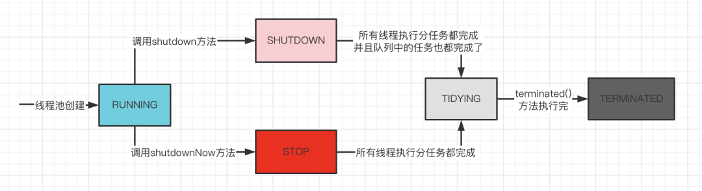

在线程池运行过程中，绝大多数操作执行前都得判断当前线程池处于哪种状态，再来决定是否继续执行该操作

### 线程池的线程创建

线程池刚创建出来，只有一个构造时传入的阻塞队列，里面并没有线程。

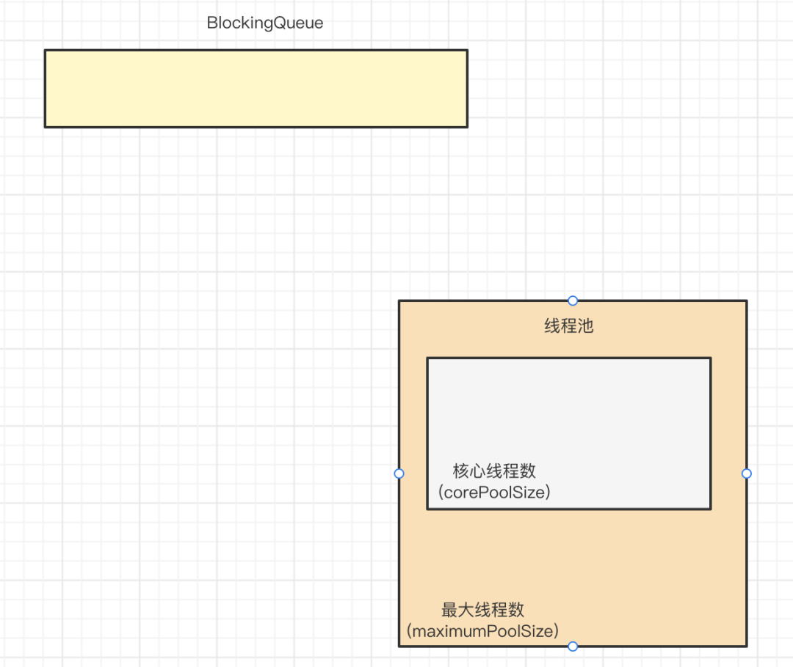

如果想要在执行之前创建好核心线程数 corePoolSize 的线程，可以调用 prestartAllCoreThreads 方法来实现，默认是没有线程的。

```java
public class ThreadPoolExecutor extends AbstractExecutorService {
    
    public int prestartAllCoreThreads() {
        int n = 0;
        while (addWorker(null, true)) // 创建无首任务的核心线程
            ++n;
        return n;
    }
}
```

addworker 方法 将线程和首任务包装成 Worker 对象，添加到 Workders 容器内并且启用线程。

```java
private final HashSet<Worker> workers = new HashSet<Worker>();

private boolean addWorker(Runnable firstTask, boolean core) {
        retry:
        for (;;) {
            //准备工作 检查线程池状态
        }

        boolean workerStarted = false;
        boolean workerAdded = false;
        Worker w = null;
        try {
            w = new Worker(firstTask); // 包装 worker
            final Thread t = w.thread;
            if (t != null) {
                // ...
                if (workerAdded) {
                    t.start(); // worker 加入后 启动线程
                    workerStarted = true;
                }
            }
        } finally {
            if (! workerStarted)
                addWorkerFailed(w);
        }
        return workerStarted;
    }
```

### 线程池的运行 

线程池通过 `execute` 方法提交一个任务

首先会去判断当前线程池的线程数 ctl 是否小于核心线程数 corePoolSize

* 如果小于，那么就直接通过 ThreadFactory 创建一个线程来执行这个任务。当任务执行完之后，线程不会退出，而是会去阻塞队列 workQueue 中获取任务。
* 如果线程池里的线程数不再小于核心线程数呢，尝试将任务放入阻塞队列中

随着任务越来越多，队列已经满了，任务放入失败。此时会判断当前线程池里的线程数是否小于最大线程数 maximumPoolSize 

* 如果小于最大线程数，那么也会创建非核心线程来执行提交的任务
* 否则线程数已经达到最大线程数量，就会执行拒绝策略，由 RejectedExecutionHandler 来处理任务

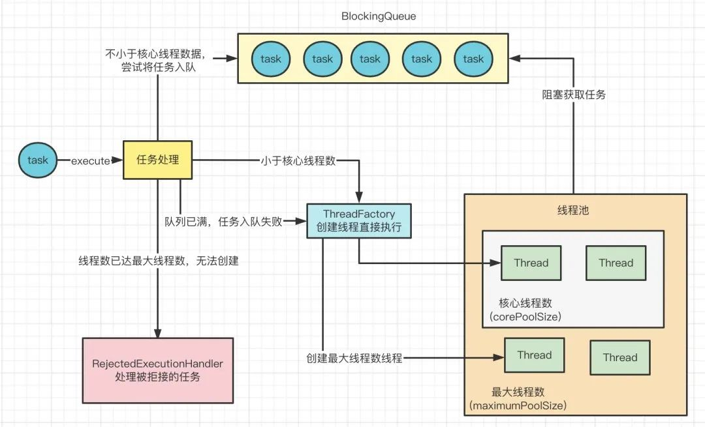

JDK 自带的 RejectedExecutionHandler 实现有 4 种

* AbortPolicy（构造时不指定，默认）：丢弃任务，抛出运行时异常。
* CallerRunsPolicy：由提交任务的线程来执行任务
* DiscardPolicy：丢弃这个任务，但是不抛异常
* DiscardOldestPolicy：从队列中剔除最先进入队列的任务，然后再次提交任务

当然，你也可以自己实现 RejectedExecutionHandler 接口，比如将任务存在数据库或者缓存中，这样就可以从数据库或者缓存中获取被拒绝掉的任务了。

`execute` 方法的代码是如何实现

```java
public class ThreadPoolExecutor extends AbstractExecutorService {
   
    public void execute(Runnable command) {
        // 检查是否提交了空任务，是的话则抛出异常
        if (command == null)
            throw new NullPointerException();
        
        int c = ctl.get();
        if (workerCountOf(c) < corePoolSize) { // 1. 判断当前线程池的线程数是否小于核心线程数
            // 小于，那么就直接通过工厂创建一个线程来执行这个任务。
            if (addWorker(command, true)) // addWorker方法会检查线程池状态和工作线程数，并决定是否真的添加新线程
                return;
            c = ctl.get(); // 重新获取线程池的状态，因为在尝试添加线程的过程中线程池的状态可能已经发生变化
        }
        // 2. 不小于 尝试将任务添加到任务队列中
        if (isRunning(c) && workQueue.offer(command)) {
            int recheck = ctl.get();
            // 双重检查线程池的状态
            if (! isRunning(recheck) && remove(command)) // 如果线程池已经停止，从队列中移除任务
                reject(command);
            // 如果线程池正在运行，但是工作线程数为0，尝试添加一个新的工作线程
            else if (workerCountOf(recheck) == 0)
                addWorker(null, false);
        }
        // 3. 如果任务队列满了，尝试添加一个新的非核心工作线程来执行任务
        else if (!addWorker(command, false))
            reject(command); // 如果无法添加新的工作线程（可能因为线程池已经停止或者达到最大线程数限制），则拒绝任务
    }
}
```

 `execute` 的执行流程 图示

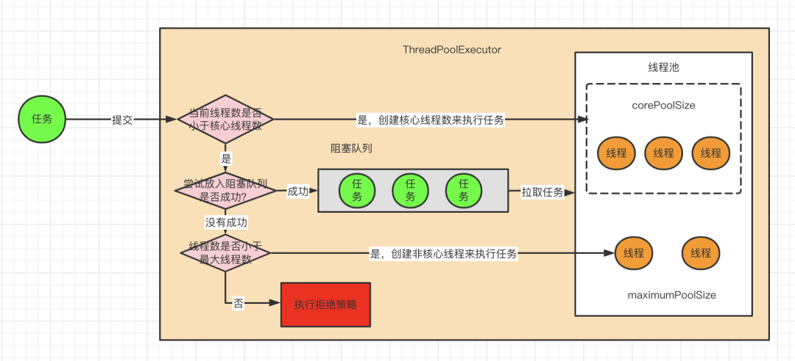

### 线程池的线程复用

线程池的核心功能就是实现线程的重复利用。为了实现线程的复用，线程在线程池内部其实被封装成了一个 Worker 对象。

Worker 继承了 AQS，也就是具有一定锁的特性。

在创建 Worker 对象的时候，会把线程和任务一起封装到 Worker 内部，然后调用 runWorker 方法来让线程执行任务

```java
public class ThreadPoolExecutor extends AbstractExecutorService {
	private final class Worker extends AbstractQueuedSynchronizer implements Runnable {
        final Thread thread;
        Runnable firstTask;

        public void run() {
            runWorker(this);
        }
        
        Worker(Runnable firstTask) {
            setState(-1); 
            this.firstTask = firstTask;
            this.thread = getThreadFactory().newThread(this);
        }
    }
}
```

```java
final void runWorker(Worker w) {
    // 获取当前工作线程
    Thread wt = Thread.currentThread();
    
    // 从 Worker 中取出第一个任务
    Runnable task = w.firstTask;
    w.firstTask = null;
    
    // 解锁 Worker（允许中断）
    w.unlock(); 
    
    boolean completedAbruptly = true;
    try {
        // 当有任务需要执行或者能够从任务队列中获取到任务时，工作线程就会持续运行
        while (task != null || (task = getTask()) != null) {
            // 锁定 Worker，确保在执行任务期间不会被其他线程干扰
            w.lock();
            
            // 如果线程池正在停止，并确保线程已经中断
            // 如果线程没有中断并且线程池已经达到停止状态，中断线程
            if ((runStateAtLeast(ctl.get(), STOP) ||
                 (Thread.interrupted() &&
                  runStateAtLeast(ctl.get(), STOP))) &&
                !wt.isInterrupted())
                wt.interrupt();
            
            try {
                // 在执行任务之前，可以插入一些自定义的操作
                beforeExecute(wt, task);
                
                Throwable thrown = null;
                try {
                    // 实际执行任务
                    task.run();
                } catch (RuntimeException x) {
                    thrown = x; throw x;
                } catch (Error x) {
                    thrown = x; throw x;
                } catch (Throwable x) {
                    thrown = x; throw new Error(x);
                } finally {
                    // 执行任务后，可以插入一些自定义的操作
                    afterExecute(task, thrown);
                }
            } finally {
                // 清空任务，并更新完成任务的计数
                task = null;
                w.completedTasks++;
                // 解锁 Worker
                w.unlock();
            }
        }
        completedAbruptly = false;
    } finally {
        // 工作线程退出的后续处理
        processWorkerExit(w, completedAbruptly);
    }
}
```

runWorker 内部使用了 while 死循环，当第一个任务执行完之后，会不断地通过 getTask 方法获取任务，使得线程执行完任务不会退出，只要能获取到任务，就会调用 run 方法继续执行任务，这就是线程能够复用的主要原因。

但是如果从 getTask 获取不到方法的话，就会调用 finally 中的 processWorkerExit 方法，将线程退出。

因为 Worker 继承了 AQS，每次在执行任务之前都会调用 Worker 的 lock 方法，执行完任务之后，会调用 unlock 方法，这样做的目的就可以通过 Woker 的加锁状态判断出当前线程是否正在执行任务。

如果想知道线程是否正在执行任务，只需要调用 Woker 的 tryLock 方法，根据是否加锁成功就能判断，加锁成功说明当前线程没有加锁，也就没有执行任务了，在调用 shutdown 方法关闭线程池的时候，就时用这种方式来判断线程有没有在执行任务，如果没有的话，会尝试打断没有执行任务的线程。

### 线程获取任务和超时

线程在执行完任务之后，会继续从 `getTask` 方法中获取任务，获取不到就会退出。接下来我们就来看一看 `getTask` 方法的实现。

```java
private Runnable getTask() {
    // 标志，表示最后一个poll()操作是否超时
    boolean timedOut = false;

    // 无限循环，直到获取到任务或决定工作线程应该退出
    for (;;) {
        int c = ctl.get();
        int rs = runStateOf(c);

        // 如果线程池状态是SHUTDOWN或更高（如STOP）并且任务队列为空，那么工作线程应该减少并退出
        if (rs >= SHUTDOWN && (rs >= STOP || workQueue.isEmpty())) {
            decrementWorkerCount();
            return null;
        }

        int wc = workerCountOf(c);

        // 检查工作线程是否应当在没有任务执行时，经过keepAliveTime之后被终止
        boolean timed = allowCoreThreadTimeOut || wc > corePoolSize;

        // 如果工作线程数超出最大线程数或者超出核心线程数且上一次poll()超时，并且队列为空或工作线程数大于1，
        // 则尝试减少工作线程数
        if ((wc > maximumPoolSize || (timed && timedOut))
            && (wc > 1 || workQueue.isEmpty())) {
            if (compareAndDecrementWorkerCount(c))
                return null;
            continue;
        }

        try {
            // 根据timed标志，决定是无限期等待任务，还是等待keepAliveTime时间
            Runnable r = timed ?
                workQueue.poll(keepAliveTime, TimeUnit.NANOSECONDS) :  // 指定时间内等待
                workQueue.take();  // 无限期等待
            if (r != null)  // 成功获取到任务
                return r;
            // 如果poll()超时，则设置timedOut标志
            timedOut = true;
        } catch (InterruptedException retry) {
            // 如果在等待任务时线程被中断，重置timedOut标志并重新尝试获取任务
            timedOut = false;
        }
    }
}
```

判断当前过来获取任务的线程是否可以超时退出，即  allowCoreThreadTimeOut 设置为 true 或者线程池当前的线程数大于核心线程数 corePoolSize，该获取任务的线程就运行超时退出。也就是说非核心线程绝对能超时退出，而核心线程就要看 allowCoreThreadTimeOut  是否允许核心线程超时推出。

```java
boolean timed = allowCoreThreadTimeOut || wc > corePoolSize;
```

根据是否允许超时来选择调用阻塞队列 workQueue 的 poll 方法或者 take 方法。

* 如果允许超时，则调用 poll 方法，传入 keepAliveTime，也就是构造线程池时传入的空闲时间，这个方法的意思就是从队列中阻塞 keepAliveTime 时间来获取任务，获取不到就会返回 null；
* 如果不允许超时，就会调用 take 方法，这个方法会一直阻塞获取任务，直到从队列中获取到任务为止。

```java
Runnable r = timed ?
workQueue.poll(keepAliveTime, TimeUnit.NANOSECONDS) :
workQueue.take();
```

整个 getTask 方法以及线程超时退出的机制图示

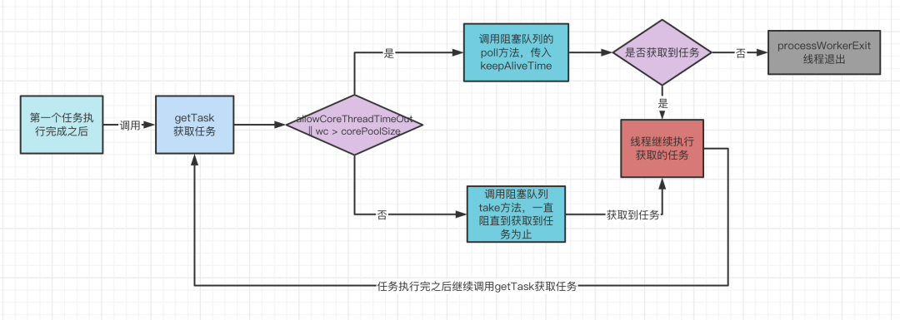

### 线程池的关闭

线程池提供了 shutdown 和 shutdownNow 两个方法来关闭线程池。

**shutdown 方法**

```java
	/**
     * 启动一次顺序关闭，在这次关闭中，执行器不再接受新任务，但会继续处理队列中的已存在任务。
     * 当所有任务都完成后，线程池中的线程会逐渐退出。
     */
	public void shutdown() {
        final ReentrantLock mainLock = this.mainLock;
        mainLock.lock(); // 加锁以确保独占访问
        try {
            checkShutdownAccess(); // 检查是否有关闭的权限
            advanceRunState(SHUTDOWN); // 将执行器的状态更新为SHUTDOWN
            interruptIdleWorkers(); // 中断所有闲置的工作线程
            onShutdown();  // ScheduledThreadPoolExecutor中的挂钩方法，可供子类重写以进行额外操作
        } finally { 
            mainLock.unlock(); // 释放锁
        }
        tryTerminate(); // 如果条件允许，尝试终止执行器
    } 
```

就是将线程池的状态修改为 SHUTDOWN，然后尝试打断空闲的线程（如何判断空闲，上面在说 Worker 继承 AQS 的时候说过），也就是在阻塞等待任务的线程。

**shutdownNow 方法**

```java
    /**
     * 尝试停止所有正在执行的任务，停止处理等待的任务，
     * 并返回等待处理的任务列表。
     *
     * @return 从未开始执行的任务列表
     */	
    public List<Runnable> shutdownNow() {
        List<Runnable> tasks;
        final ReentrantLock mainLock = this.mainLock;
        mainLock.lock(); // 加锁以确保独占访问
        try {
            checkShutdownAccess(); // 检查是否有关闭的权限
            advanceRunState(STOP); // 将执行器的状态更新为STOP
            interruptWorkers(); // 中断所有工作线程
            tasks = drainQueue(); // 清空队列并将结果放入任务列表中
        } finally {
            mainLock.unlock();
        }
        tryTerminate();
        return tasks; // 返回队列中未被执行的任务列表
    }
```

就是将线程池的状态修改为 STOP，然后尝试打断所有的线程，从阻塞队列中移除剩余的任务，这也是为什么 shutdownNow 不能执行剩余任务的原因。

**区别**

shutdown 之后还能处理在队列中的任务

shutdownNow 直接就将任务从队列中移除，线程池里的线程就不再处理了

### 线程池的监控

在项目中使用线程池的时候，一般需要对线程池进行监控，方便出问题的时候快速定位。线程池本身提供了一些方法来获取线程池的运行状态。

- getCompletedTaskCount：已经执行完成的任务数量
- getLargestPoolSize：线程池里曾经创建过的最大的线程数量。这个主要是用来判断线程是否满过。
- getActiveCount：获取正在执行任务的线程数据
- getPoolSize：获取当前线程池中线程数量的大小

**扩展方法**

runWorker 中，执行任务之前会回调 `beforeExecute` 方法，执行任务之后会回调 `afterExecute` 方法

可以自己继承 ThreadPoolExecutor 来重写这些方法

### Executors  构建线程池

JDK 内部提供了 `java.util.concurrent` 包中的 `Executors` 工具类来快速创建线程池。

```java
// 固定线程数量的线程池：核心线程数与最大线程数相等
public static ExecutorService newFixedThreadPool(int nThreads) {
    return new ThreadPoolExecutor(nThreads, nThreads,
                                  0L, TimeUnit.MILLISECONDS,
                                  new LinkedBlockingQueue<Runnable>());
}
// 单个线程数量的线程池
public static ExecutorService newSingleThreadExecutor() {
    return new FinalizableDelegatedExecutorService
        (new ThreadPoolExecutor(1, 1,
                                0L, TimeUnit.MILLISECONDS,
                                new LinkedBlockingQueue<Runnable>()));
}
// 接近无限大线程数量的线程池
public static ExecutorService newCachedThreadPool() {
    return new ThreadPoolExecutor(0, Integer.MAX_VALUE,
                                  60L, TimeUnit.SECONDS,
                                  new SynchronousQueue<Runnable>());
}
// 带定时调度功能的线程池
public static ScheduledExecutorService newScheduledThreadPool(int corePoolSize) {
    return new ScheduledThreadPoolExecutor(corePoolSize);
}
```

> 为什么不推荐使用 Executors 来创建线程池
>
> * newFixedThreadPool 线程池由于使用了 LinkedBlockingQueue，队列的容量默认无限大，实际使用中出现任务过多时会导致内存溢出
> * newCachedThreadPool 线程池由于核心线程数无限大，当任务过多的时候会导致创建大量的线程，可能机器负载过高导致服务宕机。

### 线程池的使用场景

在 Java 程序中，其实经常需要用到多线程来处理一些业务，但是不建议单纯继承 Thread 或者实现 Runnable 接口来创建线程，这样会导致频繁创建及销毁线程，同时创建过多的线程也可能引发资源耗尽的风险。

使用线程池是一种更合理的选择，方便管理任务，同时实现线程的重复利用。所以线程池一般适合需要异步或者多线程处理任务的场景。

**Web 服务器模拟**

```java
import java.util.concurrent.*;

public class SimpleWebServer {
    private static final int NTHREADS = 100;
    private static final ExecutorService exec = Executors.newFixedThreadPool(NTHREADS);

    public static void main(String[] args) {
        while (true) {
            // 接收请求
            Runnable request = new Runnable() {
                public void run() {
                    // 处理请求
                    System.out.println("Request handled by " + Thread.currentThread().getName());
                }
            };

            exec.execute(request);
        }
    }
}
```

**并行计算**

```java
import java.util.concurrent.*;

public class ParallelCalculation {

    private static final int NTHREADS = 4;
    private static final ExecutorService exec = Executors.newFixedThreadPool(NTHREADS);

    public static void main(String[] args) {
        Callable<Double> task = new Callable<Double>() {
            @Override
            public Double call() {
                // 这里模拟一些数值计算
                return Math.random() * 100;
            }
        };

        List<Future<Double>> results = new ArrayList<>();
        for (int i = 0; i < 10; i++) {
            results.add(exec.submit(task));
        }

        for (Future<Double> result : results) {
            try {
                System.out.println(result.get());
            } catch (InterruptedException | ExecutionException e) {
                e.printStackTrace();
            }
        }

        exec.shutdown();
    }
}
```

**异步任务处理**

```java
import java.util.concurrent.*;

public class AsynchronousTaskProcessor {

    private static final ExecutorService exec = Executors.newCachedThreadPool();

    public static void main(String[] args) {
        exec.execute(() -> {
            // 执行某些异步任务
            System.out.println("Async task started");
            try {
                Thread.sleep(2000);
            } catch (InterruptedException e) {
                e.printStackTrace();
            }
            System.out.println("Async task completed");
        });

        System.out.println("Main thread continues to execute other operations.");
        exec.shutdown();
    }
}
```

### 实战：合理的自定义线程池

**线程数**

线程数的设置主要取决于业务是 IO 密集型还是 CPU 密集型。

CPU 密集型：指的是任务主要使用来进行大量的计算，没有什么导致线程阻塞。一般这种场景的线程数设置为 CPU 核心数+1。

IO 密集型：当执行任务需要大量的 io，比如磁盘 io，网络 io，可能会存在大量的阻塞，所以在 IO 密集型任务中使用多线程可以大大地加速任务的处理。一般线程数设置为 2*CPU 核心数

Java 中用来获取 CPU 核心数的方法是：`Runtime.getRuntime().availableProcessors();`

**线程工厂**

一般建议自定义线程工厂，构建线程的时候设置线程的名称

**任务队列**

一般需要设置有界队列的大小，比如 LinkedBlockingQueue 在构造的时候可以传入参数来限制队列中任务数据的大小，这样就不会因为无限往队列中扔任务导致系统的 oom。

> Web 服务器通常需要处理 I/O 操作，比如网络 I/O，因此它们被视为 I/O 密集型任务。因此，我们将线程数设置为 2 * CPU 核心数。
>
> 并行计算任务主要用于计算，没有 I/O 阻塞，所以它们是 CPU 密集型的。线程数设置为 CPU 核心数 + 1。
>
> 异步任务通常涉及到 I/O 操作，比如数据库查询或文件读写，因此它们被视为 I/O 密集型任务。因此，我们将线程数设置为 2 * CPU 核心数。

###  定时任务 ScheduledThreadPoolExecutor

`ScheduledThreadPoolExecutor` 是一个定时任务的线程池，它的主要作用是周期性的执行任务。它的实现原理是通过 `DelayedWorkQueue` 来保存等待的任务，`DelayedWorkQueue` 是一个无界优先队列，使用数组存储，底层使用堆结构来实现优先队列的功能。

定时任务 `ScheduledThreadPoolExecutor` 类有两个用途：

* 指定时间延迟后执行任务
* 周期性重复执行任务

JDK 1.5 之前，主要使用 `Timer` 类来完成定时任务，但是 `Timer` 有以下缺陷：

* Timer 是单线程模式
* 如果在执行任务期间某个 TimerTask 耗时较久，就会影响其它任务的调度
* Timer 的任务调度是基于绝对时间的，对系统时间敏感
* Timer 不会捕获执行 TimerTask 时所抛出的异常，由于 Timer 是单线程的，所以一旦出现异常，线程就会终止，其他任务无法执行。

于是 JDK 1.5 之后，开发者就抛弃了 `Timer`，开始使用 `ScheduledThreadPoolExecutor`。

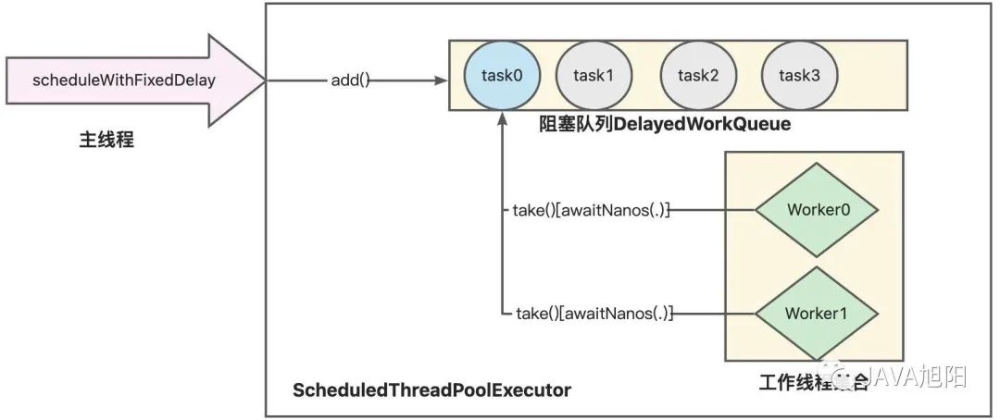

**使用案例**

假设我们有这样一个需求，指定时间给其他人发送消息。那么我们会将消息（包含发送时间）存储在数据库中，然后用一个定时任务，每隔 1 秒检查数据库在当前时间有没有需要发送的消息

```java
public class ThreadPool {

    private static final ScheduledExecutorService executor = new
        ScheduledThreadPoolExecutor(1, Executors.defaultThreadFactory());

    private static SimpleDateFormat df = new SimpleDateFormat("yyyy-MM-dd HH:mm:ss");

    public static void main(String[] args){
        // 新建一个固定延迟时间的计划任务
        executor.scheduleWithFixedDelay(new Runnable() {
            @Override
            public void run() {
                if (haveMsgAtCurrentTime()) {
                    System.out.println(df.format(new Date()));
                    System.out.println("大家注意了，我要发消息了");
                }
            }
        }, 1, 1, TimeUnit.SECONDS);
    }

    public static boolean haveMsgAtCurrentTime(){
        //查询数据库，有没有当前时间需要发送的消息
        //这里省略实现，直接返回true
        return true;
    }
}
/*
2023-08-24 16:16:48
大家注意了，我要发消息了
2023-08-24 16:16:49
大家注意了，我要发消息了
2023-08-24 16:16:50
大家注意了，我要发消息了
2023-08-24 16:16:51
大家注意了，我要发消息了
*/
```

## Unsafe 魔法类

### Unsafe 构造

Unsafe 被 final 修饰的，所以不允许被继承

Unsafe  的构造方法为 `private` 类型，即不允许我们直接 new 实例化。

Unsafe 在 static 静态代码块中，以单例的方式初始化了一个 Unsafe 对象

Unsafe 提供了一个静态方法 `getUnsafe`，看上去貌似可以用它来获取 Unsafe 实例：

```java
public final class Unsafe {
    private static final Unsafe theUnsafe;
    private Unsafe() {
    }
    static {
        theUnsafe = new Unsafe();
    }
    @CallerSensitive
    public static Unsafe getUnsafe() {
        Class var0 = Reflection.getCallerClass();
        if (!VM.isSystemDomainLoader(var0.getClassLoader())) {
            throw new SecurityException("Unsafe");
        } else {
            return theUnsafe;
        }
    }
}
```

因为它实现的功能过于底层，例如直接进行内存操作、绕过 jvm 的安全检查创建对象等等，为了防止这些方法在不可信的代码中被调用，使用 @CallerSensitive 注解，对调用者的 `classLoader` 进行检查，判断当前类是否由 `Bootstrap classLoader` 加载，如果不是的话就会抛出一个 `SecurityException` 异常。

> @CallerSensitive 注解，要求有权限（由 bootstrap class loader 或者 extension class loader 加载的类）才可以调用。
>
> @CallerSensitive 注解能够堵住反射的漏洞，尝试用反射调用 CallerSensitive 方法，结果会抛出异常
>
>  JDK 内有些方法，JVM 的开发者认为这些方法危险，不希望开发者调用，就把这种危险的方法用 @CallerSensitive 修饰，并在“jvm”级别检查。例如 `Reflection.getCallerClass()` 方法规定，调用它的对象，必须有 @CallerSensitive 注解，否则报异常

### 创建 Unsafe 实例

因为无法直接使用 `getUnsafe` 方法， 因此利用反射获得 Unsafe 类中已经实例化完成的单例对象

```java
public static Unsafe getUnsafe() throws IllegalAccessException {
     Field unsafeField = Unsafe.class.getDeclaredField("theUnsafe");
     //Field unsafeField = Unsafe.class.getDeclaredFields()[0]; //也可以这样，作用相同
     unsafeField.setAccessible(true);
     Unsafe unsafe =(Unsafe) unsafeField.get(null);
     return unsafe;
 }
```

属性读写示例

```java
public void fieldTest(Unsafe unsafe) throws NoSuchFieldException {
     User user=new User();
     long fieldOffset = unsafe.objectFieldOffset(User.class.getDeclaredField("age"));
     System.out.println("offset:"+fieldOffset);
     unsafe.putInt(user,fieldOffset,20);
     System.out.println("age:"+unsafe.getInt(user,fieldOffset));
     System.out.println("age:"+user.getAge());
 }
// offset:12
// age:20
// age:20
```

调用了 Unsafe 类的 `objectFieldOffset` 、`putInt` 和 `getInt` 方法。通过 Unsafe 类的 `objectFieldOffset` 方法获取到了对象中字段的偏移地址，这个偏移地址不是内存中的绝对地址而是一个相对地址，之后再通过这个偏移地址对 `int` 类型字段的属性值进行读写操作。

```java
public native long objectFieldOffset(Field var1);
public native int getInt(Object o, long offset);
public native void putInt(Object o, long offset, int x);
```

这些方法都是 `native` 方法，Unsafe 类中的很多基础方法都属于 `native` 方法。

> `native` 方法，简单的说就是由 Java 调用非 Java 代码的接口，被调用的方法是由非 Java 语言实现的，例如它可以由 C 或 C++语言来实现，并编译成 DLL，然后直接供 Java 进行调用。
>
> `native` 方法是通过 JNI（`Java Native Interface`）实现调用的，从 Java 1.1 开始 JNI 标准就是 Java 平台的一部分，它允许 Java 代码和其他语言的代码进行交互。
>
> 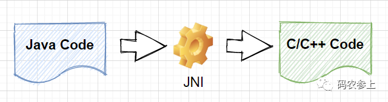

### 内存操作

`C` 或者 `C++`，可以对进行内存操作，而 Java 是不允许直接对内存进行操作的，对象内存的分配和回收都是由 `jvm` 自己实现。但是在 Unsafe 中，提供的下列接口都可以直接进行内存操作：

```java
//分配新的本地空间
 public native long allocateMemory(long bytes);
 //重新调整内存空间的大小
 public native long reallocateMemory(long address, long bytes);
 //将内存设置为指定值
 public native void setMemory(Object o, long offset, long bytes, byte value);
 //内存拷贝
 public native void copyMemory(Object srcBase, long srcOffset,Object destBase, long destOffset,long bytes);
 //清除内存
 public native void freeMemory(long address);
```

**示例**


### 内存屏障

编译器和 CPU 会在保证程序输出结果一致的情况下，会对代码进行重排序，从指令优化角度提升性能。而指令重排序可能会带来一个不好的结果，导致 CPU 的高速缓存和内存中数据的不一致，内存屏障（`Memory Barrier`）就是通过组织屏障两边的指令重排序从而避免编译器和硬件的不正确优化情况。

在硬件层面上，内存屏障是 CPU 为了防止代码进行重排序而提供的指令，不同的硬件平台上实现内存屏障的方法可能并不相同。Java8 中，引入了 3 个内存屏障的方法，它屏蔽了操作系统底层的差异，允许在代码中定义、并统一由 jvm 来生成内存屏障指令，来实现内存屏障的功能。

```java
//禁止读操作重排序
 public native void loadFence();
 //禁止写操作重排序
 public native void storeFence();
 //禁止读、写操作重排序
 public native void fullFence();
```

**示例**

定义一个线程方法，在线程中去修改 `flag` 标志位，注意这里的 `flag` 是没有被 `volatile` 修饰的：

```java
public class MemoryBarrier {

    static class ChangeThread implements Runnable{
        /**volatile**/ boolean flag=false;
        @Override
        public void run() {
            try {
                Thread.sleep(1000);
            } catch (InterruptedException e) {
                e.printStackTrace();
            }
            System.out.println("subThread change flag");
            flag = true;
        }

        public boolean isFlag(){
            return flag;
        }
    }

    public static void main(String[] args){
        ChangeThread changeThread = new ChangeThread();
        new Thread(changeThread).start();
        while (true) {
            boolean flag = changeThread.isFlag();
            unsafe.loadFence(); //加入读内存屏障
            System.out.println("mainThread read flag: " + flag);
            if (flag){
                System.out.println("detected flag changed");
                break;
            }
        }
        System.out.println("main thread end");
    }
}
/*
mainThread read flag: false
mainThread read flag: false
mainThread read flag: false
mainThread read flag: false
subThread change flag
mainThread read flag: false
mainThread read flag: true
detected flag changed
main thread end
*/
```

上述效果，通过 volatile 关键字修饰 flag 变量也能呈现。

而如果删掉上面代码中的 `loadFence` 方法，那么主线程将无法感知到 `flag` 发生的变化，会一直在 `while` 中循环。

可以用图来表示上面的过程：

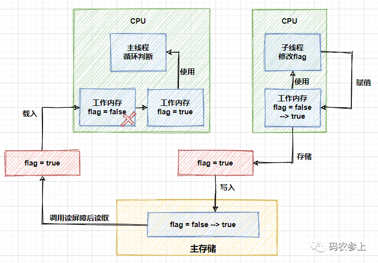

根据 Java 内存模型（JMM），运行中的线程不是直接读取主内存中变量的，只能操作自己工作内存中的变量，然后同步到主内存中，并且线程的工作内存是不能共享的。上图中的流程就是子线程借助于主内存，将修改后的结果同步给了主线程，进而修改主线程中的工作空间，跳出循环。

### 对象操作

**直接操作八大基础数据类型**

```java
	public native int getInt(Object var1, long var2);
    public native void putInt(Object var1, long var2, int var4);

    public native boolean getBoolean(Object var1, long var2);
    public native void putBoolean(Object var1, long var2, boolean var4);

    public native byte getByte(Object var1, long var2);
    public native void putByte(Object var1, long var2, byte var4);

    public native short getShort(Object var1, long var2);
    public native void putShort(Object var1, long var2, short var4);

    public native char getChar(Object var1, long var2);
    public native void putChar(Object var1, long var2, char var4);

    public native long getLong(Object var1, long var2);
    public native void putLong(Object var1, long var2, long var4);

    public native float getFloat(Object var1, long var2);
    public native void putFloat(Object var1, long var2, float var4);

    public native double getDouble(Object var1, long var2);
    public native void putDouble(Object var1, long var2, double var4);
```

**操作对象引用**

```java
//在对象的指定偏移地址获取一个对象引用
public native Object getObject(Object var1, long var2);
 //在对象指定偏移地址写入一个对象引用
public native void putObject(Object var1, long var2, Object var4);
```

**支持 volatile 读写**

```java
    //在对象的指定偏移地址处读取，支持volatile load语义
    public native int getXXXVolatile(Object o, long offset);
    //在对象指定偏移地址处写入，支持volatile store语义
    public native void putXXXVolatile(Object o, long offset, int x);
```

**有序写入**

```java
    public native void putOrderedObject(Object o, long offset, Object x);
    public native void putOrderedInt(Object o, long offset, int x);
    public native void putOrderedLong(Object o, long offset, long x);
```

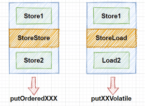

有序写入方法中，使用的是`StoreStore`屏障，该屏障确保`Store1`立刻刷新数据到内存，这一操作先于`Store2`以及后续的存储指令操作。

而在`volatile`写入中，使用的是`StoreLoad`屏障，该屏障确保`Store1`立刻刷新数据到内存，这一操作先于`Load2`及后续的装载指令，并且，`StoreLoad`屏障会使该屏障之前的所有内存访问指令，包括存储指令和访问指令全部完成之后，才执行该屏障之后的内存访问指令。

综上所述，在上面的三类写入方法中，在写入效率方面，按照`put`、`putOrder`、`putVolatile`的顺序效率逐渐降低。

### 对象实例化

```java
	public native Object allocateInstance(Class<?> var1) throws InstantiationException;
```

通过`allocateInstance`方法创建对象过程中，不会调用类的构造方法。

示例

```java
public class AllocateInstance {
    private static Unsafe unsafe;

    static {
        try {
            unsafe = getUnsafe();
        } catch (IllegalAccessException | NoSuchFieldException e) {
            e.printStackTrace();
        }
    }

    public static Unsafe getUnsafe() throws IllegalAccessException, NoSuchFieldException {
        Field unsafeField = Unsafe.class.getDeclaredField("theUnsafe");
        //Field unsafeField = Unsafe.class.getDeclaredFields()[0]; //也可以这样，作用相同
        unsafeField.setAccessible(true);
        Unsafe unsafe =(Unsafe) unsafeField.get(null);
        return unsafe;
    }

    static class A {
        private int b;
        public A(){
            this.b =1;
        }
        public int getB(){
            return b;
        }
    }

    public static void main(String[] args) throws InstantiationException, IllegalAccessException {
        A a1=new A();
        System.out.println(a1.getB());
        A a2 = A.class.newInstance();
        System.out.println(a2.getB());
        A a3= (A) unsafe.allocateInstance(A.class);
        System.out.println(a3.getB());
    }
}
/*
1
1
0
*/
```

### 数组操作

`arrayBaseOffset` 与 `arrayIndexScale` 这两个方法配合起来使用，即可定位数组中每个元素在内存中的位置。

```java
    //返回数组中第一个元素的偏移地址
    public native int arrayBaseOffset(Class<?> arrayClass);
    //返回数组中一个元素占用的大小
    public native int arrayIndexScale(Class<?> arrayClass);
```

### CAS 操作

[CAS 的 JAVA 实现 - Unsafe 类](#CAS 的 JAVA 实现 - Unsafe 类)

### 线程调度

```java
    //取消阻塞线程
    public native void unpark(Object thread);
    //阻塞线程
    public native void park(boolean isAbsolute, long time);
    //获得对象锁（可重入锁）
    @Deprecated
    public native void monitorEnter(Object o);
    //释放对象锁
    @Deprecated
    public native void monitorExit(Object o);
    //尝试获取对象锁
    @Deprecated
    public native boolean tryMonitorEnter(Object o);
```

**典型应用**

Java 锁和同步器框架的核心类 `AbstractQueuedSynchronizer` (AQS)，就是通过调用`LockSupport.park()`和`LockSupport.unpark()`实现线程的阻塞和唤醒的，而 [`LockSupport`](#并发线程阻塞唤醒类 LockSupport) 的 `park`、`unpark` 方法实际是调用 `Unsafe` 的 `park`、`unpark` 方式实现的。

```java
public class LockSupport {
    private LockSupport() {}
    public static void unpark(Thread thread) {
        if (thread != null)
            UNSAFE.unpark(thread);
    }
    public static void park(Object blocker) {
        Thread t = Thread.currentThread();
        setBlocker(t, blocker);
        UNSAFE.park(false, 0L);
        setBlocker(t, null);
    }
}
```

### Class 操作
**静态属性读取**

```java
    //获取静态属性的偏移量
    public native long staticFieldOffset(Field f);
    //获取静态属性的对象指针
    public native Object staticFieldBase(Field f);
    //判断类是否需要初始化（用于获取类的静态属性前进行检测）
    public native boolean shouldBeInitialized(Class<?> c);
    // 允许程序在运行时动态地创建一个类
    public native Class<?> defineClass(String name, byte[] b, int off, int len, ClassLoader loader,ProtectionDomain protectionDomain);
    // 动态的创建一个匿名类
    public native Class<?> defineAnonymousClass(Class<?> hostClass, byte[] data, Object[] cpPatches);

```

### 系统信息

```java
    //返回系统指针的大小。返回值为4（32位系统）或 8（64位系统）。
    public native int addressSize();
    //内存页的大小，此值为2的幂次方。
    public native int pageSize();
```

**典型应用**

这两个方法的应用场景比较少，在`java.nio.Bits`类中，在使用`pageCount`计算所需的内存页的数量时，调用了`pageSize`方法获取内存页的大小。另外，在使用`copySwapMemory`方法拷贝内存时，调用了`addressSize`方法，检测 32 位系统的情况。

## Fork/Join框架

### 分治任务模型

并发编程领域的任务可以分为三种：简单并行任务、聚合任务和批量并行任务

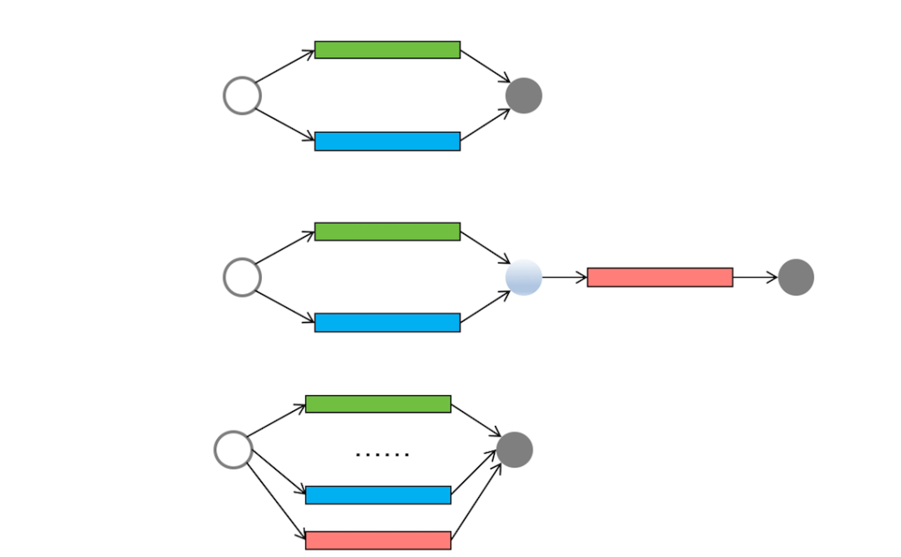

还有一种任务模型被称为“分治”。分治是一种解决复杂问题的思维方法和模式；具体而言，它将一个复杂的问题分解成多个相似的子问题，然后再将这些子问题进一步分解成更小的子问题，直到每个子问题变得足够简单从而可以直接求解。

> 从理论上讲，每个问题都对应着一个任务，因此分治实际上就是对任务的划分和组织。分治思想在许多领域都有广泛的应用。算法领域，归并排序和快速排序都属于分治算法，二分查找也是一种分治算法；大数据领域，MapReduce 计算框架背后的思想也是基于分治。

分治任务模型可分为两个阶段：一个阶段是 **任务分解**，就是迭代地将任务分解为子任务，直到子任务可以直接计算出结果；另一个阶段是 **结果合并**，即逐层合并子任务的执行结果，直到获得最终结果。下图是一个简化的分治任务模型图，你可以对照着理解。

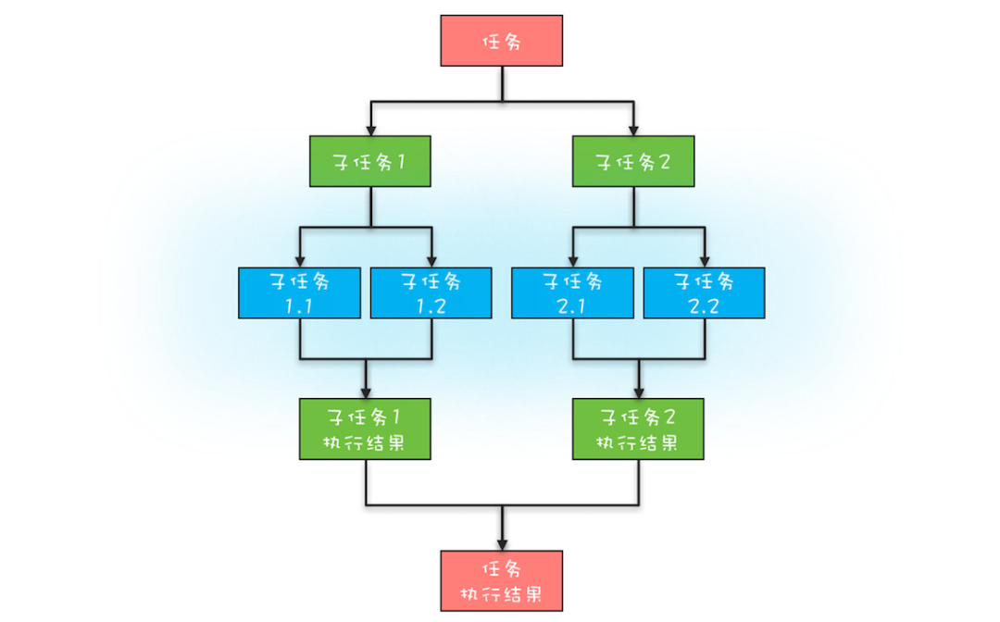

### Fork/Join 的使用

Fork/Join 是一个并行计算框架，主要用于支持分治任务模型。在这个计算框架中，Fork 代表任务的分解，而 Join 代表结果的合并。

Fork/Join 计算框架主要由两部分组成：分治任务的线程池 ForkJoinPool 和分治任务 ForkJoinTask。这两部分的关系类似于 ThreadPoolExecutor 和 Runnable 之间的关系，都是用于提交任务到线程池的，只不过分治任务有自己独特的类型 ForkJoinTask。

**ForkJoinTask**

ForkJoinTask 有两个子类：RecursiveAction 和 RecursiveTask。

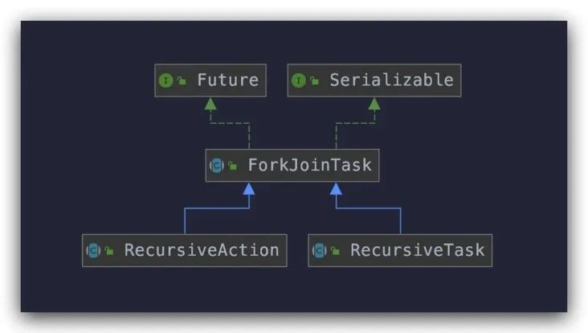

名字就可以看出，都是通过递归的方式来处理分治任务的。这两个子类都定义了一个抽象方法 `compute()`，不同之处在于 RecursiveAction 的 compute 方法没有返回值，而 RecursiveTask 的 compute 方法有返回值。

官方示例

```java
@Slf4j 
 public class ForkJoinDemo { 
     // 1. 运行入口 
     public static void main(String[] args) { 
         int n = 20; 
  
         // 为了追踪子线程名称，需要重写 ForkJoinWorkerThreadFactory 的方法 
         final ForkJoinPool.ForkJoinWorkerThreadFactory factory = pool -> { 
             final ForkJoinWorkerThread worker = ForkJoinPool.defaultForkJoinWorkerThreadFactory.newThread(pool); 
             worker.setName("my-thread" + worker.getPoolIndex()); 
             return worker; 
         }; 
  
         //创建分治任务线程池，可以追踪到线程名称 
         ForkJoinPool forkJoinPool = new ForkJoinPool(4, factory, null, false); 
  
         // 快速创建 ForkJoinPool 方法 
         // ForkJoinPool forkJoinPool = new ForkJoinPool(4); 
  
         //创建分治任务 
         Fibonacci fibonacci = new Fibonacci(n); 
  
         //调用 invoke 方法启动分治任务 
         Integer result = forkJoinPool.invoke(fibonacci); 
         log.info("Fibonacci {} 的结果是 {}", n, result); 
     } 
 } 
  
 // 2. 定义拆分任务，写好拆分逻辑 
 @Slf4j 
 class Fibonacci extends RecursiveTask<Integer> { 
     final int n; 
     Fibonacci(int n) { 
         this.n = n; 
     } 
  
     @Override 
     public Integer compute() { 
         //和递归类似，定义可计算的最小单元 
         if (n <= 1) { 
             return n; 
         } 
         // 想查看子线程名称输出的可以打开下面注释 
         //log.info(Thread.currentThread().getName()); 
  
         Fibonacci f1 = new Fibonacci(n - 1); 
         // 拆分成子任务 
         f1.fork(); 
         Fibonacci f2 = new Fibonacci(n - 2); 
         // f1.join 等待子任务执行结果 
         return f2.compute() + f1.join(); 
     } 
 }
```

**ForkJoinPool**

当我们通过 ForkJoinPool 的 invoke 或 submit 方法提交任务时，ForkJoinPool 会根据一定的路由规则将任务分配到一个任务队列中。如果任务执行过程中创建了子任务，那么子任务会被提交到对应工作线程的任务队列中。

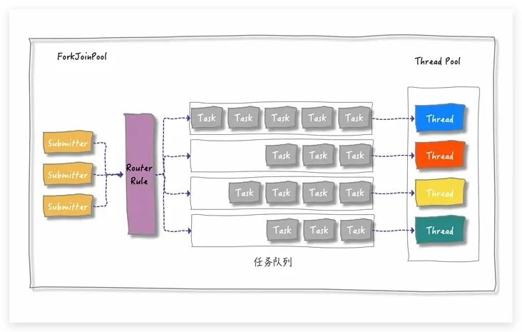

## 生产者-消费者模式

生产者-消费者模式是一个十分经典的多线程并发协作模式。

所谓的生产者-消费者，实际上包含了两类线程，一种是生产者线程用于生产数据，另一种是消费者线程用于消费数据。

为了解耦生产者和消费者的关系，通常会采用共享的数据区域，就像是一个仓库，生产者生产数据之后直接放置在共享数据区中，并不需要关心消费者的行为；而消费者只需要从共享数据区中获取数据，不需要关心生产者的行为。

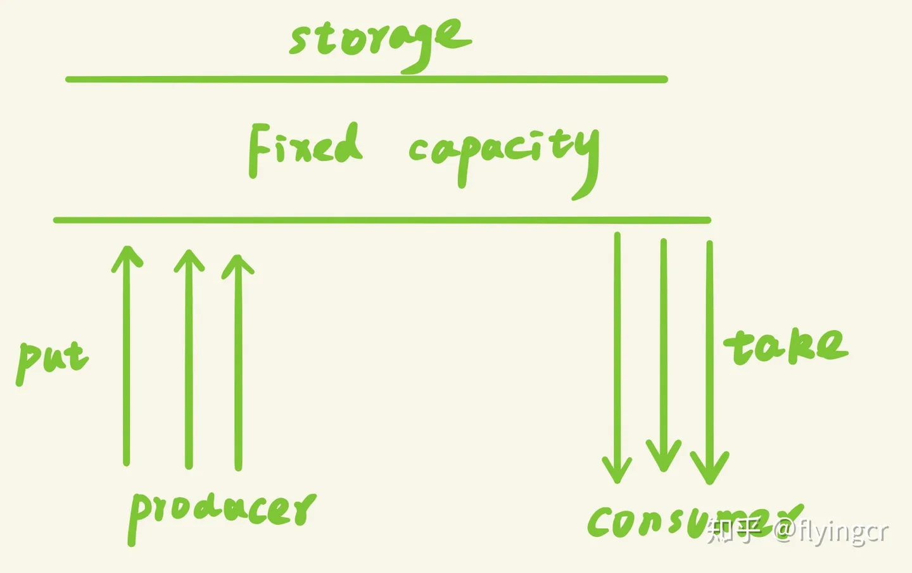

这个共享数据区域中通常会并发协作功能：

* 如果共享数据区已满的话，阻塞生产者继续生产数据；
* 如果共享数据区为空的话，阻塞消费者继续消费数据；

为了实现生产者消费者问题，可以采用三种方式：

* 使用 Object 的 [wait/notify](#Condition 机制详解) 的消息通知机制；
* 使用 Lock [Condition](#Condition 机制详解) 的 await/signal 消息通知机制；
* 使用 [BlockingQueue](#阻塞队列 BlockingQueue) 实现。

**应用场景**

* Excutor 任务执行框架：生产者将任务提交给线程池，线程池创建线程处理任务，如果需要运行的任务数大于线程池的基本线程数，那么就把任务扔到阻塞队列
* 消息中间件 MQ：双十一抢订单、12306 的抢票等。先由一个容器存储用户提交的订单，然后再由专门处理订单的线程慢慢处理，这样可以在短时间内支持高并发服务。
* 任务处理时间比较长的情况：比如上传附件并处理，那么这个时候可以将用户上传和处理附件分成两个过程，用一个队列暂时存储用户上传的附件，然后立刻返回用户上传成功，然后有专门的线程处理队列中的附件。

**优点**

* 解耦：将生产者类和消费者类进行解耦，消除代码之间的依赖性，简化工作负载的管理
* 复用：通过将生产者类和消费者类独立开来，对生产者类和消费者类进行独立的复用与扩展
* 调整并发数：由于生产者和消费者的处理速度是不一样的，可以调整并发数，给予慢的一方多的并发数，来提高任务的处理速度
* 异步：生产者执行完任务后只需要 put，消费者获取任务只需要 get ，异步的形式支持高并发，将一个耗时的流程拆成生产和消费两个阶段。
* 支持分布式：生产者和消费者通过队列进行通讯，所以不需要运行在同一台机器上，在分布式环境中可以通过 redis 的 list 作为队列。

# 参考资料

 [《深入浅出 Java 多线程》](https://redspider.gitbook.io/concurrent/) 或 [Introduction | 深入浅出 Java 多线程](https://redspider.gitbook.io/concurrent)

[线程的发展历史 - kancy - 博客园](https://www.cnblogs.com/kancy/p/10397634.html)

 [多线程发展史 - 知乎](https://zhuanlan.zhihu.com/p/83525853)

