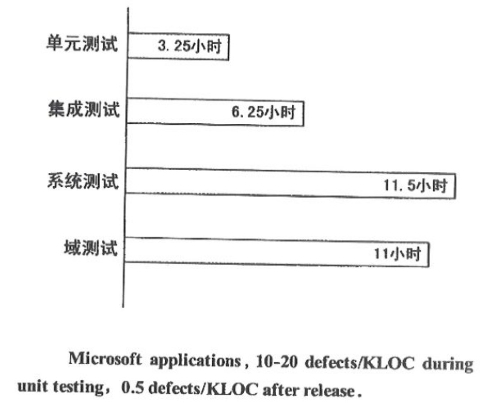
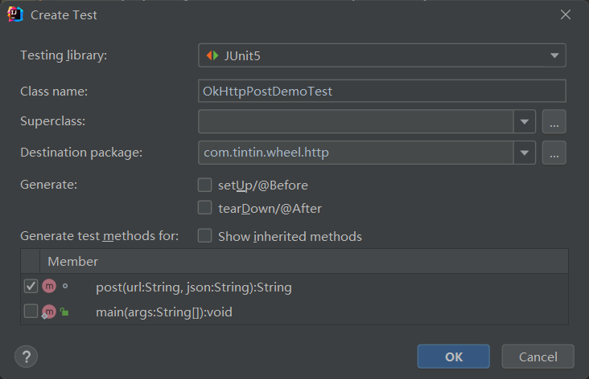
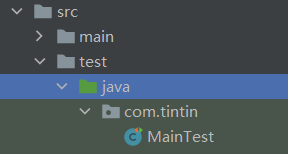
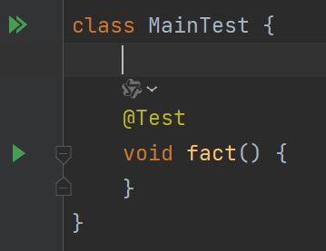
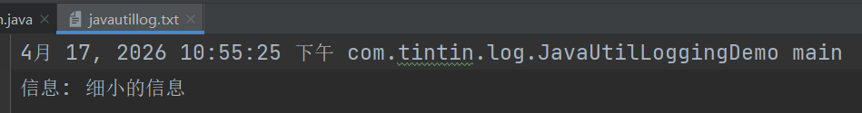
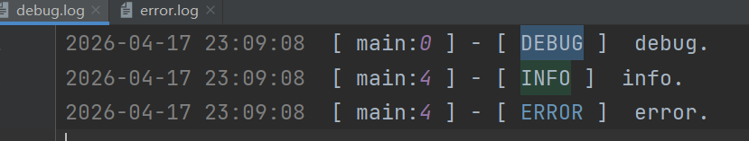
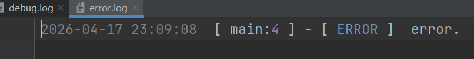

# Java 轮子

## HTTP 组件库

### JDK HttpURLConnection 

使用 java.net.HttpURLConnection 发起 HTTP 请求最大的优点是不需要引入额外的依赖，但是使用起来非常繁琐，也缺乏连接池管理、域名机械控制等特性支持。

简单的 POST 请求实例

```java
apachepublic class HttpUrlConnectionDemo {
    public static void main(String[] args) throws IOException {
        String urlString = "https://httpbin.org/post";
        String bodyString = "xxx";

        URL url = new URL(urlString);
        HttpURLConnection conn = (HttpURLConnection) url.openConnection();
        conn.setRequestMethod("POST");
        conn.setDoOutput(true);

        OutputStream os = conn.getOutputStream();
        os.write(bodyString.getBytes("utf-8"));
        os.flush();
        os.close();

        if (conn.getResponseCode() == HttpURLConnection.HTTP_OK) {
            InputStream is = conn.getInputStream();
            BufferedReader reader = new BufferedReader(new InputStreamReader(is));
            StringBuilder sb = new StringBuilder();
            String line;
            while ((line = reader.readLine()) != null) {
                sb.append(line);
            }
            System.out.println("响应内容:" + sb.toString());
        } else {
            System.out.println("响应码:" + conn.getResponseCode());
        }
    }
}
```

### Apache HttpClient

不过 HttpURLConnection 不支持 HTTP/2.0，为了解决这个问题，Java 9 的时候官方的标准库增加了一个更高级别的 HttpClient，再发起 POST 请求就显得高大上多了，不仅支持异步，还支持顺滑的链式调用。

```java
public class HttpClientDemo {
    public static void main(String[] args) throws URISyntaxException {
        HttpClient client = HttpClient.newHttpClient();
        HttpRequest request = HttpRequest.newBuilder()
                .uri(new URI("https://postman-echo.com/post"))
                .headers("Content-Type", "text/plain;charset=UTF-8")
                .POST(HttpRequest.BodyPublishers.ofString("二哥牛逼"))
                .build();
        client.sendAsync(request, HttpResponse.BodyHandlers.ofString())
                .thenApply(HttpResponse::body)
                .thenAccept(System.out::println)
                .join();
    }
}
```

Apache HttpComponents HttpClient 

基本依赖项：

```xml
		<!--HttpCore 提供了低级别的 HTTP 传输和协议处理功能，HttpClient 依赖于它。-->
        <dependency>
            <groupId>org.apache.httpcomponents</groupId>
            <artifactId>httpcore</artifactId>
            <version>4.4.15</version>
        </dependency>
        <!--HttpClient 这是核心库，用于发送 HTTP 请求和接收响应。-->
        <dependency>
            <groupId>org.apache.httpcomponents</groupId>
            <artifactId>httpclient</artifactId>
            <version>4.5.14</version>
        </dependency>
```

简单的 POST 请求实例

```java
public class HttpComponentsDemo {
    public static void main(String[] args) throws IOException, IOException, ParseException {
        try (CloseableHttpClient httpclient = HttpClients.createDefault()) {
            HttpPost httpPost = new HttpPost("https://httpbin.org/post");
            List<NameValuePair> nvps = new ArrayList<>();
            nvps.add(new BasicNameValuePair("name", "二哥"));
            httpPost.setEntity(new UrlEncodedFormEntity(nvps, Charset.forName("UTF-8")));

            try (CloseableHttpResponse response2 = httpclient.execute(httpPost)) {
                System.out.println(response2.getStatusLine() + " " + EntityUtils.toString(response2.getEntity()));
            }
        }
    }
}
```

### OkHttp

OkHttp 是一个执行效率比较高的 HTTP 客户端：

基本依赖项：

```xml
		<!--okhttp3-->
        <dependency>
            <groupId>com.squareup.okhttp3</groupId>
            <artifactId>okhttp</artifactId>
            <version>4.9.1</version>
        </dependency>
        <dependency>
            <groupId>commons-io</groupId>
            <artifactId>commons-io</artifactId>
            <version>2.5</version>
        </dependency>
```

简单的 POST 请求实例

```java
public class OkHttpPostDemo {
    public static final MediaType JSON = MediaType.get("application/json; charset=utf-8");

    OkHttpClient client = new OkHttpClient();

    String post(String url, String json) throws IOException {
        RequestBody body = RequestBody.create(json, JSON);
        Request request = new Request.Builder()
                .url(url)
                .post(body)
                .build();
        try (Response response = client.newCall(request).execute()) {
            return response.body().string();
        }
    }

    public static void main(String[] args) throws IOException {
        OkHttpPostDemo example = new OkHttpPostDemo();
        String json = "{'name':'二哥'}";
        String response = example.post("https://httpbin.org/post", json);
        System.out.println(response);
    }
}
```

## 单元测试框架

### Junit

单元测试可以确保你编写的代码是符合软件需求和遵循开发规范的。单元测试是所有测试中最底层的一类测试，是第一个环节，也是最重要的一个环节，是唯一一次能够达到代码覆盖率 100% 的测试，是整个软件测试过程的基础和前提。可以这么说，单元测试的性价比是最好的。



最初的测试，要测试 `fact()` 方法正确性，你在 `main()` 方法中编写了一段测试代码。

```java
public class Main {
    public static long fact(long n) {
        long r = 1;
        for (long i = 1; i <= n; i++) {
            r = r * i;
        }
        return r;
    }

    public static void main(String[] args) {
        if (fact(3) == 6) {
            System.out.println("通过");
        } else {
            System.out.println("失败");
        }
    }
}
```

缺点：

1. 测试代码没有和源代码分开。
2. 不够灵活，很难编写一组通用的测试代码。
3. 无法自动打印出预期和实际的结果，没办法比对。

使用 JUnit 可以非常简单地组织测试代码，并随时运行它们，还能给出准确的测试报告，让你在最短的时间内发现自己编写的代码到底哪里出了问题。

按下 `alt+insert` 键，菜单选择 `test`



IDEA 会自动在 **测试代码目录** 的当前类所在的包下生成一个类名带 Test（惯例）的测试类。





IDEA 会提示导入依赖包。

```xml
		<dependency>
            <groupId>org.junit.jupiter</groupId>
            <artifactId>junit-jupiter</artifactId>
            <version>RELEASE</version>
            <scope>test</scope>
        </dependency>
```

Junit 要求 `@Test` 注解，带有 `@Test` 的方法识别为测试方法。在测试方法内部，可以使用 `assertEquals()` 对期望的值和实际的值进行比对。

```java
	@Test
    void fact() {
        assertEquals(1, Main.fact(1));
        assertEquals(2, Main.fact(2));
        assertEquals(6, Main.fact(3));
        assertEquals(100, Main.fact(5));
    }
```

**瞻前顾后**

勾选 `setUp()` 和 `tearDown()`

```java
	@BeforeEach
    void setUp() {
    }

    @AfterEach
    void tearDown() {
    }
```

`@BeforeEach` 的 `setUp()` 方法会在运行每个 `@Test` 方法之前运行；`@AfterEach` 的 `tearDown()` 方法会在运行每个 `@Test` 方法之后运行。

与之对应的还有 `@BeforeAll` 和 `@AfterAll`，与 `@BeforeEach` 和 `@AfterEach` 不同的是，All 通常用来初始化和销毁静态变量。

**异常测试**

对于 Java 程序来说，异常处理也非常的重要。对于可能抛出的异常进行测试，本身也是测试的一个重要环节。

```java
@Test
void factIllegalArgument() {
    assertThrows(IllegalArgumentException.class, new Executable() {
        @Override
        public void execute() throws Throwable {
            Factorial.fact(-2);
        }
    });
}
```

**忽略测试**

有时候，由于某些原因，某些方法产生了 bug，需要一段时间去修复，在修复之前，该方法对应的测试用例一直是以失败告终的，为了避免这种情况，我为你提供了 `@Disabled` 注解。

```java
class DisabledTestsDemo {

    @Disabled("该测试用例不再执行，直到编号为 43 的 bug 修复掉")
    @Test
    void testWillBeSkipped() {
    }

    @Test
    void testWillBeExecuted() {
    }

}
```

**条件测试**

有时候，需要在某些条件下运行测试方法，有些条件下不运行测试方法。针对这场使用场景，Junit 提供了条件测试。

不同的操作系统，可能需要不同的测试用例

```java
@Test
@EnabledOnOs(MAC)
void onlyOnMacOs() {
    // ...
}

@TestOnMac
void testOnMac() {
    // ...
}

@Test
@EnabledOnOs({ LINUX, MAC })
void onLinuxOrMac() {
    // ...
}

@Test
@DisabledOnOs(WINDOWS)
void notOnWindows() {
    // ...
}
```

不同的 Java 运行环境，可能也需要不同的测试用例。

```java
@Test
@EnabledOnJre(JAVA_8)
void onlyOnJava8() {
    // ...
}

@Test
@EnabledOnJre({ JAVA_9, JAVA_10 })
void onJava9Or10() {
    // ...
}

@Test
@EnabledForJreRange(min = JAVA_9, max = JAVA_11)
void fromJava9to11() {
    // ...
}
```

## JSON 解析库

### 阿里巴巴 fastjson

依赖

```xml
<dependency>
    <groupId>com.alibaba</groupId>
    <artifactId>fastjson</artifactId>
    <version>1.2.58</version>
</dependency>
```

`toJSONString()` 方法用来序列化，`parseObject()` 方法用来反序列化。

```java
class People {
    private int age;
    private String name;
    private Date birthday;
    
     public static void main(String[] args) {
        People people = new People();
        people.setAge(0);
        people.setName("丁丁");
        people.setBirthday(new Date());

        String json = JSON.toJSONString(people);
        System.out.println(json);
    }
}
// {"age":18,"birthday":1776433586134,"name":"沉默王二"}
```

`@JSONField` 注解，name 用来指定字段的名称，format 用来指定日期格式，serialize 和 deserialize 用来指定是否序列化和反序列化。

```java
public class People {
    @JSONField(name = "Years of life")
    private int age;
    @JSONField(serialize = false,deserialize = true)
    private String name;
    @JSONField(format = "yyyy年MM月dd日")
    private Date birthday;
    
    public static void main(String[] args) {
        People people = new People();
        people.setAge(0);
        people.setName("丁丁");
        people.setBirthday(new Date());
        String json = JSON.toJSONString(people);
        System.out.println(json);
        
        JSONObject jsonObject = new JSONObject();
        jsonObject.put("name", "丁丁");
        jsonObject.put("age", 0);
        jsonObject.put("birthday", new Date());
        String json2 = JSON.toJSONString(jsonObject);
        People people2 = JSON.parseObject(json2, People.class);
        System.out.println(people2);
    }
}

//{"Years of life":0,"birthday":"2026年04月17日"}
//People{age=0, name='丁丁', birthday=Fri Apr 17 21:53:54 CST 2026}
```

为了满足更多个性化的需求， SerializerFeature 类中定义了很多特性，你可以在调用 `toJSONString()` 方法的时候进行指定。

- PrettyFormat，让 JSON 格式打印得更漂亮一些
- WriteClassName，输出类名
- UseSingleQuotes，key 使用单引号
- WriteNullListAsEmpty，List 为空则输出 []
- WriteNullStringAsEmpty，String 为空则输出“”

### Google Gson

### Spring Boot 默认 Jackson

## 日志框架

在本地环境下，使用 `System.out.println()` 打印日志是没问题的，可以在控制台看到信息。但如果是在生产环境下的话，控制台打印出的信息并没有保存到日志文件中，只能即时查看。所以就需要更高级的日志记录 API（比如 Log4j 和 java.util.logging）。

**错误的日志记录方式会影响性能**

因为日志记录的次数越多，意味着执行文件 IO 操作的次数就越多，这也就意味着会影响到程序的性能

### Log4j

`java.util.logging` 属于原生的日志 API，Log4j 属于第三方类库，建议使用 Log4j，因为 Log4j 更好用。Log4j 不需要重新启动 Java 程序就可以调整日志的记录级别，非常灵活。Log4j 可以通过 log4j.properties 文件来配置 Log4j 的日志级别、输出环境、日志文件的记录方式。

Log4j 还是线程安全的，可以在多线程的环境下放心使用。

基于 Log4j 的日志级别

* DEBUG 的级别最低，当需要打印调试信息的话，就用这个级别，不建议在生产环境下使用。
* INFO 的级别高一些，当一些重要的信息需要打印的时候，就用这个。
* WARN，用来记录一些警告类的信息，比如说客户端和服务端的连接断开了，数据库连接丢失了。
* ERROR 比 WARN 的级别更高，用来记录错误或者异常的信息。
* FATAL，当程序出现致命错误的时候使用，这意味着程序可能非正常中止了。
* OFF，最高级别，意味着所有消息都不会输出了。

 java.util.logging 的使用方式：

```java
package com.itwanger;

import java.io.IOException;
import java.util.logging.FileHandler;
import java.util.logging.Logger;
import java.util.logging.SimpleFormatter;


public class JavaUtilLoggingDemo {
    public static void main(String[] args) throws IOException {
        Logger logger = Logger.getLogger("test");
        FileHandler fileHandler = new FileHandler("javautillog.txt");
        fileHandler.setFormatter(new SimpleFormatter());
        logger.addHandler(fileHandler);
        logger.info("细小的信息");
    }
}
```

程序运行后会在 target 目录下生成一个名叫 javautillog.txt 的文件



Log4j 依赖

```xml
<dependency>
    <groupId>log4j</groupId>
    <artifactId>log4j</artifactId>
    <version>1.2.17</version>
</dependency>
```

在 resources 目录下创建 log4j.properties 文件

```properties
### 设置###
log4j.rootLogger = debug,stdout,D,E

### 输出信息到控制台 ###
log4j.appender.stdout = org.apache.log4j.ConsoleAppender
log4j.appender.stdout.Target = System.out
log4j.appender.stdout.layout = org.apache.log4j.PatternLayout
log4j.appender.stdout.layout.ConversionPattern = [%-5p] %d{yyyy-MM-dd HH:mm:ss,SSS} method:%l%n%m%n

### 输出DEBUG 级别以上的日志到=debug.log ###
log4j.appender.D = org.apache.log4j.DailyRollingFileAppender
log4j.appender.D.File = debug.log
log4j.appender.D.Append = true
log4j.appender.D.Threshold = DEBUG 
log4j.appender.D.layout = org.apache.log4j.PatternLayout
log4j.appender.D.layout.ConversionPattern = %d{yyyy-MM-dd HH:mm:ss}  [ %t:%r ] - [ %p ]  %m%n

### 输出ERROR 级别以上的日志到=error.log ###
log4j.appender.E = org.apache.log4j.DailyRollingFileAppender
log4j.appender.E.File =error.log 
log4j.appender.E.Append = true
log4j.appender.E.Threshold = ERROR 
log4j.appender.E.layout = org.apache.log4j.PatternLayout
log4j.appender.E.layout.ConversionPattern = %d{yyyy-MM-dd HH:mm:ss}  [ %t:%r ] - [ %p ]  %m%n
```

1. 配置根 Logger

   ```
   log4j.rootLogger = [ level ] , appenderName, appenderName, …
   ```

   level 就是日志的优先级，从高到低依次是 **ERROR、WARN、INFO、DEBUG**。如果这里定义的是 INFO，那么低级别的 DEBUG 日志信息将不会打印出来。

   appenderName 就是指把日志信息输出到什么地方，可以指定多个地方，当前的配置文件中有 3 个地方，分别是 stdout、D、E。

2. 配置日志输出的目的地

   ```
   log4j.appender.appenderName = fully.qualified.name.of.appender.class  
   
   log4j.appender.appenderName.option1 = value1  
   …  
   log4j.appender.appenderName.option = valueN
   ```

   Log4j 提供的目的地有下面 5 种：

   - org.apache.log4j.ConsoleAppender：控制台
   - org.apache.log4j.FileAppender：文件
   - org.apache.log4j.DailyRollingFileAppender：每天产生一个文件
   - org.apache.log4j.RollingFileAppender：文件大小超过阈值时产生一个新文件
   - org.apache.log4j.WriterAppender：将日志信息以流格式发送到任意指定的地方

3. 配置日志信息的格式

   ```
   log4j.appender.appenderName.layout = fully.qualified.name.of.layout.class  
   log4j.appender.appenderName.layout.option1 = value1  
   …  
   log4j.appender.appenderName.layout.option = valueN
   ```

   Log4j 提供的格式有下面 4 种：

   - org.apache.log4j.HTMLLayout：HTML 表格
   - org.apache.log4j.PatternLayout：自定义
   - org.apache.log4j.SimpleLayout：包含日志信息的级别和信息字符串
   - org.apache.log4j.TTCCLayout：包含日志产生的时间、线程、类别等等信息

   自定义格式的参数如下所示：

   - %m：输出代码中指定的消息
   - %p：输出优先级
   - %r：输出应用启动到输出该日志信息时花费的毫秒数
   - %c：输出所在类的全名
   - %t：输出该日志所在的线程名
   - %n：输出一个回车换行符
   - %d：输出日志的时间点
   - %l：输出日志的发生位置，包括类名、线程名、方法名、代码行数，比如：`method:com.itwanger.Log4jDemo.main(Log4jDemo.java:14)`

示例

```java
package com.itwanger;

import org.apache.log4j.LogManager;
import org.apache.log4j.Logger;


public class Log4jDemo {
    private static final Logger logger = LogManager.getLogger(Log4jDemo.class);

    public static void main(String[] args) {
        // 记录debug级别的信息
        logger.debug("debug.");

        // 记录info级别的信息
        logger.info("info.");

        // 记录error级别的信息
        logger.error("error.");
    }
}
```

程序运行后会在 target 目录下生成两个文件





技巧

1. 对于 DEBUG 级别的日志来说，一定要使用下面的方式来记录：

   ```java
   if(logger.isDebugEnabled()){ 
       logger.debug("DEBUG 是开启的"); 
   }
   ```

   如果我们在打印日志信息的时候需要附带一个方法去获取参数值，就像下面这样：

   

   ```java
   logger.debug("用户名是：" + getName());
   ```

   假如 `getName()` 方法需要耗费的时间长达 6 秒，那完了！尽管配置文件里的日志级别定义的是 INFO，`getName()` 方法仍然会倔强地执行 6 秒，完事后再 `debug()`，这就很崩了！明明 INFO 的时候 `debug()` 是不执行的，意味着 `getName()` 也不需要执行的

2. 慎重选择日志信息的打印级别，打印得太多，会影响到程序的性能。

3. 使用 Log4j 而不是 `System.out` 等

4. 使用 log4j.properties 文件来配置日志

5. 在打印日志的时候带上类的全名和线程名，在多线程环境下，便于定位问题

6. 打印日志信息的时候尽量要完整，

7. 要对日志信息加以区分，把某一类的日志信息在输出的时候加上前缀，

8. 不要在日志文件中打印敏感信息

### Logback

Spring Boot 的默认日志框架使用的是 Logback。

### SLF4J

SLF4J 是 Simple Logging Facade for Java 的缩写（for≈4），也就是简易的日志门面，以外观模式（Facade pattern，一种设计模式，为子系统中的一组接口提供一个统一的高层接口，使得子系统更容易使用）实现，支持 java.util.logging、Log4J 和 Logback。

### Log4j2

Apache 维护的一款高性能日志记录工具

## JDBC 

### Druid

Druid 是阿里巴巴开源的数据库连接池实现，提供了强大的性能监控和扩展功能。

引入依赖

```xml
<!-- JDBC 驱动 -->
<dependency>
    <groupId>com.mysql</groupId>
    <artifactId>mysql-connector-j</artifactId>
    <version>8.0.31</version>
</dependency>
<!-- druid 连接池 -->
<dependency>
    <groupId>com.alibaba</groupId>
    <artifactId>druid</artifactId>
    <version>1.2.8</version>
</dependency>
```

连接池配置

```properties
# Druid连接池配置
druid.driverClassName=com.mysql.cj.jdbc.Driver
druid.url=jdbc:mysql://192.168.1.117:33306/tintin_test?useSSL=false&serverTimezone=Asia/Shanghai&characterEncoding=utf-8
druid.username=root
druid.password=123456

# 初始连接数
druid.initialSize=5
# 最小空闲连接数
druid.minIdle=10
# 最大活跃连接数
druid.maxActive=20
# 获取连接超时时间(毫秒)
druid.maxWait=60000
# 配置间隔多久才进行一次检测，检测需要关闭的空闲连接，单位毫秒
druid.timeBetweenEvictionRunsMillis=60000
# 配置连接在池中的最小生存时间
druid.minEvictableIdleTimeMillis=300000
# 检测连接是否有效的SQL
druid.validationQuery=SELECT 1
# 是否开启空闲连接检测
druid.testWhileIdle=true
# 是否在获取连接时检测连接有效性
druid.testOnBorrow=false
# 是否在归还连接时检测连接有效性
druid.testOnReturn=false
# 是否缓存PreparedStatement
druid.poolPreparedStatements=true
# 缓存PreparedStatement的最大数量
druid.maxPoolPreparedStatementPerConnectionSize=20
```

JDBC 工具类

```java
package com.tintin.tintinheadlinesys.util;

/**
 * JDBC工具类 - 基于Druid连接池
 */
public class JDBCUtils {

    private static final Logger logger = LoggerFactory.getLogger(JDBCUtils.class);

    private static DataSource dataSource = null;
    private static final ThreadLocal<Connection> threadLocal = new ThreadLocal<>();

    // 静态代码块加载配置文件和初始化连接池
    static {
        try {
            // 加载配置文件
            Properties props = new Properties();
            InputStream is = JDBCUtils.class.getClassLoader()
                    .getResourceAsStream("jdbc.properties");

            if (is == null) {
                throw new RuntimeException("未找到jdbc.properties配置文件");
            }

            props.load(is);

            // 创建Druid数据源
            dataSource = DruidDataSourceFactory.createDataSource(props);

            logger.info("Druid连接池初始化成功");

        } catch (Exception e) {
            logger.error("Druid连接池初始化失败", e);
            throw new ExceptionInInitializerError("数据库连接池初始化失败: " + e.getMessage());
        }
    }

    /**
     * 获取数据源
     */
    public static DataSource getDataSource() {
        return dataSource;
    }

    /**
     * 获取数据库连接
     */
    public static Connection getConnection() throws SQLException {
        // 先从ThreadLocal中获取
        Connection conn = threadLocal.get();
        if (conn == null) {
            // 从连接池获取连接
            conn = dataSource.getConnection();
            threadLocal.set(conn);
        }
        return conn;
    }

    /**
     * 开启事务
     */
    public static void beginTransaction() throws SQLException {
        Connection conn = getConnection();
        if (conn.getAutoCommit()) {
            conn.setAutoCommit(false);
        }
    }

    /**
     * 提交事务
     */
    public static void commitTransaction() throws SQLException {
        Connection conn = threadLocal.get();
        if (conn != null && !conn.getAutoCommit()) {
            conn.commit();
        }
    }

    /**
     * 回滚事务
     */
    public static void rollbackTransaction() throws SQLException {
        Connection conn = threadLocal.get();
        if (conn != null && !conn.getAutoCommit()) {
            conn.rollback();
        }
    }

    /**
     * 关闭连接并移除ThreadLocal
     */
    public static void closeConnection() {
        Connection conn = threadLocal.get();
        if (conn != null) {
            try {
                if (!conn.getAutoCommit()) {
                    conn.setAutoCommit(true);
                }
                conn.close();
            } catch (SQLException e) {
                logger.error("关闭连接失败", e);
            } finally {
                threadLocal.remove();
            }
        }
    }

    /**
     * 关闭资源
     */
    public static void closeResource(ResultSet rs, PreparedStatement pstmt, Connection conn) {
        try {
            if (rs != null) {
                rs.close();
            }
        } catch (SQLException e) {
            logger.error("关闭ResultSet失败", e);
        }

        try {
            if (pstmt != null) {
                pstmt.close();
            }
        } catch (SQLException e) {
            logger.error("关闭PreparedStatement失败", e);
        }

        try {
            if (conn != null && conn != threadLocal.get()) {
                conn.close();
            }
        } catch (SQLException e) {
            logger.error("关闭Connection失败", e);
        }
    }

    /**
     * 关闭资源（简化版，自动处理ThreadLocal连接）
     */
    public static void closeResource(ResultSet rs, PreparedStatement pstmt) {
        closeResource(rs, pstmt, null);
    }
}
```

通用 DAO 基类

```java
/**
 * 通用DAO基类
 */
public class BaseDAO<T> {

    /**
     * 通用的增删改方法
     */
    public int update(String sql, Object... params) {
        Connection conn = null;
        PreparedStatement pstmt = null;
        int rows = 0;

        try {
            conn = JDBCUtils.getConnection();
            pstmt = conn.prepareStatement(sql);

            // 设置参数
            for (int i = 0; i < params.length; i++) {
                pstmt.setObject(i + 1, params[i]);
            }

            return pstmt.executeUpdate();

        } catch (SQLException e) {
            e.printStackTrace();
        } finally {
            JDBCUtils.closeResource(null, pstmt);
        }
        return rows;
    }

    /**
     * 查询单个对象
     */
    public T queryForObject(Class<T> clazz, String sql, Object... params) {
        List<T> list = queryForList(clazz, sql, params);
        return list.isEmpty() ? null : list.get(0);
    }

    /**
     * 查询多个对象
     */
    public List<T> queryForList(Class<T> clazz, String sql, Object... params) {
        Connection conn = null;
        PreparedStatement pstmt = null;
        ResultSet rs = null;
        List<T> list = new ArrayList<>();

        try {
            conn = JDBCUtils.getConnection();
            pstmt = conn.prepareStatement(sql);

            for (int i = 0; i < params.length; i++) {
                pstmt.setObject(i + 1, params[i]);
            }

            rs = pstmt.executeQuery();

            // 获取结果集元数据
            ResultSetMetaData metaData = rs.getMetaData();
            int columnCount = metaData.getColumnCount();

            while (rs.next()) {
                if (Map.class.isAssignableFrom(clazz)) {
                    Constructor<T> declaredConstructor;
                    T entity;
                    Map<String, Object> map;
                    try {
                        declaredConstructor = clazz.getDeclaredConstructor();
                        entity = declaredConstructor.newInstance();
                        map = (Map<String, Object>) entity;
                    } catch (NoSuchMethodException e) {
                        map = new HashMap<>();
                        entity = (T) map;
                    }

                    for (int i = 1; i <= columnCount; i++) {
                        String columnName = metaData.getColumnLabel(i);
                        Object value = rs.getObject(i);
                        map.put(toCamelCase(columnName), value);
                    }
                    list.add(entity);
                    continue;
                }
                T entity = clazz.getDeclaredConstructor().newInstance();
                for (int i = 1; i <= columnCount; i++) {
                    String columnName = metaData.getColumnLabel(i);
                    Object value = rs.getObject(i);

                    // 使用反射设置属性值
                    Field field = clazz.getDeclaredField(toCamelCase(columnName));
                    field.setAccessible(true);
                    field.set(entity, value);
                }
                list.add(entity);
            }

        } catch (Exception e) {
            e.printStackTrace();
        } finally {
            JDBCUtils.closeResource(rs, pstmt);
        }

        return list;
    }

    /**
     * 获取单个值（如count、sum等）
     */
    public <E> E getSingleValue(String sql, Object... params) {
        Connection conn = null;
        PreparedStatement pstmt = null;
        ResultSet rs = null;

        try {
            conn = JDBCUtils.getConnection();
            pstmt = conn.prepareStatement(sql);

            for (int i = 0; i < params.length; i++) {
                pstmt.setObject(i + 1, params[i]);
            }

            rs = pstmt.executeQuery();

            if (rs.next()) {
                return (E) rs.getObject(1);
            }

        } catch (SQLException e) {
            e.printStackTrace();
        } finally {
            JDBCUtils.closeResource(rs, pstmt);
        }

        return null;
    }

    /**
     * 将数据库字段名转换为驼峰命名
     */
    private String toCamelCase(String columnName) {
        StringBuilder result = new StringBuilder();
        String[] parts = columnName.split("_");

        for (int i = 0; i < parts.length; i++) {
            if (i == 0) {
                result.append(parts[i]);
            } else {
                result.append(parts[i].substring(0, 1).toUpperCase())
                        .append(parts[i].substring(1).toLowerCase());
            }
        }

        return result.toString();
    }
}
```

## ORM 框架

对象关系映射（Object Relational Mapping，简称 ORM）是一种程序设计技术，用于在面向对象编程语言和关系数据库之间进行数据转换。ORM 的核心思想是通过创建一个“虚拟对象数据库”，使开发者可以使用面向对象的方式操作数据库，而不需要直接编写复杂的 SQL 语句。

## 加密

### MessageDigest

MessageDigest 类是 Java 提供的一个安全特性，用于生成数据的哈希值，如 MD5 或 SHA 算法。这个类可以接受任意大小的数据输入，并产生一个固定长度的哈希值，通常被称为数据的“数字指纹”。

```java
/**
 * 加密工具类
 * 提供MD5、SHA系列、Base64等常用加密方法
 */
public class EncryptUtils {

    private static final String CHARSET_UTF8 = "UTF-8";
    
    /*********************************** 加密 ************************************/
    /**
     * MD5加密（返回32位小写十六进制字符串）
     * @param input 待加密字符串
     * @return MD5加密后的字符串
     */
    public static String md5(String input) {
        return hash(input, "MD5");
    }

    /**
     * 带盐值的MD5加密
     * @param input 待加密字符串
     * @param salt 盐值
     * @return MD5加密后的字符串
     */
    public static String md5WithSalt(String input, String salt) {
        if (input == null) {
            return null;
        }
        String toEncrypt = input + (salt == null ? "" : salt);
        return md5(toEncrypt);
    }

    /**
     * 双重MD5加密
     * @param input 待加密字符串
     * @return 双重MD5加密后的字符串
     */
    public static String doubleMd5(String input) {
        if (input == null) {
            return null;
        }
        return md5(md5(input));
    }

    /**
     * SHA-1加密（返回40位小写十六进制字符串）
     * @param input 待加密字符串
     * @return SHA-1加密后的字符串
     */
    public static String sha1(String input) {
        return hash(input, "SHA-1");
    }

    /**
     * SHA-256加密（返回64位小写十六进制字符串）
     * @param input 待加密字符串
     * @return SHA-256加密后的字符串
     */
    public static String sha256(String input) {
        return hash(input, "SHA-256");
    }

    /**
     * SHA-512加密（返回128位小写十六进制字符串）
     * @param input 待加密字符串
     * @return SHA-512加密后的字符串
     */
    public static String sha512(String input) {
        return hash(input, "SHA-512");
    }

    /**
     * 通用哈希加密方法
     * @param input 待加密字符串
     * @param algorithm 算法名称（MD5、SHA-1、SHA-256等）
     * @return 加密后的十六进制字符串
     */
    private static String hash(String input, String algorithm) {
        if (input == null || input.isEmpty()) {
            return null;
        }
        try {
            MessageDigest md = MessageDigest.getInstance(algorithm);
            byte[] digest = md.digest(input.getBytes(CHARSET_UTF8));
            return bytesToHex(digest);
        } catch (Exception e) {
            throw new RuntimeException(algorithm + "加密失败", e);
        }
    }

    /**
     * 字节数组转十六进制字符串
     * @param bytes 字节数组
     * @return 十六进制字符串
     */
    private static String bytesToHex(byte[] bytes) {
        StringBuilder sb = new StringBuilder();
        for (byte b : bytes) {
            String hex = Integer.toHexString(b & 0xFF);
            if (hex.length() == 1) {
                sb.append('0');
            }
            sb.append(hex);
        }
        return sb.toString();
    }

    /*********************************** Base64 ************************************/
    /**
     * Base64编码
     * @param input 待编码字符串
     * @return Base64编码后的字符串
     */
    public static String base64Encode(String input) {
        if (input == null) {
            return null;
        }
        try {
            return Base64.getEncoder().encodeToString(input.getBytes(CHARSET_UTF8));
        } catch (Exception e) {
            throw new RuntimeException("Base64编码失败", e);
        }
    }

    /**
     * Base64解码
     * @param input Base64编码的字符串
     * @return 解码后的字符串
     */
    public static String base64Decode(String input) {
        if (input == null) {
            return null;
        }
        try {
            byte[] decodedBytes = Base64.getDecoder().decode(input);
            return new String(decodedBytes, CHARSET_UTF8);
        } catch (Exception e) {
            throw new RuntimeException("Base64解码失败", e);
        }
    }

    /*********************************** 验证 ************************************/
    /**
     * 验证MD5
     * @param plainText 原文
     * @param md5Text MD5密文
     * @return 是否匹配
     */
    public static boolean verifyMd5(String plainText, String md5Text) {
        return verify(plainText, md5Text, "MD5");
    }

    /**
     * 验证SHA-256
     * @param plainText 原文
     * @param sha256Text SHA-256密文
     * @return 是否匹配
     */
    public static boolean verifySha256(String plainText, String sha256Text) {
        return verify(plainText, sha256Text, "SHA-256");
    }

    /**
     * 验证原文与加密后的密文是否匹配（支持MD5、SHA系列）
     * @param plainText 原文
     * @param encryptedText 加密后的密文
     * @param algorithm 算法名称
     * @return 是否匹配
     */
    public static boolean verify(String plainText, String encryptedText, String algorithm) {
        if (plainText == null || encryptedText == null) {
            return false;
        }
        String encrypted = hash(plainText, algorithm);
        return encrypted != null && encrypted.equals(encryptedText);
    }
}
```


# 惯用代码

## 根目录资源加载

```java
public class LoadResourceDemo {
    // 从根目录找 无需加 /
    public InputStream getStreamByClassLoader(String path) {
        return this.getClass().getClassLoader().getResourceAsStream(path);
    }

    public URL getURLByClassLoader(String path) {
        return this.getClass().getClassLoader().getResource(path);
    }

    // 不加 / 表示从当前类所在的包找， 加 / 表示从根目录找
    public InputStream getStreamByClass(String path) {
        return this.getClass().getResourceAsStream(path);
    }

    public URL getURLByClass(String path) {
        return this.getClass().getResource(path);
    }

    // 以加载properties文件为例
    public static void main(String[] args) throws IOException {
        LoadResourceDemo demo = new LoadResourceDemo();
        InputStream inputStream = demo.getStreamByClassLoader("jdbc.properties");
        Properties properties = new Properties();
        properties.load(inputStream);
        System.out.println(properties);
    }
}

```

## Web 项目公共 JSON 响应结果类

```java
package com.tintin.demoschedulesystem.common;

import java.io.Serializable;
import java.time.LocalDateTime;
import java.time.format.DateTimeFormatter;

/**
 * 统一 API 响应结果封装
 * @param <T> 数据类型
 */
public class Result<T> implements Serializable {

    private static final long serialVersionUID = 1L;

    // 默认成功码
    private static final int DEFAULT_SUCCESS_CODE = 200;
    // 默认失败码
    private static final int DEFAULT_ERROR_CODE = 500;

    // 状态码
    private int code;
    // 提示消息
    private String message;
    // 返回数据
    private T data;

    /**
     * 无参构造（JSON 序列化需要）
     */
    public Result() {

    }

    /**
     * 全参构造（私有，通过工厂方法调用）
     */
    private Result(int code, String message, T data) {
        this.code = code;
        this.message = message;
        this.data = data;
    }

    // ==================== 成功响应 ====================

    public static <T> Result<T> success() {
        return new Result<>(DEFAULT_SUCCESS_CODE, "success", null);
    }

    public static <T> Result<T> success(String message) {
        return new Result<>(DEFAULT_SUCCESS_CODE, message, null);
    }
    public static <T> Result<T> success(T data) {
        return new Result<>(DEFAULT_SUCCESS_CODE, "success", data);
    }

    public static <T> Result<T> success(String message, T data) {
        return new Result<>(DEFAULT_SUCCESS_CODE, message, data);
    }

    // ==================== 失败响应 ====================
    public static <T> Result<T> error() {
        return new Result<>(DEFAULT_ERROR_CODE, "error", null);
    }

    public static <T> Result<T> error(String  message) {
        return new Result<>(DEFAULT_ERROR_CODE, message, null);
    }
    public static <T> Result<T> error(T data) {
        return new Result<>(DEFAULT_ERROR_CODE, "error", data);
    }

    public static <T> Result<T> error(String message, T data) {
        return new Result<>(DEFAULT_ERROR_CODE, message, data);
    }

    // ==================== 链式设置（方便进一步定制） ====================

    public Result<T> code(int code) {
        this.code = code;
        return this;
    }

    public Result<T> message(String message) {
        this.message = message;
        return this;
    }

    public Result<T> data(T data) {
        this.data = data;
        return this;
    }

    // ==================== Getter / Setter ====================

    public int getCode() {
        return code;
    }

    public void setCode(int code) {
        this.code = code;
    }

    public String getMessage() {
        return message;
    }

    public void setMessage(String message) {
        this.message = message;
    }

    public T getData() {
        return data;
    }

    public void setData(T data) {
        this.data = data;
    }


    @Override
    public String toString() {
        return "Result{" +
                "code=" + code +
                ", message='" + message + '\'' +
                ", data=" + data +
                '}';
    }
}
```

## Web 项目跨域处理过滤器

```java
@WebFilter("/*")
public class CrossFilter implements Filter {

    @Override
    public void doFilter(ServletRequest servletRequest, ServletResponse servletResponse, FilterChain filterChain) throws IOException, ServletException {
        HttpServletRequest httpServletRequest = (HttpServletRequest) servletRequest;
        HttpServletResponse httpServletResponse = (HttpServletResponse) servletResponse;
        httpServletResponse.setHeader("Access-Control-Allow-Origin", "*");
        httpServletResponse.setHeader("Access-Control-Allow-Methods", "POST, GET, PUT,OPTIONS, DELETE, HEAD");
        httpServletResponse.setHeader("Access-Control-Max-Age", "3600");
        httpServletResponse.setHeader("Access-Control-Allow-Headers", "access-control-allow-origin, authority, content-type, version-info, X-Requested-With");
        // 如果是跨域预检请求,则直接在此响应200业务码
        if(httpServletRequest.getMethod().equalsIgnoreCase("OPTIONS")){
            WebUtils.writeJson(httpServletResponse,Result.success());
        }else{
            // 非预检请求,放行即可
            filterChain.doFilter(servletRequest, servletResponse);
        }
    }
}
```

> 在MVC框架中，只需要添加 @CrossFilter 注解即可

# 开发技巧

