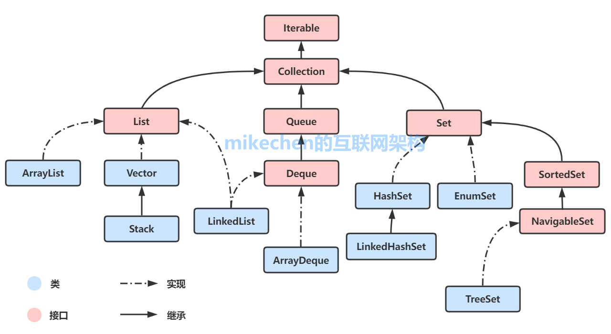
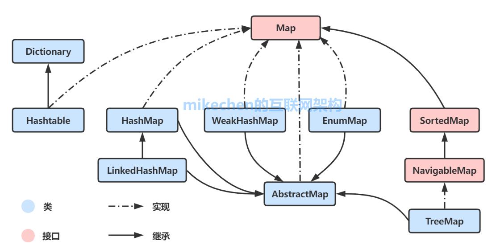
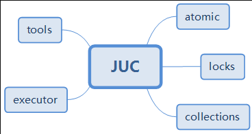
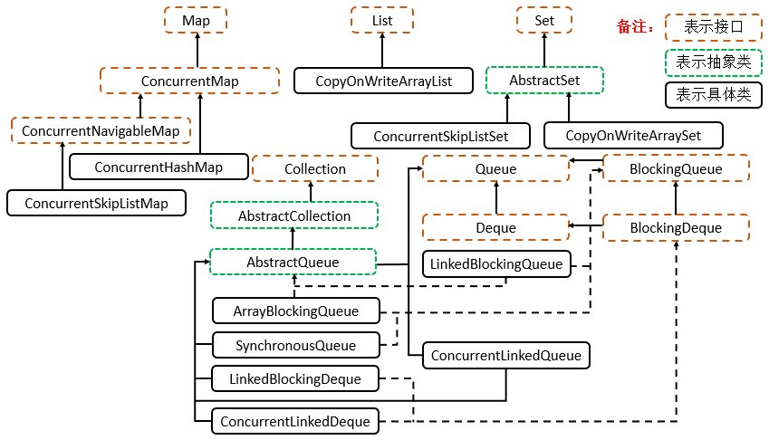
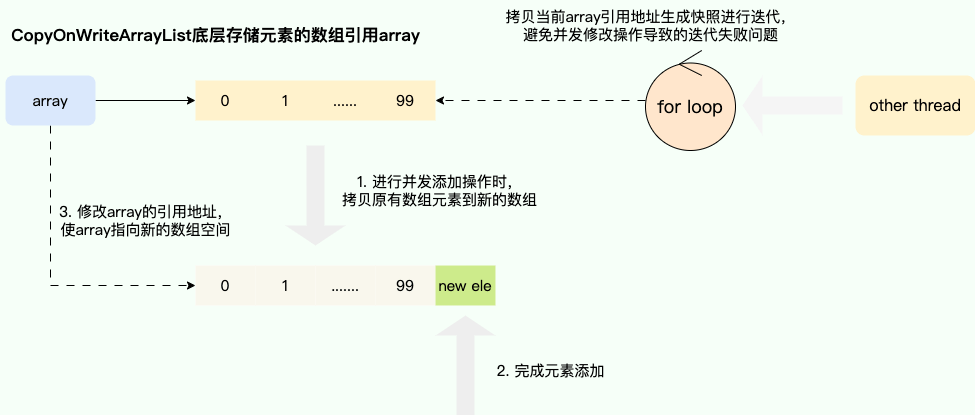
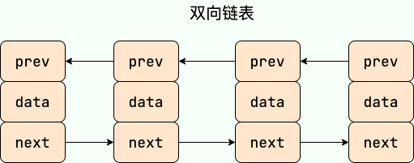
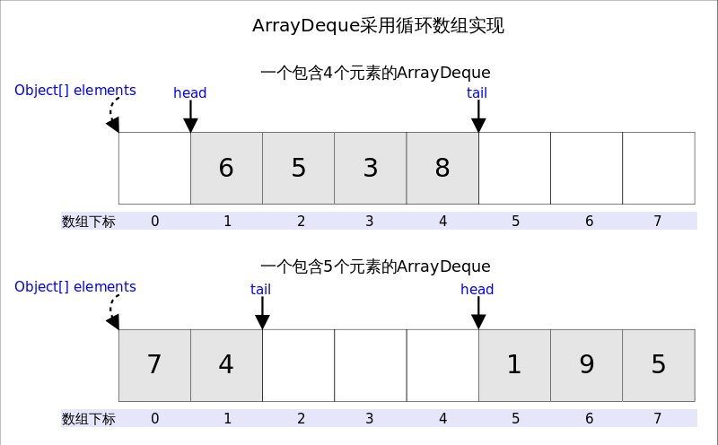
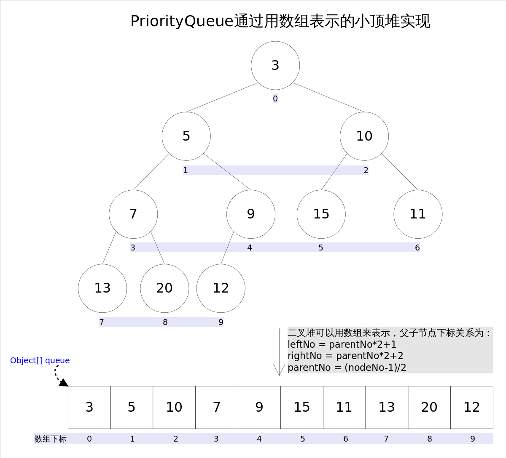
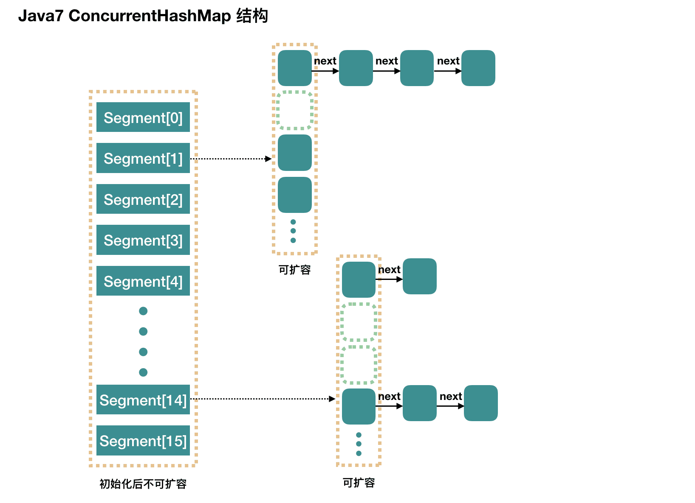
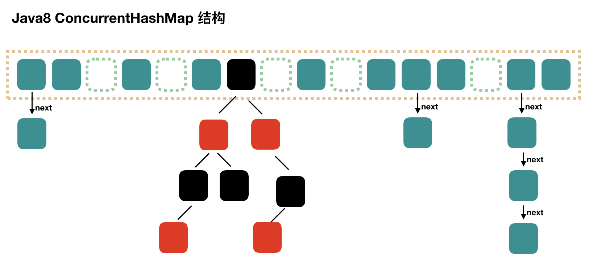

## Java 集合概述

### 重要性

当我们需要存储一组类型相同的数据时，数组是最常用且最基本的容器之一。但数组有如下限制：初始化后大小不可变；只能按索引顺序存取。

与数组相比，Java 集合提供了各种集合类和接口来存储不同类型和数量的对象，具有多样化的操作方式，大小可变、支持泛型、具有内建算法。

Java 集合提高了数据的存储和处理灵活性，可以更好地适应现代软件开发中多样化的数据需求，并支持高质量的代码编写。

### Java 集合定义

在Java中，如果一个Java对象可以在内部持有若干其他Java对象，并对外提供访问接口，我们把这种Java对象称为集合。很显然数组也是一种集合。

> Java集合只能存放引用类型，不能直接存放`int`、`double`等基本数据类型。这是因为集合的设计初衷是存储对象引用，而基本类型的值存储在栈内存中，生命周期短且不具备对象特性。可以使用包装类（Wrapper Class），如`Integer`、`Double`等，将基本类型封装为对象。

### Java 集合框架

Java标准库自带的 java.util 包提供了集合类，主要是由两大接口派生而来：一个是 `Collection`接口，主要用于存放单一元素；另一个是 `Map` 接口，主要用于存放键值对。

如下图所示：

只列举了主要的继承派生关系，并没有列举所有关系，省略了`AbstractList`, `NavigableSet`等抽象类以及其他的一些辅助类





综上，Java集合大致也可分成List、Set、Queue、Map四种接口体系。

### JUC 并发集合

JUC，即 `Java Util Concurrent` 包，在 Java 5.0 添加，目的就是为了更好的支持高并发任务。让开发者进行多线程编程时减少竞争条件和死锁的问题。

**JUC 结构**



**JUC 并发集合框架**

JUC collections 并发集合框架也是从Map、List、Set、Queue、Collection等超级接口中继承而来的。JUC 下的集合包含了一些基本操作，并且变得线程安全。



> [Java并发](../Java并发编程/Java并发编程.md)如线程池、锁、原子类等作为前置知识，本文只对并发集合做一些简单总结。

 ### fail-fast 和 fail-safe 

`fail-fast`（快速失败）和 `fail-safe`（安全失败）是Java集合框架在处理并发修改问题时，两种截然不同的设计哲学和容错策略。

**fail-fast**

快速失败的思想即针对可能发生的异常进行提前表明故障并停止运行，通过尽早的发现和停止错误，降低故障系统级联的风险。

在`java.util`包下的大部分集合（如 `ArrayList`, `HashMap`）是不支持线程安全的，为了能够提前发现并发操作导致线程安全风险，提出通过维护一个`modCount`记录修改的次数，迭代期间通过**比对预期修改次数** `expectedModCount` 和 `modCount` 是否一致来判断是否存在并发操作，从而实现快速失败，由此保证在避免在异常时执行非必要的复杂代码。

**fail-safe**

安全失败的含义，它旨在即使面对意外情况也能恢复并继续运行，这使得它特别适用于不确定或者不稳定的环境。

该思想常运用于并发容器，最经典的实现就是`CopyOnWriteArrayList`的实现，通过写时复制（Copy-On-Write）的思想保证在进行修改操作时复制出一份快照，基于这份快照完成添加或者删除操作后，将`CopyOnWriteArrayList`底层的数组引用指向这个新的数组空间，由此避免迭代时被并发修改所干扰所导致并发操作安全问题，当然这种做法也存在缺点，即进行遍历操作时无法获得实时结果：



## List

List代表了有序可重复集合，可直接根据元素的索引来访问。

常见实现：`ArrayList`、`Vector`、`LinkedList`

### 特点

* 存储的元素是**有序**的（各元素插入的顺序就是各元素的顺序）
* 存储的元素**可重复**的
* 可直接根据元素的**索引**来访问元素。

### ArrayList

`ArrayList` 内部基于**对象数组**实现，天然支持随机访问（`RandomAccess` 接口标识）。

`ArrayList`  中只能存储对象。对于基本类型数据，需要使用其对应的包装类（如 Integer、Double 等）。

`ArrayList` 是 `List` 接口一个实现，支持插入、删除、遍历等常见操作，并且提供了丰富的 API 操作方法，比如 `add()`、`remove()`等。

`ArrayList` 线程不安全，因为集合操作没有加锁。

```java
public class ArrayList<E> extends AbstractList<E> 
	implements List<E>, RandomAccess, Cloneable, java.io.Serializable 
{
    // 存储元素的数组缓冲区
    transient Object[] elementData;
}
```

`ArrayList` 创建时可以指定大小，也可以不指定大小。

`ArrayList` 会根据实际存储的元素动态地扩容，可以避免大量内存浪费。

1. 惰性初始化。不指定容量创建`ArrayList`时，指向一个共享的空数组
2. 首次添加时扩展。当添加第一个元素时，才会真正分配默认容量10的数组。
3. 动态扩容。容量快溢出时，扩容为`原容量 + 原容量 / 2`。

```java
public class ArrayList<E> extends AbstractList<E>
        implements List<E>, RandomAccess, Cloneable, java.io.Serializable 
{
    // 默认初始容量10
    private static final int DEFAULT_CAPACITY = 10;
    
    // 用于空实例的共享空数组
    private static final Object[] DEFAULTCAPACITY_EMPTY_ELEMENTDATA = {};
    
    // 实际元素个数
    private int size;
    
    // 无参构造 不会立即分配 10 个容量的数组，而是指向一个共享的空数组
    public ArrayList() {
        this.elementData = DEFAULTCAPACITY_EMPTY_ELEMENTDATA;
    }
    
    public boolean add(E e) {
    	// 容量检查，接近溢出则进行扩容
        ensureCapacityInternal(size + 1);  // Increments modCount!!
        elementData[size++] = e;
        return true;
    }
    
    // 扩容方法
    private void grow(int minCapacity) {
        // overflow-conscious code
        int oldCapacity = elementData.length;
        int newCapacity = oldCapacity + (oldCapacity >> 1);
        if (newCapacity - minCapacity < 0)
            newCapacity = minCapacity;
        if (newCapacity - MAX_ARRAY_SIZE > 0)
            newCapacity = hugeCapacity(minCapacity);
        // minCapacity is usually close to size, so this is a win:
        elementData = Arrays.copyOf(elementData, newCapacity);
    }
}
```

**与 Array 对比**

* Array 创建时必须指定大小，被创建之后就不能改变长度了。
* Array 不支持泛型，Java 集合框架使用 Java 5 引入的泛型来确保类型安全十分常见。
* Array 既可以直接存储基本类型数据，也可以存储对象。
* Array 只能按照下标访问其中的元素，不具备动态添加、删除元素的能力。

**时间复杂度**

对于插入

* 头部插入：由于需要将所有元素都依次向后移动一个位置，因此时间复杂度是 O(n)。
* 尾部插入：往列表末尾插入元素的时间复杂度是 O(1)，因为它只需要在数组末尾添加一个元素即可；
* 指定位置插入：需要将目标位置之后的所有元素都向后移动一个位置，然后再把新元素放入指定位置。这个过程需要移动平均 n/2 个元素，因此时间复杂度为 O(n)。
* 当容量已达到极限并且需要扩容时，则需要执行一次 O(n) 的操作将原数组复制到新的更大的数组中，然后再执行 O(1) 的操作添加元素。
* 查询：直接根据索引访问元素，时间复杂度是O(1)。

对于删除，计算方式类似，涉及数组元素的移动。

### Vector

`ArrayList` 是 `List` 的主要实现类，底层使用 `Object[]`存储，适用于频繁的查找工作，线程不安全 。

`Vector` 是 `List` 的古老实现类，底层使用`Object[]` 存储，线程安全。

两者操作几乎一样，但是`Vector`是同步的。

```java
public class Vector<E>
    extends AbstractList<E>
    implements List<E>, RandomAccess, Cloneable, java.io.Serializable
{
    protected Object[] elementData;
    
    public synchronized boolean add(E e) {
        ...
    }
}
```

> 随着 Java 并发编程的发展，`Vector` 和 `Stack` 已经被淘汰，推荐使用并发集合类（例如 `ConcurrentHashMap`、`CopyOnWriteArrayList` 等）或者手动实现线程安全的方法来提供安全的多线程操作支持。

### Stack

`Stack` 继承自 `Vector`，是一个后进先出的栈，而 `Vector` 是一个列表。

`Vector` 和 `Stack` 两者都是线程安全的，都是使用 `synchronized` 关键字进行同步处理。

根据栈的定义，知道栈是只允许在一端进行操作的，而 `Stack` 继承了 `Vector` 也就继承了 `Vector` 中所有公有方法，这样的设计破坏了栈这种数据结构的封装。官方都不推荐使用 Stack 类，就是因为这个原因。另一个原因是，`Stack` 线程安全，但在大多数单线程场景下会导致性能开销过大。

```java
class Stack<E> extends Vector<E> {}
```

> Java官方推荐使用 `Deque` 接口及其实现类（如 [ArrayDeque](#ArrayDeque)）来替代 Stack。

### LinkedList

`LinkedList` 基于**双向链表**（JDK1.6 之前为循环链表，JDK1.7 取消了循环）实现。

`LinkedList` 是 `List` 接口的另一个实现，可以根据索引访问集合元素。

`LinkedList` 还实现了 `Deque` 接口，可以当作双端队列来使用，也就是说，既可以当作“栈”使用，又可以当作队列使用。

`LinkedList` 线程不安全，因为集合操作没有加锁。

```java
public class LinkedList<E>
    extends AbstractSequentialList<E>
    implements List<E>, Deque<E>, Cloneable, java.io.Serializable
{

    // jdk1.6，是一个带头结点的双向循环链表 节点为Entry类型
    // 定义了一个不存储数据的头指针，仅作为链表的起点标记
    // 即使是空链表，头指针也存在且header.next = header.previous = header; 
    // 如果不是空链表，最后一个节点的 next 指向 head，而 head 的 prev 指向最后一个节点
    // 形成一个环
    // transient Entry<E> hedaer;
    
    
    // jdk1.7及以后，是一个普通的双向链表 节点为Node类型
    // 指向第一个节点 可以作为访问链表的起始位置
    transient Node<E> first;

    // 指向最后一个节点 可以作为访问链表的起始位置
    transient Node<E> last;
    
    // 双向链表节点
    private static class Node<E> {
        E item; // 元素
        Node<E> next; // 指向下一个节点
        Node<E> prev; // 指向上一个节点

        Node(Node<E> prev, E element, Node<E> next) {
            this.item = element;
            this.next = next;
            this.prev = prev;
        }
    }
}
```



**时间复杂度**

* 头部插入/删除：只需要修改头结点的指针即可完成插入/删除操作，因此时间复杂度为 O(1)。
* 尾部插入/删除：只需要修改尾结点的指针即可完成插入/删除操作，因此时间复杂度为 O(1)。
* 指定位置插入/删除：需要先移动到指定位置，再修改指定节点的指针完成插入/删除，不过由于有头尾指针，可以从较近的指针出发，因此需要遍历平均 n/4 个元素，时间复杂度为 O(n)。
* 查询：同上顺着链表移动到指定位置，时间复杂度为 O(n)。

**与 ArrayList 对比**

* 线程安全问题：都不保证线程安全
* 底层数据结构：`ArrayList` 底层使用的是 Object 数组；`LinkedList` 底层使用的是 双向链表 数据结构；
* 插入和删除：`ArrayList`在尾部插入和删除元素，需要前后移动其他元素位置，在尾部插入或删除元素效率较高，同时还要考虑数组扩容问题，；LinkedList 采用链表存储，需要先移动到指定位置再插入和删除，头尾插入或者删除元素效率较高。
* 随机访问支持：`LinkedList` 不支持高效的随机元素访问；`ArrayList` 实现了 `RandomAccess` 接口，标记该集合支持随机访问。随机访问是指可以通过索引直接访问数组中的任意元素的特性，时间复杂度为O(1)。
* 内存空间占用：`ArrayList` 的空间浪费主要体现在在 list 列表的结尾会预留一定的容量空间，而 `LinkedList` 的空间花费则体现在它的每一个元素都需要消耗比 `ArrayList` 更多的空间（因为要存放直接后继和直接前驱以及数据）。

> 虽然链表就最适合元素增删的场景，但仅仅在头尾插入或者删除元素的时候时间复杂度近似 O(1)。项目中一般也不会使用到 LinkedList 的，需要用到 LinkedList 的场景几乎都可以使用 ArrayList 来代替，性能通常会更好。
>
> 数组的随机访问的关键点：
>
> 1. 连续的内存块：数组申请一块连续的内存地址
> 2. 固定元素大小：使得每个元素存储地址的偏移量相同。
> 3. 基于索引访问：通过数组的起始地址 + 每个元素的偏移量计算元素在内存空间的地址。`element_address = base_address + i * sizeof(int)`

## Set

Set接口代表存储唯一元素的集合。

常见实现：`HashSet`、`LinkedHashSet`、`TreeSet`

### 特点

* 存储的元素是**无序**的
* 不允许存放重复的元素

### HashSet

`HashSet` 底层其实是包装了一个 `HashMap` 实现的，而 `HashMap` 的底层数据结构是哈希表（数组+链表+红黑树）。

`HashSet` 具有比较好的读取和查找性能， 可以有null 值。

因为 `HashMap` 的 Key 是唯一的，所以 `HashSet` 的元素自然也是唯一的，`Object.equals()`和`Object.HashCode`来判断两个元素是否相等。

`HashSet`非线程安全，因为集合操作没有加锁。

```java
public class HashSet<E>
    extends AbstractSet<E> implements Set<E>, Cloneable, java.io.Serializable
{
    // 通过HashMap实现元素的唯一性
    private transient HashMap<E,Object> map;
    
    // 静态 Object 常量（虚拟值） 始终代替Map的value值
    private static final Object PRESENT = new Object();
    
    // 将元素 e 作为 Key 存入了内部的 HashMap 中。
    public boolean add(E e) {
        return map.put(e, PRESENT)==null;
    }
}
```

> `HashSet` 的源码非常少，因为除了 `clone()`、`writeObject()`、`readObject()`是 `HashSet` 自己不得不实现之外，其他方法都是直接调用 `HashMap` 中的方法。因此可以先查看[HashMap章节](#HashMap)。

### LinkedHashSet

`LinkedHashSet` 继承自 `HashSet`， 但底层其实是包装了一个 `LinkedHashMap` 实现的，而 `LinkedHashMap` 的底层数据结构是哈希表+双向链表。

双向链表主要用于按照预期的顺序遍历所有元素。

由于没有设置`accessOrder` ，因此默认采用插入顺序，遍历 `LinkedHashSet` 时，输出顺序与插入顺序一致。

```java
public class LinkedHashSet<E>
    extends HashSet<E> implements Set<E>, Cloneable, java.io.Serializable {

    public LinkedHashSet(int initialCapacity, float loadFactor) {
        super(initialCapacity, loadFactor, true);
    }
}
public class HashSet<E>
    extends AbstractSet<E> implements Set<E>, Cloneable, java.io.Serializable
{
    HashSet(int initialCapacity, float loadFactor, boolean dummy) {
        map = new LinkedHashMap<>(initialCapacity, loadFactor);
    }
}
```

> `LinkedHashSet` 的源码非常非常少，基本只实现了构造器，连创建 `LinkedHashSet` 的过程还是在父类 `HashSet` 上完成的。因此可以先查看[LinkedHashMap章节](#LinkedHashMap)。

### TreeSet

`TreeSet` 实现了 `NavigableSet`， `NavigableSet` 实现了  `SortedSet` 

`TreeSet` 底层其实是包装了一个 `TreeMap` 实现的，而 `TreeMap` 的底层数据结构是红黑树。

`TreeSet` 元素不仅唯一，而且有序（按值类型自然排序和比较器定制排序）。

```java
public class TreeSet<E> extends AbstractSet<E>
    implements NavigableSet<E>, Cloneable, java.io.Serializable
{
    
    private transient NavigableMap<E,Object> m;

    public TreeSet() {
        this(new TreeMap<E,Object>());
    }
}
```

> `TreeSet` 的源码非常少，主要是在实现 `NavigableSet` 接口的一系列的导航方法。因此可以先查看[TreeMap章节](#TreeMap)。

## Queue

常见实现：`LinkedList`、`ArrayDeque`、`PriorityQueue`

### 特点

* 支持 FIFO（先进队列的元素先出队列）
* 尾部添加、头部删除，跟我们生活中的排队类似。

### Queue

`Queue` 是单端队列，只能从一端插入元素，另一端删除元素，实现上一般遵循 **先进先出（FIFO）** 规则。

`Queue` 扩展了 `Collection` 的接口，根据 因为容量问题而导致操作失败后处理方式的不同 可以分为两类方法: 一种在操作失败后会抛出异常，另一种则会返回特殊值。

| 操作         | 抛出异常  | 返回特殊值 |
| ------------ | --------- | ---------- |
| 插入队尾     | add(E e)  | offer(E e) |
| 删除队首     | remove()  | poll()     |
| 查询队首元素 | element() | peek()     |

### Deque

`Deque`接口是Queue接口的子接口

`Deque` 的含义是“double ended queue” ，即双端队列，在队列的两端均可以插入或删除元素。

| 操作         | 抛出异常      | 返回特殊值      |
| ------------ | ------------- | --------------- |
| 插入队尾     | addFirst(E e) | offerFirst(E e) |
| 插入队尾     | addLast(E e)  | offerLast(E e)  |
| 删除队首     | removeFirst() | pollFirst()     |
| 删除队尾     | removeLast()  | pollLast()      |
| 查询队首元素 | getFirst()    | peekFirst()     |
| 查询队尾元素 | getLast()     | peekLast()      |

`Deque` 还提供有 `push()` 和 `pop()` 等其他方法，可用于模拟栈。

### LinkedList

LinkedList 是一种基于双向链表的双端队列实现，详看[LinkedList章节](#LinkedList)。

### ArrayDeque

`ArrayDeque` 是一种基于数组的双端队列实现。

`ArrayDeque` 定义了双指针在数组中表示队列的头尾。因为是循环数组，所以 `head` 不一定总等于 0，`tail` 也不一定总是比 `head` 大。

`ArrayDeque`不支持空元素，`LinkedList` 可以通过节点内的数据设为`null`来支持空元素。



```java
public class ArrayDeque<E> extends AbstractCollection<E>
                           implements Deque<E>, Cloneable, Serializable
{
	transient Object[] elements;
    
    // 指向首端第一个有效元素
    transient int head;

    // 指向尾端第一个可以插入元素的空位
    transient int tail;

    public void addFirst(E e) {
        if (e == null) // 不支持空指针
            throw new NullPointerException();
        // 头插需判断
        elements[head = (head - 1) & (elements.length - 1)] = e; // 判断下标是否越界的问题
        if (head == tail) //  判断空间是否够用  空间问题是在插入之后解决的 因为tail之前指向下一个可插入的空位
            doubleCapacity(); // 扩容
    }
    
    public void addLast(E e) {
        if (e == null)
            throw new NullPointerException();
        elements[tail] = e; // 尾插直接存入tail指向的空位既可
        if ( (tail = (tail + 1) & (elements.length - 1)) == head) // 插入后判断空间是否够用
            doubleCapacity(); // 扩容
    }
    
    // 删除队首——删除head位置的元素并返回  然后处理下标问题
    // 删除队尾——删除tail上一个位置的元素并返回  然后处理下标问题
}
```

`ArrayDeque` 在尾部添加和移除元素的操作具有较低的时间复杂度。

 `ArrayDeque` 在创建时就一次性分配了连续的内存空间，相比使用 `LinkedList` 需要频繁创建和删除节点，不需要频繁进行内存分配和释放，更好地利用 CPU 缓存，提高访问效率。不过数组复制和扩容操作也是需要考虑的性能消耗之一。

 `ArrayDeque` 同时还支持栈操作，如 push、pop、peek 等。

> 从性能的角度上，选用 `ArrayDeque` 来实现队列要比 `LinkedList` 更好。此外，`ArrayDeque` 也可以用于实现栈。

### PriorityQueue

`PriorityQueue`  利用了二叉堆的数据结构来实现的，底层使用可变长的数组来存储数据。

```
leftNo = parentNo\*2+1

rightNo = parentNo\*2+2

parentNo = (nodeNo-1)/2
```

通过上述三个公式，可以轻易计算出某个节点的父节点以及子节点的下标。这也就是为什么可以直接用数组来存储堆的原因



`PriorityQueue` 通过堆元素的上浮和下沉，实现了在 O(logn) 的时间复杂度内插入元素和删除堆顶元素。

`PriorityQueue` 构造时可以传入 `Comparator` 或使元素实现 `Comparator` 接口。元素出队顺序是与优先级相关的，即总是优先级最高的元素先出队。

```java
public class ArrayDeque<E> extends AbstractCollection<E>
                           implements Deque<E>, Cloneable, Serializable
{
        public boolean offer(E e) {
        if (e == null)//不允许放入null元素
            throw new NullPointerException();
        modCount++;
        int i = size;
        if (i >= queue.length)
            grow(i + 1);//自动扩容
        size = i + 1;
        if (i == 0)//队列原来为空，这是插入的第一个元素
            queue[0] = e;
        else
            siftUp(i, e);//调整 上浮或下沉
        return true;
    }


	// 选择比较方式
	private void siftUp(int k, E x) {
        if (comparator != null)
            siftUpUsingComparator(k, x);
        else
            siftUpComparable(k, x);
    }

    @SuppressWarnings("unchecked")
    private void siftUpComparable(int k, E x) {
        Comparable<? super E> key = (Comparable<? super E>) x;
        while (k > 0) {
            int parent = (k - 1) >>> 1;
            Object e = queue[parent];
            if (key.compareTo((E) e) >= 0)
                break;
            queue[k] = e;
            k = parent;
        }
        queue[k] = key;
    }

}

```

`PriorityQueue` 是非线程安全的，且不支持存储 `NULL` 对象。

## Map

Map接口基于哈希表（散列思想在数据结构中最经典应用）的实现吗，是使用频率最高的用于键值对处理的数据类型。

常见实现：`HashMap`、`Hashtable`、`LinkedHashMap`、`TreeMap`

### 特点

* 保存具有映射关系的键值对（key-value）
* key 是无序的、不可重复的
* value 是无序的、可重复的
* 每个键映射到一个值或空值。

### Hash 思想

输入一个任意长度的二进制明文，能够映射为较短的二进制文本，这个较短的信息可以成为“数字指纹”作为原文唯一性的标志，当原文有任何微小的改动，通过新的“指纹”就可以确定原文发生变动。

能将将任意长度的二进制明文映射为较短的二进制串的算法就叫**哈希算法**，又称散列算法，杂凑算法。映射得到的固定的值又称 Hash 值。要求常见的散列算法有：MD5、SHA 系列等

既然输入数据长度不固定，而输出的哈希值却是固定长度的，这意味着输入数据可以是无穷多个，得到的哈希值是有限的，当不同的输入得到相同的哈希值就代表发生了**”哈希碰撞“**，所以一个成熟的哈希算法要求有较好的抗碰撞性。

判断一个哈希算法好的特性：

1. 确定性：相同的输入必须得到完全相同的散列值。
2. 高效性：计算过程应该足够快
3. 单向性：从散列值逆向推导出原始输入数据，在计算上是不可行的。这是散列函数安全性的基石。
4. 抗碰撞性：理论上碰撞是必然存在的，但一个安全的散列函数应该让这种碰撞在现实中几乎不可能发生。
5. 雪崩效应：输入数据的任何微小改变，都应该导致输出散列值发生巨大且不可预测的变化。

**主要应用场景**

* 数据完整性校验：网络上下载一个文件后可以在本地计算该文件的散列值，然后与官方提供的值进行比对。如果两者一致，就说明文件在下载过程中没有被损坏或篡改。
* **哈希表**：这是散列在数据结构中最经典的应用。通过散列函数计算出键（key）的散列值，将散列值解释为数组的位置，从而实现快速的插入、查找和删除操作（平均时间复杂度为 O(1)）。
* 安全存储密码：系统不存储密码原文，而是存储密码明文经过散列函数计算得到的散列值。为了防止通过预计算的散列值对照表破译攻击，可以为每个用户生成一个随机的、独一无二的**盐值**，然后将“密码 + 盐值”拼在一起进行散列，增加了破解难度。
* 数字签名、消息认证码、区块链与加密货币等

### HashMap

`HashMap` 的底层数据结构是数组+链表+红黑树（JDK1.8及以后）

`HashMap` 是非线程安全的，所有并发操作使用 `synchronized`。

`HashMap` 允许 `Key` 或 `Value` 为 `null`， `null` 作为键只能有一个，`null` 作为值可以有多个。

`Hashtable` 创建时可以指定容量初始值（自动扩充为最近的 2 的幂次方大小），默认的初始大小为 `16`，之后每次扩充，容量变为原来的 2 倍。

**存储原理（检查重复原理）**

1. `HashMap.hash()` 通过 `key` 的 `hashcode` 经过扰动函数（增大随机性）处理过后得到 hash 值
2. 通过 `(n - 1) & hash` 判断当前元素存放的位置（这里的 n 指的是数组的长度）
3. 如过当前位置没有元素，则插入元素，返回`null`；如果当前位置存在元素的话，就判断当前元素与要存入的元素 的 hash 值以及 `key` 是否相同（`equals()`）
4. 如果相同的话，直接覆盖其 `value`，返回旧的 `value`，不相同就通过**拉链法**解决冲突，再插入元素，返回 `null`。

> `HashMap` 中的扰动函数（`hash` 方法）是用来优化哈希值的分布。通过对原始的 `hashCode()` 进行额外处理，扰动函数可以减小由于糟糕的 `hashCode()` 实现导致的碰撞，从而提高数据的分布均匀性。
>
> 上述的”元素“指的是 `Entry<k,v>` 类型的键值对。

```java
public class HashMap<K,V> extends AbstractMap<K,V>
    implements Map<K,V>, Cloneable, Serializable {
    
    // 默认数组长度16
    static final int DEFAULT_INITIAL_CAPACITY = 1 << 4; 

    // Node类型数组，Node<K, v> 实现了Entry<K, v> 接口的Node类型
    transient Node<K,V>[] table;
    
    public V put(K key, V value) {
        return putVal(hash(key), key, value, false, true);
    }
    
    // 第3、4步骤
    final V putVal(int hash, K key, V value, boolean onlyIfAbsent, boolean evict) {
        Node<K,V>[] tab; Node<K,V> p; int n, i;
        if ((tab = table) == null || (n = tab.length) == 0) // 初始化数组
            n = (tab = resize()).length;
        if ((p = tab[i = (n - 1) & hash]) == null) // 通过 hash 值 得到元素需要存放的位置
            tab[i] = newNode(hash, key, value, null); // 该位置没有元素直接插入
        else {
            if (p.hash == hash &&
                ((k = p.key) == key || (key != null && key.equals(k)))) // key值相同
                e = p; // 直接覆盖
            
            // 以下为拉链法的具体实现 JDK 1.8前后有变化
            else if (p instanceof TreeNode)
                ...
            else {
                ...
            }
            
            if (e != null) { // key 值重复则返回旧的 value。
                V oldValue = e.value;
                if (!onlyIfAbsent || oldValue == null)
                    e.value = value;
                afterNodeAccess(e);
                return oldValue;
            }
        }
        ++modCount;
        if (++size > threshold)
            resize(); // 扩充数组
        afterNodeInsertion(evict);
        return null; // 返回null 表示存入了新 key 值
    }
    
    // 获取hash值 
    static final int hash(Object key) {
        // JDK 1.7 的hash() 性能会稍差一点点
        //h ^= (h >>> 20) ^ (h >>> 12);
    	//return h ^ (h >>> 7) ^ (h >>> 4);
        
        // JDK 1.8 的 hash() 更为简洁，但原理不变
        int h;
        return (key == null) ? 0 : (h = key.hashCode()) ^ (h >>> 16);// 扰动函数
        
    }
    
}
```

**拉链法和数组扩充**

所谓 “拉链法” 就是：将链表和数组相结合。也就是说创建一个链表数组，数组中每一格就是一个链表。若遇到哈希冲突，则将冲突的值加到链表中即可。

JDK 1.8 之前


JDK1.8 及以后

当链表长度大于阈值（默认为 8），优先将链表转换成红黑树前会判断，那么会选择先进行数组扩容，而不是转换为红黑树

> 为什么优先扩容？
>
> 数组扩容能减少哈希冲突的发生概率（即将元素重新分散到新的、更大的数组中），这在多数情况下比直接转换为红黑树更高效。红黑树需要保持自平衡，维护成本较高。并且，过早引入红黑树反而会增加复杂度。

当链表长度大于阈值（默认为 8）且数组的长度达到 64 时，将链表转化为红黑树。

> 为什么选择阈值 8 和 64？
>
> 都是经过实践验证的经验值。在绝大多数情况下，链表长度都不会超过 8。阈值设置为 8，可以保证性能和空间效率的平衡。优先扩容可以避免过早引入红黑树。数组大小达到 64 时，冲突概率较高，此时红黑树的性能优势开始显现。
>
> 为什么选择红黑树？
>
> 红黑树是为了解决二叉查找树的缺陷，因为二叉查找树在某些情况下会退化成一个线性结构。TreeMap、TreeSet 以及 JDK1.8 之后的 HashMap 底层都用到了红黑树。


```java
final V putVal(int hash, K key, V value, boolean onlyIfAbsent, boolean evict) {
           else if (p instanceof TreeNode)
                e = ((TreeNode<K,V>)p).putTreeVal(this, tab, hash, key, value);
            else {
                for (int binCount = 0; ; ++binCount) {
                    if ((e = p.next) == null) {
                        p.next = newNode(hash, key, value, null);
                        if (binCount >= TREEIFY_THRESHOLD - 1) // -1 for 1st
                            treeifyBin(tab, hash);
                        break;
                    }
                    if (e.hash == hash &&
                        ((k = e.key) == key || (key != null && key.equals(k))))
                        break;
                    p = e;
                }
}
    
final void treeifyBin(Node<K,V>[] tab, int hash) {
    int n, index; Node<K,V> e;
    // 判断当前数组的长度是否小于 64
    if (tab == null || (n = tab.length) < MIN_TREEIFY_CAPACITY)
        // 如果当前数组的长度小于 64，那么会选择先进行数组扩容
        resize();
    else if ((e = tab[index = (n - 1) & hash]) != null) {
        // 否则才将列表转换为红黑树

        TreeNode<K,V> hd = null, tl = null;
        do {
            TreeNode<K,V> p = replacementTreeNode(e, null);
            if (tl == null)
                hd = p;
            else {
                p.prev = tl;
                tl.next = p;
            }
            tl = p;
        } while ((e = e.next) != null);
        if ((tab[index] = hd) != null)
            hd.treeify(tab);
    }
}
```

**多线程操作导致死循环问题**

jdk1.8 之前

多个线程同时对链表进行操作，头插法可能会导致链表中的节点指向错误的位置，从而形成一个环形链表，进而使得查询元素的操作陷入死循环无法结束。

JDK1.8 及以后

为了解决这个问题，JDK1.8 版本的 HashMap 采用了尾插法而不是头插法来避免链表倒置，使得插入的节点永远都是放在链表的末尾，避免了链表中的环形结构。

**线程不安全**

`HashMap` 不是线程安全的。在多线程环境下对 `HashMap` 进行并发写操作，可能会导致两种主要问题：

1. 数据丢失：并发 `put` 操作可能导致一个线程的写入被另一个线程覆盖。
2. 无限循环：在 JDK 7 及以前的版本中，并发扩容时，由于头插法可能导致链表形成环，从而在 `get` 操作时引发无限循环，CPU 飙升至 100%。

> 并发环境下，推荐使用 ConcurrentHashMap 。

### Hashtable

`Hashtable` 是 JDK 1.0 就存在的远古集合类。

`Hashtable` 的底层数据结构是数组+链表。

`Hashtable` 是线程安全的，所有并发操作使用 `synchronized`。

`Hashtable` 不允许 `Key` 或 `Value` 为 `null`，否则会抛出 `NullPointerException`。

`Hashtable` 创建时可以指定容量初始值，默认的初始大小为 `11`，之后每次扩充，容量变为原来的 `2n+1`。

`Hashtable` 没有混合扰动处理，直接使用键的 `hashCode()` 值

```java
public class Hashtable<K,V>
    extends Dictionary<K,V>
    implements Map<K,V>, Cloneable, java.io.Serializable {}
```

> 由于锁的粒度太大，性能低下，已被 ConcurrentHashMap 取代。

### LinkedHashMap

`LinkedHashMap` 在 `HashMap` 的数组+链表/红黑树结构之上，增加了一条**双向链表**，串联起所有的 Entry。

`LinkedHashMap` 的双向链表主要用于按照预期的顺序遍历所有元素。

`LinkedHashMap` 通过父类  `HashMap` 的 `afterNodeAccess(e)` 回调来维护元素的迭代顺序，该迭代顺序可以是插入顺序或者是访问顺序。

* 当 `accessOrder = false`（默认），链表元素按插入顺序排列。
* 当 `accessOrder = true`，每访问（get 或 put）一个元素，该元素就会被移到链表尾部，确保最不常用元素位于头部。这是实现 LRU（Least Recently Used，最近最少使用）缓存淘汰策略的核心机制，当需要移除最久未使用的元素时，只需直接操作头部节点，时间复杂度为 O(1)。

```java
public class LinkedHashMap<K,V>
    extends HashMap<K,V>
    implements Map<K,V>
{
    // 指向头节点 可以作为访问链表的起始位置
    transient LinkedHashMap.Entry<K,V> head;

    // 指向尾节点 可以作为访问链表的起始位置
    transient LinkedHashMap.Entry<K,V> tail;
    
    // 继承了HashMap的键值对结构
    static class Entry<K,V> extends HashMap.Node<K,V> {
        // 指向前后节点
        Entry<K,V> before, after;
        Entry(int hash, K key, V value, Node<K,V> next) {
            super(hash, key, value, next);
        }
    }
    
    // HashMap put或get操作时调用，实现顺序维护
    void afterNodeAccess(Node<K,V> e) { // move node to last
        LinkedHashMap.Entry<K,V> last;
        if (accessOrder && (last = tail) != e) {
            LinkedHashMap.Entry<K,V> p =
                (LinkedHashMap.Entry<K,V>)e, b = p.before, a = p.after;
            p.after = null;
            if (b == null)
                head = a;
            else
                b.after = a;
            if (a != null)
                a.before = b;
            else
                last = b;
            if (last == null)
                head = p;
            else {
                p.before = last;
                last.after = p;
            }
            tail = p;
            ++modCount;
        }
    }

}

```

### TreeMap

`TreeMap` 是一个有序（保证 Key 是有序的）的key-value集合，它是通过**红黑树**实现的

`TreeMap` 实现了 `NavigableMap` 接口，意味着它支持一系列的导航方法。`NavigableMap` 继承了 `SortedMap` 接口，意味着它支持排序。

```java
public class TreeMap<K,V>
    extends AbstractMap<K,V>
    implements NavigableMap<K,V>, Cloneable, java.io.Serializable
{
    // 红黑树根节点
    private transient Entry<K,V> root;

    static final class Entry<K,V> implements Map.Entry<K,V> {
        K key;
        V value;
        Entry<K,V> left;
        Entry<K,V> right;
        Entry<K,V> parent;
        boolean color = BLACK;
		...
    }
}
```

`TreeMap` 支持按照元素的大小顺序自然排序。这需要实现 `java.lang.Comparable` 接口，重写 `CompareTo(Object obj)` 方法。

`TreeMap` 支持在传入比较器定制比较。这需要构造器创建集合的时候指定 `java.util.Comparator`，重写`compare(Object obj1, Object obj2)`方法。

```java
    public V put(K key, V value) {
        // 红黑树为空的初始情况
        Entry<K,V> t = root;
        if (t == null) {
            compare(key, key);

            root = new Entry<>(key, value, null);
            size = 1;
            modCount++;
            return null;
        }
        int cmp;
        Entry<K,V> parent;
        // 支持两种方法 对象原始比较 和 比较器比较
        Comparator<? super K> cpr = comparator;
        if (cpr != null) {
            do {
                parent = t;
                cmp = cpr.compare(key, t.key);
                if (cmp < 0)
                    t = t.left;
                else if (cmp > 0)
                    t = t.right;
                else
                    return t.setValue(value);
            } while (t != null);
        }
        else {
            if (key == null)
                throw new NullPointerException();
            @SuppressWarnings("unchecked")
                Comparable<? super K> k = (Comparable<? super K>) key;
            do {
                parent = t;
                cmp = k.compareTo(t.key);
                if (cmp < 0)
                    t = t.left;
                else if (cmp > 0)
                    t = t.right;
                else
                    return t.setValue(value);
            } while (t != null);
        }
        Entry<K,V> e = new Entry<>(key, value, parent);
        if (cmp < 0)
            parent.left = e;
        else
            parent.right = e;
        fixAfterInsertion(e);
        size++;
        modCount++;
        return null;
    }

```

 `TreeMap`  所有操作（增删改查）的时间复杂度都是 **O(log n)**，因为访问元素要在红黑树上遍历找到对应节点。

定制排序的用法：

```java
// 定制排序的用法 Collections工具栏
Collections.sort(arrayList, new Comparator<Integer>() {
    @Override
    public int compare(Integer o1, Integer o2) {
        return o2.compareTo(o1);
    }
});


// TreeMap或TreeSet  例 根据字符串长度的比较器
new TreeMap<String, String>((str1, str2)-> str2.length() - str1.length());
new TreeSet<String>((str1, str2) -> str2.length() - str1.length());


```


## Collections 工具类

### 排序操作

```java
void reverse(List list)//反转
void shuffle(List list)//随机排序
void sort(List list)//按自然排序的升序排序
void sort(List list, Comparator c)//定制排序，由Comparator控制排序逻辑
void swap(List list, int i , int j)//交换两个索引位置的元素
void rotate(List list, int distance)//旋转。当distance为正数时，将list后distance个元素整体移到前面。当distance为负数时，将 list的前distance个元素整体移到后面
```

### 查找，替换操作

```java
int binarySearch(List list, Object key)//对List进行二分查找，返回索引，注意List必须是有序的
int max(Collection coll)//根据元素的自然顺序，返回最大的元素。 类比int min(Collection coll)
int max(Collection coll, Comparator c)//根据定制排序，返回最大元素，排序规则由Comparatator类控制。类比int min(Collection coll, Comparator c)
void fill(List list, Object obj)//用指定的元素代替指定list中的所有元素
int frequency(Collection c, Object o)//统计元素出现次数
int indexOfSubList(List list, List target)//统计target在list中第一次出现的索引，找不到则返回-1，类比int lastIndexOfSubList(List source, list target)
boolean replaceAll(List list, Object oldVal, Object newVal)//用新元素替换旧元素
```

### 同步控制

`HashSet`，`TreeSet`，`ArrayList`, `LinkedList`, `HashMap`,` TreeMap` 都是线程不安全的。Collections 提供了多个静态方法可以把他们包装成线程同步的集合。

```java
synchronizedCollection(Collection<T>  c) //返回指定 collection 支持的同步（线程安全的）collection。
synchronizedList(List<T> list)//返回指定列表支持的同步（线程安全的）List。
synchronizedMap(Map<K,V> m) //返回由指定映射支持的同步（线程安全的）Map。
synchronizedSet(Set<T> s) //返回指定 set 支持的同步（线程安全的）set。
```

> 最好不要用这些方法，效率非常低，需要线程安全的集合类型时请考虑使用 JUC 包下的并发集合。

## JUC 常见集合

### CopyOnWriteList

`CopyOnWriteArrayList` 实现了 `List` 接口对列表的基本操作，但采用了写时复制（Copy-On-Write, COW）的策略。

`CopyOnWriteArrayList` 底层通过数组存放元素

`CopyOnWriteArrayList` 定义一个可重入锁，用来保证线程安全访问

`CopyOnWriteArrayList` 使用到了反射机制和 `CAS` 来保证原子性的修改lock域。

`CopyOnWriteArrayList` 写操作的时候，需要拷贝数组，在副本上修改数据，修改完毕之后，用副本替换原来的数组，这样也保证了写操作不会影响读。

```java
public class CopyOnWriteArrayList<E> implements List<E>, RandomAccess, Cloneable, java.io.Serializable {
    // 可重入锁
    final transient ReentrantLock lock = new ReentrantLock();
    // 对象数组，用于存放元素
    private transient volatile Object[] array;
    
    // 锁机制 保证线程安全访问
    public boolean add(E e) {
        // 可重入锁
        final ReentrantLock lock = this.lock;
        // 获取锁
        lock.lock();
        try {
            // 元素数组
            Object[] elements = getArray();
            // 数组长度
            int len = elements.length;
            // 复制数组
            Object[] newElements = Arrays.copyOf(elements, len + 1);
            // 存放元素e
            newElements[len] = e;
            // 设置数组
            setArray(newElements);
            return true;
        } finally {
            // 释放锁
            lock.unlock();
        }
    }
}
```

`CopyOnWriteArrayList` 定义快照风格的迭代器 `COWIterator` 迭代器。创建迭代器以后，迭代器就不会反映列表的添加、移除或者更改。在创建迭代器时使用了对当时数组状态的引用，此数组在迭代器的生存期内不支持更改，因此不可能发生冲突。

```java
static final class COWIterator<E> implements ListIterator<E> {
    // 快照
    private final Object[] snapshot;
}
```

**缺陷**

* 由于写操作的时候，需要拷贝数组，会消耗内存，如果原数组的内容比较多的情况下，可能导致 `young gc`或者 `full gc`
* 调用一个`set`操作后，读取到数据可能还是旧的,虽然 `CopyOnWriteArrayList` 能做到最终一致性,但是还是没法满足实时性要求；

**使用场景**

每次 `add/set` 都要重新复制数组，这个代价实在太高昂了。适合读多写少的场景。

**对比 Vector**

因为它的读操作无需加锁。`CopyOnWriteArrayList`  的读操作性能上远优于 `Vector`。

### ConcurrentHashMap 

`Hashtable` 使用了 `synchronized` 关键字加锁，对整个对象进行加锁，效率低下。

**JDK1.5~1.7** 

`ConcurrentHashMap` 使用了分段锁机制	

`ConcurrentHashMap` 在对象中保存了一个 `Segment` 数组，将整个Hash表划分为多个分段；而每个 `Segment` 元素通过继承 `ReentrantLock` 来进行加锁，类似于一个 `Hashtable`，是线程安全的，`Segment` 代表”部分“或”一段“的意思，因此称为分段锁。这样只要保证每个 Segment 是线程安全的，也就实现了全局的线程安全，同时还能保证较好的并发性。



执行put操作时首先根据hash算法定位到元素属于哪个Segment，然后对该Segment加锁即可。因此，ConcurrentHashMap在多线程并发编程中可是实现多线程put操作。理论上有多少个Segment就能有多少个线程并发写操作。

```java
public V put(K key, V value) {
    Segment<K,V> s;
    if (value == null)
        throw new NullPointerException();
    // 1. 计算 key 的 hash 值
    int hash = hash(key);
    // 2. 根据 hash 值找到 Segment 数组中的位置 j
    //    hash 是 32 位，无符号右移 segmentShift(28) 位，剩下高 4 位，
    //    然后和 segmentMask(15) 做一次与操作，也就是说 j 是 hash 值的高 4 位，也就是槽的数组下标
    int j = (hash >>> segmentShift) & segmentMask;
    // 刚刚说了，初始化的时候初始化了 segment[0]，但是其他位置还是 null，
    // ensureSegment(j) 对 segment[j] 进行初始化
    if ((s = (Segment<K,V>)UNSAFE.getObject          // nonvolatile; recheck
         (segments, (j << SSHIFT) + SBASE)) == null) //  in ensureSegment
        s = ensureSegment(j);
    // 3. 插入新值到 槽 s 中
    return s.put(key, hash, value, false);
}
```

**JDK 1.8**

`ConcurrentHashMap` 选择了与 `HashMap` 类似的数组+链表+红黑树的方式实现，而加锁则采用 CAS 和 `synchronized` 实现。摒弃了分段锁机制后，其最大并发度将不受 JDK 1.7 `Segment` 的个数限制。



```java
public V put(K key, V value) {
    return putVal(key, value, false);
}
final V putVal(K key, V value, boolean onlyIfAbsent) {
    if (key == null || value == null) throw new NullPointerException();
    // 得到 hash 值
    int hash = spread(key.hashCode());
    // 用于记录相应链表的长度
    int binCount = 0;
    for (Node<K,V>[] tab = table;;) {
        Node<K,V> f; int n, i, fh;
        // 如果数组"空"，进行数组初始化
        if (tab == null || (n = tab.length) == 0)
            // 初始化数组，后面会详细介绍
            tab = initTable();

        // 找该 hash 值对应的数组下标，得到第一个节点 f
        else if ((f = tabAt(tab, i = (n - 1) & hash)) == null) {
            // 如果数组该位置为空，
            //    用一次 CAS 操作将这个新值放入其中即可，这个 put 操作差不多就结束了，可以拉到最后面了
            //          如果 CAS 失败，那就是有并发操作，进到下一个循环就好了
            if (casTabAt(tab, i, null,
                         new Node<K,V>(hash, key, value, null)))
                break;                   // no lock when adding to empty bin
        }
        // hash 居然可以等于 MOVED，这个需要到后面才能看明白，不过从名字上也能猜到，肯定是因为在扩容
        else if ((fh = f.hash) == MOVED)
            // 帮助数据迁移，这个等到看完数据迁移部分的介绍后，再理解这个就很简单了
            tab = helpTransfer(tab, f);

        else { // 到这里就是说，f 是该位置的头节点，而且不为空

            V oldVal = null;
            // 获取数组该位置的头节点的监视器锁
            synchronized (f) {
                if (tabAt(tab, i) == f) {
                    if (fh >= 0) { // 头节点的 hash 值大于 0，说明是链表
                        // 用于累加，记录链表的长度
                        binCount = 1;
                        // 遍历链表
                        for (Node<K,V> e = f;; ++binCount) {
                            K ek;
                            // 如果发现了"相等"的 key，判断是否要进行值覆盖，然后也就可以 break 了
                            if (e.hash == hash &&
                                ((ek = e.key) == key ||
                                 (ek != null && key.equals(ek)))) {
                                oldVal = e.val;
                                if (!onlyIfAbsent)
                                    e.val = value;
                                break;
                            }
                            // 到了链表的最末端，将这个新值放到链表的最后面
                            Node<K,V> pred = e;
                            if ((e = e.next) == null) {
                                pred.next = new Node<K,V>(hash, key,
                                                          value, null);
                                break;
                            }
                        }
                    }
                    else if (f instanceof TreeBin) { // 红黑树
                        Node<K,V> p;
                        binCount = 2;
                        // 调用红黑树的插值方法插入新节点
                        if ((p = ((TreeBin<K,V>)f).putTreeVal(hash, key,
                                                       value)) != null) {
                            oldVal = p.val;
                            if (!onlyIfAbsent)
                                p.val = value;
                        }
                    }
                }
            }

            if (binCount != 0) {
                // 判断是否要将链表转换为红黑树，临界值和 HashMap 一样，也是 8
                if (binCount >= TREEIFY_THRESHOLD)
                    // 这个方法和 HashMap 中稍微有一点点不同，那就是它不是一定会进行红黑树转换，
                    // 如果当前数组的长度小于 64，那么会选择进行数组扩容，而不是转换为红黑树
                    //    具体源码我们就不看了，扩容部分后面说
                    treeifyBin(tab, i);
                if (oldVal != null)
                    return oldVal;
                break;
            }
        }
    }
    // 
    addCount(1L, binCount);
    return null;
}
```

### 参考文献

* [1] [【Java 进阶】万字详解集合框架：从原理到源码，彻底搞懂 List、Set、Map-腾讯云开发者社区-腾讯云](https://cloud.tencent.com/developer/article/2615493)

