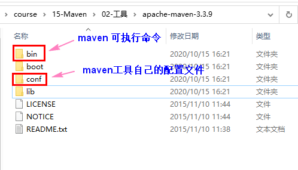
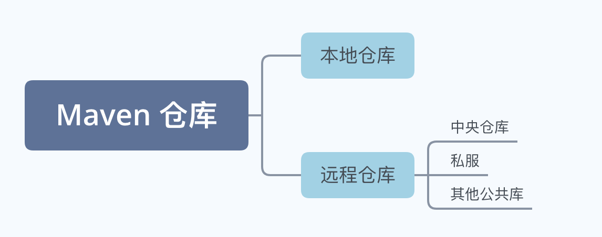
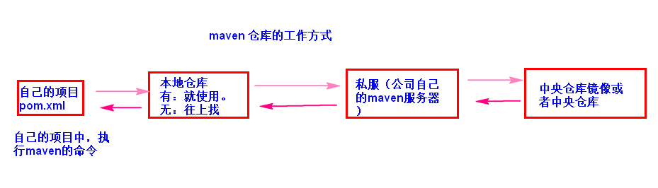
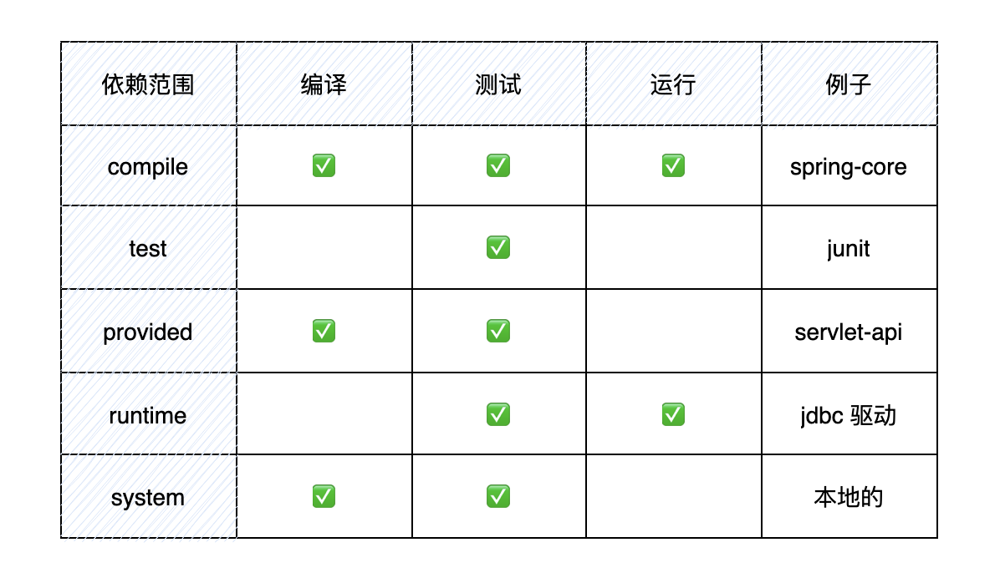
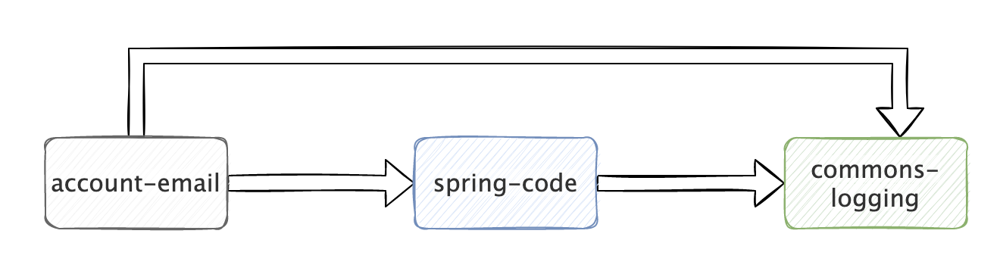
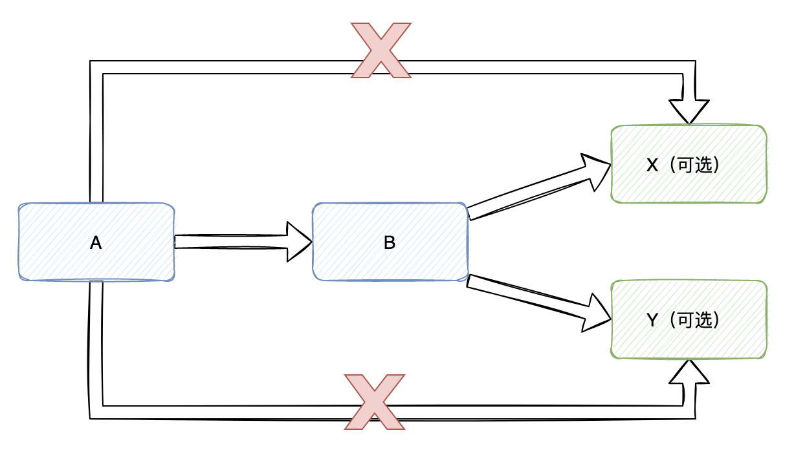
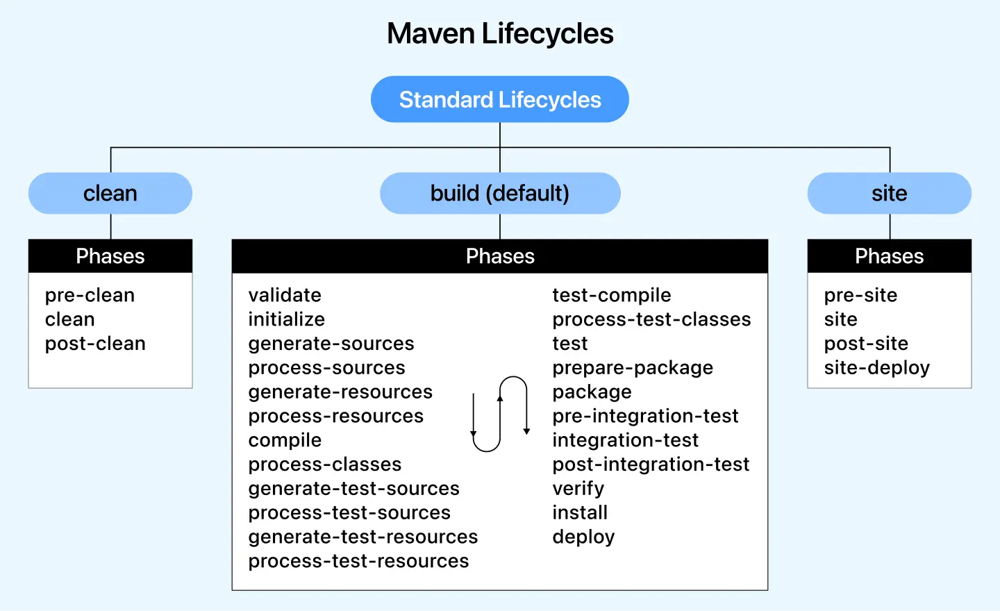
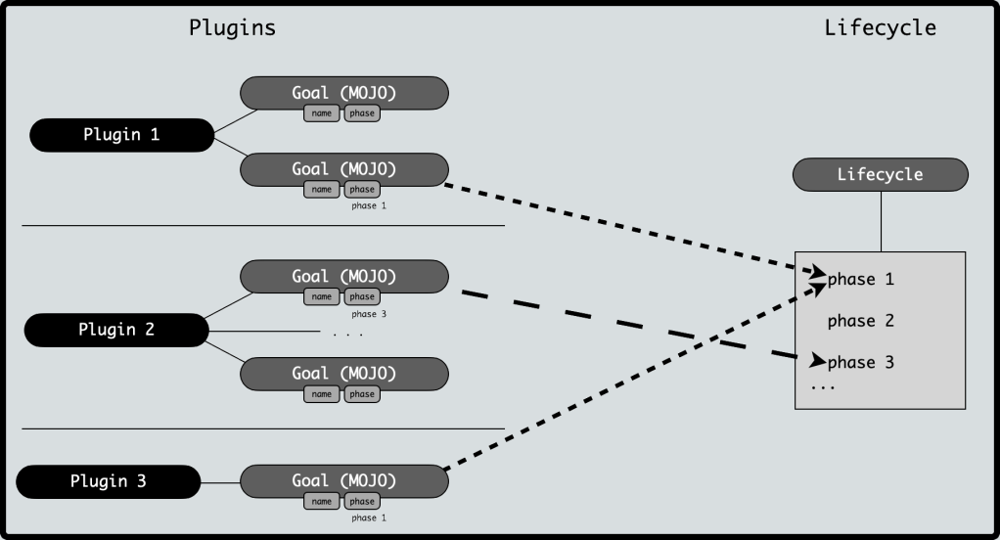
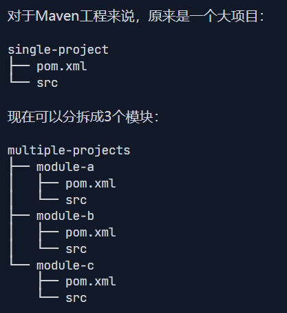

[TOC]

# Maven 自动化的构建工具

## Maven 简介

### 软件开发中的阶段

需要分析： 分析项目具体完成的功能，有什么要求， 具体怎么实现。

设计阶段：根据分析的结果， 设计项目的使用什么技术， 解决难点。

开发阶段：编码实现功能。 编译代码。自我测试

测试阶段：专业的测试人员，测整个项目的功能十分符合设计要求。出一个测试报告。

项目的打包，发布阶段： 给用户安装项目


### Maven 能做什么

1）项目的自动构建，帮助开发人员做项目代码的编译，测试， 打包，安装，部署等工作。

2）管理依赖（管理项目中使用的各种 jar 包）。

> 依赖：项目中需要使用的其他资源，常见的是 jar 。 比如项目要使用 mysql 驱动。我们就说项目依赖 mysql 驱动。


### 没有使用 maven 怎么管理依赖

管理 jar ，需要从网络中单独下载某个 jar 

需要选择正确版本

手工处理 jar 文件之间的依赖。 a.jar 里面要使用 b.jar 的类。


###  什么是 maven

maven 是 apache 基金会的开源项目，使用 java 语法开发。 Maven 这个单词的本意是：专家，内行。读音是 ['meɪv(ə)n]  或  ['mevn]。

maven 是项目的自动化构建工具。 管理项目的依赖。


### maven 中的概念

①POM
② 约定的目录结构
③ 坐标
④ 依赖管理
⑤ 仓库管理
⑥ 生命周期
⑦ 插件和目标
⑧ 继承
⑨ 聚合


### maven 工具的获取和安装

地址： http://maven.apache.org/  从中下载  .zip 文件。 使用的 apache-maven-3.3.9-bin.zip


安装：

1. 确定 JAVA_HOME 指定 jdk 的安装目录， 如果没有 JAVA_HOME， 需要在 windows 的环境变量中创建 JAVA_HOME, 它的值是 jdk 的安装目录

2. 解压缩  apache-maven-3.3.9-bin.zip ，把解压后的文件放到一个目录中。 

   目录的路径不要有中文， 不要有空格。

3. 把 maven 安装目录中下的 bin 的路径添加到 path 中

4. 测试 maven 的安装。 在命令行执行 mvn     -v

   ```xml
   C:\Users\NING MEI>mvn -v
   Apache Maven 3.3.9 (bb52d8502b132ec0a5a3f4c09453c07478323dc5; 2015-11-11T00:41:47+08:00)
   Maven home: D:\tools\apache-maven-3.3.9\bin\..
   Java version: 1.8.0_101, vendor: Oracle Corporation
   Java home: C:\Program Files\Java\jdk1.8.0_101\jre
   Default locale: zh_CN, platform encoding: GBK
   OS name: "windows 10", version: "10.0", arch: "amd64", family: "dos"
   ```

   

maven 解压后的目录结构




maven 的其他安装方式：

1. 确定 JAVA_HOME 是否有效

2. 在环境变量中，创建一个叫做 M2_HOME (或者 MAVEN_HOME) ，它的值是 maven 的安装目录

   M2_HOME = D:\tools\apache-maven-3.3.9

3. 在 path 环境变量中，加入 %M2_HOME%\bin    

4. 测试 maven 的安装，在命令行执行 mvn  -v

   ```xml
   C:\Users\NING MEI>mvn -v
   Apache Maven 3.3.9 (bb52d8502b132ec0a5a3f4c09453c07478323dc5; 2015-11-11T00:41:47+08:00)
   Maven home: D:\tools\apache-maven-3.3.9\bin\..
   Java version: 1.8.0_101, vendor: Oracle Corporation
   Java home: C:\Program Files\Java\jdk1.8.0_101\jre
   Default locale: zh_CN, platform encoding: GBK
   OS name: "windows 10", version: "10.0", arch: "amd64", family: "dos"
   ```

   

## Maven 的核心概念及项目配置

### 项目结构

Maven 项目使用的大多人遵循的目录结构。

```
a-maven-project
├── pom.xml				maven 的配置文件， 核心文件
├── src
│   ├── main
│   │   ├── java		存放源代码
│   │   └── resources	存放资源文件
│   └── test
│       ├── java		存放测试代码
│       └── resources	存放测试资源文件
└── target				存放所有编译、打包生成的文件
```

maven 的使用方式：

1. maven 可以独立使用： 创建项目，编译代码，测试程序，打包，部署等等
2. maven 和 idea 一起使用：通过 idea 借助 maven，实现编码，测试，打包等等

### POM 

POM： Project Object Model 项目对象模型， maven 把项目当做模型处理。 操作这个模型就是操作项目。

maven 通过 pom.xml 文件实现 项目的构建和依赖的管理。

```xml
<!-- XML头，指定了该xml文档的版本和编码方式 -->
<?xml version="1.0" encoding="UTF-8"?>

<!-- project是根标签， 声明了一些POM相关的命名空间及xsd元素。 后面的是约束文件 -->
<project xmlns="http://maven.apache.org/POM/4.0.0" xmlns:xsi="http://www.w3.org/2001/XMLSchema-instance"
  xsi:schemaLocation="http://maven.apache.org/POM/4.0.0 http://maven.apache.org/xsd/maven-4.0.0.xsd">
    
    
  	<!-- 指定了当前POM的版本， Maven 3 固定为 4.0.0 -->  
  	<modelVersion>4.0.0</modelVersion>

    <!-- 以下三个元素 定义了项目的基本坐标 -->
    <!-- 项目属于哪个组织，通常是组织域名的倒序，比如说我的域名是 itwanger.com，所以groupId就是 com.itwanger。 -->  
	<groupId>com.bjpowernode</groupId>
	<!-- 项目在组织中的唯一ID -->  
	<artifactId>ch01-maven</artifactId>
	<!-- 项目当前的版本 SNAPSHOT意为快照，说明该项目还处于开发中 -->  
	<version>1.0-SNAPSHOT</version>
    
    <!-- 对于用户更为友好的项目名称和项目描述 -->
 	<name>MavenDemo</name>
    <description>A simple Maven project</description> 
    
    <!-- 项目打包的类型， jar/war/pom，默认 jar -->
    <packaging>jar</packaging>
    
  
</project>
```

### 坐标

坐标组成是 groupid, artifiactId, version，简称 gav。  坐标概念来自数学。

坐标作用：确定资源的，是资源的唯一标识。 在 maven 中，每个资源都是坐标。 坐标值是唯一的。简称叫 gav

```xml
  <groupId>com.bjpowernode</groupId>
  <artifactId>ch01-maven</artifactId>
  <version>1.0-SNAPSHOT</version>

```

* groupId: 组织名称，代码。 公司，团体或者单位的标识。 这个值常使用的公司域名的倒写。例如：学校的网站 www.bjpowernode.com, groupId: com.bjpowernode。如果项目规模比较大， 也可以是 域名倒写+大项目名称。例如： www.baidu.com ,  无人车： com.baidu.appollo
* artifactId: 项目名称， 如果 groupId 中有项目， 此时当前的值就是子项目名。 项目名称是唯一的。
* version：版本， 项目的版本号， 使用的数字。 三位组成。 例如 主版本号.次版本号.小版本号， 例如： 5.2.5。注意：版本号中有-SNAPSHOT， 表示快照，不是稳定的版本。      

每个 maven 项目，都需要有一个自己的 gav。管理依赖，需要使用其他的 jar ，也需要使用 gav 作为标识。

搜索坐标的地址： https://mvnrepository.com/

### 仓库

仓库是存东西的，maven 的仓库存放的是：

1. maven 工具自己的 jar 包。

2. 第三方的其他 jar， 比如项目中要使用 mysql 驱动。

3. 自己写的程序，可以打包为 jar 。 存放到仓库。


**仓库的分类**



**本地仓库**

位于你自己的计算机， 它是磁盘中的某个目录。

本地仓库：默认路径，是你登录操作系统的账号的目录中/.m2/repository

[修改本地仓库的位置](#本地仓库)

**远程仓库**

需要通过联网访问的

* 中央仓库： Maven 官方维护的远程仓库，里面包含了这个世界上绝大多数流行的开源 Java 类库，以及源码、作者信息、许可证信息等等。
* 私服：私服是一种特殊的远程仓库，它架设在局域网内中，私服代理广域网上的远程仓库，供局域网内的 Maven 用户使用。通常需要 [认证](#服务器认证) 使用。
* 其他公共库：Google 仓库、Sonatype 仓库等
* 仓库的 [镜像](#镜像)： 就是仓库的拷贝。 

默认的中央仓库访问速度比较慢，通常我们会选择使用阿里的 Maven 远程仓库。

```xml
    <repositories><!--可以包含一个或者多个repository元素-->
        <repository>
            <id>ali-maven</id><!--仓库声明的唯一id 避免使用中央仓库的id——central-->
            <url>http://maven.aliyun.com/nexus/content/groups/public</url><!--指向了仓库的地址。-->
            <releases><!--控制对于发布版构件的下载权限-->
                <enabled>true</enabled>
            </releases>
            <snapshots><!--控制对于快照版构件的下载权限-->
                <enabled>true</enabled><!--允许下载-->
                <updatePolicy>always</updatePolicy><!--从远处仓库检查更新的频率 daily每天 never从不 always构建时 interval每隔X分钟-->
                <checksumPolicy>fail</checksumPolicy><!--下载时检查校验失败后的策略  warn fail ignore-->
            </snapshots>
        </repository>
    </repositories>
```

搭建远程仓库的另外一个目的是方便部署我们自己的项目构件至远程仓库供其他团队成员使用。配置好 `distributionManagement` 了以后运行命令 `mvn clean deploy`，Maven 就会将项目部署到对应的远程仓库。

```xml
	<distributionManagement>
        <repository><!--发布版本构件的仓库-->
            <id>companny-releases</id>
            <name>public</name>
            <url>http://59.50.95.66:8081/nexus/content/repositories/releases</url>
        </repository>
        <snapshotRepository><!--快照版本构件的仓库-->
            <id>companny-snapshots</id>
            <name>Snapshots</name>
            <url>http://59.50.95.66:8081/nexus/content/repositories/snapshots</url>
        </snapshotRepository>
	</distributionManagement>
```

[远程仓库的全局配置方式](#远程仓库)

**仓库的搜索顺序**

maven 使用仓库： maven 自动使用仓库， 当项目启动后， 执行了 maven 的命令， maven 首先访问的是本地仓库， 从仓库中获取所需的 jar， 如果本地仓库没有 ，需要访问私服或者中央仓库或者镜像。



**仓库服务搜索**

- Sonatype Nexus：https://repository.sonatype.org/
- MVNrepository：http://mvnrepository.com/
### 依赖

#### 格式

依赖：项目中要使用的其他资源（jar）。  

需要使用 maven 表示依赖，管理依赖。 通过使用 dependency 和 gav 一起完成依赖的使用

需要在 pom.xml 文件中，使用 dependencies 和 dependency， 还有 gav 完成依赖的说明。

格式：

```xml
<project>
<!-- ... -->

    <!-- 包含一个或者多个dependency元素，以声明一个或者多个项目依赖 -->
	<dependencies>

        <!-- 日志 -->
		<dependency>
            <!-- 依赖的基本坐标 -->
			<groupId>log4j</groupId>
			<artifactId>log4j</artifactId>
			<version>1.2.17</version>
            
             <!-- 依赖类型 -->
			<type>jar</type>
             <!-- 依赖范围 -->
			<scope>compile</scope>
             <!-- 依赖是否是可选 -->
			<optional>false</optional>
			<!--主要用于排除传递性依赖-->
			<exclusions>
				<exclusion>
					<groupId>…</groupId>
					<artifactId>…</artifactId>
				</exclusion>
			</exclusions>
        </dependency>

        <!-- mysql驱动 -->
         <dependency>
            <groupId>mysql</groupId>
            <artifactId>mysql-connector-java</artifactId>
            <version>5.1.16</version>
        </dependency>

    </dependencies> 
    
<!-- ... -->
</project>

```

maven 使用 gav 作为标识，从互联网下载依赖的 jar。 下载到你的本机上。  由 maven 管理项目使用的这些 jar

#### 依赖范围

 scope 有以下几种：

- compile，默认的依赖范围，表示依赖需要参与当前项目的编译，后续的测试、运行周期也参与其中，是比较强的依赖。
- test，表示依赖仅仅参与测试相关的工作，包括测试代码的编译和运行。比较典型的如 junit。
- runntime，表示依赖无需参与到项目的编译，不过后期的测试和运行需要其参与其中。
- provided，表示打包的时候可以不用包进去，别的容器会提供。和 compile 相当，但是在打包阶段做了排除的动作。
- system，从参与程度上来说，和 provided 类似，但不通过 Maven 仓库解析，可能会造成构建的不可移植，要谨慎使用。



#### 传递性依赖

比如一个 account-email 项目为例，account-email 有一个 compile 范围的 spring-code 依赖，spring-code 有一个 compile 范围的 commons-logging 依赖，那么 commons-logging 就会成为 account-email 的 compile 的范围依赖，commons-logging 是 account-email 的一个传递性依赖：



有了传递性依赖机制，在使用 Spring Framework 的时候就不用去考虑它依赖了什么，也不用担心引入多余的依赖。Maven 会解析各个直接依赖的 POM，将那些必要的间接依赖，以传递性依赖的形式引入到当前的项目中。

#### 依赖可选

项目中 A 依赖 B，B 依赖于 X 和 Y，如果所有这三个的范围都是 compile 的话，那么 X 和 Y 就是 A 的 compile 范围的传递性依赖，但是如果我想 X、Y 不作为 A 的传递性依赖，不给它用的话，可以按照配置可选依赖：

```xml
	   <dependency>  
            <groupId>mysql</groupId>  
            <artifactId>mysql-connector-java</artifactId>  
            <version>5.1.10</version>  
            <optional>true</optional>  
        </dependency>  
```



#### 依赖排除

有时候你引入的依赖中包含你不想要的依赖包，你想引入自己想要的，这时候就要用到排除依赖了，

比如 spring-boot-starter-web 自带了 logback 这个日志包，我想引入 log4j2 的，所以我先排除掉 logback 的依赖包，再引入想要的包就行了。

```xml
<dependency>
	<groupId>org.springframework.boot</groupId>
	<artifactId>spring-boot-starter-web</artifactId>
	<version>2.5.6</version>
	<exclusions>
		<exclusion>
			<groupId>org.springframework.boot</groupId>
			<artifactId>spring-boot-starter-logging</artifactId>
		</exclusion>
	</exclusions>
</dependency>
<!-- 使用 log4j2 -->
<dependency>
	<groupId>org.springframework.boot</groupId>
	<artifactId>spring-boot-starter-log4j2</artifactId>
	<version>2.5.6</version>
</dependency>
```

声明 exclustion 的时候只需要 groupId 和 artifactId，不需要 version 元素，因为 groupId 和 artifactId 就能唯一定位某个依赖。

### 构建

#### 生命周期阶段 Lifecycles phase

Maven 基于构建生命周期（Lifecycles）的概念，包含三个主要的生命周期：

1. `clean`：清理项目
2. `default (build)`：项目构建，包括编译， 测试，打包，安装，部署等阶段
3. `site`：生成项目文档

Maven 的生命周期由一系列阶段（phase）构成，这些阶段是有顺序的，并且后面的阶段依赖于前面的阶段，用户和 Maven 最直接的交互方式就是调用这些生命周期的阶段。

**关键阶段**

- `clean`：清理项目，删除输出目录（`taget`）等构建产物。
  - `pre-clean` → `clean` → `post-clean`
- `default (build)`：核心构建流程，涵盖编译、测试、打包、部署等。
  - `validate` ：
  - `process-sources`：处理项目主资源文件。一般来说，是对 src/main/resources 目录的内容进行变量替换等工作后，复制到项目输出的主 classpath 目录中。
  - `compile`：编译项目的主源码。一般来说，是编译 src/main/java 目录下的 Java 文件至项目输出的主 classpath 目录中。
  - `test`：使用单元测试框架运行测试，测试代码不会被打包或部署。
  -  `package`：
  - `verify`：
  - `install`：将包安装到 Maven 本地仓库，供本地其他 Maven 项目使用。
  - `deploy`：将最终的包复制到远程仓库，供其他开发人员和 Maven 项目使用。
- `site`：生成项目站点文档（如项目报告、Javadoc）。
  - `pre-site` → `site` → `post-site` → `site-deploy`

**执行逻辑**

执行某个阶段时，其之前的所有其所属生命周期的阶段会被自动执行。例如：`mvn install` 仅会执行 `validate` 到 `install` 的所有阶段，而不会执行 `clean` 或 `site` 中的任何阶段。

**所有阶段**



#### 插件目标 Plugin Goal

Maven 的所有功能均由插件实现，插件是生命周期的执行引擎，每个生命周期阶段绑定到具体的插件目标（Plugin Goal），通过插件完成实际任务。

一个插件可包含多个目标，如 `maven-compiler-plugin` 的 `compile` 和 `testCompile`。

每个阶段会执行自己默认的一个或多个插件目标。

**默认插件绑定**

| 生命周期阶段             | 插件目标                               | 执行任务                       |
| ------------------------ | -------------------------------------- | ------------------------------ |
| `clean`                  | `maven-clean-plugin:clean`             | 清理项目构建目录               |
| `process-resources`      | `maven-resources-plugin:resources`     | 复制主资源文件至主输出目录     |
| `compile`                | `maven-compiler-plugin:compile`        | 编译主代码至主输出目录         |
| `process-test-resources` | `maven-resources-plugin:testResources` | 复制测试资源文件至测试输出目录 |
| `test-compile`           | `maven-compiler-plugin:testCompile`    | 编译测试代码至测试输出目录     |
| `test`                   | `maven-surefire-plugin:test`           | 执行单元测试                   |
| `package`                | `maven-jar-plugin:jar`                 | 创建项目 jar 包                |
| `install`                | `maven-install-plugin:install`         | 将项目输出构件安装到本地仓库   |
| `deploy`                 | `maven-deploy-plugin:deploy`           | 将项目输出构件部署到远程仓库   |
| `site`                   | `maven-site-plugin:site`               | 生成项目站点文档               |
| `site-deploy`            | `maven-site-plugin:site-deploy`        | 将站点文档部署到远程仓库       |

> 这些插件通常是 Apache Maven 提供的 org.apache.maven.plugins 插件

**自定义插件绑定**

除了内置绑定以外，用户还能够自己选择将某个插件目标绑定到生命周期的某个阶段上。参考[构建配置示例](#构建配置示例)

**插件与生命周期的关系**

- 生命周期（Lifecycle）：定义构建阶段（phase）的顺序
- 插件（Plugin）：提供具体实现（goal）来完成这些阶段的任务




#### 命令

Maven 命令遵循以下模式：

```
mvn [选项] [生命周期阶段] [目标]
```

如果运行 `mvn package`，Maven 就会执行 `default` 生命周期，它会从开始一直运行到 `package` 这个 phase 为止。

如果运行 `mvn compile`，Maven 也会执行 `default` 生命周期，但这次它只会运行到 `compile`。

如果运行 `mvn clean`，Maven 也会执行 `clean` 生命周期，并运行到 `clean` 阶段。

更复杂的例子是指定多个 phase，例如，运行 `mvn clean package`，Maven 先执行 `clean` 生命周期并运行到 `clean` 这个 phase，然后执行 `default` 生命周期并运行到 `package` 这个 phase。

常见命令有：

- `mvn clean`：表示运行清理。会把 target 目录中的数据清理。这通常是在构建之前执行的，常用形如 `mvn clean xxx` 的命令，以确保项目从一个干净的状态开始。
- `mvn compile`：表示运行编译。把 src/main/java 目录中的 java 代码编译为 class 文件，并把 class 文件拷贝到 target/classes 目录，这个目录是存放类文件的根目录（也叫做类路径，classpath）。
- `mvn test-compile`：同上，但最终路径为 target/test-classes 
- `mvn test`：表示运行测试。执行 test-classes 目录的程序， 测试 src/main/java 目录中的主程序代码是否符合要求
- `mvn package`：表示运行打包。把项目中的资源 class 文件和配置文件都放到一个压缩文件中， 默认压缩文件是 jar 类型的。 web 应用是 war 类型。
- `mvn install`：表示运行安装。把生成的打包的文件 ，安装到本地仓库，以供其他项目使用。
- `mvn deploy`：表示运行发布。把生成的打包的文件，发布到私服上面，以供其他开发人员或团队使用。

#### 构建配置示例

```xml
<build>
    <!-- 最终生成的文件名（默认：${artifactId}-${version}.jar） -->
    <finalName>${project.artifactId}-${project.version}</finalName>

    <!-- 资源文件配置（默认：src/main/resources 和 src/test/resources） -->
    <resources>
        <resource>
            <directory>src/main/resources</directory>
            <!-- 过滤资源文件中的变量（如 ${version} 会被替换） -->
            <filtering>true</filtering>
            <!-- 包含/排除文件 -->
            <includes>
                <include>**/*.xml</include>
            </includes>
            <excludes>
                <exclude>**/*.txt</exclude>
            </excludes>
        </resource>
    </resources>

    <!-- 插件配置 -->
    <plugins>
        <!-- 示例：指定 Java 编译版本 -->
        <plugin>
            <groupId>org.apache.maven.plugins</groupId>
            <artifactId>maven-compiler-plugin</artifactId>
            <version>3.8.1</version>
            <configuration>
                <source>1.8</source> <!-- 源码版本 -->
                <target>1.8</target> <!-- 编译后版本 -->
                <encoding>UTF-8</encoding> <!-- 编码 -->
            </configuration>
        </plugin>

        <!-- 示例：Spring Boot 打包插件 -->
        <plugin>
            <groupId>org.springframework.boot</groupId>
            <artifactId>spring-boot-maven-plugin</artifactId>
            <version>2.7.0</version>
            <executions>
                <execution>
                    <goals>
                        <goal>repackage</goal> <!-- 重新打包为可执行 jar -->
                    </goals>
                </execution>
            </executions>
        </plugin>
        
        <!--示例：自定义插件-->
        <plugin>
				<groupId>org.apache.maven.plugins</groupId>
				<artifactId>maven-shade-plugin</artifactId>
                <version>3.2.1</version>
				<executions>
					<execution>
						<phase>package</phase>
						<goals>
							<goal>shade</goal>
						</goals>
						<configuration>
                            <!--自定义插件往往需要一些配置，例如，`maven-shade-plugin` 需要指定 Java 程序的入口-->
                            <transformers>
                                <transformer implementation="org.apache.maven.plugins.shade.resource.ManifestResourceTransformer">
                                    <mainClass>com.itranswarp.learnjava.Main</mainClass>
                                </transformer>
                            </transformers>
						</configuration>
					</execution>
				</executions>
			</plugin>
    </plugins>

    <!-- 插件管理（类似 dependencyManagement，统一插件版本） -->
    <pluginManagement>
        <plugins>
            <!-- 声明插件版本，子模块引用时无需指定 -->
        </plugins>
    </pluginManagement>
</build>

```


### 多模块

#### 多模块项目

软件开发中，把一个大项目分拆为多个模块是降低软件复杂度的有效方法



 当两个 module 的 `pom.xml` 高度相似，共用大多数的依赖，可以提取出共同部分作为 `parent`

```xml
<project xmlns="http://maven.apache.org/POM/4.0.0"
    xmlns:xsi="http://www.w3.org/2001/XMLSchema-instance"
    xsi:schemaLocation="http://maven.apache.org/POM/4.0.0 http://maven.apache.org/xsd/maven-4.0.0.xsd">
    <modelVersion>4.0.0</modelVersion>

    <groupId>com.itranswarp.learnjava</groupId>
    <artifactId>parent</artifactId>
    <version>1.0</version>
    <packaging>pom</packaging>

    <name>parent</name>

    <properties>
        <project.build.sourceEncoding>UTF-8</project.build.sourceEncoding>
        <project.reporting.outputEncoding>UTF-8</project.reporting.outputEncoding>
        <maven.compiler.source>11</maven.compiler.source>
        <maven.compiler.target>11</maven.compiler.target>
        <java.version>11</java.version>
    </properties>

    <dependencies>
        <dependency>
            ...
        </dependency>
    </dependencies>
    
    <!-- 子模块列表（相对路径） -->
    <modules>
        <module>module-a</module>
        <module>module-b</module>
    </modules>
</project>

```

1. 父模块的 `<packaging>` 是 `pom` 而不是 `jar`，因为 `parent` 本身不含任何 Java 代码。
2. 子模块通过 `parent` 继承父模块配置。

#### 多模块依赖管理

在多模块 Maven 项目中，管理依赖的版本是一个常见的需求。为了确保所有子模块使用一致的依赖版本，并且避免在每个子模块中重复声明版本号，Maven 提供了 `<dependencyManagement>` 元素。

通常会在一个组织或者项目的最顶层的父 POM 中看到 `<dependencyManagement>` 元素，并非真正引入依赖，而是仅声明版本信息，子模块如需引入依赖，要显式的声明 `groupId` 和 `artifactId`，但无需声明版本。

```xml
<project>
    <dependencies>
        <dependency>
        ...
        </dependency>
    </dependencies>

    <!-- 统一管理版本（适合多模块项目） -->
    <dependencyManagement>
        <dependencies>
            <dependency>
                <groupId>org.springframework.boot</groupId>
                <artifactId>spring-boot-starter-web</artifactId>
                <version>2.7.0</version> <!-- 子模块引用时无需指定版本 -->
            </dependency>
        </dependencies>
    </dependencyManagement>
</project>
```

### 全局变量

`<properties>` 定义了一些属性，常用的属性有：

- `project.build.sourceEncoding`：表示项目源码的字符编码，通常应设定为 `UTF-8`；
- `maven.compiler.release`：表示使用的 JDK 版本，例如 `21`； 从 Java 9 开始，推荐使用 `maven.compiler.release` 属性，保证编译时输入的源码和编译输出版本一致。如果源码和输出版本不同，则应该分别设置 `maven.compiler.source` 和 `maven.compiler.target`。
- `maven.compiler.source`：表示 Java 编译器读取的源码版本；
- `maven.compiler.target`：表示 Java 编译器编译的 Class 版本。

```xml
<properties>
  <project.build.sourceEncoding>UTF-8</project.build.sourceEncoding>
  <maven.compiler.source>1.8</maven.compiler.source>
  <maven.compiler.target>1.8</maven.compiler.target>
  <!--自定义变量-->
  <spring.version>5.2.5.RELEASE</spring.version>
  <junit.version>4.11</junit.version>
</properties>
```

使用变量， 语法 ${变量名}

```xml
<dependency>
  <groupId>org.springframework</groupId>
  <artifactId>spring-core</artifactId>
  <version>${spring.version}</version>
</dependency>

<dependency>
  <groupId>org.springframework</groupId>
  <artifactId>spring-web</artifactId>
  <version>${spring.version}</version>
</dependency>
```

## 全局配置

- 默认路径：`${MAVEN_HOME}/conf/settings.xml`（全局配置，对所有用户生效）。
- 用户级路径：`~/.m2/settings.xml`（用户配置，优先级高于全局配置，仅对当前用户生效）。
- 若两者同时存在，用户级配置会覆盖全局配置中相同的项。

### 本地仓库

指定 Maven 下载依赖的本地存储路径（默认 `~/.m2/repository`）：

```xml
 <localRepository>D:/openrepository</localRepository>
```

### 镜像

镜像用于加速依赖下载（如阿里云镜像替代 Maven 中央仓库），`mirrorOf` 指定镜像替代的仓库（`*` 表示所有仓库）：

```xml
<mirrors>
    <mirror>
        <id>aliyun-maven</id>
        <name>阿里云公共仓库</name>
        <url>https://maven.aliyun.com/repository/public</url>
        <mirrorOf>central</mirrorOf> <!-- 替代中央仓库 -->
    </mirror>
    <!-- 阿里云 Spring 仓库（如需） -->
    <mirror>
        <id>aliyun-spring</id>
        <url>https://maven.aliyun.com/repository/spring</url>
        <mirrorOf>spring-milestones</mirrorOf>
    </mirror>
</mirrors>
```

### 远程仓库

maven 工程内的 pom.xml 中添加远程仓库依赖，每个工程都需要添加一次

以下是全局的远程仓库配置（通常配合 `activeProfiles` 激活）：

```xml
<profiles>
    <profile>
        <id>aliyun-repo</id>
        <repositories>
            <repository>
                <id>aliyun</id>
                <url>https://maven.aliyun.com/repository/public</url>
                <releases><enabled>true</enabled></releases>
                <snapshots><enabled>false</enabled></snapshots> <!-- 不启用快照版 -->
            </repository>
        </repositories>
    </profile>
</profiles>

<!-- 激活上述仓库配置 -->
<activeProfiles>
    <activeProfile>aliyun-repo</activeProfile>
</activeProfiles>

```

### 代理

若需通过代理访问网络（如公司内网），配置代理

```xml
<proxies>
    <proxy>
        <id>company-proxy</id>
        <active>true</active> <!-- 启用代理 -->
        <protocol>http</protocol>
        <host>192.168.1.1</host> <!-- 代理IP -->
        <port>8080</port> <!-- 代理端口 -->
        <username>user</username> <!-- 代理账号（可选） -->
        <password>pass</password> <!-- 代理密码（可选） -->
        <nonProxyHosts>localhost|127.0.0.1|*.company.com</nonProxyHosts> <!-- 不使用代理的地址 -->
    </proxy>
</proxies>
```

### 服务器认证

用于私有仓库（私服）的账号密码配置

```xml
<servers>
    <server>
        <id>private-repo</id> <!-- 与仓库 id 对应 -->
        <username>admin</username>
        <password>123456</password>
    </server>
</servers>
```

# 附录

##  settings.xml 配置模板

```xml
<?xml version="1.0" encoding="UTF-8"?>
<settings xmlns="http://maven.apache.org/SETTINGS/1.2.0"
          xmlns:xsi="http://www.w3.org/2001/XMLSchema-instance"
          xsi:schemaLocation="http://maven.apache.org/SETTINGS/1.2.0 https://maven.apache.org/xsd/settings-1.2.0.xsd">

    <!-- 本地仓库路径 -->
    <localRepository>D:/dev/maven/repository</localRepository>

    <!-- 镜像配置（优先使用阿里云） -->
    <mirrors>
        <mirror>
            <id>aliyun-public</id>
            <name>Aliyun Public Repository</name>
            <url>https://maven.aliyun.com/repository/public</url>
            <mirrorOf>central</mirrorOf>
        </mirror>
        <mirror>
            <id>aliyun-spring</id>
            <url>https://maven.aliyun.com/repository/spring</url>
            <mirrorOf>spring-milestones</mirrorOf>
        </mirror>
    </mirrors>

    <!-- 私有仓库认证 -->
    <servers>
        <server>
            <id>private-repo</id>
            <username>admin</username>
            <password>123456</password>
        </server>
    </servers>

    <!-- 配置文件 -->
    <profiles>
        <!-- JDK 1.8 配置 -->
        <profile>
            <id>jdk-1.8</id>
            <activation>
                <activeByDefault>true</activeByDefault>
                <jdk>1.8</jdk>
            </activation>
            <properties>
                <maven.compiler.source>1.8</maven.compiler.source>
                <maven.compiler.target>1.8</maven.compiler.target>
                <encoding>UTF-8</encoding>
            </properties>
        </profile>

        <!-- 私有仓库配置 -->
        <profile>
            <id>private-repo-profile</id>
            <repositories>
                <repository>
                    <id>private-repo</id>
                    <url>http://192.168.1.200:8081/repository/maven-releases/</url>
                    <releases><enabled>true</enabled></releases>
                    <snapshots><enabled>false</enabled></snapshots>
                </repository>
            </repositories>
        </profile>
    </profiles>

    <!-- 激活配置 -->
    <activeProfiles>
        <activeProfile>jdk-1.8</activeProfile>
        <activeProfile>private-repo-profile</activeProfile>
    </activeProfiles>
</settings>

```

# 参考资料

* [1] [maven 配置 settings.xml 配置详解 - hanease - 博客园](https://www.cnblogs.com/hanease/p/19216401)

