[TOC]


# 认识 Thymeleaf

## 简介

服务器端 Java 模板引擎，通过在 html 标签中嵌入特殊的语法糖实现在浏览器预览页面效果，又可以在服务端解析处理后渲染出动态页面。

- 以 html 属性出现
- 浏览器可以直接预览模板文件，无需服务器支持
- 提供内置工具类工具对象
- 语法简单
- 支持 html、js 等

## 对比 JSP

两者是同个类东西，就应该二选哪一。

JSP 本质还是 JAVA 代码，做不到与前端解耦。

而模板引擎技术说也是一种把数据和页 ⾯ 整合在 ⼀ 起的技术，替代 JSP 具有如下优点：

- Thymeleaf 的语法更加简洁明了，更接近 HTML，使得开发者可以更容易地理解和维护模板代码。
- 与 SpringBoot 完美整合：SpringBoot 提供了 Thymeleaf 的默认配置，我们可以像以前操作 jsp 一样来操作 Thymeleaf。
- 多方言支持：Thymeleaf 提供 spring 标准方言和一个与 SpringMVC 完美集成的可选模块，可以快速的实现表单绑定、国际化等功能。

## 与前端框架的本质区别

Thymeleaf 的页面主要还是作为视图依附于后端存在，与后端部署在一起，不能作为独立的应用程序，后端将数据绑定到模板中，然后在服务器上将整个页面渲染为 HTML，再将这个完整的 HTML 页面发送给客户端（如浏览器 ），当页面打开时，用户会立即看到已经填充了数据的页面内容。

> 在前后端不分离的情况下，Springboot 推荐用 HTML 做页面，然后用 Thymeleaf 做模板引擎，做数据渲染，但是这种方式还是要用 js 或者 jquery 手动去操作 DOM，也就是说它缺少了前端交互性和易开放性。

而前端框架，如 Vue.js 通常实现了开发和部署的前后端分离，分离程度更高，前端独立性更强，Vue 主要在客户端（浏览器）工作，它通过异步的方式请求数据。后端返回 JSON 格式的数据给前端，然后 Vue 通过其指令在前端循环渲染列表或其他内容。

> 至于 Vue 框架自身的特点，是它提供了一套更加快捷、更加高效前端 JavaScript 解决方案，如声明式渲染、组件系统、客户端路由、状态管理、优化构建方式等，同时这些功能支持渐进式的逐步引入，不必追求一次性搭建完整应用。

## 常用模板引擎

Freemake 受众广

Thymeleaf 简单方便 spring 结合紧密  

Velocity 更新滞后工作方式

## 工作方式

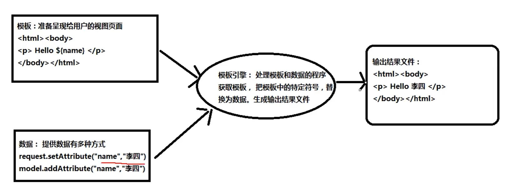

# Thymeleaf 快速演示

## 快速入门

### 基础示例

```java
public static void main(String[] args) {
    //创建模板引擎
    TemplateEngine templateEngine = new TemplateEngine();
    //准备模板
    String input = "<input type='text' th:value='${name}'/>";
    //准备数据，使用Context
    Context context = new Context();
    context.setVariable("name","李四");
    //调用引擎
    String out = templateEngine.process(input,context);
    //输出结果
    System.out.println(out);
}
```

### 将 html 文件作为模板

```java
@Test
public void test() {
    //创建模板
    TemplateEngine templateEngine = new TemplateEngine();
    //设置resolver  模板读取磁盘中资源的路径 类目录
    ClassLoaderTemplateResolver classLoaderTemplateResolver = new ClassLoaderTemplateResolver();
    templateEngine.setTemplateResolver(classLoaderTemplateResolver);
    //指定数据
    Context context = new Context();
    context.setVariable("name", "tintin");
    //处理模板
    String process = templateEngine.process("index.html", context);

    System.out.println(process);
}
```

### 设置前缀后缀 简化模板文件所在目录位置

```java
@Test
public void test2() {
    //创建模板
    TemplateEngine templateEngine = new TemplateEngine();
    //设置resolver 及其前缀后缀 用于读取磁盘中资源的路径 类目录
    ClassLoaderTemplateResolver TemplateResolver = new ClassLoaderTemplateResolver();
    TemplateResolver.setPrefix("templates/");
    TemplateResolver.setSuffix(".html");
    templateEngine.setTemplateResolver(TemplateResolver);
    //指定数据
    Context context = new Context();
    context.setVariable("name","hhh");
    //处理模板
    String out = templateEngine.process("index", context);


    System.out.println(out);
}
```

## SpringBoot 起步依赖

### 通过 spring 项目启动器初始化

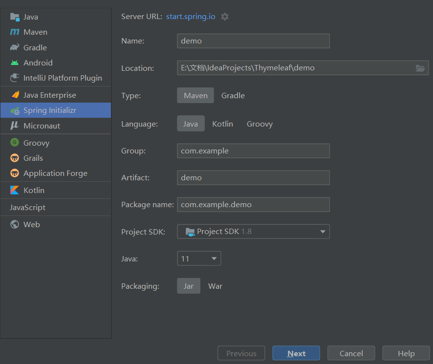

### pom.xml 配置

```xml
<!-pom.xml配置--> 
<parent>
     <groupId>org.springframework.boot</groupId>
     <artifactId>spring-boot-starter-parent</artifactId>
     <version>2.0.6.RELEASE</version>
     <relativePath/> <!-- lookup parent from repository -->
</parent>
		<!--模板引擎-->
        <dependency>
            <groupId>org.springframework.boot</groupId>
            <artifactId>spring-boot-starter-thymeleaf</artifactId>
        </dependency>
        <dependency>
            <groupId>org.springframework.boot</groupId>
            <artifactId>spring-boot-starter-web</artifactId>
        </dependency>

        <dependency>
            <groupId>org.springframework.boot</groupId>
            <artifactId>spring-boot-starter-test</artifactId>
            <scope>test</scope>
        </dependency>
```


##  常用配置参数

### thymeleaf 的配置

```properties
//application.properties
spring.thymeleaf.cache=false
spring.thymeleaf.mode=HTML
spring.thymeleaf.prefix=classpath:/templates/
spring.freemarker.suffix=.html
```

### 定义控制器类

```java
@Controller
public class HelloController {
    /**
     *
     * @param model 存放数据 可以用request域
     * @return 表示视图
     */
    @RequestMapping("/hello")
    public String hello(Model model) {
        model.addAttribute("name","张三");
        return "hello";
    }
}
```

# Thymeleaf 表达式

## 表达式分类

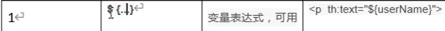

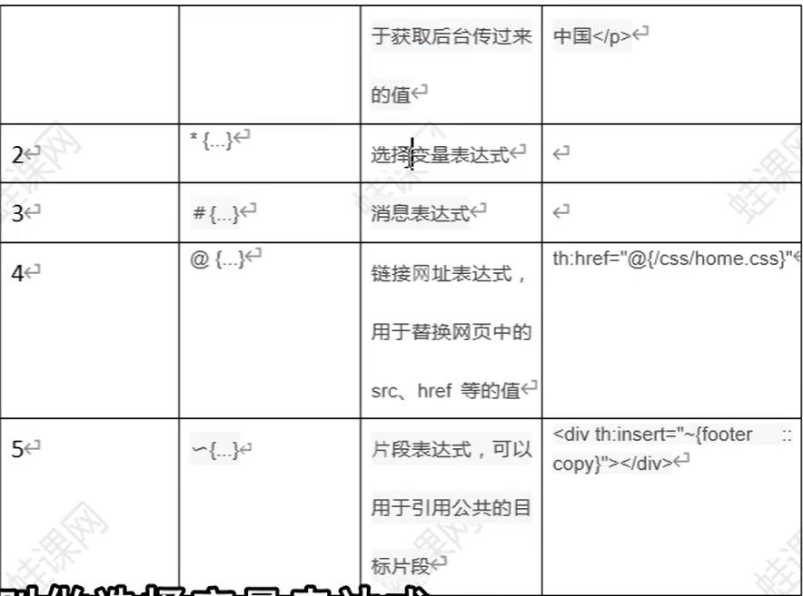

## 变量表达式${..}

### 获取基本类型、引用类型并调用 get 方法获取变量

```html
<!--var1.html-->
<!DOCTYPE html>
<html lang="en" xmlns:th="http://www.thymeleaf.org">
<head>
    <meta charset="UTF-8">
    <title>Title</title>
</head>
<body>
    <p>获取简单数据</p>
    <p th:text="${name}"></p>
    <p th:text="${age}"></p>

    <br>
    <p>对象的属性值</p>
    <p th:text="${student.name}"></p>
    <p th:text="${student.age}"></p>
</body>
</html>
```

### 获取引用类型属性的属性

```html
    <br>
    <p>对象的引用类型属性值</p>
    <p th:text="${student.school.name}"></p>
    <p th:text="${student.school.address}"></p>
    <p th:text="${student.school.getAddress()}"></p>
```


## 选择表达式*{..}

## 链接表达式@{..}

@{...}表达式用于处理 web 应用中的 ur 地址, 可以是相对地址, 也可以是绝对地址。
@{``\``}是相对应用根路径, 其他都是相对当前路径
@{``\``}斜杠开头表示相对整个应用根目录,/"表示"/应用上下文路
th: href 是一个修饰符属性, 将表达式结果设置为标签 href 属性的

### 基本形式以及链接中传递参数

+ 在@{...}表达式末尾使用()设置参数;“
  @{/user/list(id = 1001, name = zs)}
+ 多个参数时, 使用, 隔开
+ 参数值可以使用表达式动态取值。

```html
<!DOCTYPE html>
<html lang="en" xmlns:th="http://www.thymeleaf.org">
<head>
    <meta charset="UTF-8">
    <title>@{}链接地址</title>
    <script src="${/js/jquery.3.4.1.js}" type="text/javascript"></script>
</head>
<body>
    <a th:href="@{queryStudent(id=001)}">@{queryStudent}</a>
    <br/>
    <a th:href="@{./queryStudent(id=002,email='821294434@qq.com')}">@{./queryStudent}</a>
    <br/>
    <a th:href="@{../queryStudent(url=${queryStudent})}">@{../queryStudent}</a>
    <br/>
    <a th:href="@{/user/home}">@{/user/home}</a>
    <br/>
    <a th:href="@{https://www.baidu.com}">@{https://www.baidu.com</a>
</body>
</html>
```

## 消息表达式(国际化)#{..}

### 实现

* 在 resources 目录下创建国际化的资源文件
  目录 i8ne
  messages. properties
  login = login|登录

  messages zh CN properties
  login = 登录

  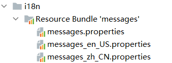

* 创建 localeResolver

```java
public class LocaleResolver implements org.springframework.web.servlet.LocaleResolver {
    @Override
    public Locale resolveLocale(HttpServletRequest httpServletRequest) {
        String lang = httpServletRequest.getParameter("lang");
        Locale locale = httpServletRequest.getLocale();
        if (!lang.isEmpty()) {
            String[] data = lang.split("_");
            locale = new Locale(data[0],data[1]);
        }
        return locale;
    }

    @Override
    public void setLocale(HttpServletRequest httpServletRequest, HttpServletResponse httpServletResponse, Locale locale) {

    }
}
```

* 创建 MVC 配置类

```java
@Configuration
public class MyWebConfig implements WebMvcConfigurer {
    @Bean
    public LocaleResolver getLocaleResolver() {
        return new MyLocaleResolver();
    }

}
```

* 修改 application.properties

```properties
spring.messages.basename=i18n/message
```

* 页面链接

需提供语言参数

```html
<a href="/i18n?lang=zh_CN">国际化中文</a>
<a href="/i18n?lang=en_US">国际化英文</a>
```

* 创建 controller 与模板 html

```html
<!DOCTYPE html>
<html lang="en" xmlns:th="http://www.thymeleaf.org">
<head>
    <meta charset="UTF-8">
    <title>Title</title>
</head>
<body>
    <h1>login登录页面</h1>
  <p th:text="#{login}"></p>
</body>
</html>
```

* 效果

# 标准表达式

## 文本和连接字符串

文本文字只是在单引号之间指定的字符串。它们可以包含任何字符, 如果字符之中没有空格, 可以不加单引号。使用“+连接文本。也可以使用“" 连接文本

文本内容若含有空格需要加引号

```html
<!DOCTYPE html>
<html lang="en" xmlns:th="http://www.thymeleaf.org">
<head>
    <meta charset="UTF-8">
    <title>Title</title>
</head>
<body>
  <p>文本使用</p>
  <p th:text="文本表达式"></p>
  <p th:text="'hello thymeleaf'">有空格的文本</p>
  <p th:text="'tintin'+ 'gem'">+号连接字符串</p>
  <p th:text="'tintin'+${girlFriend}"></p>
  <p th:text="|'tintin' ${girlFriend}|">竖线连接字符串</p>
  <p th:text="你好+|${n1},${n2}|">混合连接</p>
  <p th:text="123">数字文本</p>
  <p th:text="true">boolean</p>


</body>
</html>
```

效果

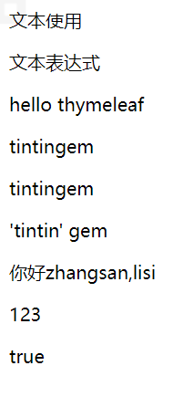


## 数字和逻辑运算符

数字文字就是: 数字, 算术运算也可用:+,-,*,/,%
表式中的值可以与进行比较 >, <,> 和 <= 符号, 以及 == 和!= 可以被用来检查是否相等。

一些符合需要使用实体 gt(>), lt(<),ge(> =), le(<=), not(!)。还有 eq(=), neq(!=)。

### 数字

```html
<!DOCTYPE html>
<html lang="en">
<head>
    <meta charset="UTF-8">
    <title>Title</title>
</head>
<body>
  <p>数字表达式使用</p>
  <p th:text="55">字面常量数字</p>
  <p th:text="55 + 22">数字运算</p>
  <p th:text="6 + 6 + '字符串' + 10 + 2">字符串连接</p>
  <p th:text="6 + 6 + '字符串'+ (6 + 6)">括号提升优先级</p>
  <p th:text="${n1} - ${n2}">使用模型数据</p>
  <p th:text="100 - ${n2}"></p>

</body>
</html>
```

效果

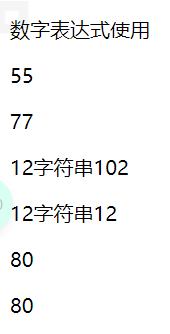

### 布尔表达式

```html
<!DOCTYPE html>
<html lang="en" xmlns:th="http://www.thymeleaf.org">
<head>
    <meta charset="UTF-8">
    <title>Title</title>
</head>
<body>
  <p>布尔表达式</p>
  <p th:text="true"></p>
  <p th:if="${isMarried}">married=true</p>
  <p th:if="${age} &gt; 18">已成年</p>
  <p th:if="${age} &lt; 18">未成年</p>
  <p th:if="${isMarried} and ${age} &lt; 18">违法了</p>
</body>
</html>
```

效果

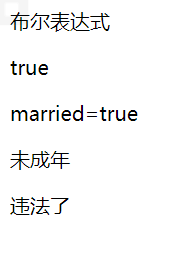

### 比较和逻辑运算符

表达式中的值可以与 >, <,> =,<= 符号进行比较。
一个更简单的替代方案是使用这些运算符的文本别名 gt(>), lt(<),ge(> =), le(<=), eq(==), neq(!=)
逻辑运算符: and(与)、or(或)、!(非)、not(非)

```html
<!DOCTYPE html>
<html lang="en">
<head>
    <meta charset="UTF-8">
    <title>Title</title>
</head>
<body>
  <p>比较和逻辑表达式</p>
  <p th:if="10 > 5"> 10 大于 5</p>
  <p th:if="10 &gt; 6"> 10 大于 6</p>
  <p th:if="10 &gt; 6 and 5 != 6"> 10 大于 6且5不等于6</p>
  <p th:if="not(false)">true</p>
  <p th:if="${isLogin}">已登录</p>
  <p th:if="!${isLogin}">未登录</p>

</body>
</html>
```

效果

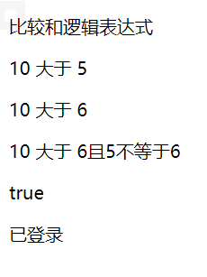

## null 和空字符串

null 字面量, 在页面直接使用, 也可以判断数据是否为 null

当数据为 null, 标签和内容不显示。''字符串和 null 处理结果一样。←

```html
<!DOCTYPE html>
<html lang="en">
<head>
    <meta charset="UTF-8">
    <title>Title</title>
</head>
<body>
    <p th:text="null">null值</p>
    <p th:text="''">空字符串</p>
    <p th:if="${null} == null">域中含有null值1</p>
    <p th:if="${null} eq null">域中含有null值2</p>
    <p th:if="${emptyStr} == ''">域中含有空字符串1</p>
    <p th:if="${emptyStr} eq ('')">域中含有空字符串2</p>

</body>
</html>
```

效果

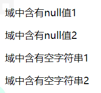

## 三元运算符

Thymeleaf 中的三元运算与 Java 以及 JavaScript 中基本一致, 如
A > B?X: Y, 在 XY 中可以继续嵌套, 只是 Thymeleaf 中需要使用括号包含起来否则会报错

```html
<!DOCTYPE html>
<html lang="en">
<head>
    <meta charset="UTF-8">
    <title>Title</title>
</head>
<body>
    <p>三元表达式</p>
    <p th:text="10 > 5 ? '10大于5' : '10不大于5'">判断10是否大于5</p>
    <p th:text="${age} == null ? 'age是null' : ${age}">判断age是否为空并输出</p>
    <p th:text="${age} != null ? (${age} > 30 ? '大于30岁' : '不够30岁') : 'age是null'">嵌套使用</p>
    <p th:text="${isLogin} ? '登录'">省略后项</p>
    <p th:text="!${isLogin} ? '没有登录'">省略后项</p>
</body>
</html>
```

效果

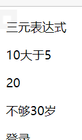

# Thymeleaf 属性

## 常用 htm 属性

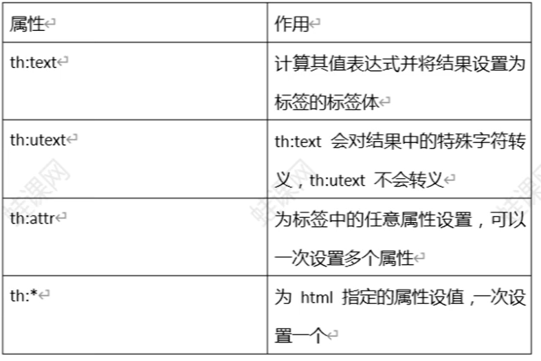

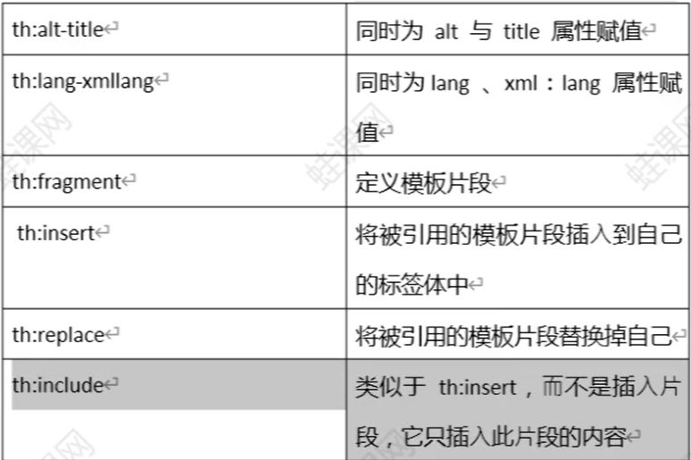

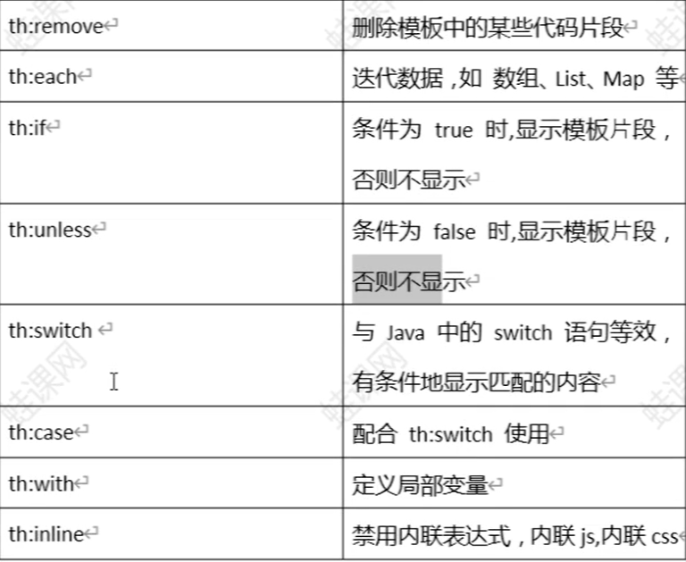

## 设置属性值 

### 设置任意属性值 th: attr 和 th:*

th: attr 提供了更改标签属性值的能力。th: att 使用比较少, 因为他的
使用比较难, 语法不优雅。对于标签的特定属性, 请使用 th value, ←
th: action, th: href th: class th: src, th onclick 等等.←

th:* 设置特定的属性

```html
<!DOCTYPE html>
<html lang="en">
<head>
    <meta charset="UTF-8">
    <title>Title</title>
    <script type="text/javascript">
      function func1() {
        alert("button click")
      }
    </script>
</head>
<body>
  <p>设置任何属性值</p>
  <form th:attr="action=${myAction}">
    账号：<input type="text" name="username"><br/>
    密码：<input type="password" name="password"><br/>
    <input type="submit" value="登录" th:attr="value=${myText}">
    <input type="button" value="按钮" th:attr="onclick='func1()' value=${myText}">
  </form>
</body>
</html>
```

效果

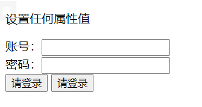

### 同时设置多个值 th: alt-title 和 th: lang-xmllang

th: . alt-title: 设置 alt, tite 两个属性 ←
th: lang-xmllang: 设置 lang, xml: lang

### 布尔属性

HTML 具有布尔属性的概念, 例如 readonly 还有 checkbox 的
" checked", 这个属性不赋值, 没有值的属性意味着该值为 " true
也可以使用属性名本身表示 true, 即 checked = " checked"

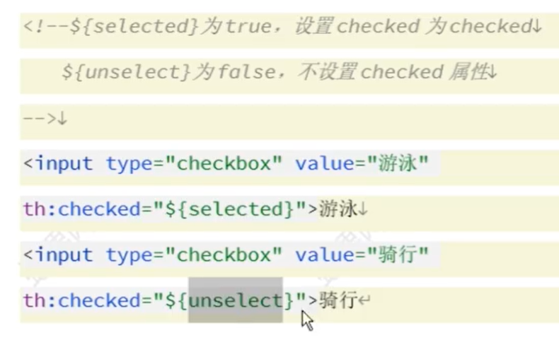

## 设置标签体文本

th: text th utext e
th:text:用来计算表达式并将结果设置标签体, 会对计算结果中特殊
字符进行转义
th: utext: 用来计算表达式并将结果设置标签体不转义 ←

```html
<!DOCTYPE html>
<html lang="en">
<head>
    <meta charset="UTF-8">
    <title>Title</title>
</head>
<body>
    <p th:text="${message}">text</p>
    <p th:utext="${uMessage}">utext</p>
</body>
</html>
```

效果

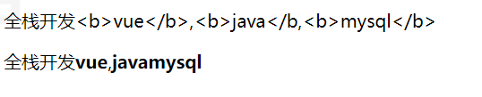

## each. if. switch

### 循环 th: each

th: each 处理循环, 类似 jstl 中的 <c: foreach>。

特点
①: 循环的对象如果是 nu, 不存在则不循环。
②: 循环包含自身和标签内全部内容。
③: 可以遍历的对象:
数组；任何何实现 java util. Iterable 接口的对象 numeration 枚举
实现 Map 接口对象

```html
<!DOCTYPE html>
<html lang="en" xmlns:th="www.thymeleaf.org">
<head>
    <meta charset="UTF-8">
    <title>Title</title>
</head>
<body>
  <p>循环list</p>
  <br/>
  <table>
    <tr>
      <td>学校名称</td>
      <td>地址</td>
    </tr>
    <tr th:each="school:${schoolList} ">
      <td th:text="${school.name}"></td>
      <td th:text="${school.address}"></td>
    </tr>
  </table>

  <p>循环map</p>
  <br/>
  <table>
    <tr>
      <th>id</th>
      <th>name</th>
      <th>address</th>
    </tr>
    <tr th:each="school:${schoolMap}">
      <th th:text="${school.key}"></th>
      <th th:text="${school.value.name}"></th>
      <th th:text="${school.value.address}"></th>
    </tr>
  </table>

  <p>select组件</p>
  <br/>
  <select>
    <option th:each="school:${schoolMap}"
            th:value="${school.value.address}"
            th:text="${school.value.name}"
            th:selected="${school.value.name} == ${selected}"></option>
  </select>

  <p>使用状态变量</p>
  <br/>
  <table cellspacing="0" border="1" cellpadding="0">
    <tr>
      <td>索引</td>
      <td>学校名称</td>
      <td>地址</td>
      <td>奇偶</td>
    </tr>
    <tr th:each="school,status:${schoolList} ">
      <td th:text="${status.index} + '/' + ${status.count}"></td>
      <td th:text="${school.name}"></td>
      <td th:text="${school.address}"></td>
      <td th:text="${status.odd} ? '奇数行' : '偶数行'"></td>
    </tr>
  </table>
</body>
</html>
```

效果

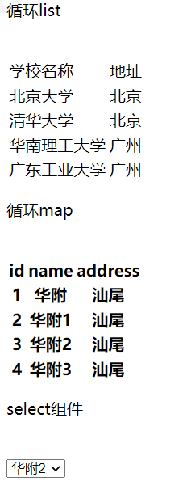

### 循环的状态变量

使用 th: each 时, Thymeleaf 提供了一种用于跟踪迭代状态的机
制: 状态变量。状态变量在每个 th: each 属性中定义, 并包含以下数
据
①index 属性: 当前迭代索引, 从 0 开始
② count 属性: 当前的迭代计数, 从 1 开始
③ize 属性: 迭代变量中元素的总量
④ current 属性: 每次迭代的 ter 变量, 即当前遍历到的元素
⑥even/odd 布尔属性: 当前的迭代是偶数还是奇数
⑦frst 布尔属性: 当前的迭代是否是第一个迭代
⑧ast 布尔属性: 当前的迭代是否是最后一个迭代。

### 判断 th: if 和 th: unless

th: if 当条件满足时，显示代码片段。 条件常用 boolean 表示，true 满足，反之不满足。

 thymeleaf 中，true 不是唯一满足条件。

1）如果表达式结果为布尔值，则为 true 或者 false 

2）如果表达式的值为 null，th: if 将判定此表达式为 false 

3）如果值是数字，为 0 时，判断为 false；不为零时，判定为 true 

4）如果值是 String，值为 “false”、“off”、“no” 时，判定为 false，否则判断为 true， 字符串为空时，也判断为 true 

5）如果值不是布尔值，数字，字符或字符串的其它对象，只要不为 null，则判断为

th: unless 是不满足条件显示代码片段， 类似 java 中 if 的 else 部

```html
<!DOCTYPE html>
<html lang="en" xmlns:th="http://www.thymeleaf.org">
<head>
<meta charset="UTF-8">
<title>文本处理</title>
</head>
<body>
<p th:if="true">boolean 类型 th:if=true</p>
<p th:if="5>0">th:if=5>0</p>
<p th:if="'ok'">字符串 ok</p>
<p th:if="99">99 数字</p>
<p th:if="'true'">'true'字符串</p>
<p th:if="${old}">old 是 true</p>
<p th:if="${login}">登录了</p>
<p th:if="${num1}">num1=10</p>
<p th:if="${num2}">num2=-2</p>
<p th:if="${obj1}">obj1 is not null</p>
<hr/>
<p th:unless="${yong}">yong false</p>
<p th:unless="${str1}">str1=off</p>
<p th:unless="${str2}">str1=no</p>
<p th:unless="${str3}">str1=false</p>
<p th:unless="${num2}">num2=0</p>
<p th:unless="${obj2}">obj2 is null</p>
</body>
</html>
```

效果

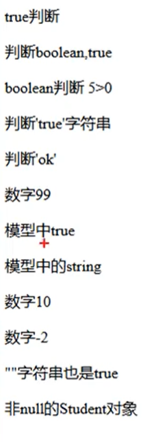

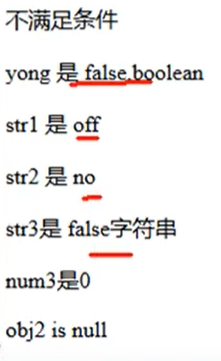

## 模板使用

模板就是公用资源，可以多次重复使用的内容。 经常把页眉，页脚， 菜单做成模板，在各个其他页面使用。 

模板使用，先定义再使用。

可以在当前页面定义模板，也可在其他页 面中定义模板。

1) 定义模板语法：

```html
<div th:fragment=”模板名称”>
模板内容
</div>
```

2. 引用模板

   1. 把模板插入到当前标签内部

   ```html
   <div insert=”模板所在文件名称::模板名称”>
   其他内容
   </div>
   ```

   2. 把模板完全替换当前标签

   ```html
   <div replace=”模板所在文件名称::模板名称”>
   其他内容
   </div
   ```

   3. 模板中的内容添加到当前标签内部

   ```html
   <div include=”模板所在文件名称::模板名称”>
   其他内容
   </div>
   ```

3. 模板引用语法

   1. : 模板所在文件名称:: 模板名称
   2. ~{模板所在文件名称:: 模板名称}

4. 模板作为函数形式使用

   ```html
   <div th:fragment="funtpl(one,two)">
   <p th:text="'hello' + ${one} +'-' + ${two}"> </p>
   </div>
   ```

   th: insert , th: replace 使用 funtpl 模板，可以传入

   ```html
   <div th:replace="frag/footer::funtpl(one='张三',two='李四')">
   我是参数模板
   </div>
   ```

5. 使用 id 定义和引用模板

   ```html
   <p id="tplId">我们学习的是模板</p>
   <div th:insert="::#tplId"></div>
   ```

6. 删除模板

   th: remove =”删除范围值” 

   1）all：删除包含标签及其所有 ⼦ 项

    2）body：不删除包含标签，但删除所有的 ⼦ 项 

   3）tag：删除外围包含标签，但不要删除其 ⼦ 项 

   4）all-but-first：删除第一个子项以外的其它所有子项 

   5）none：什么都不做。该值对于动态计算有 ⽤。null 也会被视为 none

   ```html
   <!--删除全部 本身和子标签-->
   <div th:remove="all">
       指定 all
       <p>hello
       	<span>world</span>
       </p>
   </div>
   <ul th:remove="body" >
       指定 body
       <p> welcome
           <span>thymleaf</span>
       </p>
   </ul>
   <div th:remove="tag">
       指定 tag
       <p> hello
       	<span>tag</span>
       </p>
   </div>
   <div th:remove="all-but-first">
       指定 all-but-first
       <p> 第一个子标签 </p>
       <p> 第二个子标签 </p>
   </div>
   <div th:remove="none">
       指定 none
       <p> 第一个子标签 </p>
       <p> 第二个子标签 </p>
   </div>
   ```

7. 模板名称可以通过模型数据 动态获取

## 内联 inline

需要在 thymleaf 表达式写到标签体中，而不是标签内，可以使用

 1）内联语法。 [[...]] 或 [(...)] 内联表达式，任何在 th: text 或 th: utext 属性中使 ⽤ 的表达式都可以出现在 [[]] 或 [()] 中使用，。

 [[...]] 等价于 th: text； [(...)] 等价于 th: utext 

2）禁用内联

原样输出的内容

```html
<body>
<!-- th:text [[...]] , th:utext=[(...)]-->
<p th:text="${name}">我是常用写法</p>
<p>内联语法：[[${name}]]</p>
<br/>
<p th:utext="${info}">我是常用写法</p>
<p>内联语法：[(${info})]</p>
<br/>
<p>禁用内联</p>
<p th:inline="none">[[我就是要这样显示]]</p>
<p th:inline="none">[(我是要这样显示)]</p>
```

3）使用 javascript 内联

```html
<script type=”text/javascript th:inline=”javascript”>
js 代码 ， 内联表达式
</script>
```

## 局部变量 with

th: with =”变量名 1 = 值 1, 变量名 2 = 值 2” ，定义的变量只在当前标 签内有效

```html
<!DOCTYPE html>
<html lang="en" xmlns:th="http://www.thymeleaf.org">
<head>
<meta charset="UTF-8">
<title>文本处理</title>
</head>
<body>
<div th:with="name='zhangsan'">定义变量</div>
<p th:text="${name}">使用变量</p>
<br/>
<!--html 注释-->
<!--/*
<div th:with="id=1002,name='lisi',myage=${age}">
<p th:text="${id}"></p>
<p th:text="${name}"></p>
<p th:text="${myage}"></p>
</div>
*/-->
</body>
</html
```

## 内置对象:# request,# session

```html
<!DOCTYPE html>
<html lang="en" xmlns:th="http://www.thymeleaf.org">
<head>
    <meta charset="UTF-8">
    <title>Title</title>
</head>
<body>
  <p>#request,就是javax.servlet.http.HttpServletRequest</p>
  contextPath:[[${#request.getContextPath()}]]
  <p th:text="${#request.getParameter('name')}"></p>
  <p th:text="${#request.getAttribute('attrName')}"></p>

  <p>#session,就是javax.servlet.http.Httpsession</p>
  <p th:text="${#session.getAttribute('sessionAttr')}"></p>
  <p th:text="${#session.getId()}"></p>
  <p th:text="${#session.getCreationTime()}"></p>

  <p>#servletContext,就是javax.servlet.http.HttpservletContext</p>
  <p th:text="${#servletContext.getAttribute('contextAttr')}"></p>
  <p th:text="${#servletContext.getServerInfo()}"></p>

</body>
</html>
```

快捷对象

```html
<p>hymeleaf 在 web 环境中，有一系列的快捷方式用于访问请
求参数、会话属性等应用属性
param, request,session,访问它们而无需#
</p>
<br/>
<p>param : 用于检索请求参数。 ${param.foo}是一个使用 foo 请
求参数的值 String[] ，所以${param.foo[0]} 将会 通常用于获取第一个
值。</p>
<p>param 获取参数： [[${param.foo[0]}]]</p>
<p>param 获取参数： [[${param.foo[1]}]]</p>
<p>参数数量：[[${param.size()}]]</p>
<p>是否有指定参数:[[${param.containsKey('name')}]]</p>
<p>参数值： [[${param.userid}]]</p>
<br/>
<p>session:⽤于获取 session 属性。与 param 同理，只是作用
域不同而已</p>
<p>作用域值的: [[${session.sessionAttr}]]</p>
蛙课网【动力节点旗下品牌】 http://www.wkcto.com
<p>session 中有几个值：[[${session.size()}]]</p>
<br/>
<p>application：⽤于获取应⽤程序或 servlet 上下⽂属性。与
param 同理。</p>
<p>ServletContext 作用域值的:
[[${application.contextAttr}]]</p>
<p>application 中有几个值：[[${application.size()}]]</p>
```


## 内置工具类:# strings,# dates,#lists

1）#{execInfo} : 模板信息

```
${#execInfo.templateName} 模板名称
${#execInfo.templateMode} 模板的处理模式
```

2）#uris

```
处理 url/uri 编码解码
${#uris.escapePath(uri)} //编码码
${#uris.escapePath(uri, encoding)} //指定编码转码
${#uris.unescapePath(uri)} //解码
${#uris.unescapePath(uri, encoding)} //指定编码解码
```

```html
<!DOCTYPE html>
<html lang="en" xmlns:th="http://www.thymeleaf.org">
<head>
    <meta charset="UTF-8">
    <title>Title</title>
</head>
<body th:with="url='http://localhost:8080/myweb/hello.jsp?name=tintin'">
  模板名称：<p th:text="${#execInfo.templateName}"></p><br/>
  模板模式：<p th:text="${#execInfo.templateMode}"></p><br/>
    <div th:with="escapeUrl = ${#uris.escapePath(url)}">
        <p>编码：[[${escapeUrl}]]</p>
        <p th:text="'解码：' + ${#uris.unescapePath(escapeUrl)}"></p>
    </div>
</body>
</html>
```

3）#dates：java.util.Date 对象的实 ⽤ 程序 ⽅ 法，可以操作数组，set， list。常用方法

```
${#dates.format(date, 'dd/MMM/yyyy HH:mm')}
${#dates.arrayFormat(datesArray, 'dd/MMM/yyyy HH:mm')}
${#dates.listFormat(datesList, 'dd/MMM/yyyy HH:mm')}
${#dates.setFormat(datesSet, 'dd/MMM/yyyy HH:mm')
```

```html
  原始日期：<p th:text="${date}"></p>
  格式化日期：<p th:text="${#dates.format(date,'yyyy-MM-dd HH:mm:ss')}"></p>
```

4）#numbers：数字对象的实 ⽤ 程序 ⽅ 法 

${#numbers.formatInteger(num, size)}：num 表示被格式的数字，size 表 示整数位最少保留几

```html
    原始数字：<p th:text="${price}"></p>
    格式化数字：<p th:text="${#numbers.formatInteger(price,0)}"></p>
    格式化数字：<p th:text="${#numbers.formatInteger(price,3)}"></p>
    格式化数字：<p th:text="${#numbers.formatInteger(price,5)}"></p>
    格式化数字：<p th:text="${#numbers.formatDecimal(price,3,2)}"></p>
```

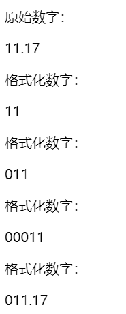

5）#strings String ⼯ 具类，就是字符串工具类

```
{#strings.toUpperCase(name)} 大写
${#strings.toLowerCase(name)} 小写
${#strings.arrayJoin(namesArray,',') 连接，合并
${#strings.arraySplit(namesStr,',')} 分隔
${#strings.indexOf(name,frag)} 查找
${#strings.substring(name,3,5)} 取子串
${#strings.contains(name,'ez')} 是否有子串
${#strings.isEmpty(name)} 空判断
```

6）其他的还有 #ids，#aggregates ，#maps ，#sets，#lists ， #arrays ， #bools

 
