# 技术栈介绍

前端视图基础:

* HTML：主要用于网页主体结构搭建
* CSS：主要用于页面美化
* JavaScript：主要用于页面元素动态处理


后端运行环境：Tomcat、JavaEE+MVC（主要讲解 Servlet）

进阶：最新语法要求 ES6、前端运行环境 Nodejs+npm、项目构建工具 vite、完整前端框架 Vue3、Router3、axios 等


# HTML

## 超文本标记语言

超文本标记语言（英语：HyperText Markup Language，简称：HTML）是一种用于创建网页的标准标记语言。

> 超文本：本质是文本文件，但将其他网页、图片、音频、适配等媒体资源引入当前网页中，呈现丰富的内容，最终效果超越了文本。
>
> 标记语言：不像 Java 这种编程语言，是由一系列标签组成的。每个标签都要它的固定含义和确定显示效果

## HTML 基础结构

创建文档：`index.html` 或 `index.html`。这两种后缀名没有区别，都可以使用。

> html 文件通常由服务器创建与保存，发送至客户浏览器中解析与展示

```html
<!DOCTYPE html><!--声明HTML的版本-->
<html><!--HTML 页面的根元素 所有其他标签都要在这里面-->
    <head><!--包含了文档的元（meta）数据，-->
        <meta charset="utf-8"><!--定义网页编码格式为 utf-8，即告诉浏览器用utf-8进行解码-->
        <title>hello world</title><!--文档的标题-->
    </head>
    <body><!--浏览器中可见的页面内容-->

        <h1>我的第一个标题</h1><!--大标题-->

        <p>我的第一个段落。</p><!--段落-->

    </body>
</html>
```

**文档声明**

从初期的网络诞生后，已经出现了许多 HTML 版本:

HTML	1991
HTML+	1993
HTML 2.0	1995
HTML 3.2	1997
HTML 4.01	1999
XHTML 1.0	2000
HTML5	2012
XHTML5	2013

* HTML5	

```
<!DOCTYPE html>
```

* HTML 4.01

```html
<!DOCTYPE HTML PUBLIC "-//W3C//DTD HTML 4.01 Transitional//EN"
"http://www.w3.org/TR/html4/loose.dtd">
```

* XHTML 1.0

```html
<!DOCTYPE html PUBLIC "-//W3C//DTD XHTML 1.0 Transitional//EN"
"http://www.w3.org/TR/xhtml1/DTD/xhtml1-transitional.dtd">
```

## HTML 标签

HTML 标记标签通常被称为 HTML 标签 (HTML tag)。

- HTML 标签是由尖括号包围的关键词，比如 `<html>`
- HTML 标签通常是成对出现的，比如 <b> 粗体标签 </b>
- 标签对中的开头的标签是开始标签（开放标签），最后的标签是结束标签（闭合标签）

## HTML 元素

严格来讲, HTML 元素 (HTML element)是从开始标签到结束标签之间的完整结构。

**元素嵌套**

HTML 元素可以相互嵌套，形成树状结构：

- 一个元素可以包含其他元素
- HTML 文档本质上是一个嵌套结构（DOM 树）

```html
<h1>Welcome!</h1>
```

**空元素**

空元素是指那些不能包含任何子节点（例如内嵌的元素或文本节点）的元素。空标签只有开始标签，没有结束标签。通常在开始标签中自闭合（如 `<br />`）

常见的 HTML 空元素

`<br>`、`<hr>`、``、`<input>`、`<meta>`、`<link>`

**空格合并**

元素内容中多个连续的空格字符裁减（合并）为一个：

## HTML 属性

- HTML 元素可以设置 **属性**
- 属性可以在元素中添加 **附加信息**
- 属性一般描述于 **开始标签**
- 属性总是以名称/值对的形式出现，比如：`name="value"`。

```html
<!--双引号是最常用的-->
<a href="https://www.runoob.com">Link</a>
<!--也可以使用单引号-->
<a href='https://www.runoob.com'>Link</a>
<!--属性值已包含引号-->
<a href="https://www.runoob.com?q='search'">Link</a>
```

### 常见属性

| 属性名        | 适用元素                                          | 说明                                                         |
| :------------ | :------------------------------------------------ | :----------------------------------------------------------- |
| `id`          | 所有元素                                          | 为元素指定唯一的标识符。                                     |
| `class`       | 所有元素                                          | 为元素指定一个或多个类名，用于 CSS 或 JavaScript 选择。      |
| `style`       | 所有元素                                          | 直接在元素上应用 CSS 样式。                                  |
| `title`       | 所有元素                                          | 为元素提供额外的提示信息，通常在鼠标悬停时显示。             |
| `data-*`      | 所有元素                                          | 用于存储自定义数据，通常通过 JavaScript 访问。               |
| `href`        | `<a>`, `<link>`                                   | 指定链接的目标 URL。                                         |
| `src`         | ``, `<script>`, `<iframe>`                   | 指定外部资源（如图片、脚本、框架）的 URL。                   |
| `alt`         | ``                                           | 为图像提供替代文本，当图像无法显示时显示。                   |
| `type`        | `<input>`, `<button>`                             | 指定输入控件的类型（如 `text`, `password`, `checkbox` 等）。 |
| `value`       | `<input>`, `<button>`, `<option>`                 | 指定元素的初始值。                                           |
| `disabled`    | 表单元素                                          | 禁用元素，使其不可交互。                                     |
| `checked`     | `<input type="checkbox">`, `<input type="radio">` | 指定复选框或单选按钮是否被选中。                             |
| `placeholder` | `<input>`, `<textarea>`                           | 在输入框中显示提示文本。                                     |
| `target`      | `<a>`, `<form>`                                   | 指定链接或表单提交的目标窗口或框架（如 `_blank` 表示新标签页）。 |
| `readonly`    | 表单元素                                          | 使输入框只读。                                               |
| `required`    | 表单元素                                          | 指定输入字段为必填项。                                       |
| `autoplay`    | `<audio>`, `<video>`                              | 自动播放媒体。                                               |
| `onclick`     | 所有元素                                          | 当用户点击元素时触发 JavaScript 事件。                       |
| `onmouseover` | 所有元素                                          | 当用户将鼠标悬停在元素上时触发 JavaScript 事件。             |
| `onchange`    | 表单元素                                          | 当元素的值发生变化时触发 JavaScript 事件。                   |
| `cellspacing` | `<table>`                                         | 单元格间距                                                   |

## HTML 语法规则

* 根标签有且只能有一个
* 无论是双标签还是单标签都需要正确关闭
* 标签可以嵌套但不能交叉嵌套
* 注释语法为 `<--注释内容-->`，注意不能嵌套
* 属性必须有值，值必须加引号，**H5 中属性名和值相同时可以省略属性值**
* 不严格区分字符串使用单双引号
  * 单双引号适合嵌套时交替使用
* 标签不严格区分大小写，但是不能大小写混用
* 不允许自定义标签名，强行自定义则无效

> 假如忘了使用结束标签，大多数浏览器浏览器会自动补全缺失的结束标签，正确地将 HTML 显示出来

## 常见 HTML 标签

### 标题

<h1> 这是标题 1 </h1>
<h2> 这是标题 2 </h2>
<h3> 这是标题 3 </h3>

### 水平线

<hr/>

### 注释

<!-- 这是一个注释 -->

### 段落

<p> 这是一个段落 </p> <p> 这是另一个段落 </p>

### 换行

<p> 这个<br>段落<br>演示了分行的效果 </p>

### 文本格式化

<div>
    <b> 加粗文本 </b><br>
    <strong> 重要文本 </strong><br>
    <i> 斜体文本 </i><br>
    <em> 强调文本 </em><br>
    <mark> 高亮文本 </mark><br>
    <small> 小号文本 </small><br>
    <del> 删除文本 </del><br>
    <ins> 插入文本 </ins><br>
    <sub> 下标文本 </sub><br>
    <sup> 上标文本 </sup><br>
    <u>下划线文本</u><br>
</div>


### 超链接

* `href` 属性：定义链接目标。
  * 完整 url
  * 相对路径：以当前资源所在路径起始去找目标资源
  * 绝对路径：以 `/` 为开头，以固定位置起始去找目标资源
* `target` 属性：定义链接的打开方式。
  * `_blank`: 在新窗口或新标签页中打开链接。
  * `_self`: 在当前窗口或标签页中打开链接（默认）。
  * `_parent`: 在父框架中打开链接。
  * `_top`: 在整个窗口中打开链接，取消任何框架。

<a href="https://www.runoob.com/html/html-links.html"> 跳转 URL </a>

 <a href="a/a.html"> 跳转相对路径 </a>

 <a href="/demo-html/a/a.html"> 跳转绝对路径 </a>

### 图像

在 HTML 中，图像由 `` 标签定义。

* `src` 属性：指定存储图像的位置
* `title` 属性：鼠标悬停时的文章
* `Alt` 属性：图片加载失败时显示的提示文本


### 列表

无序列表

<ul>
<li> Coffee </li>
<li> Milk </li>
</ul>

有序列表

<ol>
<li> Coffee </li>
<li> Milk </li>
</ol>

嵌套

<ol>
    <li> Coffee
    	<ul>
            <li> Coffee1 </li>
            <li> Coffee2 </li>
        </ul>
    </li>
    <li> Milk </li>
</ol>
### 表格

HTML 表格由 `<table>` 标签来定义。

* `<thead>` ：在 `<thead >` 中，使用 `<tr>` 元素定义行，使用 `<th>` 元素定义列的标题。通常会使背景变灰。
* `<tbody>` ：在 `<tbody >` 中，使用 `<tr>` 元素定义行，并在每行中使用 `<td>` 元素定义单元格数据。

- `tr`： table row 的缩写，表示表格的一行。
- `td`：table data 的缩写，表示表格的数据单元格。
- `th`：table header 的缩写，表示表格的表头单元格。通常会使文字加粗。

<h3 style="text-align: center;"> 表格示例 </h3>
<table border="1" style="margin: 0px auto; width: 400px;">
    <thead>
        <tr>
            <th> 列标题 1 </th>
            <th> 列标题 2 </th>
            <th> 列标题 3 </th>
            <th> 列标题 4 </th>
        </tr>
    </thead>
    <tbody>
        <tr>
            <td> 行 1，列 1 </td>
            <td> 行 1，列 2 </td>
            <td> 行 1，列 3 </td>
            <td rowspan="3"> 跨行，列 4 </td>
        </tr>
        <tr>
        	<td colspan="3" > 行 2，跨列 </td>
        </tr>
        <tr>
            <td> 行 3，列 1 </td>
            <td> 行 3，列 2 </td>
            <td> 行 3，列 3 </td>
        </tr>
    </tbody>
    <tfoot>
        <tr>
            <td> 表尾 1 </td>
            <td> 表尾 2 </td>
            <td> 表尾 3 </td>
            <td> 表尾 4 </td>
        </tr>
    </tfoot>
</table>


### 表单

- `<form>` 元素用于创建表单

  - `action` 属性：定义表单数据提交地址
  - `method` 属性：定义数据提交的 HTTP 请求方式
    -  `get` （默认）：将数据以键值对的形式接在 url 后面提交。地址栏明文暴露，相对不安全。地址栏长度有限，提交量不大。只能提交纯文本数据。
    - `post`：表单数据会包含在表单体内然后发送给服务器，用于提交敏感数据，如用户名与密码等。
- `<label>` 元素用于为表单元素添加标签。标签不会向用户呈现任何特殊效果，但是为鼠标用户改进了可用性，在 label 元素内点击文本，就会触发此控件。
  -  `for` 属性必须等于相关元素的 `id` 属性才能将它们绑定在一起。也可以通过将元素放置在 `<label>` 元素内将标签绑定到元素。

- `<input>` 元素是最常用的表单元素之一，它可以创建文本输入框、密码框、单选按钮、复选框等。
  - `type` 属性：定义了输入框的类型
    - 单行文本框 text
    - 密码框 password
    - 提交按钮 submit
    - 重置按钮 reset
    - 单选框 radio
    - 多选框 checkbox
    - 隐藏域 hidden
    - 文件上传 file
    
  - `id` 属性：用于关联 `<label>` 元素
  - `name` 属性：用于标识表单字段，也就是提交参数中的 key
  - `value` 属性：实际上就是用户在框中输入的值，也就是提交参数中的 value
  - `checked` 属性：在单选框和多选框中表示选中
  - `readonly` 属性：表示输入框只读无法填写
  - `disabled` 属性：表示输入框不可用，不会作为数据提交
- `<textarea>` 元素用于多行文本输入，其输入
- `<select>` 元素用于创建下拉列表
- `<option>` 元素用于定义下拉列表中的选项
  - `selected` 属性：表示下拉列表中的选项已选中

	<form action="/demo-html/a/inputForm.html" method="get">
        用户名: <input type="text" id="username" name="username"><br>
        密码：<input type="password" id="pwd" name="pwd"><br>
        单选：<input type="radio" id="male" name="gender" value="male" checked> 男
        <input type="radio" id="female" name="gender" value="female"> 女<br>
        多选：<input type="checkbox" id="hobby1" name="hobby" value="reading" checked> 阅读
        <input type="checkbox" id="hobby2" name="hobby" value="sports"> 运动
        <input type="checkbox" id="hobby3" name="hobby" value="music"> 音乐<br>
        文本域：<textarea name="message" id="message" cols="30" rows="5"> </textarea><br>
        隐藏域：<input type="hidden" name="token" value="123456"><br>
        选项：<select name="country" id="country">
            <option value="usa"> 美国 </option>
            <option value="china"> 中国 </option>
            <option value="japan"> 日本 </option>
        </select><br>
        文件上传：<input type="file" name="file"><br>
        <label for="clickmelabel"> 点击该标签：</label> <input type="text" id="clickmelabel" name="clickmelabel"><br>
        <label > 点击该标签：<input type="text" id="clickmelabel2" name="clickmelabel2"> </label><br>
        <input type="submit" value="提交">
        <input type="reset" value="清空">
    </form>

### 布局

* 块级元素：显示时是会以新行开始。如 `<h1>`, `<p>`, `<ul>`, `<table>`。其 CSS 样式的宽高通常都是生效的
* 内联元素：显示时不会以新行开始。如 `<b>`, `<td>`, `<a>`, `` 其 CSS 样式的宽高通常是不生效的

HTML 可以通过 `<div>` 和 `<span>` 将元素组合起来。

HTML `<div>` 元素是块级元素，它可用于组合其他 HTML 元素的容器。

HTML `<span>` 元素是内联元素，可用作文本的容器

<div style="border: 1px solid red; width: 500px; height: 300px; margin: 0 auto ; background-color: grey;">
        <span style="color: blue;">块1文本1</span>
        <span style="color: aqua;">块1文本2</span>
    </div>

    <div style="border: 1px solid red; width: 500px; height: 300px; margin: 0 auto ; background-color: grey;"> 块 2 </div>
    <div style="border: 1px solid red; width: 500px; height: 300px; margin: 0 auto ; background-color: grey;"> 块 3 </div>

## HTML 字符实体

HTML 中的预留字符必须被替换为字符实体。

一些在键盘上找不到的字符也可以使用字符实体来替换。

<!DOCTYPE html>
<html lang="en">
<head>
    <meta charset="UTF-8">
    <title> Document </title>
</head>
<body>
    &lt; h1&gt; 标题&lt;/h1&gt;
</body>
</html>

| 显示结果 | 描述        | 实体名称          | 实体编号 |
| :------- | :---------- | :---------------- | :------- |
|          | 空格        | &nbsp;            | &#160;   |
| <        | 小于号      | &lt;              | &#60;    |
| >        | 大于号      | &gt;              | &#62;    |
| &        | 和号        | &amp;             | &#38;    |
| "        | 引号        | &quot;            | &#34;    |
| '        | 撇号        | &apos; (IE 不支持) | &#39;    |
| ￠       | 分          | &cent;            | &#162;   |
| £        | 镑          | &pound;           | &#163;   |
| ¥        | 人民币/日元 | &yen;             | &#165;   |
| €        | 欧元        | &euro;            | &#8364;  |
| §        | 小节        | &sect;            | &#167;   |
| ©        | 版权        | &copy;            | &#169;   |
| ®        | 注册商标    | &reg;             | &#174;   |
| ™        | 商标        | &trade;           | &#8482;  |
| ×        | 乘号        | &times;           | &#215;   |
| ÷        | 除号        | &divide;          | &#247;   |

> 实体字符对大小写敏感。
>
> 除以上预留字符，还有更多符号，如货币、希腊字母、数学运算符等

# CSS

## 层叠样式表

CSS (Cascading Style Sheets，层叠样式表），是一种用来为结构化文档（如 HTML 文档或 XML 应用）添加样式（字体、间距和颜色等）的计算机语言，CSS 文件扩展名为 `.css`。

## CSS 引入方式和语法

### 内联样式

通过元素 `style` 属性引入样式。这种方式代码复用性低，不利于维护；css 样式代码和结构代码交织，影响阅读；影响文件大小，影响传输和解析性能。

```html
<input type = "button" value = "按钮" 
       style ="width: 70px; height: 50px;
               background-color: greenyellow; 
               font-size: 20px; font-family: '隶书';
               border: 2px solid green; 
               border-radius: 5px; 
               color: black;" />
    <!--宽高-->
    <!--背景颜色-->
    <!--字体大小、字体-->
    <!--边框：宽度、样式、颜色-->
    <!--边框圆角-->
```


### 内部样式表

通过 `head` 标签中的 `style` 标签定义本页面的公共样式。

通过选择器确定样式的作用的元素

```html
	<style>
        input{
            width: 80px; 
            height: 60px;
            background-color: greenyellow; 
            font-size: 20px; 
            font-family: '隶书';
            border: 2px solid green; 
            border-radius: 5px;
            color: white;
        }
    </style>
```


### 外部样式表

css 代码单独放入 `.css` 文件中，由 html 通过 `link` 标签引入

* `link` 标签定义文档与外部资源的关系
  * `rel` 属性：必需。定义当前文档与被链接文档之间的关系。rel 是 relationship 的英文缩写。此处引入外部样式表，值为 `stylesheet`
  * `href` 属性：定义被链接文档的位置。

```html
<head>
    <meta charset="UTF-8">
    <title>Document</title>

    <link rel="stylesheet" href="/demo-css/css/btn.css">
</head>
```

## 简单选择器

### 元素选择器

根据标签的名字确定样式作用的元素。

### id 选择器

根据标签的 `id` 属性值确定样式作用的元素。

> 在 HTML 规范上，不同的 HTML 不应该被赋予相同的 ID， ID 属性值需要保持唯一性。

### class 选择器

根据元素的 `class` 属性确定样式作用的元素。

> `class` 属性值允许重复，且一个元素的 `class` 属性可以有多个值

### 示例

```css
<!DOCTYPE html>
<html lang="en">
<head>
    <meta charset="UTF-8">
    <meta name="viewport" content="width=device-width, initial-scale=1.0">
    <title>Document</title>
    <style>
        input {
            width: 70px; 
            height: 30px;
            background-color: greenyellow; 
            font-size: 20px; 
            font-family: '隶书';
            border: 2px solid green; 
            border-radius: 5px;
        }
        #btn3 {
            color: red;
            background-color: orange;
            border: 2px solid red;
        }
        #btn4 {
            color: blue;
            background-color: skyblue;
            border: 2px solid blue;
        }
        .shapeClass {
            width: 100px; 
            height: 60px;
            border-radius: 10px;
        }
        .colorClass {
            background-color: gray;
            color: white;
            border: 2px solid black;
        }
        .fontClass {
            font-size: 30px; 
            font-family: '宋体';
        }
    </style>
</head>
<body>
    <input type="button" value="按钮1"/>
    <input type="button" value="按钮2"/>
    <input id="btn3" type="button" value="按钮3"/>
    <input id="btn4" type="button" value="按钮4"/>
    <input class="shapeClass colorClass fontClass" type="button" value="按钮5"/>
</body>
</html>
```


### 与或关系

元素选择器和类选择器连写，表示需要同时满足元素类型和 class 属性

```css
div.box {
  background: blue;
}
```

用逗号 , 将多个选择器隔开，表示“或”的关系。

```css
h1, h2, h3 {
  color: blue;
}

```

## 组合选择器

### 后代选择器

用于选取某元素的后代元素。

```css
div p{background-color:yellow;}/*选取在<div>元素之中的<p>元素*/
```

### 子元素选择器

只能选择作为某元素直接/一级子元素的元素

```css
div>p{background-color:yellow;}/*选取在<div>元素里的直接子元素<p>*/
```

### 相邻兄弟选择器

选择紧接在另一元素后的第一个元素，且二者有相同父元素。

```css
div+p{background-color:yellow;}/*选取紧接<div>元素后的第一个<p>元素*/
```

### 后续兄弟选择器

选择在另一元素之后的所有兄弟元素。

```css
div>p{background-color:yellow;}/*选取紧接<div>元素后的所有<p>元素*/
```

## 伪类选择器

伪类用于定义元素的特殊状态，可以为选择器添加一些特殊效果。

实例：当您将鼠标悬停在例子中的链接上时，它会改变颜色

```css
a.highlight:hover {
  color: #ff0000;
}
```

| 选择器                 | 例子                    | 例子描述                                                     |
| :--------------------- | :---------------------- | :----------------------------------------------------------- |
| `:active`              | `a:active`              | 选择活动的链接。                                             |
| `:checked`             | `input:checked`         | 选择每个被选中的 <input> 元素。                              |
| `:disabled`            | `input:disabled`        | 选择每个被禁用的 <input> 元素。                              |
| `:empty`               | `p:empty`               | 选择没有子元素的每个 <p> 元素。                              |
| `:enabled`             | `input:enabled`         | 选择每个已启用的 <input> 元素。                              |
| `:first-child`         | `p:first-child`         | 选择作为其父的首个子元素的每个 <p> 元素。                    |
| `:first-of-type`       | `p:first-of-type`       | 选择作为其父的首个 <p> 元素的每个 <p> 元素。                 |
| `:focus`               | `input:focus`           | 选择获得焦点的 <input> 元素。                                |
| `:hover`               | `a:hover`               | 选择鼠标悬停其上的链接。                                     |
| `:in-range`            | `input:in-range`        | 选择具有指定范围内的值的 <input> 元素。                      |
| `:invalid`             | `input:invalid`         | 选择所有具有无效值的 <input> 元素。                          |
| `:lang(language)`      | `p:lang(it)`            | 选择每个 lang 属性值以 "it" 开头的 <p> 元素。                |
| `:last-child`          | `p:last-child`          | 选择作为其父的最后一个子元素的每个 <p> 元素。                |
| `:last-of-type`        | `p:last-of-type`        | 选择作为其父的最后一个 <p> 元素的每个 <p> 元素。             |
| `:link`                | `a:link`                | 选择所有未被访问的链接。                                     |
| `:not(selector)`       | `:not(p)`               | 选择每个非 <p> 元素的元素。                                  |
| `:nth-child(n)`        | `p:nth-child(2)`        | 选择作为其父的第二个子元素的每个 <p> 元素。                  |
| `:nth-last-child(n)`   | `p:nth-last-child(2)`   | 选择作为父的第二个子元素的每个 <p> 元素，从最后一个子元素计数。 |
| `:nth-last-of-type(n)` | `p:nth-last-of-type(2)` | 选择作为父的第二个 <p> 元素的每个 <p> 元素，从最后一个子元素计数 |
| `:nth-of-type(n)`      | `p:nth-of-type(2)`      | 选择作为其父的第二个 <p> 元素的每个 <p> 元素。               |
| `:only-of-type`        | `p:only-of-type`        | 选择作为其父的唯一 <p> 元素的每个 <p> 元素。                 |
| `:only-child`          | `p:only-child`          | 选择作为其父的唯一子元素的 <p> 元素。                        |
| `:optional`            | `input:optional`        | 选择不带 "required" 属性的 <input> 元素。                    |
| `:out-of-range`        | `input:out-of-range`    | 选择值在指定范围之外的 <input> 元素。                        |
| `:read-only`           | `input:read-only`       | 选择指定了 "readonly" 属性的 <input> 元素。                  |
| `:read-write`          | `input:read-write`      | 选择不带 "readonly" 属性的 <input> 元素。                    |
| `:required`            | `input:required`        | 选择指定了 "required" 属性的 <input> 元素。                  |
| `:root`                | `root`                  | 选择元素的根元素。                                           |
| `:target`              | `#news:target`          | 选择当前活动的 #news 元素（单击包含该锚名称的 URL）。        |
| `:valid`               | `input:valid`           | 选择所有具有有效值的 <input> 元素。                          |
| `:visited`             | `a:visited`             | 选择所有已访问的链接。                                       |

## 伪元素选择器

CSS 伪元素用于设置元素指定部分的样式，可以为选择器添加一些特殊效果。

实例：向 `<p>` 元素文本的首行添加特殊样式

```css
p::first-line {
  color: #ff0000;
  font-variant: small-caps;
}
```

| 选择器           | 例子              | 例子描述                        |
| :--------------- | :---------------- | :------------------------------ |
| `::after`        | `p::after`        | 在每个 `<p>` 元素之后插入内容。 |
| `::before`       | `p::before`       | 在每个 `<p>` 元素之前插入内容。 |
| `::first-letter` | `p::first-letter` | 选择每个 `<p>` 元素的首字母。   |
| `::first-line`   | `p::first-line`   | 选择每个 `<p>` 元素的首行。     |
| `::selection`    | `p::selection`    | 选择用户选择的元素部分。        |

## 属性选择器

CSS 属性选择器用于选取带有指定属性的元素。

实例：选择所有带有 `target` 属性的 `<a>` 元素；

```css
a[target] {
  background-color: yellow;
}
```

| 选择器                 | 例子                  | 例子描述                                                     |
| :--------------------- | :-------------------- | :----------------------------------------------------------- |
| `[attribute]`          | `[target]`            | 选择带有 `target` 属性的所有元素。                           |
| `[attribute=value]`    | `[target=_blank]`     | 选择带有 `target="_blank"` 属性的所有元素。                  |
| `[attribute~=value]`   | `[title~=flower]`     | 选择带有包含 `"flower"` 一词的 `title` 属性的所有元素。      |
| `[attribute|=value]`   | `[lang|=en]`          | 选择带有以 `"en"` 开头的 `lang` 属性的所有元素。             |
| `[attribute^=value]`   | `a[href^="https"]`    | 选择其 `href` 属性值以 `"https"` 开头的每个 `<a>` 元素。     |
| `[attribute$=value]`   | `a[href$=".pdf"]`     | 选择其 `href` 属性值以 `".pdf"` 结尾的每个 `<a>` 元素。      |
| `[attribute**=value*]` | `a[href*="w3school"]` | 选择其 `href` 属性值包含子串 `"w3school"` 的每个 `<a>` 元素。 |

## CSS 常见属性

### 背景

| 属性                  | 描述                                         |
| :-------------------- | :------------------------------------------- |
| background            | 简写属性，作用是将背景属性设置在一个声明中。 |
| background-attachment | 背景图像是否固定或者随着页面的其余部分滚动。 |
| background-color      | 设置元素的背景颜色。                         |
| background-image      | 把图像设置为背景。                           |
| background-position   | 设置背景图像的起始位置。                     |
| background-repeat     | 设置背景图像是否及如何重复。                 |

```css
h1 {background-color:#6495ed;} /*十六进制*/
p {background-color:rgb(255,0,0);} /*rgb颜色值*/
div {background-color:red;} /*颜色名称*/

body {
    background-image:url('/demo-css/img/logo.png'); /*背景图像*/
    background-repeat:repeat-x; /*水平平铺*/
    background-repeat:repeat-y; /*垂直平铺*/
    background-repeat:no-repeat; /*不平铺*/
    background-position: right top; /*背景图像位置*/
    background:#ffffff url('/demo-css/img/logo.png') no-repeat right top; /*背景简写属性*/
}
```

### 文本

| 属性            | 描述                     |
| :-------------- | :----------------------- |
| color           | 设置文本颜色             |
| direction       | 设置文本方向。           |
| letter-spacing  | 设置字符间距             |
| line-height     | 设置行高                 |
| text-align      | 对齐元素中的文本         |
| text-decoration | 向文本添加修饰           |
| text-indent     | 缩进元素中文本的首行     |
| text-shadow     | 设置文本阴影             |
| text-transform  | 控制元素中的字母         |
| unicode-bidi    | 设置或返回文本是否被重写 |
| vertical-align  | 设置元素的垂直对齐       |
| white-space     | 设置元素中空白的处理方式 |
| word-spacing    | 设置字间距               |

```css
h1 {
    color:#00ff00; /*文本颜色*/
    text-align:center; /*文本的水平对齐方式*/
    text-indent:50px; /*文本首行缩进*/
}
a {text-decoration:none;} /*删除文本装饰 主要用于消除链接下划线*/
p.uppercase {text-transform:uppercase;} /*文本转换大写*/
p.lowercase {text-transform:lowercase;} /*文本转换小写*/
p.capitalize {text-transform:capitalize;} /*文本转换首字母大写。*/
```

### 字体

| 属性         | 描述                                 |
| :----------- | :----------------------------------- |
| font         | 在一个声明中设置所有的字体属性       |
| font-family  | 指定文本的字体系列                   |
| font-size    | 指定文本的字体大小                   |
| font-style   | 指定文本的字体样式                   |
| font-variant | 以小型大写字体或者正常字体显示文本。 |
| font-weight  | 指定字体的粗细。                     |

```css
p{
    font-family:"Times New Roman", Times, serif;/*字体系列 设置几个字体名称作为后备*/
	font-style:normal; /*italic 斜体 oblique 倾斜的文字*/
    font-size:40px;/* 1em=16px */
} 
```

### 列表标记

| 属性                | 描述                                               |
| :------------------ | :------------------------------------------------- |
| list-style          | 简写属性。用于把所有用于列表的属性设置于一个声明中 |
| list-style-image    | 将图像设置为列表项标志。                           |
| list-style-position | 设置列表中列表项标志的位置。                       |
| list-style-type     | 设置列表项标志的类型。                             |

```css
ul.a {list-style-type: circle;} /* 圆形列表 */
ul.b {list-style-type: square;} /* 方形列表 */

ol.c {list-style-type: upper-roman;} /* 大写罗马数字列表 */
ol.d {list-style-type: lower-alpha;} /* 小写字母列表 */

ul.img {list-style-image: url('/demo-css/img/icon.ico');} /* 图片列表 */
```

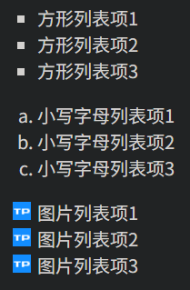

### 边框

| 属性                                 | 描述                                                         |
| :----------------------------------- | :----------------------------------------------------------- |
| border [-top/right/bottom/left]       | 简写属性，用于把针对所有/上/右/下/左的属性设置在一个声明。   |
| border [-top/right/bottom/left]-style | 简写属性，用于设置元素所有/上/右/下/左边框的样式             |
| border [-top/right/bottom/left]-width | 简写属性，用于为元素的所有/上/右/下/左边框设置宽度           |
| border [-top/right/bottom/left]-color | 简写属性，用于设置元素的所有/上/右/下/左边框中可见部分的颜色 |
| border-radius                        | 设置圆角的边框。                                             |

### 尺寸

| 属性             | 描述                         |
| :--------------- | :--------------------------- |
| [max/min-] height | 设置元素的 [最大/最小] 高度。  |
| [max/min-] width  | 设置元素的 [最大/最小] 宽度。  |
| line-height      | 设置行高（多行文本的间距）。 |

### 可见性

```css
h1.hidden {visibility:hidden;} /*隐藏的元素仍需占用与未隐藏之前一样的空间*/
h1.hidden {display:none;} /*隐藏的元素不会占用任何空间*/
```

### 内联元素和块元素

```css
div {display:inline;} /*使div变成内联元素*/
span {display:block;} /*使span变成块元素*/
```


## CSS 布局属性

### CSS 浮动

CSS 的 Float（浮动），会使元素向左或向右移动，其周围的元素也会重新排列。一个浮动元素会尽量向左或向右移动，直到它的外边缘碰到包含框或另一个浮动框的边框为止。

> 浮动的设计初衷是为了解决文字环绕图片问题，浮动以后图像一定不会将文字挡住。

```html
<!DOCTYPE html>
<html lang="en">
<head>
    <meta charset="UTF-8">
    <meta name="viewport" content="width=device-width, initial-scale=1.0">
    <title>Document</title>
    <style>
        .outerDiv {
            width: 500px; 
            height: 300px; 
            border: 2px solid black; 
            background-color: navajowhite;
        }
        .innerDiv {
            width: 100px; 
            height: 100px;
            border: 1px solid skyblue;
        }
        .d1 {
            background-color: lightcoral;
        }
        .d2 {
            background-color: lightgreen;
        }
        .d3 {
            background-color: lightblue;
        }
        .floatRight {
            float: right;
        }
        .floatLeft {
            float: left;
        }
        .textBorder {
            border: 1px solid red;
        }
    </style>
</head>
<body>
    <div class="outerDiv">
        <div class="textBorder">块元素默认在一行显示 div就是一个块元素 其display属性默认为block</div>
        <div class="innerDiv d1" >div1</div>
        <div class="innerDiv d2" >div2</div>
        <div class="innerDiv d3" >div3</div>
    </div>
    <div class="outerDiv">
        <div class="textBorder">加了float 样式，使得div元素可以左右浮动。</div>
        <div class="textBorder">div2的元素将会被div1挡住 但是其文本环绕div1</div>
        <div class="innerDiv d1 floatLeft" >div1</div>
        <div class="innerDiv d2 " >div2</div>
        <div class="innerDiv d3 floatRight" >div3</div>
    </div>
</body>
</html>
```

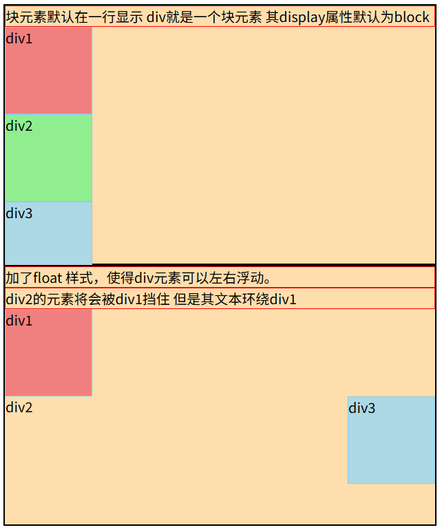

### CSS 定位

`position` 属性用于指定元素的定位方式。

* `staitc`：默认值，元素按照正常文档流排列，不受 top/right/bottom/left 影响
* `relative`：相对自身原始位置进行偏移，**不会脱离文档流**
* `absolute`：相对于最近的已定位祖先元素进行定位（否则相对于 body），**脱离文档流**
* `fixed`：相对于浏览器窗口定位，滚动页面时位置不会改变，**脱离文档流**
* `sticky`：在滚动到指定位置前表现为 relative，之后表现为 fixed

```html
<!DOCTYPE html>
<html lang="en">
<head>
    <meta charset="UTF-8">
    <meta name="viewport" content="width=device-width, initial-scale=1.0">
    <title>Document</title>
    <style>
        .outerDiv {
            width: 500px; 
            height: 300px; 
            border: 2px solid black; 
            background-color: navajowhite;

            position: absolute
        }
        .innerDiv {
            width: 100px; 
            height: 100px;
            border: 1px solid skyblue;
        }
        .d1 {
            background-color: lightcoral;
            position: absolute;
            top: 100px;
            right: 100px;
        }
        .d2 {
            background-color: lightgreen;
            position: relative;
            top: 30px;
            left: 80px;
        }
        .d3 {
            background-color: lightblue;
        }
        .d4 {
            background-color: lightyellow;
            position: fixed;
            bottom: 100px;
            right: 100px;
        }
        .d5 {
            background-color: lightpink;
        }
    </style>
</head>
<body>
    <div class="outerDiv">
        <div class="innerDiv d1" >绝对定位div1(相对于已定位的父元素)</div>
        <div class="innerDiv d2" >相对定位div2(相对于元素原本位置)</div>
        <div class="innerDiv d3" >静态定位div3</div>
        <div class="innerDiv d4" >固定定位div4(相对于浏览器窗口)</div>
        <div class="innerDiv d5" >静态定位div5</div>
    </div>
    <!-- 使内容超出浏览器页面 出现滚轮-->
    <br><br><br><br><br><br><br><br><br><br><br><br><br><br><br><br><br><br><br><br><br><br><br><br><br><br><br><br><br><br><br><br><br><br><br><br><br><br><br><br><br><br><br><br><br><br><br><br><br><br><br><br><br><br><br><br>
</body>
</html>
```


### CSS 盒子模型

所有 HTML 元素可以看作盒子，在 CSS 中，"box model" 这一术语是用来设计和布局时使用。

CSS 盒模型本质上是一个盒子，封装周围的 HTML 元素，它包括：边距，边框，填充，和实际内容。

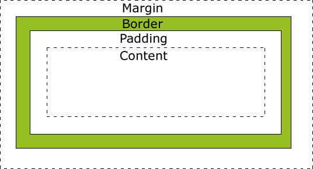

不同部分的说明：

- **Margin(外边距)** - 清除边框外的区域，外边距是透明的。
- **Border(边框)** - 围绕在内边距和内容外的边框。
- **Padding(内边距)** - 清除内容周围的区域，内边距是透明的。
- **Content(内容)** - 盒子的内容，显示文本和图像。

```html
<!DOCTYPE html>
<html lang="en">
<head>
    <meta charset="UTF-8">
    <meta name="viewport" content="width=device-width, initial-scale=1.0">
    <title>Document</title>
    <style>
        .outerDiv {
            width: 500px; 
            height: 300px; 
            border: 2px solid black; 
            background-color: navajowhite;
            margin: 0px auto; /* 上下，左右 */
        }
        .innerDiv {
            width: 100px; 
            height: 100px;
            border: 1px solid skyblue;
            float: left;
        }
        .d1 {
            background-color: lightcoral;
            padding-right: 20px;
            padding-left: 20px;
            padding-top: 20px;
            padding-bottom: 20px;
            /* padding: 10px 20px 30px 40px; */ /* 顺时针：上右下左 */
        }
        .d2 {
            background-color: lightgreen;
            margin-right: 10px;
            margin-left: 10px;
            margin-top: 10px;
            margin-bottom: 10px;
            /* margin: 10px 20px 30px 40px; */ /* 顺时针：上右下左 */
        }
        .d3 {
            background-color: lightblue;
        }
    </style>
</head>
<body>
    <div class="outerDiv">
        <div class="innerDiv d1" >div1</div>
        <div class="innerDiv d2" >div2</div>
        <div class="innerDiv d3" >div3</div>
    </div>
</body>
</html>
```

# JavaScript

## JS 简介

JavaScript 是一门跨平台、面向对象的脚本语言，它能使网页可交互（例如，拥有复杂的动画、可点击的按钮、弹出菜单等）。

还有一些更高级的服务器端 JavaScript 版本，如 Node.js，它们允许你为网站添加添加更多功能。


### JS 起源

JavaScript 是一种由 Netscape(网景)的 LiveScript 发展而来的原型化继承的面向对象的动态类型的区分大小写的客户端脚本语言，主要目的是为了解决服务器端语言，遗留的速度问题，为客户提供更流畅的浏览效果。

当时服务端需要对数据进行验证，由于网络速度相当缓慢，验证步骤浪费的时间太多。于是网景公司为其浏览器 Navigator 加入了 JavaScript，提供了数据验证的基本功能。

起名叫 JavaScript 是因为当时 Java 语言非常红火，希望借 Java 的名气来推广，但事实上 JavaScript 除了语法上有点像 Java，其他部分基本上没啥关系。

### ECMAScript

微软模仿 JavaScript 开发了 JScript，为了让 JavaScript 成为全球标准，几个公司联合 ECMA（European Computer Manufacturers Association）组织定制了 JavaScript 语言的标准，被称为 ECMAScript 标准。ECMAScript 标准的文档位于 ECMA-262 规范中。

由于 JavaScript 刚开始有很多设计缺陷，ECMAScript 还在不断发展。ECMAScript 6 标准（简称 ES6）在 2015 年 6 月正式发布，这一版包含了 ES 规范有史以来最重要的一批增强特性。从 2016 年起，ECMAScript 改为每年发布新版本（ES2016、ES2017…），特性迭代更快。

总的来说，ECMAScript 专注于定义语言的核心特性，而 JavaScript 是 ECMAScript 的一种具体实现。而 JavaScript 不仅遵循 ECMAScript 的规范，还扩展了许多与浏览器相关的功能，例如 DOM（文档对象模型）和 BOM（浏览器对象模型）。

### JS 的特性

* JavaScript 是一种 **解释型** 的脚本语言，无需编译出字节码文件再执行，可以通过浏览器的解释器直接解释执行。
* JavaScript 是一种 **基于对象** 的脚本语言，能够创建对象和使用对象，但是在面向对象的三大特性——封装、继承、动态中，JavaScript 只能实现封装，模拟继承，不支持多态。
* JavaScript 中的数据类型是弱类型，例如通过 `var` 或 `let` 声明一个变量后它可以接受任何类型的数据，在程序执行时根据上下文自动转换类型。
* JavaScript 脚本语言采用了事件驱动的方式，不需要结果 Web 服务器就可以对用户的输入做出响应。
* JavaScript 脚本语言不依赖于操作系统，只需要浏览器的支持。因此在任意安装了支持 JS 的浏览器的及其都能使用 JavaScript。

## JS 基础

### JS 的引入方式

`<script>` 标签用于定义客户端脚本，比如 JavaScript。

`<script> ` 元素既可包含脚本语句，也可通过 `src` 属性指向外部脚本文件，但一个 `<script>` 不能同时使用两种脚本引入方式。

一个 HTML 可以定义多个 `<script>` 元素

**内联脚本**

```html
<!DOCTYPE html>
<html lang="en">
<head>
    <script>
        function sayWelcome() {
            alert("Welcome!");
        }
    </script>
</head>
<body>
    <button class="btn" onclick="sayWelcome()">点击我</button>
</body>
</html>
```

**外部脚本**

```html
<!DOCTYPE html>
<html lang="en">
<head>
    <script src="js/button.js"></script>
</head>
<body>
    <button class="btn" onclick="sayHello()">点击我</button>
</body>
</html>
```

### JS 输入输出

JavaScript 可以通过不同的方式来输出数据：

```javascript
window.alert(5 + 6); // 弹出警告框
document.getElementById("demo").innerHTML = "段落已修改。"; // 访问某个 HTML 元素 通过innerHTML 来获取或插入元素内容
document.write(Date()); // 直接写在HTML文档中
console.log(c); // 写到控制台
```

JavaScript 可以通过内置方法从用户那里获取输入：

```javascript
// prompt() 弹出信息输入框
let userName = prompt("请输入您的名字", "默认名字");
console.log(userName);

// confirm() 弹出信息确认框
let isConfirmed = confirm("您确定要删除这条记录吗？");
if (isConfirmed) {
    console.log("记录已删除");
} else {
    console.log("取消删除");
}

// 从 HTML文档获取输入
let username = document.getElementById("username").value;
```

### JS 语法

* JavaScript 对大小写是敏感的。

* JavaScript 使用 Unicode 字符集。

* JavaScript 语句是用分号（;）分隔，但不强制。

* JavaScript 会忽略多余的空格，空格可以提高其可读性。

* 文本字符串中可以使用反斜杠对代码行进行拆行

  ```javascript
  document.write("你好 \
  世界!");
  ```

* 双斜杠 **//** 后的内容将会被浏览器忽略

  ```java
  // 单行注释
  /* 多行注释 */
  ```

### JS 变量

**字面量**

一般称固定值为字面量

```javascript
// 严格意义上的字面量，ECMA-262 规范中严格定义的 Literal 只有 5 种：
// NullLiteral
null
// BooleanLiteral
true
false 
// StringLiteral
"hello"
'world'
'I\'m Lee'
"His name is \"Marry\""
// RegularExpressionLiteral
/abc/
/\w+/gi
/^[a-z]+$/m
// NumericLiteral
3.14					// 十进制  .5，3.14，1e2
0b1010   				// 二进制
0o755   				// 八进制
0xFF  					// 十六进制
123n					// BigInt
1_000_000				// 带分隔符的字面量增强可读性

// 其他可以表示固定值的规范。其中一些规范早期可能为字面量规范，但由于带有其他功能，于是在ES6中改为其他名称。
// 数组初始化器 Array Initializer
[40, 34, 3, 9, 25] 
// 对象初始化器 Object Initializer
{name:"tintin", age:50, gender:"male"}
// 模板表达式 Template Literal
`Hello ${name}`	
// 表达式
3 * 4
```

**变量**

变量是用于存储信息的 "容器"。

声明变量的关键字：

- `var`：ES5 引入的变量声明方式，具有函数作用域。
- `let`：ES6 引入的变量声明方式，具有块级作用域。
- `const`：ES6 引入的常量声明方式，具有块级作用域，且值不可变。

变量名是标识符，用于引用存储在变量中的数据。

变量名命名规则：

- 变量必须以字母开头
- 变量也能以 `$` 和 `_` 符号开头（不推荐）
- 变量名称对大小写敏感

**var 变量**

```javascript
var x; // 声明变量 默认值为 undefined。
x = 1; // 向变量赋值
var x = 2; // 声明时赋值 可以重复声明

// 声明多个变量 
// x为2，因为重新声明变量的值不会丢失 
// y为undefined 
// z为1
var x, y, z = 1; 

// 具有函数作用域
{console.log(x)} // 2 因为 var 在函数内声明的变量在整个函数中都可访问，即使在 {} 块中声明也不受限制。

// 全局绑定
console.log(window.x); // 2 var 声明的全局变量会成为 window 对象的属性。
```

**let 变量**

```javascript
// 具有块级作用域
{let y = 1}
console.log(y) // 报错 因为 let 变量只在当前 {} 内有效，出了块就无法访问

// 无法重复声明
let y = 1;let y = 2; // 报错同一作用域内禁止重复声明，否则报错。

// 无法全局绑定
console.log(window.y); // undefined
```

**const 变量**

```javascript
const z = 10;
z = 20; // 报错，常量不可重新赋值

// 具有块级作用域
{
    const z = 20; // 不同的常量
    console.log(z); // 输出 20
}
console.log(z); // 输出 10
```

**变量提升**

JavaScript 中，函数及变量的声明都将被提升到函数的最顶部。也就是说变量既可以先声明再使用，也可以先使用再声明。

```javascript
x = 5; // 变量 x 设置为 5

console.log('x=' + x); // x=5

var x; // 声明 x
```


### JS 的数据类型

数据类型

JavaScript 的数据类型如下

* 值类型(基本类型)：字符串（String）、数字(Number)、布尔(Boolean)、空（Null）、未定义（Undefined）、Symbol。

* 引用数据类型（对象类型）：对象(Object)、数组(Array)、函数(Function)，还有两个特殊的对象：正则（RegExp）和日期（Date）。

> `Symbol` 是 ES6 引入了一种新的原始数据类型，表示独一无二的值。

**动态类型**

JavaScript 拥有动态类型。这意味着相同的变量可用作不同的类型：

```javascript
var x;               // x 为 undefined
var x = 5;           // 现在 x 为数字
var x = "John";      // 现在 x 为字符串
```

**查看变量的数据类型**

```javascript
typeof "John"                // 返回 string
typeof 3.14                  // 返回 number
typeof false                 // 返回 boolean
type undefined				 // 返回 undefined
typeof [1,2,3,4]             // 返回 object， JavaScript 历史遗留的 bug，源于早期的底层实现方式。
typeof null             	 // 返回 object， JavaScript 历史遗留的 bug，源于早期的底层实现方式。
typeof {name:'John', age:34} // 返回 object
typeof function y(){}		 // 返回 function

// 更精确的类型判断
function getType(value) {
    if (value === null) return 'null';
    if (Array.isArray(value)) return 'array';
    // if (value instanceof Array) return 'array';
    return typeof value;
}
```

**字符串**

字符串是存储字符的变量。可以使用单引号或双引号，单引号和双引号可以嵌套使用，但相同的引号不得嵌套使用。

```javascript
var carname="Hello"; // 双引号 Hello
var carname='Hello'; // 单引号 Hello

var answer="It's alright"; // 单双引号嵌套使用 It's alright
var answer="He is called 'Johnny'"; // 单双引号嵌套使用 He is called 'Johnny'
var answer='He is called "Johnny"'; // 单双引号嵌套使用 He is called "Johnny"

var answer='He is called \'Johnny\''; // 相同引号使用转义 否则报错 He is called 'Johnny'
var answer="He is called \"Johnny\""; // 相同引号使用转义 否则报错 He is called "Johnny"
```

**数字**

```javascript
var x1=34.00;      // 小数点 
var x2=34;         // 无小数点
var y=123e5;      // 12300000
var z=123e-5;     // 0.00123
```

**布尔**

```javascript
var x=true;
var y=false;
```

**数组**

数组下标是基于零的

```javascript
var arr=["one","two","three"];
// 或者
var arr=new Array("one","two","three");
// 或者
var arr=new Array();
cars[0]="one";
cars[1]="two";
cars[2]="three";
```

**对象**

对象由花括号分隔。在括号内部，对象的属性以名称和值对的形式 （name : value）来定义，属性由逗号分隔。

```javascript
var person={
    name : "John",
    id        :  5566
};

// 寻址
console.log(person.name)
console.log(person["lastname"])
person.name = "tintin"

```

**Undefined 和 Null**

null 是一个特殊值，表示“有意的空值”或“空对象”。它通常由开发者主动地“清空”。

undefined 是一个特殊值，表示“变量尚未被定义”或“未赋值”。它通常由 JavaScript 引擎自动赋值。

```javascript
var z; // undefined
z = null; // null
```

**构造函数**

使用 `new` 关键字调用函数时，该函数将被用作构造函数。通过这种方式创建的变量都将是 `Object` 类型

```javascript
// 使用内置的构造函数声明变量
var name=new String;
var x= new Number;
var y = new Boolean;
var arr = new Array;
var person = new Object;

// 使用自定义构造函数声明变量
function Car(make, model, year) {
  this.make = make;
  this.model = model;
  this.year = year;
}
var myCar = new Car("鹰牌", "Talon TSi", 1993);

```

### JS 操作符

```javascript
// 赋值运算符 =
i = 1 

// 算术运算符 +  -  *  / %
3 / 2 // 1.5
1 / 3 // 0.3333333333333333
3 / 0 // Infinity
10 % 3 // 1
10 % 0 // NaN 表示 not a number

// 复合
i += 1 // 即 i = i + 1

// 比较运算符 
// == != > < 如果两端数据类型不一致，会尝试将两端数据都转换为number再对比。
// === !== 如果两端数据类型不一致，则视为不恒等。
1 == 1 // true
1 == '1' // true
1 == true // true
1 === 1 // true
1 === '1' // false
1 === true // false

// 逻辑 && || !

// 位运算 包括按位与（&）、按位或（|）、按位异或（^）、按位非（~）、左移（<<）、右移（>>）和无符号右移（>>>）

// 三元（条件） (age >= 18) ? 'adult' : 'minor'
```

### JS 流程控制

条件（分支）结构——`if` 语句

```javascript
if (time < 10) {
    document.write("<b>早上好</b>");
} else if (time >= 10 && time < 20) {
    document.write("<b>今天好</b>");
} else {
    document.write("<b>晚上好!</b>");
}
// 特殊值的判断
// 判断为true的，如 非0数字 对象 非空字符串
!!true // true
!!2 // true
!!'false' // true
!!new Number() // true
!!new Object() // true
!!{} // true
!![] // true
!!Infinity // true
// 判断为false的
!!0 // false
!!'' // false
!!null // false 
!!undefined // false
!!NaN // false
```

条件（分支）结构——`switch` 语句

表达式的值会与结构中的每个 case 的值做比较，匹配到 case 以后，会从该 case 的代码块开始往下执行。请使用 `break` 来阻止代码自动地向下一个 case 运行。

```javascript
var day = new Date().getDay();
switch (day) {
    case 1:
        // 不break 使其往下执行
    case 2:
        // 不break 使其往下执行
    case 3:
        // 不break 使其往下执行
    case 4:
        // 不break 使其往下执行
    case 5:
        result = '今天是工作日'
        break
    case 6:
        // 不break 使其往下执行
    case 7:
        result = '今天是周末'
        break
    default:
        result = '无效日期'
}
```

循环结构——`while` 循环

```javascript
var i = 1;
while(i <= 9) {
    var j = 1;
    while(j <= i) {
        document.write(i + "*" + j + "=" + i*j + "&nbsp;&nbsp;&nbsp;&nbsp;");
        j++;
    }
    i++;
    document.write("<hr>");
}
```

循环结构——`for` 循环

```javascript
for(var i = 1; i <= 9; i++) {
    for(var j = 1; j <= i; j++) {
    	document.write(i + "*" + j + "=" + i*j + "&nbsp;&nbsp;&nbsp;&nbsp;");
    }
    document.write("<hr>");
}
```

循环结构——数组 `foreach` 循环

```javascript
var arr = ["one", "two", "three", "four", "five"];
arr.forEach(function(item) {
	document.write(item + "<br>");
});
```

循环结构——数组 `For in/of` 遍历索引或值

```javascript
var arr = ["one", "two", "three", "four", "five"];
for(var index in arr) {
    document.write(arr[index] + ",");
}
document.write("<br>");
for(var item of arr) {
    document.write(item + ",");
}
```

循环结构——普通对象 `For In` 遍历索引

```javascript
var obj = {
    name: "Tintin",
    age: 18,
    city: "Shanghai"
};
for(var key in obj) {
    document.write(key + ":" + obj[key] + ",");
}
// 普通无法迭代属性值
```

### JS 函数

**声明函数的方法一：函数声明**

```javascript
// 声明函数 无变量类型，无返回值类型
function sum(a, b) {
    return a + b
}

// 调用函数
// 实参与形参数量不可以不同
var result = sum(20,40) // 60
var result = sum(20) // NaN
var result = sum(20,40,30) // 60

// 接受函数作为参数
function cal(a, b, func) {
    return func(a, b);
}
var result = cal(20, 40, sum) // 60
var result = cal(20, 40, (a, b)=>a * b) // 800

```

**声明函数的方法二：通过函数表达式声明**

```javascript
var x = function (a, b) {return a * b};
var z = x(4, 3);
```

**箭头函数**

ES6 新增了箭头函数。箭头函数表达式的语法比普通函数表达式更简洁。

```javascript
// ES5
var x = function(x, y) {
     return x * y;
}
 
// ES6
const x = (x, y) => x * y;
```

**任何函数都能当构造函数**

任何一个函数前面加上 `new`，它就变成了构造函数

当一个函数被使用 `new` 操作符执行时，它按照以下步骤：

1. 一个新的空对象被创建并分配给 `this`。
2. 函数体执行。通常它会修改 this，为其添加新的属性。
3. 返回 `this` 的值。

```javascript
function User(name,isAdmin) {
    // this = {}; 这一步由js隐式操作
    
    // 属性添加 这由开发者操作
    this.name = name;
  	this.isAdmin = isAdmin;
    
    // return this; 这一步由js隐式操作
} 
var root = User('root', true) // 对象被创建
```

这也是为什么内建的构造函数都是

**声明函数的方法三：通过构造函数来声明**

```javascript
// 用 new Function
var myFunction = new Function("a", "b", "return a * b");
var x = myFunction(4, 3);
```

**函数是对象**

函数作为 Function 的实例，本身就是对象，具有 **属性** 和 **方法**。

```javascript
function myFunction(){}
myFunction.name // myFunction
myFunction.toString() // function myFunction(){}
```

### JS 对象

**引用类型皆为对象**

JavaScript 中的所有引用类型数据都是对象：字符串、数值、数组、函数...

JavaScript 提供多个内建对象，比如 String、Date、Array 等等。此外，JavaScript 允许自定义对象。 

对象只是一种特殊的数据。对象拥有 **属性** 和 **方法**。

```javascript
var s = new String("abc") // String 对象
s.length // String 对象的 length 属性
s.substr(1) // String 对象的 substr 方法
s.toUpperCase() // String 对象的 toUpperCase 方法
```

**对象就是键值对的集合**

其实方法也是一种属性，因为它也是 `键值对` 的表现形式

```javascript
var o = {}
o.sayHello = ()=>{}
o.hasOwnProperty('sayHello') // true
console.log(o) // {sayHello: ƒ}
```

**基本类型的“装箱”**

在 JavaScript 中，值类型（基本类型）本身不是对象，因此它们不直接拥有属性和方法。基本类型包括 Number、String、Boolean、Null、Undefined 和 Symbol, 这些类型的值都是简单的数据，而不是复杂的数据结构。

然而，JavaScript 为每种基本类型都提供了一个对应的包装对象。当用户尝试访问基本类型数据的“属性“和”方法”时，JavaScript 会临时地将这个基本类型的值转换为对应的包装对象，以便可以调用该对象上的属性和方法。这种转换是自动进行的，通常被称为“装箱”。

```javascript
let str = "Hello";
console.log(str.length); // 输出 5
// JavaScript 会临时地将 str 转换为一个 String 对象，以便可以访问 length 属性。一旦 length 被获取，这个临时的 String 对象就会被销毁，str 仍然保持为字符串基本类型。
```

**创建 JavaScript 对象 —— 使用 Object 定义**

```javascript
// 创建对象
var person = new Object() // {}
// 添加属性
person.name = "tintin"
person.age = 50
// 添加方法
person.changeName = function (name) {
    this.name=name;
}
person.changeName('hh')

// 如果给定值是 null 或 undefined，将会创建并返回一个空对象。
var o = new Object(undefined) // {}
var o = new Object(null) // {}
// 如果传进去的是一个基本类型的值，则会构造其包装类型的对象。
var o = new Object(1) // 等价于 o = new Number(1);
var o = new Object(true) // 等价于 o = new Boolean(true);
var o = new Object('abc') // 等价于 o = new String('abc');
//如果传进去的是引用类型的值，仍然会返回这个值，经他们复制的变量保有和源对象相同的引用地址。
var reference1 = new Object() // {}
reference1.name = 'tintin' // {name: 'tintin'}
var reference2 = new Object(reference1) // {name: 'tintin'} 等价于 var reference2 = reference1;
reference2 === reference1 // true
reference2.name = 'hh' // reference1 和 reference2 都会跟着变化
```

**创建 JavaScript 对象 —— 通过对象字面量**

```javascript
var person = {
    name: 'tintin',
    age: 30,
    isStudent: false,
    greet: function() {
        console.log('Hello, I am ' + this.name + '.');
    }
};
```

**创建 JavaScript 对象 —— 使用构造函数**

```javascript
function Person(name,age)
{
    this.name=name;
    this.age=age;
}
var me=new Person("tintin",50);
var mySon=new Person("qq",23);
var myFather = new Person("tt",78)
```

### JS 原型及原型链

**原型及原型链** 是 JavaScript 中实现继承的核心机制。

**原型对象**

每个 JavaScript 函数都有一个 `prototype` 属性，指向一个对象，即 **原型对象**，而所有由该函数创建的 **实例对象** 都会继承这个原型对象的属性和方法。要想获取到对象的原型，可以访问对象的 `__proto__` 属性，它指向构造函数的 `prototype`。

```javascript
var o = {}
Object.prototype === o.__proto__ // true
// __proto__属性虽然在ECMAScript 6语言规范中标准化，但是不推荐被使用，现在更推荐使用Object.getPrototypeOf
Object.prototype === Object.getPrototypeOf(o) // true
```


**对象共享属性**

```javascript
function Person(name) {
    this.name = name;
}

Person.prototype.sayHello = function() {
    console.log("Hello, my name is " + this.name);
};

let alice = new Person("Alice");
alice.sayHello(); // 输出: Hello, my name is Alice
```

**原型链**

当访问一个对象的属性时，先在对象的本身找，找不到就去对象的原型上找，如果还是找不到，就去对象的原型（原型也是对象，也有它自己的原型）的原型上找，如此继续，直到找到为止，或者查找到最顶层的原型对象中也没有找到，就结束查找，返回 `undefined`。这条由对象及其原型组成的链就叫做 **原型链**。

```javascript
// 普通对象的原型链：obj -> Object.prototype -> null
const obj = {};
console.log(obj.__proto__ === Object.prototype);      // true
console.log(Object.__proto__.__proto__ === null);     // true

// 数组的原型链：arr → Array.prototype → Object.prototype → null
const arr = [];
console.log(arr.__proto__ === Array.prototype);       // true
console.log(arr.__proto__.__proto__ === Object.prototype); // true
console.log(arr.__proto__.__proto__.__proto__ === null);       // true

// 函数的原型链：func → Function.prototype → Object.prototype → null
function func() {}
console.log(func.__proto__ === Function.prototype);   // true
console.log(func.__proto__.__proto__ === Object.prototype); // true
console.log(func.__proto__.__proto__.__proto__ === null);       // true

// 自定义对象的原型链：alice → func.prototype → Object.prototype → null
const myObj = new func();
console.log(myObj.__proto__ === func.prototype);      // true
console.log(myObj.__proto__.__proto__ === Object.prototype);     // true
console.log(myObj.__proto__.__proto__.__proto__ === null);     // true
```

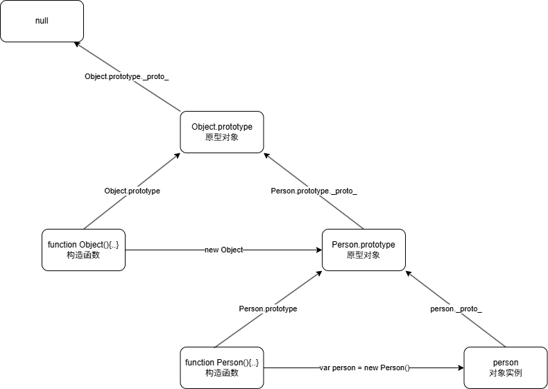

> `Object.prototype` 是绝大多数 JS 对象的原型链顶端（除 `Object.create(null)` 外）。

**Object.create**

Object.create 方法允许你创建一个新对象，并将其原型设置为指定的对象。

```javascript
let personPrototype = {
    sayHello: function() {
        console.log("Hello, my name is " + this.name);
    }
};

let alice = Object.create(personPrototype);
alice.name = "Alice";
alice.sayHello(); // 输出: Hello, my name is Alice
```

> `Object.prototype` 是绝大多数 JS 对象的原型链顶端（除 `Object.create(null)` 外）。
>
> 有无 `Object.create(null)` 创建的对象没有原型，`__proto__` 为 undefined，不继承任何属性和方法

### JSON

JSON（JavaScript Object Notation，JS 对象简谱）是一种轻量级的数据交换格式。它基于 ECMAScript 的一个子集，采用完全独立于编程语言的文本格式来存储和表示数据。

简洁和清晰的层次结构使得 JSON 成为理想的数据交换语言。易于人阅读和编写，同时也易于机器解析和生成，并有效地提升网络传输效率简单来说，JSON 就是一种字符串格式，这种格式无论是在前端还是在后端, 都可以很容易的转换成对象，所以常用于前后端数据传递。

JSON 语法是 JavaScript 对象表示语法的子集。

- 数据在名称/值对（`key : value`）集合中
- 数据由逗号 **,** 分隔
- 使用斜杆 `\` 来转义字符
- 大括号 `{}` 保存对象
- 中括号 `[]` 保存数组，数组可以包含多个对象
- 对象包含多个数据，数据也可以包含多个对象

示例：

```json
{
    "name": "第一中学",
    "isPublic": true,
    "address": {
        "city": "北京",
        "district": "海淀区"
    },
    "classes": [
        {
            "grade": 10,
            "room": "101",
            "students": [
                "张三",
                "李四",
                "王五"
            ]
        },
        {
            "grade": 11,
            "room": "202",
            "students": [
                "赵六",
                "钱七"
            ]
        }
    ],
    "scores": [
        95.5,
        87,
        92
    ],
    "hasLab": false
}
```

客户端获取 JSON 数据并处理：

```javascript
// 从服务器获取的JSON字符串
// JSON数组
var jsonStr = '[ "Google", "Runoob", "Taobao" ]'; 
// JSON对象
var jsonStr = '{"name":"Tintin","age":18,"city":"Shanghai","hobbies":["reading","swimming"],"dog":{"name":"Buddy","breed":"Golden Retriever"}}'; 

// 以JSON对象为例
// 将JSON字符串转换为JavaScript对象
var obj = JSON.parse(jsonStr); 
document.write("Name: " + obj.name + "<br>");
document.write("Age: " + obj.age + "<br>");
document.write("City: " + obj.city + "<br>");
document.write("Hobbies: " + obj.hobbies.join(", ") + "<br>");
document.write("Dog" + ": " + obj.dog.name + " (" + obj.dog.breed + ")" + "<br>");
// 将JavaScript对象转换为JSON字符串
var jsonStr2 = JSON.stringify(obj);
document.write("JSON String: " + jsonStr2);
```

在 Java 后端中获取 JSON 数据并处理：使用 Gson、Jackson、Fastjson 等依赖

### JS 常见对象

数组的常见 API ： [JavaScript Array 对象 | 菜鸟教程](https://www.runoob.com/jsref/jsref-obj-array.html)

boolean 常见 API ：[JavaScript Boolean 对象 | 菜鸟教程](https://www.runoob.com/jsref/jsref-obj-boolean.html)

Number 常见 API ：[JavaScript Number 对象 | 菜鸟教程](https://www.runoob.com/jsref/jsref-obj-number.html)

String 常见 API ：[JavaScript String 对象 | 菜鸟教程](https://www.runoob.com/jsref/jsref-obj-string.html)

Date 常见 API ：[JavaScript Date 对象 | 菜鸟教程](https://www.runoob.com/jsref/jsref-obj-date.html)

Math 常见 API ：[JavaScript Math 对象 | 菜鸟教程](https://www.runoob.com/jsref/jsref-obj-math.html)

## JS 事件驱动

### 什么是事件

HTML 事件是发生在 HTML 元素上的事情（浏览器行为或用户行为），当在 HTML 页面中使用 JavaScript 时， JavaScript 可以触发这些事件。

### 常见事件

* 鼠标事件：`onclick`、`ondbclick` 、`onmouseover`、`onmousemove`、`onmouseleave`
* 键盘事件：`onkeydown`、`onkeyup`
* 表单事件：`onfocus`、`onblur` 、`onchange` 、`onsubmit` 、`onreset`
* 框架/对象（Frame/Object）事件：`onload`

[HTML DOM 事件对象 | 菜鸟教程](https://www.runoob.com/jsref/dom-obj-event.html)

### 事件的绑定

* 通过事件绑定函数，在行为发生时自动执行函数
* 一个事件可以同时绑定多个函数
* 一个元素可以绑定多个事件
* 方中可以传入 this 对象，代表当前元素

**通过属性绑定**

```html
<!DOCTYPE html>
<html lang="en">
<head>
    <meta charset="UTF-8">
    <title>Document</title>
    <script>
        sayHello = function() {
            alert("Hello!");
        }
        sayBye = function() {
            alert("Bye!");
        }
        showTip = function() {
            document.getElementById("tipSpan").style.display = "inline";
        }
        hideTip = function() {
            document.getElementById("tipSpan").style.display = "none";
        }
    </script>
</head>
<body>
    <input type="button" id="alertButton" value="Click Me" onclick="sayHello(),sayBye()" onmouseover="showTip()" onmouseout="hideTip()">
    <span id="tipSpan" style="display: none;">这是一个按钮</span>
</body>
</html>
```

**通过 DOM 编程动态绑定**

```HTML
<!--通过 代码顺序 确保事件在组件加载之后绑定 -->
<button id="btn1">暂无绑定事件</button>
<script>
    // 通过DOM动态绑定事件
    var btn1 = document.getElementById("btn1");
    btn1.innerHTML = "已经绑定点击事件了";
    btn1.onclick = function() {
        alert("Button 1 clicked!");
    }
</script>
```

```html
<!--通过 onload 确保事件在组件加载之后绑定 -->
<head>
    <script>
        function ready() {
            // 通过DOM动态绑定事件
            var btn1 = document.getElementById("btn1");
            btn1.innerHTML = "已经绑定点击事件了";
            btn1.onclick = function() {
                alert("Button 1 clicked!");
            }
            console.log("页面加载完成");
        }
        // 或者 window.onload = ready;
    </script>
</head>
<body onload="ready()">
    <button id="btn1">暂无绑定点击事件</button>
</body>
```

### 事件的触发

**行为触发**

**DOM 编程触发**

```html
<head>
    <script>
        window.onload = function () {
            var div1 = document.getElementById("div1");
            div1.onclick = function() {
                div1.style.backgroundColor = div1.style.backgroundColor === "red" ? "blue" : "red";
            }

            var btn1 = document.getElementById("btn1");
            btn1.onclick = function() {
                div1.onclick(); // 触发
            }
            
            console.log("页面加载完成");

        };
    </script>
</head>
<body >
    <div id="div1" style="background-color: red; width: 100px; height: 100px;" ></div>
    <button id="btn1">点击切换div的颜色</button>
</body>
</html>
```


## BOM

### 什么是 BOM

BOM（Browser Object Model，浏览器对象模型 ）提供了一系列独立于内容，与浏览器窗口进行交互的对象。

> 不存在浏览器对象模型（BOM）的官方标准，但是现代的浏览器已经（几乎）实现了 JavaScript 交互相同的方法和属性

### 顶级对象 window

* window 顶级对象，代表个浏览器口；
  * location 属性，代表浏览器的地址栏；
  * history 属性，代表浏览器的访问历史；
  * screen 属性，代表屏幕；
  * navigator 属性，代表浏览器软件本身；
  * document 属性，代表浏览器窗口目前解析的 html 文档；
  * console 属性，代表浏览器开发者工具的控制台；
  * localStorage 属性，代表浏览器的本地数据持久化存储；
  * sessionStorage 属性，代表浏览器的本地数据会话级存储；

JS 代码中可以省略顶级对象 window 来访问属性和方法，如下

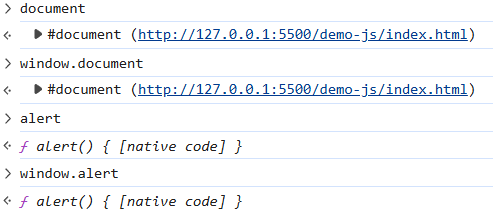

以下代码都是等价的

```
window.document === document  // true
window.alert === alert        // true
window.console === console    // true
window.setTimeout === setTimeout // true
```

然而，如果切换 JavaScript 环境，其顶级对象会发生改变

- 浏览器：顶级对象是 `window`
- Node.js：顶级对象是 `global`
- Web Worker：顶级对象是 `self`
- 现代标准：统一使用 `globalThis`（ES2020），在浏览器中 `globalThis === window`

### window 对象的常见属性及方法

[Window 对象 | 菜鸟教程](https://www.runoob.com/jsref/obj-window.html)

### BOM 控制浏览器行为

```html
<!DOCTYPE html>
<html lang="en">
<head>
    <meta charset="UTF-8">
    <title>Document</title>
</head>
<script>
    var timeoutId; // 定义一个全局变量来存储定时器ID
    var intervalId; // 定义一个全局变量来存储间隔定时器ID
</script>
<body>
    <!-- window对象 顶级对象-->
     <span>window：</span>
    <button onclick="window.alert('这是一个提示框！')">提示框</button>
    <button onclick="window.confirm('这是一个确认框！')">确认框</button>
    <button onclick="window.prompt('请输入你的名字：')">输入框</button>
    <button onclick="timeoutId = window.setTimeout(function() { alert('这是一个定时器！'); }, 2000);">定时器2秒</button>
    <button onclick="window.clearTimeout(timeoutId); alert('定时器已取消！');">取消定时器</button>
    <button onclick="intervalId = window.setInterval(function() { alert('这是一个间隔定时器！'); }, 3000);">间隔定时器3秒一次</button>
    <button onclick="window.clearInterval(intervalId); alert('间隔定时器已取消！');">取消间隔定时器</button>
    <hr/>

    <!-- history对象 用于浏览器历史记录操作 -->
    <span>history：</span>
    <a href="/demo-js/index.html" target="_self">跳转至主页</a>
    <a href="http://www.baidu.com" target="_self">跳转至百度</a>
    <button onclick="window.history.back()">上一页</button>
    <button onclick="window.history.forward()">下一页</button>
    <button onclick="window.history.go(-2)">后退两页</button>
    <hr/>

    <!-- location对象 用于获取当前页面的URL信息 -->
    <span>location：</span>
    <button onclick="alert('当前URL：' + window.location.href + '\n协议：' + window.location.protocol + '\n主机：' + window.location.host + '\n路径：' + window.location.pathname + '\n查询字符串：' + window.location.search + '\n哈希值：' + window.location.hash)">显示当前URL信息</button>
    <button onclick="window.location.href='http://www.baidu.com'">跳转至百度</button>
    <button onclick="window.location.reload()">刷新页面</button>
    <hr/>

    <!-- navigator对象 用于获取浏览器信息 -->
    <span>navigator：</span>
    <button onclick="alert('浏览器名称(遗留弃用)：' + navigator.appName  + '\n浏览器内核(遗留弃用)：' + navigator.appCodeName  + '\n浏览器版本：' + navigator.appVersion + '\n平台：' + navigator.platform)">显示浏览器信息</button>
    <hr/>

    <!-- screen对象 用于获取屏幕信息 -->
    <span>screen：</span>
    <button onclick="alert('屏幕宽度：' + screen.width + '\n屏幕高度：' + screen.height + '\n可用宽度：' + screen.availWidth + '\n可用高度：' + screen.availHeight)">显示屏幕信息</button>
    <hr/>


    <!--sessionStorage对象 用于会话期间存储数据 浏览器关闭后数据丢失-->
    <span>sessionStorage：</span>
    <button onclick="sessionStorage.setItem('key', 'value'); alert('数据已存储！')">存储数据</button>
    <button onclick="alert('存储的数据：' + sessionStorage.getItem('key'))">读取数据</button>
    <button onclick="sessionStorage.removeItem('key'); alert('数据已删除！')">删除数据</button>
    <hr/>

    <!--localStorage对象 用于持久化存储数据 浏览器关闭后仍存在-->
    <span>localStorage：</span>
    <button onclick="localStorage.setItem('key', 'value'); alert('数据已存储！')">存储数据</button>
    <button onclick="alert('存储的数据：' + localStorage.getItem('key'))">读取数据</button>
    <button onclick="localStorage.removeItem('key'); alert('数据已删除！')">删除数据</button>
    <hr/>
</body>
</html>
```

## DOM

### 什么是 DOM

DOM（Document Object Model ，文档对象模型）一种独立于语言，通过内存中的对象来表示文档（XML，HTML）的结构，提供操作文档（XML，HTML）的应用编程接口。

通过 HTML DOM，JavaScript 能够访问和改变 HTML 文档的所有元素。

### DOM 编程

浏览器从网络中获取到 HTML 文档后，除了将其元素展示到页面中，还会将文档加载进内存并抽象成 document 对象，存于 window 对象的属性中。简单来说：DOM 编程就是使用 document 对象的 API 完成对网页 HTML 文档进行动态修改，以实现网页数据和样式动态变化效果的编程，

### DOM 树的结构

DOM 树中节点的类型：

* node 节点，所有结点的父类型：
  * element 元素节点，node 的子类型之一，代表一个完整标签；
  * attribute 属性节点，node 的子类型之一，代表元素的属性；
  * text 文本节点，node 的子类型之一，代表双标签中间的文本；

DOM 树的结构示例如下：

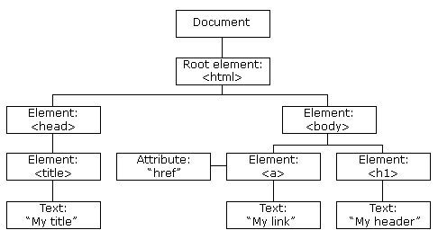

### 获取元素

* 根据 id、name、类名、标签名获取元素
* 根据元素关系获取元素，如父元素、子元素、前一个兄弟元素、后一个兄弟元素

```html
<!DOCTYPE html>
<html lang="en">
<head>
    <meta charset="UTF-8">
    <title>Document</title>
    <style>
        .myDiv {
            margin: 20px;
            padding: 10px;
            border: 1px solid #ccc;
        }
    </style>
    <script>
        function clickBtn1() {
            var div1 = document.getElementById("div1");
            console.log(div1);
        }
        function clickBtn2() {
            var inputs = document.getElementsByTagName("input");
            for(var i = 0; i < inputs.length; i++) {
                console.log(inputs[i]);
            }
        }
        function clickBtn3() {
            var usernameInputs = document.getElementsByName("username");
            for(var i = 0; i < usernameInputs.length; i++) {
                console.log(usernameInputs[i]);
            }
        }
        function clickBtn4() {
            var divs = document.getElementsByClassName("myDiv");
            for(var i = 0; i < divs.length; i++) {
                console.log(divs[i]);
            }
        }
        function clickBtn5() {
            var div1 = document.getElementById("div1");
            var children = div1.children;
            for(var i = 0; i < children.length; i++) {
                console.log(children[i]);
            }
            var firstChild = div1.firstElementChild;
            var lastChild = div1.lastElementChild;
            console.log("第一个子元素：", firstChild);
            console.log("最后一个子元素：", lastChild);
        }
        function clickBtn6() {
            var usernameInput = document.getElementById("username");
            var parent = usernameInput.parentElement;
            console.log(parent);
        }
        function clickBtn7() {
            var emailInput = document.getElementById("email");
            var previousSibling = emailInput.previousElementSibling;
            var nextSibling = emailInput.nextElementSibling;
            console.log("当前元素：", emailInput);
            console.log("前一个兄弟元素：", previousSibling);
            console.log("后一个兄弟元素：", nextSibling);
        }
    </script>
</head>
<body>
    <div id="div1" class="myDiv">
        用户名：<input type="text" id="username" name="username" placeholder="请输入用户名">
        密码：<input type="password" id="password" name="password" placeholder="请输入密码">
        邮箱：<input type="text" id="email" name="email" placeholder="请输入邮箱">
        地址：<input type="text" id="address" name="address" placeholder="请输入地址">
    </div>
    <div id="div2" class="myDiv">
        <button id="btn1" onclick="clickBtn1()">根据id获取元素</button>
        <button id="btn2" onclick="clickBtn2()">根据标签名获取元素</button>
        <button id="btn3" onclick="clickBtn3()">根据name获取元素</button>
        <button id="btn4" onclick="clickBtn4()">根据类名获取元素</button>
    </div>
    <div id="div3" class="myDiv">
        <button id="btn5" onclick="clickBtn5()">根据父元素获取子元素</button>
        <button id="btn6" onclick="clickBtn6()">根据子元素获取父元素</button>
        <button id="btn7" onclick="clickBtn7()">根据当前元素获取兄弟元素</button>
    </div>
</body>
</html>
```

### 操作元素

* 属性操作：`元素.属性名=修改的值`
  * 通过方法：`元素.getAttribute("属性名")`，`元素.setAttribute("属性名", 修改的值)` 
  * 样式的修改：`元素.style.样式名="样式"` 或者 `div1.style.cssText="分号分开多个样式"`，原始的样式名要转换为驼峰命名法，例如 `background-color` 变为 `backgroundColor`

* 文本操作：`div1.innerHTML` 会解析 HTML 标签，`div1.innerText` 会将标签当作普通文本处理

```html
<!DOCTYPE html>
<html lang="en">
<head>
    <meta charset="UTF-8">
    <title>Document</title>
    <style>
        .myDiv {
            margin: 20px;
            padding: 10px;
            border: 1px solid #ccc;
        }
    </style>
    <script>
        function clickBtn8() {
            var addressInput = document.getElementById("address");
            console.log("原来的placeholder属性值：", addressInput.getAttribute("placeholder"));
            addressInput.setAttribute("placeholder", "请输入详细地址");
            console.log("新的placeholder属性值：", addressInput.getAttribute("placeholder"));
            // 或者直接修改属性
            // addressInput.placeholder = "请输入详细地址";
        }
        function clickBtn9() {
            var div1 = document.getElementById("div1");
            div1.style.backgroundColor = "lightblue";
            div1.style.border = "2px solid blue";
            // 也可以一次性设置多个样式
            // div1.style.cssText = "background-color: lightblue; border: 2px solid blue;";
            // 原始的样式名要转换为驼峰命名法，例如background-color变为backgroundColor
        }
        function clickBtn10() {
            var div1 = document.getElementById("div1");
            var div2 = document.getElementById("div2");
            var div3 = document.getElementById("div3");
            console.log(div1.innerHTML);
            console.log(div2.innerText);
            console.log(div3.textContent);
            div1.innerHTML = "<p>这\n是新<br/>的内容</p>";
            div3.innerText = "<p>这\n是新<br/>的内容</p>";
            div2.textContent = "<p>这\n是新<br/>的内容</p>";
            // 注意：innerHTML会解析HTML标签，而textContent和innerText会将标签当作普通文本处理
        }
    </script>
</head>
<body>
    <div id="div1" class="myDiv">
        用户名：<input type="text" id="username" name="username" placeholder="请输入用户名">
        密码：<input type="password" id="password" name="password" placeholder="请输入密码">
        邮箱：<input type="text" id="email" name="email" placeholder="请输入邮箱">
        地址：<input type="text" id="address" name="address" placeholder="请输入地址">
    </div>
    <div id="div4" class="myDiv">
        <button id="btn8" onclick="clickBtn8()">操作元素的属性</button>
        <button id="btn9" onclick="clickBtn9()">操作元素的样式</button>
        <button id="btn10" onclick="clickBtn10()">操作元素的文本内容</button>
    </div>
</body>
</html>
```

### 增删元素

```html
<!DOCTYPE html>
<html lang="en">
<head>
    <meta charset="UTF-8">
    <title>Document</title>
    <style>
        .myDiv {
            margin: 20px;
            padding: 10px;
            border: 1px solid #ccc;
        }
    </style>
    <script>
        function clickBtn11() {
            // 创建一个新的li元素
            var newLi = document.createElement("li");
            // 设置li元素的属性和文本
            newLi.innerText = "Chengdu";
            newLi.id = "cd";
            // 将新元素添加到ul中
            var ul = document.getElementById("city");
            ul.appendChild(newLi);
        }
        function clickBtn12() {
            // 创建一个新的li元素
            var newLi = document.createElement("li");
            // 设置li元素的属性和文本
            newLi.innerText = "Hangzhou";
            newLi.id = "hz";
            // 将新元素插入到指定元素前面
            var shLi = document.getElementById("sh");
            var ul = shLi.parentElement;
            ul.insertBefore(newLi, shLi);
        }
        function clickBtn13() {
            // 创建一个新的li元素
            var newLi = document.createElement("li");
            // 设置li元素的属性和文本
            newLi.innerText = "Wuhan";
            newLi.id = "wh";
            // 将指定元素替换为新元素
            var gzLi = document.getElementById("gz");
            var ul = gzLi.parentElement;
            ul.replaceChild(newLi, gzLi);
        }
        function clickBtn14() {
            // 获取要删除的元素
            var bjLi = document.getElementById("bj");
            // 获取父元素
            var ul = bjLi.parentElement;
            // 删除指定元素
            ul.removeChild(bjLi);
            // 直接删除
            // bjLi.remove();
        }
        function clickBtn15() {
            var ul = document.getElementById("city");
            // 清空元素内容
            ul.innerHTML = "";
            // 或者
            // while(ul.firstChild) {
            //     ul.removeChild(ul.firstChild);
            // }
        }
    </script>
</head>
<body>
    <div id="div5" class="myDiv">
        <ul id="city">
            <li id="bj">Beijing</li>
            <li id="sh">Shanghai</li>
            <li id="gz">Guangzhou</li>
            <li id="sz">Shenzhen</li>
        </ul>
    </div>
    <div id="div6" class="myDiv">
        <button id="btn11" onclick="clickBtn11()">在父元素中追加元素</button>
        <button id="btn12" onclick="clickBtn12()">在指定元素前插入元素</button>
        <button id="btn13" onclick="clickBtn13()">将指定元素替换为新元素</button>
        <button id="btn14" onclick="clickBtn14()">删除指定元素</button>
        <button id="btn15" onclick="clickBtn15()">清空元素内容</button>
    </div>
</body>
</html>
```

## 正则表达式

正则表达式（Expression，简称 Regex 或 RegExp）是一种用来匹配字符串中字符组合的模式。

### 正则表达式作用

- 验证：检查输入的数据是否符合预期格式
- 查找：在文本中找到特定模式的内容
- 替换：将符合某种模式的文本替换为其他内容
- 提取：从复杂文本中提取需要的信息

### 正则表达式的语法

[正则表达式 – 教程 | 菜鸟教程](https://www.runoob.com/regexp/regexp-tutorial.html)

**修饰符**

| 修饰符 | 描述                                                     |
| :----- | :------------------------------------------------------- |
| i      | 执行对大小写不敏感的匹配。                               |
| g      | 执行全局匹配（查找所有匹配而非在找到第一个匹配后停止）。 |
| m      | 执行多行匹配。                                           |

**元字符——基本元字符**

| 字符 | 描述                                                         |
| :--- | :----------------------------------------------------------- |
| `.`  | 匹配除换行符(`\n`)外的任意单个字符。例如，`a.b` 匹配 "aab", "a1b", "a b" 等。 |
| `^`  | 匹配字符串的开始位置。例如，`^abc` 匹配以 "abc" 开头的字符串。 |
| `$`  | 匹配字符串的结束位置。例如，`xyz$` 匹配以 "xyz" 结尾的字符串。 |

**元字符——字符类元字符**

| 字符  | 描述                                                         |
| :---- | :----------------------------------------------------------- |
| `[]`  | 定义字符集合，匹配其中任意一个字符。例如，`[aeiou]` 匹配任意一个元音字母。 |
| `[^]` | 匹配不在方括号中的任意字符。例如，`[^0-9]` 匹配任意非数字字符。 |
| `-`   | 在字符类中表示范围。例如，`[a-z]` 匹配任意小写字母。         |

**元字符——限定符/量词**

| 字符    | 描述                                                         |
| :------ | :----------------------------------------------------------- |
| `*`     | 匹配前面的子表达式零次或多次。例如，`zo*` 能匹配 "z" 以及 "zoo"。`*` 等价于 `{0,}`。 |
| `+`     | 匹配前面的子表达式一次或多次。例如，`zo+` 能匹配 "zo" 以及 "zoo"，但不能匹配 "z"。`+` 等价于 `{1,}`。 |
| `?`     | 匹配前面的子表达式零次或一次。例如，`do(es)?` 可以匹配 "do" 和 "does"，但不能匹配 "dog"。`?` 等价于 `{0,1}`。 |
| `{n}`   | n 是一个非负整数，匹配确定的 n 次。例如，`o{2}` 不能匹配 "Bob" 中的 o，但是能匹配 "food" 中的两个 o。 |
| `{n,}`  | n 是一个非负整数，至少匹配 n 次。例如，`o{2,}` 不能匹配 "Bob" 中的 o，但能匹配 "foooood" 中的所有 o。 |
| `{n,m}` | m 和 n 均为非负整数，其中 n <= m。最少匹配 n 次且最多匹配 m 次。例如，`o{1,3}` 将匹配 "fooooood" 中的前三个 o。o{0,1} 等价于 o?。注意：逗号和两个数之间不能有空格。 |

**元字符——分组元字符**

* `()`：定义子表达式或捕获组。例如，`(ab)+` 匹配 "ab", "abab" 等。

**元字符——选择元字符**

* `|`：表示 "或" 关系。例如，`cat|dog` 匹配 "cat" 或 "dog"

**元字符——转义字符**

* `\`：若要匹配语法中的特殊字符（元字符），必须首先使字符 "转义"，即将反斜杠字符 `\` 放在它们前面，使后面的字符失去特殊含义。

**元字符——特殊字符**

| 字符 | 描述                                                        |
| :--- | :---------------------------------------------------------- |
| `\d` | 匹配任意数字，等价于 `[0-9]`                                |
| `\D` | 匹配任意非数字，等价于 `[^0-9]`                             |
| `\w` | 匹配任意单词字符(字母、数字、下划线)，等价于 `[a-zA-Z0-9_]` |
| `\W` | 匹配任意非单词字符，等价于 `[^a-zA-Z0-9_]`                  |
| `\s` | 匹配任意空白字符(空格、制表符、换行符等)                    |
| `\S` | 匹配任意非空白字符                                          |

**元字符——边界匹配元字符**

| 字符 | 描述                                                         |
| :--- | :----------------------------------------------------------- |
| `\b` | 匹配单词边界。例如，`\bcat\b` 匹配 "cat" 但不匹配 "category" |
| `\B` | 匹配非单词边界。例如，`\Bcat\B` 匹配 "scattered" 中的 "cat" 但不匹配单独的 "cat"。 |

**元字符——非打印字符**

| 字符 | 描述           |
| :--- | :------------- |
| `\n` | 匹配换行符     |
| `\t` | 匹配制表符     |
| `\r` | 匹配回车符     |
| `\f` | 匹配换页符     |
| `\v` | 匹配垂直制表符 |

### RegExp 对象

| 方法     | 描述                                               |
| :------- | :------------------------------------------------- |
| compile  | 在 1.5 版本中已废弃。 编译正则表达式。             |
| exec     | 检索字符串中指定的值。返回找到的值，并确定其位置。 |
| test     | 检索字符串中指定的值。返回 true 或 false。         |
| toString | 返回正则表达式的字符串。                           |

| 属性        | 描述                                               |
| :---------- | :------------------------------------------------- |
| constructor | 返回一个函数，该函数是一个创建 RegExp 对象的原型。 |
| global      | 判断是否设置了 "g" 修饰符                          |
| ignoreCase  | 判断是否设置了 "i" 修饰符                          |
| lastIndex   | 用于规定下次匹配的起始位置                         |
| multiline   | 判断是否设置了 "m" 修饰符                          |
| source      | 返回正则表达式的匹配模式                           |

String 对象中支持正则表达式的方法

| 方法    | 描述                             |
| :------ | :------------------------------- |
| search  | 检索与正则表达式相匹配的值。     |
| match   | 找到一个或多个正则表达式的匹配。 |
| replace | 替换与正则表达式匹配的子串。     |
| split   | 把字符串分割为字符串数组。       |

### JS 使用正则表达式

**创建 RegExp 对象**

```javascript
var patt=new RegExp(pattern,modifiers); // 构造函数方式
var patt=/pattern/modifiers; // 字面量方式
// 模式(pattern)描述了一个表达式模型。
// 修饰符(modifiers)描述了检索是否是全局，区分大小写等。
```

**验证**

```javascript
// 验证手机号格式（简单例：1开头的11位数字）
const phone = "13812345678";
const phoneRegex = /^1[3-9]\d{9}$/;

console.log(phoneRegex.test(phone)); // true
console.log(phoneRegex.test("12345")); // false

// 验证邮箱
const email = "user@example.com";
const emailRegex = /^[\w.-]+@[\w.-]+\.\w+$/;
console.log(emailRegex.test(email)); // true
```

**查找**

```javascript
const text = "Hello 2024, welcome to 2025!";

// search() - 返回第一个匹配的位置索引
const index = text.search(/\d+/);
console.log(index); // 6（数字'2'的位置）

// match() - 返回匹配的数组
const matches = text.match(/\d+/g);
console.log(matches); // ['2024', '2025']

// matchAll() - 返回所有匹配的迭代器（含捕获组）
const regex = /(\d{4})/g;
for (const match of text.matchAll(regex)) {
    console.log(match[0]); // 2024, 2025
}
```

**替换**

```java
const str = "My name is John, John is 25 years old.";

// 简单替换（只替换第一个匹配）
const replaced1 = str.replace("John", "Mike");
console.log(replaced1); 
// "My name is Mike, John is 25 years old."

// 正则全局替换
const replaced2 = str.replace(/John/g, "Mike");
console.log(replaced2); 
// "My name is Mike, Mike is 25 years old."

// 高级替换：使用捕获组
const date = "2024-01-15";
const formatted = date.replace(/(\d{4})-(\d{2})-(\d{2})/, "$3/$2/$1");
console.log(formatted); // "15/01/2024"

// 替换函数
const prices = "price: 10, 20, 30";
const doubled = prices.replace(/\d+/g, (match) => {
    return parseInt(match) * 2;
});
console.log(doubled); // "price: 20, 40, 60"
```

**提取**

```java
const log = "User: alice, Age: 28, City: Beijing";

// 方法1：match() 配合捕获组
const regex1 = /User: (\w+), Age: (\d+), City: (\w+)/;
const result = log.match(regex1);
if (result) {
    console.log(result[1]); // "alice"（用户名）
    console.log(result[2]); // "28"（年龄）
    console.log(result[3]); // "Beijing"（城市）
}

// 方法2：exec() 循环提取多个
const html = "<div>First</div><div>Second</div>";
const divRegex = /<div>(.*?)<\/div>/g;
let match;
while ((match = divRegex.exec(html)) !== null) {
    console.log(match[1]); // "First", "Second"
}

// 方法3：解构赋值提取
const url = "https://example.com:8080/path";
const [, protocol, domain, port] = url.match(/^(https?):\/\/([^:/]+)(?::(\d+))?/) || [];
console.log(protocol); // "https"
console.log(domain);   // "example.com"
console.log(port);     // "8080"
```

### 常见正则表达式

| 需求     | 正则表达式              |
| -------- | ----------------------- |
| 中文字符 | `[\u4e00-\u9fa5]`       |
| 手机号   | `1[3-9]\d{9}`           |
| 邮箱     | `[\w.-]+@[\w.-]+\.\w+`  |
| IPv4     | `(\d{1,3}\.){3}\d{1,3}` |

# XML

## XML 简介

XML 指可扩展标记语言（Extensible Markup Language）。

XML 被设计用来传输和存储数据，不用于表现和展示数据，HTML 则用来表现数据。

XML 语言没有预定义的标签，而 HTML 的标签都是预定义的。XML 允许创作者定义自己的标签和自己的文档结构。

## XML 语法

**声明**

```xml
<?xml version="1.0" encoding="utf-8"?>
<!--可选，通常包括XML版本、字符编码-->
```

**根元素**

XML 必须包含根元素，它是所有其他元素的父元素

**属性**

元素可以包含属性，属性提供有关元素的附加信息。

```xml
<person age="30" gender="male">John Doe</person>
```

**单标签**

所有的 XML 元素一般都有一个关闭标签，但也允许单标签的使用的。

```xml
<elementName attribute="value" />
```

**大小写敏感**

标签 `<Letter>` 与标签 `<letter>` 是不同的。

**正确嵌套**

不能交叉嵌套，

```xml
<b><i>This text is bold and italic</b></i><!--错误-->
```

**字符实体**

在 XML 中，一些字符拥有特殊的意义。例如，把字符 "<" 放在 XML 元素，会发生解析错误，请用实体引用来代替 "<" 字符：

| 字符引用 | 字符实体 | 含义           |
| -------- | -------- | -------------- |
| `&lt;`   | <        | less than      |
| `&gt;`   | >        | greater than   |
| `&amp;`  | &        | ampersand      |
| `&apos;` | '        | apostrophe     |
| `&quot;` | "        | quotation mark |

**注释**

```xml
<!-- This is a comment -->
```

**空格保留**

HTML 会把多个连续的空格字符裁减（合并）为一个，而 XML 文档中的空格不会被删减。

```xml
<title>xx       xxx</title> <!--xx       xxx-->
```

```html
<h1>xx       xxx</h1> <!--xx xxx-->
```

## XML 约束/验证

拥有正确语法的 XML 只能被称为 "形式良好" 的 XML。而通过某种 XML 约束/验证的 XML，就可以称为 "合法" 的 XML。

在 XML 技术中可以编写一个文档来约束一个 XML 文档的书写规范，这就称之为 XML 约束。

**XML DTD**

通过 DTD（Document Type Definition） 验证的 XML 是 "合法" 的 XML。

 "note.xml" 引用 DTD

```xml
<?xml version="1.0"?>
<note>
  <to>Tove</to>
  <from>Jani</from>
  <heading>Reminder</heading>
  <body>Don't forget me this weekend!</body>
</note>
```

"note.dtd" 对上面那个 XML 文档（ "note.xml" ）的元素进行了定义：

```dtd
<!ELEMENT note (to, from, heading, body)>
<!ELEMENT to (#PCDATA)>
<!ELEMENT from (#PCDATA)>
<!ELEMENT heading (#PCDATA)>
<!ELEMENT body (#PCDATA)>
```

**XML Schema**

W3C 支持一种基于 XML 的 DTD 代替者，它名为 XML Schema。

 "note.xml" 引用 XML Schema 

```xml
<?xml version="1.0"?>
<note
xmlns="http://www.w3schools.com"
xmlns:xsi="http://www.w3.org/2001/XMLSchema-instance"
xsi:schemaLocation="http://www.w3schools.com note.xsd">
  <to>Tove</to>
  <from>Jani</from>
  <heading>Reminder</heading>
  <body>Don't forget me this weekend!</body>
</note>
```

"note.xsd" （XSD = XML Schema Definition）定义了上面那个 XML 文档（ "note.xml" ）的元素。

```xml
<?xml version="1.0"?>
<xs:schema xmlns:xs="http://www.w3.org/2001/XMLSchema"
targetNamespace="http://www.w3schools.com"
xmlns="http://www.w3schools.com"
elementFormDefault="qualified">

<xs:element name="note">
  <xs:complexType>
    <xs:sequence>
      <xs:element name="to" type="xs:string"/>
      <xs:element name="from" type="xs:string"/>
      <xs:element name="heading" type="xs:string"/>
      <xs:element name="body" type="xs:string"/>
    </xs:sequence>
  </xs:complexType>
</xs:element>

</xs:schema>
```

**XML 验证器**

大部分 IDE 都会内置 XML 验证器，根据指定约束对 XML 文档进行语法检查。

## 解析 XML

**使用 jar 包 DOM4J 解析**

```java
public class Dom4jDemo {
    public static void main(String[] args) throws FileNotFoundException, DocumentException {
        SAXReader saxReader = new SAXReader();
        // 通过类加载器获取资源
        InputStream resourceAsStream = Dom4jDemo.class.getClassLoader().getResourceAsStream("jdbc.xml");
        // 解析成DOM对象
        Document document = saxReader.read(resourceAsStream);
        // 获取根节点
        Element rootElement = document.getRootElement();
        System.out.println(rootElement.getName());
        // 获取子元素
        List<Element> elements = rootElement.elements();
        // ...
    }
}
```

**JS 中解析**

# Tomcat

## Web 服务器

一种运行在物理服务器上的软件，用于处理 HTTP 协议请求。它能接收客户端（如浏览器）发来的 HTTP 请求，并返回静态内容（如 HTML、CSS、图片等）。

常见的 Java Web 服务器：Tomcat、Jetty、JBoss。

## Servlet

Servlet 本质是一个接口，Java 并没有对它做任何实现，仅提供了 Servlet 这么一个规范，它作为一个抽象层，定义了一个最简单的请求-响应处理模式，Servlet 可以动态生成响应内容（如 JSON、HTML 页面），处理业务逻辑、数据库交互等。

## Tomcat

Tomcat 是 Apache 软件基金会一个开源、免费的 Web 服务器。它实现了 Java Servlet、JSP、WebSocket 等规范，能够运行 Java Web 应用。

### Catalina

Tomcat 是 ⼀ 个由 ⼀ 系列可配置（conf/server.xml）的组件构成的 Web 容器，⽽Catalina 是 Tomcat 的 servlet 容器。可以认为整个 Tomcat 就是 ⼀ 个 Catalina 实例，Tomcat 负责解析 Tomcat 的配置 ⽂ 件（server.xml）, 以此来创建服务器 Server 组件并进 ⾏ 管理。

Tomcat 启动的时候会初始化 这个实例 Catalina 实例通过加载 server.xml 完成其他实例的创建，创建并管理 ⼀ 个 Server，Server 创建并管理多个服务，每个服务 ⼜ 可以有多个 Connector 和 ⼀ 个 Container。


### Server

服务器表示整个 Catalina Servlet 容器以及其它组件，负责组装并启动 Servlaet 引擎, Tomcat 连接器。Server 通过实现 Lifecycle 接 ⼝，提供了 ⼀ 种优雅的启动和关闭整个系统的 ⽅ 式。

### Service

服务，是 Server 内部的组件，⼀ 个 Server 包含多个 Service。Service 将若 ⼲ 个 Connector 组件绑定到 ⼀ 个 Container。

### Container

容器，负责处理 ⽤ 户的 servlet 请求，并返回对象给 web⽤ 户的模块

Container 组件下有 ⼏ 种具体的组件，分别是 Engine、Host、Context 和 Wrapper。这 4 种组件（容器）是 ⽗⼦ 关系。Tomcat 通过 ⼀ 种分层的架构 ，使得 Servlet 容器具有很好的灵活性。

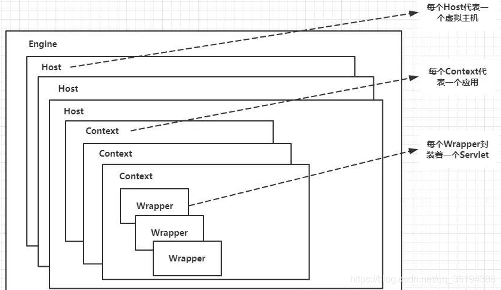

## Tomcat 安装

下载：[Apache Tomcat® - Welcome!](https://tomcat.apache.org/)

配置环境变量： `JAVA_HOME`


启动 `bin/startup.bat`


验证 http://localhost: 8080

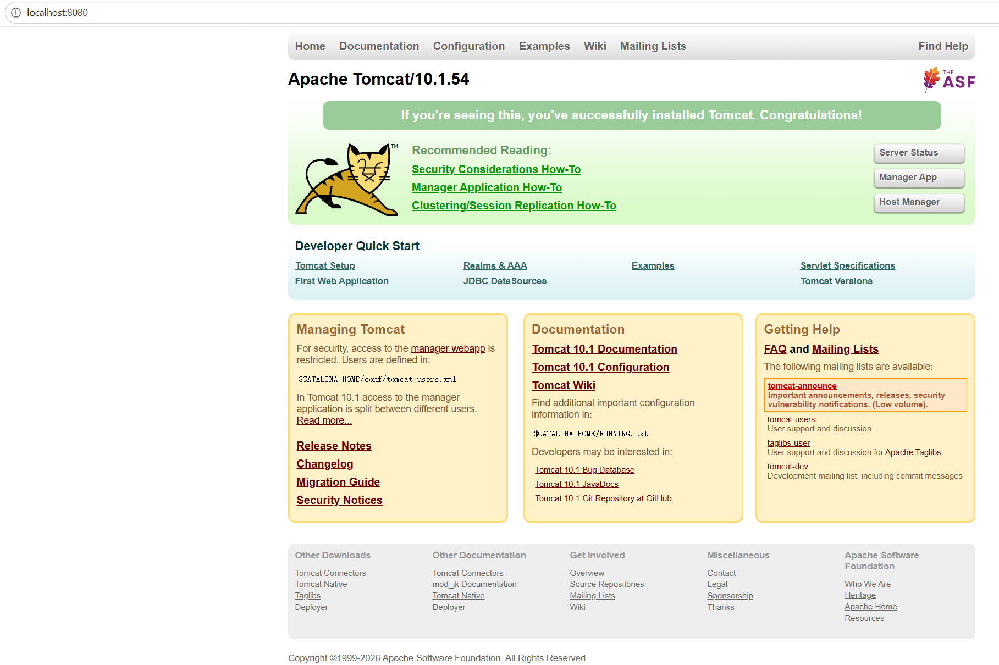

乱码问题：Windows 命令行窗口在中文语言地区通常为 GBK 编码

方法一：修改 Tomcat 日志编码为 GBK，修改 `conf/logging.properties` 配置

```properties
java.util.logging.ConsoleHandler.encoding = GBK
```

方法二：临时修改命令行编码为 UTF-8

```shell
# 命令行中执行以下命令，编码会临时变为 UTF-8，关闭窗口后即失效
chcp 65001
```

方法三：永久修改

## Tomcat 目录


## Web 项目结构

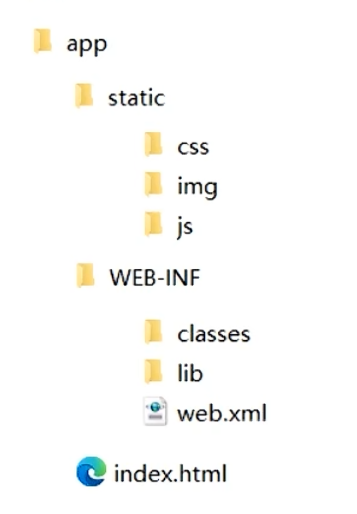

* examples 应用根目录
  * static，一般存放 css、js、img 等静态资源
  * WEB-INF ，受保护的资源目录，浏览器无法通过 URL 直接访问的目录。
    * classes，由 java 源码生成的源代码、配置文件的目录。字节码根路径
    * lib，项目依赖的 jar 编译后出现的目录
    * web.xml， web 项目的基本配置文件
  * index.html，作为默认欢迎页


## Tomcat 配置

`conf/server.xml` 

Server 实例：即一个 JVM，它监听在 8005 端口以接收 shutdown 命令。同物理机中，多个 Server 实例需要配置它们使用不同的端口

```xml
<Server port="8005" shutdown="SHUTDOWN">
```

Service ： 主要用于关联一个引擎和与此引擎相关的连接器

```xml
<Service name="Catalina">
```

Connector ：连接器，一个引擎可以有一个或多个连接器。`conf/server.xml` 文件中， `<Connector>` 标签，可以修改监听端口、连接器使用协议等。位于 Service  中。

```xml
<Connector port="8080" protocol="HTTP/1.1"
               connectionTimeout="20000"
               redirectPort="8443"
               maxParameterCount="1000"
               />
```

Engine ： Servlet 处理器的一个实例，即 Servlet 引擎，位于 Service  中

```xml
<Engine name="Catalina" defaultHost="localhost">
```

Host：用于接收请求并进行相应处理的虚拟主机。Tomcat 允许单台服务器通过不同域名承载多个独立应用。位于 Engine 中

Context ：代表指定一个 Web 应用，每个 Web 应用都是一个 WAR 文件，或文件的目录；没有配置 Context 属性，则该虚拟主机默认支持运行多个项目。

* path：即浏览器访问项目的访问路径（应用上下文）。
* docBase：相应的 Web 应用程序的存放位置；也可以使用相对路径，起始路径为此 Context 所属 Host 中 `appBase` 定义的路径；

```xml
<Host name="localhost" appBase="webapps" unpackWARs="true" autoDeploy="true">
	<Context path="/demo" docBase="D:\demo" />
</Host>
```


`conf/tomcat-user.xml`

 首先 ，在 `conf/server.xml` 配置加载 tomcat-user.xml

```xml
<GlobalNamingResources>
    <!-- Editable user database that can also be used by
         UserDatabaseRealm to authenticate users
    -->
    <Resource auth="Container" description="User database that can be updated and saved" factory="org.apache.catalina.users.MemoryUserDatabaseFactory" name="UserDatabase" pathname="conf/tomcat-users.xml" type="org.apache.catalina.UserDatabase"/>
  </GlobalNamingResources>
```

role 元素 和 user 元素 位于 tomcat-user 元素下

```xml
  <role rolename="manager-gui"/>
  <role rolename="manager-status"/>
  <role rolename="manager-script"/>
  <role rolename="manager-jmx"/>

  <user username="gui" password="password" roles="manager-gui"/>    <!--访问HTML界面。-->
  <user username="status" password="password" roles="manager-status"/>    <!--仅访问“服务器状态”页面。-->
  <user username="script" password="password" roles="manager-script "/>    <!--访问本文档中描述的工具友好的纯文本界面以及“服务器状态”页面。-->
  <user username="jmx" password="password" roles="manager-jmx"/>    <!--访问JMX代理接口和“服务器状态”页面。-->
  <user username="both" password="password" roles="manager-status,manager-jmx"/>    <!--仅访问“服务器状态”页面和访问JMX代理接口和“服务器状态”页面。-->

```

添加了角色与用户以后，可以访问默认的虚拟主机管理应用 `host-manager` 和应用管理应用 `manager`

## Tomcat 项目部署

Web 应用程序：编译好的项目或打包成 war 的项目

存放位置：webapps 或 非 webapps 的其他目录（需配置 `Context  docBase` 属性）

> 除了在 `conf/server.xml` 的集中式配置以外，tomcat 还允许分散式配置 `conf/Catalina/{主机名}/{应用名}.xml`，独立管理而且可以热部署，修改后无需重启，生产环境中能有效避免因修改 `server.xml` 出错而影响整个 Tomcat 运行
>
> 建议 XML 文件的 `Context path` 属性要和文件名保持一致。如果 `Context path` 属性为空则对应文件为 `ROOT.xml`
>
> ```xml
> <!--conf/Catalina/localhost/app.xml-->
> <Context path="/app" docBase="D:\mywebapps\app" />
> ```

## IDEA 开发并通过 Tomcat 部署运行 WEB 项目

关联 Tomcat

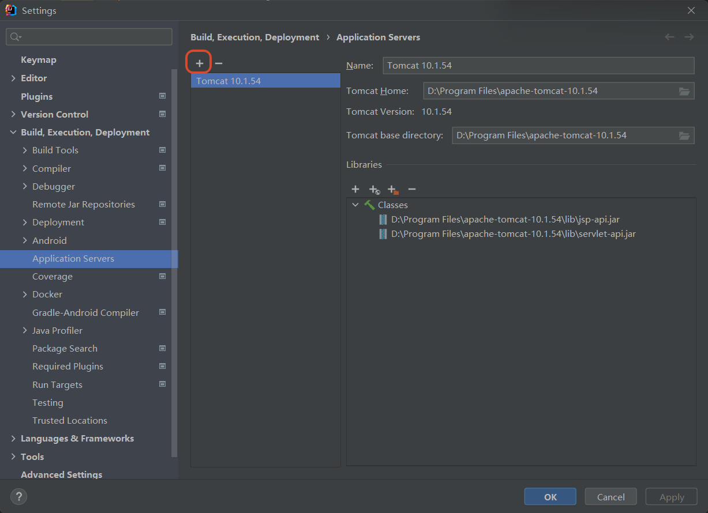

方案一：创建 JavaEE 项目（更方便）

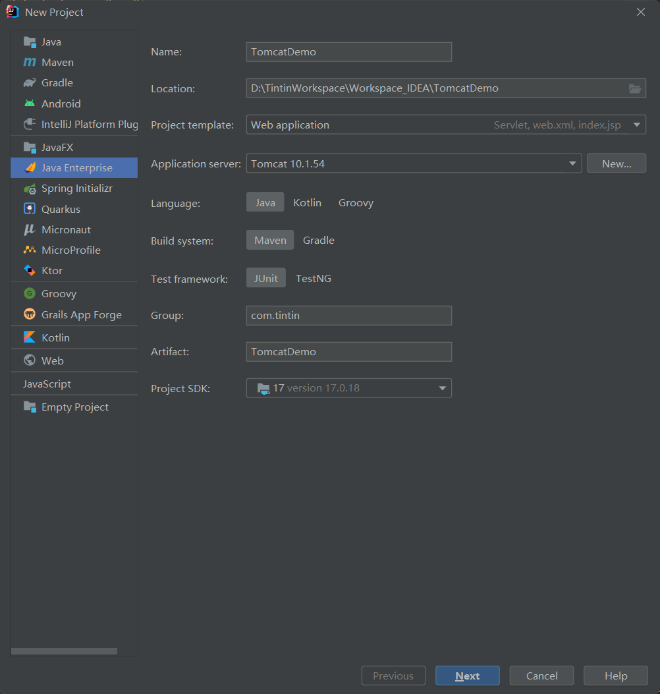

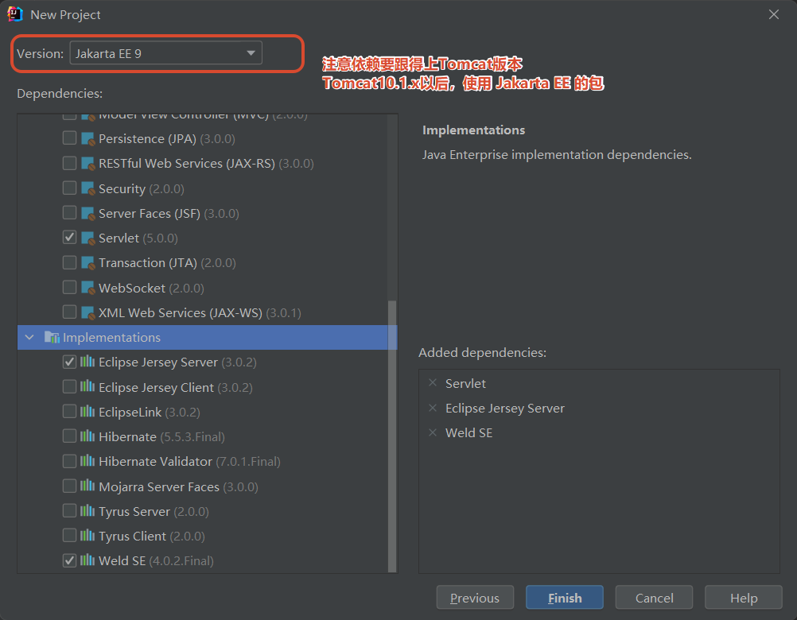

方案二：创建空项目或 maven 项目，添加 web 目录框架，


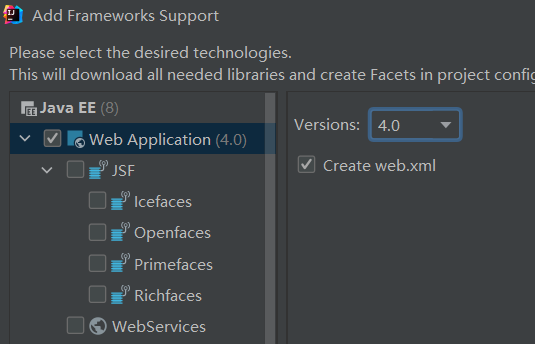

关联对应 web.xml

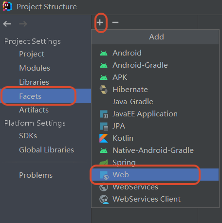


编译构建


部署运行


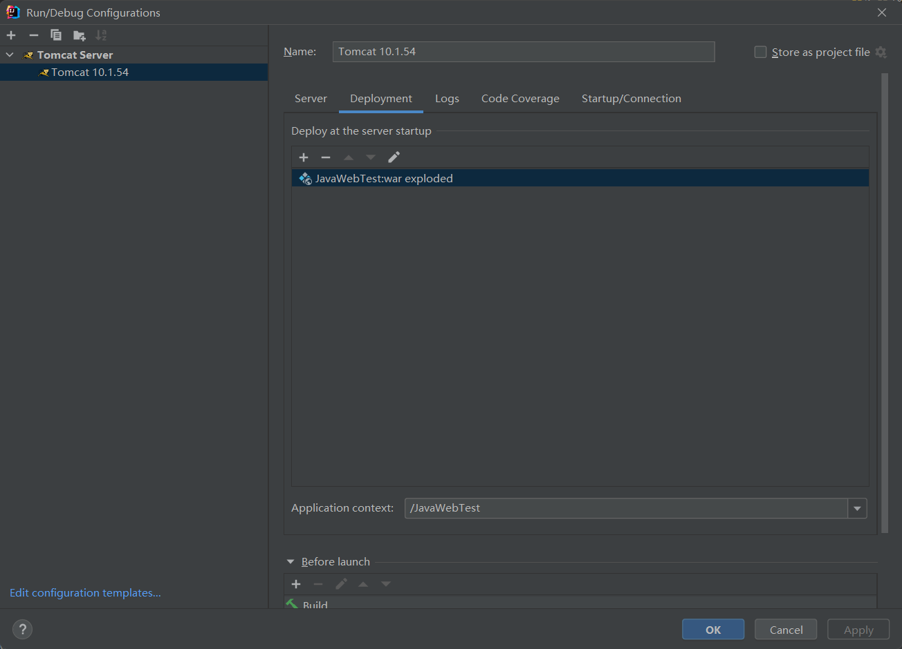

测试 http://localhost: 8080/JavaWebTest/login.html

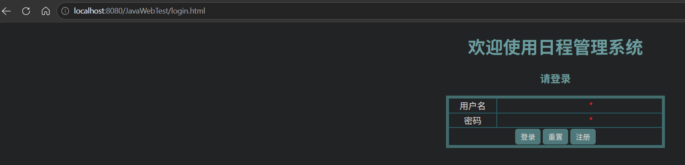

### IDEA 启动 Tomcat 部署 WEB 项目原理

IDEA 并没有直接进将编译好的项目放入 Tomcat 的 webapps 中；

IDEA 根据关联的 Tomcat，创建了一个 Tomcat 副本（类似，`C:/Users/丁丁/AppData/Local/JetBrains/IntelliJIdea2021.2/tomcat/000d7481-7795-4a8f-b1f4-7c3ac03dabac/conf/`），该副本不是一个完整的 tomcat，副本里只是准备了和当前项目相关的配置文件。IDEA 启动 Tomcat 时，是让本地 Tomcat 程序按照 Tomcat 副本里的配置文件运行；

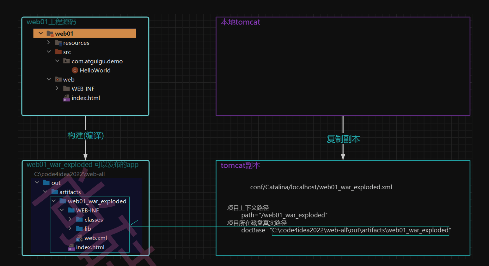

# HTTP 协议

参考

# 参考资料

* [1] [HTML 教程 | 菜鸟教程](https://www.runoob.com/html/html-tutorial.html)

* [2] [HTML 教程](https://www.w3school.com.cn/html/index.asp)