[TOC]


# 0 前置知识

MQ产品种类

||编程语言|

| 消息中间件 | 编程语言   |
| ---------- | ---------- |
| Kafka      | Java/Scale |
| RabbitMQ   | erlang     |
| RocketMQ   | Java       |
| ActiveMQ   | Java       |


Kafka
RabbitMQ
RocketMQ
ActiveMQ

技术维度

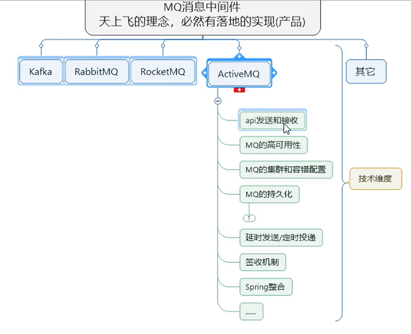

# 1 入门概述

## 1.1 为什么要引入消息中间件

系统之间**直接调用**实际工程落地，存在的问题

系统之间接口耦合比较严重
面对大流量并发时，容易被冲垮
等待同步存在性能问题

引入消息中间件

解决耦合调用问题
异步模型
抵御洪峰流量，达到保护主业务的目的，流量削峰

## 1.2 什么是消息中间件

是指利用高效可靠的消息传递机制进行与平台无关的数据交流，并基于数据通信来进行分布式系统的集成。
通过提供**消息传递**和**消息排队**模型在分布式环境下提供应用解耦、弹性伸缩、冗余存储、流量削峰、异步通信、数据同步等功能。

发送者把消息发送给消息服务器，消息服务器将消息存放在若干**队列/主题**中，在合适的时候，消息服务器会将消息转发给接受者。
在这个过程中，发送和接受是**异步**的，也就是发送无需等待，而且发送者和接受者的生命周期也没有必然关系；
尤其在发布pub/订阅sub模式下，也可以完成一对多的通信，即让一个消息有多个接受者。

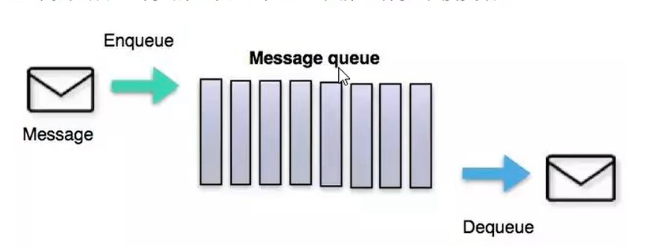

## 1.3 特点

* 采用异步处理模式

* 应用系统之间解耦
  * 发送者和接收者不必了解对方，只需确认消息
  * 发送者和接收者不必同时在线
* 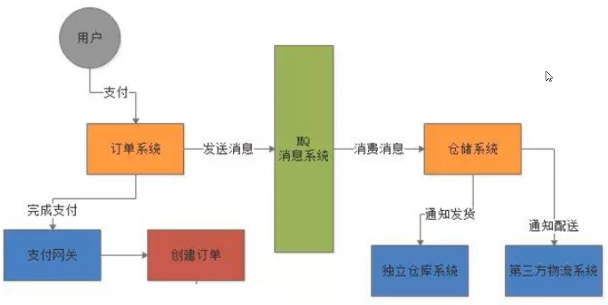

## 1.4 官网

[ActiveMQ (apache.org)](https://activemq.apache.org/)

## 1.5 安装启动

安装

```bash
[tintin@hadoop102 ~]$ tar -zxvf apache-activemq-5.16.3-bin.tar.gz -C /opt/module
[tintin@hadoop102 activemq-5.16.3]$ mv apache-activemq-5.16.3/ activemq-5.16.3
```

启动

```bash
[tintin@hadoop102 activemq-5.16.3]$ bin/activemq start
```

默认端口61616

```bash
[tintin@hadoop102 activemq-5.16.3]$ ps -ef | grep activemq
tintin     6840      1  0 12月25 pts/0  00:00:36 /opt/module/jdk1.8.0_311/bin/java -Xms64M -Xmx1G -Djava.util.logging.config.file=logging.properties -Djava.security.auth.login.config=/opt/module/activemq-5.16.3//conf/login.config -Dcom.sun.management.jmxremote -Djava.awt.headless=true -Djava.io.tmpdir=/opt/module/activemq-5.16.3//tmp -Dactivemq.classpath=/opt/module/activemq-5.16.3//conf:/opt/module/activemq-5.16.3//../lib/: -Dactivemq.home=/opt/module/activemq-5.16.3/ -Dactivemq.base=/opt/module/activemq-5.16.3/ -Dactivemq.conf=/opt/module/activemq-5.16.3//conf -Dactivemq.data=/opt/module/activemq-5.16.3//data -jar /opt/module/activemq-5.16.3//bin/activemq.jar start
tintin     8662   2072  0 00:19 pts/0    00:00:00 grep --color=auto activemq
[tintin@hadoop102 activemq-5.16.3]$ netstat -anp|grep 61616
(Not all processes could be identified, non-owned process info
 will not be shown, you would have to be root to see it all.)
tcp6       0      0 :::61616                :::*                    LISTEN      6840/java       
[tintin@hadoop102 activemq-5.16.3]$ lsof -i:61616
COMMAND  PID   USER   FD   TYPE DEVICE SIZE/OFF NODE NAME
java    6840 tintin  137u  IPv6  79095      0t0  TCP *:61616 (LISTEN)

```

带运行日志启动

```bash
[tintin@hadoop102 activemq-5.16.3]$ bin/activemq start > myrunmq.log
```

## 1.6 前台页面

1. 发现8161对应的ip地址是127.0.0.1，这个地址一般都是localhost的地址，所以需要把这个地址改成0.0.0.0，即广播地址，这样通过本机ip地址就可以访问到了，所以需要修改bin/conf/jetty.xml

```xml
    <bean id="jettyPort" class="org.apache.activemq.web.WebConsolePort" init-method="start">
             <!-- the default port number for the web console -->
        <property name="host" value="0.0.0.0"/>
        <property name="port" value="8161"/>
    </bean>
```

2. 关闭防火墙或开放端口61616、8161

采用61616端口提供JMS服务
采用8161端口提供管理控制台服务

3. 访问服务器的端口8161http://192.168.10.102:8161

4. 输入默认账号密码admin

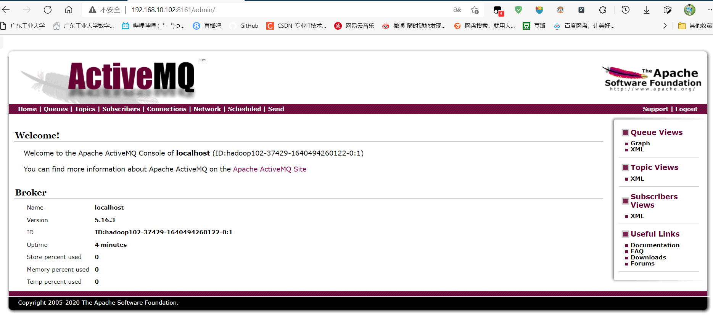

# 2 Java实现ActiveMQ通讯

## 2.1 依赖

```xml
<dependencies>
<!--        activemq所需必备依赖-->
        <!-- https://mvnrepository.com/artifact/org.apache.assets/activemq-all -->
        <dependency>
            <groupId>org.apache.activemq</groupId>
            <artifactId>activemq-all</artifactId>
            <version>5.15.9</version>
        </dependency>
        <!-- https://mvnrepository.com/artifact/org.apache.xbean/xbean-spring -->
        <dependency>
            <groupId>org.apache.xbean</groupId>
            <artifactId>xbean-spring</artifactId>
            <version>3.16</version>
        </dependency>

<!--        junit/log4j基础依赖-->
        <dependency>
            <groupId>org.slf4j</groupId>
            <artifactId>slf4j-api</artifactId>
            <version>1.7.25</version>
        </dependency>
        <dependency>
            <groupId>ch.qos.logback</groupId>
            <artifactId>logback-classic</artifactId>
            <version>1.2.3</version>
        </dependency>
        <dependency>
            <groupId>org.projectlombok</groupId>
            <artifactId>lombok</artifactId>
            <version>1.16.18</version>
            <scope>provided</scope>
        </dependency>
        <dependency>
            <groupId>junit</groupId>
            <artifactId>junit</artifactId>
            <version>4.12</version>
            <scope>test</scope>
        </dependency>
    </dependencies>
```

## 2.2 JMS编码总体架构

Java消息服务（Java Message Service）

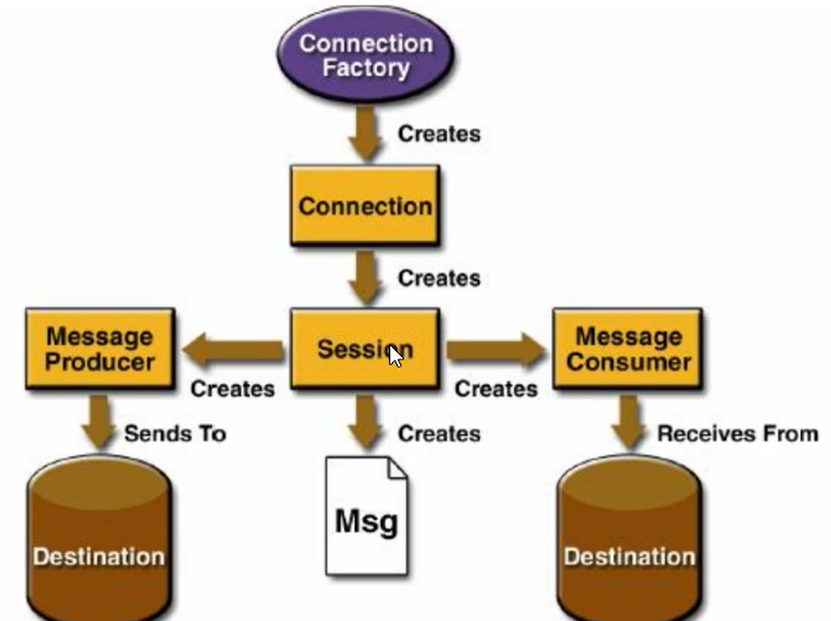

## 2.3 目的地Destination

队列（点对点）

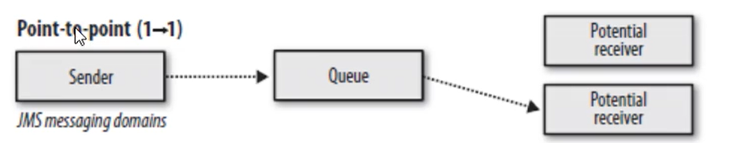

主题（订阅与发布）

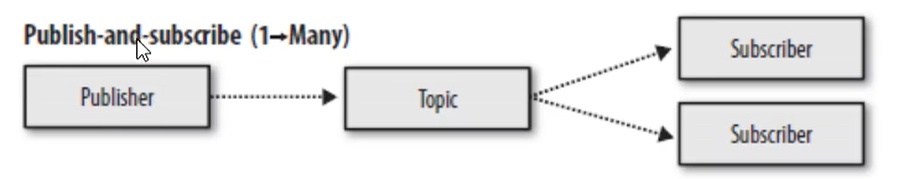

## 2.4 队列实现案例

### 2.4.1 队列生产者

```java
public class JmsProducer {
    public static final String ACTIVE_MQ = "tcp://192.168.10.102:61616";
    public static final String queueName = "queue1";
    public static void main(String[] args) throws JMSException {
        //根据给定的url地址，创建连接工厂
        ActiveMQConnectionFactory activeMQConnectionFactory = new ActiveMQConnectionFactory(ACTIVE_MQ);
        //获取连接并启动访问
        Connection connection = activeMQConnectionFactory.createConnection();
        connection.start();
        //创建会话session 设置事务与签收
        Session session = connection.createSession(false, Session.AUTO_ACKNOWLEDGE);
        //创建目的地队列
        Queue queue = session.createQueue(queueName);
        //创建消息生产者
        MessageProducer messageProducer = session.createProducer(queue);
        //生产者生产消息到mq队列中
        for (int i = 0; i < 3; i++) {
            //创建消息
            TextMessage textMessage = session.createTextMessage("msg" + i + 1);
            messageProducer.send(textMessage);
        }
        //关闭资源
        messageProducer.close();
        session.close();
        connection.close();
        System.out.println("消息发送到了MQ成功");
    }
}
```

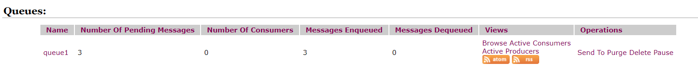

### 2.4.2 队列消费者

**同步阻塞方式receive()**
订阅者或接收者调用MessageConsumer 的receive(）方法来接收消息，receive方法在能够接收到消息之前（或超时之前）将一直阻塞。

```java
public class JmsConsumer {
    public static final String ACTIVE_MQ = "tcp://192.168.10.102:61616";
    public static final String queueName = "queue1";
    public static void main(String[] args) throws JMSException {
        //根据给定的url地址，创建连接工厂
        ActiveMQConnectionFactory activeMQConnectionFactory = new ActiveMQConnectionFactory(ACTIVE_MQ);
        //获取连接并启动访问
        Connection connection = activeMQConnectionFactory.createConnection();
        connection.start();
        //创建会话session 设置事务与签收
        Session session = connection.createSession(false, Session.AUTO_ACKNOWLEDGE);
        //创建目的地队列
        Queue queue = session.createQueue(queueName);
        //创建消息消费者
        MessageConsumer messageConsumer = session.createConsumer(queue);
        //接受消息
        while (true) {
            //设置延时不等待
            TextMessage textMessage =(TextMessage) messageConsumer.receive(4000L);
            if (null != textMessage) {
                System.out.println("消费者接收到消息：" + textMessage.getText());
            } else {
                break;
            }
        }
        //关闭资源
        messageConsumer.close();
        session.close();
        connection.close();

    }
}

```

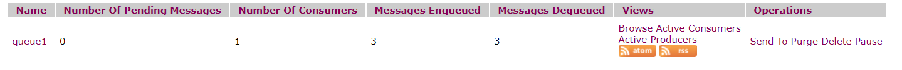

4s内消费者仍在接收消息，4s后不在接收

**异步非阻塞方式 监听器onMessage()**
订阅者或接收者通过MessageConsumer的setMessageListener(MessageListener listener)注册一个消息监听器，
当消息到达之后，系统自动调用监听器MessageListener的onMessage(Message message)方法。

```java
		//监听消息
        messageConsumer.setMessageListener(message -> {
            if (null != message && message instanceof TextMessage) {
                TextMessage textMessage = (TextMessage) message;
                try {
                    System.out.println("消费者接收到消息：" + textMessage.getText());
                } catch (JMSException e) {
                    e.printStackTrace();
                }
            }
        } );

        System.in.read();//保证进程不停止，按任意键退出
```

> 1. 先生产消息，只启动1号消费者，再启动2号消费者，问题：2号消费者还能消费消息吗？ no
> 2. 先启动2个消费者，再生产6条消息，请向，消费情况如何？轮询
>    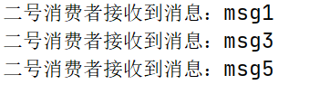
>
> 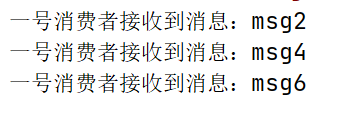

### 2.4.3 特点

点对点消息传递域的特点如下：
（1）每个消息只能有一个消费者，类似1对1的关系。好比个人快递自己领取自己的。
（2）消息的生产者和消费者之间**没有时间上的相关性**。无论消费者在生产者发送消息的时候是否处于运行状态，消费
者都可以提取消息。好比我们的发送短信，发送者发送后不见得接收者会即收即看。
（3）消息被消费后队列中不会再存储，所以消费者不会消费到已经被消费掉的消息。

## 2.5 主题实现案例

### 2.5.1 发布主题生产者

```java
public class JmsProducer {
    public static final String ACTIVE_MQ = "tcp://192.168.10.102:61616";
    public static final String TOPIC_NAME = "topic1";
    public static void main(String[] args) throws JMSException {
        //根据给定的url地址，创建连接工厂
        ActiveMQConnectionFactory activeMQConnectionFactory = new ActiveMQConnectionFactory(ACTIVE_MQ);
        //获取连接并启动访问
        Connection connection = activeMQConnectionFactory.createConnection();
        connection.start();
        //创建会话session 设置事务与签收
        Session session = connection.createSession(false, Session.AUTO_ACKNOWLEDGE);
        //创建目的地队列
        Topic topic = session.createTopic(TOPIC_NAME);
        //创建消息生产者
        MessageProducer messageProducer = session.createProducer(topic);
        //生产者生产消息到mq队列中
        for (int i = 0; i < 6; i++) {
            //创建消息
            TextMessage textMessage = session.createTextMessage("msg" + (i + 1));
            messageProducer.send(textMessage);
        }
        //关闭资源
        messageProducer.close();
        session.close();
        connection.close();
        System.out.println("消息发送到了MQ成功");
    }
}

```

### 2.5.2 订阅订阅消费者

```java
public class JmsConsumer {
    public static final String ACTIVE_MQ = "tcp://192.168.10.102:61616";
    public static final String TOPIC_NAME = "topic1";
    public static void main(String[] args) throws JMSException, IOException {
        System.out.println("三号消费者启动");
        //根据给定的url地址，创建连接工厂
        ActiveMQConnectionFactory activeMQConnectionFactory = new ActiveMQConnectionFactory(ACTIVE_MQ);
        //获取连接并启动访问
        Connection connection = activeMQConnectionFactory.createConnection();
        connection.start();
        //创建会话session 设置事务与签收
        Session session = connection.createSession(false, Session.AUTO_ACKNOWLEDGE);
        //创建目的地队列
        Topic topic = session.createTopic(TOPIC_NAME);
        //创建消息消费者
        MessageConsumer messageConsumer = session.createConsumer(topic);
//        //接受消息
//        while (true) {
//            //设置延时不等待
//            TextMessage textMessage =(TextMessage) messageConsumer.receive(4000L);
//            if (null != textMessage) {
//                System.out.println("消费者接收到消息：" + textMessage.getText());
//            } else {
//                break;
//            }
//        }

        //监听消息
        messageConsumer.setMessageListener(message -> {
            if (null != message && message instanceof TextMessage) {
                TextMessage textMessage = (TextMessage) message;
                try {
                    System.out.println("三号消费者接收到消息：" + textMessage.getText());
                } catch (JMSException e) {
                    e.printStackTrace();
                }
            }
        } );

        System.in.read();//保证进程不停止，按任意键退出

        //关闭资源
        messageConsumer.close();
        session.close();
        connection.close();

    }
}

```


### 2.5.3 特点

发布订阅消息传递域的特点如下：
（1）生产者将消息发布到topic中，每个消息可以有多个消费者，属于1：N的关系
（2）生产者和消费者之间**有时间上的相关性**。订阅某一个主题的消费者只能消费自它订阅之后发布的消息。
（3）生产者生产时，topic不保存消息它是无状态的不落地，假如无人订阅就去生产，那就是一条废消息，所以，一般先启动消费者再启动生产者。
JMS规范允许客户创建持久订阅，这在一定程度上放松了时间上的相关性要求。持久订阅允许消费者消费它在未处于激活状态时发送的消息。一句话，好比我们的微信公众号订阅

## 2.6 两大模式对比

||Topic模式|Queue模式|
|---|---|---|
|工作模式|订阅-发布"模式，如果当前没有订阅者，消息将会被丢弃。如果有多个订阅者，那么这些订阅者都会收到消息|负载均衡"模式，如果当前没有消费者，消息也不会丢弃；如果有多个消费者，那么一条消息也只会发送给其中一个消费者，并且要求消费者ack信息。|
|有无状态|无状态|Queue数据默认会在mq服务器上以文件形式保存，比如Active MQ股保存在SAMQ HOME\datalkr-storeldata下面。也可以配置成DB存储。|
|传递完整性|如果没有订阅者，消息将会被丢弃|消息不会丢弃|
|处理效率|由于消息要按照订阅者的数量进行复制，所以处理性能会随着订阅者的增加而明显降低，并且还要结合不同消息协议自身的姓能差异|由于一条消息只发送给一个消费者，所以就算消费者再多，性能也不会有明显降低。当然不忄消息协议的具体性能也是有差异的|

# 3 JMS规范与落地产品

## 3.1 JMS

Java Message Service(Java消息服务是JavaEE中的一个技术)

Java消息服务指的是两个应用程序之间进行异步通信。它为标准消息协议和消息服务提供了一组通用接口，包括创建、发送、读取消息等，用于支持JAVA应用程序开发。在JavaEE中，当两个应用程序使用JMS进行通信时，它们之间并不是直接相连的，而是通过一个共同的消息收发服务组件关联起来以达到解耦/异步削峰的效果。

## 3.2  其他消息中间件

| 特性              | ActiveMQ       | RabbitMQ   | Kafka            | RocketMQ       |
| ----------------- | -------------- | ---------- | ---------------- | -------------- |
| Producer-Consumer | 支持           | 支持       | 支持             | 支持           |
| Publish-Subscribe | 支持           | 支持       | 支持             | 支持           |
| Request-Reply     | 支持           | 支持       | -                | 支持           |
| API完备性         | 高             | 高         | 高               | 低（静态配置） |
| 多语言支持        | 支持，Java优先 | 语言无关   | 支持，Java优先   | 支持           |
| 单机吞吐量        | 万级           | 万级       | 十万级           | 单机万级       |
| 消息延迟          | -              | 微妙级     | 毫秒级           | -              |
| 可用性            | 高（主从）     | 高（主从） | 非常高（分布式） | 高             |
| 消息丢失          | -              | 低         | 理论不会         | -              |
| 消息重复          | -              | 可控制     | 理论上会有重复   | -              |
| 文档完备性        | 高             | 高         | 高               | 中             |
| 提供快速入门      | 有             | 有         | 有               | 无             |
| 首次部署难度      | -              | 低         | 中               | 高             |

## 3.3 组成结构和特点

**JMS provider** 实现JMs接口和规范的消息中间件，也就是我们的MQ服务器

**JMS producer** 消息生产者，创建和发送JMS消息的客户端应用

**JMS consumer** 消息消费者，接收和处理JMS消息的客户端应用

**JMS message** 

* 消息头
  * JMSDestination：消息发送的目的地,主要是指Queue和Topic
  * JMSDeliveryMode：持久模式和非持久模式
  * JMSExpiration：一定时间过期 ttl为0表示永不过期 如果发送后，在消息过期时间之后消息还没有被发送到，消息被清除
  * JMSPriority：消息优先级 0-4普通 5-9加急，加急一定先于普通到达
  * JMSMessage：唯一识别每个消息的标识由MQ产生。
* 消息体 封装具体的消息数据  发送和接收消息体类型必须一致对应
  * TextMessage：普通字符串消息，包含一个string

  * MapMessage：一个Map类型的消息，key为string类型，，而值为Java的基本类型
  * BytesMessage：二进制数组消息，包含一个byte[]
  * StreamMessage：Java数据流消息，用标准流操作来顺序的填充和读取。
  * ObjectMessage：对象消息，包含一个可序列化的Java对象
* 消息属性
  * 如果需要除消息头字段以外的值，那么可以使用消息属性
  * 识别/去重/重点标注等操作非常有用的方法
  * 他们是以属性名和属性值对的形式制定的。可以将属性是为消息头得扩展，属性指定一些消息头没有包括的**附加信息**，比如可以在属性里指定消息选择器。message.setStringProperty()

## 3.4 可靠性

### 3.4.1 Persistent持久性

**参数设置**

* 非持久：messageProducer.setDeliveryMode(DeliveryMode.NON_PERSISTENT) 当服务器宕机或者订阅者离线，消息不存在

* 持久：messageProducer.setDeliveryMode(DeliveryMode.PERSISTENT) 当服务器宕机或者订阅者离线，消息依然存在

> MQ挂了，消息的持久化和丢失情况如何？
>
> 队列默认传送模式为持久化，保证了消息只被传送一次且成功使用一次。
>
> 主题中，先运行一次订阅者者，此时处于在线状态。然后再运行发布者者发送信息，此时，无论订阅者是否在线，都会接收到，不在线的话，下次连接的时候，会把没有收过的消息都接收下来。

主题持久化订阅者

```java
public class JmsConsumer_Persist {
    public static final String ACTIVE_MQ = "tcp://192.168.10.102:61616";
    public static final String TOPIC_NAME = "topic_persist";
    public static void main(String[] args) throws JMSException, IOException {
        System.out.println("持久化订阅者消费者启动");
        //根据给定的url地址，创建连接工厂
        ActiveMQConnectionFactory activeMQConnectionFactory = new ActiveMQConnectionFactory(ACTIVE_MQ);
        //获取连接并启动访问
        Connection connection = activeMQConnectionFactory.createConnection();
        connection.setClientID("持久化订阅者消费者");
        //创建会话session 设置事务与签收
        Session session = connection.createSession(false, Session.AUTO_ACKNOWLEDGE);
        //创建目的地队列
        Topic topic = session.createTopic(TOPIC_NAME);
        //持久化订阅者
        TopicSubscriber durableSubscriber = session.createDurableSubscriber(topic, "remarked");

        connection.start();

        Message message = durableSubscriber.receive();
        while(null != message) {
            TextMessage textMessage = (TextMessage) message;
            System.out.println("接收到持久化消息" + textMessage.getText());
            message = durableSubscriber.receive(5000L);//由于发布消息有限，接收消息等待超时后，订阅者将离线
        }

        System.in.read();//保证进程不停止，按任意键退出

        //关闭资源
        durableSubscriber.close();
        session.close();
        connection.close();

    }
}

```

主题持久化发布者

```java
public class JmsProducer_Persist {
    public static final String ACTIVE_MQ = "tcp://192.168.10.102:61616";
    public static final String TOPIC_NAME = "topic_persist";
    public static void main(String[] args) throws JMSException {
        //根据给定的url地址，创建连接工厂
        ActiveMQConnectionFactory activeMQConnectionFactory = new ActiveMQConnectionFactory(ACTIVE_MQ);
        //获取连接并启动访问
        Connection connection = activeMQConnectionFactory.createConnection();
        //创建会话session 设置事务与签收
        Session session = connection.createSession(false, Session.AUTO_ACKNOWLEDGE);
        //创建目的地队列
        Topic topic = session.createTopic(TOPIC_NAME);
        //创建消息生产者
        MessageProducer messageProducer = session.createProducer(topic);
        //设置持久化传输模式
        messageProducer.setDeliveryMode(DeliveryMode.PERSISTENT);

        connection.start();

        //生产者生产消息到mq队列中
        for (int i = 0; i < 6; i++) {
            //创建消息
            TextMessage textMessage = session.createTextMessage("msg" + (i + 1));
            messageProducer.send(textMessage);
        }
        //关闭资源
        messageProducer.close();
        session.close();
        connection.close();
        System.out.println("持久化消息发布到了MQ成功");
    }
}

```

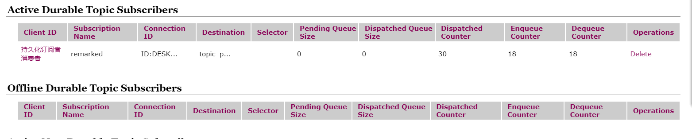

### 3.4.2 Transaction事务

**参数设置**

```java
//事务与签收
Session session = connection.createSession(false, Session.AUTO_ACKNOWLEDGE);
```

**对于生产者**

* 非事务：false 每一次messageProducer.send(textMessage);都会提交

*　事务：true 通过session.commit()进行提交，通过session.rollback()进行回滚

**对于消费者**

* 非事务：false 每一次messageConsumer.receive()，都会使读取消息并使其出列

* 事务：true 每一次messageConsumer.receive()，都可以读取消息，但只有通过session.commit()进行提交，队列中的消息才会出列，否则容易导致消息重复。通过session.rollback()进行回滚。

### 3.4.3 Acknowledge签收

**参数设置**

```java
//事务与签收
Session session = connection.createSession(false, Session.AUTO_ACKNOWLEDGE);
```

**对于非事务**

* 自动签收（默认）： Session.AUTO_ACKNOWLEDGE

* 手动签收：Session.CLIENT_ACKNOWLEDGE 客户端调用acknowledge方法手动签收，否则消息不出列
* 允许重复消息：Session.DUPS_OK_ACKNOWLEDGE 

**对于事务**

生产事务开启，只有commit后才能将全部消息出列变为已消费。

**签收与事务的关系**

在事务性会话中，当一个事务被成功提交则消息被自动签收。如果事务回滚，则消息会被再次传送。
非事务性会话中，消息何时被确认取决于创建会话时的应答模式（acknowledgement）

### 3.4.4 集群保证

详见[9 ActiveMQ的多节点集群](#9 ActiveMQ的多节点集群)

## 3.5 JMS点对点总结

点对点模型基于队列。

生产者发送消息到队列，消费者从队列接收消息，队列的存在使得消息的异步传输成为可能。类似于发送短信。

* 如果Session关闭时，部分消息已被读取但是没有签收（acknowledge）或者没有事务处理（commit），那么当消费者下次连接到相同的队列时，消息还能再次接收
* 队列可以长久地保存消息直到消费者收到消息。消费者不需要因为担心消息会丢失而时刻和队列保持激活的连接状态，充分体现了异步传输模式的优势

## 3.6 JMS订阅发布总结	

JMS Pub/Sub 模型定义了如何向一个内容节点发布和订阅消息，这些节点被称作topic

主题可以被认为是消息的传输中介，发布者(publisher)发布消息到主题，订阅者(subscribe)从主题订阅消息。

主题使得消息订阅者和消息发布者保持互相独立，不需要接触即可保证消息的传送。

* 非持久订阅：只有当客户端处于激活状态，或者是和MQ保存会话连接状态，才能收到某个主题的消息。而离线状态时生产者发送的消息，消费者永远无法获取。
* 持久订阅：首先客户端注册一个身份识别id（connection.setClientID）客户端每一次在线都能接收到离线时生产者发送的主题消息。

# 4 ActiveMQ的Broker

## 4.1 Broker

相当于一个ActiveMQ服务器实例

说白了，Broker其实就是实现了用代码的形式启动ActiveMQ将MQ嵌入到Java代码中，以便随时用随时启动，
在用的时候再去启动这样能节省了资源，也保证了可靠性。

不同的配置文件模拟不同的应用场景

## 4.2 嵌入式Broker

用ActiveMQ Broker作为独立的消息服务器来构建JAVA应用。
ActiveMQ也支持在vm中通信基于嵌入式的broker,I能够无缝的集成其它java应用

引入依赖

```xml
   <dependency>
            <groupId>com.fasterxml.jackson.core</groupId>
            <artifactId>jackson-databind</artifactId>
            <version>2.9.5</version>
        </dependency>
```

```java
public class EmbedBroker {
    public static void main(String[] args) throws Exception {
        //ActiveMQ也支持在vm中通信基于嵌入式的broker,I能够无缝的集成其它java应用
        BrokerService brokerService = new BrokerService();
        brokerService.setUseJmx(true);
        brokerService.addConnector("tcp://localhost:61616");
        brokerService.start();
    }
}

```

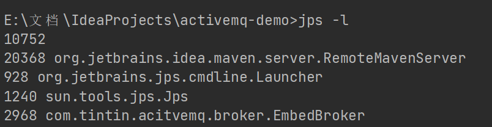

开启后，通过队列测试成功

# 5 Spring整合ActiveMQ

## 5.1 添加依赖

```xml
<!--        整合Spring和ActiveMQ-->
        <dependency>
            <groupId>org.springframework</groupId>
            <artifactId>spring-jms</artifactId>
            <version>4.3.23.RELEASE</version>
        </dependency>
<!--        ActiveMQ所需pool包配置-->
        <dependency>
            <groupId>org.apache.activemq</groupId>
            <artifactId>activemq-pool</artifactId>
            <version>5.15.9</version>
        </dependency>
<!--        Spring相关-->
        <dependency>
            <groupId>org.springframework</groupId>
            <artifactId>spring-core</artifactId>
            <version>4.3.23.RELEASE</version>
        </dependency>
        <dependency>
            <groupId>org.springframework</groupId>
            <artifactId>spring-aop</artifactId>
            <version>4.3.23.RELEASE</version>
        </dependency>
        <dependency>
            <groupId>org.springframework</groupId>
            <artifactId>spring-orm</artifactId>
            <version>4.3.23.RELEASE</version>
        </dependency>
        <dependency>
            <groupId>aspectj</groupId>
            <artifactId>aspectjweaver</artifactId>
            <version>1.5.3</version>
        </dependency>
        <dependency>
            <groupId>org.aspectj</groupId>
            <artifactId>aspectjrt</artifactId>
            <version>1.6.1</version>
        </dependency>
        <dependency>
            <groupId>cglib</groupId>
            <artifactId>cglib</artifactId>
            <version>2.1_2</version>
        </dependency>
```

## 5.2 配置文件

```xml
<?xml version="1.0" encoding="UTF-8"?>
<beans xmlns="http://www.springframework.org/schema/beans"
       xmlns:xsi="http://www.w3.org/2001/XMLSchema-instance"
       xmlns:context="http://www.springframework.org/schema/context"
       xsi:schemaLocation="http://www.springframework.org/schema/beans http://www.springframework.org/schema/beans/spring-beans.xsd http://www.springframework.org/schema/context http://www.springframework.org/schema/context/spring-context.xsd">
<!--    开启包扫描-->
    <context:component-scan base-package="com.tintin.acitvemq.spring"/>

<!--    配置生产者-->
    <!--池化包装 对于pom中的activemq-pool-->
    <bean id="jmsFactory" class="org.apache.activemq.pool.PooledConnectionFactory" destroy-method="stop">
        <property name="connectionFactory">
            <bean class="org.apache.activemq.ActiveMQConnectionFactory">
                <property name="brokerURL" value="tcp://192.168.10.102:61616"/>
            </bean>
        </property>
        <property name="maxConnections" value="100"/>
    </bean>

<!--    配置队列目的地-->
    <bean id="destinationQueue" class="org.apache.activemq.command.ActiveMQQueue">
        <constructor-arg index="0" value="spring-active-queue"/>
    </bean>
<!--    配置主题目的地-->
    <bean id="destinationTopic" class="org.apache.activemq.command.ActiveMQTopic">
        <constructor-arg index="0" value="spring-active-topic"/>
    </bean>
    
<!--    JMS工具类 可以进行消息接收和发送-->
    <bean id="jmsTemplate" class="org.springframework.jms.core.JmsTemplate">
        <property name="connectionFactory" ref="jmsFactory"/>
        <property name="defaultDestination" ref="destinationQueue"/>
        <property name="messageConverter">
            <bean class="org.springframework.jms.support.converter.SimpleMessageConverter"
        </property>
    </bean>
</beans>
```

## 5.3 队列实例

### 5.3.1 生产者

```java
@Service
public class SpringMQ_Producer {
    @Autowired
    JmsTemplate jmsTemplate;

    public static void main(String[] args) {
        ClassPathXmlApplicationContext applicationContext =
                new ClassPathXmlApplicationContext("classpath:applicationContext.xml");
        SpringMQ_Producer springMQ_producer =
                applicationContext.getBean("springMQ_Producer",SpringMQ_Producer.class);
        //发送消息
        springMQ_producer.jmsTemplate.send(session -> session.createTextMessage("Spring和ActiveMQ的整合")) ;

        System.out.println("send task over");
    }
}
```

### 5.3.2 消费者

```java
@Service
public class SpringMQ_Consumer {
    @Autowired
    JmsTemplate jmsTemplate;

    public static void main(String[] args) {
        ClassPathXmlApplicationContext applicationContext =
                new ClassPathXmlApplicationContext("classpath:applicationContext.xml");
        SpringMQ_Consumer SpringMQ_Consumer =
                applicationContext.getBean("springMQ_Consumer",SpringMQ_Consumer.class);

        //发送消息
        String receivedText = (String) SpringMQ_Consumer.jmsTemplate.receiveAndConvert();

        System.out.println("receive message "+ receivedText);
    }
}
```

## 5.4 主题实例

### 5.4.1 生产者

```java
    @Test
    public void testTopic() {
        ClassPathXmlApplicationContext applicationContext =
                new ClassPathXmlApplicationContext("classpath:applicationContext.xml");
        SpringMQ_Producer springMQ_producer =
                applicationContext.getBean("springMQ_Producer",SpringMQ_Producer.class);
        //发送消息
        springMQ_producer.jmsTemplate.send(session -> session.createTextMessage("Spring和ActiveMQ的整合 for topic")) ;

        System.out.println("send task over");
    }
```

### 5.4.2 消费者

```java
    @Test
    public void testTopic() {
        ClassPathXmlApplicationContext applicationContext =
                new ClassPathXmlApplicationContext("classpath:applicationContext.xml");
        SpringMQ_Consumer SpringMQ_Consumer =
                applicationContext.getBean("springMQ_Consumer",SpringMQ_Consumer.class);

        //接收消息
        String receivedText = (String) SpringMQ_Consumer.jmsTemplate.receiveAndConvert();

        System.out.println("receive message "+ receivedText);
    }
```

### 5.4.3 配置监听程序

```java
@Component
public class MyMessageListener implements MessageListener {

    @Override
    public void onMessage(Message message) {
        if (null != message && message instanceof TextMessage) {
            TextMessage textMessage = (TextMessage) message;
            try {
                System.out.println(textMessage.getText());
            } catch (JMSException e) {
                e.printStackTrace();
            }
        }
    }
}
```

```xml
<!--    配置监听程序-->
    <bean id="jmsContainer" class="org.springframework.jms.listener.DefaultMessageListenerContainer">
        <property name="connectionFactory" ref="jmsFactory"/>
        <property name="destination" ref="destinationQueue"/>
        <property name="messageListener" ref="myMessageListener"/>
    </bean>
```

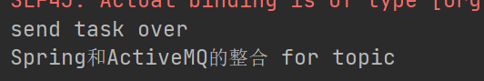

消费者无序启动，监听器直接实例化一个消费者并接收消息

# 6 SpringBoot整合ActiveMQ

## 6.1  添加依赖

```xml
 <parent>
    <groupId>org.springframework.boot</groupId>
    <artifactId>spring-boot-starter-parent</artifactId>
    <version>2.3.0.RELEASE</version>
    <relativePath/> <!-- lookup parent from repository -->
</parent>

<dependencies>
    <dependency>
        <groupId>org.springframework.boot</groupId>
        <artifactId>spring-boot-starter</artifactId>
    </dependency>

    <dependency>
        <groupId>org.springframework.boot</groupId>
        <artifactId>spring-boot-starter-web</artifactId>
    </dependency>

    <dependency>
        <groupId>org.springframework.boot</groupId>
        <artifactId>spring-boot-starter-test</artifactId>
        <scope>test</scope>
    </dependency>

    <dependency>
        <groupId>org.springframework.boot</groupId>
        <artifactId>spring-boot-starter-activemq</artifactId>
    </dependency>
</dependencies>
```

## 6.2 队列实现

### 6.2.1 生产者

application.yml

```yml
server:
  port: 7777

spring:
  activemq:
    broker-url: tcp://192.168.10.102:61616
    user: admin
    password: admin
  jms:
    pub-sub-domain: false # false = queue, true = topic

# 自己定义队列名称
myqueue: boot-activemq-queue

```

 配置Bean

```java
@Component
public class ConfigBean {
    @Value("${myqueue}")
    private String myQueue;

    @Bean
    public Queue queue() {
        return new ActiveMQQueue(myQueue);
    }
}
```

生产者

```java
@Component
@EnableJms //开启注解
public class QueueProducer {
    @Autowired
    private JmsMessagingTemplate jmsMessagingTemplate;

    @Autowired
    private Queue queue;

    public void produceMsg() {
        jmsMessagingTemplate.convertAndSend(queue, UUID.randomUUID().toString().substring(0,6));
    }
}
```

主程序

```java
@SpringBootApplication
public class BootMqQueueProducerApplication {
    public static void main(String[] args) {
        SpringApplication.run(BootMqQueueProducerApplication.class, args);
    }
}

```

测试单元

```java
@SpringBootTest(classes = BootMqQueueProducerApplication.class)
@RunWith(SpringJUnit4ClassRunner.class)
@WebAppConfiguration
class BootMqQueueProducerApplicationTests {
    @Resource
    private QueueProducer queueProducer;

    @Test
    void testSend() {
        queueProducer.produceMsg();
    }
}

```

消息定时投放

```java
    //间隔时间3s 定投
    @Scheduled(fixedDelay = 3000)
    public void produceMsgScheduled() {
        jmsMessagingTemplate.convertAndSend(queue, "scheduled " + UUID.randomUUID().toString().substring(0,6));
        System.out.println("send over ... ok");
    }
```

### 6.2.2消费者

application.yml

```yml
server:
  port: 8888

```

消费者直接监听

```java
@Component
public class QueueConsumer {
    @JmsListener(destination = "${myqueue}")
    public void receive(TextMessage textMessage) {
        System.out.println("消费者收到消息" + textMessage.getText());
    }
}
```


## 6.3 主题实现

### 6.3.1 生产者

application.yml

```yml
server:
  port: 6666

spring:
  activemq:
    broker-url: tcp://192.168.10.102:61616
    user: admin
    password: admin
  jms:
    pub-sub-domain: true # false = queue, true = topic

# 自己定义主题名称
mytopic: boot-activemq-topic

```

bean配置

```java
@Component
public class ConfigBean {
    @Value("${mytopic}")
    private String mytopic ;

    @Bean
    public Topic topic() {
        return new ActiveMQTopic(mytopic);
    }
}
```

生产者

```java
@Component
public class TopicProducer {
    @Autowired
    private JmsMessagingTemplate jmsMessagingTemplate;
    @Autowired
    private Topic topic;

    public void produceMsg() {
        jmsMessagingTemplate.convertAndSend(topic,"topic " + UUID.randomUUID().toString().substring(0,6));
    }
}
```

### 6.3.2 消费者

```java
@Component
public class TopicConsumer {
    @Autowired
    private JmsMessagingTemplate jmsMessagingTemplate;

    @JmsListener(destination = "${mytopic}")
    public void receive(TextMessage textMessage) {
        try {
            System.out.println(textMessage.getText());
        } catch (JMSException e) {
            e.printStackTrace();
        }
    }
}

```

# 7 ActiveMQ的传输协议

> 如何修改默认的端口？
>
> 如何配置生产时使用的链接协议？

## 7.1 是什么

```bash
[root@hadoop102 conf]# vim activemq.xml
```

默认消息协议opernwire

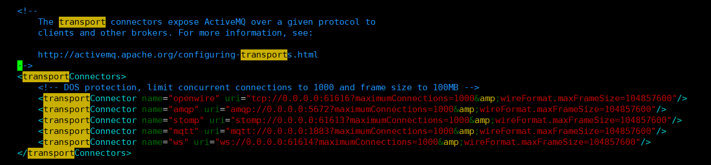

## 7.2 常见消息协议

### 7.2.1 默认TCP

在网络传输数据前，必须要序列化数据，消息是通过一个叫wire protocol的来序列化成字节流。
默认情况下ActiveMQ把wire protocol叫做OpenWire,它的目的是促使网络上的效率和数据快速交互。

TCP传输的优点：
TCP协议传输可靠性高，稳定性强工
高效性：字节流方式传递，效率很高
有效性、可用性：：应用广泛，支持任何平台

### 7.2.2 NIO （New I/O API）

1. NIO协议和TCP协议类似但NIO更侧重于底层的访问操作。它允许开发人员对同一资源可有更多的client调用和服务端有更多的负
   载。
2. 适合使用NIO协议的场景：
   1. 可能有大量的Client去连接到Broker上，一般情况下，大量的Client去连接Broker是被操作系统的线程所限
      因此，NIO的实现比TCP需要更少的线程去运行，所以建议使用NIO协议
   2. 可能对于Broker有一个很迟钝的网络传输，**NIO比TCP提供更好的性能。**	

### 7.2.3 其他协议

AMQP协议 即Advanced Message Queuing Protocol,一个提供统一消息服务的应用层标准高级队列应用层协议的一个开放标准,为面向消息的中间件设计。基于此协议的客户端与消息中间件可传递消息，并不受客户端/中间件不同产品，不同开发语言等条件的限制。

stomp协议 STOMP,streamingTextOrientatedMessageProtocol，是一种为MOM(Message Oriented Middleware，面向消息的中间件)设计的简单文本协议。

SSL协议（Secure Socket Layer Protocol）

mqtt协议 （Message Queuing Telemetry Transport，消息队列遥测传输）是IBM开发的一个即时通讯协议，有可能成为物联网
要组成部分。该协议支持所有平台，几乎可以把所有联网物品和外部连接起来，被用来当做传感器和致动器（比如通过Twitter让房屋联网）的通信协议。

ws协议 （web socket protocol）

### 7.2.4 小结

| 协议    | 描述                                                         |
| ------- | ------------------------------------------------------------ |
| TCP     | 默认协议，性能相对不错                                       |
| NIO     | 基于TCP协议之上，拓展优化，具有更好的拓展性                  |
| UDP     | 性能比TCP好，但不具有可靠性                                  |
| SSL     | 安全链接                                                     |
| HTTP(S) | 基于HTTP或HTTPS                                              |
| VM      | VM本身不是协议，当客户端和代理在同一个Java虚拟机(VM)中运行时,他们之间需要通信,但不想占用网络通道，而是直接通信，可以使用该方式 |

## 7.3 NIO传输案例演示

如果您不特别指定ActiveMQ的网络监听端口，那么这些端口都将使用BIO网络IO模型。（OpenWire, STOMP, AMQP
所以为了首先提高单节点的网络吞吐性能，我们需要明确指定Active的网络IO模型，

如下图，uri以nio开头表示使用以tcp协议为基础的NIO网络IO模型

```xml
 <transportConnector name="nio" uri="nio://0.0.0.0:61618?trace=true"/>
```

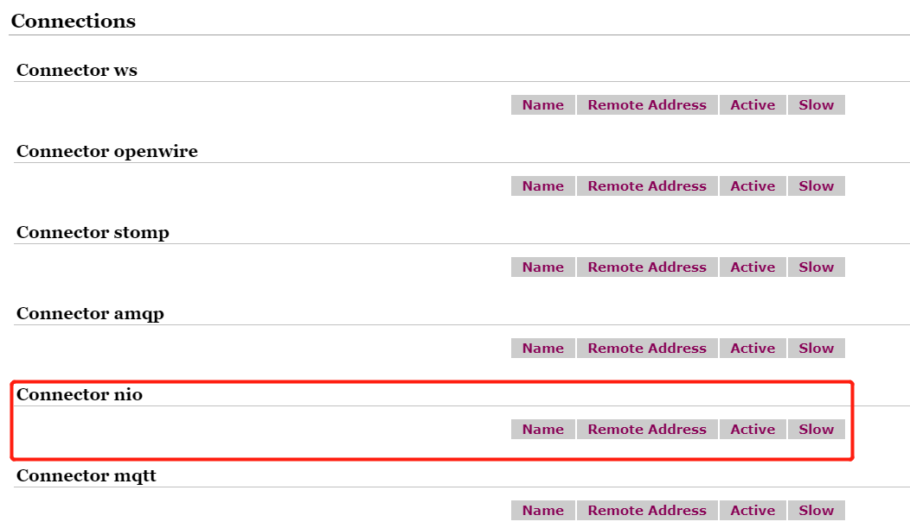

## 7.4 NIO传输案例演示增强

> 上述NIO性能不错了，如何进一步优化？
>
> URI格式头以"nio"开头，表示这个端口使用以TCP协议为基础的NIO网络IO模型。但是这样的设置方式，只能使这个端口支持Openwire协议。
>
> 那么我们怎么既让这个端口支持Nlo网络lo模型，又让它支持多个协议呢？

使用auto关键字
解决
使用“+”符号来为端口设置多种特性
如果我们既需要某一个端口支持NIO网络IO模型，又需要它支持多个协议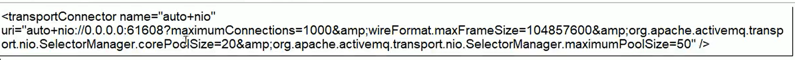


# 8 ActiveMQ消息存储与持久化

## 8.1 简介

保证MQ服务器宕机后，消息不会丢失

为了避免意外宕机以后丢失信息，需要做到重启后可以恢复消息队列，消息系统一般都会采用**持久化机制。**

ActiveMQ的消息持久化机制有JDBC，AMQ，KahaDB和LevelDB，无论使用哪种持久化方式，消息的存储逻辑都是一致的。就是在发送者将消息发送出去后，消息中心首先将消息存储到本地数据文件、内存数据库或者远程数据库等再试图将消息发送给接收者，成功则将消息从存储中删除，失败则继续尝试发送。

消息中心启动以后首先要检查指定的存储位置，如果有未发送成功的消息，则需要把消息发送出去。

## 8.2 存储方式

### 8.2.1 AMQ Message Store(了解)

文件存储形式，写入速度快、易恢复。文件默认大小32M。当存储文件的所有消息都被消费，该文件被标识为可删除。适用于ActiveMQ 5.3前 

### 8.2.2 KahaDB消息存储(默认)

基于日志文件，从ActiveMQ5.4开始默认的持久化插件

activemq.xml中的配置

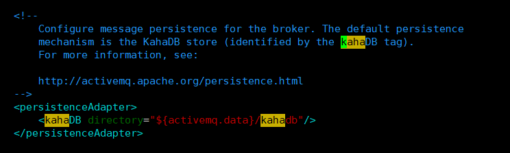

消息存储使用一个**事务日志（b-[Number].log）**和仅仅用一个**索引文件（db.data）**来存储它所有的地址。
KahaDB是一个专门针对消息持久化的解决方案,它对典型的消息使用模式进行了优化。
数据被追加到data logs中。当不再需要log文件中的数据的时候,log文件会被丢弃

存储原理

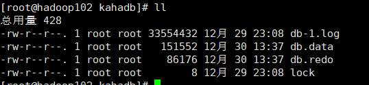

* db-[Number].log KahaDB存储消息到预定义大小的数据记录文件中，文件命名为db-[Number].log。。当数据文件已满时，一个新的文件会随之创建，number数值也会随之递增，它随着消息数量的增多，如每32M一个文件，文件名按照数字进行编号，如db-1.log、db-2.log、db-3.log …。当不再有引用到数据文件中的任何消息时，文件会被**删除或归档**。
* db.data该文件包含了持久化的BTree索引，索引了消息数据记录中的消息,它是消息的索引文件，本质上是B-Tree（B树），使用B-Tree作为索引指向db-[Number].log里面存储的消息。
* db.free 记录当前db.data文件里哪些页面是空闲的，文件具体内容是所有空闲页的ID
* db.redo 用来进行消息恢复,如果KahaDB消息存储在强制退出后启动用于恢复BTree索引。
* lock文件锁，表示当前获得kahadb读写权限的broker。

### 8.2.3 JDBC消息存储

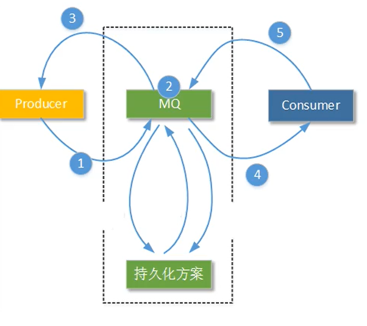

消息存储于数据库中

### 8.2.4 LevelDB消息存储（了解）

这种文件系统是从ActiveMQ5.8之后引进的，它和KahaDB非常相似，也是**基于文件**的本地数据库储存形式，但是它提供比KahaDB更快的**持久性**。但它不使用自定义B-Tree实现来索引预写日志，而是使用基于LevelDB的索引

### 8.2.5 JDBC Message store with ActiveMQ Journal

## 8.3 JDBC消息存储

### 8.3.1 lib文件夹中添加数据库驱动jar包

```bash
[root@hadoop102 module]# mv mysql-connector-java-5.1.38/mysql-connector-java-5.1.38-bin.jar activemq-5.16.3/lib/

```

### 8.3.2 修改activemq.xml的持久化配置

```xml
        <persistenceAdapter>
            <!--<kahaDB directory="${activemq.data}/kahadb"/> 原先的配置-->
            <jdbcPersistenceAdapter dataSource="#mysql-ds" createTablesOnStartup="false"/>
        </persistenceAdapter>

```

dataSource指定将要引用的持久化数据库的bean名称，createTablesOnStartup是否在启动的时候创建数据表，默认值是true，
这样每次启动都会去创建数据表了，一般是第一次启动的时候设置为true之后改成false。

### 8.3.3 数据源配置

```xml
  <bean id="mysql-ds" class="org.apache.commons.dbcp2.BasicDataSource" destroy-method="close">
    <property name="driverClassName" value="com.mysql.cj.jdbc.Driver"/>
    <property name="url" value="jdbc:mysql://192.168.137.1:3306/activemq?relaxAutoCommit=true&amp;useSSL=false&amp;serverTimezone=GMT%2B8&amp;allowPublicKeyRetrieval=true"/>
           <!--XML必须使用转译字符,而且还要加上serverTimezone和useSSL-->
    <property name="username" value="root"/>
    <property name="password" value="tintin"/>
    <property name="maxTotal" value="200"/>
    <property name="poolPreparedStatements" value="true"/>
  </bean>
```

### 8.3.4 MySQL授予远程连接的权限

```sql
USE mysql;
SELECT HOST,USER FROM USER;
SELECT * FROM USER;

CREATE USER 'root'@'192.168.10.102' IDENTIFIED BY 'tintin';
GRANT ALL PRIVILEGES ON *.* TO 'root'@'192.168.10.102' WITH GRANT OPTION
FLUSH PRIVILEGES; # 刷新权限
```

### 8.3.5 创建数据库并自动生成表

```sql
createa DATABASE activemq;
```

<table>	
	<tr><td colspan="2" align="center">ACTIVEMQ_MSGS表</td></tr> 	
    <tr><td>字段</td><td>描述</td></tr >
    <tr><td>ID</td><td>自增的数据库主键</td></tr >
    <tr><td>CONTAINER</td><td>消息的Destination</td></tr >
    <tr><td>MSGID_PROD</td><td>消息发送者的主键</td></tr >
    <tr><td>MSG_SEQ</td><td>是发送消息的顺序，MSGID_PROD+MSG_SEQ可以组成JMS的MessagelD</td></tr >
    <tr><td>EXPIRATION</td><td>消息的过期时间，存储的是从1970-01-01到现在的毫秒数</td></tr >
    <tr><td>MSG</td><td>消息本体的Java序列化对象的二进制数据</td></tr >
    <tr><td>PRIORITY</td><td>优先级，从0-9，数值越大优先级越高</td></tr >
</table>

<table>	
	<tr><td colspan="2" align="center">ACTIVEMQ_ACKS表</td></tr> 
    <tr><td colspan="2">用于存储订阅关系。如果是持久化Topic，订阅者和服务器的订阅关系在这个表保存。</td></tr>
    <tr><td>字段</td><td>描述</td></tr >
    <tr><td>CONTAINER</td><td>消息的Destination</td></tr >
    <tr><td>SUB_DEST</td><td>如果是使用Static集群，这个字段会有集群其他系统的信息</td></tr >
    <tr><td>CLIENT_ID</td><td>每个订阅者都必须有一个唯一的客户端ID用以区分</td></tr >
    <tr><td>SUB_NAME</td><td>订阅者名称</td></tr >
    <tr><td>SELECTOR</td><td>选择器，可以选择只消费满足条件的消息。条件可以用自定义属性实现，可支持多属性AND和OR操作</td></tr >
    <tr><td>LAST_ACKED_ID</td><td>记录消费过的消息的ID。</td></tr >
</table>
<table>	
	<tr><td align="center">ACTIVEMQ_LOCK表</td></tr> 	
    <tr><td>表activemq_lock在集群环境中才有用，只有一个Broker可以获得消息，称为Master Broker，其他的只能作为备份等待Master
Broker不可用，才可能成为下一个Master Broker。这个表用于记录哪个Broker是当前的Master Broker。</td></tr >
</table>

### 8.3.6 代码验证以及数据库情况

在点对点类型中
当DeliveryMode设置为NON_PERSISTENCE时，消息被保存在内存中；
当DeliveryMode设置为PERSISTENCE时，消息保存在broker的相应的文件或者数据库中。
而且点对点类型中消息一旦被Consumer消费就从broker中删除。

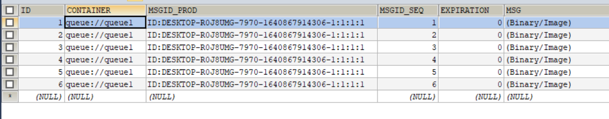

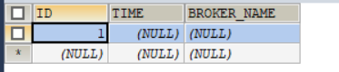

在发布订阅类型中

订阅者和服务器的订阅关系在ACTIVEMQ_ACKS表保存。

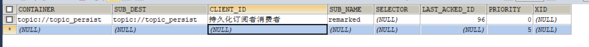

### 8.3.7 填坑

数据库jar包
记得需要使用到的相关jar文件放置到ActiveMQ安装路径下的lib目录。mysqI-jdbc驱动的jar包和对应的数据库连接池jar包
createTablesOnStartup属性

在jdbcPersistenceAdapter标签中设置了createTablesOnStartup属性为true时在第一次启动ActiveMQ时，ActiveMQ服务节点会自动创建所需要的数据表。启动完成后可以去掉这个属性，或者更改createTablesOnStartup属性为false。

下滑线坑爹
“java.lang.lllegalStateException:BeanFactory not initialized or already closed”这是因为您的操作系统的机器名中有“_”符号。请更改机器名并且重启后即可解决问题。

##  8.4 JDBC Message store with ActiveMQ Journal

这种方式克服了JDBC Store的不足，JDBC每次消息过来，都需要去写库和读库。
ActiveMQ Journal，使用高速缓存写入技术，大大提高了性能。
当**消费者的消费速度能够及时跟上生产者消息的生产速度**时，journal文件能够大大减少需要写入到DB中的消息。

配置

```xml
       <persistenceFactory>
                <journalPersistenceAdapterFactory 
                        journalLogFiles="4"
                        journalLogFileSize="32768"
                        useJournal="true"
                        useQuickJournal="true"
                        dataSource="#mysql-ds"
                        dataDirectory="activemq-data"/>
        <persistenceFactory/>
           
        <!--<persistenceAdapter>-->
            <!--<kahaDB directory="${activemq.data}/kahadb"/> 原先的配置-->
            <!--<jdbcPersistenceAdapter dataSource="#mysql-ds" createTablesOnStartup="false"/>
        </persistenceAdapter>-->

```

## 8.5 持久化机制总结

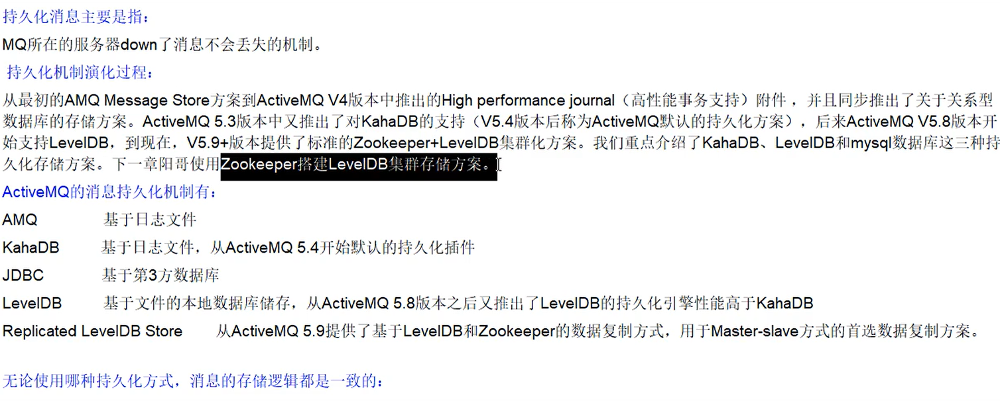

# 9 ActiveMQ的多节点集群

基于ZooKeeper和LevelDB搭建ActiveMQ集群。

集群仅提供主备方式的高可用集群功能， 避免单点故障。
.

## 9.1 三种集群方式

基于sharedFileSystem共享文件系统

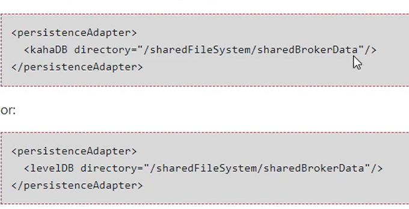

基于JDBC

基于Replicated Level DB

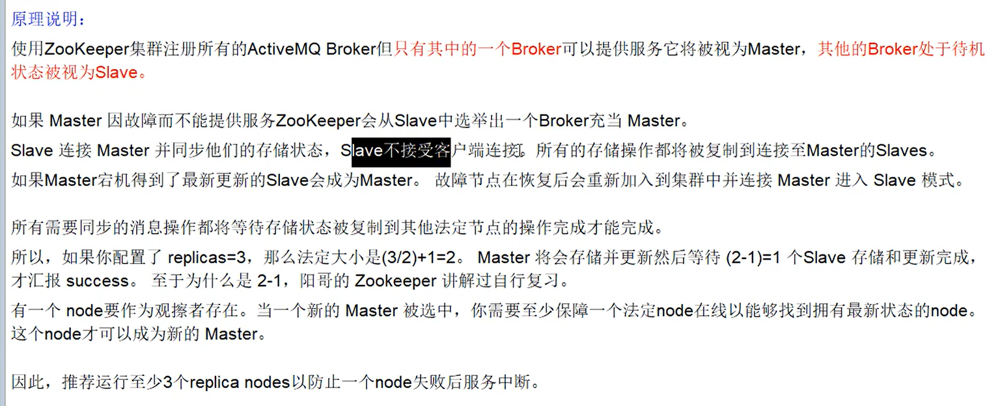

已弃用

## 9.2 基于Replicated Level DB集群配置部署

### 9.2.1 环境

```bash
[root@hadoop102 module]# cat /etc/redhat-release
CentOS Linux release 7.5.1804 (Core) 
```

activemq-5.16.3  

jdk1.8.0_311  

zookeeper-3.5.7

### 9.2.2 单机部署规划

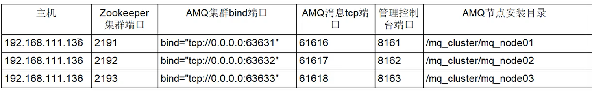

### 9.2.3 配置zk集群

```bash
[root@hadoop102 mq_cluster]# mkdir /zk_culster/
[root@hadoop102 zk_cluster]# cp -r /opt/module/zookeeper-3.5.7/ zk_node01
[root@hadoop102 zk_cluster]# cp -r /opt/module/zookeeper-3.5.7/ zk_node02
[root@hadoop102 zk_cluster]# cp -r /opt/module/zookeeper-3.5.7/ zk_node03


```

```c
# zoo.cfg
dataDir=/zk_cluster/zk_node01/zkData
clientPort=2191
# server.几号服务器=服务器地址:follower与leader交换信息的端口：挂掉后选举新leader后的端口 
##################cluster########################
server.1=hadoop102:2881:3881
server.2=hadoop102:2882:3882
server.3=hadoop102:2883:3883                             
```

```bash
[root@hadoop102 zk_culster]# echo 1 > zk_node01/zkData/myid
[root@hadoop102 zk_culster]# echo 2 > zk_node02/zkData/myid
[root@hadoop102 zk_culster]# echo 3 > zk_node03/zkData/myid

```


### 9.2.4 创建mq集群目录

```bash
[root@hadoop102 module]# mkdir /mq_cluster/
[root@hadoop102 module]# cd /mq_cluster/
[root@hadoop102 mq_cluster]# cp -r /opt/module/activemq-5.16.3/ mq_node01
[root@hadoop102 mq_cluster]# cp -r mq_node01 mq_node02
[root@hadoop102 mq_cluster]# cp -r mq_node01 mq_node03

```

### 9.2.5 修改管理前台的端口

```xml
<!--jetty.xml-->
<property name="port" value="8162"/>
```

### 9.2.6 集群配置

brokerName一致

```bash
[root@hadoop102 mq_cluster]# vim mq_node01/conf/activemq.xml
[root@hadoop102 mq_cluster]# vim mq_node02/conf/activemq.xml
[root@hadoop102 mq_cluster]# vim mq_node03/conf/activemq.xml

```

```xml
<!--修改为本机对应域名 而不是localhost-->
<broker xmlns="http://activemq.apache.org/schema/core" brokerName="hadoop102" dataDirectory="${activemq.data}">

```

持久化配置

```xml
        <persistenceAdapter>
                <replicatedLevelDB
                        directory="${activemq.data}/leveldb"
                        replicas="3"
                        bind="tcp://0.0.0.0:63631" <!--63631 63631-->
                        zkAddress="hadoop102:2191,hadoop102:2192,hadoop102:2193"
                        sync="local_disk"
                        zkPath="/assets/leveldb-stores"
                        hostname="hadoop102"
                />
        </persistenceAdapter>

```

### 9.2.7 修改消息端口

```xml
            <transportConnector name="openwire" uri="tcp://0.0.0.0:61618?maximumConnections=1000&amp;wireFormat.maxFrameSize=104857600"/>

```

### 9.2.8 启动zk集群后启动mq集群

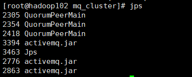

查看zk状态

```bash
[root@hadoop102 zk_cluster]# zk_node01/bin/zkCli.sh -server hadoop102:2191

[zk: hadoop102:2191(CONNECTED) 1] ls /
[activemq, zookeeper]
[zk: hadoop102:2191(CONNECTED) 2] ls /activemq
[leveldb-stores]
[zk: hadoop102:2191(CONNECTED) 3] ls /assets/leveldb-stores
[00000000000, 00000000001, 00000000003]
[zk: hadoop102:2191(CONNECTED) 5] get /assets/leveldb-stores/00000000000
{"id":"hadoop102","container":null,"address":"tcp://hadoop102:63631","position":-1,"weight":1,"elected":"0000000000"}
[zk: hadoop102:2191(CONNECTED) 6] get /assets/leveldb-stores/00000000001
{"id":"hadoop102","container":null,"address":null,"position":-1,"weight":1,"elected":null}
[zk: hadoop102:2191(CONNECTED) 8] get /assets/leveldb-stores/00000000003
{"id":"hadoop102","container":null,"address":null,"position":-1,"weight":1,"elected":null}


```

mq集群挂载zk成功

查看mq状态

```bash
[root@hadoop102 zk_cluster]# ps -ef| grep activemq| grep -v grep
root       2776      1  2 15:50 pts/0    00:00:27 /opt/module/jdk1.8.0_311/bin/java -Xms64M -Xmx1G -Djava.util.logging.config.file=logging.properties -Djava.security.auth.login.config=/mq_cluster/mq_node01//conf/login.config -Dcom.sun.management.jmxremote -Djava.awt.headless=true -Djava.io.tmpdir=/mq_cluster/mq_node01//tmp -Dactivemq.classpath=/mq_cluster/mq_node01//conf:/mq_cluster/mq_node01//../lib/: -Dactivemq.home=/mq_cluster/mq_node01/ -Dactivemq.base=/mq_cluster/mq_node01/ -Dactivemq.conf=/mq_cluster/mq_node01//conf -Dactivemq.data=/mq_cluster/mq_node01//data -jar /mq_cluster/mq_node01//bin/activemq.jar start
root       2863      1  1 15:50 pts/0    00:00:13 /opt/module/jdk1.8.0_311/bin/java -Xms64M -Xmx1G -Djava.util.logging.config.file=logging.properties -Djava.security.auth.login.config=/mq_cluster/mq_node02//conf/login.config -Dcom.sun.management.jmxremote -Djava.awt.headless=true -Djava.io.tmpdir=/mq_cluster/mq_node02//tmp -Dactivemq.classpath=/mq_cluster/mq_node02//conf:/mq_cluster/mq_node02//../lib/: -Dactivemq.home=/mq_cluster/mq_node02/ -Dactivemq.base=/mq_cluster/mq_node02/ -Dactivemq.conf=/mq_cluster/mq_node02//conf -Dactivemq.data=/mq_cluster/mq_node02//data -jar /mq_cluster/mq_node02//bin/activemq.jar start
root       3394      1  1 15:53 pts/0    00:00:09 /opt/module/jdk1.8.0_311/bin/java -Xms64M -Xmx1G -Djava.util.logging.config.file=logging.properties -Djava.security.auth.login.config=/mq_cluster/mq_node03//conf/login.config -Dcom.sun.management.jmxremote -Djava.awt.headless=true -Djava.io.tmpdir=/mq_cluster/mq_node03//tmp -Dactivemq.classpath=/mq_cluster/mq_node03//conf:/mq_cluster/mq_node03//../lib/: -Dactivemq.home=/mq_cluster/mq_node03/ -Dactivemq.base=/mq_cluster/mq_node03/ -Dactivemq.conf=/mq_cluster/mq_node03//conf -Dactivemq.data=/mq_cluster/mq_node03//data -jar /mq_cluster/mq_node03//bin/activemq.jar start

[root@hadoop102 zk_cluster]# netstat -anp |grep 8161
tcp6       0      0 :::8161                 :::*                    LISTEN      2776/java           
[root@hadoop102 zk_cluster]# netstat -anp |grep 8162
[root@hadoop102 zk_cluster]# netstat -anp |grep 8163

```

仅一个端口正在运行能被访问

## 9.3 集群可用性测试

ActiveMQ的客户端只能访问Master的Broker,其他处于Slave的Broker不能访问，所以客户端连接的Broker应该使用failover协议(失败转移)

当一个ActiveMQ节点挂掉或者一个Zookeeper节点挂掉，ActiveMQ服务依然正常运转，如果仅剩一个ActiveMQ节点,由于不能选举Master，所以ActiveMQ不能正常运行；

同样的,如果Zookeeper仅剩一个节点活动，不管ActiveMQ各节点存活，ActiveMQ也不能正常提供服务。(ActiveMQ集群的高
可用，依赖于Zookeeper集群的高可用）

```java
    public static final String ACTIVEMQ_URL_CLUSTER = "failover:(tcp://192.168.10.102:61616,tcp://192.168.10.102:61617,tcp://192.168.10.102:61618)?randomize=false";//失败转移协议的访问url
    public static final String QUEUE_NAME_CLUSTER = "queue1";
```

干掉master端口 

```bash
[root@hadoop102 mq_node02]# kill -9 2776

```

# 10 高级特性与面试

## 10.1 异步投递

ActiveMQ支持同步、异步两种发送的模式将消息发送到broker,模式的选择对发送更(产出率=发送数据总量/时间)主要受发送延时的影响，使用异步发送可以显著的提高发送的性能。

ActiveMQ默认使用异步发送的模式：除非明确指定使用同步发送的方式或者在未使用事务的前提下发送持久化的消息，这两种情况
都是同步发送的。

**同步发送**

如果你没有使用事务且发送的是持久化的消息，每一次发送都是同步发送的且会阻塞producer直到broker返回一个确认，表示消息已
经被安全的持久化到磁盘。确认机制提供了消息安全的保障，但同时会阻塞客户端带来了很大的延时。

**异步发送**

很多高性能的应用，允许在失败的情况下有少量的数据丢失。如果你的应用满足这个特点，你可以使用异步发送来提高生产率，即使
发送的是持久化的消息。

它可以最大化produer端的发送效率。我们通常在发送消息量比较密集的情况下使用异步发送，它可以很大的提升Producer性能；
不过这也带来了额外的问题，就是需要消耗较多的Client端内存同时也会导致broker端性能消耗增加；此外它不能有效的确保消息的发送成功。在useAsyncSend=true的情况下客户端需要容忍消息丢失的可能。

**测试**

```java
        activeMQConnectionFactory.setUseAsyncSend(true);//开启异步投递

for (int i = 0; i < 3; i++) {
            //异步投递，成功后将执行消息回调函数
            textMessage = session.createTextMessage("msg" + (i + 1));
            textMessage.setJMSMessageID(UUID.randomUUID().toString().substring(0,6) + "---tintin");
            String msgID = textMessage.getJMSMessageID();
            messageProducer.send(textMessage, new AsyncCallback() {
                @Override
                public void onSuccess() {
                    System.out.println(msgID + "has been sent successfully");
                }

                @Override
                public void onException(JMSException e) {
                    System.out.println(msgID + "failed to send");
                }
            });
        }
```

## 10.2 延时投递

| Property name        | type   | description        |
| -------------------- | ------ | ------------------ |
| AMQ_SCHEDULED_DELAY  | long   | 延迟投递的时间     |
| AMQ_SCHEDULED_PERIOD | long   | 重复投递的时间间隔 |
| AMQ_SCHEDULED_REPEAT | int    | 重复投递次数       |
| AMQ_SCHEDULED_CRON   | String | Cron表达式         |

```xml
<!--activemq.xml-->
<broker xmlns="http://activemq.apache.org/schema/core" brokerName="localhost" dataDirectory="${activemq.data}" schedulerSupport="true">

```

```java
			textMessage.setLongProperty(ScheduledMessage.AMQ_SCHEDULED_DELAY,3000);
            textMessage.setLongProperty(ScheduledMessage.AMQ_SCHEDULED_PERIOD,4000);
            textMessage.setIntProperty(ScheduledMessage.AMQ_SCHEDULED_REPEAT,5);

```

## 10.3 消息重试

**引起消息重发的原因**

1. Client用了transactions且在session中调用了rollback()
2. Client用了transactions且在调用commit()之前关闭或者没有commit
3. Client在CLIENT_ACKNOWLEDGE的传递模式下，在session中调用了recover()

**重发间隔**：1

**重发次数**：6（引起消息重发6次后将不会再重发）

**有毒消息**：

一个消息初redelivedred 超过默认的最大重发次数（默认6次）时，消费端会给MQ发送一个”poison ack”告诉broker不要再发了。这个时候 broker 会把这个消息放到 DLQ（死信队列）

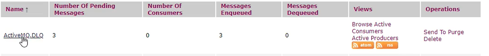

**属性**

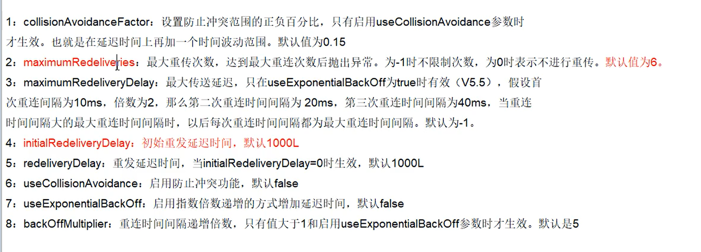

```java
//不整合spring直接set属性
RedeliveryPolicy redeliveryPolicy = newRedeliveryPolicy(）;
redeliveryPolicy.setMaximumRedeliveries(3);
```

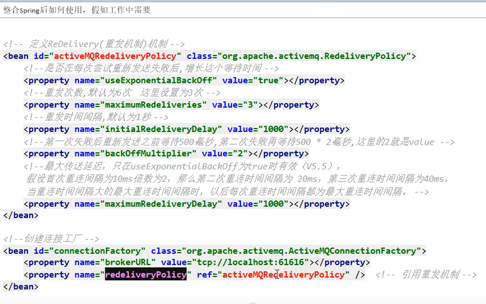

## 10.4 死信队列

ActiveMQ中的概念。即一条消息再被重发了多次后（默认为重发6次redeliveryCounter==6），将会被ActiveMQ移入“死信队列”。开发人员可以在这个Queue中查看处理出错的消息，进行人工干预


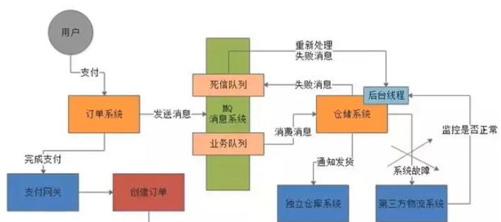

将所有的DeadLetter保存在一个共享的队列中，这是ActiveMQ broker端默认的策略。共享队列默认为“ActiveMQ.DLQ”，可以通过“deadLetterQueue”属性来设定。

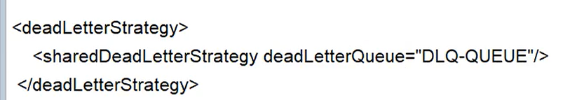

也可以指定对应的死信队列

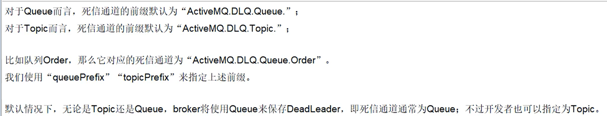

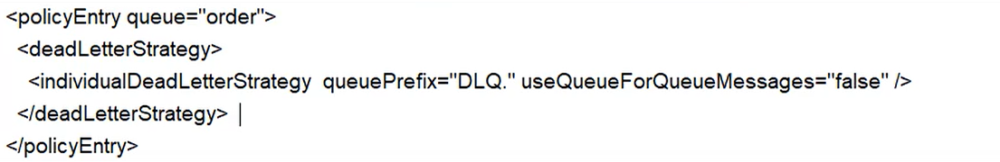


## 10.5 保证消息不重复消费

网络延迟传输中，会造成进行MQ重试中，在重试过程中，可能会造成**重复消费**。

如果消息是做数据库的插入操作，给这个消息做一个**唯一主键**，那么就算出现重复消费的情况，就会导致主键冲突，避免数据库出现脏数据。

如果上面两种情况还不行，准备一个第三服务方来做消费记录。以**redis**为例，给消息分配一个全局id，只要消费过该消息，将`<id,message>`以K-V形式写入redis。那消费者开始消费前，先去redis中查询有没消费记录即可。

**幂等性问题**

**幂等性：就是用户对于同一操作发起的一次请求或者多次请求的结果是一致的，不会因为多次点击而产生了副作用。**举个最简单的例子，那就是支付，用户购买商品后支付，支付扣款成功，但是返回结果的时候网络异常，此时钱已经扣了，用户再次点击按钮，此时会进行第二次扣款，返回结果成功，用户查询余额发现多扣钱了，流水记录也变成了两条。在以前的单应用系统中，我们只需要把数据操作放入事务中即可，发生错误立即回滚，但是再响应客户端的时候也有可能出现网络中断或者异常等等。
