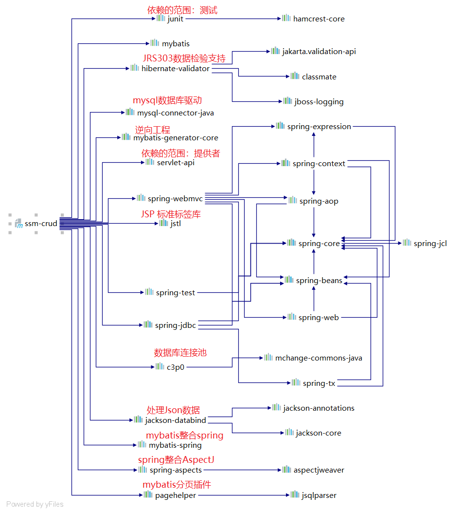
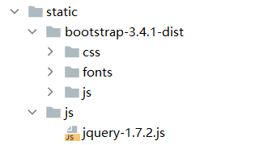
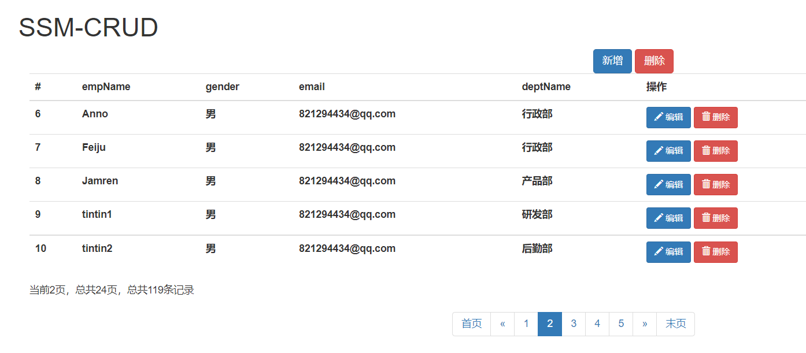
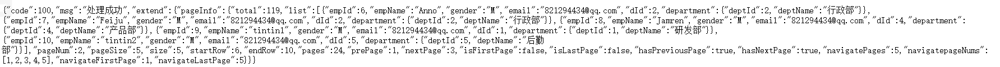
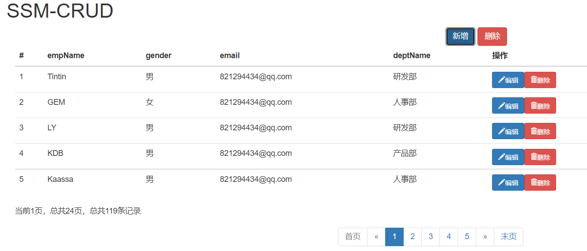
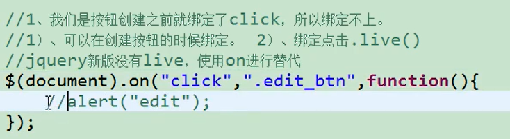
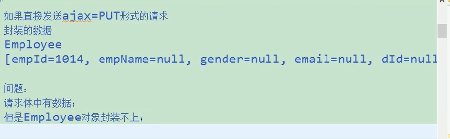
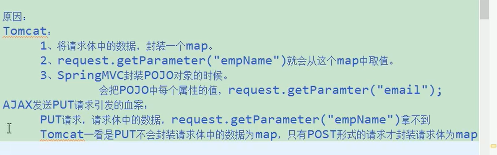
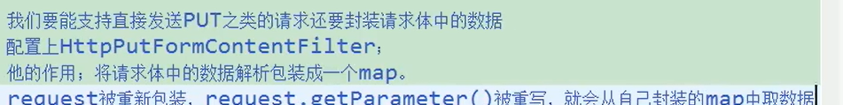

* SSM-CRUD 
* ssm:SpringMVC+Spring+MyBatis 

* CRUD：Create（创建） Retrieve（查询） Update（更新） Delete（删除）

# 功能点

1. 分页
2. 数据校验 
   * jquery前端校验+JSR303后端校验 

3. ajax 
4. Rest风格的URI；使用HTTP协议请求方式的动词，来表示对资 源的操作（GET（查询），POST（新增），PUT（修改），DELETE （删除））

# 技术点

* 基础框架-ssm（SpringMVC+Spring+MyBatis） 
* 数据库-MySQL 
* 前端框架-bootstrap快速搭建简洁美观的界面 
* 项目的依赖管理-Maven 
* 分页-pagehelper 
* 逆向工程-MyBatis Generator

# 基础环境搭建

1. 创建一个maven工程

2. 引入项目依赖的jar包 

   * spring 
   * springmvc
   * mybatis , mybatis-generator 
   * 数据库连接池，驱动包 
   * 其他（jstl，servlet-api，junit）

   > 下载太慢可以配置aliyun的镜像文件

   

   ```xml
   <?xml version="1.0" encoding="UTF-8"?>
   <project xmlns="http://maven.apache.org/POM/4.0.0"
            xmlns:xsi="http://www.w3.org/2001/XMLSchema-instance"
            xsi:schemaLocation="http://maven.apache.org/POM/4.0.0 http://maven.apache.org/xsd/maven-4.0.0.xsd">
       <modelVersion>4.0.0</modelVersion>
   
       <groupId>com.tintin</groupId>
       <artifactId>ssm-crud</artifactId>
       <version>1.0-SNAPSHOT</version>
       <packaging>war</packaging>
   
       <properties>
           <maven.compiler.source>8</maven.compiler.source>
           <maven.compiler.target>8</maven.compiler.target>
       </properties>
   
       <!--项目依赖-->
       <dependencies>
           <!--spring-mvc-->
           <dependency>
               <groupId>org.springframework</groupId>
               <artifactId>spring-webmvc</artifactId>
               <version>5.2.6.RELEASE</version>
           </dependency>
           <!--spring-jdbc-->
           <dependency>
               <groupId>org.springframework</groupId>
               <artifactId>spring-jdbc</artifactId>
               <version>5.2.6.RELEASE</version>
           </dependency>
           <!--spring-aop-->
           <dependency>
               <groupId>org.springframework</groupId>
               <artifactId>spring-aspects</artifactId>
               <version>5.2.6.RELEASE</version>
           </dependency>
           <!--spring-test-->
           <dependency>
               <groupId>org.springframework</groupId>
               <artifactId>spring-test</artifactId>
               <version>5.2.6.RELEASE</version>
           </dependency>
   
           <!--mybatis-->
           <!-- https://mvnrepository.com/artifact/org.mybatis/mybatis -->
           <dependency>
               <groupId>org.mybatis</groupId>
               <artifactId>mybatis</artifactId>
               <version>3.4.6</version>
           </dependency>
           <!--mybatis 整合 spring 适配包-->
           <!-- https://mvnrepository.com/artifact/org.mybatis/mybatis-spring -->
           <dependency>
               <groupId>org.mybatis</groupId>
               <artifactId>mybatis-spring</artifactId>
               <version>1.3.1</version>
           </dependency>
   
           <!--mybatis的逆向工程-->
           <!-- https://mvnrepository.com/artifact/org.mybatis.generator/mybatis-generator-core -->
           <dependency>
               <groupId>org.mybatis.generator</groupId>
               <artifactId>mybatis-generator-core</artifactId>
               <version>1.3.7</version>
           </dependency>
   
   
           <!--数据库连接池 c3p0-->
           <!-- https://mvnrepository.com/artifact/com.mchange/c3p0 -->
           <dependency>
               <groupId>com.mchange</groupId>
               <artifactId>c3p0</artifactId>
               <version>0.9.5.2</version>
           </dependency>
   
           <!--mysql数据库驱动-->
           <dependency>
               <groupId>mysql</groupId>
               <artifactId>mysql-connector-java</artifactId>
               <version>5.1.47</version>
           </dependency>
   
           <!--jstl-->
           <!-- https://mvnrepository.com/artifact/javax.servlet/jstl -->
           <dependency>
               <groupId>javax.servlet</groupId>
               <artifactId>jstl</artifactId>
               <version>1.2</version>
           </dependency>
           <!--servlet-->
           <dependency>
               <groupId>javax.servlet</groupId>
               <artifactId>servlet-api</artifactId>
               <version>2.5</version>
               <scope>provided</scope>
           </dependency>
           <!--junit-->
           <dependency>
               <groupId>junit</groupId>
               <artifactId>junit</artifactId>
               <version>4.12</version>
               <scope>test</scope>
           </dependency>
   
       </dependencies>
   </project>
   ```

3. 引入bootstrap前端框架

   > Bootstrap 是一个用于快速开发 Web 应用程序和网站的前端框架。Bootstrap 是基于 HTML、CSS、JAVASCRIPT 的。

   

   ```jsp
       <head>
           <title>Title</title>
           <!--引入jquery-->
           <script type="text/javascript" src="static/js/jquery-1.7.2.js"></script>
           <!--引入bootstrap的CSS-->
           <link href="static/bootstrap-3.4.1-dist/css/bootstrap.min.css" rel="stylesheet"/>
           <!--引入bootstrap的js文件-->
           <script type="text/javascript" src="static/bootstrap-3.4.1-dist/js/bootstrap.min.js"></script>
       </head>
   ```

4. 编写ssm整合的关键配置文件 

   * web.xml 

     ```xml
     <?xml version="1.0" encoding="UTF-8"?>
     <web-app xmlns="http://xmlns.jcp.org/xml/ns/javaee"
              xmlns:xsi="http://www.w3.org/2001/XMLSchema-instance"
              xsi:schemaLocation="http://xmlns.jcp.org/xml/ns/javaee http://xmlns.jcp.org/xml/ns/javaee/web-app_4_0.xsd"
              version="4.0">
         <!--启动spring容器-->
         <context-param>
             <param-name>contextConfigLocation</param-name>
             <param-value>classpath:applicationContext.xml</param-value>
         </context-param>
         <!--该监听器 在项目一启动时 可以指定加载某一处spring的配置文件的位置-->
         <listener>
             <listener-class>org.springframework.web.context.ContextLoaderListener</listener-class>
         </listener>
     
         <!--配置spring-mvc前端控制器-->
         <servlet>
             <servlet-name>dispatcherServlet</servlet-name>
             <servlet-class>org.springframework.web.servlet.DispatcherServlet</servlet-class>
             <load-on-startup>1</load-on-startup>
         </servlet>
         <servlet-mapping>
             <servlet-name>dispatcherServlet</servlet-name>
             <url-pattern>/</url-pattern>
         </servlet-mapping>
     
         <!--字符编码过滤器 解决获取请求参数的乱码问题 必须在所有【会获取请求参数的过滤器】之前配置-->
         <filter>
             <filter-name>characterEncodingFilter</filter-name>
             <filter-class>org.springframework.web.filter.CharacterEncodingFilter</filter-class>
             <init-param>
                 <param-name>encoding</param-name>
                 <param-value>UTF-8</param-value>
             </init-param>
             <!--是否设置响应的编码-->
             <init-param>
                 <param-name>forceResponseEncoding</param-name>
                 <param-value>true</param-value>
             </init-param>
             <!--是否设置请求的编码-->
             <init-param>
                 <param-name>forceRequestEncoding</param-name>
                 <param-value>true</param-value>
             </init-param>
         </filter>
         <filter-mapping>
             <filter-name>characterEncodingFilter</filter-name>
             <url-pattern>/*</url-pattern>
         </filter-mapping>
     
         <!--HiddenHttpMethodFilter 将post请求转换成put和delete请求等 实现RESTFul风格URL地址-->
         <filter>
             <filter-name>hiddenHttpMethodFilter</filter-name>
             <filter-class>org.springframework.web.filter.HiddenHttpMethodFilter</filter-class>
         </filter>
         <filter-mapping>
             <filter-name>hiddenHttpMethodFilter</filter-name>
             <url-pattern>/*</url-pattern>
         </filter-mapping>
     </web-app>
     ```

     

   * spring（applicationContext.xml）

     ```properties
     jdbc.jdbcUrl=jdbc:mysql://localhost:3306/ssm_crud?useSSL=false&useUnicode=true&characterEncoding=UTF-8&serverTimezone=GMT
     jdbc.user=root
     jdbc.password=tintin
     jdbc.driverClass=com.mysql.jdbc.Driver
     ```

     ```xml
     <?xml version="1.0" encoding="UTF-8"?>
     <beans xmlns="http://www.springframework.org/schema/beans"
            xmlns:xsi="http://www.w3.org/2001/XMLSchema-instance"
            xmlns:context="http://www.springframework.org/schema/context" xmlns:tx="http://www.springframework.org/schema/tx"
            xmlns:aop="http://www.springframework.org/schema/aop"
            xsi:schemaLocation="http://www.springframework.org/schema/beans http://www.springframework.org/schema/beans/spring-beans.xsd
             http://www.springframework.org/schema/context http://www.springframework.org/schema/context/spring-context.xsd http://www.springframework.org/schema/tx http://www.springframework.org/schema/tx/spring-tx.xsd http://www.springframework.org/schema/aop https://www.springframework.org/schema/aop/spring-aop.xsd">
         <!--spring的配置 主要配置和业务逻辑有关的-->
     
         <!--开启组件扫描-->
         <context:component-scan base-package="com.tintin" use-default-filters="false">
             <context:exclude-filter type="annotation" expression="org.springframework.stereotype.Controller"/>
         </context:component-scan>
     
         <!--==============配置数据源==============-->
         <context:property-placeholder location="classpath:dbConfig.properties"/>
         <bean id="pooledDataSource" class="com.mchange.v2.c3p0.ComboPooledDataSource">
             <property name="password" value="${jdbc.password}"/>
             <property name="user" value="${jdbc.user}"/>
             <property name="jdbcUrl" value="${jdbc.jdbcUrl}"/>
             <property name="driverClass" value="${jdbc.driverClass}"/>
         </bean>
     
         <!--==============配置和mybatis的整合==============-->
         <!--在基础的 MyBatis 用法中，是通过 SqlSessionFactoryBuilder 来创建 SqlSessionFactory 的。-->
         <!--而在 MyBatis-Spring 中，则使用 SqlSessionFactoryBean 来创建。-->
         <bean id="sqlSessionFactoryBean" class="org.mybatis.spring.SqlSessionFactoryBean">
             <!--通过属性注入 可以实现完全替代mybatis全局配置文件 如下主要配置了environment配置与mapper配置-->
             <!--指定mybatis全局配置文件位置-->
             <property name="configLocation" value="classpath:mybatisConfig.xml"/>
             <property name="dataSource" ref="pooledDataSource"/>
             <!--指定mybatis mapper文件的位置-->
             <property name="mapperLocations" value="classpath:mapper/*.xml"/>
         </bean>
     
         <!--配置扫描器 将mybatis接口的实现 添加到ioc容器中-->
         <bean class="org.mybatis.spring.mapper.MapperScannerConfigurer">
             <!--扫描所有dao接口的实现，将他们加入到ioc容器中-->
             <property name="basePackage" value="com.tintin.crud.dao"/>
         </bean>
     
         <!--配置一个可以执行批量操作sqlSession-->
         <bean id="sqlSession" class="org.mybatis.spring.SqlSessionTemplate">
             <constructor-arg name="sqlSessionFactory" ref="sqlSessionFactoryBean"/>
             <constructor-arg name="executorType" value="BATCH"/>
         </bean>
     
         <!--==============事务控制配置==============-->
         <bean id="transactionManager" class="org.springframework.jdbc.datasource.DataSourceTransactionManager">
             <!--控制数据源-->
             <property name="dataSource" ref="pooledDataSource"/>
         </bean>
     
         <!--开启事务注解 主要基于配置 因此不用-->
     <!--    <tx:annotation-driven transaction-manager="transactionManager"/>-->
     
         <!--配置切面编程aop-->
         <aop:config>
             <!--切入点表达式  对于service下的所有方法都用到事务管理-->
             <aop:pointcut id="txPoint" expression="execution(* com.tintin.crud.service..*.*(..))"/>
             <aop:advisor advice-ref="txAdvice" pointcut-ref="txPoint"/>
         </aop:config>
     
         <!--配置事务的通知-->
         <tx:advice id="txAdvice" transaction-manager="transactionManager">
             <tx:attributes>
                 <!--切入点的所有方法都是事务方法-->
                 <tx:method name="*" propagation="REQUIRED"/>
                 <!--切入点以get开头的方法都是事务方法-->
                 <tx:method name="get*" read-only="true"/>
             </tx:attributes>
         </tx:advice>
     </beans>
     ```

   * springmvc(dispatcherServlet-servlet.xml)

     ```xml
     <?xml version="1.0" encoding="UTF-8"?>
     <beans xmlns="http://www.springframework.org/schema/beans"
            xmlns:xsi="http://www.w3.org/2001/XMLSchema-instance"
            xmlns:context="http://www.springframework.org/schema/context"
            xmlns:mvc="http://www.springframework.org/schema/mvc"
            xsi:schemaLocation="http://www.springframework.org/schema/beans http://www.springframework.org/schema/beans/spring-beans.xsd
             http://www.springframework.org/schema/context http://www.springframework.org/schema/context/spring-context.xsd http://www.springframework.org/schema/mvc https://www.springframework.org/schema/mvc/spring-mvc.xsd">
         <!--spring-mvc配置文件 包含网站的跳转逻辑-->
     
         <!--开启组件扫描 在扫描带有Controller注释的类-->
         <context:component-scan base-package="com.tintin" use-default-filters="true">
             <context:include-filter type="annotation" expression="org.springframework.stereotype.Controller"/>
         </context:component-scan>
     
         <!--配置视图解析器-->
         <bean id="viewResolver" class="org.springframework.web.servlet.view.InternalResourceViewResolver">
             <property name="suffix" value=".jsp"/>
             <property name="prefix" value="/WEB-INF/views"/>
         </bean>
     
         <!--两个标准配置-->
     
         <!--defaultServletHandler 开启对静态资源的访问-->
         <!--由于访问了静态资源，前端控制器无法找到对应控制器，所以需要设置默认servlet对其处理-->
         <mvc:default-servlet-handler/>
     
         <!--开启spring-mvc注解驱动 支持更高级的功能 快捷的ajax JSR303校验 映射动态请求等-->
         <!--当SpringMVC中设置任何一个view-controller时，其他控制器中的请求映射将全部失效，此时需 要在SpringMVC的核心配置文件中设置开启mvc注解驱动的标签：-->
         <mvc:annotation-driven/>
     </beans>
     ```

   * mybatis(mybatisConfig.xml)

     ```xml
     <?xml version="1.0" encoding="UTF-8" ?>
     <!DOCTYPE configuration
             PUBLIC "-//mybatis.org//DTD Config 3.0//EN"
             "http://mybatis.org/dtd/mybatis-3-config.dtd">
     
     <configuration>
         <settings>
             <!--开启标准日志-->
             <setting name="logImpl" value="STDOUT_LOGGING"/>
             <!--开启字段与属性命名映射-->
             <setting name="mapUnderscoreToCamelCase" value="true"/>
         </settings>
     
         <typeAliases>
             <package name="com.tintin.crud.bean"/>
         </typeAliases>
     
     </configuration>
     ```

     

   * 使用mybatis的逆向工程生成对应的bean以 及mapper(手写也可以，但是工作量多) 

     (mbg.xml)

     ```xml
     <?xml version="1.0" encoding="UTF-8"?>
     <!DOCTYPE generatorConfiguration
             PUBLIC "-//mybatis.org//DTD MyBatis Generator Configuration 1.0//EN"
             "http://mybatis.org/dtd/mybatis-generator-config_1_0.dtd">
     
     <generatorConfiguration>
     
         <context id="DB2Tables" targetRuntime="MyBatis3" >
             <!--关闭注释-->
             <commentGenerator>
                 <property name="suppressAllComments" value="true"/>
             </commentGenerator>
     
             <jdbcConnection driverClass="com.mysql.jdbc.Driver"
                             connectionURL="jdbc:mysql://localhost:3306/ssm_crud?useSSL=false"
                             userId="root"
                             password="tintin">
             </jdbcConnection>
     
             <javaTypeResolver>
                 <property name="forceBigDecimal" value="false"/>
             </javaTypeResolver>
     
             <!--指定javaBean生成的位置-->
             <javaModelGenerator
                     targetPackage="com.tintin.crud.bean"
                     targetProject="./src/main/java">
                 <property name="enableSubPackages" value="true"/>
                 <property name="trimStrings" value="true" />
             </javaModelGenerator>
     
             <!--指定sql映射文件生成位置-->
             <sqlMapGenerator
                     targetPackage="mapper"
                     targetProject="./src/main/resources">
                 <property name="enableSubPackages" value="true"/>
             </sqlMapGenerator>
     
             <!--指定dao接口生成的位置-->
             <javaClientGenerator
                     type="XMLMAPPER"
                     targetPackage="com.tintin.crud.dao"
                     targetProject="./src/main/java">
                 <property name="enableSubPackages" value="true"/>
             </javaClientGenerator>
     
             <!--指定每个表的生成策略 表名与实体类映射-->
             <table tableName="tbl_emp" domainObjectName="employee"></table>
             <table tableName="tbl_dept" domainObjectName="department"></table>
         </context>
     
     </generatorConfiguration>
     ```

     逆向工程生成代码

     ```java
     package com.tintin.crud.test;
     
     import org.junit.Test;
     import org.mybatis.generator.api.MyBatisGenerator;
     import org.mybatis.generator.config.Configuration;
     import org.mybatis.generator.config.xml.ConfigurationParser;
     import org.mybatis.generator.exception.InvalidConfigurationException;
     import org.mybatis.generator.exception.XMLParserException;
     import org.mybatis.generator.internal.DefaultShellCallback;
     
     import java.io.File;
     import java.io.IOException;
     import java.io.InputStream;
     import java.sql.SQLException;
     import java.util.ArrayList;
     import java.util.List;
     
     /**
      * @author tintin
      * @create 2021-10-29-2:45
      */
     public class TestMBG {
     
         public static void main(String[] args) throws XMLParserException, IOException, InvalidConfigurationException, SQLException, InterruptedException {
     //        List<String> warnings = new ArrayList<String>();
     //        boolean overwrite = true;
     //        ConfigurationParser cp = new ConfigurationParser(warnings);
     //        //构造输入流对象
     //        InputStream is = Thread.currentThread().getContextClassLoader().getResourceAsStream("mbg.xml");
     //        Configuration config = cp.parseConfiguration(is);
     //        DefaultShellCallback callback = new DefaultShellCallback(overwrite);
     //        MyBatisGenerator myBatisGenerator = new MyBatisGenerator(config, callback, warnings);
     //        myBatisGenerator.generate(null);
     
             List<String> warnings = new ArrayList<String>();
             boolean overwrite = true;
             File configFile = new File("mbg.xml");
             ConfigurationParser cp = new ConfigurationParser(warnings);
             Configuration config = cp.parseConfiguration(configFile);
             DefaultShellCallback callback = new DefaultShellCallback(overwrite);
             MyBatisGenerator myBatisGenerator = new MyBatisGenerator(config, callback, warnings);
             myBatisGenerator.generate(null);
         }
     }
     
     ```

     根据需求修改mapper
     
     1. 查询员工带上部门信息的信息
     
     ```java
         List<Department> selectByExampleWithDept(DepartmentExample example);
     
         Department selectByPrimaryKeyWithDept(Integer deptId);
     ```
     
     ```xml
         
       <!--带部门信息的结果集映射-->
       <resultMap id="ResultMapWithDept" type="com.tintin.crud.bean.Employee">
         <id column="emp_id" jdbcType="INTEGER" property="empId" />
         <result column="emp_name" jdbcType="VARCHAR" property="empName" />
         <result column="gender" jdbcType="CHAR" property="gender" />
         <result column="email" jdbcType="VARCHAR" property="email" />
         <result column="d_id" jdbcType="INTEGER" property="dId" />
         <association property="department" javaType="Department">
           <id column="dept_id" property="deptId"/>
           <result column="dept_name" property="deptName"/>
         </association>
       </resultMap>
     
     
     <!--带部门信息的查询-->
       <select id="selectByExampleWithDept" parameterType="com.tintin.crud.bean.EmployeeExample" resultMap="BaseResultMap">
         select
         <if test="distinct">
           distinct
         </if>
         <include refid="Column_List_With_Dept" />
         FROM tbl_emp e LEFT JOIN tbl_dept d
         ON e.`d_id` = d.`dept_id`;
         <if test="_parameter != null">
           <include refid="Example_Where_Clause" />
         </if>
         <if test="orderByClause != null">
           order by ${orderByClause}
         </if>
       </select>
     <!--带部门信息的查询-->
       <select id="selectByPrimaryKeyWithDept" parameterType="java.lang.Integer" resultMap="ResultMapWithDept">
         select
         <include refid="Base_Column_List" />
         FROM tbl_emp e LEFT JOIN tbl_dept d
         ON e.`d_id` = d.`dept_id`;
         Where e.`emp_id` = #{empId,jdbcType=INTEGER}
       </select>
     ```
     
     

5. 测试mapper

使用spring-test模块

```java
package com.tintin.crud.dao;

import com.tintin.crud.bean.Department;
import com.tintin.crud.bean.Employee;
import org.apache.ibatis.session.SqlSession;
import org.junit.Test;
import org.junit.runner.RunWith;
import org.springframework.beans.factory.annotation.Autowired;
import org.springframework.context.ApplicationContext;
import org.springframework.context.support.ClassPathXmlApplicationContext;
import org.springframework.test.context.ContextConfiguration;
import org.springframework.test.context.junit4.SpringJUnit4ClassRunner;

import java.util.UUID;

/**
 * @author tintin
 * @create 2021-10-29-15:26
 * 1、导入Spring-test模块
 * @ContextConfiguration指定spring配置文件位置
 * 直接autowired要使用的组件即可
 */
@RunWith(SpringJUnit4ClassRunner.class)
@ContextConfiguration(locations = {"classpath:applicationContext.xml"})
public class DepartmentMapperTest {

    @Autowired
    DepartmentMapper departmentMapper;
    @Autowired
    EmployeeMapper employeeMapper;
    @Autowired
    SqlSession sqlSession;

    @Test
    public void testInsertSelective() {
        //传统方式获取ioc容器及创建对象
//        ApplicationContext ioc = new ClassPathXmlApplicationContext("applicationConetxt.xml");
//        ioc.getBean("departmentMapper",DepartmentMapper.class);

        //添加部门信息
//        Department department = new Department();
//        department.setDeptId(null);
//        department.setDeptName("测试部");
//        departmentMapper.insertSelective(department);

//        //添加员工信息
//        Employee employee = new Employee(null,"tintin8","女","821294434@qq.com",7);
//        employeeMapper.insertSelective(employee);

        //sqlSession批量操作
        EmployeeMapper mapper = sqlSession.getMapper(EmployeeMapper.class);
        for (int i = 0; i < 100; i++) {
            String uuid = UUID.randomUUID().toString().substring(0, 5);
            mapper.insertSelective(new Employee(null,uuid,"M",uuid+"@qq.com", i%7 + 1));
        }
    }


}
```

# CRUD查询

1. 访问 index. jsp页面

2.  index. jsp页面发送出查询员工列表请求

   ```jsp
   <%@ page contentType="text/html;charset=UTF-8" pageEncoding="UTF-8" %>
   <jsp:forward page="/emps"></jsp:forward>
   ```

3.  Employee Controller来接受请求,査出员工数据

   > 引入分页插件
   >
   > ```xml
   > <!--分页插件-->
   > <!-- https://mvnrepository.com/artifact/com.github.pagehelper/pagehelper -->
   > <dependency>
   >     <groupId>com.github.pagehelper</groupId>
   >     <artifactId>pagehelper</artifactId>
   >     <version>5.2.0</version>
   > </dependency>
   > ```
   >
   > 添加插件到mybatis配置中
   >
   > ```xml
   >     <!--
   >     plugins在配置文件中的位置必须符合要求，否则会报错，顺序如下:
   >     properties?, settings?,
   >     typeAliases?, typeHandlers?,
   >     objectFactory?,objectWrapperFactory?,
   >     plugins?,
   >     environments?, databaseIdProvider?, mappers?
   > -->
   >     <plugins>
   >         <!-- com.github.pagehelper为PageHelper类所在包名 -->
   >         <plugin interceptor="com.github.pagehelper.PageInterceptor">
   >             <!-- 使用下面的方式配置参数，后面会有所有的参数介绍 -->
   >             <property name="param1" value="value1"/>
   >         </plugin>
   >     </plugins>
   > ```

   在控制器方法中使用插件进行分页

   ```java
   @RequestMapping("/emps")
       public String getEmps(
               @RequestParam(value = "pn", defaultValue = "1") Integer pageNum,
               Model model) {
           //下面不是分页查询
   //        List<Employee> employees = employeeService.getAll();
           PageHelper.startPage(pageNum,5);
           //pageHelper紧跟的查询为分页查询
           List<Employee> employees = employeeService.getAll();
           //用pageInfo进行包装显示 传入需要连续显示的页数
           PageInfo page = new PageInfo(employees,5);
           System.out.println(page.getPages());
           System.out.println(page.getSize());
           System.out.println(page.getPageNum());
   
           model.addAttribute("pageInfo",page);
           return "list";
       }
   ```

   使用spring-test模块进行测试

   ```java 
   package com.tintin.crud.controller;
   
   
   import com.github.pagehelper.PageInfo;
   import com.tintin.crud.bean.Employee;
   import org.junit.Before;
   import org.junit.Test;
   import org.junit.runner.Request;
   import org.junit.runner.RunWith;
   import org.springframework.beans.factory.annotation.Autowired;
   import org.springframework.mock.web.MockHttpServletRequest;
   import org.springframework.test.context.junit.jupiter.SpringJUnitConfig;
   import org.springframework.test.context.junit4.SpringJUnit4ClassRunner;
   import org.springframework.test.context.web.WebAppConfiguration;
   import org.springframework.test.web.servlet.MockMvc;
   import org.springframework.test.web.servlet.MockMvcBuilder;
   import org.springframework.test.web.servlet.MvcResult;
   import org.springframework.test.web.servlet.request.MockHttpServletRequestBuilder;
   import org.springframework.test.web.servlet.request.MockMvcRequestBuilders;
   import org.springframework.test.web.servlet.setup.MockMvcBuilders;
   import org.springframework.web.context.WebApplicationContext;
   
   import java.util.Arrays;
   import java.util.List;
   
   /**
    * @author tintin
    * @create 2021-10-29-17:33
    * 使用spring-test模块测试
    */
   
   @RunWith(SpringJUnit4ClassRunner.class)
   @WebAppConfiguration
   //导入spring及springmvc配置文件
   @SpringJUnitConfig(locations = {"classpath:applicationContext.xml",
           "file:src/main/webapp/WEB-INF/dispatcherServlet-servlet.xml"})
   public class EmployeeControllerTest  {
       //传入Springmvc的ioc
       @Autowired
       WebApplicationContext context;
       //虚拟mvc请求
       MockMvc mockMvc;
   
       //初始化虚拟mvc请求
       @Before
       public void initMokcMvc() {
           mockMvc = MockMvcBuilders.webAppContextSetup(context).build();
       }
   
       @Test
       public void testGetEmps() throws Exception {
           //模拟请求拿到返回值
           MvcResult result =
                   mockMvc.perform(MockMvcRequestBuilders.get("/emps").param("pn", "5"))
                   .andReturn();
   
           //请求成功后，请求域会有共享数据pageInfo
           MockHttpServletRequest request = result.getRequest();
           PageInfo page = (PageInfo) request.getAttribute("pageInfo");
           System.out.println("当前页码"+page.getPageNum());
           System.out.println("总页码"+page.getPages());
           System.out.println("总记录数"+page.getTotal());
           System.out.println("需要连续显示的页码有"+Arrays.toString(page.getNavigatepageNums()));
   
           //获取员工数据
           List<Employee> list = page.getList();
           list.forEach(System.out::println);
   
       }
   }
   ```

4. 来到 list. jsp页面进行展示

```jsp
<%--
  Created by IntelliJ IDEA.
  User: 82129
  Date: 2021/10/29
  Time: 17:08
  To change this template use File | Settings | File Templates.
--%>
<%@ page contentType="text/html;charset=UTF-8" language="java" %>
<%@ taglib prefix="c" uri="http://java.sun.com/jsp/jstl/core" %>
<%
    pageContext.setAttribute("contextPath",request.getContextPath());
%>
<!DOCTYPE html>
<html>
    <head>
        <!--
        web路径问题
        斜杠开头表示以服务器路径开头 "/"  "http://localhost:8080/"
        不以斜杠开头表示以当前资源基准的相对路径
        -->
        <title>员工列表</title>
        <!--引入jquery-->
        <script type="text/javascript" src="${contextPath}/static/js/jquery-1.7.2.js"></script>
        <!--引入bootstrap的CSS-->
        <link href="${contextPath}/static/bootstrap-3.4.1-dist/css/bootstrap.min.css" rel="stylesheet"/>
        <!--引入bootstrap的js文件-->
        <script type="text/javascript" src="${contextPath}/static/bootstrap-3.4.1-dist/js/bootstrap.min.js"></script>
    </head>
    <body>
        <!--搭建页面-->
        <div class="container">
            <!--标题-->
            <div class="row">
                <div class=".col-md-12">
                    <h1>SSM-CRUD</h1>
                </div>
            </div>
            <!--按钮-->
            <div class="row">
                <div class="col-md-4 col-md-offset-8">
                    <button class="btn btn-primary">新增</button>
                    <button class="btn btn-danger">删除</button>
                </div>
            </div>
            <!--表格数据-->
            <div class="row">
                <div class="col-md-12">
                    <table class="table table-hover">
                        <tr>
                            <th>#</th>
                            <th>empName</th>
                            <th>gender</th>
                            <th>email</th>
                            <th>deptName</th>
                            <th>操作</th>
                        </tr>
                        <c:forEach items="${pageInfo.list}" var="emp">
                        <tr>
                            <th>${emp.empId}</th>
                            <th>${emp.empName}</th>
                            <th>${emp.gender == "M" ? "男" : "女" }</th>
                            <th>${emp.email}</th>
                            <th>${emp.department.deptName}</th>
                            <th>
                                <button class="btn btn-primary btn-sm">
                                    <span class="glyphicon glyphicon-pencil" aria-hidden="true"></span>
                                    编辑
                                </button>
                                <button class="btn btn-danger btn-sm">
                                    <span class="glyphicon glyphicon-trash" aria-hidden="true"></span>
                                    删除
                                </button>
                            </th>
                        </c:forEach>
                    </table>
                </div>
            </div>
            <!--显示分页信息-->
            <div class="row">
                <!--分页文字-->
                <div class="col-md-6">
                    当前${pageInfo.pageNum}页，总共${pageInfo.pages}页，总共${pageInfo.total}条记录
                </div>
                <!--分页条信息-->
                <div class="col-md-6 col-md-offset-6">

                    <nav aria-label="Page navigation">
                        <ul class="pagination">
                            <!--首页-->
                            <li>
                                <a href="${contextPath}/emps">首页</a>
                            </li>
                            <!--上一页-->
                            <c:if test="${pageInfo.hasPreviousPage}">
                                <li>
                                    <a href="${contextPath}/emps?pn=${pageInfo.prePage}" aria-label="Previous">
                                        <span aria-hidden="true">&laquo;</span>
                                    </a>
                                </li>
                            </c:if>
                            <c:if test="${!pageInfo.hasPreviousPage}">
                                <li class="disabled">
                                    <span aria-hidden="true">&laquo;</span>
                                </li>
                            </c:if>
                            <!--显示连续的页码数-->
                            <c:forEach items="${pageInfo.navigatepageNums}" var="pageNum">
                                <c:if test="${pageNum == pageInfo.pageNum}">
                                    <li class="active"><a>${pageNum}</a></li>
                                </c:if>
                                <c:if test="${pageNum != pageInfo.pageNum}">
                                    <li><a href="${contextPath}/emps?pn=${pageNum}">${pageNum}</a></li>
                                </c:if>
                            </c:forEach>
                            <!--下一页-->
                            <c:if test="${pageInfo.hasNextPage}">
                                <li>
                                    <a href="${contextPath}/emps?pn=${pageInfo.nextPage}">
                                        <span aria-hidden="true">&raquo;</span>
                                    </a>
                                </li>
                            </c:if>
                            <c:if test="${!pageInfo.hasNextPage}">
                                <li class="disabled">
                                    <span aria-hidden="true">&raquo;</span>
                                </li>
                            </c:if>
                            <!--末页-->
                            <li>
                                <a href="${contextPath}/emps?pn=${pageInfo.pages}">末页</a>
                            </li>
                        </ul>
                    </nav>
                </div>
            </div>
        </div>
    </body>
</html>
```



# CRUD查询（Ajax）

1. index. jsp页面直接发送ajax请求进行员工分页数据的查询

> SpringMVC处理json
>
> 1. 导入jackson的依赖
>
>    ```xml
>            <!--jackson 处理json数据-->
>            <!-- https://mvnrepository.com/artifact/com.fasterxml.jackson.core/jackson-databind -->
>            <dependency>
>                <groupId>com.fasterxml.jackson.core</groupId>
>                <artifactId>jackson-databind</artifactId>
>                <version>2.12.1</version>
>            </dependency>
>    ```
>
> 2. 在SpringMVC的核心配置文件中开启mvc的注解驱动
>
>    此时在HandlerAdaptor中会自动装配一个消 息转换器：MappingJackson2HttpMessageConverter，可以将响应到浏览器的Java对象转换为Json格 式的字符串
>
>    ```xml
>    <!--开启spring-mvc注解驱动 支持更高级的功能 快捷的ajax JSR303校验 映射动态请求等-->
>        <!--当SpringMVC中设置任何一个view-controller时，其他控制器中的请求映射将全部失效，此时需 要在SpringMVC的核心配置文件中设置开启mvc注解驱动的标签：-->
>        <mvc:annotation-driven/>
>    ```
>
> 3. 在处理器方法上使用@ResponseBody注解进行标识
>
> 4. 将Java对象直接作为控制器方法的返回值返回，就会自动转换为Json格式的字符串

```java
//@ResponseBody用于标识一个控制器方法，可以将该方法的返回值直接作为响应报文的响应体响应到 浏览器
    @RequestMapping("/emps")
    @ResponseBody
    public PageInfo getEmployeesWithJson(@RequestParam(value = "pn", defaultValue = "1") Integer pageNum) {
        //下面不是分页查询
//        List<Employee> employees = employeeService.getAll();
        PageHelper.startPage(pageNum,5);
        //pageHelper紧跟的查询为分页查询
        List<Employee> employees = employeeService.getAll();
        //用pageInfo进行包装显示 传入需要连续显示的页数
        PageInfo page = new PageInfo(employees,5);
//        System.out.println(page.getPages());
//        System.out.println(page.getSize());
//        System.out.println(page.getPageNum());
        return page;
    }
```

2. 服务器将查出的数据,以json字符串的形式返回给浏览器

> 整合所有响应信息到统一的MSG类中
>
> ```java
> package com.tintin.crud.bean;
> 
> import java.util.HashMap;
> import java.util.Map;
> 
> /**
>  * @author tintin
>  * @create 2021-10-30-15:00
>  * 通用的返回类
>  */
> public class MSG {
>     //状态码
>     private int code;
>     //提示信息
>     private String msg;
>     //用户返回给浏览器的数据
>     private Map<String, Object> extend = new HashMap<>();
> 
>     public static MSG success() {
>         MSG result = new MSG();
>         result.setCode(100);
>         result.setMsg("处理成功");
>         return result;
>     }
> 
>     public static MSG fail() {
>         MSG result = new MSG();
>         result.setCode(200);
>         result.setMsg("处理失败");
>         return result;
>     }
> 
>     //添加额外的信息
>     public MSG add(String key, Object value) {
>         this.getExtend().put(key,value);
>         return this;
>     }
> 
>     public int getCode() {
>         return code;
>     }
> 
>     public void setCode(int code) {
>         this.code = code;
>     }
> 
>     public String getMsg() {
>         return msg;
>     }
> 
>     public void setMsg(String msg) {
>         this.msg = msg;
>     }
> 
>     public Map<String, Object> getExtend() {
>         return extend;
>     }
> 
>     public void setExtend(Map<String, Object> extend) {
>         this.extend = extend;
>     }
> }
> ```

```java
    //@ResponseBody用于标识一个控制器方法，可以将该方法的返回值直接作为响应报文的响应体响应到 浏览器
    @RequestMapping("/emps")
    @ResponseBody
    public MSG getEmployeesWithJson(@RequestParam(value = "pn", defaultValue = "1") Integer pageNum) {
        //下面不是分页查询
//        List<Employee> employees = employeeService.getAll();
        PageHelper.startPage(pageNum,5);
        //pageHelper紧跟的查询为分页查询
        List<Employee> employees = employeeService.getAll();
        //用pageInfo进行包装显示 传入需要连续显示的页数
        PageInfo page = new PageInfo(employees,5);
        //返回信息
        return MSG.success().add("pageInfo",page);
    }
```

2. 浏览器收到js字符串。可以使用js对json进行解析,使用js通过dom增删改改变页面。

   思路：构建html元素，填充js数据，添加到指定的标签中

   

   ```jsp
   <%--
     Created by IntelliJ IDEA.
     User: 82129
     Date: 2021/10/29
     Time: 17:08
     To change this template use File | Settings | File Templates.
   --%>
   <%@ page contentType="text/html;charset=UTF-8" language="java" %>
   <%@ taglib prefix="c" uri="http://java.sun.com/jsp/jstl/core" %>
   <%
       pageContext.setAttribute("contextPath",request.getContextPath());
   %>
   <!DOCTYPE html>
   <html>
       <head>
           <!--
           web路径问题
           斜杠开头表示以服务器路径开头 "/"  "http://localhost:8080/"
           不以斜杠开头表示以当前资源基准的相对路径
           -->
           <title>员工列表</title>
           <!--引入jquery-->
           <script type="text/javascript" src="${contextPath}/static/js/jquery-3.6.0.js"></script>
           <!--引入bootstrap的CSS-->
           <link href="${contextPath}/static/bootstrap-3.4.1-dist/css/bootstrap.min.css" rel="stylesheet"/>
           <!--引入bootstrap的js文件-->
           <script type="text/javascript" src="${contextPath}/static/bootstrap-3.4.1-dist/js/bootstrap.min.js"></script>
   
       </head>
       <body>
           <!--搭建页面-->
           <div class="container">
               <!--标题-->
               <div class="row">
                   <div class=".col-md-12">
                       <h1>SSM-CRUD</h1>
                   </div>
               </div>
               <!--按钮-->
               <div class="row">
                   <div class="col-md-4 col-md-offset-8">
                       <button class="btn btn-primary">新增</button>
                       <button class="btn btn-danger">删除</button>
                   </div>
               </div>
               <!--表格数据-->
               <div class="row">
                   <div class="col-md-12">
                       <table class="table table-hover" id="emps_table">
                           <thead>
                               <tr>
                                   <th>#</th>
                                   <th>empName</th>
                                   <th>gender</th>
                                   <th>email</th>
                                   <th>deptName</th>
                                   <th>操作</th>
                               </tr>
                           </thead>
                           <tbody>
   
                           </tbody>
   
                       </table>
                   </div>
               </div>
               <!--显示分页信息-->
               <div class="row">
                   <!--分页文字-->
                   <div class="col-md-6" id="page_info">
   
                   </div>
                   <!--分页条信息-->
                   <div class="col-md-6 col-md-offset-6" id="page_nav">
   
                   </div>
               </div>
   
           </div>
           <script type="text/javascript">
           //页面加载完后 发送ajax请求 获取第一页的信息
           $(function () {
               to_page(1)
           });
   
           //转到某一页员工信息的页面
           function to_page(pn) {
               $.ajax({
                   url:"${contextPath}/emps",
                   data:{pn:pn},
                   type:"GET",
                   success:function (data) {
                       console.log(data);
                       build_emps_table(data);
                       build_page_info(data);
                       build_page_nav(data);
   
                   },
                   dataType:"json"
               })
           }
   
           //解析显示员工信息表
           function build_emps_table(data) {
               //清空原来的数据
               $("#emps_table > tbody").empty();
   
               var emps = data.extend.pageInfo.list;
               $.each(emps,function (index,item){
                   var tdOfEmpId = $("<td>").append(item.empId);
                   var tdOfEmpName = $("<td>").append(item.empName);
                   var tdOfGender = $("<td>").append(item.gender == 'M'?'男':'女');
                   var tdOfEmail = $("<td>").append(item.email);
                   var tdOfDeptName = $("<td>").append(item.department.deptName);
                   var buttonForEdit = $("<button>").addClass("btn btn-primary btn-sm")
                       .append("<span>").addClass("glyphicon glyphicon-pencil")
                       .append("编辑");
                   var buttonForDelete = $("<button>").addClass("btn btn-danger btn-sm")
                       .append("<span>").addClass("glyphicon glyphicon-trash")
                       .append("删除");
                   var tdOfButton = $("<td>").append(buttonForEdit).append(buttonForDelete)
                   $("<tr>")
                       .append(tdOfEmpId)
                       .append(tdOfEmpName)
                       .append(tdOfGender)
                       .append(tdOfEmail)
                       .append(tdOfDeptName)
                       .append(tdOfButton)
                       .appendTo("#emps_table > tbody");
               })
           }
   
           //解析显示分页文字信息
           function build_page_info(data) {
               //清空原来的数据
               $("#page_info").empty();
   
               var pageInfo = data.extend.pageInfo;
   
               var pageNum = pageInfo.pageNum;
               var pages = pageInfo.pages;
               var total = pageInfo.total;
   
               $("#page_info").text("当前" + pageNum + "页，总共" + pages +"页，总共" + total +"条记录")
           }
   
           //解析显示分页条
           function build_page_nav(data) {
               //清空原来的数据
               $("#page_nav").empty();
   
               //分页信息
               var pageInfo = data.extend.pageInfo;
               //分页条的列表ul
               var ulOfPage = $("<ul>").addClass("pagination");
   
               var liOfFirstPage = $("<li>").append($("<a>").append("首页"));
               var liOfPreviousPage = $("<li>").append($("<a>").append("&laquo;"));
               //判断是否有前一页
               if (!pageInfo.hasPreviousPage) {
                   liOfFirstPage.addClass("disabled");
                   liOfPreviousPage.addClass("disabled");
               } else {
                   //添加跳转方法
                   liOfFirstPage.click(function () {
                       to_page(1);
                   })
                   liOfPreviousPage.click(function () {
                       to_page(pageInfo.prePage)
                   })
               }
   
   
               ulOfPage.append(liOfFirstPage).append(liOfPreviousPage);
               $.each(pageInfo.navigatepageNums,function (index,item) {
                   var liOfNavigatepageNum =  $("<li>").append($("<a>").text(item));
                   //判断是否为当前页
                   if (pageInfo.pageNum == item) {
                       liOfNavigatepageNum.addClass("active");
                   } else {
                       //添加跳转方法
                       liOfNavigatepageNum.click(function () {
                           to_page(item)
                       })
                   }
                   ulOfPage.append(liOfNavigatepageNum);
               });
   
               var liOfNextPage = $("<li>").append($("<a>").append("&raquo;"));
               var liOfLastPage = $("<li>").append($("<a>").append("末页"));
               //判断是否有后一页
               if (!pageInfo.hasNextPage) {
                   liOfNextPage.addClass("disabled");
                   liOfLastPage.addClass("disabled");
               } else {
                   //添加跳转方法
                   liOfLastPage.click(function () {
                       to_page(pageInfo.pages);
                   })
                   liOfNextPage.click(function () {
                       to_page(pageInfo.nextPage)
                   })
               }
   
   
               ulOfPage.append(liOfNextPage).append(liOfLastPage);
   
               var navOfPage = $("<nav></nav>").attr("aria-label","Page navigation").append(ulOfPage);
               navOfPage.appendTo("#page_nav");
   
           }
   
           </script>
       </body>
   </html>
   ```

3. 返回json。实现客户端的无关性。



# CRUD新增（Ajax）

1. 在 index. jsp页面点击”新增

   ```jsp
   <!--按钮-->
               <div class="row">
                   <div class="col-md-4 col-md-offset-8">
                       <button type="button" class="btn btn-primary" data-toggle="modal" data-target="#addModal" id="add_button">新增</button>
                       <button class="btn btn-danger">删除</button>
                   </div>
               </div>
   ```

   

2. 弹出新增对话框

   ```jsp
   <!-- 员工添加的模态框 -->
   <div class="modal fade" id="addModal" tabindex="-1" role="dialog" aria-labelledby="myModalLabel">
       <div class="modal-dialog" role="document">
           <div class="modal-content">
               <div class="modal-header">
                   <button type="button" class="close" data-dismiss="modal" aria-label="Close"><span aria-hidden="true">&times;</span></button>
                   <h4 class="modal-title" id="myModalLabel">员工添加</h4>
               </div>
               <div class="modal-body">
                   <form class="form-horizontal">
                       <div class="form-group">
                           <label for="inputLastName" class="col-sm-2 control-label">LastName</label>
                           <div class="col-sm-10">
                               <input type="text" name="empName" class="form-control" id="inputLastName" placeholder="LastName">
                           </div>
                       </div>
                       <div class="form-group">
                           <label for="inputEmail" class="col-sm-2 control-label">Email</label>
                           <div class="col-sm-10">
                               <input type="text" name="email" class="form-control" id="inputEmail" placeholder="Email">
                           </div>
                       </div>
                       <div class="form-group">
                           <label class="col-sm-2 control-label">Gender</label>
                           <div class="col-sm-10">
                               <label class="radio-inline">
                                   <input type="radio" name="gender" id="radioGender1" value="M"> 男
                               </label>
                               <label class="radio-inline">
                                   <input type="radio" name="gender" id="radioGender2" value="F"> 女
                               </label>
                           </div>
                       </div>
                       <div class="form-group">
                           <label for="selectDepartment" class="col-sm-2 control-label">Department</label>
                           <div class="col-sm-3">
                               <select name="dId" class="form-control" id="selectDepartment">
                                   <option value="1">1</option>
                                   <option value="2">2</option>
                                   <option value="3">3</option>
                               </select>
                           </div>
                       </div>
                   </form>
               </div>
               <div class="modal-footer">
                   <button type="button" class="btn btn-default" data-dismiss="modal" id="close_modal">关闭</button>
                   <button type="button" class="btn btn-primary" id="save_emps_button">保存</button>
               </div>
           </div>
       </div>
   </div>
   ```

3. 去数据库查询部门列表,显示在对话框中

   ```java
       /**
        * 将请求参数中的员工信息保存到数据库
        * @return
        */
       @RequestMapping(value = "/emp", method = RequestMethod.POST)
       @ResponseBody
       public MSG saveEmp(Employee employee) {
           employeeService.saveEmp(employee);
           return MSG.success();
       }
   ```

   

4. 用户输入数据 进行校验

   jquery前端校验,ajax用户名重复校验,后端校验

   ```javascript
   		//为新增按钮添加 reset表单 以及清空样式 方法
           $("#add_button").click(function () {
               $("#addModal form")[0].reset();
               $("#addModal div.form-group").removeClass("has-success has-error");
               $("#addModal form").find(".help-block").text("")
           })
   
   		//文本框绑定失去焦点校验方法
           $("#inputLastName").blur(function () {
               validate_name();
           })
   
           //邮箱输入框绑定失去焦点校验方法以及检验邮箱是否存在
           $("#inputEmail").blur(function () {
               validate_email();
   
               var empEmail = $(this).val();
               // console.log(empEmail);
               check_email(empEmail)
   
           });
   
           //验证姓名
           function validate_name() {
               let empName = $("#inputLastName").val();
               var regName = /(^[a-z0-9_-]{6,16}$)|(^[\u2E80-\u9FFF]{2,5}$)/;
               if (!regName.test(empName)) {
                   show_validate_msg("#inputLastName","error","用户名格式不正确，用户名可以是2-5位中文或者6-16位英文")
   
                   return false;
               } else {
                   show_validate_msg("#inputLastName","success","")
               }
   
               return true;
           }
   
           //验证邮箱
           function validate_email() {
               let email = $("#inputEmail").val();
               var regEmail = /^([a-z0-9_\.-]+)@([\da-z\.-]+)\.([a-z\.]{2,6})$/;
   
               if (!regEmail.test(email)) {
                   show_validate_msg("#inputEmail","error","邮箱格式不正确")
                   return false;
               } else {
                   show_validate_msg("#inputEmail","success","")
               }
   
               return true;
           }
   
   
   
   
           //发送ajax请求检验邮箱是否可用（重复）
           function check_email(email) {
               $.ajax({
                   url:"${contextPath}/checkEmail",
                   data: {email:email},
                   type:"POST",
                   success:function (data) {
                       if (data.code == "200") {
                           show_validate_msg("#inputEmail","error",data.extend.errorMsg);
                           //保存检验状态结果
                           $("#save_emps_button").attr("check_email","error");
                       } else if (data.code == "100") {
                           show_validate_msg("#inputEmail","success","邮箱可用")
                           //保存检验状态结果
                           $("#save_emps_button").attr("check_email","success");
                       }
                   },
                   dataType:"json"
               })
           }
   
           //展示文本框校验信息
           function show_validate_msg(element,status,msg) {
               //展示校验信息之前去除样式和文本内容
               $(element).parent().parent().removeClass("has-error has-success");
               $(element).next("span").text("")
   
               $(element).parent().parent().addClass("has-" + status);
               $(element).next("span").text(msg);
   
           }
   ```

   

5. 完成保存

   ```javascript
   //为新增员工按钮绑定单击事件
           $("#save_emps_button").click(function () {
               var Params = $("#addModal form").serialize();
               $.ajax({
                   url: "${contextPath}/emp",
                   data: Params,
                   type:"POST",
                   success:function (data) {
                       alert(data.msg);
                       //关闭模态框
                       // $("#close_modal").click();
                       $("#addModal").modal('hide');
                       //跳转最后一页
                       to_page(totalRecord);
                   },
                   dataType:"json"
               })
           })
   ```

   

UR|
/emp/{id} GET查询员工
/emp PoST 保存员工
/emp/{id} PUT修改员工
/emp/{id} DELETE删除员工

表单序列化 serialize() serialize()可以把表单中所有表单项的内容都获取到，并以 name=value&name=value

> JSR303校验
>
> 导入依赖
>
> ```xml
> <!--JRS303数据检验支持；
>         tomcat7记一下 el表达式非新标准 需要额外给服务器替换-->
>         <!-- https://mvnrepository.com/artifact/org.hibernate.validator/hibernate-validator -->
>         <dependency>
>             <groupId>org.hibernate.validator</groupId>
>             <artifactId>hibernate-validator</artifactId>
>             <version>6.1.5.Final</version>
>         </dependency>
> ```
>
> 后端校验
>
> ```java
> @RequestMapping(value = "/emp", method = RequestMethod.POST)
>     @ResponseBody
>     public MSG saveEmp(@Valid Employee employee, BindingResult result) {
>         //JRS303校验失败
>         if (result.hasErrors()) {
>             //校验失败，在模态框显示校验失败的信息
>             Map map = new HashMap();
>             List<FieldError> errors = result.getFieldErrors();
>             for (FieldError fieldError : errors) {
>                 System.out.println("错误字段名"+fieldError.getField());
>                 System.out.println("错误信息"+fieldError.getDefaultMessage());
>                 map.put(fieldError.getField(),fieldError.getDefaultMessage())
>             }
>             return MSG.fail().add("errors",map);
>         }
>         employeeService.saveEmp(employee);
>         return MSG.success();
>     }
> ```
>
> 前端判断
>
> ```javascript
> $.ajax({
>                 url: "${contextPath}/emp",
>                 data: Params,
>                 type:"POST",
>                 success:function (data) {
>                     //判断成功与否（后端校验是否成功）
>                     if (data.code == 100) {
>                         // alert(data.msg);
>                         //关闭模态框
>                         // $("#close_modal").click();
>                         $("#addModal").modal('hide');
>                         //跳转最后一页
>                         to_page(totalRecord);
>                     } else if (data.code == 200) {
>                         if (undefined != data.extend.errors.email) {
>                             show_validate_msg("#inputLastName","error",data.extend.errors.email)
>                         }
>                         if (undefined != data.extend.errors.empName) {
>                             show_validate_msg("#inputLastName","error",data.extend.errors.empName)
>                         }
>                     }
>                 },
>                 dataType:"json"
>             })
> ```
>
> 

# CRUD修改（Ajax）

1. 点击编辑

2. 弹出用户修改的模态框(显示用户信息)

   

   ```javascript
   //为编辑员工按钮绑定单击事件
   $(document).on("click",".edit_btn",function () {
       //获取员工信息到修改按钮对应模态框中
       var empId = $(this).attr("empId");
       $("#update_emp_button").attr("empId",empId)//保存id到更新按钮中
       getEmp(empId);
       //获取部门信息到修改按钮对应模态框中
       getDepartments("#selectDepartment2");
   });
   
   //查询员工信息
   function getEmp(id) {
       $.ajax({
           url:"${contextPath}/emp/" + id,
           type:"GET",
           success:function (data) {
               var emp = data.extend.emp;
               $("#empName_update").text(emp.empName);
               $("#inputEmail2").val(emp.email)
               if (emp.gender == "M") {
                   $("#radioGender3").prop("checked","checked");
               } else if (emp.gender == "F") {
                   $("#radioGender4").prop("checked","checked");
               }
               $("#selectDepartment2").val(emp.dId);
           },
           dataType:"json"
       })
   }
   
   
   ```

3. 点击更新,完成用户修改

   ```javascript
   //为更新按钮绑定单击事件
   $("#update_emp_button").click(function () {
       var empId = $(this).attr("empId");
       //验证邮箱id
       if(!validate_email("#inputEmail2")) {
           return false;
       };
       //表单序列化
       var params = $("#updateModal form").serialize();
       //发送ajax请求进行保存
       $.ajax({
           url:"${contextPath}/emp/" + empId,
           type:"POST",
           data:params + "&_method=PUT",
           success:function (data) {
                   alert(data.msg);
                   //关闭模态框
                   // $("#close_modal").click();
                   $("#updateModal").modal('hide');
           },
           dataType:"json"
       })
   })
   ```

   

> put请求发送的错误
>
> 
>
> 
>
> 解决：
>
> 
>
> web.xml配置过滤器
>
> ```xml
> <filter>
>     <filter-name>formContentFilter</filter-name>
>     <filter-class>org.springframework.web.filter.FormContentFilter</filter-class>
> </filter>
> <filter-mapping>
>     <filter-name>formContentFilter</filter-name>
>     <url-pattern>/*</url-pattern>
> </filter-mapping>
> ```
>
> ```java
> //FormContentFilter.java
> public final void doFilter(ServletRequest request, ServletResponse response, FilterChain filterChain) throws ServletException, IOException {
>         if (request instanceof HttpServletRequest && response instanceof HttpServletResponse) {
>             HttpServletRequest httpRequest = (HttpServletRequest)request;
>             HttpServletResponse httpResponse = (HttpServletResponse)response;
>             String alreadyFilteredAttributeName = this.getAlreadyFilteredAttributeName();
>             boolean hasAlreadyFilteredAttribute = request.getAttribute(alreadyFilteredAttributeName) != null;
>             if (!this.skipDispatch(httpRequest) && !this.shouldNotFilter(httpRequest)) {
>                 if (hasAlreadyFilteredAttribute) {
>                     if (DispatcherType.ERROR.equals(request.getDispatcherType())) {
>                         this.doFilterNestedErrorDispatch(httpRequest, httpResponse, filterChain);
>                         return;
>                     }
> 
>                     filterChain.doFilter(request, response);
>                 } else {
>                     request.setAttribute(alreadyFilteredAttributeName, Boolean.TRUE);
> 
>                     try {
>                         this.doFilterInternal(httpRequest, httpResponse, filterChain);
>                     } finally {
>                         request.removeAttribute(alreadyFilteredAttributeName);
>                     }
>                 }
>             } else {
>                 filterChain.doFilter(request, response);
>             }
> 
>         } else {
>             throw new ServletException("OncePerRequestFilter just supports HTTP requests");
>         }
>     }
> 
> ```
>
> 

# CRUD删除（Ajax）

```javascript
//为删除员工按钮绑定单击事件
            $(document).on("click",".delete_btn",function () {
                //获取员工id和姓名到修改按钮对应模态框中
                var empId = $(this).attr("empId");
                var empName = $(this).attr("empName")

                if (confirm("确定删除删除【"+ empName +"】吗？")){
                    $.ajax({
                        url:"${contextPath}/emp/" + empId,
                        type:"POST",
                        data:"_method=delete",
                        success:function (data) {
                            alert(data.msg);
                            to_page(currentPageNum);
                        },
                        dataType:"json"
                    })
                };

```

```java
   @RequestMapping(value = "/emp/{id}", method = RequestMethod.DELETE)
    @ResponseBody
    public MSG deleteEmp(@PathVariable("id") Integer id) {
        employeeService.deleteEmp(id);
        return MSG.success();
    }
```

批量删除

```javascript
//给表格添加全选与全不选方法
$("#checkAll").click(function () {
        $(".check_item").prop("checked",$(this).prop("checked"));

})

//选满后 选中全选
$(document).on("click",".check_item",function () {
    if ($(".check_item:checked").length == $(".check_item").length) {
        $("#checkAll").prop("checked","checked");
    } else {
        $("#checkAll").prop("checked",false);
    };
})

//删除按钮绑定单击事件
$("#delete_button").click(function () {
    var empNames = "";
    var empIds = "";
    $.each($(".check_item:checked"),function () {
        empNames += $(this).parents("tr").find("td:eq(2)").text() + ",";
        empIds += $(this).parents("tr").find("td:eq(1)").text() + "-"
    });
    empIds = empIds.substring(0,empIds.length - 1);
    empNames = empNames.substring(0,empNames.length - 1);
    alert(empIds);
    if (confirm("确认删除【" + empNames +"】吗？")) {
        $.ajax({
            url:"${contextPath}/emp/" + empIds,
            type:"POST",
            data:"_method=delete",
            success:function (data) {
                // alert(data.msg);
                to_page(currentPageNum);
            },
            dataType:"json"
        })
    };
})
```

```java
@RequestMapping(value = "/emp/{ids}", method = RequestMethod.DELETE)
    @ResponseBody
    public MSG deleteEmp(@PathVariable("ids") String  ids) {
        if (ids.contains("-")) {
            String[] string_ids = ids.split("-");
            List<Integer> idList = new ArrayList<>();
            for (String str :
                    string_ids) {
                idList.add(Integer.parseInt(str));
            }
            employeeService.deleteEmps(idList);
        } else {
            Integer id = Integer.parseInt(ids);
            employeeService.deleteEmp(id);
        }
        return MSG.success();

    }
```

# 总结


