[TOC]

# Spring

## Spring 框架

Spring 是一款开源的轻量级 Java 开发框架，旨在提高开发人员的开发效率以及系统的可维护性。

般说 Spring 框架指的都是 Spring Framework，它是很多模块的集合，使用这些模块可以很方便地协助我们进行开发，比如说 Spring 支持 IoC（Inversion of Control: 控制反转） 和 AOP(Aspect-Oriented Programming: 面向切面编程)、可以很方便地对数据库进行访问、可以很方便地集成第三方组件（电子邮件，任务，调度，缓存等等）、对单元测试支持比较好、支持 RESTful Java 应用程序的开发。

Spring 最核心的思想就是不重新造轮子，开箱即用，提高开发效率。

Spring 提供的核心功能主要是 IoC 和 AOP。

## Spring Framework 的组件

**Spring4.x**

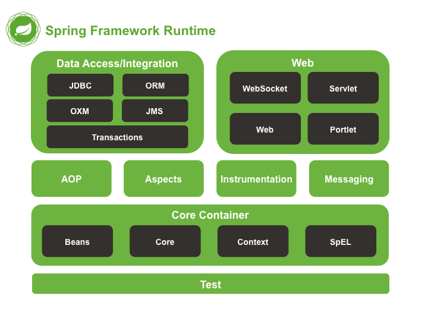

**Spring5.x**

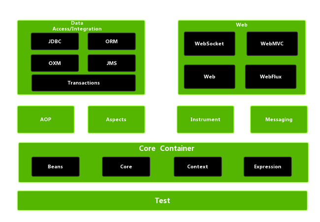

**Spring 各个模块的依赖关系**

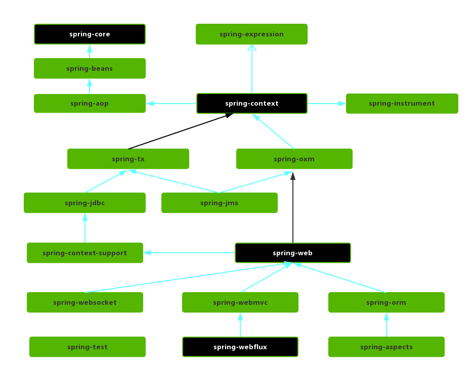

### Core Container

Spring 框架的核心模块，也可以说是基础模块，主要提供 IoC 依赖注入功能的支持。

* **spring-core**：Spring 框架基本的核心工具类。
* **spring-beans**：提供对 bean 的创建、配置和管理等功能的支持。
* **spring-context**：提供对国际化、事件传播、资源加载等功能的支持。
* **spring-expression**：提供对表达式语言（Spring Expression Language） SpEL 的支持，只依赖于 core 模块，不依赖于其他模块，可以单独使用。

### AOP

在 Core Container 之上是 AOP、Aspects 等模块

**spring-aspects**：该模块为与 AspectJ 的集成提供支持。

**spring-aop**：提供了面向切面的编程实现。

**spring-instrument**：提供了为 JVM 添加代理（agent）的功能。 具体来讲，它为 Tomcat 提供了一个织入代理，能够为 Tomcat 传递类文 件，就像这些文件是被类加载器加载的一样。没有理解也没关系，这个模块的使用场景非常有限。

### Messaging

**spring-messaging** 是从 Spring4.0 开始新加入的一个模块，主要职责是为 Spring 框架集成一些基础的报文传送应用。

### Data Access/Integration

数据访问 ／ 集成层

* **spring-jdbc**：提供了对数据库访问的抽象 JDBC。不同的数据库都有自己独立的 API 用于操作数据库，而 Java 程序只需要和 JDBC API 交互，这样就屏蔽了数据库的影响。
* **spring-tx**：提供对事务的支持。
* **spring-orm**：提供对 Hibernate、JPA、iBatis 等 ORM 框架的支持。
* **spring-oxm**：提供一个抽象层支撑 OXM(Object-to-XML-Mapping)，例如：JAXB、Castor、XMLBeans、JiBX 和 XStream 等。
* **spring-jms** : 消息服务。自 Spring Framework 4.1 以后，它还提供了对 spring-messaging 模块的继承。

### Spring Web

- **Web 模块**：提供了基本的 Web 开发集成特性，例如多文件上传功能、使用的 Servlet 监听器的 IOC 容器初始化以及 Web 应用上下文。
- **Servlet 模块**：提供了一个 Spring MVC Web 框架实现。Spring MVC 框架提供了基于注解的请求资源注入、更简单的数据绑定、数据验证等及一套非常易用的 JSP 标签，完全无缝与 Spring 其他技术协作。
- **WebSocket 模块**：提供了简单的接口，用户只要实现响应的接口就可以快速的搭建 WebSocket Server，从而实现双向通讯。
- **Webflux 模块**： Spring WebFlux 是 Spring Framework 5.x 中引入的新的响应式 web 框架。与 Spring MVC 不同，它不需要 Servlet API，是完全异步且非阻塞的，并且通过 Reactor 项目实现了 Reactive Streams 规范。Spring WebFlux 用于创建基于事件循环执行模型的完全异步且非阻塞的应用程序。

此外 Spring4.x 中还有 Portlet 模块，在 Spring 5.x 中已经移除

- **Portlet 模块**：提供了在 Portlet 环境中使用 MVC 实现，类似 Web-Servlet 模块的功能。

### Spring Test

Spring 团队提倡测试驱动开发（TDD）。有了控制反转 (IoC)的帮助，单元测试和集成测试变得更简单。

## Spring、Spring MVC 与 Spring Boot 之间的关系

Spring 包含了多个功能模块，其中最重要的是 Spring-Core（主要提供 IoC 依赖注入功能的支持） 模块， Spring 中的其他模块（比如 Spring MVC）的功能实现基本都需要依赖于该模块。

[Spring MVC](../SpringMVC/SpringMVC.md) 是 Spring 中的一个很重要的模块，主要赋予 Spring 快速构建 MVC 架构的 Web 程序的能力。MVC 是模型(Model)、视图(View)、控制器(Controller)的简写，其核心思想是通过将业务逻辑、数据、显示分离来组织代码。

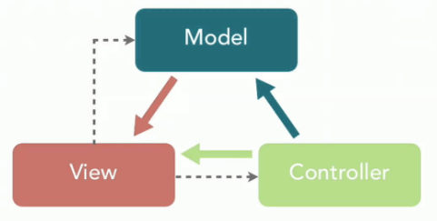

使用 Spring 进行开发各种配置过于麻烦比如开启某些 Spring 特性时，需要用 XML 或 Java 进行显式配置。于是，Spring Boot 诞生了！Spring 旨在简化 J2EE 企业应用程序开发。Spring Boot 旨在简化 Spring 开发（减少配置文件，开箱即用！）。

## 实战：创建 Spring 项目

创建 Maven 项目

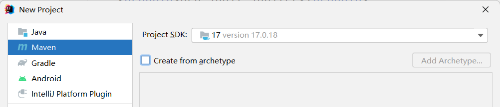

引入依赖

```xml

    <properties>
        <maven.compiler.source>8</maven.compiler.source>
        <maven.compiler.target>8</maven.compiler.target>
        <spring.version>5.3.9</spring.version>
        <aspectjweaver.version>1.9.6</aspectjweaver.version>
    </properties>

    <dependencies>
        <dependency>
            <groupId>org.springframework</groupId>
            <artifactId>spring-context</artifactId>
            <version>${spring.version}</version>
        </dependency>
        <dependency>
            <groupId>org.springframework</groupId>
            <artifactId>spring-core</artifactId>
            <version>${spring.version}</version>
        </dependency>
        <dependency>
            <groupId>org.springframework</groupId>
            <artifactId>spring-beans</artifactId>
            <version>${spring.version}</version>
        </dependency>
        <dependency>
            <groupId>org.aspectj</groupId>
            <artifactId>aspectjweaver</artifactId>
            <version>${aspectjweaver.version}</version>
        </dependency>
    </dependencies>
```


# IOC 控制反转

## 理解 IOC

### IOC 是什么

IoC （Inversion of Control ）即控制反转/反转控制。它是一种思想不是一个技术实现。描述的是：Java 开发领域对象的创建以及管理的问题。

* 传统的开发方式 ：往往是在类 A 中手动通过 new 关键字来 new 一个 B 的对象出来

  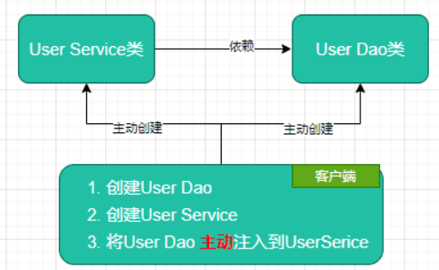

* 使用 IoC 思想的开发方式 ：不通过 new 关键字来创建对象，而是通过 IoC 容器(Spring 框架) 来帮助我们实例化对象。我们需要哪个对象，直接从 IoC 容器里面去取即可。

  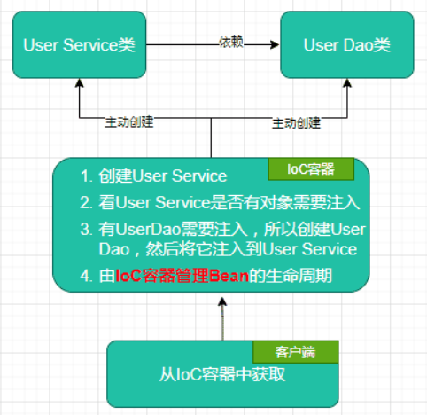

### IOC 的好处

传统应用程序都是由我们在类内部主动创建依赖对象，从而导致类与类之间高耦合，难于测试；有了 IoC 容器后，把创建和查找依赖对象的控制权交给了容器，由容器进行注入组合对象，所以对象与对象之间是松散耦合，这样也方便测试，利于功能复用，更重要的是使得程序的整个体系结构变得非常灵活。

### IOC 的基础——依赖注入

其实它们是同一个概念的不同角度描述，由于控制反转概念比较含糊（可能只是理解为容器控制对象这一个层面，很难让人想到谁来维护对象关系），所以 2004 年大师级人物 Martin Fowler 又给出了一个新的名字：“依赖注入”，相对 IoC 而言，“依赖注入”明确描述了“被注入对象依赖 IoC 容器配置依赖对象”。通俗来说就是 **IoC 是设计思想，DI 是实现方式**。

DI（Dependency Injection），即依赖注入：组件之间依赖关系由容器在运行期决定，形象的说，即由容器动态的将某个依赖关系注入到组件之中。依赖注入的目的并非为软件系统带来更多功能，而是为了提升组件重用的频率，并为系统搭建一个灵活、可扩展的平台。通过依赖注入机制，我们只需要通过简单的配置，而无需任何代码就可指定目标需要的资源，完成自身的业务逻辑，而不需要关心具体的资源来自何处，由谁实现。

### IoC 容器

`org.springframework.context.ApplicationContext` 接口代表 Spring IoC 容器，负责实例化、配置和组装 bean。可称为应用上下文。

在独立应用程序中，通常创建 `AnnotationConfigApplicationContext` 或 `ClassPathXmlApplicationContext` 的实例。

应用程序类与配置元数据结合，以便在 `ApplicationContext` 创建和初始化后，您拥有一个完全配置和可执行的系统或应用程序。

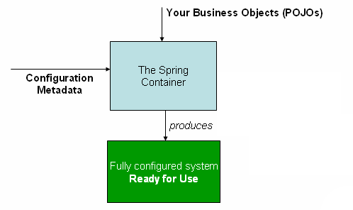

### Bean

Spring IoC 容器管理一个或多个 bean。这些 bean 使用你提供给容器的配置元数据创建。

bean 定义的属性

| 属性           | 解释                         |
| :------------- | :--------------------------- |
| 限定类名       | [Bean 实例化](#Bean 实例化 ) |
| 命名           | [Bean 命名](#Bean 命名)      |
| 作用域         | [Bean 作用域](#Bean 作用域)  |
| 构造函数参数   | [依赖注入](#依赖注入)        |
| 属性           | [依赖注入](#依赖注入)        |
| 自动装配模式   | [自动装配](#自动装配)        |
| 延迟初始化模式 | [延迟初始化](#延迟初始化)    |
| 初始化方法     | [初始化回调](#回调方法)      |
| 销毁方法       | [销毁回调](#回调方法)        |

###  IOC 容器配置元数据的三种方式

Spring IoC 容器使用某种形式的配置元数据。此配置元数据表示了 Spring 容器实例化、配置和组装应用程序中的组件。

1. 基于 XML 的配置：在普通 Web 应用程序场景中，应用程序的 `web.xml` 文件中的简单样板 Web 描述符 XML 就足够了
2. 基于 Java 的配置：在应用程序的组件类上使用基于注解的配置元数据定义 bean。
3. 基于注解的配置：通过使用基于 Java 的配置类，在应用程序类外部定义 bean。

## 基于 XML 的容器配置

将 bean 的信息配置.xml 文件里，通过 Spring 加载文件为我们创建 bean。

这种方式出现很多早前的 SSM 项目中，将第三方类库或者一些配置工具类都以这种方式进行配置，主要原因是由于第三方类不支持 Spring 注解。

* 优点：可以使用于任何场景，结构清晰，通俗易懂
* 缺点：配置繁琐，不易维护，枯燥无味，扩展性差

### 基本结构

```xml
<?xml version="1.0" encoding="UTF-8"?>
<beans xmlns="http://www.springframework.org/schema/beans"
       xmlns:xsi="http://www.w3.org/2001/XMLSchema-instance"
       xsi:schemaLocation="http://www.springframework.org/schema/beans http://www.springframework.org/schema/beans/spring-beans.xsd">
     <!-- daos.xml -->
    <bean id="userDao" class="com.tintin.springdemo.Dao.UserDao">
    </bean>
</beans>
```

```xml
<?xml version="1.0" encoding="UTF-8"?>
<beans xmlns="http://www.springframework.org/schema/beans"
       xmlns:xsi="http://www.w3.org/2001/XMLSchema-instance"
       xsi:schemaLocation="http://www.springframework.org/schema/beans
 http://www.springframework.org/schema/beans/spring-beans.xsd">
    <!-- services.xml -->
    <bean id="userService" class="com.tintin.springdemo.service.UserService">
        <property name="userDao" ref="userDao"/>
        
    </bean>
</beans>
```

###  使用容器

`ApplicationContext` 是一个高级工厂的接口，它能够维护不同 bean 及其依赖项的注册表。通过使用方法 `T getBean(String name, Class<T> requiredType)`，您可以检索您的 bean 实例。

```java
public static void main(String[] args) {
    ApplicationContext context = new ClassPathXmlApplicationContext("daos.xml", "services.xml");
    UserService service = context.getBean("userService", UserService.class);
    List<User> userList = service.findUserList();
    userList.forEach(a -> System.out.println(a.getName() + "," + a.getAge()));
}
```

### 跨文件定义

```xml
<beans>
	<import resource="services.xml"/>
	<import resource="resources/messageSource.xml"/>

	<bean id="bean1" class="..."/>
	<bean id="bean2" class="..."/>
</beans>
```

### Bean 命名

可以使用 `id` 属性、`name` 属性或两者来指定 bean 标识符。

如果您没有明确提供 `name` 或 `id`，容器会为该 bean 生成一个唯一的名称。

> 使用标准 Java 约定来命名，例如 `accountManager`、`accountService`、`userDao`、`loginController` 等等。

**别名**

在某些情况下很有用

```xml
<alias name="fromName" alias="toName"/>
```

### Bean 实例化

Bean 本质上是创建一或多个对象的“模板”，当被请求时，会使用该 bean 定义封装的配置元数据来创建（或获取）实际对象。

可以使用 `class` 属性指定要实例化的对象类型。

使用构造函数进行实例化

```xml
<bean id="exampleBean" class="examples.ExampleBean"/>

<bean name="anotherExample" class="examples.ExampleBeanTwo"/>

```

**使用静态工厂方法进行实例化**

```java
public class ClientService {
	private static ClientService clientService = new ClientService();
	private ClientService() {}

	public static ClientService createInstance() {
		return clientService;
	}
}
```

```xml
<bean id="clientService"
	class="examples.ClientService"
	factory-method="createInstance"/>
```

**使用实例工厂方法进行实例化**

```xml
<!-- 工厂 bean -->
<bean id="serviceLocator" class="examples.DefaultServiceLocator">
	<!-- inject any dependencies required by this locator bean -->
</bean>

<!-- 调用工厂的实例方法进行实例化 -->
<bean id="clientService"
	factory-bean="serviceLocator"
	factory-method="createClientServiceInstance"/>
```

### 依赖注入

[IOC 的基础——依赖注入](#IOC 的基础——依赖注入)

**基于构造函数的依赖注入**

```java
public class ThingOne {

	public ThingOne(ThingTwo thingTwo, ThingThree thingThree) {
		// ...
	}
}
```

```xml
<beans>
	<bean id="beanOne" class="x.y.ThingOne">
		<constructor-arg ref="beanTwo"/>
		<constructor-arg ref="beanThree"/>
	</bean>

	<bean id="beanTwo" class="x.y.ThingTwo"/>

	<bean id="beanThree" class="x.y.ThingThree"/>
</beans>
```

参数的匹配方式：按参数类型、按参索引、按参数名

```java
public class ExampleBean {

	private final int years;
    
	private final String ultimateAnswer;

	public ExampleBean(int years, String ultimateAnswer) {
		this.years = years;
		this.ultimateAnswer = ultimateAnswer;
	}
}
```

```xml
<bean id="exampleBean" class="examples.ExampleBean">
	<constructor-arg type="int" value="7500000"/>
	<constructor-arg type="java.lang.String" value="42"/>
</bean>
或
<bean id="exampleBean" class="examples.ExampleBean">
	<constructor-arg index="0" value="7500000"/>
	<constructor-arg index="1" value="42"/>
</bean>
或
<bean id="exampleBean" class="examples.ExampleBean">
	<constructor-arg name="years" value="7500000"/>
	<constructor-arg name="ultimateAnswer" value="42"/>
</bean>
```

c-命名空间进行更简洁的 XML 配置

```xml
<beans xmlns="http://www.springframework.org/schema/beans"
	xmlns:xsi="http://www.w3.org/2001/XMLSchema-instance"
	xmlns:c="http://www.springframework.org/schema/c"
	xsi:schemaLocation="http://www.springframework.org/schema/beans
		https://www.springframework.org/schema/beans/spring-beans.xsd">

	<bean id="beanTwo" class="x.y.ThingTwo"/>
	<bean id="beanThree" class="x.y.ThingThree"/>

    
    
	<bean id="beanOne" class="x.y.ThingOne">
		<constructor-arg name="thingTwo" ref="beanTwo"/>
		<constructor-arg name="thingThree" ref="beanThree"/>
		<constructor-arg name="email" value="[email protected]"/>
	</bean>
	<!--上面和下面解析的结果 相同-->
	<bean id="beanOne" class="x.y.ThingOne" 
          c:thingTwo-ref="beanTwo"
          c:thingThree-ref="beanThree"
          c:email="[email protected]"/>

</beans>
```

**基于 Setter 的依赖注入**

```java
public class ExampleBean {

	private AnotherBean beanOne;

	private YetAnotherBean beanTwo;

	private int i;

	public void setBeanOne(AnotherBean beanOne) {
		this.beanOne = beanOne;
	}

	public void setBeanTwo(YetAnotherBean beanTwo) {
		this.beanTwo = beanTwo;
	}

	public void setIntegerProperty(int i) {
		this.i = i;
	}
}
```

```xml
<bean id="exampleBean" class="examples.ExampleBean">
	<!-- setter injection using the nested ref element -->
	<property name="beanOne">
		<ref bean="anotherExampleBean"/>
	</property>

	<!-- setter injection using the neater ref attribute -->
	<property name="beanTwo" ref="yetAnotherBean"/>
	<property name="integerProperty" value="1"/>
</bean>

<bean id="anotherExampleBean" class="examples.AnotherBean"/>
<bean id="yetAnotherBean" class="examples.YetAnotherBean"/>
```

p-命名空间进行更简洁的 XML 配置

```xml
<beans xmlns="http://www.springframework.org/schema/beans"
	xmlns:xsi="http://www.w3.org/2001/XMLSchema-instance"
	xmlns:p="http://www.springframework.org/schema/p"
	xsi:schemaLocation="http://www.springframework.org/schema/beans
		https://www.springframework.org/schema/beans/spring-beans.xsd">

	<bean name="classic" class="com.example.ExampleBean">
		<property name="email" value="[email protected]"/>
	</bean>
	<!--上面和下面解析的结果 相同-->
	<bean name="p-namespace" class="com.example.ExampleBean"
		p:email="[email protected]"/>
</beans>
```

集合赋值

```xml
<bean id="moreComplexObject" class="example.ComplexObject">
	<!-- results in a setAdminEmails(java.util.Properties) call -->
	<property name="adminEmails">
		<props>
			<prop key="administrator">[email protected]</prop>
			<prop key="support">[email protected]</prop>
			<prop key="development">[email protected]</prop>
		</props>
	</property>
	<!-- results in a setSomeList(java.util.List) call -->
	<property name="someList">
		<list>
			<value>a list element followed by a reference</value>
			<ref bean="myDataSource" />
		</list>
	</property>
	<!-- results in a setSomeMap(java.util.Map) call -->
	<property name="someMap">
		<map>
			<entry key="an entry" value="just some string"/>
			<entry key="a ref" value-ref="myDataSource"/>
		</map>
	</property>
	<!-- results in a setSomeSet(java.util.Set) call -->
	<property name="someSet">
		<set>
			<value>just some string</value>
			<ref bean="myDataSource" />
		</set>
	</property>
</bean>
```

空字符串值

```java
exampleBean.setEmail("");
```

```xml
<bean class="ExampleBean">
	<property name="email" value=""/>
</bean>
```

Null 

```java
exampleBean.setEmail(null);
```

```xml
<bean class="ExampleBean">
	<property name="email">
		<null/>
	</property>
</bean>
```

复合属性

`something` bean 有一个 `fred` 属性，它有一个 `bob` 属性，它有一个 `sammy` 属性，并且最终的 `sammy` 属性被设置为值 `123`。

```xml
<bean id="something" class="things.ThingOne">
	<property name="fred.bob.sammy" value="123" />
</bean>
```

引入外部配置文件

赋值可以来源与外部的配置文件，只需要通过 `<context:property-placeholder/>` 标签引入

```xml
<beans>
	<context:property-placeholder location="classpath:/com/acme/jdbc.properties"/>
	<bean class="org.springframework.jdbc.datasource.DriverManagerDataSource">
		<property name="url" value="${jdbc.url}"/>
		<property name="username" value="${jdbc.username}"/>
		<property name="password" value="${jdbc.password}"/>
	</bean>
</beans>
```

### 自动装配

```xml
<bean id="exampleBean" class="examples.ExampleBean" autowire="byType|byName|constructor|default"/>

<!-- 当配置了自动注入，还可以使用手动的方式自动注入进行覆盖，手动的优先级更高一些 -->
<bean id="exampleBean" class="examples.ExampleBean" autowire="byName">
    <property name="service2" ref="service2-1"/>
</bean>

<beans default-autowire="byName">
	<bean id="exampleBean" class="examples.ExampleBean" autowire="default"/>
</beans>
```

* `byName`：spring 容器会按照 set 属性的名称去容器中查找同名的 bean 对象，然后将查找到的对象通过 set 方法注入到对应的 bean 中，未找到对应名称的 bean 对象则 set 方法不进行注入
* `byType`：spring 容器会遍历 x 类中所有的 set 方法，会在容器中查找和 set 参数类型相同的 bean 对象，将其通过 set 方法进行注入，未找到对应类型的 bean 对象则 set 方法不进行注入。
* `constructor`：pring 会找到 x 类中所有的构造方法，然后将这些构造方法进行排序，得到一个构造函数列表，会轮询这个构造器列表，判断当前构造器所有参数是否在容器中都可以找到匹配的 bean 对象，如果可以找到就使用这个构造器进行注入，如果不能找到，那么就会跳过这个构造器，继续采用同样的方式匹配下一个构造器，直到找到一个合适的为止。
* `default`：根据 `<beans>` 元素的 `default-autowire` 属性

### depends-on

通常，您可以通过 XML 格式元数据中的 `<ref/>` 元素 或通过 自动装配 来实现这一点。然而，有时 Bean 之间的依赖关系不那么直接。一个例子是当一个类的静态初始化器需要被触发时，例如用于数据库驱动程序注册。

`depends-on` 属性或 `@DependsOn` 注解可以明确强制一个或多个 Bean 在使用此元素的 Bean 初始化之前被初始化。

```xml
<bean id="beanOne" class="ExampleBean" depends-on="manager,accountDao">
	<property name="manager" ref="manager" />
</bean>

<bean id="manager" class="ManagerBean" />
<bean id="accountDao" class="x.y.jdbc.JdbcAccountDao" />
```

### 延迟初始化

默认情况下，`ApplicationContext` 会在初始化过程中迅速地创建和配置所有单例 bean。

当不需要这种行为时，可以通过将 bean 定义标记为延迟初始化来阻止单例 bean 的预实例化。延迟初始化的 bean 告诉 IoC 容器在首次请求时创建 bean 实例，而不是在启动时创建。

此行为由 [`@Lazy` 注解](#懒加载@Lazy) 控制，或者在 XML 中，由 `<bean/>` 元素的 `lazy-init` 属性控制

```java
@Configuration
public class BeansConfig {
    @Bean
    @Lazy
    TestBean testBean() {
        return new TestBean();
    }
}

```

```xml
<bean id="testBean" class="com.example.TestBean" lazy-init="true"/>
```

### Bean 作用域

| 作用域            | 解释                                                         | 场景                                           |
| ----------------- | ------------------------------------------------------------ | ---------------------------------------------- |
| singleton（单例） | （默认）为每个 Spring IoC 容器将单个 bean 定义限定为单个对象实例 |                                                |
| prototype（原型） | 每次获取都创建一个新的 bean 实例                             | 适用于有状态的 Bean，每个实例可以保存独立的数据 |
| request（请求）   | 每个 HTTP 请求都有其自己的 bean 实例，该实例根据单个 bean 定义创建 | 适用于处理表单数据提交和绑定                   |
| session（会话）   | 每个 HTTP 会话都有其自己的 bean 实例，该实例根据单个 bean 定义创建 | 用于需要在用户会话中保持状态的 Bean，例如购物车 |
| application       | 整个 ServletContext 共享一个 Bean 实例                           | 适用于需要在整个应用程序中保持一致性的 Bean    |
| websocket         | 每个 HTTP websocket 都有其自己的 bean 实例，该实例根据单个 bean 定义创建 | 适用于需要特定于每个 WebSocket 会话的 Bean        |

### 生命周期回调

**初始化回调**

```java
public class ExampleBean {

	public void init() {
		// do some initialization work
	}
}
```

```xml
<bean id="exampleInitBean" class="examples.ExampleBean" init-method="init"/>
```

另一种方式：[`org.springframework.beans.factory.InitializingBean` 接口](#实现接口的生命周期回调) 允许 Bean 在容器设置了 Bean 的所有必要属性后执行初始化工作。

**销毁回调**

```java
public class ExampleBean {

	public void cleanup() {
		// do some destruction work (like releasing pooled connections)
	}
}
```

```xml
<bean id="exampleDestructionBean" class="examples.ExampleBean" destroy-method="cleanup"/>
```

另一种方式：实现 [`org.springframework.beans.factory.DisposableBean` 接口](#实现接口的生命周期回调) 可以让 Bean 在包含它的容器被销毁时获得一个回调。

## 基于 Java 的容器配置

将类的创建交给我们配置的 Javc Config 类来完成。其本质上就是把在 XML 上的配置声明转移到 Java 配置类中

- 优点：适用于任何场景，配置方便，因为是纯 Java 代码，扩展性高，十分灵活
- 缺点：由于是采用 Java 类的方式，声明不明显，如果大量配置，可读性比较差

### 核心构件 @Bean 和 @Configuration

Spring Java 配置支持的核心构件是 `@Configuration` 注解的类和 `@Bean` 注解的方法。

用 `@Configuration` 注解一个类，表明其主要目的是作为 Bean 定义的来源。

`@Bean` 注解用于指示方法实例化、配置并初始化一个新对象，该对象将由 Spring IoC 容器管理。

`@Bean` 注解与 `<bean/>` 元素扮演相同的角色。

`@Bean` 注解的方法与任何 Spring `@Component` 一起使用。然而，它们最常与 `@Configuration` Bean 一起使用。

```java
@Configuration
public class AppConfig {

	@Bean
	public MyServiceImpl myService() {
		return new MyServiceImpl();
	}
}
```

等同于

```xml
<beans>
	<bean id="myService" class="com.acme.services.MyServiceImpl"/>
</beans>
```

### 使用容器

Spring 3.0 中引入的 Spring `AnnotationConfigApplicationContext`，不仅能够接受 `@Configuration` 类作为输入，还可以接受普通的 `@Component` 类以及用 JSR-330 元数据注解的类。

```java
public static void main(String[] args) {
	ApplicationContext ctx = new AnnotationConfigApplicationContext(AppConfig.class);
	MyService myService = ctx.getBean(MyService.class);
	myService.doStuff();
}
```

### 命名及描述

默认情况下，配置类使用 `@Bean` 方法的名称作为结果 bean 的名称，或通过 `name` 属性进行覆盖。

```java
@Configuration
public class AppConfig {

	@Bean("myThing")
	public Thing thing() {
		return new Thing();
	}
}
```

**别名**

`@Bean` 注解的 `name` 属性为此目的接受一个字符串数组。

```java
@Configuration
public class AppConfig {

	@Bean({"dataSource", "subsystemA-dataSource", "subsystemB-dataSource"})
	public DataSource dataSource() {
		// instantiate, configure and return DataSource bean...
	}
}
```

**描述**

提供更详细的 bean 文本描述

```java
@Configuration
public class AppConfig {

	@Bean
	@Description("Provides a basic example of a bean")
	public Thing thing() {
		return new Thing();
	}
}
```


### 依赖

一个 `@Bean` 注解的方法可以有任意数量的参数，这些参数描述了构建该 bean 所需的依赖项。

```java
@Configuration
public class AppConfig {

	@Bean
	public TransferService transferService(AccountRepository accountRepository) {
		return new TransferServiceImpl(accountRepository);
	}
}
```

解析机制与 [基于构造函数的依赖注入](#依赖注入) 非常相似。

**注入 Bean 间依赖**

当 bean 之间存在依赖关系时，表达这种依赖关系很简单，直接在 bean 方法调用另一个方法即可

```java
@Configuration
public class AppConfig {

	@Bean
	public BeanOne beanOne() {
		return new BeanOne(beanTwo());
	}

	@Bean
	public BeanTwo beanTwo() {
		return new BeanTwo();
	}
}
```

### 加载外部配置文件@PropertySource

机制与 [XML 加载外部配置文件](#依赖注入) 非常相似。

```properties
#person.properties
person.nickName=丁丁
```

```java
//读取外部配置文件的k-v保存到运行的环境变量
@PropertySource(value = {"classpath:person.properties"}, encoding = "utf-8")
@Configuration
public class ConfigOfProperties {
```

注解方式可以在运行环境变量中获取到对应变量

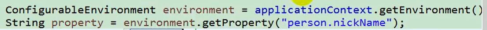

### 赋值 @Value 

解析机制与 [基于 Setter 的依赖注入](#依赖注入) 非常相似。

三种方式

```java
public class Person {
    //1.基本数值
    //2.SpEL #{}
    //3.${}取出配置文件变量或运行环境变量
    @Value("tintin")
    private String name;
    @Value("#{20-2}")
    private Integer age;
    @Value("${person.nickName}")
    private String nickName;
    
//Person{name='tintin', age=18, nickName='丁丁'}
```

### 自动装载@Autowired

```java
@Configuration
public class ServiceConfig {

	@Autowired // 自动装载的方式
	private AccountRepository accountRepository;

	@Bean
	public TransferService transferService() {
		return new TransferServiceImpl(accountRepository);
	}
}

@Configuration
public class RepositoryConfig {

	private final DataSource dataSource;

	public RepositoryConfig(DataSource dataSource) { // 构造函数的方式
		this.dataSource = dataSource;
	}

	@Bean
	public AccountRepository accountRepository() {
		return new JdbcAccountRepository(dataSource);
	}
}

@Configuration
@Import({ServiceConfig.class, RepositoryConfig.class})
public class SystemTestConfig {

	@Bean
	public DataSource dataSource() {
		// return new DataSource
	}
}

public static void main(String[] args) {
	ApplicationContext ctx = new AnnotationConfigApplicationContext(SystemTestConfig.class);
	// everything wires up across configuration classes...
	TransferService transferService = ctx.getBean(TransferService.class);
	transferService.transfer(100.00, "A123", "C456");
}
```


### 包扫描@ComponentScan

Spring 可以自动检测构造型类并向 `ApplicationContext` 注册相应的 `BeanDefinition` 实例。

**配置文件方式**

```xml
<beans >
	<!--包扫描，标注@Controller,@Service,@Repository,@Component的类都会被扫描加入容器-->
    <context:component-scan base-package="com.tintin"/>
</beans>
```

使用 `<context:component-scan>` 隐式启用了 `<context:annotation-config>` 的功能。在使用 `<context:component-scan>` 时，通常不需要包含 `<context:annotation-config>` 元素。

**注解方式**

```java
//配置类代替配置文件
@Configuration  //告诉spring这是一个配置类
//整合Springmvc的时候，要mvc容器只扫描controller，Spring扫描剩下的
@ComponentScan(value = "com.tintin", useDefaultFilters = false, includeFilters = {
        @ComponentScan.Filter(type = FilterType.ANNOTATION, classes = {Controller.class})
})
public class SpringConfig {
```

```java
@Retention(RetentionPolicy.RUNTIME)
@Target(ElementType.TYPE)
@Documented
@Repeatable(ComponentScans.class)
public @interface ComponentScan {
@AliasFor("basePackages")
	String[] value() default {};//指定扫描的包名

	@AliasFor("value")
	String[] basePackages() default {};//指定扫描的包名
	
    boolean useDefaultFilters() default true;//默认扫描所有注解的类
    
	Filter[] includeFilters() default {};//按照某些规则指定仅扫描，搭配userDefaultFilters=false使用

	Filter[] excludeFilters() default {};//按照某些规则排除扫描某些组件
    
	@Retention(RetentionPolicy.RUNTIME)
	@Target({})
	@interface Filter {

		FilterType type() default FilterType.ANNOTATION;//筛选方式 如注解、正则、类名、ASPECTJ、自定义
		
		@AliasFor("classes")
		Class<?>[] value() default {};//类名

		@AliasFor("value")
		Class<?>[] classes() default {};//类名

		String[] pattern() default {};
	}
}
```

```java
public enum FilterType {
	ANNOTATION,
	ASSIGNABLE_TYPE,
	ASPECTJ,
	REGEX,
	CUSTOM
}
```

### 生命周期回调

```java
public class BeanOne {

	public void init() {
		// initialization logic
	}
}

public class BeanTwo {

	public void cleanup() {
		// destruction logic
	}
}

```

```java

@Configuration
public class AppConfig {

	@Bean(initMethod = "init")
	public BeanOne beanOne() {
		return new BeanOne();
	}

	@Bean(destroyMethod = "cleanup")
	public BeanTwo beanTwo() {
		return new BeanTwo();
	}
}
```

### 实现接口的生命周期回调

```java
@Component
public class Cat implements InitializingBean, DisposableBean {
    public Cat() {
        System.out.println("cat construct...");
    }
    
    //赋值之后调用
    @Override
    public void afterPropertiesSet() throws Exception {
        System.out.println("cat afterPropertiesSet...");
    }
    
    @Override
    public void destroy() throws Exception {
        System.out.println("cat destroy...");
    }
}
//cat construct...
//cat afterPropertiesSet...
//cat destroy...
```

### 作用域@Scope

**使用 @Scope 注解**

可以使用 [Bean 作用域](#Bean 作用域) 部分中指定的任何标准范围。默认范围是 `singleton`

```java
@Configuration
public class MyConfiguration {

	@Bean
	@Scope("prototype")
	public Encryptor encryptor() {
		// ...
	}
}
```

### 懒加载@Lazy

```java
	//默认单实例
    @Scope("prototype")
    @Lazy//懒加载
    @Bean
    public Person person() {
        return new Person("tintin",28);
    }
```

单实例 bean：默认在容器启动的时候创建对象；

懒加载：容器启动不创建对象。第一次使用(获取 )Bean 创建对象，并初始化；


### 快速导入组件@Import

正如 Spring XML 文件中使用 [`<import/>` 元素](#跨文件定义) 来帮助模块化配置一样

```java
@Configuration
public class ConfigA {

	@Bean
	public A a() {
		return new A();
	}
}

@Configuration
@Import(ConfigA.class)
public class ConfigB {

	@Bean
	public B b() {
		return new B();
	}
}
```

然后在实例化上下文时，不再需要同时指定 `ConfigA.class` 和 `ConfigB.class`，只需要显式提供 `ConfigB`，

```java
public static void main(String[] args) {
	ApplicationContext ctx = new AnnotationConfigApplicationContext(ConfigB.class);

	// now both beans A and B will be available...
	A a = ctx.getBean(A.class);
	B b = ctx.getBean(B.class);
}
```

**实现 ImportSelector 接口返回要扫描的组件全类名**

```java
public class MyImportSelector implements ImportSelector {
    //返回值，就是到导入到容器中的组件全类名
    //AnnotationMetadata:当前标注@Import注解的类的所有注解信息
    @Override
    public String[] selectImports(AnnotationMetadata importingClassMetadata) {
        return new String[]{"com.tintin.pojo.Color"};
    }
}
```

```java
@Import(MyImportSelector.class)
@Configuration
public class SpringConfig2 {
```

**实现 ImportBeanDefinitionRegistrar 接口注册组件**

```java
public class MyImportBeanDefinitionRegistrar implements ImportBeanDefinitionRegistrar {
    /* AnnotationMetadata：当前类的注解信息
    BeanDefinitionRegistry:BeanDefinition注册类；把所有需要添加到容器中的bean；
    调用BeanDefinitionRegistry.registerBeanDefinition手工注册进来
    */
     @Override
    public void registerBeanDefinitions(AnnotationMetadata importingClassMetadata, BeanDefinitionRegistry registry) {
         
         RootBeanDefinition beanDefinition = new RootBeanDefinition(Color.class);
         registry.registerBeanDefinition("color",beanDefinition);//指定bean id
    }
}
```

```java
@Import(MyImportBeanDefinitionRegistrar.class)
@Configuration
public class SpringConfig2 {
```

### 按照条件注册组件@Conditional@Profile

根据某些任意系统状态，有条件地启用或禁用完整的 `@Configuration` 类甚至单个 `@Bean` 方法通常很有用。

一个常见的例子是使用 `@Profile` 注解仅当在 Spring `Environment` 中启用特定配置文件时才激活 bean。而 `@Profile` 注解实际上就是通过使用@Conditional 注解来实现的。

```java
@Target({ElementType.TYPE, ElementType.METHOD})
@Retention(RetentionPolicy.RUNTIME)
@Documented
public @interface Conditional {

	Class<? extends Condition>[] value();

}
```

实现 Condition

```java
public class LinuxCondition implements Condition {
    //ConditionContext 判断条件使用的上下文信息
    //AnnotatedTypeMetadata 注释信息
    @Override
    public boolean matches(ConditionContext context, AnnotatedTypeMetadata metadata) {
        //获取到ioc的beanfactory
        ConfigurableListableBeanFactory beanFactory = context.getBeanFactory();
        //获取类加载器
        ClassLoader classLoader = context.getClassLoader();
        //获取运行环境信息
        Environment environment = context.getEnvironment();
        //获取容器中的bean定义的注册类
        BeanDefinitionRegistry registry = context.getRegistry();

        String osName = environment.getProperty("os.name");
        if (osName.contains("linux")) {
            return true;
        }
        return false;
    }
}
```

在 bean 方法传入 Condition 

```java
    @Conditional(LinuxCondition.class)
    @Bean("linus")
    public Person Person4() {
        return new Person("Linus",52);
    }
```

在 Configuration 类传入

```java
@Conditional(LinuxCondition.class) //只有满足当前条件，这个类中配置的所有bean注册才能生效
@Configuration
public class SpringConfig2 {
```

### 动态切换组件@Profile

Spring 为我们提供的可以根据当前环境，动态的激活和切换一系列组件的功能；

以数据源为例

| 环境     | 数据源 |
| -------- | ------ |
| 开发环境 | （/A） |
| 测试环境 | （/B） |
| 生产环境 | （/C） |

数据源配置

```properties
# mysql8 需要增加时区配置
spring.datasource.username=root
spring.datasource.password=tintin
spring.datasource.urlTest=jdbc:mysql://localhost:3306/test?useSSL=false&useUnicode&characterEncoding=utf-8&serverTimezone=GMT%2B8
spring.datasource.urlDev=jdbc:mysql://localhost:3306/ssm_crud?useSSL=false&useUnicode&characterEncoding=utf-8&serverTimezone=GMT%2B8
spring.datasource.urlProd=jdbc:mysql://localhost:3306/goods?useSSL=false&useUnicode&characterEncoding=utf-8&serverTimezone=GMT%2B8
spring.datasource.driver-class-name=com.mysql.cj.jdbc.Driver

```

注册不同数据源，并@Profile 添加环境标识

@Profile：指定该组件在某个环境下才能被注册进容器；**不添加该注解则默认为 default 环境，这样的组件在任何环境下都可以加载。**

```java
@PropertySource("classpath:dbconfig.properties")
@Configuration
//@Profile("test") 类上配置
public class ConfigOfProfile implements EmbeddedValueResolverAware {
    @Value("${spring.datasource.username}")
    private String user;
    @Value("${spring.datasource.password}")
    private String password;

    //变量解析器
    private StringValueResolver resolever;
    private String DriverClass;

    @Bean
    public DataSource dataSourceTest(@Value("${spring.datasource.urlTest}") String jdbcUrl) throws PropertyVetoException {
        ComboPooledDataSource dataSource = new ComboPooledDataSource();
        dataSource.setUser(user);
        dataSource.setPassword(password);
        dataSource.setJdbcUrl(jdbcUrl);
        dataSource.setDriverClass(DriverClass);
        return dataSource;
    }

    @Bean
    public DataSource dataSourceDev(@Value("${spring.datasource.urlDev}") String jdbcUrl) throws PropertyVetoException {
        ComboPooledDataSource dataSource = new ComboPooledDataSource();
        dataSource.setUser(user);
        dataSource.setPassword(password);
        dataSource.setJdbcUrl(jdbcUrl);
        dataSource.setDriverClass(DriverClass);
        return dataSource;
    }

    @Bean
    public DataSource dataSourceProd(@Value("${spring.datasource.urlProd}") String jdbcUrl) throws PropertyVetoException {
        ComboPooledDataSource dataSource = new ComboPooledDataSource();
        dataSource.setUser(user);
        dataSource.setPassword(password);
        dataSource.setJdbcUrl(jdbcUrl);
        dataSource.setDriverClass(DriverClass);
        return dataSource;
    }

    @Override
    public void setEmbeddedValueResolver(StringValueResolver resolver) {
        this.resolever = resolver;
        DriverClass = resolever.resolveStringValue("${spring.datasource.driver-class-name}");
    }
}

```

切换环境两种方式

1. 修改虚拟机参数 vm


2. 修改容器应用上下文

```java
 private AnnotationConfigApplicationContext applicationContext =
            new AnnotationConfigApplicationContext();
//设置激活环境
applicationContext.getEnvironment().setActiveProfiles("test","dev");
//注册主配置类
applicationContext.register(ConfigOfProfile.class);
//刷新容器
applicationContext.refresh();

```

此时，根据当前环境，含有对应环境标识的组件才会被注册

### XML 为中心与 @Configuration 混合配置

需要启用 `<context:annotation-config/>` ，然后将 `@Configuration` 类 作为 `<bean/>` 定义包含在  XML 中，容器会识别 `@Configuration` 注解并正确处理 `AppConfig` 中声明的 `@Bean` 方法。

```xml
<beans>
	<!-- enable processing of annotations such as @Autowired and @Configuration -->
	<context:annotation-config/>

	<context:property-placeholder location="classpath:/com/acme/jdbc.properties"/>

	<bean class="com.acme.AppConfig"/>

	<bean class="org.springframework.jdbc.datasource.DriverManagerDataSource">
		<property name="url" value="${jdbc.url}"/>
		<property name="username" value="${jdbc.username}"/>
		<property name="password" value="${jdbc.password}"/>
	</bean>
</beans>
```

```java
@Configuration
public class AppConfig {

	@Autowired
	private DataSource dataSource;

	@Bean
	public AccountRepository accountRepository() {
		return new JdbcAccountRepository(dataSource);
	}

	@Bean
	public TransferService transferService() {
		return new TransferServiceImpl(accountRepository());
	}
}
```

**利用组件扫描 **

由于 `@Configuration` 本身就使用 `@Component` 进行元注解，因此带有 `@Configuration` 注解的类会自动成为组件扫描的候选。

而且在这种情况下，我们不需要显式声明 `<context:annotation-config/>`，因为 `<context:component-scan/>` 会隐式的启用相同的功能。

```xml
<beans>
	<!-- picks up and registers AppConfig as a bean definition -->
	<context:component-scan base-package="com.acme"/>

	<context:property-placeholder location="classpath:/com/acme/jdbc.properties"/>

	<bean class="org.springframework.jdbc.datasource.DriverManagerDataSource">
		<property name="url" value="${jdbc.url}"/>
		<property name="username" value="${jdbc.username}"/>
		<property name="password" value="${jdbc.password}"/>
	</bean>
</beans>
```

### 以 @Configuration 为中心与 XML 混合配置

可以使用 `@ImportResource` 并仅定义您需要的 XML。

```java
@Configuration
@ImportResource("classpath:/com/acme/properties-config.xml")
public class AppConfig {

	@Value("${jdbc.url}")
	private String url;

	@Value("${jdbc.username}")
	private String username;

	@Value("${jdbc.password}")
	private String password;

	@Bean
	public DataSource dataSource() {
		return new DriverManagerDataSource(url, username, password);
	}

	@Bean
	public AccountRepository accountRepository(DataSource dataSource) {
		return new JdbcAccountRepository(dataSource);
	}

	@Bean
	public TransferService transferService(AccountRepository accountRepository) {
		return new TransferServiceImpl(accountRepository);
	}

}
```


## 基于注解的容器配置

通过在类上加注解的方式，来声明一个类交给 Spring 管理，Spring 会自动扫描带有 `@Component`，`@Controller`，`@Service`，`@Repository` 这四个注解的类，然后帮我们创建并管理，前提是需要先配置 Spring 的注解扫描器。

- 优点：开发便捷，通俗易懂，方便维护。
- 缺点： Bean 创建逻辑分散在代码中。具有局限性，对于一些第三方资源，无法添加注解，只能采用 XML 或 JavaConfig 的方式配置。

### 以 XML 为中心与注解混合配置

在基于 XML 的 Spring 设置中，您可以包含以下配置标签以启用与基于注解的配置的混合和匹配

```xml
<beans >
	<context:annotation-config/>
</beans>
```

`<context:annotation-config/>` 元素隐式注册以下后处理器

- ConfigurationClassPostProcessor
- AutowiredAnnotationBeanPostProcessor
- CommonAnnotationBeanPostProcessor
- PersistenceAnnotationBeanPostProcessor
- EventListenerMethodProcessor

### @Component 构造型注解

假如基础的 bean 定义仍明确定义在 XML 文件中，本章介绍的大部分注解的配置都是仅用于驱动依赖注入。因此可以使用注解（例如 `@Component`）来选择哪些类向容器注册 bean 定义。

`@Component` 是任何 Spring 管理组件的通用构造型，而 `@Repository`、`@Service` 和 `@Controller` 是 `@Component` 的专用版本，分别用于更具体的用例（持久层、服务层和表现层）。

```java
@Repository
public class UserDaoImpl {

    public UserDaoImpl() {
    }

    public List<User> findUserList() {
        return Collections.singletonList(new User("pdai", 18, new Date(), "Male"));
    }
}
```

```java
@Service
public class UserServiceImpl {
    @Autowired
    private UserDaoImpl userDao;

    public UserServiceImpl() {
    }

    public List<User> findUserList() {
        return this.userDao.findUserList();
    }

    public void setUserDao(UserDaoImpl userDao) {
        this.userDao = userDao;
    }
}
```

**命名**

通过注解的 `value` 属性提供名称。如果不显示指定，默认名称为，将类名的首字母变为小写，其余部分保持不变。

```java
@Service("myMovieLister")
public class SimpleMovieLister {
	// ...
}
```

### 使用容器

设置 ComponentScan 的 basePackage, 比如 `<context:component-scan base-package='com.tintin.aopdemo'>`, 或者 `@ComponentScan("com.tintin.aopdemo")` 注解，或者 `new AnnotationConfigApplicationContext("com.tintin.aopdemo")` 指定扫描的 basePackage.

```java
public static void main(String[] args) {
        // 扫描
        AnnotationConfigApplicationContext context3 = new AnnotationConfigApplicationContext(
                "com.tintin.springdemo");
        UserServiceImpl service3 = context3.getBean(UserServiceImpl.class);
        System.out.println(service.equals(service3)); // false
    }
```

### 包扫描@ComponentScan

已知，通过 `@Component` 、`@Repository`、`@Service` 和 `@Controller`，Spring 可以自动检测构造型类并向 `ApplicationContext` 注册相应的 `BeanDefinition` 实例。

要自动检测这些类并注册相应的 bean，您需要将 `@ComponentScan` 添加到您的 `@Configuration` 类中

```java
@Configuration
@ComponentScan(basePackages = "org.example")
public class AppConfig  {
	// ...
}
```

也可以使用 XML 配置

```xml
<beans >
	<context:component-scan base-package="org.example"/>
</beans>
```

>  使用 `<context:component-scan>` 隐式启用了 `<context:annotation-config>` 的功能。在使用 `<context:component-scan>` 时，通常不需要包含 `<context:annotation-config>` 元素。

**属性占位符**

`@ComponentScan` 中的 `basePackages` 和 `value` 属性支持 `${…}` 属性占位符，这些占位符将针对 `Environment` 解析

假设有以下配置已加载进 `Environment` 中，例如，通过 [`@PropertySource`](#加载外部配置文件@PropertySource) 或类似机制。

```properties
app.scan.packages=org.example.config, org.example.service.**
```

属性占位符将针对 `Environment` 进行解析

```java
@Configuration
@ComponentScan("${app.scan.packages}") 
public class AppConfig {
	// ...
}
```

**Ant 风格路径匹配**

- `?`：匹配任意单个字符。例如，/app/p?ttern * 可匹配 */app/pattern * 和 */app/pXttern*。
- `*`：匹配任意数量的字符（不包括目录分隔符 */*）。例如，*/app/\*.txt* 匹配 */app/* 下所有 *.txt* 文件。
- `**`：匹配任意层级的目录。例如，*/app/* */file.txt* 可匹配 */app/file.txt*、*/app/dir/file.txt* 等。
- `{}`：指定一组子模式。例如，*/app/{file1, file2}.txt* 匹配 */app/file1.txt* 和 */app/file2.txt*。

**过滤器自定义扫描**

默认情况下，只有用 `@Component`、`@Repository`、`@Service`、`@Controller`、`@Configuration` 或本身用 `@Component` 注解的自定义注解标记的类（类似于 `@Configuration`）才被检测为候选组件。

但可以通过应用自定义过滤器 `includeFilters` 或 `excludeFilters` 属性来修改和扩展此行为。

过滤器类型如下：

| 过滤器类型        | 示例表达式                   | 描述                                                         |
| :---------------- | :--------------------------- | :----------------------------------------------------------- |
| annotation (默认) | `org.example.SomeAnnotation` | 在目标组件的类型级别存在或元存在的注解。                     |
| assignable        | `org.example.SomeClass`      | 目标组件可赋值给的类（或接口）（继承或实现）。               |
| aspectj           | `org.example..*Service+`     | 一个 AspectJ 类型表达式，将由目标组件匹配。                  |
| regex             | `org\.example\.Default.*`    | 一个正则表达式，将由目标组件的类名匹配。                     |
| custom            | `org.example.MyTypeFilter`   | `org.springframework.core.type.TypeFilter` 接口的自定义实现。 |

以下配置排除了所有 `@Repository` 注解、`@Controller` 注解、`@RestController` 注解并包含了“Stub”仓库

```java
@Configuration
@ComponentScan(basePackages = "org.example",
		includeFilters = @Filter(type = FilterType.REGEX, pattern = ".*Stub.*Repository"),
		excludeFilters = @Filter(Repository.class), @ComponentScan.Filter(Controller.class), @ComponentScan.Filter(RestController.class))
public class AppConfig {
	// ...
}
```

```xml
<beans>
	<context:component-scan base-package="org.example">
		<context:include-filter type="regex"
				expression=".*Stub.*Repository"/>
		<context:exclude-filter type="annotation"
				expression="org.springframework.stereotype.Repository"/>
	</context:component-scan>
</beans>
```

以下配置直接禁用了默认过滤器配置直接禁用了默认过滤器，这有效地禁用了对使用 `@Component`、`@Repository`、`@Service`、`@Controller`、`@RestController` 或 `@Configuration` 注解或元注解的类的自动检测。

```java
@Configuration
@ComponentScan(basePackages = "org.example", useDefaultFilters = false)
public class AppConfig {
	// ...
}
```

```xml
<beans>
	<context:component-scan base-package="org.example" use-default-filters="false" />
</beans>
```

### 自动装配@Autowired

**应用于构造函数**

```java
public class MovieRecommender {

	private final CustomerPreferenceDao customerPreferenceDao;

	@Autowired
	public MovieRecommender(CustomerPreferenceDao customerPreferenceDao) {
		this.customerPreferenceDao = customerPreferenceDao;
	}

	// ...
}
```

**应用于 setter 方法**

```java
public class SimpleMovieLister {

	private MovieFinder movieFinder;

	@Autowired
	public void setMovieFinder(MovieFinder movieFinder) {
		this.movieFinder = movieFinder;
	}

	// ...
}
```

**应用于字段**

```java
public class MovieRecommender {

	private final CustomerPreferenceDao customerPreferenceDao;

	@Autowired
	private MovieCatalog movieCatalog;

	@Autowired
	public MovieRecommender(CustomerPreferenceDao customerPreferenceDao) {
		this.customerPreferenceDao = customerPreferenceDao;
	}

	// ...
}
```

**数组或集合**

```java
public class MovieRecommender {

	@Autowired
	private MovieCatalog[] movieCatalogs;

	// ...
}
```

```java
public class MovieRecommender {

	private Set<MovieCatalog> movieCatalogs;

	@Autowired
	public void setMovieCatalogs(Set<MovieCatalog> movieCatalogs) {
		this.movieCatalogs = movieCatalogs;
	}

	// ...
}
```

```java
public class MovieRecommender {

	private Map<String, MovieCatalog> movieCatalogs;

    // 即使是类型化的 Map 实例也可以自动装配，只要预期的键类型是 String。映射值都是预期类型的 bean，键是相应的 bean 名称
	@Autowired
	public void setMovieCatalogs(Map<String, MovieCatalog> movieCatalogs) {
		this.movieCatalogs = movieCatalogs;
	}

	// ...
}
```

**指示非必需依赖项**

默认情况下，当给定注入点没有匹配的候选 bean 可用时，自动装配会失败，spring  启动失败并抛出异常。通过将其标记为非必需（即，通过将 `@Autowired` 中的 `required` 属性设置为 `false`）来使框架跳过无法满足的注入点

```java
public class SimpleMovieLister {

	private MovieFinder movieFinder;

	@Autowired(required = false)
	public void setMovieFinder(MovieFinder movieFinder) {
		this.movieFinder = movieFinder;
	}

	// ...
}
```

```java
// 类似于required = false 的功能
// java.util.Optional
public class SimpleMovieLister {

	@Autowired
	public void setMovieFinder(Optional<MovieFinder> movieFinder) {
		...
	}
}
// @Nullable
public class SimpleMovieLister {

	@Autowired
	public void setMovieFinder(@Nullable MovieFinder movieFinder) {
		...
	}
}
```


### 在组件中定义 Bean 元数据@Bean 

Spring 组件还可以向容器贡献 bean 定义元数据。可以使用与在 `@Configuration` 注解类中定义 bean 元数据相同的 `@Bean` 注解来实现。

```java
@Component
public class FactoryMethodComponent {

	@Bean
	@Qualifier("public")
	public TestBean publicInstance() {
		return new TestBean("publicInstance");
	}

	public void doWork() {
		// Component method implementation omitted
	}
}
```

`@Bean` 注解标识了工厂方法和其他 bean 定义属性，例如通过 `@Qualifier` 注解提供的限定符值。可以指定的其他方法级注解有 `@Scope`、`@Lazy` 和自定义限定符注解。

### 加载外部配置文件@PropertySource

[加载外部配置文件@PropertySource](#加载外部配置文件@PropertySource)

### 赋值 @Value 

[赋值 @Value](#赋值 @Value ) 

### 作用域@Scope

可以使用 [Bean 作用域](#Bean 作用域) 部分中指定的任何标准范围。默认范围是 `singleton`

```java
@Scope("prototype")
@Repository
public class MovieFinderImpl implements MovieFinder {
	// ...
}
```

### 优先装配@Primary 与备用装配@Fallback

由于按类型自动装配可能会导致多个候选者，因此通常需要对选择过程进行更精细的控制。

`@Primary` 表示当多个 Bean 都是某个单值依赖项的自动装配候选者时，应优先选择特定的 Bean。即候选者中的主要 Bean 将成为自动装配的值。

```java
@Configuration
public class MovieConfiguration {

	@Bean
	@Primary
	public MovieCatalog firstMovieCatalog() { ... }

	@Bean
	public MovieCatalog secondMovieCatalog() { ... }

	// ...
}
```

等同于

```xml
	<context:annotation-config/>

	<bean class="example.SimpleMovieCatalog" primary="true">
		<!-- inject any dependencies required by this bean -->
	</bean>
```

`@Fallback` 表示除了常规 Bean 之外的任何需要注入的 Bean。如果只剩下一个常规 Bean，它实际上也成为了主要的 Bean。

```java
@Configuration
public class MovieConfiguration {

	@Bean
	public MovieCatalog firstMovieCatalog() { ... }

	@Bean
	@Fallback
	public MovieCatalog secondMovieCatalog() { ... }

	// ...
}
```

上诉例子中 `MovieRecommender` 都将自动装配 `firstMovieCatalog`。

### 提供限定符@Qualifier

在 Spring 框架中，`@Qualifier` 注解通常用于解决自动装配时的歧义问题。当容器中存在多个相同类型的 Bean 时，Spring 需要明确知道要注入哪一个 Bean。`@Autowired` 注解默认按类型进行装配，但当遇到多个相同类型的 Bean 时，就需要使用@Qualifier 注解来指定具体的 Bean。

假设定义以下两个组件

```java
    @Component("fooFormatter")
    public class FooFormatter implements Formatter {
        public String format() {
            return "foo";
        }
    }

    @Component("barFormatter")
    public class BarFormatter implements Formatter {
        public String format() {
            return "bar";
        }
    }
```

自动装配时， Spring 不知道要注入哪个 bean，通过包含 @Qualifier 注释来指出我们想要使用哪个 bean 

```java
@Component
public class FooService {
    @Autowired
    @Qualifier("fooFormatter")
    private Formatter formatter;
    
    //todo 
}
```

或

```xml
<beans >
	<context:annotation-config/>
	<bean class="example.FooService">
		<qualifier value="fooFormatter"/> 
	</bean>

	<bean id="fooFormatter" class="example.FooFormatter">
    </bean>

	<bean id="barFormatter" class="example.BarFormatter">
    </bean>

</beans>
```

### JSR 规范的自动装配

Spring 也支持通过在字段或 Bean 属性 setter 方法上使用 JSR-250 `@Resource` 注解 (`jakarta.annotation.Resource`) 进行注入。

```java
public class SimpleMovieLister {

	private MovieFinder movieFinder;

	@Resource(name="myMovieFinder") // 不指定name 则默认按照set方法名称 即movieFinder
	public void setMovieFinder(MovieFinder movieFinder) {
		this.movieFinder = movieFinder;
	}
}
```

Spring 支持 JSR-330 标准注解（依赖注入）。使用 `@Inject` 进行依赖注入，需要导入 java.inject 的包，和 `@Autowired` 的功能 一样，但具有局限性，例如没有 requried = false 功能。使用@Named 指定限定名称。

```java
import jakarta.inject.Inject;
import jakarta.inject.Named;

public class SimpleMovieLister {

	private MovieFinder movieFinder;

	@Inject
	public void setMovieFinder(@Named("main") MovieFinder movieFinder) {
		this.movieFinder = movieFinder;
	}

	// ...
}
```

使用@Named 代替 `@Component`

```java
@Named("movieListener")  // spring 较新版本 @ManagedBean("movieListener") 也可以
public class SimpleMovieLister {

	private MovieFinder movieFinder;

	@Inject
	public void setMovieFinder(MovieFinder movieFinder) {
		this.movieFinder = movieFinder;
	}

	// ...
}
```

JSR-330 标准注解具有较大的局限性

| Spring              | jakarta.inject.*      | jakarta.inject 限制                                          |
| :------------------ | :-------------------- | :----------------------------------------------------------- |
| @Autowired          | @Inject               | `@Inject` 没有 'required' 属性。可以使用 Java 8 的 `Optional` 代替。 |
| @Component          | @Named / @ManagedBean | JSR-330 不提供可组合模型，只提供识别命名组件的方法。         |
| @Scope("singleton") | @Singleton            | JSR-330 的默认作用域类似于 Spring 的 `prototype`。然而，为了与 Spring 的通用默认值保持一致，在 Spring 容器中声明的 JSR-330 bean 默认是 `singleton`。为了使用 `singleton` 以外的作用域，您应该使用 Spring 的 `@Scope` 注解。`jakarta.inject` 也提供了 `jakarta.inject.Scope` 注解：但是，此注解仅用于创建自定义注解。 |
| @Qualifier          | @Qualifier / @Named   | `jakarta.inject.Qualifier` 只是一个用于构建自定义限定符的元注解。具体的 `String` 限定符（如 Spring 的带值的 `@Qualifier`）可以通过 `jakarta.inject.Named` 进行关联。 |
| @Value              | -                     | -                                                            |
| @Lazy               | -                     | -                                                            |
| ObjectFactory       | Provider              | `jakarta.inject.Provider` 是 Spring `ObjectFactory` 的直接替代品，只是 `get()` 方法名称更短。它也可以与 Spring 的 `@Autowired` 或非注解构造函数和 setter 方法结合使用。 |

### JSR 规范的生命周期回调

底层是后置处理器 `InitDestroyAnnotationBeanPostProcessor`

`@PostConstruct`：在 bean 创建完成并且属性赋值完成；来执行初始化方法

`@PreDestroy`：在 bean 销毁之前，

```java
public class Dog {
    public Dog() {
        System.out.println("dog construct...");
    }

    @PostConstruct
    public void init() {
        System.out.println("dog postConstruct...");
    }

    @PreDestroy
    public void destroy() {
        System.out.println("dog preDestroy...");
    }
}
//dog construct...
//dog postConstruct...
//dog preDestroy...
```

# AOP 面向切面编程

## 理解 AOP

### AOP 是什么

AOP 为 Aspect Oriented Programming 的缩写，意为：面向切面编程

AOP 最早是 AOP 联盟的组织提出的, 指定的一套规范, spring 将 AOP 的思想引入框架之中, 通过 **预编译方式** 和 **运行期间动态代理** 实现程序的统一维护的一种技术。

面向切面编程（AOP）通过提供另一种思考程序结构的方式来补充面向对象编程（OOP）。OOP 中的关键模块化单元是类，而 AOP 中的模块化单元是切面。

它的目标是解耦，就是将分散在各个业务逻辑代码中相同的代码通过 **横向切割** 的方式抽取到一个独立的模块中！

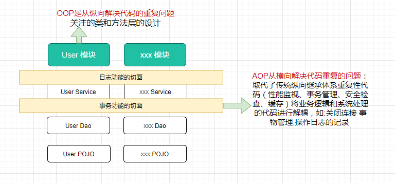

### AOP 能做什么

AOP 可以拦截指定的方法，并且对方法增强，比如：事务、日志、权限、性能监测等增强，而且无需侵入到业务代码中，使业务与非业务处理逻辑分离。

典型的 AOP 的应用场景

- 日志记录
- 事务管理
- 权限验证
- 性能监测

### AOP 概念及术语

术语（不是 Spring 特有的）：

* **连接点（Jointpoint）**：表示需要在程序中插入横切关注点的扩展点，连接点可能是类初始化、方法执行、方法调用、字段调用或处理异常等等，Spring 只支持方法执行连接点，在 AOP 中表示为 **在哪里干**；
* **切入点（Pointcut）**： 选择一组相关连接点的模式，即可以认为连接点的集合，Spring 支持 perl5 正则表达式和 AspectJ 切入点模式，Spring 默认使用 AspectJ 语法，在 AOP 中表示为 **在哪里干的集合**；
* **通知（Advice）**：在连接点上执行的行为，通知提供了在 AOP 中需要在切入点所选择的连接点处进行扩展现有行为的手段；包括前置通知（before advice）、后置通知(after advice)、环绕通知（around advice），在 Spring 中通过代理模式实现 AOP，并通过拦截器模式以环绕连接点的拦截器链织入通知；在 AOP 中表示为 **干什么**；
* **方面/切面（Aspect）**：横切关注点的模块化，比如上边提到的日志组件。可以认为是通知、引入和切入点的组合；在 Spring 中可以使用 Schema 和@AspectJ 方式进行组织实现；在 AOP 中表示为 **在哪干和干什么集合**；
* **引入（inter-type declaration）**：也称为内部类型声明，为已有的类添加额外新的字段或方法，Spring 允许引入新的接口（必须对应一个实现）到所有被代理对象（目标对象）, 在 AOP 中表示为 **干什么（引入什么）**；
* **目标对象（Target Object）**：需要被织入横切关注点的对象，即该对象是切入点选择的对象，需要被通知的对象，从而也可称为被通知对象；由于 Spring AOP 通过代理模式实现，从而这个对象永远是被代理对象，在 AOP 中表示为 **对谁干**；
* **织入（Weaving）**：把切面连接到其它的应用程序类型或者对象上，并创建一个被通知的对象。这些可以在编译时（例如使用 AspectJ 编译器），类加载时和运行时完成。Spring 和其他纯 Java AOP 框架一样，在运行时完成织入。在 AOP 中表示为 **怎么实现的**；
* **AOP 代理（AOP Proxy）**：AOP 框架使用代理模式创建的对象，从而实现在连接点处插入通知（即应用切面），就是通过代理来对目标对象应用切面。在 Spring 中，AOP 代理可以用 JDK 动态代理或 CGLIB 代理实现，而通过拦截器模型应用切面。在 AOP 中表示为 **怎么实现的一种典型方式**；

通知类型：

* **前置通知（Before advice）**：在某连接点之前执行的通知，但这个通知不能阻止连接点之前的执行流程（除非它抛出一个异常）。
* **后置通知（After returning advice）**：在某连接点正常完成后执行的通知：例如，一个方法没有抛出任何异常，正常返回。
* **异常通知（After throwing advice）**：在方法抛出异常退出时执行的通知。
* **最终通知（After (finally) advice）**：当某连接点退出的时候执行的通知（不论是正常返回还是异常退出）。
* **环绕通知（Around Advice）**：包围一个连接点的通知，如方法调用。这是最强大的一种通知类型。环绕通知可以在方法调用前后完成自定义的行为。它也会选择是否继续执行连接点或直接返回它自己的返回值或抛出异常来结束执行。

织入时期：

* 编译器：切面在目标类编译时被织入，这种方式需要特殊的编译器，AspecJ 的织入编译器就是以这种方式织入切面的
* 类加载期：切面在目标类加载到 VM 时被织入，这种方式需要特殊的类加载器（ClassLoader），它可以在目标类引入应用之前增强目标类的字节码。
* 运行期：切面在应用运行的某个时期被织入一般情况下，在织入切面时，AOP 容器会为目标对象动态创建一个代理对象，Spring AOP 采用的就是这种织入方式

以图表示这些关系：

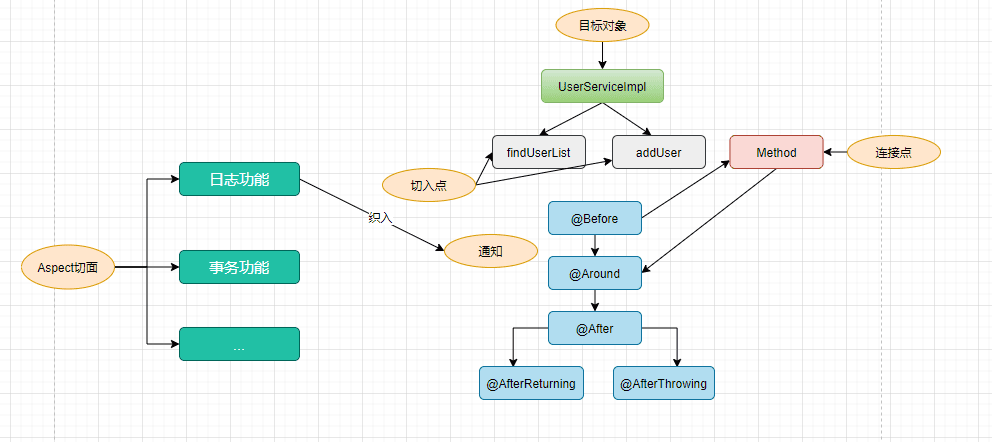

### Aspectj

AspectJ 是在 Java 语言层面实现了 AOP，它对 java 语言进行了扩展, 定义了 AOP 语法，能够在编译期进行横切代码的织入。它有专门的编译器，能够生成复合 JAVA 字节码规范的 Class 文件。AspectJ 也可以在类加载期进行织入。

**与 Spring AOP 的关系**

AspectJ 不是 Spring 组成部分，而是独立 AOP 框架，一般把 AspectJ 和 Spirng 框架一起使用，进行 AOP 操作。

Spring 中可以方便的将 SpringAOP、IOC 容器和 AspectJ 整合在一起。

Spring 提供对 AspejctJ 注解和表达式的部分支持，以满足企业开发需求.

**Spring AOP还是完全用AspectJ？**

Spring官方的回答：

* Spring AOP比完全使用AspectJ更加简单， 因为它不需要引入AspectJ的编译器／织入器到你开发和构建过程中。 如果你**仅仅需要在Spring bean上通知执行操作，那么Spring AOP是合适的选择**。
* 如果你需要通知domain对象或其它没有在Spring容器中管理的任意对象，那么你需要使用AspectJ。
* 如果你想通知除了简单的方法执行之外的连接点（如：调用连接点、字段get或set的连接点等等）， 也需要使用AspectJ。

### Spring AOP 的基础——代理

AOP 的底层使用动态代理，分为以下两种情况

Spring AOP 默认使用标准的 JDK 动态代理来实现 AOP 代理。这使得任何接口（或一组接口）都可以被代理。

Spring AOP 也可以使用 CGLIB 代理。这对于代理类而不是接口是必需的。默认情况下，如果业务对象未实现接口，则使用 CGLIB。

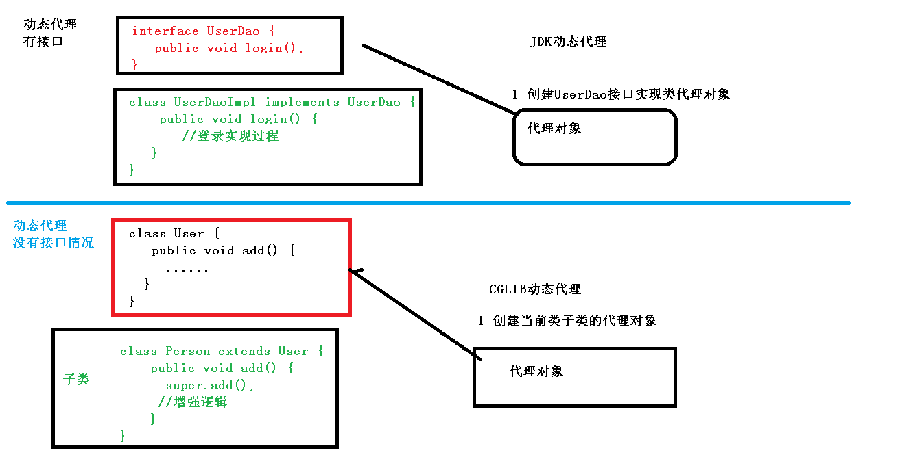

## 示例

Spring AOP 支持基于 XML 和基于@AspectJ 注解的两种配置方式。

引入依赖

```xml
	<dependency>
            <groupId>org.aspectj</groupId>
            <artifactId>aspectjweaver</artifactId>
            <version>${aspectjweaver.version}</version>
        </dependency>
```

### XML 配置方式

**定义目标类**

```java
public class AopDemoServiceImpl {

    public void doMethod1() {
        System.out.println("AopDemoServiceImpl.doMethod1()");
    }

    public String doMethod2() {
        System.out.println("AopDemoServiceImpl.doMethod2()");
        return "hello world";
    }

    public String doMethod3() throws Exception {
        System.out.println("AopDemoServiceImpl.doMethod3()");
        throw new Exception("some exception");
    }
}
```

**定义切面类**：如日志功能

```java
public class LogAspect {

    /**
     * 环绕通知.
     *
     * @param pjp pjp
     * @return obj
     * @throws Throwable exception
     */
    public Object doAround(ProceedingJoinPoint pjp) throws Throwable {
        System.out.println("-----------------------");
        System.out.println("环绕通知: 进入方法");
        Object o = pjp.proceed();
        System.out.println("环绕通知: 退出方法");
        return o;
    }

    /**
     * 前置通知.
     */
    public void doBefore() {
        System.out.println("前置通知");
    }

    /**
     * 后置通知.
     *
     * @param result return val
     */
    public void doAfterReturning(String result) {
        System.out.println("后置通知, 返回值: " + result);
    }

    /**
     * 异常通知.
     *
     * @param e exception
     */
    public void doAfterThrowing(Exception e) {
        System.out.println("异常通知, 异常: " + e.getMessage());
    }

    /**
     * 最终通知.
     */
    public void doAfter() {
        System.out.println("最终通知");
    }

}

```

**XML 配置 AOP**

> 有关 IOC 容器注册的配置也可以通过 Java 或 注解配置，这里的 IOC 是基于 XML 配置。

```xml
<?xml version="1.0" encoding="UTF-8"?>
<beans xmlns="http://www.springframework.org/schema/beans"
       xmlns:xsi="http://www.w3.org/2001/XMLSchema-instance"
       xmlns:aop="http://www.springframework.org/schema/aop"
       xmlns:context="http://www.springframework.org/schema/context"
       xsi:schemaLocation="http://www.springframework.org/schema/beans
 http://www.springframework.org/schema/beans/spring-beans.xsd
 http://www.springframework.org/schema/aop
 http://www.springframework.org/schema/aop/spring-aop.xsd
 http://www.springframework.org/schema/context
 http://www.springframework.org/schema/context/spring-context.xsd
">

    <context:component-scan base-package="com.tintin.aopdemo" />

    <!-- 目标类 -->
    <bean id="demoService" class="com.tintin.aopdemo.service.AopDemoServiceImpl">
        <!-- configure properties of bean here as normal -->
    </bean>

    <!-- 切面 -->
    <bean id="logAspect" class="com.tintin.aopdemo.aspect.LogAspect">
        <!-- configure properties of aspect here as normal -->
    </bean>

    <aop:config>
        <!-- 配置切面 -->
        <aop:aspect ref="logAspect">
            <!-- 配置切入点 -->
            <aop:pointcut id="pointCutMethod" expression="execution(* com.tintin.aopdemo.service.*.*(..))"/>
            <!-- 环绕通知 -->
            <aop:around method="doAround" pointcut-ref="pointCutMethod"/>
            <!-- 前置通知 -->
            <aop:before method="doBefore" pointcut-ref="pointCutMethod"/>
            <!-- 后置通知；returning属性：用于设置后置通知的第二个参数的名称，类型是Object -->
            <aop:after-returning method="doAfterReturning" pointcut-ref="pointCutMethod" returning="result"/>
            <!-- 异常通知：如果没有异常，将不会执行增强；throwing属性：用于设置通知第二个参数的的名称、类型-->
            <aop:after-throwing method="doAfterThrowing" pointcut-ref="pointCutMethod" throwing="e"/>
            <!-- 最终通知 -->
            <aop:after method="doAfter" pointcut-ref="pointCutMethod"/>
        </aop:aspect>
    </aop:config>

    <!-- more bean definitions for data access objects go here -->
</beans>
```

**测试**

```java
	public static void main(String[] args) {
        ApplicationContext context =
                new ClassPathXmlApplicationContext("aopdemo/aopdemo.xml");
        AopDemoServiceImpl demoService = context.getBean("demoService", AopDemoServiceImpl.class);
        
        demoService.doMethod1();
        demoService.doMethod2();
        try {
            demoService.doMethod3();
        } catch (Exception e) {
            // e.printStackTrace();
        }
    }
/*
-----------------------
环绕通知: 进入方法
前置通知
AopDemoServiceImpl.doMethod1()
环绕通知: 退出方法
最终通知
-----------------------
环绕通知: 进入方法
前置通知
AopDemoServiceImpl.doMethod2()
环绕通知: 退出方法
后置通知, 返回值: hello world
最终通知
-----------------------
环绕通知: 进入方法
前置通知
AopDemoServiceImpl.doMethod3()
异常通知, 异常: some exception
最终通知
*/
```

### 基于@AspectJ 注解配置方式

**启用 @AspectJ 支持**

* 配置文件方式

```xml
 <!--开启注解方式的切面功能-->
    <aop:aspectj-autoproxy></aop:aspectj-autoproxy>
```

* 完全注解方式

```java
@Configuration
@EnableAspectJAutoProxy
public class ConfigOfAOP {
```

以下就以去 xml 的完全注解的方式来演示

**定义目标接口**

> 假如不定义接口，那么将会使用 Cglib 代理，其他定义及最终结果都是相同的

```java
public interface AsjAopService {

    void doMethod1();

    String doMethod2();

    String doMethod3() throws Exception;
}
```

**定义目标类**

```java
@Service
public class AsjAopServiceImpl implements AsjAopService {

    @Override
    public void doMethod1() {
        System.out.println("JdkProxyServiceImpl.doMethod1()");
    }

    @Override
    public String doMethod2() {
        System.out.println("JdkProxyServiceImpl.doMethod2()");
        return "hello world";
    }

    @Override
    public String doMethod3() throws Exception {
        System.out.println("JdkProxyServiceImpl.doMethod3()");
        throw new Exception("some exception");
    }
}
```

**使用注解定义和配置切面**

```java
@EnableAspectJAutoProxy // 开启注解方式的切面功能
@Component
@Aspect
public class LogAspect {

    /**
     * define point cut.
     */
    @Pointcut("execution(* com.tintin.aopdemo.service.*.*(..))")
    private void pointCutMethod() {
    }


    /**
     * 环绕通知.
     *
     * @param pjp pjp
     * @return obj
     * @throws Throwable exception
     */
    @Around("pointCutMethod()")
    public Object doAround(ProceedingJoinPoint pjp) throws Throwable {
        System.out.println("-----------------------");
        System.out.println("环绕通知: 进入方法");
        Object o = pjp.proceed();
        System.out.println("环绕通知: 退出方法");
        return o;
    }

    /**
     * 前置通知.
     */
    @Before("pointCutMethod()")
    public void doBefore() {
        System.out.println("前置通知");
    }


    /**
     * 后置通知.
     *
     * @param result return val
     */
    @AfterReturning(pointcut = "pointCutMethod()", returning = "result")
    public void doAfterReturning(String result) {
        System.out.println("后置通知, 返回值: " + result);
    }

    /**
     * 异常通知.
     *
     * @param e exception
     */
    @AfterThrowing(pointcut = "pointCutMethod()", throwing = "e")
    public void doAfterThrowing(Exception e) {
        System.out.println("异常通知, 异常: " + e.getMessage());
    }

    /**
     * 最终通知.
     */
    @After("pointCutMethod()")
    public void doAfter() {
        System.out.println("最终通知");
    }

}
```

**测试**

```java
 public static void main(String[] args) {
//        ApplicationContext context = new ClassPathXmlApplicationContext("aopdemo/aopdemo.xml");
//        AopDemoServiceImpl service = context.getBean("demoService", AopDemoServiceImpl.class);

        ApplicationContext context = new AnnotationConfigApplicationContext("com.tintin.aopdemo");
        AsjAopService service = context.getBean("asjAopServiceImpl", AsjAopService.class);

        service.doMethod1();
        service.doMethod2();
        try {
            service.doMethod3();
        } catch (Exception e) {
            // e.printStackTrace();
        }
    }

/*
-----------------------
环绕通知: 进入方法
前置通知
JdkProxyServiceImpl.doMethod1()
最终通知
环绕通知: 退出方法
-----------------------
环绕通知: 进入方法
前置通知
JdkProxyServiceImpl.doMethod2()
后置通知, 返回值: hello world
最终通知
环绕通知: 退出方法
-----------------------
环绕通知: 进入方法
前置通知
JdkProxyServiceImpl.doMethod3()
异常通知, 异常: some exception
最终通知
*/
```

## AspectJ 注解

基于 XML 的声明式 AspectJ 存在一些不足，需要在 Spring 配置文件配置大量的代码信息，为了解决这个问题，Spring 使用了@AspectJ 框架为 AOP 的实现提供了一套注解。

### 启用 AspectJ 注解支持@EnableAspectJAutoProxy

@EnableAspectJAutoProxy 用于启用 AspectJ 自动代理的支持，Spring 容器会自动为配置的 Bean 创建代理对象，并将 AspectJ 定义的切面应用到这些代理对象上。

### 声明切面@Aspect

启用 @AspectJ 支持后，应用程序上下文中任何定义为 AspectJ 切面（具有 `@Aspect` 注解）的 bean 都会被 Spring 自动检测到，并用于配置 Spring AOP。

### 声明切入点@Pointcut

**切入点指示符**

- `execution`: 用于匹配方法执行连接点。这是在使用 Spring AOP 时要使用的主要切入点指示符。
- `within`: 将匹配限制在特定类型内的连接点（使用 Spring AOP 时，在匹配类型中声明的方法的执行）。
- `this`: 将匹配限制在连接点（使用 Spring AOP 时，方法的执行），其中 bean 引用（Spring AOP 代理）是给定类型的实例。
- `target`: 将匹配限制在连接点（使用 Spring AOP 时，方法的执行），其中目标对象（被代理的应用程序对象）是给定类型的实例。
- `args`: 将匹配限制在连接点（使用 Spring AOP 时，方法的执行），其中参数是给定类型的实例。
- `@target`: 将匹配限制在连接点（使用 Spring AOP 时，执行对象的类具有给定类型的注解）。
- `@args`: 将匹配限制在连接点（使用 Spring AOP 时，实际传递的参数的运行时类型具有给定类型的注解）。
- `@within`: 将匹配限制在具有给定注解的类型内的连接点（使用 Spring AOP 时，在具有给定注解的类型中声明的方法的执行）。
- `@annotation`: 将匹配限制在连接点的主体（在 Spring AOP 中运行的方法）具有给定注解的情况。

其他切入点类型

**组合切入点表达式**

可以使用 `&&`、`||` 和 `!` 组合切入点表达式

```java
package com.xyz;

public class Pointcuts {

	@Pointcut("execution(public * *(..))") // 任何公共方法
	public void publicMethod() {}

	@Pointcut("within(com.xyz.trading..*)") // 在trading模块
	public void inTrading() {}

	@Pointcut("publicMethod() && inTrading()") // 在trading模块的任何公共方法
	public void tradingOperation() {}
}
```

**常见的切入点表达式**

建议定义一个专用类，用于捕获常用的*命名切入点*表达式。

```java
public class CommonPointcuts {

	@Pointcut("execution(public * *(..))") // 任何公共方法
	public void anyPublicMethod() {}

	@Pointcut("execution(* set*(..))") // 任何名称以 set 开头的方法
	public void anySetMethod() {}
    
    @Pointcut("execution(* com.xyz.service.*.*(..))") // service 包中任何方法
	public void inServicePackage() {}

    @Pointcut("execution(* com.xyz.service..*.*(..))") // service 包或其子包中任何方法
	public void inServiceLayer() {}
    
    @Pointcut("within(com.xyz.service.*)") // service 包中任意连接点（在 Spring AOP 中仅限于方法执行）
	public void inServicePackage() {}

    // 实现了AccountService接口的代理对象的任意连接点 （在Spring AOP中只是方法执行）：
    this（com.xyz.service.AccountService）// 'this'在绑定表单中更加常用

    // 实现AccountService接口的目标对象的任意连接点 （在Spring AOP中只是方法执行）：
    target（com.xyz.service.AccountService） // 'target'在绑定表单中更加常用

    // 任何一个只接受一个参数，并且运行时所传入的参数是Serializable 接口的连接点（在Spring AOP中只是方法执行）
    args（java.io.Serializable） // 'args'在绑定表单中更加常用; 请注意在例子中给出的切入点不同于 execution(* *(java.io.Serializable))： args版本只有在动态运行时候传入参数是Serializable时才匹配，而execution版本在方法签名中声明只有一个 Serializable类型的参数时候匹配。

    // 目标对象中有一个 @Transactional 注解的任意连接点 （在Spring AOP中只是方法执行）
    @target（org.springframework.transaction.annotation.Transactional）// '@target'在绑定表单中更加常用

    // 任何一个目标对象声明的类型有一个 @Transactional 注解的连接点 （在Spring AOP中只是方法执行）：
    @within（org.springframework.transaction.annotation.Transactional） // '@within'在绑定表单中更加常用

    // 任何一个执行的方法有一个 @Transactional 注解的连接点 （在Spring AOP中只是方法执行）
    @annotation（org.springframework.transaction.annotation.Transactional） // '@annotation'在绑定表单中更加常用

    // 任何一个只接受一个参数，并且运行时所传入的参数类型具有@Classified 注解的连接点（在Spring AOP中只是方法执行）
    @args（com.xyz.security.Classified） // '@args'在绑定表单中更加常用

    // 任何一个在名为'tradeService'的Spring bean之上的连接点 （在Spring AOP中只是方法执行）
    bean（tradeService）

    // 任何一个在名字匹配通配符表达式'*Service'的Spring bean之上的连接点 （在Spring AOP中只是方法执行）
    bean（*Service）
    
    

}
```

### 声明通知

**前置通知**

```java
@Before("pointCut()")
```

**后置返回通知**

```java
@Aspect
public class AfterReturningExample {
	@AfterReturning(
		pointcut="pointCut()",
		returning="retVal")
	public void doAccessCheck(Object retVal) {
		// ...
	}
}
```

**后置抛出通知**

```java
@Aspect
public class AfterThrowingExample {

	@AfterThrowing(
		pointcut="pointCut()",
		throwing="ex")
	public void doRecoveryActions(DataAccessException ex) {
		// ...
	}
}
```

**后置（最终）通知**

```java
@After("pointCut()")
```

**环绕通知**

环绕通知的方法应将其返回类型声明为`Object`，并且该方法的第一个参数必须是`ProceedingJoinPoint`类型。在通知方法的主体中，您必须在`ProceedingJoinPoint`上调用`proceed()`，以便底层方法运行。

```java
@Aspect
public class AroundExample {

	@Around("pointCut()")
	public Object doBasicProfiling(ProceedingJoinPoint pjp) throws Throwable {
		// start stopwatch
		Object retVal = pjp.proceed();
		// stop stopwatch
		return retVal;
	}
}
```

**访问切入方法**

```java
@Before("pointCut()")
    public void logStart(JoinPoint joinPoint) {//切入点方法
        System.out.println(joinPoint.getSignature().getName()
                + "除法运行...参数列表：{"
                + Arrays.asList(joinPoint.getArgs())
                +"}");
    }
```

`JoinPoint`接口提供了许多有用的方法：

- `getArgs()`：返回方法参数。
- `getThis()`：返回代理对象。
- `getTarget()`：返回目标对象。
- `getSignature()`：返回正在被通知的方法的描述。
- `toString()`：打印正在被通知的方法的有用描述。

**通知排序**

当多个通知都想在同一个连接点运行时会发生什么？Spring AOP 遵循与 AspectJ 相同的优先级规则来确定通知的执行顺序。优先级最高的通知在“进入”时首先运行（因此，给定两个前置通知，优先级最高的那个首先运行）。在从连接点“退出”时，优先级最高的通知最后运行（因此，给定两个后置通知，优先级最高的那个将第二个运行）。

优先级指定可以通过在切面类中实现`org.springframework.core.Ordered`接口或使用`@Order`注解来完成。

如果未指定优先级，执行顺序是不确定的。

## AOP 原理

### @EnableAspectJAutoProxy

给容器注册 internalAutoProxyCreator = AnnotationAwareAspectJAutoProxyCreator

​    AnnotationAwareAspectJAutoProxyCreator
​    	-> AspectJAwareAdvisorAutoProxyCreator
​    		-> AbstractAdvisorAutoProxyCreator
​    			-> AbstractAutoProxyCreator 
​    				-> ProxyProcessorSupport  ---**SmartInstantiationAwareBeanPostProcessor**, **BeanFactoryAware**

AnnotationAwareAspectJAutoProxyCreator 是一个后置处理器，也是一个 BeanFactoryAware 实现 BeanFactory 组件注入

### BeanFactoryAware

```java
//AbstractAutoProxyCreator.class
public void setBeanFactory(BeanFactory beanFactory) {
        this.beanFactory = beanFactory;
    }
```

```java
//AbstractAdvisorAutoProxyCreator.class 调用initBeanFactory（）
public void setBeanFactory(BeanFactory beanFactory) {
        super.setBeanFactory(beanFactory);
        if (!(beanFactory instanceof ConfigurableListableBeanFactory)) {
            throw new IllegalArgumentException("AdvisorAutoProxyCreator requires a ConfigurableListableBeanFactory: " + beanFactory);
        } else {
            this.initBeanFactory((ConfigurableListableBeanFactory)beanFactory);
        }
    }
```

```java
//AnnotationAwareAspectJAutoProxyCreator.class
 protected void initBeanFactory(ConfigurableListableBeanFactory beanFactory) {
        super.initBeanFactory(beanFactory);
        if (this.aspectJAdvisorFactory == null) {
            this.aspectJAdvisorFactory = new ReflectiveAspectJAdvisorFactory(beanFactory);
        }

        this.aspectJAdvisorsBuilder = new AnnotationAwareAspectJAutoProxyCreator.BeanFactoryAspectJAdvisorsBuilderAdapter(beanFactory, this.aspectJAdvisorFactory);
    }
```


### SmartInstantiationAwareBeanPostProcessor 后置处理器

```java
public Object postProcessBeforeInstantiation(Class<?> beanClass, String beanName) throws BeansException {
        Object cacheKey = this.getCacheKey(beanClass, beanName);
        if (beanName == null || !this.targetSourcedBeans.contains(beanName)) {
            if (this.advisedBeans.containsKey(cacheKey)) {
                return null;
            }

            if (this.isInfrastructureClass(beanClass) || this.shouldSkip(beanClass, beanName)) {
                this.advisedBeans.put(cacheKey, Boolean.FALSE);
                return null;
            }
        }

        if (beanName != null) {
            TargetSource targetSource = this.getCustomTargetSource(beanClass, beanName);
            if (targetSource != null) {
                this.targetSourcedBeans.add(beanName);
                Object[] specificInterceptors = this.getAdvicesAndAdvisorsForBean(beanClass, beanName, targetSource);
                Object proxy = this.createProxy(beanClass, beanName, specificInterceptors, targetSource);
                this.proxyTypes.put(cacheKey, proxy.getClass());
                return proxy;
            }
        }

        return null;
    }

public Object postProcessAfterInitialization(Object bean, String beanName) throws BeansException {
        if (bean != null) {
            Object cacheKey = this.getCacheKey(bean.getClass(), beanName);
            if (!this.earlyProxyReferences.contains(cacheKey)) {
                return this.wrapIfNecessary(bean, beanName, cacheKey);
            }
        }

        return bean;
    }
```

### 创建一个 AOP 代理对象的流程

1. 传入配置类，创建 ioc 容器

2. 注册配置类，调用 refresh（）刷新容器；

3. **registerBeanPostProcessors(beanFactory)**; 注册 bean 的后置处理器来方便拦截 bean 的创建；

   1. 先获取 ioc 容器已经定义了的需要创建对象的所有 BeanPostProcessor，例如实现了 SmartInstantiationAwareBeanPostProcessor 的 AnnotationAwareAspectJAutoProxyCreator 等 spring 底层后置处理器，和用户自定义的后置处理器

   2. 给容器中加别的 BeanPostProcessor

   3. 区分不同优先度的后置处理器，分别实现了 PriorityOrdered, Ordered, and the rest.

   4. 根据优先级注册后置处理器，实际上就是创建 BeanPostProcessor 对象，保存在容器

      创建 SmartInstantiationAwareBeanPostProcessor 

      1. 创建 Bean 的实例
      2. populateBean；给 bean 的各种属性赋值
      3. initializeBean：初始化 bean；
         1. invokeAwareMethods（）：处理 Aware 接口的方法回调
         2. applyBeanPostProcessorsBeforeInitialization(）：后置处理器
         3. invokeInitMethods(）；执行自定义的初始化方法
         4. applyBeanPostProcessorsAfterInitialization()：后置处理器
      4. BeanPostProcessor(AnnotationAwareAspectJAutoProxyCrator)创建成

   5. 把 BeanPostProcessor 注册到 BeanFactory 中；
      beanFactory.addBeanPostProcessor(postProcessor);


==== ==== ==== ==== ==== = 以上为创建和注册 AnnotationAwareAspectJAutoProxyCreator 的流程 ==== ==== ==== ==

4. **finishBeanFactoryInitialization(beanFactory);** 完成 BeanFactory 初始化工作；创建剩下的单实例 bean

   1. 遍历获取容器中所有的 Bean，依次创建对象 getBean（beanName）；
      getBean-> doGetBean( )-> getSingleton( )->

   2. 创建 bean

      【AnnotationAwareAspectJAutoProxyCreator 在所有 bean 创建之前会有一个拦截， InstantiationAwareBeanPostProcessor 会调用 postProcessBeforeInstantiation】

      1. 先从缓存中获取当前 bean，如果能获取到，说明 bean 是之前被创建过的，直接使用，否则再创建；
         只要创建好的 Bean 都会被缓存起来

      2. createBean(); 创建 bean

         【BeanPostProcessor 是在 Bean 对象创建完成初始化前后调用的】
         【InstantiationAwareBeanPostProcessor 是在创建 Bean 实例之前先尝试用后置处理器返回对象的】

         1. bean = resolveBeforeInstantiation(beanName, mbdToUse); 希望返回一个代理对象，否则真正创建一个 bean 实例，

            1. ```java
               bean = applyBeanPostProcessorsBeforeInstantiation(targetType, beanName);
               //后置处理器尝试返回对象，如果是InstantiationAwareBeanPostProcessor，就执行postProcessBeforeInstantiation
               					if (bean != null) {
               						bean = applyBeanPostProcessorsAfterInitialization(bean, beanName);
               					}
               ```

               

         2. doCreateBean(beanName, mbdToUse, args); 与 3.4 的流程一致

         3. postProcessBeforeInstantiation

         > AnnotationAwareAspectJAutoProxyCreator【InstantiationAwareBeanPostProcesso】的作用：
         >
         > 1. 每一个 bean 创建之前，调用 postProcessBeforeInstantiation
         >
         >    关心 MathCalculator 和 LogAspect 的创建
         >
         >    1. 判断当前 bean 是否在 advisedBeans 中（保存了所有需要增强 bean）
         >    2. 判断当前 bean 是否是基础类型的 Advice、Pointcut、Advisor、AopInfrastructureBean 或者是否是切面（@Asspect）
         >    3. 判断是否需要跳过
         >       1. 获取候选的增强器（切面里面的通知方法）`List <Advisor> candidateAdvisors`
         >       2. 判断是否为 AspectJPointcutAdvisor 类型的增强器，否则跳过且通过父类的 shouldSkip 返回 false 进行跳过
         >
         > 2. 创建对象
         >
         >    postProcessAfterInitialization
         >
         >    return wrapIfNecessary(bean, beanName, cacheKey); 包装如果需要的情况下
         >
         >    1. 获取当前 bean 的所有增强器（通知方法）
         >       1. 找到能在当前 bean 使用的增强器（找哪些通知方法是需要切入当前 bean 方法的）
         >       2. 获取到能在 bean 使用的增强器
         >       3. 给增强器排序
         >    2. 保存当前 bean 在 advisedBeans 中
         >    3. 如果当前 bean 需要增强，创建当前 bean 的代理对象；
         >       1. 获取所有增强器（通知方法）
         >       2. 保存到 proxyFactory
         >       3. 创建代理对象：Spring 自动决定
         >          JdkDynamicAopProxy(config); jdk 动态代理
         >          ObjenesisCglibAopProxy(config); cglib 的动态代理
         >    4. 给容器返回当前组件使用 cglib 的动态代理对象

### 目标方法执行的流程

目标方法执行；
容器中保存了组件的代理对象（cglib 增强后，这个对象里面保存了详细信息（比如增强器，目标对象，xxx)

1. CglibAopProxy.intercept(）; 拦截目标方法的执行

2. 根据 ProxyFactory 对象获取将要执行的目标方法拦截器链；
   `List <Object> chain = this.advised.getInterceptorsAndDynamicInterceptionAdvice(method, targetClass);`

   1. `List <Object> interceptorList` 保存所有拦截器 5
      一个默认的 ExposeInvocationInterceptor 和 4 个增强器；

   2. 遍历所有的增强器，将其转为 Interceptor；
      registry.getInterceptors(advisor);

   3. 将增强器转为 `List <MethodIntergmptor>`;
      如果是 MethodInterceptor，直接加入到集合中
      如果不是，使用 AdvisorAdapter 将增强器转为 Interceptorl

      转换完成返回一个 MethodInterceptor 数组

3. 如果没有拦截器链，直接执行目标方法

4. 如果有拦截器链，把需要执行的目标对象，目标方法，拦截器链等信息传入创建一个 CglibMethodInvocation 对象，
   并调用 mi . proceed（）；

   拦截器链触发

   1. 如果没有拦截器执行执行目标方法，或者拦截器的索引和拦截器
      器数组 －1 大小一样（指定到了最后一个拦截器）执行目标方法；

   2. 链式获取每一个拦截器，拦截器执行 invoke 方法，每一个拦截器等待下一个拦截器执行完成返回以后再来执行；
      拦截器链的机制，保证通知方法与目标方法的执行顺序

      

### 总结

1. @EnableAspectJAutoProxy 开启 AOP 功能
2. @EnableAspectJAutoProxy 会给容器中注册一个组件 AnnotationAwareAspectJAutoProxyCreator
3. AnnotationAwareAspectJAutoProxyCreator 是一个后置处理器；
4. 容器的创建流程：
   1. registerBeanPostProcessors（）注册后置处理器；创建 AnnotationAwareAspectJAutoProxyCreator
   2. finishBeanFactoryInitialization（）初始化剩下的单实例 bean
      1. 创建业务逻辑组件和切面组件
      2. AnnotationAwareAspectJAutoProxyCreator 拦截组件的创建过程
      3. 组件创建完之后，判断组件是否需要增强
         是：切面的通知方法，包装成增强器（Advisor）；给业务逻辑组件创建一个代理对象
5. 执行目标方法：
   1. 代理对象执行目标方法
   2. CglibAopProxy.intercept();
      1. 得到目标方法的拦截器链（增强器包装成拦截器 MethodInterceptor）
      2. 利用拦截器的链式机制，依次进入每一个拦截器进行执行；
      3. 效果：
         正常执行：前置通知-》目标方法-》后置通知-》返回通知
         出现异常：前置通知- > 目标方法-> 后置通知-》返回通知

# 声明式事务

## 环境搭建与测试

依赖

```xml
		<dependency>
            <groupId>c3p0</groupId>
            <artifactId>c3p0</artifactId>
            <version>0.9.1.2</version>
        </dependency>
        <dependency>
            <groupId>mysql</groupId>
            <artifactId>mysql-connector-java</artifactId>
            <version>8.0.27</version>
        </dependency>
        <dependency>
            <groupId>org.springframework</groupId>
            <artifactId>spring-jdbc</artifactId>
            <version>4.3.12.RELEASE</version>
        </dependency>
```

配置数据源和 jdbcTemplate

```java
@EnableTransactionManagement
@ComponentScan("com.tintin")
@PropertySource(value = "classpath:dbconfig.properties", encoding = "utf-8")
@Configuration
public class ConfigOfTx {
    @Value("${spring.datasource.username}")
    private String user;
    @Value("${spring.datasource.password}")
    private String password;
    @Value("${spring.datasource.urlTest}")
    private String url;
    @Value("${spring.datasource.driver-class-name}")
    private String driverClass;

    //数据源
    @Bean
    public DataSource dataSource() throws PropertyVetoException {
        ComboPooledDataSource dataSource = new ComboPooledDataSource();
        dataSource.setUser(user);
        dataSource.setPassword(password);
        dataSource.setJdbcUrl(url);
        dataSource.setDriverClass(driverClass);
        return dataSource;
    }

    //jdbcTemplate
    @Bean
    public JdbcTemplate jdbcTemplate() throws PropertyVetoException {
        //spring对@Configuration有特殊处理，
        JdbcTemplate jdbcTemplate = new JdbcTemplate(dataSource());//从数据源组件中获取连接，并非简单的执行一个方法
        return jdbcTemplate;
    }
}
```

标注方法为事务方法

```java
    @Transactional
    public void insertUser() {
```

开启基于注解的事务管理功能

xml	配置方式

```xml
    <!--开启基于注解的事务功能-->
    <tx:annotation-driven></tx:annotation-driven>
```

注解方式

```java
@EnableTransactionManagement
@ComponentScan("com.tintin")
@PropertySource(value = "classpath:dbconfig.properties", encoding = "utf-8")
@Configuration
public class ConfigOfTx {
```

配置事务管理器来管理事务

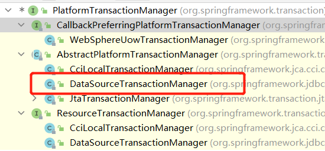

```java
    @Bean
    public PlatformTransactionManager transactionManager() throws PropertyVetoException {
        return new DataSourceTransactionManager(dataSource());
    }
```

## 原理

1. @EnableTransactionManagement
   利用 TransactionManagementConfigurationSelector 给容器中会导入
   导入两个组件
   AutoProxyRegistrar
   ProxyTransactionManagementConfiguratiom

```java
public class TransactionManagementConfigurationSelector extends AdviceModeImportSelector<EnableTransactionManagement> {
    public TransactionManagementConfigurationSelector() {
    }

    protected String[] selectImports(AdviceMode adviceMode) {
        switch(adviceMode) {
        case PROXY:
            return new String[]{AutoProxyRegistrar.class.getName(), ProxyTransactionManagementConfiguration.class.getName()};
        case ASPECTJ:
            return new String[]{"org.springframework.transaction.aspectj.AspectJTransactionManagementConfiguration"};
        default:
            return null;
        }
    }
}

```

2. AutoProxyRegistrar:
   给容器中注册一个 InfrastructureAdvisorAutoProxyCreator 组件；
   InfrastructureAdvisorAutoProxyCreator：？
   利用后置处理器机制在对象创建以后，包装对象，返回一个代理对象（增强器），代理对象执行方法	利用拦截器进行调用

3. ProxyTransactionManagementConfiguration 做了什么？
   1. 给容器中注册事务增强器；
      1. 事务增强器要用事务注解的信息，AnnotationTransactionAttributeSource 解析事务
      2. 事务拦截器：
         TransactionInterceptor；保存了事务属性信息, 事务管理器
         他是一个 MethodInterceptor；
         在目标方法执行的时候；
         执行拦截器链；
         事务拦截器：
         1. 先获取事务相关的属性
         2. 再获取 PlatformTransactionManager，如果事先没有添加指定任何 TransactionManager
            最终会从容器中按照类型获取一个 TransactionManager
         3. 执行目标方法
            如果异常，获取到事务管理器，利用事务管理回滚操作；
            如果正常，利用事务管理器，提交事务

# 拓展原理

## BeanFactoryPostProcessor
## BeanDefinitionRegistryPostProcessor
## ApplicationListener
## Spring 容器创建过程

# Servlet 3.0

# 参考资料

[Spring Projects :: Spring Framework - Spring 框架](https://docs.springframework.org.cn/spring-framework/reference/spring-projects.html)