[TOC]


# 0 导学

## 思维导图

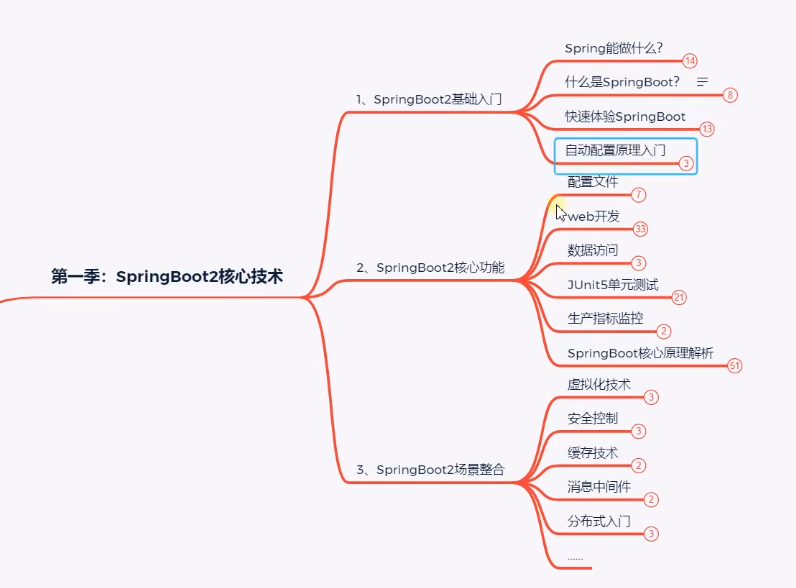

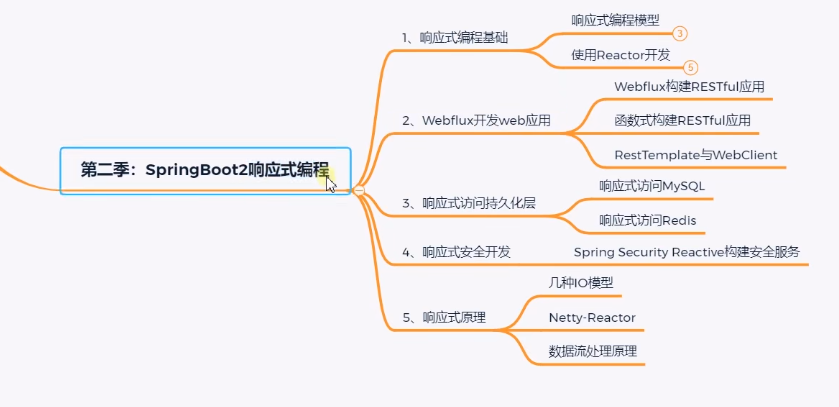

## 环境要求

Java8以上

Maven3.3以上

# 1 Spring与SpringBoot

## 1.1 Spring能做什么

### 1.1.1 Spring的能力

微服务、响应式编程、web开发、无服务开发、事件驱动、批处理

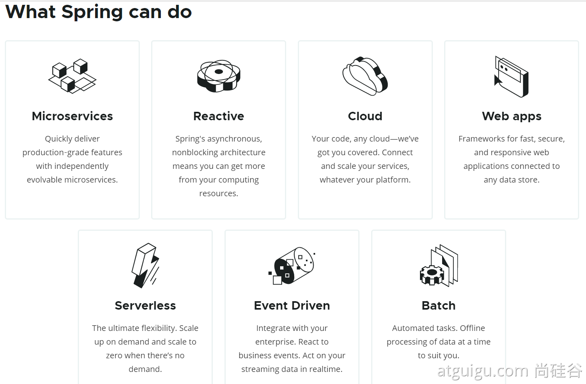

### 1.1.2 Spring生态

[Spring Boot](https://spring.io/projects/spring-boot)

覆盖了：
web开发
数据访问
安全控制
分布式
消息服务
移动开发
批处理
......

### 1.1.3 Spring新功能

**响应式编程**

boot引入两种技术栈

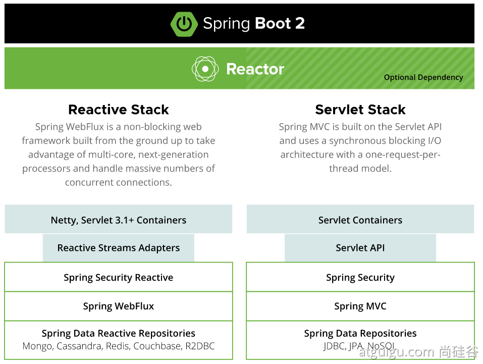

**内部源码升级**

基于Java8新特性，如：接口默认实现。重新设计源码架构。

## 1.2 为什么用SpringBoot

> Spring Boot makes it easy to create stand-alone, production-grade Spring based Applications that you can "just run".
>
> 能快速创建出生产级别的Spring应用

### 1.2.1 特性

- Create stand-alone Spring applications
  - 创建独立的应用
- Embed Tomcat, Jetty or Undertow directly (no need to deploy WAR files)
  - 内嵌web服务器
- Provide opinionated 'starter' dependencies to simplify your build configuration
  - 自动starter依赖，简化构建配置
- Automatically configure Spring and 3rd party libraries whenever possible
  - 自动配置Spring以及第三功能
- Provide production-ready features such as metrics, health checks, and externalized configuration
  - 提供生产级别的监控、健康检查以及外部化配置
- Absolutely no code generation and no requirement for XML configuration
  - 无代码生成、无需编写xml

> SpringBoot是整合Spring技术栈的一站式框架
> SpringBoot是简化Spring技术栈的快速开发脚手架

## 1.2.2 缺点

迭代快、需要时刻关注变化

封装深、内部原理复杂、不易精通

## 1.3 时代背景

### 1.3.1 微服务

> In short, the **microservice architectural style** is an approach to developing a single application as **a suite of small services**, each **running in its own process** and communicating with **lightweight** mechanisms, often an **HTTP** resource API. These services are **built around business capabilities** and **independently deployable by fully automated deployment machinery**. There is a **bare minimum of centralized management** of these services, which may be written in **different programming languages** and use **different data storage technologies**.-- [James Lewis and Martin Fowler (2014)](https://martinfowler.com/articles/microservices.html)

### 1.3.2 分布式

分布式的困难

* 远程调用
* 服务发现
* 负载均衡
* 服务容错
* 配置管理
* 服务监控
* 链路追踪
* 日志管理
* 任务调度
* ......

分布式的解决

* SprinBoot + SpringCloud+SpringCloud Data Flow

  

### 1.3.3 云原生

原生应用如何上云。 

上云的困难 

* 服务自愈
* 弹性伸缩
* 服务隔离
* 自动化部署
* 灰度发布
* 流量治理
* ......

上云的解决

Cloud Native

## 1.4 如何学习SpringBoot

### 1.4.1 官方文档

[Spring Boot Reference Documentation](https://docs.spring.io/spring-boot/docs/current/reference/html/)

# 2 SpringBoot入门

## 2.1 Maven设置

```xml
<mirrors>
      <mirror>
        <id>nexus-aliyun</id>
        <mirrorOf>central</mirrorOf>
        <name>Nexus aliyun</name>
        <url>http://maven.aliyun.com/nexus/content/groups/public</url>
      </mirror>
  </mirrors>
 
  <profiles>
         <profile>
              <id>jdk-1.8</id>
              <activation>
                <activeByDefault>true</activeByDefault>
                <jdk>1.8</jdk>
              </activation>
              <properties>
                <maven.compiler.source>1.8</maven.compiler.source>
                <maven.compiler.target>1.8</maven.compiler.target>
                <maven.compiler.compilerVersion>1.8</maven.compiler.compilerVersion>
              </properties>
         </profile>
  </profiles>
```

## 2.2 Hello-World

需求：浏览发送/hello请求，响应Hello，SpringBoot2

### 2.2.1 创建Maven项目

### 2.2.2 引入依赖

```xml
<parent>
    <groupId>org.springframework.boot</groupId>
    <artifactId>spring-boot-starter-parent</artifactId>
    <version>2.6.2</version>
</parent>

<modelVersion>4.0.0</modelVersion>

<artifactId>boot-01-helloworld</artifactId>

<dependencies>
    <dependency>
        <groupId>org.springframework.boot</groupId>
        <artifactId>spring-boot-starter-web</artifactId>
    </dependency>
</dependencies>
```

### 2.2.3 主程序

```java
/**
 * 主程序类
 * @author tintin
 * @create 2022-01-03-14:05
 */
//告诉springboot这是一个springboot应用
@SpringBootApplication
public class MainApplication {
    public static void main(String[] args) {
        SpringApplication.run(MainApplication.class);
    }
}
```


### 2.2.4 业务代码

```jav
@RestController
public class HelloController {
    @RequestMapping("/hello")
    public String handle01() {
        return "Hello,SpringBoot2!";
    }
}
```


### 2.2.5 运行主程序

### 2.2.6 简化配置

```properties
# application.properties
server.port=8888
```

[配置属性Common Application Properties (spring.io)](https://docs.spring.io/spring-boot/docs/current/reference/html/application-properties.html#application-properties)


### 2.2.7 简化部署

```xml
    <build>
        <plugins>
            <plugin>
                <groupId>org.springframework.boot</groupId>
                <artifactId>spring-boot-maven-plugin</artifactId>
            </plugin>
        </plugins>
    </build>
```

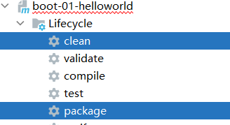

把项目打成jar包，直接在目标服务器执行即可。

> 取消掉cmd的快速编辑模式

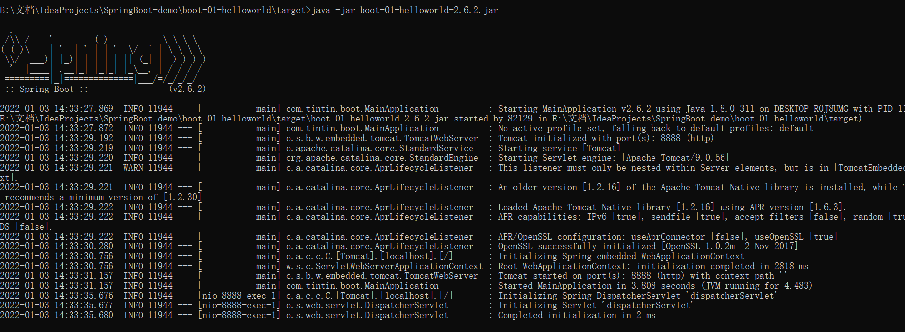

# 3 了解自动配置原理

## 3.1 SpringBoot特点

### 3.1.1 依赖管理

```xml
依赖管理    
<parent>
        <groupId>org.springframework.boot</groupId>
        <artifactId>spring-boot-starter-parent</artifactId>
        <version>2.3.4.RELEASE</version>
</parent>

他的父项目
 <parent>
    <groupId>org.springframework.boot</groupId>
    <artifactId>spring-boot-dependencies</artifactId>
    <version>2.3.4.RELEASE</version>
  </parent>

几乎声明了所有开发中常用的依赖的版本号,自动版本仲裁机制
<properties>依赖版本号<properties>
<dependencies>依赖信息</dependencies>
```

​	模块可以通过继承获得父模块中声明的全部依赖，这样虽然避免了在各个子模块 POM 中重复进行依赖声明，但也极有可能造成子模块中引入一些不必要的依赖。为此 Maven 引入了 dependencyManagement 来对依赖进行管理。

在spring-boot-dependencies项目中，就通过dependencyManagement标签进行管理

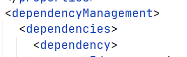


* 可修改默认依赖版本号

```xml
1、查看spring-boot-dependencies里面规定当前依赖的版本 用的 key。
2、在当前项目里面重写配置
    <properties>
        <mysql.version>5.1.43</mysql.version>
    </properties>
```

* 开发导入starter场景启动器[Developing with Spring Boot](https://docs.spring.io/spring-boot/docs/current/reference/html/using.html#using.build-systems.starters)

```xml
1、见到很多 spring-boot-starter-* ： *就某种场景
2、只要引入starter，这个场景的所有常规需要的依赖我们都自动引入
3、SpringBoot所有支持的场景

4、见到的  *-spring-boot-starter： 第三方为我们提供的简化开发的场景启动器。
5、所有场景启动器最底层的依赖
<dependency>
  <groupId>org.springframework.boot</groupId>
  <artifactId>spring-boot-starter</artifactId>
  <version>2.3.4.RELEASE</version>
  <scope>compile</scope>
</dependency>
```

* 无需关注版本号，自动版本总裁

  引入依赖默认都可以不写版本 
  引入非版本仲裁的jar，要写版本号。

### 3.1.2 自动配置

* 自动配好Tomcat

* 自动配好SpringMVC

* 自动配好Web常见功能

  * 前端控制器
  * 字符编码问题
  * 视图解析器
  * 文件上传
  * ...

* 默认的包结构

  * 主程序所在包及其下面的所有子包里面的组件都会默认被扫描
  * 无需要配置包扫描
  * 改变扫描路径@SpringBootApplication(scanBasePackages="com.tintin")

  ```java
  @SpringBootApplication(scanBasePackages="com.tintin")
  等同于
  @SpringBootConfiguration
  @EnableAutoConfiguration
  @ComponentScan("com.tintin")
  ```

* 各种配置拥有默认值

  * 默认配置最终都是映射到某个类上，如：MultipartProperties
  * 配置文件的值最终会绑定每个类上，这个类会在容器中创建对象

* 按需加载所有自动配置项

  * 引入了哪些场景这个场景的自动配置才会开启
  * SpringBoot所有的自动配置功能都在 spring-boot-autoconfigure 包里面

  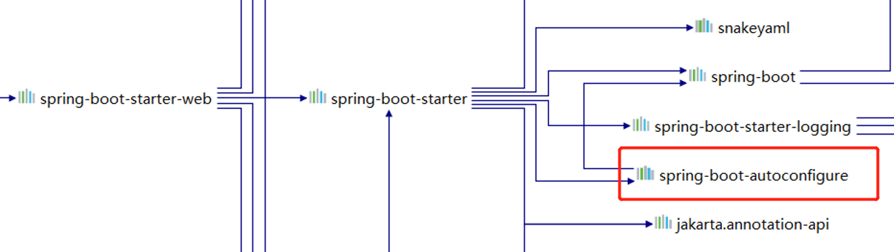

## 3.2 容器功能

### 3.2.1 组件添加

1. beans.xml

2. 主程序类中配置

3. @Bean+@Configuration（Full模式和Lite模式）

   * 配置类组件之间无依赖关系用Lite模式加速容器启动过程，减少判断
   * 配置类组件之间有依赖关系，方法会被调用得到之前单实例组件，用Full模式

   ```java
   /**
    * 配置类本身为组件
    *  proxyBeanMethods 默认为 true
    *      Full（true）：永远从容器中获取同一个对象
    *      Lite（false）：容器中不保存代理对象，多次获取组件的对象不相同
    *      解决场景：组建依赖
    *
    * @author tintin
    * @create 2022-01-03-16:51
    */
   @Configuration(proxyBeanMethods = false)
   public class MyConfig {
       @Bean//给容器中添加组件
       public Pet pet01() {
           return new Pet("cat");
       }
   
       @Bean
       public User user01() {
           return new User("tintin",19,pet01());
       }
   }
   ```

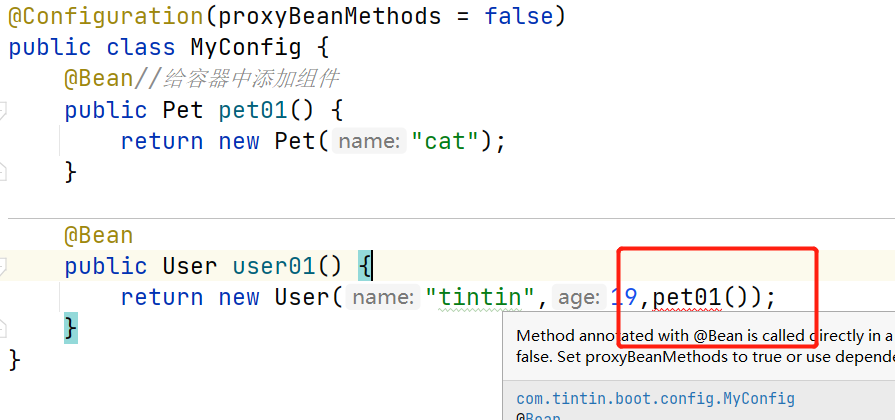

4. @Component、@Controller、@Service、@Repository

5. @ComponentScan、@Import

6. @Conditional

   条件装配：满足Conditional指定的条件，则进行组件注入

### 3.2.2 配置文件注入

@ImportResource

### 3.2.3 配置绑定

如何读取properties文件中的内容

* Propertiesl类 文件流读取

```java
public class getProperties {
     public static void main(String[] args) throws FileNotFoundException, IOException {
         Properties pps = new Properties();
         pps.load(new FileInputStream("a.properties"));
         Enumeration enum1 = pps.propertyNames();//得到配置文件的名字
         while(enum1.hasMoreElements()) {
             String strKey = (String) enum1.nextElement();
             String strValue = pps.getProperty(strKey);
             System.out.println(strKey + "=" + strValue);
             //封装到JavaBean。
         }
     }
 }
```

* @ConfigurationProperties(prefix="")+@Componant
  * 必须在扫描的组件类上声明
  * 根据前缀获取值并注入属性
* @EnableConfigurationProperties(Class class)+@ConfiurationProperties(prefix="")
  * 开启该组件的配置绑定功能
  * 把组件添加进容器中
  * 一般用于第三方的包类（其缺少配置绑定的注释）

## 3.3 自动配置原理入门

### 3.3.1 引导加载自动配置类

* @SpringBootApplication合成了以下三个注解

  ```java
  @Target({ElementType.TYPE})
  @Retention(RetentionPolicy.RUNTIME)
  @Documented
  @Inherited
  @SpringBootConfiguration
  @EnableAutoConfiguration
  @ComponentScan(
  ...
  )
  public @interface SpringBootApplication {
  ```

* @SpringBootConfiguration

  ```java
  @Target({ElementType.TYPE})
  @Retention(RetentionPolicy.RUNTIME)
  @Documented
  @Configuration//代表当前是一个配置类
  @Indexed
  public @interface SpringBootConfiguration {
  ```

* @ComponentScan

  ```
  指定扫描的包类
  ```

* @EnableAutoConfiguration

  ```java
  @Target({ElementType.TYPE})
  @Retention(RetentionPolicy.RUNTIME)
  @Documented
  @Inherited
  @AutoConfigurationPackage
  @Import({AutoConfigurationImportSelector.class})
  public @interface EnableAutoConfiguration {
  ```

  * @AutoConfigurationPackage 指定了默认的包规则

    ```java
    @Target({ElementType.TYPE})
    @Retention(RetentionPolicy.RUNTIME)
    @Documented
    @Inherited
    @Import({Registrar.class})
    //利用Registrar给容器导入一系列组件
    //将指定一个包（MainApplication所在包下）下的所有组件导入进来
    public @interface AutoConfigurationPackage {
        String[] basePackages() default {};
    
        Class<?>[] basePackageClasses() default {};
    }
    ```

  * @Import({AutoConfigurationImportSelector.class})

  1、利用getAutoConfigurationEntry(annotationMetadata);给容器中批量导入一些组件 

  2、调用`List<String> configurations = getCandidateConfigurations(annotationMetadata, attributes)`获取到所有需要导入到容器中的配置类

   3、利用工厂加载 `Map<String, List<String>> loadSpringFactories(@Nullable ClassLoader classLoader)；`得到所有的组件

   4、从META-INF/spring.factories位置来加载一个文件。 默认扫描我们当前系统里面所有META-INF/spring.factories位置的文件    spring-boot-autoconfigure-2.3.4.RELEASE.jar包里面也有META-INF/spring.factories    

文件里面写死了spring-boot一启动就要给容器中加载的所有配置类
spring-boot-autoconfigure-2.3.4.RELEASE.jar/META-INF/spring.factories

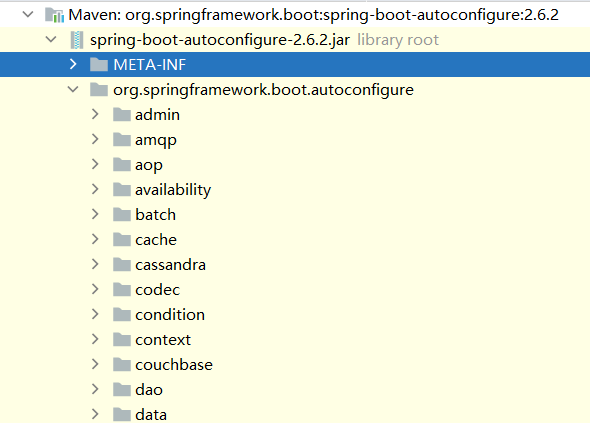

### 3.3.2 按需开启自动配置项

虽然我们127个场景的所有自动配置启动的时候默认全部加载。xxxxAutoConfiguration 按照条件装配规则（@Conditional），最终会按需配置。

### 3.3.3 修改默认配置

```java
        @Bean
@ConditionalOnBean(MultipartResolver.class)  //容器中有这个类型组件
		@ConditionalOnMissingBean(name = DispatcherServlet.MULTIPART_RESOLVER_BEAN_NAME) //容器中没有这个名字 multipartResolver 的组件
		public MultipartResolver multipartResolver(MultipartResolver resolver) {
            //给@Bean标注的方法传入了对象参数，这个参数的值就会从容器中找。
            //SpringMVC multipartResolver。防止有些用户配置的文件上传解析器不符合规范
			// Detect if the user has created a MultipartResolver but named it incorrectly
			return resolver;
		}
给容器中加入了文件上传解析器；
```

总结：

* SpringBoot先加载所有的自动配置类xxxxxAutoConfiguration
* 每个自动配置类按照条件进行生效，默认都会绑定配置文件指定的值。xxxxProperties里面拿。xxxProperties
  和配置文件进行了绑定
* 生效的配置类就会给容器中装配很多组件
* 只要容器中有这些组件，相当于这些功能就有了
* 定制化配置
  * 用户直接自己@Bean替换底层的组件
  * 用户去看这个组件是获取的配置文件什么值就去修改。
    XXXXXAutoConfiguration --->组件--->
    XXXXProperties里面拿值--->application.properties修

### 3.3.4 最佳实践

* 引入场景依赖（web、缓存、消息队列等）

  * [Developing with Spring Boot](https://docs.spring.io/spring-boot/docs/current/reference/html/using.html#using.build-systems.starters)

* 查看自动配置是否生效

  * 引入的场景一般都自动配置了

  * 开启debug模式 debug=true 获取自动配置报告CONDITIONS EVALUATION REPORT

    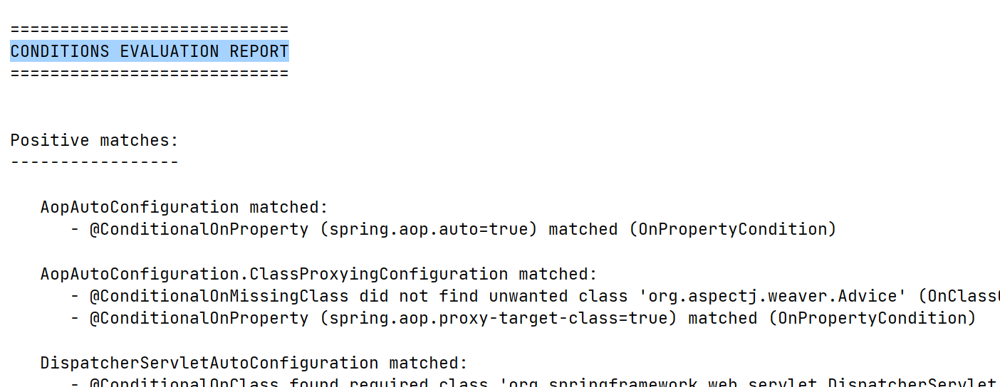

* 修改配置项
  * 参照文档修改[Common Application Properties (spring.io)](https://docs.spring.io/spring-boot/docs/current/reference/html/application-properties.html#application-properties)
  * 自定义加入或替换组件
    * @Bean
    * @Component
  * 自定义器 XXXCustomizer
  * .....

## 3.4 开发小技巧

### 3.4.1 Lombok

简化JavaBean开发

1. 安装lombok插件

2. 引入依赖

   ```xml
           <dependency>
               <groupId>org.projectlombok</groupId>
               <artifactId>lombok</artifactId>
           </dependency>
   ```

3. 使用Lombok

   

### 3.4.2 dev-tools

1. 引入依赖

   ```xml
   <dependency>
       <groupId>org.springframework.boot</groupId>
       <artifactId>spring-boot-devtools</artifactId>
       <optional>true</optional>
   </dependency>
   ```

2. 热更新、热部署无需重新启动（Reload）

   修改资源或者代码时，ctrt+f9

   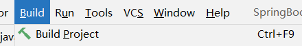

### 3.4.3 Spring-Initializr（Spring项目初始化向导）

1. 选择开发场景

2. 自动依赖注入

3. 自动创建项目结构

   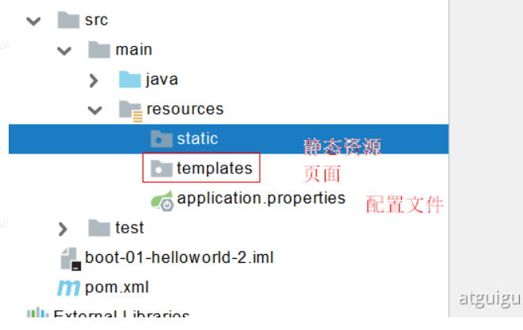

4. 自动编写主配置类

# 4 配置文件

## 4.1 文件类型

### 4.1.1 properties

### 4.1.2 yaml

*YAML*是"YAML Ain't a Markup Language"（YAML不是一种[标记语言](https://baike.baidu.com/item/标记语言)）的[递归缩写](https://baike.baidu.com/item/递归缩写)。在开发的这种语言时，*YAML* 的意思其实是："Yet Another Markup Language"（仍是一种[标记语言](https://baike.baidu.com/item/标记语言)），但为了强调这种语言以数据做为中心，而不是以标记语言为重点，而用反向缩略语重命名。

**基本语法**

* key: value；kv之间有空格
* 大小写敏感
* 使用缩进表示层级关系
* 缩进不允许使用tab，只允许空格
* 缩进的空格数不重要，只要相同层级的元素左对齐即可
* '#'表示注释
* 字符串无需加引号，如果要加，"与""表示字符串内容不会被转义，而‘与’标识字符串内容（如斜杠）会被转义

**数据类型**

```yml
person:
  username: tintin
  boss: true
  birth: 2000/04/27
  age: 22
  pet: 
    name: doge
    weight: 99.9
  interests: [soccer,singing,swimming] # 数组可以表示 array、list、queue
  animal: [elphant,ant,chicken]
  score:
    Math: [80,20,50]
    English: {first: 70, second: 80, third: 90 } # 键值对集合可以表示 map、hash、set、object
    Chinese:
      first: 59
      second: 40
  salaries: [2000.0, 3000.0, 4000.0]
  allPets:
    health:
      - {name: doge, weight: 99.9}
      - {name: catty, weight: 59.0}
    sick:
      - {name: doge, weight: 80.0}
      - {name: doge, weight: 70.0}
#    health:
#      - {name: doge,weight: 99.0}
#      - {name: cat,weight: 48.3}
#    sick:
#      - {name: doge2,weight: 88}
#      - {name: cat,weight: 50.0}


server:
  port: 8888 # 字面量

```

## 4.2 配置提示

当自定义的类和配置文件绑定时，没有提示

开启

```xml
        <dependency>
            <groupId>org.springframework.boot</groupId>
            <artifactId>spring-boot-configuration-processor</artifactId>
            <optional>true</optional>
        </dependency>
```

# 5 Web开发

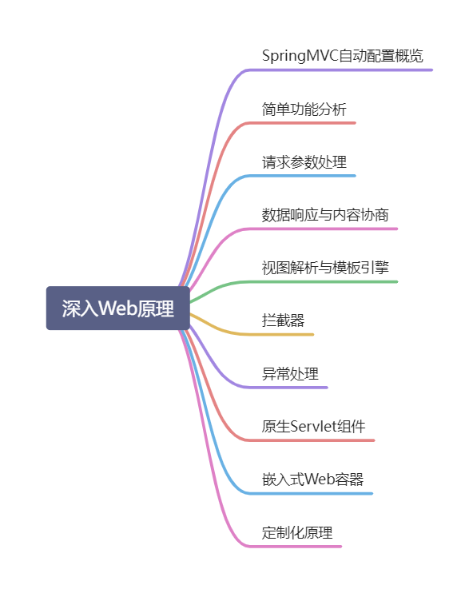

## 5.1 SpringMVC配置概览

Spring Boot provides auto-configuration for Spring MVC that works well with most applications.( 大多场景我们都无需自定义配置)

自动配置在Spring的默认值之上添加了以下功能：

* 包含   `ContentNegotiatingViewResolver`   和   `BeanNameViewResolver`    bean
  * 内容协商视图解析器和BeanName视图解析器
* 支持提供静态资源，包括对 WebJar 的支持
  * 静态资源（包括webjars）
* 自动注册转换器、泛型转换器和格式化器 bean
  * 自动注册 `Converter`，`GenericConverter`，`Formatter `
* 支持   `HttpMessageConverters `
  * 支持 `HttpMessageConverters` （配合内容协商理解原理）
* 自动注册消息代码解析器
  * 自动注册 `MessageCodesResolver` （国际化用）
* 静态索引.html支持 
  * 静态index.html 页支持
* 自定义图标支持
  * 自定义 `Favicon`  
* 自动使用`可配置的 WebBinding初始化器` Bean
  * 自动使用 `ConfigurableWebBindingInitializer `，（DataBinder负责将请求数据绑定到JavaBean上）

> 如果要保留这些 Spring Boot MVC 自定义项并进行更多[MVC 自定义](https://docs.spring.io/spring/docs/5.2.9.RELEASE/spring-framework-reference/web.html#mvc)（拦截器、格式化程序、视图控制器和其他功能），则可以添加自己的`@Configuration`类`WebMvcConfigurer`   类型，但不用`@EnableWebMvc`。
> 不用`@EnableWebMvc`注解。 使用 `@Configuration` + `WebMvcConfigurer `自定义规则

> 如果要提供   `RequestMappingHandlerMapping`    、`RequestMappingHandlerAdapter`或   `ExceptionHandlerExceptionResolver`的自定义实例，并且仍保留 Spring Boot MVC 自定义项，则可以声明WebMvcRegistrations类型的 Bean，并使用它来提供这些组件的自定义实例。
> 声明 `WebMvcRegistrations` 改变默认底层组件

> 如果你想完全控制Spring MVC，你可以添加你自己的`@Configuration`用`@EnableWebMvc`进行注释，或者添加你自己的`@Configuration`-注释的委派WebMvc配置，如`@EnableWebMvc`的Javadoc中所述。
> 使用 `@EnableWebMvc`+`@Configuration`+`DelegatingWebMvcConfiguration` 全面接管SpringMVC

## 5.2 简单功能

### 5.2.1 静态资源访问

**静态资源目录**

只要静态资源放在类路径下： called /static (or /public or /resources or /META-INF/resources
访问 ： 当前项目根路径/ + 静态资源名 

原理： 静态映射/**。
请求进来，先去找Controller看能不能处理。不能处理的所有请求又都交给静态资源处理器。静态资源也找不到则响应404页面。

springmvc配置

```xml
    <!--开放静态资源访问-->
    <mvc:default-servlet-handler/>
```

改变默认的静态资源路径

```yml
spring:
  web:
    resources:
      static-locations: classpath:/static/
```

**静态资源访问前缀**

```yml
spring:
  mvc:
    static-path-pattern: /res/** # default

```

**支持webjars**

[WebJars - Web Libraries in Jars](https://www.webjars.org/)

```xml

        <dependency>
            <groupId>org.webjars</groupId>
            <artifactId>jquery</artifactId>
            <version>3.5.1</version>
        </dependency>
```

访问地址映射：/webjars/**  后面地址要按照依赖里面的包路径

### 5.2.2 欢迎页支持

* 静态资源路径下  index.html

  * 可以配置静态资源路径

  * 但是配置静态资源的访问前缀会导致 index.html不能被默认访问

* controller处理/index

### 5.2.3 自定义Favicon

favicon.ico 放在静态资源目录下即可

### 5.2.4 静态资源配置原理

* SpringBoot启动默认加载xxxAutoConfiguration(自动配置类)

* SpringMVC功能的自动配置类WebMvcAutoConfiguration生效

  ```java
  @Configuration(
      proxyBeanMethods = false
  )
  @ConditionalOnWebApplication(
      type = Type.SERVLET
  )
  @ConditionalOnClass({Servlet.class, DispatcherServlet.class, WebMvcConfigurer.class})
  @ConditionalOnMissingBean({WebMvcConfigurationSupport.class})
  @AutoConfigureOrder(-2147483638)
  @AutoConfigureAfter({DispatcherServletAutoConfiguration.class, TaskExecutionAutoConfiguration.class, ValidationAutoConfiguration.class})
  public class WebMvcAutoConfiguration {
  ```

  * 内部类WebMvcAutoConfigurationAdapter生效

  ```java
      @Configuration(
          proxyBeanMethods = false
      )
      @Import({WebMvcAutoConfiguration.EnableWebMvcConfiguration.class})
      @EnableConfigurationProperties({WebMvcProperties.class, WebProperties.class})
  //绑定了相关的属性 spring.mvc spring.web
      @Order(0)
      public static class WebMvcAutoConfigurationAdapter implements WebMvcConfigurer, ServletContextAware {
  ```

  * 配置功能如下

  **其有参构造器所有参数的值来源于容器**

  ```java
  public WebMvcAutoConfigurationAdapter(WebProperties webProperties, WebMvcProperties mvcProperties, ListableBeanFactory beanFactory, ObjectProvider<HttpMessageConverters> messageConvertersProvider, ObjectProvider<WebMvcAutoConfiguration.ResourceHandlerRegistrationCustomizer> resourceHandlerRegistrationCustomizerProvider, ObjectProvider<DispatcherServletPath> dispatcherServletPath, ObjectProvider<ServletRegistrationBean<?>> servletRegistrations) {
              this.resourceProperties = webProperties.getResources();//获取spring.web.resources所有值的对象
              this.mvcProperties = mvcProperties;//获取spring.mvc所有值的对象
              this.beanFactory = beanFactory;
              this.messageConvertersProvider = messageConvertersProvider;
              this.resourceHandlerRegistrationCustomizer = (WebMvcAutoConfiguration.ResourceHandlerRegistrationCustomizer)resourceHandlerRegistrationCustomizerProvider.getIfAvailable();//资源处理器的自定义器
              this.dispatcherServletPath = dispatcherServletPath;//前端控制器
              this.servletRegistrations = servletRegistrations;//给应用注册Servlet、Filter
              this.mvcProperties.checkConfiguration();
          }
  ```

  **资源处理的默认规则**

  ```java
  public void addResourceHandlers(ResourceHandlerRegistry registry) {
              if (!this.resourceProperties.isAddMappings()) {//通过spring.web.resources.add-mapping可以设置是否开启默认的资源处理器
                  logger.debug("Default resource handling disabled");
              } else {
                  this.addResourceHandler(registry, "/webjars/**", "classpath:/META-INF/resources/webjars/");//关于webjars的映射
                  this.addResourceHandler(registry, this.mvcProperties.getStaticPathPattern(), (registration) -> {
                      registration.addResourceLocations(this.resourceProperties.getStaticLocations());
                      if (this.servletContext != null) {
                          ServletContextResource resource = new ServletContextResource(this.servletContext, "/");
                          registration.addResourceLocations(new Resource[]{resource});
                      }
  
                  });
              }
          }
  ```

  ```java
      public static class Resources {//若不配置spring.web.resources.static-locations 则默认如下四个路径
          private static final String[] CLASSPATH_RESOURCE_LOCATIONS = new String[]{"classpath:/META-INF/resources/", "classpath:/resources/", "classpath:/static/", "classpath:/public/"};
          private String[] staticLocations;
  ```

  **欢迎页的处理规则**

```java
        @Bean
        public WelcomePageHandlerMapping welcomePageHandlerMapping(ApplicationContext applicationContext, FormattingConversionService mvcConversionService, ResourceUrlProvider mvcResourceUrlProvider) {
            WelcomePageHandlerMapping welcomePageHandlerMapping = new WelcomePageHandlerMapping(new TemplateAvailabilityProviders(applicationContext), applicationContext, this.getWelcomePage(), this.mvcProperties.getStaticPathPattern());
            welcomePageHandlerMapping.setInterceptors(this.getInterceptors(mvcConversionService, mvcResourceUrlProvider));
            welcomePageHandlerMapping.setCorsConfigurations(this.getCorsConfigurations());
            return welcomePageHandlerMapping;
        }

    WelcomePageHandlerMapping(TemplateAvailabilityProviders templateAvailabilityProviders, ApplicationContext applicationContext, Resource welcomePage, String staticPathPattern) {
        if (welcomePage != null && "/**".equals(staticPathPattern)) {//保证存在index.html静态资源，且自定义静态资源url格式
            logger.info("Adding welcome page: " + welcomePage);
            this.setRootViewName("forward:index.html");
        } else if (this.welcomeTemplateExists(templateAvailabilityProviders, applicationContext)) {
            logger.info("Adding welcome page template: index");
            this.setRootViewName("index");
        }

    }
```

## 5.3 请求参数处理

### 5.3.1 请求映射

**rest使用与原理**

* @xxxMapping

* Rest风格支持

  * 以前 /getUser  获取用户    /deleteUser 删除用户   /editUser  修改用户      /saveUser 保存用户
  * 现在

  ```java
  @GetMapping("/user")
      public String getUser() {
          return "GET-tintin";
      }
  
      @PostMapping("/user")
      public String postUser() {
          return "POST-tintin";
      }
  
      @DeleteMapping("/user")
      public String deleteUser() {
          return "DELETE-tintin";
      }
  
      @PutMapping("/user")
      public String putUser() {
          return "PUT-tintin";
      }
  ```

  

* 核心 HiddenHttpMethodFilter

  * 解决表单中无法发送delete、put请求问题
  * 默认为false，需手动开启

  ```java
      @Bean @ConditionalOnMissingBean({HiddenHttpMethodFilter.class})
      @ConditionalOnProperty(
          prefix = "spring.mvc.hiddenmethod.filter",
          name = {"enabled"}
      )
      public OrderedHiddenHttpMethodFilter hiddenHttpMethodFilter() {
          return new OrderedHiddenHttpMethodFilter();
      }
  ```

* Rest原理

  * 表单提交带上隐藏域 _method=put
  * 通过配置类可以自定义添加一个HiddenHttpMethodFilter，利用set更改隐藏域名字；
  * 请求时被拦截器HiddenHttpMethodFilter拦截
  * 核心方法

  ```java
     protected void doFilterInternal(HttpServletRequest request, HttpServletResponse response, FilterChain filterChain) throws ServletException, IOException {
          HttpServletRequest requestToUse = request;
         //原生POST请求
          if ("POST".equals(request.getMethod()) && request.getAttribute("javax.servlet.error.exception") == null) {
              String paramValue = request.getParameter(this.methodParam);//获取隐藏域_method
              if (StringUtils.hasLength(paramValue)) {
                  String method = paramValue.toUpperCase(Locale.ENGLISH);//转为大写
                  if (ALLOWED_METHODS.contains(method)) {//判断是否PUT、DELETE、PATCH请求
                      requestToUse = new HiddenHttpMethodFilter.HttpMethodRequestWrapper(request, method);
                      //原生request（post），包装模式requesWrapper重写了getMethod方法，返回的是传入的值。
  				   //过滤器链放行的时候用wrapper。以后的方法调用getMethod是调用requesWrapper的。
                  }
              }
          }
  
          filterChain.doFilter((ServletRequest)requestToUse, response);
      }
  	//兼容PUT、DELETE、PATCH请求
  	static {
          ALLOWED_METHODS = Collections.unmodifiableList(Arrays.asList(HttpMethod.PUT.name(), HttpMethod.DELETE.name(), HttpMethod.PATCH.name()));
      }
  ```

**Rest使用客户端工具**

如PostMan直接发送Put、delete等方式请求，无需Filter。

**请求映射原理**

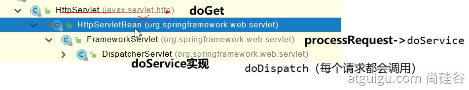

核心方法：DispatcherServlet.doDispatch()

```java
protected void doDispatch(HttpServletRequest request, HttpServletResponse response) throws Exception {
        HttpServletRequest processedRequest = request;
        HandlerExecutionChain mappedHandler = null;
        boolean multipartRequestParsed = false;
        WebAsyncManager asyncManager = WebAsyncUtils.getAsyncManager(request);

        try {
            try {
                ModelAndView mv = null;
                Object dispatchException = null;

                try {
                    processedRequest = this.checkMultipart(request);
                    multipartRequestParsed = processedRequest != request;
                    //找到当前的请求使用哪个Handler（Controller方法）处理
                    mappedHandler = this.getHandler(processedRequest);
```

前端控制器内置默认有5个的handlerMappings，保存了对应handler的映射规则

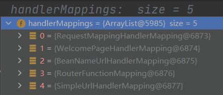

其中，RequestMappingHandlerMapping：保存了所有@RequestMapping 和handler的映射规则。如下

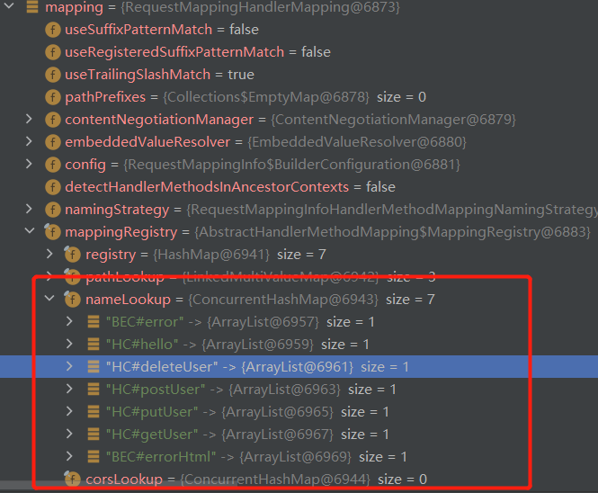

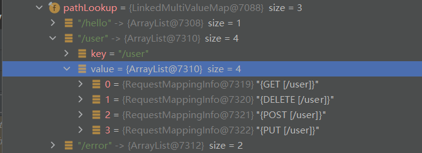

通过迭代器，逐个获取requestMapping对应的handler(类型不定，如HandlerMethod)，成功即将其包装成HandlerExecutionChain

所有的请求映射都在HandlerMapping中。

* SpringBoot自动配置欢迎页的 WelcomePageHandlerMapping 。访问 /能访问到index.html；
* SpringBoot自动配置了默认 的 RequestMappingHandlerMapping
* 请求进来，挨个尝试所有的HandlerMapping看是否有请求信息。
  * 如果有就找到这个请求对应的handler
  * 如果没有就是下一个 HandlerMapping
* 我们需要一些自定义的映射处理，我们也可以自己给容器中放HandlerMapping。自定义 HandlerMapping

```java
@Nullable
    protected HandlerExecutionChain getHandler(HttpServletRequest request) throws Exception {
        if (this.handlerMappings != null) {
            Iterator var2 = this.handlerMappings.iterator();

            while(var2.hasNext()) {
                HandlerMapping mapping = (HandlerMapping)var2.next();
                HandlerExecutionChain handler = mapping.getHandler(request);
                if (handler != null) {
                    return handler;
                }
            }
        }

        return null;
    }
```

### 5.3.2 普通参数与基本注解

**注解**

@PathVariable、@RequestHeader、@RequestParam\@CookieValue

```java
@GetMapping("/car/{id}/owner/{username}")
    public Map<String,Object> getCar(@PathVariable("id") Integer id,
                                     @PathVariable("username") String name,
                                     @PathVariable Map<String,String> pv,//可将占位符和值 封装为map
                                     @RequestHeader("User-Agent") String userAgent,
                                     @RequestHeader Map<String,String> header,//可获取全部请求头
                                     @RequestParam("age") Integer age,
                                     @RequestParam("inters") List<String> inters,//含多个值的参数
                                     @RequestParam Map<String,String> params,//可获取全部请求参数
                                     @CookieValue("isvipretainend") String isvipretainend,
                                     @CookieValue("isvipretainend") Cookie cookie){//直接获取对应cookie


        Map<String,Object> map = new HashMap<>();

//        map.put("id",id);
//        map.put("name",name);
//        map.put("pv",pv);
//        map.put("userAgent",userAgent);
//        map.put("headers",header);
        map.put("age",age);
        map.put("inters",inters);
        map.put("params",params);
        map.put("isvipretainend",isvipretainend);
        System.out.println(cookie.getName()+"===>"+cookie.getValue());
        return map;
    }
```

@RequestBody

```java
@PostMapping("/save")
    public Map postMethod(@RequestBody String content){//将post请求的表单数据（请求体）返回
        Map<String,Object> map = new HashMap<>();
        map.put("content",content);
        return map;
    }
```

@RequestAttribute

```java
    @GetMapping("/goto")
    public String goToPage(HttpServletRequest request) {
        request.setAttribute("msg","success");
        request.setAttribute("code",200);
        return "forward:/success";//以"forward:"为前缀，则创建转发视图InternalResourceView，
        //不能直接跳转到指定的页面，而只能转发某一个请求
    }

    @ResponseBody
    @GetMapping("/success")
    public String success(@RequestAttribute("anotation_msg") String Anotation_msg,
                          @RequestAttribute("code") Integer code,//注解方式取得请求域属性
                          HttpServletRequest request) {//取得原生request
        Object API_msg = request.getAttribute("msg");//由原生request中获得请求域属性
        return API_msg + Anotation_msg + ":" + code;
    }
```

@ModelAttribute

@MatrixVariable

/cars/{path}?xxx=xxx&aaa=ccc queryString 查询字符串。@RequestParam；
/cars/sell;low=34;brand=byd,audi,yd ；矩阵变量

页面开发，cookie禁用了，session里面的内容怎么使用； session.set(a,b)---> jsessionid ---> cookie ----> 每次发请求携带。 url重写：/abc;jsesssionid=xxxx 把cookie的值使用矩阵变量的方式进行传递.

```java
//1、语法： 请求路径：/cars/sell;low=34;brand=byd,audi,yd
//2、SpringBoot默认是禁用了矩阵变量的功能
//      手动开启：原理。对于路径的处理。UrlPathHelper进行解析。
//              removeSemicolonContent（移除分号内容）支持矩阵变量的
//3、矩阵变量必须有url路径变量才能被解析
@GetMapping("/cars/{path}")
public Map carsSell(@MatrixVariable("low") Integer low,
                    @MatrixVariable("brand") List<String> brand,
                    @PathVariable("path") String path){
    Map<String,Object> map = new HashMap<>();

    map.put("low",low);
    map.put("brand",brand);
    map.put("path",path);
    return map;
}

// /boss/1;age=20/2;age=10

@GetMapping("/boss/{bossId}/{empId}")
public Map boss(@MatrixVariable(value = "age",pathVar = "bossId") Integer bossAge,
                @MatrixVariable(value = "age",pathVar = "empId") Integer empAge){
    Map<String,Object> map = new HashMap<>();

    map.put("bossAge",bossAge);
    map.put("empAge",empAge);
    return map;

}
```

开启矩阵变量的功能

```java
//2.6.2版本               WebMvcAutoConfigurationAdapter.configurePathMatch（）调用
//urlPathHelper.setAlwaysUseFullPath(true); 无需开启
```

```java
//一个自定义web功能的方法 `@Configuration` + `WebMvcConfigurer `自定义规则
@Configuration
public class MyWebConfig {
    @Bean
    public WebMvcConfigurer webMvcConfigurer() {
        WebMvcConfigurer webMvcConfigurer = new WebMvcConfigurer(){
            public void configurePathMatch(PathMatchConfigurer configurer) {
                UrlPathHelper urlPathHelper = new UrlPathHelper();
//                urlPathHelper.setAlwaysUseFullPath(true);
                urlPathHelper.setRemoveSemicolonContent(false);
                configurer.setUrlPathHelper(urlPathHelper);
            }
        };
        
        return webMvcConfigurer;
    }

}
```

**ServletAPI**

WebRequest、ServletRequest、MultipartRequest、 HttpSession、javax.servlet.http.PushBuilder、Principal、InputStream、Reader、HttpMethod、Locale、TimeZone、ZoneId

```java
@Override
	public boolean supportsParameter(MethodParameter parameter) {
		Class<?> paramType = parameter.getParameterType();
		return (WebRequest.class.isAssignableFrom(paramType) ||
				ServletRequest.class.isAssignableFrom(paramType) ||
				MultipartRequest.class.isAssignableFrom(paramType) ||
				HttpSession.class.isAssignableFrom(paramType) ||
				(pushBuilder != null && pushBuilder.isAssignableFrom(paramType)) ||
				Principal.class.isAssignableFrom(paramType) ||
				InputStream.class.isAssignableFrom(paramType) ||
				Reader.class.isAssignableFrom(paramType) ||
				HttpMethod.class == paramType ||
				Locale.class == paramType ||
				TimeZone.class == paramType ||
				ZoneId.class == paramType);
	}
```

**复杂参数**

Map、Model（map、model里面的数据会被放在request的请求域  request.setAttribute）、Errors/BindingResult、RedirectAttributes（ 重定向携带数据）、ServletResponse（response）、SessionStatus、UriComponentsBuilder、ServletUriComponentsBuilder

```java
    @Nullable
    public Object resolveArgument(MethodParameter parameter, @Nullable ModelAndViewContainer mavContainer, NativeWebRequest webRequest, @Nullable WebDataBinderFactory binderFactory) throws Exception {
        Assert.state(mavContainer != null, "ModelAndViewContainer is required for model exposure");
        return mavContainer.getModel();//Map、Model类型的参数，会返回 mavContainer.getModel（）；---> //BindingAwareModelMap 是Model 也是Map
//mavContainer.getModel(); 获取到值的
    }
```

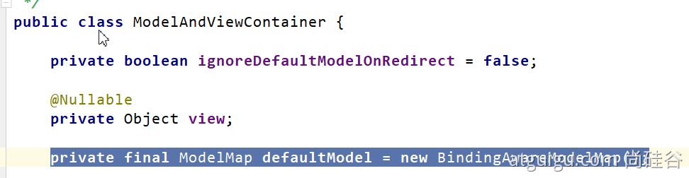

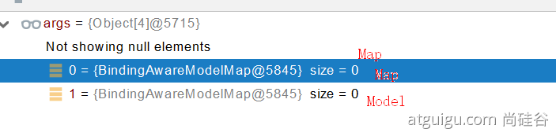

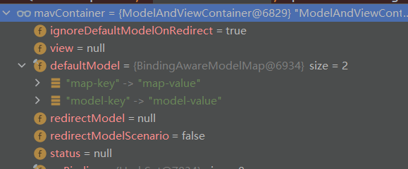

### 5.3.3 POJO封装过程

**ServletModelAttributeMethodProcessor**

### 5.3.4 参数处理原理

1. handlerAdapter

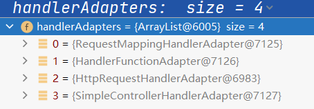

0 - 支持方法上标注@RequestMapping 
1 - 支持函数式编程的
xxxxxx

```java
				HandlerAdapter ha = getHandlerAdapter(mappedHandler.getHandler());//由HandlerExecutionChain mappedHandler 获取原生的 Object handler 并封装成HandlerAdapter ha

```


2. 执行目标方法

```java
// Actually invoke the handler.
mv = ha.handle(processedRequest, response, mappedHandler.getHandler());

```

```java
mav = invokeHandlerMethod(request, response, handlerMethod);

//获取参数			
Object returnValue = invokeForRequest(webRequest, mavContainer, providedArgs);
//获取方法的参数值，下方5.详细介绍
Object[] args = this.getMethodArgumentValues(request, mavContainer, providedArgs);

//先逐个测试是否支持27个参数解析器，
Object[] args = new Object[parameters.length];
	for(int i = 0; i < parameters.length; ++i) {
		if (!this.resolvers.supportsParameter(parameter)) {//若支持则将解析器存入缓存argumentResolverCache
		args[i] = this.resolvers.resolveArgument(parameter, mavContainer, request, this.dataBinderFactory);//由argumentResolverCache中获取解析器，并解析参数获得参数值


```


3. 参数解析器27个

作用：确定将要执行的目标方法的每一个参数的值是什么;
SpringMVC目标方法能写多少种参数类型。取决于参数解析器。

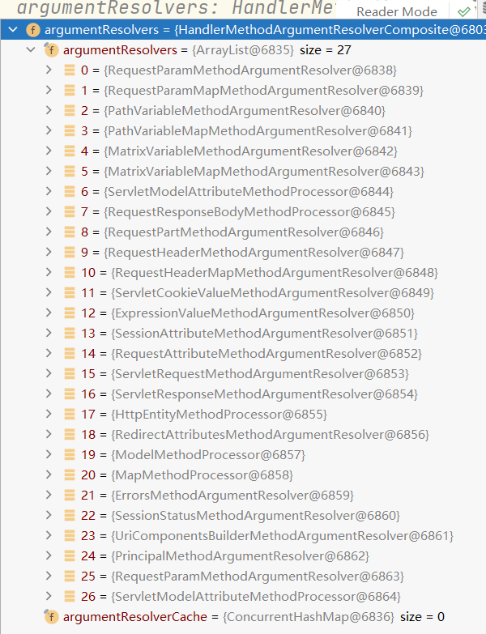

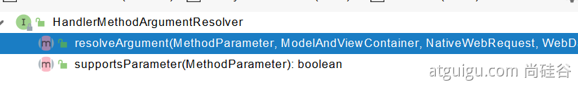

两个核心方法

当前解析器是否支持解析这种参数supportsParameter

支持就调用 resolveArgument

4. 返回值处理器15个

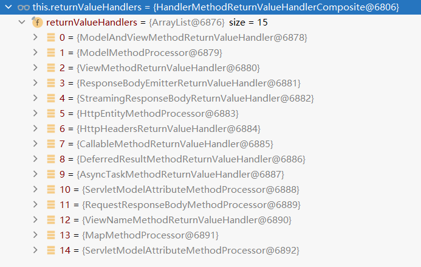

5. 如何确定目标方法每一个参数的值

```java
============InvocableHandlerMethod==========================
protected Object[] getMethodArgumentValues(NativeWebRequest request, @Nullable ModelAndViewContainer mavContainer,
			Object... providedArgs) throws Exception {

		MethodParameter[] parameters = getMethodParameters();
		if (ObjectUtils.isEmpty(parameters)) {
			return EMPTY_ARGS;
		}

		Object[] args = new Object[parameters.length];
		for (int i = 0; i < parameters.length; i++) {
			MethodParameter parameter = parameters[i];
			parameter.initParameterNameDiscovery(this.parameterNameDiscoverer);
			args[i] = findProvidedArgument(parameter, providedArgs);
			if (args[i] != null) {
				continue;
			}
			if (!this.resolvers.supportsParameter(parameter)) {//挨个判断参数是否被某个参数解析器支持
				throw new IllegalStateException(formatArgumentError(parameter, "No suitable resolver"));
			}
			try {
				args[i] = this.resolvers.resolveArgument(parameter, mavContainer, request, this.dataBinderFactory);//解析参数值
			}
			catch (Exception ex) {
				// Leave stack trace for later, exception may actually be resolved and handled...
				if (logger.isDebugEnabled()) {
					String exMsg = ex.getMessage();
					if (exMsg != null && !exMsg.contains(parameter.getExecutable().toGenericString())) {
						logger.debug(formatArgumentError(parameter, exMsg));
					}
				}
				throw ex;
			}
		}
		return args;
	}
```

​	挨个判断参数是否被某个参数解析器支持

```java
	@Nullable
	private HandlerMethodArgumentResolver getArgumentResolver(MethodParameter parameter) {
		HandlerMethodArgumentResolver result = this.argumentResolverCache.get(parameter);
		if (result == null) {
			for (HandlerMethodArgumentResolver resolver : this.argumentResolvers) {
				if (resolver.supportsParameter(parameter)) {
					result = resolver;
					this.argumentResolverCache.put(parameter, result);//找到支持的参数解析器则存入缓存
					break;
				}
			}
		}
		return result;
	}
```

​	解析参数值

调用各自 HandlerMethodArgumentResolver 的 resolveArgument 方法即可

```java
    @Nullable
    public Object resolveArgument(MethodParameter parameter, @Nullable ModelAndViewContainer mavContainer, NativeWebRequest webRequest, @Nullable WebDataBinderFactory binderFactory) throws Exception {
        HandlerMethodArgumentResolver resolver = this.getArgumentResolver(parameter);//由缓存中获取参数解析器
        if (resolver == null) {
            throw new IllegalArgumentException("Unsupported parameter type [" + parameter.getParameterType().getName() + "]. supportsParameter should be called first.");
        } else {
            return resolver.resolveArgument(parameter, mavContainer, webRequest, binderFactory);//解析参数值
        }
    }
```

自定义类型参数 封装POJO

ServletModelAttributeMethodProcessor  这个参数处理器支持
 判断参数是否为简单类型。

```java
    public static boolean isSimpleValueType(Class<?> type) {
        return Void.class != type && Void.TYPE != type && (ClassUtils.isPrimitiveOrWrapper(type) || Enum.class.isAssignableFrom(type) || CharSequence.class.isAssignableFrom(type) || Number.class.isAssignableFrom(type) || Date.class.isAssignableFrom(type) || Temporal.class.isAssignableFrom(type) || URI.class == type || URL.class == type || Locale.class == type || Class.class == type);
    }
```

```java
@Override
	@Nullable
	public final Object resolveArgument(MethodParameter parameter, @Nullable ModelAndViewContainer mavContainer,
			NativeWebRequest webRequest, @Nullable WebDataBinderFactory binderFactory) throws Exception {

		Assert.state(mavContainer != null, "ModelAttributeMethodProcessor requires ModelAndViewContainer");
		Assert.state(binderFactory != null, "ModelAttributeMethodProcessor requires WebDataBinderFactory");

		String name = ModelFactory.getNameForParameter(parameter);
		ModelAttribute ann = parameter.getParameterAnnotation(ModelAttribute.class);
		if (ann != null) {//判断该参数是否标注了注解
			mavContainer.setBinding(name, ann.binding());
		}

		Object attribute = null;
		BindingResult bindingResult = null;

		if (mavContainer.containsAttribute(name)) {//判断model域里是否是否含有同名属性
			attribute = mavContainer.getModel().get(name);
		}
		else {
			// Create attribute instance
			try {
				attribute = createAttribute(name, parameter, binderFactory, webRequest);
			}
			catch (BindException ex) {
				if (isBindExceptionRequired(parameter)) {
					// No BindingResult parameter -> fail with BindException
					throw ex;
				}
				// Otherwise, expose null/empty value and associated BindingResult
				if (parameter.getParameterType() == Optional.class) {
					attribute = Optional.empty();
				}
				bindingResult = ex.getBindingResult();
			}
		}

		if (bindingResult == null) {
			// Bean property binding and validation;
			// skipped in case of binding failure on construction.
			WebDataBinder binder = binderFactory.createBinder(webRequest, attribute, name);//web数据绑定器，将请求参数的值绑定到指定的JavaBean里面 利用它里面的 Converters 将请求数据转成指定的数据类型。再次封装到JavaBean中
			if (binder.getTarget() != null) {//判断目标数据是否为空
				if (!mavContainer.isBindingDisabled(name)) {
					bindRequestParameters(binder, webRequest);//转换数据类型 并给返回对象赋值
				}
				validateIfApplicable(binder, parameter);
				if (binder.getBindingResult().hasErrors() && isBindExceptionRequired(binder, parameter)) {
					throw new BindException(binder.getBindingResult());
				}
			}
			// Value type adaptation, also covering java.util.Optional
			if (!parameter.getParameterType().isInstance(attribute)) {
				attribute = binder.convertIfNecessary(binder.getTarget(), parameter.getParameterType(), parameter);
			}
			bindingResult = binder.getBindingResult();
		}

		// Add resolved attribute and BindingResult at the end of the model
		Map<String, Object> bindingResultModel = bindingResult.getModel();
		mavContainer.removeAttributes(bindingResultModel);
		mavContainer.addAllAttributes(bindingResultModel);

		return attribute;
	}
```

更底层 GenericConversionService：在设置每一个值的时候，找它里面的所有converter那个可以将这个数据类型（request带来参数的字符串）转换到指定的类型（JavaBean -- Integer）
byte -- > file

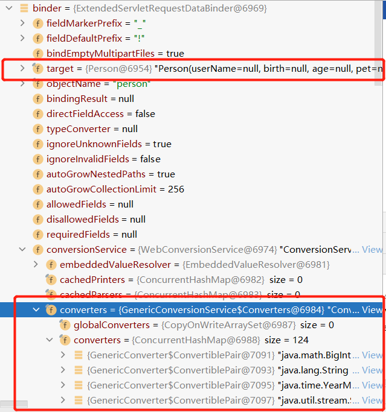

未来我们可以给WebDataBinder里面放自己的Converter；
`private static final class StringToNumber<T extends Number> implements Converter<String, T>`

自定义converter后，converters数量由124变为125

```java
    @Bean
    public WebMvcConfigurer webMvcConfigurer() {
        WebMvcConfigurer webMvcConfigurer = new WebMvcConfigurer(){
            public void configurePathMatch(PathMatchConfigurer configurer) {
                UrlPathHelper urlPathHelper = new UrlPathHelper();
                urlPathHelper.setAlwaysUseFullPath(false);
//                urlPathHelper.setRemoveSemicolonContent(false);
                configurer.setUrlPathHelper(urlPathHelper);
            }

            public void addFormatters(FormatterRegistry registry) {
                Converter converter = new Converter<String, Pet>() {

                    @Override
                    public Pet convert(String source) {//转换规则在此
                        //阿猫，3
                        if (!StringUtils.isEmpty(source)) {
                            String[] split = source.split(",");
                            Pet pet = new Pet();
                            pet.setAge(Integer.parseInt(split[1]));
                            pet.setName(split[0]);
                            return pet;
                        }
                        return null;
                    }
                };
                registry.addConverter(converter);
            }
        };

        return webMvcConfigurer;
    }
```

6. 目标方法执行完

将所有的数据都放在 ModelAndViewContainer；包含要去的页面地址View。还包含Model数据

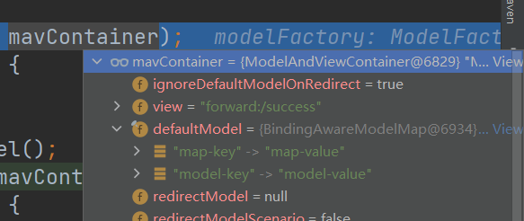

```java
	//此处以ViewNameMethodReturnValueHandler返回值处理器为例
    public void handleReturnValue(@Nullable Object returnValue, MethodParameter returnType, ModelAndViewContainer mavContainer, NativeWebRequest webRequest) throws Exception {
        if (returnValue instanceof CharSequence) {
            String viewName = returnValue.toString();
            mavContainer.setViewName(viewName);
            if (this.isRedirectViewName(viewName)) {//是否为重定向视图
                mavContainer.setRedirectModelScenario(true);
            }
        } else if (returnValue != null) {
            throw new UnsupportedOperationException("Unexpected return type: " + returnType.getParameterType().getName() + " in method: " + returnType.getMethod());
        }

    }
```

7. 处理派发结果

   ```java
   			processDispatchResult(processedRequest, response, mappedHandler, mv, dispatchException);
   
   ```

   

renderMergedOutputModel(mergedModel, getRequestToExpose(request), response);

```java
InternalResourceView：
@Override
	protected void renderMergedOutputModel(
			Map<String, Object> model, HttpServletRequest request, HttpServletResponse response) throws Exception {

		// Expose the model object as request attributes.
		exposeModelAsRequestAttributes(model, request);

		// Expose helpers as request attributes, if any.
		exposeHelpers(request);

		// Determine the path for the request dispatcher.
		String dispatcherPath = prepareForRendering(request, response);

		// Obtain a RequestDispatcher for the target resource (typically a JSP).
		RequestDispatcher rd = getRequestDispatcher(request, dispatcherPath);
		if (rd == null) {
			throw new ServletException("Could not get RequestDispatcher for [" + getUrl() +
					"]: Check that the corresponding file exists within your web application archive!");
		}

		// If already included or response already committed, perform include, else forward.
		if (useInclude(request, response)) {
			response.setContentType(getContentType());
			if (logger.isDebugEnabled()) {
				logger.debug("Including [" + getUrl() + "]");
			}
			rd.include(request, response);
		}

		else {
			// Note: The forwarded resource is supposed to determine the content type itself.
			if (logger.isDebugEnabled()) {
				logger.debug("Forwarding to [" + getUrl() + "]");
			}
			rd.forward(request, response);
		}
	}
```

```java
暴露模型作为请求域属性
// Expose the model object as request attributes.
		exposeModelAsRequestAttributes(model, request);
```

```java
protected void exposeModelAsRequestAttributes(Map<String, Object> model,
			HttpServletRequest request) throws Exception {

    //model中的所有数据遍历挨个放在请求域中
		model.forEach((name, value) -> {
			if (value != null) {
				request.setAttribute(name, value);
			}
			else {
				request.removeAttribute(name);
			}
		});
	}
```

## 5.4 数据响应与内容协商

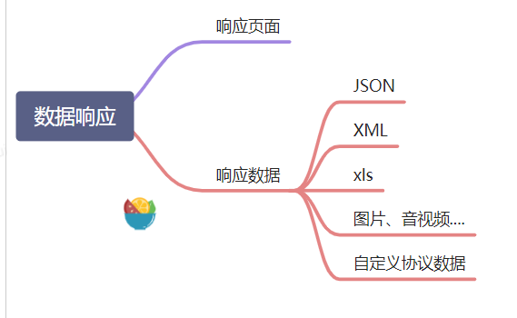

### 5.4.1 响应JSON

**jackson依赖**

```xml
	<dependency>
            <groupId>org.springframework.boot</groupId>
            <artifactId>spring-boot-starter-web</artifactId>
     </dependency>
        
    <dependency>
      <groupId>org.springframework.boot</groupId>
      <artifactId>spring-boot-starter-json</artifactId>
      <version>2.6.2</version>
      <scope>compile</scope>
    </dependency>
```

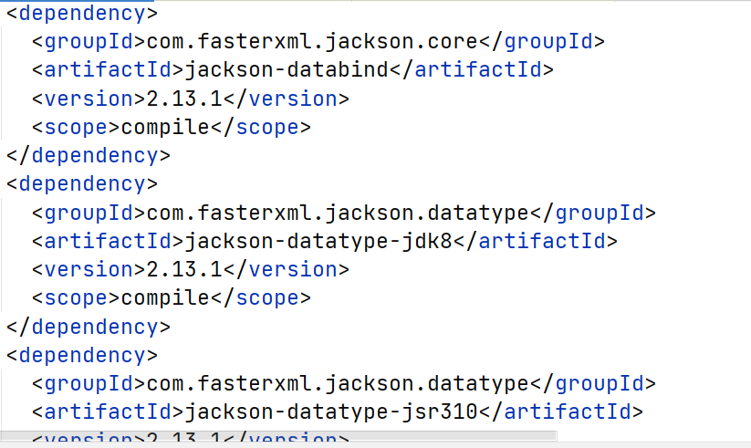

给前端自动返回json数据；

**返回值解析器**


```java
		try {
			this.returnValueHandlers.handleReturnValue(
					returnValue, getReturnValueType(returnValue), mavContainer, webRequest);
		}
```

```java
public void handleReturnValue(@Nullable Object returnValue, MethodParameter returnType, 		  		ModelAndViewContainer mavContainer, NativeWebRequest webRequest) throws Exception {
    HandlerMethodReturnValueHandler handler = this.selectHandler(returnValue, returnType);//找出异步返回值
    if (handler == null) {
        throw new IllegalArgumentException("Unknown return value type: " + returnType.getParameterType().getName());
    } else {
        handler.handleReturnValue(returnValue, returnType, mavContainer, webRequest);
    }
}
```

```java
	//以RequestResponseBodyMethodProcessor 重写的handleReturnValue方法为例
	@Override
	public void handleReturnValue(@Nullable Object returnValue, MethodParameter returnType,
			ModelAndViewContainer mavContainer, NativeWebRequest webRequest)
			throws IOException, HttpMediaTypeNotAcceptableException, HttpMessageNotWritableException {

		mavContainer.setRequestHandled(true);
		ServletServerHttpRequest inputMessage = createInputMessage(webRequest);
		ServletServerHttpResponse outputMessage = createOutputMessage(webRequest);

		// Try even with null return value. ResponseBodyAdvice could get involved.
        //使用消息转换器进行写出操作
		writeWithMessageConverters(returnValue, returnType, inputMessage, outputMessage);
	}
```

返回值解析器原理

从returnValueHandlers逐个取出HandlerMethodReturnValueHandler类型的处理器

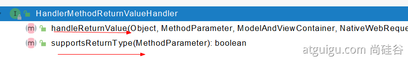

1. 返回值处理器判断是否支持这种类型返回值 supportsReturnType

```java
handler.supportsReturnType(returnType)
```

2. 返回值处理器调用 handleReturnValue 进行处理

3. RequestResponseBodyMethodProcessor 可以处理返回值标了@ResponseBody 注解的。
   1. 利用 MessageConverters 进行处理 将数据写为json
   
      1. 内容协商（浏览器默认会以请求头的方式告诉服务器他能接受什么样的内容类型）
   
         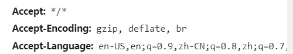
   
      2. 服务器最终根据自己自身的能力，决定服务器能生产出什么样内容类型的数据，
   
      3. SpringMVC会挨个遍历所有容器底层的 HttpMessageConverter ，看谁能处理？
   
      4. 得到MappingJackson2HttpMessageConverter可以将对象写为json
   
      5. 利用MappingJackson2HttpMessageConverter将对象转为json再写出去。

**支持的返回值类型**


**HTTPMessageConverter原理**

HttpMessageConverter规范

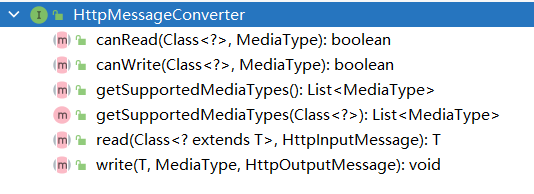

HttpMessageConverter: 看是否支持将 此 Class类型的对象，转为MediaType类型的数据。 （是否可读，是否可写）
例子：Person对象转为JSON。或者 JSON转为Person

默认的MessageConverter

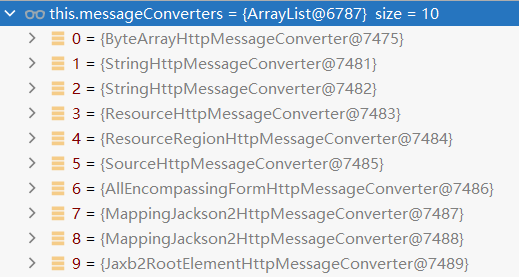

0 - 只支持Byte类型的
1 - String
2 - String
3 - Resource
4 - ResourceRegion
5 - 

```java
SUPPORTED_CLASSES.add(DOMSource.class);
SUPPORTED_CLASSES.add(SAXSource.class);
SUPPORTED_CLASSES.add(StAXSource.class);
SUPPORTED_CLASSES.add(StreamSource.class);
SUPPORTED_CLASSES.add(Source.class);
```

6 - MultiValueMap
7 - true 
8 - true
9 - 支持注解方式xml处理的。

最终 MappingJackson2HttpMessageConverter  把对象转为JSON（利用底层的jackson的objectMapper转换的）

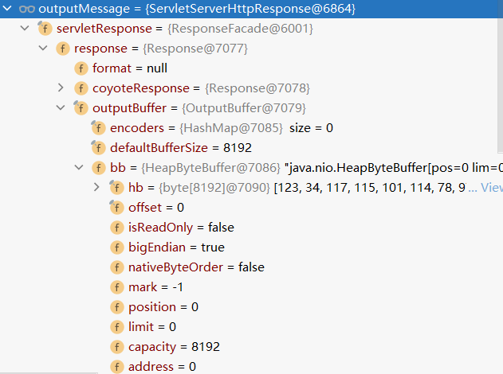

### 5.4.2 内容协商

**引入依赖**

```xml
 <dependency>
            <groupId>com.fasterxml.jackson.dataformat</groupId>
            <artifactId>jackson-dataformat-xml</artifactId>
</dependency>
```

**返回json和xml**

只需要改变请求头中Accept字段（接收类型的权重）。Http协议中规定的，告诉服务器本客户端可以接收的数据类型。

**开启浏览器参数方式内容协商功能**

```yml
spring:
  mvc:
    contentnegotiation:
      favor-parameter: true
```

内容协商管理器contentNegotiationManager中新增以请求参数为的策略

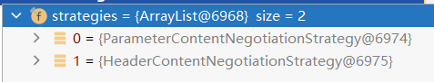

[localhost:8888/response/person?format=json](http://localhost:8888/response/person?format=json)请求json数据


确定客户端接收什么样的内容类型；

1. Parameter策略优先确定是要返回json数据（获取请求头中的format的值）

   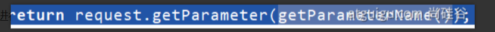

2. 最终进行内容协商返回给客户端json即可。

**内容协商原理**

```java
//RequestResponseBodyMethodProcessor.writeWithMessageConverters()
MediaType selectedMediaType = null;
		MediaType contentType = outputMessage.getHeaders().getContentType();//判断当前响应头是否已经油确定的媒体类型
		boolean isContentTypePreset = contentType != null && contentType.isConcrete();
		if (isContentTypePreset) {
			if (logger.isDebugEnabled()) {
				logger.debug("Found 'Content-Type:" + contentType + "' in response");
			}
			selectedMediaType = contentType;
		}
		else {
			HttpServletRequest request = inputMessage.getServletRequest();
			List<MediaType> acceptableTypes;
			try {
				acceptableTypes = getAcceptableMediaTypes(request);//获取客户端（PostMan、浏览器）支持接收的内容类型。（获取客户端Accept请求头字段）【application/xml】
			}
			catch (HttpMediaTypeNotAcceptableException ex) {
				int series = outputMessage.getServletResponse().getStatus() / 100;
				if (body == null || series == 4 || series == 5) {
					if (logger.isDebugEnabled()) {
						logger.debug("Ignoring error response content (if any). " + ex);
					}
					return;
				}
				throw ex;
			}
			List<MediaType> producibleTypes = getProducibleMediaTypes(request, valueType, targetType);//遍历循环所有当前系统的 MessageConverter，看谁支持操作这个对象（Person） 找到支持操作Person的converter，把converter支持的媒体类型统计出来。

```

1. 判断当前响应头中是否已经有确定的媒体类型。MediaType

2. 获取客户端（PostMan、浏览器）支持接收的内容类型。（获取客户端Accept请求头字段）【application/xml】

   * **contentNegotiationManager** **内容协商管理器 默认使用基于请求头的策略**（可以添加、修改策略）

     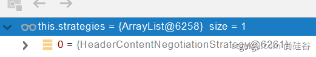

   * **HeaderContentNegotiationStrategy  确定客户端可以接收的内容类型** 

     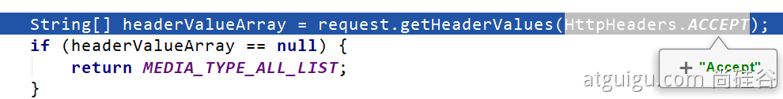

     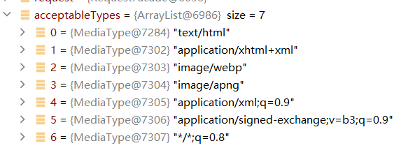

3. 遍历循环所有当前系统的 MessageConverter，看谁支持操作这个对象（Person）

   ```java
   //RequestResponseBodyMethodProcessor.getProducibleMediaTypes
   for (HttpMessageConverter<?> converter : this.messageConverters) {
      if (converter instanceof GenericHttpMessageConverter && targetType != null) {
         if (((GenericHttpMessageConverter<?>) converter).canWrite(targetType, valueClass, null)) {
            result.addAll(converter.getSupportedMediaTypes(valueClass));
         }
      }
      else if (converter.canWrite(valueClass, null)) {
         result.addAll(converter.getSupportedMediaTypes(valueClass));
      }
   }
   ```

4. 找到支持操作Person的converter，把converter支持的媒体类型统计出来

5. 客户端需要【7种 application/xml等】。服务端可提供的【10种、json、xml】

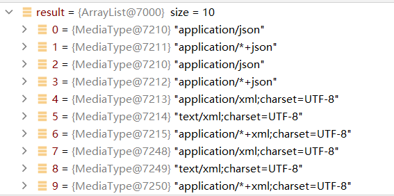

6. 进行内容协商的最佳匹配媒体类型

   ```java
   //RequestResponseBodyMethodProcessor.writeWithMessageConverters()
   List<MediaType> mediaTypesToUse = new ArrayList<>();
   for (MediaType requestedType : acceptableTypes) {
      for (MediaType producibleType : producibleTypes) {
         if (requestedType.isCompatibleWith(producibleType)) {
            mediaTypesToUse.add(getMostSpecificMediaType(requestedType, producibleType));
         }
      }
   }
   ```

​	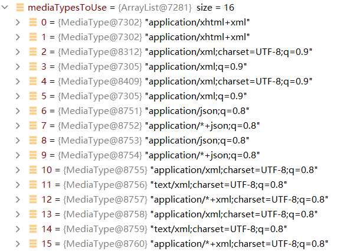

最终通过权重或排序 得到一种最佳匹配媒体类型selectedMediaType

7. 用 支持 将对象转为 最佳匹配媒体类型 的converter。调用它进行转化 。

```java
//RequestResponseBodyMethodProcessor.writeWithMessageConverters()
if (selectedMediaType != null) {
			selectedMediaType = selectedMediaType.removeQualityValue();
			for (HttpMessageConverter<?> converter : this.messageConverters) {
				GenericHttpMessageConverter genericConverter = (converter instanceof GenericHttpMessageConverter ?
						(GenericHttpMessageConverter<?>) converter : null);
				if (genericConverter != null ?
						((GenericHttpMessageConverter) converter).canWrite(targetType, valueType, selectedMediaType) :
						converter.canWrite(valueType, selectedMediaType)) {
					body = getAdvice().beforeBodyWrite(body, returnType, selectedMediaType,
							(Class<? extends HttpMessageConverter<?>>) converter.getClass(),
							inputMessage, outputMessage);
					if (body != null) {
						Object theBody = body;
						LogFormatUtils.traceDebug(logger, traceOn ->
								"Writing [" + LogFormatUtils.formatValue(theBody, !traceOn) + "]");
						addContentDispositionHeader(inputMessage, outputMessage);
						if (genericConverter != null) {
							genericConverter.write(body, targetType, selectedMediaType, outputMessage);
						}
						else {
							((HttpMessageConverter) converter).write(body, selectedMediaType, outputMessage);//转换 此处为响应JSON或XML环节
						}
					}
					else {
						if (logger.isDebugEnabled()) {
							logger.debug("Nothing to write: null body");
						}
					}
					return;
				}
			}
		}
```

导入了jackson处理xml的包，xml的converter就会自动进来

```java
WebMvcConfigurationSupport
    
	static {

    	jackson2XmlPresent = ClassUtils.isPresent("com.fasterxml.jackson.dataformat.xml.XmlMapper", classLoader);//导入了jackson处理xml的包，xml的converter就会自动进来
	}

	private static final boolean jackson2XmlPresent;


	if (jackson2XmlPresent) {
			Jackson2ObjectMapperBuilder builder = Jackson2ObjectMapperBuilder.xml();
			if (this.applicationContext != null) {
				builder.applicationContext(this.applicationContext);
			}
			messageConverters.add(new MappingJackson2XmlHttpMessageConverter(builder.build()));
		}
```

**自定义MessageConverter**

实现多协议数据兼容。json、xml、x-guigu

1. @ResponseBody 响应数据出去 调用 RequestResponseBodyMethodProcessor 处理
2. Processor 处理方法返回值。通过 MessageConverter 处理
3. 所有 MessageConverter 合起来可以支持各种媒体类型数据的操作（读、写）
4. 内容协商找到最终的 messageConverter

应用场景

```java
    /**
     * 浏览器发请求直接返回xmL[appLication/xml]   jacksonXmLConverter
     * 如果是ajax请求返回json[application/json]  jacksonJsonConverter
     * 如果tintin app发请求，返回自定义协议数据 [appLiaction/tintin] xxxConverter
     * 属性值1：属性值2
     * @return
     */
    @ResponseBody
    @GetMapping("/response/person")
    public Person person() {
        Person person = new Person();
        person.setAge(11);
        person.setUserName("user1");
        person.setBirth(new Date());
        return person;
    }
```

SpringMVC的什么功能。一个入口给容器中添加一个  WebMvcConfigure

```java
@Configuration
public class MyWebConfig {
    @Bean
    public WebMvcConfigurer webMvcConfigurer() {
        WebMvcConfigurer webMvcConfigurer = new WebMvcConfigurer(){
        public void extendMessageConverters(List<HttpMessageConverter<?>> converters) {
                converters.add(new TintinConverter());
            }
        };

        return webMvcConfigurer;
    }
}
```

自定义的MessageConverter

```java
public class TintinConverter implements HttpMessageConverter<Person> {
    @Override
    public boolean canRead(Class<?> clazz, MediaType mediaType) {
        return false;
    }

    @Override
    public boolean canWrite(Class<?> clazz, MediaType mediaType) {
        return clazz.isAssignableFrom(Person.class);
    }

    /**
     * 服务器就是通过该方法统计MessageConverter支持写出的内容类型
     * @return
     */
    @Override
    public List<MediaType> getSupportedMediaTypes() {
        return MediaType.parseMediaTypes("application/tintin");
    }

    @Override
    public Person read(Class<? extends Person> clazz, HttpInputMessage inputMessage) throws IOException, HttpMessageNotReadableException {
        return null;
    }

    /**
     * 自定义协议的写出
     */
    @Override
    public void write(Person person, MediaType contentType, HttpOutputMessage outputMessage) throws IOException, HttpMessageNotWritableException {
        String data = person.getUserName() + ":" + person.getAge() + ":" +person.getBirth() + ":" + person.getPet();
        //写进输出流
        OutputStream outputMessageBody = outputMessage.getBody();
        outputMessageBody.write(data.getBytes());
    }
}

```

虽然通过自定义MessageConverter声明了能够支持的内容类型tintin

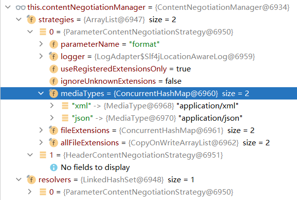

但此时请求参数方式声明客户端还只能接收xml或json类型

因此自定义内容协商策略

```java
@Configuration
public class MyWebConfig {
    @Bean
    public WebMvcConfigurer webMvcConfigurer() {
        WebMvcConfigurer webMvcConfigurer = new WebMvcConfigurer(){
            public void configureContentNegotiation(ContentNegotiationConfigurer configurer) {
                //指定参数名称与媒体类型的映射关系 tintin 对应 application/tintin
                HashMap<String, MediaType> map = new HashMap<>();
                map.put("xml",MediaType.APPLICATION_XML);
                map.put("json",MediaType.APPLICATION_JSON);
                map.put("tintin",MediaType.parseMediaType("application/tintin"));
                //指定支持哪些参数对应的参数类型 如xml对应application/xml json对应application/json
                ParameterContentNegotiationStrategy parameterContentNegotiationStrategy =
                new ParameterContentNegotiationStrategy(map);
                //添加策略
                configurer.strategies(Arrays.asList(parameterContentNegotiationStrategy));
            }
      	}
     	return webMvcConfigurer;
     }
}
    
```

此时内容协商管理器只有一个基于参数策略，后续可以继续添加基于请求头的策略

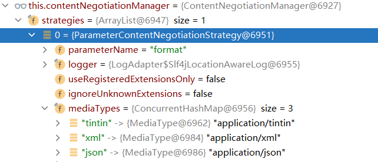

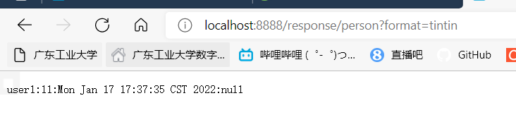

## 5.5 视图解析与模板引擎

### 5.5.1 视图解析

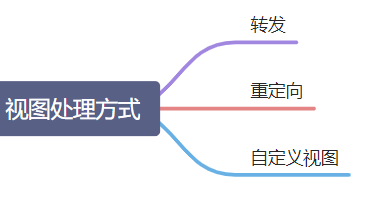

**视图解析原理流程**

1. 目标方法处理的过程中，所有数据都会被放在 ModelAndViewContainer 里面。包括数据和视图地址

2. 方法的参数是一个自定义类型对象（从请求参数中确定的），把他重新放在 ModelAndViewContainer 

3. 任何目标方法执行完成以后都会返回 ModelAndView（数据和视图地址）。

   ```java
   //DispatcherServlet.doDispatch()
   mv = ha.handle(processedRequest, response, mappedHandler.getHandler());
   ```

4. processDispatchResult  处理派发结果（页面改如何响应）

   1. render(mv, request, response); 进行页面渲染逻辑

      1. 根据方法的String返回值得到 View 对象【定义了页面的渲染逻辑】

         1. 所有的视图解析器(5个)尝试是否能根据当前返回值得到View对象

            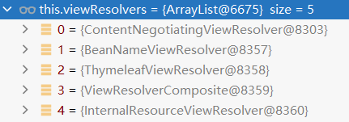

         2. 得到了  redirect:/main.html --> Thymeleaf new RedirectView()

         3. ContentNegotiationViewResolver 里面包含了下面所有的视图解析器，内部还是利用下面所有视图解析器得到视图对象。

            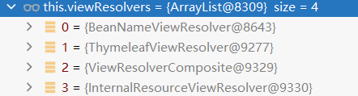

            此处则调用了ThymeleafViewResolver生成了重定向视图对象

            ```java
            //ThymeleafViewResolver.createView()       
            // Process redirects (HTTP redirects)
                    if (viewName.startsWith(REDIRECT_URL_PREFIX)) {
                        vrlogger.trace("[THYMELEAF] View \"{}\" is a redirect, and will not be handled directly by ThymeleafViewResolver.", viewName);
                        final String redirectUrl = viewName.substring(REDIRECT_URL_PREFIX.length(), viewName.length());
                        final RedirectView view = new RedirectView(redirectUrl, isRedirectContextRelative(), isRedirectHttp10Compatible());
                        return (View) getApplicationContext().getAutowireCapableBeanFactory().initializeBean(view, REDIRECT_URL_PREFIX);
                    }
            ```

            

         4. 得到视图对象后 view.render(mv.getModelInternal(), request, response);   视图对象调用自定义的render进行页面渲染工作

            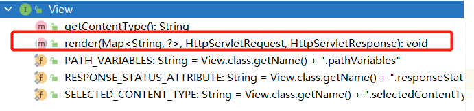

            * RedirectView 如何渲染【重定向到一个页面】

              * 获取目标url地址

              * response.sendRedirect(encodedURL);

                ```java
                    //RedirectView.class
                    protected void renderMergedOutputModel(Map<String, Object> model, HttpServletRequest request, HttpServletResponse response) throws IOException {
                        String targetUrl = this.createTargetUrl(model, request);//获取url的同时会设置编码格式、拼接尾部属性等
                        targetUrl = this.updateTargetUrl(targetUrl, model, request, response);
                        RequestContextUtils.saveOutputFlashMap(targetUrl, request, response);
                        this.sendRedirect(request, response, targetUrl, this.http10Compatible);//内部调用原生的response.sendRedirect(encodedURL);进行重定向
                
                    }
                ```

视图解析：

* 返回值以 forward: 开始： new InternalResourceView(forwardUrl); -->  转发request.getRequestDispatcher(path).forward(request, response); 
* 返回值以 redirect: 开始： new RedirectView() --》 render就是重定向 
* 返回值是普通字符串： new ThymeleafView（）---> 

### 5.5.2 模板引擎-thymeleaf

### 5.5.3 使用模板引擎

**引入依赖**

```xml
<!--        模板引擎thymeleaf-->
        <dependency>
            <groupId>org.springframework.boot</groupId>
            <artifactId>spring-boot-starter-thymeleaf</artifactId>
        </dependency>
```

**自动配置类**

```java
@Configuration(
    proxyBeanMethods = false
)
@EnableConfigurationProperties({ThymeleafProperties.class})
@ConditionalOnClass({TemplateMode.class, SpringTemplateEngine.class})
@AutoConfigureAfter({WebMvcAutoConfiguration.class, WebFluxAutoConfiguration.class})
public class ThymeleafAutoConfiguration {
```

通过ThymeleafProperties进行配置

```java
@ConfigurationProperties(
    prefix = "spring.thymeleaf"//配置前缀
)
public class ThymeleafProperties {
    
    public static final String DEFAULT_PREFIX = "classpath:/templates/";//页面存放位置
    public static final String DEFAULT_SUFFIX = ".html";//模板页面的后缀
```

配置好了 ThymeleafViewResolver

```java
        @Configuration(
            proxyBeanMethods = false
        )
        static class ThymeleafViewResolverConfiguration {
```

**页面开发测试**

模板页面代码

```html
<!DOCTYPE html>
<html lang="en" xmlns:th="http://www.thymeleaf.org">
<head>
    <meta charset="UTF-8">
    <title >success</title>
</head>
<body>
    <h1 th:text="${msg}">success</h1>
    <h2>
        <a href="http://www.baidu.com">百度</a>
        <a href="http://www.baidu.com" th:href="${link}">百度</a>
        <a href="http://www.baidu.com" th:href="@{link}">百度</a>
        <a href="http://www.baidu.com" th:href="@{/link}">百度</a>
        <a href="http://www.baidu.com" th:href="@{${link}}">百度</a>
        <a th:href="@{${static}}">获得静态资源gem.jpg</a>
		<a th:href="@{/${static}}">获得静态资源gem.jpg</a>

    </h2>
</body>
</html>
```

查看网页源码

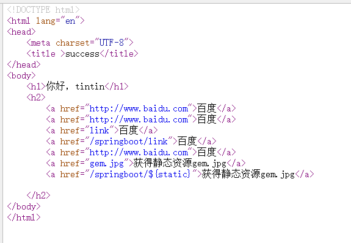

### 5.5.4 构建后台管理系统

[05、Web开发 · 语雀 (yuque.com)](https://www.yuque.com/atguigu/springboot/vgzmgh#6V7bq)

## 5.6拦截器

### 5.6.1  实现HandlerInterceptor接口

```java
@Slf4j
public class LoginInterceptor implements HandlerInterceptor {
    @Override
    public boolean preHandle(HttpServletRequest request, HttpServletResponse response, Object handler) throws Exception {
        log.info("拦截的请求路径是:" + request.getRequestURI());
        HttpSession session = request.getSession();

        User loginUser = (User) session.getAttribute("loginUser");
        if (loginUser != null) {
            return true;
        }
        request.setAttribute("msg","请先登陆");
        request.getRequestDispatcher("/").forward(request,response);
        return false;
    }

    @Override
    public void postHandle(HttpServletRequest request, HttpServletResponse response, Object handler, ModelAndView modelAndView) throws Exception {
        HandlerInterceptor.super.postHandle(request, response, handler, modelAndView);
    }

    @Override
    public void afterCompletion(HttpServletRequest request, HttpServletResponse response, Object handler, Exception ex) throws Exception {
        HandlerInterceptor.super.afterCompletion(request, response, handler, ex);
    }
}

```

### 5.6.2 配置拦截器

```java
@Configuration
public class AdminWebConfig implements WebMvcConfigurer {
    @Override
    public void addInterceptors(InterceptorRegistry registry) {
        //不拦截登陆页和静态资源
        registry.addInterceptor(new LoginInterceptor()).
                addPathPatterns("/**").//拦截的请求路径
                excludePathPatterns("/","/login","/css/**","/js/**","/images/**","/fonts/**");//放行的请求路径

    }
}

```

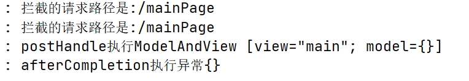

### 5.6.3 拦截器原理

1. 根据的请求到能处理当前请求的HandlerExecutionChain内含拦截器链

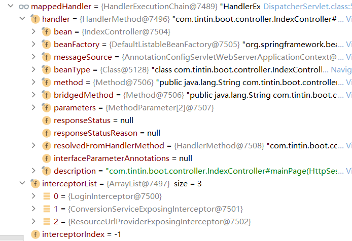

2. 先来顺序执行 所有拦截器的 preHandle方法
   ●1、如果当前拦截器prehandler返回为true。则执行下一个拦截器的preHandle
   ●2、如果当前拦截器返回为false。直接    倒序执行所有已经执行了的拦截器的  afterCompletion

```java
                    if (!mappedHandler.applyPreHandle(processedRequest, response)) {
                        return;
                    }
```

```java
    boolean applyPreHandle(HttpServletRequest request, HttpServletResponse response) throws Exception {
        for(int i = 0; i < this.interceptorList.size(); this.interceptorIndex = i++) {
            HandlerInterceptor interceptor = (HandlerInterceptor)this.interceptorList.get(i);
            if (!interceptor.preHandle(request, response, this.handler)) {
                this.triggerAfterCompletion(request, response, (Exception)null);
                return false;
            }
        }

        return true;
    }
```

```java
void triggerAfterCompletion(HttpServletRequest request, HttpServletResponse response, @Nullable Exception ex) {
        for(int i = this.interceptorIndex; i >= 0; --i) {
            HandlerInterceptor interceptor = (HandlerInterceptor)this.interceptorList.get(i);

            try {
                interceptor.afterCompletion(request, response, this.handler, ex);
            } catch (Throwable var7) {
                logger.error("HandlerInterceptor.afterCompletion threw exception", var7);
            }
        }

    }
```

3. 如果任何一个拦截器返回false。直接跳出不执行目标方法

4. 所有拦截器都返回True。执行目标方法

5. 倒序执行所有拦截器的postHandle方法。

6. 前面的步骤有任何异常都会直接倒序触发 afterCompletion

   ```java
               } catch (Exception var22) {
                   this.triggerAfterCompletion(processedRequest, response, mappedHandler, var22);
               } catch (Throwable var23) {
                   this.triggerAfterCompletion(processedRequest, response, mappedHandler, new NestedServletException("Handler processing failed", var23));
               }
   ```

7. 页面成功渲染完成以后，也会倒序触发 afterCompletion

   ```java
   //DispatcherServlet.processDispatchResult()
   	if (!WebAsyncUtils.getAsyncManager(request).isConcurrentHandlingStarted()) {
               if (mappedHandler != null) {
                   mappedHandler.triggerAfterCompletion(request, response, (Exception)null);
               }
   
           }
   ```

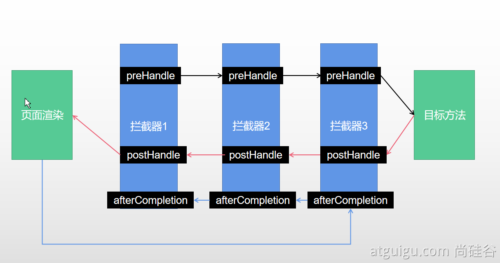

## 5.7 文件上传

### 5.7.1 前端页面

```html
                            <div class="form-group">
                                <label for="exampleInputFile">头像</label>
                                <input type="file" name="headerImg" id="exampleInputFile">
                            </div>
                            <div class="form-group">
                                <label for="exampleInputFile">生活照</label>
                                <input type="file" name="photos" multiple>
                            </div>
```

### 5.7.2 上传代码

```java
    //自动封装上传的文件
    @PostMapping("/upload")
    public String upload(String email,
                         String username,
                         MultipartFile headerImg,
                         MultipartFile[] photos) throws IOException {
        log.info("上传的信息：email={},username={},headerImg_size={},photos_len={}",
                email,username,headerImg.getSize(),photos.length);
        if (!headerImg.isEmpty()) {
            //保存到文件服务器
            String filename = headerImg.getOriginalFilename();
            headerImg.transferTo(new File("D:\\桌面\\" + filename ));
        }
        if (photos.length > 0) {
            for (MultipartFile photo : photos) {
                if (!photo.isEmpty()) {
                    photo.transferTo(new File("D:\\桌面\\照片\\" + photo.getOriginalFilename()));
                }
            }
        }
        return "redirect:/mainPage";
    }
```

### 5.7.3 文件上传自动配置原理

**自动配置类**

```java
@Configuration(
    proxyBeanMethods = false
)
@ConditionalOnClass({Servlet.class, StandardServletMultipartResolver.class, MultipartConfigElement.class})
@ConditionalOnProperty(
    prefix = "spring.servlet.multipart",
    name = {"enabled"},
    matchIfMissing = true
)
@ConditionalOnWebApplication(
    type = Type.SERVLET
)
@EnableConfigurationProperties({MultipartProperties.class})
public class MultipartAutoConfiguration {
```

**增大文件上传大小上限**

```java
@ConfigurationProperties(
    prefix = "spring.servlet.multipart", //配置前缀
    ignoreUnknownFields = false
)
public class MultipartProperties {
    private boolean enabled = true;
    private String location;
    private DataSize maxFileSize = DataSize.ofMegabytes(1L);
```

```yml
spring:
  servlet:
    multipart:
      max-file-size: 10MB
      max-request-size: 100MB
```

**文件上传解析器**

自动配置好了 StandardServletMultipartResolver   【文件上传解析器】

* 原理步骤

  * 前端控制器判断是否为文件上传请求

    ```java
    //dispatcherServlet.doService()
    try {
                        processedRequest = this.checkMultipart(request);
                        multipartRequestParsed = processedRequest != request;
                        mappedHandler = this.getHandler(processedRequest);
    ```

    

  * 请求进来使用文件上传解析器判断（isMultipart）并封装（resolveMultipart，返回MultipartHttpServletRequest）文件上传请求

    ```java
    //StandardServletMultipartResolver.isMultipart()
    	public boolean isMultipart(HttpServletRequest request) {
            return StringUtils.startsWithIgnoreCase(request.getContentType(), this.strictServletCompliance ? "multipart/form-data" : "multipart/"); //enctype前缀必须为multipart/
        }
    ```

    ```java
    //StandardServletMultipartResolver.resolveMultipart()
    public MultipartHttpServletRequest resolveMultipart(HttpServletRequest request) throws MultipartException {
        return new StandardMultipartHttpServletRequest(request, this.resolveLazily);
    }
    ```

  * 参数解析器来解析请求中的文件内容封装成MultipartFile（标识了/RequestPart注解的参数由RequestPartMethodArgumentResolver进行解析）

    ```java
    //RequestPartMethodArgumentResolver.resolveArgument(）
            Object mpArg = MultipartResolutionDelegate.resolveMultipartArgument(name, parameter, servletRequest);
    //
    ```

  * 将request中文件信息封装为一个Map；MultiValueMap<String, MultipartFile>FileCopyUtils。实现文件流的拷贝

## 5.8 异常处理

### 5.8.1 错误处理

**默认规则**

* 默认情况下，Spring Boot提供/error处理所有错误的映射
* 对于机器客户端，它将生成JSON响应，其中包含错误，HTTP状态和异常消息的详细信息。对于浏览器客户端，响应一个“ whitelabel”错误视图，以HTML格式呈现相同的数据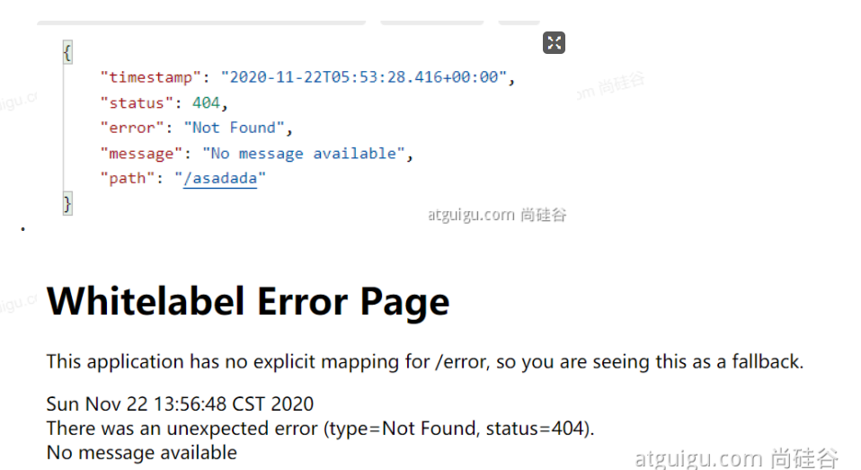

* 要对其进行自定义，添加View解析为error 

* 要完全替换默认行为，可以实现 ErrorController 并注册该类型的Bean定义，或添加ErrorAttributes类型的组件以使用现有机制但替换其内容。

* error/下的4xx，5xx页面会被自动解析；

  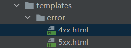

**异常处理自动配置**

ErrorMvcAutoConfiguration  自动配置异常处理规则

* 容器中的组件：类型：DefaultErrorAttributes -> id：errorAttributes

  * public class DefaultErrorAttributes implements ErrorAttributes, HandlerExceptionResolver
  * DefaultErrorAttributes：定义错误页面中可以包含哪些数据

* 容器中的组件：类型：BasicErrorController --> id：basicErrorController（json+白页 适配响应）

  * 处理默认 /error 路径的请求；页面响应 new ModelAndView("error", model)；

    ```java
    //BasicErrorController.class
    @Controller
    @RequestMapping({"${server.error.path:${error.path:/error}}"})
    public class BasicErrorController extends AbstractErrorController {
    	@RequestMapping(
            produces = {"text/html"}
        )
        public ModelAndView errorHtml(HttpServletRequest request, HttpServletResponse response) {
            HttpStatus status = this.getStatus(request);
            Map<String, Object> model = Collections.unmodifiableMap(this.getErrorAttributes(request, this.getErrorAttributeOptions(request, MediaType.TEXT_HTML)));
            response.setStatus(status.value());
            ModelAndView modelAndView = this.resolveErrorView(request, response, status, model);
            return modelAndView != null ? modelAndView : new ModelAndView("error", model);
        }
    
        @RequestMapping
        public ResponseEntity<Map<String, Object>> error(HttpServletRequest request) {
            HttpStatus status = this.getStatus(request);
            if (status == HttpStatus.NO_CONTENT) {
                return new ResponseEntity(status);
            } else {
                Map<String, Object> body = this.getErrorAttributes(request, this.getErrorAttributeOptions(request, MediaType.ALL));
                return new ResponseEntity(body, status);
            }
        }
    ```

  * 容器中有组件 View->id是error；（响应默认错误页）  若确实这个视图组件，将会显示原生的tomcat错误页面

    ```java
            private final ErrorMvcAutoConfiguration.StaticView defaultErrorView = new ErrorMvcAutoConfiguration.StaticView();
    
    		@Bean(
                name = {"error"}
            )
            @ConditionalOnMissingBean(
                name = {"error"}
            )
            public View defaultErrorView() {
                return this.defaultErrorView;
            }
    
    ```

  * 容器中放组件 BeanNameViewResolver（视图解析器）；按照返回的视图名作为组件的id去容器中找View对象。

    ```java
        @Bean
        @ConditionalOnMissingBean
        public BeanNameViewResolver beanNameViewResolver() {
            BeanNameViewResolver resolver = new BeanNameViewResolver();
            resolver.setOrder(2147483637);
            return resolver;
        }
    ```

* 容器中的组件：类型：DefaultErrorViewResolver -> id：conventionErrorViewResolver

  * 如果发生错误，会以HTTP的状态码 作为视图页地址（viewName），找到真正的页面
  * error/404、5xx.html

如果想要返回页面；就会找error视图【StaticView】。(默认是一个白页)

**异常处理流程**

1. 执行目标方法，目标方法运行期间有任何异常都会被catch、而且标志当前请求结束；并且用 dispatchException 

2. 进入视图解析流程（页面渲染？） 此时mv为空
   processDispatchResult(processedRequest, response, mappedHandler, **mv**, **dispatchException**);

3. mv = processHandlerException；处理handler发生的异常，处理完成返回ModelAndView；

   1. 遍历所有的 handlerExceptionResolvers，看谁能处理当前异常【HandlerExceptionResolver处理器异常解析器】

      ```java
                      HandlerExceptionResolver resolver = (HandlerExceptionResolver)var6.next();
                     
      				exMv = resolver.resolveException(request, response, handler, ex);
      
      ```

      

   2. 系统默认的异常解析器

      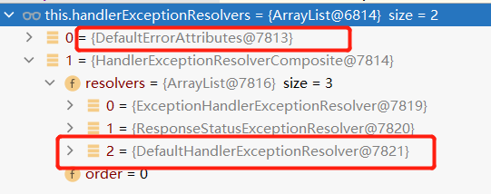

      * DefaultErrorAttributes先来处理异常。把异常信息保存到request域，并且返回null；

        ```java
        public ModelAndView resolveException(HttpServletRequest request, HttpServletResponse response, Object handler, Exception ex) {
            this.storeErrorAttributes(request, ex);
            return null;
        }
        ```

      * HandlerExceptionResolverComposite解析错误视图；遍历所有的  ErrorViewResolver  看谁能解析。（详细参考下面 定制错误处理逻辑 部分）

        * HandlerExceptionResolver 对标注HandlerException注解进行处理handlerExceptionResolver，无法处理异常
        * ResponseStatusExceptionResolver也无法处理异常
        * DefaultHandlerExceptionResolver也无法处理异常
        * **所以异常会被抛出**，且无法封装mav

4. 如果没有任何人能处理最终底层就会发送 /error 请求。会被底层的BasicErrorController处理

   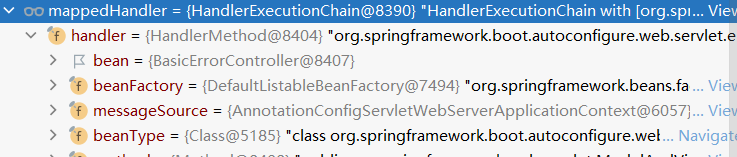

   ```java
       @RequestMapping(
           produces = {"text/html"}
       )
       public ModelAndView errorHtml(HttpServletRequest request, HttpServletResponse response) {
           HttpStatus status = this.getStatus(request);
           Map<String, Object> model = Collections.unmodifiableMap(this.getErrorAttributes(request, this.getErrorAttributeOptions(request, MediaType.TEXT_HTML)));
           response.setStatus(status.value());
           ModelAndView modelAndView = this.resolveErrorView(request, response, status, model);//解析错误视图
           return modelAndView != null ? modelAndView : new ModelAndView("error", model);
       }
   ```

   1. 解析错误视图；遍历所有的  ErrorViewResolver  看谁能解析。

      

   2. 默认的 DefaultErrorViewResolver ,作用是把响应状态码作为错误页的地址，error/500.html 

      ```java
      public ModelAndView resolveErrorView(HttpServletRequest request, HttpStatus status, Map<String, Object> model) {
          ModelAndView modelAndView = this.resolve(String.valueOf(status.value()), model);//精确匹配对应状态码页面
          if (modelAndView == null && SERIES_VIEWS.containsKey(status.series())) {
              modelAndView = this.resolve((String)SERIES_VIEWS.get(status.series()), model);//模糊匹配系列码 如4xx页面、5xx页面
          }
      
          return modelAndView;//找不到页面则为空
      }
      ```

   3. 模板引擎最终响应这个页面 error/500.html

**定制错误处理逻辑**

* 自定义错误页

  * error/404.html   error/5xx.html；有精确的错误状态码页面就匹配精确，没有就找 4xx.html；如果都没有就触发白页

* 自定义不同异常对应的不同错误页并编写处理方法，@ControllerAdvice+@ExceptionHandler处理全局异常；底层是 **ExceptionHandlerExceptionResolver** 支持的 此时不发送error请求

  ```java
  //处理某一类异常 
  @Slf4j
  @ControllerAdvice
  public class GlobalExceptionHandler {
      //处理空指针异常和运算异常
      @ExceptionHandler({ArithmeticException.class,NullPointerException.class}) //处理异常
      public String handlerArithException(Exception e) {
          log.error("异常为{}",e);
          return "error/6xx";//并返回某一个视图
      }
  }
  ```

* 自定义异常及其状态码，@ResponseStatus+自定义异常 ；底层是 **ResponseStatusExceptionResolver** ，把responsestatus注解的信息底层调用 response.sendError(statusCode, resolvedReason)；tomcat发送的/error

  ```java
  @ResponseStatus(value = HttpStatus.FORBIDDEN,reason = "用户数量太多")
  public class UserToManyException extends RuntimeException {
      public UserToManyException() {
      }
  
      public UserToManyException(String message) {
          super(message);
      }
  }
  ```

* Spring底层的异常，如 参数类型转换异常；DefaultHandlerExceptionResolver 处理框架底层的异常。

  * response.sendError(HttpServletResponse.SC_BAD_REQUEST, ex.getMessage()); 

  ```java
      protected ModelAndView handleMissingServletRequestParameter(MissingServletRequestParameterException ex, HttpServletRequest request, HttpServletResponse response, @Nullable Object handler) throws IOException {
          response.sendError(400, ex.getMessage());
          return new ModelAndView();
      }
  ```

* 自定义异常解析器实现 HandlerExceptionResolver 处理异常；可以作为默认的全局异常处理规则

  ```java
  //自定义异常解析器
  @Order(value = -1)//使其优先级优先于spring底层异常解析器
  @Component
  public class CustomerHandlerExceptionResolver implements HandlerExceptionResolver {
      @Override
      public ModelAndView resolveException(HttpServletRequest request, HttpServletResponse response, Object handler, Exception ex) {
          try {
              response.sendError(666,"我的我的");
          } catch (IOException e) {
              e.printStackTrace();
          }
          return new ModelAndView();
      }
  }
  
  ```

* ErrorViewResolver  实现自定义处理异常；若不想使用spring底层的DefaultErrorViewResolver则可以自定义

  * response.sendError 。error请求就会转给controller

  * 你的异常没有任何人能处理。tomcat底层 response.sendError。error请求就会转给controller

  * basicErrorController 要去的页面地址是 ErrorViewResolver  ；

## 5.9 Web原生组件注入

### 5.9.1 使用Servlet API

@ServletComponentScan(basePackages = "com.tintin.boot") :指定原生Servlet组件都放在那里
@WebServlet(urlPatterns = "/my")：效果：直接响应，没有经过Spring的拦截器？
@WebFilter(urlPatterns={"/css/*","/images/*"})
@WebListene

### 5.9.2 使用RegistrationBean

ServletRegistrationBean, FilterRegistrationBean, and ServletListenerRegistrationBean 

```java
@Configuration
public class RegistConfig {
    @Bean
    public ServletRegistrationBean myServlet() {
        MyServlet myServlet = new MyServlet();
        return new ServletRegistrationBean(myServlet,"/my_servlet");
    }

    @Bean
    public FilterRegistrationBean myFilter() {
        MyFilter myFilter = new MyFilter();
        FilterRegistrationBean filterRegistrationBean = new FilterRegistrationBean(myFilter, myServlet());
        filterRegistrationBean.setUrlPatterns(Arrays.asList("/css/*","/images/*)");
        return filterRegistrationBean;
    }

    public ServletListenerRegistrationBean myListener() {
        MyListener myListener = new MyListener();
        return new ServletListenerRegistrationBean(myListener);
    }
}

```

### 5.9.3 DispatchServlet 前端控制器原理

扩展：DispatchServlet 如何注册进来

* 容器中自动配置了  DispatcherServlet  属性绑定到 WebMvcProperties；对应的配置文件配置项是 spring.mvc。

  ```java
  @Configuration(
          proxyBeanMethods = false
      )
      @Conditional({DispatcherServletAutoConfiguration.DefaultDispatcherServletCondition.class})
      @ConditionalOnClass({ServletRegistration.class})
      @EnableConfigurationProperties({WebMvcProperties.class})
      protected static class DispatcherServletConfiguration {
          protected DispatcherServletConfiguration() {
          }
  
          @Bean(
              name = {"dispatcherServlet"}
          )
          public DispatcherServlet dispatcherServlet(WebMvcProperties webMvcProperties) {
              DispatcherServlet dispatcherServlet = new DispatcherServlet();
              dispatcherServlet.setDispatchOptionsRequest(webMvcProperties.isDispatchOptionsRequest());
              dispatcherServlet.setDispatchTraceRequest(webMvcProperties.isDispatchTraceRequest());
              dispatcherServlet.setThrowExceptionIfNoHandlerFound(webMvcProperties.isThrowExceptionIfNoHandlerFound());
              dispatcherServlet.setPublishEvents(webMvcProperties.isPublishRequestHandledEvents());
              dispatcherServlet.setEnableLoggingRequestDetails(webMvcProperties.isLogRequestDetails());
              return dispatcherServlet;
          }
  ```

* 通过 `ServletRegistrationBean<DispatcherServlet> 把 DispatcherServlet`  配置到web服务器中的servletcontext（全局作用域）中。

      public DispatcherServletRegistrationBean(DispatcherServlet servlet, String path) {
          super(servlet, new String[0]);
          Assert.notNull(path, "Path must not be null");
          this.path = path;
          super.addUrlMappings(new String[]{this.getServletUrlMapping()});
      }

* 默认映射的是 / 路径。

  ```java
  @Bean(
      name = {"dispatcherServletRegistration"}
  )
  @ConditionalOnBean(
      value = {DispatcherServlet.class},
      name = {"dispatcherServlet"}
  )
  public DispatcherServletRegistrationBean dispatcherServletRegistration(DispatcherServlet dispatcherServlet, WebMvcProperties webMvcProperties, ObjectProvider<MultipartConfigElement> multipartConfig) {
      DispatcherServletRegistrationBean registration = new DispatcherServletRegistrationBean(dispatcherServlet, webMvcProperties.getServlet().getPath());
      registration.setName("dispatcherServlet");
      registration.setLoadOnStartup(webMvcProperties.getServlet().getLoadOnStartup());
      multipartConfig.ifAvailable(registration::setMultipartConfig);
      return registration;
  }
  ```

Tomcat-Servlet；
多个Servlet都能处理到同一层路径，**精确优选原则**
A： /my/
B： /my/1

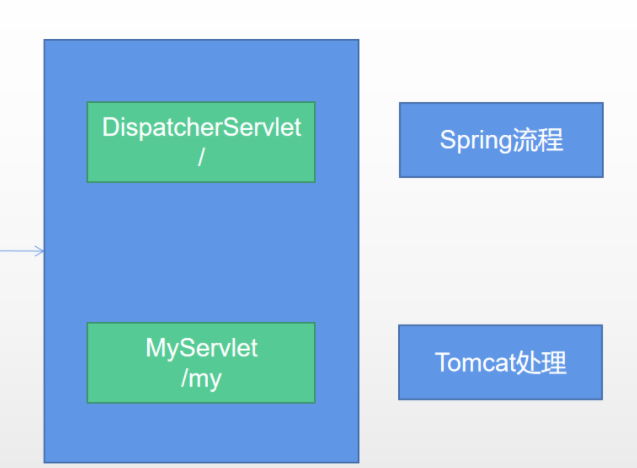

## 5.10 嵌入式Servlet容器

### 5.10.1 切换嵌入式Servlet容器

* 默认支持的webServer

  * Tomcat, Jetty, or Undertow
  * ServletWebServerApplicationContext 容器启动寻找ServletWebServerFactory 并引导创建服务器

* 切换服务器

  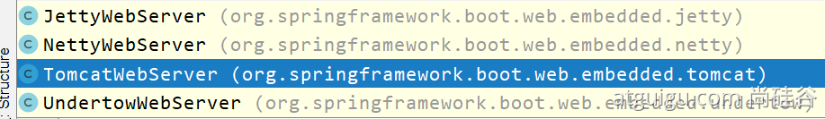

  ```xml
  <dependency>
      <groupId>org.springframework.boot</groupId>
      <artifactId>spring-boot-starter-web</artifactId>
      <!--排除tomcat服务器依赖-->
      <exclusions>
          <exclusion>
              <groupId>org.springframework.boot</groupId>
              <artifactId>spring-boot-starter-tomcat</artifactId>
          </exclusion>
      </exclusions>
  </dependency>
  <!--引入其他服务器依赖-->
  <dependency>
  	<groupID>org.springframework.boot</groupID>
      <artifactID>spring-boot-starter-undertow</artifactID>
  </dependency>
  ```

* 原理

  * SpringBoot应用启动发现当前是Web应用。web场景包-导入tomcat

  * web应用会创建一个web版的ioc容器 `ServletWebServerApplicationContext`

  * ServletWebServerApplicationContext 启动的时候寻找 ServletWebServerFactory（Servlet 的web服务器工厂---> Servlet 的web服务器） 

    ```java
    //ServletWebServerApplicationContext.class
    	protected ServletWebServerFactory getWebServerFactory() {
            String[] beanNames = this.getBeanFactory().getBeanNamesForType(ServletWebServerFactory.class);
            if (beanNames.length == 0) {
                throw new ApplicationContextException("Unable to start ServletWebServerApplicationContext due to missing ServletWebServerFactory bean.");
            } else if (beanNames.length > 1) {
                throw new ApplicationContextException("Unable to start ServletWebServerApplicationContext due to multiple ServletWebServerFactory beans : " + StringUtils.arrayToCommaDelimitedString(beanNames));
            } else {
                return (ServletWebServerFactory)this.getBeanFactory().getBean(beanNames[0], ServletWebServerFactory.class);
            }
        }
    ```

  * SpringBoot底层默认有很多的WebServer工厂；`TomcatServletWebServerFactory`, `JettyServletWebServerFactory`, or `UndertowServletWebServerFactory`

  * 底层直接会有一个自动配置类。ServletWebServerFactoryAutoConfiguration

  * ServletWebServerFactoryAutoConfiguration导入了ServletWebServerFactoryConfiguration（配置类）

    ```java
    @Import({ServletWebServerFactoryAutoConfiguration.BeanPostProcessorsRegistrar.class, EmbeddedTomcat.class, EmbeddedJetty.class, EmbeddedUndertow.class})//此三个类为ServletWebServerFactoryConfiguration 的内部类
    ```

  * ServletWebServerFactoryConfiguration 配置类 根据动态判断系统中到底导入了那个Web服务器的包。（默认是web-starter导入tomcat包），容器中就有 TomcatServletWebServerFactory

    ```java
    @Configuration(
            proxyBeanMethods = false
        )
        @ConditionalOnClass({Servlet.class, Tomcat.class, UpgradeProtocol.class})
        @ConditionalOnMissingBean(
            value = {ServletWebServerFactory.class},
            search = SearchStrategy.CURRENT
        )
        static class EmbeddedTomcat {
            EmbeddedTomcat() {
            }
    
            @Bean
            TomcatServletWebServerFactory tomcatServletWebServerFactory(ObjectProvider<TomcatConnectorCustomizer> connectorCustomizers, ObjectProvider<TomcatContextCustomizer> contextCustomizers, ObjectProvider<TomcatProtocolHandlerCustomizer<?>> protocolHandlerCustomizers) {
                TomcatServletWebServerFactory factory = new TomcatServletWebServerFactory();
                factory.getTomcatConnectorCustomizers().addAll((Collection)connectorCustomizers.orderedStream().collect(Collectors.toList()));
                factory.getTomcatContextCustomizers().addAll((Collection)contextCustomizers.orderedStream().collect(Collectors.toList()));
                factory.getTomcatProtocolHandlerCustomizers().addAll((Collection)protocolHandlerCustomizers.orderedStream().collect(Collectors.toList()));
                return factory;
            }
        }
    ```

  * TomcatServletWebServerFactory 创建出Tomcat服务器并启动；TomcatWebServer 的构造器拥有初始化方法initialize---this.tomcat.start();

  * 内嵌服务器，就是手动把启动服务器的代码调用**（tomcat核心jar包存在）**

### 5.10.2 定制Servlet容器

* 实现  `WebServerFactoryCustomizer<ConfigurableServletWebServerFactory>  xxxxxCustomizer`：定制化器，可以改变xxxx的默认规则

  * 把配置文件的值和ServletWebServerFactory 进行绑定

  ```java
  import org.springframework.boot.web.server.WebServerFactoryCustomizer;
  import org.springframework.boot.web.servlet.server.ConfigurableServletWebServerFactory;
  import org.springframework.stereotype.Component;
  
  @Component
  public class CustomizationBean implements WebServerFactoryCustomizer<ConfigurableServletWebServerFactory> {
  
      @Override
      public void customize(ConfigurableServletWebServerFactory server) {
          server.setPort(9000);
      }
  
  }
  ```

  

* 直接修改配置文件 server.xxx
* 直接自定义 ConfigurableServletWebServerFactory

## 5.11 定制化原理

### 5.11.1 定制化的常见方式

* 修改配置文件；

* xxxxxCustomizer；

* 编写自定义的配置类   xxxConfiguration；+ @Bean替换、增加容器中默认组件；视图解析器 

* Web应用 编写一个配置类实现 WebMvcConfigurer 即可定制化web功能；+ @Bean给容器中再扩展一些组件

  ```java
  @Configuration
  public class AdminWebConfig implements WebMvcConfigurer {
      @Override
      public void addInterceptors(InterceptorRegistry registry) {
          //不拦截登陆页和静态资源
          registry.addInterceptor(new LoginInterceptor()).
                  addPathPatterns("/**").//拦截的请求路径
                  excludePathPatterns("/","/login","/css/**","/js/**","/images/**","/fonts/**");//放行的请求路径
  
      }
  }
  ```

* @EnableWebMvc + WebMvcConfigurer —— @Bean  可以全面接管SpringMVC，**所有规则全部自己重新配置； 实现定制和扩展功能**

* 原理

  1. WebMvcAutoConfiguration  默认的SpringMVC的自动配置功能类。静态资源、欢迎页.....

  2. 一旦使用 @EnableWebMvc 、。会 @Import(DelegatingWebMvcConfiguration.class)

     ```java
     @Retention(RetentionPolicy.RUNTIME)
     @Target({ElementType.TYPE})
     @Documented
     @Import({DelegatingWebMvcConfiguration.class})
     public @interface EnableWebMvc {
     }
     
     ```

  3. DelegatingWebMvcConfiguration 的 作用，只保证SpringMVC最基本的使用

     * 把所有系统中的 WebMvcConfigurer 拿过来。所有功能的定制都是这些 WebMvcConfigurer  **合起来一起生效**

       ```java
       //DelegatingWebMvcConfiguration.class
       	@Autowired(
               required = false
           )
           public void setConfigurers(List<WebMvcConfigurer> configurers) {
               if (!CollectionUtils.isEmpty(configurers)) {
                   this.configurers.addWebMvcConfigurers(configurers);
               }
       
           }
       ```

     * 自动配置了一些非常底层的组件。RequestMappingHandlerMapping、这些组件依赖的组件都是从容器中获取

     * public class DelegatingWebMvcConfiguration extends WebMvcConfigurationSupport

  4. WebMvcAutoConfiguration 里面的配置要能生效 必须  @ConditionalOnMissingBean(WebMvcConfigurationSupport.class)

     ```java
     @Configuration(
         proxyBeanMethods = false
     )
     @ConditionalOnWebApplication(
         type = Type.SERVLET
     )
     @ConditionalOnClass({Servlet.class, DispatcherServlet.class, WebMvcConfigurer.class})
     @ConditionalOnMissingBean({WebMvcConfigurationSupport.class})
     @AutoConfigureOrder(-2147483638)
     @AutoConfigureAfter({DispatcherServletAutoConfiguration.class, TaskExecutionAutoConfiguration.class, ValidationAutoConfiguration.class})
     public class WebMvcAutoConfiguration {
     ```

  5. **@EnableWebMvc  导致了 WebMvcAutoConfiguration  没有生效。**

### 5.11.2 原理分析套路
场景starter - xxxxAutoConfiguration - 导入xxx组件 - 绑定xxxProperties -- 绑定配置文件项 

# 6 数据访问

## 6.1 SQL

### 6.1.1 数据源的自动配置-HikariDataSource

 **导入JDBC场景**

```java
        <dependency>
            <groupId>org.springframework.boot</groupId>
            <artifactId>spring-boot-starter-jdbc</artifactId>
        </dependency>
```

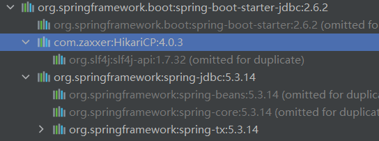

**导入数据库驱动**
为什么导入JDBC场景，官方不导入驱动？官方不知道我们接下要操作什么数据库。
数据库版本和驱动版本对应

```xml
在spring-boot-dependencies定义了mysql驱动的版本号 
<mysql.version>8.0.27</mysql.version>

<!--        某个数据库驱动，已仲裁版本，无需写版本号，默认8.0.27-->
        <dependency>
            <groupId>mysql</groupId>
            <artifactId>mysql-connector-java</artifactId>
    	    <version>8.0.27</version>
        </dependency>
    
直接依赖引入具体版本（maven的就近依赖原则）
重新声明版本（maven的属性的就近优先原则）
    <properties>
        <java.version>1.8</java.version>
        <mysql.version>5.1.49</mysql.version>
    </properties>
```


### 6.1.2 分析自动配置

**自动配置的类**

* DataSourceAutoConfiguration ： 数据源的自动配置

  * 修改数据源相关的配置：spring.datasource 需在yml配置好对应url

    ```java
    @ConfigurationProperties(
        prefix = "spring.datasource"
    )
    public class DataSourceProperties implements BeanClassLoaderAware, InitializingBean {
    ```

    ```yml
    spring:
    	datasource:
            url: jdbc:mysql://localhost:3306/spring_boot
            usernaem: root
            password: tintin
            driver-class-name: com.mysql.cj.jdbc.Driver
       #    type: com.zaxxer.hikari.HikariDataSource
    ```

    

  * 数据库连接池的配置，是自己容器中没有DataSource才自动配置的

    ```java
      @Configuration(
            proxyBeanMethods = false
        )
        @Conditional({DataSourceAutoConfiguration.PooledDataSourceCondition.class})
        @ConditionalOnMissingBean({DataSource.class, XADataSource.class})
        @Import({Hikari.class, Tomcat.class, Dbcp2.class, OracleUcp.class, Generic.class, DataSourceJmxConfiguration.class})
        protected static class PooledDataSourceConfiguration {
            protected PooledDataSourceConfiguration() {
            }
        }
    ```

  * 底层配置好的连接池是：HikariDataSource

    ```java
    @Configuration(
            proxyBeanMethods = false
        )
        @ConditionalOnClass({HikariDataSource.class})//starter-jdbc已引入HikariCP包
        @ConditionalOnMissingBean({DataSource.class})
        @ConditionalOnProperty(
            name = {"spring.datasource.type"},
            havingValue = "com.zaxxer.hikari.HikariDataSource",
            matchIfMissing = true
        )
        static class Hikari {
    ```

* DataSourceTransactionManagerAutoConfiguration： 事务管理器的自动配置

* JdbcTemplateAutoConfiguration： JdbcTemplate的自动配置，可以来对数据库进行crud

  * 可以修改这个配置项@ConfigurationProperties(prefix = "spring.jdbc") 来修改JdbcTemplate
  * @Bean@Primary    JdbcTemplate；容器中有这个组件

* JndiDataSourceAutoConfiguration： jndi的自动配置

* XADataSourceAutoConfiguration： 分布式事务相关的

**测试**

```java
    @Test
    void contextLoads() {
        jdbcTemplate.update("insert into boot_table values (?,?,?)",null,"tintin",18);
        List<Map<String, Object>> queryForList = jdbcTemplate.queryForList("select * from boot_table");
        System.out.println(queryForList);
//        for (Map<String, Object> map : queryForList) {
//            for (Map.Entry<String, Object> entry : map.entrySet()) {
//                System.out.println(entry);
//            }
//        }
    }
```

### 6.1.2 使用Druid数据源

**druid官方github地址**

[GitHub - alibaba/druid: 阿里云计算平台DataWorks(https://help.aliyun.com/document_detail/137663.html) 团队出品，为监控而生的数据库连接池](https://github.com/alibaba/druid)

**整合第三方技术的两种方式**

* 自定义
* 找starter

**自定义方式**

引入数据源依赖

```xml
<!--        阿里出品druid-->
        <dependency>
            <groupId>com.alibaba</groupId>
            <artifactId>druid</artifactId>
            <version>1.2.8</version>
        </dependency>
```

配置数据源

```java
    @ConfigurationProperties(
            prefix = "spring.datasource"
    )
    @Bean
    public DataSource dataSource() {
        DruidDataSource druidDataSource = new DruidDataSource();
//        druidDataSource.setUrl();
        return druidDataSource;
    }
```

监控页 StatViewServlet

用途包括：

* 提供监控信息展示的html页面
* 提供监控信息的JSON API

```java
    @Bean
    public ServletRegistrationBean statViewServlet() {
        StatViewServlet statViewServlet = new StatViewServlet();
        ServletRegistrationBean<StatViewServlet> servletRegistrationBean = new ServletRegistrationBean<>(statViewServlet,"/druid/*");
        return servletRegistrationBean;
    }
```

打开监控统计功能 StatFilter

用于统计监控信息；如SQL监控、URI监控

```java
需要给数据源中配置如下属性；可以允许多个filter，多个用，分割；如：

<property name="filters" value="stat,slf4j" />
    
            druidDataSource.setFilters("stat");
```

系统中所有filter：

| 别名          | Filter类名                                              |
| ------------- | ------------------------------------------------------- |
| default       | com.alibaba.druid.filter.stat.StatFilter                |
| stat          | com.alibaba.druid.filter.stat.StatFilter                |
| mergeStat     | com.alibaba.druid.filter.stat.MergeStatFilter           |
| encoding      | com.alibaba.druid.filter.encoding.EncodingConvertFilter |
| log4j         | com.alibaba.druid.filter.logging.Log4jFilter            |
| log4j2        | com.alibaba.druid.filter.logging.Log4j2Filter           |
| slf4j         | com.alibaba.druid.filter.logging.Slf4jLogFilter         |
| commonlogging | com.alibaba.druid.filter.logging.CommonsLogFilter       |

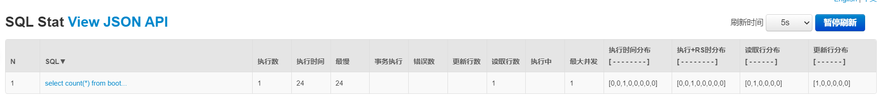


### 6.1.3  使用官方starter方式

**引入依赖**

```xml
        <!--        阿里出品druid整合springboot-->
        <dependency>
            <groupId>com.alibaba</groupId>
            <artifactId>druid-spring-boot-starter</artifactId>
            <version>1.2.8</version>
        </dependency>
```

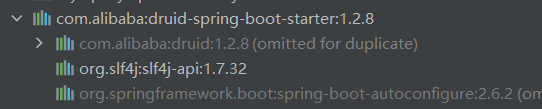

**分析自动配置**

```java
@Configuration
@ConditionalOnClass({DruidDataSource.class})
@AutoConfigureBefore({DataSourceAutoConfiguration.class})
@EnableConfigurationProperties({DruidStatProperties.class, DataSourceProperties.class})
@Import({DruidSpringAopConfiguration.class, DruidStatViewServletConfiguration.class, DruidWebStatFilterConfiguration.class, DruidFilterConfiguration.class})//引入四类配置
public class DruidDataSourceAutoConfigure {
    private static final Logger LOGGER = LoggerFactory.getLogger(DruidDataSourceAutoConfigure.class);

    public DruidDataSourceAutoConfigure() {
    }

    @Bean(
        initMethod = "init"
    )
    @ConditionalOnMissingBean
    public DataSource dataSource() {
        LOGGER.info("Init DruidDataSource");
        return new DruidDataSourceWrapper();
    }
}

```

* DruidSpringAopConfiguration.class,   监控SpringBean的；配置项：spring.datasource.druid.aop-patterns

* DruidStatViewServletConfiguration.class, 监控页的配置：spring.datasource.druid.stat-view-servlet；默认开启

*  DruidWebStatFilterConfiguration.class, web监控配置；spring.datasource.druid.web-stat-filter；默认开启

* DruidFilterConfiguration.class}) 所有Druid自己filter的配置

  ```java
      private static final String FILTER_STAT_PREFIX = "spring.datasource.druid.filter.stat";
      private static final String FILTER_CONFIG_PREFIX = "spring.datasource.druid.filter.config";
      private static final String FILTER_ENCODING_PREFIX = "spring.datasource.druid.filter.encoding";
      private static final String FILTER_SLF4J_PREFIX = "spring.datasource.druid.filter.slf4j";
      private static final String FILTER_LOG4J_PREFIX = "spring.datasource.druid.filter.log4j";
      private static final String FILTER_LOG4J2_PREFIX = "spring.datasource.druid.filter.log4j2";
      private static final String FILTER_COMMONS_LOG_PREFIX = "spring.datasource.druid.filter.commons-log";
      private static final String FILTER_WALL_PREFIX = "spring.datasource.druid.filter.wall";
      private static final String FILTER_WALL_CONFIG_PREFIX = "spring.datasource.druid.filter.wall.config";
  //通过配置文件开启
  ```

  配置文件

  ```yml
  spring:
  	datasource:
  	  # 开启并配置监控页
        stat-view-servlet:
          enabled: true
          reset-enable: true
          login-password: tintin0427
          login-username: tintin
        # 开启web应用监控
        web-stat-filter:
          enabled: true
          exclusions: '*.js,*.gif,*.jpg,*.png,*.css,*.ico,/druid/*'
          url-pattern: /*
        # 开启spring组件监控 需引入aop相关组件 spring-boot-starter-aop
        aop-patterns: com.tintin.boot
  
  ```

### 6.1.3 整合MyBatis操作

**引入依赖**

```xml
        <dependency>
            <groupId>org.mybatis.spring.boot</groupId>
            <artifactId>mybatis-spring-boot-starter</artifactId>
            <version>2.1.4</version>
        </dependency>
```

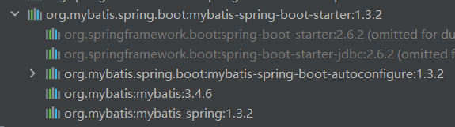

**配置模式**

* 全局配置文件
* SqlSessionFactory: 自动配置好了
* SqlSession：自动配置了 SqlSessionTemplate 组合了SqlSession
* @Import(AutoConfiguredMapperScannerRegistrar.class）；
* Mapper： 只要我们写的操作MyBatis的接口标准了 **@Mapper** 就会被自动扫描进来

```java
@Configuration
@ConditionalOnClass({SqlSessionFactory.class, SqlSessionFactoryBean.class})
@ConditionalOnBean({DataSource.class})
@EnableConfigurationProperties({MybatisProperties.class})
@AutoConfigureAfter({DataSourceAutoConfiguration.class})
public class MybatisAutoConfiguration {
    
@ConfigurationProperties(
    prefix = "mybatis"
)
public class MybatisProperties {
```

xml配置mybatis规则

```xml


<?xml version="1.0" encoding="UTF-8" ?>
<!DOCTYPE configuration
        PUBLIC "-//mybatis.org//DTD Config 3.0//EN"
        "http://mybatis.org/dtd/mybatis-3-config.dtd">
<configuration>
    <settings>
<!--        开启自动驼峰转换命名-->
        <setting name="mapUnderscoreToCamelCase" value="true"/>
    </settings>
</configuration>
```

yml配置mybatis规则

```yml
#配置mybatis规则
mybatis:
  config-location: classpath:mybatis/mybatis-config.xml # 全局配置文件位置
  mapper-locations: classpath:mybatis/mapper/AccountMapper.xml # sql映射文件位置
  #配置 private Configuration configuration; mybatis.configuration下面的所有，就是相当于改mybatis全局配置文件中的值
  #因此配置了全局配置文件位置 则不能配置configuration
  #推荐使用下方模式
  configuration:
    map-underscore-to-camel-case: true
```

流程

* 导入mybatis官方starter
* 编写mapper接口。标准@Mapper注解
* 编写sql映射文件并绑定mapper接口
* 在application.yaml中指定Mapper配置文件的位置，以及指定全局配置文件的信息 （建议；配置在mybatis.configuration）

**注解模式**

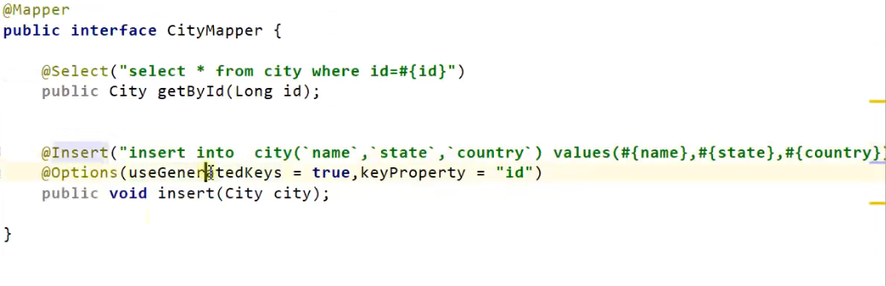

（混合模式）

```java
@Mapper
public interface CityMapper {

    @Select("select * from city where id=#{id}")
    public City getById(Long id);

    public void insert(City city);

}
```

流程

* 引入mybatis-starter
* 配置application.yaml中，指定mapper-location位置即可
* 编写Mapper接口并标注@Mapper注解
* 简单方法直接注解方式
* 复杂方法编写mapper.xml进行绑定映射
* @MapperScan("com.atguigu.admin.mapper") 简化，其他的接口就可以不用标注@Mapper注解

### 6.1.4 整合 MyBatis-Plus 完成CRUD

**简介**

[MyBatis-Plus](https://github.com/baomidou/mybatis-plus)（简称 MP）是一个 [MyBatis](http://www.mybatis.org/mybatis-3/) 的增强工具，在 MyBatis 的基础上只做增强不做改变，为简化开发、提高效率而生。
[mybatis plus 官网](https://baomidou.com/)
建议安装 MybatisX 插件 

**整合**

引入依赖

```xml
        <dependency>
            <groupId>com.baomidou</groupId>
            <artifactId>mybatis-plus</artifactId>
            <version>3.5.1</version>
        </dependency>
```

自动配置

* MybatisPlusAutoConfiguration 配置类，MybatisPlusProperties 配置项绑定。mybatis-plus：xxx 就是对mybatis-plus的定制
* SqlSessionFactory 自动配置好。底层是容器中默认的数据源，无需在全局配置文件中重新配置
* mapperLocations 自动配置好的。有默认值。classpath*:/mapper/**/*.xml；任意包的类路径下的所有mapper文件夹下任意路径下的所有xml都是sql映射文件。  建议以后sql映射文件，放在 mapper下
* 容器中也自动配置好了 SqlSessionTemplate
* @Mapper 标注的接口也会被自动扫描；建议直接 @MapperScan("com.atguigu.admin.mapper") 批量扫描就行

优点：

* 只需要我们的Mapper继承 BaseMapper 就可以拥有crud能力

**CRUD功能**

mapper层

```java
public interface UserMapper extends BaseMapper<User> { // BaseMapper接口已定义了对应的crud方法 并由BaseMapper.xml进行映射
}
```

service层

```java
public interface UserService extends IService<User> { // IService定义了Service接口的统一的默认方法和抽象方法
}


@Service
public class UserServiceImpl extends ServiceImpl<UserMapper,User> implements UserService { // ServiceImpl类根据对应Mapper实现了IService接口的方法

}

```

controller层

```java
@Controller
public class TableController {
    @Autowired
    UserService userService;
    
    @GetMapping("/dynamic_table")
    public String dynamicTable(Model model) {
        List<User> userList = userService.list();
        model.addAttribute("users",userList);
        return "table/dynamic_table";
    }
}
```

启动app

```java
@MapperScan("com.tintin.boot.mapper")// 自动扫描包下的mapper接口
@SpringBootApplication
public class Boot05WebAdminApplication {

    public static void main(String[] args) {
        SpringApplication.run(Boot05WebAdminApplication.class, args);
    }

}

```

配置分页插件

```java
package com.tintin.boot.config;

import com.baomidou.mybatisplus.annotation.DbType;
import com.baomidou.mybatisplus.extension.plugins.MybatisPlusInterceptor;
import com.baomidou.mybatisplus.extension.plugins.inner.PaginationInnerInterceptor;
import com.baomidou.mybatisplus.extension.plugins.pagination.optimize.JsqlParserCountOptimize;
import org.mybatis.spring.annotation.MapperScan;
import org.springframework.context.annotation.Bean;
import org.springframework.context.annotation.Configuration;

//Spring boot方式
@Configuration
public class MyBatisConfig {

    // 旧版
//    @Bean
//    public PaginationInterceptor paginationInterceptor() {
//        PaginationInterceptor paginationInterceptor = new PaginationInterceptor();
//        // 设置请求的页面大于最大页后操作， true调回到首页，false 继续请求  默认false
//        // paginationInterceptor.setOverflow(false);
//        // 设置最大单页限制数量，默认 500 条，-1 不受限制
//        // paginationInterceptor.setLimit(500);
//        // 开启 count 的 join 优化,只针对部分 left join
//        paginationInterceptor.setCountSqlParser(new JsqlParserCountOptimize(true));
//        return paginationInterceptor;
//    }

    // 最新版
    @Bean
    public MybatisPlusInterceptor mybatisPlusInterceptor() {
        MybatisPlusInterceptor interceptor = new MybatisPlusInterceptor();
        interceptor.addInnerInterceptor(new PaginationInnerInterceptor(DbType.H2));
        return interceptor;
    }

}


```

controller

```java
@GetMapping("/dynamic_table")
    public String dynamicTable(Model model,
                               @RequestParam(value = "pn", defaultValue = "1" ) Long pn) {
//        List<User> users = Arrays.asList(new User("tintin", "123456",18,"821294434@qq.com"),
//                new User("GEM", "123456",18,"821294434@qq.com"),
//                new User("KDB", "123456",18,"821294434@qq.com"),
//                new User("HHHH", "123456",18,"821294434@qq.com"));
//        model.addAttribute("users",users);
//        if (users.size() > 3) {
//            throw new UserToManyException();
//        }
        //分页功能
        Page<User> userPage = new Page<>(pn, 2);
        Page<User> page = userService.page(userPage, null);
        model.addAttribute("page",page);
//        List<User> userList = userService.list();
//        model.addAttribute("users",userList);
        return "table/dynamic_table";
    }

    
    //删除功能
    @GetMapping("/user/delete/{id}")
    public String deleteUser(@PathVariable("id") Long id,
                             @RequestParam("pn") Long pn,
                             RedirectAttributes redirectAttributes) {
        userService.removeById(id);
        redirectAttributes.addAttribute("pn",pn);
        return "redirect:/dynamic_table";
    }
```

## 6.2 NoSQL

### 6.2.1 Redis自动配置

```xml
        <dependency>
            <groupId>org.springframework.boot</groupId>
            <artifactId>spring-boot-starter-data-redis</artifactId>
        </dependency>
```

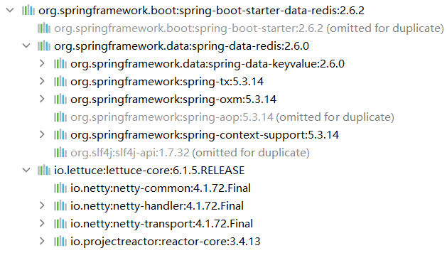

自动配置：

* RedisAutoConfiguration 自动配置类。RedisProperties 属性类 --> spring.redis.xxx是对redis的配置
* 连接工厂是准备好的。LettuceConnectionConfiguration、JedisConnectionConfiguration
* 自动注入了RedisTemplate<Object, Object> ： xxxTemplate；
* 自动注入了StringRedisTemplate；k：v都是String
* key：value
* 底层只要我们使用 StringRedisTemplate、RedisTemplate就可以操作redis

### 6.2.2 测试

```yml
spring:
   #配置redis
  redis:
    host: 192.168.10.102
    port: 6379
#    lettuce:
#      pool:
#        max-active: 20
#        max-wait: -1
#        max-idle: 5
#        min-idle: 0
    jedis:
      pool:
        max-active: 10
    timeout: 1800000
```

```java
@Test
public void redisTest() {
    ValueOperations<String, String> stringStringValueOperations = stringRedisTemplate.opsForValue();
    stringStringValueOperations.set("hello","world");
    System.out.println(stringStringValueOperations.get("hello"));
}
```

### 6.2.3 切换至jedis

```xml
        <!--        导入jedis-->
        <dependency>
            <groupId>redis.clients</groupId>
            <artifactId>jedis</artifactId>
        </dependency>
```

# 7 单元测试

## 7.1 Junit5变化

Spring Boot 2.2.0 版本开始引入 JUnit 5 作为单元测试默认库
作为最新版本的JUnit框架，JUnit5与之前版本的Junit框架有很大的不同。由三个不同子项目的几个不同模块组成。
JUnit 5 = JUnit Platform + JUnit Jupiter + JUnit Vintage
JUnit Platform: Junit Platform是在JVM上启动测试框架的基础，不仅支持Junit自制的测试引擎，其他测试引擎也都可以接入。
JUnit Jupiter: JUnit Jupiter提供了JUnit5的新的编程模型，是JUnit5新特性的核心。内部 包含了一个测试引擎，用于在Junit Platform上运行。
JUnit Vintage: 由于JUint已经发展多年，为了照顾老的项目，JUnit Vintage提供了兼容JUnit4.x,Junit3.x的测试引擎。

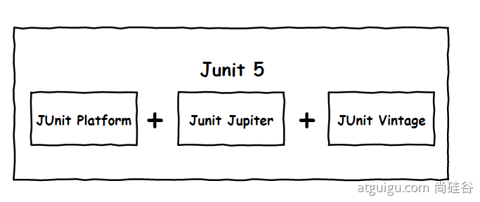

**依赖**

```xml
<dependency>
  <groupId>org.springframework.boot</groupId>
  <artifactId>spring-boot-starter-test</artifactId>
  <scope>test</scope>
</dependency>
```


> 注意：
> SpringBoot 2.4 以上版本移除了默认对 Vintage 的依赖。如果需要兼容junit4需要自行引入（不能使用junit4的功能 @Test）
> JUnit 5’s Vintage Engine Removed from spring-boot-starter-test,如果需要继续兼容junit4需要自行引入vintage

```xml
<dependency>
    <groupId>org.junit.vintage</groupId>
    <artifactId>junit-vintage-engine</artifactId>
    <scope>test</scope>
    <exclusions>
        <exclusion>
            <groupId>org.hamcrest</groupId>
            <artifactId>hamcrest-core</artifactId>
        </exclusion>
    </exclusions>
</dependency>
```

**现在**

```java
@SpringBootTest
class Boot05WebAdminApplicationTests {
    @Test
    void contextLoads() {
    }
}

```

**以前**

@SpringBootTest + @RunWith(SpringTest.class)


SpringBoot整合Junit以后。

* 编写测试方法：@Test标注（注意需要使用junit5版本的注解）
* Junit类具有Spring的功能，@Autowired、比如 **@Transactional 标注测试方法，测试完成后自动回滚**

## 7.2 Junit5常用注解

[JUnit 5 User Guide](https://junit.org/junit5/docs/current/user-guide/#writing-tests-annotations)

* @Test :表示方法是测试方法。但是与JUnit4的@Test不同，他的职责非常单一不能声明任何属性，拓展的测试将会由Jupiter提供额外测试
* @ParameterizedTest :表示方法是参数化测试，下方会有详细介绍
* @RepeatedTest :表示方法可重复执行，下方会有详细介绍
* @DisplayName :为测试类或者测试方法设置展示名称
* @BeforeEach :表示在每个单元测试之前执行
* @AfterEach :表示在每个单元测试之后执行
* @BeforeAll :表示在所有单元测试之前执行
* @AfterAll :表示在所有单元测试之后执行
* @Tag :表示单元测试类别，类似于JUnit4中的@Categories
* @Disabled :表示测试类或测试方法不执行，类似于JUnit4中的@Ignore
* @Timeout :表示测试方法运行如果超过了指定时间将会返回错误
* @ExtendWith :为测试类或测试方法提供扩展类引用

```java
@Target({ElementType.TYPE})
@Retention(RetentionPolicy.RUNTIME)
@Documented
@Inherited
@BootstrapWith(SpringBootTestContextBootstrapper.class)
@ExtendWith({SpringExtension.class//spring的拓展功能
public @interface SpringBootTest {
    
    
@SpringBootTest
@DisplayName("TestingClass")
public class Junit5Test {
    @Autowired
    RedisUrlCountInterceptor redisUrlCountInterceptor;

    @DisplayName("testingMethod1")
    @Test
    public void test1() {
        System.out.println("1 testing...");
        System.out.println("get spring bean " + redisUrlCountInterceptor.getClass());
    }

    @Disabled
    @DisplayName("testingMethod2")
    @Test
    public void test2() {
        System.out.println("2 testing...");
    }

    @DisplayName("testingMethod3")
    @RepeatedTest(2)
    @Test
    public void test3() {
        System.out.println("3 testing...");
    }

    @BeforeEach
    public void beforeEach() {
        System.out.println("test started");
    }

    @AfterEach
    public void afterEach() {
        System.out.println("test ended");
    }

    @BeforeAll
    static public void beforeAll() {
        System.out.println("all started");
    }

    @AfterAll
    static public void afterAll() {
        System.out.println("all ended");
    }
}

```

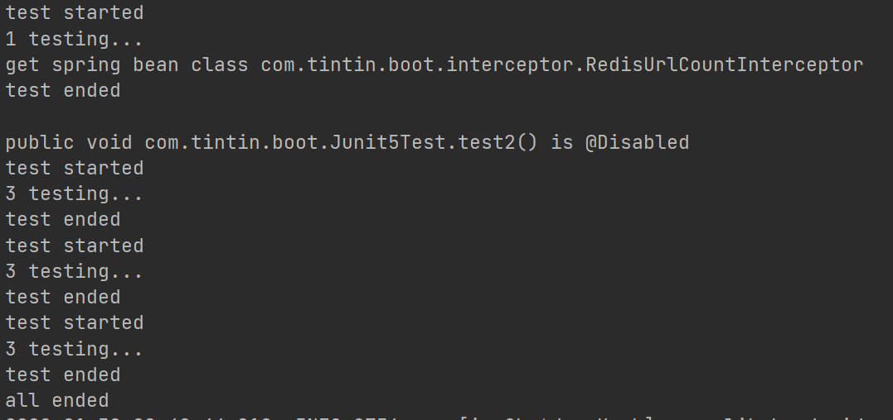

## 7.3 断言（assertions）

断言（assertions）是测试方法中的核心部分，用来对测试需要满足的条件进行验证。这些断言方法都是 org.junit.jupiter.api.Assertions 的静态方法。

检查业务逻辑返回的数据是否合理。
所有的测试运行结束以后，会有一个详细的测试报告；

只有断言成功，代码才会继续执行

JUnit 5 内置的断言可以分成如下几个类别：

### 7.3.1 简单断言

用来对单个值进行简单的验证。如：

| 方法            | 说明                                 |
| --------------- | ------------------------------------ |
| assertEquals    | 判断两个对象或两个原始类型是否相等   |
| assertNotEquals | 判断两个对象或两个原始类型是否不相等 |
| assertSame      | 判断两个对象引用是否指向同一个对象   |
| assertNotSame   | 判断两个对象引用是否指向不同的对象   |
| assertTrue      | 判断给定的布尔值是否为 true          |
| assertFalse     | 判断给定的布尔值是否为 false         |
| assertNull      | 判断给定的对象引用是否为 null        |
| assertNotNull   | 判断给定的对象引用是否不为 null      |

### 7.3.2 数组断言

通过 assertArrayEquals 方法来判断两个对象或原始类型的数组是否相等

```java
@Test
@DisplayName("array assertion")
public void array() {
 assertArrayEquals(new int[]{1, 2}, new int[] {1, 2});
}
```

### 7.3.3 组合断言
assertAll 方法接受多个 org.junit.jupiter.api.Executable 函数式接口的实例作为要验证的断言，可以通过 lambda 表达式很容易的提供这些断言

```java
@Test
@DisplayName("assert all")
public void all() {
 assertAll("Math",
    () -> assertEquals(2, 1 + 1),
    () -> assertTrue(1 > 0)
 );
}
```

### 7.3.4 异常断言
在JUnit4时期，想要测试方法的异常情况时，需要用@Rule注解的ExpectedException变量还是比较麻烦的。而JUnit5提供了一种新的断言方式Assertions.assertThrows() ,配合函数式编程就可以进行使用。

```java
@Test
@DisplayName("异常测试")
public void exceptionTest() {
    ArithmeticException exception = Assertions.assertThrows(
           //扔出断言异常
            ArithmeticException.class, () -> System.out.println(1 % 0)); // "业务逻辑意外的正常运行了"

}
```

### 7.3.5 超时断言
Junit5还提供了Assertions.assertTimeout() 为测试方法设置了超时时间

```java
@Test
@DisplayName("超时测试")
public void timeoutTest() {
    //如果测试方法时间超过1s将会异常
    Assertions.assertTimeout(Duration.ofMillis(1000), () -> Thread.sleep(500));
}
```

### 7.3.6 快速失败
通过 fail 方法直接使得测试失败

```java
@Test
@DisplayName("fail")
public void shouldFail() {
 fail("This should fail");
}
```

## 7.4 前置条件（assumptions）

JUnit 5 中的前置条件（assumptions【假设】）类似于断言，不同之处在于不满足的断言会使得测试方法失败，而**不满足的前置条件只会使得测试方法的执行终止**。前置条件可以看成是测试方法执行的前提，当该前提不满足时，就没有继续执行的必要。被前置条件判定终止后，该方法将被**跳过**

```java
@DisplayName("前置条件")
public class AssumptionsTest {
 private final String environment = "DEV";
 
 @Test
 @DisplayName("simple")
 public void simpleAssume() {
    assumeTrue(Objects.equals(this.environment, "DEV"));
    assumeFalse(() -> Objects.equals(this.environment, "PROD"));
 }
 
 @Test
 @DisplayName("assume then do")
 public void assumeThenDo() {
    assumingThat(
       Objects.equals(this.environment, "DEV"),
       () -> System.out.println("In DEV")
    );
 }
}
```

assumeTrue 和 assumFalse 确保给定的条件为 true 或 false，不满足条件会使得测试执行终止。assumingThat 的参数是表示条件的布尔值和对应的 Executable 接口的实现对象。只有条件满足时，Executable 对象才会被执行；当条件不满足时，测试执行并不会终止。

## 7.5 嵌套测试
JUnit 5 可以通过 Java 中的内部类和@Nested 注解实现嵌套测试，从而可以**更好的把相关的测试方法组织在一起**。在内部类中可以使用@BeforeEach 和@AfterEach 注解，而且嵌套的层次没有限制。

## 7.6 参数化测试

参数化测试是JUnit5很重要的一个新特性，它使得用不同的参数多次运行测试成为了可能，也为我们的单元测试带来许多便利。

标注@ParameterizedTest注解来指明当前测试方法为参数化测试

利用@ValueSource等注解，指定入参，我们将可以使用不同的参数进行多次单元测试，而不需要每新增一个参数就新增一个单元测试，省去了很多冗余代码。

@ValueSource: 为参数化测试指定入参来源，支持八大基础类以及String类型,Class类型
@NullSource: 表示为参数化测试提供一个null的入参
@EnumSource: 表示为参数化测试提供一个枚举入参
@CsvFileSource：表示读取指定CSV文件内容作为参数化测试入参
@MethodSource：表示读取指定方法的返回值作为参数化测试入参(注意方法返回需要是一个流)

```java
@ParameterizedTest
@ValueSource(strings = {"one", "two", "three"})
@DisplayName("参数化测试1")
public void parameterizedTest1(String string) {
    System.out.println(string);
    Assertions.assertTrue(StringUtils.isNotBlank(string));
}


@ParameterizedTest
@MethodSource("method")    //指定方法名
@DisplayName("方法来源参数")
public void testWithExplicitLocalMethodSource(String name) {
    System.out.println(name);
    Assertions.assertNotNull(name);
}

static Stream<String> method() {
    return Stream.of("apple", "banana");
}
```

## 7.7 版本变动

在进行迁移的时候需要注意如下的变化：

* 注解在 org.junit.jupiter.api 包中，断言在 org.junit.jupiter.api.Assertions 类中，前置条件在 org.junit.jupiter.api.Assumptions 类中。
* 把@Before 和@After 替换成@BeforeEach 和@AfterEach。
* 把@BeforeClass 和@AfterClass 替换成@BeforeAll 和@AfterAll。
* 把@Ignore 替换成@Disabled。
* 把@Category 替换成@Tag。
* 把@RunWith、@Rule 和@ClassRule 替换成@ExtendWith。

# 8 指标监控

## 8.1 SpringBoot Actuator

### 8.1.1 简介
未来每一个微服务在云上部署以后，我们都需要对其进行监控、追踪、审计、控制等。SpringBoot就抽取了Actuator场景，使得我们每个微服务快速引用即可获得生产级别的应用监控、审计等功能。

```xml
<dependency>
    <groupId>org.springframework.boot</groupId>
    <artifactId>spring-boot-starter-actuator</artifactId>
</dependency>
```

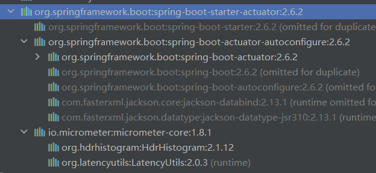

### 8.1.2 版本变化

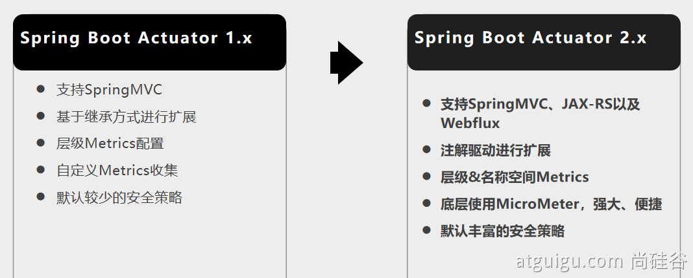

### 8.1.3 使用

引入场景

* 访问 http://localhost:8080/actuator/**
* 暴露所有监控信息为HTTP


# 9 原理解析

## 9.1 Profile功能

为了方便多环境适配，springboot简化了profile功能。

### 9.1.1 application-profile功能

默认配置文件  application.yaml；任何时候都会加载

* 指定环境配置文件  application-{env}.yaml

  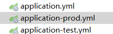

* 激活指定环境
  * 配置文件激活 
  
    ```yml
    spring:
      profiles:
        active: prod
    ```
  
  * 命令行激活：java -jar xxx.jar --spring.profiles.active=prod  --person.name=haha
    * 修改配置文件的任意值，命令行优先
  
* **默认配置与环境配置同时生效**

* 同名配置项，指定profile配置优先

### 9.1.2 @Profile条件装配

```java
@Configuration(proxyBeanMethods = false)
@Profile("production")
public class ProductionConfiguration {

    // ...

}
```

### 9.1.3 profile分组

```properties
spring.profiles.group.production[0]=proddb
spring.profiles.group.production[1]=prodmq

使用：--spring.profiles.active=production  激活
```

### 9.2 外部化配置

**下覆盖上**

1. Default properties (specified by setting SpringApplication.setDefaultProperties).
2. [@PropertySource](https://docs.spring.io/spring/docs/5.3.1/javadoc-api/org/springframework/context/annotation/PropertySource.html) annotations on your @Configuration classes. Please note that such property sources are not added to the Environment until the application context is being refreshed. This is too late to configure certain properties such as logging.* and spring.main.* which are read before refresh begins.
3. **Config data (such as application.properties files) 配置文件**
4. A RandomValuePropertySource that has properties only in random.*.
5. OS environment variables.
6. Java System properties (System.getProperties()).
7. JNDI attributes from java:comp/env.
8. ServletContext init parameters.
9. ServletConfig init parameters.
10. Properties from SPRING_APPLICATION_JSON (inline JSON embedded in an environment variable or system property).
11. **Command line arguments. 命令行参数**
12. properties attribute on your tests. Available on [@SpringBootTest](https://docs.spring.io/spring-boot/docs/2.4.0/api/org/springframework/boot/test/context/SpringBootTest.html) and the [test annotations for testing a particular slice of your application](https://docs.spring.io/spring-boot/docs/current/reference/html/spring-boot-features.html#boot-features-testing-spring-boot-applications-testing-autoconfigured-tests).
13. [@TestPropertySource](https://docs.spring.io/spring/docs/5.3.1/javadoc-api/org/springframework/test/context/TestPropertySource.html) annotations on your tests.
14. [Devtools global settings properties](https://docs.spring.io/spring-boot/docs/current/reference/html/using-spring-boot.html#using-boot-devtools-globalsettings) in the $HOME/.config/spring-boot directory when devtools is active.

### 9.2.1 外部配置源

常用：**Java属性文件、YAML文件、环境变量、命令行参数；**

查看

```java
@SpringBootApplication
public class Boot09FeatureProfileApplication {

    public static void main(String[] args) {
        ConfigurableApplicationContext run = SpringApplication.run(Boot09FeatureProfileApplication.class, args);
        ConfigurableEnvironment environment = run.getEnvironment();
        Map<String, Object> systemEnvironment = environment.getSystemEnvironment();
        Map<String, Object> systemProperties = environment.getSystemProperties();
        System.out.println(systemEnvironment);
        System.out.println(systemProperties);
    }

}

```

自动装配

```java
    @Value("${JAVA_HOME}")
    private String javaHome;
```


### 9.2.2 配置文件查找位置

**下覆盖上**

1. classpath 根路径
2.  classpath 根路径下config目录
3. jar包当前目录
4. jar包当前目录的config目录
5. /config子目录的直接子目录

### 9.2.3 配置文件加载顺序

1. 当前jar包内部的application.properties和application.yml
2. 当前jar包内部的application-{profile}.properties 和 application-{profile}.yml
3. 引用的外部jar包的application.properties和application.yml
4. 引用的外部jar包的application-{profile}.properties 和 application-{profile}.yml

### 9.2.4 总结

**指定环境优先，外部优先，后面的可以覆盖前面的同名配置项**

## 9.3 自定义starter

### 9.3.1 starter原理

* starter-pom引入 autoconfigurer 包

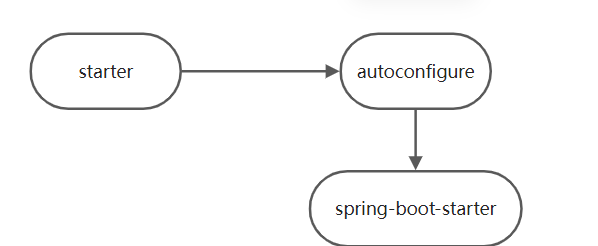

* autoconfigure包中配置使用 META-INF/spring.factories 中 EnableAutoConfiguration 的值，使得项目启动加载指定的自动配置类
* 编写自动配置类 xxxAutoConfiguration -> xxxxProperties
  * @Configuration
  * @Conditional
  * @EnableConfigurationProperties
  * @Bean
  * ......
* 引入starter --- xxxAutoConfiguration --- 容器中放入组件 ---- 绑定xxxProperties ---- 配置项

### 自定义starter

atguigu-hello-spring-boot-starter（启动器）
atguigu-hello-spring-boot-starter-autoconfigure（自动配置包）

## 9.4 SpringBoot原理

Spring原理【[Spring注解](https://www.bilibili.com/video/BV1gW411W7wy?p=1)】、SpringMVC原理、自动配置原理、SpringBoot原理

### 9.4.1 SpringBoot启动过程

1. 创建 SpringApplication

   * 保存一些信息。
   * 判定当前应用的类型。ClassUtils。Servlet
   * 找bootstrappers：初始启动引导器：去spring.factories文件中找 org.springframework.boot.Bootstrapper
     * `List<Bootstrapper>`
   * 找 ApplicationContextInitializer；去spring.factories找 ApplicationContextInitializer
     * `List<ApplicationContextInitializer<?>> initializers`
   * 找 ApplicationListener  ；应用监听器。去spring.factories找 ApplicationListener
     * `List<ApplicationListener<?>> listeners`

   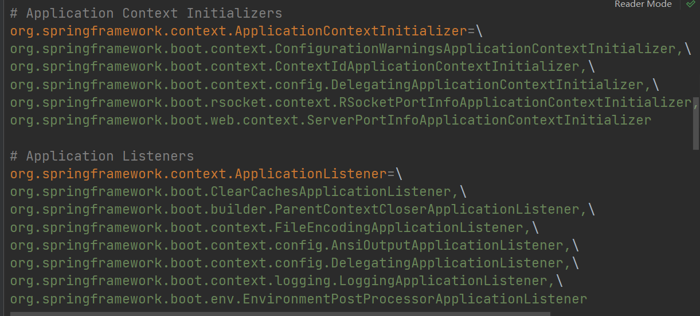

   ```java
   //SpringApplication.class
   	public SpringApplication(ResourceLoader resourceLoader, Class<?>... primarySources) {
           this.sources = new LinkedHashSet();
           this.bannerMode = Mode.CONSOLE;
           this.logStartupInfo = true;
           this.addCommandLineProperties = true;
           this.addConversionService = true;
           this.headless = true;
           this.registerShutdownHook = true;
           this.additionalProfiles = Collections.emptySet();
           this.isCustomEnvironment = false;
           this.lazyInitialization = false;
           this.applicationContextFactory = ApplicationContextFactory.DEFAULT;
           this.applicationStartup = ApplicationStartup.DEFAULT;
           this.resourceLoader = resourceLoader;
           Assert.notNull(primarySources, "PrimarySources must not be null");
           this.primarySources = new LinkedHashSet(Arrays.asList(primarySources));
           this.webApplicationType = WebApplicationType.deduceFromClasspath();
           this.bootstrapRegistryInitializers = new ArrayList(this.getSpringFactoriesInstances(BootstrapRegistryInitializer.class));
           this.setInitializers(this.getSpringFactoriesInstances(ApplicationContextInitializer.class));
           this.setListeners(this.getSpringFactoriesInstances(ApplicationListener.class));
           this.mainApplicationClass = this.deduceMainApplicationClass();
       }
   ```

2. 运行 SpringApplication
   * StopWatch
   * 记录应用的启动时间
   * 创建引导上下文（Context环境）createBootstrapContext()
     * 获取到所有之前的 bootstrappers 挨个执行 intitialize() 来完成对引导启动器上下文环境设置
   * 让当前应用进入headless模式。java.awt.headless
   * 获取所有 RunListener（运行监听器）【为了方便所有Listener进行事件感知】
     * getSpringFactoriesInstances 去spring.factories找 SpringApplicationRunListener. 
   * 遍历 SpringApplicationRunListener 调用 starting 方法；
     * 相当于通知所有感兴趣系统正在启动过程的人，项目正在 starting。
   * 保存命令行参数；ApplicationArguments
   * 准备环境 prepareEnvironment（）;
     * 返回或者创建基础环境信息对象。StandardServletEnvironment
     * 配置环境信息对象。
     * 读取所有的配置源的配置属性值。
     * 绑定环境信息
     * 监听器调用 listener.environmentPrepared()；通知所有的监听器当前环境准备完成
   * 创建IOC容器（createApplicationContext（））
     * 根据项目类型（Servlet）创建容器，
     * 当前会创建 AnnotationConfigServletWebServerApplicationContext
   * 准备ApplicationContext IOC容器的基本信息  prepareContext()
     * 保存环境信息
     * IOC容器的后置处理流程。
     * 应用初始化器；applyInitializers；
       * 遍历所有的 ApplicationContextInitializer 。调用 initialize.。来对ioc容器进行初始化扩展功能
       * 遍历所有的 listener 调用 contextPrepared。EventPublishRunListenr；通知所有的监听器contextPrepared
     * 所有的监听器 调用 contextLoaded。通知所有的监听器 contextLoaded；
   * 刷新IOC容器。refreshContext
     * 创建容器中的所有组件（Spring注解）
   * 容器刷新完成后工作？afterRefresh
   * 所有监听 器 调用 listeners.started(context); 通知所有的监听器 started
   * 调用所有runners；callRunners()
     * 获取容器中的 ApplicationRunner 
     * 获取容器中的  CommandLineRunner
     * 合并所有runner并且按照@Order进行排序
     * 遍历所有的runner。调用 run 方法
   * 如果以上有异常，
     * 调用Listener 的 failed
   * 调用所有监听器的 running 方法  listeners.running(context); 通知所有的监听器 running 
   * running如果有问题。继续通知 failed 。调用所有 Listener 的 failed；通知所有的监听器 failed


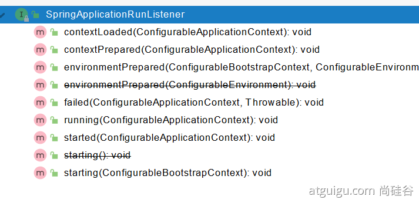
