# 1 微服务架构与Spring Cloud

## 1.1 微服务架构概述


**基于分布式的微服务架构**

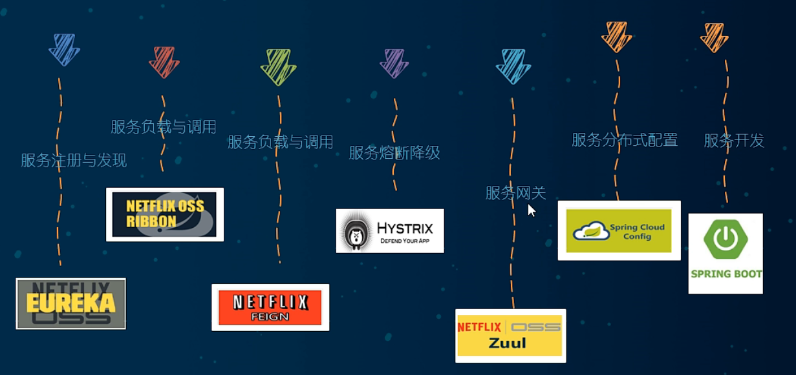

* 服务注册与发现
* 服务调用
* 服务熔断
* 负载均衡
* 服务消息队列
* 配置中心管理
* 服务网关
* 服务监控
* 全链路追踪
* 自动化构建部署
* 服务定时任务操作
* ...

## 1.2 Spring Cloud简介

分布式微服务架构一站式解决方案，是多种微服务架构落地技术的集合体，俗称微服务全家桶

## 1.3 Spring Cloud技术栈

## 1.4 总结

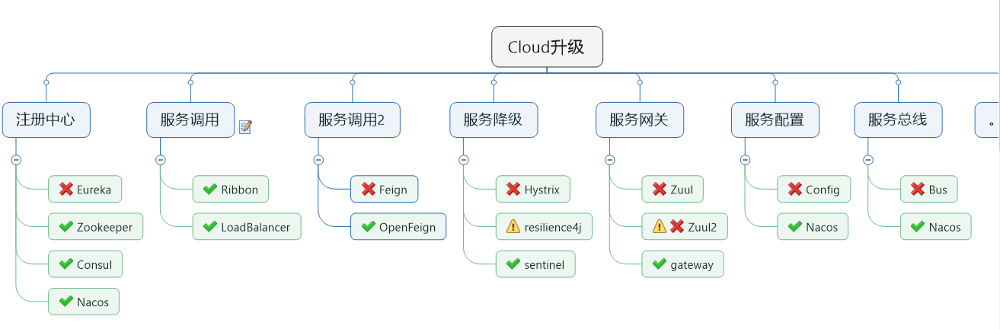 

# 2 版本选择

[Spring Cloud](https://spring.io/projects/spring-cloud)

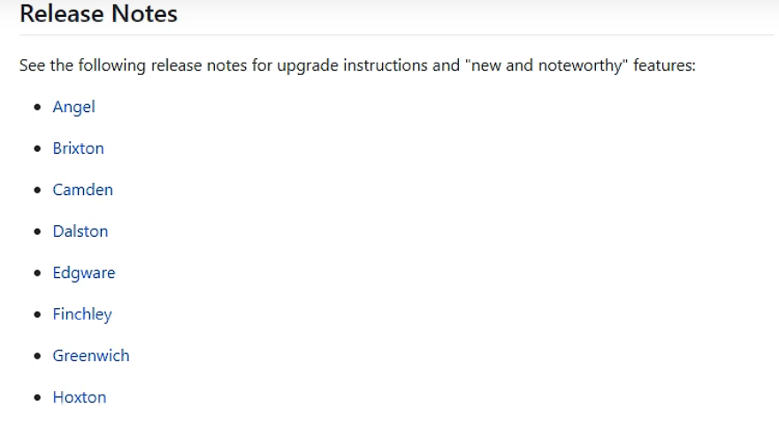

详细查看spring boot与spring cloud版本依赖关系

https://start.spring.io/actuator/info

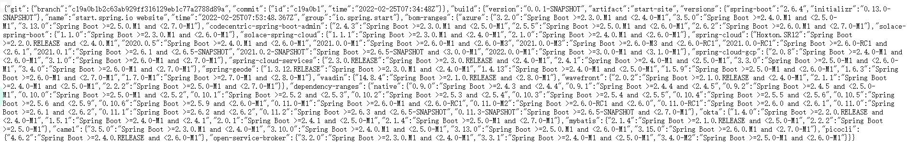

[在线工具 - 你的工具箱 (tool.lu)](https://tool.lu/) 使用json转换工具

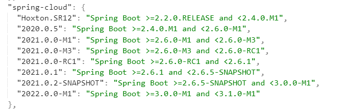

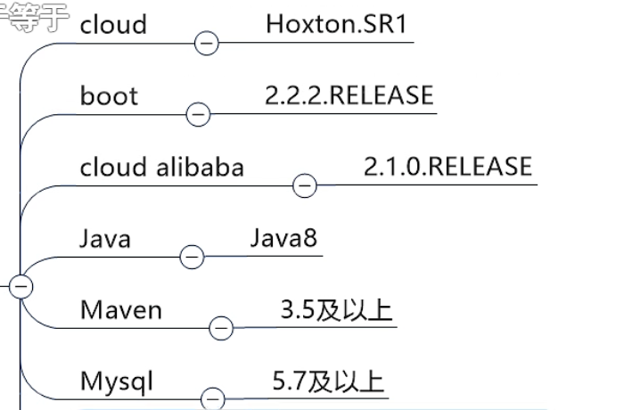

# 3 微服务架构代码构建

## 3.1 约定>配置>代码

## 3.2 总父工程 pom.xml

```xml
<?xml version="1.0" encoding="UTF-8"?>

<project xmlns="http://maven.apache.org/POM/4.0.0" xmlns:xsi="http://www.w3.org/2001/XMLSchema-instance"
  xsi:schemaLocation="http://maven.apache.org/POM/4.0.0 http://maven.apache.org/xsd/maven-4.0.0.xsd">
  <modelVersion>4.0.0</modelVersion>

  <groupId>com.tintin.springcloud</groupId>
  <artifactId>springcloud</artifactId>
  <version>1.0-SNAPSHOT</version>
  <packaging>pom</packaging>


  <!-- 统一管理jar包版本 -->
  <properties>
    <project.build.sourceEncoding>UTF-8</project.build.sourceEncoding>
    <maven.compiler.source>1.8</maven.compiler.source>
    <maven.compiler.target>1.8</maven.compiler.target>
    <junit.version>4.12</junit.version>
    <log4j.version>1.2.17</log4j.version>
    <lombok.version>1.16.18</lombok.version>
    <mysql.version>5.1.47</mysql.version>
    <druid.version>1.1.16</druid.version>
    <mybatis.spring.boot.version>1.3.0</mybatis.spring.boot.version>
  </properties>

  <!-- 子模块继承之后，提供作用：锁定版本+子modlue不用写groupId和version  -->
  <dependencyManagement>
    <dependencies>
      <!--spring boot 2.2.2-->
      <dependency>
        <groupId>org.springframework.boot</groupId>
        <artifactId>spring-boot-dependencies</artifactId>
        <version>2.2.2.RELEASE</version>
        <type>pom</type>
        <scope>import</scope>
      </dependency>
      <!--spring cloud Hoxton.SR1-->
      <dependency>
        <groupId>org.springframework.cloud</groupId>
        <artifactId>spring-cloud-dependencies</artifactId>
        <version>Hoxton.SR1</version>
        <type>pom</type>
        <scope>import</scope>
      </dependency>
      <!--spring cloud alibaba 2.1.0.RELEASE-->
      <dependency>
        <groupId>com.alibaba.cloud</groupId>
        <artifactId>spring-cloud-alibaba-dependencies</artifactId>
        <version>2.1.0.RELEASE</version>
        <type>pom</type>
        <scope>import</scope>
      </dependency>
      <dependency>
        <groupId>mysql</groupId>
        <artifactId>mysql-connector-java</artifactId>
        <version>${mysql.version}</version>
      </dependency>
      <dependency>
        <groupId>com.alibaba</groupId>
        <artifactId>druid</artifactId>
        <version>${druid.version}</version>
      </dependency>
      <dependency>
        <groupId>org.mybatis.spring.boot</groupId>
        <artifactId>mybatis-spring-boot-starter</artifactId>
        <version>${mybatis.spring.boot.version}</version>
      </dependency>
      <dependency>
        <groupId>junit</groupId>
        <artifactId>junit</artifactId>
        <version>${junit.version}</version>
      </dependency>
      <dependency>
        <groupId>log4j</groupId>
        <artifactId>log4j</artifactId>
        <version>${log4j.version}</version>
      </dependency>
      <dependency>
        <groupId>org.projectlombok</groupId>
        <artifactId>lombok</artifactId>
        <version>${lombok.version}</version>
        <optional>true</optional>
      </dependency>
    </dependencies>
  </dependencyManagement>

  <build>
    <plugins>
      <plugin>
        <groupId>org.springframework.boot</groupId>
        <artifactId>spring-boot-maven-plugin</artifactId>
        <configuration>
          <fork>true</fork>
          <addResources>true</addResources>
        </configuration>
      </plugin>
    </plugins>
  </build>


</project>

```


通常会在一个组织或者项目的最顶层的父POM 中看到dependencyManagement 元素。

使用pom.xml 中的dependencyManagement 元素能让所有在子项目中引用一个依赖而不用显式的列出版本号。

 dependencyManagement里只是声明依赖，并不实现引入，因此子项目需要显示的声明需要用的依赖。

我们看到，这里多了一个`<scope>import</scope>`，它的意思是将spring-boot-dependencies中dependencyManagement的dependencies，全部引入到当前工程的dependencyManagement中。

## 3.3 REST微服务工程构建

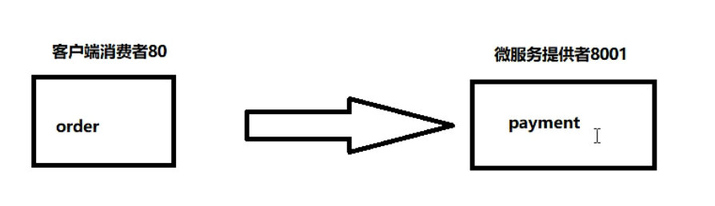

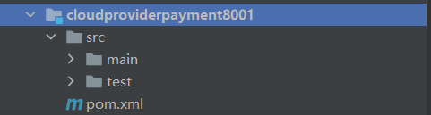

### 3.3.1 微服务提供者

**子工程pom.xml**

```xml
<?xml version="1.0" encoding="UTF-8"?>
<project xmlns="http://maven.apache.org/POM/4.0.0"
         xmlns:xsi="http://www.w3.org/2001/XMLSchema-instance"
         xsi:schemaLocation="http://maven.apache.org/POM/4.0.0 http://maven.apache.org/xsd/maven-4.0.0.xsd">
    <parent>
        <artifactId>springcloud</artifactId>
        <groupId>com.tintin.springcloud</groupId>
        <version>1.0-SNAPSHOT</version>
    </parent>
    <modelVersion>4.0.0</modelVersion>

    <artifactId>cloudproviderpayment8001</artifactId>

    <properties>
        <maven.compiler.source>8</maven.compiler.source>
        <maven.compiler.target>8</maven.compiler.target>
    </properties>

    <dependencies>
        <dependency>
            <groupId>org.springframework.boot</groupId>
            <artifactId>spring-boot-starter-web</artifactId>
        </dependency>
        <dependency>
            <groupId>org.springframework.boot</groupId>
            <artifactId>spring-boot-starter-actuator</artifactId>
        </dependency>
        <dependency>
            <groupId>org.mybatis.spring.boot</groupId>
            <artifactId>mybatis-spring-boot-starter</artifactId>
        </dependency>
        <dependency>
            <groupId>com.alibaba</groupId>
            <artifactId>druid-spring-boot-starter</artifactId>
            <version>1.1.10</version>
        </dependency>
        <!--mysql-connector-java-->
        <dependency>
            <groupId>mysql</groupId>
            <artifactId>mysql-connector-java</artifactId>
        </dependency>
        <!--jdbc-->
        <dependency>
            <groupId>org.springframework.boot</groupId>
            <artifactId>spring-boot-starter-jdbc</artifactId>
        </dependency>
        <dependency>
            <groupId>org.springframework.boot</groupId>
            <artifactId>spring-boot-devtools</artifactId>
            <scope>runtime</scope>
            <optional>true</optional>
        </dependency>
        <dependency>
            <groupId>org.projectlombok</groupId>
            <artifactId>lombok</artifactId>
            <optional>true</optional>
        </dependency>
        <dependency>
            <groupId>org.springframework.boot</groupId>
            <artifactId>spring-boot-starter-test</artifactId>
            <scope>test</scope>
        </dependency>
    </dependencies>
</project>
```

**服务端口和名称**

```yml
server:
  port: 8001

spring:
  application:
    name: cloud-payment-service

```

**数据源和mybatis**

```yml
  datasource:
    type: com.alibaba.druid.pool.DruidDataSource
    driver-class-name: com.mysql.jdbc.Driver
    url: jdbc:mysql://localhost:3306/spring_cloud?useUnicode=true&characterEncoding=utf-8&useSSL=false
    username: root
    password: tintin

mybatis:
  mapperLocations: classpath:mapper/*.xml
  type-aliases-package:
```

**主启动类**

```java
@SpringBootApplication
public class CloudProviderPayment8001Main {
    public static void main(String[] args) {
        SpringApplication.run(CloudProviderPayment8001Main.class,args);
    }
}

```


**业务类**

前后端分离

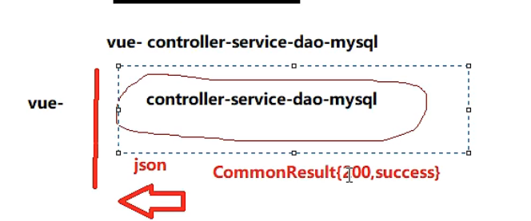

sql

```sql
CREATE TABLE `payment` (
  `id` BIGINT(20) NOT NULL AUTO_INCREMENT COMMENT 'ID',
  `serial` VARCHAR(200) DEFAULT '',
  PRIMARY KEY (`id`)
) ENGINE=INNODB AUTO_INCREMENT=1 DEFAULT CHARSET=utf8

```

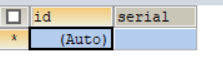

entities

```java
@Data
@NoArgsConstructor
@AllArgsConstructor
public class CommonResult <T>{
    private Integer code;
    private String message;
    private T data;

    public CommonResult(Integer code, String message) {
        this(code,message,null);
    }
    
}

@Data
@NoArgsConstructor
@AllArgsConstructor
public class Payment implements Serializable {
    private Long id;
    private String serial;
}

```

dao

```java
@Mapper
public interface PaymentDao {

    public int create(Payment payment);

    public Payment getPaymentById(@Param("id") Long id);


}
```

 

```xml
<?xml version="1.0" encoding="UTF-8" ?>
<!DOCTYPE mapper PUBLIC "-//mybatis.org//DTD Mapper 3.0//EN" "http://mybatis.org/dtd/mybatis-3-mapper.dtd" >

<mapper namespace="com.tintin.springcloud.dao.PaymentDao">
    
    <insert id="create" parameterType="Payment" useGeneratedKeys="true" keyProperty="id">
        INSERT INTO payment(SERIAL) VALUES(#{serial});
    </insert>

    <resultMap id="BaseResultMap" type="com.tintin.springcloud.entities.Payment">
        <id column="id" property="id" jdbcType="BIGINT"/>
        <id column="serial" property="serial" jdbcType="VARCHAR"/>
    </resultMap>
    <select id="getPaymentById" parameterType="Long" resultMap="BaseResultMap">
        SELECT * FROM payment WHERE id = #{id};
    </select>
    
</mapper>
```

service

```java
@Service
public class PaymentServiceImpl implements PaymentService {
@Resource
    private PaymentDao paymentDao;
    
    @Override
    public int create(Payment payment) {
        return paymentDao.create(payment);
    }

    @Override
    public Payment getPaymentById(Long id) {
        return paymentDao.getPaymentById(id);
    }
}

```

controller

```java
@RestController
@RequestMapping("payment/payment")
@Slf4j
public class PaymentController {
    @Resource
    private PaymentService paymentService;

    @PostMapping("/create")
    public CommonResult create(@RequestBody Payment payment) {
        int result = paymentService.create(payment);
        log.info("***插入结果***"+ result);
        if (result > 0) {
            return new CommonResult(200,"插入数据库成功",result);
        } else {
            return new CommonResult(444,"插入数据库失败",null);
        }
    }

    @GetMapping("/info/{id}")
    public CommonResult<Payment> info(@PathVariable("id") Long id) {
        Payment payment = paymentService.getPaymentById(id);
        log.info("***插入结果***"+ payment);
        if (payment != null) {
            return new CommonResult(200,"查询成功",payment);
        } else {
            return new CommonResult(444,"没有对应记录，查询id："+id,null);
        }
    }
}
```

### 3.3.2 客户端消费者

配置、pom、entities同上

**RestTemplate**

RestTemplate提供了多种便捷访问远程Http服务的方法， 
是一种简单便捷的访问restful服务模板类，是Spring提供的用于访问Rest服务的客户端模板工具集

使用
使用restTemplate访问restful接口非常的简单粗暴无脑。
(url, requestMap, ResponseBean.class)这三个参数分别代表 
REST请求地址、请求参数、HTTP响应转换被转换成的对象类型。

  添加RestTemplate组件

```java
@Configuration
public class ApplicationContextConfig {
    @Bean
    public RestTemplate restTemplate() {
        return new RestTemplate();
    }


}
```

```java
@RestController
@RequestMapping("/consumer/payment/")
@Slf4j
public class OrderController {
    public static final String PAYMENT_URL = "http://localhost:8001";
    @Autowired
    private RestTemplate restTemplate;

    @GetMapping("create")
    public CommonResult create(Payment payment) {
        return restTemplate.postForObject(PAYMENT_URL + "/payment/payment/create",payment,CommonResult.class);
    }

    @GetMapping("info/{id}")
    public CommonResult<Payment> info(@PathVariable("id") Long id) {
        return restTemplate.getForObject(PAYMENT_URL + "/payment/payment/info/" + id,CommonResult.class);
    }
}
```

### 3.3.3 工程重构

提取公共类

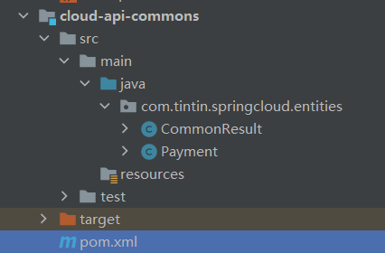

公共依赖

```xml
<?xml version="1.0" encoding="UTF-8"?>
<project xmlns="http://maven.apache.org/POM/4.0.0"
         xmlns:xsi="http://www.w3.org/2001/XMLSchema-instance"
         xsi:schemaLocation="http://maven.apache.org/POM/4.0.0 http://maven.apache.org/xsd/maven-4.0.0.xsd">
    <parent>
        <artifactId>springcloud</artifactId>
        <groupId>com.tintin.springcloud</groupId>
        <version>1.0-SNAPSHOT</version>
    </parent>
    <modelVersion>4.0.0</modelVersion>

    <artifactId>cloud-api-commons</artifactId>


    <dependencies>
        <dependency>
            <groupId>org.springframework.boot</groupId>
            <artifactId>spring-boot-devtools</artifactId>
            <scope>runtime</scope>
            <optional>true</optional>
        </dependency>
        <dependency>
            <groupId>org.projectlombok</groupId>
            <artifactId>lombok</artifactId>
            <optional>true</optional>
        </dependency>
        <dependency>
            <groupId>cn.hutool</groupId>
            <artifactId>hutool-all</artifactId>
            <version>5.1.0</version>
        </dependency>
    </dependencies>

</project>
```


# 4 SpringCloud Netflix Eureka注册与发现

## 4.1 Eureka基础

**服务治理**　　
 Spring Cloud 封装了 Netflix 公司开发的 Eureka 模块来实现服务治理

  在传统的rpc远程调用框架中，管理每个服务与服务之间依赖关系比较复杂，管理比较复杂，所以需要使用服务治理，管理服务于服务之间依赖关系，可以实现服务调用、负载均衡、容错等，实现服务发现与注册。

**服务注册与发现**

在服务注册与发现中，有一个注册中心。当服务器启动的时候，会把当前自己服务器的信息 比如 服务地址通讯地址等以别名方式注册到注册中心上。另一方（消费者|服务提供者），以该别名的方式去注册中心上获取到实际的服务通讯地址，然后再实现本地RPC调用RPC远程调用框架核心设计思想：在于注册中心，因为使用注册中心管理每个服务与服务之间的一个依赖关系(服务治理概念)。在任何rpc远程框架中，都会有一个注册中心(存放服务地址相关信息(接口地址))

Eureka采用了CS的设计架构，Eureka Server 作为服务注册功能的服务器，它是服务注册中心。而系统中的其他微服务，使用 Eureka的客户端连接到 Eureka Server并维持心跳连接。这样系统的维护人员就可以通过 Eureka Server 来监控系统中各个微服务是否正常运行。

**Eureka两组件**

Eureka Server提供服务注册服务
各个微服务节点通过配置启动后，会在EurekaServer中进行注册，这样EurekaServer中的服务注册表中将会存储所有可用服务节点的信息，服务节点的信息可以在界面中直观看到。

EurekaClient通过注册中心进行访问
是一个Java客户端，用于简化Eureka Server的交互，客户端同时也具备一个内置的、使用轮询(round-robin)负载算法的负载均衡器。在应用启动后，将会向Eureka Server发送心跳(默认周期为30秒)。如果Eureka Server在多个心跳周期内没有接收到某个节点的心跳，EurekaServer将会从服务注册表中把这个服务节点移除（默认90秒）

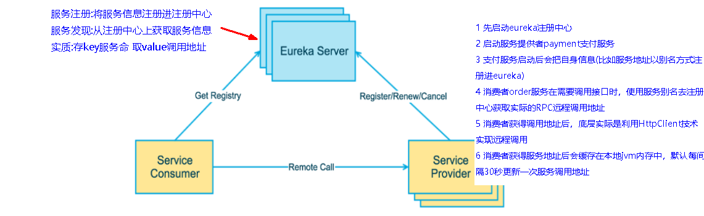 

## 4.2 EurekaServer端

```xml
<?xml version="1.0" encoding="UTF-8"?>
<project xmlns="http://maven.apache.org/POM/4.0.0"
         xmlns:xsi="http://www.w3.org/2001/XMLSchema-instance"
         xsi:schemaLocation="http://maven.apache.org/POM/4.0.0 http://maven.apache.org/xsd/maven-4.0.0.xsd">
    <parent>
        <artifactId>springcloud</artifactId>
        <groupId>com.tintin.springcloud</groupId>
        <version>1.0-SNAPSHOT</version>
    </parent>
    <modelVersion>4.0.0</modelVersion>

    <artifactId>cloud-eureka-server7001</artifactId>

    <dependencies>
        <!--eureka-server-->
        <dependency>
            <groupId>org.springframework.cloud</groupId>
            <artifactId>spring-cloud-starter-netflix-eureka-server</artifactId>
        </dependency>
        <!-- 引入自己定义的api通用包，可以使用Payment支付Entity -->
        <dependency>
            <groupId>com.tintin.springcloud</groupId>
            <artifactId>cloud-api-commons</artifactId>
            <version>1.0-SNAPSHOT</version>
        </dependency>
        <!--boot web actuator-->
        <dependency>
            <groupId>org.springframework.boot</groupId>
            <artifactId>spring-boot-starter-web</artifactId>
        </dependency>
        <dependency>
            <groupId>org.springframework.boot</groupId>
            <artifactId>spring-boot-starter-actuator</artifactId>
        </dependency>
        <!--一般通用配置-->
        <dependency>
            <groupId>org.springframework.boot</groupId>
            <artifactId>spring-boot-devtools</artifactId>
            <scope>runtime</scope>
            <optional>true</optional>
        </dependency>
        <dependency>
            <groupId>org.projectlombok</groupId>
            <artifactId>lombok</artifactId>
        </dependency>
        <dependency>
            <groupId>org.springframework.boot</groupId>
            <artifactId>spring-boot-starter-test</artifactId>
            <scope>test</scope>
        </dependency>
        <dependency>
            <groupId>junit</groupId>
            <artifactId>junit</artifactId>
        </dependency>
    </dependencies>


</project>
```


```yml
server:
  port: 7001

eureka:
  instance:
    hostname: localhost #eureka服务端的实例名称
  client:
    #false表示不向注册中心注册自己。
    register-with-eureka: false
    #false表示自己端就是注册中心，我的职责就是维护服务实例，并不需要去检索服务
    fetch-registry: false
    service-url:
      #设置与Eureka Server交互的地址查询服务和注册服务都需要依赖这个地址。
      defaultZone: http://${eureka.instance.hostname}:${server.port}/eureka/

```

```java
@SpringBootApplication
@EnableEurekaServer
public class CloudEurekaServer7001Main {
    public static void main(String[] args) {
        SpringApplication.run(CloudEurekaServer7001Main.class,args);
    }
}
```

开启后暂无注册

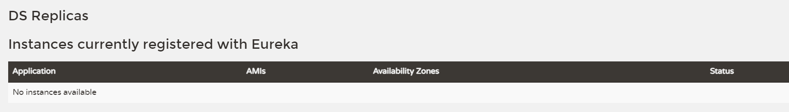

## 4.3 EurekaClient端-服务提供者

```xml
<!--eureka-client-->
        <dependency>
            <groupId>org.springframework.cloud</groupId>
            <artifactId>spring-cloud-starter-netflix-eureka-client</artifactId>
        </dependency>
```

```yml
eureka:
  client:
    #表示是否将自己注册进EurekaServer默认为true。
    register-with-eureka: true
    #是否从EurekaServer抓取已有的注册信息，默认为true。单节点无所谓，集群必须设置为true才能配合ribbon使用负载均衡
    fetchRegistry: true
    service-url:
      defaultZone: http://localhost:7001/eureka
spring:
  application:
    name: cloud-payment-service # 微服务注册名称
```

```java
@SpringBootApplication
@EnableEurekaClient
public class CloudProviderPayment8001Main {
    public static void main(String[] args) {
        SpringApplication.run(CloudProviderPayment8001Main.class,args);
    }
}

```

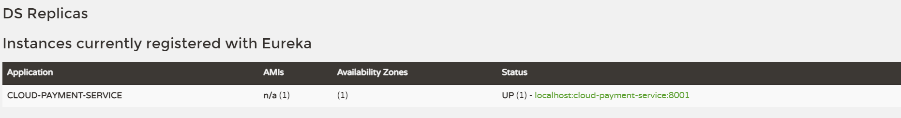

## 4.4 EurekaClient端-服务消费者

同上

## 4.5 集群构建

### 4.5.1 Eureka集群环境构建

微服务RPC远程服务调用最核心的是什么 
       高可用，试想你的注册中心只有一个only one， 它出故障了，会导致整个为服务环境不可用，所以

　　解决办法：搭建Eureka注册中心集群 ，实现负载均衡+故障容错

修改映射配置

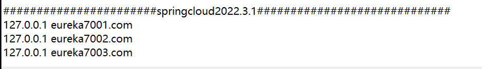

集群配置

```yml
#集群配置
eureka:
  instance:
    hostname: eureka7001.com #eureka服务端的实例名称
  client:
    register-with-eureka: false     #false表示不向注册中心注册自己。
    fetch-registry: false     #false表示自己端就是注册中心，我的职责就是维护服务实例，并不需要去检索服务
    service-url:
      defaultZone: http://eureka7002.com:7002/eureka/
      
#集群配置
eureka:
  instance:
    hostname: eureka7002.com #eureka服务端的实例名称
  client:
    register-with-eureka: false     #false表示不向注册中心注册自己。
    fetch-registry: false     #false表示自己端就是注册中心，我的职责就是维护服务实例，并不需要去检索服务
    service-url:
      defaultZone: http://eureka7001.com:7001/eureka/
```

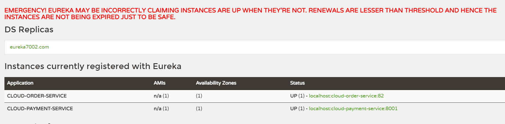

注册配置

```yml
eureka:
  client:
    #表示是否将自己注册进EurekaServer默认为true。
    register-with-eureka: true
    #是否从EurekaServer抓取已有的注册信息，默认为true。单节点无所谓，集群必须设置为true才能配合ribbon使用负载均衡
    fetchRegistry: true
    service-url:
      defaultZone: http://eureka7001.com:7001/eureka,http://eureka7002.com:7002/eureka
#      defaultZone: http://localhost:7001/eureka 单机版


```

测试

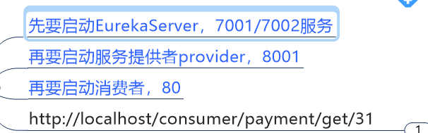

### 4.5.2 提供者服务集群环境构建


消费者访问的地址不能写死，而关注服务名

```java
public static final String PAYMENT_URL = "http://cloud-payment-service";
```

开启负载均衡

```java
@Configuration
public class ApplicationContextConfig {
    @Bean
    @LoadBalanced //使用@LoadBalanced注解赋予RestTemplate负载均衡的能力
    public RestTemplate restTemplate() {
        return new RestTemplate();
    }
}
```

## 4.6 actuator微服务信息完善

```yml
eureka:
  instance:
    instance-id: payment8002 # 主机名称:服务名称修改
    prefer-ip-address: true     #访问路径可以显示IP地址

```

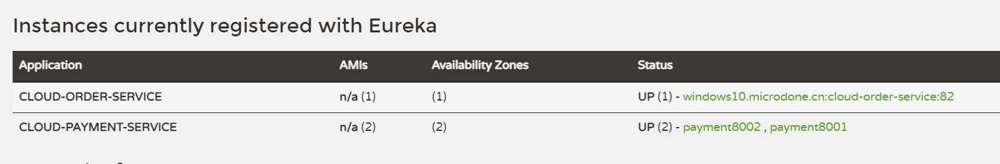

## 4.7 Eureka服务发现

主启动类@EnableDiscoveryClient //服务发现 

```java
	@Resource
    private DiscoveryClient discoveryClient;

	@GetMapping("/discovery")
    public Object discovery() {
       //所有微服务的名称
        List<String> services = discoveryClient.getServices();
        for (String service : services) {
            log.info("service:" + service);
        }
        //微服务下的所有实例
        List<ServiceInstance> instances = discoveryClient.getInstances("cloud-payment-service");
        for (ServiceInstance instance : instances) {
            log.info(instance.getServiceId() + "\t" + instance.getHost() + "\t" + instance.getPort());

        }

        return discoveryClient;
    }
```

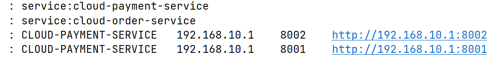

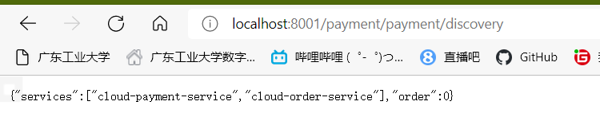

## 4.8 Eureka自我保护

**概述**

保护模式主要用于一组客户端和Eureka Server之间存在网络分区场景下的保护。一旦进入保护模式，
Eureka Server将会尝试保护其服务注册表中的信息，不再删除服务注册表中的数据，也就是不会注销任何微服务。

一句话：某时刻某一个微服务不可用了，Eureka不会立刻清理，依旧会对该微服务的信息进行保存

**产生原因**

为了防止EurekaClient可以正常运行，但是 与 EurekaServer网络不通情况下，EurekaServer不会立刻将EurekaClient服务剔除

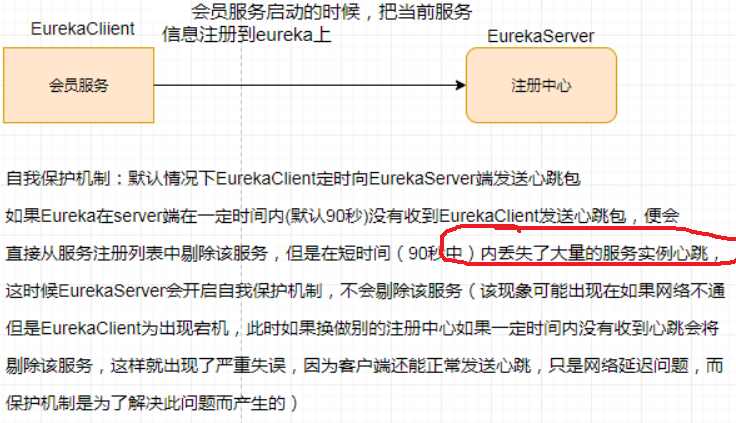

综上，自我保护模式是一种应对网络异常的安全保护措施。它的架构哲学是宁可同时保留所有微服务（健康的微服务和不健康的微服务都会保留）也不盲目注销任何健康的微服务。使用自我保护模式，可以让Eureka集群更加的健壮、稳定。

**禁止自我保护**

Eureka服务端

```properties
eureka:
  server:
    #关闭自我保护机制，保证不可用服务被及时踢除
    enable-self-preservation: false
    # 服务定端没收到客户端发送心跳包（默认90秒）时间间隔后，超时将剔除服务
    eviction-interval-timer-in-ms: 2000
```

Eureka客户端

```yml
eureka:
  instance:
  #Eureka客户端向服务端发送心跳的时间间隔，单位为秒(默认是30秒)
    lease-renewal-interval-in-seconds: 1
  #Eureka服务端在收到最后一次心跳后等待时间上限，单位为秒(默认是90秒)，超时将剔除服务
    lease-expiration-duration-in-seconds: 2
 
```

# 5 Zookeeper注册与发现

## 5.1 Eureka停止更新

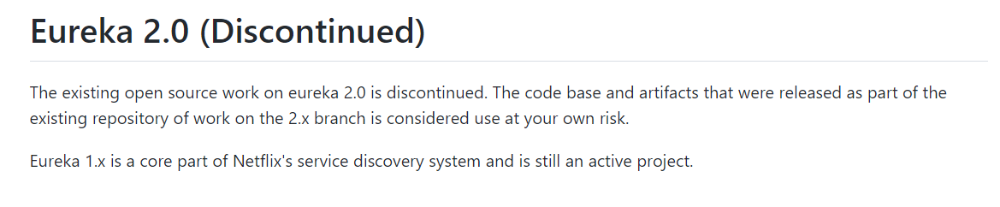

## 5.2 注册中心Zookeeper

zookeeper是一个分布式协调工具，可以实现注册中心功能

关闭Linux服务器防火墙后启动zookeeper服务器

zookeeper服务器取代Eureka服务器，zk作为服务注册中心

## 5.3 微服务提供者

```xml
<!-- SpringBoot整合zookeeper客户端 -->
        <dependency>
            <groupId>org.springframework.cloud</groupId>
            <artifactId>spring-cloud-starter-zookeeper-discovery</artifactId>
        </dependency>
	<!--若出现版本问题 则排除旧版本并引入新版本-->
    <!-- SpringBoot整合zookeeper客户端 -->
        <dependency>
            <groupId>org.springframework.cloud</groupId>
            <artifactId>spring-cloud-starter-zookeeper-discovery</artifactId>
            <!--先排除自带的zookeeper3.5.3-->
            <exclusions>
                <exclusion>
                    <groupId>org.apache.zookeeper</groupId>
                    <artifactId>zookeeper</artifactId>
                </exclusion>
            </exclusions>
        </dependency>
        <!--添加zookeeper3.4.9版本-->
        <dependency>
            <groupId>org.apache.zookeeper</groupId>
            <artifactId>zookeeper</artifactId>
            <version>3.4.9</version>
        </dependency>
```

```yml
#8004表示注册到zookeeper服务器的支付服务提供者端口号
server:
  port: 8004
#服务别名----注册zookeeper到注册中心名称
spring:
  application:
    name: cloud-provider-payment
  cloud:
    zookeeper:
      connect-string: 192.168.10.102:2181
```


```java
@SpringBootApplication
@EnableDiscoveryClient //该注解用于向使用consul或者zookeeper作为注册中心时注册服务
public class CloudProviderPayment8004Main {
    public static void main(String[] args) {
        SpringApplication.run(CloudProviderPayment8004Main.class,args);
    }
}

```

```java

@RestController
@RequestMapping("/payment/payment")
@Slf4j
public class PaymentController {
    @Value("${server.port}")
    private String serverPort;

    @GetMapping("/zk")
    public String zk() {
        return "springcloud zookeeper" + serverPort + "uuid:" + UUID.randomUUID().toString().substring(0,3);
    }

}
```

开启服务后


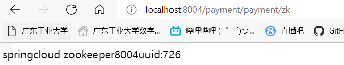

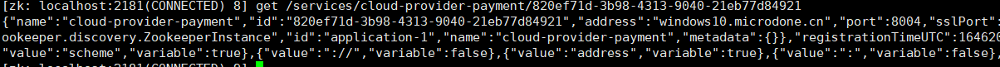

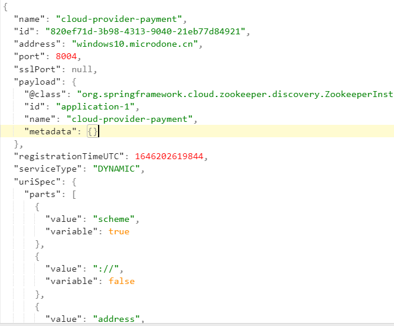

该服务节点为临时节点

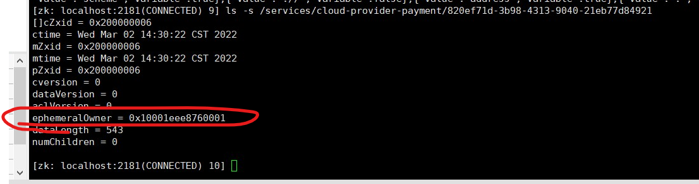

## 5.4 微服务消费者

同服务提供者

```java
@Configuration
public class ApplicationContextCOnfig {
    @Bean
    @LoadBalanced
    public RestTemplate restTemplate() {
        return new RestTemplate();
    }
}
```

# 6 Consul注册与发现

## 6.1 Consul

Consul 是一套开源的分布式服务发现和配置管理系统，由 HashiCorp 公司用 Go 语言开发。

提供了微服务系统中的服务治理、配置中心、控制总线等功能。这些功能中的每一个都可以根据需要单独使用，也可以一起使用以构建全方位的服务网格，总之Consul提供了**一种完整的服务网格解决方案。**

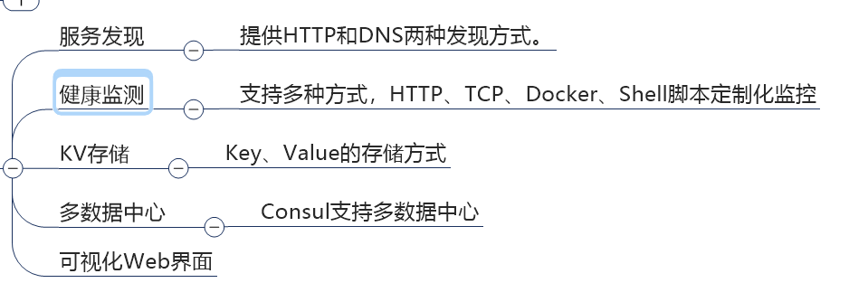

[Consul by HashiCorp](https://www.consul.io/)

中文文档：https://www.springcloud.cc/spring-cloud-consul.html

## 6.2 Consul安装运行

https://learn.hashicorp.com/consul/getting-started/install.html

在consul.exe文件路径下运行cmd

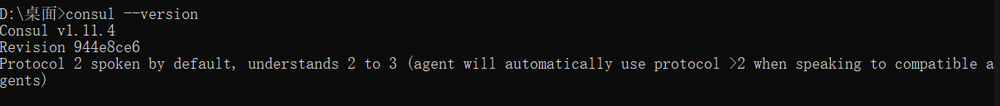

开发者模式运行  consul agent -dev

通过以下地址可以访问Consul的首页：[Services - Consul](http://localhost:8500/ui/dc1/services)

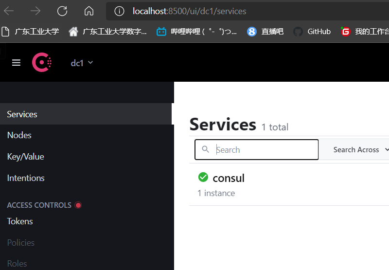

## 6.3 微服务提供者

同Zookeeper

```yml
###consul服务端口号
server:
  port: 8006

spring:
  application:
    name: consul-provider-payment
  ####consul注册中心地址
  cloud:
    consul:
      host: localhost
      port: 8500
      discovery:
        #hostname: 127.0.0.1
        service-name: ${spring.application.name}

```

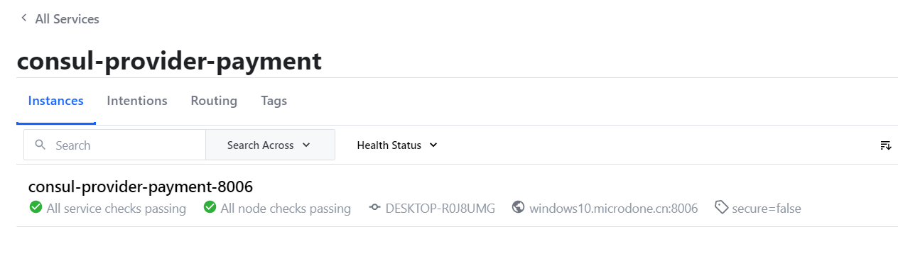

## 6.4 微服务消费者

```yml
###consul服务端口号
server:
  port: 80

spring:
  application:
    name: cloud-consumer-order
####consul注册中心地址
  cloud:
    consul:
      host: localhost
      port: 8500
      discovery:
        #hostname: 127.0.0.1
        service-name: ${spring.application.name}
```

## 6.5 三个注册中心的异同

### 6.5.1 CAP

C:Consistency（强一致性）

A:Availability（可用性）

P:Partition tolerance（分区容错性）

CAP理论关注粒度是数据，而不是整体系统设计的策略

最多只能同时较好的满足两个。
 CAP理论的核心是：一个分布式系统不可能同时很好的满足一致性，可用性和分区容错性这三个需求，
因此，根据 CAP 原理将 NoSQL 数据库分成了满足 CA 原则、满足 CP 原则和满足 AP 原则三 大类：

CA - 单点集群，满足一致性，可用性的系统，通常在可扩展性上不太强大。
CP - 满足一致性，分区容忍必的系统，通常性能不是特别高。
AP - 满足可用性，分区容忍性的系统，通常可能对一致性要求低一些。

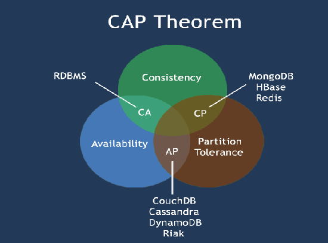

### 6.5.2  异同

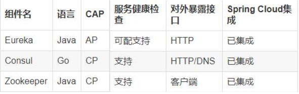

AP架构
当网络分区出现后，为了保证可用性，系统B可以返回旧值，保证系统的可用性。
结论：违背了一致性C的要求，只满足可用性和分区容错，即AP

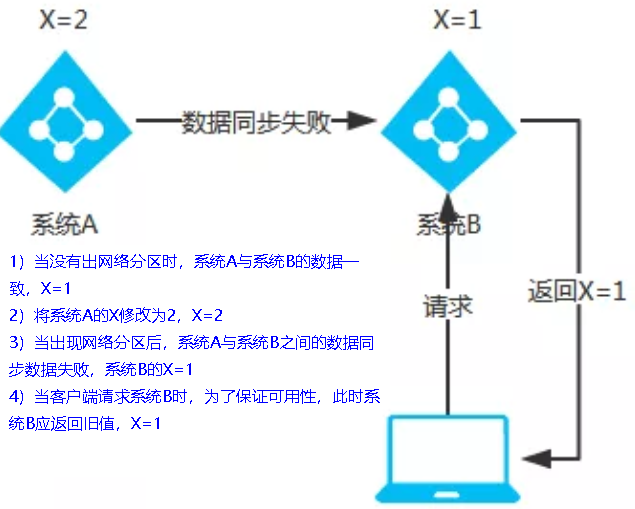

CP架构
当网络分区出现后，为了保证一致性，就必须拒接请求，否则无法保证一致性
结论：违背了可用性A的要求，只满足一致性和分区容错，即CP

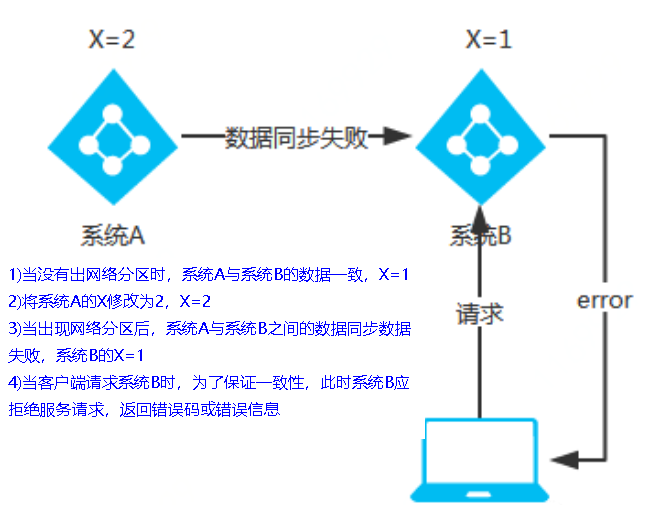

# 7 SpringCloud Netflix Ribbon负载均衡与服务调用

## 7.1 Ribbon

Spring Cloud Ribbon是基于Netflix Ribbon实现的一套客户端       负载均衡的工具。

简单的说，Ribbon是Netflix发布的开源项目，主要功能是提供客户端的软件负载均衡算法和服务调用。Ribbon客户端组件提供一系列完善的配置项如连接超时，重试等。简单的说，就是在配置文件中列出**Load Balancer**（简称LB）后面所有的机器，**Ribbon会自动的帮助你基于某种规则（如简单轮询，随机连接等）去连接这些机器。**我们很容易使用Ribbon实现自定义的负载均衡算法。

## 7.2 负载均衡

简单的说就是将用户的请求平摊的分配到多个服务上，从而达到系统的HA（高可用）。
常见的负载均衡有软件Nginx，LVS，硬件 F5等。

**Ribbon本地负载均衡客户端 VS Nginx服务端负载均衡区别**
 Nginx是服务器负载均衡，客户端所有请求都会交给nginx，然后**由nginx实现转发请求**。即负载均衡是由服务端实现的。

 Ribbon本地负载均衡，在调用微服务接口时候，会在注册中心上获取注册信息服务列表之后缓存到JVM本地，从而在**本地实现RPC远程服务调用技术。**

集中式LB VS 进程式LB

集中式LB即在服务的消费方和提供方之间使用独立的LB设施(可以是硬件，如F5, 也可以是软件，如nginx), 由该设施负责把访问请求通过某种策略转发至服务的提供方；

进程内LB将LB逻辑集成到消费方，消费方从服务注册中心获知有哪些地址可用，然后自己再从这些地址中选择出一个合适的服务器。Ribbon就属于进程内LB，它只是一个类库，集成于消费方进程，消费方通过它来获取到服务提供方的地址。

Ribbon=负载均衡+RestTemplate调用

## 7.3Restemplate说明

getForObject 返回对象为响应体中数据转化成的对象，基本上可以理解为Json

getForEntities 返回对象为ResponseEntity对象，包含了响应中的一些重要信息，比如响应头、响应状态码、响应体等

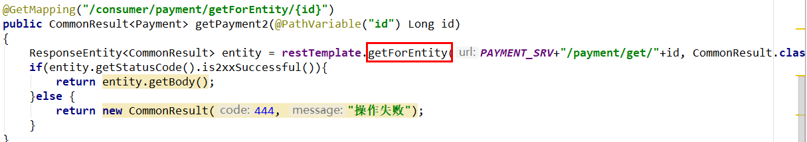

## 7.4 Ribbon负载均衡架构

**整合Eureka架构**

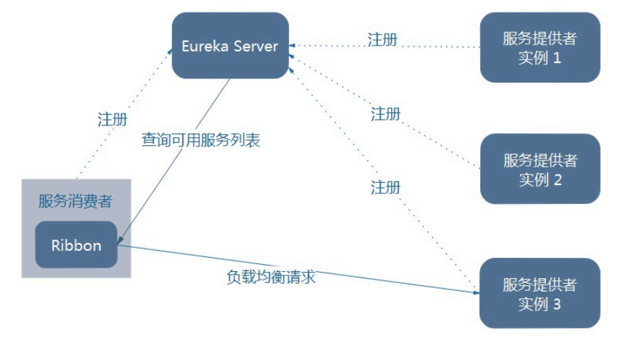

Ribbon在工作时分成两步
第一步先选择 EurekaServer ,它优先选择在同一个区域内负载较少的server.
第二步再根据用户指定的策略，在从server取到的服务注册列表中选择一个地址。
其中Ribbon提供了多种策略：比如轮询、随机和根据响应时间加权。

spring-cloud-starter-netflix-eureka-client 确实引入了Ribbon

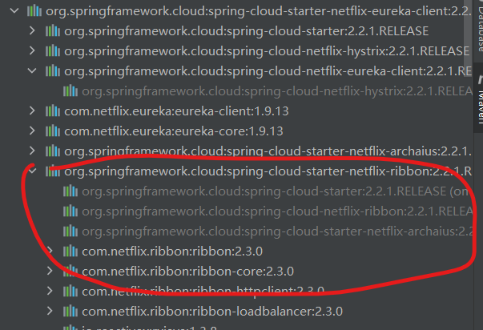

## 7.5 Ribbon核心组件IRule

### 7.5.1 负载均衡算法

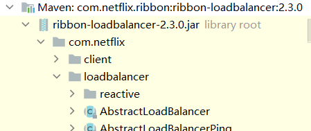

```java
public interface IRule {
    Server choose(Object var1);

    void setLoadBalancer(ILoadBalancer var1);

    ILoadBalancer getLoadBalancer();
}
```

落地实现

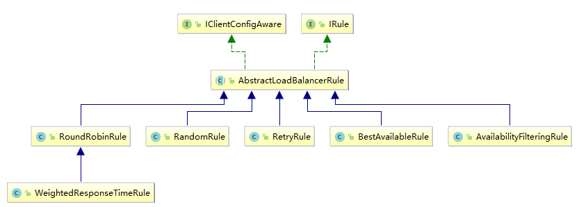

### 7.5.2 自定义负载均衡算法

**特殊化前提**

这个自定义配置类不能放在@ComponentScan所扫描的当前包下以及子包下，
否则我们自定义的这个配置类就会被所有的Ribbon客户端所共享，达不到特殊化定制的目的了。

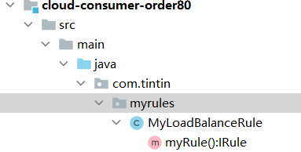

添加自定义算法组件

```java
@Configuration
public class MyLoadBalanceRule
{
    @Bean
    public IRule myRule()
    {
        return new RandomRule();//定义为随机
    }
}
```

主启动类添加注解

```java
@SpringBootApplication
@EnableEurekaClient
@RibbonClient(value = "cloud-payment-service",configuration = MyLoadBalanceRule.class)
public class CloudConsumerOrder80Main {
    public static void main(String[] args) {
        SpringApplication.run(CloudConsumerOrder80Main.class,args);
    }
}
```

## 7.6 负载均衡算法原理

轮询算法：rest接口第几次请求数 % 服务器集群总数量 = 实际调用服务器位置下标  ，每次服务重启动后rest接口计数从1开始。

```java
//RoundRobinRule.class
public Server choose(ILoadBalancer lb, Object key) {
        if (lb == null) {
            log.warn("no load balancer");
            return null;
        } else {
            Server server = null;
            int count = 0;

            while(true) {
                if (server == null && count++ < 10) {
                    List<Server> reachableServers = lb.getReachableServers();
                    List<Server> allServers = lb.getAllServers();
                    int upCount = reachableServers.size();
                    int serverCount = allServers.size();
                    if (upCount != 0 && serverCount != 0) {
                        int nextServerIndex = this.incrementAndGetModulo(serverCount);
                        server = (Server)allServers.get(nextServerIndex);
                        if (server == null) {
                            Thread.yield();
                        } else {
                            if (server.isAlive() && server.isReadyToServe()) {
                                return server;
                            }

                            server = null;
                        }
                        continue;
                    }

                    log.warn("No up servers available from load balancer: " + lb);
                    return null;
                }

                if (count >= 10) {
                    log.warn("No available alive servers after 10 tries from load balancer: " + lb);
                }

                return server;
            }
        }
    }
```

## 7.7 手写负载均衡算法


```java
//取消RestTemplate负载均衡的能力 
//    @LoadBalanced //使用@LoadBalanced注解赋予RestTemplate负载均衡的能力 

//手写负载均衡算法
@Component
public class MyLoadBalancerImpl implements MyLoadBalancer{
    private AtomicInteger atomicInteger = new AtomicInteger(0);

    public final int getAndIncrement() {
        int current;
        int next;
        do {
            current = atomicInteger.get();
            next =current >= Integer.MAX_VALUE ? 0 : current + 1;
        } while (!atomicInteger.compareAndSet(current,next));
        System.out.println("第" + next + "次访问");
        return next;
    }

    @Override
    public ServiceInstance instances(List<ServiceInstance> serviceInstances) {
        //初始为0 调用一次即为1
        int index = getAndIncrement() % serviceInstances.size();
        return serviceInstances.get(index);//某一次访问的服务实例
    }
}

```

```java
public class OrderController {
    public static final String PAYMENT_URL = "http://cloud-payment-service";
    @Resource
    private RestTemplate restTemplate;

    @Resource
    private MyLoadBalancer myLoadBalancer;//用于服务负载均衡
    @Resource
    private DiscoveryClient discoveryClient;//用于获取服务实例
    @GetMapping("/lb")
    public CommonResult lb() {
        List<ServiceInstance> instances = discoveryClient.getInstances("cloud-payment-service");
        if (instances == null || instances.size() <= 0){
            return null;
        } else {
            //通过负载均衡得到了某一个的服务实例
            ServiceInstance instance = myLoadBalancer.instances(instances);
            URI uri = instance.getUri();
            return restTemplate.getForObject(uri + "/payment/payment/info/1",CommonResult.class);
        }
    }
}
```

# 9 SpringCloud Netflix OpenFeign服务接口调用

## 9.1 概述

**Feign是一个声明式WebService客户端。使用Feign能让编写Web Service客户端更加简单。**
**它的使用方法是定义一个服务接口然后在上面添加注解。**

Feign也支持可拔插式的编码器和解码器。Spring Cloud对Feign进行了封装，使其支持了Spring MVC标准注解和HttpMessageConverters。**Feign可以与Eureka和Ribbon组合使用以支持负载均衡**

**功能**

Feign旨在使编写Java Http客户端变得更容易。

**问题**

前面在使用Ribbon+RestTemplate时，利用RestTemplate对http请求的封装处理，形成了一套模版化的调用方法。但是在实际开发中，由于对服务依赖的调用可能不止一处，往往一个接口会被多处调用，所以通常都会针对每个微服务自行封装一些客户端类来包装这些依赖服务的调用。

**解决**

Feign在此基础上做了进一步封装，由他来帮助我们定义和实现依赖服务接口的定义。在Feign的实现下，我们**只需创建一个接口**并使用注解的方式来配置它(以前是Dao接口上面标注Mapper注解,现在是一个微服务接口上面标注一个Feign注解即可)，即可完成对服务提供方的接口绑定，简化了使用Spring cloud Ribbon时，自动封装服务调用客户端的开发量。

Feign集成了Ribbon
利用Ribbon维护了Payment的服务列表信息，并且通过轮询实现了客户端的负载均衡。而与Ribbon不同的是，**通过feign只需要定义服务绑定接口且以声明式的方法，优雅而简单的实现了服务调用**

**Feign**

Feign是Spring Cloud组件中的一个轻量级RESTful的HTTP服务客户端
Feign内置了Ribbon，用来做客户端负载均衡，去调用服务注册中心的服务。Feign的使用方式是：使用Feign的注解定义接口，调用这个接口，就可以调用服务注册中心的服务	

OpenFeign是Spring Cloud 在Feign的基础上支持了SpringMVC的注解

## 9.2 使用

```xml
<!--openfiegn-->
<dependency>
    <groupId>org.springframework.cloud</groupId>
    <artifactId>spring-cloud-starter-openfeign</artifactId>
</dependency>
<!--eureka-client-->
<dependency>
    <groupId>org.springframework.cloud</groupId>
    <artifactId>spring-cloud-starter-netflix-eureka-client</artifactId>
</dependency>
```

```yml
server:
  port: 82

eureka:
  client:
    register-with-eureka: false # 不注册进eureka 但抓取注册中心的服务信息
    service-url:
      defaultZone: http:
```

```java
@SpringBootApplication
@EnableFeignClients//开启OpenFeign功能
public class CloudConsumerFeignMain80 {
    public static void main(String[] args) {
        SpringApplication.run(CloudConsumerFeignMain80.class, args);
    }
}
```

业务逻辑接口 + 注解

新建PaymentFeignService接口并新增注解@FeignClient

```java
@Component
@FeignClient("CLOUD-PAYMENT-SERVICE")//调用的服务的名称
public interface PaymentFeignService {
    @GetMapping("/payment/payment/info/{id}")//路径必须正确完整
    public CommonResult<Payment> info(@PathVariable("id") Long id);
}

```

## 9.3 超时控制

  默认Feign客户端只等待一秒钟，但是服务端处理需要超过1秒钟，导致Feign客户端不想等待了，直接返回报错。
为了避免这样的情况，有时候我们需要设置Feign客户端的超时控制。

yml文件中开启配置

```yml
#设置feign客户端超时时间(OpenFeign默认支持ribbon)
ribbon:
  #指的是建立连接所用的时间，适用于网络状况正常的情况下,两端连接所用的时间
  ReadTimeout: 5000
  #指的是建立连接后从服务器读取到可用资源所用的时间
  ConnectTimeout: 5000
```

## 9.4 日志打印

Feign 提供了日志打印功能，我们可以通过配置来**调整日志级别**，从而了解 Feign 中 Http 请求的细节。

日志级别

```
NONE：默认的，不显示任何日志；

BASIC：仅记录请求方法、URL、响应状态码及执行时间；

HEADERS：除了 BASIC 中定义的信息之外，还有请求和响应的头信息；

FULL：除了 HEADERS 中定义的信息之外，还有请求和响应的正文及元数据。
```

配置

```java
@Configuration
public class FeignConfig
{
    @Bean
    Logger.Level feignLoggerLevel()
    {
        return Logger.Level.FULL;
    }
}
```

```yml
logging:
  level:
    # feign日志以什么级别监控哪个接口
    com.tintin.springcloud.service.PaymentFeignService: debug
```

# 10 SpringCloud Netflix Hystrix断路器

## 10.1 概述

**问题**

复杂分布式体系结构中的应用程序有数十个依赖关系，每个依赖关系在某些时候将不可避免地失败。

**服务雪崩**

多个微服务之间调用的时候，假设微服务A调用微服务B和微服务C，微服务B和微服务C又调用其它的微服务，这就是所谓的**“扇出”**。如果扇出的链路上某个微服务的调用响应时间过长或者不可用，对微服务A的调用就会占用越来越多的系统资源，进而引起系统崩溃，所谓的“雪崩效应”.

**Hystrix**

是一个用于处理分布式系统的延迟和容错的开源库，在分布式系统里，许多依赖不可避免的会调用失败，比如超时、异常等，Hystrix能够保证在一个依赖出问题的情况下，不会导致整体服务失败，**避免级联故障**，以提高分布式系统的弹性。

**原理**

当某个服务单元发生故障时，向调用方返回一个符合预期的、可处理的备选响应（FallBack），而不是长时间的等待或者抛出调用方无法处理的异常，这样就保证了服务调用方的线程不会被长时间、不必要地占用，从而避免了故障在分布式系统中的蔓延，乃至雪崩。

**功能概念**

* 服务降级（fallback）

  为客户端返回一个 友好提示。例如下列情况，程序运行异常、超时、服务熔断触发服务降级、线程池或信号量满也会导致服务降级。

* 服务熔断（break）

  当服务失败达到最大次数或服务访问最大时，直接拒绝访问，通过服务降级的方式并返回友好提示

* 服务限流（limit）

  对于高并发的操作，限制流量。

* 接近实时的监控

## 10.2 测试案例

### 10.2.1 构建

```xml
<!--hystrix-->
<dependency>
    <groupId>org.springframework.cloud</groupId>
    <artifactId>spring-cloud-starter-netflix-hystrix</artifactId>
</dependency>
```

```yml
server:
  port: 8001

spring:
  application:
    name: cloud-provider-hystrix-payment

eureka:
  client:
    register-with-eureka: true
    fetch-registry: true
    service-url:
      defaultZone: http://eureka7001.com:7001/eureka
```

```java
@Service
public class PaymentServiceImpl implements PaymentService {

    /**
     * 正常访问
     * @param id
     * @return
     */
    @Override
    public String paymentInfoOk(Integer id) {
        return "线程池:" + Thread.currentThread().getName() + " paymentInfoOk,id: " + id;
    }

    /**
     * 异常访问 超时
     * @param id
     * @return
     */
    @Override
    public String paymentInfoTimeout(Integer id) {
        try {
            TimeUnit.SECONDS.sleep(3);
        } catch (InterruptedException e) {
            e.printStackTrace();
        }
        return "线程池:" + Thread.currentThread().getName() + " paymentInfoTimeout,id: " + id + " 耗时三秒钟";
    }


}

```

```java

@RestController
@RequestMapping("/payment/payment")
public class PaymentController {
    @Resource
    private PaymentService paymentService;

    @Value("${server.port}")
    private String serverPort;

    @GetMapping("/InfoOk/{id}")
    public String paymentInfoOk(@PathVariable("id") Integer id ) {
        return paymentService.paymentInfoOk(id);
    }

    @GetMapping("/InfoTimeout/{id}")
    public String paymentInfoTimeout(@PathVariable("id") Integer id) {
        return paymentService.paymentInfoTimeout(id);
    }
}

```

### 10.2.2 高并发测试

Jmeter 20000个并发 访问	paymentInfoTimeout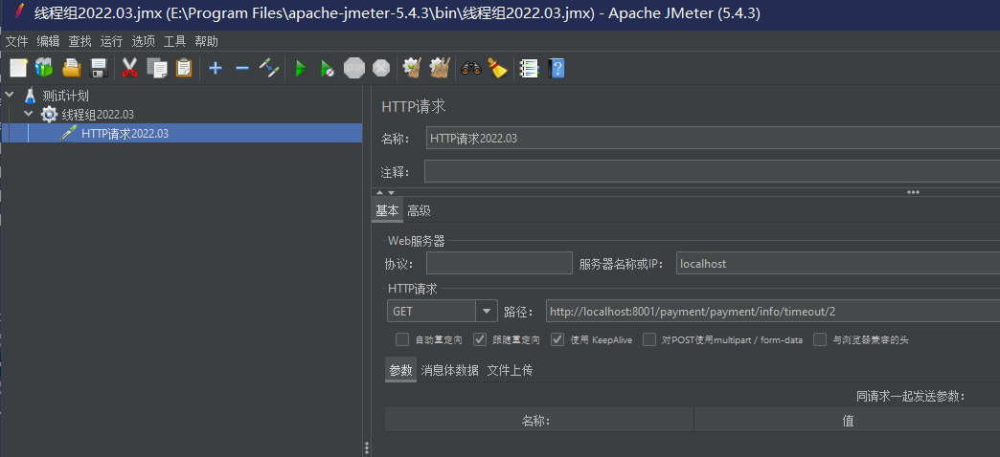

导致两个服务方法的访问都被拖慢

原因：tomcat的默认的工作线程数被打满 了，没有多余的线程来分解压力和处理。

开启消费者端80调用服务 就会出现访问慢的问题

### 10.2.3 故障原因

tomcat的默认的工作线程数被打满 了，没有多余的线程来分解压力和处理。

开启消费者端80调用服务 就会出现访问慢的问题

### 10.2.4 解决

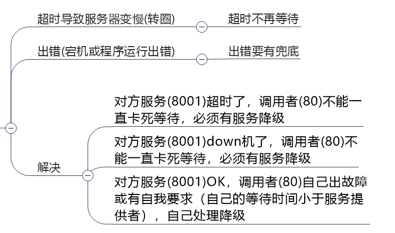

## 10.3 服务降级

### 10.3.1 服务端fallback

服务方法添加注释@HystrixCommand

```java
@Override
    @HystrixCommand(fallbackMethod = "paymentInfoTimeOutHandler", commandProperties = {
            //超时三秒即触发服务降级
            @HystrixProperty(name="execution.isolation.thread.timeoutInMilliseconds",value="3000")
    })
    public String paymentInfoTimeout(Integer id) {
        //        int a = 10/0; 程序异常 服务降级

        Integer time = 6;
        try {
            TimeUnit.SECONDS.sleep(time);
        } catch (InterruptedException e) {
            e.printStackTrace();
        }
        return "线程池:" + Thread.currentThread().getName() + " paymentInfoTimeout,id: " + id + " 耗时"+ time + "秒钟";
    }

    public String paymentInfoTimeOutHandler(Integer id) {
        return "线程池:" + Thread.currentThread().getName() + " paymentInfoTimeOutHandler,id: " + id ;
    }
```

主启动类启动

```java
@EnableCircuitBreaker//回路
```

### 10.3.2 客户端fallback

80订单微服务，也可以更好的保护自己，自己也依样画葫芦进行客户端降级保护

```yml
feign:
  hystrix:
    enabled: true
```

```java
@GetMapping("/info/timeout/{id}")
@HystrixCommand(fallbackMethod = "paymentTimeoutFallbackMethod", commandProperties = {
        //客户端1.5秒则服务降级
        @HystrixProperty(name="execution.isolation.thread.timeoutInMilliseconds",value="1500")
})
public String orderInfoTimeout(@PathVariable Integer id) {
    return paymentHystrixService.paymentInfoTimeout(id);
}

public String paymentTimeoutFallbackMethod(Integer id) {
    return Thread.currentThread().getName() + "对方系统繁忙，请稍后重试";
}
```

### 10.3.3 问题

**每个业务方法对应一个兜底的方法，代码膨胀**

**全局配置和自定义配置分开**

### 10.3.4 解决

为服务接口配置全局降级方法，全局与自定义各自分开

```java
@RestController
@RequestMapping("/payment/payment")
@DefaultProperties(defaultFallback = "paymentGlobalFallbackMethod")
public class PaymentController {
    @Resource
    private PaymentService paymentService;

    @Value("${server.port}")
    private String serverPort;

    @GetMapping("/info/ok/{id}")
    public String paymentInfoOk(@PathVariable("id") Integer id ) {
        return paymentService.paymentInfoOk(id);
    }

    @GetMapping("/info/timeout/{id}")
//    @HystrixCommand//无特殊指明 使用全局降级方法
    public String paymentInfoTimeout(@PathVariable("id") Integer id) {
        return paymentService.paymentInfoTimeout(id);
    }

    //全局降级
    public String paymentGlobalFallbackMethod() {
        return "线程池:" + Thread.currentThread().getName() + " paymentInfoTimeOutHandler 全局 系统繁忙或运行错误，请稍后再试" ;

    }
}

```

由于与降级方法与业务逻辑代码写在一起 耦合度依然高

假如 服务降级，客户端去调用服务端，碰上服务端宕机或关闭

本次案例服务降级处理是在客户端80实现完成的，与服务端8001没有关系只需要为Feign客户端定义的接口添加一个服务降级处理的实现类即可实现解耦

根据cloud-consumer-feign-hystrix-order80
已经有的PaymentHystrixService接口,重新新建一个类(PaymentFallbackService)实现该接口统一为接口里面的方法进行异常处理

```yml

# 用于服务降级 在注解@FeignClient中添加fallbackFactory属性值
feign:
  hystrix:
   enabled: true #在Feign中开启Hystrix
```

```java
@Component
@FeignClient(value = "CLOUD-PROVIDER-HYSTRIX-PAYMENT",fallback = PaymentHystrixFallbackService.class)
public interface PaymentHystrixService {
    @GetMapping("/payment/payment/info/ok/{id}")
    public String paymentInfoOk(@PathVariable("id") Integer id );

    @GetMapping("/payment/payment/info/timeout/{id}")
    public String paymentInfoTimeout(@PathVariable("id") Integer id);
}
```

```java
//客户端service中所有的降级方法
public class PaymentHystrixFallbackService implements PaymentHystrixService{

    @Override
    public String paymentInfoOk(Integer id) {
        return "服务调用失败，提示来自：cloud-consumer-feign-order80";
    }

    @Override
    public String paymentInfoTimeout(Integer id) {
        return "服务调用失败，提示来自：cloud-consumer-feign-order80";
    }
}

```

## 10.4 服务熔断

熔断机制是应对**雪崩效应**的一种微服务链路保护机制。当扇出链路的某个微服务出错不可用或者响应时间太长时，
会进行服务的降级，进而熔断该节点微服务的调用，快速返回错误的响应信息。
当检测到该节点微服务调用响应正常后，恢复调用链路。

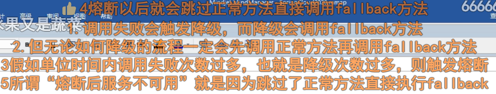

在Spring Cloud框架里，熔断机制通过Hystrix实现。Hystrix会监控微服务间调用的状况，
当失败的调用到一定阈值，缺省是5秒内20次调用失败，就会启动熔断机制。熔断机制的注解是@HystrixCommand


**涉及到断路器的三个重要参数：**快照时间窗、请求总数阀值、错误百分比阀值。
1：快照时间窗：断路器确定是否打开需要统计一些请求和错误数据，而统计的时间范围就是快照时间窗，默认为最近的10秒。

2：请求总数阀值：在快照时间窗内，必须满足请求总数阀值才有资格熔断。**默认为20**，意味着在10秒内，如果该hystrix命令的调用次数不足20次，即使所有的请求都超时或其他原因失败，断路器都不会打开。

3：错误百分比阀值：当请求总数在快照时间窗内超过了阀值，比如发生了30次调用，如果在这30次调用中，有15次发生了超时异常，也就是超过50%的错误百分比，在默认设定50%阀值情况下，这时候就会将断路器打开。

```java
 //服务熔断部分
    @HystrixCommand(fallbackMethod = "paymentCircuitBreaker_fallback",commandProperties = {
            @HystrixProperty(name = "circuitBreaker.enabled",value = "true"),//启动熔断器功能
            @HystrixProperty(name = "circuitBreaker.requestVolumeThreshold",value = "10"),//请求总数阀值
            @HystrixProperty(name = "circuitBreaker.sleepWindowInMilliseconds",value = "10000"),//快照时间窗
            @HystrixProperty(name = "circuitBreaker.errorThresholdPercentage",value = "60"),//错误百分比阀值
    })
    public String paymentCircuitBreaker(@PathVariable("id") Integer id)
    {
        if(id < 0)
        {
            throw new RuntimeException("******id 不能负数");
        }
        String serialNumber = IdUtil.simpleUUID();

        return Thread.currentThread().getName()+"\t"+"调用成功，流水号: " + serialNumber;
    }
    public String paymentCircuitBreaker_fallback(@PathVariable("id") Integer id)
    {
        return "id 不能负数，请稍后再试，/(ㄒoㄒ)/~~   id: " +id;
    }

```

```java
@GetMapping("/payment/circuit/{id}")
public String paymentCircuitBreaker(@PathVariable("id") Integer id)
{
    String result = paymentService.paymentCircuitBreaker(id);
    log.info("****result: "+result);
    return result;
}

```

**效果：**

多次错误，然后慢慢正确，发现刚开始不满足条件，就算是正确的访问地址也不能进行

**熔断类型**

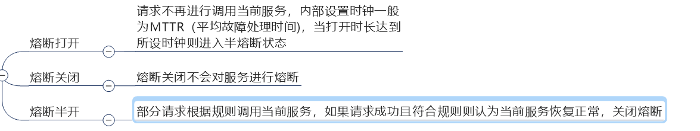

**熔断流程**

1. 服务正常情况下：熔断关闭
2. 一个快照时间窗后，熔断器统计请求总数达到阈值，且请求错误的百分比超过阈值：熔断打开
3. 一个MTTR（平均故障处理时间）后：熔断半开
4. 允许部分请求根据规则调用服务，若请求成功后：熔断关闭，若请求失败后：熔断打开

## 10.5 服务限流

[在Sentinel中讲解](#19 SpringCloud Alibaba Sentinel实现熔断与限流)

### 10.6 Hystrix工作流程

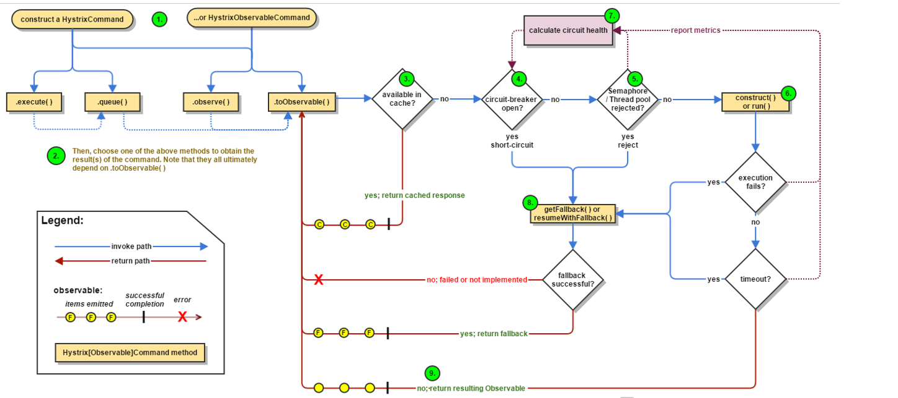

## 10.7 服务监控DashBoard（web界面）

除了隔离依赖服务的调用以外，Hystrix还提供了准实时的调用监控（Hystrix Dashboard）

```xml
        <!--hystrix-dashboard-->
        <dependency>
            <groupId>org.springframework.cloud</groupId>
            <artifactId>spring-cloud-starter-netflix-hystrix-dashboard</artifactId>
        </dependency>
```

```yml
server:
  port: 9001
```

```java
@EnableHystrixDashboard
```

所有Privider微服务提供类都需要监控依赖配置

```xml
<!-- actuator监控信息完善 -->
<dependency>
    <groupId>org.springframework.boot</groupId>
    <artifactId>spring-boot-starter-actuator</artifactId>
</dependency>
```

**监控演示**

[Hystrix Dashboard](http://localhost:9001/hystrix)

主启动类指定监控路径

```java
@SpringBootApplication
@EnableEurekaClient
@EnableCircuitBreaker//回路
public class CloudProviderHystrixPayment8001 {
    public static void main(String[] args) {
        SpringApplication.run(CloudProviderHystrixPayment8001.class,args);
    }

    /**
     *此配置是为了服务监控而配置，与服务容错本身无关，springcloud升级后的坑
     *ServletRegistrationBean因为springboot的默认路径不是"/hystrix.stream"，
     *只要在自己的项目里配置上下面的servlet就可以了
     */
    @Bean
    public ServletRegistrationBean getServlet() {
        HystrixMetricsStreamServlet streamServlet = new HystrixMetricsStreamServlet();
        ServletRegistrationBean registrationBean = new ServletRegistrationBean(streamServlet);
        registrationBean.setLoadOnStartup(1);
        registrationBean.addUrlMappings("/hystrix.stream");
        registrationBean.setName("HystrixMetricsStreamServlet");
        return registrationBean;
    }

}
```

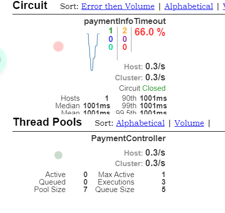

# 11 SpringCloud Netflix zuul路由网关

zuul2 正在更新

Cloud全家桶中有个很重要的组件就是网关，在1.x版本中都是采用的Zuul网关；但在2.x版本中，zuul的升级一直跳票，

[Netflix/zuul: Zuul is a gateway service that provides dynamic routing, monitoring, resiliency, security, and more. (github.com)](https://github.com/Netflix/zuul)

# 12 GateWay新一代网关

## 12.1 概述

[Spring Cloud Gateway](https://spring.io/projects/spring-cloud-gateway)

SpringCloud自己研发了一个网关替代Zuul，那就是SpringCloud Gateway一句话：gateway是原zuul1.x版的替代

SpringCloud Gateway 是 Spring Cloud 的一个全新项目，基于 Spring 5.0+Spring Boot 2.0 和 Project Reactor 等技术开发的网关，它旨在为微服务架构提供一种简单有效的统一的 API 路由管理方式。

SpringCloud Gateway 作为 Spring Cloud 生态系统中的网关，目标是替代 Zuul，在Spring Cloud 2.0以上版本中，没有对新版本的Zuul 2.0以上最新高性能版本进行集成，仍然还是使用的Zuul 1.x非Reactor模式的老版本。而为了提升网关的性能，SpringCloud Gateway是**基于WebFlux框架**实现的，而WebFlux框架底层则使用了**高性能的Reactor模式通信框架Netty**。

Spring Cloud Gateway的目标提供统一的路由方式且**基于 Filter 链**的方式提供了网关基本的功能，例如：安全，监控/指标，和限流。

**源码架构**

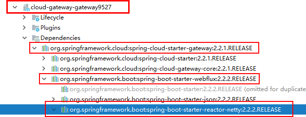

**功能**

反向代理
鉴权
流量控制
熔断
日志监控
...

**微服务架构中的位置**

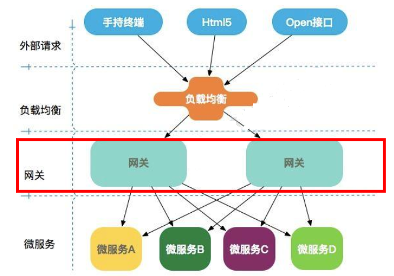

**特性**

基于Spring Framework 5, Project Reactor 和 Spring Boot 2.0 进行构建；
动态**路由**：能够匹配任何请求属性；
可以对路由指定 **Predicate**（断言）和 Filter（过滤器）；
集成Hystrix的断路器功能；
集成 Spring Cloud 服务发现功能；
易于编写的 Predicate（断言）和 Filter（过滤器）；
请求限流功能；
支持路径重写。

**与zuul对比**

Zuul 1.x **基于Servlet 2. 5使用阻塞架构**它**不支持任何长连接**(如 WebSocket) Zuul 的设计模式和Nginx较像，每次 I/ O 操作都是从工作线程中选择一个执行，请求线程被阻塞到工作线程完成，但是差别是Nginx 用C++ 实现，Zuul 用 Java 实现，而 JVM 本身会有第一次加载较慢的情况，使得Zuul 的性能相对较差。

Zuul 1.x l缺点：servlet是一个简单的网络IO模型，当请求进入servlet container时，servlet container就会为其绑定一个线程，在并发不高的场景下这种模型是适用的。但是一旦高并发(比如抽风用jemeter压)，线程数量就会上涨，而线程资源代价是昂贵的（上线文切换，内存消耗大）严重影响请求的处理时间。在一些简单业务场景下，不希望为每个request分配一个线程，只需要1个或几个线程就能应对极大并发的请求，这种业务场景下servlet模型没有优势

spring Cloud Gateway 建立 在 Spring Framework 5、 Project Reactor 和 Spring Boot 2 之上， 使用非阻塞 API。Spring Cloud Gateway 还 支持 WebSocket， 并且与Spring紧密集成拥有更好的开发体验

**webflux是什么**

传统的Web框架，比如说：struts2，springmvc等都是基于Servlet API与Servlet容器基础之上运行的。

但是在**Servlet3.1**之后有了**异步非阻塞**的支持。而WebFlux是一个典型非阻塞异步的框架，它的核心是基于Reactor的相关API实现的。相对于传统的web框架来说，它可以运行在诸如Netty，Undertow及支持Servlet3.1的容器上。非阻塞式+函数式编程（Spring5必须让你使用java8）

Spring WebFlux 是 Spring 5.0 引入的新的响应式框架，区别于 Spring MVC，它不需要依赖Servlet API，它是完全异步非阻塞的，并且基于 Reactor 来实现响应式流规范。

## 12.2 核心概念

**路由route**

构建网关的基本模块，由id，目标uri，一系列断言和过滤器组成，如果断言为true则匹配该路由

**断言predicate**

参考Java8的java.util.function.Predicate

开发人员可以匹配的HTTP请求中所有内容，例如请求头或请求参数，如果请求与断言相匹配则进行路由

**过滤filter**

指Spring框架中的GatewayFilter实例，使用过滤器，可以在请求被路由前或者之后对请求进行修改

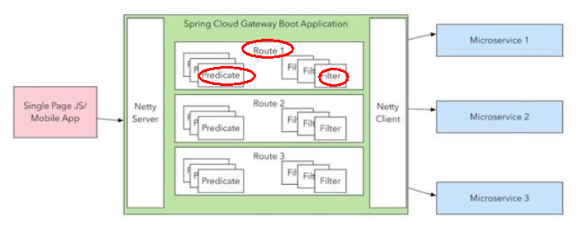

web请求，通过一些匹配条件，定位到真正的服务节点。并在这个转发过程的前后，进行一些精细化控制。
predicate就是我们的匹配条件；
而filter，就可以理解为一个无所不能的拦截器。有了这两个元素，再加上目标uri，就可以实现一个具体的路由了

## 12.3 工作流程

**路由转发+执行过滤链**

客户端向 Spring Cloud Gateway 发出请求。然后在 Gateway Handler Mapping 中找到与请求相匹配的路由，将其发送到 Gateway Web Handler。

Handler 再通过指定的过滤器链来将请求发送到我们实际的服务执行业务逻辑，然后返回。
过滤器之间用虚线分开是因为过滤器可能会在发送代理请求之前（“pre”）或之后（“post”）执行业务逻辑。

Filter在“pre”类型的过滤器可以做参数校验、权限校验、流量监控、日志输出、协议转换等，
在“post”类型的过滤器中可以做响应内容、响应头的修改，日志的输出，流量监控等有着非常重要的作用。

## 12.4 入门配置

```xml
<!--gateway-->
<dependency>
    <groupId>org.springframework.cloud</groupId>
    <artifactId>spring-cloud-starter-gateway</artifactId>
</dependency>
```

```yml
server:
  port: 9527

spring:
  application:
    name: cloud-gateway

eureka:
  instance:
    hostname: cloud-gateway-service
  client:
    service-url:
      deaultZone: http://eureka7001.com:7001/eureka
    register-with-eureka: true
    fetch-registry: true
```

在8001服务套一层9527网关 

```yml
# 网关配置
cloud:
  gateway:
    routes:
      - id: payment_routh #payment_route    #路由的ID，没有固定规则但要求唯一，建议配合服务名
        uri: http://localhost:8001          #匹配后提供服务的路由地址
        predicates:
          - Path=/payment/get/**         # 断言，路径相匹配的进行路由

      - id: payment_routh2 #payment_route    #路由的ID，没有固定规则但要求唯一，建议配合服务名
        uri: http://localhost:8001          #匹配后提供服务的路由地址
        predicates:
          - Path=/payment/lb/**         # 断言，路径相匹配的进行路由
```

**效果**

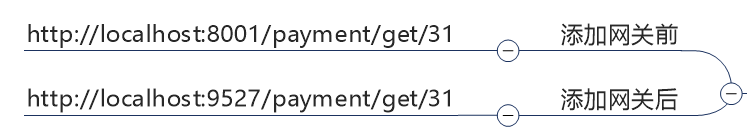

**代码配置方式**

```java
@Configuration
public class GatewayConfig {
    @Bean
    public RouteLocator routeLocator(RouteLocatorBuilder routeLocatorBuilder) {
        RouteLocatorBuilder.Builder routes = routeLocatorBuilder.routes();
        routes.route("path_rout_tintin", p -> p.path("/guonei").uri("http://news.baidu.com/guonei")).build();
        return routes.build();
    }
}

```

## 12.5 通过服务名实现动态路由

默认情况下Gateway会根据注册中心注册的服务列表,
以注册中心上微服务名为路径创建动态路由进行转发，从而实现动态路由的功能

启动

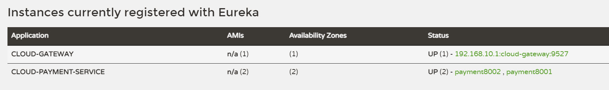

```yml
cloud:
    gateway:
      discovery:
        locator:
          enabled: true # 开启注册中心动态创建路由的功能，利用微服务进行路由
      routes:
        - id: payment_routh #payment_route    #路由的ID，没有固定规则但要求唯一，建议配合服务名
#          uri: http://localhost:8001          #匹配后提供服务的路由地址
          uri: lb//cloud-payment-service #匹配后提供服务的路由地址
          predicates:
            - Path=/payment/payment/info/**         # 断言，路径相匹配的进行路由

        - id: payment_routh2 #payment_route    #路由的ID，没有固定规则但要求唯一，建议配合服务名
#          uri: http://localhost:8001          #匹配后提供服务的路由地址
            uri: lb//cloud-payment-service #匹配后提供服务的路由地址
          predicates:
            - Path=/payment/payment/lb/**         # 断言，路径相匹配的进行路由
```


## 12.6 predicate的使用

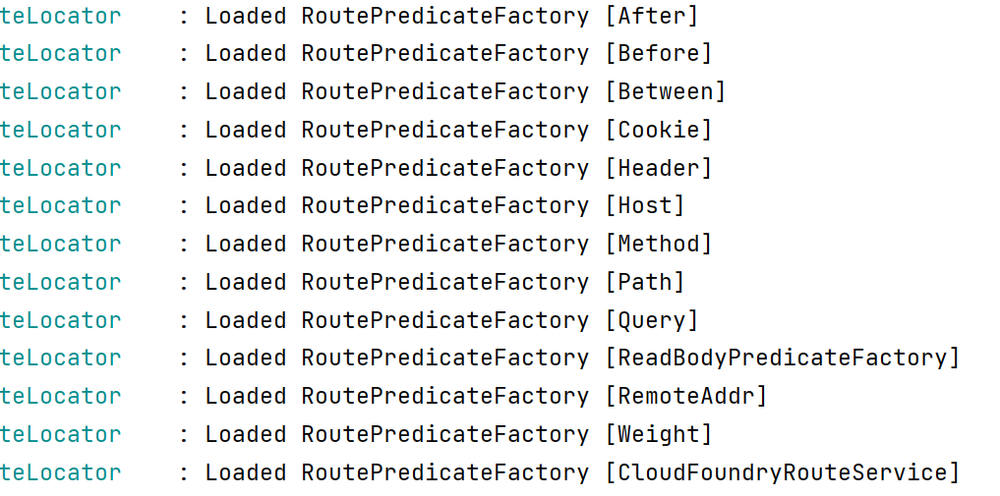

```yml
spring:
  cloud:
    routes:
      predicates:
        - Path=/payment/payment/info/**  
        - After=2020-02-05T15:10:03.685+08:00[Asia/Shanghai]         # 断言，路径相匹配的进行路由
        - Before=2020-02-05T15:10:03.685+08:00[Asia/Shanghai]         # 断言，路径相匹配的进行路由
		- Between=2020-02-02T17:45:06.206+08:00[Asia/Shanghai],2020-03-25T18:59:06.206+08:00[Asia/Shanghai]
		- Cookie=username,zzyy
		- Header=X-Request-Id, \d+  # 请求头要有X-Request-Id属性并且值为整数的正则表达式
		- Host=**.atguigu.com
		- Method=GET
		- Query=username, \d+  # 要有参数名username并且值还要是整数才能路由

```

Predicate就是为了实现一组匹配规则
让请求过来找到对应的Route进行处理。11.7 filter的使用

## 12.7 filter的使用

路由过滤器可用于修改进入的HTTP请求和返回的HTTP响应，路由过滤器只能指定路由进行使用。

Spring Cloud Gateway 内置了多种路由过滤器，他们都由GatewayFilter的工厂类来产生

yml方式

```yml
spring:
  cloud:
    routes:
		filters:
            - AddRequestParameter=X-Request-Id,1024 #过滤器工厂会在匹配的请求头加上一对请求头，名称为X-Request-Id值为1024

```

自定义全局filter

```java
@Component
@Slf4j
public class MyLogGatewayFilter implements GlobalFilter, Ordered {

    @Override
    public Mono<Void> filter(ServerWebExchange exchange, GatewayFilterChain chain) {
        log.info("come in MyLogGatewayFilter" + new Date());
        String uname = exchange.getRequest().getQueryParams().getFirst("uname");
        if (uname == null) {
            log.info("用户名为null");
            exchange.getResponse().setStatusCode(HttpStatus.NOT_ACCEPTABLE);
            return exchange.getResponse().setComplete();
        }
        return chain.filter(exchange);
    }

    @Override
    public int getOrder() {
        return 0;
    }
}
```

# 13 SpringCloud Config

## 13.1 概述

**分布式系统的配置问题**

 微服务意味着要将单体应用中的业务拆分成一个个子服务，每个服务的粒度相对较小，因此系统中会出现大量的服务。由于每个服务都需要必要的配置信息才能运行，所以**一套集中式的、动态的配置管理设施**是必不可少的。

**SpringCloud Config**

SpringCloud Config为微服务架构中的微服务提供集中化的外部配置支持，配置服务器为各个不同微服务应用的所有环境提供了一个中心化的外部配置。

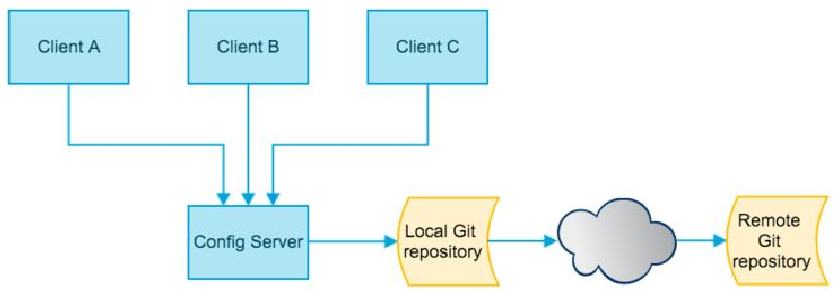

**功能**

集中管理配置文件

不同环境不同配置 dev/test/prod/beta/release

运行期间动态调整配置，服务会想配置中心拉取自己的信息

当配置发生改动时，无需重启即可感知配置变化并应用新的配置

将配置信息以rest接口的形式暴露

## 13.2 Config服务端配置与测试

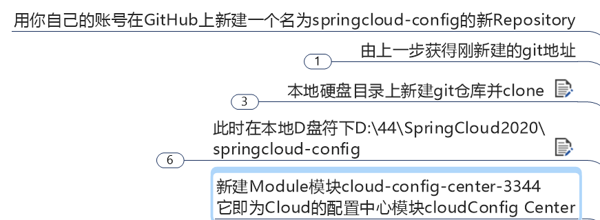

```xml
     <dependency>
            <groupId>org.springframework.cloud</groupId>
            <artifactId>spring-cloud-config-server</artifactId>
        </dependency>
```

```yml
server:
  port: 3344

spring:
  application:
    name: cloud-config-center #注册进eureka的微服务名
  cloud:
    config:
      server:
        git:
          uri: git@github.com:TintinLY/springcloud-config.git # github上的仓库名称
          search-paths:
            - springcloud-config # 搜索仓库的目录
          default-label: main # 读取某一分支

#服务注册到eureka
eureka:
  client:
    register-with-eureka: true
    fetch-registry: true
    service-url:
      defaultZone: http://eureka7001.com:7001/eureka
```

```java
@EnableConfigServer

```


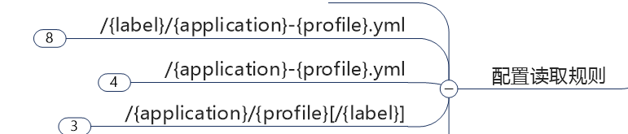

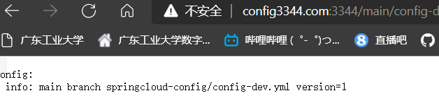

## 13.3 Config客户端配置

```xml
<dependency>
            <groupId>org.springframework.cloud</groupId>
            <artifactId>spring-cloud-starter-config</artifactId>
        </dependency>
```

bootstrap.yml

applicaiton.yml是用户级的资源配置项
bootstrap.yml是系统级的，优先级更加高

Spring Cloud会创建一个“Bootstrap Context”，作为Spring应用的`Application Context`的父上下文。初始化的时候，`Bootstrap Context`负责从外部源加载配置属性并解析配置。这两个上下文共享一个从外部获取的`Environment`。

**`Bootstrap`属性有高优先级**，默认情况下，它们不会被本地配置覆盖。 `Bootstrap context`和`Application Context`有着不同的约定，所以新增了一个`bootstrap.yml`文件，保证`Bootstrap Context`和`Application Context`配置的分离。

```yml
server:
  port: 3355

spring:
  application:
    name: config-client
  cloud:
    #Config客户端配置
    config:
      label: main #分支名称
      name: config #配置文件名称
      profile: dev #读取后缀名称   上述3个综合：master分支上config-dev.yml的配置文件被读取http://config-3344.com:3344/master/config-dev.yml
      uri: http://localhost:3344 #配置中心地址k

#服务注册到eureka地址
eureka:
  client:
    service-url:
      defaultZone: http://localhost:7001/eureka


```

## 13.4 config 客户端动态刷新（无需重启获取配置）

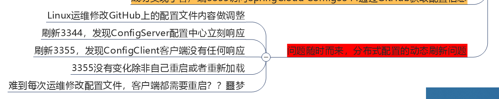

引入监控模块

```xml
<dependency>
    <groupId>org.springframework.boot</groupId>
    <artifactId>spring-boot-starter-actuator</artifactId>
</dependency>
```

```yml
# 暴露监控端点
management:
  endpoints:
    web:
      exposure:
        include: "*"
```

```java
@RestController
@RequestMapping("/config/client")
@RefreshScope
public class ConfigClientController {
```

运维人员发送post请求刷新3355

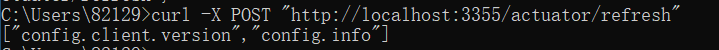

如何广播，一次通知，每个客户端都生效

**总线**

# 14 SpringCloud Bus 消息总线

## 14.1 概述

**SpringCloudBus**

SpringCloud Bus 配合 SprigCloud Config 使用能实现配置的动态刷新

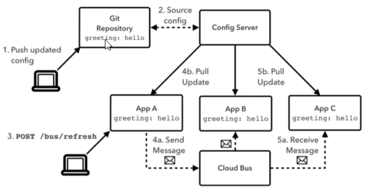

Spring Cloud Bus是用来**将分布式系统的节点与轻量级消息系统链接起来**的框架，
它整合了Java的事件处理机制和消息中间件的功能。
Spring Clud Bus目前支持**RabbitMQ和Kafka。**

**总线**

在微服务架构的系统中，通常会使用轻量级的消息代理来构建一个共用的消息主题，并让系统中所有微服务实例都连接上来。由于该主题中产生的消息会被所有实例监听和消费，所以称它为消息总线。在总线上的各个实例，都可以方便地广播一些需要让其他连接在该主题上的实例都知道的消息。

**基本原理**

ConfigClient实例都监**听MQ中同一个topic(默认是springCloudBus)**。当一个服务刷新数据的时候，它会把这个信息放入到Topic中，这样其它监听同一Topic的服务就能得到通知，然后去更新自身的配置。

## 14.2 RabbitMQ环境配置

安装Erlang并配置环境变量

安装RabbitMQ

启动管理功能

```bash
rabbitmq-plugins enable rabbitmq_management
```

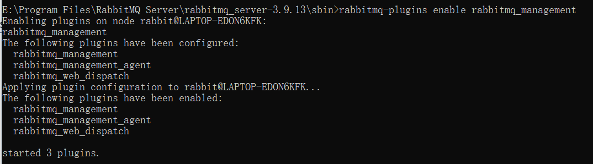

出现可视化插件

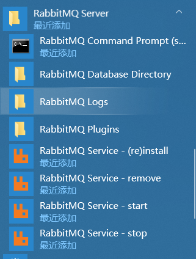

默认访问地址[RabbitMQ Management](http://localhost:15672/)

登录RabbitMq

```bash
./rabbitmqctl add_user admin admin
./rabbitmqctl set_user_tags admin administrator
```

## 14.3 SpringCloud Bus动态刷新全局广播

以cloud-config-client3355为模板 负责 cloud-config-client3377

```java
@RestController
@RequestMapping("/config/client")
@Slf4j
@RefreshScope
public class ConfigClientController {
    @Value("${config.info}")
    private String configInfo;

    @Value("${server.port}")
    private String serverPort;


    @GetMapping("/configInfo")
    public String configInfo() {
        log.info(configInfo);
        System.out.println(serverPort);
        return "serverPort:" + serverPort + ", configInfo:" + configInfo;
    }

}
```

1）利用消息总线触发一个客户端/bus/refresh,而刷新所有客户端配置

这种设计实现打破了微服务的单一性，因为微服务本身是业务模块，它本不应该承担配置刷新的职责。
破坏了微服务各节点的对等性。
有一定的局限性。例如，微服务在迁移时，会发生变化，此时如果想要做到自动刷新，那就多改

2）利用消息总线触发一个服务端ConfigServer的/bus/refresh端点，而刷新所有客户

**给cloud-config-center3344配置中心添加消息总线支持**

```xml
<!--添加消息总线RabbitMQ支持-->
<dependency>
    <groupId>org.springframework.cloud</groupId>
    <artifactId>spring-cloud-starter-bus-amqp</artifactId>
</dependency>
```

```yml
# 暴露监控端点
management:
  endpoints:
    web:
      exposure:
        include: "*"

#rabbitmq相关配置
spring:
  rabbitmq:
    host: localhost
    port: 5672
    username: guest
    password: guest
```

**给cloud-config-client3355 和 cloud-config-client3377配置中心添加消息总线支持**

```xml
<!--添加消息总线RabbitMQ支持-->
<dependency>
    <groupId>org.springframework.cloud</groupId>
    <artifactId>spring-cloud-starter-bus-amqp</artifactId>
</dependency>
```

```yml
# 暴露监控端点
management:
  endpoints:
    web:
      exposure:
        include: "*"
        
#rabbitmq相关配置 15672是Web管理界面的端口；5672是MQ访问的端口
spring:
  rabbitmq:
    host: localhost
    port: 5672
    username: guest
    password: guest
```


效果：一次修改，广播通知，处处生效

## 14.4 SpringCloud Bus动态刷新定点通知

定点通知3355


## 14.5 总结

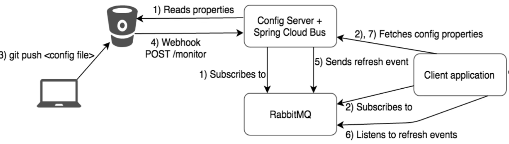

# 15 SpringCloud Stream消息驱动

## 15.1 概述

### 15.1.1 SpringCloud Stream是什么

一个屏蔽底层消息中间件的差异，降低切换成本，统一消息的编程模型

应用程序通过 inputs 或者 outputs 来与 Spring Cloud Stream中binder对象交互。
通过我们配置来binding(绑定) ，而 Spring Cloud Stream 的 binder对象负责与消息中间件交互。
所以，我们只需要搞清楚如何与 Spring Cloud Stream 交互就可以方便使用消息驱动的方式。

 ## 15.1.2 SpringCloud Stream设计思想

**标准MQ**

生产者与消费者之间靠消息媒介传递信息内容：Message

消息必须走特定通道：MessageChannel

由消息通道里的子接口SubMessageChannel，由MessageHandler消息处理器订阅

**使用SpringCloud Stream屏蔽不同中间件的差异性**

像RabbitMQ有exchange，kafka有Topic和Partitions分区，

当项目往另外一种消息队列进行迁移，这时候无疑就是一个灾难性的，一大堆东西都要重新推倒重新做，因为它跟我们的系统耦合了，这时候springcloud Stream给我们提供了一种解耦合的方式。

**原理**

由于各消息中间件构建的初衷不同，它们的实现细节上会有较大的差异性

通过定义绑定器作为中间层，完美地实现了应用程序与消息中间件细节之间的隔离。

通过向应用程序暴露统一的Channel通道，使得应用程序不需要再考虑各种不同的消息中间件实现。

**Binder绑定器**

Binder可以生成Binding，Binding用来绑定消息容器的生产者和消费者，它有两种类型，INPUT和OUTPUT，**INPUT对应于消费者，OUTPUT对应于生产者。**

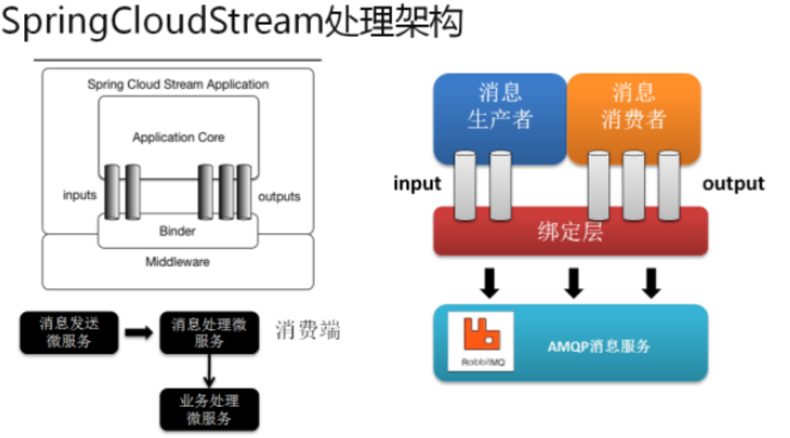

**发布-订阅模式**

**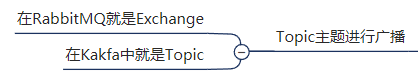**

**标准编码流程**

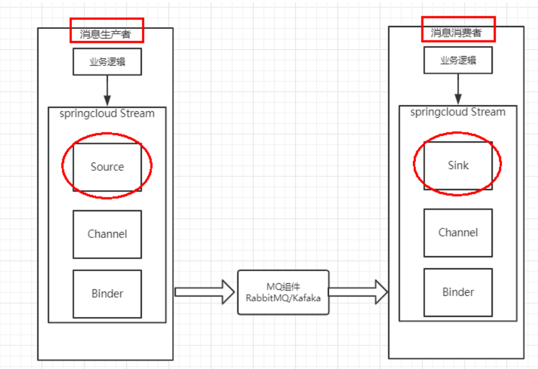

binder连接中间件，屏蔽差异

Channel 通道，是队列Queue的一种抽象，在消息通讯系统中存储和转发的媒介，通过Channel对队列进行配置

Source和Sink，简单理解为SpringCloud Stream本身，接受消息或发布消息。

**API与注解**

 

| 组成            | 说明                                                         |
| --------------- | ------------------------------------------------------------ |
| MiddleWare      | 中间件，目前只支持RabbitMQ和Kafka                            |
| Binder          | Binder是应用与消息中间件之间的封装，目前实行了Kafka和RabbitMQ的Binder，通过Binder<br />Binder可以很方便的连接中间件，可以动态的改变消息类型(对应于Kaika的topic，RabbitMQ的exchange)，这些都可以通过配置文件来实现 |
| @lnput          | 注解标识输入通道，通过该输入通道接收到的消息进入应用程序     |
| @Output         | 注解标识输出通道，发布的消息将通过该通道离开应用程序         |
| @StreamListener | 监听队列，用于消费者的队列的消息接收                         |
| @EnableBinding  | 指信道channel和exchange绑定在一起                            |

## 15.2 测试案例

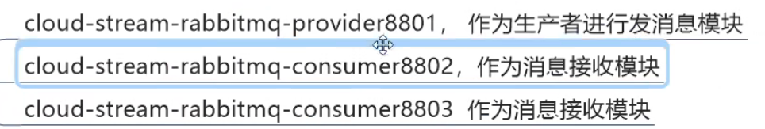

## 15.3 消息驱动之生产者

```xml
       <dependency>
            <groupId>org.springframework.cloud</groupId>
            <artifactId>spring-cloud-starter-stream-rabbit</artifactId>
        </dependency>
```

```yml
server:
  port: 8801

spring:
  application:
    name: cloud-stream-provider
  cloud:
    stream:
      binders: # 在此处配置要绑定的rabbitmq的服务信息；
        defaultRabbit: # 表示定义的名称，用于于binding整合
          type: rabbit # 消息组件类型
          environment: # 设置rabbitmq的相关的环境配置
            spring:
              rabbitmq:
                host: localhost
                port: 5672
                username: guest
                password: guest
      bindings: # 服务的整合处理
        output: # 这个名字是一个通道的名称
          destination: studyExchange # 表示要使用的Exchange名称定义
          content-type: application/json # 设置消息类型，本次为json，文本则设置“text/plain”
          binder: defaultRabbit # 设置要绑定的消息服务的具体设置

eureka:
  client:
    fetch-registry: true
    register-with-eureka: true
    service-url:
      defaultZone: http://eureka7001.com:7001/eureka
    instance:
      lease-renewal-interval-in-seconds: 2 # 设置心跳的时间间隔（默认是30秒）
      lease-expiration-duration-in-seconds: 5 # 如果现在超过了5秒的间隔（默认是90秒）
      instance-id: send-8801.com  # 在信息列表时显示主机名称
      prefer-ip-address: true     # 访问的路径变为IP地址
```

```java
@EnableBinding(Source.class)//定义消息推送的管道
public class MessageProviderImpl implements MessageProvider {
    @Resource
    private MessageChannel output;

    @Override
    public String send() {
        String serial = UUID.randomUUID().toString();
        output.send(MessageBuilder.withPayload(serial).build()); // 创建并发送消息
        System.out.println("***serial: "+serial);

        return serial;
    }
}
```

开启7001 rabbitmq 8801

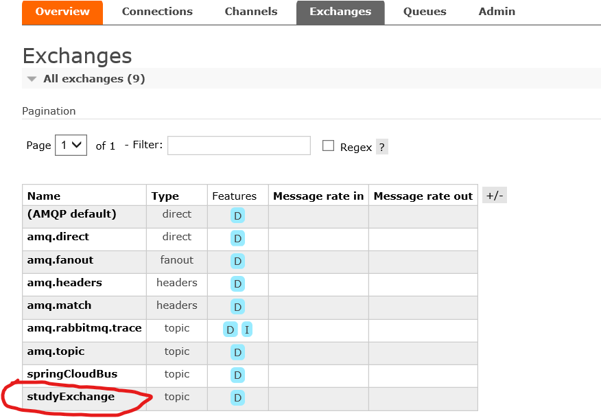

## 15.4 消息驱动之消费者

pom.xml同上

```yml
server:
  port: 8802

spring:
  application:
    name: cloud-stream-consumer
  cloud:
    stream:
      binders: # 在此处配置要绑定的rabbitmq的服务信息；
        defaultRabbit: # 表示定义的名称，用于于binding整合
          type: rabbit # 消息组件类型
          environment: # 设置rabbitmq的相关的环境配置
            spring:
              rabbitmq:
                host: localhost
                port: 5672
                username: guest
                password: guest
      bindings: # 服务的整合处理
        input: # 这个名字是一个通道的名称
          destination: studyExchange # 表示要使用的Exchange名称定义
          content-type: application/json # 设置消息类型，本次为对象json，如果是文本则设置“text/plain”
          binder: defaultRabbit # 设置要绑定的消息服务的具体设置


eureka:
  client:
    register-with-eureka: true
    fetch-registry: true
    service-url:
      defaultZone: http://eureka7001.com:7001/eureka
  instance:
    lease-renewal-interval-in-seconds: 2 # 设置心跳的时间间隔（默认是30秒）
    lease-expiration-duration-in-seconds: 5 # 如果现在超过了5秒的间隔（默认是90秒）
    instance-id: receive-8802.com  # 在信息列表时显示主机名称
    prefer-ip-address: true     # 访问的路径变为IP地址
```

```java
@Component
@EnableBinding(Sink.class)
public class ReceiveMessageListener {
    @Value("${server.port}")
    private String serverPort;

    @StreamListener(Sink.INPUT)
    public void input(Message<String> message)
    {
        System.out.println("消费者1号，------->接收到的消息：" + message.getPayload()+"\t port: "+serverPort);
    }
}
```

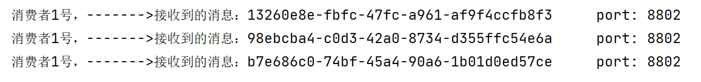

## 15.5 分组消费与持久化

### 15.5.1 分组消费

根据消费者8802复制出消费者8803

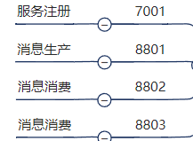

**运行后的两个问题：**

重复消费与消息持久化问题

**重复消费：8802与8803都收到了消息**

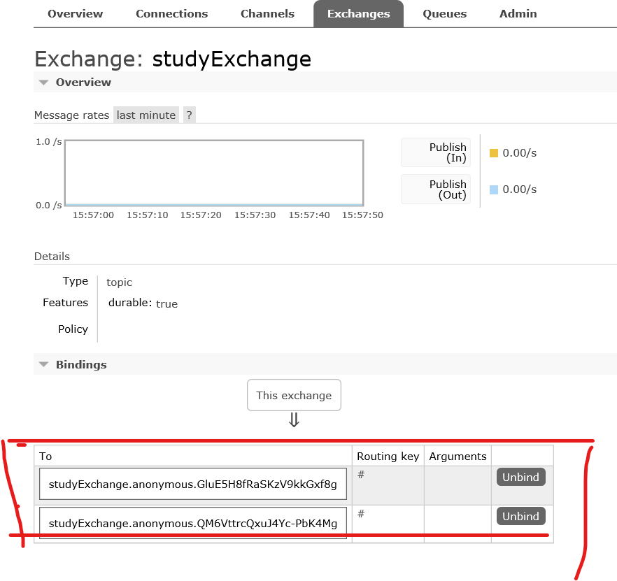

解决：将8802 8803设置在同一个组

多数情况，生产者发送消息给某个具体微服务时只希望被消费一次，按照上面我们启动两个应用的例子，虽然它们同属一个应用，

但是这个消息出现了被重复消费两次的情况。为了解决这个问题，在Spring Cloud Stream中提供了**消费组**的概念。

> 注意在Stream中处于同一个group中的多个消费者是竞争关系，就能够保证消息只会被其中一个应用消费一次。
>
> 不同组是可以全面消费的(重复消费)，
>
> 同一组内会发生竞争关系，只有其中一个可以消费。

 

```yml
spring:
  application:
    name: cloud-stream-consumer
  cloud:
    stream:
      binders: # 在此处配置要绑定的rabbitmq的服务信息；
        defaultRabbit: # 表示定义的名称，用于于binding整合
          type: rabbit # 消息组件类型
          environment: # 设置rabbitmq的相关的环境配置
            spring:
              rabbitmq:
                host: localhost
                port: 5672
                username: guest
                password: guest
      bindings: # 服务的整合处理
        input: # 这个名字是一个通道的名称
          destination: studyExchange # 表示要使用的Exchange名称定义
          content-type: application/json # 设置消息类型，本次为对象json，如果是文本则设置“text/plain”
          binder: defaultRabbit # 设置要绑定的消息服务的具体设置
          group: tintinA # 分组消费
```

若不同分组，出现重复消费

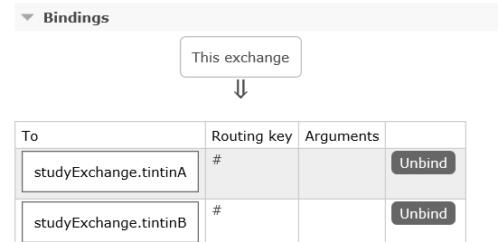

若同一分组，解决重复消费

### 15.5.2 持久化

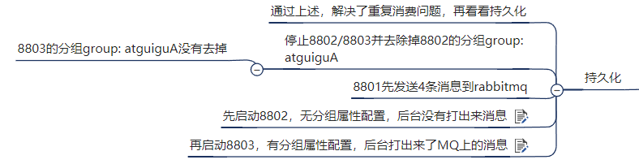

# 16 SpringCloud Sleuth分析请求链路追踪

## 16.1 概述

**问题** ：

在微服务框架中，一个由客户端发起的请求在后端系统中会经过多个不同的的服务节点调用来协同产生最后的请求结果，每一个前段请求都会形成一条复杂的分布式服务调用链路，链路中的任何一环出现高延时或错误都会引起整个请求最后的失败。

Spring Cloud Sleuth为此提供了一套完整的服务跟踪的解决方案
在分布式系统中提供追踪解决方案并且兼容支持了zipkin

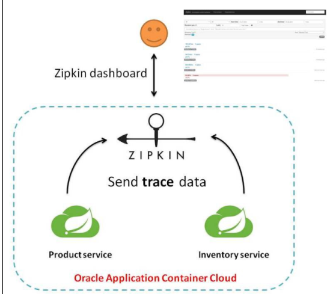

## 16.2 搭建链路监控

### 16.2.1 Zipkin

下载jar包[Maven Central Repository Search](https://search.maven.org/search?q=g:io.zipkin)并运行

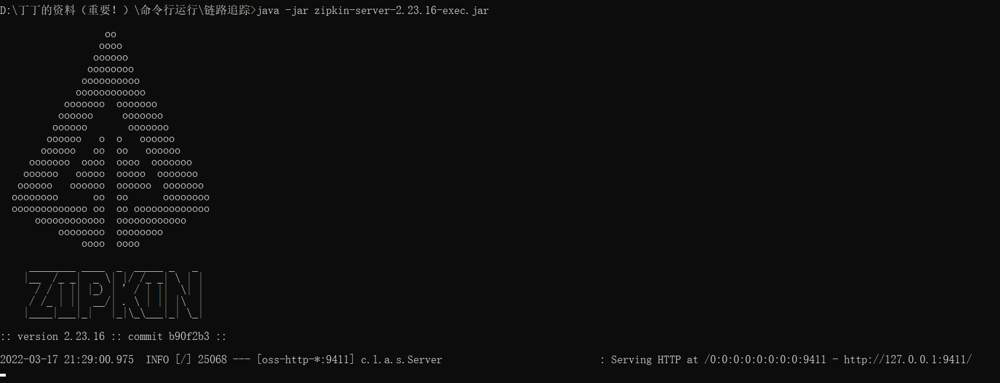

表示一请求链路，一条链路通过Trace Id唯一标识，Span标识发起的请求信息，各span通过parent id 关联起来

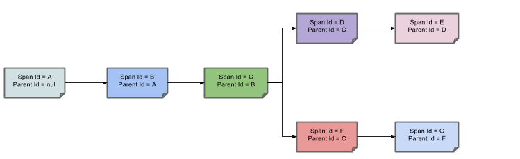

Trace:类似于树结构的Span集合，表示一条调用链路，存在唯一标识
span:表示调用链路来源，通俗的理解span就是一次请求信息

### 16.2.2 服务提供者

以cloud-provider-payment8001为例

```xml
  <!--包含了sleuth+zipkin-->
        <dependency>
            <groupId>org.springframework.cloud</groupId>
            <artifactId>spring-cloud-starter-zipkin</artifactId>
        </dependency>
```

```yml
 zipkin:
    base-url: http://localhost:9411
  sleuth:
    sampler:
      #采样率值介于 0 到 1 之间，1 则表示全部采集
     probability: 1

```


### 16.2.3 服务消费者（调用方）

同上

```java
 @GetMapping("/zipkin")
    public CommonResult zipkin() {

        ResponseEntity<CommonResult> responseEntity = restTemplate.getForEntity(PAYMENT_URL + "/payment/payment/zipkin", CommonResult.class);
        if (responseEntity.getStatusCode().is2xxSuccessful()) {
            return responseEntity.getBody();
        } else {
            return new CommonResult(444,"操作失败");
        }
    }
```

由80调用8001 打开浏览器访问:
http://localhost:9411

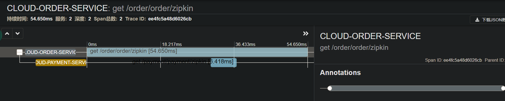

# 17 SpringCloudAlibaba 入门简介

SpringCloud Netflix项目进入维护模式


官网：
https://github.com/alibaba/spring-cloud-alibaba/blob/master/README-zh.md

诞生：
2018.10.31，Spring Cloud Alibaba 正式入驻了 Spring Cloud 官方孵化器，并在 Maven 中央库发布了第一个版本。

功能：

服务限流降级：默认支持 Servlet、Feign、RestTemplate、Dubbo 和 RocketMQ 限流降级功能的接入，可以在运行时通过控制台实时修改限流降级规则，还支持查看限流降级 Metrics 监控。
服务注册与发现：适配 Spring Cloud 服务注册与发现标准，默认集成了 Ribbon 的支持。
分布式配置管理：支持分布式系统中的外部化配置，配置更改时自动刷新。
消息驱动能力：基于 Spring Cloud Stream 为微服务应用构建消息驱动能力。
阿里云对象存储：阿里云提供的海量、安全、低成本、高可靠的云存储服务。支持在任何应用、任何时间、任何地点存储和访问任意类型的数据。
分布式任务调度：提供秒级、精准、高可靠、高可用的定时（基于 Cron 表达式）任务调度服务。同时提供分布式的任务执行模型，如网格任务。网格任务支持海量子任务均匀分配到所有 Worker（schedulerx-client）上执行。

# 18 SPringCloud Alibaba Nacos服务注册与配置中心

## 18.1 Nacos简介

Dynamic Naming and  Configuration Service

Nacos = Eureka + Config + Bus （注册中心和配置中心的组合）

[alibaba/nacos: an easy-to-use dynamic service discovery, configuration and service management platform for building cloud native applications. (github.com)](https://github.com/alibaba/nacos)

[home (nacos.io)](https://nacos.io/zh-cn/)

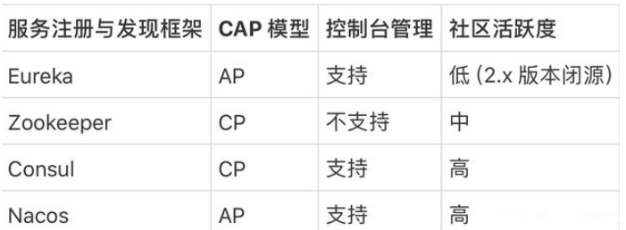

## 18.2 安装并运行

最新版本默认为集群方式运行，

使用如下命令进行单机版运行

```bash
$ startup.cmd -m standalone
```

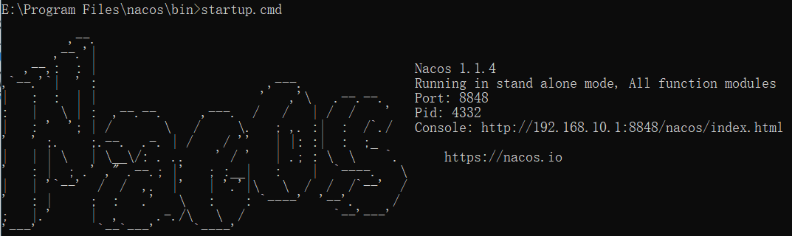

账号nacos 密码nacos

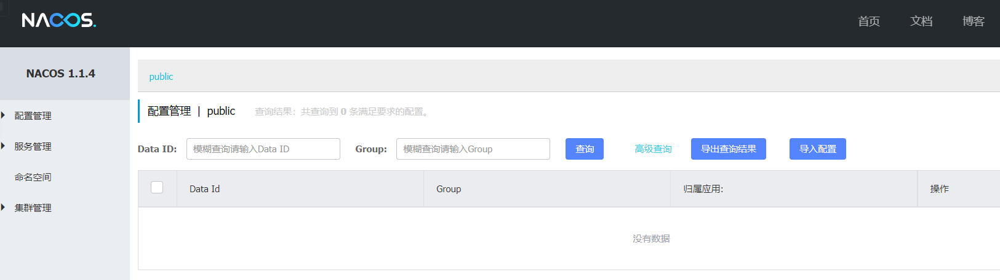

## 18.3 Nacos作为服务注册中心

### 18.3.1 基于Nacos服务提供者

cloudalibaba-provider-payment9001

父pom

```xml
<dependencyManagement>
    <dependencies>
      <dependency>
        <groupId>com.alibaba.cloud</groupId>
        <artifactId>spring-cloud-alibaba-dependencies</artifactId>
        <version>2.1.0.RELEASE</version>
        <type>pom</type>
        <scope>import</scope>
      </dependency>
    </dependencies>
</dependencyMagement>
```

子pom

```xml
<!--SpringCloud ailibaba nacos -->
        <dependency>
            <groupId>com.alibaba.cloud</groupId>
            <artifactId>spring-cloud-starter-alibaba-nacos-discovery</artifactId>
        </dependency>
```

```java
@EnableDiscoveryClient
```

```java
@RestController
@RequestMapping("/payment/payment")
public class PaymentController {
    @Value("server.port")
    private String serverPort;

    @GetMapping("nacos/{id}")
    private String nacos(@PathVariable("id") Integer id) {
        return "nocos registry, serverPort:" + serverPort + ", id:" +id;
    }

}
```

启动9001

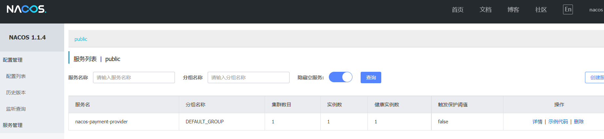

复制9001配置启动9002

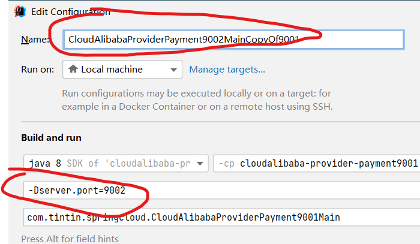


### 18.3.2 基于Nacos服务消费者

cloudalibaba-consumernacos-order81

```xml
<dependencies>
    <!--SpringCloud ailibaba nacos -->
    <dependency>
        <groupId>com.alibaba.cloud</groupId>
        <artifactId>spring-cloud-starter-alibaba-nacos-discovery</artifactId>
    </dependency>
    <!-- 引入自己定义的api通用包，可以使用Payment支付Entity -->
    <dependency>
        <groupId>com.tintin.springcloud</groupId>
        <artifactId>cloud-api-commons</artifactId>
        <version>1.0-SNAPSHOT</version>
    </dependency>
    <!-- SpringBoot整合Web组件 -->
    <dependency>
        <groupId>org.springframework.boot</groupId>
        <artifactId>spring-boot-starter-web</artifactId>
    </dependency>
    <dependency>
        <groupId>org.springframework.boot</groupId>
        <artifactId>spring-boot-starter-actuator</artifactId>
    </dependency>
    <!--日常通用jar包配置-->
    <dependency>
        <groupId>org.springframework.boot</groupId>
        <artifactId>spring-boot-devtools</artifactId>
        <scope>runtime</scope>
        <optional>true</optional>
    </dependency>
    <dependency>
        <groupId>org.projectlombok</groupId>
        <artifactId>lombok</artifactId>
        <optional>true</optional>
    </dependency>
    <dependency>
        <groupId>org.springframework.boot</groupId>
        <artifactId>spring-boot-starter-test</artifactId>
        <scope>test</scope>
    </dependency>
</dependencies>
```

```yml
server:
  port: 83


spring:
  application:
    name: nacos-order-consumer
  cloud:
    nacos:
      discovery:
        server-addr: localhost:8848


#消费者将要去访问的微服务名称(注册成功进nacos的微服务提供者)
service-url:
  nacos-user-service: http://nacos-payment-provider 
```

开启resttemplate服务调用与负载均衡

```java
@Configuration
public class ApplicationContextBean {
    @Bean
    @LoadBalanced
    public RestTemplate restTemplate() {
        return new RestTemplate();
    }
}
```

业务类

```java
@RestController
@RequestMapping("/order/order")
public class OrderController {
    @Resource
    private RestTemplate restTemplate;

    @Value("${service-url.nacos-user-service}")
    private String serviceURL;

    @GetMapping("nacos/{id}")
    public  String nacos(@PathVariable("id") Integer id) {
        return restTemplate.getForObject(serviceURL + "/payment/payment/nacos/" + id, String.class);
    }
}
```

访问nacos-payment-provider服务 对两个服务实例进行**轮询**访问

### 18.3.3 服务注册中心对比 

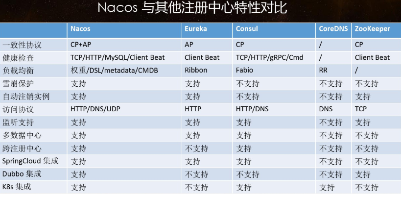

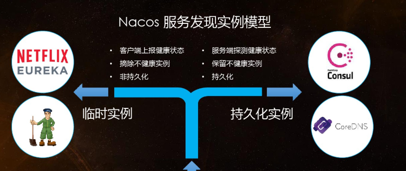

C是所有节点在同一时间看到的数据是一致的；而A的定义是所有的请求都会收到响应。

nacos支持AP和CP模式的切换

```bash
curl -X PUT '$NACOS_SERVER:8848/nacos/v1/ns/operator/switches?entry=serverMode&value=CP'
```

## 18.4 Nacos作为服务配置中心

### 18.4.1 基础配置

```xml
 <!--nacos-config-->
        <dependency>
            <groupId>com.alibaba.cloud</groupId>
            <artifactId>spring-cloud-starter-alibaba-nacos-config</artifactId>
        </dependency>
        <!--nacos-discovery-->
        <dependency>
            <groupId>com.alibaba.cloud</groupId>
            <artifactId>spring-cloud-starter-alibaba-nacos-discovery</artifactId>
        </dependency>
```

```yaml
# nacos配置 bootstrap.yml
server:
  port: 3377

spring:
  application:
    name: nacos-config-client # 默认作为配置的前缀
  cloud:
    nacos:
      discovery:
        server-addr: localhost:8848 #Nacos服务注册中心地址
      config:
        server-addr: localhost:8848 #Nacos作为配置中心地址
        file-extension: yml #指定yaml格式的配置
```

```yml
# nacos配置 application.yml
spring:
  profiles:
    active: dev # 环境
```

```java
@RestController
@RequestMapping("/config/client")
@RefreshScope //在控制器类加入@RefreshScope注解使当前类下的配置支持Nacos的动态刷新功能。
public class ConfigClientController {

    @Value("${config.info}")
    private String configInfo;

    @GetMapping("/config/Info")
    public String configInfo() {
        return configInfo;
    }
}
```

在nacos中添加配置信息

**配置规则：**

```
${spring.application.name}-${spring.profiles.active}.${spring.cloud.nacos.config.file-extension}
```

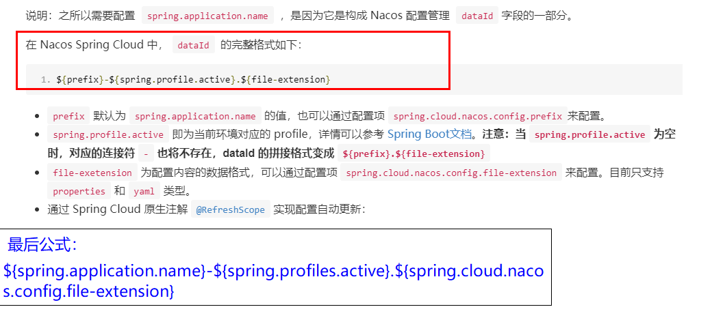

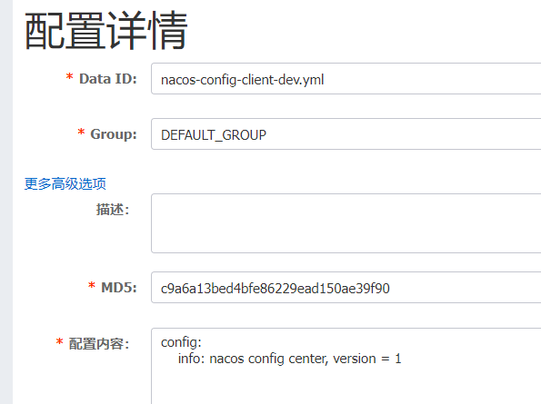

### 18.4.2 分类配置

**问题：**

实际开发中，通常一个系统会准备dev开发环境，test测试环境，prod生产环境。
如何保证指定环境启动时服务能正确读取到Nacos上相应环境的配置文件呢？

一个大型分布式微服务系统会有很多微服务子项目，每个微服务项目又都会有相应的开发环境、测试环境、预发环境、正式环境......
那怎么对这些微服务配置进行管理呢？

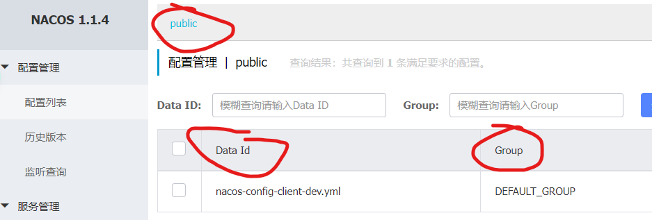

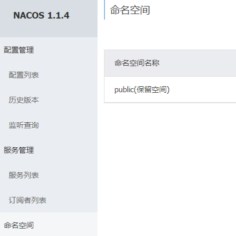

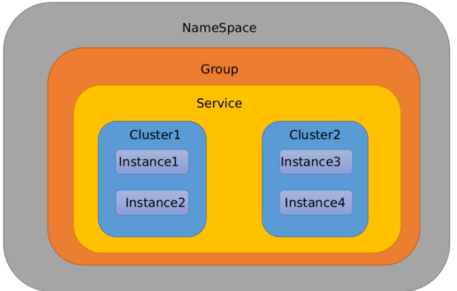

**命名空间**NameSpace

Nacos默认的命名空间是public，Namespace主要用来实现隔离不同的部署环境。比方说我们现在有三个环境：开发、测试、生产环境，我们就可以创建三个Namespace，不同的Namespace之间是隔离的。

**分组Group****

Group默认是DEFAULT_GROUP，Group可以把不同的微服务划分到同一个分组里面去，同一个分组的微服务将会竞争消费消息。

**微服务Service**

Service就是微服务；一个Service可以包含多个Cluster（集群）

**集群Cluster**

Nacos默认Cluster是DEFAULT，Cluster是对指定微服务的一个虚拟划分。 比方说为了容灾，将Service微服务分别部署在了杭州机房和广州机房，这时就可以给杭州机房的Service微服务起一个集群名称（HZ），
给广州机房的Service微服务起一个集群名称（GZ），还可以尽量让同一个机房的微服务互相调用，以提升性能。

**实例Instance**

最后是Instance，就是微服务的实例。

**解决方案1：DataID**

指定spring.profile.active和配置文件件的DatalD
来使不同环境下读取不同的配置

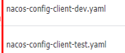

**解决方案2：Group**

在config下增加一条group配置即可。可配置为DEV_GROUP或TEST_GROUP

```yaml
spring:
  cloud:
    nacos:
      config:
	    group: TEST_GROUP # 分组名称 搭配环境可以找到对应配置文件
```

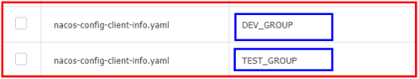

**解决方案3：NameSpace**

```yaml
 spring:
  cloud:
    nacos:
      config:
 		namespace: 5da1dccc-ee26-49e0-b8e5-7d9559b95ab0 # 命名空间id 搭配环境和分组可以找到对应配置文件

```

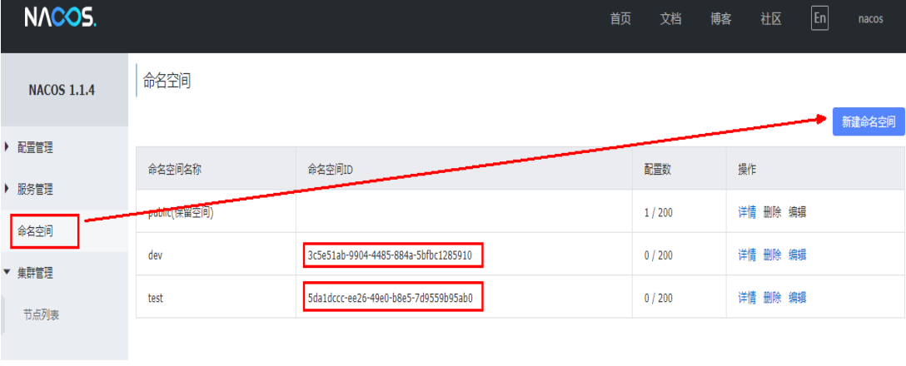

## 18.5 集群与持久化配置

### 18.5.1 说明

**集群架构**

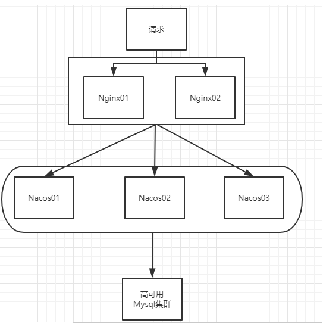

默认Nacos使用嵌入式数据库实现数据的存储。所以，如果启动多个默认配置下的Nacos节点，**数据存储是存在一致性问题的。**
为了解决这个问题，Nacos采用了**集中式存储**的方式来支持集群化部署，目前只支持**MySQL**的存储。

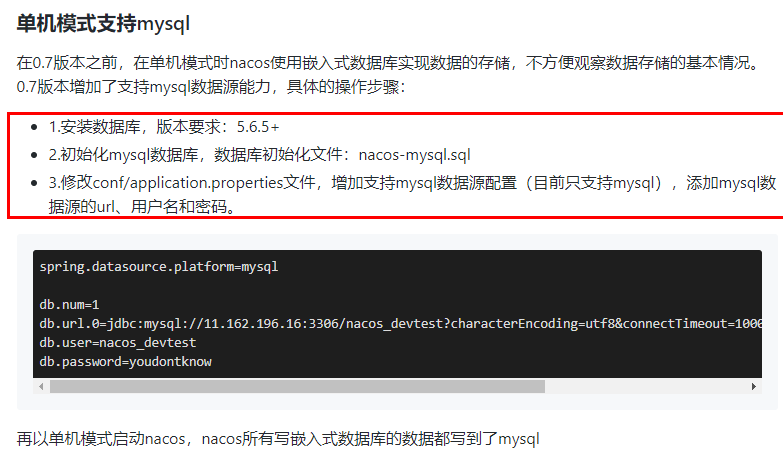

### 18.5.2 持久化配置（mysql）

Nacos默认自带的嵌入式数据库是derby

由derby切换到mysql

创建数据库nacos_config并执行安装目录nacos\conf\nacos-mysql.sql 脚本

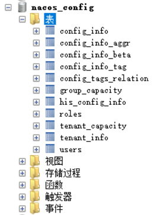

修改nacos\conf\application.properties 

```properties
# derby切换mysql 
spring.datasource.platform=mysql

db.num=1
db.url.0=jdbc:mysql://localhost:3306/nacos_config?useUnicode=true&useJDBCCompliantTimezoneShift=true&useLegacyDatetimeCode=false&serverTimezone=UTC
db.user=root
db.password=root
```

启动Nacos,可以看到是个全新的空记录界面，以前是记录进derby

### 18.5.3 Linux安装Nacos集群+Mysql持久化配置

**1个nginx 3个nacos 1个muysql**

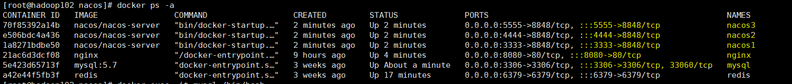

**mysql配置 nacos-mysql.sql**

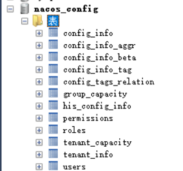

备份application.properties并修改

```properties
# derby切换mysql 
spring.datasource.platform=mysql

db.num=1
db.url.0=jdbc:mysql://localhost:3306/nacos_config?useUnicode=true&useJDBCCompliantTimezoneShift=true&useLegacyDatetimeCode=false&serverTimezone=UTC
db.user=root
db.password=123456 # 此数据库为虚拟机中docker的mysql
```

备份cluster.conf并修改 配置⽂件中设置集群中每⼀个节点的信息


```
# 集群节点配置
192.168.10.102:3333
192.168.10.102:4444
192.168.10.102:5555

```

编辑bin/startup.sh脚本，使nacos能以不同的端口启动

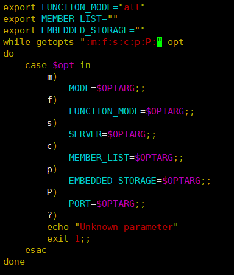

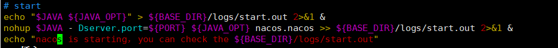

nginx配置，作为负载均衡器

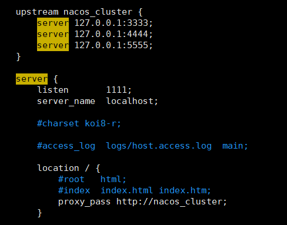

启动三个nacos（需要不断尝试 确认每个节点是否启动成功）和一个nginx

```bash
bin/startup.sh -P 5555
sbin/nginx

```

插入配置后 mysql有对应记录

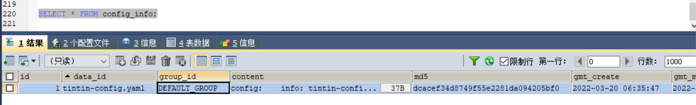


cloud9001注册金nacos mysql有对应记录

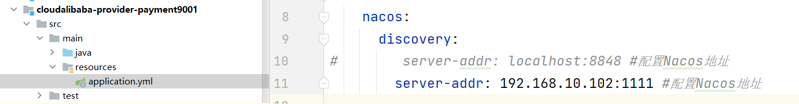

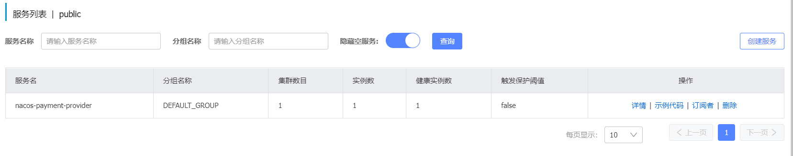

# 19 SpringCloud Alibaba Sentinel实现熔断与限流 

[alibaba/Sentinel: A powerful flow control component enabling reliability, resilience and monitoring for microservices. (面向云原生微服务的高可用流控防护组件) (github.com)](https://github.com/alibaba/Sentinel)

## 19.1 与Hystrix对比

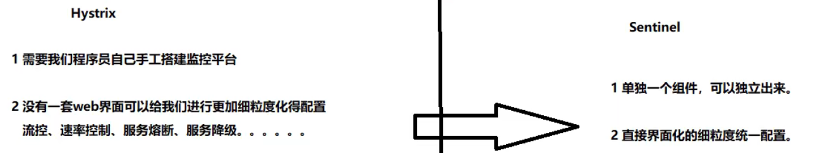

## 19.2 概述

**简介**

轻量级流量控制、熔断降级Java库

**功能**

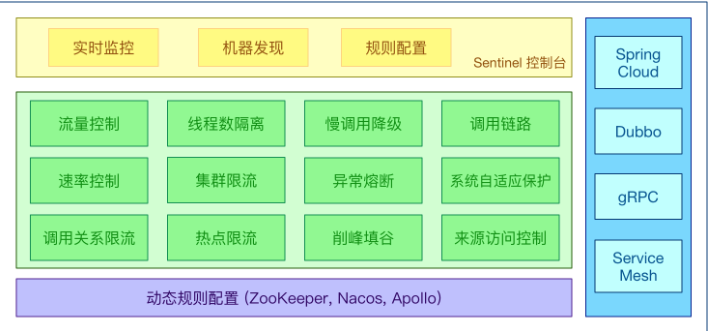

**Sentinel 分为两个部分:**
核心库（Java客户端）不依赖任何框架/库，能够运行于所有Java 运行时环境，同时对 Dubbo／Spring Cloud 等框架也有较好的支持。
控制台（Dashboard）基于 Spring Boot 开发，打包后可以直接运行，不需要额外的 Tomcat 等应用容器。

## 19.3 安装运行

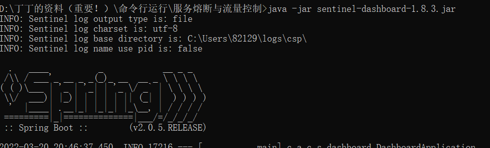

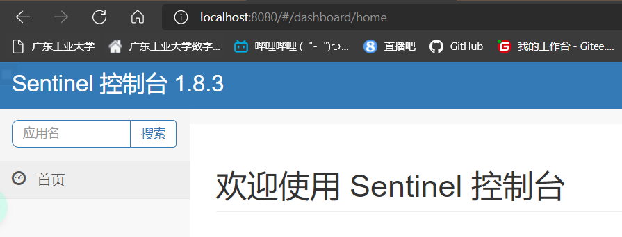

## 19.3 初始化演示工程

cloudalibaba-sentinal-service8401

```xml
<!--SpringCloud ailibaba nacos -->
        <dependency>
            <groupId>com.alibaba.cloud</groupId>
            <artifactId>spring-cloud-starter-alibaba-nacos-discovery</artifactId>
        </dependency>
        <!--SpringCloud ailibaba sentinel-datasource-nacos 后续做持久化用到-->
        <dependency>
            <groupId>com.alibaba.csp</groupId>
            <artifactId>sentinel-datasource-nacos</artifactId>
        </dependency>
        <!--SpringCloud ailibaba sentinel -->
        <dependency>
            <groupId>com.alibaba.cloud</groupId>
            <artifactId>spring-cloud-starter-alibaba-sentinel</artifactId>
        </dependency>
```

```yml
server:
  port: 8401

spring:
  application:
    name: cloudalibaba-sentinel-service8401
  cloud:
    nacos:
      discovery:
        # Nacos 服务注册中心地址
        server-addr: localhost:8848
    sentinel:
      transport:
        # sentinel dashboard地址
        dashboard: localhost:8080
        # 默认8719端口 如果被占用则依次加1扫描，直至找到未被占用的端口
        port: 8719

management:
  endpoints:
    web:
      exposure:
        include: '*'

```

```java
@RestController
@RequestMapping("flow/limit")
public class FlowLimitController {
    @GetMapping("testA")
    public String testA() {
        return "-----testA";
    }
    
    @GetMapping("testB")
    public String testB() {
        return "-----testB";
    }
}
```

启动sentinel控制面板查看

发现无服务列表

原因：懒加载机制

执行一次控制器方法即可

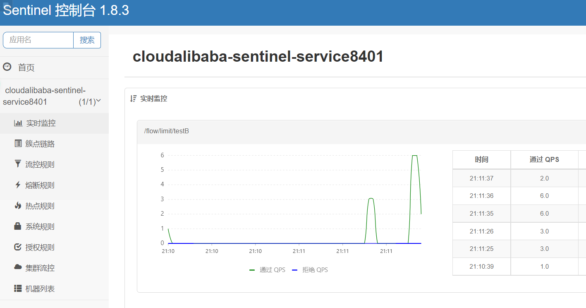

## 19.4 流量控制规则

### 19.4.1 基本介绍

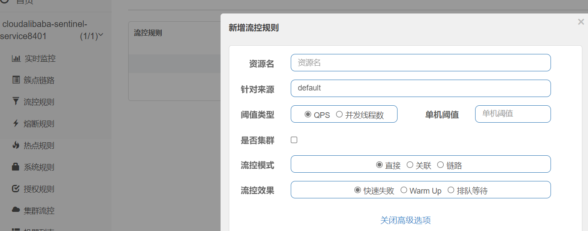

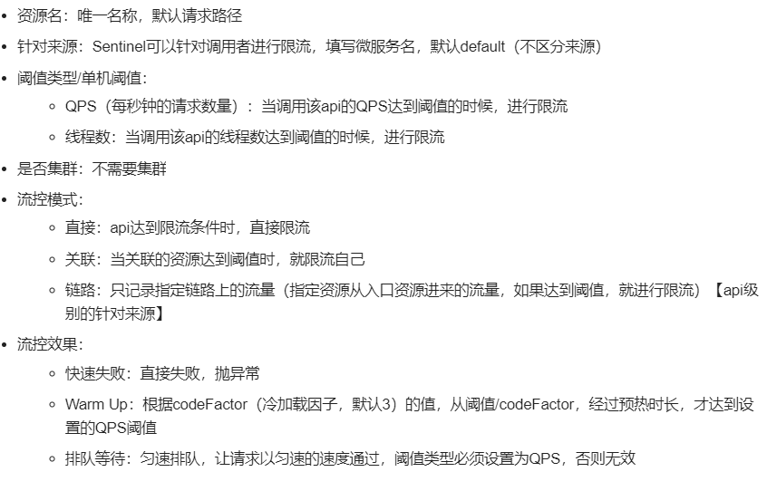

### 19.4.2 流控模式

**直接**

QPS+直接+快速失败 : 表示1秒钟内查询n次就是OK，若超过次数n，就直接-快速失败，报默认错误

**关联**

QPS+关联testB+快速失败：表示资源B达到阈值，限制A

**链路**

### 19.4.3 流控效果

**快速失败**

**WarmUp**

阈值除以coldFactor(默认值为3)，经过预热时长才会达到最终的阈值

Warm Up（RuleConstant.CONTROL_BEHAVIOR_WARM_UP）方式，即预热/冷启动方式。当系统长期处于低水位的情况下，当流量突然增加时，直接把系统拉升到高水位可能瞬间把系统压垮。通过"冷启动"，让通过的流量缓慢增加，在一定时间内逐渐增加到阈值上限，给冷系统一个预热的时间，避免冷系统被压垮。详细文档可以参考 流量控制 - Warm Up 文档，具体的例子可以参WarmUpFlowDemo。
通常冷启动的过程系统允许通过的QPS 曲线如下图所

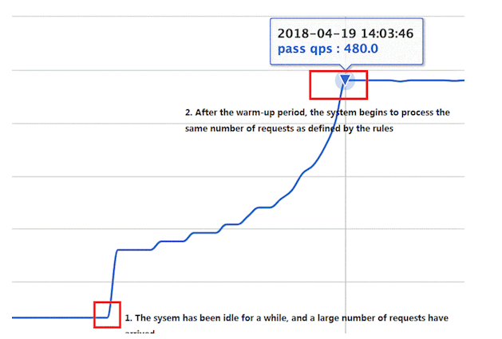

**排队等待**

匀速排队，让请求以均匀的速度通过，阀值类型必须设成QPS，否则无效。
设置含义：/testA每秒1次请求，超过的话就排队等待，等待的超时时间为20000毫秒。

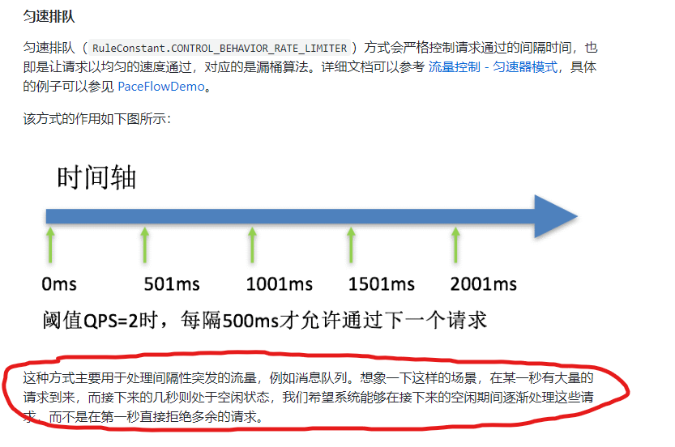

## 19.5 降级规则

### 19.5.1 基本介绍

Sentinel 熔断降级会在调用链路中某个资源出现不稳定状态时（例如调用超时或异常比例升高），对这个资源的调用进行限制，
让请求快速失败，避免影响到其它的资源而导致级联错误。

当资源被降级后，在**接下来的降级时间窗口之内，对该资源的调用都自动熔断**（默认行为是抛出 DegradeException）。

无半开状态

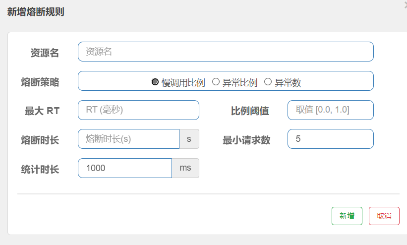

RT（平均响应时间，秒级）
      平均响应时间   超出阈值  且   在时间窗口内通过的请求>=5，两个条件同时满足后触发降级
      窗口期过后关闭断路器
      RT最大4900（更大的需要通过-Dcsp.sentinel.statistic.max.rt=XXXX才能生效）

异常比列（秒级）
    QPS >= 5 且异常比例（秒级统计）超过阈值时，触发降级；时间窗口结束后，关闭降级

异常数（分钟级）
     异常数（分钟统计）超过阈值时，触发降级；时间窗口结束后，关闭降级

### 19.5.2降级-RT

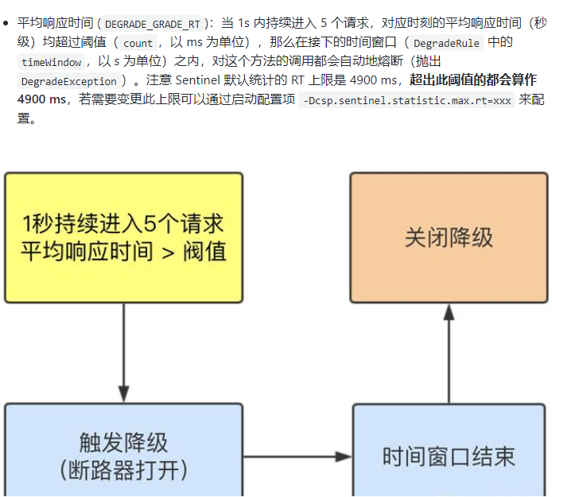

### 19.5.3 降级-异常比例

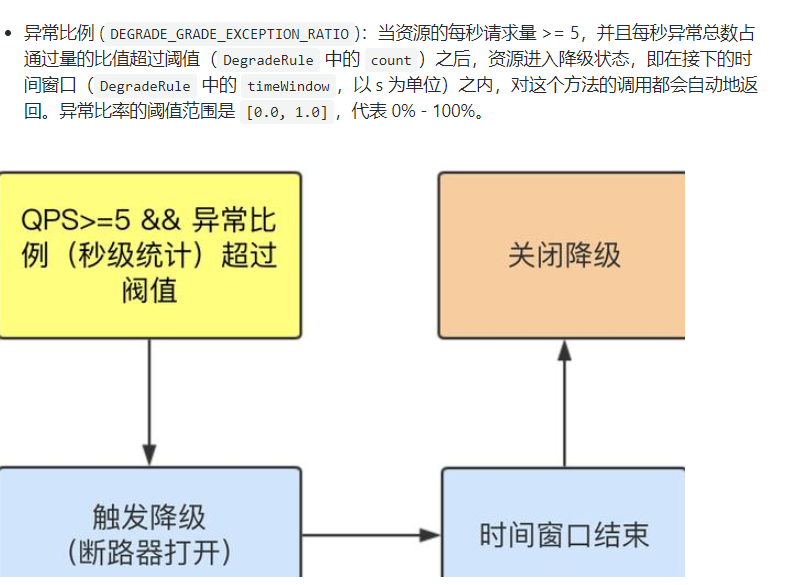

### 19.5.4 降级-异常数

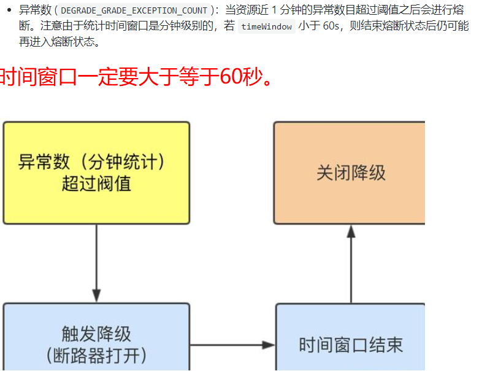

## 19.6 热点规则

### 19.6.1 基本介绍

何为热点
热点即经常访问的数据，很多时候我们希望统计或者限制某个热点数据中访问频次最高的TopN数据，并对其访问进行限流或者其它操作

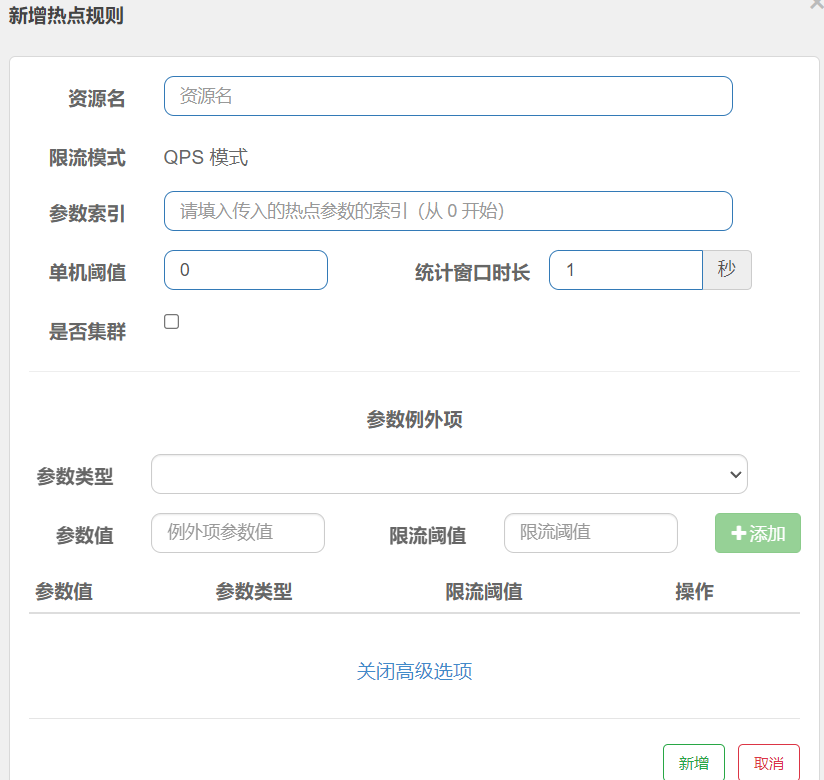

热点参数限流会**统计传入参数中的热点参数**，并根据配置的限流阈值与模式，对包含参数的资源调用进行限流。热点参数限流可以看做是一种特殊的流量控制，仅对包含热点参数的资源调用生效。

### 19.6.2 @SentinelResource

兜底方法
分为系统默认和客户自定义，两种

  之前的case，限流出问题后，都是用sentinel系统默认的提示：Blocked by Sentinel (flow limiting)

  我们能不能自定?类似hystrix，某个方法出问题了，就找对应的兜底降级方法？@SentinelResource

### 19.6.3 代码测试

```java
    @GetMapping("/testHotKey")
    //                 资源名↓
    @SentinelResource(value = "testHotKey", blockHandler = "dealHandler_testHotKey")
    public String testHotKey(@RequestParam(value = "p1",required = false) String p1,
                             @RequestParam(value = "p2", required = false) String p2 ) {
        return "-----testHotKey";
    }

    public String dealHandler_testHotKey(String p1, String p2, BlockException exception) {
        return "-----dealHandler_testHotKey";
    }
```

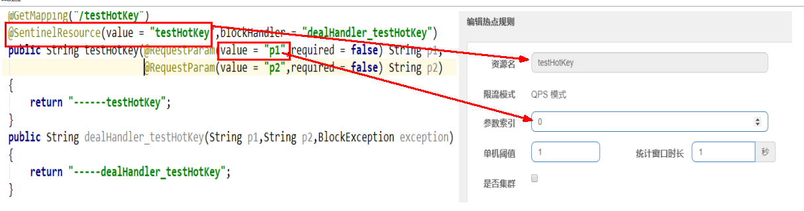

限流模式只支持QPS模式，固定写死了。（这才叫热点）
@SentinelResource注解的方法参数索引，0代表第一个参数，1代表第二个参数，以此类推
单机阀值以及统计窗口时长表示在此窗口时间超过阀值就限流。
上面的抓图就是第一个参数有值的话，1秒的QPS为1，超过就限流，限流后调用dealHandler_testHotKey支持方法。

### 19.6.4 参数例外项

QPS超过阈值后，达到阈值后马上被限流：普通
我们期望p1参数当它是某个特殊值时，它的限流值和平时不一样
假如当p1的值等于5时，它的阈值可以达到200：特例

>  热点参数的注意点，参数必须是基本类型或者String

### 19.6.5 异常处理

@SentinelResource
处理的是Sentinel控制台配置的违规情况，有blockHandler方法配置的兜底处理；

RuntimeException
int age = 10/0,这个是java运行时报出的运行时异常RunTimeException，@SentinelResource不管

总结
 @SentinelResource主管配置出错，运行出错该走异常走异常

[@SentinelResource配置](#19.8 @SentinelResource)

## 19.7 系统规则

Sentinel 系统自适应限流**从整体维度对应用入口流量进行控制**，结合应用的 Load、CPU使用率、总体平均 RT、入口 QPS 和并发线程数等几个维度的监控指标，通过自适应的流控策略，让系统的入口流量和系统的负载达到一个平衡，让系统尽可能跑在最大吞吐量的同时保证系统整体的稳定性。

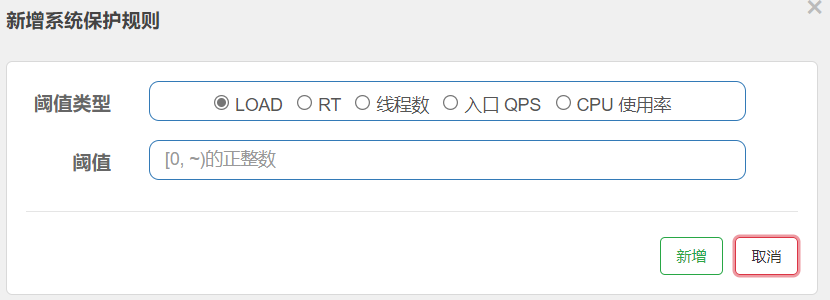

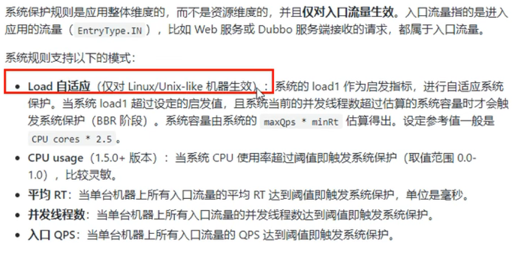

## 19.8 @SentinelResource

### 19.8.1 按资源名限流

cloudalibaba-sentinal-service8401 引入通用包实现支付功能

```yml
server:
  port: 8401

spring:
  application:
    name: cloudalibaba-sentinel-service8401
  cloud:
    nacos:
      discovery:
        # Nacos 服务注册中心地址
        server-addr: localhost:8848
    sentinel:
      transport:
        # sentinel dashboard地址
        dashboard: localhost:8080
        # 默认8719端口 如果被占用则依次加1扫描，直至找到未被占用的端口
        port: 8719

management:
  endpoints:
    web:
      exposure:
        include: '*'
```

```java
@RestController
@RequestMapping("/rate/limit")
public class RateLimitController {
    @GetMapping("/byResource")
    @SentinelResource(value = "byResource", blockHandler = "handlerException")
    public CommonResult byResource() {
        return new CommonResult(200, "资源名称限流测试ok",new Payment(2020L,"serial001"))
    }

    public CommonResult handlerException(BlockException e) {
        return new CommonResult(444,e.getClass().getCanonicalName() + "\t服务不可用")
    }
}

```

流控规则

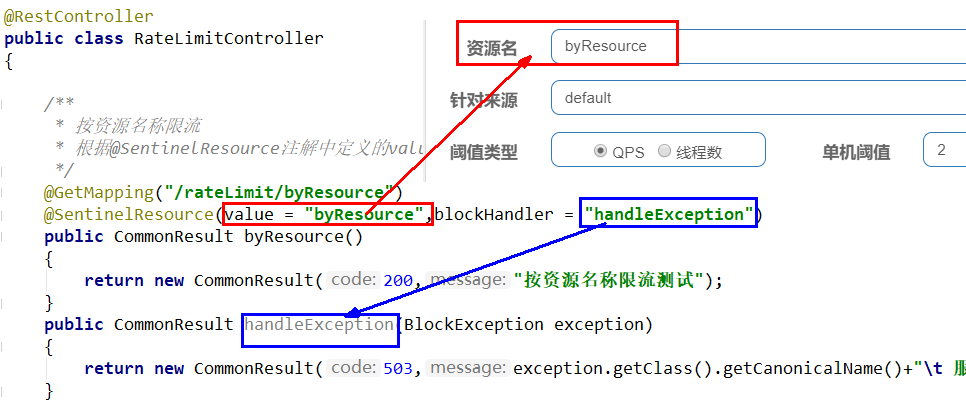

当服务关闭，流控规则等将会清楚

### 19.8.2 按url地址限流

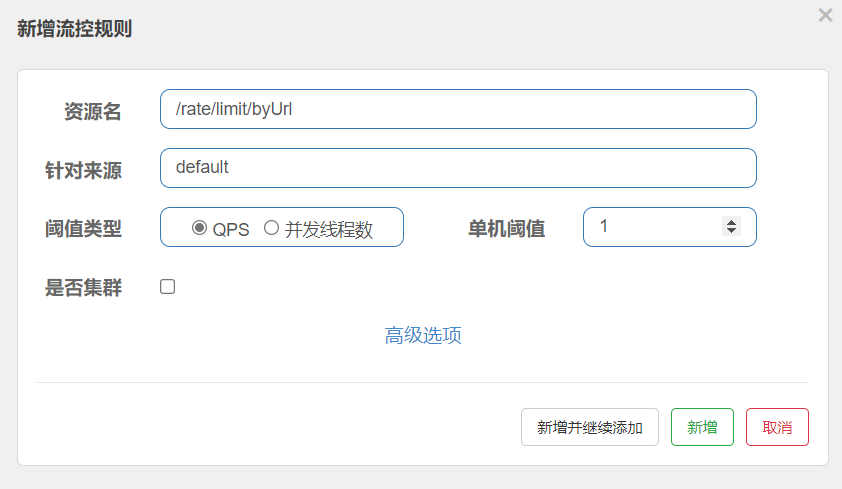

### 19.8.3 问题

1  系统默认的，没有体现我们自己的业务要求。
2  依照现有条件，我们自定义的处理方法又和业务代码耦合在一块，不直观。
3  每个业务方法都添加一个兜底的，那代码膨胀加剧。
4  全局统一的处理方法没有体现。

### 19.8.4 自定义限流处理逻辑

自定义限流处理类

```java
public class CustomerBlockHandler {
    public static CommonResult handlerException1(BlockException e) {
        return new CommonResult<>(444,"自定义限流处理信息...1" +e.getClass().getCanonicalName());
    }

    public static CommonResult handlerException2(BlockException e) {
        return new CommonResult<>(444,"自定义限流处理信息...2" +e.getClass().getCanonicalName());
    }
}
```

```java
    @GetMapping("/customerBlockHandler")
    @SentinelResource(value = "customerBlockHandler",
            blockHandlerClass = CustomerBlockHandler.class,
            blockHandler = "handlerException2")
    public CommonResult customerBlockHandler() {
        return new CommonResult(200,"按客户自定义限流处理逻辑");
    }
```

自定义限流处理只适用于根据资源名称限流

不同url可以配相同的资源名 实现统一管理

### 19.8.5 其他注解


## 19.9 服务熔断

### 19.9.1sentinel整合ribbon+openFeign+fallback

### 19.9.2 Ribbon系列

提供者9003/9004 模拟数据库查询

```java
@RestController
@RequestMapping("/payment/payment")
public class PaymentController
{
    @Value("${server.port}")
    private String serverPort;

    public static HashMap<Long, Payment> hashMap = new HashMap<>();
    static
    {
        hashMap.put(1L,new Payment(1L,"28a8c1e3bc2742d8848569891fb42181"));
        hashMap.put(2L,new Payment(2L,"bba8c1e3bc2742d8848569891ac32182"));
        hashMap.put(3L,new Payment(3L,"6ua8c1e3bc2742d8848569891xt92183"));
    }

    @GetMapping(value = "/paymentSQL/{id}")
    public CommonResult<Payment> paymentSQL(@PathVariable("id") Long id)
    {
        Payment payment = hashMap.get(id);
        CommonResult<Payment> result = new CommonResult(200,"from mysql,serverPort:  "+serverPort,payment);
        return result;
    }


}
```

消费者84

```xml
<!--SpringCloud ailibaba nacos -->
<dependency>
    <groupId>com.alibaba.cloud</groupId>
    <artifactId>spring-cloud-starter-alibaba-nacos-discovery</artifactId>
</dependency>
<!--SpringCloud ailibaba sentinel -->
<dependency>
    <groupId>com.alibaba.cloud</groupId>
    <artifactId>spring-cloud-starter-alibaba-sentinel</artifactId>
</dependency>
```

测试

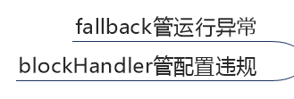

```java
//无fallback 无blockHandler 只返回错误页面对客户不友好
@RequestMapping("/fallback/{id}")
    @SentinelResource(value = "fallback")
    public CommonResult<Payment> fallback(@PathVariable Long id)
    {
        CommonResult<Payment> result = restTemplate.getForObject(serviceURL + "/payment/payment/paymentSQL/"+id,CommonResult.class,id);

        if (id == 4) {
            throw new IllegalArgumentException ("IllegalArgumentException,非法参数异常....");
        }else if (result.getData() == null) {
            throw new NullPointerException ("NullPointerException,该ID没有对应记录,空指针异常");
        }

        return result;
    }
}
```


```java
//只配置fallback   无blockHandler
  @SentinelResource(value = "fallback", fallback = "handlerFallback")
    public CommonResult<Payment> fallback(@PathVariable Long id)


public CommonResult handlerFallback(@PathVariable  Long id,Throwable e) {
        Payment payment = new Payment(id,"null");
        return new CommonResult<>(444,"兜底异常handlerFallback,exception内容  "+e.getMessage(),payment);
    }
```

```java
//只配置blockHandler 无fallback   
@RequestMapping("/fallback/{id}")
    @SentinelResource(value = "fallback", 
//            fallback = "handlerFallback",
            blockHandler = "CommonResult")
    public CommonResult<Payment> fallback(@PathVariable Long id)
    {
        
        
        
       public CommonResult blockHandler(@PathVariable  Long id, BlockException blockException) {
        Payment payment = new Payment(id,"null");
        return new CommonResult<>(445,"blockHandler-sentinel限流,无此流水: blockException  "+blockException.getMessage(),payment);
    }
```

```java
//同时配置blockHandler fallback   
@RequestMapping("/fallback/{id}")
    @SentinelResource(value = "fallback", 
            fallback = "handlerFallback",
            blockHandler = "CommonResult")
    public CommonResult<Payment> fallback(@PathVariable Long id)
    {
```

若 blockHandler 和 fallback 都进行了配置，则被限流降级而抛出 BlockException 时只会进入 blockHandler 处理逻辑。

```java
@RequestMapping("/consumer/fallback/{id}")
    @SentinelResource(value = "fallback", fallback = "handlerFallback", blockHandler = "blockHandler",
            exceptionsToIgnore = {IllegalArgumentException.class})//忽略某个异常的属性
    public CommonResult<Payment> fallback(@PathVariable Long id)
    {

```

### 19.9.3 openFeign系列

```xml
<!--SpringCloud openfeign -->
        <dependency>
            <groupId>org.springframework.cloud</groupId>
            <artifactId>spring-cloud-starter-openfeign</artifactId>
        </dependency>

```

```yml
# 激活Sentinel对Feign的支持
feign:
  sentinel:
    enabled: true 
```

### 19.10 规则持久化

一旦我们重启应用，sentinel规则将消失，生产环境需要将配置规则进行持久化


将限流配置规则持久化进Nacos保存，只要刷新8401某个rest地址，
sentinel控制台的流控规则就能看到，只要Nacos里面的配置不删除，针对8401上sentinel
上的流控规则持续有效

```xml
<!--SpringCloud ailibaba sentinel-datasource-nacos -->
<dependency>
    <groupId>com.alibaba.csp</groupId>
    <artifactId>sentinel-datasource-nacos</artifactId>
</dependency>
```

```yml
spring:
  cloud:
    sentinel:
      datasource:
        ds1:
          nacos:
            server-addr: localhost:8848
            dataId: cloudalibaba-sentinel-service
            groupId: DEFAULT_GROUP
            data-type: json
            rule-type: flow
```

在nacos添加对应配置

 dataId: cloudalibaba-sentinel-service
groupId: DEFAULT_GROUP
data-type: json

```
[
    {
        "resource": "/rateLimit/byUrl",
        "limitApp": "default",
        "grade": 1,
        "count": 1,
        "strategy": 0,
        "controlBehavior": 0,
        "clusterMode": false
    }
]
```

即可实现规则持久化

关闭后重启微服务 规则还在

# 20 SpringCloud Alibaba Seata处理分布式事务

## 20.1 分布式事务问题

单体应用被拆分成微服务应用，原来的三个模块被拆分成三个独立的应用，分别使用三个独立的数据源，
业务操作需要调用三个服务来完成。此时每个服务内部的数据一致性由本地事务来保证，但是**全局的数据一致性问题没法保证。**

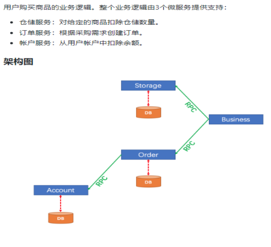

一次业务操作需要跨多个数据源或需要跨多个系统进行远程调用,就会产生分布式事务问题

## 20.2 Seata简介

Seata是一款开源的分布式事务解决方案，致力在微服务架构下提供高性能和简单易用的分布式事务服务。

**分布式处理过程的 ID+三组件模型**

* 全局唯一的事务ID

* 事务协调器，维护全局事务的运行状态，负责协调并驱动全局事务的提交或回滚;
  Transaction Coordinator (TC)
* 控制全局事务的边界，负责开启一个全局事务，并最终发起全局提交或全局回滚的决议;
  TransactionManager(TM)
* 控制分支事务，负责分支注册、状态汇报，并接收事务协调器的指令，驱动分支（本地）事务的提交和回滚
  Resource Manager(RM)

**处理过程**

1. TM 向 TC 申请开启一个全局事务，全局事务创建成功并生成一个全局唯一的 XID；
2. XID 在微服务调用链路的上下文中传播；
3. RM 向 TC 注册分支事务，将其纳入 XID 对应全局事务的管辖；
4. TM 向 TC 发起针对 XID 的全局提交或回滚决议；
5. TC 调度 XID 下管辖的全部分支事务完成提交或回滚请求。

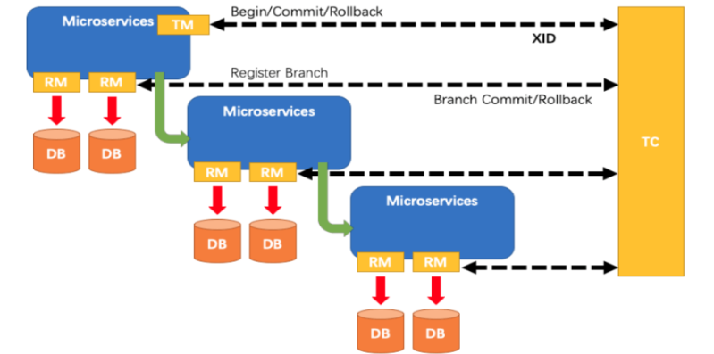

**全局@GlobalTransactional**

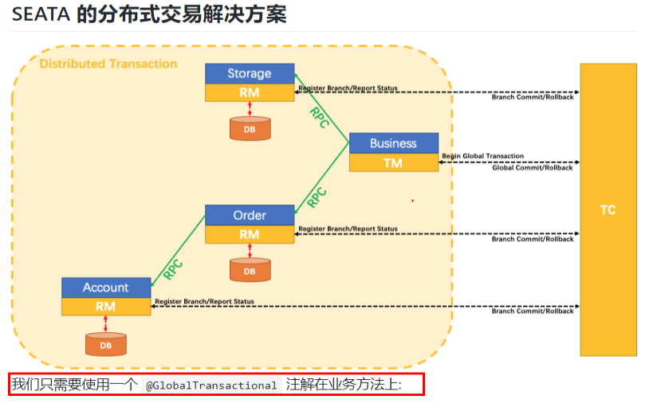

## 20.3 安装运行 (Seata服务端配置)

**配置模板文件地址**

[seata/script at 1.4.2 · seata/seata (github.com)](https://github.com/seata/seata/tree/1.4.2/script)

**备份修改seata/conf/file.conf**

此配置项为seata 服务器的存储配置，存储方式选择db，再配置数据库的连接信息，以及处理事务的全局性表（表名使用默认的就可以）。

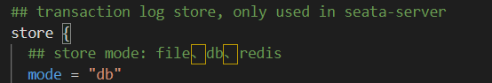

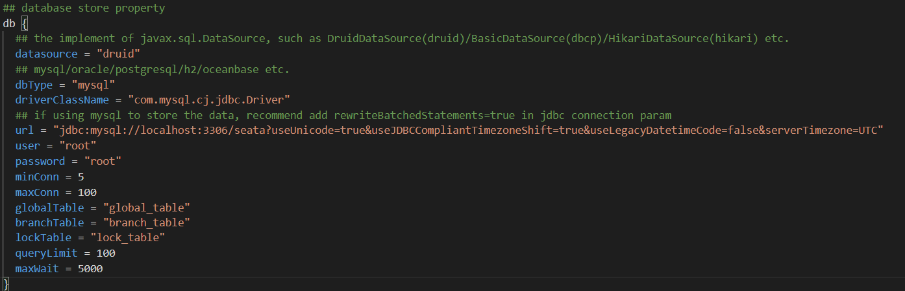

> driverClassName驱动的配置需要根据mysql的版本决定：
>  mysql5.+使用 driverClassName = "com.mysql.jdbc.Driver"
>  mysql8使用 driverClassName = "com.mysql.cj.jdbc.Driver"


**备份修改seata/conf/registry.conf**

需要配置选用的注册中心类型（nacos），注册中心的连接信息；配置中心的类型，配置中心的连接信息。

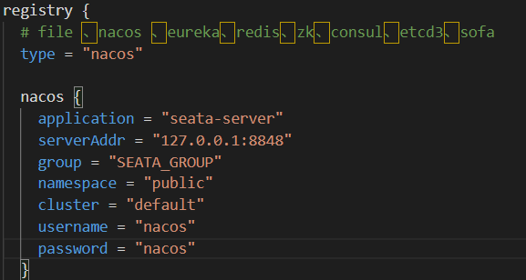

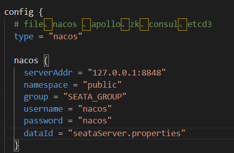

> ①当nacos开启安全配置（在nacos的conf/application.properties中配置nacos.core.auth.enabled=true）后，对nacos的连接信息都要带上用户名、密码等信息
>
> ②在seata1.4.2后才可以使用dataId = "seataServer.properties"的方式读取配置信息

**在nacos中配置seata事务的相关属性**

seata\script\config-center\config.txt

此配置信息是seata事务的相关属性，在nacos中创建data id 时，粘贴到文本值的内容，即seataServer.properties的配置项，

> ①.service.vgroupMapping.my_test_tx_group=default
>  中的my_test_tx_group需要与bootstrap.yml中配置的seata.tx-service-group的值一致。
>
> ②.service.vgroupMapping.my_test_tx_group=default
>  配置的default必须要等于registry.conf中配置的cluster="default"。
>
> ③.store.mode=db配置为db的方式，则需要配置db数据库方式的连接信息
>  store.db.url、store.db.user、store.db.password，此数据库存储下存放的表
>  global_table、branch_table、lock_table，用于记录全局性的事务信息
>
> ④.store.db.driverClassName的配置
>  mysql5.+使用 driverClassName = "com.mysql.jdbc.Driver"
>  mysql8使用 driverClassName = "com.mysql.cj.jdbc.Driver"
>
> ⑤.service.default.grouplist=ip:port为访问seata服务器的地址和端口（仅注册中心为file时使用），8091是默认端口，
>  也可以修改启动端口，在启动项目时加上端口：
>  seata-server.bat -p 18091
>  sh seata-server.sh -p 18091
>
> ⑥seata server需要配置集群时，只需要在启动seata server服务时指定不同的端口和节点序号即可，配置file.conf和registry.conf的内容一致


**seata\script\server\db\mysql.sql进行建库 seata**

创建事务表

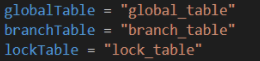

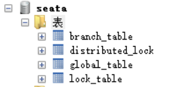

**先启动nacos再启动seata**

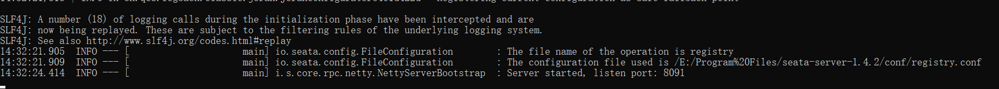

## 20.4 订单/库存/账户业务数据库准备 （Seata客户端配置）

这里我们会创建三个服务，一个订单服务，一个库存服务，一个账户服务。

当用户下单时，会在订单服务中创建一个订单，然后通过远程调用库存服务来扣减下单商品的库存，
再通过远程调用账户服务来扣减用户账户里面的余额，
最后在订单服务中修改订单状态为已完成。

该操作跨越三个数据库，有两次远程调用，很明显会有分布式事务问题。

下订单》扣库存》减余额

**创建业务数据库**

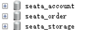

**创建业务表**


**seata\script\client\at\db\mysql.sql创建回滚事务表**

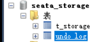

```sql
DROP TABLE `undo_log`;
 
CREATE TABLE `undo_log` (
  `id` BIGINT(20) NOT NULL AUTO_INCREMENT,
  `branch_id` BIGINT(20) NOT NULL,
  `xid` VARCHAR(100) NOT NULL,
  `context` VARCHAR(128) NOT NULL,
  `rollback_info` LONGBLOB NOT NULL,
  `log_status` INT(11) NOT NULL,
  `log_created` DATETIME NOT NULL,
  `log_modified` DATETIME NOT NULL,
  `ext` VARCHAR(100) DEFAULT NULL,
  PRIMARY KEY (`id`),
  UNIQUE KEY `ux_undo_log` (`xid`,`branch_id`)
) ENGINE=INNODB AUTO_INCREMENT=1 DEFAULT CHARSET=utf8;
```

## 20.5 订单/库存/账户业务微服务准备（Seata客户端配置）

**业务需求**

下订单》扣库存》减余额

**seata-order-service2001**

```xml
 <!--nacos-->
        <dependency>
            <groupId>com.alibaba.cloud</groupId>
            <artifactId>spring-cloud-starter-alibaba-nacos-discovery</artifactId>
        </dependency>
        <!--seata-->
        <dependency>
            <groupId>com.alibaba.cloud</groupId>
            <artifactId>spring-cloud-starter-alibaba-seata</artifactId>
            <exclusions>
                <exclusion>
                    <artifactId>seata-all</artifactId>
                    <groupId>io.seata</groupId>
                </exclusion>
            </exclusions>
        </dependency>
        <dependency>
            <groupId>io.seata</groupId>
            <artifactId>seata-all</artifactId>
            <version>1.3.0</version>需要与安装的seata版本一致
        </dependency>
        <!--feign-->
        <dependency>
            <groupId>org.springframework.cloud</groupId>
            <artifactId>spring-cloud-starter-openfeign</artifactId>
        </dependency>
<!--mysql-druid-->
        <dependency>
            <groupId>mysql</groupId>
            <artifactId>mysql-connector-java</artifactId>
        </dependency>
        <dependency>
            <groupId>com.alibaba</groupId>
            <artifactId>druid-spring-boot-starter</artifactId>
        </dependency>
        <dependency>
            <groupId>org.mybatis.spring.boot</groupId>
            <artifactId>mybatis-spring-boot-starter</artifactId>
        </dependency>
```

## 20.6 @GlobalTransaction

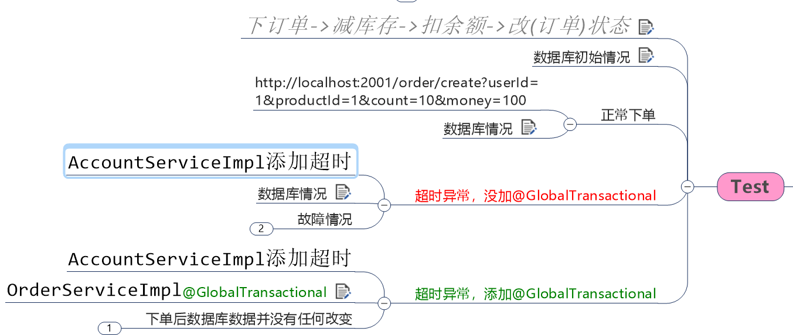

## 20.7 分布式事务流程

TM 开启分布式事务（TM 向 TC 注册全局事务记录）
按业务场景，编排数据库、服务等事务内资源(RM 向 TC 汇报资源准备状态 )
TM 结束分布式事务，事务一阶段结束（TM 通知 TC 提交/回滚分布式事务）
TC 汇总事务信息，决定分布式事务是提交还是回滚
TC 通知所有 RM 提交/回滚 资源，，事务二阶段结束

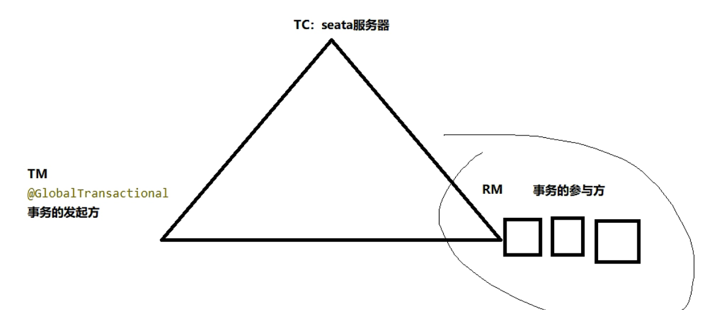


## AT模式

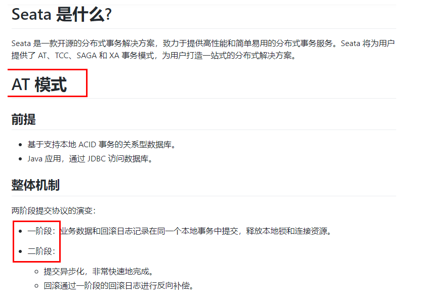

在一阶段，Seata 会拦截“业务 SQL”，
1  解析 SQL 语义，找到“业务 SQL”要更新的业务数据，在业务数据被更新前，将其保存成“before image”，
2  执行“业务 SQL”更新业务数据，在业务数据更新之后，
3  其保存成“after image”，最后生成行锁。
以上操作全部在一个数据库事务内完成，这样保证了一阶段操作的原子性。


二阶段如是顺利提交的话，

因为“业务 SQL”在一阶段已经提交至数据库，所以Seata框架只需将一阶段保存的快照数据和行锁删掉，完成数据清理即可


二阶段回滚：
二阶段如果是回滚的话，Seata 就需要回滚一阶段已经执行的“业务 SQL”，还原业务数据。
回滚方式便是用“before image”还原业务数据；但在还原前要首先要校验脏写，对比“数据库当前业务数据”和 “after image”，
如果两份数据完全一致就说明没有脏写，可以还原业务数据，如果不一致就说明有脏写，出现脏写就需要转人工处理。

## 20.8 总结

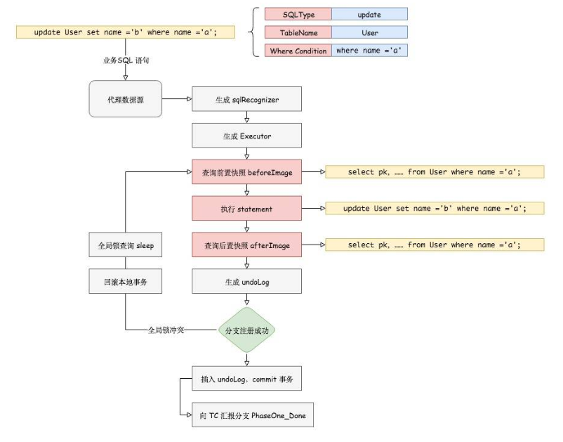

# 21 大厂面试题


