[TOC]


# 1 Zookeeper入门

## 1.1 概述

Zookeeper 是一个开源的分布式的，**为分布式框架提供协调服务**的 Apache 项目。

### 工作机制

Zookeeper从设计模式角度来理解：是一个基于**观察者模式**设计的分布式服务管理框架，它负责**存储和管理大家都关心的数据**，然后**接受观察者的注册**，一旦这些数据的状态发生变化，Zookeeper 就将负责**通知**已经在Zookeeper上注册的那些观察者做出相应的反应。

Zookeeper=文件系统+通知机制

## 1.2 特点

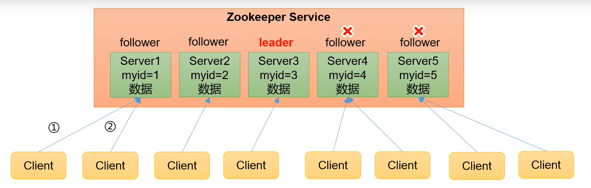

1. Zookeeper：一个领导者（Leader），多个跟随者（Follower）组成的集群。
2. 集群中只要有半数以上节点存活，Zookeeper集群就能正常服务。所以Zookeeper适合安装奇数台服务器。
3. 全局数据一致：每个Server保存一份相同的数据副本，Client无论连接到哪个Server，数据都是一致的。
4. 更新请求顺序执行，来自同一个Client的更新请求按其发送顺序依次执行。 
5. 数据更新**原子性**，一次数据更新要么成功，要么失败。 
6. 实时性，在一定时间范围内，Client能读到最新数据。

## 1.3 数据结构

ZooKeeper 数据模型的结构与 Unix 文件系统很类似，整体上可以看作是一棵树，每个 节点称做一个 ZNode。每一个 ZNode 默认能够存储 1MB 的数据，每个 ZNode 都可以通过 其路径唯一标识。

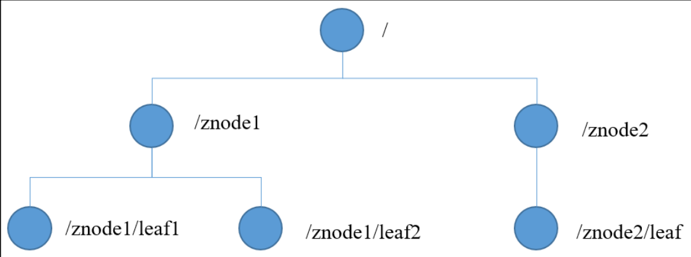

## 1.4 应用场景

提供的服务包括：统一命名服务、统一配置管理、统一集群管理、服务器节点动态上下 线、软负载均衡等。

* 统一命名服务

  在分布式环境下，经常需要对应用/服 务进行统一命名，便于识别。 例如：IP不容易记住，而域名容易记住。通过一个统一名字访问整个集群。engine x （nginx）也可以实现。

  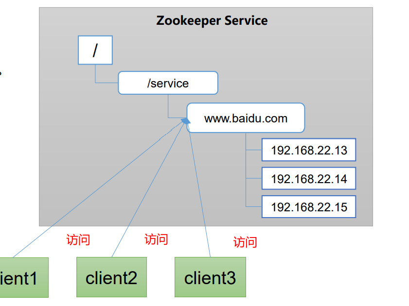

* 统一配置管理

  * 分布式环境下，配置文件同步非常常见。一般要求一个集群所有节点的配置是一致的，而且修改配置后，需要快速同步。
  * 配置管理可交由ZooKeeper实现。将配置信息写入一个Znode，各个客户端监听这个Znode

  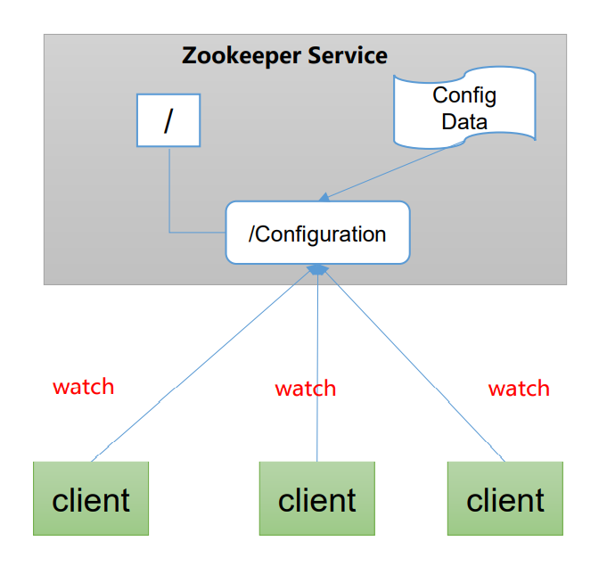

* 统一集群管理

  * 分布式环境中，实时掌握每个节点的状态是必要的。
  * ZooKeeper可以实现实时监控节点状态变化

* [服务器节点动态上下线](#4 服务器动态上下线监听案例)

* 软负载均衡等。

  * 在Zookeeper中记录每台服务器的访问数，让访问数最少的服务器去处理最新的客户端请求

    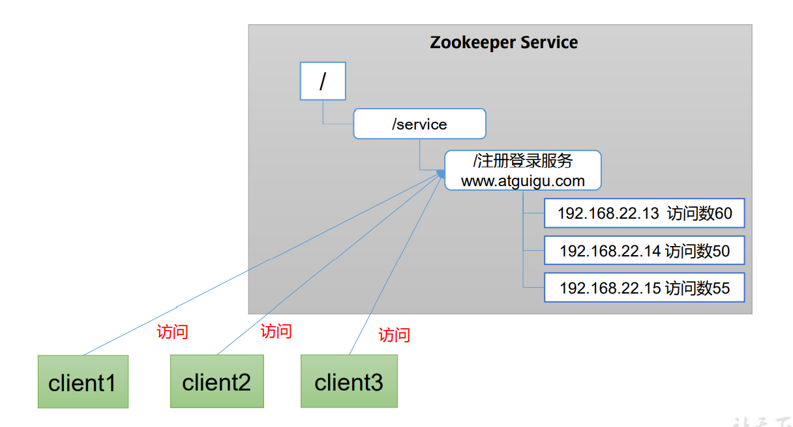


## 1.5 官网

[Apache ZooKeeper](https://zookeeper.apache.org/) 


# 2 Zookeeper本地安装

## 2.1 本地模式安装

### 安装

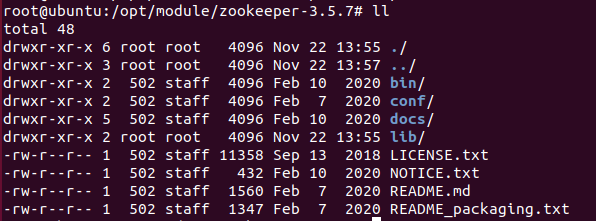


### 配置修改

```bash
root@ubuntu:/opt/module/zookeeper-3.5.7/conf# mv zoo_sample.cfg zoo.cfg
root@ubuntu:/opt/module/zookeeper-3.5.7/conf# vim zoo.cfg
```

修改临时数据存储位置 dataDir=/opt/module/zookeeper-3.5.7/zkData

### 启动 Zookeeper服务端

```bash
root@ubuntu:/opt/module/zookeeper-3.5.7# bin/zkServer.sh start
ZooKeeper JMX enabled by default
Using config: /opt/module/zookeeper-3.5.7/bin/../conf/zoo.cfg
Starting zookeeper ... STARTED
root@ubuntu:/opt/module/zookeeper-3.5.7# jps
3210 Jps
3149 QuorumPeerMain
root@ubuntu:/opt/module/zookeeper-3.5.7# bin/zkServer.sh status
ZooKeeper JMX enabled by default
Using config: /opt/module/zookeeper-3.5.7/bin/../conf/zoo.cfg
Client port found: 2181. Client address: localhost.
Mode: standalone
root@ubuntu:/opt/module/zookeeper-3.5.7# bin/zkServer.sh stop
ZooKeeper JMX enabled by default
Using config: /opt/module/zookeeper-3.5.7/bin/../conf/zoo.cfg
Stopping zookeeper ... STOPPED

```

### 启动Zookeeper客户端

```bash
root@ubuntu:/opt/module/zookeeper-3.5.7# bin/zkCli.sh

```

## 2.2 配置参数

```c
# The number of milliseconds of each tick
# 通信心跳时间，Zookeeper服务器与客户端心跳时间，单位毫秒
tickTime=2000
    
# The number of ticks that the initial 
# synchronization phase can take
# LF初始通信时限 Leader和Follower初始连接时能容忍的最多心跳数（tickTime的数量）
initLimit=10
    
# The number of ticks that can pass between 
# sending a request and getting an acknowledgement
# LF同步通信时限 Leader和Follower之间通信时间如果超过syncLimit * tickTime，Leader认为Follwer死
# 掉，从服务器列表中删除Follwer。
syncLimit=5
    
# the directory where the snapshot is stored.
# do not use /tmp for storage, /tmp here is just 
# example sakes.
# 保存Zookeeper中的数据
dataDir=/opt/module/zookeeper-3.5.7/zkData
    
# the port at which the clients will connect
# 客户端连接端口，通常不做修改。
clientPort=2181

```

# 3 zookeeper集群操作

## 3.1 集群操作

### 3.1.1 集群安装

创建服务器标识文件

```bash
[tintin@hadoop102 zookeeper-3.5.7]$ mkdir zkData
[tintin@hadoop102 zookeeper-3.5.7]$ cd zkData

[tintin@hadoop102 zkData]$ vim myid
2
[tintin@hadoop103 zkData]$ vim myid
3
[tintin@hadoop104 zkData]$ vim myid
4
```

添加服务器

```bash
[tintin@hadoop102 zookeeper-3.5.7]$ cd conf
[tintin@hadoop102 conf]$ vim zoo.cfg
# server.几号服务器=服务器地址:follower与leader交换信息的端口：挂掉后选举新leader后的端口 
##################cluster########################
server.2=hadoop102:2888:3888
server.3=hadoop103:2888:3888
server.4=hadoop104:2888:3888

[tintin@hadoop102 conf]$ xsync zoo.cfg
```

启动所有服务器

```bash
#启动第一台
[tintin@hadoop102 zookeeper-3.5.7]$ bin/zkServer.sh start
ZooKeeper JMX enabled by default
Using config: /opt/module/zookeeper-3.5.7/bin/../conf/zoo.cfg
Starting zookeeper ... STARTED
[tintin@hadoop102 zookeeper-3.5.7]$ bin/zkServer.sh status
ZooKeeper JMX enabled by default
Using config: /opt/module/zookeeper-3.5.7/bin/../conf/zoo.cfg
Client port found: 2181. Client address: localhost.
Error contacting service. It is probably not running.

#启动第二台
[tintin@hadoop103 zookeeper-3.5.7]$ bin/zkServer.sh start 
ZooKeeper JMX enabled by default
Using config: /opt/module/zookeeper-3.5.7/bin/../conf/zoo.cfg
Starting zookeeper ... already running as process 4162.
[tintin@hadoop103 zookeeper-3.5.7]$ bin/zkServer.sh status
ZooKeeper JMX enabled by default
Using config: /opt/module/zookeeper-3.5.7/bin/../conf/zoo.cfg
Client port found: 2181. Client address: localhost.
Mode: leader

#启动第三台
[tintin@hadoop104 zookeeper-3.5.7]$ bin/zkServer.sh start
ZooKeeper JMX enabled by default
Using config: /opt/module/zookeeper-3.5.7/bin/../conf/zoo.cfg
Starting zookeeper ... STARTED
[tintin@hadoop104 zookeeper-3.5.7]$ bin/zkServer.sh status
ZooKeeper JMX enabled by default
Using config: /opt/module/zookeeper-3.5.7/bin/../conf/zoo.cfg
Client port found: 2181. Client address: localhost.
Mode: follower

```

### 3.1.2 选举机制

SID：**服务器ID**。用来唯一标识一台 ZooKeeper集群中的机器，每台机器不能重 复，和myid一致。

 ZXID：**事务ID**。ZXID是一个事务ID，用来 标识一次服务器状态的变更。 每次写操作都有事务ID。

Epoch：**每个Leader任期的代号**。没有 Leader时同一轮投票过程中的逻辑时钟值是 相同的。每投完一次票这个数据就会增加。

* 初始化启动
  * 每台服务器启动，发起一次选举
  * 优先投自己一票
  * 若没有leader。更改选票信息。（myid小的服务器，更改选票给myid更大的服务器）
  * 获得半数以上的票即选举成功。服务器由looking状态转为leading或following状态，不再更改选票信息。
  * 选举未成功时，所有服务器保持looking状态

* 运行期间，无法与leader保持连接
  * 集群中本来就已经存在一个Leader。机器试图去选举Leader时，会被告知当前服务器的Leader信息，并与leader建立连接。
  * 集群中确实不存在Leader。**选举Leader规则**： ①EPOCH大的直接胜出 ②EPOCH相同，事务id大的胜出 ③事务id相同，服务器id大的胜出

### 3.1.3 集群启动停止脚本

```bash
[tintin@hadoop102 ~]$ cd bin
[tintin@hadoop102 bin]$ vim zk.sh
[tintin@hadoop102 bin]$ xsync zk.sh
[tintin@hadoop102 bin]$ chmod u+x zk.sh

#!/bin/bash
case $1 in
"start"){
for i in hadoop102 hadoop103 hadoop104
do
 echo ---------- zookeeper $i 启动 ------------
ssh $i "/opt/module/zookeeper-3.5.7/bin/zkServer.sh 
start"
done
};;
"stop"){
for i in hadoop102 hadoop103 hadoop104
do
 echo ---------- zookeeper $i 停止 ------------ 
ssh $i "/opt/module/zookeeper-3.5.7/bin/zkServer.sh 
stop"
done
};;
"status"){
for i in hadoop102 hadoop103 hadoop104
do
 echo ---------- zookeeper $i 状态 ------------ 
ssh $i "/opt/module/zookeeper-3.5.7/bin/zkServer.sh 
status"
done
};;
esac
```

## 3.2 客户端命令

```bash
[tintin@hadoop102 zookeeper-3.5.7]$ bin/zkCli.sh -server hadoop102:2181

```

### 3.2.1 常用命令

| 命令基本语法 | 功能描述                                                     |
| ------------ | ------------------------------------------------------------ |
| help         | 显示所有操作命令                                             |
| ls path      | 使用 ls 命令来查看当前 znode 的子节点 [可监听 -w 监听子节点变化 -s 附加次级信息 |
| creat        | 普通创建 -s 含有序列 -e 临时（重启或者超时消失）             |
| get path     | 获得节点的值 [可监听] -w 监听节点内容变化 -s 附加次级信息    |
| set          | 设置节点的具体值                                             |
| stat         | 查看节点状态                                                 |
| delete       | 删除节点                                                     |
| deleteall    | 递归删除节点                                                 |

### 3.2.2 当前节点详细数据

```bash

[zk: hadoop102:2181(CONNECTED) 4] ls -s /
[zookeeper]cZxid = 0x0#创建节点的事务 zxid
ctime = Thu Jan 01 08:00:00 CST 1970#znode 被创建的毫秒数（从 1970 年开始）
mZxid = 0x0#znode 最后更新的事务 zxid
mtime = Thu Jan 01 08:00:00 CST 1970#znode 最后修改的毫秒数（从 1970 年开始）
pZxid = 0x0#znode 最后更新的子节点 zxid
cversion = -1#znode 子节点变化号，znode 子节点修改次数
dataVersion = 0#znode 数据变化号
aclVersion = 0#znode 访问控制列表的变化号
ephemeralOwner = 0x0#如果是临时节点，这个是 znode 拥有者的 session id。如果不是临时节点则是 0。
dataLength = 0#znode 的数据长度
numChildren = 1#znode 的数据长度

##节点类型

```

### 3.2.3 节点类型

* 持久（Persistent）：客户端和服务器端断开连接后，创建的节点不删除
  * 持久化目录节点
  * 持久化顺序编号目录节点。Zookeeper给该节点名称进行顺序编号。
* 短暂（Ephemeral）：客户端和服务器端断开连接后，创建的节点自己删除
  * 临时目录节点
  * 临时顺序编号目录节点。Zookeeper给该节点名称进行顺序编号。

### 3.2.4 监听器原理

1. 首先要有一个main()线程
2. 在main线程中创建Zookeeper客户端，这时就会创建两个线 程，一个负责网络连接通信（connet），一个负责监听（listener）。
3. 通过connect线程将注册的监听事件发送给Zookeeper。 
4. 在Zookeeper的注册监听器列表中将注册的监听事件添加到列表中。
5. Zookeeper监听到有数据或路径变化，就会将这个消息发送给listener线程。
6. listener线程内部调用了process()方法。

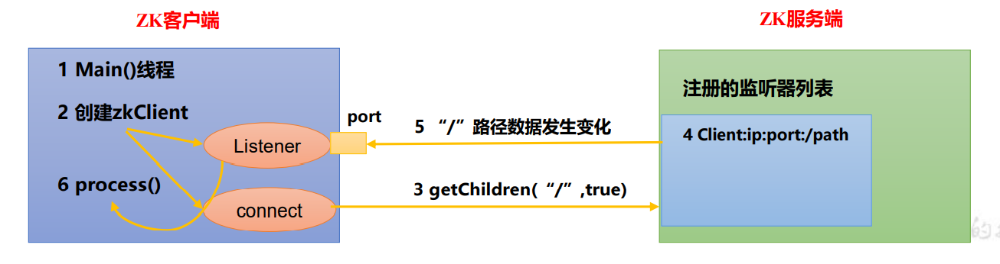

```bash
[zk: hadoop102:2181(CONNECTED) 16] get /node1 -w #监听节点数据的变化
[zk: hadoop102:2181(CONNECTED) 18] ls /node1 -s #监听子节点增减的变化

```

> 注册 一次，只能监听一次。想再次监听，需要再次注册。

### 3.2.5 节点删除与查看

## 3.3 客户端API操作

### 3.3.1 IDEA环境搭建

依赖

```xml
    <dependencies>
        <dependency>
            <groupId>junit</groupId>
            <artifactId>junit</artifactId>
            <version>RELEASE</version>
        </dependency>
        <dependency>
            <groupId>org.apache.logging.log4j</groupId>
            <artifactId>log4j-core</artifactId>
            <version>2.8.2</version>
        </dependency>
        <dependency>
            <groupId>org.apache.zookeeper</groupId>
            <artifactId>zookeeper</artifactId>
            <version>3.5.7</version>
        </dependency>
    </dependencies>
```

log4j配置

```properties
log4j.rootLogger=INFO, stdout 
log4j.appender.stdout=org.apache.log4j.ConsoleAppender 
log4j.appender.stdout.layout=org.apache.log4j.PatternLayout 
log4j.appender.stdout.layout.ConversionPattern=%d %p [%c]- %m%n 
log4j.appender.logfile=org.apache.log4j.FileAppender 
log4j.appender.logfile.File=target/spring.log 
log4j.appender.logfile.layout=org.apache.log4j.PatternLayout 
log4j.appender.logfile.layout.ConversionPattern=%d %p [%c]- %m%n
```

API代码

```java

public class ZkClient {

    private String connectString = "hadoop102:2181,hadoop103:2181,hadoop104:2181";
    private int sessionTimeout = 2000;
    private ZooKeeper zkClient;

    @Before
    public void init() throws IOException {

        zkClient = new ZooKeeper(connectString, sessionTimeout, new Watcher() {
            //每次监听路径发生改变或首次初始化，执行监听器方法
            @Override
            public void process(WatchedEvent watchedEvent) {
                System.out.println("node has been changed");
                //重新注册监听列表
                try {
                    zkClient.getChildren("/", true);
                } catch (KeeperException e) {
                    e.printStackTrace();
                } catch (InterruptedException e) {
                    e.printStackTrace();
                }
            }
        });
    }

    @Test
    public void create() throws InterruptedException, KeeperException {
        String node = zkClient.create("/tintin",
                "hhhh".getBytes(),
                ZooDefs.Ids.OPEN_ACL_UNSAFE,
                CreateMode.PERSISTENT);
    }

    @Test
    public void getChildren() throws InterruptedException, KeeperException {
        //开启监听
        List<String> children = zkClient.getChildren("/", true);
        children.forEach(System.out::println);

        //主线程睡眠，监听线程保持运行
        Thread.sleep(Long.MAX_VALUE);

    }
}

```

## 3.4 客户端写数据流程

写入请求直接发送给Leader节点

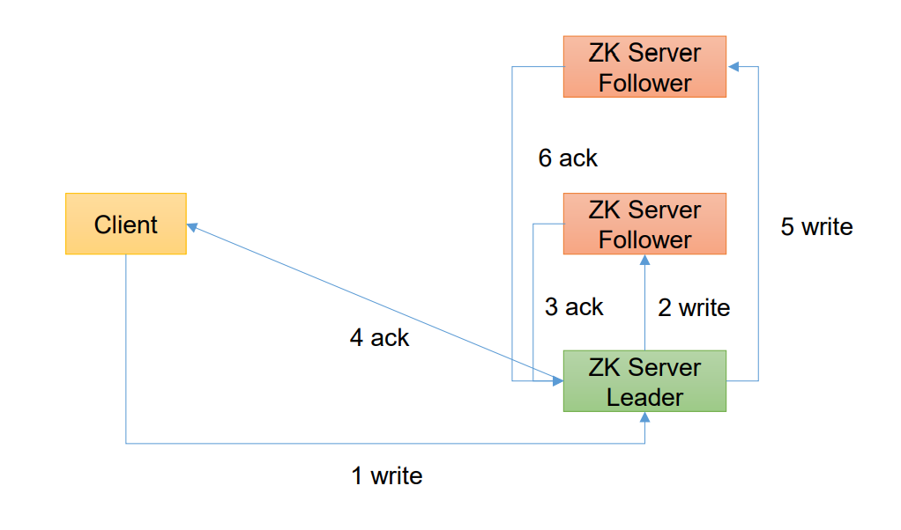写入请求发送给follower节点

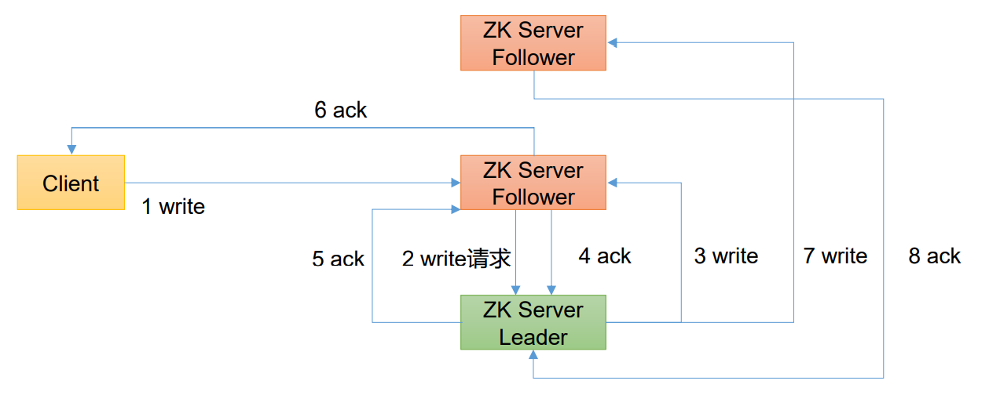

# 4 服务器动态上下线监听案例

## 4.1 服务器动态上下线监听

某分布式系统中，主节点可以有多台，可以动态上下线，任意一台客户端都能实时感知 到主节点服务器的上下线。

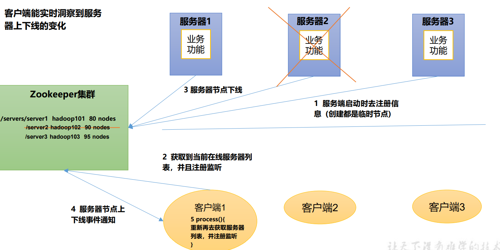

## 4.2 具体模拟

1. 先在集群上创建/servers 节点

2. 服务器代码

   ```java
   public class DistributeServer {
       private static String connectString = "hadoop102:2181,hadoop103:2181,hadoop104:2181";
       private static int sessionTimeout = 2000;
       private ZooKeeper zk;
   
       public static void main(String[] args) throws IOException, InterruptedException, KeeperException {
           DistributeServer server = new DistributeServer();
           //获取zk连接
           server.getConnect();
           //注册服务器到集群中
           server.regist(args[0]);
           //业务
           server.business();
   
   
       }
   
       public void getConnect() throws IOException {
           zk = new ZooKeeper(connectString, sessionTimeout, new Watcher() {
               @Override
               public void process(WatchedEvent watchedEvent) {
   
               }
           });
       }
   
       public void regist(String hostname) throws InterruptedException, KeeperException {
           zk.create("/servers/server",
                   hostname.getBytes(),
                   ZooDefs.Ids.OPEN_ACL_UNSAFE,
                   CreateMode.EPHEMERAL_SEQUENTIAL);
           System.out.println(hostname + " is online");
       }
   
       public void business() throws InterruptedException {
           Thread.sleep(Long.MAX_VALUE);
       }
   }
   
   ```

3. 客户端代码

   ```java
   public class DistributeClient {
       private ZooKeeper zk;
       private String connectString = "hadoop102:2181,hadoop103:2181,hadoop104:2181";
       private int sessionTimeout = 2000;
   
       public static void main(String[] args) throws IOException, InterruptedException, KeeperException {
           DistributeClient client = new DistributeClient();
           //获取zk连接
           client.getConnect();
           //监听servers下节点的增加与删除
           client.getServerList();
           //业务操作
           client.business();
   
       }
   
       public void getConnect() throws IOException {
           zk = new ZooKeeper(connectString, sessionTimeout, new Watcher() {
               @Override
               public void process(WatchedEvent watchedEvent) {
                   try {
                       getServerList();
                   } catch (KeeperException e) {
                       e.printStackTrace();
                   } catch (InterruptedException e) {
                       e.printStackTrace();
                   }
               }
           });
       }
   
       public void getServerList() throws InterruptedException, KeeperException {
           List<String> children = zk.getChildren("/servers", true);
           ArrayList<Object> servers = new ArrayList<>();
           for (String child : children) {
               byte[] data = zk.getData("/servers/" + child, false, null);
               servers.add(new String(data));
           }
   
           System.out.println(servers);
       }
   
       public void business() throws InterruptedException {
           Thread.sleep(Long.MAX_VALUE);
       }
   }
   
   
   
   ```

   

# 5 Zookeeper分布式锁案例

## 5.1 分布式锁

什么叫做分布式锁呢？ 比如说"进程 1"在使用该资源的时候，会先去获得锁，"进程 1"获得锁以后会对该资源保持独占，这样其他进程就无法访问该资源，"进程 1"用完该资源以后就将锁释放掉，让其 他进程来获得锁，那么通过这个锁机制，我们就能保证了分布式系统中多个进程能够有序的 访问该临界资源。那么我们把这个分布式环境下的这个锁叫作分布式锁。

## 5.2 原生Zookeeper分布式锁案例

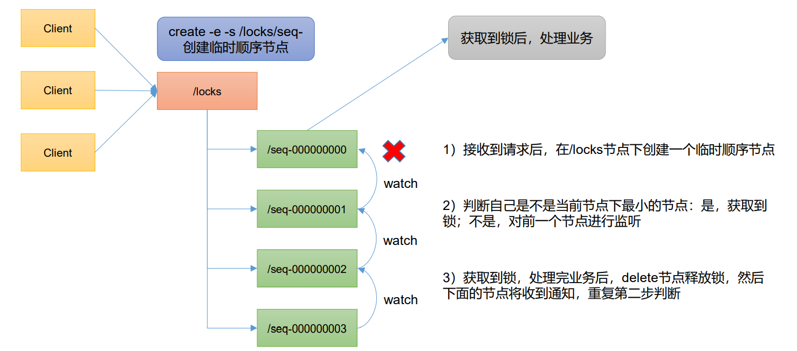

```java
public class DistributeLock {
    private ZooKeeper zk;
    private String connectString = "hadoop102:2181,hadoop103:2181,hadoop104:2181";
    private int sessionTimeout = 2000;
    /*countDownLatch这个类使一个线程等待其他线程各自执行完毕后再执行。
    是通过一个计数器来实现的，计数器的初始值是线程的数量。每当一个线程执行完毕后，计数器的值就-1，当计数器的值为0时，表示所有线程都执行完毕，然后在闭锁上等待的线程就可以恢复工作了。
    */
    private CountDownLatch connectLatch = new CountDownLatch(1);
    private CountDownLatch waitLatch = new CountDownLatch(1);
    private String currentNode;
    private String waitPath;

    public static void main(String[] args)  {
        final DistributeLock lock1 = new DistributeLock();
        final DistributeLock lock2 = new DistributeLock();
        new Thread(new Runnable() {
            @Override
            public void run() {
                try {
                    lock1.getConnect();
                    System.out.println("线程一启动");
                    lock1.zkLock();
                    System.out.println("线程一获取到锁");
                    Thread.sleep(5000);
                    lock1.unZkLock();
                    System.out.println("线程一释放锁");
                } catch (IOException | InterruptedException | KeeperException e) {
                    e.printStackTrace();
                }
            }
        }).start();

        new Thread(new Runnable() {
            @Override
            public void run() {
                try {
                    lock2.getConnect();
                    System.out.println("线程二启动");
                    lock2.zkLock();
                    System.out.println("线程二获取到锁");
                    Thread.sleep(5000);
                    lock2.unZkLock();
                    System.out.println("线程二释放锁");
                } catch (IOException | InterruptedException | KeeperException e) {
                    e.printStackTrace();
                }
            }
        }).start();


    }


    public void getConnect() throws IOException, InterruptedException {
        zk = new ZooKeeper(connectString, sessionTimeout, new Watcher() {
            @Override
            public void process(WatchedEvent watchedEvent) {
                //connectLatch释放
                if (watchedEvent.getState() == Event.KeeperState.SyncConnected) {
                    connectLatch.countDown();
                }
                //waitLatch释放
                if (watchedEvent.getType() == Event.EventType.NodeDeleted
                && watchedEvent.getPath().equals(waitPath)) {
                    waitLatch.countDown();
                }
            }
        });

        //等待连接完成
        connectLatch.await();
    }

    //加锁
    public void zkLock() throws InterruptedException, KeeperException {
        Stat locks = zk.exists("/locks", false);
        if (locks == null) {
            zk.create("/locks",
                    "locks".getBytes(),
                    ZooDefs.Ids.OPEN_ACL_UNSAFE,
                    CreateMode.PERSISTENT);
        }
        //创建临时带序号的节点 锁//currentNode == /locks/seq-00000000
        currentNode = zk.create("/locks/seq-",
                null,
                ZooDefs.Ids.OPEN_ACL_UNSAFE,
                CreateMode.EPHEMERAL_SEQUENTIAL);
        //判断是否该节点序号最小，若不是最小监视上一个节点
        List<String> childrens = zk.getChildren("/locks", false);
        if (childrens.size() == 1) {//只有一个节点，直接获取锁
            return;
        } else {//有多个节点，进一步判断
            Collections.sort(childrens);
            //找到当前节点在childrens集合中的位置
            int currentIndex = childrens.indexOf(currentNode.substring("/locks/".length()));
            if (currentIndex == 0 ) {
                //排第一位，获取锁
                return;
            } else {
                waitPath = "/locks/" + childrens.get(currentIndex - 1 );
                //需要监听前一个节点
                zk.getData(waitPath,true,null);
                //等待监听
                waitLatch.await();
                return;
            }

        }
    }

    //解锁
    public void unZkLock() throws InterruptedException, KeeperException {
        zk.delete(currentNode,-1);
    }

}

```

结果

```
线程二启动
线程二获取到锁
线程一启动
线程二释放锁
线程一获取到锁
线程一释放锁
bug：两个线程有几率同时获取到锁
```

## 5.3  Curator框架实现分布式锁案例

### 5.3.1 原生的 Java API 开发存在的问题 

1. 会话连接是异步的，需要自己去处理。比如使用 CountDownLatch
2. Watch 需要重复注册，不然就不能生效 
3. 开发的复杂性还是比较高的
4. 不支持多节点删除和创建。需要自己去递归

### 5.3.2 Curator框架实例

```java
public class CuratorLockTest {
    private String rootNode = "/locks";
    // zookeeper server 列表
    private String connectString =
            "hadoop102:2181,hadoop103:2181,hadoop104:2181";
    // connection 超时时间
    private int connectionTimeout = 2000;
    // session 超时时间
    private int sessionTimeout = 2000;
    public static void main(String[] args) {
        new CuratorLockTest().test();
    }
    // 测试
    private void test() {
        // 创建分布式锁 1
        final InterProcessLock lock1 = new
                InterProcessMutex(getCuratorFramework(), rootNode);
        // 创建分布式锁 2
        final InterProcessLock lock2 = new
                InterProcessMutex(getCuratorFramework(), rootNode);
        new Thread(new Runnable() {
            @Override
            public void run() {
                // 获取锁对象
                try {
                    lock1.acquire();
                    System.out.println("线程 1 获取锁");
                    // 测试锁重入
                    lock1.acquire();
                    System.out.println("线程 1 再次获取锁");
                    Thread.sleep(5 * 1000);
                    lock1.release();
                    System.out.println("线程 1 释放锁");
                    lock1.release();
                    System.out.println("线程 1 再次释放锁");
                } catch (Exception e) {
                    e.printStackTrace();
                }
            }
        }).start();
        new Thread(new Runnable() {
            @Override
            public void run() {
                // 获取锁对象
                try {
                    lock2.acquire();
                    System.out.println("线程 2 获取锁");
                    // 测试锁重入
                    lock2.acquire();
                    System.out.println("线程 2 再次获取锁");
                    Thread.sleep(5 * 1000);
                    lock2.release();
                    System.out.println("线程 2 释放锁");
                    lock2.release();
                    System.out.println("线程 2 再次释放锁");
                } catch (Exception e) {
                    e.printStackTrace();
                }
            }
        }).start();
    }
    // 分布式锁初始化
    public CuratorFramework getCuratorFramework (){
        //重试策略，初试时间 3 秒，重试 3 次
        RetryPolicy policy = new ExponentialBackoffRetry(3000, 3);
        //通过工厂创建 Curator
        CuratorFramework client =
                CuratorFrameworkFactory.builder()
                        .connectString(connectString)
                        .connectionTimeoutMs(connectionTimeout)
                        .sessionTimeoutMs(sessionTimeout)
                        .retryPolicy(policy).build();
        //开启连接
        client.start();
        System.out.println("zookeeper 初始化完成...");
        return client;
    }
}

```

结果

```
 线程 1 获取锁
线程 1 再次获取锁
线程 2 获取锁
线程 2 再次获取锁
线程 2 释放锁
线程 2 再次释放锁
```

# 6 企业面试真题（面试重点）

* 选举机制 

  半数机制，超过半数的投票通过，即通过。 

（1）第一次启动选举规则： 投票过半数时，服务器 id 大的胜出 

（2）第二次启动选举规则： ①EPOCH 大的直接胜出 ②EPOCH 相同，事务 id 大的胜出 ③事务 id 相同，服务器 id 大的胜出 

* 生产集群安装多少 zk 合适？ 安装奇数台。 生产经验： ⚫ 10 台服务器：3 台 zk； ⚫ 20 台服务器：5 台 zk； ⚫ 100 台服务器：11 台 zk； ⚫ 200 台服务器：11 台 zk 服务器台数多：好处，提高可靠性；坏处：提高通信延时 

* 常用命令 ls、get、create、delet

# 7 Zookeeper源码分析

