# 1 概述

## 1.1 Java 语言特点?

1. 简单易学、丰富的类库
2. ⾯向对象（封装，继承，多态）让程序耦合度更低，内聚性更高
3.  Java 虚拟机
   * 编译与解释并存
     * 编译：源代码编译为字节码，热点代码字节码由JIT编译器编译为机器码
     * 解释：机器码由解释器逐行解释执行
   * 平台无关性
   * 安全性（沙箱安全模式）
4. 可靠性
5. ⽀持多线程（ C++ 语⾔没有内置的多线程机制，因此必须调⽤操作系统的多线程功能来进⾏多线程程序设计，⽽ Java 语⾔却提供了多线程⽀持）
6. ⽀持⽹络编程并且很⽅便（ Java 语⾔诞⽣本身就是为简化⽹络编程设计的，因此 Java 语⾔不仅⽀持⽹络编程⽽且很⽅便）

## 1.2 JavaEE

JavaEE是一套使用Java进行**企业级应用开发**的大家一致遵循的13个**规范工业标准**。JavaEE平台提供了一个基于组件的方法来加快设计、开发装配及部署企业应用程序

1. JDBC（Java Database）数据库连接
2. JNDI（Java Naming and Directory Interfaces）Java的命名和目录接口
3. EJB（Enterprise JavaBean）
4. RMI（Remote Method Invoke）远程方法调用
5. Java IDL(Interface Description Language)/CORBA(Common Objeer Architecture) 接口定义语 ;言/公用对象请求代理程序体系结构
6. JSP（Java ServerPages）
7. Servlet
8. XML（Extensible Markup Language）可扩展白标记语言
9. JMS（Java Message Service）Java 消息服务
10. JTA（Java Transaction API）Java 事务API
11. JTS（Java Transaction Service）Java 事务服务
12. JavaMail
13. JAF（JavaBean Activation Framework) JavaBean激活框架

JavaSE可以看作JavaEE的子集。Java EE 是在 Java SE 的基础上扩展的企业版，专为开发大型、复杂的企业级应用而设计。它提供了更多的功能和服务，以支持分布式计算、事务管理、安全性等方面的需求。Java EE 包含了用于开发 Web 服务、组件模型、管理和通信 API 的类库。

## 1.3 JDK和JRE

JDK 是 Java Development Kit，它是功能⻬全的 Java SDK。它拥有 JRE 所拥有的⼀切，还有编 译器（javac）和⼯具（如 javadoc 和 jdb）。它能够创建和编译程序。

JRE 是 Java 运⾏时环境。它是运⾏已编译 Java 程序所需的所有内容的集合，包括 **Java 虚拟机 （JVM）**，Java 类库，java 命令和其他的⼀些基础构件。但是，它不能⽤于创建新程序。

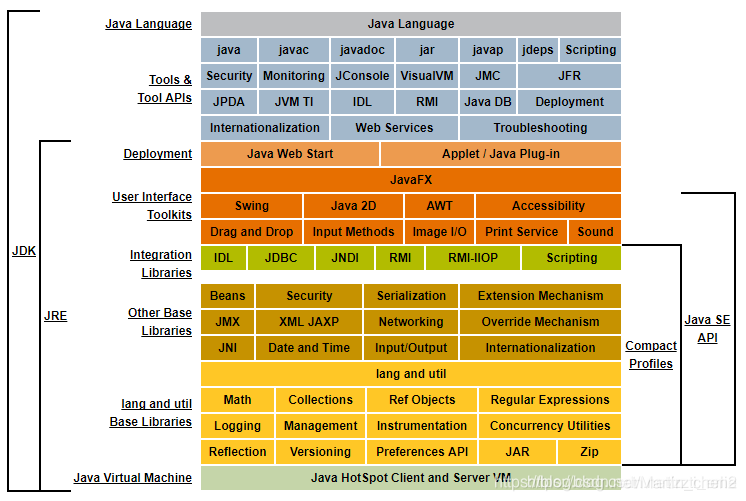

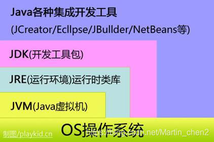

## 1.4 Java 和 C++的区别

相同点：面向对象，支持封装、继承、多态

不同点：

* Java 不通过指针直接访问内存，程序安全
* C++ 支持多重继承，Java 只支持单继承，但可以实现多个接口
* Java 有自动内存管理

# 2 基础语法

## 2.1 数据类型

* 基本数据类型
  * 数值型
    * 整数类型（byte short int long）分别占 1个、2个、4个、8个字节
    * 浮点类型（float double）分别占4个、8个字节
  * 字符型（char）占两个字节
  * 布尔型（boolean）理论上占用1bit，实际上占用一个字节
* 引用数据类型 （存储对象在内存中的位置）
  *  类（class）包含字符串（String）
  * 接口（interface）
  * 数组（[]）

## 2.2 运算符

## 2.3 程序流程控制

# 3 数组

数组本身就是引用类型，数组元素可以说任何数据类型

创建数组对象会再内存中开辟一整块连续空间，数组名引用的即为连续空间的首地址

数组长度一旦确定，就不可修改

通过下标调用指定位置的元素

**内存解析**

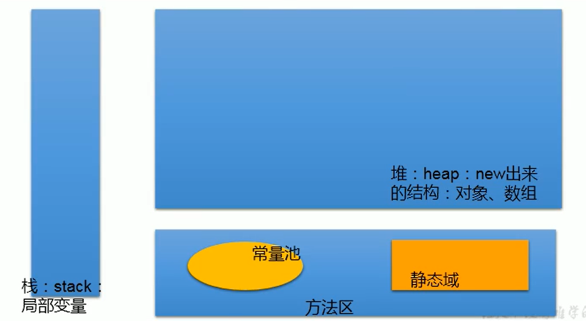

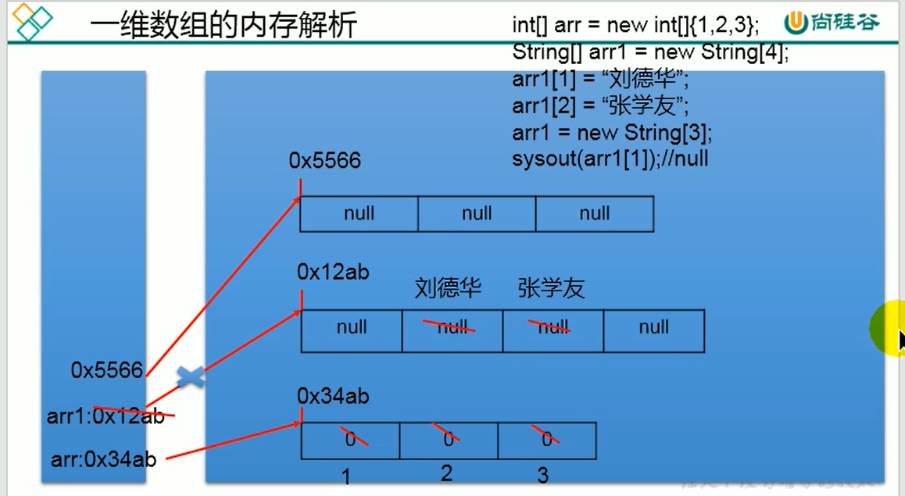

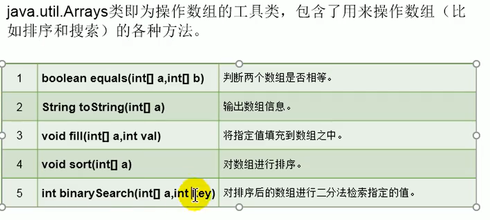

# 4 面向对象

## 4.1 类与对象

类：类是对具有相同属性（字段或者成员变量）和行为（法）的一组对象的抽象，对一类**对象**的统称。

**类的成员**

属性、方法、构造器、代码块、内部类

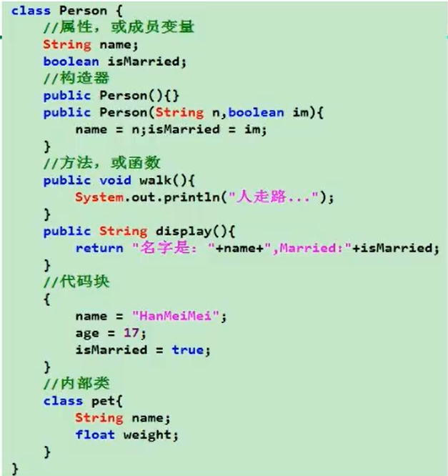

**类的实例化**

new 关键字用于创建一个对象的实例

类加载于方法区

实例加载于堆

**权限修饰**

对于类的权限修饰只可以用public和default(缺省)，

* public类可以在任意地方被访问。
* default类只可以被同一个包内部的类访问。

**关键字修饰**

* final表示该类是无法被任何其他类继承的，意味着此类在一个继承树中是一个叶子类，并且此类的设计已被认为很完美而不需要进行修改或扩展。

* abstract修饰类，会使得类变成抽象类，抽象类不能生成实例，但是可以作为对象变量声明的类型，也就是编译时类型。抽象类相当于类的半成品，需要子类继承并覆盖其中的方法。

### 4.1.1 类的加载

随着类加载 类中各代码的执行顺序（由父及子，静态先行）

在程序入口（main方法）中第一次调用类的静态结构（非构造器）
↓
类的信息正式加载至方法区中
↓
执行类的初始化方法：<clinit>()方法，该方法仅能由Java编译器生成并由JVM调用，由字节码指令所组成。它是由类静态成员的赋值语句以及static语句块合并产生的。 
↓
静态结构（方法或者属性）开始执行
↓
结束

在程序入口（main方法）中第一次调用类的构造器
↓
类的信息正式加载至方法区中
↓
执行类的初始化方法：<clinit>()方法，该方法仅能由Java编译器生成并由JVM调用，由字节码指令所组成。它是由类静态成员的赋值语句以及static语句块合并产生的。 
↓
非静态属性开始默认初始化
↓
显式初始化/非静态代码块开始执行
↓
构造器开始执行
↓
结束

> 在加载一个类之前，虚拟机总是会试图加载该类的父类，因此父类的总是在子类之前被调用。也就是说，父类的static块优先级高于子类

## 4.2 成员变量

|            | **局部变量**                                                 | **成员变量**                                                 |
| ---------- | ------------------------------------------------------------ | ------------------------------------------------------------ |
| 所处位置   | 方法内的变量<br />形参（方法形参、构造器形参）<br />构造器或代码块内的变量 | 类成员之一：类的属性                                         |
| 初始值     | 不具有默认初始化值，必须初始化                               | 具有默认初始化值                                             |
| 虚拟机内存 | 加载到栈空间                                                 | 非static成员变量加载到堆空间<br />static成员变量加载到方法区 |
| 权限修饰   | 无                                                           | private表s属性为该类所有，其它类（包括子类）无法访问到       |
| 关键字修饰 | final表示变量的值不可以改变，此时该变量可以被称为常量        | final表示该属性一旦被初始化便不可改变<br />static表示该属性为静态属性，可被多个对象共享，可以被类名调用<br /> |

**全局常量**

由final和static共同修饰的变量


## 4.3 成员方法

**方法形参值传递机制**

如果参数是基本数据类型，此时实参赋给形参的是实参真实存储的数据值。
如果参数是引用数据类型，此时实参赋给形参的是实参存储数据的地址值。

**权限修饰**

private表示方法为该类所有，其它类（包括子类）无法访问到

**关键字修饰**

* final表示这种方法提供的功能已经满足当前要求，不需要进行扩展，并且也不允许任何从此类继承的类来重写这种方法，但是子类仍然可以使用这个方法。在声明类中，一个 final 方法只被实现一次。
* static表示静态方法，加载于方法区，可被类名调用。生命周期随着类的消失而消失。静态的方法只能访问静态的成员;
* abstract修饰方法会使得这个方法变成抽象方法，也就是只有声明，而没有实现，需要子类重写。

### 4.3.1 重载

 发⽣在同⼀个类中，⽅法名必须相同，参数类型不同、个数不同、顺序不同，⽅法返回值和访问 修饰符可以不同。

构造器也不能重写但是可以重载,因为构造方法不能被继承。（子类名和父类名也不相同）

## 4.4 代码块

| 静态代码块                         | 非静态代码块                 |
| ---------------------------------- | ---------------------------- |
| 内部可以有输出语句                 | 内部可以有输出语句           |
| 随着类的加载而执行，因此只执行一次 | 随着对象的实例化而执行       |
| 作用： 初始化类信息                | 作用：初始化对象的属性       |
| 只能调用静态属性和方法             | 可以调用静态结构和非静态结构 |


## 4.5 构造器

## 4.6 内部类

如果一个事物的内部，还需要一个完整的结构进行描述，而且该完整结构只为外部事务服务，则最好使用内部类。

**成员内部类**

通过类名.this.方法名调用外部结构

**局部内部类**

存在于  方法内、代码块内、构造器内

局部内部类的方法调用外部类方法中的变量，要求该变量为final类型

原因：考虑到变量的生命周期，num变量出了method方法即消亡。若加上final修饰，使其成为常量即可在内部类的独立文件中存活。


## 4.7 封装性 

### 4.4.1 封装性的体现

设计思想：该隐藏的隐藏该暴露的暴露

* 类的属性私有化
* 构造器私有化（类似于单例模式）
* 缺省类，防止类在包外调用
* 方法就是一种封装

### 4.4.1 权限修饰符

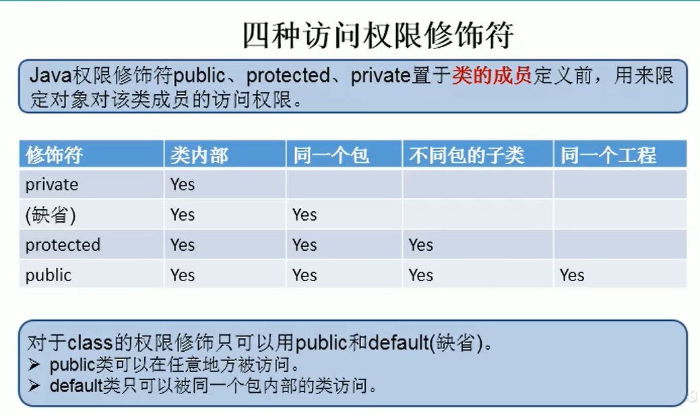

### 4.4.2 import关键字

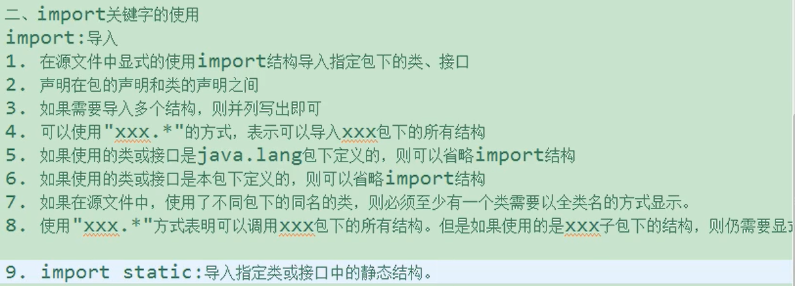

### 4.4.3 pakage关键字

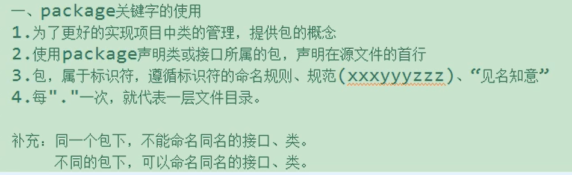

### 4.4.4 UML类图

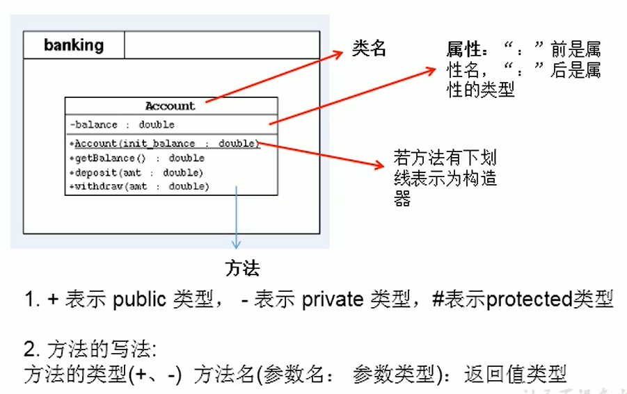

## 4.8 继承性

一切类直接或间接继承于java.lang包中的Object类

只支持单继承和多层继承，不允许多重继承

### 4.5.1 重写

 重写发⽣在运⾏期，是⼦类对⽗类的允许访问的⽅法的实现过程进⾏重新编写。

* ⽅法的重写要遵循“两同两⼩⼀⼤”

* ⽅法名相同、形参列表相同
* “两⼩”指的是⼦类⽅法返回值类型应⽐⽗类⽅法返回值类型更⼩或相等，⼦类⽅法声明抛出 的异常类应⽐⽗类⽅法声明抛出的异常类更⼩或相等；
* 一⼤”指的是⼦类⽅法的访问权限应⽐⽗类⽅法的访问权限更⼤或相等。

构造器不能重写，因为构造方法不能被继承、

静态方法不算重写

## 4.9 多态性

### 4.6.1 多态性定义

所谓多态就是指程序中定义的引⽤变量所指向的具体类型和通过该引⽤变量发出的⽅法调⽤在编 程时并不确定，⽽是在程序运⾏期间才确定，即⼀个引⽤变量到底会指向哪个类的实例对象，该 引⽤变量发出的⽅法调⽤到底是哪个类中实现的⽅法，必须在由程序运⾏期间才能决定

**多态是一种运行时行为**

### 4.6.2 多态性的体现

* 在 Java 中有两种形式可以实现多态：继承（多个⼦类对同⼀⽅法的重写）和接⼝（实现接⼝并 覆盖接⼝中同⼀⽅法）。

* 一个父类引用指向不同的子类对象，同时可以调用其**重写父类后的方法**，从而实现代码的通用性
* 一个接口引用指向不同的实现类对象，同时可以调用其**重写接口后的方法**，从而实现代码的通用性
* 即**向上转型**

### 4.6.3 多态性的使用

* 应用了对象的多态性后，内存（堆）中实际上加载了子类的属性和方法，但父类对象不能调用子类特有的方法和属性。

* 为了能调用子类特有的属性和方法：使用**向下转型**

  ```java
  Person p = new Man();//向上转型（多态性体现）
  Man m = (Man)p;//向下转型
  ```

  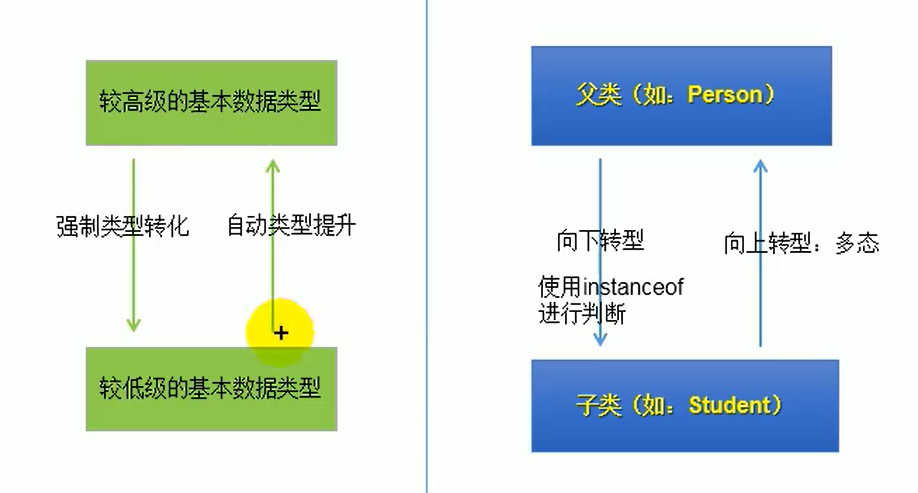

### 4.6.4 instanceof 操作符

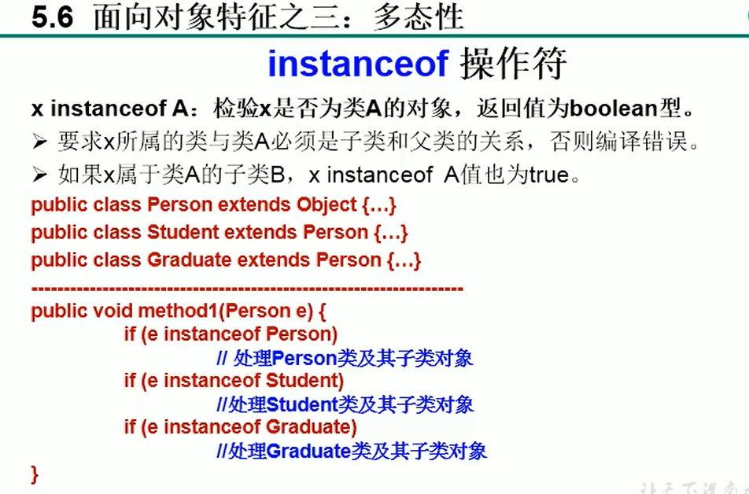

## 4.10 抽象类

由abstract修饰的类

抽象类不能实例化

抽象类一定有构造器，

## 4.11 接口

有时候，需要从几个类中抽取出共同的行为特征，可以用到接口

使用接口可以得到多重继承的效果，弥补Java单继承的局限性

接口中无法定义构造器，无法实例化

接口与接口之间可以多继承

**定义接口**

JDK7及以前：只能定义全局常量，和抽象方法

JDK8及以后：除了定义全局常量，和抽象方法。还可以定义静态方法、默认方法 （类似于抽象类）

## 4.12 枚举类


# 5 设计模式

设计模式是在大量的实践中总结和理论化之后优选的代码结构、编程风格、以及解决问题的思考方式。设计模式免去我们自己再思考和摸索。设计模式就像是经典的棋谱，不同的棋局，我们用不同的棋谱，”套路”

根据完成的工作类型来划分，这种方式可分为**创建型模式、结构型模式和行为型模式** 3 种。


## 5.1 创建型模式

### 5.1 单例模式 Singleton

**实现方式**

1. 私有化构造器
2. 声明静态的当前类对象
3. 声明静态的返回当前类对象的方法

**好处**

由于单例模式只生成一个实例，减少了系统性能开销，当一个对象的产生需要比较多的资源时，如读取配置、产生其他依赖对象时，则可
以通过在应用启动时直接产生一个单例对象，然后永久驻留内存的方式来解决。

**分类**

饿汉式：对象加载时间长，但线程安全

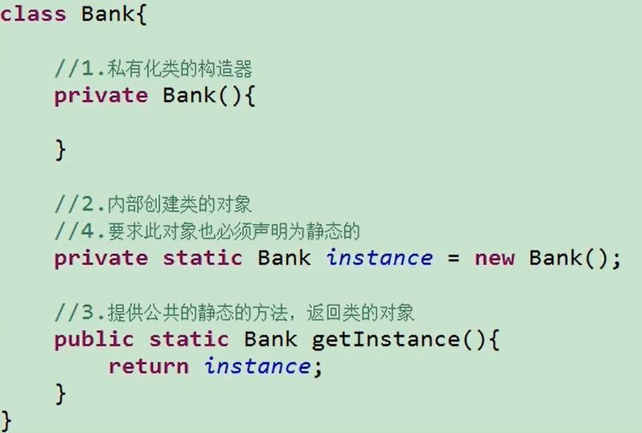

懒汉式：延迟对象的创建

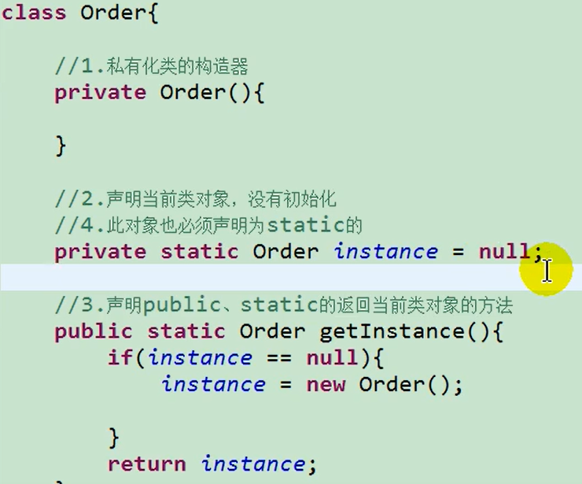

## 5.2 结构性模式

### 5.2.1 代理模式 Proxy 

代理模式就是为其他对象提供一直代理以控制对这个对象的访问

```java
interface Network {
    void browse();
}
// 被代理类
class Server implements Network {
    Server() {
    }

    public void browse() {
        System.out.println("真实服务器访问网络");
    }
}
// 代理类
class ProxyServer implements Network {
    public Network network;

    public ProxyServer(Network network) {
        this.network = network;
    }

    public void check() {
        System.out.println("联网前的检查工作");
    }

    public void browse() {
        this.check();
        this.network.browse();
    }
}
// 测试
    public static void main(String[] args) {
        Server server = new Server();
        ProxyServer proxyServer = new ProxyServer(server);
        proxyServer.browse();
    }
```


## 5.3 行为型模式

### 5.3.1 模板方法设计模式 TemplateMethod

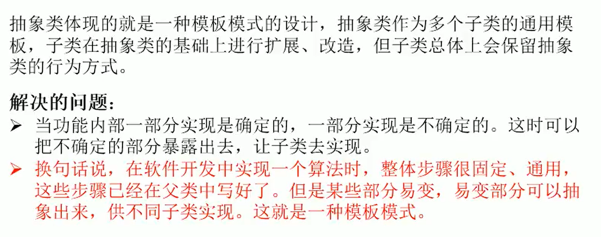


# 6 修饰符关键字

## 6.1 static

用来修饰类方法和类变量，

**静态变量：**

 static关键字用来声明独立于对象的静态变量，无论一个类实例化多少对象，他的静态变量只有一份拷贝，**静态变量也被称为类变量**

**静态方法**：

 static关键字用来声明独立于对象的静态方法。**静态方法不能使用类的非静态变量。**

**访问方式**：

 对类变量和方法的访问可以直接使用 **class/obj.variablename** 和 **class/obj.methodname** 的方式访问。

```java
   private static int numInstances = 0;
   protected static int getCount() {
      return numInstances;
  }
```

## 6.2 final修饰符

**final变量**：

 被final修饰的实例变量必须显示指定初始值，切不可更改，通过和static一起来创建类常量

```java
  final int value = 10;
  // 下面是声明常量的实例
  public static final int BOXWIDTH = 6;
  static final String TITLE = "Manager";
//final类的声明
  public final class Test {
   // 类体
}
```

**final方法**：

 父类中的final方法可以被重写，但不可被覆盖，final方法的主要目的是防止该方法的内容被修改

**final类：**

 final类不可被子类继承

## 6.3 abstract修饰符

**抽象类**：

 抽象类不能用来实例化对象，声明抽象类的唯一目的是为了将来对该类进行扩充

 一个类不能同时被abstract和final修饰，如果一个类包含抽象方法，该类必须为抽象类

抽象类可以包含抽象方法和非抽象方法

```java
abstract class Caravan{
   private double price;
   private String model;
   private String year;
   public abstract void goFast(); //抽象方法
   public abstract void changeColor();
}
```

**抽象方法**

```java
public abstract class SuperClass{
    abstract void m(); //抽象方法
}
 
class SubClass extends SuperClass{
     //实现抽象方法
      void m(){
          .........
      }
}
```

## 6.4 synchronized修饰符

 synchronized关键字声明的方法同一时间只能被一个线程访问，可用于四个访问修饰符

```java
public synchronized void showDetails(){
.......
}
```

## 6.5 transient修饰符

 序列化对象包含被transient修饰的实例变量时，java虚拟机会跳过该变量

 该修饰符包含在定义变量的语句中，用来预处理类和变量的数据类型

```java
public transient int limit = 55;   // 不会持久化
public int b; // 持久化
```

 ## 6.6 volatile修饰符

* volatile修饰的成员变量在每次被线程访问时，都强制从共享内存中重新读取该成员变量的值，而且当成员变量发生变化时，会强制线程将变化的值回写到共享内存，**这样在任何时可，俩个不同的线程总是看到某个成员变量的同一个值**

Java 的内存模型

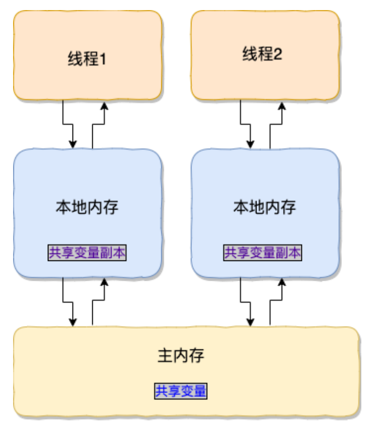

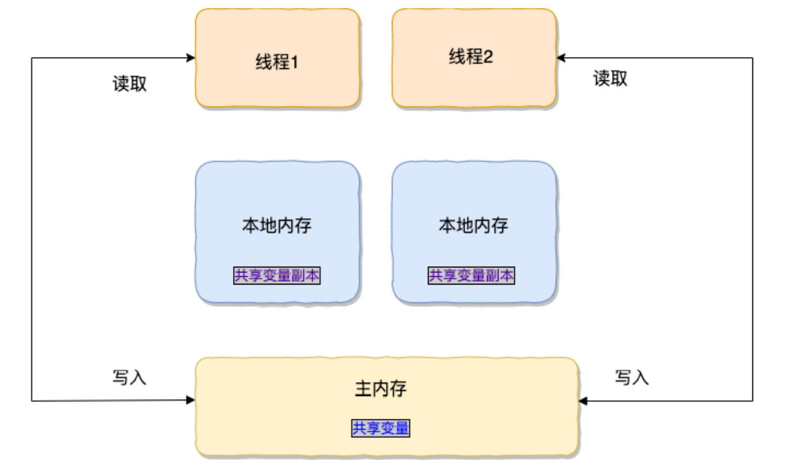

使用volatile后

* 使⽤ volatile 可以禁⽌ JVM 的指令重排，保证在多线程环境下也能正常运⾏。

```java
public class MyRunnable implements Runnable
{
    private volatile boolean active;
    public void run()
    {
        active = true;
        while (active) // 第一行
        {
            // 代码
        }
    }
    public void stop()
    {
        active = false; // 第二行
    }
}
```

通常情况下，在一个线程调用run()方法（在runnable开启的线程），在另一个线程调用stop()方法。如果第一行缓冲区的active值被使用，在第二行的active值为false时循环停止

# 7 异常处理

## 7.1 异常类型

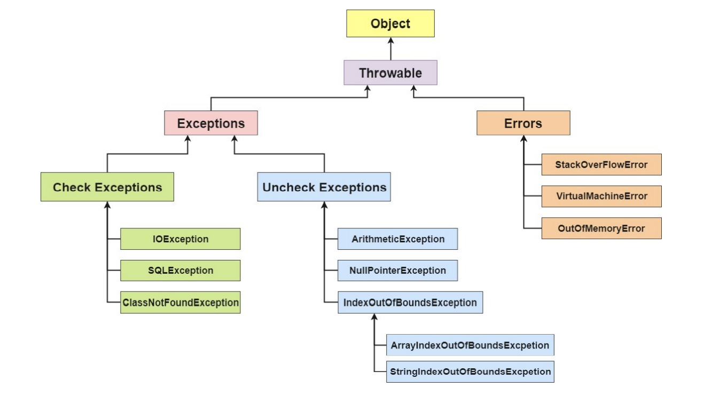

在 Java 中，所有的异常都有⼀个共同的祖先 java.lang 包中的 Throwable 类。 Throwable 类 有两个重要的⼦类 Exception （异常）和 Error （错误）。

* Exception :程序本身可以处理的异常，可以通过 catch 来进⾏捕获。 Exception ⼜可以分为受检查异常(必须处理) 和 不受检查异常(可以不处理)。 
  * 受检查异常：Java 代码在编译过程中，如果受检查异常没有被 catch / throw 处理的话，就没办法通过编译 。⽐如下⾯这段 IO 操作的代码。编译时异常 CompilerException
  * 不受检查异常：Java 代码在编译过程中 ，我们即使不处理不受检查异常也可以正常通过编译。运行时异常 RuntimeExceptions
* Error ： Error 属于程序⽆法处理的错误 ，我们没办法通过 catch 来进⾏捕获 。这些异常发⽣时，Java 虚拟机（JVM）⼀般会选择线程终⽌。

## 7.2 异常处理机制

**异常对象的生成与抛出**

* 虚拟机自动生成并抛出

  程序运行过程中，虚拟机检测到程序发生了问题，如果在当前代码中没有找到相应的处理程序，就会在后台自动创建一个对应异常类的实例对象并抛出一一自动抛出

* 开发人员手动创建并抛出

  ```java
  throw new ClassCastException();
  ```

* 一旦抛出异常对象后，其后代码不再执行

**异常处理方式**

* try-catch-finally

  ```java
          try {
  			//⽤于捕获异常。
  			InputStream inputStream = new FileInputStream("");
  
          } catch (RuntimeException e) {
              //⽤于处理 try 捕获到的异常。
              e.getMessage();//返回异常发⽣时的简要描述
              e.toString();//返回异常发⽣时的详细信息
              e.printStackTrace();//在控制台上打印 Throwable 对象封装的异常信息
          } catch (IOException e) {
  
          }
          finally {
  			//⽆论是否捕获或处理异常，finally 块⾥的语句都会被执⾏。当 try 语句和 finally 语句中都有 return 语句时，在⽅法返回之前，finally 语句的内容将被执⾏，并且 finally 语句的返回值将会覆盖原始的返回值。
          }
  ```

* throws + 可能会抛出的异常类型

  一旦方法体执行时，出现异常，仍会生成一个异常类对象，后续代码不再执行，并将异常传递给方法的调用者

  ```java
  public void test() throws IOException{
      InputStream inputStream = new FileInputStream("");
  }
  ```

## 7.3 自定义异常

1. 继承于现有异常结构 RuntimeException，Exception
2. 提供全局常量serialVersionUid
3. 提供重载的构造器

```java
@Data
@NoArgsConstructor
@AllArgsConstructor
public class GuliException extends RuntimeException{
    static final long serialVersionUID = -7034897190745766939L;

    @ApiModelProperty(value = "状态码")
    private Integer code;

    private String msg;
}
```

# 8 多线程

## 8.1 程序、进程、线程

**程序**

程序是含有指令和数据的⽂件，被存储在磁盘或其他的数据存储设备中，也就是说程序是**静态**的代码。

**进程**

进程是程序的⼀次执⾏过程，是系统运⾏程序的基本单位，因此进程是**动态**的。系统运⾏⼀个程序即是⼀个进程从创建，运⾏到消亡的过程。简单来说，**⼀个进程就是⼀个执⾏中的程序**，它在 计算机中⼀个指令接着⼀个指令地执⾏着，同时，每个进程还占有某些系统资源如CPU 时间， 内存空间，⽂件，输⼊输出设备的使⽤权等等。换句话说，当程序在执⾏时，将会被操作系统载⼊内存中。 

**线程**

**线程是进程划分成的更⼩的运⾏单位**。线程和进程最⼤的不同在于基本上各进程是独⽴的，⽽各线程则不⼀定，因为同⼀进程中的线程极有可能会相互影响。从另⼀⻆度来说，进程属于操作系统的范畴，主要是同⼀段时间内，可以同时执⾏⼀个以上的程序，⽽**线程则是在同⼀程序内⼏乎同时执⾏⼀个以上的程序段。**

线程与进程相似，但线程是⼀个⽐进程更⼩的执⾏单位。⼀个进程在其执⾏的过程中可以产⽣多个线程。与进程不同的是**同进程的多个线程共享同⼀块内存空间和⼀组系统资源**，所以系统在产⽣⼀个线程，或是在各个线程之间作切换⼯作时，负担要⽐进程⼩得多，也正因为如此，线程也被称为轻量级进程。

线程作为调度和执行的单位，每个线程拥有独立的运行栈和程序计数器（gc）

 由于共享相同的内存单元（堆和方法区），它们从同一个堆中分配对象，访问相同的变量和对象，因此线程间通信更简便高效。但多个线程操作共享的系统资源会带来安全隐患（线程安全问题）

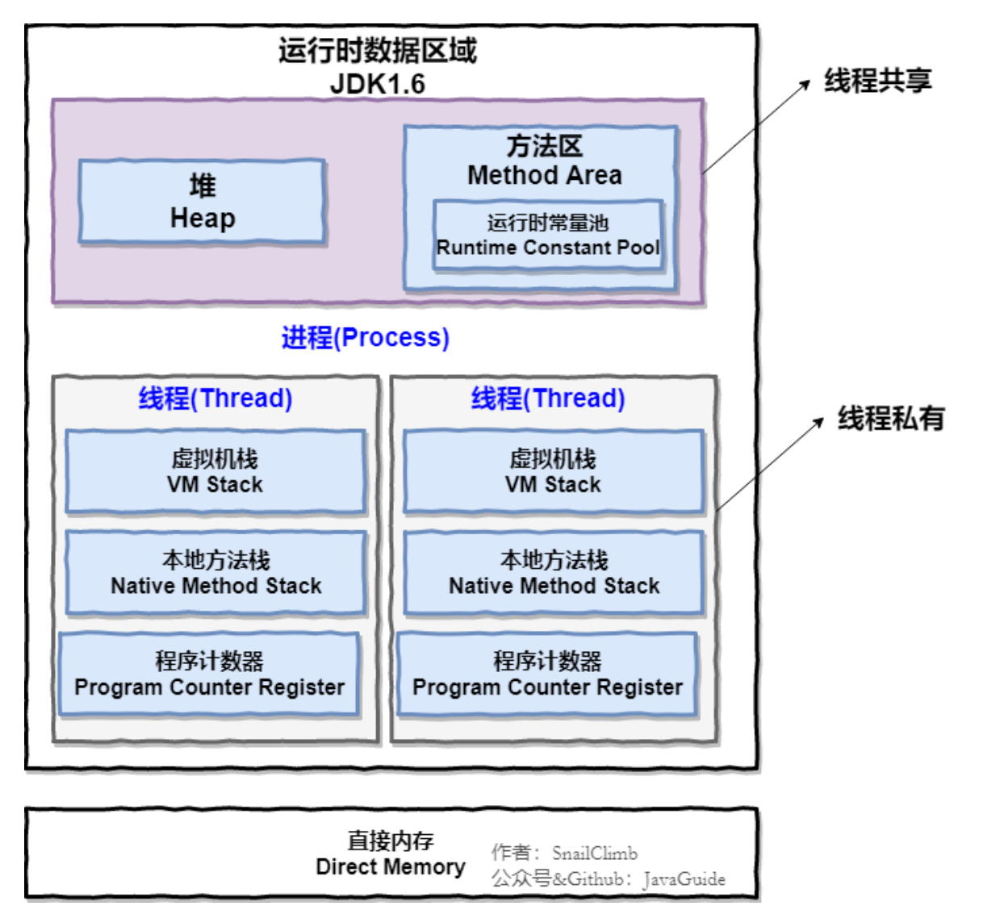

## 8.2 Java线程基本状态

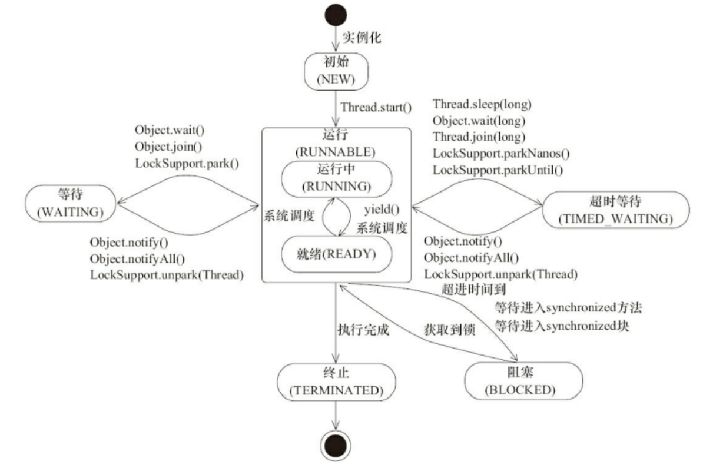

线程创建之后它将处于 **NEW（新建） 状态**。

调⽤ start() ⽅法后开始运⾏，线程这时候处于 READY（可运⾏） 状态。可运⾏状态的线程获得了 cpu 时间⽚（timeslice）后就处于 RUNNING（运⾏） 状态。两个状态一起又称 **RUNNABLE 状态**。

当线程执⾏ wait() ⽅法之后，线程进⼊ **WAITING（等待）状态**。进⼊等待状态的线程需要依靠 其他线程的通知才能够返回到运⾏状态，

⽽ **TIME_WAITING(超时等待) 状态**相当于在等待状态 的基础上增加了超时限制，⽐如通过 sleep（long millis） ⽅法或 wait（long millis） ⽅法可以将 Java 线程置于 TIMED WAITING 状态。当超时时间到达后 Java 线程将会返回到 RUNNABLE 状 态。

当线程调⽤同步⽅法时，在没有获取到锁的情况下，线程将会进⼊到 **BLOCKED（阻塞） 状态**。

线程在执⾏ Runnable 的 run() ⽅法之后将会进⼊到 **TERMINATED（终⽌） 状态**

## 8.3 为什么要使⽤多线程

* 从计算机底层来说： 线程可以⽐作是轻量级的进程，是程序执⾏的最⼩单位,线程间的切换 和调**度的成本远远⼩于进程**。另外，多核 CPU 时代意味着多个线程可以同时运⾏，这减少 了线程上下⽂切换的开销。 
* 从当代互联⽹发展趋势来说： 现在的系统动不动就要求百万级甚⾄千万级的并发量，⽽多线 程并发编程正是开发⾼并发系统的基础，利⽤好多线程机制可以⼤⼤提⾼系统整体的并发能 ⼒以及性能。

## 8.4 多线程可能带来什么问题

并发编程的⽬的就是为了能提⾼程序的执⾏效率提⾼程序运⾏速度，但是并发编程并不总是能提 ⾼程序运⾏速度的，⽽且并发编程可能会遇到很多问题，⽐如：**内存泄漏、上下⽂切换、死锁** 。

### 8.4.1 上下⽂切换

当前任务在执⾏完 CPU 时间⽚切换到另⼀个任务之前会先保存⾃⼰的状态，以 便下次再切换回这个任务时，可以再加载这个任务的状态。任务从保存到再加载的过程就是⼀次 上下⽂切换。上下⽂切换对系统来说意味着消耗⼤量的 CPU 时间，事实上，可能是操作系统中时间消耗最⼤的操作。 Linux 相⽐与其他操作系统（包括其他类 Unix 系统）有很多的优点，其中有⼀项就是，其上下⽂ 切换和模式切换的时间消耗⾮常少

### 8.4.2 线程安全问题

多线程环境中 , 且存在数据共享 , 一个线程访问的共享 数据被其他线程修改了, 那么就发生了线程安全问题 , 整个访问过程中 , 没有共享的数据被其他线程修改了就是线程安全的。

**解决线程安全问题**

* 使用同步机制, 使得在同一时间只能有一个线程修改共享数据

* 消除共享数据, 即多个线程数据不共享或者共享的数据不被做修改 如果使用成员变量, 对成员变量不进行修改

### 8.4.3 死锁

多个线程同时被阻塞，它们中的⼀个或者全部都在等待某个资 源被释放。由于线程被⽆限期地阻塞，因此程序不可能正常终⽌。
例如：线程 A 持有资源 2，线程 B 持有资源 1，他们同时都想申请对⽅的资源，所以这两 个线程就会互相等待⽽进⼊死锁状态。

**死锁必须具备以下四个条件**

* 互斥条件：该资源任意⼀个时刻只由⼀个线程占⽤
* 请求与保持条件：进程因请求资源⽽阻塞时，对已获得的资源保持不放
* 不剥夺条件：线程已获得的资源在末使⽤完之前不能被其他线程强⾏剥夺，只能自行释放
* 循环等待条件：若干进程，循环等待所需资源

**避免线程死锁**

* 互斥条件：来自线程的同步机制，无法改变
* 请求与保持条件：一次性获取所有资源，不现实
* 不剥夺条件：如果申请不到，可以主动释放它占有的资源。
* 循环等待条件：按序申请资源来预防，必须先申请资源1才能申请资源2

### 8.4.4 内存泄漏

ThreadLocalMap 中使⽤的 key 为 ThreadLocal 的弱引⽤,⽽ value 是强引⽤。所以，如果 ThreadLocal 没有被外部强引⽤的情况下，在垃圾回收的时候，key 会被清理掉，⽽ value 不会 被清理掉。这样⼀来， ThreadLocalMap 中就会出现 key 为 null 的 Entry。假如我们不做任何措 施的话，value 永远⽆法被 GC 回收，这个时候就可能会产⽣内存泄露。ThreadLocalMap 实现 中已经考虑了这种情况，在调⽤ set() 、 get() 、 remove() ⽅法的时候，会清理掉 key 为 null 的记录。使⽤完 ThreadLocal ⽅法后 最好⼿动调⽤ remove() ⽅法

## 8.5 线程同步机制

线程同步能够解决线程安全问题

### 8.5.1 synchronized 关键字

**同步代码块**

指定加锁对象，对给定对象/类加锁。 synchronized(this.object) 表示进⼊同步代码 库前要获得给定对象的锁。 synchronized(this.class) 表示进⼊同步代码前要获得 当前 class 的锁

**同步方法**

* 修饰实例方法 作⽤于当前对象实例加锁，进⼊同步代码前要获得 当前对象实例的锁
* 修饰静态⽅法: 也就是给当前类加锁，会作⽤于类的所有对象实例 ，进⼊同步代码前要获得 当 前 class 的锁。

**双重检验锁方式实现 懒汉式单例模式的原理**

```java
public class Singleton {
    //使⽤ volatile 可以禁⽌ JVM 的指令重排，保证在多线程环境下也能正常运⾏。
	private volatile static Singleton uniqueInstance;
    
	private Singleton() {
	}
    
    public static Singleton getUniqueInstance() {
        //先判断对象是否已经实例过，没有实例化过才进⼊加锁代码
        if (uniqueInstance == null) {
            //类对象加锁
            synchronized (Singleton.class) {
                if (uniqueInstance == null) {
                    uniqueInstance = new Singleton();
                }
            }
        }
        return uniqueInstance;
    }
}

```

**synchronized早期实现**

 Java 早期版本中， synchronized 属于 重量级锁，效率低下。

Java 的线程是映 射到操作系统的原⽣线程之上的。如果要挂起或者唤醒⼀个线程，都需要操作系统帮忙完成，⽽ 操作系统实现线程之间的切换时需要从⽤户态转换到内核态，这个状态之间的转换需要相对⽐较 ⻓的时间，时间成本相对较⾼。

**synchronized的虚拟机实现**

现在的 synchronized 锁效率也优化得很不错了。JDK1.6 对锁的实现引⼊了⼤量的优化，如⾃旋锁、适 应性⾃旋锁、锁消除、锁粗化、偏向锁、轻量级锁等技术来减少锁操作的开销

* synchronized 同步语句块的实现使⽤的是 monitorenter 和 monitorexit 指令，其中 monitorenter 指令指向同步代码块的开始位置， monitorexit 指令则指明同步代码块的结束位 置。 

  当执⾏ monitorenter 指令时，线程试图获取锁也就是获取 对象监视器 monitor 的持有权。

  在执⾏ monitorenter 时，会尝试获取对象的锁，如果锁的计数器为 0 则表示锁可以被获取，获取 后将锁计数器设为 1 也就是加 1。 在执⾏ monitorexit 指令后，将锁计数器设为 0，表明锁被释放。如果获取对象锁失败，那当前 线程就要阻塞等待，直到锁被另外⼀个线程释放为⽌

* synchronized 修饰的⽅法并没有 monitorenter 指令和 monitorexit 指令，取得代之的确实是 ACC_SYNCHRONIZED 标识，该标识指明了该⽅法是⼀个同步⽅法。 

不过两者的本质都是对对象监视器 monitor 的获取。

### 8.5.2 Lock接口

JDK1.5以后，Java提供了Lock同步锁，相对与需要JVM隐式获取和释放锁Synchronized 同步锁，Lock同步锁需要显式获取和释放锁，这就为获取和释放锁提供了更多的灵活性。

由于Lock锁也会在阻塞的时候被挂起，因此它依然属于**悲观锁**。

**好处**

只要不涉及到复杂用法，一般采用的是Java的synchronized机制

不过，Lock可以提供一些synchronized不支持的机制

- 非阻塞的获取锁：尝试获取锁，如果能获取马上获取，不能获取马上返回，不会阻塞
- 中断获取锁：当获取锁的线程被中断时，抛出异常，锁被释放
- 超时获取锁：为尝试获取锁设定超时时间

**相应API**

```java
void lock()//普通的获取锁
    
void lockInterruptibly() throws InterruptedException//可中断的获取锁，锁的获取中可以中断线程
    //获得锁，可中断。举个例子，当两个线程同时通过lock.lockInterruptibly()想获取某个锁时，假若此时线程A获取到了锁，而线程B只有在等待，那么对线程B调用threadB.interrupt()方法能够中断线程B的等待过程。
    
boolean tryLock()//非阻塞获取锁 
    
boolean tryLock(long time, TimeUnit unit)//超时获取锁
    //如果锁定可用，则此方法立即返回值true。如果锁不可用，则当前线程将被禁用以进行线程调度，并且在发生以下三种情况之一之前处于休眠状态：
//当前线程获取锁。
//其他一些线程中断当前线程。
//等待时间过去了，返回false
    
void unlock()//释放锁
    
```

## 8.6 ThreadLocal

通常情况下，我们创建的变量是可以被任何⼀个线程访问并修改的。如果想实现每⼀个线程都有 ⾃⼰的专属本地变量该如何解决呢？ JDK 中提供的 ThreadLocal 类正是为了解决这样的问题。 ThreadLocal 类主要解决的就是让每个线程绑定⾃⼰的值。

```java
public class Thread implements Runnable {
 ......
//与此线程有关的ThreadLocal值。由ThreadLocal类维护
ThreadLocal.ThreadLocalMap threadLocals = null;
//与此线程有关的InheritableThreadLocal值。由InheritableThreadLocal类维护
ThreadLocal.ThreadLocalMap inheritableThreadLocals = null;
 ......
}
```

Thread 类中有⼀个 threadLocals 和 ⼀个 inheritableThreadLocals 变量，它们都是 ThreadLocalMap 类型的变量

默认情况下这两个变量都 是 null，只有当前线程调⽤ ThreadLocal 类的 set 或 get ⽅法时才创建它们，实际上调⽤这两 个⽅法的时候，我们调⽤的是 ThreadLocalMap 类对应的 get() 、 set() ⽅法。如下：

```java
// ThreadLocal.class
public void set(T value) {
    Thread t = Thread.currentThread();
    ThreadLocalMap map = getMap(t);
    if (map != null)
        map.set(this, value);
    else
        createMap(t, value);
}

ThreadLocalMap getMap(Thread t) {
    return t.threadLocals;
}
```

同时ThreadLocalMap 是 ThreadLocal 的静态内部类。因此，ThreadLocal 可以理解为只是 ThreadLocalMap 的封装，帮助Thread维护了ThreadLocalMap，并传递了变量值。

⽐如我们在同⼀个线程中声明了两个 ThreadLocal 对象的话，会使⽤ Thread 内部都是使⽤仅有 那个 ThreadLocalMap 存放数据的， ThreadLocalMap 的 key 就是 ThreadLocal 对象，value 就是 ThreadLocal 对象调⽤ set ⽅法设置的值。

## 8.7 创建线程的方式

### 8.7.1 继承Thread类

1. 定义Thread类的子类，并重写该类的run方法，该run方法的方法体就代表了线程要完成的任务。因此把run()方法称为执行体。
2. 创建Thread子类的实例，即创建了线程对象。
3. 调用线程对象的start()方法来启动该线程。

> 调⽤ start() ⽅法⽅可启动线程并使线程进⼊就绪状态，直接执⾏ run() ⽅法的话不会 以多线程的⽅式执⾏，而是在main线程中执行了run()方法内的代码

### 8.7.2 Runnable接口

1. 定义runnable接口的实现类，并重写该接口的run()方法，该run()方法的方法体同样是该线程的线程执行体。
2. 创建 Runnable实现类的实例，并依此实例作为Thread的target来创建Thread对象，该Thread对象才是真正的线程对象。
3. 调用线程对象的start()方法来启动该线程。

### 8.7.3 Callable和Future

1. 创建Callable接口的实现类，并实现call()方法，该call()方法将作为线程执行体，并且有返回值
2. 创建Callable实现类的实例，使用FutureTask类来包装Callable对象，该FutureTask对象封装了该Callable对象的call()方法的返回值。
3. 使用**FutureTask对象**作为Thread对象的target创建并启动新线程。
4. 调用FutureTask对象的get()方法来获得子线程执行结束后的返回值

**Callable方式与Runnable方式对比**

Callable功能更强大些

* 可以有返回值
* 方法可以抛出异常
* 支持泛型的返回值
* 需要借助FutureTask类，比如获取返回结果

**Future接口与FutureTask实现类**

* 可以对具体Runnable、Callable任务的执行结果进行取消、查询是否完成、获取结果等。
* FutureTask是Futrue接口的唯一的实现类
* FutureTask同时实现了Runnable,.Future接口。它既可以作为
* Runnable被线程执行，又可以作为Future得到Callable的返回值

### 8.7.4 线程池

提前创建好多个线程，放入线程池中，使用时直接获取，使用完放回池中。可以避免频繁创建销毁、实现重复利用。

线程池提供了⼀种限制和管理资源（包括执⾏⼀个任务）。 每个线程池还维护⼀些基本统计信 息，例如已完成任务的数量。

 **execute()⽅法**

⽤于提交不需要返回值的任务，所以⽆法判断任务是否被线程池执⾏成功与 否

 **submit()⽅法**

⽤于提交需要返回值的任务。线程池会返回⼀个 Future 类型的对象，通过这个 Future 对象可以判断任务是否执⾏成功

**好处**

* 降低资源消耗
* 提高响应速度
* 提高线程可管理性

# 9 Java常用类

## 9.1 String类

### 9.1.1 字符串的内存结构

字符串常量存储在常量池，实现线程共享

字符串非常量对象存储在堆中

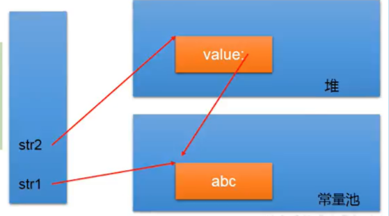


### 9.1.2 常用方法

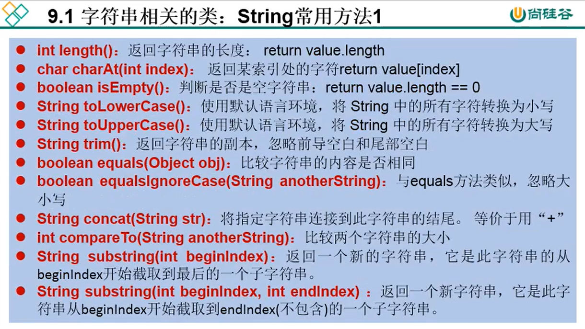

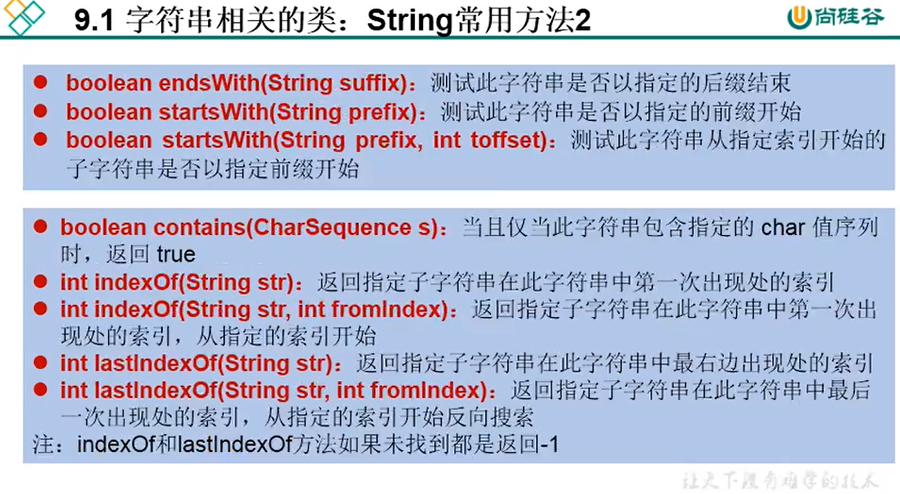

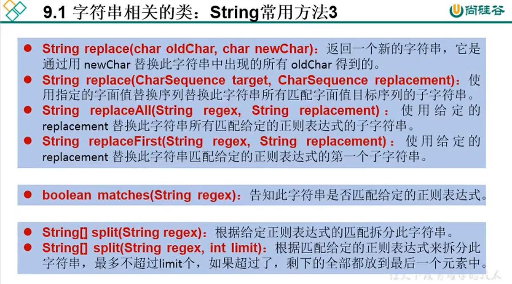

String与char型数组的转换：toCharArray()方法

String与byte型数组的转换：getBytes()方法

### 9.1.3 String、StringBuffer和StringBuilder的异同

String，底层char[]使用final关键字修饰，不可变，大量操作时效率低下。

StringBuffer，底层char[]不使用final关键字修饰，可变，线程安全，大量操作时效率高

StringBuilder，底层char[]不使用final关键字修饰，可变，线程不安全，效率最高

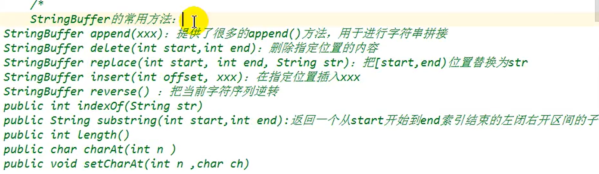


# 10 IO流

## 10.1 IO流的分类

按照流的流向分，可以分为输⼊流和输出流； 

按照操作单元划分，可以划分为字节流和字符流；

Java Io 流共涉及 40 多个类，这些类看上去很杂乱，但实际上很有规则，⽽且彼此之间存在⾮常 紧密的联系， Java I0 流的 40 多个类都是从如下 4 个抽象类基类中派⽣出来的。

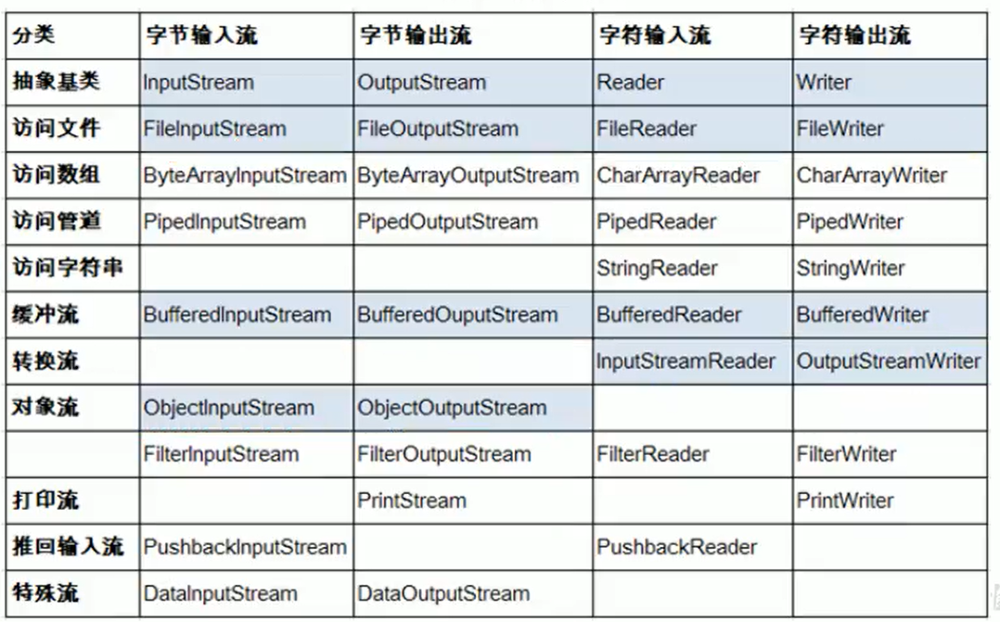

## 10.2 BIO,NIO,AIO

**BIO (Blocking I/O)**

**同步阻塞** I/O 模式，**数据的读取写⼊必须阻塞在⼀个线程内等待其完 成**。在活动连接数不是特别⾼（⼩于单机 1000）的情况下，这种模型是⽐᫾不错的，可以 让每⼀个连接专注于⾃⼰的 I/O 并且编程模型简单，也不⽤过多考虑系统的过载、限流等问 题。线程池本身就是⼀个天然的漏⽃，可以缓冲⼀些系统处理不了的连接或请求。但是，当 ⾯对⼗万甚⾄百万级连接的时候，传统的 BIO 模型是⽆能为⼒的。因此，我们需要⼀种更⾼ 效的 I/O 处理模型来应对更⾼的并发量。

**NIO (Non-blocking/New I/O)**

NIO 是⼀种**同步非阻塞**的 I/O 模型，在 Java 1.4 中引⼊了 NIO 框架，对应 java.nio 包，提供了 Channel , Selector，Buffer 等抽象。NIO 中的 N 可以 理解为 Non-blocking，不单纯是 New。它⽀持⾯向缓冲的，**基于通道**的 I/O 操作⽅法。 NIO 提供了与传统 BIO 模型中的 Socket 和 ServerSocket 相对应的 SocketChannel 和 ServerSocketChannel 两种不同的套接字通道实现,**两种通道都支持阻塞和非阻塞两种模式**。 阻塞模式使⽤就像传统中的⽀持⼀样，⽐᫾简单，但是性能和可靠性都不好；⾮阻塞模式正 好与之相反。对于低负载、低并发的应⽤程序，可以使⽤同步阻塞 I/O 来提升开发速率和更 好的维护性；对于⾼负载、⾼并发的（⽹络）应⽤，应使⽤ NIO 的⾮阻塞模式来开发

**AIO (Asynchronous I/O):** 

AIO 也就是 NIO 2。在 Java 7 中引⼊了 NIO 的改进版 NIO 2,它 是**异步非阻塞**的 IO 模型。异步 IO 是基于事件和回调机制实现的，也就是应⽤操作之后会直 接返回，不会堵塞在那⾥，当后台处理完成，操作系统会通知相应的线程进⾏后续的操作。 AIO 是异步 IO 的缩写，虽然 NIO 在⽹络操作中，提供了⾮阻塞的⽅法，但是 NIO 的 IO ⾏ 为还是同步的。对于 NIO 来说，我们的业务线程是在 IO 操作准备好时，得到通知，接着就 由这个线程⾃⾏进⾏ IO 操作，IO 操作本身是同步的。查阅⽹上相关资料，我发现就⽬前来 说 AIO 的应⽤还不是很⼴泛，Netty 之前也尝试使⽤过 AIO，不过⼜放弃了。


# 11 Java集合

## 11.1 分类

* Collection接口：单列数据
  * List：元素有序、可重复的集合
  * Set：元素无序，不可重复的集合
* Map接口：双列数据，具有key-value映射关系的集合

## 11.2 Collection

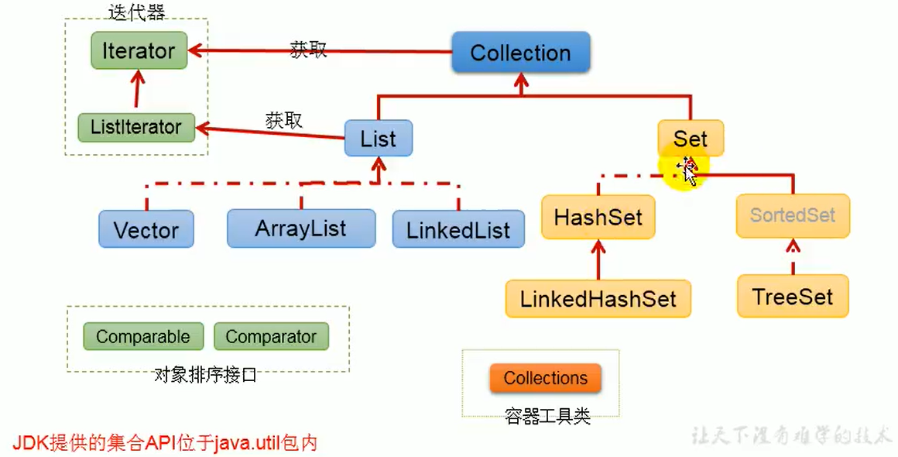

### 11.2.1 常用方法

```java
Arrays.aslist(元素)、new ArrayList() 创建ArrayList类型collection
size() 返回collection元素个数
add()、remove()增删查改
removeAll(Collection) 从collection中移除collection1的元素(差集)
retainAll(Collection) 改变collection为collection1和collection的交集
contains（Object ）调用Object对象的equals（）方法 与 collection内的对象进行判断
containsAll（Collection） 判断collection1是否为collection的子集
equals(Collection) 判断集合是否相同，需综合考虑是否无序和有序集合
hashCode() 返回collection的哈希值
toArray() 根据collection返回一个数组
Arrays.aslist(包装类[]) 根据包装类数组[]返回一个list
```

**遍历方法**

```java
    @Test
    public void test() {
        Collection list = new ArrayList();
        //Iterator（迭代器）
        Iterator iterator = list.iterator();
        while (iterator.hasNext()) {
            Object next = iterator.next();
            if (next.equals("")) {
                iterator.remove();
                //执行一次remove（）后
                //游标移到被删元素的下标
                //lastRet回到容器的顶部（-1）
				//此时必须再执行一次next（），才能再执行一次remove（），否则回出现异常
            }
        }
        //forEach（）
        list.forEach(System.out::println);
        //增强for循环
        for (Object o : list) {
            System.out.println(o);
        }
    }
```

### 11.2.2 List

|               | ArrayLIst                             | LinkedList                                              | Vector                              |
| ------------- | ------------------------------------- | ------------------------------------------------------- | ----------------------------------- |
| 线程安全      | 不安全                                | 不安全                                                  | 安全                                |
| 底层数据结构  | Object[]                              | 双向链表(元素为Node对象)<br />jdk1.6 循环 jdk1.7 不循环 | Object[]                            |
| i位置添加元素 | O(n-i)                                | o(i)                                                    |                                     |
| i位置删除元素 | O(n-i)                                | O(i)                                                    |                                     |
| 原因          | 元素都要执⾏向后位/向前移⼀位的操作   | 需要先移动到指定位置再插⼊。                            |                                     |
| 快速随机访问  | 通过元素的序号快速获取                | 不⽀持                                                  |                                     |
| 内存空间占⽤  | 数组结尾会预留⼀定的容量空 间         | 每个元素存放前驱和后继，消耗大                          |                                     |
| 扩容机制      | 添加元素时，创建Obejct[10]，扩容1.5倍 | 无                                                      | 创建对象时，创建Obejct[10]，扩容2倍 |

**List接口方法**

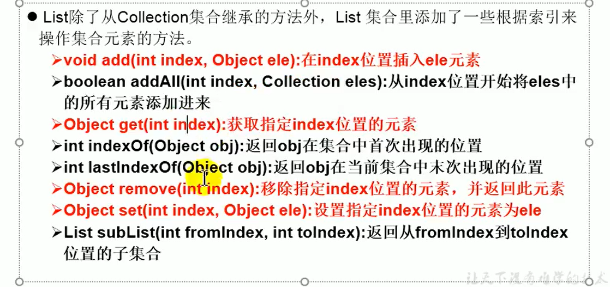

### 11.2.3 Set


无序性（并非随机）：不是指添加元素时的顺序而是指存储的数据并非以索引的顺序依次添加，而是根据存储数据的hash值添加 

不可重复性：是根据equal（）和hashCode（）判断， 即在新元素和旧元素hash值相同的情况下，当新元素.equal（旧元素）返回值为false才可以添加

|          | HashSet           | LinkedHashSet                                             | TreeSet                                                      |
| -------- | ----------------- | --------------------------------------------------------- | ------------------------------------------------------------ |
| 线程安全 | 不安全            | 不安全                                                    |                                                              |
| 底层结构 | HashMap<>         | HashMap<>，维护了两个引用，记录前一个数据和后一个数据     | 红黑树结构（自平衡的排序二叉树）                             |
| 特点     | 可以存 储 null 值 | 可以存 储 null 值，频繁遍历效率高，能够按照添加的顺序遍历 | TreeSet自动进行排序，排序的⽅式有⾃然排序和定制排 序。<br />定义元素是否相同的标准不再是equals（）的返回值；<br />而是comparaTo（）或者compare（）是否返回了0 |

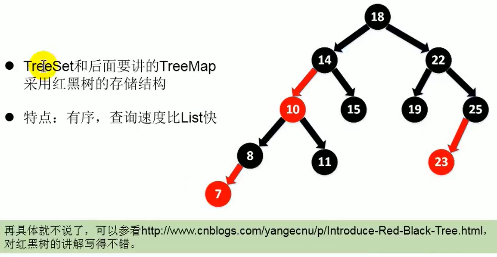

**Set添加元素的过程**

以HashSet为例

我们向HashSet中添加元素a首先调用元素a所在类`hashCode()`方法，计算元素a的哈希值,也称为散列码(int 整数) 

此哈希值接若通过某种算法计算出在HashSet底层数组中的存放位置（即为：素引位置）

> 该算法可以是扰动函数hash方法得到hash和取模运算(n-1)&hash   
>
> 使⽤ hash ⽅法也就是扰动函数是为了防⽌⼀ 些实现⽐较差的 hashCode() ⽅法 换句话说使⽤扰动函数之后可以减少碰撞

判断数组此位置上是已经有元素  

* 如果此位置上没有其他元素，则元素和添加成功。
* 如果此位置上有其他元素b(或以链表形式存在的多个元素)，则比较元素a和与元素b的hash值：
  * 如果hash值不相同，则元素a添加成功。
  * 如果hash值相同，进而需调用元素和所在类的equlas()方法：
    * equals()返回true,元素和添加失败
    * equals()返回false,则元素a添加成功，

> 这样我们就⼤⼤减少了 equals 的次数，相应就⼤⼤提⾼了执⾏速度。


> 为什么重写 equals 时必须重写 hashCode ⽅法？
>
> 由于Object 的 hashcode ⽅法 是本地⽅法，也就是⽤ c 语⾔或 c++ 实现的，默认⾏为是对堆上的对象产⽣独特值。如果没有重写 hashCode() ，则两个对象即使内容相同，生成的哈希值也不同，此时都会被添加进HashSet，导致元素重复。

> 为什么两个对象有相同的 hashcode 值，它们也不⼀定是相等的？
>
> 因为 hashCode() 所使⽤的杂凑算法也许刚好会让多个对象传回相同的杂凑值。越糟糕的杂凑算 法越容易碰撞，但这也与数据值域分布的特性有关（所谓碰撞也就是指的是不同的对象得到相同 的 hashCode）。
>
> 但是原则上：两个对象equals比较返回true，hashcode（）也返回true

## 11.3 Map

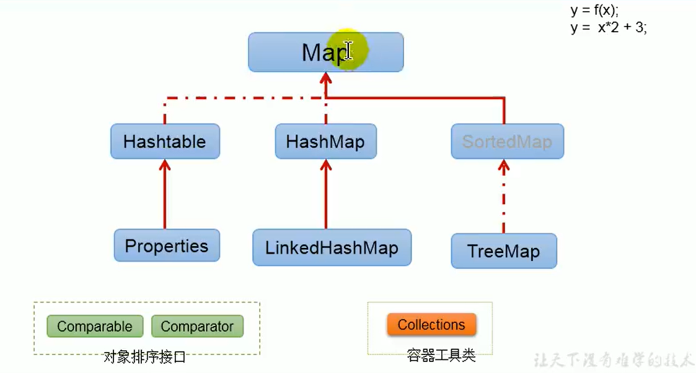

|                                  | Hashtable                             | HashMap                                                      | LinkedHashMap                           |
| -------------------------------- | ------------------------------------- | ------------------------------------------------------------ | --------------------------------------- |
| 底层结构                         | 数组+链表<br />数组+链表+红⿊树       | 数组+链表<br />数组+链表+红⿊树                              | 数组+双向链表<br />数组+双向链表+红⿊树 |
| 线程安全                         | 是                                    | 否                                                           |                                         |
| 效率                             | 低                                    | 高                                                           |                                         |
| 对 Null key 和 Null value 的⽀持 | 不允许有 null 键和 null 值            | null 作为 键只能有⼀个，null 作为值可以有多个                |                                         |
| 初始容量                         | 11                                    | 16 (既定容量时 2 的幂次⽅⼤⼩)                               |                                         |
| 扩充容量                         | 2n+1                                  | 2n                                                           |                                         |
| 底层数据结构                     | 当链表⻓度 ⼤于阈值，链表转换成红⿊树 | 当链表⻓度 ⼤于阈值，链表转换成红⿊树前会判断，如果当前数组的⻓度⼩于 64先进⾏数组扩容 |                                         |

**HashMap 和 HashSet区别**

HashSet 底层就是基于 HashMap 实现的。 （ HashSet 的源码⾮常⾮常少，因为除了 clone() 、 writeObject() 、 readObject() 是 HashSet ⾃⼰不得不实现之外，其他⽅法都是直接调⽤ HashMap 中的⽅法。

HashMap 使⽤键 （Key）计算 hashcode

HashSet 使⽤成员对象来计算 hashcode 值，对于两个对象来说 hashcode 可能相同，所以 equals() ⽅法⽤来判断对象的相等性

**HashMap的底层实现**

数组和链表 结合在⼀起使⽤也就是 链表散列。HashMap 通过 key 的 **hashCode** 经过**扰动函数**处理过后得到 **hash 值**，然后通过 **(n - 1) & hash** 判断当前元素 存放的位置（这⾥的 n 指的是数组的⻓度），如果当前位置存在元素的话，就判断该元素与要存 ⼊的元素的 hash 值以及 key 是否相同，如果相同的话，直接覆盖，不相同就通过拉链法解决冲突

> 所谓扰动函数指的就是 HashMap 的 hash ⽅法。使⽤ hash ⽅法也就是扰动函数是为了防⽌⼀ 些实现⽐较差的 hashCode() ⽅法 换句话说使⽤扰动函数之后可以减少碰撞。

> 所谓 “拉链法” 就是：将链表和数组相结合。也就是说创建⼀个链表数组，数组中每⼀格就是⼀ 个链表。若遇到哈希冲突，则将冲突的值加到链表中即可。

**ConcurrentHashMap**

多线程下使⽤ HashMap 还是会存在其 他问题⽐如数据丢失。并发环境下推荐使⽤ ConcurrentHashMap 。

|                  | ConcurrentHashMap                                            | Hashtable                                            |
| ---------------- | ------------------------------------------------------------ | ---------------------------------------------------- |
| 底层数据结构     | jdk1.7分段的数组+链表<br />jdk1.8Node 数组+链表+红⿊树       | 数组+链表<br />数组+链表+红⿊树                      |
| 如何实现线程安全 | jdk1.7对整个桶数组进⾏了分割分段，每⼀把锁只锁容器其中⼀部分数据<br />jdk1.8并发 控制使⽤ synchronized 和 CAS 来操作。 | 全表锁使⽤ synchronized 来保证线程安全，效率⾮常低下 |

jdk 1.7 

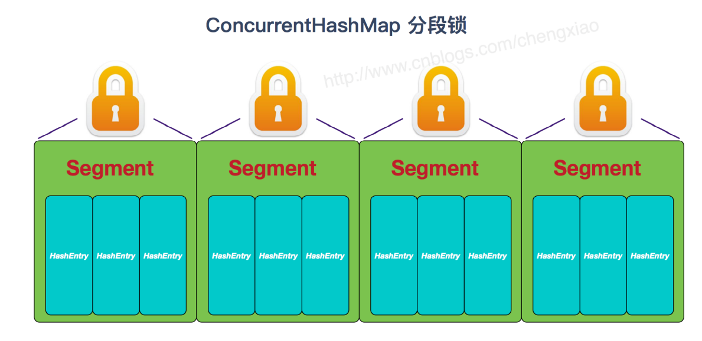

jdk 1.8

采⽤ CAS 和 synchronized 来保证并发安全。数 据结构跟 HashMap1.8 的结构类似，数组+链表/红⿊⼆叉树。Java 8 在链表⻓度超过⼀定阈值 （8）时将链表（寻址时间复杂度为 O(N)）转换为红⿊树（寻址时间复杂度为 O(log(N))） synchronized 只锁定当前链表或红⿊⼆叉树的⾸节点，这样只要 hash 不冲突，就不会产⽣并 发，效率⼜提升 N 倍。

## 11.4 选用集合

主要根据集合的特点来选⽤，

需要根据键值获取到元素值时就选⽤ Map 接⼝下的集 合，需要排序时选择 TreeMap ,不需要排序时就选择 HashMap ,需要保证线程安全就选⽤ ConcurrentHashMap 。

需要存放元素值时，就选择实现 Collection 接⼝的集合，需要保证元素唯⼀时选择实现 Set 接⼝的集合⽐如 TreeSet 或 HashSet ，不需要就选择实现 List 接⼝的⽐如 ArrayList 或 LinkedList ，然后再根据实现这些接⼝的集合的特点来选⽤。
