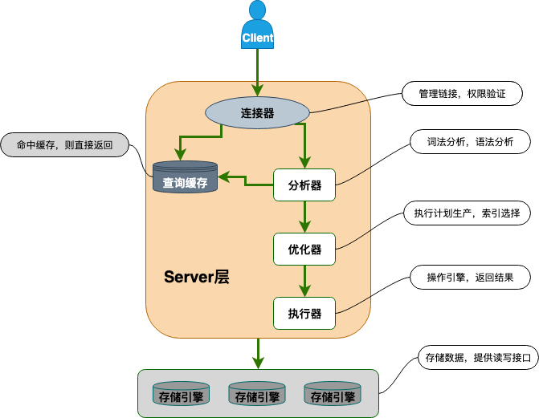

## MySQL的基础架构

MySQL 逻辑架构主要分为网络连接层、 Server 层、存储引擎层和系统文件层。



### 网络连接层

所包含的服务并不是MySQL独有的，大多数基于网络的客户端/服务器工具或服务器都有类似的服务，包括连接处理、身份验证、确保安全性的权限等。

**客户端连接器**

提供与MySQL服务器建立的支持，如命令行客户端、图形化工具、JDBC、ODBC、Native C API。

### 服务层

大多数MySQL的核心功能都在这一层，包括查询解析、分析、优化、以及所有的内置函数（例如，日期、时间、数学和加密函数），所有跨存储引擎的功能也都在这一层实现：存储过程、触发器、视图等。

**连接器**

连接器主要和身份认证和权限相关的功能相关。客户端与Server端的连接采用的是TCP协议，经过TCP握手，建立连接之后，连接器开始进行身份验证，连接器在用户登录数据库时校验账户密码，登陆后从权限表中查询该用户的所有权限等

**查询缓存**

执行查询语句的时候，会先查询缓存，被认为诟病的瓶颈，因为查询缓存失效在实际业务场景中可能会非常频繁。MySQL 5.7.2标识弃用，8.0版本中被完全移除。

**分析器**

分析器通常包括**语法解析器和预处理器**

MySQL 没有命中缓存，那么就会进入分析器，创建内部数据结构（解析树），发现SQL语句中的错误，然后对其进行各种优化，包括重写查询、决定表的读取顺序，以及选择合适的索引等。

1.   词法解析：语法解析器将输入的SQL字符串分解成一系列的词法单元（tokens），例如关键字、标识符、运算符等。     
2.   语法解析：语法解析器根据MySQL的语法规则，将这些词法单元组织成一个解析树。     
3.   预处理：预处理器检查解析树中的元素是否在数据库中有对应的实体，并验证操作的合法性。     

**优化器**

直到优化器服务层依旧不关心表使用的是什么存储引擎，但是优化器会向存储引擎询问它的一些功能、某个具体操作的成本，以及表数据的统计信息，为查询寻找优化的执行方案。执行计划（Explain）就是优化器生成的。

优化器主要有两个作用：**逻辑优化**和**物理优化**。

**执行器**

当选择了执行方案后，MySQL 就准备开始执行了，首先执行前会校验该用户有没有权限，如果没有权限，就会返回错误信息，如果有权限，就会去调用引擎的接口，返回接口执行的结果。

### 存储引擎层

存储引擎负责MySQL中数据的存储和提取。服务器通过存储引擎API进行通信。

* 存储引擎：存储引擎不会去解析SQL，而只是简单地响应服务器的请求。MySQL存储引擎是插件式的，每种存储引擎都有其优势和劣势，MySQL5.5之前默认的是MyISAM，之后默认的是InnoDB。

### 系统文件层

负责将数据库的数据和日志存储在文件系统之上，并完成与存储引擎的交互，是文件的物理存储层。

- 日志文件

  - 错误日志 error log


  - 通用查询日志 general query log

  - 二进制日志 bin log
    记录数据修改的变更操作，用于数据恢复、主从复制
  - 重做日志 redo log
  - 回滚日志 undo log

  - 慢查询日志 slow query log
    记录耗时较久的查询语句


- 配置文件
  用于存放MySQL所有的配置信息文件，比如my.cnf、my.ini等
- 数据文件
  - db.opt 文件
    记录这个库的默认使用的字符集和校验规则。
  - frm 文件
    存储与表相关的元数据（meta）信息，包括表结构的定义信息等，每一张表都会有一个frm 文件。
  - MYD 文件
    存放 MyISAM 表的数据（data)，每张表都有一个
  - MYI 文件
    存放 MyISAM 表的索引相关信息，每张表都有一个
  - ibd文件和 IBDATA 文件
    存放 InnoDB 的数据文件（包括索引）
  - pid 文件
  - socket文件
    用户在 Unix/Linux 环境下客户端连接可以不通过TCP/IP 网络而直接使用 Unix Socket 来连接 MySQL

## SQL语句的执行过程

### 查询语句

在MySQL服务器拿到查询请求之前，连接器已经为用户进行身份认证并获取其权限。

接着客户端发送如下查询请求。

```sql
select * from tb_student  A where A.age='18' and A.name=' 张三 ';
```

1. 在 MySQL8.0 版本以前，会先查询缓存，以这条 SQL 语句为 key 在内存中查询是否有结果，如果有直接缓存，如果没有，执行下一步。
2. MySQL服务器程序首先需要对这个字符串做分析，判断请求的语法是否正确，然后从字符串中将要查询的表、列和各种查询条件都提取出来，本质上是对一个SQL语句编译的过程，涉及**词法解析、语法分析、预处理器**等。
   1. 分析器进行词法分析，提取 SQL 语句的关键元素，分割为一个个token，并生成一棵对应的“解析树”。
   2. 分析器进行语法分析，判断这个 SQL 语句是否有语法错误，比如关键词是否正确、关键字顺序是否正确等等。
   3. 分析器（预处理器）会进一步检查“解析树”，检查语句中的实体（如表、列）是否在数据库中存在，然后还会检查用户对实体是否有操作权限。

3. 解析树被认为是合法后，优化器会将其转化成执行计划，优化器的作用就是找到这其中最好的执行方案。MySQL使用基于成本的优化器（CBO），它将尝试预测一个查询使用某种执行计划时的成本，并选择其中成本最小的一个。
   * 逻辑优化：直接对解析树进行分析，通过一些简单的代数变换对SQL语句进行等价变换。逻辑优化属于语法层级上的静态优化，不依赖于语句中特别的数值，可以看作是一种“编译时优化”。
   * 物理优化：和查询的上下文有关，需要在每次查询的时候都重新评估，因此需要获取存储引擎中提供的统计信息来评估成本，具有动态的性质，可以看作是一种“运行时优化”，物理优化很好的体现了 CBO 的哲学。

```sql
# 查看上一次查询的成本
show status like 'Last_query_cost';
```

> 基于成本的优化器（CBO），通过计算不同执行计划的预估成本（Cost），并选择成本最低的计划。
>
> 基于规则的优化器（RBO），是预先在优化器里嵌入规则（经验或被证明已经是有效的方式），判断SQL语句符合哪种规则就按照对应的规则来制定执行计划。
>
> 现代数据库（包括MySQL）的优化器都是基于成本的优化器（Cost-Based Optimizer, CBO）。

5. 进行权限校验，如果没有权限就会返回错误信息，如果有权限就会调用数据库引擎接口，返回引擎的执行结果。

### 更新语句

在MySQL服务器拿到查询请求之前，连接器已经为用户进行身份认证并获取其权限。

接着客户端发送如下更新请求。

```sql
update tb_student A set A.age='19' where A.name=' 张三 ';
```

以下结合了MySQL事务机制、复制机制和备份恢复机制一起讲解

1. 不会走查询缓存，因为查询缓存的设计规则就是只服务于查询类语句。
2. 开启事务，把 age 改为 19，然后调用引擎 API 接口，写入这一行数据，InnoDB 引擎把数据保存在内存中，同时记录 redo log，此时 redo log 进入 prepare 状态，然后告诉执行器，执行完成了，随时可以提交。
3. 执行器收到通知后记录 binlog，然后清空该表的查询缓存。此时清空能保证后续的 SELECT 不会读到旧缓存 —— 因为事务马上就要最终提交，数据即将变成最新状态，缓存失效的时机刚好匹配数据的实际更新。
4. 执行器调用引擎接口 ，提交 redo log 为 commit 状态。
5. 更新完成

> binlog 是复制机制的日志文件，复制解决的基本问题是让一台服务器的数据与其他服务器保持同步，任何数据修改和数据结构变更的事件都会被写入binlog 中，副本服务器从源服务器上的日志文件中读取这些事件并在本地重放执行，从而保证了 MySQL 集群架构的数据一致性。
>
> redo log 是 InnoDB 独有的崩溃安全机制 XtraBackup 的重做日志。XtraBackup 使得InnoDB 引擎拥有其他引擎没有的 crash-safe 的能力（即使数据库发生异常重启，之前提交的记录几乎不会丢失的崩溃恢复能力)。
>
> 由于 binlog 和 redo log 的写入时机不一样，redo log 在存储引擎层中事务中途不断写入，而binlog 在事务提交后回到服务层才写入，在这两个写入时间节点之间发生异常重启将会导致集群数据的不一致。因此 redo log 引入了 `prepare` 和 `commit` 两阶段提交，如果 redo log 只是 prepare 状态，这个时候就会去判断 binlog 是否完整，如果完整就提交 redo log, 不完整就回滚事务。

## MySQL并发控制

无论何时，只要有多个查询需要同时修改数据，就会产生并发问题。

### 并发控制思想

并发控制一般有两种思想指导，就是常提到的“悲观锁”和"乐观锁"，但都不是一种实际的锁，而是并发控制的思想：

**悲观并发控制（Pessimistic Concurrency Control）**

悲观并发控制对于数据被修改持悲观的态度，认为数据被外界访问时，必然会产生冲突，所以在数据处理的过程中都采用加锁的方式来保证对资源的独占。

数据库应用：

* 数据库的锁机制其实都是基于悲观并发控制的观点进行实现的，而且按照实际使用情况，数据库的锁又可以分为许多种类。

* 使用锁机制阻止一个事务以影响其他用户的方式来修改数据。如果一个事务执行的操作读某行数据应用了锁，那只有当这个事务把锁释放，其他事务才能够执行与该锁冲突的操作。

优点：保守策略保证了数据获取和修改都是有序进行的。

缺点：可能面临锁冲突甚至死锁的问题；悲观并发控制增加了系统的额外开销，减低系统效率，降低系统并行性。

**乐观并发控制（Optimistic Concurrency Control）**

乐观并发控制对数据修改持乐观态度，认为即使在并发环境中，外界对数据的操作一般是不会造成冲突，所以并不会去加锁，而是在提交数据更新之前，每个事务会先检查在该事务读取数据后，有没有其他事务又修改了该数据，如果有则返回冲突信息，选择重试或回滚。乐观锁没有用到实际的锁，但是能产生加锁的效果。最常见的实现算法——CAS（比较与交换，Compare and swap）。

数据库应用：MySQL 本身没有内置像悲观锁（`SELECT ... FOR UPDATE`）那样的乐观锁机制。但开发者可以通过在应用层面利用一些特定的SQL技巧，非常方便地实现乐观锁的并发控制逻辑。

优点：没有用到锁，不会出现死锁问题，适用于读多写少的并发场景。

缺点：写多读少的并发场景下会出现很多的写冲突，因为数据写入要多次等待重试，导致开销上升；业务逻辑实现更为复杂；且无法避免第三方绕过系统逻辑对数据库进行修改；若数据库自行实现乐观锁，大量写冲突可能导致事务的连续多次失败。

**多版本并发控制（Multiversion concurrency control）**

定义：简称 MVCC。前两种并发控制思想都是为了解决**写冲突**，实现事务的可串行化，两者区别在于对写冲突的乐观程度不同。而MVCC的核心目的是为了在保证数据一致性和一定隔离级别的前提下，在锁机制以外高效地处理**读写冲突**，从而大幅提升数据库的并发性能。MVCC是通过在每个数据行上维护多个版本的数据**快照**来实现的。

数据库应用：

* MVCC是数据库管理系统常用的一种并发控制，也用于程序设计语言实现事务内存。
* 数据库的悲观锁基于提升并发性能的考虑，一般都同时实现了多版本并发控制。
* MVCC工作没有统一的标准，存储引擎各自的实现机制不尽相同，基本原理是当一个事务要对数据库中的数据进行修改时，MVCC 会为该事务创建一个数据快照。

优点：读写不冲突；减少死锁；并发极大提升；

### 锁的模式

处理并发读/写访问的系统通常实现一个由两种锁类型组成的锁系统。这两种锁通常被称为共享锁（Shared Lock）和排他锁（Exclusive Lock），也叫读锁（Read Lock）和写锁（Write Lock）。

共享锁（S锁）：资源上的是共享的，或者说是相互不阻塞的。多个客户端可以同时读取同一个资源而互不干扰。

排他锁（X锁）：允许获取排它锁的事务读取和更新数据，阻止其他事务取得相同的数据集共享读锁和排它写锁，直到数据的排他锁被释放。

### 锁的粒度

大多数商业数据库系统没有提供太多的选择，一般都是在表中施加行级锁（row level lock），为了在锁比较多的情况下尽可能地提供更好的性能，锁的实现方式非常复杂。

而MySQL则提供了多种选择。每种MySQL存储引擎都可以实现自己的锁策略和锁粒度。

* 表级锁（Table Lock）：MySQL中最基本也是开销最小的锁策略。直接给整个表添加锁。
  * 锁定粒度大，锁冲突率高，并发度低。
  * 开销小，加锁快；
  * 不会出现死锁；
* 行级锁（Row Lock）：行级锁是在存储引擎而不是服务器中实现的。给指定的行添加锁。
  * 锁定粒度小，锁冲突率低，并发度高。
  * 开销大；加锁慢；
  * 会出现死锁
* 页级锁（Page Lock）：页级锁的颗粒度介于行级锁与表级锁之间。页级锁主要应用于 BDB 存储引擎。

**意向锁（Intent Lock）**

在InnoDB中，意向锁提供了多重粒度锁定的支持，它允许行锁和表锁并存。如果需要用到表锁的话，一行一行遍历记录是否有行锁肯定是不行，性能太差。

意向锁是一种特殊的表级锁，表示事务接下来要获取什么级别的锁，包括意向共享锁（IS锁）和意向排他锁（IX锁）。事务获取某些记录的S锁就要先获取该表的IS锁，获取某些记录的X锁就要先获取该表的IX锁，用于帮助其他事务快速判断表里是否有行锁，以便了解是否需要等待。

## 数据库事务

### 含义

事务就是一组SQL语句，作为一个工作单元以原子方式进行处理，如果其中有任何一条语句因为崩溃或其他原因无法执行，那么整组语句都不执行。也就是说，作为事务的一组SQL语句，要么全部执行成功，要么全部执行失败。

### 经典例子：银行转账

```
1. 确保支票账户的余额高于200美元。
2. 从支票账户的余额中减去200美元。
3. 在储蓄账户的余额中增加200美元。
以上三步操作必须打包在一个事务中，某一步失败，可能会出现不符合银行的预期，必须回滚至原始状态。
```

### 特点

要成为事务，必须通过通过严格的ACID测试。ACID代表原子性（atomicity）、一致性（consistency）、隔离性（isolation）和持久性（durability），就是事务的四大特性。

* 原子性：要么都执行，要么都回滚
* 一致性：保证数据的状态操作前和操作后保持一致
* 隔离性：多个事务同时操作相同数据库的同一个数据时，一个事务的执行不受另外一个事务的干扰
* 持久性：一个事务一旦提交，则数据将持久化到本地，除非其他事务对其进行修改

> 商业数据库为了并发性，都对隔离性区分了隔离级别（isolation level），因此数据库的事务具有隔离性是“通常来说”。
>
> 持久性也存在着级别之分，一般不会有100%的永久保障，通常依赖于强大的持久性策略和备份恢复机制。

### 事务的分类

在`set autocommit = 1;` 的情况下，事务分为隐式事务和显式事务

隐式事务，没有明显的开启和结束事务的标志。单个语句被隐式包装在一个事务执行后立即提交。

```sql
# 比如insert、update、delete语句本身就是一个事务
```


显式事务，具有明显的开启和结束事务的标志

```sql
start transaction; # 必须
##
# 编写事务的一组逻辑操作单元（多条sql语句） insert、update、delete
##
commit;  或 rollback;
```

```sql
begin 或 start transaction; # 必须
savepoint `s0`; 
##
# 编写事务的一组逻辑操作单元（多条sql语句） insert、update、delete
##
savepoint `s1`; 
##
# 编写事务的一组逻辑操作单元（多条sql语句） insert、update、delete
##
ROLLBACK TO SAVEPOINT s1; 
COMMIT;

或 

COMMIT TO  SAVEPOINT s1
```

在`set autocommit = 0;`的情况下， 事务都是显式的，此时开启事务的标志不是必须的，但是必须要有结束事务的标志。

### 事务的并发问题

当多个事务同时操作同一个数据库的相同数据时会发生的问题

* 脏读：读取未提交的数据
* 不可重复读：同一事务中两次执行相同查询语句，另外一个事务提交了修改，可能会看到不同的数据结果。
* 幻读：一个事务读取某个范围内的记录时，另外一个事务又在该范围内插入了新的记录，该事务重新读取时，会产生幻行。

并发控制产生的问题：

* 死锁：死锁是指两个或多个事务相互持有和请求相同资源上的锁，产生了循环依赖。可能是因为真正的数据冲突，也有可能是因为存储引擎的实现方式。
  * 解决1：检测到循环依赖后会立即返回一个错误信息并将持有最少行级排他锁的事务回滚。（InnoDB的处理方式）
  * 解决2：超过锁等待超时的时间限制后直接终止查询。（不太好）

### 事务的隔离级别

ANSI SQL标准定义了4种隔离级别。较低的隔离级别通常允许更高的并发性，开销更低，但是会产生较多并发问题。

| 级别                         | 定义                                                         | 利弊                                                         |
| ---------------------------- | ------------------------------------------------------------ | ------------------------------------------------------------ |
| Read Uncommitted（读未提交） | 在事务中可以查看其他事务中还没有提交的修改                   | 会导致脏读、不可重复读和幻读等问题                           |
| Read Committed（读已提交）   | 允许读取并发事务已经提交的数据。符合隔离性的简单定义，是大多数数据库系统的默认隔离级别 | 可以阻止脏读问题，但是不可重复读和幻读仍有可能发生。         |
| Repeatable Read（可重复读）  | 事务内对同一字段的多次读取结果都是一致的。是MySQL InnoDB 存储引擎的默认隔离级别。 | 可以阻止脏读和不可重复读问题。InnoDB 在此级别下通过 MVCC（多版本并发控制） 和 Next-Key Locks（间隙锁+行锁） 机制，在很大程度上解决了幻读问题。不过在写密集型且并发冲突较高的场景下，RR 的间隙锁机制可能会比 RC 带来更多的锁等待。 |
| Serializable（可串行化）     | 强制事务按序执行，不同事务之间不可能产生冲突。最高的隔离级别，完全服从 ACID 的隔离级别。 | 可以阻止脏读、不可重复读和幻读问题。为每个读的数据行上锁，会导致大量的超时和锁竞争，实际应用中很少用。但在使用分布式事务时，InnoDB 存储引擎的事务隔离级别必须设置为 SERIALIZABLE。 |

设置隔离级别：

```sql
set session|global  transaction isolation level 隔离级别名;
```

查看隔离级别：

```sql
# MySQL 8.0 之前
SELECT @@tx_isolation;
# MySQL 8.0 之后
SELECT @@transaction_isolation;
```

### InnoDB 的 Repeatable Read 对幻读处理

标准的 SQL 隔离级别定义里，REPEATABLE READ 是无法防止幻读的。但 InnoDB 的实现通过以下两种读机制很大程度上避免了幻读：

**快照读 (Snapshot Read)**：普通的 SELECT 语句，通过 **MVCC** 机制实现。事务启动时创建一个数据快照，后续的快照读都读取这个版本的数据，从而避免了看到其他事务新插入的行（幻读）或修改的行（不可重复读）。如果是 READ COMMITTED 则事务中的每次查询都生成新的Read View。

**当前读 (Current Read)**：也称为锁定读，像 `SELECT ... FOR UPDATE`, `SELECT ... LOCK IN SHARE MODE`, `INSERT`, `UPDATE`, `DELETE` 这些操作。InnoDB 使用 Next-Key Lock 来锁定扫描到的索引记录及其间的范围（间隙），防止其他事务在这个范围内插入新的记录，从而避免幻读。Next-Key Lock 是行锁（Record Lock）和间隙锁（Gap Lock）的组合。

### Undo Log

undo log 属于逻辑日志，记录的是执行后的 SQL 语句的反操作语句。

所有Undo日志写入也都会写入Redo日志，因为Undo日志写入是服务器崩溃恢复过程的一部分。

**功能**

提供数据回滚-原子性：每一个事务对数据的修改都会被记录到 undo log ，当事务回滚时或者数据库崩溃时，MySQL 可以利用 undo log 将数据恢复到事务开始之前的状态。

多版本并发控制(MVCC)-隔离性：当用户读取一行记录时，若该记录已经被其他事务占用，当前事务可以通过Undo Log读取之前的行版本信息，以此实现非锁定读取。

## MVCC（多版本并发控制）

### 定义

[并发控制思想 - MVCC](#并发控制思想)

### 实现


## 存储引擎

## 参考文献

- [1] [JavaGuide（Java 面试 & 后端通用面试指南） | JavaGuide](https://javaguide.cn/)
- [2] 《高性能MySQL（第4版）》

