[TOC]

# 1 简介

## 1.1 什么是Mybatis

* MyBatis是一款优秀的**持久层**框架。
* 它支持定制化sqL、存储过程以及高级映射。 
* MyBatis避免了几乎所有的JDBC代码和手动设置参数以及获取结果集。 
* My Batis可以使用简单的XML或注解来配置和映射原生类型、接口和Java的POJO( Plain Old Java Objects,普通老式Java对象)为数据库中的记录。
* apache --> google --> Github

如何获得Mybatis？

* Maven：

```xml
<dependency>
    <groupId>org.mybatis</groupId>
    <artifactId>mybatis</artifactId>
    <version>3.4.6</version>
</dependency>

```


* Github：[GitHub - mybatis/mybatis-3: MyBatis SQL mapper framework for Java](https://github.com/mybatis/mybatis-3)
* 中文注释：[GitHub - tuguangquan/mybatis: mybatis源码中文注释](https://github.com/tuguangquan/mybatis)

## 1.2 持久化 

数据持久化

* 持久化就是将程序的数据在持久状态何瞬时状态转化的过程
* 内存：**断电即失**
* 数据库（jdbc）、io文件持久化

**为什么需要持久化**

* 内存贵
* 有些对象要长期存储

## 1.3 持久层

Dao层、Service层、Controller层...

* 完成持久化工作的代码块
* 层界限十分明显

## 1.4为什么需要Mybatis?

* 将数据存入数据库
* 方便
* 传统的JDBC代码太复杂。简化
* 不用也可以。但是容易上手
* 优点
  * 灵活
  * 简单易学
  * sql和代码分离，提高维护性
  * 提供映射标签，支持对象与数据库的orm字段关系映射
  * 提供对象关系映射标签，支持对象关系组件维护
  * 提供xml标签，支持编写动态sql


# 2 第一个Mybatis程序

## 2.1 搭建环境

数据库

```sql
DROP DATABASE IF EXISTS mybatis;
CREATE DATABASE IF NOT EXISTS `mybatis`;

USE mybatis;

DROP TABLE IF EXISTS `user`;
CREATE TABLE IF NOT EXISTS `user`(
	`id` INT(20) PRIMARY KEY,
	`name` VARCHAR(30) DEFAULT NULL,
	`pwd` VARCHAR(30) DEFAULT NULL
)ENGINE=INNODB DEFAULT CHARSET=utf8;

INSERT INTO `user` (id,`name`,pwd) VALUES (1,'tintin','123456');
INSERT INTO `user` (id,`NAME`,pwd) VALUES (2,'丁丁','123456');
INSERT INTO `user` (id,`NAME`,pwd) VALUES (3,'刘烨','123456');

```

新建项目导入依赖

```xml
    <!--导入依赖-->
    <dependencies>
        <!--mysql驱动-->
        <dependency>
            <groupId>mysql</groupId>
            <artifactId>mysql-connector-java</artifactId>
            <version>5.1.47</version>
        </dependency>
        <!--mybatis-->
        <dependency>
            <groupId>org.mybatis</groupId>
            <artifactId>mybatis</artifactId>
            <version>3.5.2</version>
        </dependency>
        <!--junit-->
        <dependency>
            <groupId>junit</groupId>
            <artifactId>junit</artifactId>
            <version>4.12</version>
            <scope>test</scope>
        </dependency>
    </dependencies>
```

## 2.2 创建模块

### mybatis-xml配置文件

```xml
<?xml version="1.0" encoding="UTF-8" ?>
<!DOCTYPE configuration
        PUBLIC "-//mybatis.org//DTD Config 3.0//EN"
        "http://mybatis.org/dtd/mybatis-3-config.dtd">
<configuration>
    <environments default="development">
        <environment id="development">
            <transactionManager type="JDBC"/>
            <dataSource type="POOLED">
                <property name="driver" value="com.mysql.jdbc.Driver"/>
                <property name="url" value="jdbc:mysql://localhost:3306/mybatis?useSSL=true&amp;useUnicode=true&amp;characterEncoding=UTF-8&amp;serverTimezone=GMT"/>
                <property name="username" value="root"/>
                <property name="password" value="tintin"/>
            </dataSource>
        </environment>
    </environments>
    <mappers>
        <mapper resource="org/mybatis/example/BlogMapper.xml"/>
    </mappers>
</configuration>
```

### mybatis工具类

从 [XML](https://www.w3cschool.cn/xml/) 中构建 SqlSessionFactory

每个基于 MyBatis 的应用都是以一个 SqlSessionFactory 的实例为核心的。SqlSessionFactory 的实例可以通过 SqlSessionFactoryBuilder 获得。而 SqlSessionFactoryBuilder 则可以从 XML 配置文件或一个预先配置的 Configuration 实例来构建出 SqlSessionFactory 实例。

从 XML 文件中构建 SqlSessionFactory 的实例非常简单，建议使用类路径下的资源文件进行配置。 但也可以使用任意的输入流（InputStream）实例，比如用文件路径字符串或 `file:// URL` 构造的输入流。**MyBatis 包含一个名叫 Resources 的工具类，它包含一些实用方法，使得从类路径或其它位置加载资源文件更加容易。**

从 SqlSessionFactory 中获取 SqlSession

既然有了 SqlSessionFactory，顾名思义，我们可以从中获得 SqlSession 的实例。SqlSession 提供了在数据库执行 [SQL 命令](https://www.w3cschool.cn/sql/4v3ajfoo.html)所需的所有方法。你可以通过 SqlSession 实例来直接执行已映射的 [SQL 语句](https://www.w3cschool.cn/sql/3cq6nfq1.html)。例如：

```java

public class MybatisUtils {
    private static SqlSessionFactory sqlSessionFactory;

    static {
        try {
            // 1 获取SqlSessionFactory对象
            String source = "mybatis-config.xml";
            InputStream inputStream = Resources.getResourceAsStream(source);
            sqlSessionFactory = new SqlSessionFactoryBuilder().build(inputStream);
        } catch (IOException e) {
            e.printStackTrace();
        }
    }

    // 2 获取SqlSession对象
    public static SqlSession getSqlSession() {
        SqlSession sqlSession = sqlSessionFactory.openSession();
        return sqlSession;
    }
}
```

## *2.3 编写代码

### 实体类

### DAO接口

###　*探究已映射的 SQL 语句(DAO接口实现类由Mapper 配置文件代替)

该配置文件放在com.tintin.dao中

```xml
<?xml version="1.0" encoding="UTF-8" ?>
<!DOCTYPE mapper
        PUBLIC "-//mybatis.org//DTD Mapper 3.0//EN"
        "http://mybatis.org/dtd/mybatis-3-mapper.dtd">

<!--namespace绑定一个对应的DAO/Mapper接口-->
<mapper namespace="com.tintin.dao.UserDAO">
    <!--查询语句-->
    <select id="getUserList" resultType="com.tintin.pojo.User">
        select * from user
    </select>
</mapper>
```

## 2.4 测试

```java
public class UserDAOTest extends TestCase {

    public void testGetUserList() {

        try (SqlSession sqlSession = MybatisUtils.getSqlSession()) {
            // 你的应用逻辑代码
            //方式一
            UserDAO mapper = sqlSession.getMapper(UserDAO.class);
            List<User> userList = mapper.getUserList();

            //方式二
//        List<User> userList = sqlSession.selectList("com.tintin.dao.UserDAO.getUserList");
            for (User user:
                    userList) {
                System.out.println(user);
            }
        }


    }
}
```

异常:

* org.apache.ibatis.binding.BindingException: Type interface com.tintin.dao.UserDAO is not known to the MapperRegistry.

  解决:在mybatis配置文件中注册mapper配置文件

  ```xml
      <!--每一个Mapper配置文件都需要在mybatis核心配置文件中注册-->
      <mappers>
          <mapper resource="com/tintin/dao/UserMappper.xml"/>
      </mappers>
  ```

* Cause: org.apache.ibatis.builder.BuilderException: Error parsing SQL Mapper Configuration. Cause: java.io.IOException: Could not find resource com/tintin/dao/UserMappper.xml

  解决:maven dom文件中配置资源路径 使mapper.xml能被导出

```xml
    <build>
        <resources>
            <resource>
                <directory>src/main/java</directory>
                <includes>
                    <include>**/*.properties</include>
                    <include>**/*.xml</include>
                </includes>
                <filtering>true</filtering>
            </resource>
        </resources>
    </build>
```

```xml
<?xml version="1.0" encoding="UTF8" ?> //mapper.xml 的头 encoding改为UTF8 防止中文注释出错

                <property name="url" value="jdbc:mysql://localhost:3306/mybatis?useSSL=false&amp;useUnicode=true&amp;characterEncoding=UTF-8&amp;serverTimezone=GMT"/>
//mysql 连接url的useSSL=false 
```

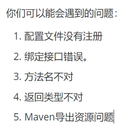

## 2.5 相关类

#### SqlSessionFactoryBuilder

这个类可以被实例化、使用和丢弃，一旦创建了 SqlSessionFactory，就不再需要它了。 因此 SqlSessionFactoryBuilder 实例的最佳作用域是方法作用域（也就是局部方法变量）。 你可以重用 SqlSessionFactoryBuilder 来创建多个 SqlSessionFactory 实例，但最好还是不要一直保留着它，以保证所有的 XML 解析资源可以被释放给更重要的事情。

#### SqlSessionFactory

SqlSessionFactory 一旦被创建就应该在应用的运行期间一直存在，没有任何理由丢弃它或重新创建另一个实例。 使用 SqlSessionFactory 的最佳实践是在应用运行期间不要重复创建多次，多次重建 SqlSessionFactory 被视为一种代码“坏习惯”。因此 SqlSessionFactory 的最佳作用域是应用作用域。 有很多方法可以做到，最简单的就是使用单例模式或者静态单例模式。

#### SqlSession

每个线程都应该有它自己的 SqlSession 实例。SqlSession 的实例不是线程安全的，因此是不能被共享的，所以它的最佳的作用域是请求或方法作用域。 绝对不能将 SqlSession 实例的引用放在一个类的静态域，甚至一个类的实例变量也不行。 也绝不能将 SqlSession 实例的引用放在任何类型的托管作用域中，比如 [Servlet 框架](https://www.w3cschool.cn/servlet/)中的 [HttpSession](https://www.w3cschool.cn/servlet/servlet-session-tracking.html)。 如果你现在正在使用一种 [Web 框架](https://www.w3cschool.cn/webservices/)，考虑将 SqlSession 放在一个和 [HTTP](https://www.w3cschool.cn/http/) 请求相似的作用域中。 换句话说，每次收到 [HTTP 请求](https://www.w3cschool.cn/http/yerxcfmt.html)，就可以打开一个 SqlSession，返回一个响应后，就关闭它。 这个关闭操作很重要，为了确保每次都能执行关闭操作，你应该把这个关闭操作放到 [finally ](https://www.w3cschool.cn/java/exception-finally.html)块中。 下面的示例就是一个确保 SqlSession 关闭的标准模式：

```
try (SqlSession session = sqlSessionFactory.openSession()) {
  // 你的应用逻辑代码
}
```

在所有代码中都遵循这种使用模式，可以保证所有数据库资源都能被正确地关闭。

# 3 CRUD

```java
public interface UserMapper {
    List<User> getUserList();

    User getUserById(int id);

    int addUser(User user);

    int updateUser(User user);

    int deleteUser(int id);
}
```


 ## 3.1 namespace

namespace的全类名与DAO/Mapper全类(接口)名一致

## 3.2 select

选择,查询语句;

* id:就是对应的 namespace中的方法名;
* resultType:Sq语句执行的返回值!
* parameter type:参数类型!

```xml
<select id="getUserList" resultType="com.tintin.pojo.User">
    select * from user
</select>
```

## 3.3 insert

```xml
<!--引用类型参数的属性可以直解获取-->
<insert id="addUser" parameterType="com.tintin.pojo.User">
    insert into user values (#{id}, #{name}, #{pwd})
</insert>
```

## 3.4 update

```xml
<update id="updateUser" parameterType="com.tintin.pojo.User">
    update user set name = #{name}, pwd = #{pwd} where id = #{id}
</update>
```

## 3.5 delete

```xml
<delete id="deleteUser" parameterType="int">
    delete from user where id = #{id}
</delete>
```

> 注意:
> 增删改需要提交事务」

## 3.6 通过map传参 更新少量字段

假设,我们的实体类,或者数据库中的表,字段或者参数过多,我们应当考虑使用Map!

```java
    int updateUser2(Map<String,Object> map);
```

```xml
    <update id="updateUser2" parameterType="map">
        update user set name = #{username} where id = #{userid}
    </update>
```

```java
    public void testUpdateUser2() {
        try(SqlSession sqlSession = MybatisUtils.getSqlSession()) {
            UserMapper mapper = sqlSession.getMapper(UserMapper.class);
            Map<String, Object> map = new HashMap<>();
            map.put("username", "GEM");
            map.put("userid", 4);
            int res = mapper.updateUser2(map);
            if (res > 0) {
                System.out.println("修改成功");
            }
            sqlSession.commit();
        }
    }
```

> Map传递参数,直接在sq中取出key即可!【 parameterType="map"】
> 对象传递参数,直接在sq中取对象的属性即可!【 parameterType=" Object"
> 只有一个基本类型参数的情况下,可以直接在sq中取到!【可以不写】
> 多个参数用Map【parameterType="map"】,或者注解!

## 3.7 模糊查询

```java
    User getUserLike(String value);
```

在sq拼接中使用通配符!

```xml
    <select id="getUserLike" resultType="com.tintin.pojo.User">
        select * from user where name like concat(concat('%',#{value}), '%')
    </select>
```

```java
    public void testGetUserLike() {
        try (SqlSession sqlSession = MybatisUtils.getSqlSession()) {
            // 你的应用逻辑代码
            UserMapper mapper = sqlSession.getMapper(UserMapper.class);
            User user = mapper.getUserLike("%刘%");

            System.out.println(user);
        }
    }
```

# 4 配置解析

## 4.1 核心配置文件

* mybatis-config.xml 
* 影响mybatis的属性和行为

- configuration（配置）
  - [properties（属性）](#4.3 属性（Properties）)
  - [settings（设置）](#4.4 设置（Settings）)
  - [typeAliases（类型别名）](#4.4 类型别名（Alias）)
  - [typeHandlers（类型处理器）](#4.5 其他配置)
  - [objectFactory（对象工厂）](#4.5 其他配置)
  - [plugins（插件）](#4.5 其他配置)
  - [environments（环境配置）](#4.2 环境配置（environments）)
    
    - environment（环境变量）
      - transactionManager（事务管理器）
      - dataSource（数据源）
    
    databaseIdProvider（数据库厂商标识）
  - [mappers（映射器）](#4.6 映射器)

## 4.2 环境配置（environments）

MyBatis 可以配置成适应多种环境，这种机制有助于将 SQL 映射应用于多种数据库之中， 现实情况下有多种理由需要这么做。例如，开发、测试和生产环境需要有不同的配置；或者想在具有相同 Schema 的多个生产数据库中使用相同的 SQL 映射。还有许多类似的使用场景。

**不过要记住：尽管可以配置多个环境，但每个 SqlSessionFactory 实例只能选择一种环境。**

为了指定创建哪种环境，只要将它作为可选的参数传递给 SqlSessionFactoryBuilder 即可。

```java
SqlSessionFactory factory = new SqlSessionFactoryBuilder().build(reader, environment);
SqlSessionFactory factory = new SqlSessionFactoryBuilder().build(reader, environment, properties);
```

如果忽略了环境参数，那么将会加载默认环境，如下所示：

```java
SqlSessionFactory factory = new SqlSessionFactoryBuilder().build(reader);
SqlSessionFactory factory = new SqlSessionFactoryBuilder().build(reader, properties);
```

environments 元素定义了如何配置环境。

```xml
<environments default="development">
        <environment id="development">
            <transactionManager type="JDBC"/>
            <dataSource type="POOLED">
                <property name="driver" value="com.mysql.jdbc.Driver"/>
                <property name="url" value="jdbc:mysql://localhost:3306/mybatis?useSSL=false&amp;useUnicode=true&amp;characterEncoding=UTF-8&amp;serverTimezone=GMT"/>
                <property name="username" value="root"/>
                <property name="password" value="tintin"/>
            </dataSource>
        </environment>
    </environments>
```

Mybadis的默认连接池JDBC，连接池POOLED

## 4.3 属性（Properties）

可以通过properties属性文件实现引用

属性是可外部配置且可动态替换的

配置文件db.properties

```properties
driver=com.mysql.jdbc.Driver
url=jdbc:mysql://localhost:3306/mybatis?useSSL=false&useUnicode=true&characterEncoding=UTF-8&serverTimezone=GMT
username=root
password=tintin
```

引入

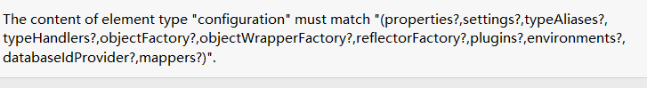

在xml中，标签规定了顺序

```xml
         <properties resource="db.properties"/>
			<environments default="development">
            <environment id="development">
                <transactionManager type="JDBC"/>
                <dataSource type="POOLED">
                    <property name="driver" value="${driver}"/>
                    <property name="url" value="${url}"/>
                    <property name="username" value="${username}"/>
                    <property name="password" value="${password}"/>
                </dataSource>
            </environment>
    		</environments>
```

优先读取properties内部顺序，随后读取外部属性文件的属性

## 4.4 类型别名（Alias）

类型别名是为Java类型设置一个短的名字。
存在的意义仅在于用来减少类完全限定名的冗余。

```xml
    <!--给实体类起别名-->
    <typeAliases>
        <typeAlias type="com.tintin.pojo.User" alias="User"/>
    </typeAliases>
```

也可以指定一个包名, MyBatis会在包名下面搜索需要的 Java Bean,比如
扫描实体类的包,它的默认别名就为这个类的类名,首字母小写!

```xml
    <!--给实体类起别名-->
    <typeAliases>
        <package name="com.tintin.pojo"/>
    </typeAliases>
```

```java
//实体类
@Alias("User")    
public class User {
```

下面是一些为常见的 Java 类型内建的类型别名。它们都是不区分大小写的，注意，为了应对原始类型的命名重复，采取了特殊的命名风格。

| 别名       | 映射的类型 |
| :--------- | :--------- |
| _byte      | byte       |
| _long      | long       |
| _short     | short      |
| _int       | int        |
| _integer   | int        |
| _double    | double     |
| _float     | float      |
| _boolean   | boolean    |
| string     | String     |
| byte       | Byte       |
| long       | Long       |
| short      | Short      |
| int        | Integer    |
| integer    | Integer    |
| double     | Double     |
| float      | Float      |
| boolean    | Boolean    |
| date       | Date       |
| decimal    | BigDecimal |
| bigdecimal | BigDecimal |
| object     | Object     |
| map        | Map        |
| hashmap    | HashMap    |
| list       | List       |
| arraylist  | ArrayList  |
| collection | Collection |
| iterator   | Iterator   |

## 4.4 设置（Settings）

| 设置名             | 描述                                                         | 有效值        | 默认值 |
| :----------------- | :----------------------------------------------------------- | :------------ | :----- |
| cacheEnabled       | 全局性地开启或关闭所有映射器配置文件中已配置的任何缓存。     | true \| false | true   |
| lazyLoadingEnabled | 延迟加载的全局开关。当开启时，所有关联对象都会延迟加载。 特定关联关系中可通过设置 `fetchType` 属性来覆盖该项的开关状态。 | true \| false | false  |

## 4.5 其他配置

 插件

 类型处理器（typeHandlers）

 对象工厂（objectFactory）

* mybatis-generator-core
*  mybatis-plus
* 通用 mapper

## 4.6 映射器

既然 MyBatis 的行为已经由上述元素配置完了，我们现在就要来定义 SQL 映射语句了。 但首先，我们需要告诉 MyBatis 到哪里去找到这些语句。 在自动查找资源方面，Java 并没有提供一个很好的解决方案，所以最好的办法是直接告诉 MyBatis 到哪里去找映射文件。 你可以使用相对于类路径的资源引用，或完全限定资源定位符（包括 `file:///` 形式的 URL），或类名和包名等。例如：

```xml
    <!-- 使用相对于类路径的资源引用 -->
    <mappers>
        <mapper resource="com/tintin/dao/UserMapper.xml"/>
    </mappers>
```

```xml
    <!-- 使用映射器接口实现类的完全限定类名 -->
    <mappers>
        <mapper class="com.tintin.dao.UserMapper"/>
    </mappers>
```

> 注意点
> 接口和他的 Mappe配置文件必须同名
> 接口和他的 Mapper配置文件必须在同一个包下!

```xml
    <!-- 将包内的映射器接口实现全部注册为映射器 -->
	<mappers>
<!--        <mapper resource="com/tintin/dao/UserMapper.xml"/>-->
        <package name="com.tintin.dao"/>
    </mappers>
```

## 4.7 作用域（Scope）和生命周期

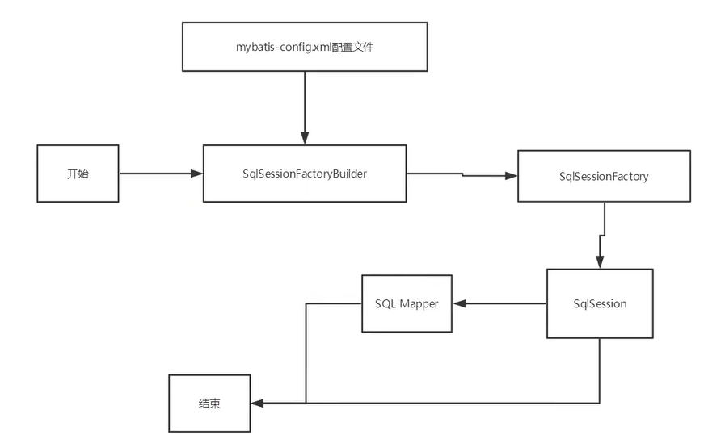

不同作用域和生命周期类别是至关重要的，因为错误的使用会导致非常严重的并发问题。

### SqlSessionFactoryBuilder

这个类可以被实例化、使用和丢弃，一旦创建了 SqlSessionFactory，就不再需要它了。

最佳作用域是方法作用域

### SqlSessionFactory

SqlSessionFactory 一旦被创建就应该在应用的运行期间一直存在

最佳作用域是应用作用域

最简单的就是使用单例模式或者静态单例模式。

### SqlSession

每个线程都应该有它自己的 SqlSession 实例。SqlSession 的实例不是线程安全的，因此是不能被共享的

最佳的作用域是请求或方法作用域

连接到连接池的一个请求

用完需关闭，否则资源被占用

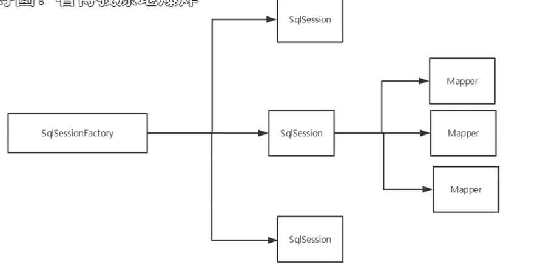

# 5 解决属性名和字段名不一致的问题

## 5.1 为字段名起别名

```xml
select id, name, pwd as password from user where id = #{id}
```

## 5.2 ResultMap

结果集映射

```
id name pwd
↓↓↓↓↓↓↓↓↓↓↓↓
id name password
```

```xml
    <!--结果集映射-->
    <resultMap id="userMap" type="User">
        <!-- column数据库中的字段,property实体类中的属性-->
<!--        <result property="id" column="id"/>-->
<!--        <result property="name" column="name"/>-->
        <result property="password" column="pwd"/>
    </resultMap>


    <!--查询语句-->
    <select id="getUserList" resultMap="userMap">
        select * from user
    </select>
```

* `resultMap` 元素是 MyBatis 中最重要最强大的元素。
* ResultMap 的设计思想是，对简单的语句做到零配置，对于复杂一点的语句，只需要描述语句之间的关系就行了。

> 主键用id标签封装 而非result 

# 6 日志


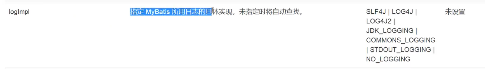

SLF4J | **LOG4J** | LOG4J2 | JDK_LOGGING | COMMONS_LOGGING | **STDOUT_LOGGING** （标准日志输出）| NO_LOGGING

你可以通过在 MyBatis 配置文件 mybatis-config.xml 里面添加一项 setting 来选择其它日志实现。

```xml
    <settings>
<!--        <setting name="logImpl" value="STDOUT_LOGGING"/>-->
        <setting name="logImpl" value="LOG4J"/>
    </settings>
```


## 6.1 STDOUT_LOGGING

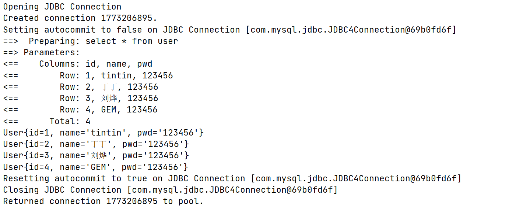

## 6.2 LOG4J

### 什么是log4j？

* Log4是Apache的一个开源项目,通过使用Log4,我们可以控制日志信息输送的目的地是控制台、文件GUI组件
* 我们也可以控制每一条日志的输出格式
* 通过定义每一条日志信息的级别,我们能够更加细致地控制日志的生成过程
* 通过一个配置文件来灵活地进行配置,而不需要修改应用的代码。

### 导入log4j包

```xml
    <dependencies>
        <dependency>
            <groupId>log4j</groupId>
            <artifactId>apache-log4j-extras</artifactId>
            <version>1.2.17</version>
        </dependency>
    </dependencies>
```

### log4j.properties

```properties
#将等级为DEBUG的日志信息输出到console和File这两个目的地,.console和iLe的定义在下面的代码
log4j.rootLogger=DEBUG,console,file
#控制台输出的相关设置
log4j.appender.console=org.apache.log4j.ConsoleAppender
log4j.appender.console.Target=System.out
log4j.appender.console.Threshold=DEBUG
log4j.appender.console.layout=org.apache.log4j.PatternLayout
log4j.appender.console.layout.ConversionPattern=[%c]-%m%n
#文件输出的相关设置
log4j.appender.file=org.apache.log4j.RollingFileAppender
log4j.appender.file.File=/log/tintin.log
log4j.appender.file.MaxFileSize=10mb
log4j.appender.file.Threshold=DEBUG
log4j.appender.file.layout=org.apache.log4j.PatternLayout
log4j.appender.file.layout.ConversionPattern=[p][%d{yy-MM-dd}[%c]%m%n
#日志输出级别
1og4j.logger.org.mybatis=DEBUG
1og4j.logger.java.sql=DEBUG
1og4j.logger.java.sql.Statement=DEBUG
log4j.logger.java.sql.ResultSet=DEBUG
1og4j.logger.java.sql.PreparedStatement=DEBUG
```

### 控制台输出

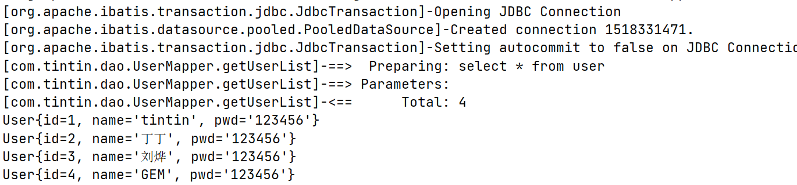

### 使用log4j

1. 在要使用Log4的类中,导入包 import org. apache log4, Logger;

2. 日志对象,参数为当前类的dass

   ```
        private static Logger logger = Logger.getLogger(UserMapperTest.class);
   
   ```

3. 日志级别

```java

 public void testLog4j() {
        logger.info("info:进入了testLog4j");
        logger.debug("debug:进入了testLog4j");
        logger.error("error:进入了testLog4j");
    }
```

输出文件tintin.log

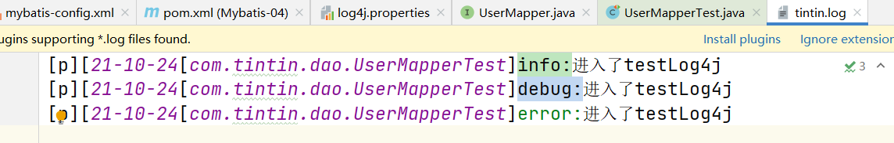

控制台输出

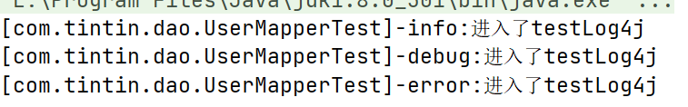

# 7 分页

## 7.1 为什么要分页

* 减少数据处理量

## 7.2 使用limit分页

```sql
select * from user limit 0，-1
```

## 7.3 使用Mybatis实现分页，核心SQL

```java
    List<User> getUserByLimit(Map<String,Object> map);
```


```xml
    <!--分页-->
    <select id="getUserByLimit" resultMap="userMap" parameterType="map">
        select * from user limit #{startIndex},#{pageSize}
    </select>
```

```java
    public void testGetUserByLimit() {
        try(SqlSession sqlSession = MybatisUtils.getSqlSession()) {
            UserMapper mapper = sqlSession.getMapper(UserMapper.class);
            Map<String,Object> map = new HashMap<>();
            map.put("startIndex",0);
            map.put("pageSize",2);

            List<User> userList = mapper.getUserByLimit(map);
            userList.forEach(System.out::println);
        }
    }
```

## 7.4 RowBounds分页 核心java

```java
    List<User> getUserByRowBounds();
```

```xml
<!--交给java层面分页-->
    <select id="getUserByRowBounds" resultMap="userMap">
        select * from user
    </select>
```

```java
    public void testGetUserByRowBounds() {
        try(SqlSession sqlSession = MybatisUtils.getSqlSession()) {
            RowBounds rowBounds = new RowBounds(1,2);
            List<User> userList = sqlSession.selectList("com.tintin.dao.UserMapper.getUserByRowBounds",null,rowBounds);
            userList.forEach(System.out::println);
        }
    }
```

## 7.5 分页插件(PageHelper)

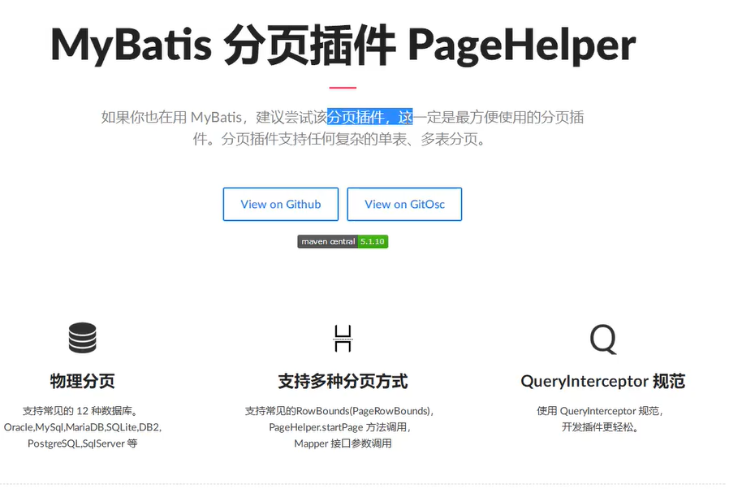

# 8 使用注解开发

## 8.1 面向接口编程

* 大家之前都学过面向对象编程,也学习过接口,但在真正的开发中,很多时候我们会选择面向接口编程

* **根本原因:解耦,可拓展,提高复用,分层开发中,上层不用管具体的实现,大家都遵守共同的标准,使得开发变得容易,规范性更好**

* 在一个面向对象的系统中,系统的各种功能是由许许多多的不同对象协作完成的。在这种情况下,各个对象内部是如何实现自己的对系统设计人员来讲就不那么重要了;

* 而各个对象之间的协作关系则成为系统设计的关键。小到不同类之间的通信,大到各模块之间的交互,在系统设计之初都是要着重考虑的,这也是系统设计的主要工作内容。面向接口编程就是指按照这种思想来编程。

  

  

**关于接口的理解**

* 接口从更深层次的理解,应是定义(规范,约束)与实现(名实分离的原则)的分离。
* 接口的本身反映了系统设计人员对系统的抽象理解
* 接口应有两类
  * 第一类是对一个个体的抽象,它可对应为一个抽象体 abstract class)
  * 第二类是对一个个体某一方面的抽象,即形成一个抽象面( (interface)
  * 一个体有可能有多个抽象面。抽象体与抽象面是有区别的。

**三个面向区别**

* 面向对象是指,我们考虑问题时,以对象为单位,考虑它的属性及方法
* 面向过程是指,我们考虑问题时,以一个具体的流程(事务过程)为单位,考虑它的实现
* 接口设计与非接口设计是针对复用技术而言的,与面向对象(过程)相比，不是一个问题，更多的体现就是对系统整体的架构

## 8.2 面向注解开发

使用注解来映射简单语句会使代码显得更加简洁，但对于稍微复杂一点的语句，Java 注解不仅力不从心，还会让你本就复杂的 SQL 语句更加混乱不堪。 因此，如果你需要做一些很复杂的操作，最好用 XML 来映射语句。

```java
    @Select("select * from user")
    List<User> getUserList();
```

绑定接口

```xml
    <!--每一个Mapper配置文件都需要在mybatis核心配置文件中注册-->
    <mappers>
<!--        <mapper resource="com/tintin/dao/UserMapper.xml"/>-->
<!--        <package name="com.tintin.dao"/>-->
        <mapper class="com.tintin.dao.UserMapper"/>
    </mappers>
```


```java
    public void testGetUserList() {
        try(SqlSession sqlSession = MybatisUtils.getSqlSession()) {
            UserMapper mapper = sqlSession.getMapper(UserMapper.class);
            List<User> userList = mapper.getUserList();
            for (User user : userList) {
                System.out.println(user);
            }
        }
    }
```

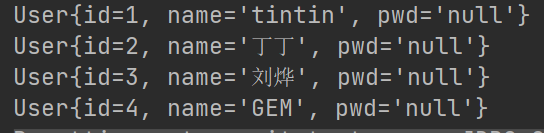

无法解决 列名与字段映射错误问题


## 设置事务自动提交

```java
// 2 获取SqlSession对象
public static SqlSession getSqlSession() {
    SqlSession sqlSession = sqlSessionFactory.openSession(true);
    return sqlSession;
}
```

## Mybatis详细执行流程

```java
/*MybatisUtils.class*/
//Resource获取配置文件
InputStream inputStream = Resources.getResourceAsStream(source);
//SqlSessionFactoryBuilder实例化
new SqlSessionFactoryBuilder();

sqlSessionFactory = new SqlSessionFactoryBuilder().build(inputStream);
↓
↓
↓    
/*SqlSessionFactoryBuilder.class*/
	public SqlSessionFactory build(InputStream inputStream, Properties properties) {
        return this.build((InputStream)inputStream, (String)null, properties);
    }

    public SqlSessionFactory build(InputStream inputStream, String environment, Properties properties) {
        SqlSessionFactory var5;
        try {
            //实例化XMLConfigBuilder 
            XMLConfigBuilder parser = new XMLConfigBuilder(inputStream, environment, properties);
            //解析XMLConfigBuilder 得到Configuration实例（含所有的配置信息）
            //实例化SqlSessionFactory
            var5 = this.build(parser.parse());
        } catch (Exception var14) {
            throw ExceptionFactory.wrapException("Error building SqlSession.", var14);
        } finally {
            ErrorContext.instance().reset();

            try {
                inputStream.close();
            } catch (IOException var13) {
            }

        }

        return var5;
    }

    public SqlSessionFactory build(Configuration config) {
        return new DefaultSqlSessionFactory(config);
    }
//SqlSession实例化
SqlSession sqlSession = sqlSessionFactory.openSession();
//transactional
//创建excutor执行器
//实现CRUD

```

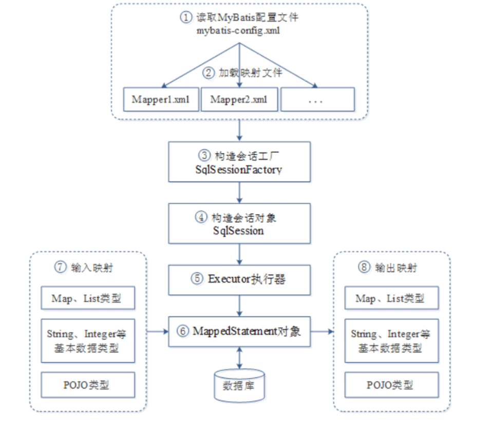

## 8.3 注解CURD

```java
    @Select("select * from user")
    List<User> getUserList();

    //方法存在多个参数，参数前加上@Param注解
    @Select("select * from user where id = #{id}")
    User getUserById(@Param("id") int id);
    
    @Insert("Insert into user values (#{id},#{name},#{password})")
    int addUser(User user);

    @Update("update user set name = #{name}, pwd = #{password} where id = #{id}")
    int updateUser(User user);
    
    @Delete("delete from user where id = #{id}")
    int deleteUser(int id);
```

> 关于@Param(注解
> 基本类型的参数或者 String类型,需要加上
> 引用类型不需要加
> 如果只有一个基本类型的话,可以忽略,但是建议大家都加上!
> 我们在SQL中引用的就是我们这里的@ Param0中设定的属性名!

> #{}与`${}`的区别
>
> 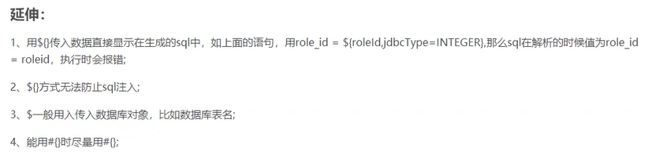

1. 简单说明，\#{}是预编译处理，是[占位符](https://so.csdn.net/so/search?q=占位符&spm=1001.2101.3001.7020)，${}是字符串替换，是拼接符

2. mybatis在处理#{}时，会将sql中的#{}替换为?号，进行预编译，之后调用PreparedStatement的set方法来赋值；替换的值会带上双引号。

3. mybatis在处理 $ { } 时，就是把 ${ } 替换成变量的值。使用 #{} 可以有效的防止SQL注入，提高系统安全性。

4. ${}导致恶意的sql注入

   ```sql
   select * from user where username=${username} and password=${password}
   ↓实现免密登录
   select * from user where username='yyy' and password=1 or 1 =1
   ```

5. ${}可以实现传递表名或字段名

   ```sql
   order by ${param}
   ↓
   order by id
   ```

# 9 Lombok

Project Lombok is **a java library** that **automatically plugs into your editor and build tools**, spicing up your java.
Never write another getter or equals method again, with one annotation your class has a fully featured builder, Automate your logging variables, and much more.

Project Lombok是一个java库，可以自动插入编辑器并构建工具，为Java增添色彩
永远不要再写另一个getter或equals方法，只用一个注释，类就具有一个功能齐全的构建器，自动化日志记录变量等等。

## 9.1 导入依赖

```xml
<!-- https://mvnrepository.com/artifact/org.projectlombok/lombok -->
<dependency>
    <groupId>org.projectlombok</groupId>
    <artifactId>lombok</artifactId>
    <version>1.18.12</version>
    <scope>provided</scope>
</dependency>
```

## 9.2 导入lombok插件

```java
A plugin that adds first-class support for Project Lombok Features

@Getter and @Setter
@FieldNameConstants
@ToString
@EqualsAndHashCode
@AllArgsConstructor, @RequiredArgsConstructor and @NoArgsConstructor
@Log, @Log4j, @Log4j2, @Slf4j, @XSlf4j, @CommonsLog, @JBossLog, @Flogger, @CustomLog
@Data //无参构造,get、set、 tostring. hashcode, equals
@Builder
@SuperBuilder
@Singular
@Delegate
@Value
@Accessors
@Wither
@With
@SneakyThrows

@val
@var
experimental @var
@UtilityClass
Lombok config system
Code inspections
Refactoring actions (lombok and delombok)
```

# 10 多对一处理

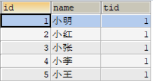


对于查询学生的信息而言，就是多对一

```java
@Data
@Alias("Student")
public class Student {
    private Integer id;
    private String name;

    //学生关联一位老师
    private Teacher teacher;
}
```

```java
@Data
@Alias("Teacher")
public class Teacher {
    private Integer id;
    private String name;
}
```


## 方式一 按照查询嵌套处理

```xml
<!--
    查询所有的学生信息
    根据查询出来的学生的id,寻找对应的老师!
    -->
    <resultMap id="studentMap" type="Student">
        <result column="id" property="id"/>
        <result column="name" property="name"/>
        <!--复杂的属性 引用类型属性或集合 需要单独处理 -->
        <!--引用类型用association javaType指定属性的类型 集合用collection-->
        <association property="teacher" column="tid" javaType="Teacher" select="getTeacher"/>
        
    </resultMap>

    <select id="getStudents" resultMap="studentMap">
--         SELECT s.name, t.name FROM student s, teacher t WHERE s.tid = t.id;
        select * from student
    </select>

    <select id="getTeacher" resultType="Teacher">
        select * from teacher where id = #{id}
    </select>
```

## 方式二 按照结果嵌套处理

```xml
<!--方式二 查询属性取别名 按照结果集嵌套处理-->
    <resultMap id="studentMap" type="Student">
        <result column="sid" property="id"/>
        <result column="sname" property="name"/>
        <!--复杂的属性 引用类型属性或集合 需要单独处理 -->
        <association property="teacher"  javaType="Teacher">
            <result property="name" column="tname"/>
            <result property="id" column="tid"/>
        </association>

    </resultMap>

    <select id="getStudents" resultMap="studentMap">
        SELECT s.id sid, t.id tid, s.name sname, t.name tname FROM student s, teacher t WHERE s.tid = t.id;
--         select * from student
    </select>
```

# 11 一对多处理

对于查询老师信息就是一对多

```java
@Data
@Alias("Student")
public class Student {
    private Integer id;
    private String name;
    private Integer tid;
}
```

```java
@Data
@Alias("Teacher")
public class Teacher {
    private Integer id;
    private String name;

    //一个老师拥有多个学生
    private List<Student> students;
}
```

## 按照结果嵌套处理

```xml
<resultMap id="teacherMap" type="Teacher">
    <result property="id" column="tid"/>
    <result property="name" column="tname"/>
    <!--javaType指定属性的类型 集合中的泛型信息使用ofType获取-->
    <collection property="students" ofType="Student">
        <result property="id" column="sid"/>
        <result property="name" column="sname"/>
        <result property="tid" column="tid"/>
    </collection>
</resultMap>

<select id="getTeacherById" parameterType="int" resultMap="teacherMap">
    SELECT s.id sid, s.name sname, t.id tid,t.name tname FROM student s, teacher t WHERE s.tid=t.id AND t.id = #{id};
</select>
```

## 按照查询嵌套处理

```xml
<resultMap id="teacherMap" type="Teacher">
    <result property="id" column="id"/>
    <result property="name" column="name"/>
    <!--javaType指定属性的类型 集合中的泛型信息使用ofType获取-->
    <collection property="students" ofType="Student" column="id" select="getStudents"/>
</resultMap>

<select id="getTeacherById2" parameterType="int" resultMap="teacherMap">
    select * from teacher where id = #{id}
</select>

<select id="getStudents" parameterType="int" resultType="Student">
    select * from student where tid = #{tid}
</select>
```

> 小结
>
> 1. 关联- association【多对
> 2. 集合- collection【一对多】
> 3. javaType ofType
> 4. Javatype用来指定实体类中属性的类型
> 5. ofType用来指定映射到Ls或者集合中的pojo类型,泛型中的约束类型!
>
> 注意点
> 保证SQL的可读性,尽量保证通俗易懂
> 注意一对多和多对一中,属性名和字段的问题!
> 如果问题不好排查错误,可以使用日志,建议使用Log4

# 12 动态SQL

## 12.1 什么是动态SQL

**根据不同的条件生成不同的SQL语句**

My Batis的强大特性之一便是它的动态sαL。如果你有使用JDBC或其它类似框架的经验,你就能体会到根据不同条件拼接SQL语句的痛苦。例如拼接时要确保不能忘记添加必要的空格,还要注意去掉列表最后—个列名的逗号。利用动态sαL这一特性可以彻底摆脱这种痛苦。
虽然在以前使用动态SαL并非一件易事,但正是 My Batis提供了可以被用在任意SQL映射语句中的强大的动态SQL语言得以改进这种情形。

动态sQL元素和JsTL或基于类似ⅩML的文本处理器相似。在 MyBatis之前的版本中,有很多元素需要花时间了解。 MyBatis3大大精简了元素种类,现在只需学习原来一半的元素便可。 MyBatis采用功能强大的基于OGNL的表达式来淘汰其它大部分元素

if
choose (when, otherwise)
trim (where, set)
foreach

## 12.2 搭建环境

### sql建库

```sql
CREATE TABLE blog(
    id varchar(50) NOT NULL COMMENT'博客id',
    tit1e varchar(100) NOT NULL COMMENT'博客标题',
    author varchar(30) NOT NULL COMMENT'博客作者',
    create_time datetime NOT NULL COMMENT'创建时间', 
    views int(30) NOT NULL COMMENT'浏览量'
)ENGINE=InnoDB DEFAULT CHARSET=utf8
```

### 创建基础工程

```java
//pojo.Blog
@Data
public class Blog {
    private String id;
    private String title;
    private String author;
    private Date createTime;//属性名与字段名不一致
    private int views;
}
```

### 解决属性名与字段名不一致问题

mapUnderscore TocamelCase       是否开启自动驼峰命名规则( camel case)映射,即从经典数据库列名
true false
默认 False
A_ COLUMN到经典Java属性名 aColumn的类似映射

```xml
    <settings>
        <setting name="logImpl" value="STDOUT_LOGGING"/>
<!--        <setting name="logImpl" value="LOG4J"/>-->
        <setting name="mapUnderscoreToCamelCase" value="true"/>
    </settings>
```

## 12.3 if

```java
    //查询数据
    List<Blog> getBlogs(Map map);
```


```xml
    <select id="getBlogs" resultType="Blog" parameterType="map">
        SELECT * FROM blog where 1=1
        <if test="title != null">
            and title = #{title}
        </if>
        <if test="author != null">
            and author = #{author}
        </if>
    </select>
```

## 12.4 choose(when, otherwise) 

有时我们不想应用到所有的条件语句,而只想从中择其一项。针对这种情况, My Batis提供了 choose元素,它有点像Java中的 switch语句

## 12.5 trim(where、set)

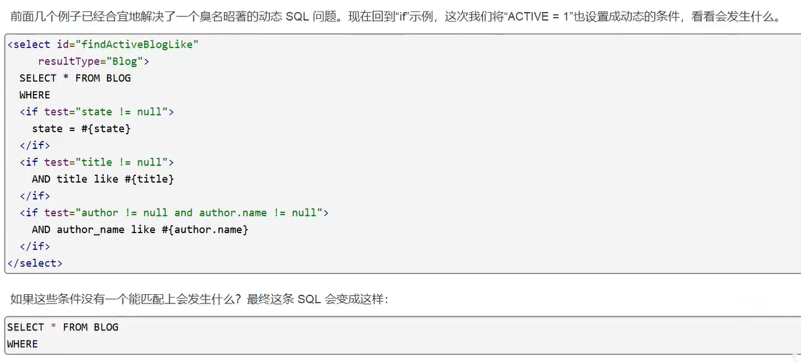

My Batis有一个简单的处理,这在90%的情况下都会有用。而在不能使用的地方,你可以自定义处理方式来令其正常工作。一处简单的修改就能达到目的

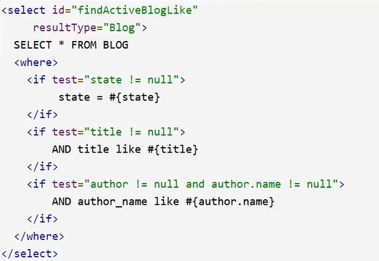

where元素只会在至少有一个子元素的条件返回SQL子句的情况下才去插入“ WHERE子句。而且,若语句的开头为“AND”或oR",Whee元素也会将它们去除


```java
   //查询数据
    List<Blog> getBlogs2(Map map);
```

```xml
<select id="getBlogs2" resultType="Blog" parameterType="map">
    select * from blog
    <where>
        <choose>
            <when test="title != null">
                title = #{title}
            </when>
            <when test="author != null">
                author = #{author}
            </when>
            <otherwise>
                views = #{views}
            </otherwise>
        </choose>
    </where>
</select>
```

如果 where元素没有按正常套路出牌,我们可以通过自定义tim元素来定制 where元素的功能。比如,和 where元素等价的自定义trim元素为

```xml
    <trim prefix="where" prefixOverrides="and |or">
        ...
    </trim>
```

prefⅸ Overrides属性会忽略通过管道分隔的文本序列(注意此例中的空格也是必要的)。它的作用是移除所有指定在 prefix Overrides属性中的内容,并且插入prefiX属性中指定的内容。

> 注意这里我们删去的是后缀值,同时添加了前缀值。

类似的用于动态更新语句的解决方案叫做set。set元素可以用于动态包含需要更新的列,而舍去其它的

```java
//更新
int updateBlog(Map map);
```

```xml
    <update id="updateBlog" parameterType="map">
        update blog
        <set>
            <if test="title != null">
                title = #{title},
            </if>
            <if test="author != null">
                author = #{author},
            </if>
        </set>
        where id = #{id}
    </update>
```

和 set元素等价的自定义trim元素为

```xml
<trim prefix="set" prefixOverrides="" suffix="" suffixOverrides=",">
	...
</trim>
```

## 12.6 SQL片段

抽取部分功能语句，方便复用

```xml
    <sql id="if-title-author">
        <if test="title != null">
            and title = #{title}
        </if>
        <if test="author != null">
            and author = #{author}
        </if>
    </sql>
    <select id="getBlogs" resultType="Blog" parameterType="map">
        SELECT * FROM blog 
        <where>
            <include refid="if-title-author"/>
        </where>
    </select>
```


## 12.7 foreach

动态SQL的另外—个常用的操作需求是对个集合进行遍历,**通常是在构建IN条件语句的时候**。

```java
    //查询数据
    List<Blog> getBlogs3(Map map);
```

```xml
    <!--==>  Preparing: select * from blog WHERE id = 1 or id = 2 or id = 3 -->
	<select id="getBlogs3" parameterType="map" resultType="Blog">
        select * from blog
        <where>
            <foreach collection="ids"  item="id"  separator="or" >
                id = #{id}
            </foreach>
        </where>
    </select>
```

foreach元素的功能非常强大,它允许你指定一个集合,声明可以在元素体内使用的集合项(item)和索引(index)变量,它也允许你指定开头与结尾的字符串以及在迭代结果之间放置分隔符。这个元素是很智能的,因此它不会偶然地附加多余的分隔符

注意你可以将任何可迭代对象(如Lst、set等)、Map对象或者数组对象传递给 foreach作为集合参数。当使用可迭代对象或者数组时, index是当前迭代的次数,item的值是本次迭代获取的元素。当使用Map对象(或者Map. Entry对象的集合)时, index是键,item是值。

> 总结
>
> 动态SQL就是在拼接SQL语句,我们只要保证SQL的正确性,按照SQL的格式,去排列组合就可以了
> 建议
> 现在Mysq中写出完整的SQL再对应的去修改成为我们的动态SQL实现通用即可!

# 13 缓存

## 13.1 简介

1. 什么是缓存[ Cache]?
   * 存在内存中的临时数据
   * 将用户经常査询的数据放在缓存(内存)中,**用户去査询数据就不用从磁盘上(关系型数据库数据文件)査**
     **询,从缓存中査询,从而提高査询效率,解决了高并发系统的性能问题**
2. 为什么使用缓存
   * **减少和数据库的交互次数,减少系统开销,提高系统效率。**
3. 什么样的数据能使用缓存?
   * 经常查询并且不经常改变的数据

## 13.2 Mybatis缓存

* My Batis包含一个非常强大的查询缓存特性它可以非常方便地定制和配置缓存↓缓存可以极大的提升查询效
* MyBatis系统中軾认定义了两级缓存:一级缓存和二级缓存
  * 默认情况下,只有一级缓存开启。( SqlSession级别的缓存,也称为本地缓存）
  * 二级缓存需要手动开启和配置,他是基于 namespace级别的缓存。
  * 为了提高扩展性, Mybatis定义了缓存接口Cache。我们可以通过实现 Cache接口来自定义二级缓存

## 13.3 一级缓存

* 一级缓存也叫本地缓存:Sq| Session
  * 与数据库同一次会话期间查询到的数据会放在本地缓存中。
  * 以后如果需要获取相同的数据,直接从缓存中拿,没必须再去査询数据库

测试：

1. 开启日志
2.  

```java
//查询相同的两次记录
public void testGetUserById() {
        try(SqlSession sqlSession = MybatisUtils.getSqlSession()) {
            UserMapper mapper = sqlSession.getMapper(UserMapper.class);
            User user1 = mapper.getUserById(2);
            System.out.println(user1);

//            sqlSession.clearCache();
            
            User user2 = mapper.getUserById(2);
            System.out.println(user2);

            System.out.println(user1 == user2);
        }
    }
/*
Opening JDBC Connection
Created connection 192794887.
==>  Preparing: select * from user where id = ? 
==> Parameters: 2(Integer)
<==    Columns: id, name, pwd
<==        Row: 2, 丁丁, 123456
<==      Total: 1
User(id=2, name=丁丁, pwd=123456)
User(id=2, name=丁丁, pwd=123456)
true
Closing JDBC Connection [com.mysql.jdbc.JDBC4Connection@b7dd107]
Returned connection 192794887 to pool.
*/
```

缓存失效的情况：

1. 增删改操作，可能改变原来的数据，所以会刷新缓存
2. 手动清理缓存`sqlSession.clearCache()`
3. 使用了其他Mapper.xml进行查询，导致连接关闭，缓存无效

> 一级缓存就是一个map

## 13.4 二级缓存

* 二级缓存也叫全局缓存,一级缓存作用域太低了,所以诞生了二级缓存
* 基于 namespace级别的缓存,一个名称空间,对应一个二级缓存
* 工作机制
  * —个会话査询一条数据,这个数据就会被放在当前会话的一级缓存中
  * 如果当前会话关闭了,这个会话对应的一级缓存就没了;但是我们想要的是,会话关闭了,一级缓存中的数据被保存到二级缓存中
  * 新的会话查询信息,就可以从二级缓存中获取内容
  * 不同的 mappe查出的数据会放在自己对应的缓存(map)中

测试：

1. 开启全局缓存

cacheEnabled	全局性地开启或关闭所有映射器配置文件中已配置的任何缓存。默认true

```xml
<!--开启全局缓存-->
        <setting name="cacheEnabled" value="true"/>
```

2. 在Mapper中单独开启缓存

```xml
<!--单独Mapper开启缓存-->
    <cache eviction="FIFO" flushInterval="6000" size="512" readOnly="true"/>
```

这个更高级的配置创建了一个FFO缓存,每隔60秒刷新,最多可以存储结果对象或列表的512个引用,而且返回的对象被认为是只读的,因此对它们进行修改可能会在不同线程中的调用者产生冲突。

每一个语句设置是否开启缓存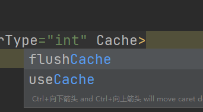

测试：

1.  若开启默认的cache，实体类需要序列化

   Error serializing object.  Cause: java.io.NotSerializableException: com.tintin.pojo.User

2. 

```java
    public void testGetUserById() {
        User user1;
        User user2;
        try(SqlSession sqlSession = MybatisUtils.getSqlSession()) {
            UserMapper mapper = sqlSession.getMapper(UserMapper.class);
            user1 = mapper.getUserById(2);
            System.out.println(user1);
        }

        try(SqlSession sqlSession = MybatisUtils.getSqlSession()) {
            UserMapper mapper = sqlSession.getMapper(UserMapper.class);
            user2 = mapper.getUserById(2);
            System.out.println(user2);
        }

        System.out.println(user1 == user2);
    }
/*
Opening JDBC Connection
Created connection 854507466.
==>  Preparing: select * from user where id = ? 
==> Parameters: 2(Integer)
<==    Columns: id, name, pwd
<==        Row: 2, 丁丁, 123456
<==      Total: 1
User(id=2, name=丁丁, pwd=123456)
Closing JDBC Connection [com.mysql.jdbc.JDBC4Connection@32eebfca]
Returned connection 854507466 to pool.
Cache Hit Ratio [com.tintin.dao.UserMapper]: 0.5
User(id=2, name=丁丁, pwd=123456)
true
*/
```

> 小结
> 只要开启了二级缓存,在同一个 Mapper下就有效
> 所有的数据都会先放在一级缓存中
> 只有当会话提交,或者关闭的时候,才会提交到二级缓冲中!

## 13.5 缓存原理

## 13.6 自定义缓存（Ehcache)

>  Redis数据库来做缓存!K-V
