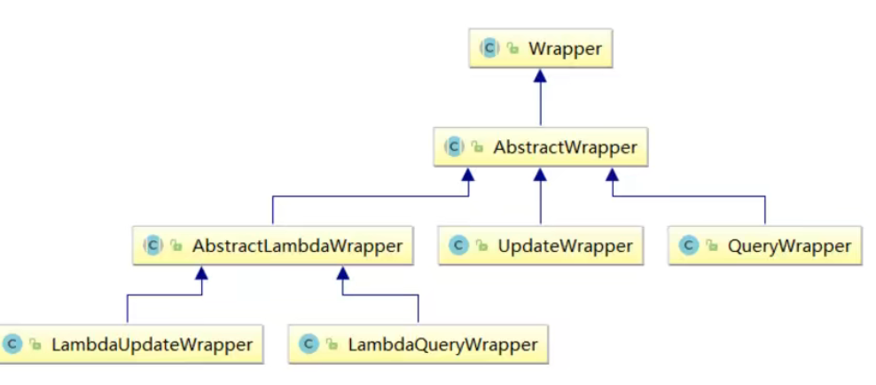
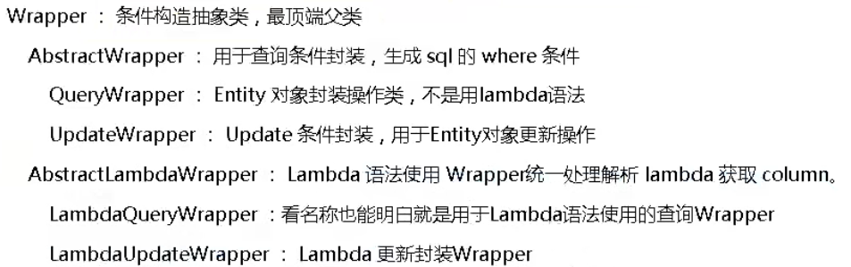

[TOC]

# MybatisPlus概述

[MyBatis-Plus (baomidou.com)](https://mp.baomidou.com/)

[MyBatis-Plus (opens new window)](https://github.com/baomidou/mybatis-plus)（简称 MP）是一个 [MyBatis (opens new window)](https://www.mybatis.org/mybatis-3/)的增强工具，在 MyBatis 的基础上只做增强不做改变，为简化开发、提高效率而生。

## 特性

- **无侵入**：只做增强不做改变，引入它不会对现有工程产生影响，如丝般顺滑
- **损耗小**：启动即会自动注入基本 CURD，性能基本无损耗，直接面向对象操作
- ***强大的 CRUD 操作**：内置通用 Mapper、通用 Service，仅仅通过少量配置即可实现单表大部分 CRUD 操作，更有强大的条件构造器，满足各类使用需求
- **支持 Lambda 形式调用**：通过 Lambda 表达式，方便的编写各类查询条件，无需再担心字段写错
- **支持主键自动生成**：支持多达 4 种主键策略（内含分布式唯一 ID 生成器 - Sequence），可自由配置，完美解决主键问题
- **支持 ActiveRecord 模式**：支持 ActiveRecord 形式调用，实体类只需继承 Model 类即可进行强大的 CRUD 操作
- **支持自定义全局通用操作**：支持全局通用方法注入（ Write once, use anywhere ）
- **内置代码生成器**：采用代码或者 Maven 插件可快速生成 Mapper 、 Model 、 Service 、 Controller 层代码，支持模板引擎，更有超多自定义配置等您来使用
- **内置分页插件**：基于 MyBatis 物理分页，开发者无需关心具体操作，配置好插件之后，写分页等同于普通 List 查询
- **分页插件支持多种数据库**：支持 MySQL、MariaDB、Oracle、DB2、H2、HSQL、SQLite、Postgre、SQLServer 等多种数据库
- **内置性能分析插件**：可输出 SQL 语句以及其执行时间，建议开发测试时启用该功能，能快速揪出慢查询
- **内置全局拦截插件**：提供全表 delete 、 update 操作智能分析阻断，也可自定义拦截规则，预防误操作


# 快速入门

数据库

```sql
CREATE DATABASE mybatis_plus;
USE mybatis_plus;

DROP TABLE IF EXISTS USER;
CREATE TABLE USER
(
	id BIGINT(20) NOT NULL COMMENT '主键ID',
	NAME VARCHAR(30) NULL DEFAULT NULL COMMENT '姓名',
	age INT(11) NULL DEFAULT NULL COMMENT '年龄',
	email VARCHAR(50) NULL DEFAULT NULL COMMENT '邮箱',
	PRIMARY KEY (id)
);

DELETE FROM USER;
INSERT INTO USER (id, NAME, age, email) VALUES
(1, 'Jone', 18, 'test1@baomidou.com'),
(2, 'Jack', 20, 'test2@baomidou.com'),
(3, 'Tom', 28, 'test3@baomidou.com'),
(4, 'Sandy', 21, 'test4@baomidou.com'),
(5, 'Billie', 24, 'test5@baomidou.com');
-- 真实开发中，version（乐观锁）、deleted（逻辑删除）、gmt_create、gmt_modified
```

SpringBoot初始化

依赖

```xml
 <!-- 数据库驱动 -->
        <dependency>
            <groupId>mysql</groupId>
            <artifactId>mysql-connector-java</artifactId>
        </dependency>
        <!-- lombok -->
        <dependency>
            <groupId>org.projectlombok</groupId>
            <artifactId>lombok</artifactId>
        </dependency>
        <!-- mybatis-plus -->
        <!-- mybatis-plus 是自己开发，并非官方的！ -->
        <dependency>
            <groupId>com.baomidou</groupId>
            <artifactId>mybatis-plus-boot-starter</artifactId>
            <version>3.0.5</version>
        </dependency>
```

> 说明：我们使用 mybatis-plus 可以节省我们大量的代码，尽量不要同时导入 mybatis 和 mybatisplus！版本的差异！

连接数据库

```properties
# mysql8 需要增加时区配置
spring.datasource.username=root
spring.datasource.password=tintin
spring.datasource.url=jdbc:mysql://localhost:3306/mybatis_plus?useSSL=false&useUnicode&characterEncoding=utf-8&serverTimezone=GMT%2B8
spring.datasource.driver-class-name=com.mysql.cj.jdbc.Driver

```

传统方式pojo-dao（连接mybatis，配置mapper.xml文件）-service-controller

* pojo

  ```java
  @Data
  @AllArgsConstructor
  @NoArgsConstructor
  public class User {
      private Long id;
      private String name;
      private Integer age;
      private String email;
  }
  ```

  

* mapper接口

  ```java
  // 在对应的Mapper上面继承基本的类 BaseMapper
  @Repository // 代表持久层
  public interface UserMapper extends BaseMapper<User> {
  // 所有的CRUD操作都已经编写完成了
  // 你不需要像以前的配置一大堆文件了！
  }
  ```

* 测试

  ```java
  @SpringBootTest
  class MybatisPlusApplicationTests {
  
      @Autowired
      private UserMapper userMapper;
  
      @Test
      void contextLoads() {
          // 参数是一个 Wrapper ，条件构造器，这里我们先不用 null
          // 查询全部用户
          List<User> users = userMapper.selectList(null);
          users.forEach(System.out::println);
      }
  }
  ```

  

> 注意点，我们需要在主启动类上去扫描我们的mapper包下的所有接口 @MapperScan("com.kuang.mapper")
>
> 思考：
>
> 1、SQL谁帮我们写的 ? MyBatis-Plus 都写好了 
>
> 2、方法哪里来的？ MyBatis-Plus 都写好了

# 配置日志

```properties
# 日志配置
mybatis-plus.configuration.log-impl=org.apache.ibatis.logging.stdout.StdOutImpl
```


# CRUD拓展

## 插入操作

```java
 @Test
    void testInsert() {
        User user = new User();
        user.setAge(18);
        user.setEmail("821294434@qq.com");
        user.setName("tintin");

        System.out.println(user);

        int insert = userMapper.insert(user);
        System.out.println(insert);
    }
```

> 数据库插入的id的默认值为：全局的唯一id

## 主键生成策略

###  全局唯一id

```java
    //默认 ID_WORKER 全局唯一id
    @TableId(type = IdType.ID_WORKER)
	private Long id;
```

分布式系统唯一id生成：https://www.cnblogs.com/haoxinyue/p/5208136.html

**雪花算法**： 

snowflake是Twitter开源的分布式ID生成算法，结果是一个long型的ID。其核心思想是：使用41bit作为 毫秒数，10bit作为机器的ID（5个bit是数据中心，5个bit的机器ID），12bit作为毫秒内的流水号（意味 着每个节点在每毫秒可以产生 4096 个 ID），最后还有一个符号位，永远是0。可以保证几乎全球唯 一！

### 主键自增

```java
    @TableId(type = IdType.AUTO)
    private Long id;
```


### 其余生成策略

```java
public enum IdType {
    AUTO(0), // 数据库id自增
    NONE(1), // 未设置主键
    INPUT(2), // 手动输入
    ID_WORKER(3), // 默认的全局唯一id
    UUID(4), // 全局唯一id uuid
    ID_WORKER_STR(5); //ID_WORKER 字符串表示法
}
```

## 更新操作

```java
    // 测试更新
    @Test
    public void testUpdate(){
        User user = new User();
        // 通过条件自动拼接动态sql
        user.setId(6L);
        user.setName("gem");
        user.setAge(30);
        // 注意：updateById 但是参数是一个 对象！
        int i = userMapper.updateById(user);
        System.out.println(i);
    }

```

## 自动填充

创建时间、修改时间！这些个操作一遍都是自动化完成的，我们不希望手动更新！

阿里巴巴开发手册：所有的数据库表：gmt_create、gmt_modified几乎所有的表都要配置上！而且需 要自动化！

### 数据库级别（工作中不允许你修改数据库）

在表中新增字段 create_time, update_time


实体类同步

```java
    private Date createTime;
    private Date updateTime;
```

测试


### 代码级别

删除数据库的默认值、更新操作


实体类字段属性上需要增加注解

```java
    // 字段添加填充内容
    @TableField(fill = FieldFill.INSERT)
    private Date createTime;
    @TableField(fill = FieldFill.INSERT_UPDATE)
    private Date updateTime;

```

编写处理器来处理这个注解即可

```java

@Slf4j
@Component // 一定不要忘记把处理器加到IOC容器中！
public class MyMetaObjectHandler implements MetaObjectHandler {
    @Override
    public void insertFill(MetaObject metaObject) {
        log.info("start insert fill.....");
// setFieldValByName(String fieldName, Object fieldVal, MetaObject metaObject
        this.setFieldValByName("createTime",new Date(),metaObject);
        this.setFieldValByName("updateTime",new Date(),metaObject);
    }

    @Override
    public void updateFill(MetaObject metaObject) {
        log.info("start update fill.....");
// setFieldValByName(String fieldName, Object fieldVal, MetaObject metaObject
        this.setFieldValByName("updateTime",new Date(),metaObject);
    }
}

```

## 乐观锁

乐观锁 : 故名思意十分乐观，它总是认为不会出现问题，无论干什么不去上锁！如果出现了问题， 再次更新值测试 

悲观锁：故名思意十分悲观，它总是认为总是出现问题，无论干什么都会上锁！再去操作！

### 乐观锁机制

乐观锁实现方式： 取出记录时，获取当前 version 更新时，带上这个version 执行更新时， set version = newVersion where version = oldVersion 如果version不对，就更新失败

```sql
乐观锁：1、先查询，获得版本号 version = 1
-- A
update user set name = "kuangshen", version = version + 1
where id = 2 and version = 1
-- B 线程抢先完成，这个时候 version = 2，会导致 A 修改失败！
update user set name = "kuangshen", version = version + 1
where id = 2 and version = 1
```

###　测试MP的乐观锁插件

数据库


实体类加对应的字段

```java
@Version//乐观锁Version注解
private Integer version;
```

注册插件

```java
// 扫描我们的 mapper 文件夹
@MapperScan("com.kuang.mapper")
@EnableTransactionManagement
@Configuration // 配置类
public class MyBatisPlusConfig {
    // 注册乐观锁插件
    @Bean
    public OptimisticLockerInterceptor optimisticLockerInterceptor() {
        return new OptimisticLockerInterceptor();
    }
}
```

单线程测试

```java
// 测试乐观锁成功！
@Test
public void testOptimisticLocker(){
    // 1、查询用户信息
    User user = userMapper.selectById(1L);
    // 2、修改用户信息
    user.setName("liuye");
    user.setEmail("821294434@qq.com");
    // 3、执行更新操作
    userMapper.updateById(user);
}
```

模拟多线程测试

```java
    // 测试乐观锁失败！多线程下
    @Test
    public void testOptimisticLocker2(){
        // 线程 1
        User user = userMapper.selectById(1L);
        user.setName("kuangshen111");
        user.setEmail("24736743@qq.com");
        // 模拟另外一个线程执行了插队操作
        User user2 = userMapper.selectById(1L);
        user2.setName("kuangshen222");
        user2.setEmail("24736743@qq.com");
        userMapper.updateById(user2);
        // 自旋锁来多次尝试提交！
        userMapper.updateById(user); // 如果没有乐观锁就会覆盖插队线程的值！
    }
```

## 查询操作

```java
// 测试查询
    @Test
    public void testSelectById(){
        User user = userMapper.selectById(1L);
        System.out.println(user);
    }
    // 测试批量查询！
    @Test
    public void testSelectByBatchId(){
        List<User> users = userMapper.selectBatchIds(Arrays.asList(1, 2, 3));
        users.forEach(System.out::println);
    }
    // 按条件查询之一使用map操作
    @Test
    public void testSelectByBatchIds(){
        HashMap<String, Object> map = new HashMap<>();
        // 自定义要查询
        map.put("name","GEM");
        map.put("age",28);
        List<User> users = userMapper.selectByMap(map);
        users.forEach(System.out::println);
    }
```

## 分页查询

1. 原始的 limit 进行分页 
2. pageHelper 第三方插件 
3. MP 其实也内置了分页插件！

### 分页查询实现

配置分页拦截器组件

```java
// 分页插件
@Bean
public PaginationInterceptor paginationInterceptor() {
    return new PaginationInterceptor();
}
```

测试

```java
// 测试分页查询
@Test
public void testPage(){
// 参数一：当前页
// 参数二：页面大小
// 使用了分页插件之后，所有的分页操作也变得简单的！
Page<User> page = new Page<>(2,5);
userMapper.selectPage(page,null);
page.getRecords().forEach(System.out::println);
System.out.println(page.getTotal());
}
```

## 删除操作

```java
// 测试删除
@Test
public void testDeleteById(){
    userMapper.deleteById(6L);
}
// 通过id批量删除
@Test
public void testDeleteBatchId(){
    userMapper.deleteBatchIds(Arrays.asList(1464144442511396866L,1464144442511396867L));
}
// 通过map删除
@Test
public void testDeleteMap() {
    HashMap<String, Object> map = new HashMap<>();
    map.put("name", "liuye");
    userMapper.deleteByMap(map);
}
```

## 逻辑删除

物理删除 ：从数据库中直接移除  

逻辑删除 ：再数据库中没有被移除，而是通过一个变量来让他失效！ deleted = 0 => deleted = 1

**在数据表中增加一个 deleted 字段**


**实体类中增加属性**

```java
 @TableLogic
    private Integer deleted;

```

**配置组件**

```java
// 逻辑删除组件！
@Bean
public ISqlInjector sqlInjector() {
return new LogicSqlInjector();
}
```

**配置逻辑删除相关变量**

```java
# 配置逻辑删除
mybatis-plus.global-config.db-config.logic-delete-value=1
mybatis-plus.global-config.db-config.logic-not-delete-value=0
```

**删除变成更新deleted字段**


## 性能分析器

作用：性能分析拦截器，用于输出每条 SQL 语句及其执行时间 MP也提供性能分析插件，如果超过这个时间就停止运行！

**配置组件**

```java
    /**
     * SQL执行效率插件
     */
    @Bean
    @Profile({"dev","test"})// 设置 dev test 环境开启，保证我们的效率
    public PerformanceInterceptor performanceInterceptor() {
        PerformanceInterceptor performanceInterceptor = new
                PerformanceInterceptor();
        performanceInterceptor.setMaxTime(100); // ms设置sql执行的最大时间，如果超过了则不执行
        performanceInterceptor.setFormat(true); // 是否格式化代码
        return performanceInterceptor;
    }
```

在SpringBoot中配置环境为dev或者 test 环境

```properties
# 开发环境
spring.profiles.active=dev
```


使用性能分析插件，可以帮助我们提高效率！

## 条件构造器

写一些复杂的sql就可以使用它来替代





```java
@Test
void WrapperTest1() {
    //ge、gt、le、lt、eq、ne、isNull、isNotNull
    // 查询name不为空的用户，并且邮箱不为空的用户，年龄大于等于22
    QueryWrapper<User> wrapper = new QueryWrapper<>();
    wrapper.isNotNull("name").isNotNull("email").ge("age",22);
    List<User> users = userMapper.selectList(wrapper);
    users.forEach(System.out::println);

}

@Test
void test2(){
    // 查询名字Jack
    QueryWrapper<User> wrapper = new QueryWrapper<>();
    wrapper.eq("name","Jack");
    User user = userMapper.selectOne(wrapper); // 查询一个数据，出现多个结果使用List或者 Map
    System.out.println(user);
}

@Test
void test3(){
    //between、 notbetween
    // 查询年龄在 20 ~ 30 岁之间的用户
    QueryWrapper<User> wrapper = new QueryWrapper<>();
    wrapper.between("age",20,25); // 区间
    Integer count = userMapper.selectCount(wrapper);// 查询结果数
    System.out.println(count);
}

// 模糊查询
@Test
void test4(){
    //like、notLike、likeRight、likeLeft
    QueryWrapper<User> wrapper = new QueryWrapper<>();
    // 左和右 t%
    wrapper.notLike("name","e")
            .likeRight("email","t");
    List<Map<String, Object>> maps = userMapper.selectMaps(wrapper);
    maps.forEach(System.out::println);
}
//==>  Preparing: SELECT id,name,age,email,create_time,update_time,version,deleted FROM user WHERE //deleted=0 AND name NOT LIKE ? AND email LIKE ? 
//==> Parameters: %e%(String), t%(String)


// 模糊查询
@Test
void test5(){
    QueryWrapper<User> wrapper = new QueryWrapper<>();
    // id 在子查询中查出来
    wrapper.inSql("id","select id from user where id<3");
    List<Object> objects = userMapper.selectObjs(wrapper);
    objects.forEach(System.out::println);
}

//测试六
@Test
void test6(){
    QueryWrapper<User> wrapper = new QueryWrapper<>();
    // 通过id进行排序
    wrapper.orderByAsc("id");
    List<User> users = userMapper.selectList(wrapper);
    users.forEach(System.out::println);
}
```


## 代码自动生成器

AutoGenerator 是 MyBatis-Plus 的代码生成器，通过 AutoGenerator 可以快速生成 Entity、 Mapper、Mapper XML、Service、Controller 等各个模块的代码，极大的提升了开发效率。

```java
public class GeneratorTest {
    public static void main(String[] args) {
        //代码自动生成器对象
        AutoGenerator mpg = new AutoGenerator();

        //配置策略
        //1.全局配置
        GlobalConfig gc = new GlobalConfig();
        String projectPath = System.getProperty("user.dir");
        gc.setOutputDir(projectPath + "/src/main/java");
        gc.setAuthor("tintin");
        gc.setOpen(false);
        gc.setFileOverride(false);//是否覆盖
        gc.setServiceName("%sService");//去除service的i前缀
        gc.setIdType(IdType.ID_WORKER);
        gc.setDateType(DateType.ONLY_DATE);
        gc.setSwagger2(true);
        mpg.setGlobalConfig(gc);

        //2.设置数据源
        DataSourceConfig dsc = new DataSourceConfig();
        dsc.setUrl("jdbc:mysql://localhost:3306/mybatis_plus?useSSL=false&useUnicode&characterEncoding=utf-8&serverTimezone=GMT%2B8");
        dsc.setUsername("root");
        dsc.setPassword("tintin");
        dsc.setDriverName("com.mysql.cj.jdbc.Driver");
        dsc.setDbType(DbType.MYSQL);
        mpg.setDataSource(dsc);

        //3.包的配置
        PackageConfig pc = new PackageConfig();
        pc.setModuleName("mpg");
        pc.setParent("com.tintin");
        pc.setEntity("entity");
        pc.setMapper("mapper");
        pc.setService("service");
        pc.setController("controller");
        mpg.setPackageInfo(pc);

        //4.策略配置
        StrategyConfig strategy = new StrategyConfig();
        strategy.setInclude("user");//设置映射的表名
        strategy.setNaming(NamingStrategy.underline_to_camel);
        strategy.setColumnNaming(NamingStrategy.underline_to_camel);
        strategy.setEntityLombokModel(true);//自动lombok
        strategy.setLogicDeleteFieldName("deleted");//逻辑删除
        //自动填充策略
        TableFill gmt_create = new TableFill("gmt_create", FieldFill.INSERT);
        TableFill gmt_update = new TableFill("gmt_update", FieldFill.INSERT_UPDATE);
        strategy.setTableFillList(Arrays.asList(gmt_create,gmt_update));        //自动填充策略
        strategy.setVersionFieldName("version");//乐观锁
        strategy.setRestControllerStyle(true);//controller设置rest风格
        strategy.setControllerMappingHyphenStyle(true);
        mpg.setStrategy(strategy);

        mpg.execute();
    }
}
```

```java
public class CodeGenerator {
    @Test
    public void test() {
        String projectPath = System.getProperty("user.dir");
        System.out.println(projectPath);
    }

    @Test
    public void run() {

        // 1、创建代码生成器
        AutoGenerator mpg = new AutoGenerator();

        // 2、全局配置
        GlobalConfig gc = new GlobalConfig();
        String projectPath = System.getProperty("user.dir");
        gc.setOutputDir(projectPath + "/src/main/java");
        gc.setAuthor("testjava");
        gc.setOpen(false); //生成后是否打开资源管理器
        gc.setFileOverride(false); //重新生成时文件是否覆盖
        gc.setServiceName("%sService");	//去掉Service接口的首字母I
        gc.setIdType(IdType.ID_WORKER); //主键策略
        gc.setDateType(DateType.ONLY_DATE);//定义生成的实体类中日期类型
        gc.setSwagger2(true);//开启Swagger2模式

        mpg.setGlobalConfig(gc);

        // 3、数据源配置
        DataSourceConfig dsc = new DataSourceConfig();
        dsc.setUrl("jdbc:mysql://localhost:3306/guli");
        dsc.setDriverName("com.mysql.jdbc.Driver");
        dsc.setUsername("root");
        dsc.setPassword("root");
        dsc.setDbType(DbType.MYSQL);
        mpg.setDataSource(dsc);

        // 4、包配置
        PackageConfig pc = new PackageConfig();
        pc.setModuleName("edu"); //模块名
        pc.setParent("com.example.demo");
        pc.setController("controller");
        pc.setEntity("entity");
        pc.setService("service");
        pc.setMapper("mapper");
        mpg.setPackageInfo(pc);

        // 5、策略配置
        StrategyConfig strategy = new StrategyConfig();
        strategy.setInclude("edu_teacher");
        strategy.setNaming(NamingStrategy.underline_to_camel);//数据库表映射到实体的命名策略
        strategy.setTablePrefix(pc.getModuleName() + "_"); //生成实体时去掉表前缀

        strategy.setColumnNaming(NamingStrategy.underline_to_camel);//数据库表字段映射到实体的命名策略
        strategy.setEntityLombokModel(true); // lombok 模型 @Accessors(chain = true) setter链式操作

        strategy.setRestControllerStyle(true); //restful api风格控制器
        strategy.setControllerMappingHyphenStyle(true); //url中驼峰转连字符

        mpg.setStrategy(strategy);


        // 6、执行
        mpg.execute();
    }
}
```

