[TOC]

# 1 nginx基本概念

## 1.1 nginx是什么

Nginx ("engine x") 是一个高性能的 HTTP 和反向代理服务器,特点是占有**内存少，并发能力强**，事实上 nginx 的并发能力确实在同类型的网页服务器中表现较好，中国大陆使用 nginx 网站用户有：百度、京东、新浪、网易、腾讯、淘宝等

## 1.2 Nginx作为web服务器

Nginx 可以作为静态页面的 web 服务器，同时还支持 CGI 协议的动态语言，比如 perl、php 等。但是不支持 java。Java 程序只能通过与 tomcat 配合完成。Nginx 专为性能优化而开发， 性能是其最重要的考量,实现上非常注重效率 ，能经受高负载的考验,有报告表明能支持高 达 50,000 个并发连接数。 https://lnmp.org/nginx.htm

## 1.3 正向代理

Nginx 不仅可以做反向代理，实现负载均衡。还能用作**正向代理来进行上网等功能**。 正向代理：如果把局域网外的 Internet 想象成一个巨大的资源库，则局域网中的客户端要访 问 Internet，则需要通过代理服务器来访问，这种代理服务就称为正向代理。

需要**在客户端配置代理服务器**进行指定网站访问


## 1.4 反向代理

反向代理，其实客户端对代理是无感知的，因为**客户端不需要任何配置就可以访问**，我们只 需要将请求发送到反向代理服务器，由反向代理服务器去选择目标服务器获取数据后，在返 回给客户端，**此时反向代理服务器和目标服务器对外就是一个服务器**，**暴露的是代理服务器 地址，隐藏了真实服务器 IP 地址。**


## 1.5 负载均衡

客户端发送多个请求到服务器，服务器处理请求，有一些可能要与数据库进行交互，服 务器处理完毕后，再将结果返回给客户端。 这种架构模式对于早期的系统相对单一，并发请求相对较少的情况下是比较适合的，成 本也低。但是随着信息数量的不断增长，访问量和数据量的飞速增长，以及系统业务的复杂 度增加，这种架构会造成服务器相应客户端的请求日益缓慢，并发量特别大的时候，还容易 造成服务器直接崩溃。很明显这是由于服务器性能的瓶颈造成的问题，那么如何解决这种情 况呢？ 我们首先想到的可能是升级服务器的配置，比如提高 CPU 执行频率，加大内存等提高机 器的物理性能来解决此问题，但是我们知道摩尔定律的日益失效，硬件的性能提升已经不能 满足日益提升的需求了。最明显的一个例子，天猫双十一当天，某个热销商品的瞬时访问量 是极其庞大的，那么类似上面的系统架构，将机器都增加到现有的顶级物理配置，都是不能 够满足需求的。那么怎么办呢？ 上面的分析我们去掉了增加服务器物理配置来解决问题的办法，也就是说**纵向解决问题 的办法行不通了，那么横向增加服务器的数量**呢？这时候**集群的概念产生了**，单个服务器解 决不了，我们增加服务器的数量，然后将请求分发到各个服务器上，**将原先请求集中到单个服务器上的情况改为将请求分发到多个服务器上，将负载分发到不同的服务器，也就是我们 所说的负载均衡**


## 1.6 动静分离

为了加快网站的解析速度，可以把动态页面和静态页面由不同的服务器来解析，加快解析速 度。降低原来单个服务器的压力


# 2 nginx安装

[nginx news](http://nginx.org/)

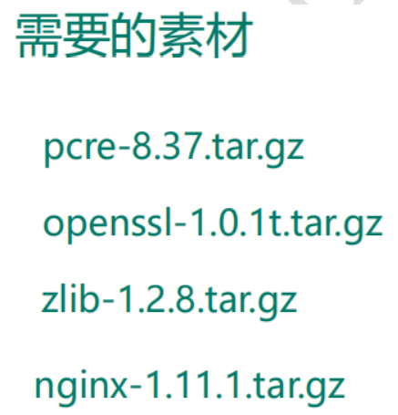

第一步，**安装 pcre** wget http://downloads.sourceforge.net/project/pcre/pcre/8.37/pcre-8.37.tar.gz

解压文件， ./configure 完成后，回到 pcre 目录下执行 make， 再执行 make install


第二步，**安装 openssl**

 第三步，**安装 zlib** yum -y install make zlib zlib-devel gcc-c++ libtool openssl openssl-devel

第四步，**安装 nginx** 1、 解压缩 nginx-xx.tar.gz 包。 2、 进入解压缩目录，执行./configure。 3、 make && make install

进入目录 /usr/local/assets/sbin/nginx 启动服务

# 3 常用命令

```bash
$ ./nginx -v # 版本号
$ ./nginx -s stop # 关闭
$ ./nginx # 启动
$ ./nginx -s reload # 重新加载配置
```


# 4 配置文件

配置文件位置 /usr/local/assets/conf/nginx.conf

根据上述文件，我们可以很明显的将 nginx.conf 配置文件分为三部分：  

第一部分：**全局块**  从配置文件开始到 events 块之间的内容，主要会设置一些影响 nginx 服务器整体运行的配置指令，主要包括配 置运行 Nginx 服务器的用户（组）、允许生成的 worker process 数，进程 PID 存放路径、日志存放路径和类型以 及配置文件的引入等。这是 Nginx 服务器并发处理服务的关键配置，worker_processes 值越大，可以支持的并发处理量也越多，但是 会受到硬件、软件等设备的制约

```
worker_processes  1; # 并发处理量指标
```

第二部分**：events 块** 涉及的指令主要影响 Nginx 服务器与用户的网络连接，常用的设置包括是否开启对多 work process  下的网络连接进行序列化，是否允许同时接收多个网络连接，选取哪种事件驱动模型来处理连接请求，每个 word  process 可以同时支持的最大连接数等。 上述例子就表示每个 work process 支持的最大连接数为 1024. 这部分的配置对 Nginx 的性能影响较大，在实际中应该灵活配置。

```
events {
    worker_connections  1024; # 支持最大连接数
} 
```

第三部分：**http 块** 这算是 Nginx 服务器配置中最频繁的部分，代理、缓存和日志定义等绝大多数功能和第三方模块的配置都在这里。

需要注意的是：http 块也可以包括 **http 全局块、server 块**。 

​	①、http 全局块 http 全局块配置的指令包括文件引入、MIME-TYPE 定义、日志自定义、连接超时时间、单链接请求数上限等。

​	②、server 块 这块和虚拟主机有密切关系，虚拟主机从用户角度看，和一台独立的硬件主机是完全一样的，该技术的产生是为了 节省互联网服务器硬件成本。 每个 http 块可以包括多个 server 块，而每个 server 块就相当于一个虚拟主机。 而每个 server 块也分为全局 server 块，以及可以同时包含多个 locaton 块。 

​		1、全局 server 块 最常见的配置是本虚拟机主机的监听配置和本虚拟主机的名称或 IP 配置。 

​		2、location 块 一个 server 块可以配置多个 location 块。 这块的主要作用是基于 Nginx 服务器接收到的请求字符串（例如 server_name/uri-string），对虚拟主机名称 （也可以是 IP 别名）之外的字符串（例如 前面的 /uri-string）进行匹配，对特定的请求进行处理。地址定向、数据缓 存和应答控制等功能，还有许多第三方模块的配置也在这里进行。

```
http {
    include       mime.types;
    default_type  application/octet-stream;

    sendfile        on;

    keepalive_timeout  65;

    server {
        listen       80;
        server_name  localhost;

        location / {
            root   html;
            index  index.html index.htm;
        }

        error_page   500 502 503 504  /50x.html;
        location = /50x.html {
            root   html;
        }

    }
```


# 5 nginx配置实例-反向代理

## 5.1 实例一

实现效果：使用 nginx 反向代理，访问 www.123.com 直接跳转到 127.0.0.1:8080 tomcat主页中

域名由host文件中映射为对应ip进行处理


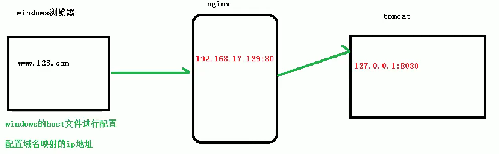

配置

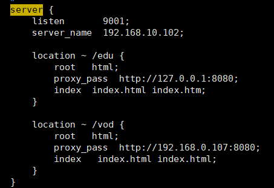

## 5.2 实例二

实现效果：使用 nginx 反向代理，根据访问的路径跳转到不同端口的服务中 nginx 监听端口为 9001， 访问 http://127.0.0.1:9001/edu/ 直接跳转到 192.168.10.102:8080虚拟机的tomcat 访问 http://127.0.0.1:9001/vod/ 直接跳转到 192.168.0.107:8080主机的tomcat

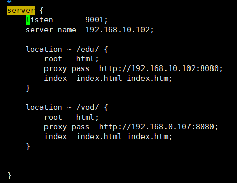

location 指令说明  该指令用于匹配 URL。

 1、= ：用于不含正则表达式的 uri 前，要求请求字符串与 uri 严格匹配，如果匹配 成功，就停止继续向下搜索并立即处理该请求。 

2、~：用于表示 uri 包含正则表达式，并且区分大小写。 

3、~*：用于表示 uri 包含正则表达式，并且不区分大小写。 **

*4、^~：用于不含正则表达式的 uri 前，要求 Nginx 服务器找到标识 uri 和请求字 符串匹配度最高的 location 后，立即使用此 location 处理请求，而不再使用 location  块中的正则 uri 和请求字符串做匹配。 注意：如果 uri 包含正则表达式，则必须要有 ~ 或者 ~* 标识。

# 6 nginx配置实例-负载均衡

浏览器地址栏输入地址 http://192.168.17.129/edu/a.html，负载均衡效果，平均 主机tomcat 和 虚拟机tomcat 中

在两台 tomcat 里面 webapps 目录中，创建名称是 edu 文件夹，在 edu 文件夹中创建 页面 a.html，用于测试

在 nginx 的配置文件中进行负载均衡的配置

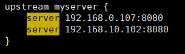

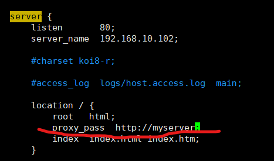

重载配置后，访问nginx80端口 ，两个tomcat交替出现

Nginx 提供了几种分配方式(策略)：

1、轮询（默认） 每个请求按时间顺序逐一分配到不同的后端服务器，如果后端服务器 down 掉，能自动剔除。 

2、weight weight 代表权,重默认为 1,权重越高被分配的客户端越多 指定轮询几率，weight 和访问比率成正比，用于后端服务器性能不均的情况。 例如

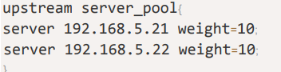

3、ip_hash 每个请求按访问 ip 的 hash 结果分配，这样每个访客固定访问一个后端服务器，可以解决 session 的问题。 例如：

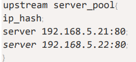

4、fair（第三方） 按后端服务器的响应时间来分配请求，响应时间短的优先分配。

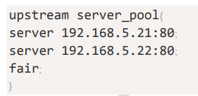

# 7 nginx配置实例-动静分明

## 7.1概述

Nginx 动静分离简单来说就是把动态跟静态请求分开，不能理解成只是单纯的把动态页面和 静态页面物理分离。严格意义上说应该是动态请求跟静态请求分开，可以理解成**使用 Nginx  处理静态页面，Tomcat 处理动态页面**。动静分离从目前实现角度来讲大致分为两种， 一种是**纯粹把静态文件独立成单独的域名，放在独立的服务器上**，也是目前主流推崇的方案； 另外一种方法就是**动态跟静态文件混合在一起发布，通过 nginx 来分开**。

## 7.2 nginx配置原理

通过 location 指定不同的后缀名实现不同的请求转发。通过 expires 参数设置，可以使 浏览器缓存过期时间，减少与服务器之前的请求和流量。具体 Expires 定义：是给一个资 源设定一个过期时间，也就是说无需去服务端验证，直接通过浏览器自身确认是否过期即可， 所以不会产生额外的流量。此种方法非常适合不经常变动的资源。（如果经常更新的文件， 不建议使用 Expires 来缓存），我这里设置 3d，表示在这 3 天之内访问这个 URL，发送 一个请求，比对服务器该文件最后更新时间没有变化，则不会从服务器抓取，返回状态码 304，如果有修改，则直接从服务器重新下载，返回状态码 200

## 7.3 案例

准备工作：


进行 nginx 配置

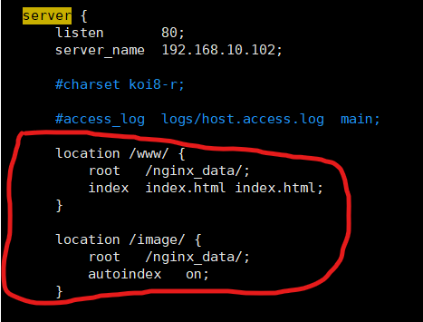

autoindex 可以列出文件名

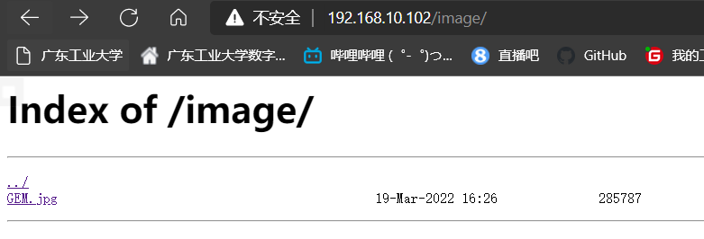

重点是添加 location， 最后检查 Nginx 配置是否正确即可，然后测试动静分离是否成功，之需要删除后端 tomcat  服务器上的某个静态文件，查看是否能访问，如果可以访问说明静态资源 nginx 直接返回 了，不走后端 tomcat 服务

# 8 nginx配置高可用集群

## 8.1 准备工作


两台服务器


	

两台服务器安装keepalived

```bash
$ yum install -y keepalived
```

## 8.2 高可用集群配置

修改keepalived.conf

```con
! Configuration File for keepalived

global_defs {
   notification_email {
     acassen@firewall.loc
     failover@firewall.loc
     sysadmin@firewall.loc
   }
   notification_email_from Alexandre.Cassen@firewall.loc
   smtp_server 192.168.10.102
   smtp_connect_timeout 30
   router_id LVS_DEVEL
   vrrp_skip_check_adv_addr
   vrrp_strict
   vrrp_garp_interval 0
   vrrp_gna_interval 0
}

vrrp_script chk_http_port {
    script  "/usr/local/src/nginx_check.sh"
    interval  2 #（检测脚本执行的间隔）
    weight  2
}


vrrp_instance VI_1 {
    state MASTER
    interface ens33
    virtual_router_id 51
    priority 100
    advert_int 1
    authentication {
        auth_type PASS
        auth_pass 1111
    }
    virtual_ipaddress {
        192.168.10.50
    }
}


}

```

脚本  nginx_check.sh放入/usr/local/src

```shell
#!/bin/bash
A=`ps -C nginx –no-header |wc -l`
if [ $A -eq 0 ];then
    /usr/local/assets/sbin/nginx
    sleep 2
    if [ `ps -C nginx --no-header |wc -l` -eq 0 ];then
        killall keepalived
    fi
fi
```

启动 nginx：./nginx 

启动 keepalived：systemctl start keepalived.service

最终测试  在浏览器地址栏输入 虚拟 ip 地址 192.168.17.50

把主服务器（192.168.17.129）nginx 和 keepalived 停止，再输入 192.168.17.50

# 9 nginx原理

## 9.1 master 和 worke


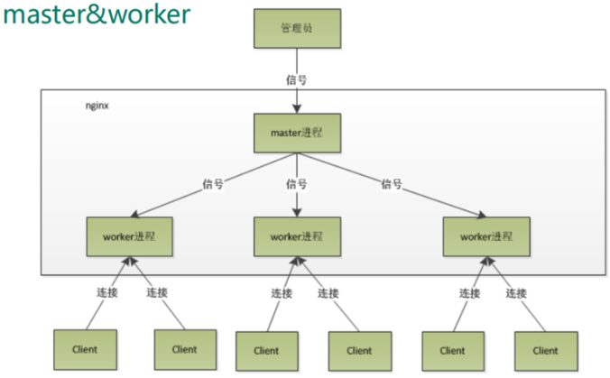


一个 master 和多个 woker 有好处 

（1）可以使用 nginx –s reload 热部署，利用 nginx 进行热部署操作 

（2）每个 woker 是独立的进程，如果有其中的一个 woker 出现问题，其他 woker 独立的， 继续进行争抢，实现请求过程，不会造成服务中断

需要设置多少个 worker 

Nginx 同 redis 类似都采用了 io 多路复用机制，每个 worker 都是一个独立的进程，但每个进 程里只有一个主线程，通过异步非阻塞的方式来处理请求， 即使是千上万个请求也不在话 下。每个 worker 的线程可以把一个 cpu 的性能发挥到极致。**所以 worker 数和服务器的 cpu 数相等是最为适宜的。**设少了会浪费 cpu，设多了会造成 cpu 频繁切换上下文带来的损耗。 

```
#设置 worker 数量。 
worker_processes 4 

#work 绑定 cpu(4 work 绑定 4cpu)。 
worker_cpu_affinity 0001 0010 0100 1000 

#work 绑定 cpu (4 work 绑定 8cpu 中的 4 个) 。 
worker_cpu_affinity 0000001 00000010 00000100 0000100
```

连接数 worker_connection

连接数 worker_connection 这个值是表示每个 worker 进程所能建立连接的最大值，所以，一**个 nginx 能建立的最大连接 数，应该是 worker_connections * worker_processes**。当然，这里说的是最大连接数，对于 HTTP 请 求 本 地 资 源 来 说 ， 能 够 支 持 的 最 大 并 发 数 量 是 worker_connections *  worker_processes，如果是支持 **http1.1 的浏览器每次访问要占两个连接**，所以普通的静态访 问最大并发数是： worker_connections * worker_processes /2，而如果是 HTTP 作 为反向代 理来说，最大并发数量应该是 worker_connections *  worker_processes/4。因为**作为反向代理服务器，每个并发会建立与客户端的连接和与后端服 务的连接，会占用两个连接。**


连接数 worker_connection 

第一个：发送请求，占用了 woker 的几个连接数？ 

答案：2 或者 4 个 第二个：nginx 

有一个 master，有四个 woker，每个 woker 支持最大的连接数 1024，支持的 最大并发数是多少？ 

1, 普通的静态访问最大并发数是： worker_connections * worker_processes /2

2, 而如果是 HTTP 作 为反向代理来说，最大并发数量应该是 worker_connections *  worker_processes/4
