[TOC]


# 1 NoSQL数据库简介

## 1.1 技术发展

**技术的分类**

1. 解决功能性的问题:Java、Jsp、 RDBMS、 Tomcat、HTML、 Linux、JDBC、SVN
2. 解决扩展性的问题: Struts、 Spring、 SpringMVc、 Hibernate、 Mybatis
3. 解决性能的问题: **NoSQL**、Java线程、 Hadoop、 Nginx. MQ、 ElasticSearch+

**Web1.0时代**

单点服务器解决大部分问题


**Web2.0时代**

用户访问量大幅度提升，智能移动设备普及，互联网平台面临性能挑战。

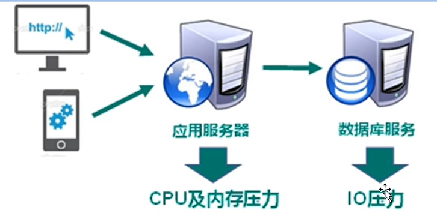

**解决CPU和内存压力**

为了解决该问题，通常使用分布式架构（集群）服务器。

此时如何解决session在不同服务器的共享存取问题：

1. 存储到客户端中的cookie，安全性低
2. 存储于文件服务器或数据服务器，增大了IO压力。
3. session复制 数据冗余，浪费空间
4. 缓存于NoSQL数据库中，完全在内存中，速度快，数据结构简单

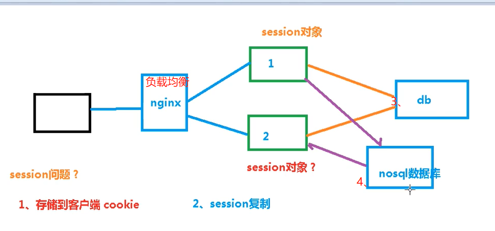

**解决IO压力**

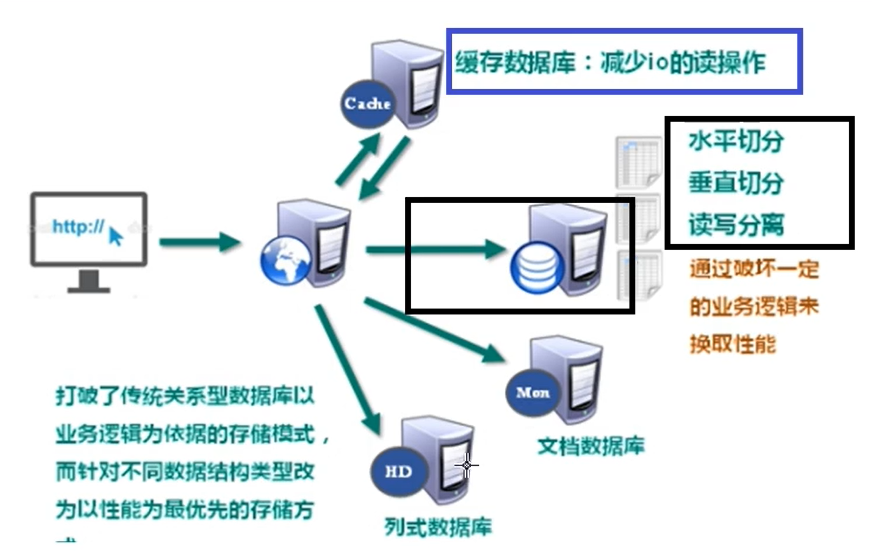

## 1.2 NOSQL数据库

**概述**

NoSQL( NOSQL= Not Only SQL),意即“不仅仅是SQL”,泛指非关系型的数据库。“

NOSQL不依赖业务逻辑方式存储,而以简单的key- value模式存储。因此大大的增加了数据库的扩展能力。

* 不遵循SQL标准
* 不支持ACID（支持事务）
* 远超于SQL的性能

**适用场景**

* 对数据高并发的读写
* 海量数据的读写
* 对数据高可扩展性的

**不适用场景**

* 需要事务支持
* 基于sq的结构化查询存储,处理复杂的关系需要即席查询。
* (用不着sql的和用了sq也不行的情况,请考虑用NoSql)

**Mem cache**（Key-value）

**Redis**（Key-value）

* 几乎覆盖了 Memcached的绝大部分功能
* 数据都在内存中,支持持久体、主要用作备份恢复
* 除了支持简单的key- value模式,还支持多种数据结构的存储,比如list、set、hash、zset等
* 一般是作为缓存数据库辅助持久化的数据库

**MongoDB**（Document）

* 文档型数据库
* 内存不足，可以存储硬盘
* key- value模式对value 尤其json，提高丰富查询方法
* 一般是作为缓存数据库辅助持久化的数据库

## 1.3 行式存储数据库

### 1.3.1 行式数据库（Relational）


### 1.3.2 列式数据库（Wide column）

OLTP是传统的关系型数据库的主要应用，主要是基本的、日常的事务处理，例如银行交易。

OLAP是数据仓库系统的主要应用，支持复杂的分析操作，侧重决策支持，并且提供直观易懂的查询结果。

**常见列式数据库**

* Hbase
* Cassandra

## 1.4 图关系型数据库

主要应用:社会关系,公共交通网络,地图及网络拓谱(n+(n-1)/2)

## 1.5 数据库排名

[DB-Engines Ranking - popularity ranking of database management systems](https://db-engines.com/en/ranking)

# 2 Redis6概述

* Reds是一个开源的**key- value**存储系统。
* 和 Memcached类似,它支持存储的vaue类型相对更多,包括 **string**(字符串)、
  **list**(链表)、set(集合)、**zset**( sorted set-有序集合和hash(哈希类型)
* 这些数据类型都支持push/pop、 add/remove及取交集并集和差集及更丰富的操作,而且这些操作都是**原子性**的。
* 在此基础上, Redis支持各种不同方式的**排序**。
* 与 memcached一样,为了保证效率,数据都是**缓存在内存**中。
* 区别的是 Redis会**周期性**的把更新的数据写入磁盘或者把修改操作写入追加的记录文件
* 并且在此基础上实现了 **master-save(主从)**同步。

## 2.1 应用场景

**配合关系型数据库做高速缓存**

高频次,热门访问的数据,降低数据库IO
分布式架构,做 session共享

**多样的数据结构存储持久化数据**

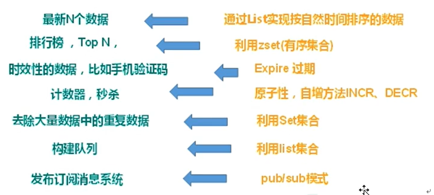

## 2.2 安装

官方网站：[Redis](https://redis.io/)

实际使用都是在**Linux**系统环境下

安装C语言编译环境gcc

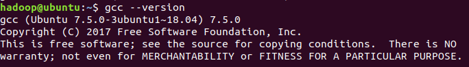

```bash
sudo mv redis-6.2.6.tar.gz  /opt/
cd /opt
sudo tar -zxvf redis-6.2.6.tar.gz
cd redis-6.2.6/
sudo make
```

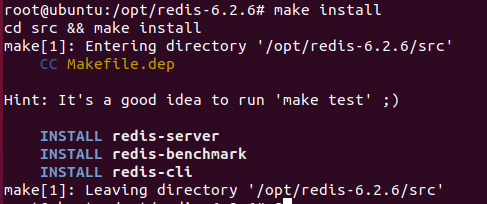

## 2.3 安装目录:/usr/local/bin
查看默认安装目录
reds- benchmark:性能测试工具,可以在自己本子运行,看看自己本子性能如何
redis- check-aof:修复有问题的AOF文件,rdb和aof后面讲
redis- check-dump:修复有问题的dump.rdb文件
redis- sentinel: Redis集群使用
reds- server:Reds服务器启动命令
redis-c:客户端,操作入口

## 2.4 前台启动

```bash
 redis-server
```

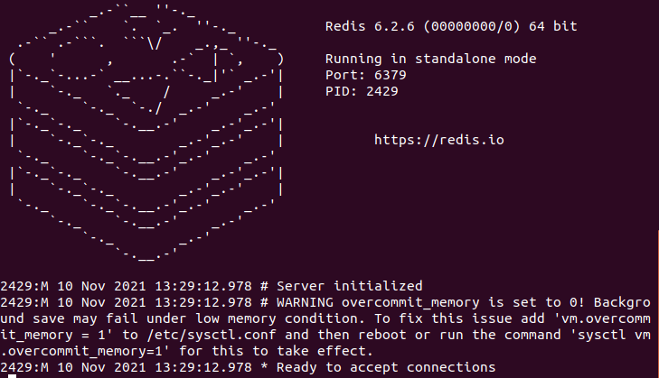

## 2.5 后台启动

备份redis.conf

修改 redis, conf(128行文件将里面的 daemonize no改成yes,让服务在后台启动

后台启动

```bash
  root@ubuntu:/opt/redis-6.2.6# redis-server /etc/redis.conf 
 root@ubuntu:/opt/redis-6.2.6# ps -ef|grep redis
root       3118   1838  0 13:38 ?        00:00:00 redis-server 127.0.0.1:6379
root       3124   3083  0 13:39 pts/0    00:00:00 grep --color=auto redis

```

客户端访问

```bash
root@ubuntu:/opt/redis-6.2.6# redis-cli
127.0.0.1:6379> ping
PONG
```

redis关闭

```bash
127.0.0.1:6379> shutdown
not connected> exit

```

```bash
root@ubuntu:/opt/redis-6.2.6# ps -ef | grep redis
root       3152   1838  0 13:44 ?        00:00:00 redis-server 127.0.0.1:6379
root       3159   3083  0 13:44 pts/0    00:00:00 grep --color=auto redis
root@ubuntu:/opt/redis-6.2.6# kill -9 3152
root@ubuntu:/opt/redis-6.2.6# ps -ef | grep redis
root       3162   3083  0 13:45 pts/0    00:00:00 grep --color=auto redis

```

## 2.6 Redis相关知识介绍

默认16个数据库,类似数组下标从0开始,初始默认使用0号库

* 使用命令 `select <dbid>`来切换数据库。如: select8
* 统一密码管理,所有库同样密码。
* dbsize查看当前数据库的key的数量
* flushdb清空当前库
* flushall通杀全部库。


**Redis是单线程+多路Io复用技术**
多路复用是指使用—个线程来检查多个文件描述符( Socket)的就绪状态,比如调用select和pol函数,传入多个文件描述符,如果有—个文件描述符就绪,则返回,否则阻塞直到超时。得到就绪状态后进行真正的操作可以在同一个线程里执行,也可以启动线程执行(比如使用线程池)

**串行vs多线程+锁( memcached)vs单线程+多路Io复用(Redis)**

# 3 常用五大数据类型

## 3.1 Redis键（Key）

* keys \*查看当前库所有key(匹配:keys*1)

* exists key判断某个key是否存在

  ```bash
  127.0.0.1:6379> exists k1
  (integer) 1
  127.0.0.1:6379> exists k4
  (integer) 0
  
  ```

  

* type key查看你的key是什么类型

* del ke删除指定的key数据

* unlink key根据 value选择非阻塞删除

  仅将keys从 keyspace元数据中删除,真正的删除会在后续异步操作。“

* expire key10 10秒钟:为给定的key设置过期时间

* tkey查看还有多少秒过期,-1表示永不过期,-2表示已过期

  ```bash
  127.0.0.1:6379> expire k1 10
  (integer) 1
  127.0.0.1:6379> ttl k1
  (integer) 7
  127.0.0.1:6379> ttl k1
  (integer) 5
  127.0.0.1:6379> ttl k1
  (integer) 1
  127.0.0.1:6379> ttl k1
  (integer) -2
  127.0.0.1:6379> ttl k2
  (integer) -1
  
  ```

  

## 3.2 Redis字符串(String)

### 简介

String是 Redis最基本的类型,你可以理解成与 Memcached-模一样的类型对应一个vaue。
String类型是二进制安全的。意味着Reds的 string可以包含任何数据。比如jpg图片或者序列化的对象。
sing类型是 Redis最基本的数据类型,一个 Redis中字符串 value最多可以是512M

### <span id="String常用命令">常用命令</span>

* `set <key> <vaue>`添加键值对

  ```bash
  127.0.0.1: 6379> setlkey value [EX seconds |PX milliseconds IKEEPTTL] [NXIXX
  ```

  * NX:当数据库中key不存在时,可以将key-vaUe添加数据库
  * XX:当数据库中key存在时,可以将key- value添加数据库,与NX参数互斥
  * EX:key的超时秒数
  * PX:key的超时毫秒数,与EX互斥

* `get <key>`查询对应键值

* `append <key> <vaue>`将给定的`<vaue>`追加到原值的末尾

* `strlen <key>`获得值的长度

* `setnx <key> <vaue>`只有在key不存在时设置key的值

* `incr <key>`将key中储存的数字值增只能数字值操作,如果为空,新增值为1(原子操作)

* `decr <key>`将key中储存的数字值减1(原子操作)

* `incrby/ decrby <key> <步长>`将key中储存的数字值增减。自定义步长。(原子操作)

> 所谓**原子操作**是指不会被线程调度机制打断的操作;
> 这种操作一旦开始,就一直运行到结束,中间不会有任何 context switch(切换到另线程)。
>
> 1) 在单线程中,能够在单条指令中完成的操作都可以认为是原子操作”,因为中断只能发生于指令之间。
> 2) 在多线程中,不能被其它进程(线程)打断的操作就叫原子操作。
>
> Reds单命令的原子性主要得益于 Redis的单线程。

* `mset <key 1> <value 1> <key 2> <value2>`同时设置一个或多个key-vaue对

* `mget <key 1><key 2><key 3>`同时获取一个或多个va

* `msetnx <key 1><value1><key 2><value2>`同时设置一个或多个key- value对,当且仅当所有给定key都不存在。

  **(原子性,有一个失败则都失败)**

* `getrange<key><起始位置><结束位置>`获得值的范围,类似java中的 substring,前包,后包

  ```bash
  127.0.0.1:6379> set k2 abcdefg
  OK
  127.0.0.1:6379> getrange k2 0 3
  "abcd"
  
  ```

  

* `setrange<key><起始位置>< value>`用`< value>`覆写`<key>`所储存的字符串值,从`<起始位置>`开始索引从0开始)。

* `setex <key> <过期时间> < value>`
  设置键值的同时,设置过期时间,单位秒。

* `getset <key> <value>`
  以新换旧,设置了新值同时获得旧值。

  ```bash
  127.0.0.1:6379> getset k2 hhhh
  "abcdefg"
  127.0.0.1:6379> get k2
  "hhhh"
  
  ```

### 数据结构

String的数据结构为简单动态字符串( Simple Dynamic String,缩写SDS)。是可以修改的字符串,内部结构实现上类似于Java的 Array List,采用**预分配冗余空间的方式来减少内存的频繁分配**

字符串最大长度为512M

内部为当前字符串实际分配的空间capacity一般要高于实际字符串长度len，当len大于capacity则进行扩容。当字符串长度小于1M时，扩容直解加倍现有空间。超过1M，扩容一次增加1M空间。

## 3.3 Redis列表(List)

### 简介

**单键多值**
Reds列表是简单的字符串列表,按照插入顺序排序。你可以添加一个元素到列表的头部(左边)或猪尾部(右边)。
它的底层实际是个**双向链表**,对两端的操作性能很高,通过索引下标的操作中间的节点性能会较差。

### 常用命令 

* `lpush/ rpush <key1> <value1> <value2> <value3>…`从左边/右边插入一个或多个值。

* `lpop/rpop <key>`从左边/右边吐出一个值。**值在键在,值光键亡**

* `rpoplpush <key1> <key2>`从`<key1>`列表右边吐出—个值,插到`<key2>`列表左边。

  ```bash
  127.0.0.1:6379> flushdb
  OK
  127.0.0.1:6379> rpush k1 v1 v2 v3
  (integer) 3
  127.0.0.1:6379> rpush k2 v4 v5 v6
  (integer) 3
  127.0.0.1:6379> rpoplpush k1 k2
  "v3"
  127.0.0.1:6379> lrange k2 0 -1
  1) "v3"
  2) "v4"
  3) "v5"
  4) "v6"
  
  ```

  

* `lrange <key ><start><stop>`,按照索引下标获得元素(从左到右)

* `lrange mylist 0 -1`  0左边第一个,1右边第一个,(0-1表示获取所有)

```bash
127.0.0.1:6379> lpush k1 v1 v2 v3
(integer) 3
127.0.0.1:6379> lrange k1 0 -1
1) "v3"
2) "v2"
3) "v1"

```


* `lindex<key>< index>`按照索引下标获得元素(从左到右)
* `llen <key>`获得列表长度
* `linsert <key> before <vaue> <newvalue>`在<value>的后面插入`< newvalue>`插入值
* `lrem <key> <n> <vaue>`从左边删除n个vaue从左到右)
* `lset <key> <index> <vaue>`将列表key下标为 index的值替换成 value.

### 数据结构

List的数据结构为快速链表 **quickList.**

首先在列表元素较少的情况下会使用一块连续的内存存储,这个结构是 ziplist,也即是压缩列表。

它将所有的元素紧挨着一起存储,分配的是一块连续的内存。

当数据量比较多的时候才会改成 quicklist

因为普通的链表需要的附加指针空间太大,会比较浪费空间。比如这个列表里存的只是int类型的数据,结构上还需要两个额外的指针prev和next


Redis将链表和ziplist结合起来组成了quicklist。也就是将多个ziplist使用双向指针串起来使用。**这样既满足了快速的插入删除性能，又不会出现太大的空间冗余。**

## 3.4 Redis集合(Set)

### 简介

类似list

**自动排重**

Reds的string类型的无序集合。它底层其实是个value为**null**的hash表**,所****以添加,删除,查找的复杂度都是o(1)。**

1个算法,随着数据的增加,执行时间的长短,如果是(1),数据增加,查找数据的时间不变

### 常用命令

* `sadd <key> <value1> <value2>……`将—个或多个 member元素加入到集合key中,已经存在的 member元素将被忽略
* `smembers<key>`取出该集合的所有值
* `sismember<key><value>`判断集合<key>是否为含有该< value>值,有1,没有0
* `scard<key>`返回该集合的元素个数。
* `srem<key><vaue1>< value2>`删除集合中的某个元素。
* `spop<key>`**随机**从该集合中吐出一个值。
* `srandmember <key> <n>`随机从该集合中取出n个值。不会从集合中删除。
* `smove <source><destination><value>`把集合中一个值从一个集合移动到另一个集合
* `sinter <key1><key2>`返回两个集合的交集元素。
* `sunion <key1><key2>`返回两个集合的并集元素。
* `sdiff <key1><key2>`返回两个集合的**差集**元素(key1中的，不包含key2中的)

### 数据结构

Set数据结构是dict字典，字典是用哈希表实现的。

Java中HashSet的内部实现使用的是HashMap，只不过所有的value都指向同一个对象。Redis的set结构也是一样，它的内部也使用hash结构，所有的value都指向同一个内部值。

## 3.5 Redis哈希(Hash)

### 简介

键值对集合

string类型的field和value的映射表

hash适合用于存储对象，类似于Java里面的Map<String,Object>

### 常用命令

* `hset <key><field><value>给<key>`集合中的 `<field>`键赋值`<value>`
* `hget <key1><field>从<key1>`集合`<field>`取出 value 
* `hmset <key1><field1><value1><field2><value2>...` 批量设置hash的值
* `hexists<key1><field>`查看哈希表 key 中，给定域 field 是否存在。 
* `hkeys <key>`列出该hash集合的所有field
* `hvals <key>`列出该hash集合的所有value
* `hincrby <key><field><increment>`为哈希表 key 中的域 field 的值加上增量 1  -1
* `hsetnx <key><field><value>`将哈希表 key 中的域 field 的值设置为 value ，当且仅当域 field 不存在 .

### 数据结构

Hash类型对应的数据结构是两种: ziplist(压缩列表), hashtable(哈希表)。当
field-aue长度较短且个数较少时,使用 ziplist,则使用 hashtable

## 3.6 Redis有序集合(Zset)

### 简介

类似set，时**没有重复元素**的字符串集合

关联一个评分（score），按照最低分到最高分方式排序成员。

集合中成员时唯一的，但是评分可以重复

### 常用命令

* `zadd <key><score1><value1><score2><value2>…`将一个或多个 member 元素及其 score 值加入到有序集 key 当中。
* `zrange <key><start><stop> [WITHSCORES]`  返回有序集 key 中，下标在`<start> <stop>`之间的元素带WITHSCORES，可以让分数一起和值返回到结果集。
* `zrangebyscore key min max [withscores] [limit offset count]`返回有序集 key 中，所有 score 值介于 min 和 max 之间(包括等于 min 或 max )的成员。有序集成员按 score 值递增(从小到大)次序排列。 
* `zrevrangebyscore key max min [withscores] [limit offset count]`        同上，改为从大到小排列。 
* `zincrby <key><increment><value>`   为元素的score加上增量
* `zrem <key><value>`删除该集合下，指定值的元素
* `zcount <key><min><max>`统计该集合，分数区间内的元素个数 
* `zrank <key><value>`返回该值在集合中的排名，**从0开始**。

### 数据结构

一方面它等价于Java的数据结构Map<String, Double>

一方面它又类似于TreeSet，内部的元素会按照权重score进行排序，可以得到每个元素的名次，还可以通过score的范围来获取元素的列表。

zset底层使用了两个数据结构

1. hash，hash的作用就是关联元素value和权重score，保障元素value的唯一性，可以通过元素value找到相应的score值。
2. 跳跃表，跳跃表的目的在于给元素value排序，根据score的范围获取元素列表。

> 跳跃表
>
> **有序集合**在生活中比较常见，例如根据成绩对学生排名，根据得分对玩家排名等。对于有序集合的底层实现，可以用数组、平衡树、链表等。**数组**不便元素的插入、删除；**平衡树或红黑树**虽然效率高但结构复杂；**链表**查询需要遍历所有效率低。**Redis采用的是跳跃表。跳跃表效率堪比红黑树，实现远比红黑树简单。**
>
> 
>
> 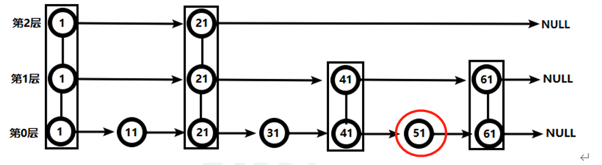

# 4 Reds6配置文件详解 redis.conf

[Redis 配置 | 菜鸟教程 (runoob.com)](https://www.runoob.com/Redis6/redis-conf.html)

# 5 Redis6的发布和订阅

## 5.1 什么是发布和订阅

Redis 发布订阅 (pub/sub) 是一种消息通信模式：发送者 (pub) 发送消息，订阅者 (sub) 接收消息。

Redis 客户端可以订阅任意数量的频道

## 5.2 Redis的发布和订阅

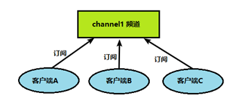

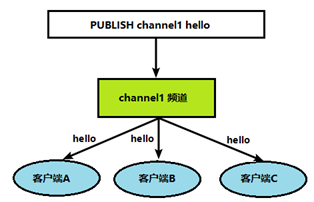

## 5.3 发布订阋命令行实现

打开一个客户端，订阅频道1

```bash
hadoop@ubuntu:~$ redis-cli
127.0.0.1:6379> subscribe channel1
Reading messages... (press Ctrl-C to quit)
1) "subscribe"
2) "channel1"
3) (integer) 1

```

打开另一个客户端，给频道1发送消息hello

```bash
hadoop@ubuntu:~$ redis-cli
127.0.0.1:6379> publish channel1 hello
(integer) 1

```

打开第一个客户端看到发送的消息消息

```bash
1) "message"
2) "channel1"
3) "hello"

```


# 6 Redis6新数据类型

## 6.1 Bitmap

### 6.1.1.  简介

现代计算机用二进制（位） 作为信息的基础单位， 1个字节等于8位。

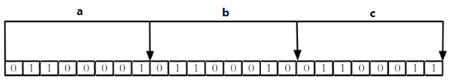

合理地使用操作位能够有效地提高内存使用率和开发效率。

Redis提供了Bitmaps这个“数据类型”可以实现对位的操作：

1. Bitmaps本身不是一种数据类型， 实际上它就是字符串（key-value） ， 但是它可以对字符串的位进行操作。
2. Bitmaps单独提供了一套命令， 所以在Redis中使用Bitmaps和使用字符串的方法不太相同。 可以把Bitmaps想象成一个以位为单位的数组， 数组的每个单元只能存储0和1， 数组的下标在Bitmaps中叫做偏移量。


### 6.1.2 命令

* `setbit <key> <offset> <value>` 设置Bitmaps中某个偏移量的值（0或1）

* `getbit <key> <offset>`获取Bitmaps中某个偏移量的值

* `bitcount <key> [start end]` 统计字符串从start**字节**到end字节比特值为1的数量

  般情况下，给定的整个字符串都会被进行计数，通过指定额外的 start 或 end 参数，可以让计数只在特定的位上进行。start 和 end 参数的设置，都可以使用负数值：比如 -1 表示最后一个位，而 -2 表示倒数第二个位，start、end 是指bit组的字节的下标数，二者皆包含。

* `bitop and(or/not/xor) <destkey> [key…]` bitop是一个复合操作， 它可以做多个Bitmaps的and（交集） 、 or（并集） 、 not（非） 、 xor（异或） 操作并将结果保存在destkey中。

### 6.1.3 应用

每个独立用户是否访问过网站存放在Bitmaps中， 将访问的用户记做1， 没有访问的用户记做0， 用偏移量作为用户的id。

> 很多应用的用户id以一个指定数字（例如10000） 开头， 直接将用户id和Bitmaps的偏移量对应势必会造成一定的浪费， 通常的做法是每次做setbit操作时将用户id减去这个指定数字。

### 6.1.4  Bitmaps与set对比

set存储访问过的id（64位），Bitmaps存储访问过id和为访问过的id（1位）

网站每天的独立访问用户很多时，使用Bitmaps存储id将比set节省大量存储空间

假如该网站每天的独立访问用户很少， 例如只有10万（大量的僵尸用户） ， 那么两者的对比如下表所示， 很显然， 这时候使用Bitmaps就不太合适了， 因为基本上大部分位都是0。

## 6.2 HyperLogLog

### 6.2.1 简介

在工作当中，我们经常会遇到与统计相关的功能需求，比如统计网站PV（PageView页面访问量）,可以使用Redis的incr、incrby轻松实现。但像UV（UniqueVisitor，独立访客）、独立IP数、搜索记录数等需要去重和计数的问题如何解决？这种求集合中**不重复元素个数**的问题称为**基数问题**。

解决基数问题的方案：

1. 数据存储在MySQL表中，使用distinct count计算不重复个数
2. 使用Redis提供的hash、set、bitmaps等数据结构来处理

弊端：随着数据不断增加，占用空间越来越大

解决：Redis HyperLogLog 是用来做基数统计的算法

**HyperLogLog 只会根据输入元素来计算基数，而不会储存输入元素本身，所以 HyperLogLog 不能像集合那样，返回输入的各个元素。**

### 6.2.2 命令

`pfadd <key>< element> [element ...]  `添加指定元素到 HyperLogLog 中

`pfcount<key> [key ...] `计算HLL的近似基数，可以计算多个HLL，比如用HLL存储每天的UV，计算一周的UV可以使用7天的UV合并计算即可

`pfmerge<destkey><sourcekey> [sourcekey ...]` 将一个或多个HLL合并后的结果存储在另一个HLL中，比如每月活跃用户可以使用每天的活跃用户来合并计算可得

## 6.3 Geospatial

### 6.3.1 简介

​	Redis 3.2 中增加了对GEO类型的支持。GEO，Geographic，地理信息的缩写。该类型，就是元素的2维坐标，在地图上就是经纬度。redis基于该类型，提供了经纬度设置，查询，范围查询，距离查询，经纬度Hash等常见操作。

### 6.3.2 命令

`geoadd<key>< longitude><latitude><member> [longitude latitude member...] ` 添加地理位置（经度，纬度，名称）

`geopos <key><member> [member...] `获得指定地区的坐标值

`geodist<key><member1><member2> [m|km|ft|mi ] `获取两个位置之间的直线距离

`georadius<key>< longitude><latitude>radius m|km|ft|mi  `以给定的经纬度为中心，找出某一半径内的元素

# 7 Jedis操作Redis6

## 7.1 依赖

```xml
<dependency>
<groupId>redis.clients</groupId>
<artifactId>jedis</artifactId>
<version>3.2.0</version>
</dependency>
```

## 7.2 连接Redis注意事项

redis.conf中注释掉bind 127.0.0.1 ,然后 protected-mode no

禁用Linux的防火墙：Linux(CentOS7)里执行命令`systemctl stop/disable firewalld.service  `  Ubuntu64 `sudo ufw disable`

## 7.3 测试连接

```java
public static void main(String[] args) {
    Jedis jedis = new Jedis("192.168.190.128", 6379);
    String pong = jedis.ping();
    System.out.println(pong);
}
```

## 7.4 测试Jedis API

## 7.5 模拟验证码发送

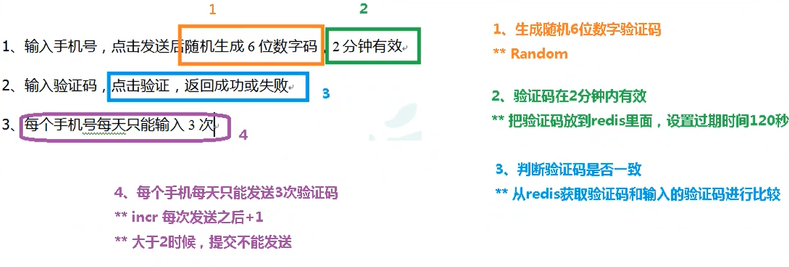


# 8 Reds6 Spring Boot整合

1. 在pom.xml文件中引入redis相关依赖

   ```xml
   <!-- redis -->
           <dependency>
               <groupId>org.springframework.boot</groupId>
               <artifactId>spring-boot-starter-data-redis</artifactId>
           </dependency>
   
           <!-- spring2.X集成redis所需common-pool2-->
           <dependency>
               <groupId>org.apache.commons</groupId>
               <artifactId>commons-pool2</artifactId>
               <version>2.6.0</version>
           </dependency>
   ```

   

2. application.properties配置redis配置

   ```properties
   #Redis服务器地址
   spring.redis.host=192.168.190.128
   #Redis服务器连接端口
   spring.redis.port=6379
   #Redis数据库索引（默认为0）
   spring.redis.database= 0
   #连接超时时间（毫秒）
   spring.redis.timeout=1800000
   #连接池最大连接数（使用负值表示没有限制）
   spring.redis.lettuce.pool.max-active=20
   #最大阻塞等待时间(负数表示没限制)
   spring.redis.lettuce.pool.max-wait=-1
   #连接池中的最大空闲连接
   spring.redis.lettuce.pool.max-idle=5
   #连接池中的最小空闲连接
   spring.redis.lettuce.pool.min-idle=0
   
   ```

   

3. 添加redis配置类

   ```java
   @EnableCaching
   @Configuration
   public class RedisConfig extends CachingConfigurerSupport {
   
       @Bean
       public RedisTemplate<String, Object> redisTemplate(RedisConnectionFactory factory) {
           RedisTemplate<String, Object> template = new RedisTemplate<>();
           RedisSerializer<String> redisSerializer = new StringRedisSerializer();
           Jackson2JsonRedisSerializer jackson2JsonRedisSerializer = new Jackson2JsonRedisSerializer(Object.class);
           ObjectMapper om = new ObjectMapper();
           om.setVisibility(PropertyAccessor.ALL, JsonAutoDetect.Visibility.ANY);
           om.enableDefaultTyping(ObjectMapper.DefaultTyping.NON_FINAL);
           jackson2JsonRedisSerializer.setObjectMapper(om);
           template.setConnectionFactory(factory);
   //key序列化方式
           template.setKeySerializer(redisSerializer);
   //value序列化
           template.setValueSerializer(jackson2JsonRedisSerializer);
   //value hashmap序列化
           template.setHashValueSerializer(jackson2JsonRedisSerializer);
           return template;
       }
   
       @Bean
       public CacheManager cacheManager(RedisConnectionFactory factory) {
           RedisSerializer<String> redisSerializer = new StringRedisSerializer();
           Jackson2JsonRedisSerializer jackson2JsonRedisSerializer = new Jackson2JsonRedisSerializer(Object.class);
   //解决查询缓存转换异常的问题
           ObjectMapper om = new ObjectMapper();
           om.setVisibility(PropertyAccessor.ALL, JsonAutoDetect.Visibility.ANY);
           om.enableDefaultTyping(ObjectMapper.DefaultTyping.NON_FINAL);
           jackson2JsonRedisSerializer.setObjectMapper(om);
   // 配置序列化（解决乱码的问题）,过期时间600秒
           RedisCacheConfiguration config = RedisCacheConfiguration.defaultCacheConfig()
                   .entryTtl(Duration.ofSeconds(600))
                   .serializeKeysWith(RedisSerializationContext.SerializationPair.fromSerializer(redisSerializer))
                   .serializeValuesWith(RedisSerializationContext.SerializationPair.fromSerializer(jackson2JsonRedisSerializer))
                   .disableCachingNullValues();
           RedisCacheManager cacheManager = RedisCacheManager.builder(factory)
                   .cacheDefaults(config)
                   .build();
           return cacheManager;
       }
   }
   
   ```

   

4. RedisTestController中添加测试方法

   ```java
   @RestController
   @RequestMapping("/redisTest")
   public class RedisConfigTest {
       @Autowired
       private RedisTemplate redisTemplate;
   
       @GetMapping
       public String testRedis() {
           redisTemplate.opsForValue().set("hello","hello");
           String hello = (String) redisTemplate.opsForValue().get("hello");
           return hello;
       }
   }
   ```

   > 要求 
   >
   > 对于springboot项目，新增的包文件需要放在启动类的同级包下。

# 9  Redis6的事务操作

## 9.1 事务的定义

和MySql的事务不一样

Redis事务是一个单独的隔离操作：事务中的所有命令都会序列化、按顺序地执行。事务在执行的过程中，不会被其他客户端发送来的命令请求所打断。

Redis事务的主要作用就是串联多个命令防止别的命令插队。

## 9.2  Multi、Exec、discard

从输入**Multi**命令开始，输入的命令都会依次进入命令队列中，但不会执行.

直到输入**Exec**后，Redis会将之前的命令队列中的命令依次执行。

组队的过程中可以通过**discard**来放弃组队。 

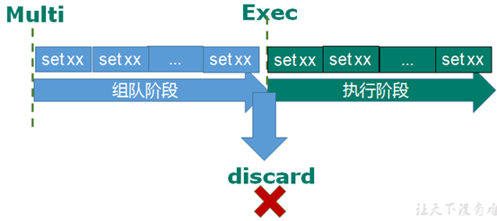

## 9.3  事务的错误处理

组队中某个命令出现了报告错误，执行时整个的所有队列都会被取消。

如果执行阶段某个命令报出了错误，则只有报错的命令不会被执行，而其他的命令都会执行，不会回滚。

## 9.4 事务的冲突问题

### 9.4.1 例子


### 9.4.2 悲观锁

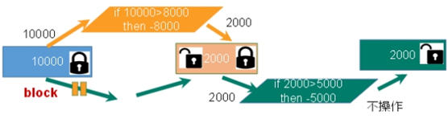

悲观锁是指在访问共享变量之前就认为会出现线程安全问题，所以需要在上锁之后再访问共享变量，由于悲观锁每次访问时都会上锁，就会造成程序的并发性降低。

**传统的关系型数据库里边就用到了很多这种锁机制**，比如**行锁**，**表锁**等，**读锁**，**写锁**等，都是在做操作之前先上锁。

### 9.4.3 乐观锁

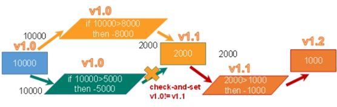

乐观锁是指在访问共享变量之前认为不会出现线程安全问题，所以不会上锁，如果在访问时出现了线程安全问题再解决

乐观锁在更新的时候会判断一下在此期间别人有没有去更新这个数据，可以使用版本号等机制。**乐观锁适用于多读的应用类型，这样可以提高吞吐量**。Redis就是利用这种check-and-set机制实现事务的。

通过watch命令减少共享的变量可以实现乐观锁

### 9.4.4  `WATCH key [key ...]`

在执行multi之前，先执行watch key1 [key2],可以监视一个(或多个) key ，如果在事务**执行之前这个(或这些) key** **被其他命令所改动，那么事务将被打断。**

### 9.4.5 unwatch

取消 WATCH 命令对所有 key 的监视。

如果在执行 WATCH 命令之后，EXEC 命令或DISCARD 命令先被执行了的话，那么就不需要再执行UNWATCH 了。

## 9.5   Redis事务三特性

* 单独的隔离操作
  * 事务中的所有命令都会序列化、按顺序地执行。事务在执行的过程中，不会被其他客户端发送来的命令请求所打断。 
* 没有隔离级别的概念 
  * 队列中的命令没有提交之前都不会实际被执行，因为事务提交前任何指令都不会被实际执行
* 不保证原子性 
  * 事务中如果有一条命令执行失败，其后的命令仍然会被执行，没有回滚 

## 9.6 Redis事务：秒杀案例

### 9.6.1 超卖问题 

解决：乐观锁 但是会造成库存遗留问题，因为大部分用户都因为版本号的问题导致事务失败。

### 9.6.2库存遗留问题 

解决: LUA脚本 （类似于悲观锁）

### 9.6.3 Lua脚本

Lua 是一个小巧的[脚本语言](http://baike.baidu.com/item/脚本语言)，Lua脚本可以很容易的被C/C++ 代码调用，也可以反过来调用C/C++的函数，Lua并没有提供强大的库，一个完整的Lua解释器不过200k，所以Lua不适合作为开发独立应用程序的语言，而是作为嵌入式脚本语言。

很多应用程序、游戏使用LUA作为自己的嵌入式脚本语言，以此来实现可配置性、可扩展性。

这其中包括魔兽争霸地图、魔兽世界、博德之门、愤怒的小鸟等众多游戏插件或外挂。

https://www.w3cschool.cn/lua/

### 9.6.4 Lua脚本在redis的优势

将复杂的或者多步的redis操作，写为一个脚本，一次提交给redis执行，减少反复连接redis的次数。提升性能。

LUA脚本是类似redis事务，有**一定的原子性**，不会被其他命令插队，可以完成一些redis事务性的操作。

但是注意redis的lua脚本功能，只有在Redis 2.6以上的版本才可以使用。

利用lua脚本淘汰用户，解决超卖问题。

redis 2.6版本以后，通过lua脚本解决**争抢问题**，实际上是**redis** **利用其单线程的特性，用任务队列的方式解决多任务并发问题**。

## 9.7 Redis连接池

节省每次连接redis服务带来的消耗，把连接好的实例反复利用。

通过参数管理连接的行为

* MaxTotal：控制一个pool可分配多少个jedis实例，通过pool.getResource()来获取；如果赋值为-1，则表示不限制；如果pool已经分配了MaxTotal个jedis实例，则此时pool的状态为exhausted。
* maxIdle：控制一个pool最多有多少个状态为idle(空闲)的jedis实例；
* MaxWaitMillis：表示当borrow一个jedis实例时，最大的等待毫秒数，如果超过等待时间，则直接抛JedisConnectionException；
* testOnBorrow：获得一个jedis实例的时候是否检查连接可用性（ping()）；如果为true，则得到的jedis实例均是可用的；

```java
public class JedisPoolUtil {
	private static volatile JedisPool jedisPool = null;

	private JedisPoolUtil() {
	}

	public static JedisPool getJedisPoolInstance() {
		if (null == jedisPool) {
			synchronized (JedisPoolUtil.class) {
				if (null == jedisPool) {
					JedisPoolConfig poolConfig = new JedisPoolConfig();
					poolConfig.setMaxTotal(200);
					poolConfig.setMaxIdle(32);
					poolConfig.setMaxWaitMillis(100*1000);
					poolConfig.setBlockWhenExhausted(true);
					poolConfig.setTestOnBorrow(true);  // ping  PONG
				 
					jedisPool = new JedisPool(poolConfig, "192.168.44.168", 6379, 60000 );
				}
			}
		}
		return jedisPool;
	}

	public static void release(JedisPool jedisPool, Jedis jedis) {
		if (null != jedis) {
			jedisPool.returnResource(jedis);
		}
	}

}
```


# 10 Redis6持久化

## 10.1 Redis持久化

[Redis Persistence – Redis](https://redis.io/topics/persistence)

Redis 提供了2个不同形式的持久化方式。

* RDB（Redis DataBase）
* AOF（Append Of File）

## 10.2 RDB（Redis DataBase）

### 10.2.1 简介 

在指定的时间间隔内**将内存中的数据集快照写入磁盘**， 也就是行话讲的Snapshot快照，它恢复时是将快照文件直接读到内存里

### 10.2.2 备份的执行

Redis会单独创建（fork）一个子进程来进行持久化，会先将数据写入到 一个临时文件中，待持久化过程都结束了，再用这个临时文件替换上次持久化好的文件。 整个过程中，主进程是不进行任何IO操作的，这就确保了极高的性能 如果需要进行大规模数据的恢复，且对于数据恢复的完整性不是非常敏感，那RDB方式要比AOF方式更加的高效。**RDB的缺点是最后一次持久化后的数据可能丢失**。

### 10.2.3 持久化流程

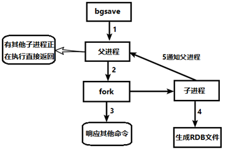

### 10.2.4 关于RDB的配置

在Redis.conf 的SNAPSHOTTING配置下

```c
################################ SNAPSHOTTING  ################################

# The filename where to dump the DB
# 默认快照文件名称
dbfilename dump.rdb
    
# Note that you must specify a directory here, not a file name.
# 快照文件位置
dir ./

# However if you have setup your proper monitoring of the Redis server
# and persistence, you may want to disable this feature so that Redis will
# continue to work as usual even if there are problems with disk,
# permissions, and so forth.
# 当Redis无法写入磁盘的话，直接关掉Redis的写操作。推荐yes.
stop-writes-on-bgsave-error yes

# Compress string objects using LZF when dump .rdb databases?
# By default compression is enabled as it's almost always a win.
# If you want to save some CPU in the saving child set it to 'no' but
# the dataset will likely be bigger if you have compressible values or keys.
# 对于存储到磁盘中的快照，可以设置是否进行压缩存储。如果是的话，redis会采用LZF算法进行压缩。
# 如果你不想消耗CPU来进行压缩的话，可以设置为关闭此功能。推荐yes.
rdbcompression yes

# Since version 5 of RDB a CRC64 checksum is placed at the end of the file.
# This makes the format more resistant to corruption but there is a performance
# hit to pay (around 10%) when saving and loading RDB files, so you can disable it
# for maximum performances.
#
# RDB files created with checksum disabled have a checksum of zero that will
# tell the loading code to skip the check.
# 在存储快照后，还可以让redis使用CRC64算法来进行数据校验，
# 但是这样做会增加大约10%的性能消耗，如果希望获取到最大的性能提升，可以关闭此功能
# 推荐yes.
rdbchecksum yes
    
# Unless specified otherwise, by default Redis will save the DB:
#   * After 3600 seconds (an hour) if at least 1 key changed
#   * After 300 seconds (5 minutes) if at least 100 keys changed
#   * After 60 seconds if at least 10000 keys changed
#
# You can set these explicitly by uncommenting the three following lines.
# 配置复合的快照触发条件，在指定时间内达到指定的写的操作次数则触发快照条件
# save后给空值，表示禁用保存策略 命令redis-cli config set save ""
# save 3600 1
# save 300 100
# save 60 10000


```

### 10.2.4 手动触发触发RDB快照

`save `：save时只管保存，其它不管，全部阻塞。手动保存。不建议。

`bgsave`：Redis会在后台异步进行快照操作，快照同时还可以响应客户端请求。

可以通过`lastsave `命令获取最后一次成功执行快照的时间

### 10.2.5 优势

* 适合大规模的数据恢复
*  对数据完整性和一致性要求不高更适合使用
* 节省磁盘空间
* 恢复速度快

### 10.2.6 劣势

* Fork的时候，内存中的数据被克隆了一份，大致2倍的膨胀性需要考虑
* 虽然Redis在fork时使用了**写时拷贝技术**,但是如果数据庞大时还是比较消耗性能。
* 在备份周期在一定间隔时间做一次备份，所以如果Redis意外down掉的话，就会丢失最后一次快照后的所有修改。

## 10.3 AOF（Append Of File）

### 10.3.1 简介

以**日志**的形式来记录每个写操作（增量保存），将Redis执行过的所有写指令记录下来(**读操作不记录**)， **只许追加文件但不可以改写文件**，redis启动之初会读取该文件重新构建数据，换言之，redis 重启的话就根据日志文件的内容将写指令从前到后执行一次以完成数据的恢复工作

### 10.3.2  AOF持久化流程

1. 客户端的请求写命令会被append追加到AOF缓冲区内；
2. AOF缓冲区根据AOF持久化策略[always,everysec,no]将操作sync同步到磁盘的AOF文件中；
3. AOF文件大小超过重写策略或手动重写时，会对AOF文件rewrite重写，压缩AOF文件容量；
4. Redis服务重启时，会重新load加载AOF文件中的写操作达到数据恢复的目的；

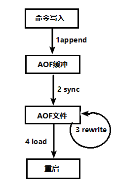

### 10.3.3 关于AOF的配置

```c
############################## APPEND ONLY MODE ###############################
# AOF and RDB persistence can be enabled at the same time without problems.
# If the AOF is enabled on startup Redis will load the AOF, that is the file
# with the better durability guarantees.
# AOF和RDB同时开启，系统默认取AOF的数据（数据不会存在丢失）
# Please check https://redis.io/topics/persistence for more information.

# AOF默认不开启
# 开启AOF
appendonly yes

# The name of the append only file (default: "appendonly.aof")

appendfilename "appendonly.aof"

# AOF同步频率设置
# 始终同步，每次Redis的写入都会立刻记入日志；性能较差但数据完整性比较好
# appendfsync always
# 每秒同步，每秒记入日志一次，如果宕机，本秒的数据可能丢失。
appendfsync everysec
# redis不主动进行同步，把同步时机交给操作系统。
# appendfsync no

# AOF重写机制设置
#如果 no-appendfsync-on-rewrite=yes ,rdb 的快照不写入aof文件只写入缓存，用户请求不会阻塞，但是在这段时间如果宕机会丢失这段时间的缓存数据。（降低数据安全性，提高性能）
#如果 no-appendfsync-on-rewrite=no,  还是会把数据往磁盘里刷，但是遇到重写操作，可能会发生阻塞。（数据安全，但是性能降低）
no-appendfsync-on-rewrite no

# Redis会记录上次重写时的AOF大小，默认配置是当AOF文件大小是上次rewrite后大小的一倍且文件大于64M时触发
# 设置重写的基准值，文件达到100%时开始重写（文件是原来重写后文件的2倍时触发）
auto-aof-rewrite-percentage 100
# 设置重写的基准值，最小文件64MB。达到这个值开始重写。
auto-aof-rewrite-min-size 64mb

```

### 10.3.4 AOF恢复的机制

 AOF的备份机制和性能虽然和RDB不同, 但是备份和恢复的操作同RDB一样，都是拷贝备份文件，需要恢复时再拷贝到Redis工作目录下，启动系统即加载。

* 正常恢复

  * 修改默认的appendonly no，改为yes

  * 将有数据的aof文件复制一份保存到对应目录(查看目录：config get dir)

  * 恢复：重启redis然后重新加载

* 异常恢复

  * 修改默认的appendonly no，改为yes

  * 如遇到AOF文件损坏，通过/usr/local/bin/`redis-check-aof--fix appendonly.aof`进行恢复

  * 备份被写坏的AOF文件

  * 恢复：重启redis，然后重新加载

### 10.3.5 Rewrite压缩

**定义**

AOF采用文件追加方式，文件会越来越大为避免出现此种情况，新增了重写机制, 当AOF文件的大小超过所设定的阈值时，Redis就会启动AOF文件的内容压缩， 只保留可以恢复数据的最小指令集.可以使用命令`bgrewriteaof`

**重写原理**

AOF文件持续增长而过大时，会fork出一条新进程来将文件重写(也是先写临时文件最后再rename)，redis4.0版本后的重写，是指上就是把rdb 的快照，以二级制的形式附在新的aof头部，作为已有的历史数据，替换掉原来的流水账操作。

重写虽然可以节约大量磁盘空间，减少恢复时间。但是每次重写还是有一定的负担的，因此设定Redis要满足一定条件才会进行重写。 

如果Redis的AOF当前大小>= base_size +base_size*100% (默认)且当前大小>=64mb(默认)的情况下，Redis会对AOF进行重写。 （base_size为系统载入时或者上次重写完毕时AOF文件大小）

**重写流程**

1. bgrewriteaof触发重写，判断是否当前有bgsave或bgrewriteaof在运行，如果有，则等待该命令结束后再继续执行。
2. 主进程fork出子进程执行重写操作，保证主进程不会阻塞。
3. 子进程遍历redis内存中数据到临时文件，客户端的写请求同时写入aof_buf缓冲区和aof_rewrite_buf重写缓冲区保证原AOF文件完整以及新AOF文件生成期间的新的数据修改动作不会丢失。
4. 子进程写完新的AOF文件后，向主进程发信号，父进程更新统计信息。2).主进程把aof_rewrite_buf中的数据写入到新的AOF文件。
5. 使用新的AOF文件覆盖旧的AOF文件，完成AOF重写。

### 10.3.6 优势

* 备份机制更稳健，丢失数据概率更低。
*  可读的日志文本，通过操作AOF稳健，可以处理误操作。

### 10.3.7 劣势

* 比起RDB占用更多的磁盘空间。
*  恢复备份速度要慢。
*  每次读写都同步的话，有一定的性能压力。
*  存在个别Bug，造成恢复不能。

## 10.4 总结

官方推荐两个都启用。

如果对数据不敏感，可以选单独用RDB。

不建议单独用 AOF，因为可能会出现Bug。

如果只是做纯内存缓存，可以都不用。

# 11 Redis6的主从复制

## 11.1 主从复制

主机数据更新后根据配置和策略， 自动同步到备机的master/slaver机制，Master以写为主，Slave以读为主。

## 11.2 作用

* 读写分离，性能扩展
* 容灾快速恢复

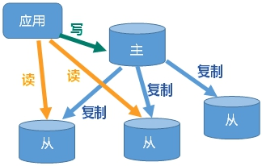

## 11.3  实现主从复制

**拷贝原配置文件redis.conf , 并创建三个配置文件（一主二从）**

```bash
root@ubuntu:/home/hadoop/myredis# ls 
redis6379.conf  redis6380.conf  redis6381.conf  redis.conf

```

**配置如下，以redis6379.conf为例**

```c
# 拷贝多个redis.conf文件include(写绝对路径)
include /home/hadoop/myRedis6/redis.conf
# Pid文件名字
pidfile /var/run/redis_6379.pid
# 指定端口
port 6379
#　dump.rdb名字
dbfilename dump6379.rdb
```

**启动三台服务器**

```bash
root@ubuntu:/home/hadoop/myredis# redis-server redis6379.conf
root@ubuntu:/home/hadoop/myredis# redis-server redis6380.conf
root@ubuntu:/home/hadoop/myredis# redis-server redis6381.conf
root@ubuntu:/home/hadoop/myredis# ps -ef | grep redis
root       8651   1610  0 11:18 ?        00:00:00 redis-server *:6379
root       8658   1610  0 11:18 ?        00:00:00 redis-server *:6380
root       8664   1610  0 11:18 ?        00:00:00 redis-server *:6381
root       8670   8504  0 11:18 pts/0    00:00:00 grep --color=auto redis
```

**连接服务器并查看主机状态（以端口6379为例）**

```bash
hadoop@ubuntu:~$ redis-cli -p 6379 
127.0.0.1:6379> keys *
(empty array)
127.0.0.1:6379> info replication
# Replication
role:master
connected_slaves:0
master_failover_state:no-failover
master_replid:e579e33c7f98a9fde75b6ce35febc89062d1d25e
master_replid2:0000000000000000000000000000000000000000
master_repl_offset:0
second_repl_offset:-1
repl_backlog_active:0
repl_backlog_size:1048576
repl_backlog_first_byte_offset:0
repl_backlog_histlen:0

```

**配置从库和主库**

`slaveof <ip><port>`成为某个实例的从服务器

1. 在6380和6381上执行: slaveof 127.0.0.1 6379

   ```bash
   127.0.0.1:6380> slaveof 127.0.0.1 6379
   OK
   127.0.0.1:6380> info replication
   # Replication
   role:slave
   master_host:127.0.0.1
   master_port:6379
   master_link_status:up
   
   127.0.0.1:6381> slaveof 127.0.0.1 6379
   OK
   127.0.0.1:6381> info replication
   # Replication
   role:slave
   master_host:127.0.0.1
   master_port:6379
   master_link_status:up
   
   127.0.0.1:6379> info replication
   # Replication
   role:master
   connected_slaves:2
   slave0:ip=127.0.0.1,port=6380,state=online,offset=14,lag=1
   slave1:ip=127.0.0.1,port=6381,state=online,offset=28,lag=1
   
   ```

   

2. 在主机上写，在从机上可以读取数据，在从机上写数据报错

3. 主机挂掉，重启就行，一切如初

4. 从机重启需重设：slaveof 127.0.0.1 6379。可以将其配置增加到文件中。永久生效。

## 11.3 应对常用场景

**一主二仆**

* 从服务器挂掉后，重新启动，将从头开始复制
* 主服务器挂掉后，从机原地待命，主机重新启动，主机新增记录，从机能顺利复制

**薪火相传**

* 上一个Slave可以是下一个slave的Master，Slave同样可以接收其他 slaves的连接和同步请求，那么该slave作为了链条中下一个的master,
* 可以有效减轻master的写压力,去中心化降低风险。

**反客为主**

* 当一个master宕机后，后面的slave可以立刻升为master，其后面的slave不用做任何修改。
* 用 `slaveof no one`  将从机变为主机。

## 11.4 复制原理

* Slave启动成功连接到master后会发送一个sync命令
* Master接到命令启动后台的存盘进程，同时收集所有接收到的用于修改数据集命令， 在后台进程执行完毕之后，**master将传送整个数据文件(.rdb文件)到slave**,以完成一次完全同步
* 每次主服务器进行写操作之后,和从服务器进行数据同步
* **全量复制**：而slave服务在接收到数据库文件数据后，将其存盘并加载到内存中。
* **增量复制**：Master继续将新的所有收集到的修改命令依次传给slave,完成同步
* 但是只要是重新连接master,一次完全同步（全量复制)将被自动执行

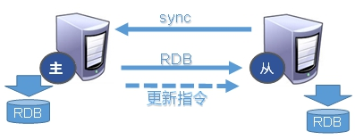

## 11.5 开启哨兵模式

### 11.5.1哨兵模式

**反客为主的自动版**，能够后台监控主机是否故障，如果故障了根据投票数自动将从库转换为主库

### 11.5.2 实现哨兵模式

1. **使用一主二仆模式**

2. 自定义的myredis目录下新建sentinel.conf文件

3. **配置哨兵,填写内容**

​	sentinel monitor mymaster 127.0.0.1 6379 1

​	其中mymaster为监控对象起的服务器名称， 1 为至少有多少个哨兵同意迁移的数量。 

4. **启动哨兵** 

   /usr/local/bin

   redis做压测可以用自带的redis-benchmark工具

   执行redis-sentinel /myRedis6/sentinel.conf 

   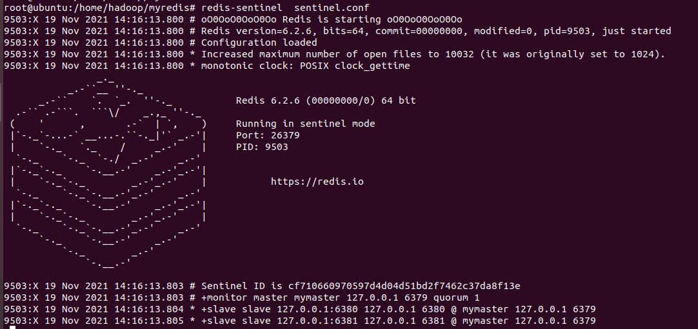

5. **主机挂掉，从机选举中产生新的主机**

   (大概10秒左右可以看到哨兵窗口日志，切换了新的主机)

   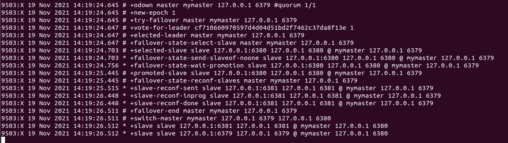

6. **故障恢复**

   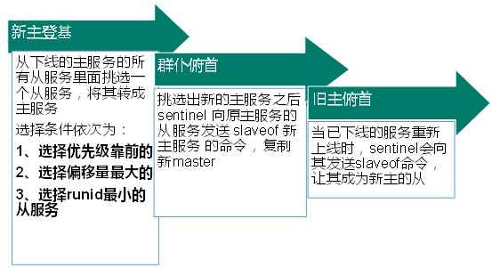

   哪个从机会被选举为主机呢？根据优先级别：slave-priority 

   优先级在redis.conf中默认：slave-priority 100，值越小优先级越高

   原主机重启后会变为从机。

   

   偏移量是指获得原主机数据最全的

   每个redis实例启动后都会随机生成一个40位的runid

## 11.6 主从复制Java实现

```java
private static JedisSentinelPool jedisSentinelPool=null;

public static  Jedis getJedisFromSentinel(){
if(jedisSentinelPool==null){
            Set<String> sentinelSet=new HashSet<>();
            sentinelSet.add("192.168.11.103:26379");

            JedisPoolConfig jedisPoolConfig =new JedisPoolConfig();
            jedisPoolConfig.setMaxTotal(10); //最大可用连接数
jedisPoolConfig.setMaxIdle(5); //最大闲置连接数
jedisPoolConfig.setMinIdle(5); //最小闲置连接数
jedisPoolConfig.setBlockWhenExhausted(true); //连接耗尽是否等待
jedisPoolConfig.setMaxWaitMillis(2000); //等待时间
jedisPoolConfig.setTestOnBorrow(true); //取连接的时候进行一下测试 ping pong

jedisSentinelPool=new JedisSentinelPool("mymaster",sentinelSet,jedisPoolConfig);
return jedisSentinelPool.getResource();
        }else{
return jedisSentinelPool.getResource();
        }
}

```


# 12 Redis6集群

## 12.1 解决问题

**容量不足，redis如何扩容？**

**并发写操作， redis如何分摊？**

主从模式下，主机宕机，导致ip地址发生变化，应用程序中配置需要修改对应的主机地址、端口等信息。

* 代理主机

  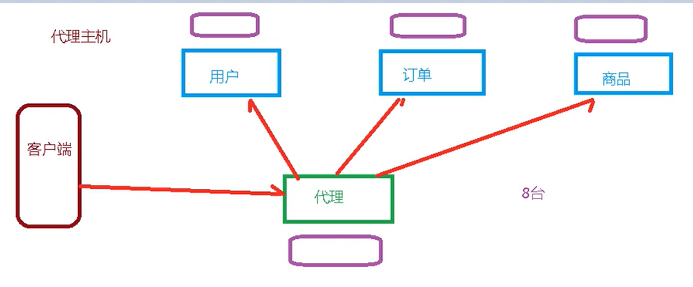

* **无中心化集群**（redis3.0解决方案）

  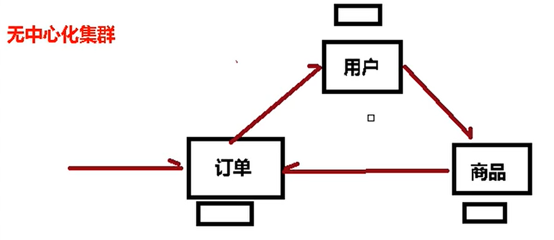

  ## 12.2 集群

  Redis 集群实现了对Redis的水平扩容，即启动N个redis节点，将整个数据库分布存储在这N个节点中，每个节点存储总数据的1/N。

  Redis 集群通过分区（partition）来提供一定程度的可用性（availability）： 即使集群中有一部分节点失效或者无法进行通讯， 集群也可以继续处理命令请求。

  ## 12.3 集群的实现

  创建6个实例，6379,6380,6381,6389,6390,6391

  配置（以redis6379.conf为例）

  ```c
  include /home/hadoop/myRedis6/redis.conf
  pidfile /var/run/redis_6379.pid
  port 6379
  dbfilename dump6379.rdb
  
  # 打开集群模式
  cluster-enabled yes 
  # 设定节点配置文件名
  cluster-config-file nodes-6379.conf
  # 设定节点失联时间，超过该时间（毫秒），集群自动进行主从切换。
  cluster-node-timeout 15000                         
  ```

  启动6个redis服务

  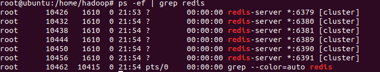

  组合之前，请确保所有redis实例启动后，nodes-xxxx.conf文件都生成正常。

  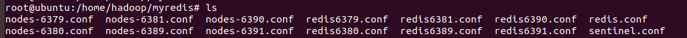

  合成一个集群

  ```bash
  cd  /opt/redis-6.2.1/src
  root@ubuntu:/opt/redis-6.2.6/src# redis-cli --cluster create --cluster-replicas 1 192.168.190.136:6379 192.168.190.136:6380 192.168.190.136:6381 192.168.190.136:6389 192.168.190.136:6390 192.168.190.136:6391 
  ```

  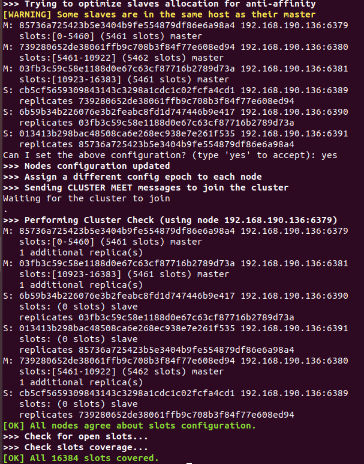

  > 此处不要用127.0.0.1， 请用真实IP地址
  >
  > --replicas 1 采用最简单的方式配置集群，一台主机，一台从机，正好三组。

## 12.4 采用集群策略连接

普通方式登录,直接进入读主机，存储数据时，可能会出现MOVED重定向操作。所以，应该以集群方式登录。

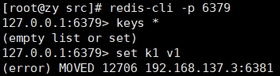

-c 采用集群策略连接，设置数据会自动切换到相应的写主机

cluster nodes 命令查看集群信息

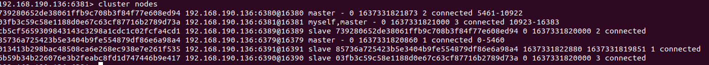

## 12.5 如何分配节点

一个集群至少要有三个主节点。

选项 --cluster-replicas 1 表示我们希望为集群中的每个主节点创建一个从节点。

分配原则尽量保证每个主数据库运行在不同的IP地址，每个从库和主库不在一个IP地址上。

## 12.6 slots

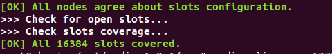

一个 Redis 集群包含 16384 个插槽（hash slot）， 数据库中的每个键都属于这 16384 个插槽的其中一个， 

集群使用公式 CRC16(key) % 16384 来计算键 key 属于哪个槽， 其中 CRC16(key) 语句用于计算键 key 的 CRC16 校验和 。

集群中的每个节点负责处理一部分插槽。 举个例子， 如果一个集群可以有主节点， 其中：

节点 A 负责处理 0 号至 5460 号插槽。

节点 B 负责处理 5461 号至 10922 号插槽。

节点 C 负责处理 10923 号至 16383 号插槽。

## 12.7 集群中录入值

在redis-cli每次录入、查询键值，redis都会计算出该key应该送往的插槽，如果不是该客户端对应服务器的插槽，redis会报错，并告知应前往的redis实例地址和端口。

redis-cli客户端提供了 –c 参数实现自动重定向。

如 redis-cli -c –p 6379 登入后，再录入、查询键值对可以自动重定向。

不在一个slot下的键值，是不能使用mget,mset等多键操作。

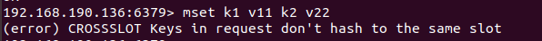

可以通过{}来定义组的概念，从而使key中{}内相同内容的键值对放到一个slot中去。

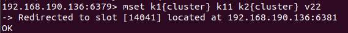

## 12.8 查询集群中值

`CLUSTER GETKEYSINSLOT <slot><count>` 返回 count 个 slot 槽中的键。

## 12.9 故障恢复

主节点下线，从节点经历超时时间后自动升为主节点。

主节点恢复后，主节点变成从机。

如果某一段插槽的主从都挂掉，而cluster-require-full-coverage 为yes ，那么 ，整个集群都挂掉

如果某一段插槽的主从都挂掉，而cluster-require-full-coverage 为no ，那么，该插槽数据全都不能使用，也无法存储。

redis.conf中的参数 cluster-require-full-coverage

## 12.10 集群的Java实现

即使连接的不是主机，集群会自动切换主机存储。主机写，从机读。

无中心化主从集群。无论从哪台主机写的数据，其他主机上都能读到数据。

```java
public class JedisClusterTest {
  public static void main(String[] args) { 
     Set<HostAndPort>set =new HashSet<HostAndPort>();
     set.add(new HostAndPort("192.168.31.211",6379));
     JedisCluster jedisCluster=new JedisCluster(set);
     jedisCluster.set("k1", "v1");
     System.out.println(jedisCluster.get("k1"));
  }
}
```

## 12.11 集群的优势

实现扩容

分摊压力

无中心配置相对简单

## 12.12 集群的不足

多键操作是不被支持的 

多键的Redis事务是不被支持的。lua脚本不被支持

由于集群方案出现较晚，很多公司已经采用了其他的集群方案，而代理或者客户端分片的方案想要迁移至redis cluster，需要整体迁移而不是逐步过渡，复杂度较大。

# 13 Redise6应用问题解决

## 13.1 缓存穿透

### 13.1.1 问题描述

key对应的数据在数据源并不存在，每次针对此key的请求从缓存获取不到，请求都会压到数据源，从而可能压垮数据源。比如用一个不存在的用户id获取用户信息，不论缓存还是数据库都没有，若黑客利用此漏洞进行攻击可能压垮数据库。

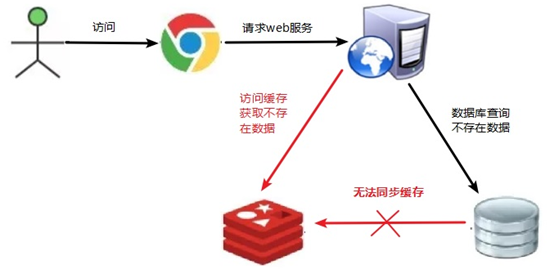

### 13.1.2 解决方案

一个一定不存在缓存及查询不到的数据，由于缓存是不命中时被动写的，并且出于容错考虑，如果从存储层查不到数据则不写入缓存，这将导致这个不存在的数据每次请求都要到存储层去查询，失去了缓存的意义。

1. 对空值缓存

   把查询的到的空结果也进行缓存，设置空结果的过期时间会很短，最长不超过五分钟

2. 设置可访问的名单（白名单）

   使用bitmaps类型定义一个可以访问的名单名单id作为bitmaps的偏移量，每次访问和bitmap里面的id进行比较，如果访问id不在bitmaps里面，进行拦截，不允许访问。

3. 采用布隆过滤器

   它实际上是一个很长的二进制向量(位图)和一系列随机映射函数（哈希函数）。将所有可能存在的数据哈希到一个足够大的bitmaps中，一个一定不存在的数据会被 这个bitmaps拦截掉，从而避免了对底层存储系统的查询压力。

4. 进行实时监控

   发现Redis的命中率开始急速降低，需要排查访问对象和访问的数据，和运维人员配合，可以设置黑名单限制服务。

## 13.2 缓存击穿

### 13.2.1 问题描述

key对应的数据存在，但在**redis中过期**，此时若有大量并发请求过来，这些请求发现缓存过期一般都会从后端DB加载数据并回设到缓存，这个时候大并发的请求可能会**瞬间**把后端DB压垮。

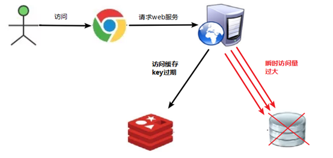

### 13.2.2 解决方案

key可能会在某些时间点被超高并发地访问，是一种非常“热点”的数据。这个时候，需要考虑一个问题：缓存被“击穿”的问题。

1. 预先设置热门数据

   在redis高峰访问之前，把一些热门数据提前存入到redis里面，加大这些热门数据key的时长

2. 实时调整

   现场监控哪些数据热门，实时调整key的过期时长

3. 使用锁

   1. 就是在缓存失效的时候（判断拿出来的值为空），不是立即去load db。
   2.   先使用缓存工具的某些**带成功操作返回值**的操作（比如Redis的SET NX）去set一个mutex key
   3. 当操作返回成功时，再进行load db的操作，并回设缓存,最后删除mutex key；
   4.  当操作返回失败，证明有线程在load db，当前线程睡眠一段时间再重试整个get缓存的方法。

   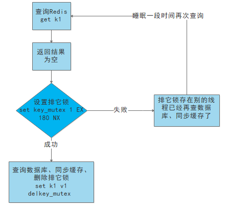

## 13.3 缓存雪崩

### 13.3.1 问题描述

key对应的数据存在，但在redis中过期，此时若有大量并发请求过来，这些请求发现缓存过期一般都会从后端DB加载数据并回设到缓存，这个时候大并发的请求可能会瞬间把后端DB压垮。

缓存雪崩与缓存击穿的区别在于这里针对很多key缓存，前者则是某一个key 正常访问

### 13.3.2 解决方案

缓存失效时的雪崩效应对底层系统的冲击非常可怕！

1. 构建多级缓存架构

   nginx缓存 + redis缓存 +其他缓存（ehcache等）

2.   使用锁或队列

   用加锁或者队列的方式来保证不会有大量的线程对数据库一次性进行读写，从而避免失效时大量的并发请求落到底层存储系统上。不适用高并发情况

3. 设置过期标志更新缓存

   记录缓存数据是否过期（设置提前量），如果过期会触发通知另外的线程在后台去更新实际key的缓存。

4. 将缓存失效时间分散开

   比如我们可以在原有的失效时间基础上增加一个随机值，比如1-5分钟随机，这样每一个缓存的过期时间的重复率就会降低，就很难引发集体失效的事件。

## 13.4 分布式锁

### 13.4.1问题描述

随着业务发展的需要，**原单体单机部署的系统被演化成分布式集群系统后**，由于分布式系统多线程、多进程并且分布在不同机器上，这将使原单机部署情况下的并发控制锁策略失效，单纯的Java API并不能提供分布式锁的能力。为了解决这个问题就需要一种跨JVM的互斥机制来控制共享资源的访问，这就是分布式锁要解决的问题！

即一台服务器加锁，对集群中的其他节点也生效

### 13.4.2 分布式锁主流的实现方案

1. 基于数据库实现分布式锁

2. **基于缓存（Redis等，性能高）**

3. 基于Zookeeper（可靠性高）

### 13.4.3 使用redis实现分布式锁

[String常用命令](#String常用命令)

`set sku:1:info “OK” NX PX 10000`

`EX second` ：设置键的过期时间为 second 秒。 SET key value EX second 效果等同于 SETEX key second value 。

`PX millisecond` ：设置键的过期时间为 millisecond 毫秒。 SET key value PX millisecond 效果等同于 PSETEX key millisecond value 。

`NX` ：只在键不存在时，才对键进行设置操作。 SET key value NX 效果等同于 SETNX key value 。

`XX` ：只在键已经存在时，才对键进行设置操作。

如果直接使用两句命令分别设置值以及过期时间，因为没有原子性可能导致过期时间没有设置。

### 13.4.3 分布式锁流程

1. 多个客户端同时获取锁（setnx）

2. 获取成功，执行业务逻辑{从db获取数据，放入缓存}，执行完成释放锁（del）

3. 其他客户端等待重试

### 13.4.4 分布式锁Java实现

```java
@GetMapping("testLock")
public void testLock(){
    //1获取锁，setne
    Boolean lock = redisTemplate.opsForValue().setIfAbsent("lock", "111");
    //2获取锁成功、查询num的值
    if(lock){
        Object value = redisTemplate.opsForValue().get("num");
        //2.1判断num为空return
        if(StringUtils.isEmpty(value)){
            return;
        }
        //2.2有值就转成成int
        int num = Integer.parseInt(value+"");
        //2.3把redis的num加1
        redisTemplate.opsForValue().set("num", ++num);
        //2.4释放锁，del
        redisTemplate.delete("lock");

    }else{
        //3获取锁失败、每隔0.1秒再获取
        try {
            Thread.sleep(100);
            testLock();
        } catch (InterruptedException e) {
            e.printStackTrace();
        }
    }
}

```

### 13.4.5 分布式锁优化

* 问题：setnx刚好获取到锁，业务逻辑出现异常，导致锁无法释放

  解决：设置锁的过期时间

* 问题：当set锁之后，服务器异常，导致不能setnx，锁无法释放

  解决：在set时指定过期时间     [如何在set时指定过期时间](#13.4.3 使用redis实现分布式锁)

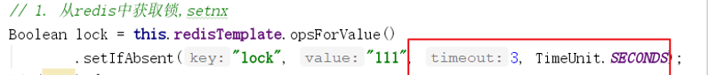

* 问题：当该服务器的锁过期时间已到，此时再del释放锁，可能会释放其他服务器的锁。

  解决：setnx获取锁时，设置一个指定的唯一值（例如：uuid）；释放前获取这个值，判断是否自己的锁

​	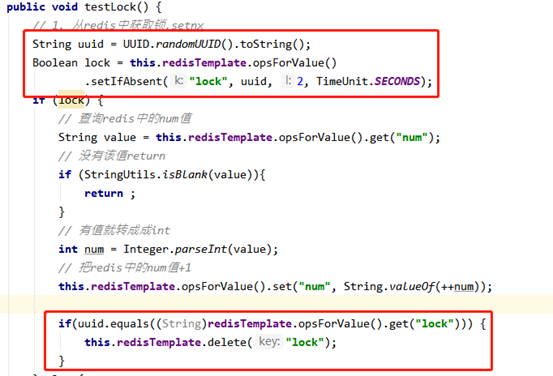

* 问题：删除操作缺乏原子性。

  解决：LUA脚本保证删除的原子性

  ```java
  @GetMapping("testLockLua")
  public void testLockLua() {
      //1 声明一个uuid ,将做为一个value 放入我们的key所对应的值中
      String uuid = UUID.randomUUID().toString();
      //2 定义一个锁：lua 脚本可以使用同一把锁，来实现删除！
      String skuId = "25"; // 访问skuId 为25号的商品 100008348542
      String locKey = "lock:" + skuId; // 锁住的是每个商品的数据
  
      // 3 获取锁
      Boolean lock = redisTemplate.opsForValue().setIfAbsent(locKey, uuid, 3, TimeUnit.SECONDS);
  
      // 第一种： lock 与过期时间中间不写任何的代码。
      // redisTemplate.expire("lock",10, TimeUnit.SECONDS);//设置过期时间
      // 如果true
      if (lock) {
          // 执行的业务逻辑开始
          // 获取缓存中的num 数据
          Object value = redisTemplate.opsForValue().get("num");
          // 如果是空直接返回
          if (StringUtils.isEmpty(value)) {
              return;
          }
          // 不是空 如果说在这出现了异常！ 那么delete 就删除失败！ 也就是说锁永远存在！
          int num = Integer.parseInt(value + "");
          // 使num 每次+1 放入缓存
          redisTemplate.opsForValue().set("num", String.valueOf(++num));
          /*使用lua脚本来锁*/
          // 定义lua 脚本
          String script = "if redis.call('get', KEYS[1]) == ARGV[1] then return redis.call('del', KEYS[1]) else return 0 end";
          // 使用redis执行lua执行
          DefaultRedisScript<Long> redisScript = new DefaultRedisScript<>();
          redisScript.setScriptText(script);
          // 设置一下返回值类型 为Long
          // 因为删除判断的时候，返回的0,给其封装为数据类型。如果不封装那么默认返回String 类型，
          // 那么返回字符串与0 会有发生错误。
          redisScript.setResultType(Long.class);
          // 第一个要是script 脚本 ，第二个需要判断的key，第三个就是key所对应的值。
          redisTemplate.execute(redisScript, Arrays.asList(locKey), uuid);
      } else {
          // 其他线程等待
          try {
              // 睡眠
              Thread.sleep(1000);
              // 睡醒了之后，调用方法。
              testLockLua();
          } catch (InterruptedException e) {
              e.printStackTrace();
          }
      }
  }
  
  ```

### 13.4.6 总结

为了确保分布式锁可用，我们至少要确保锁的实现同时**满足以下四个条件**：

* 互斥性。在任意时刻，只有一个客户端能持有锁。
* 不会发生死锁。即使有一个客户端在持有锁的期间崩溃而没有主动解锁，也能保证后续其他客户端能加锁。

*  解铃还须系铃人。加锁和解锁必须是同一个客户端，客户端自己不能把别人加的锁给解了。

* 加锁和解锁必须具有原子性。

# 14 Redis6新功能

## 14.1 ACL

### 14.1.1 简介

Redis ACL是Access Control List（访问控制列表）的缩写，该功能允许根据可以执行的命令和可以访问的键来限制某些连接。

在Redis 5版本之前，Redis 安全规则只有**密码控制** 还有通过**rename 来调整高危命令**比如 flushdb ， KEYS* ， shutdown 等。Redis 6 则提供ACL的功能对用户进行更细粒度的权限控制 ：

* 接入权限:用户名和密码 
* 可以执行的命令 
* 可以操作的 KEY

### 14.1.2 命令

* 使用`acl list`命令展现用户权限列表

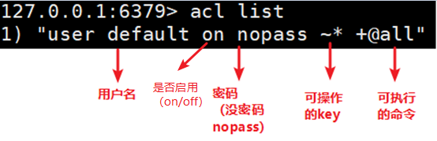

* 使用`acl cat`命令 查看添加权限指令类别

  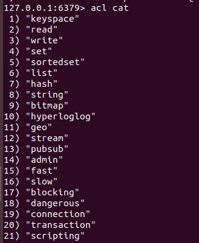

* 使用`acl cat  参数类型名`可以查看类型下具体命令

  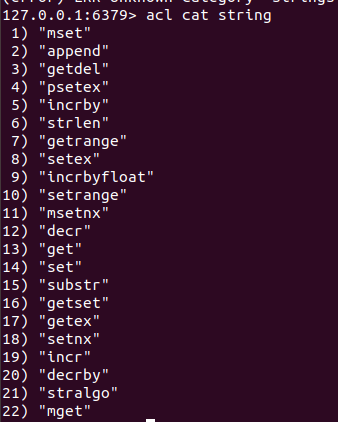

* 使用`acl whoami`命令查看当前用户

* 使用`acl setuser`命令创建和编辑用户ACL

  | 参数              | 说明                                                         |
  | ----------------- | ------------------------------------------------------------ |
  | on                | 激活某用户账号                                               |
  | off               | 禁用某用户账号。注意，已验证的连接仍然可以工作。如果默认用户被标记为off，则新连接将在未进行身份验证的情况下启动，并要求用户使用AUTH选项发送AUTH或HELLO，以便以某种方式进行身份验证。 |
  | `><password>`     | 密码                                                         |
  | `~<key>`          | 可操作的key                                                  |
  | ` +<command>  `   | 将指令添加到用户可以调用的指令列表中                         |
  | `-<command>  `    | 从用户可执行指令列表移除指令                                 |
  | `+@<category> `   | 添加该类别中用户要调用的所有指令，有效类别为@admin、@set、@sortedset…等，通过调用ACL CAT命令查看完整列表。特殊类别@all表示所有命令，包括当前存在于服务器中的命令，以及将来将通过模块加载的命令。 |
  | ` -@<category>  ` | 从用户可调用指令中移除类别                                   |
  | allcommands       | +@all的别名                                                  |
  | nocommand         | -@all的别名                                                  |
  | ` ~<pattern>`     | 添加可作为用户可操作的键的模式。例如~*允许所有的键           |

  例

  * `acl setuser user1`如果用户不存在，这将使用just created的默认属性来创建用户。如果用户已经存在，则上面的命令将不执行任何操作。
  * `acl setuser user2 on >password ~cached:* +get`创建密码为password 只能对前缀为cached:的key进行get操作

* 使用`auth <username> <password>`切换用户，验证权限

  

## 14.2 IO多线程

IO多线程其实指**客户端交互部分**的**网络IO**交互处理模块**多线程**，而非**执行命令多线程**。Redis6执行命令依然是单线程。

Redis 6 加入多线程,但跟 Memcached 这种从 IO处理到数据访问多线程的实现模式有些差异。Redis 的多线程部分只是用来处理网络数据的读写和协议解析，执行命令仍然是单线程。之所以这么设计是不想因为多线程而变得复杂，需要去控制 key、lua、事务，LPUSH/LPOP 等等的并发问题。整体的设计大体如下:

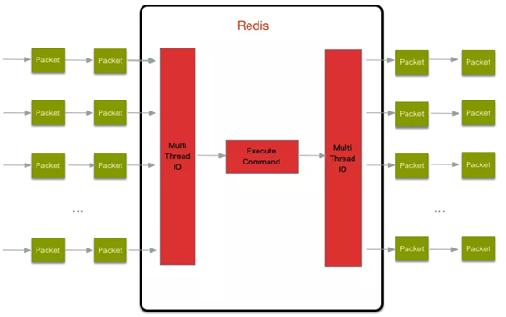

另外，多线程IO默认也是不开启的，需要再配置文件中配置

```c
io-threads-do-reads yes 

io-threads 4
```

