[TOC]


# 一、SpringMVC简介

## 1、什么是MVC

MVC是一种软件架构的思想，将软件按照模型、视图、控制器来划分 

M：Model，模型层，指工程中的JavaBean，作用是处理数据 

JavaBean分为两类： 一类称为实体类Bean：专门存储业务数据的，如 Student、User 等 一类称为业务处理 Bean：指 Service 或 Dao 对象，专门用于处理业务逻辑和数据访问。 

V：View，视图层，指工程中的html或jsp等页面，作用是与用户进行交互，展示数据 

C：Controller，控制层，指工程中的servlet，作用是接收请求和响应浏览器 

MVC的工作流程： 用户通过视图层发送请求到服务器，在服务器中请求被Controller接收，Controller 调用相应的Model层处理请求，处理完毕将结果返回到Controller，Controller再根据请求处理的结果 找到相应的View视图，渲染数据后最终响应给浏览器

## 2、什么是SpringMVC

SpringMVC是Spring的一个后续产品，是Spring的一个子项目 

SpringMVC 是 Spring 为表述层开发提供的一整套完备的解决方案。

在表述层框架历经 Strust、 WebWork、Strust2 等诸多产品的历代更迭之后，目前业界普遍选择了 SpringMVC 作为 Java EE 项目 表述层开发的首选方案。

>  注：三层架构分为表述层（或表示层）、业务逻辑层、数据访问层，表述层表示前台页面和后台 servlet

## 3、 SpringMVC的特点

* **Spring 家族原生产品**，与 IOC 容器等基础设施无缝对接 
* **基于原生的Servlet**，通过了功能强大的**前端控制器DispatcherServlet**，对请求和响应进行统一 处理 
* 表述层各细分领域需要解决的问题全方位覆盖，提供**全面解决方案** 
* **代码清新简洁**，大幅度提升开发效率 
* 内部组件化程度高，可插拔式组件**即插即用**，想要什么功能配置相应组件即可 
* **性能卓著**，尤其适合现代大型、超大型互联网项目要求

# 二、HelloWorld

## 1、开发环境

IDE：idea 2021.1

构建工具：Maven 3.3.9

服务器：Tomcat 8.0.50

Spring版本： 5.3.1

## 2、创建Maven工程

### a>添加web模块 

### b>打包方式：war 

### c>引入依赖

```xml
<dependencies>
<!-- SpringMVC -->
<dependency>
<groupId>org.springframework</groupId>
<artifactId>spring-webmvc</artifactId>
<version>5.3.1</version>
</dependency>
<!-- 日志 -->
<dependency>
<groupId>ch.qos.logback</groupId>
<artifactId>logback-classic</artifactId>
<version>1.2.3</version>
</dependency>
<!-- ServletAPI -->
<dependency>
<groupId>javax.servlet</groupId>
<artifactId>javax.servlet-api</artifactId>
<version>3.1.0</version>
<scope>provided</scope>
</dependency>
<!-- Spring5和Thymeleaf整合包 -->
<dependency>
<groupId>org.thymeleaf</groupId>
<artifactId>thymeleaf-spring5</artifactId>
<version>3.0.12.RELEASE</version>
</dependency>
</dependencies>
```

>  注：由于 Maven 的传递性，我们不必将所有需要的包全部配置依赖，而是配置最顶端的依赖，其他靠 传递性导入。

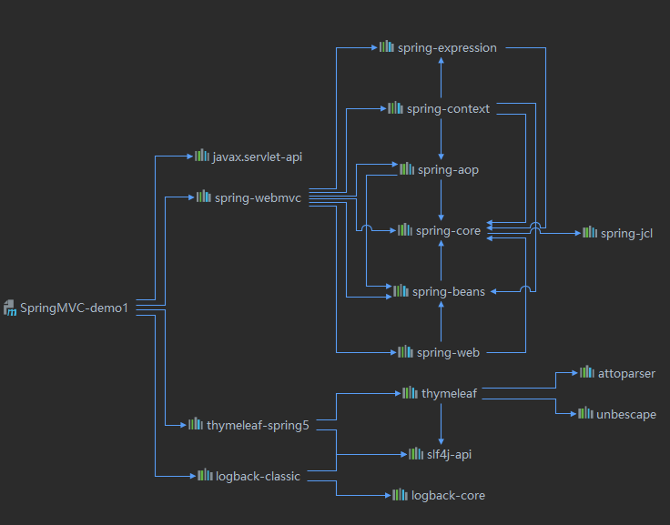

## 3、配置web.xml

注册SpringMVC的前端控制器DispatcherServlet

### a>默认配置方式

此配置作用下，SpringMVC的配置文件默认位于WEB-INF下，默认名称为`<servlet-name> `-servlet.xml，例如，以下配置所对应SpringMVC的配置文件位于WEB-INF下，文件名为springMVC-servlet.xml

```xml
<?xml version="1.0" encoding="UTF-8"?>
<web-app xmlns="http://xmlns.jcp.org/xml/ns/javaee"
         xmlns:xsi="http://www.w3.org/2001/XMLSchema-instance"
         xsi:schemaLocation="http://xmlns.jcp.org/xml/ns/javaee http://xmlns.jcp.org/xml/ns/javaee/web-app_4_0.xsd"
         version="4.0">

    <!--SpringMVC 前端控制器，对浏览器请求统一进行管理-->
    <servlet>
        <servlet-name>SpringMVC</servlet-name>
        <servlet-class>org.springframework.web.servlet.DispatcherServlet</servlet-class>
    </servlet>
    <servlet-mapping>
        <servlet-name>SpringMVC</servlet-name>
        <!--
        设置springMVC的核心控制器所能处理的请求的请求路径
        /所匹配的请求可以是/login或.html或.js或.css方式的请求路径
        但是/不能匹配.jsp请求路径的请求

        而/*匹配了所有的请求路径
        -->
        <url-pattern>/</url-pattern>
    </servlet-mapping>
</web-app>
```

### b>扩展配置方式

可通过init-param标签设置SpringMVC配置文件的位置和名称，通过load-on-startup标签设置 SpringMVC前端控制器DispatcherServlet的初始化时间

```xml
<?xml version="1.0" encoding="UTF-8"?>
<web-app xmlns="http://xmlns.jcp.org/xml/ns/javaee"
         xmlns:xsi="http://www.w3.org/2001/XMLSchema-instance"
         xsi:schemaLocation="http://xmlns.jcp.org/xml/ns/javaee http://xmlns.jcp.org/xml/ns/javaee/web-app_4_0.xsd"
         version="4.0">

    <!--SpringMVC 前端控制器，对浏览器请求统一进行管理-->
    <servlet>
        <servlet-name>SpringMVC</servlet-name>
        <servlet-class>org.springframework.web.servlet.DispatcherServlet</servlet-class>
        <!--配置springMVC配置文件的位置和名称-->
        <init-param>
            <param-name>contextConfigLocation</param-name>
            <param-value>classpath:springMVC.xml</param-value>
        </init-param>
        <!--
        作为框架的核心组件，在启动过程中有大量的初始化操作要做
        而这些操作放在第一次请求时才执行会严重影响访问速度
        因此需要通过此标签将启动控制DispatcherServlet的初始化时间提前到服务器启动时
        -->
        <load-on-startup>1</load-on-startup>
    </servlet>
    <servlet-mapping>
        <servlet-name>SpringMVC</servlet-name>
        <!--
        设置springMVC的核心控制器所能处理的请求的请求路径
        /所匹配的请求可以是/login或.html或.js或.css方式的请求路径
        但是/不能匹配.jsp请求路径的请求

        而/*匹配了所有的请求路径
        -->
        <url-pattern>/</url-pattern>
    </servlet-mapping>
</web-app>
```

## 4、创建请求控制器

由于前端控制器对浏览器发送的请求进行了统一的处理，但是具体的请求有不同的处理过程，因此需要 **创建处理具体请求的类，即请求控制器** 

请求控制器中每一个处理请求的方法成为控制器方法 

因为SpringMVC的控制器由一个POJO（普通的Java类）担任，因此需要通过@Controller注解将其标识 为一个控制层组件，交给Spring的IoC容器管理，此时SpringMVC才能够识别控制器的存在

```java
@Controller
public class HelloController {
}
```

## 5、创建springMVC的配置文件

```xml
<?xml version="1.0" encoding="UTF-8"?>
<beans xmlns="http://www.springframework.org/schema/beans"
       xmlns:xsi="http://www.w3.org/2001/XMLSchema-instance"
       xmlns:context="http://www.springframework.org/schema/context"
       xsi:schemaLocation="http://www.springframework.org/schema/beans http://www.springframework.org/schema/beans/spring-beans.xsd
        http://www.springframework.org/schema/context http://www.springframework.org/schema/context/spring-context.xsd">

    <!-- 自动扫描包 -->
    <context:component-scan base-package="com.tintin.MVC.controller"></context:component-scan>

    <!-- 配置Thymeleaf视图解析器 -->
    <bean id="viewResolver"
          class="org.thymeleaf.spring5.view.ThymeleafViewResolver">
        <property name="order" value="1"/>
        <property name="characterEncoding" value="UTF-8"/>
        <property name="templateEngine">
            <!--templateEngine即为模板-->
            <bean class="org.thymeleaf.spring5.SpringTemplateEngine">
                <!--/设置resolver  模板读取磁盘中资源的路径 类目录-->
                <property name="templateResolver">
                    <bean class="org.thymeleaf.spring5.templateresolver.SpringResourceTemplateResolver">
                        <!-- 视图前缀 -->
                        <!--WEB-INF目录： 是Java的WEB应用的安全目录。所谓安全就是客户端无法访问，只有服务端可以访问的目录。 页面放在WEB-INF目录下面,这样可以限制访问,提高安全性-->
                        <property name="prefix" value="/WEB-INF/templates/"/>
                        <!-- 视图后缀 -->
                        <property name="suffix" value=".html"/>
                        <property name="templateMode" value="HTML5"/>
                        <property name="characterEncoding" value="UTF-8" />
                    </bean>
                </property>
            </bean>
        </property>
    </bean>
</beans>
```

> [将html文件作为模板](Thymeleaf模板引擎.md#将html文件作为模板)

## 6、测试HelloWorld

### a>实现对首页的访问

在请求控制器中创建处理请求的方法

```java
@Controller
public class HelloController {


    /**
     * @RequestMapping注解：处理请求和控制器方法之间的映射关系
     * @RequestMapping注解的value属性可以通过请求地址匹配请求，/表示的当前工程的上下文路径
     * localhost:8080/springMVC/
     * @return 视图名称
     */
    @RequestMapping("/")
    public String index() {
        return "index";
    }
}
```

```
14:51:39.814 [http-apr-8080-exec-2] DEBUG org.thymeleaf.TemplateEngine - [THYMELEAF] TEMPLATE ENGINE INITIALIZED
14:51:40.121 [http-apr-8080-exec-2] DEBUG org.springframework.web.servlet.DispatcherServlet - Completed 200 OK
14:51:40.813 [http-apr-8080-exec-7] DEBUG org.springframework.web.servlet.DispatcherServlet - GET "/SpringMVC_demo1_war_exploded/", parameters={}
14:51:40.813 [http-apr-8080-exec-7] DEBUG org.springframework.web.servlet.mvc.method.annotation.RequestMappingHandlerMapping - Mapped to com.tintin.MVC.controller.HelloController#index()
14:51:40.820 [http-apr-8080-exec-7] DEBUG org.springframework.web.servlet.DispatcherServlet - Completed 200 OK
```

### b>通过超链接跳转到指定页面

在主页index.html中设置超链接

```html
<!DOCTYPE html>
<html lang="en" xmlns:th="http://www.thymeleaf.org">
<head>
    <meta charset="UTF-8">
    <title>Title</title>
</head>
<body >
    <h1>首页</h1>
    <!--记得配置上下文路径-->
    <!--方式一-->
    <a href="/SpringMVC_demo1/target">访问target.html页面</a>
    <!--方式二-->
    <a th:href="@{/target}">访问target.html页面</a>
</body>
</html>
```

在请求控制器中创建处理请求的方法

```java
    @RequestMapping("/target")
    public String toTarget() {
        return "target";
    }
```

## 7、总结

浏览器发送请求，若请求地址符合前端控制器的url-pattern，该请求就会被前端控制器 DispatcherServlet处理。前端控制器会读取SpringMVC的核心配置文件，通过扫描组件找到控制器， 将请求地址和控制器中@RequestMapping注解的value属性值进行匹配，若匹配成功，该注解所标识的 控制器方法就是处理请求的方法。处理请求的方法需要返回一个字符串类型的视图名称，该视图名称会 被视图解析器解析，加上前缀和后缀组成视图的路径，通过Thymeleaf对视图进行渲染，最终转发到视 图所对应页面

# 三、@RequestMaping注解

## 1、RequestMaping注解的功能

从注解名称上我们可以看到，@RequestMapping注解的作用就是将请求和处理请求的控制器方法关联 起来，建立映射关系。 SpringMVC 接收到指定的请求，就会来找到在映射关系中对应的控制器方法来处理这个请求。

> 注：确保控制器中的方法 其RequestMapping注解所能匹配的请求地址是唯一的，否则会报错。

## 2、@RequestMapping注解的位置

@RequestMapping标识一个类：设置映射请求的请求路径的初始信息  （用于表示对应功能模块） 

@RequestMapping标识一个方法：设置映射请求请求路径的具体信息

```java
@Controller
@RequestMapping("/hello")
public class RequestMapingController {
    @RequestMapping("/testRequestMaping")
    public String success() {
        return "success";
    }
    //此时请求映射所映射的请求的请求路径为：/test/testRequestMapping

}
```

## 3、@RequestMapping注解的value属性

@RequestMapping注解的属性

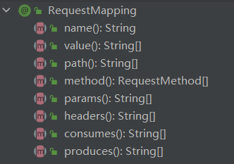

@RequestMapping注解的value属性通过请求的请求地址匹配请求映射 

@RequestMapping注解的value属性是一个字符串类型的数组，表示该请求映射能够匹配多个请求地址 所对应的请求

 @RequestMapping注解的value属性必须设置，至少通过请求地址匹配请求映射

```html
<a th:href="@{/testRequestMapping}">测试@RequestMapping的value属性--
>/testRequestMapping</a><br>
<a th:href="@{/test}">测试@RequestMapping的value属性-->/test</a><br>
```

```java
@RequestMapping(
value = {"/testRequestMapping", "/test"}
)
public String testRequestMapping(){
	return "success";
}
```

## 4、@RequestMapping注解的method属性

@RequestMapping注解的method属性通过请求的请求方式（get或post）匹配请求映射 

@RequestMapping注解的method属性是一个RequestMethod类型的数组，表示该请求映射能够匹配 

多种请求方式的请求 若当前请求的请求地址满足请求映射的value属性，但是请求方式不满足method属性，则浏览器报错 405：Request method 'POST' not supported

RequestMethod请求的方式有

```java
package org.springframework.web.bind.annotation;

public enum RequestMethod {
    GET,
    HEAD,
    POST,
    PUT,
    PATCH,
    DELETE,
    OPTIONS,
    TRACE;

    private RequestMethod() {
    }
}
```

```java
    @RequestMapping(
            value = {"/testRequestMapping","/test"},
            method = {RequestMethod.GET}
    )
    public String success() {
        return "success";
    }
```

```html
  <form th:action="@{/test}" method="post">
      <input type="submit" value="测试请求方式注解method属性">
  </form>
```

> 注： 1、对于处理指定请求方式的控制器方法，SpringMVC中提供了@RequestMapping的派生注解 
>
> 处理get请求的映射-->@GetMapping 
>
> 处理post请求的映射-->@PostMapping 
>
> 处理put请求的映射-->@PutMapping 
>
> 处理delete请求的映射-->@DeleteMapping
>
> ```java
>     @GetMapping(
>             value = {"/testRequestMapping","/test"}
>     )
>     public String testGetMapping() {
>         return "success";
>         //此时请求映射要求请求方式是get
>     }
> ```
>
> 2、常用的请求方式有get，post，put，delete
>
> 但是目前浏览器只支持get和post，若在form表单提交时，为method设置了其他请求方式的字符 串（put或delete），则按照默认的请求方式get处理 
>
> 若要发送put和delete请求，则需要通过spring提供的过滤器HiddenHttpMethodFilter，在 RESTful部分会讲到

## 5、@RequestMapping注解的params属性（了解）

@RequestMapping注解的params属性通过请求的请求参数匹配请求映射 

@RequestMapping注解的params属性是一个字符串类型的数组，可以通过四种表达式设置请求参数 和请求映射的匹配关系 "param"：要求请求映射所匹配的请求必须携带param请求参数 

"!param"：要求请求映射所匹配的请求必须不能携带param请求参数 

"param=value"：要求请求映射所匹配的请求必须携带param请求参数且param=value 

"param!=value"：要求请求映射所匹配的请求必须携带param请求参数但是param!=value

```java
    @RequestMapping(
            value = "/testParamsAndHeaders",
            params = {"username=admin","password"}
    )
    public String testParams() {
        return "success";
    }
```

```html
  <a th:href="@{/testParamsAndHeaders(username='admin',password=123456)}">
      测试@RequestMapping的params属性和Headers属性-->/test
</a><br>

```

> 注： 若当前请求满足@RequestMapping注解的value和method属性，但是不满足params属性，此时 页面回报错400：Parameter conditions "username, password!=123456" not met for actual request parameters: username={admin}, password={123456}

## 6、@RequestMapping注解的headers属性（了解）

@RequestMapping注解的headers属性通过请求的请求头信息匹配请求映射 

@RequestMapping注解的headers属性是一个字符串类型的数组，可以通过四种表达式设置请求头信 息和请求映射的匹配关系 

"header"：要求请求映射所匹配的请求必须携带header请求头信息 "

!header"：要求请求映射所匹配的请求必须不能携带header请求头信息 

"header=value"：要求请求映射所匹配的请求必须携带header请求头信息且header=value 

"header!=value"：要求请求映射所匹配的请求必须携带header请求头信息且header!=value 若当前请求满足@RequestMapping注解的value和method属性，但是不满足headers属性，此时页面 显示404错误，即资源未找到

## 7、SpringMVC支持ant风格的路径

​	？：表示任意的单个字符 

\*：表示任意的0个或多个字符 

\*\*：表示任意的一层或多层目录 

注意：在使用**时，只能使用/\*\*/xxx的方式

## 8、SpringMVC支持路径中的占位符（重点）

原始方式：/deleteUser?id=1 

rest方式：/deleteUser/1 

SpringMVC路径中的占位符常用于RESTful风格中，当**请求路径中将某些数据通过路径的方式传输到服 务器中**，就可以在相应的@RequestMapping注解的value属性中通过占位符{xxx}表示传输的数据，在 通过@PathVariable注解，将占位符所表示的数据赋值给控制器方法的形参

```html
  <a th:href="@{/testPath/1/admin}">测试@RequestMapping支持路径的占位符</a><br>
```

```java
   //占位符告诉程序url中对应位置的东西是一个参数，注释形参告诉程序这个参数对应哪个形参
    @RequestMapping("/testPath/{id}/{username}")
    public String testPath(@PathVariable("id")Integer id,@PathVariable("username")String username) {
        System.out.println("username=" + username + ", id=" + id);
        return "success";
    }
//最终输出--> username=admin, id=1
```

# 四、SpringMVC获取请求参数

requestDispatcher 会封装了许多对象，根据控制器方法的参数，为其注入参数对象

## 1、通过ServletAPI获取

将HttpServletRequest作为控制器方法的形参，此时HttpServletRequest类型的参数表示封装了当前请 求的请求报文的对象

```java
    /**
     *
     * @param request 表示当前请求
     * @return
     */
    @RequestMapping("/testServletAPI")
    public String testServletAPI(HttpServletRequest request) {
        String username = request.getParameter("username");
        String password = request.getParameter("password");
        System.out.println("username=" + username + ",password=" + password);
        return "test_param";
    }
//结果-->username=tintin,password=123456
```

## 2、通过控制器方法的形参获取请求参数

在控制器方法的形参位置，设置和请求参数同名的形参，当浏览器发送请求，匹配到请求映射时，在 DispatcherServlet中就会将请求参数赋值给相应的形参

```java
    @RequestMapping("/testParam")
    public String testParam(String username, String password) {
        System.out.println("username=" + username + ",password=" + password);
        return "test_param";
    }
```

多个同名参数情况

```java
    @RequestMapping("/testParam")
    public String testParam(String username, String password,String[] hobby) {
        System.out.println("username=" + username + ",password=" + password);
        System.out.println("hobbies=" + Arrays.asList(hobby));
        return "test_param";
    }
//结果-->username=tintin,password=123456
//hobbies=[a, b, c]
```

> 注： 若请求所传输的请求参数中有多个同名的请求参数，此时可以在控制器方法的形参中设置字符串 数组或者字符串类型的形参接收此请求参数 
>
> 若使用字符串数组类型的形参，此参数的数组中包含了每一个数据 若使用字符串类型的形参，此参数的值为每个数据中间使用逗号拼接的结果

## 3、@RequestParam

@RequestParam是将请求参数和控制器方法的形参创建映射关系 

@RequestParam注解一共有三个属性： 

value：指定为形参赋值的请求参数的参数名 

required：设置是否必须传输此请求参数，默认值为true 若设置为true时，则当前请求必须传输value所指定的请求参数，若没有传输该请求参数，且没有设置 defaultValue属性，则页面报错400：Required String parameter 'xxx' is not present；若设置为 false，则当前请求不是必须传输value所指定的请求参数，若没有传输，则注解所标识的形参的值为 null  （类似于spring框架中的autowired自动注入属性）

defaultValue：不管required属性值为true或false，当value所指定的请求参数**没有传输或传输的值 为""**时，则使用默认值为形参赋值

```java
@Target({ElementType.PARAMETER})
@Retention(RetentionPolicy.RUNTIME)
@Documented
public @interface RequestParam {
    @AliasFor("name")
    String value() default "";

    @AliasFor("value")
    String name() default "";

    boolean required() default true;

    String defaultValue() default "\n\t\t\n\t\t\n\ue000\ue001\ue002\n\t\t\t\t\n";
}
```

```java
@RequestMapping("/testParam")
    public String testParam(@RequestParam(value="username",required=false) String username, String password, String[] hobby) {
        System.out.println("username=" + username + ",password=" + password);

        System.out.println("hobbies=" + Arrays.asList(hobby));
        return "test_param";
    }
```

## 4、@RequestHeader

@RequestHeader是将请求头信息和控制器方法的形参创建映射关系 

@RequestHeader注解一共有三个属性：value、required、defaultValue，用法同@RequestParam

## 5、@CookieValue

@CookieValue是将cookie数据和控制器方法的形参创建映射关系 

@CookieValue注解一共有三个属性：value、required、defaultValue，用法同@RequestParam

## 6、通过POJO获取请求参数

可以在控制器方法的形参位置设置一个实体类类型的形参，此时若浏览器传输的请求参数的参数名和实 体类中的属性名一致，那么请求参数就会为此属性赋值

```html
    <form th:action="@{/testPojo}" method="post">
        用户名：<input type="text" name="username"><br>
        密码：<input type="password" name="password"><br>
        性别：<input type="radio" name="sex" value="男">男<input type="radio"
                                                            name="sex" value="女">女<br>
        年龄：<input type="text" name="age"><br>
        邮箱：<input type="text" name="email"><br>
        <input type="submit" value="使用实体类接收请求参数">
    </form>
```

```java
    @RequestMapping("/testPojo")
    public String testPojo(User user) {
        System.out.println(user);
        return "test_param";
    }
//结果-->User{id=null, username='tintin', password='123456', Sex='??·', age=12, email='821294434@qq.com'}
//post请求导致中文乱码
```

## 7、解决获取请求参数的乱码问题

解决获取请求参数的乱码问题，可以使用SpringMVC提供的编码过滤器CharacterEncodingFilter，但是 必须在web.xml中进行注册

get请求乱码解决:

tomcat7以前需要设置tomcat的配置文件server.xml中的`<Connector>`标签

tomcat8以后的编码默认就是utf-8

post请求乱码解决:

> 服务器的三大组件加载优先级：Listener>Filter>Servlet

 解决获取请求参数的乱码问题，可以使用SpringMVC提供的编码过滤器CharacterEncodingFilter，但是 必须在web.xml中进行注册

```java
//CharacterEncodingFilter的doFilterInternal()方法
protected void doFilterInternal(HttpServletRequest request, HttpServletResponse response, FilterChain filterChain) throws ServletException, IOException {
        String encoding = this.getEncoding();
        if (encoding != null) {
            if (this.isForceRequestEncoding() || request.getCharacterEncoding() == null) {
                request.setCharacterEncoding(encoding);
            }

            if (this.isForceResponseEncoding()) {
                response.setCharacterEncoding(encoding);
            }
        }

        filterChain.doFilter(request, response);
    }
```

```xml
<!--配置springMVC的编码过滤器-->
   
	<filter>
        <filter-name>characterEncodingFilter</filter-name>
        <filter-class>org.springframework.web.filter.CharacterEncodingFilter</filter-class>
        <init-param>
            <param-name>encoding</param-name>
            <param-value>UTF-8</param-value>
        </init-param>
        <!--设置响应的编码-->
        <init-param>
            <param-name>forceResponseEncoding</param-name>
            <param-value>true</param-value>
        </init-param>
    </filter>
    <filter-mapping>
        <filter-name>characterEncodingFilter</filter-name>
        <url-pattern>/*</url-pattern>
    </filter-mapping>
```

> 注： SpringMVC中处理编码的过滤器一定要配置到其他过滤器之前，否则无效

# 五、域对象共享数据

## 1、使用ServletAPI向request域对象共享数据

四大域对象：pageContext（jsp页面中）、request、session、ServletContext（application）

session和服务器是否关闭无关系，分为钝化和活化：钝化:服务器关闭，session中的数据将会序列化到磁盘上。服务器重新开启后，磁盘中数据反序列化到session中

ServletContext（application）和服务器是否关闭无关系，服务器开启时创建一次，服务器关闭时销毁

```java
    @RequestMapping("/testRequestByServletAPI")
    public String testRequestByServletAPI(HttpServletRequest request) {
        request.setAttribute("testRequestScope","hello,servletAPI");
        return "success";
    }
```

## *2、使用ModelAndView向request域对象共享数据

```java
    /**
    * ModelAndView有Model和View的功能
    * Model主要用于向请求域共享数据
    * View主要用于设置视图，实现页面跳转
    */
	@RequestMapping("/testModelAndView")
    public ModelAndView testModelAndView() {
        ModelAndView mav = new ModelAndView();
        //处理模型数据
        mav.addObject("testRequestScope","hello,modelAndView");
        //设置视图名称
        mav.setViewName("success");
        return mav;
    }
```

## 3、使用Model向request域对象共享数据

```java
    @RequestMapping("/testModel")
    public String testModel(Model model) {
        model.addAttribute("testModel","hello,model");
        return "success";
    }
```

## 4、使用map向request域对象共享数据

```java
    @RequestMapping("/testMap")
    public String testMap(Map<String, Object> map) {
        map.put("testRequestScope", "hello,map");
        return "success";
    }
```

## 5、使用ModelMap向request域对象共享数据

```java
    @RequestMapping("/testModelMap")
    public String testModelMap(ModelMap modelMap) {
        modelMap.addAttribute("testRequestScope", "hello,modelMap");
        return "success";
    }
```


## 6、Model、ModelMap、Map的关系

Model、ModelMap、Map类型的参数其实本质上都是 BindingAwareModelMap 类型的

```java
System.out.println(model.getClass().getName());
System.out.println(map.getClass().getName());
System.out.println(modelMap.getClass().getName());
//结果-->org.springframework.validation.support.BindingAwareModelMap

public class BindingAwareModelMap extends ExtendedModelMap 
public class ExtendedModelMap extends ModelMap implements Model 
```

## 7、控制器方法执行之后都会返回统一的ModelAndView对象

```java
//DispatchServlet.doDispatch()
ModelAndView mv = null;
mv = ha.handle(processedRequest, response, mappedHandler.getHandler());
 ↓
....
 ↓
//ScopeController.testRequestByServletAPI()
 request.setAttribute("testRequestScope","hello,servletAPI");


```

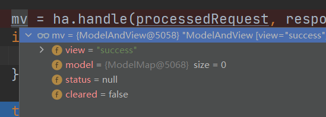

## 8、向session域共享数据

```java
@RequestMapping("/testSession")
public String testSession(HttpSession session) {
    session.setAttribute("testSessionScope","hello,session");
    return "success";
}
```

## 9、向application域共享数据

```java
    @RequestMapping("/testApplication")
    public String testApplication(HttpSession session) {
        ServletContext servletContext = session.getServletContext();
        servletContext.setAttribute("testApplicationScope","hello,application");
        return "success";
    }
```

# 六、SpringMVC的视图

SpringMVC中的视图是View接口，视图的作用渲染数据，将模型Model中的数据展示给用户 

SpringMVC视图的种类很多，默认有转发视图是InternalResourceView和重定向视图RedirectView

当工程引入jstl的依赖，转发视图会自动转换为JstlView 

若使用的视图技术为Thymeleaf，在SpringMVC的配置文件中配置了Thymeleaf的视图解析器，由此视图解析器解析之后所得到的是ThymeleafView

所创建的视图对象只与视图名称有关

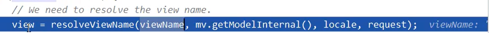

## 1、ThymeleafView

当控制器方法中所设置的视图名称没有任何前缀时，此时的视图名称会被SpringMVC配置文件中所配置 的视图解析器解析，视图名称拼接视图前缀和视图后缀所得到的最终路径，会通过转发的方式实现跳转

```java
    @RequestMapping("/testThymeleafView")
    public String testThymeleafView() {
        return "success";
    }
```


```java

//DispatcherServlet.doDispatecher();
mv = ha.handle(processedRequest, response, mappedHandler.getHandler());
    ↓
    step into
    ...
    ↓
    //ViewCotroller.testThymeleafView() 
this.processDispatchResult(processedRequest, response, mappedHandler, mv, (Exception)dispatchException);
    ↓
    step into
    ↓
    //DispatcherServlet.processDispatchResult();	
    if (mv != null && !mv.wasCleared()) {
    	this.render(mv, request, response);//渲染视图
        ↓
        step into
        ↓
        //DispatcherServlet.render();	
        Locale locale = this.localeResolver != null ? this.localeResolver.resolveLocale(request) : request.getLocale();
        response.setLocale(locale);//设置国际化
        String viewName = mv.getViewName();
        View view;
        if (viewName != null) {
            view = this.resolveViewName(viewName, mv.getModelInternal(), locale, request);//解析视图名称获取视图    
```

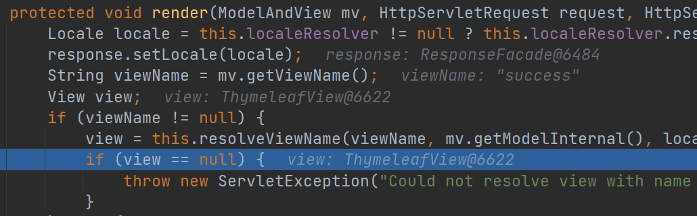

## 2、转发视图

SpringMVC中默认的转发视图是InternalResourceView 

SpringMVC中创建转发视图的情况： 

当控制器方法中所设置的视图名称以"forward:"为前缀时，创建InternalResourceView视图，此时的视图名称不会被SpringMVC配置文件中所配置的视图解析器解析，而是会将前缀"forward:"去掉，剩余部分作为最终路径通过转发的方式实现跳转

例如"forward:/"，"forward:/employee"

```java
    @RequestMapping("/testForward")
    public String testForwardView() {
        return "forward:/testThymeleafView";
    }
```

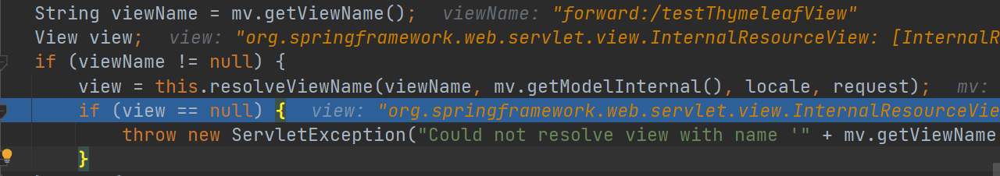

> 注：不能直接跳转到指定的页面，而只能转发某一个请求

## 3、重定向视图

SpringMVC中默认的重定向视图是RedirectView 

当控制器方法中所设置的视图名称以"redirect:"为前缀时，创建RedirectView视图，此时的视图名称不 会被SpringMVC配置文件中所配置的视图解析器解析，而是会将前缀"redirect:"去掉，剩余部分作为最 终路径通过重定向的方式实现跳转 

例如"redirect:/"，"redirect:/employee

```java
    @RequestMapping("/testRedirect")
    public String testRedirect() {
        return "redirect:/testThymeleafView";
    }
```

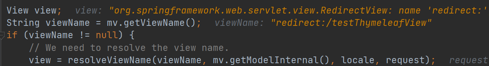

> 注： 重定向视图在解析时，会先将redirect:前缀去掉，然后会判断剩余部分是否以/开头，若是则会自 动拼接上下文路径
>
> 请求转发和重定向区别：
>
> * 请求转发后浏览器地址栏不变，重定向后浏览器地址栏发生改变，即视图名称对应的所在地址
> * 请求转发能访问WEB-INF下的资源，重定向不行
> * 请求转发将请求域中的数据传输到下一个页面，而重定向则是发出新的请求
> * 请求转发只能访问服务器内部资源（因此转发视图称为InternalResourceView ），而重定向可以访问外部资源

## 4、视图控制器view-controller

当控制器方法中，仅仅用来实现页面跳转，即只需要设置视图名称时，可以将处理器方法在spring配置文件springMVC.xml中使用view-controller标签进行表示

```java
    @RequestMapping("/")
    public String index() {
        return "index";
    }

    @RequestMapping("/testView")
    public String testView() {
        return "test_view";
    }
```

↓

```xml
<!--
path：设置处理的请求地址
view-name：设置请求地址所对应的视图名称
-->	   
	<!--视图控制器-->
    <mvc:view-controller path="/" view-name="index"/>
    <mvc:view-controller path="/testView" view-name="test_view"/>

    <!--开启mvc注解驱动-->
    <mvc:annotation-driven />
```

> 注： 当SpringMVC中设置任何一个view-controller时，其他控制器中的请求映射将全部失效，此时需 要在SpringMVC的核心配置文件中设置开启mvc注解驱动的标签：
>
> `<mvc:annotation-driven />`

## 5、如何解析.jsp后缀的视图名称   通过InternalResourceViewResolver

> tocat服务器web.xml配置文件作用于部署在服务器上的所有工程，而工程的WEB-INF中web.xml作用域当前工程
>
> 通过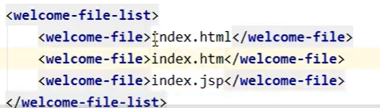配置
>
> 实现对“/”路径配置欢迎页面，即按照优先级默认打开index.html、index.htm\index.jsp
>
> 当浏览器访问后缀为.jsp的文件时不会被thmeleaf视图解析
>
> ```xml
> 前端控制器的配置
> <servlet-mapping>
>     <servlet-name>dispatcherServlet</servlet-name>
>     <url-pattern>/</url-pattern>
>   </servlet-mapping>
> ```

在springMVC.xml配置视图解析器InternalResourceViewResolver

```xml
<!--视图解析器-->
<bean class="org.springframework.web.servlet.view.InternalResourceViewResolver">
    <property name="prefix" value="/WEB-INF/templates/"/>
    <property name="suffix" value=".jsp"/>
</bean>
```

控制器

```java
    @RequestMapping("/success")
    public String success() {
        return "success";
    }
```

访问

```html
<a href="${pageContext.request.contextPath}/success">success.jsp</a>
```

> 注：由于没有配置Thymeleaf解析器，在这种工程环境下，若请求地址没有前缀或者有forward：前缀 ，则由InternalResourceViewResolver进行解析

# 七、RESTFul

## 1、RESTFul简介

REST：Representational State Transfer，**表现层资源状态转移**。

### a>资源 

资源是一种看待服务器的方式，即，将服务器看作是由很多离散的资源组成。每个资源是服务器上一个 可命名的抽象概念。因为资源是一个抽象的概念，所以它不仅仅能代表服务器文件系统中的一个文件、 数据库中的一张表等等具体的东西，可以将资源设计的要多抽象有多抽象，只要想象力允许而且客户端 应用开发者能够理解。与面向对象设计类似，**资源是以名词为核心来组织的，首先关注的是词**。一个 资源可以由一个或多个URI来标识。URI既是资源的名称，也是资源在Web上的地址。对某个资源感兴 趣的客户端应用，可以通过资源的URI与其进行交互。 

### b>资源的表述 

资源的表述是一段对于资源在某个特定时刻的状态的描述。可以在客户端-服务器端之间转移（交 换）。资源的表述可以有多种格式，例如HTML/XML/JSON/纯文本/图片/视频/音频等等。资源的表述格 式可以通过协商机制来确定。请求-响应方向的表述通常使用不同的格式。 

###　c>状态转移 

状态转移说的是：在客户端和服务器端之间转移（transfer）代表资源状态的表述。通过转移和操作资 源的表述，来间接实现操作资源的目的。

## 2、RESTFul的实现

具体说，就是 HTTP 协议里面，四个表示操作方式的动词：GET、POST、PUT、DELETE。 

它们分别对应四种基本操作：GET 用来获取资源，POST 用来新建资源，PUT 用来更新资源，DELETE 用来删除资源。

 REST 风格提倡 URL 地址使用统一的风格设计，从前到后各个单词使用斜杠分开，不使用问号键值对方式携带请求参数，而是将要**发送给服务器的数据作为 URL 地址的一部分，以保证整体风格的一致性**。

| 操作     | 传统方式         | REST风格                |
| -------- | ---------------- | ----------------------- |
| 查询操作 | getUserById?id=1 | user/1-->get请求方式    |
| 保存操作 | saveUser         | user-->post请求方式     |
| 删除操作 | deleteUser?id=1  | user/1-->delete请求方式 |
| 更新操作 | updateUser       | user-->put请求方式      |

```java
    /**
     * 模拟用户资源增删改查
     * /user   GET   查询所有用户信息
     * /user/1   GET   查询对应id的用户信息
     * /user   POST   添加用户信息
     * /user/1   DELETE   删除对应id的用户信息
     * /user   PUT   修改用户信息
     */
    @RequestMapping(value = "/user", method = RequestMethod.GET)
    public String getAllUser() {
        return "success";
    }
```


## 3、HiddenHttpMethodFilter

由于浏览器只支持发送get和post方式的请求，那么该如何呢？ 

SpringMVC 提供了 HiddenHttpMethodFilter 帮助我们将 POST 请求转换为 DELETE 或 PUT 请求 

HiddenHttpMethodFilter 处理put和delete请求的条件： 

* 当前请求的请求方式必须为post 

* 当前请求必须传输请求参数_method 

满足以上条件，HiddenHttpMethodFilter 过滤器就会将当前请求的请求方式转换为请求参数`_method`的值，因此请求参数_method的值才是最终的请求方式 

在web.xml中注册HiddenHttpMethodFilter

```xml
  <!--配置HiddenHttpMethodFilter-->
  <filter>
    <filter-name>hiddenHttpMethodFilter</filter-name>
    <filter-class>org.springframework.web.filter.HiddenHttpMethodFilter</filter-class>
  </filter>
  <filter-mapping>
    <filter-name>hiddenHttpMethodFilter</filter-name>
    <url-pattern>/*</url-pattern>
  </filter-mapping>
```

源码：

```java
public class HiddenHttpMethodFilter extends OncePerRequestFilter {
    private static final List<String> ALLOWED_METHODS;
    public static final String DEFAULT_METHOD_PARAM = "_method";
    private String methodParam = "_method";

    public HiddenHttpMethodFilter() {
    }

    public void setMethodParam(String methodParam) {
        Assert.hasText(methodParam, "'methodParam' must not be empty");
        this.methodParam = methodParam;
    }

    protected void doFilterInternal(HttpServletRequest request, HttpServletResponse response, FilterChain filterChain) throws ServletException, IOException {
        HttpServletRequest requestToUse = request;
        if ("POST".equals(request.getMethod()) && request.getAttribute("javax.servlet.error.exception") == null) {
            String paramValue = request.getParameter(this.methodParam);
            if (StringUtils.hasLength(paramValue)) {
                String method = paramValue.toUpperCase(Locale.ENGLISH);
                if (ALLOWED_METHODS.contains(method)) {
                    requestToUse = new HiddenHttpMethodFilter.HttpMethodRequestWrapper(request, method);
                }
            }
        }

        filterChain.doFilter((ServletRequest)requestToUse, response);
    }

    static {
        ALLOWED_METHODS = Collections.unmodifiableList(Arrays.asList(HttpMethod.PUT.name(), HttpMethod.DELETE.name(), HttpMethod.PATCH.name()));
    }

    private static class HttpMethodRequestWrapper extends HttpServletRequestWrapper {
        private final String method;

        public HttpMethodRequestWrapper(HttpServletRequest request, String method) {
            super(request);
            this.method = method;
        }

        public String getMethod() {
            return this.method;
        }
    }
}

```

为表单添加隐藏域传递参数_method

```java
<input type="hidden" name="_method" value="put">
```

> 注： 目前为止，SpringMVC中提供了两个过滤器：CharacterEncodingFilter和 HiddenHttpMethodFilter 
>
> 在web.xml中注册时，必须先注册CharacterEncodingFilter，再注册HiddenHttpMethodFilter 
>
> 原因： 
>
> * 在 CharacterEncodingFilter 中是通过 request.setCharacterEncoding(encoding) 方法设置字符集的
> * request.setCharacterEncoding(encoding) 方法要求前面不能有任何获取请求参数的操作 *
>
> * 而 HiddenHttpMethodFilter 恰恰有一个获取请求方式的操作： 
>
> ```java
> string paramValue = request.getParameter(this.methodParam);
> ```

# 八、RESTful案例

## 1、准备工作

和传统 CRUD 一样，实现对员工信息的增删改查。

* 搭建环境 
* 准备实体类
* 准备dao模拟数据

## 2、功能清单

| 功能               | URL地址     | 请求方式 |
| ------------------ | ----------- | -------- |
| 访问首页           | /           | GET      |
| 查询全部数据       | /employee   | GET      |
| 删除               | /employee/2 | DELETE   |
| 跳转到添加数据页面 | /toAdd      | GET      |
| 执行保存           | /employee   | POST     |
| 跳转到更新数据页面 | /employee/2 | GET      |
| 执行更新           | /employee   | PUT      |

## 3、具体功能：访问首页

## 4、具体功能：查询所有员工数据

## 5、具体功能：删除

### a>创建处理delete请求方式的表单

```html
<!-- 作用：通过超链接控制表单的提交，将post请求转换为delete请求 -->
<form method="post">
  <input type="hidden" name="_method" value="delete">
</form>
```

### b>删除超链接绑定点击事件

引入vue.js

```html
<!--由于访问了静态资源，前端控制器无法找到对应控制器，所以需要设置默认servlet对其处理，开放对静态资源访问-->  
<script type="text/javascript" th:src="@{/static/js/vue.js}"></script>
```

删除超链接

```html
<a class="deleteA" @click="deleteEmployee"
th:href="@{'/employee/'+${employee.id}}">delete</a>
```

通过vue处理点击事件

```html
<script type="text/javascript">
var vue = new Vue({
el:"#dataTable",
methods:{
//event表示当前事件
deleteEmployee:function (event) {
//通过id获取表单标签
var delete_form = document.getElementById("delete_form");
//将触发事件的超链接的href属性为表单的action属性赋值
delete_form.action = event.target.href;
//提交表单
delete_form.submit();
//阻止超链接的默认跳转行为
event.preventDefault();
}
}
});
</script>

```

或引入jquery操作

```html
	<!--由于访问了静态资源，前端控制器无法找到对应控制器，所以需要设置默认servlet对其处理，开放对静态资源访问-->  
    <script type="text/javascript" th:src="@{/static/js/jquery-1.7.2.js}"></script>
    <script type="text/javascript">
      $(function () {
        $(".toPost").click(function () {
          var href = $(this).attr("href");
          $("#toHiddenMethod").attr("action",href).submit();
          return false;
        })
      })
    </script>
```

开放静态资源访问

* 方案1 mvc:default-servlet-handler/

  将在SpringMVC上下文中定义一个DefaultServletHttpRequestHandler，它会对就去DispatcherServlet的请求进行筛选如果发现该请求是静态资源请求，则该请求转由Web服务器默认的servlet处理，如果不是静态资源，才有DispatcherServlet处理

```xml
    <!--开放静态资源访问-->
    <mvc:default-servlet-handler/>
```

* 方案2 <mvc:resources />

  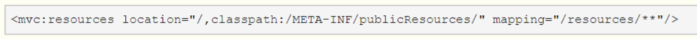

### c>控制器方法

```java
    @DeleteMapping("/employee/{id}")
    public String deleteEmployee(Model model, @PathVariable("id") Integer id) {
        employeeDAO.delete(id);
        return "redirect:/employee";
    }
```

## 6、具体功能：跳转到添加数据页面

## 7、具体功能：执行保存

## 8、具体功能：跳转到更新数据页面

### a>修改超链

```html
        <a th:href="@{/employee/}+${employee.id}">update</a>
```

### b>控制器方法

```java
    @GetMapping("/employee/{id}")
    public String toUpdate(Model model, @PathVariable("id") Integer id) {
        Employee employee = employeeDAO.get(id);
        model.addAttribute("employee", employee);
        return "employee_update";
    }
```

### c>创建employee_update.html

```html
<!DOCTYPE html>
<html lang="en" xmlns:th="http://www.thymeleaf.org">
<head>
    <meta charset="UTF-8">
    <title>update employee</title>
</head>
<body>
    <h1>update</h1>
    <form  th:action="@{/employee}" method="post"><br/>
        <input type="hidden" name="_method" value="put">
        <input type="hidden" name="id" th:value="${employee.id}">
        lastName:<input type="text" name="lastName" th:value="${employee.lastName}"/><br/>
        email:<input type="text" name="email" th:value="${employee.email}"/><br/>
        gender:<input type="radio" name="gender"  value="1" th:checked="${employee.gender} eq 1">male
        <input type="radio" name="gender" value="0" th:checked="${employee.gender} eq 0">female<br/>
        <input type="submit" value="update"><br/>
    </form>
</body>
</html>
```

## 9、具体功能：执行更新

### a>控制器方法

```java
@PutMapping("/employee")
public String updateEmployee(Employee employee) {
    employeeDAO.save(employee);
    return "redirect:/employee";
}
```

# 八、HttpMessageConverter

HttpMessageConverter，报文信息转换器，将请求报文转换为Java对象，或将Java对象转换为响应报文 

HttpMessageConverter提供了两个注解和两个类型：@RequestBody，@ResponseBody， RequestEntity， ResponseEntity

## 1、@RequestBody

@RequestBody可以获取请求体，需要在控制器方法设置一个形参，使用@RequestBody进行标识，当 前请求的请求体就会为当前注解所标识的形参赋值

```html
  <form th:action="@{/testRequestBody}" method="post">
    用户名：<input type="text" name="username">
    密码：<input type="password" name="password">
    <input type="submit" value="测试@RequestBody">
  </form>
```

```java
    @RequestMapping("/testRequestBody")
    public String testRequestBody(@RequestBody String requestBody) {
        System.out.println(requestBody);
        return "success";
    }
//结果：username=asd&password=dasdasd
```

## 2、RequestEntity

RequestEntity封装请求报文的一种类型，需要在控制器方法的形参中设置该类型的形参，当前请求的 请求报文就会赋值给该形参，可以通过getHeaders()获取请求头信息，通过getBody()获取请求体信息

```java
    @RequestMapping("/testRequestEntity")
    public String testRequestEntity(RequestEntity<String> requestEntity) {
        System.out.println("请求头：" + requestEntity.getHeaders());
        System.out.println("请求体：" + requestEntity.getBody());
        return "success";
    }
/*
请求头：[host:"localhost:8080", connection:"keep-alive", content-length:"30", cache-control:"max-age=0", sec-ch-ua:""Chromium";v="94", "Microsoft Edge";v="94", ";Not A Brand";v="99"", sec-ch-ua-mobile:"?0", sec-ch-ua-platform:""Windows"", upgrade-insecure-requests:"1", origin:"http://localhost:8080", content-type:"application/x-www-form-urlencoded", user-agent:"Mozilla/5.0 (Windows NT 10.0; Win64; x64) AppleWebKit/537.36 (KHTML, like Gecko) Chrome/94.0.4606.81 Safari/537.36 Edg/94.0.992.47", accept:"text/html,application/xhtml+xml,application/xml;q=0.9,image/webp,image/apng,、*/*;q=0.8,application/signed-exchange;v=b3;q=0.9", sec-fetch-site:"same-origin", sec-fetch-mode:"navigate", sec-fetch-user:"?1", sec-fetch-dest:"document", referer:"http://localhost:8080/SpringMVC_demo4/", accept-encoding:"gzip, deflate, br", accept-language:"en-US,en;q=0.9,zh-CN;q=0.8,zh;q=0.7,en-GB;q=0.6", cookie:"Idea-e0e8b97f=5c90583d-d907-4832-be78-bf1bb2e57b6a"]
请求体：username=asdasd&password=12354
 */
```

## 3、@ResponseBody

传统ResponseAPI方式

```java
       @RequestMapping("/testResponseAPI")
    public String testResponseAPI(HttpServletResponse response) throws IOException {
        response.getWriter().print("hello,response");
        return "success";
    }
```

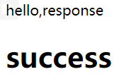

@ResponseBody用于标识一个控制器方法，可以将该方法的返回值直接作为响应报文的响应体响应到 浏览器

```java
    @RequestMapping("/testResponseBody")
    @ResponseBody
    public String testResponseBody() {
        System.out.println();
        return "success by ResponseBody";
    }
```


## 4、SpringMVC处理json

@ResponseBody处理json的步骤： 

### a>导入jackson的依赖

### b>在SpringMVC的核心配置文件中开启mvc的注解驱动，

此时在HandlerAdaptor中会自动装配一个消 息转换器：MappingJackson2HttpMessageConverter，可以将响应到浏览器的Java对象转换为Json格 式的字符串

```xml
    <!--开启mvc注解驱动-->
    <mvc:annotation-driven/>
```

### c>在处理器方法上使用@ResponseBody注解进行标识

### d>将Java对象直接作为控制器方法的返回值返回，就会自动转换为Json格式的字符串

```java
    @RequestMapping("/testResponseUser")
    @ResponseBody
    public User testResponseUser() {
        User user = new User(1001,"tintin","123456",14,"男");
        return user;
    }
```

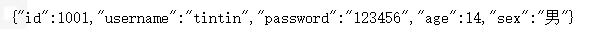

## 5、SpringMVC处理ajax

### a>请求超链接：

```html
    <button id="testAjax" >处理ajax请求</button>
    <div id="app">

    </div>
```

### b>通过vue和axios处理点击事件：

```html
<script type="text/javascript" th:src="@{/static/js/vue.js}"></script>
<script type="text/javascript" th:src="@{/static/js/axios.min.js}"></script>
<script type="text/javascript">
var vue = new Vue({
el:"#app",
methods:{
testAjax:function (event) {
axios({
method:"post",
url:event.target.href,
params:{
username:"admin",
password:"123456"
}
}).then(function (response) {
alert(response.data);
});
event.preventDefault();
}
}
});
</script>
```

或jquery

```html
    <script type="text/javascript" th:src="@{/static/js/jquery-1.7.2.js}"></script>
    <script type="text/javascript" th:inline="javascript">
        $(function () {
            $("#testAjax").click(function () {
                $.get("http://localhost:8080/SpringMVC_demo4/testResponseAjax"
                    ,{username:"tintin",password:"123456"}
                    ,function (data){
                        alert(data)
                        $("#app").html(data)
                    }
                    ,"text")
            })
        })
    </script>
```

### c>控制器方法

```java
    @RequestMapping("/testResponseAjax")
    @ResponseBody
    public String testResponseAjax(String username, String password) {
        System.out.println("username:"+username+",password:"+password);
        return "hello,ajax";
    }
```


## 6、@RestController注解

@RestController注解是springMVC提供的一个复合注解，标识在控制器的类上，就相当于为类添加了 @Controller注解，并且为其中的每个方法添加了@ResponseBody注解

## 7、ResponseEntity

ResponseEntity用于控制器方法的返回值类型，该控制器方法的返回值就是响应到浏览器的响应报文

# 九、文件上传和下载

## 1、文件下载 

使用ResponseEntity实现下载文件的功能

```java
@RequestMapping("/testDown")
    public ResponseEntity<byte[]> testDown(HttpSession session) throws IOException {
        //创建application对象
        ServletContext servletContext = session.getServletContext();
        //获取资源文件真实路径
        String imgPath = servletContext.getRealPath("/static/img/img1.jpg");
        System.out.println(imgPath);
        //创建输入流
        InputStream is = new FileInputStream(imgPath);
        //创建字节数组
        byte[] bytes = new byte[is.available()];
        //将流读入数组
        is.read(bytes);
        //创建HttpHeaders设置响应头信息
        HttpHeaders headers = new HttpHeaders();
        //设置下载方式以及下载的名字
        headers.add("Content-Disposition","attachment;filename=1.jpg");
        //设置响应状态码
        HttpStatus status = HttpStatus.OK;
        //创建ResponseEntity对象
        ResponseEntity<byte[]> responseEntity = new ResponseEntity<>(bytes,headers,status);
        //关闭输入流
        is.close();
        return responseEntity;
    }
```

## 2、文件上传 

文件上传要求form表单的请求方式必须为post，并且添加属性enctype="multipart/form-data" SpringMVC中将上传的文件封装到MultipartFile对象中，通过此对象可以获取文件相关信息 

上传步骤：

### a>添加依赖：

```xml 
        <!-- https://mvnrepository.com/artifact/commons-fileupload/commons-fileupload -->
        <dependency>
        <groupId>commons-fileupload</groupId>
        <artifactId>commons-fileupload</artifactId>
        <version>1.3.1</version>
        </dependency>
```

### b>在SpringMVC的配置文件中添加配置：

```xml
    <!--必须通过文件解析器的解析才能将文件转换为MultipartFile对象-->
	<!--为了Spring能找到该对象，id必须为multipartResolver-->
    <bean id="multipartResolver"
          class="org.springframework.web.multipart.commons.CommonsMultipartResolver">
    </bean>
```

### c>控制器方法：

```java
    @RequestMapping("/testUp")
    public String testUp(MultipartFile photo,HttpSession session) throws IOException {
        //获取上传的文件原名
        String originalFilename = photo.getOriginalFilename();
        System.out.println(originalFilename);
        //获取保存的目录
        ServletContext servletContext = session.getServletContext();
        String storeingPath = servletContext.getRealPath("photo");
        System.out.println(storeingPath);
        //确保保存的目录存在
        File file = new File(storeingPath);
        if (!file.exists()) {
            file.mkdir();
        }
        //得到最终保存的文件路径
        String finalPath = storeingPath + File.separator + originalFilename;
        System.out.println(finalPath);
        photo.transferTo(new File(finalPath));
        return "success";
    }
```

### d>上传表单

```html
    <form method="post" th:action="@{/testUp}" enctype="multipart/form-data">
        上传头像：<input type="file" name="photo"><br/>
        <input type="submit" value="上传"><br/>
    </form>
```

结果

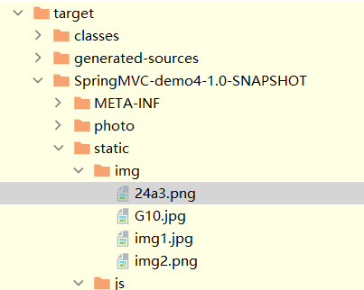

### 解决重名问题

```java
        //获取上传的文件原名
        String originalFileName = photo.getOriginalFilename();
        System.out.println(originalFileName);
        //获取文件原名的后缀
        String suffix = originalFileName.substring(originalFileName.lastIndexOf("."));
        //将uuid作为文件名
        String uuid = UUID.randomUUID().toString();
        //拼接最终文件名
        String finalFileName = uuid + suffix;
        System.out.println(finalFileName);
```

# 十、拦截器

## 1、拦截器的配置

SpringMVC中的拦截器用于拦截控制器方法的执行 

SpringMVC中的拦截器需要实现HandlerInterceptor 

SpringMVC的拦截器必须在SpringMVC的配置文件中进行配置

```xml
    <!--配置拦截器-->
    <mvc:interceptors>
<!--        <bean class="com.tintin.mvc.interceptor.HelloInterceptor"></bean>-->
<!--        <ref bean="helloInterceptor"></ref>-->
        <!--以上两种方式默认对所有请求进行拦截-->
        <mvc:interceptor>
            <mvc:mapping path="/**"/>
            <mvc:exclude-mapping path="/"/>
            <ref bean="helloInterceptor"></ref>
        </mvc:interceptor>
        <!--
        以上配置方式可以通过ref或bean标签设置拦截器，通过mvc:mapping设置需要拦截的请求，通过
        mvc:exclude-mapping设置需要排除的请求，即不需要拦截的请求
        -->
    </mvc:interceptors>
```


## 2、拦截器的三个抽象方法

 SpringMVC中的拦截器有三个抽象方法：

 preHandle：控制器方法执行之前执行preHandle()，**其boolean类型的返回值表示是否拦截或放行**，返回true为放行，即调用控制器方法；返回false表示拦截，即不调用控制器方法 

postHandle：控制器方法执行之后执行postHandle() 

afterComplation：处理完视图和模型数据，渲染视图完毕之后执行afterComplation(）

## 3、多个拦截器的执行顺序

a>若每个拦截器的preHandle()都返回true 此时多个拦截器的执行顺序和拦截器在SpringMVC的配置文件的配置顺序有关： preHandle()会按照配置的顺序执行，而postHandle()和afterComplation()会按照配置的反序执行 

b>若某个拦截器的preHandle()返回了false    preHandle()返回false和它之前的拦截器的preHandle()都会执行，postHandle()都不执行，**返回false 的拦截器之前的拦截器的afterComplation()会执行**

# 十一、异常处理器

## 1、基于配置的异常处理

SpringMVC提供了一个处理控制器方法执行过程中所出现的异常的接口：HandlerExceptionResolver 

HandlerExceptionResolver接口的实现类有：DefaultHandlerExceptionResolver和 SimpleMappingExceptionResolver 

SpringMVC提供了自定义的异常处理器SimpleMappingExceptionResolver， 使用方式：

```xml
<!--配置异常处理器-->
    <bean class="org.springframework.web.servlet.handler.SimpleMappingExceptionResolver">
        <property name="exceptionMappings">
            <props>
                <!--异常与视图名称映射-->
                <!--
                properties的键表示处理器方法执行过程中出现的异常
                properties的值表示若出现指定异常时，设置一个新的视图名称，跳转到指定页面
                -->
                <prop key="java.lang.ArithmeticException">error</prop>
            </props>
        </property>
        <!--exceptionAttribute属性设置一个属性名，将出现的异常信息在请求域中进行共享-->
        <property name="exceptionAttribute" value="ex"></property>
    </bean>
```

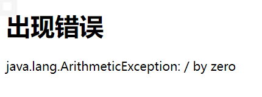

## 2、基于注解的异常处理

```java
//@ControllerAdvice将当前类标识为异常处理的组件
@ControllerAdvice
public class ExceptionController {
    //@ExceptionHandler用于设置所标识方法处理的异常
    @ExceptionHandler(value = {ArithmeticException.class, NullPointerException.class})
    public String testException(Exception ex, Model model) {
        //ex表示当前请求处理中出现的异常对象
        model.addAttribute("ex",ex);
        return "error";
    }
}
```

# 十二、注解配置SpringMVC

使用配置类和注解代替web.xml和SpringMVC配置文件的功能

## 1、创建初始化类，代替web.xml

在Servlet3.0环境中，容器会在类路径中查找实现javax.servlet.ServletContainerInitializer接口的类， 如果找到的话就用它来配置Servlet容器。 

Spring提供了这个接口的实现，名为 SpringServletContainerInitializer，这个类反过来又会查找实现WebApplicationInitializer的类并将配 置的任务交给它们来完成。Spring3.2引入了一个便利的WebApplicationInitializer基础实现，名为 AbstractAnnotationConfigDispatcherServletInitializer，当我们的类扩展了 AbstractAnnotationConfigDispatcherServletInitializer并将其部署到Servlet3.0容器的时候，容器会自 动发现它，并用它来配置Servlet上下文。

```java
//web过程的初始化类，用来代替web.xml
public class WebInit extends AbstractAnnotationConfigDispatcherServletInitializer {
    /**
     * 指定spring的配置类
     * @return
     */
    @Override
    protected Class<?>[] getRootConfigClasses() {
        return new Class[]{SpringConfig.class};
    }

    /**
     * 指定springMVC的配置类
     * @return
     */
    @Override
    protected Class<?>[] getServletConfigClasses() {
        return new Class[]{WebConfig.class};
    }

    /**
     * 指定DispatcherServlet的映射规则，即url-pattern
     * @return
     */
    @Override
    protected String[] getServletMappings() {
        return new String[]{"/"};
    }

    /**
     * 注册过滤器
     * @return
     */
    @Override
    protected Filter[] getServletFilters() {
        CharacterEncodingFilter characterEncodingFilter = new CharacterEncodingFilter();
        characterEncodingFilter.setEncoding("UTF-8");
        characterEncodingFilter.setForceResponseEncoding(true);
        HiddenHttpMethodFilter hiddenHttpMethodFilter = new HiddenHttpMethodFilter();
        return new Filter[] {characterEncodingFilter,hiddenHttpMethodFilter};
    }
}

```


## 2、创建SpringConfig配置类，代替spring的配置文件

```java
@Configuration
public class SpringConfig {
//ssm整合之后，spring的配置信息写在此类中
}

```

## 3、创建WebConfig配置类，代替SpringMVC的配置文件

```java
/**
 * 扫描组件 视图解析器 视图管理器 默认servlet mvc注解驱动 文件上传解析器 拦截器 异常处理
 */

@Configuration//标识为配置类
@ComponentScan("com.tintin.mvc.controller")//扫描组件
@EnableWebMvc//开启mvc注解驱动
public class WebConfig implements WebMvcConfigurer { //该接口提供了配置MVC组件的功能
    //默认servlet
    @Override
    public void configureDefaultServletHandling(DefaultServletHandlerConfigurer configurer) {
        configurer.enable();//开启了默认servlet
        WebMvcConfigurer.super.configureDefaultServletHandling(configurer);
    }

    //拦截器
    @Override
    public void addInterceptors(InterceptorRegistry registry) {
        TestInterceptor testInterceptor = new TestInterceptor();
        registry.addInterceptor(testInterceptor).addPathPatterns("/**");
        WebMvcConfigurer.super.addInterceptors(registry);
    }

    //异常处理器
    @Override
    public void configureHandlerExceptionResolvers(List<HandlerExceptionResolver> resolvers) {
        SimpleMappingExceptionResolver exceptionResolver = new SimpleMappingExceptionResolver();
        Properties prop = new Properties();
        prop.setProperty("java.lang.ArithmeticException", "error");
        exceptionResolver.setExceptionMappings(prop);
        exceptionResolver.setExceptionAttribute("ex");
        resolvers.add(exceptionResolver);
    }

    //文件上传解析器
    @Bean
    public CommonsMultipartResolver commonsMultipartResolver() {
        return new CommonsMultipartResolver();
    }

    //视图管理器
    @Override
    public void addViewControllers(ViewControllerRegistry registry) {
        registry.addViewController("/hello").setViewName("hello");
        WebMvcConfigurer.super.addViewControllers(registry);
    }

    //配置生成模板解析器
    @Bean
    public ITemplateResolver templateResolver() {
        WebApplicationContext webApplicationContext =
                ContextLoader.getCurrentWebApplicationContext();
        // ServletContextTemplateResolver需要一个ServletContext作为构造参数，可通过
        // WebApplicationContext 的方法获得
        ServletContextTemplateResolver templateResolver = new
                ServletContextTemplateResolver(
                webApplicationContext.getServletContext());
        templateResolver.setPrefix("/WEB-INF/templates/");
        templateResolver.setSuffix(".html");
        templateResolver.setCharacterEncoding("UTF-8");
        templateResolver.setTemplateMode(TemplateMode.HTML);
        return templateResolver;
    }

    //生成模板引擎并为模板引擎注入模板解析器
    @Bean
    public SpringTemplateEngine templateEngine(ITemplateResolver templateResolver) {
        SpringTemplateEngine templateEngine = new SpringTemplateEngine();
        templateEngine.setTemplateResolver(templateResolver);
        return templateEngine;
    }

    //生成视图解析器并为解析器注入模板引擎
    @Bean
    public ViewResolver viewResolver(SpringTemplateEngine templateEngine) {
        ThymeleafViewResolver viewResolver = new ThymeleafViewResolver();
        viewResolver.setCharacterEncoding("UTF-8");
        viewResolver.setTemplateEngine(templateEngine);
        return viewResolver;
    }
}
```

# 十三、SpringMVC执行流程

## 1、SpringMVC常用组件

* DispatcherServlet：前端控制器，不需要工程师开发，由框架提供 

  作用：统一处理请求和响应，整个流程控制的中心，由它调用其它组件处理用户的请求 

* HandlerMapping：处理器映射器，不需要工程师开发，由框架提供 

  作用：根据请求的url、method等信息查找Handler，即控制器方法 

* Handler：处理器，需要工程师开发 

  作用：在DispatcherServlet的控制下Handler对具体的用户请求进行处理 

* HandlerAdapter：处理器适配器，不需要工程师开发，由框架提供 

  作用：通过HandlerAdapter对处理器（控制器方法）进行执行 

* ViewResolver：视图解析器，不需要工程师开发，由框架提供 

  作用：进行视图解析，得到相应的视图，例如：ThymeleafView、InternalResourceView、 RedirectView 

* View：视图 

  作用：将模型数据通过页面展示给用户

## 2、DispatcherServlet初始化过程

DispatcherServlet 本质上是一个 Servlet，所以天然的遵循 Servlet 的生命周期。所以宏观上是 Servlet 生命周期来进行调度。

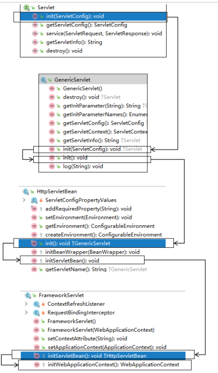

### a>初始化WebApplicationContext 

所在类：org.springframework.web.servlet.FrameworkServlet

```java
protected WebApplicationContext initWebApplicationContext() {
WebApplicationContext rootContext =
WebApplicationContextUtils.getWebApplicationContext(getServletContext());
WebApplicationContext wac = null;
if (this.webApplicationContext != null) {
// A context instance was injected at construction time -> use it
wac = this.webApplicationContext;
if (wac instanceof ConfigurableWebApplicationContext) {
ConfigurableWebApplicationContext cwac =
(ConfigurableWebApplicationContext) wac;
if (!cwac.isActive()) {
// The context has not yet been refreshed -> provide services
such as
// setting the parent context, setting the application context
id, etc
if (cwac.getParent() == null) {
// The context instance was injected without an explicit
parent -> set
// the root application context (if any; may be null) as the
parent
cwac.setParent(rootContext);
}
configureAndRefreshWebApplicationContext(cwac);
}
}
}
if (wac == null) {
// No context instance was injected at construction time -> see if one
// has been registered in the servlet context. If one exists, it is
assumed
// that the parent context (if any) has already been set and that the
// user has performed any initialization such as setting the context id
wac = findWebApplicationContext();
}
if (wac == null) {
// No context instance is defined for this servlet -> create a local one
// 创建WebApplicationContext
wac = createWebApplicationContext(rootContext);
}
if (!this.refreshEventReceived) {
// Either the context is not a ConfigurableApplicationContext with
refresh
// support or the context injected at construction time had already been
// refreshed -> trigger initial onRefresh manually here.
synchronized (this.onRefreshMonitor) {
// 刷新WebApplicationContext
onRefresh(wac);
}
}
if (this.publishContext) {
// Publish the context as a servlet context attribute.
// 将IOC容器在应用域共享
String attrName = getServletContextAttributeName();
getServletContext().setAttribute(attrName, wac);
}
return wac;
}

```

### b>创建WebApplicationContext

```java
protected WebApplicationContext createWebApplicationContext(@Nullable
ApplicationContext parent) {
Class<?> contextClass = getContextClass();
if (!ConfigurableWebApplicationContext.class.isAssignableFrom(contextClass))
{
throw new ApplicationContextException(
"Fatal initialization error in servlet with name '" +
getServletName() +
"': custom WebApplicationContext class [" + contextClass.getName() +
"] is not of type ConfigurableWebApplicationContext");
}
// 通过反射创建 IOC 容器对象
ConfigurableWebApplicationContext wac =
(ConfigurableWebApplicationContext)
BeanUtils.instantiateClass(contextClass);
wac.setEnvironment(getEnvironment());
// 设置父容器
wac.setParent(parent);
String configLocation = getContextConfigLocation();
if (configLocation != null) {
wac.setConfigLocation(configLocation);
}
configureAndRefreshWebApplicationContext(wac);
return wac;
}
```

### c>DispatcherServlet初始化策略

FrameworkServlet创建WebApplicationContext后，刷新容器，调用onRefresh(wac)，此方法在 DispatcherServlet中进行了重写，调用了initStrategies(context)方法，初始化策略，即初始化 DispatcherServlet的各个组件 

所在类：org.springframework.web.servlet.DispatcherServlet

```java
protected void initStrategies(ApplicationContext context) {
initMultipartResolver(context);
initLocaleResolver(context);
initThemeResolver(context);
initHandlerMappings(context);
initHandlerAdapters(context);
initHandlerExceptionResolvers(context);
initRequestToViewNameTranslator(context);
initViewResolvers(context);
initFlashMapManager(context);
}
```

##　3、DispatcherServlet调用组件处理请求

### a>processRequest()

FrameworkServlet重写HttpServlet中的service()和doXxx()，这些方法中调用了 processRequest(request, response) 

所在类：org.springframework.web.servlet.FrameworkServlet

```java
protected final void processRequest(HttpServletRequest request,
HttpServletResponse response)
throws ServletException, IOException {
long startTime = System.currentTimeMillis();
Throwable failureCause = null;
LocaleContext previousLocaleContext =
LocaleContextHolder.getLocaleContext();
LocaleContext localeContext = buildLocaleContext(request);
RequestAttributes previousAttributes =
RequestContextHolder.getRequestAttributes();
ServletRequestAttributes requestAttributes = buildRequestAttributes(request,
response, previousAttributes);
WebAsyncManager asyncManager = WebAsyncUtils.getAsyncManager(request);
asyncManager.registerCallableInterceptor(FrameworkServlet.class.getName(),
new RequestBindingInterceptor());
initContextHolders(request, localeContext, requestAttributes);
try {
// 执行服务，doService()是一个抽象方法，在DispatcherServlet中进行了重写
doService(request, response);
}
catch (ServletException | IOException ex) {
failureCause = ex;
throw ex;
}
catch (Throwable ex) {
failureCause = ex;
throw new NestedServletException("Request processing failed", ex);
}
finally {
resetContextHolders(request, previousLocaleContext, previousAttributes);
if (requestAttributes != null) {
requestAttributes.requestCompleted();
}
logResult(request, response, failureCause, asyncManager);
publishRequestHandledEvent(request, response, startTime, failureCause);
}
}
```

### b>doService()

所在类：org.springframework.web.servlet.DispatcherServlet

```java
@Override
protected void doService(HttpServletRequest request, HttpServletResponse
response) throws Exception {
logRequest(request);
// Keep a snapshot of the request attributes in case of an include,
// to be able to restore the original attributes after the include.
Map<String, Object> attributesSnapshot = null;
if (WebUtils.isIncludeRequest(request)) {
attributesSnapshot = new HashMap<>();
Enumeration<?> attrNames = request.getAttributeNames();
while (attrNames.hasMoreElements()) {
String attrName = (String) attrNames.nextElement();
if (this.cleanupAfterInclude ||
attrName.startsWith(DEFAULT_STRATEGIES_PREFIX)) {
attributesSnapshot.put(attrName,
request.getAttribute(attrName));
}
}
}
// Make framework objects available to handlers and view objects.
request.setAttribute(WEB_APPLICATION_CONTEXT_ATTRIBUTE,
getWebApplicationContext());
request.setAttribute(LOCALE_RESOLVER_ATTRIBUTE, this.localeResolver);
request.setAttribute(THEME_RESOLVER_ATTRIBUTE, this.themeResolver);
request.setAttribute(THEME_SOURCE_ATTRIBUTE, getThemeSource());
if (this.flashMapManager != null) {
FlashMap inputFlashMap = this.flashMapManager.retrieveAndUpdate(request,
response);
if (inputFlashMap != null) {
request.setAttribute(INPUT_FLASH_MAP_ATTRIBUTE,
Collections.unmodifiableMap(inputFlashMap));
}
request.setAttribute(OUTPUT_FLASH_MAP_ATTRIBUTE, new FlashMap());
request.setAttribute(FLASH_MAP_MANAGER_ATTRIBUTE, this.flashMapManager);
}
RequestPath requestPath = null;
if (this.parseRequestPath &&
!ServletRequestPathUtils.hasParsedRequestPath(request)) {
requestPath = ServletRequestPathUtils.parseAndCache(request);
}
try {
// 处理请求和响应
doDispatch(request, response);
}
finally {
if
(!WebAsyncUtils.getAsyncManager(request).isConcurrentHandlingStarted()) {
// Restore the original attribute snapshot, in case of an include.
if (attributesSnapshot != null) {
restoreAttributesAfterInclude(request, attributesSnapshot);
}
}
if (requestPath != null) {
ServletRequestPathUtils.clearParsedRequestPath(request);
}
}
```

### c>doDispatch()

所在类：org.springframework.web.servlet.DispatcherServlet

```java
protected void doDispatch(HttpServletRequest request, HttpServletResponse
response) throws Exception {
HttpServletRequest processedRequest = request;
HandlerExecutionChain mappedHandler = null;
boolean multipartRequestParsed = false;
WebAsyncManager asyncManager = WebAsyncUtils.getAsyncManager(request);
try {
ModelAndView mv = null;
Exception dispatchException = null;
try {
processedRequest = checkMultipart(request);
multipartRequestParsed = (processedRequest != request);
// Determine handler for the current request.
/*
mappedHandler：调用链
包含handler、interceptorList、interceptorIndex
handler：浏览器发送的请求所匹配的控制器方法
interceptorList：处理控制器方法的所有拦截器集合
interceptorIndex：拦截器索引，控制拦截器afterCompletion()的执行
*/
mappedHandler = getHandler(processedRequest);
if (mappedHandler == null) {
noHandlerFound(processedRequest, response);
return;
}
// Determine handler adapter for the current request.
// 通过控制器方法创建相应的处理器适配器，调用所对应的控制器方法
HandlerAdapter ha = getHandlerAdapter(mappedHandler.getHandler());
// Process last-modified header, if supported by the handler.
String method = request.getMethod();
boolean isGet = "GET".equals(method);
if (isGet || "HEAD".equals(method)) {
long lastModified = ha.getLastModified(request,
mappedHandler.getHandler());
if (new ServletWebRequest(request,
response).checkNotModified(lastModified) && isGet) {
return;
}
}
// 调用拦截器的preHandle()
if (!mappedHandler.applyPreHandle(processedRequest, response)) {
return;
}
// Actually invoke the handler.
// 由处理器适配器调用具体的控制器方法，最终获得ModelAndView对象
mv = ha.handle(processedRequest, response,
mappedHandler.getHandler());
if (asyncManager.isConcurrentHandlingStarted()) {
return;
}
applyDefaultViewName(processedRequest, mv);
// 调用拦截器的postHandle()
mappedHandler.applyPostHandle(processedRequest, response, mv);
}
catch (Exception ex) {
dispatchException = ex;
}
catch (Throwable err) {
// As of 4.3, we're processing Errors thrown from handler methods as
well,
// making them available for @ExceptionHandler methods and other
scenarios.
dispatchException = new NestedServletException("Handler dispatch
failed", err);
}
// 后续处理：处理模型数据和渲染视图
processDispatchResult(processedRequest, response, mappedHandler, mv,
dispatchException);
}
catch (Exception ex) {
triggerAfterCompletion(processedRequest, response, mappedHandler, ex);
}
catch (Throwable err) {
triggerAfterCompletion(processedRequest, response, mappedHandler,
new NestedServletException("Handler processing
failed", err));
}
finally {
if (asyncManager.isConcurrentHandlingStarted()) {
// Instead of postHandle and afterCompletion
if (mappedHandler != null) {
mappedHandler.applyAfterConcurrentHandlingStarted(processedRequest, response);
}
}
else {
// Clean up any resources used by a multipart request.
if (multipartRequestParsed) {
cleanupMultipart(processedRequest);
}
}
}
}
```

###　d>processDispatchResult()

```java
private void processDispatchResult(HttpServletRequest request,
HttpServletResponse response,
mappedHandler, @Nullable ModelAndView mv,
@Nullable Exception exception) throws
Exception {
boolean errorView = false;
if (exception != null) {
if (exception instanceof ModelAndViewDefiningException) {
logger.debug("ModelAndViewDefiningException encountered",
exception);
mv = ((ModelAndViewDefiningException) exception).getModelAndView();
}
else {
Object handler = (mappedHandler != null ? mappedHandler.getHandler()
: null);
mv = processHandlerException(request, response, handler, exception);
errorView = (mv != null);
}
}
// Did the handler return a view to render?
if (mv != null && !mv.wasCleared()) {
// 处理模型数据和渲染视图
render(mv, request, response);
if (errorView) {
WebUtils.clearErrorRequestAttributes(request);
}
}
else {
if (logger.isTraceEnabled()) {
logger.trace("No view rendering, null ModelAndView returned.");
}
}
if (WebAsyncUtils.getAsyncManager(request).isConcurrentHandlingStarted()) {
// Concurrent handling started during a forward
return;
}
if (mappedHandler != null) {
// Exception (if any) is already handled..
// 调用拦截器的afterCompletion()
mappedHandler.triggerAfterCompletion(request, response, null);
}
}
```

## 4、SpringMVC的执行流程

1) 用户向服务器发送请求，请求被SpringMVC 前端控制器 DispatcherServlet捕获。 

2) DispatcherServlet对请求URL进行解析，得到请求资源标识符（URI），判断请求URI对应的映射：

   1)  不存在 

      1)  再判断是否配置了mvc:default-servlet-handler

      2)  如果没配置，则控制台报映射查找不到，客户端展示404错误

         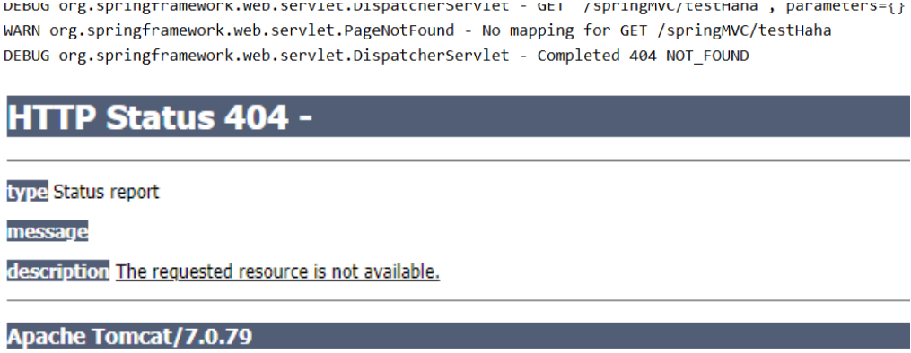

      3) 如果有配置，则访问目标资源（一般为静态资源，如：JS,CSS,HTML)，找不到客户端也会展示404 错误

         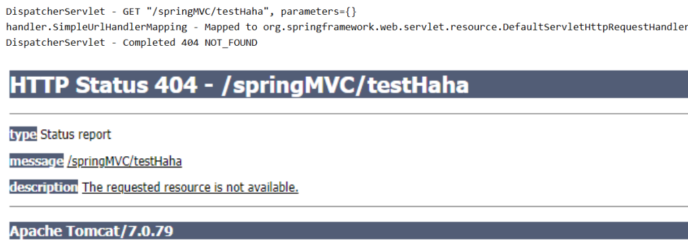

   2) 存在则执行下面的流程

      1) 根据该URI，调用HandlerMapping获得该Handler配置的所有相关的对象（包括Handler对象以及 Handler对象对应的拦截器），最后以HandlerExecutionChain执行链对象的形式返回。
      2)  DispatcherServlet 根据获得的Handler，选择一个合适的HandlerAdapter。
      3) 如果成功获得HandlerAdapter，此时将开始执行拦截器的preHandler(…)方法【正向】
      4) 提取Request中的模型数据，填充Handler入参，开始执行Handler（Controller)方法，处理请求。 在填充Handler的入参过程中，根据你的配置，Spring将帮你做一些额外的工作：
         1) HttpMessageConveter： 将请求消息（如Json、xml等数据）转换成一个对象，将对象转换为指定 的响应信息
         2) 数据转换：对请求消息进行数据转换。如String转换成Integer、Double等
         3) 数据格式化：对请求消息进行数据格式化。 如将字符串转换成格式化数字或格式化日期等
         4) 数据验证： 验证数据的有效性（长度、格式等），验证结果存储到BindingResult或Error中
      5)  Handler执行完成后，向DispatcherServlet 返回一个ModelAndView对象。
      6) 此时将开始执行拦截器的postHandle(...)方法【逆向】。
      7)  根据返回的ModelAndView（此时会判断是否存在异常：如果存在异常，则执行 HandlerExceptionResolver进行异常处理）选择一个适合的ViewResolver进行视图解析，根据Model 和View，来渲染视图。
      8)  渲染视图完毕执行拦截器的afterCompletion(…)方法【逆向】。
      9) 将渲染结果返回给客户端。


