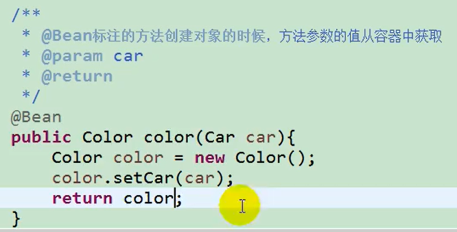
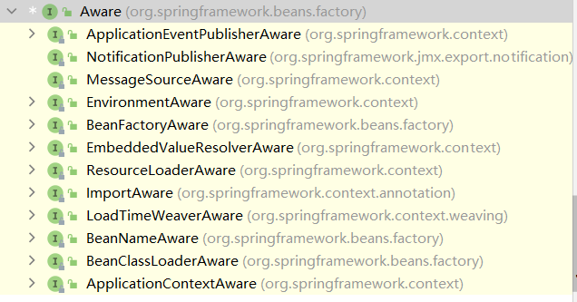
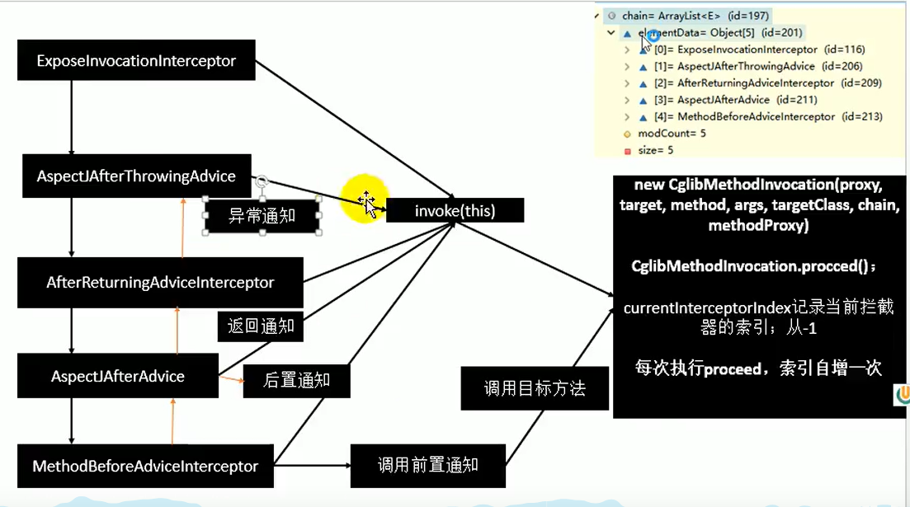

[TOC]

# IOC控制反转

## 组件注册

### 配置文件方式

```xml
<?xml version="1.0" encoding="UTF-8"?>
<beans xmlns="http://www.springframework.org/schema/beans"
       xmlns:xsi="http://www.w3.org/2001/XMLSchema-instance"
       xsi:schemaLocation="http://www.springframework.org/schema/beans http://www.springframework.org/schema/beans/spring-beans.xsd">
    <bean id="person" class="com.tintin.pojo.Person">
        <property name="name" value="tintin"/>
        <property name="age" value="12"/>
    </bean>
</beans>
```

```java
@Test
public void test1() {
    ClassPathXmlApplicationContext applicationContext =
            new ClassPathXmlApplicationContext("beans.xml");
    Person person = applicationContext.getBean("person", Person.class);
    System.out.println(person);
}
```

### 注解方式

```java
//配置类代替配置文件
@Configuration  //告诉spring这是一个配置类
public class SpringConfig {
    //给容器注册一个bean；类型为返回值类型，id默认为方法名
    @Bean
    public Person person() {
        return new Person("tintin",28);
    }
}
```

```java
@Test
public void test2() {
    AnnotationConfigApplicationContext applicationContext =
            new AnnotationConfigApplicationContext(SpringConfig.class);
    Person person = applicationContext.getBean(Person.class);
    System.out.println(person);

    String[] beanNamesForType = applicationContext.getBeanNamesForType(Person.class);
    System.out.println(beanNamesForType);
}
```

### 组件注册@Bean

```java
@Target({ElementType.METHOD, ElementType.ANNOTATION_TYPE})
@Retention(RetentionPolicy.RUNTIME)
@Documented
public @interface Bean {

   @AliasFor("name")
   String[] value() default {};//指定bean的id

   @AliasFor("value")
   String[] name() default {};//指定bean的id

   Autowire autowire() default Autowire.NO;

   String initMethod() default "";

   String destroyMethod() default AbstractBeanDefinition.INFER_METHOD;

}
```

### 包扫描@ComponentScan

配置文件方式

```xml
<!--包扫描，标注@Controller,@Service,@Repository,@Component的类都会被扫描加入容器-->
    <context:component-scan base-package="com.tintin"/>
```

注解方式

```java
//配置类代替配置文件
@Configuration  //告诉spring这是一个配置类
//整合Springmvc的时候，要mvc容器只扫描controller，Spring扫描剩下的
@ComponentScan(value = "com.tintin", useDefaultFilters = false, includeFilters = {
        @ComponentScan.Filter(type = FilterType.ANNOTATION, classes = {Controller.class})
})
public class SpringConfig {
```

```java
@Retention(RetentionPolicy.RUNTIME)
@Target(ElementType.TYPE)
@Documented
@Repeatable(ComponentScans.class)
public @interface ComponentScan {
@AliasFor("basePackages")
	String[] value() default {};//指定扫描的包名

	@AliasFor("value")
	String[] basePackages() default {};//指定扫描的包名
	
    boolean useDefaultFilters() default true;//默认扫描所有注解的类
    
	Filter[] includeFilters() default {};//按照某些规则指定仅扫描，搭配userDefaultFilters=false使用

	Filter[] excludeFilters() default {};//按照某些规则排除扫描某些组件
    
	@Retention(RetentionPolicy.RUNTIME)
	@Target({})
	@interface Filter {

		FilterType type() default FilterType.ANNOTATION;//筛选方式 如注解、正则、类名、ASPECTJ、自定义
		
		@AliasFor("classes")
		Class<?>[] value() default {};//类名

		@AliasFor("value")
		Class<?>[] classes() default {};//类名

		String[] pattern() default {};
	}
}
```

```java
public enum FilterType {
	ANNOTATION,
	ASSIGNABLE_TYPE,
	ASPECTJ,
	REGEX,
	CUSTOM
}
```

### 作用域@Scope

配置文件方式

```xml
<bean id="person" class="com.tintin.pojo.Person" scope="prototype"></bean>
```

注解方式

```java
//默认单实例
    @Scope("prototype")
    @Lazy//懒加载
    @Bean
    public Person person() {
        return new Person("tintin",28);
    }
```

```java
@Target({ElementType.TYPE, ElementType.METHOD})
@Retention(RetentionPolicy.RUNTIME)
@Documented
public @interface Scope {


	@AliasFor("scopeName")
	String value() default "";

	/**
	 * Specifies the name of the scope to use for the annotated component/bean.
	 * <p>Defaults to an empty string ({@code ""}) which implies
	 * {@link ConfigurableBeanFactory#SCOPE_SINGLETON SCOPE_SINGLETON}.
	 * @since 4.2
	 * @see ConfigurableBeanFactory#SCOPE_PROTOTYPE 多实例 只有每次获取对象时才会创建对象 
	 * @see ConfigurableBeanFactory#SCOPE_SINGLETON 默认单实例 ioc容器启动则会调用创建实例方法放到ioc容器中
	 * @see org.springframework.web.context.WebApplicationContext#SCOPE_REQUEST 同一次请求创建一个实例 
	 * @see org.springframework.web.context.WebApplicationContext#SCOPE_SESSION 同一个会话创建一个实例
	 * @see #value
	 */
	@AliasFor("value")
	String scopeName() default "";

	ScopedProxyMode proxyMode() default ScopedProxyMode.DEFAULT;

}
```

### 懒加载@Lazy

```java
//默认单实例
    @Scope("prototype")
    @Lazy//懒加载
    @Bean
    public Person person() {
        return new Person("tintin",28);
    }
```

单实例bean：默认在容器启动的时候创建对象；
懒加载：容器启动不创建对象。第一次使用(获取 )Bean创建对象，并初始化；

### 按照条件注册组件@Conditional

```java
@Target({ElementType.TYPE, ElementType.METHOD})
@Retention(RetentionPolicy.RUNTIME)
@Documented
public @interface Conditional {

	Class<? extends Condition>[] value();

}
```

实现Condition

```java
public class LinuxCondition implements Condition {
    //ConditionContext 判断条件使用的上下文信息
    //AnnotatedTypeMetadata 注释信息
    @Override
    public boolean matches(ConditionContext context, AnnotatedTypeMetadata metadata) {
        //获取到ioc的beanfactory
        ConfigurableListableBeanFactory beanFactory = context.getBeanFactory();
        //获取类加载器
        ClassLoader classLoader = context.getClassLoader();
        //获取运行环境信息
        Environment environment = context.getEnvironment();
        //获取容器中的bean定义的注册类
        BeanDefinitionRegistry registry = context.getRegistry();

        String osName = environment.getProperty("os.name");
        if (osName.contains("linux")) {
            return true;
        }
        return false;
    }
}
```

传入Condition的实现类数组

```java
    @Conditional(LinuxCondition.class)
    @Bean("linus")
    public Person Person4() {
        return new Person("Linus",52);
    }
```

全局传入

```java
@Conditional(LinuxCondition.class) //只有满足当前条件，这个类中配置的所有bean注册才能生效
@Configuration
public class SpringConfig2 {
```

### 快速导入组件@Import

```java
@Target(ElementType.TYPE)
@Retention(RetentionPolicy.RUNTIME)
@Documented
public @interface Import {
	/**
	 * {@link Configuration}, {@link ImportSelector}, {@link ImportBeanDefinitionRegistrar}
	 * or regular component classes to import.
	 */	
	Class<?>[] value();

}
```

```java
@Import(Color.class)//id默认为组件全类名
@Configuration
public class SpringConfig2 {
```

#### 实现ImportSelector接口返回要扫描的组件全类名

```java
public class MyImportSelector implements ImportSelector {
    //返回值，就是到导入到容器中的组件全类名
    //AnnotationMetadata:当前标注@Import注解的类的所有注解信息
    @Override
    public String[] selectImports(AnnotationMetadata importingClassMetadata) {
        return new String[]{"com.tintin.pojo.Color"};
    }
}
```

```java
@Import(MyImportSelector.class)
@Configuration
public class SpringConfig2 {
```

#### 实现ImportBeanDefinitionRegistrar接口注册组件

```java
public class MyImportBeanDefinitionRegistrar implements ImportBeanDefinitionRegistrar {
    /* AnnotationMetadata：当前类的注解信息
    BeanDefinitionRegistry:BeanDefinition注册类；把所有需要添加到容器中的bean；
    调用BeanDefinitionRegistry.registerBeanDefinition手工注册进来
    */
     @Override
    public void registerBeanDefinitions(AnnotationMetadata importingClassMetadata, BeanDefinitionRegistry registry) {
         
         RootBeanDefinition beanDefinition = new RootBeanDefinition(Color.class);
         registry.registerBeanDefinition("color",beanDefinition);//指定bean id
    }
}
```

```java
@Import(MyImportBeanDefinitionRegistrar.class)
@Configuration
public class SpringConfig2 {
```

### BeanFactory

常用于spring与其他框架整合

实现FactoryBean 

```java
public class ColorFactoryBean implements FactoryBean<Color> {
    @Override
    public Color getObject() throws Exception {
        return new Color("red");
    }

    @Override
    public Class<?> getObjectType() {
        return Color.class;
    }

    @Override
    public boolean isSingleton() {
        return false;
    }
}

```

注册FactoryBean

```java
    @Bean
    public ColorFactoryBean colorFactoryBean() {
        return new ColorFactoryBean()
    }
```

获取FactoryBean 得到对应的组件

```java
    @Test
    public void testFactoryBean() {
        Object colorFactoryBean = applicationContext.getBean("colorFactoryBean");
        System.out.println(colorFactoryBean.getClass());

        Object bean = applicationContext.getBean("&colorFactoryBean");//获取工厂bean本身
        System.out.println(bean.getClass());
    }
//class com.tintin.pojo.Color
//class com.tintin.factory.ColorFactoryBean
```

> 工厂Bean获取的是调用getobject创建的对象

### 组件注册总结

给容器中注册组件；

1. 包扫描+组件标注注解（@Controller/@Service/@Repository/@Component
2. @Bean[导入的第三方包里面的组件]
3. @Import[快速给容器中导入一个组件]
4. 使用Spring提供的FactoryBean（工厂bean）常用于spring与其他框架整合

## 生命周期

bean创建到初始化到销毁的过程

### 指定初始化和销毁方法

我们可以自定义初始化和销毁方法；容器在bean进行到当前生命周期的时候来调用我们自定义的初始化和销毁方法

对象

```java
public class Car {
    public Car() {
        System.out.println("car construct...");
    }

    public void init() {
        System.out.println("car init...");
    }

    public void destroy() {
        System.out.println("car destroy...");
    }
}

```

测试

```java
public class ConfigOfLifeCircleTest {
    private AnnotationConfigApplicationContext applicationContext=
            new AnnotationConfigApplicationContext(ConfigOfLifeCircle.class);
    @Test
    public void test() {
        applicationContext.close();
    }
}
//car construct...
//car init...
//car destroy...
```

### 实现InitializingBean和DisposableBean接口

```java
@Component
public class Cat implements InitializingBean, DisposableBean {
    public Cat() {
        System.out.println("cat construct...");
    }
    
    //赋值之后调用
    @Override
    public void afterPropertiesSet() throws Exception {
        System.out.println("cat afterPropertiesSet...");
    }
    
    @Override
    public void destroy() throws Exception {
        System.out.println("cat destroy...");
    }
}
//cat construct...
//cat afterPropertiesSet...
//cat destroy...
```

### JSR250规范

底层是后置处理器`InitDestroyAnnotationBeanPostProcessor`

`@PostConstruct`：在bean创建完成并且属性赋值完成；来执行初始化方法

`@PreDestroy`：在bean销毁之前，

```java
public class Dog {
    public Dog() {
        System.out.println("dog construct...");
    }

    @PostConstruct
    public void init() {
        System.out.println("dog postConstruct...");
    }

    @PreDestroy
    public void destroy() {
        System.out.println("dog preDestroy...");
    }
}
//dog construct...
//dog postConstruct...
//dog preDestroy...
```

### 实现后置处理器

在bean初始化前后进行一些处理工作；
`postProcessBeforeInitialization`:在初始化之前工作
`postProcessAfterInitialization`:在初始化之后工作

```java
//实现后置处理器并加入到容器中
@Component
public class MyBeanPostProcessor implements BeanPostProcessor {
    @Override
    public Object postProcessBeforeInitialization(Object o, String s) throws BeansException {
        System.out.println(s +" postProcessBeforeInitialization");
        return o;
    }

    @Override
    public Object postProcessAfterInitialization(Object o, String s) throws BeansException {
        System.out.println(s +" postProcessAfterInitialization");
        return o;
    }
}
//org.springframework.context.event.internalEventListenerProcessor postProcessBeforeInitialization
//org.springframework.context.event.internalEventListenerProcessor postProcessAfterInitialization
//org.springframework.context.event.internalEventListenerFactory postProcessBeforeInitialization
//org.springframework.context.event.internalEventListenerFactory postProcessAfterInitialization
//car construct...
//car postProcessBeforeInitialization
//car init...
//car postProcessAfterInitialization
//car destroy...
```

#### 源码简析

```java
this.populateBean(beanName, mbd, instanceWrapper);//属性赋值

{
wrappedBean = this.applyBeanPostProcessorsBeforeInitialization(bean, beanName);
this.invokeInitMethods(beanName, wrappedBean, mbd);
wrappedBean = this.applyBeanPostProcessorsAfterInitialization(wrappedBean, beanName);
}
```

遍历得到容器中所有的BeanPostProcessor；挨个执行beforeInitilization,
一但返回null，跳出for循环，不会执行后面的BeanPostProcessor。

#### Spring底层对后置处理器的使用

* `ApplicationContextAwareProcessor`：回传applicationContext容器

* `BeanValidationPostProcessor`：数据校验

* `InitDestroyAnnotationBeanPostProcessor`： 处理`@PostConstruct`、`@PreDestroy`注解
* `AutowiredAnnotationBeanPostProcessor`：自动注入

## 属性赋值

配置文件方式

```xml
<bean id="person" class="com.tintin.pojo.Person">
        <property name="name" value="tintin"/>
        <property name="age" value="12"/>
    </bean>
```

### 使用@Value赋值

三种方式

```java
public class Person {
    //1.基本数值
    //2.SpEL #{}
    //3.${}取出配置文件变量或运行环境变量
    @Value("tintin")
    private String name;
    @Value("#{20-2}")
    private Integer age;
    @Value("${person.nickName}")
    private String nickName;
    
//Person{name='tintin', age=18, nickName='丁丁'}
```

### 加载外部配置文件@PropertySource

```properties
#person.properties
person.nickName=丁丁
```

配置文件方式

```xml
<context:property-placeholder location="classpath:person.properties"/>
```

注解方式

```java
//读取外部配置文件的k-v保存到运行的环境变量
@PropertySource(value = {"classpath:person.properties"}, encoding = "utf-8")
@Configuration
public class ConfigOfProperties {
```

注解方式可以在运行环境变量中获取到对应变量


## 自动装配

### @Autowired自动注入，@Qualifier指定装配组件id

配置

```java
@ComponentScan({"com.tintin.service","com.tintin.dao","com.tintin.controller"})
@Configuration
public class ConfigOfAutowired {
}
```

注入

```java
	//指定查找的组件id
    @Qualifier("bookDAO")
    //默认优先按照类型在容器中寻找
    //找到相同类型的组件，则查找组件id和属性名称相同的组件
    //否则报错org.springframework.beans.factory.UnsatisfiedDependencyException
    //requierd可以指定是否必须装配，默认true必须装配，找不到组件则报错
    @Autowired(required = false)
    private BookDAO bookDAO2;

    public void print() {
        System.out.println("service");
        bookDAO2.print();
    }
```

### @Primary指定该组件首先被装配

```java
@Primary//自动装配时首选
    @Bean("bookDAO2")
    public BookDAO bookDAO() {
        BookDAO bookDAO = new BookDAO();
        bookDAO.setLabel("2");
        return bookDAO;
    }
```

### JSR规范的自动装配

@Resource（JSR250）

```java
	//可以和@Autowired一样实现自动装配功能；默认是按照组件名称进行装配的；
    //没有能支持@Primary功能没有支持@Autowired（reqiured=false
    @Resource
    private BookService bookService;
```

@Inject（JSR330）

需要导入java.inject的包，和@Autowired的功能 一样，没有requried=false功能

### 方法、构造器、参数位置的自动装配

标注在方法上

```java
@Autowired
    //标注在方法，Spring容器创建当前对象，就会调用方法，完成赋值；
    //方法使用的参数，自定义类型的值从ioc容器中获取
    public void setCar(Car car) {
        this.car = car;
    }
}
```

标注在构造器

```java
@Autowired
//构造器参数默认从容器获取
public Boss(Car car) {
    this.car = car;
    System.out.println("有参构造器");
}
```

标注在参数

```java
public Boss(@Autowired Car car) {
        this.car = car;
        System.out.println("有参构造器");
    }

```

@Bean注册组件时的自动装配



> 如果该组件只有一个有参构造器，则可以省略@Autowired

### spring底层组件的装配



自定义组件实现xxxAware

在创建对象的时候，会调用接口规定的方法注入相关组件；Aware；

把Spring底层一些组件注入到自定义的Bean中；

XXXAware：底层使用xxxProcessor

```java
@Component
public class Red implements ApplicationContextAware, BeanNameAware, EmbeddedValueResolverAware {
    private ApplicationContext applicationContext;
    @Override
    public void setBeanName(String name) {
        System.out.println("beanName="+name);
    }

    @Override
    public void setApplicationContext(ApplicationContext applicationContext) throws BeansException {
        System.out.println("ioc="+ applicationContext);
        this.applicationContext = applicationContext;
    }

    @Override
    public void setEmbeddedValueResolver(StringValueResolver resolver) {
        String s = resolver.resolveStringValue("这里可以解析配置文件中的值或环境变量的值，${os.name},#{20-2}");
        System.out.println("解析的到的字符串:" + s);
    }
}

//beanName=red
//解析的到的字符串:这里可以解析配置文件中的值或环境变量的值，Windows 10,18
//ioc=org.springframework.context.annotation.AnnotationConfigApplicationContext@3c679bde: startup date [Thu Dec 02 14:56:23 CST 2021]; root of context hierarchy
```

### 动态切换组件@Profile

Spring为我们提供的可以根据当前环境，动态的激活和切换一系列组件的功能；

以数据源为例

| 环境     | 数据源 |
| -------- | ------ |
| 开发环境 | （/A） |
| 测试环境 | （/B） |
| 生产环境 | （/C） |

数据源配置

```properties
# mysql8 需要增加时区配置
spring.datasource.username=root
spring.datasource.password=tintin
spring.datasource.urlTest=jdbc:mysql://localhost:3306/test?useSSL=false&useUnicode&characterEncoding=utf-8&serverTimezone=GMT%2B8
spring.datasource.urlDev=jdbc:mysql://localhost:3306/ssm_crud?useSSL=false&useUnicode&characterEncoding=utf-8&serverTimezone=GMT%2B8
spring.datasource.urlProd=jdbc:mysql://localhost:3306/goods?useSSL=false&useUnicode&characterEncoding=utf-8&serverTimezone=GMT%2B8
spring.datasource.driver-class-name=com.mysql.cj.jdbc.Driver

```

注册不同数据源，并@Profile添加环境标识

@Profile：指定该组件在某个环境下才能被注册进容器；**不添加该注解则默认为default环境，这样的组件在任何环境下都可以加载。**

```java
@PropertySource("classpath:dbconfig.properties")
@Configuration
//@Profile("test") 类上配置
public class ConfigOfProfile implements EmbeddedValueResolverAware {
    @Value("${spring.datasource.username}")
    private String user;
    @Value("${spring.datasource.password}")
    private String password;

    //变量解析器
    private StringValueResolver resolever;
    private String DriverClass;

    @Bean
    public DataSource dataSourceTest(@Value("${spring.datasource.urlTest}") String jdbcUrl) throws PropertyVetoException {
        ComboPooledDataSource dataSource = new ComboPooledDataSource();
        dataSource.setUser(user);
        dataSource.setPassword(password);
        dataSource.setJdbcUrl(jdbcUrl);
        dataSource.setDriverClass(DriverClass);
        return dataSource;
    }

    @Bean
    public DataSource dataSourceDev(@Value("${spring.datasource.urlDev}") String jdbcUrl) throws PropertyVetoException {
        ComboPooledDataSource dataSource = new ComboPooledDataSource();
        dataSource.setUser(user);
        dataSource.setPassword(password);
        dataSource.setJdbcUrl(jdbcUrl);
        dataSource.setDriverClass(DriverClass);
        return dataSource;
    }

    @Bean
    public DataSource dataSourceProd(@Value("${spring.datasource.urlProd}") String jdbcUrl) throws PropertyVetoException {
        ComboPooledDataSource dataSource = new ComboPooledDataSource();
        dataSource.setUser(user);
        dataSource.setPassword(password);
        dataSource.setJdbcUrl(jdbcUrl);
        dataSource.setDriverClass(DriverClass);
        return dataSource;
    }

    @Override
    public void setEmbeddedValueResolver(StringValueResolver resolver) {
        this.resolever = resolver;
        DriverClass = resolever.resolveStringValue("${spring.datasource.driver-class-name}");
    }
}

```

切换环境两种方式

1. 修改虚拟机参数vm


2. 修改容器应用上下文

```java
 private AnnotationConfigApplicationContext applicationContext =
            new AnnotationConfigApplicationContext();
//设置激活环境
applicationContext.getEnvironment().setActiveProfiles("test","dev");
//注册主配置类
applicationContext.register(ConfigOfProfile.class);
//刷新容器
applicationContext.refresh();

```

此时，根据当前环境，含有对应环境标识的组件才会被注册

# AOP切面编程

AOP:【动态代理】
指在程序运行期间动态的将某段代码切入到指定方法指定位置进行运行的编程方式；

## 测试实例

依赖

```xml
<dependency>
    <groupId>org.springframework</groupId>
    <artifactId>spring-aspects</artifactId>
    <version>4.3.12.RELEASE</version>
</dependency>
```

业务逻辑类 

```java
public class MathCalculate {

    public int div(int i, int j){
        return i/j;
    }
}
```

日志切面类  并注解标识为切面类

```java
@Aspect
public class LogAspects {

    //抽取切入点表达式
    @Pointcut("execution(public int com.tintin.aop.MathCalculate.div(int,int))")
    public void pointCut() {};


    // 前置通知 
    @Before("pointCut()")//切入点表达式
    public void logStart() {
        System.out.println("除法运行...参数列表：{}");
    }

    // 最终通知
    @After("pointCut()")
    public void logEnd() {
        System.out.println("除法结束...");
    }

    // 后置通知（返回通知）
    @AfterReturning("pointCut()")
    public void logReturn() {
        System.out.println("除法正常返回...运行结果：{}");
    }

    // 异常通知
    @AfterThrowing("pointCut()")
    public void logException(){
        System.out.println("除法异常...异常信息：{}");
    }

    //环绕通知：动态代理，手动推进目标方法运行 joinpoint.proceed()
//    @Around()
}

```

加入容器

```java
@Configuration
public class ConfigOfAOP {
    @Bean
    public MathCalculate mathCalculate() {
        return new MathCalculate();
    }

    @Bean
    public LogAspects logAspects() {
        return new LogAspects();
    }
}
```

开启注解方式的切面功能

* 配置文件方式

```xml
 <!--开启注解方式的切面功能-->
    <aop:aspectj-autoproxy></aop:aspectj-autoproxy>
```

* 完全注解方式

```java
@Configuration
@EnableAspectJAutoProxy
public class ConfigOfAOP {
```

测试方法

```java
    @Test
    public void test() {
        MathCalculate bean = applicationContext.getBean(MathCalculate.class);
        int div = bean.div(14, 7);
    }
//除法开始...参数列表：{[14, 7]}
//除法结束...
//除法正常返回...运行结果：{}
```


## 获取切入方法的信息、返回值、异常信息

```java
@Before("pointCut()")
    public void logStart(JoinPoint joinPoint) {//切入点方法
        System.out.println(joinPoint.getSignature().getName()
                + "除法运行...参数列表：{"
                + Arrays.asList(joinPoint.getArgs())
                +"}");
    }
//div除法运行...参数列表：{[14, 7]}
//div结束...
//div正常返回...运行结果：{2}
```

```java
    // 后置通知（返回通知）
    @AfterReturning(value = "pointCut()",returning = "result" )
    public void logReturn(Object result, JoinPoint joinPoint) {
        System.out.println(joinPoint.getSignature().getName() + "正常返回...运行结果：{"+ result +"}");
    }
//div运行...参数列表：{[14, 7]}
//div结束...
//div正常返回...运行结果：{2}
```

```java
   // 异常通知
    @AfterThrowing(value = "pointCut()",throwing = "exception")
    public void logException(JoinPoint joinPoint,Exception exception){
        System.out.println(joinPoint.getSignature().getName() + "异常...异常信息：{}");
    }
//div运行...参数列表：{[14, 0]}
//div结束...
//div异常...异常信息：{java.lang.ArithmeticException: / by zero}
```

## AOP原理

### @EnableAspectJAutoProxy

给容器注册internalAutoProxyCreator = AnnotationAwareAspectJAutoProxyCreator

​    AnnotationAwareAspectJAutoProxyCreator
​    	->AspectJAwareAdvisorAutoProxyCreator
​    		->AbstractAdvisorAutoProxyCreator
​    			->AbstractAutoProxyCreator 
​    				->ProxyProcessorSupport  ---**SmartInstantiationAwareBeanPostProcessor**, **BeanFactoryAware**

AnnotationAwareAspectJAutoProxyCreator是一个后置处理器，也是一个BeanFactoryAware实现BeanFactory组件注入

### BeanFactoryAware

```java
//AbstractAutoProxyCreator.class
public void setBeanFactory(BeanFactory beanFactory) {
        this.beanFactory = beanFactory;
    }
```

```java
//AbstractAdvisorAutoProxyCreator.class 调用initBeanFactory（）
public void setBeanFactory(BeanFactory beanFactory) {
        super.setBeanFactory(beanFactory);
        if (!(beanFactory instanceof ConfigurableListableBeanFactory)) {
            throw new IllegalArgumentException("AdvisorAutoProxyCreator requires a ConfigurableListableBeanFactory: " + beanFactory);
        } else {
            this.initBeanFactory((ConfigurableListableBeanFactory)beanFactory);
        }
    }
```

```java
//AnnotationAwareAspectJAutoProxyCreator.class
 protected void initBeanFactory(ConfigurableListableBeanFactory beanFactory) {
        super.initBeanFactory(beanFactory);
        if (this.aspectJAdvisorFactory == null) {
            this.aspectJAdvisorFactory = new ReflectiveAspectJAdvisorFactory(beanFactory);
        }

        this.aspectJAdvisorsBuilder = new AnnotationAwareAspectJAutoProxyCreator.BeanFactoryAspectJAdvisorsBuilderAdapter(beanFactory, this.aspectJAdvisorFactory);
    }
```


### SmartInstantiationAwareBeanPostProcessor 后置处理器

```java
public Object postProcessBeforeInstantiation(Class<?> beanClass, String beanName) throws BeansException {
        Object cacheKey = this.getCacheKey(beanClass, beanName);
        if (beanName == null || !this.targetSourcedBeans.contains(beanName)) {
            if (this.advisedBeans.containsKey(cacheKey)) {
                return null;
            }

            if (this.isInfrastructureClass(beanClass) || this.shouldSkip(beanClass, beanName)) {
                this.advisedBeans.put(cacheKey, Boolean.FALSE);
                return null;
            }
        }

        if (beanName != null) {
            TargetSource targetSource = this.getCustomTargetSource(beanClass, beanName);
            if (targetSource != null) {
                this.targetSourcedBeans.add(beanName);
                Object[] specificInterceptors = this.getAdvicesAndAdvisorsForBean(beanClass, beanName, targetSource);
                Object proxy = this.createProxy(beanClass, beanName, specificInterceptors, targetSource);
                this.proxyTypes.put(cacheKey, proxy.getClass());
                return proxy;
            }
        }

        return null;
    }

public Object postProcessAfterInitialization(Object bean, String beanName) throws BeansException {
        if (bean != null) {
            Object cacheKey = this.getCacheKey(bean.getClass(), beanName);
            if (!this.earlyProxyReferences.contains(cacheKey)) {
                return this.wrapIfNecessary(bean, beanName, cacheKey);
            }
        }

        return bean;
    }
```

### 创建一个AOP代理对象的流程

1. 传入配置类，创建ioc容器

2. 注册配置类，调用refresh（）刷新容器；

3. **registerBeanPostProcessors(beanFactory)**;注册bean的后置处理器来方便拦截bean的创建；

   1. 先获取ioc容器已经定义了的需要创建对象的所有BeanPostProcessor，例如实现了SmartInstantiationAwareBeanPostProcessor 的AnnotationAwareAspectJAutoProxyCreator等spring底层后置处理器，和用户自定义的后置处理器

   2. 给容器中加别的BeanPostProcessor

   3. 区分不同优先度的后置处理器，分别实现了 PriorityOrdered, Ordered, and the rest.

   4. 根据优先级注册后置处理器，实际上就是创建BeanPostProcessor对象，保存在容器

      创建SmartInstantiationAwareBeanPostProcessor 

      1. 创建Bean的实例
      2. populateBean；给bean的各种属性赋值
      3. initializeBean：初始化bean；
         1. invokeAwareMethods（）：处理Aware接口的方法回调
         2. applyBeanPostProcessorsBeforeInitialization(）：后置处理器
         3. invokeInitMethods(）；执行自定义的初始化方法
         4. applyBeanPostProcessorsAfterInitialization()：后置处理器
      4. BeanPostProcessor(AnnotationAwareAspectJAutoProxyCrator)创建成

   5. 把BeanPostProcessor注册到BeanFactory中；
      beanFactory.addBeanPostProcessor(postProcessor);


=====================以上为创建和注册AnnotationAwareAspectJAutoProxyCreator的流程==============

4. **finishBeanFactoryInitialization(beanFactory);**完成BeanFactory初始化工作；创建剩下的单实例bean

   1. 遍历获取容器中所有的Bean，依次创建对象getBean（beanName）；
      getBean->doGetBean( )->getSingleton( )->

   2. 创建bean

      【AnnotationAwareAspectJAutoProxyCreator在所有bean创建之前会有一个拦截， InstantiationAwareBeanPostProcessor会调用postProcessBeforeInstantiation】

      1. 先从缓存中获取当前bean，如果能获取到，说明bean是之前被创建过的，直接使用，否则再创建；
         只要创建好的Bean都会被缓存起来

      2. createBean();创建bean

         【BeanPostProcessor是在Bean对象创建完成初始化前后调用的】
         【InstantiationAwareBeanPostProcessor是在创建Bean实例之前先尝试用后置处理器返回对象的】

         1. bean = resolveBeforeInstantiation(beanName, mbdToUse);希望返回一个代理对象，否则真正创建一个bean实例，

            1. ```java
               bean = applyBeanPostProcessorsBeforeInstantiation(targetType, beanName);
               //后置处理器尝试返回对象，如果是InstantiationAwareBeanPostProcessor，就执行postProcessBeforeInstantiation
               					if (bean != null) {
               						bean = applyBeanPostProcessorsAfterInitialization(bean, beanName);
               					}
               ```

               

         2. doCreateBean(beanName, mbdToUse, args); 与3.4 的流程一致

         3. postProcessBeforeInstantiation

         > AnnotationAwareAspectJAutoProxyCreator【InstantiationAwareBeanPostProcesso】的作用：
         >
         > 1. 每一个bean创建之前，调用postProcessBeforeInstantiation
         >
         >    关心MathCalculator和LogAspect的创建
         >
         >    1. 判断当前bean是否在advisedBeans中（保存了所有需要增强bean）
         >    2. 判断当前bean是否是基础类型的Advice、Pointcut、Advisor、AopInfrastructureBean或者是否是切面（@Asspect）
         >    3. 判断是否需要跳过
         >       1. 获取候选的增强器（切面里面的通知方法）【List<Advisor> candidateAdvisors】
         >       2. 判断是否为AspectJPointcutAdvisor类型的增强器，否则跳过且通过父类的shouldSkip返回false进行跳过
         >
         > 2. 创建对象
         >
         >    postProcessAfterInitialization
         >
         >    return wrapIfNecessary(bean, beanName, cacheKey);包装如果需要的情况下
         >
         >    1. 获取当前bean的所有增强器（通知方法）
         >       1. 找到能在当前bean使用的增强器（找哪些通知方法是需要切入当前bean方法的）
         >       2. 获取到能在bean使用的增强器
         >       3. 给增强器排序
         >    2. 保存当前bean在advisedBeans中
         >    3. 如果当前bean需要增强，创建当前bean的代理对象；
         >       1. 获取所有增强器（通知方法）
         >       2. 保存到proxyFactory
         >       3. 创建代理对象：Spring自动决定
         >          JdkDynamicAopProxy(config);jdk动态代理
         >          ObjenesisCglibAopProxy(config);cglib的动态代理
         >    4. 给容器返回当前组件使用cglib的动态代理对象

### 目标方法执行的流程

目标方法执行；
容器中保存了组件的代理对象（cglib增强后，这个对象里面保存了详细信息（比如增强器，目标对象，xxx)

1. CglibAopProxy.intercept(）;拦截目标方法的执行

2. 根据ProxyFactory对象获取将要执行的目标方法拦截器链；
   List<Object> chain = this.advised.getInterceptorsAndDynamicInterceptionAdvice(method, targetClass);

   1. List<Object>
      interceptorList保存所有拦截器5
      一个默认的ExposeInvocationInterceptor 和4个增强器；

   2. 遍历所有的增强器，将其转为Interceptor；
      registry.getInterceptors(advisor);

   3. 将增强器转为List<MethodIntergmptor>;
      如果是MethodInterceptor，直接加入到集合中
      如果不是，使用AdvisorAdapter将增强器转为Interceptorl

      转换完成返回一个MethodInterceptor数组

3. 如果没有拦截器链，直接执行目标方法

4. 如果有拦截器链，把需要执行的目标对象，目标方法，拦截器链等信息传入创建一个CglibMethodInvocation对象，
   并调用 mi . proceed（）；

   拦截器链触发

   1. 如果没有拦截器执行执行目标方法，或者拦截器的索引和拦截器
      器数组－1大小一样（指定到了最后一个拦截器）执行目标方法；

   2. 链式获取每一个拦截器，拦截器执行invoke方法，每一个拦截器等待下一个拦截器执行完成返回以后再来执行；
      拦截器链的机制，保证通知方法与目标方法的执行顺序

      

### 总结

1. @EnableAspectJAutoProxy 开启AOP功能
2. @EnableAspectJAutoProxy 会给容器中注册一个组件AnnotationAwareAspectJAutoProxyCreator
3. AnnotationAwareAspectJAutoProxyCreator是一个后置处理器；
4. 容器的创建流程：
   1. registerBeanPostProcessors（）注册后置处理器；创建AnnotationAwareAspectJAutoProxyCreator
   2. finishBeanFactoryInitialization（）初始化剩下的单实例bean
      1. 创建业务逻辑组件和切面组件
      2. AnnotationAwareAspectJAutoProxyCreator拦截组件的创建过程
      3. 组件创建完之后，判断组件是否需要增强
         是：切面的通知方法，包装成增强器（Advisor）；给业务逻辑组件创建一个代理对象
5. 执行目标方法：
   1. 代理对象执行目标方法
   2. CglibAopProxy.intercept();
      1. 得到目标方法的拦截器链（增强器包装成拦截器MethodInterceptor）
      2. 利用拦截器的链式机制，依次进入每一个拦截器进行执行；
      3. 效果：
         正常执行：前置通知-》目标方法-》后置通知-》返回通知
         出现异常：前置通知- >目标方法->后置通知-》返回通知

# 声明式事务

## 环境搭建与测试

依赖

```xml
		<dependency>
            <groupId>c3p0</groupId>
            <artifactId>c3p0</artifactId>
            <version>0.9.1.2</version>
        </dependency>
        <dependency>
            <groupId>mysql</groupId>
            <artifactId>mysql-connector-java</artifactId>
            <version>8.0.27</version>
        </dependency>
        <dependency>
            <groupId>org.springframework</groupId>
            <artifactId>spring-jdbc</artifactId>
            <version>4.3.12.RELEASE</version>
        </dependency>
```

配置数据源和 jdbcTemplate

```java
@EnableTransactionManagement
@ComponentScan("com.tintin")
@PropertySource(value = "classpath:dbconfig.properties", encoding = "utf-8")
@Configuration
public class ConfigOfTx {
    @Value("${spring.datasource.username}")
    private String user;
    @Value("${spring.datasource.password}")
    private String password;
    @Value("${spring.datasource.urlTest}")
    private String url;
    @Value("${spring.datasource.driver-class-name}")
    private String driverClass;

    //数据源
    @Bean
    public DataSource dataSource() throws PropertyVetoException {
        ComboPooledDataSource dataSource = new ComboPooledDataSource();
        dataSource.setUser(user);
        dataSource.setPassword(password);
        dataSource.setJdbcUrl(url);
        dataSource.setDriverClass(driverClass);
        return dataSource;
    }

    //jdbcTemplate
    @Bean
    public JdbcTemplate jdbcTemplate() throws PropertyVetoException {
        //spring对@Configuration有特殊处理，
        JdbcTemplate jdbcTemplate = new JdbcTemplate(dataSource());//从数据源组件中获取连接，并非简单的执行一个方法
        return jdbcTemplate;
    }
}
```

标注方法为事务方法

```java
    @Transactional
    public void insertUser() {
```

开启基于注解的事务管理功能

xml	配置方式

```xml
    <!--开启基于注解的事务功能-->
    <tx:annotation-driven></tx:annotation-driven>
```

注解方式

```java
@EnableTransactionManagement
@ComponentScan("com.tintin")
@PropertySource(value = "classpath:dbconfig.properties", encoding = "utf-8")
@Configuration
public class ConfigOfTx {
```

配置事务管理器来管理事务


```java
    @Bean
    public PlatformTransactionManager transactionManager() throws PropertyVetoException {
        return new DataSourceTransactionManager(dataSource());
    }
```

## 原理

1. @EnableTransactionManagement
   利用TransactionManagementConfigurationSelector给容器中会导入
   导入两个组件
   AutoProxyRegistrar
   ProxyTransactionManagementConfiguratiom

```java
public class TransactionManagementConfigurationSelector extends AdviceModeImportSelector<EnableTransactionManagement> {
    public TransactionManagementConfigurationSelector() {
    }

    protected String[] selectImports(AdviceMode adviceMode) {
        switch(adviceMode) {
        case PROXY:
            return new String[]{AutoProxyRegistrar.class.getName(), ProxyTransactionManagementConfiguration.class.getName()};
        case ASPECTJ:
            return new String[]{"org.springframework.transaction.aspectj.AspectJTransactionManagementConfiguration"};
        default:
            return null;
        }
    }
}

```

2. AutoProxyRegistrar:
   给容器中注册一个InfrastructureAdvisorAutoProxyCreator 组件；
   InfrastructureAdvisorAutoProxyCreator：？
   利用后置处理器机制在对象创建以后，包装对象，返回一个代理对象（增强器），代理对象执行方法	利用拦截器进行调用

3. ProxyTransactionManagementConfiguration 做了什么？
   1. 给容器中注册事务增强器；
      1. 事务增强器要用事务注解的信息，AnnotationTransactionAttributeSource解析事务
      2. 事务拦截器：
         TransactionInterceptor；保存了事务属性信息,事务管理器
         他是一个MethodInterceptor；
         在目标方法执行的时候；
         执行拦截器链；
         事务拦截器：
         1. 先获取事务相关的属性
         2. 再获取PlatformTransactionManager，如果事先没有添加指定任何TransactionManager
            最终会从容器中按照类型获取一个TransactionManager
         3. 执行目标方法
            如果异常，获取到事务管理器，利用事务管理回滚操作；
            如果正常，利用事务管理器，提交事务

# 拓展原理

## BeanFactoryPostProcessor
## BeanDefinitionRegistryPostProcessor
## ApplicationListener
## Spring容器创建过程

# Servlet 3.0
