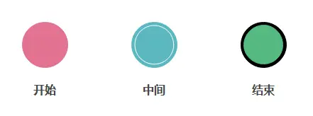
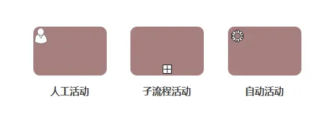
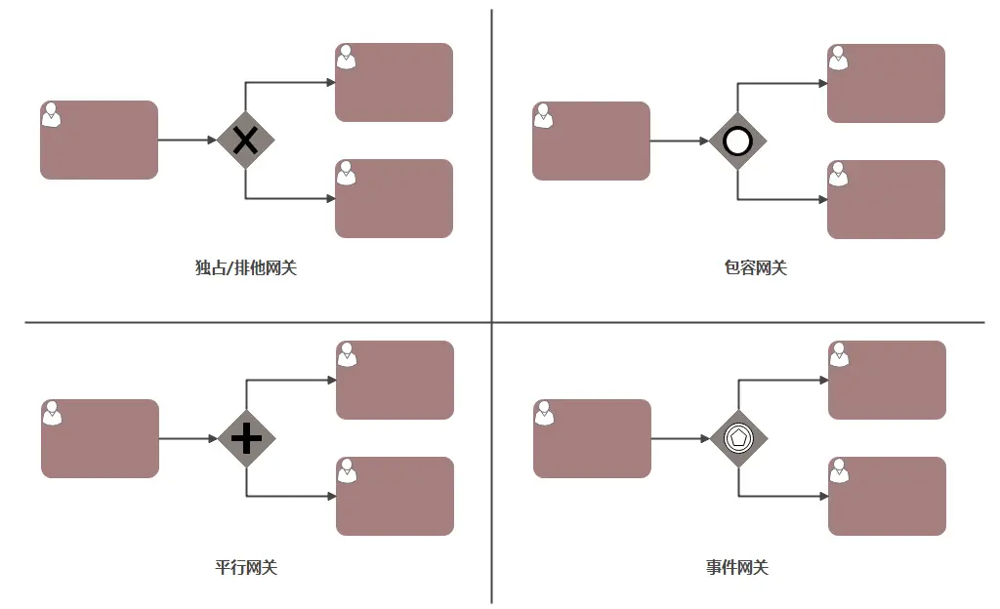
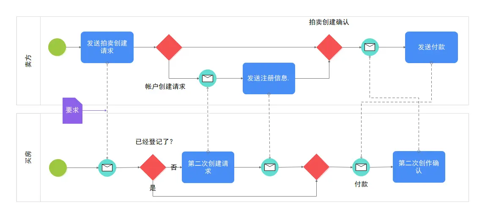
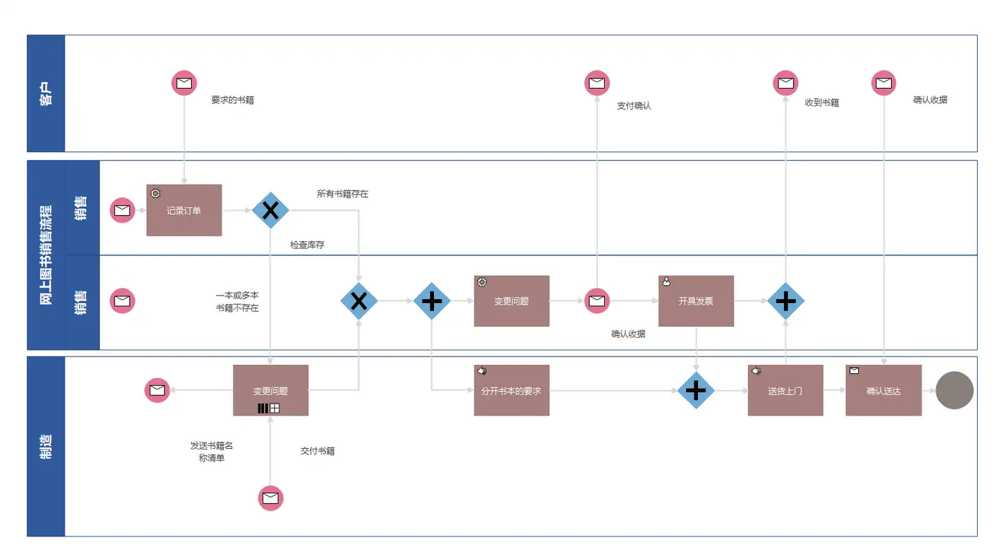

# 工作流引擎

## 什么是工作流

1. 工作流（Workflow），就是通过计算机对业务流程自动化执行管理。
2. 它主要解决的是“使在多个参与者之间按照某种预定义的规则自动进行传递文档、信息或任务的过程，从而实现某个预期的业务目标，或者促使此目标的实现”

## 常见工作流引擎

### jBPM

由JBoss公司开发，目前最高版本JPBM7，不过从JBPM5开始已经跟之前不是同一个产品了，JBPM5的代码基础不是JBPM4，而是从Drools Flow重新开始。下面要涉及的很多产品都是以JBPM4的代码为起点进行开发的。

### Activity

[Activity](https://www.activiti.org/) 是主流的工作流开源框架，Activity 第一版在2010年5月发布，当时仅支持最简单的流程处理，之后的版本陆续完善了对BPMN 2.0规范的支持。其核心是使用Java开发的。其前身就是JBPM。

### Flowable

Flowable 是因为其与 Activiti 对未来规划的路线不认同而基于activiti6 开辟了一条自己的道路。

Flowable 项目提供了一组核心的开源业务流程引擎，这些引擎紧凑且高效。它们为开发人员、系统管理员和业务用户提供了一个工作流和业务流程管理（BPM）平台。它的核心是一个非常快速且经过测试的动态 BPMN 流程引擎。它基于 Apache2.0 开源协议，有稳定且经过认证的社区。

Flowable 可以嵌入 Java 应用程序中运行，也可以作为服务器、集群运行，更可以提供云服务。

相比于Activiti，Flowable的核心思想更像是在做一个多彩的工具，它在工作流的基础功能上，提供了很多其他的扩展，使用者可以随心所欲地把Flowable打造成自己想要的样子。

### Camunda

基于activiti5，所以其保留了PVM，最新版本Camunda7，开发团队也是从activiti中分裂出来的，发展轨迹与flowable相似，同时也提供了商业版。

## BPMN

### BPMN 是什么

BPMN（Business Process Modeling Notation，即业务流程建模符号），是一种流程建模的通用和标准语言，用来绘制业务流程图，以便更好地让各部门之间理解业务流程和相互关系。

通过 BPMN 进行业务流程建模得到业务流程的定义，它规定了工作流引擎如何协调与执行业务的流转过程。

它有两个版本：

- BPMN 1.0 规范由标准组织BPMI（后并入到OMG）于2004年5月发布；
- BPMN 2.0 标准由OMG于2011年推出。

### BPMN 2.0

BPMN2.0相对于BPMN1.0最大的区别就是定义、规范了流程引擎的执行语义和格式，利用标准的图元描述真实的业务发生过程，保证相同的流程在不同的流程引擎中得到一致的执行结果。在2.0的这套标准中，主要对流程执行定义了三类基本要素，分别为Activities（活动）、Gateways（网关）、Events（事件）。

### 基础元素——流对象

流对象（Flow Objects）是定义业务流程的主要图形元素，包括三种：事件、活动、网关

- 事件（Events）：指的是在业务流程的运行过程中发生的事情

  - 开始：表示一个流程的开始
  - 中间：发生的开始和结束事件之间，影响处理的流程
  - 结束：表示该过程结束

  

- 活动（Activities）：包括任务和子流程两类。子流程在图形的下方中间外加一个小加号（+）来区分。

  

- 网关（Gateways）：用于表示流程的分支与合并。

  - 排他网关：只有一条路径会被选择
  - 并行网关：所有路径会被同时选择
  - 包容网关：可以同时执行多条线路，也可以在网关上设置条件
  - 事件网关：专门为中间捕获事件设置的，允许设置多个输出流指向多个不同的中间捕获事件。当流程执行到事件网关后，流程处于等待状态，需要等待抛出事件才能将等待状态转换为活动状态。

  

### 基础元素——数据

数据（Data）主要通过四种元素表示：

- 数据对象（Data Objects）
- 数据输入（Data Inputs）
- 数据输出（Data Outputs）
- 数据存储（Data Stores）

### 基础元素——连接对象

连接对象（Connecting Objects）表示流对象彼此互相连接或者连接到其他信息的方法，主要有三种：

- 顺序流：用一个带实心箭头的实心线表示，用于指定活动执行的顺序
- 信息流：用一条带箭头的虚线表示，用于描述两个独立的业务参与者（业务实体/业务角色）之间发送和接受的消息流动
- 关联：用一根带有线箭头的点线表示，用于将相关的数据、文本和其他人工信息与流对象联系起来。用于展示活动的输入和输出

### 基础元素——泳道

泳道（Swimlanes）对主要的建模元素进行分组，将活动划分到不同的可视化类别中来描述由不同的参与者的责任与职责。

###  BPMN 实例

拍卖服务BPMN模板

书籍销售流程 BPMN

## 参考资料

[BPMN（业务流程建模符号）入门到掌握，这一篇就够了](https://www.zhihu.com/tardis/zm/art/365967273?source_id=1005)
