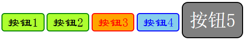

# CSS

## 层叠样式表

CSS (Cascading Style Sheets，层叠样式表），是一种用来为结构化文档（如 HTML 文档或 XML 应用）添加样式（字体、间距和颜色等）的计算机语言，CSS 文件扩展名为 `.css`。

## CSS 引入方式和语法

### 内联样式

通过元素 `style` 属性引入样式。这种方式代码复用性低，不利于维护；css 样式代码和结构代码交织，影响阅读；影响文件大小，影响传输和解析性能。

```html
<input type = "button" value = "按钮" 
       style ="width: 70px; height: 50px;
               background-color: greenyellow; 
               font-size: 20px; font-family: '隶书';
               border: 2px solid green; 
               border-radius: 5px; 
               color: black;" />
    <!--宽高-->
    <!--背景颜色-->
    <!--字体大小、字体-->
    <!--边框：宽度、样式、颜色-->
    <!--边框圆角-->
```


### 内部样式表

通过 `head` 标签中的 `style` 标签定义本页面的公共样式。

通过选择器确定样式的作用的元素

```html
	<style>
        input{
            width: 80px; 
            height: 60px;
            background-color: greenyellow; 
            font-size: 20px; 
            font-family: '隶书';
            border: 2px solid green; 
            border-radius: 5px;
            color: white;
        }
    </style>
```


### 外部样式表

css 代码单独放入 `.css` 文件中，由 html 通过 `link` 标签引入

* `link` 标签定义文档与外部资源的关系
  * `rel` 属性：必需。定义当前文档与被链接文档之间的关系。rel 是 relationship 的英文缩写。此处引入外部样式表，值为 `stylesheet`
  * `href` 属性：定义被链接文档的位置。

```html
<head>
    <meta charset="UTF-8">
    <title>Document</title>

    <link rel="stylesheet" href="/demo-css/css/btn.css">
</head>
```

## 简单选择器

### 元素选择器

根据标签的名字确定样式作用的元素。

### id 选择器

根据标签的 `id` 属性值确定样式作用的元素。

> 在 HTML 规范上，不同的 HTML 不应该被赋予相同的 ID， ID 属性值需要保持唯一性。

### class 选择器

根据元素的 `class` 属性确定样式作用的元素。

> `class` 属性值允许重复，且一个元素的 `class` 属性可以有多个值

### 示例

```css
<!DOCTYPE html>
<html lang="en">
<head>
    <meta charset="UTF-8">
    <meta name="viewport" content="width=device-width, initial-scale=1.0">
    <title>Document</title>
    <style>
        input {
            width: 70px; 
            height: 30px;
            background-color: greenyellow; 
            font-size: 20px; 
            font-family: '隶书';
            border: 2px solid green; 
            border-radius: 5px;
        }
        #btn3 {
            color: red;
            background-color: orange;
            border: 2px solid red;
        }
        #btn4 {
            color: blue;
            background-color: skyblue;
            border: 2px solid blue;
        }
        .shapeClass {
            width: 100px; 
            height: 60px;
            border-radius: 10px;
        }
        .colorClass {
            background-color: gray;
            color: white;
            border: 2px solid black;
        }
        .fontClass {
            font-size: 30px; 
            font-family: '宋体';
        }
    </style>
</head>
<body>
    <input type="button" value="按钮1"/>
    <input type="button" value="按钮2"/>
    <input id="btn3" type="button" value="按钮3"/>
    <input id="btn4" type="button" value="按钮4"/>
    <input class="shapeClass colorClass fontClass" type="button" value="按钮5"/>
</body>
</html>
```



### 与或关系

元素选择器和类选择器连写，表示需要同时满足元素类型和 class 属性

```css
div.box {
  background: blue;
}
```

用逗号 , 将多个选择器隔开，表示“或”的关系。

```css
h1, h2, h3 {
  color: blue;
}

```

## 组合选择器

### 后代选择器

用于选取某元素的后代元素。

```css
div p{background-color:yellow;}/*选取在<div>元素之中的<p>元素*/
```

### 子元素选择器

只能选择作为某元素直接/一级子元素的元素

```css
div>p{background-color:yellow;}/*选取在<div>元素里的直接子元素<p>*/
```

### 相邻兄弟选择器

选择紧接在另一元素后的第一个元素，且二者有相同父元素。

```css
div+p{background-color:yellow;}/*选取紧接<div>元素后的第一个<p>元素*/
```

### 后续兄弟选择器

选择在另一元素之后的所有兄弟元素。

```css
div>p{background-color:yellow;}/*选取紧接<div>元素后的所有<p>元素*/
```

## 伪类选择器

伪类用于定义元素的特殊状态，可以为选择器添加一些特殊效果。

实例：当您将鼠标悬停在例子中的链接上时，它会改变颜色

```css
a.highlight:hover {
  color: #ff0000;
}
```

| 选择器                 | 例子                    | 例子描述                                                     |
| :--------------------- | :---------------------- | :----------------------------------------------------------- |
| `:active`              | `a:active`              | 选择活动的链接。                                             |
| `:checked`             | `input:checked`         | 选择每个被选中的 <input> 元素。                              |
| `:disabled`            | `input:disabled`        | 选择每个被禁用的 <input> 元素。                              |
| `:empty`               | `p:empty`               | 选择没有子元素的每个 <p> 元素。                              |
| `:enabled`             | `input:enabled`         | 选择每个已启用的 <input> 元素。                              |
| `:first-child`         | `p:first-child`         | 选择作为其父的首个子元素的每个 <p> 元素。                    |
| `:first-of-type`       | `p:first-of-type`       | 选择作为其父的首个 <p> 元素的每个 <p> 元素。                 |
| `:focus`               | `input:focus`           | 选择获得焦点的 <input> 元素。                                |
| `:hover`               | `a:hover`               | 选择鼠标悬停其上的链接。                                     |
| `:in-range`            | `input:in-range`        | 选择具有指定范围内的值的 <input> 元素。                      |
| `:invalid`             | `input:invalid`         | 选择所有具有无效值的 <input> 元素。                          |
| `:lang(language)`      | `p:lang(it)`            | 选择每个 lang 属性值以 "it" 开头的 <p> 元素。                |
| `:last-child`          | `p:last-child`          | 选择作为其父的最后一个子元素的每个 <p> 元素。                |
| `:last-of-type`        | `p:last-of-type`        | 选择作为其父的最后一个 <p> 元素的每个 <p> 元素。             |
| `:link`                | `a:link`                | 选择所有未被访问的链接。                                     |
| `:not(selector)`       | `:not(p)`               | 选择每个非 <p> 元素的元素。                                  |
| `:nth-child(n)`        | `p:nth-child(2)`        | 选择作为其父的第二个子元素的每个 <p> 元素。                  |
| `:nth-last-child(n)`   | `p:nth-last-child(2)`   | 选择作为父的第二个子元素的每个 <p> 元素，从最后一个子元素计数。 |
| `:nth-last-of-type(n)` | `p:nth-last-of-type(2)` | 选择作为父的第二个 <p> 元素的每个 <p> 元素，从最后一个子元素计数 |
| `:nth-of-type(n)`      | `p:nth-of-type(2)`      | 选择作为其父的第二个 <p> 元素的每个 <p> 元素。               |
| `:only-of-type`        | `p:only-of-type`        | 选择作为其父的唯一 <p> 元素的每个 <p> 元素。                 |
| `:only-child`          | `p:only-child`          | 选择作为其父的唯一子元素的 <p> 元素。                        |
| `:optional`            | `input:optional`        | 选择不带 "required" 属性的 <input> 元素。                    |
| `:out-of-range`        | `input:out-of-range`    | 选择值在指定范围之外的 <input> 元素。                        |
| `:read-only`           | `input:read-only`       | 选择指定了 "readonly" 属性的 <input> 元素。                  |
| `:read-write`          | `input:read-write`      | 选择不带 "readonly" 属性的 <input> 元素。                    |
| `:required`            | `input:required`        | 选择指定了 "required" 属性的 <input> 元素。                  |
| `:root`                | `root`                  | 选择元素的根元素。                                           |
| `:target`              | `#news:target`          | 选择当前活动的 #news 元素（单击包含该锚名称的 URL）。        |
| `:valid`               | `input:valid`           | 选择所有具有有效值的 <input> 元素。                          |
| `:visited`             | `a:visited`             | 选择所有已访问的链接。                                       |

## 伪元素选择器

CSS 伪元素用于设置元素指定部分的样式，可以为选择器添加一些特殊效果。

实例：向 `<p>` 元素文本的首行添加特殊样式

```css
p::first-line {
  color: #ff0000;
  font-variant: small-caps;
}
```

| 选择器           | 例子              | 例子描述                        |
| :--------------- | :---------------- | :------------------------------ |
| `::after`        | `p::after`        | 在每个 `<p>` 元素之后插入内容。 |
| `::before`       | `p::before`       | 在每个 `<p>` 元素之前插入内容。 |
| `::first-letter` | `p::first-letter` | 选择每个 `<p>` 元素的首字母。   |
| `::first-line`   | `p::first-line`   | 选择每个 `<p>` 元素的首行。     |
| `::selection`    | `p::selection`    | 选择用户选择的元素部分。        |

## 属性选择器

CSS 属性选择器用于选取带有指定属性的元素。

实例：选择所有带有 `target` 属性的 `<a>` 元素；

```css
a[target] {
  background-color: yellow;
}
```

| 选择器                 | 例子                  | 例子描述                                                     |
| :--------------------- | :-------------------- | :----------------------------------------------------------- |
| `[attribute]`          | `[target]`            | 选择带有 `target` 属性的所有元素。                           |
| `[attribute=value]`    | `[target=_blank]`     | 选择带有 `target="_blank"` 属性的所有元素。                  |
| `[attribute~=value]`   | `[title~=flower]`     | 选择带有包含 `"flower"` 一词的 `title` 属性的所有元素。      |
| `[attribute|=value]`   | `[lang|=en]`          | 选择带有以 `"en"` 开头的 `lang` 属性的所有元素。             |
| `[attribute^=value]`   | `a[href^="https"]`    | 选择其 `href` 属性值以 `"https"` 开头的每个 `<a>` 元素。     |
| `[attribute$=value]`   | `a[href$=".pdf"]`     | 选择其 `href` 属性值以 `".pdf"` 结尾的每个 `<a>` 元素。      |
| `[attribute**=value*]` | `a[href*="w3school"]` | 选择其 `href` 属性值包含子串 `"w3school"` 的每个 `<a>` 元素。 |

## CSS 常见属性

### 背景

| 属性                  | 描述                                         |
| :-------------------- | :------------------------------------------- |
| background            | 简写属性，作用是将背景属性设置在一个声明中。 |
| background-attachment | 背景图像是否固定或者随着页面的其余部分滚动。 |
| background-color      | 设置元素的背景颜色。                         |
| background-image      | 把图像设置为背景。                           |
| background-position   | 设置背景图像的起始位置。                     |
| background-repeat     | 设置背景图像是否及如何重复。                 |

```css
h1 {background-color:#6495ed;} /*十六进制*/
p {background-color:rgb(255,0,0);} /*rgb颜色值*/
div {background-color:red;} /*颜色名称*/

body {
    background-image:url('/demo-css/img/logo.png'); /*背景图像*/
    background-repeat:repeat-x; /*水平平铺*/
    background-repeat:repeat-y; /*垂直平铺*/
    background-repeat:no-repeat; /*不平铺*/
    background-position: right top; /*背景图像位置*/
    background:#ffffff url('/demo-css/img/logo.png') no-repeat right top; /*背景简写属性*/
}
```

### 文本

| 属性            | 描述                     |
| :-------------- | :----------------------- |
| color           | 设置文本颜色             |
| direction       | 设置文本方向。           |
| letter-spacing  | 设置字符间距             |
| line-height     | 设置行高                 |
| text-align      | 对齐元素中的文本         |
| text-decoration | 向文本添加修饰           |
| text-indent     | 缩进元素中文本的首行     |
| text-shadow     | 设置文本阴影             |
| text-transform  | 控制元素中的字母         |
| unicode-bidi    | 设置或返回文本是否被重写 |
| vertical-align  | 设置元素的垂直对齐       |
| white-space     | 设置元素中空白的处理方式 |
| word-spacing    | 设置字间距               |

```css
h1 {
    color:#00ff00; /*文本颜色*/
    text-align:center; /*文本的水平对齐方式*/
    text-indent:50px; /*文本首行缩进*/
}
a {text-decoration:none;} /*删除文本装饰 主要用于消除链接下划线*/
p.uppercase {text-transform:uppercase;} /*文本转换大写*/
p.lowercase {text-transform:lowercase;} /*文本转换小写*/
p.capitalize {text-transform:capitalize;} /*文本转换首字母大写。*/
```

### 字体

| 属性           | 描述                                                         |
| :------------- | :----------------------------------------------------------- |
| font           | 在一个声明中设置所有的字体属性                               |
| font-family    | 指定文本的字体系列                                           |
| font-size      | 指定文本的字体大小                                           |
| font-style     | 指定文本的字体样式                                           |
| font-variant   | 以小型大写字体或者正常字体显示文本。                         |
| font-weight    | 指定字体的粗细。                                             |
| font-synthesis | 当指定的字体家族中缺少粗体、斜体、小型大写字母以及上标和下标字体时，浏览器是否可以合成这些字体样式。 |

```css
p{
    font-family:"Times New Roman", Times, serif;/*字体系列 设置几个字体名称作为后备*/
	font-style:normal; /*italic 斜体 oblique 倾斜的文字*/
    font-size:40px;/* 1em=16px */
} 
```

### 列表标记

| 属性                | 描述                                               |
| :------------------ | :------------------------------------------------- |
| list-style          | 简写属性。用于把所有用于列表的属性设置于一个声明中 |
| list-style-image    | 将图像设置为列表项标志。                           |
| list-style-position | 设置列表中列表项标志的位置。                       |
| list-style-type     | 设置列表项标志的类型。                             |

```css
ul.a {list-style-type: circle;} /* 圆形列表 */
ul.b {list-style-type: square;} /* 方形列表 */

ol.c {list-style-type: upper-roman;} /* 大写罗马数字列表 */
ol.d {list-style-type: lower-alpha;} /* 小写字母列表 */

ul.img {list-style-image: url('/demo-css/img/icon.ico');} /* 图片列表 */
```


### 语义


### 尺寸

| 属性              | 描述                          |
| :---------------- | :---------------------------- |
| [max/min-] height | 设置元素的 [最大/最小] 高度。 |
| [max/min-] width  | 设置元素的 [最大/最小] 宽度。 |
| line-height       | 设置行高（多行文本的间距）。  |

### 可见性

```css
h1.hidden {visibility:hidden;} /*隐藏的元素仍需占用与未隐藏之前一样的空间*/
h1.hidden {display:none;} /*隐藏的元素不会占用任何空间*/
```

### 内联元素和块元素

```css
div {display:inline;} /*使div变成内联元素*/
span {display:block;} /*使span变成块元素*/
```

### 定位

- position 属性：用于指定元素的定位方式。
  - `static`：默认值，元素按照正常文档流排列，不受 top/right/bottom/left 影响
  - `relative`：相对自身原始位置进行偏移，不会脱离文档流
  - `absolute`：相对于最近的已定位祖先元素进行定位（否则相对于 body），脱离文档流
  - `fixed`：相对于浏览器窗口定位，滚动页面时位置不会改变
  - `sticky`：在滚动到指定位置前表现为 relative，之后表现为 fixed

> 设置了 `position`（且值不为 `static`）时，元素可以通过 `top`、`right`、`bottom` 和 `left` 属性进行位置调整

### 内容溢出

- Overflow 属性：用于控制内容溢出元素框时显示的方式。
  - `visible`：默认值。内容不会被修剪，会呈现在元素框之外。
  - `hidden`：内容会被修剪，并且其余内容是不可见的。
  - `scroll`：内容会被修剪，但是浏览器会显示滚动条以便查看其余的内容。
  - `auto`：如果内容被修剪，则浏览器会显示滚动条以便查看其余的内容。
  - `inherit`：规定应该从父元素继承 overflow 属性的值。

## CSS 其他属性

### 选取

`user-select` 属性规定是否能选取元素的文本。

### 光标

`cursor` 属性规定要显示的光标的类型（形状）。
## 盒子模型

CSS 盒模型本质上是一个盒子，封装周围的 HTML 元素，它包括：边距，边框，填充，和实际内容。


- `Margin`：边框外的区域，外边距是透明的。
- `Border`：围绕在内边距和内容外的边框。
- `Padding`：内容周围的区域，内边距是透明的。
- `Content`：盒子的内容，显示文本和图像。
### 边框与轮廓

边框（Border）是用于定义元素边框样式的属性。

| 属性                                 | 描述                                                       |
| :----------------------------------- | :--------------------------------------------------------- |
| border [-top/right/bottom/left]       | 简写属性，用于把针对所有/上/右/下/左的属性设置在一个声明。 |
| border [-top/right/bottom/left]-style | 用于设置元素所有/上/右/下/左边框的样式                     |
| border [-top/right/bottom/left]-width | 用于为元素的所有/上/右/下/左边框设置宽度                   |
| border [-top/right/bottom/left]-color | 用于设置元素的所有/上/右/下/左边框中可见部分的颜色         |
| border-radius                        | 设置圆角的边框。                                           |

轮廓（outline）是绘制于元素周围的一条线，位于边框边缘的外围，可起到突出元素的作用。

| 属性          | 描述                                                       |
| :------------ | :--------------------------------------------------------- |
| outline       | 简写属性，用于把针对所有/上/右/下/左的属性设置在一个声明。 |
| outline-style | 用于设置轮廓的样式                                         |
| outline-width | 用于设置轮廓的宽度                                         |
| outline-color | 用于设置轮廓的颜色                                         |

### 外边距与填充

margin（外边距）属性定义元素边框以外的空间。

padding（填充）属性定义元素边框与元素内容之间的空间。

| 属性                            | 描述                                                     |
| :------------------------------ | :------------------------------------------------------- |
| margin [-top/right/bottom/left]  | 设置所有/上/右/下/左的外边距，值为像素, pt, em 等或百分比 |
| padding [-top/right/bottom/left] | 设置所有/上/右/下/左的填充，值为像素, pt, em 等或百分比   |

> padding/margin 属性，可以有一到四个值
>
> - 上、右、下、左
> - 上、左右、下
> - 上下、左右
> - 四周

## 网络字体

### 本地加载

本地加载字体是通过将字体文件存储在本地服务器上并从中加载的方式。

1. 下载字体

2. 引用字体

   ```css
   @font-face {
       font-family: "myFont";
       src: url("myFont.ttf");
   }
   ```

3. 使用字体

   ```css
   .line {
       font-family: 'myFont;
   }
   ```

### 远程加载

远程加载字体是通过 CSS 从远程服务器加载字体文件的方式。

```css
@font-face {
  font-family: 'Roboto';
  src: url('https://fonts.googleapis.com/css2?family=Roboto&display=swap');
}
```

## 颜色

### 颜色值

CSS中定义颜色使用十六进制（hex）表示法为红，绿，蓝的颜色值结合。可以是最低值是0（十六进制00）到最高值是255（十六进制FF）

红，绿，蓝值从0到255的结合，给出了总额超过1600多万不同的颜色（256 × 256 ×256）。

<table>
<tbody><tr>
<th width="50%">Color</th>
    <th width="25%">Color HEX</th>
    <th width="25%">Color RGB</th>
  </tr>
<tr>
<td bgcolor="#000000">&nbsp;</td>
    <td>#000000</td>
    <td>rgb(0,0,0)</td>
  </tr>
<tr>
<td bgcolor="#FF0000">&nbsp;</td>
    <td>#FF0000</td>
    <td>rgb(255,0,0)</td>
  </tr>
<tr>
<td bgcolor="#00FF00">&nbsp;</td>
    <td>#00FF00</td>
    <td>rgb(0,255,0)</td>
  </tr>
<tr>
<td bgcolor="#0000FF">&nbsp;</td>
    <td>#0000FF</td>
    <td>rgb(0,0,255)</td>
  </tr>
<tr>
<td bgcolor="#FFFF00">&nbsp;</td>
    <td>#FFFF00</td>
    <td>rgb(255,255,0)</td>
  </tr>
<tr>
<td bgcolor="#00FFFF">&nbsp;</td>
    <td>#00FFFF</td>
    <td>rgb(0,255,255)</td>
  </tr>
<tr>
<td bgcolor="#FF00FF">&nbsp;</td>
    <td>#FF00FF</td>
    <td>rgb(255,0,255)</td>
  </tr>
<tr>
<td bgcolor="#C0C0C0">&nbsp;</td>
    <td>#C0C0C0</td>
    <td>rgb(192,192,192)</td>
  </tr>
<tr>
<td bgcolor="#FFFFFF">&nbsp;</td>
    <td>#FFFFFF</td>
    <td>rgb(255,255,255)</td>
  </tr>
</tbody></table>

### 灰阶

<table class="reference">
<tbody>
<tr>
<th align="left" width="50%">灰阶</th>
<th align="left" width="20%">HEX</th>
<th align="left" width="30%">RGB</th>
</tr>
<tr>
<td bgcolor="#404040" width="50%"></td>
<td width="20%">#404040</td>
<td width="30%">rgb(64,64,64)</td>
</tr>
<tr>
<td bgcolor="#808080" width="50%"></td>
<td width="20%">#808080</td>
<td width="30%">rgb(128,128,128)</td>
</tr>
<tr>
<td bgcolor="#C0C0C0" width="50%"></td>
<td width="20%">#C0C0C0</td>
<td width="30%">rgb(192,192,192)</td>
</tr>
<tr>
<td bgcolor="#FFFFFF" width="50%"></td>
<td width="20%">#FFFFFF</td>
<td width="30%">rgb(255,255,255)</td>
</tr>
</tbody>
</table>