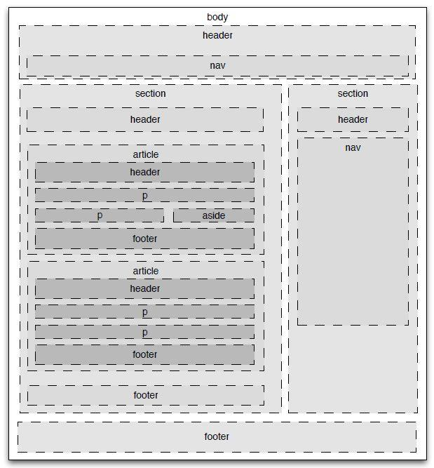

# HTML

## 超文本标记语言

超文本标记语言（英语：HyperText Markup Language，简称：HTML）是一种用于创建网页的标准标记语言。

> 超文本：本质是文本文件，但将其他网页、图片、音频、适配等媒体资源引入当前网页中，呈现丰富的内容，最终效果超越了文本。
>
> 标记语言：不像 Java 这种编程语言，是由一系列标签组成的。每个标签都要它的固定含义和确定显示效果

## HTML 基础结构

创建文档：`index.html` 或 `index.html`。这两种后缀名没有区别，都可以使用。

> html 文件通常由服务器创建与保存，发送至客户浏览器中解析与展示

```html
<!DOCTYPE html><!--声明HTML的版本-->
<html><!--HTML 页面的根元素 所有其他标签都要在这里面-->
    <head><!--包含了文档的元（meta）数据，-->
        <meta charset="utf-8"><!--定义网页编码格式为 utf-8，即告诉浏览器用utf-8进行解码-->
        <title>hello world</title><!--文档的标题-->
    </head>
    <body><!--浏览器中可见的页面内容-->

        <h1>我的第一个标题</h1><!--大标题-->

        <p>我的第一个段落。</p><!--段落-->

    </body>
</html>
```

**文档声明**

从初期的网络诞生后，已经出现了许多 HTML 版本:

HTML	1991
HTML+	1993
HTML 2.0	1995
HTML 3.2	1997
HTML 4.01	1999
XHTML 1.0	2000
HTML5	2012
XHTML5	2013

* HTML5	

```
<!DOCTYPE html>
```

* HTML 4.01

```html
<!DOCTYPE HTML PUBLIC "-//W3C//DTD HTML 4.01 Transitional//EN"
"http://www.w3.org/TR/html4/loose.dtd">
```

* XHTML 1.0

```html
<!DOCTYPE html PUBLIC "-//W3C//DTD XHTML 1.0 Transitional//EN"
"http://www.w3.org/TR/xhtml1/DTD/xhtml1-transitional.dtd">
```

## HTML 标签

HTML 标记标签通常被称为 HTML 标签 (HTML tag)。

- HTML 标签是由尖括号包围的关键词，比如 `<html>`
- HTML 标签通常是成对出现的，比如 <b> 粗体标签 </b>
- 标签对中的开头的标签是开始标签（开放标签），最后的标签是结束标签（闭合标签）

## HTML 元素

严格来讲, HTML 元素 (HTML element)是从开始标签到结束标签之间的完整结构。

**元素嵌套**

HTML 元素可以相互嵌套，形成树状结构：

- 一个元素可以包含其他元素
- HTML 文档本质上是一个嵌套结构（DOM 树）

```html
<h1>Welcome!</h1>
```

**空元素**

空元素是指那些不能包含任何子节点（例如内嵌的元素或文本节点）的元素。空标签只有开始标签，没有结束标签。通常在开始标签中自闭合（如 `<br />`）

常见的 HTML 空元素

`<br>`、`<hr>`、``、`<input>`、`<meta>`、`<link>`

**空格合并**

元素内容中多个连续的空格字符裁减（合并）为一个：

## HTML 属性

- HTML 元素可以设置 **属性**
- 属性可以在元素中添加 **附加信息**
- 属性一般描述于 **开始标签**
- 属性总是以名称/值对的形式出现，比如：`name="value"`。

```html
<!--双引号是最常用的-->
<a href="https://www.runoob.com">Link</a>
<!--也可以使用单引号-->
<a href='https://www.runoob.com'>Link</a>
<!--属性值已包含引号-->
<a href="https://www.runoob.com?q='search'">Link</a>
```

### 常见属性

| 属性名        | 适用元素                                          | 说明                                                         |
| :------------ | :------------------------------------------------ | :----------------------------------------------------------- |
| `id`          | 所有元素                                          | 为元素指定唯一的标识符。                                     |
| `class`       | 所有元素                                          | 为元素指定一个或多个类名，用于 CSS 或 JavaScript 选择。      |
| `style`       | 所有元素                                          | 直接在元素上应用 CSS 样式。                                  |
| `title`       | 所有元素                                          | 为元素提供额外的提示信息，通常在鼠标悬停时显示。             |
| `data-*`      | 所有元素                                          | 用于存储自定义数据，通常通过 JavaScript 访问。               |
| `href`        | `<a>`, `<link>`                                   | 指定链接的目标 URL。                                         |
| `src`         | ``, `<script>`, `<iframe>`                   | 指定外部资源（如图片、脚本、框架）的 URL。                   |
| `alt`         | ``                                           | 为图像提供替代文本，当图像无法显示时显示。                   |
| `type`        | `<input>`, `<button>`                             | 指定输入控件的类型（如 `text`, `password`, `checkbox` 等）。 |
| `value`       | `<input>`, `<button>`, `<option>`                 | 指定元素的初始值。                                           |
| `disabled`    | 表单元素                                          | 禁用元素，使其不可交互。                                     |
| `checked`     | `<input type="checkbox">`, `<input type="radio">` | 指定复选框或单选按钮是否被选中。                             |
| `placeholder` | `<input>`, `<textarea>`                           | 在输入框中显示提示文本。                                     |
| `target`      | `<a>`, `<form>`                                   | 指定链接或表单提交的目标窗口或框架（如 `_blank` 表示新标签页）。 |
| `readonly`    | 表单元素                                          | 使输入框只读。                                               |
| `required`    | 表单元素                                          | 指定输入字段为必填项。                                       |
| `autoplay`    | `<audio>`, `<video>`                              | 自动播放媒体。                                               |
| `onclick`     | 所有元素                                          | 当用户点击元素时触发 JavaScript 事件。                       |
| `onmouseover` | 所有元素                                          | 当用户将鼠标悬停在元素上时触发 JavaScript 事件。             |
| `onchange`    | 表单元素                                          | 当元素的值发生变化时触发 JavaScript 事件。                   |
| `cellspacing` | `<table>`                                         | 单元格间距                                                   |

## HTML 语法规则

* 根标签有且只能有一个
* 无论是双标签还是单标签都需要正确关闭
* 标签可以嵌套但不能交叉嵌套
* 注释语法为 `<--注释内容-->`，注意不能嵌套
* 属性必须有值，值必须加引号，**H5 中属性名和值相同时可以省略属性值**
* 不严格区分字符串使用单双引号
  * 单双引号适合嵌套时交替使用
* 标签不严格区分大小写，但是不能大小写混用
* 不允许自定义标签名，强行自定义则无效

> 假如忘了使用结束标签，大多数浏览器浏览器会自动补全缺失的结束标签，正确地将 HTML 显示出来

## HTML 标签分类

### 头部

`<head>` 元素包含了所有的头部标签元素。在 `<head>`元素中你可以插入脚本（scripts）, 样式文件（CSS），及各种meta信息。

可以添加在头部区域的元素标签为: `<title>`, `<style>`, `<meta>`, `<link>`, `<script>`, `<noscript>` 和 `<base>`。

```html
<html>
    <head> 
        <meta charset="utf-8"> 
        <title>文档标题</title>
    </head>
<html>
```

`<meta>` 标签提供了元数据。元数据也不显示在页面上，但会被浏览器解析。META 元素通常用于指定网页的描述，关键词，文件的最后修改时间，作者，和其他元数据。元数据可以使用于浏览器（如何显示内容或重新加载页面），搜索引擎（关键词），或其他Web服务。

### 标题

<h1> 这是标题 1 </h1>
<h2> 这是标题 2 </h2>
<h3> 这是标题 3 </h3>

### 水平线

<hr/>

### 注释

<!-- 这是一个注释 -->

### 段落

<p> 这是一个段落 </p> <p> 这是另一个段落 </p>

### 换行

<p> 这个<br>段落<br>演示了分行的效果 </p>

### 文本格式化

<div>
    <b> 加粗文本 </b><br>
    <strong> 重要文本</strong><br>
    <i> 斜体文本 </i><br>
    <em> 强调文本</em><br>
    <mark> 高亮文本 </mark><br>
    <small> 小号文本 </small><br>
    <del> 删除文本 </del><br>
    <ins> 插入文本 </ins><br>
    <sub> 下标文本 </sub><br>
    <sup> 上标文本 </sup><br>
    <u>下划线文本</u><br>
</div>

> 实际上有些标签不仅仅为了改变文本格式，还带有一定语义，请考虑使用。

### 超链接

* `href` 属性：定义链接目标。
  * 完整 url
  * 相对路径：以当前资源所在路径起始去找目标资源
  * 绝对路径：以 `/` 为开头，以固定位置起始去找目标资源
* `target` 属性：定义链接的打开方式。
  * `_blank`: 在新窗口或新标签页中打开链接。
  * `_self`: 在当前窗口或标签页中打开链接（默认）。
  * `_parent`: 在父框架中打开链接。
  * `_top`: 在整个窗口中打开链接，取消任何框架。

<a href="https://www.runoob.com/html/html-links.html"> 跳转 URL </a>

 <a href="a/a.html"> 跳转相对路径 </a>

 <a href="/demo-html/a/a.html"> 跳转绝对路径 </a>

### 图像

在 HTML 中，图像由 `` 标签定义。

* `src` 属性：指定存储图像的位置
* `title` 属性：鼠标悬停时的文章
* `Alt` 属性：图片加载失败时显示的提示文本


### 列表

无序列表

<ul>
<li> Coffee </li>
<li> Milk </li>
</ul>


有序列表

<ol>
<li> Coffee </li>
<li> Milk </li>
</ol>


嵌套

<ol>
    <li> Coffee
    	<ul>
            <li> Coffee1 </li>
            <li> Coffee2 </li>
        </ul>
    </li>
    <li> Milk </li>
</ol>

### 表格

HTML 表格由 `<table>` 标签来定义。

* `<thead>` ：在 `<thead >` 中，使用 `<tr>` 元素定义行，使用 `<th>` 元素定义列的标题。通常会使背景变灰。
* `<tbody>` ：在 `<tbody >` 中，使用 `<tr>` 元素定义行，并在每行中使用 `<td>` 元素定义单元格数据。

- `tr`： table row 的缩写，表示表格的一行。
- `td`：table data 的缩写，表示表格的数据单元格。
- `th`：table header 的缩写，表示表格的表头单元格。通常会使文字加粗。

<h3 style="text-align: center;"> 表格示例 </h3>
<table border="1" style="margin: 0px auto; width: 400px;">
    <thead>
        <tr>
            <th> 列标题 1 </th>
            <th> 列标题 2 </th>
            <th> 列标题 3 </th>
            <th> 列标题 4 </th>
        </tr>
    </thead>
    <tbody>
        <tr>
            <td> 行 1，列 1 </td>
            <td> 行 1，列 2 </td>
            <td> 行 1，列 3 </td>
            <td rowspan="3"> 跨行，列 4 </td>
        </tr>
        <tr>
        	<td colspan="3" > 行 2，跨列 </td>
        </tr>
        <tr>
            <td> 行 3，列 1 </td>
            <td> 行 3，列 2 </td>
            <td> 行 3，列 3 </td>
        </tr>
    </tbody>
    <tfoot>
        <tr>
            <td> 表尾 1 </td>
            <td> 表尾 2 </td>
            <td> 表尾 3 </td>
            <td> 表尾 4 </td>
        </tr>
    </tfoot>
</table>


### 表单

- `<form>` 元素用于创建表单

  - `action` 属性：定义表单数据提交地址
  - `method` 属性：定义数据提交的 HTTP 请求方式
    -  `get` （默认）：将数据以键值对的形式接在 url 后面提交。地址栏明文暴露，相对不安全。地址栏长度有限，提交量不大。只能提交纯文本数据。
    -  `post`：表单数据会包含在表单体内然后发送给服务器，用于提交敏感数据，如用户名与密码等。

- `<label>` 元素用于为表单元素添加标签。标签不会向用户呈现任何特殊效果，但是为鼠标用户改进了可用性，在 label 元素内点击文本，就会触发此控件。

  -  `for` 属性必须等于相关元素的 `id` 属性才能将它们绑定在一起。也可以通过将元素放置在 `<label>` 元素内将标签绑定到元素。

- `<input>` 元素是最常用的表单元素之一，它可以创建文本输入框、密码框、单选按钮、复选框等。

  - `type` 属性：定义了输入框的类型
    - 单行文本框 text
    - 密码框 password
    - 提交按钮 submit
    - 重置按钮 reset
    - 单选框 radio
    - 多选框 checkbox
    - 隐藏域 hidden
    - 文件上传 file

  - `id` 属性：用于关联 `<label>` 元素
  - `name` 属性：用于标识表单字段，也就是提交参数中的 key
  - `value` 属性：实际上就是用户在框中输入的值，也就是提交参数中的 value
  - `checked` 属性：在单选框和多选框中表示选中
  - `readonly` 属性：表示输入框只读无法填写
  - `disabled` 属性：表示输入框不可用，不会作为数据提交

- `<textarea>` 元素用于多行文本输入，其输入

- `<select>` 元素用于创建下拉列表

- `<option>` 元素用于定义下拉列表中的选项

  - `selected` 属性：表示下拉列表中的选项已选中

  <form action="/demo-html/a/inputForm.html" method="get">
        用户名: <input type="text" id="username" name="username"><br>
        密码：<input type="password" id="pwd" name="pwd"><br>
        单选：<input type="radio" id="male" name="gender" value="male" checked> 男
        <input type="radio" id="female" name="gender" value="female"> 女<br>
        多选：<input type="checkbox" id="hobby1" name="hobby" value="reading" checked> 阅读
        <input type="checkbox" id="hobby2" name="hobby" value="sports"> 运动
        <input type="checkbox" id="hobby3" name="hobby" value="music"> 音乐<br>
        文本域：<textarea name="message" id="message" cols="30" rows="5"> </textarea><br>
        隐藏域：<input type="hidden" name="token" value="123456"><br>
        选项：<select name="country" id="country">
            <option value="usa"> 美国 </option>
            <option value="china"> 中国 </option>
            <option value="japan"> 日本 </option>
        </select><br>
        文件上传：<input type="file" name="file"><br>
        <label for="clickmelabel"> 点击该标签：</label> <input type="text" id="clickmelabel" name="clickmelabel"><br>
        <label > 点击该标签：<input type="text" id="clickmelabel2" name="clickmelabel2"> </label><br>
        <input type="submit" value="提交">
        <input type="reset" value="清空">
    </form>

### 布局

* 块级元素：显示时是会以新行开始。如 `<h1>`, `<p>`, `<ul>`, `<table>`。其 CSS 样式的宽高通常都是生效的
* 内联元素：显示时不会以新行开始。如 `<b>`, `<td>`, `<a>`, `` 其 CSS 样式的宽高通常是不生效的

HTML 可以通过 `<div>` 和 `<span>` 将元素组合起来。

HTML `<div>` 元素是块级元素，它可用于组合其他 HTML 元素的容器。

HTML `<span>` 元素是内联元素，可用作文本的容器

<div style="border: 1px solid red; width: 500px; height: 300px; margin: 0 auto ; background-color: grey;">
        <span style="color: blue;">块1文本1</span>
        <span style="color: aqua;">块1文本2</span>
    </div>


    <div style="border: 1px solid red; width: 500px; height: 300px; margin: 0 auto ; background-color: grey;"> 块 2 </div>
    <div style="border: 1px solid red; width: 500px; height: 300px; margin: 0 auto ; background-color: grey;"> 块 3 </div>

## HTML 字符实体

HTML 中的预留字符必须被替换为字符实体。

一些在键盘上找不到的字符也可以使用字符实体来替换。

如下，在网页中显示一个完整的h1标签

<!DOCTYPE html>
<html lang="en">
<head>
    <meta charset="UTF-8">
    <title> Document </title>
</head>
<body>
    &lt; h1&gt; 标题&lt;/h1&gt;
</body>
</html>

常见的字符实体：

| 显示结果 | 描述        | 实体名称           | 实体编号  |
| :------- | :---------- | :----------------- | :-------- |
|          | 空格        | `&nbsp;`           | `&#160;`  |
| <        | 小于号      | `&lt;`             | `&#60;`   |
| >        | 大于号      | `&gt;`             | `&#62;`   |
| &        | 和号        | `&amp;`            | `&#38;`   |
| "        | 引号        | `&quot;`           | `&#34;`   |
| '        | 撇号        | &apos; (IE 不支持) | `&#39;`   |
| ￠       | 分          | `&cent;`           | `&#162;`  |
| £        | 镑          | `&pound;`          | `&#163;`  |
| ¥        | 人民币/日元 | `&yen;`            | `&#165;`  |
| €        | 欧元        | `&euro;`           | `&#8364;` |
| §        | 小节        | `&sect;`           | `&#167;`  |
| ©        | 版权        | `&copy;`           | `&#169;`  |
| ®        | 注册商标    | `&reg;`            | `&#174;`  |
| ™        | 商标        | `&trade;`          | `&#8482;` |
| ×        | 乘号        | `&times;`          | `&#215;`  |
| ÷        | 除号        | `&divide;`         | `&#247;`  |

> 实体字符对大小写敏感。
>
> 除以上预留字符，还有更多符号，如货币、希腊字母、数学运算符等

## HTML 语义化

### 语义化

是指根据内容的结构化特征，选择最合适的 HTML 标签来描述内容的含义，而不仅仅是为了控制页面的外观。


### 语义化标签

一个语义化标签能够清楚的描述其意义给浏览器和开发者。

- 无语义标签：无需考虑内容，例如`<div>` 和 `<span>`
- 语义化标签：清楚的定义了它的内容，例如`<form>`、 `<table>`和`` 

H5的语义化标签：

| 标签                        | 含义        | 用途                                     |
| --------------------------- | ----------- | ---------------------------------------- |
| `<header>`                  | 页头/介绍   | 网站顶部、文章头部信息                   |
| `<nav>`                     | 导航        | 主导航菜单、侧边栏链接                   |
| `<main>`                    | 主要内容    | 页面独有的核心内容（每个页面只能有一个） |
| `<article>`                 | 独立文章    | 博客文章、新闻、论坛帖子（可独立分发）   |
| `<section>`                 | 章节        | 文档中的逻辑分组（通常包含标题）         |
| `<aside>`                   | 侧边栏/附属 | 广告、相关链接、侧边说明                 |
| `<footer>`                  | 页脚        | 版权信息、联系方式、底部链接             |
| `<figure>` / `<figcaption>` | 图注        | 图片、图表及其说明文字                   |
| `<time>`                    | 时间        | 日期、时间（机器可读格式）               |
| `<mark>`                    | 标记        | 高亮显示的文字                           |
| `<address>`                 | 地址        | 作者或联系人的联系信息                   |



### 语义化的好处

- 对机器（浏览器/搜索引擎）：可以帮助搜索引擎更好地理解页面内容，从而提高页面排名，增加流量，提供一个SEO友好的网页。
- 对用户（辅助技术）：让视障用户通过屏幕阅读器能准确理解页面结构
- 对开发者：提供代码的可读性和可维护性，降低沟通成本。