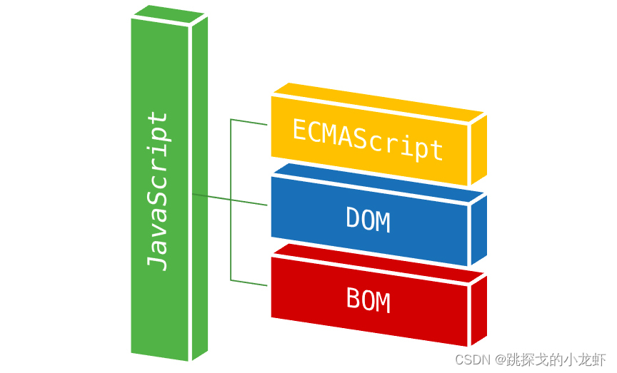
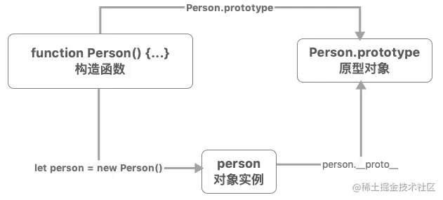
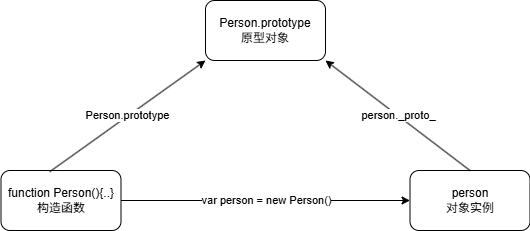

# JavaScript

## JS 简介

JavaScript 是一门跨平台、面向对象的脚本语言，它能使网页可交互（例如，拥有复杂的动画、可点击的按钮、弹出菜单等）。

还有一些更高级的服务器端 JavaScript 版本，如 Node.js，它们允许你为网站添加添加更多功能。



### JS 起源

JavaScript 是一种由 Netscape(网景)的 LiveScript 发展而来的原型化继承的面向对象的动态类型的区分大小写的客户端脚本语言，主要目的是为了解决服务器端语言，遗留的速度问题，为客户提供更流畅的浏览效果。

当时服务端需要对数据进行验证，由于网络速度相当缓慢，验证步骤浪费的时间太多。于是网景公司为其浏览器 Navigator 加入了 JavaScript，提供了数据验证的基本功能。

起名叫 JavaScript 是因为当时 Java 语言非常红火，希望借 Java 的名气来推广，但事实上 JavaScript 除了语法上有点像 Java，其他部分基本上没啥关系。

### ECMAScript

微软模仿 JavaScript 开发了 JScript，为了让 JavaScript 成为全球标准，几个公司联合 ECMA（European Computer Manufacturers Association）组织定制了 JavaScript 语言的标准，被称为 ECMAScript 标准。ECMAScript 标准的文档位于 ECMA-262 规范中。

由于 JavaScript 刚开始有很多设计缺陷，ECMAScript 还在不断发展。ECMAScript 6 标准（简称 ES6）在 2015 年 6 月正式发布，这一版包含了 ES 规范有史以来最重要的一批增强特性。从 2016 年起，ECMAScript 改为每年发布新版本（ES2016、ES2017…），特性迭代更快。

总的来说，ECMAScript 专注于定义语言的核心特性，而 JavaScript 是 ECMAScript 的一种具体实现。而 JavaScript 不仅遵循 ECMAScript 的规范，还扩展了许多与浏览器相关的功能，例如 DOM（文档对象模型）和 BOM（浏览器对象模型）。

ECMAScript 的历史版本：

| 标准版本 | 发布时间 | 新特性                                                       |
| -------- | -------- | ------------------------------------------------------------ |
| ES1      | 1997 年  | 第一版 ECMAScript                                            |
| ES2      | 1998 年  | 引入 setter 和 getter 函数, 增加了 try/catch, switch 语句允许字符串 |
| ES3      | 1999 年  | 引入了正则表达式和更好的字符串处理                           |
| ES4      | 取消     | 取消, 部分特性被 ES3.1 和 ES5 继承                           |
| ES5      | 2009 年  | Object.defineProperty, JSON, 严格模式, 数组新增方法等        |
| ES5.1    | 2011 年  | 对 ES5 做了一些勘误和例行修订                                |
| ES6      | 2015 年  | 箭头函数、模板字符串、解构、let 和 const 关键字、类、模块系统等 |
| ES2016   | 2016 年  | 数组.includes, 指数操作符 (**) , Array.prototype fills 等    |
| ES2017   | 2017 年  | 异步函数 async/await, Object.values/Object.entries, 字符串填充 |
| ES2018   | 2018 年  | 正则表达式命名捕获组, 几个有用的对象方法, 异步迭代器等       |
| ES2019   | 2019 年  | Array.prototype.{flat, flatMap}, Object.fromEntries 等       |
| ES2020   | 2020 年  | BigInt、动态导入、可选链操作符、空位合并操作符               |
| ES2021   | 2021 年  | String.prototype.replaceAll, 逻辑赋值运算符, Promise.any 等  |
| ......   |          |                                                              |

### JS 的特性

* JavaScript 是一种 **解释型** 的脚本语言，无需编译出字节码文件再执行，可以通过浏览器的解释器直接解释执行。
* JavaScript 是一种 **基于对象** 的脚本语言，能够创建对象和使用对象，但是在面向对象的三大特性——封装、继承、动态中，JavaScript 只能实现封装，模拟继承，不支持多态。
* JavaScript 中的数据类型是弱类型，例如通过 `var` 或 `let` 声明一个变量后它可以接受任何类型的数据，在程序执行时根据上下文自动转换类型。
* JavaScript 脚本语言采用了事件驱动的方式，不需要结果 Web 服务器就可以对用户的输入做出响应。
* JavaScript 脚本语言不依赖于操作系统，只需要浏览器的支持。因此在任意安装了支持 JS 的浏览器的及其都能使用 JavaScript。

## JS 基础

### JS 的引入方式

`<script>` 标签用于定义客户端脚本，比如 JavaScript。

`<script> ` 元素既可包含脚本语句，也可通过 `src` 属性指向外部脚本文件，但一个 `<script>` 不能同时使用两种脚本引入方式。

一个 HTML 可以定义多个 `<script>` 元素

**内联脚本**

```html
<!DOCTYPE html>
<html lang="en">
<head>
    <script>
        function sayWelcome() {
            alert("Welcome!");
        }
    </script>
</head>
<body>
    <button class="btn" onclick="sayWelcome()">点击我</button>
</body>
</html>
```

**外部脚本**

```html
<!DOCTYPE html>
<html lang="en">
<head>
    <script src="js/button.js"></script>
</head>
<body>
    <button class="btn" onclick="sayHello()">点击我</button>
</body>
</html>
```

### JS 输入输出

JavaScript 可以通过不同的方式来输出数据：

```javascript
window.alert(5 + 6); // 弹出警告框
document.getElementById("demo").innerHTML = "段落已修改。"; // 访问某个 HTML 元素 通过innerHTML 来获取或插入元素内容
document.write(Date()); // 直接写在HTML文档中
console.log(c); // 写到控制台
```

JavaScript 可以通过内置方法从用户那里获取输入：

```javascript
// prompt() 弹出信息输入框
let userName = prompt("请输入您的名字", "默认名字");
console.log(userName);

// confirm() 弹出信息确认框
let isConfirmed = confirm("您确定要删除这条记录吗？");
if (isConfirmed) {
    console.log("记录已删除");
} else {
    console.log("取消删除");
}

// 从 HTML文档获取输入
let username = document.getElementById("username").value;
```

### JS 语法

* JavaScript 对大小写是敏感的。

* JavaScript 使用 Unicode 字符集。

* JavaScript 语句是用分号（;）分隔，但不强制。

* JavaScript 会忽略多余的空格，空格可以提高其可读性。

* 文本字符串中可以使用反斜杠对代码行进行拆行

  ```javascript
  document.write("你好 \
  世界!");
  ```

* 双斜杠 **//** 后的内容将会被浏览器忽略

  ```java
  // 单行注释
  /* 多行注释 */
  ```

### JS 变量

**字面量**

一般称固定值为字面量

```javascript
// 严格意义上的字面量，ECMA-262 规范中严格定义的 Literal 只有 5 种：
// NullLiteral
null
// BooleanLiteral
true
false 
// StringLiteral
"hello"
'world'
'I\'m Lee'
"His name is \"Marry\""
// RegularExpressionLiteral
/abc/
/\w+/gi
/^[a-z]+$/m
// NumericLiteral
3.14					// 十进制  .5，3.14，1e2
0b1010   				// 二进制
0o755   				// 八进制
0xFF  					// 十六进制
123n					// BigInt
1_000_000				// 带分隔符的字面量增强可读性

// 其他可以表示固定值的规范。其中一些规范早期可能为字面量规范，但由于带有其他功能，于是在ES6中改为其他名称。
// 数组初始化器 Array Initializer
[40, 34, 3, 9, 25] 
// 对象初始化器 Object Initializer
{name:"tintin", age:50, gender:"male"}
// 模板表达式 Template Literal
`Hello ${name}`	
// 表达式
3 * 4
```

**变量**

变量是用于存储信息的 "容器"。

声明变量的关键字：

- `var`：ES5 引入的变量声明方式，具有函数作用域。
- `let`：ES6 引入的变量声明方式，具有块级作用域。
- `const`：ES6 引入的常量声明方式，具有块级作用域，且值不可变。

变量名是标识符，用于引用存储在变量中的数据。

变量名命名规则：

- 变量必须以字母开头
- 变量也能以 `$` 和 `_` 符号开头（不推荐）
- 变量名称对大小写敏感

**var 变量**

```javascript
var x; // 声明变量 默认值为 undefined。
x = 1; // 向变量赋值
var x = 2; // 声明时赋值 可以重复声明

// 声明多个变量 
// x为2，因为重新声明变量的值不会丢失 
// y为undefined 
// z为1
var x, y, z = 1; 

// 具有函数作用域
{console.log(x)} // 2 因为 var 在函数内声明的变量在整个函数中都可访问，即使在 {} 块中声明也不受限制。

// 全局绑定
console.log(window.x); // 2 var 声明的全局变量会成为 window 对象的属性。
```

**let 变量**

```javascript
// 具有块级作用域
{let y = 1}
console.log(y) // 报错 因为 let 变量只在当前 {} 内有效，出了块就无法访问

// 无法重复声明
let y = 1;let y = 2; // 报错同一作用域内禁止重复声明，否则报错。

// 无法全局绑定
console.log(window.y); // undefined
```

**const 变量**

```javascript
const z = 10;
z = 20; // 报错，常量不可重新赋值

// 具有块级作用域
{
    const z = 20; // 不同的常量
    console.log(z); // 输出 20
}
console.log(z); // 输出 10
```

**变量提升**

JavaScript 中，函数及变量的声明都将被提升到函数的最顶部。也就是说变量既可以先声明再使用，也可以先使用再声明。

```javascript
x = 5; // 变量 x 设置为 5

console.log('x=' + x); // x=5

var x; // 声明 x
```


### JS 的数据类型

数据类型

JavaScript 的数据类型如下

* 值类型(基本类型)：字符串（String）、数字(Number)、布尔(Boolean)、空（Null）、未定义（Undefined）、Symbol。

* 引用数据类型（对象类型）：对象(Object)、数组(Array)、函数(Function)，还有两个特殊的对象：正则（RegExp）和日期（Date）。

> `Symbol` 是 ES6 引入了一种新的原始数据类型，表示独一无二的值。

**动态类型**

JavaScript 拥有动态类型。这意味着相同的变量可用作不同的类型：

```javascript
var x;               // x 为 undefined
var x = 5;           // 现在 x 为数字
var x = "John";      // 现在 x 为字符串
```

**查看变量的数据类型**

```javascript
typeof "John"                // 返回 string
typeof 3.14                  // 返回 number
typeof false                 // 返回 boolean
type undefined				 // 返回 undefined
typeof [1,2,3,4]             // 返回 object， JavaScript 历史遗留的 bug，源于早期的底层实现方式。
typeof null             	 // 返回 object， JavaScript 历史遗留的 bug，源于早期的底层实现方式。
typeof {name:'John', age:34} // 返回 object
typeof function y(){}		 // 返回 function

// 更精确的类型判断
function getType(value) {
    if (value === null) return 'null';
    if (Array.isArray(value)) return 'array';
    // if (value instanceof Array) return 'array';
    return typeof value;
}
```

**字符串**

字符串是存储字符的变量。可以使用单引号或双引号，单引号和双引号可以嵌套使用，但相同的引号不得嵌套使用。

```javascript
var carname="Hello"; // 双引号 Hello
var carname='Hello'; // 单引号 Hello

var answer="It's alright"; // 单双引号嵌套使用 It's alright
var answer="He is called 'Johnny'"; // 单双引号嵌套使用 He is called 'Johnny'
var answer='He is called "Johnny"'; // 单双引号嵌套使用 He is called "Johnny"

var answer='He is called \'Johnny\''; // 相同引号使用转义 否则报错 He is called 'Johnny'
var answer="He is called \"Johnny\""; // 相同引号使用转义 否则报错 He is called "Johnny"
```

**数字**

```javascript
var x1=34.00;      // 小数点 
var x2=34;         // 无小数点
var y=123e5;      // 12300000
var z=123e-5;     // 0.00123
```

**布尔**

```javascript
var x=true;
var y=false;
```

**数组**

数组下标是基于零的

```javascript
var arr=["one","two","three"];
// 或者
var arr=new Array("one","two","three");
// 或者
var arr=new Array();
cars[0]="one";
cars[1]="two";
cars[2]="three";
```

**对象**

对象由花括号分隔。在括号内部，对象的属性以名称和值对的形式 （name : value）来定义，属性由逗号分隔。

```javascript
var person={
    name : "John",
    id        :  5566
};

// 寻址
console.log(person.name)
console.log(person["lastname"])
person.name = "tintin"

```

**Undefined 和 Null**

null 是一个特殊值，表示“有意的空值”或“空对象”。它通常由开发者主动地“清空”。

undefined 是一个特殊值，表示“变量尚未被定义”或“未赋值”。它通常由 JavaScript 引擎自动赋值。

```javascript
var z; // undefined
z = null; // null
```

**构造函数**

使用 `new` 关键字调用函数时，该函数将被用作构造函数。通过这种方式创建的变量都将是 `Object` 类型

```javascript
// 使用内置的构造函数声明变量
var name=new String;
var x= new Number;
var y = new Boolean;
var arr = new Array;
var person = new Object;

// 使用自定义构造函数声明变量
function Car(make, model, year) {
  this.make = make;
  this.model = model;
  this.year = year;
}
var myCar = new Car("鹰牌", "Talon TSi", 1993);

```

### JS 操作符

```javascript
// 赋值运算符 =
i = 1 

// 算术运算符 +  -  *  / %
3 / 2 // 1.5
1 / 3 // 0.3333333333333333
3 / 0 // Infinity
10 % 3 // 1
10 % 0 // NaN 表示 not a number

// 复合
i += 1 // 即 i = i + 1

// 比较运算符 
// == != > < 如果两端数据类型不一致，会尝试将两端数据都转换为number再对比。
// === !== 如果两端数据类型不一致，则视为不恒等。
1 == 1 // true
1 == '1' // true
1 == true // true
1 === 1 // true
1 === '1' // false
1 === true // false

// 逻辑 && || !

// 位运算 包括按位与（&）、按位或（|）、按位异或（^）、按位非（~）、左移（<<）、右移（>>）和无符号右移（>>>）

// 三元（条件） (age >= 18) ? 'adult' : 'minor'
```

### JS 流程控制

条件（分支）结构——`if` 语句

```javascript
if (time < 10) {
    document.write("<b>早上好</b>");
} else if (time >= 10 && time < 20) {
    document.write("<b>今天好</b>");
} else {
    document.write("<b>晚上好!</b>");
}
// 特殊值的判断
// 判断为true的，如 非0数字 对象 非空字符串
!!true // true
!!2 // true
!!'false' // true
!!new Number() // true
!!new Object() // true
!!{} // true
!![] // true
!!Infinity // true
// 判断为false的
!!0 // false
!!'' // false
!!null // false 
!!undefined // false
!!NaN // false
```

条件（分支）结构——`switch` 语句

表达式的值会与结构中的每个 case 的值做比较，匹配到 case 以后，会从该 case 的代码块开始往下执行。请使用 `break` 来阻止代码自动地向下一个 case 运行。

```javascript
var day = new Date().getDay();
switch (day) {
    case 1:
        // 不break 使其往下执行
    case 2:
        // 不break 使其往下执行
    case 3:
        // 不break 使其往下执行
    case 4:
        // 不break 使其往下执行
    case 5:
        result = '今天是工作日'
        break
    case 6:
        // 不break 使其往下执行
    case 7:
        result = '今天是周末'
        break
    default:
        result = '无效日期'
}
```

循环结构——`while` 循环

```javascript
var i = 1;
while(i <= 9) {
    var j = 1;
    while(j <= i) {
        document.write(i + "*" + j + "=" + i*j + "&nbsp;&nbsp;&nbsp;&nbsp;");
        j++;
    }
    i++;
    document.write("<hr>");
}
```

循环结构——`for` 循环

```javascript
for(var i = 1; i <= 9; i++) {
    for(var j = 1; j <= i; j++) {
    	document.write(i + "*" + j + "=" + i*j + "&nbsp;&nbsp;&nbsp;&nbsp;");
    }
    document.write("<hr>");
}
```

循环结构——数组 `foreach` 循环

```javascript
var arr = ["one", "two", "three", "four", "five"];
arr.forEach(function(item) {
	document.write(item + "<br>");
});
```

循环结构——数组 `For in/of` 遍历索引或值

```javascript
var arr = ["one", "two", "three", "four", "five"];
for(var index in arr) {
    document.write(arr[index] + ",");
}
document.write("<br>");
for(var item of arr) {
    document.write(item + ",");
}
```

循环结构——普通对象 `For In` 遍历索引

```javascript
var obj = {
    name: "Tintin",
    age: 18,
    city: "Shanghai"
};
for(var key in obj) {
    document.write(key + ":" + obj[key] + ",");
}
// 普通无法迭代属性值
```

### JS 函数

**声明函数的方法一：函数声明**

```javascript
// 声明函数 无变量类型，无返回值类型
function sum(a, b) {
    return a + b
}

// 调用函数
// 实参与形参数量不可以不同
var result = sum(20,40) // 60
var result = sum(20) // NaN
var result = sum(20,40,30) // 60

// 接受函数作为参数
function cal(a, b, func) {
    return func(a, b);
}
var result = cal(20, 40, sum) // 60
var result = cal(20, 40, (a, b)=>a * b) // 800

```

**声明函数的方法二：通过函数表达式声明**

```javascript
var x = function (a, b) {return a * b};
var z = x(4, 3);
```

**箭头函数**

ES6 新增了箭头函数。箭头函数表达式的语法比普通函数表达式更简洁。

```javascript
// ES5
var x = function(x, y) {
     return x * y;
}
 
// ES6
const x = (x, y) => x * y;
```

**任何函数都能当构造函数**

任何一个函数前面加上 `new`，它就变成了构造函数

当一个函数被使用 `new` 操作符执行时，它按照以下步骤：

1. 一个新的空对象被创建并分配给 `this`。
2. 函数体执行。通常它会修改 this，为其添加新的属性。
3. 返回 `this` 的值。

```javascript
function User(name,isAdmin) {
    // this = {}; 这一步由js隐式操作
    
    // 属性添加 这由开发者操作
    this.name = name;
  	this.isAdmin = isAdmin;
    
    // return this; 这一步由js隐式操作
} 
var root = User('root', true) // 对象被创建
```

这也是为什么内建的构造函数都是

**声明函数的方法三：通过构造函数来声明**

```javascript
// 用 new Function
var myFunction = new Function("a", "b", "return a * b");
var x = myFunction(4, 3);
```

**函数是对象**

函数作为 Function 的实例，本身就是对象，具有 **属性** 和 **方法**。

```javascript
function myFunction(){}
myFunction.name // myFunction
myFunction.toString() // function myFunction(){}
```

### JS 对象

**引用类型皆为对象**

JavaScript 中的所有引用类型数据都是对象：字符串、数值、数组、函数...

JavaScript 提供多个内建对象，比如 String、Date、Array 等等。此外，JavaScript 允许自定义对象。 

对象只是一种特殊的数据。对象拥有 **属性** 和 **方法**。

```javascript
var s = new String("abc") // String 对象
s.length // String 对象的 length 属性
s.substr(1) // String 对象的 substr 方法
s.toUpperCase() // String 对象的 toUpperCase 方法
```

**对象就是键值对的集合**

其实方法也是一种属性，因为它也是 `键值对` 的表现形式

```javascript
var o = {}
o.sayHello = ()=>{}
o.hasOwnProperty('sayHello') // true
console.log(o) // {sayHello: ƒ}
```

**基本类型的“装箱”**

在 JavaScript 中，值类型（基本类型）本身不是对象，因此它们不直接拥有属性和方法。基本类型包括 Number、String、Boolean、Null、Undefined 和 Symbol, 这些类型的值都是简单的数据，而不是复杂的数据结构。

然而，JavaScript 为每种基本类型都提供了一个对应的包装对象。当用户尝试访问基本类型数据的“属性“和”方法”时，JavaScript 会临时地将这个基本类型的值转换为对应的包装对象，以便可以调用该对象上的属性和方法。这种转换是自动进行的，通常被称为“装箱”。

```javascript
let str = "Hello";
console.log(str.length); // 输出 5
// JavaScript 会临时地将 str 转换为一个 String 对象，以便可以访问 length 属性。一旦 length 被获取，这个临时的 String 对象就会被销毁，str 仍然保持为字符串基本类型。
```

**创建 JavaScript 对象 —— 使用 Object 定义**

```javascript
// 创建对象
var person = new Object() // {}
// 添加属性
person.name = "tintin"
person.age = 50
// 添加方法
person.changeName = function (name) {
    this.name=name;
}
person.changeName('hh')

// 如果给定值是 null 或 undefined，将会创建并返回一个空对象。
var o = new Object(undefined) // {}
var o = new Object(null) // {}
// 如果传进去的是一个基本类型的值，则会构造其包装类型的对象。
var o = new Object(1) // 等价于 o = new Number(1);
var o = new Object(true) // 等价于 o = new Boolean(true);
var o = new Object('abc') // 等价于 o = new String('abc');
//如果传进去的是引用类型的值，仍然会返回这个值，经他们复制的变量保有和源对象相同的引用地址。
var reference1 = new Object() // {}
reference1.name = 'tintin' // {name: 'tintin'}
var reference2 = new Object(reference1) // {name: 'tintin'} 等价于 var reference2 = reference1;
reference2 === reference1 // true
reference2.name = 'hh' // reference1 和 reference2 都会跟着变化
```

**创建 JavaScript 对象 —— 通过对象字面量**

```javascript
var person = {
    name: 'tintin',
    age: 30,
    isStudent: false,
    greet: function() {
        console.log('Hello, I am ' + this.name + '.');
    }
};
```

**创建 JavaScript 对象 —— 使用构造函数**

```javascript
function Person(name,age)
{
    this.name=name;
    this.age=age;
}
var me=new Person("tintin",50);
var mySon=new Person("qq",23);
var myFather = new Person("tt",78)
```

### JS 原型及原型链

**原型及原型链** 是 JavaScript 中实现继承的核心机制。

**原型对象**

每个 JavaScript 函数都有一个 `prototype` 属性，指向一个对象，即 **原型对象**，而所有由该函数创建的 **实例对象** 都会继承这个原型对象的属性和方法。要想获取到对象的原型，可以访问对象的 `__proto__` 属性，它指向构造函数的 `prototype`。

```javascript
var o = {}
Object.prototype === o.__proto__ // true
// __proto__属性虽然在ECMAScript 6语言规范中标准化，但是不推荐被使用，现在更推荐使用Object.getPrototypeOf
Object.prototype === Object.getPrototypeOf(o) // true
```





**对象共享属性**

```javascript
function Person(name) {
    this.name = name;
}

Person.prototype.sayHello = function() {
    console.log("Hello, my name is " + this.name);
};

let alice = new Person("Alice");
alice.sayHello(); // 输出: Hello, my name is Alice
```

**原型链**

当访问一个对象的属性时，先在对象的本身找，找不到就去对象的原型上找，如果还是找不到，就去对象的原型（原型也是对象，也有它自己的原型）的原型上找，如此继续，直到找到为止，或者查找到最顶层的原型对象中也没有找到，就结束查找，返回 `undefined`。这条由对象及其原型组成的链就叫做 **原型链**。

```javascript
// 普通对象的原型链：obj -> Object.prototype -> null
const obj = {};
console.log(obj.__proto__ === Object.prototype);      // true
console.log(Object.__proto__.__proto__ === null);     // true

// 数组的原型链：arr → Array.prototype → Object.prototype → null
const arr = [];
console.log(arr.__proto__ === Array.prototype);       // true
console.log(arr.__proto__.__proto__ === Object.prototype); // true
console.log(arr.__proto__.__proto__.__proto__ === null);       // true

// 函数的原型链：func → Function.prototype → Object.prototype → null
function func() {}
console.log(func.__proto__ === Function.prototype);   // true
console.log(func.__proto__.__proto__ === Object.prototype); // true
console.log(func.__proto__.__proto__.__proto__ === null);       // true

// 自定义对象的原型链：alice → func.prototype → Object.prototype → null
const myObj = new func();
console.log(myObj.__proto__ === func.prototype);      // true
console.log(myObj.__proto__.__proto__ === Object.prototype);     // true
console.log(myObj.__proto__.__proto__.__proto__ === null);     // true
```


> `Object.prototype` 是绝大多数 JS 对象的原型链顶端（除 `Object.create(null)` 外）。

**Object.create**

Object.create 方法允许你创建一个新对象，并将其原型设置为指定的对象。

```javascript
let personPrototype = {
    sayHello: function() {
        console.log("Hello, my name is " + this.name);
    }
};

let alice = Object.create(personPrototype);
alice.name = "Alice";
alice.sayHello(); // 输出: Hello, my name is Alice
```

> `Object.prototype` 是绝大多数 JS 对象的原型链顶端（除 `Object.create(null)` 外）。
>
> 有无 `Object.create(null)` 创建的对象没有原型，`__proto__` 为 undefined，不继承任何属性和方法

### JSON

JSON（JavaScript Object Notation，JS 对象简谱）是一种轻量级的数据交换格式。它基于 ECMAScript 的一个子集，采用完全独立于编程语言的文本格式来存储和表示数据。

简洁和清晰的层次结构使得 JSON 成为理想的数据交换语言。易于人阅读和编写，同时也易于机器解析和生成，并有效地提升网络传输效率简单来说，JSON 就是一种字符串格式，这种格式无论是在前端还是在后端, 都可以很容易的转换成对象，所以常用于前后端数据传递。

JSON 语法是 JavaScript 对象表示语法的子集。

- 数据在名称/值对（`key : value`）集合中
- 数据由逗号 **,** 分隔
- 使用斜杆 `\` 来转义字符
- 大括号 `{}` 保存对象
- 中括号 `[]` 保存数组，数组可以包含多个对象
- 对象包含多个数据，数据也可以包含多个对象

示例：

```json
{
    "name": "第一中学",
    "isPublic": true,
    "address": {
        "city": "北京",
        "district": "海淀区"
    },
    "classes": [
        {
            "grade": 10,
            "room": "101",
            "students": [
                "张三",
                "李四",
                "王五"
            ]
        },
        {
            "grade": 11,
            "room": "202",
            "students": [
                "赵六",
                "钱七"
            ]
        }
    ],
    "scores": [
        95.5,
        87,
        92
    ],
    "hasLab": false
}
```

客户端获取 JSON 数据并处理：

```javascript
// 从服务器获取的JSON字符串
// JSON数组
var jsonStr = '[ "Google", "Runoob", "Taobao" ]'; 
// JSON对象
var jsonStr = '{"name":"Tintin","age":18,"city":"Shanghai","hobbies":["reading","swimming"],"dog":{"name":"Buddy","breed":"Golden Retriever"}}'; 

// 以JSON对象为例
// 将JSON字符串转换为JavaScript对象
var obj = JSON.parse(jsonStr); 
document.write("Name: " + obj.name + "<br>");
document.write("Age: " + obj.age + "<br>");
document.write("City: " + obj.city + "<br>");
document.write("Hobbies: " + obj.hobbies.join(", ") + "<br>");
document.write("Dog" + ": " + obj.dog.name + " (" + obj.dog.breed + ")" + "<br>");
// 将JavaScript对象转换为JSON字符串
var jsonStr2 = JSON.stringify(obj);
document.write("JSON String: " + jsonStr2);
```

在 Java 后端中获取 JSON 数据并处理：使用 Gson、Jackson、Fastjson 等依赖

### JS 常见对象

数组的常见 API ： [JavaScript Array 对象 | 菜鸟教程](https://www.runoob.com/jsref/jsref-obj-array.html)

boolean 常见 API ：[JavaScript Boolean 对象 | 菜鸟教程](https://www.runoob.com/jsref/jsref-obj-boolean.html)

Number 常见 API ：[JavaScript Number 对象 | 菜鸟教程](https://www.runoob.com/jsref/jsref-obj-number.html)

String 常见 API ：[JavaScript String 对象 | 菜鸟教程](https://www.runoob.com/jsref/jsref-obj-string.html)

Date 常见 API ：[JavaScript Date 对象 | 菜鸟教程](https://www.runoob.com/jsref/jsref-obj-date.html)

Math 常见 API ：[JavaScript Math 对象 | 菜鸟教程](https://www.runoob.com/jsref/jsref-obj-math.html)

## JS 事件驱动

### 什么是事件

HTML 事件是发生在 HTML 元素上的事情（浏览器行为或用户行为），当在 HTML 页面中使用 JavaScript 时， JavaScript 可以触发这些事件。

### 常见事件

* 鼠标事件：`onclick`、`ondbclick` 、`onmouseover`、`onmousemove`、`onmouseleave`
* 键盘事件：`onkeydown`、`onkeyup`
* 表单事件：`onfocus`、`onblur` 、`onchange` 、`onsubmit` 、`onreset`
* 框架/对象（Frame/Object）事件：`onload`

[HTML DOM 事件对象 | 菜鸟教程](https://www.runoob.com/jsref/dom-obj-event.html)

### 事件的绑定

* 通过事件绑定函数，在行为发生时自动执行函数
* 一个事件可以同时绑定多个函数
* 一个元素可以绑定多个事件
* 方中可以传入 this 对象，代表当前元素

**通过属性绑定**

```html
<!DOCTYPE html>
<html lang="en">
<head>
    <meta charset="UTF-8">
    <title>Document</title>
    <script>
        sayHello = function() {
            alert("Hello!");
        }
        sayBye = function() {
            alert("Bye!");
        }
        showTip = function() {
            document.getElementById("tipSpan").style.display = "inline";
        }
        hideTip = function() {
            document.getElementById("tipSpan").style.display = "none";
        }
    </script>
</head>
<body>
    <input type="button" id="alertButton" value="Click Me" onclick="sayHello(),sayBye()" onmouseover="showTip()" onmouseout="hideTip()">
    <span id="tipSpan" style="display: none;">这是一个按钮</span>
</body>
</html>
```

**通过 DOM 编程动态绑定**

```HTML
<!--通过 代码顺序 确保事件在组件加载之后绑定 -->
<button id="btn1">暂无绑定事件</button>
<script>
    // 通过DOM动态绑定事件
    var btn1 = document.getElementById("btn1");
    btn1.innerHTML = "已经绑定点击事件了";
    btn1.onclick = function() {
        alert("Button 1 clicked!");
    }
</script>
```

```html
<!--通过 onload 确保事件在组件加载之后绑定 -->
<head>
    <script>
        function ready() {
            // 通过DOM动态绑定事件
            var btn1 = document.getElementById("btn1");
            btn1.innerHTML = "已经绑定点击事件了";
            btn1.onclick = function() {
                alert("Button 1 clicked!");
            }
            console.log("页面加载完成");
        }
        // 或者 window.onload = ready;
    </script>
</head>
<body onload="ready()">
    <button id="btn1">暂无绑定点击事件</button>
</body>
```

### 事件的触发

**行为触发**

**DOM 编程触发**

```html
<head>
    <script>
        window.onload = function () {
            var div1 = document.getElementById("div1");
            div1.onclick = function() {
                div1.style.backgroundColor = div1.style.backgroundColor === "red" ? "blue" : "red";
            }

            var btn1 = document.getElementById("btn1");
            btn1.onclick = function() {
                div1.onclick(); // 触发
            }
            
            console.log("页面加载完成");

        };
    </script>
</head>
<body >
    <div id="div1" style="background-color: red; width: 100px; height: 100px;" ></div>
    <button id="btn1">点击切换div的颜色</button>
</body>
</html>
```


## BOM

### 什么是 BOM

BOM（Browser Object Model，浏览器对象模型 ）提供了一系列独立于内容，与浏览器窗口进行交互的对象。

> 不存在浏览器对象模型（BOM）的官方标准，但是现代的浏览器已经（几乎）实现了 JavaScript 交互相同的方法和属性

### 顶级对象 window

* window 顶级对象，代表个浏览器口；
  * location 属性，代表浏览器的地址栏；
  * history 属性，代表浏览器的访问历史；
  * screen 属性，代表屏幕；
  * navigator 属性，代表浏览器软件本身；
  * document 属性，代表浏览器窗口目前解析的 html 文档；
  * console 属性，代表浏览器开发者工具的控制台；
  * localStorage 属性，代表浏览器的本地数据持久化存储；
  * sessionStorage 属性，代表浏览器的本地数据会话级存储；

JS 代码中可以省略顶级对象 window 来访问属性和方法，如下


以下代码都是等价的

```
window.document === document  // true
window.alert === alert        // true
window.console === console    // true
window.setTimeout === setTimeout // true
```

然而，如果切换 JavaScript 环境，其顶级对象会发生改变

- 浏览器：顶级对象是 `window`
- Node.js：顶级对象是 `global`
- Web Worker：顶级对象是 `self`
- 现代标准：统一使用 `globalThis`（ES2020），在浏览器中 `globalThis === window`

### window 对象的常见属性及方法

[Window 对象 | 菜鸟教程](https://www.runoob.com/jsref/obj-window.html)

### BOM 控制浏览器行为

```html
<!DOCTYPE html>
<html lang="en">
<head>
    <meta charset="UTF-8">
    <title>Document</title>
</head>
<script>
    var timeoutId; // 定义一个全局变量来存储定时器ID
    var intervalId; // 定义一个全局变量来存储间隔定时器ID
</script>
<body>
    <!-- window对象 顶级对象-->
     <span>window：</span>
    <button onclick="window.alert('这是一个提示框！')">提示框</button>
    <button onclick="window.confirm('这是一个确认框！')">确认框</button>
    <button onclick="window.prompt('请输入你的名字：')">输入框</button>
    <button onclick="timeoutId = window.setTimeout(function() { alert('这是一个定时器！'); }, 2000);">定时器2秒</button>
    <button onclick="window.clearTimeout(timeoutId); alert('定时器已取消！');">取消定时器</button>
    <button onclick="intervalId = window.setInterval(function() { alert('这是一个间隔定时器！'); }, 3000);">间隔定时器3秒一次</button>
    <button onclick="window.clearInterval(intervalId); alert('间隔定时器已取消！');">取消间隔定时器</button>
    <hr/>

    <!-- history对象 用于浏览器历史记录操作 -->
    <span>history：</span>
    <a href="/demo-js/index.html" target="_self">跳转至主页</a>
    <a href="http://www.baidu.com" target="_self">跳转至百度</a>
    <button onclick="window.history.back()">上一页</button>
    <button onclick="window.history.forward()">下一页</button>
    <button onclick="window.history.go(-2)">后退两页</button>
    <hr/>

    <!-- location对象 用于获取当前页面的URL信息 -->
    <span>location：</span>
    <button onclick="alert('当前URL：' + window.location.href + '\n协议：' + window.location.protocol + '\n主机：' + window.location.host + '\n路径：' + window.location.pathname + '\n查询字符串：' + window.location.search + '\n哈希值：' + window.location.hash)">显示当前URL信息</button>
    <button onclick="window.location.href='http://www.baidu.com'">跳转至百度</button>
    <button onclick="window.location.reload()">刷新页面</button>
    <hr/>

    <!-- navigator对象 用于获取浏览器信息 -->
    <span>navigator：</span>
    <button onclick="alert('浏览器名称(遗留弃用)：' + navigator.appName  + '\n浏览器内核(遗留弃用)：' + navigator.appCodeName  + '\n浏览器版本：' + navigator.appVersion + '\n平台：' + navigator.platform)">显示浏览器信息</button>
    <hr/>

    <!-- screen对象 用于获取屏幕信息 -->
    <span>screen：</span>
    <button onclick="alert('屏幕宽度：' + screen.width + '\n屏幕高度：' + screen.height + '\n可用宽度：' + screen.availWidth + '\n可用高度：' + screen.availHeight)">显示屏幕信息</button>
    <hr/>


    <!--sessionStorage对象 用于会话期间存储数据 浏览器关闭后数据丢失-->
    <span>sessionStorage：</span>
    <button onclick="sessionStorage.setItem('key', 'value'); alert('数据已存储！')">存储数据</button>
    <button onclick="alert('存储的数据：' + sessionStorage.getItem('key'))">读取数据</button>
    <button onclick="sessionStorage.removeItem('key'); alert('数据已删除！')">删除数据</button>
    <hr/>

    <!--localStorage对象 用于持久化存储数据 浏览器关闭后仍存在-->
    <span>localStorage：</span>
    <button onclick="localStorage.setItem('key', 'value'); alert('数据已存储！')">存储数据</button>
    <button onclick="alert('存储的数据：' + localStorage.getItem('key'))">读取数据</button>
    <button onclick="localStorage.removeItem('key'); alert('数据已删除！')">删除数据</button>
    <hr/>
</body>
</html>
```

## DOM

### 什么是 DOM

DOM（Document Object Model ，文档对象模型）一种独立于语言，通过内存中的对象来表示文档（XML，HTML）的结构，提供操作文档（XML，HTML）的应用编程接口。

通过 HTML DOM，JavaScript 能够访问和改变 HTML 文档的所有元素。

### DOM 编程

浏览器从网络中获取到 HTML 文档后，除了将其元素展示到页面中，还会将文档加载进内存并抽象成 document 对象，存于 window 对象的属性中。简单来说：DOM 编程就是使用 document 对象的 API 完成对网页 HTML 文档进行动态修改，以实现网页数据和样式动态变化效果的编程，

### DOM 树的结构

DOM 树中节点的类型：

* node 节点，所有结点的父类型：
  * element 元素节点，node 的子类型之一，代表一个完整标签；
  * attribute 属性节点，node 的子类型之一，代表元素的属性；
  * text 文本节点，node 的子类型之一，代表双标签中间的文本；

DOM 树的结构示例如下：


### 获取元素

* 根据 id、name、类名、标签名获取元素
* 根据元素关系获取元素，如父元素、子元素、前一个兄弟元素、后一个兄弟元素

```html
<!DOCTYPE html>
<html lang="en">
<head>
    <meta charset="UTF-8">
    <title>Document</title>
    <style>
        .myDiv {
            margin: 20px;
            padding: 10px;
            border: 1px solid #ccc;
        }
    </style>
    <script>
        function clickBtn1() {
            var div1 = document.getElementById("div1");
            console.log(div1);
        }
        function clickBtn2() {
            var inputs = document.getElementsByTagName("input");
            for(var i = 0; i < inputs.length; i++) {
                console.log(inputs[i]);
            }
        }
        function clickBtn3() {
            var usernameInputs = document.getElementsByName("username");
            for(var i = 0; i < usernameInputs.length; i++) {
                console.log(usernameInputs[i]);
            }
        }
        function clickBtn4() {
            var divs = document.getElementsByClassName("myDiv");
            for(var i = 0; i < divs.length; i++) {
                console.log(divs[i]);
            }
        }
        function clickBtn5() {
            var div1 = document.getElementById("div1");
            var children = div1.children;
            for(var i = 0; i < children.length; i++) {
                console.log(children[i]);
            }
            var firstChild = div1.firstElementChild;
            var lastChild = div1.lastElementChild;
            console.log("第一个子元素：", firstChild);
            console.log("最后一个子元素：", lastChild);
        }
        function clickBtn6() {
            var usernameInput = document.getElementById("username");
            var parent = usernameInput.parentElement;
            console.log(parent);
        }
        function clickBtn7() {
            var emailInput = document.getElementById("email");
            var previousSibling = emailInput.previousElementSibling;
            var nextSibling = emailInput.nextElementSibling;
            console.log("当前元素：", emailInput);
            console.log("前一个兄弟元素：", previousSibling);
            console.log("后一个兄弟元素：", nextSibling);
        }
    </script>
</head>
<body>
    <div id="div1" class="myDiv">
        用户名：<input type="text" id="username" name="username" placeholder="请输入用户名">
        密码：<input type="password" id="password" name="password" placeholder="请输入密码">
        邮箱：<input type="text" id="email" name="email" placeholder="请输入邮箱">
        地址：<input type="text" id="address" name="address" placeholder="请输入地址">
    </div>
    <div id="div2" class="myDiv">
        <button id="btn1" onclick="clickBtn1()">根据id获取元素</button>
        <button id="btn2" onclick="clickBtn2()">根据标签名获取元素</button>
        <button id="btn3" onclick="clickBtn3()">根据name获取元素</button>
        <button id="btn4" onclick="clickBtn4()">根据类名获取元素</button>
    </div>
    <div id="div3" class="myDiv">
        <button id="btn5" onclick="clickBtn5()">根据父元素获取子元素</button>
        <button id="btn6" onclick="clickBtn6()">根据子元素获取父元素</button>
        <button id="btn7" onclick="clickBtn7()">根据当前元素获取兄弟元素</button>
    </div>
</body>
</html>
```

### 操作元素

* 属性操作：`元素.属性名=修改的值`
  * 通过方法：`元素.getAttribute("属性名")`，`元素.setAttribute("属性名", 修改的值)` 
  * 样式的修改：`元素.style.样式名="样式"` 或者 `div1.style.cssText="分号分开多个样式"`，原始的样式名要转换为驼峰命名法，例如 `background-color` 变为 `backgroundColor`

* 文本操作：`div1.innerHTML` 会解析 HTML 标签，`div1.innerText` 会将标签当作普通文本处理

```html
<!DOCTYPE html>
<html lang="en">
<head>
    <meta charset="UTF-8">
    <title>Document</title>
    <style>
        .myDiv {
            margin: 20px;
            padding: 10px;
            border: 1px solid #ccc;
        }
    </style>
    <script>
        function clickBtn8() {
            var addressInput = document.getElementById("address");
            console.log("原来的placeholder属性值：", addressInput.getAttribute("placeholder"));
            addressInput.setAttribute("placeholder", "请输入详细地址");
            console.log("新的placeholder属性值：", addressInput.getAttribute("placeholder"));
            // 或者直接修改属性
            // addressInput.placeholder = "请输入详细地址";
        }
        function clickBtn9() {
            var div1 = document.getElementById("div1");
            div1.style.backgroundColor = "lightblue";
            div1.style.border = "2px solid blue";
            // 也可以一次性设置多个样式
            // div1.style.cssText = "background-color: lightblue; border: 2px solid blue;";
            // 原始的样式名要转换为驼峰命名法，例如background-color变为backgroundColor
        }
        function clickBtn10() {
            var div1 = document.getElementById("div1");
            var div2 = document.getElementById("div2");
            var div3 = document.getElementById("div3");
            console.log(div1.innerHTML);
            console.log(div2.innerText);
            console.log(div3.textContent);
            div1.innerHTML = "<p>这\n是新<br/>的内容</p>";
            div3.innerText = "<p>这\n是新<br/>的内容</p>";
            div2.textContent = "<p>这\n是新<br/>的内容</p>";
            // 注意：innerHTML会解析HTML标签，而textContent和innerText会将标签当作普通文本处理
        }
    </script>
</head>
<body>
    <div id="div1" class="myDiv">
        用户名：<input type="text" id="username" name="username" placeholder="请输入用户名">
        密码：<input type="password" id="password" name="password" placeholder="请输入密码">
        邮箱：<input type="text" id="email" name="email" placeholder="请输入邮箱">
        地址：<input type="text" id="address" name="address" placeholder="请输入地址">
    </div>
    <div id="div4" class="myDiv">
        <button id="btn8" onclick="clickBtn8()">操作元素的属性</button>
        <button id="btn9" onclick="clickBtn9()">操作元素的样式</button>
        <button id="btn10" onclick="clickBtn10()">操作元素的文本内容</button>
    </div>
</body>
</html>
```

### 增删元素

```html
<!DOCTYPE html>
<html lang="en">
<head>
    <meta charset="UTF-8">
    <title>Document</title>
    <style>
        .myDiv {
            margin: 20px;
            padding: 10px;
            border: 1px solid #ccc;
        }
    </style>
    <script>
        function clickBtn11() {
            // 创建一个新的li元素
            var newLi = document.createElement("li");
            // 设置li元素的属性和文本
            newLi.innerText = "Chengdu";
            newLi.id = "cd";
            // 将新元素添加到ul中
            var ul = document.getElementById("city");
            ul.appendChild(newLi);
        }
        function clickBtn12() {
            // 创建一个新的li元素
            var newLi = document.createElement("li");
            // 设置li元素的属性和文本
            newLi.innerText = "Hangzhou";
            newLi.id = "hz";
            // 将新元素插入到指定元素前面
            var shLi = document.getElementById("sh");
            var ul = shLi.parentElement;
            ul.insertBefore(newLi, shLi);
        }
        function clickBtn13() {
            // 创建一个新的li元素
            var newLi = document.createElement("li");
            // 设置li元素的属性和文本
            newLi.innerText = "Wuhan";
            newLi.id = "wh";
            // 将指定元素替换为新元素
            var gzLi = document.getElementById("gz");
            var ul = gzLi.parentElement;
            ul.replaceChild(newLi, gzLi);
        }
        function clickBtn14() {
            // 获取要删除的元素
            var bjLi = document.getElementById("bj");
            // 获取父元素
            var ul = bjLi.parentElement;
            // 删除指定元素
            ul.removeChild(bjLi);
            // 直接删除
            // bjLi.remove();
        }
        function clickBtn15() {
            var ul = document.getElementById("city");
            // 清空元素内容
            ul.innerHTML = "";
            // 或者
            // while(ul.firstChild) {
            //     ul.removeChild(ul.firstChild);
            // }
        }
    </script>
</head>
<body>
    <div id="div5" class="myDiv">
        <ul id="city">
            <li id="bj">Beijing</li>
            <li id="sh">Shanghai</li>
            <li id="gz">Guangzhou</li>
            <li id="sz">Shenzhen</li>
        </ul>
    </div>
    <div id="div6" class="myDiv">
        <button id="btn11" onclick="clickBtn11()">在父元素中追加元素</button>
        <button id="btn12" onclick="clickBtn12()">在指定元素前插入元素</button>
        <button id="btn13" onclick="clickBtn13()">将指定元素替换为新元素</button>
        <button id="btn14" onclick="clickBtn14()">删除指定元素</button>
        <button id="btn15" onclick="clickBtn15()">清空元素内容</button>
    </div>
</body>
</html>
```

## 正则表达式

正则表达式（Expression，简称 Regex 或 RegExp）是一种用来匹配字符串中字符组合的模式。

### 正则表达式作用

- 验证：检查输入的数据是否符合预期格式
- 查找：在文本中找到特定模式的内容
- 替换：将符合某种模式的文本替换为其他内容
- 提取：从复杂文本中提取需要的信息

### 正则表达式的语法

[正则表达式 – 教程 | 菜鸟教程](https://www.runoob.com/regexp/regexp-tutorial.html)

**修饰符**

| 修饰符 | 描述                                                     |
| :----- | :------------------------------------------------------- |
| i      | 执行对大小写不敏感的匹配。                               |
| g      | 执行全局匹配（查找所有匹配而非在找到第一个匹配后停止）。 |
| m      | 执行多行匹配。                                           |

**元字符——基本元字符**

| 字符 | 描述                                                         |
| :--- | :----------------------------------------------------------- |
| `.`  | 匹配除换行符(`\n`)外的任意单个字符。例如，`a.b` 匹配 "aab", "a1b", "a b" 等。 |
| `^`  | 匹配字符串的开始位置。例如，`^abc` 匹配以 "abc" 开头的字符串。 |
| `$`  | 匹配字符串的结束位置。例如，`xyz$` 匹配以 "xyz" 结尾的字符串。 |

**元字符——字符类元字符**

| 字符  | 描述                                                         |
| :---- | :----------------------------------------------------------- |
| `[]`  | 定义字符集合，匹配其中任意一个字符。例如，`[aeiou]` 匹配任意一个元音字母。 |
| `[^]` | 匹配不在方括号中的任意字符。例如，`[^0-9]` 匹配任意非数字字符。 |
| `-`   | 在字符类中表示范围。例如，`[a-z]` 匹配任意小写字母。         |

**元字符——限定符/量词**

| 字符    | 描述                                                         |
| :------ | :----------------------------------------------------------- |
| `*`     | 匹配前面的子表达式零次或多次。例如，`zo*` 能匹配 "z" 以及 "zoo"。`*` 等价于 `{0,}`。 |
| `+`     | 匹配前面的子表达式一次或多次。例如，`zo+` 能匹配 "zo" 以及 "zoo"，但不能匹配 "z"。`+` 等价于 `{1,}`。 |
| `?`     | 匹配前面的子表达式零次或一次。例如，`do(es)?` 可以匹配 "do" 和 "does"，但不能匹配 "dog"。`?` 等价于 `{0,1}`。 |
| `{n}`   | n 是一个非负整数，匹配确定的 n 次。例如，`o{2}` 不能匹配 "Bob" 中的 o，但是能匹配 "food" 中的两个 o。 |
| `{n,}`  | n 是一个非负整数，至少匹配 n 次。例如，`o{2,}` 不能匹配 "Bob" 中的 o，但能匹配 "foooood" 中的所有 o。 |
| `{n,m}` | m 和 n 均为非负整数，其中 n <= m。最少匹配 n 次且最多匹配 m 次。例如，`o{1,3}` 将匹配 "fooooood" 中的前三个 o。o{0,1} 等价于 o?。注意：逗号和两个数之间不能有空格。 |

**元字符——分组元字符**

* `()`：定义子表达式或捕获组。例如，`(ab)+` 匹配 "ab", "abab" 等。

**元字符——选择元字符**

* `|`：表示 "或" 关系。例如，`cat|dog` 匹配 "cat" 或 "dog"

**元字符——转义字符**

* `\`：若要匹配语法中的特殊字符（元字符），必须首先使字符 "转义"，即将反斜杠字符 `\` 放在它们前面，使后面的字符失去特殊含义。

**元字符——特殊字符**

| 字符 | 描述                                                        |
| :--- | :---------------------------------------------------------- |
| `\d` | 匹配任意数字，等价于 `[0-9]`                                |
| `\D` | 匹配任意非数字，等价于 `[^0-9]`                             |
| `\w` | 匹配任意单词字符(字母、数字、下划线)，等价于 `[a-zA-Z0-9_]` |
| `\W` | 匹配任意非单词字符，等价于 `[^a-zA-Z0-9_]`                  |
| `\s` | 匹配任意空白字符(空格、制表符、换行符等)                    |
| `\S` | 匹配任意非空白字符                                          |

**元字符——边界匹配元字符**

| 字符 | 描述                                                         |
| :--- | :----------------------------------------------------------- |
| `\b` | 匹配单词边界。例如，`\bcat\b` 匹配 "cat" 但不匹配 "category" |
| `\B` | 匹配非单词边界。例如，`\Bcat\B` 匹配 "scattered" 中的 "cat" 但不匹配单独的 "cat"。 |

**元字符——非打印字符**

| 字符 | 描述           |
| :--- | :------------- |
| `\n` | 匹配换行符     |
| `\t` | 匹配制表符     |
| `\r` | 匹配回车符     |
| `\f` | 匹配换页符     |
| `\v` | 匹配垂直制表符 |

### RegExp 对象

| 方法     | 描述                                               |
| :------- | :------------------------------------------------- |
| compile  | 在 1.5 版本中已废弃。 编译正则表达式。             |
| exec     | 检索字符串中指定的值。返回找到的值，并确定其位置。 |
| test     | 检索字符串中指定的值。返回 true 或 false。         |
| toString | 返回正则表达式的字符串。                           |

| 属性        | 描述                                               |
| :---------- | :------------------------------------------------- |
| constructor | 返回一个函数，该函数是一个创建 RegExp 对象的原型。 |
| global      | 判断是否设置了 "g" 修饰符                          |
| ignoreCase  | 判断是否设置了 "i" 修饰符                          |
| lastIndex   | 用于规定下次匹配的起始位置                         |
| multiline   | 判断是否设置了 "m" 修饰符                          |
| source      | 返回正则表达式的匹配模式                           |

String 对象中支持正则表达式的方法

| 方法    | 描述                             |
| :------ | :------------------------------- |
| search  | 检索与正则表达式相匹配的值。     |
| match   | 找到一个或多个正则表达式的匹配。 |
| replace | 替换与正则表达式匹配的子串。     |
| split   | 把字符串分割为字符串数组。       |

### JS 使用正则表达式

**创建 RegExp 对象**

```javascript
var patt=new RegExp(pattern,modifiers); // 构造函数方式
var patt=/pattern/modifiers; // 字面量方式
// 模式(pattern)描述了一个表达式模型。
// 修饰符(modifiers)描述了检索是否是全局，区分大小写等。
```

**验证**

```javascript
// 验证手机号格式（简单例：1开头的11位数字）
const phone = "13812345678";
const phoneRegex = /^1[3-9]\d{9}$/;

console.log(phoneRegex.test(phone)); // true
console.log(phoneRegex.test("12345")); // false

// 验证邮箱
const email = "user@example.com";
const emailRegex = /^[\w.-]+@[\w.-]+\.\w+$/;
console.log(emailRegex.test(email)); // true
```

**查找**

```javascript
const text = "Hello 2024, welcome to 2025!";

// search() - 返回第一个匹配的位置索引
const index = text.search(/\d+/);
console.log(index); // 6（数字'2'的位置）

// match() - 返回匹配的数组
const matches = text.match(/\d+/g);
console.log(matches); // ['2024', '2025']

// matchAll() - 返回所有匹配的迭代器（含捕获组）
const regex = /(\d{4})/g;
for (const match of text.matchAll(regex)) {
    console.log(match[0]); // 2024, 2025
}
```

**替换**

```java
const str = "My name is John, John is 25 years old.";

// 简单替换（只替换第一个匹配）
const replaced1 = str.replace("John", "Mike");
console.log(replaced1); 
// "My name is Mike, John is 25 years old."

// 正则全局替换
const replaced2 = str.replace(/John/g, "Mike");
console.log(replaced2); 
// "My name is Mike, Mike is 25 years old."

// 高级替换：使用捕获组
const date = "2024-01-15";
const formatted = date.replace(/(\d{4})-(\d{2})-(\d{2})/, "$3/$2/$1");
console.log(formatted); // "15/01/2024"

// 替换函数
const prices = "price: 10, 20, 30";
const doubled = prices.replace(/\d+/g, (match) => {
    return parseInt(match) * 2;
});
console.log(doubled); // "price: 20, 40, 60"
```

**提取**

```java
const log = "User: alice, Age: 28, City: Beijing";

// 方法1：match() 配合捕获组
const regex1 = /User: (\w+), Age: (\d+), City: (\w+)/;
const result = log.match(regex1);
if (result) {
    console.log(result[1]); // "alice"（用户名）
    console.log(result[2]); // "28"（年龄）
    console.log(result[3]); // "Beijing"（城市）
}

// 方法2：exec() 循环提取多个
const html = "<div>First</div><div>Second</div>";
const divRegex = /<div>(.*?)<\/div>/g;
let match;
while ((match = divRegex.exec(html)) !== null) {
    console.log(match[1]); // "First", "Second"
}

// 方法3：解构赋值提取
const url = "https://example.com:8080/path";
const [, protocol, domain, port] = url.match(/^(https?):\/\/([^:/]+)(?::(\d+))?/) || [];
console.log(protocol); // "https"
console.log(domain);   // "example.com"
console.log(port);     // "8080"
```

### 常见正则表达式

| 需求     | 正则表达式              |
| -------- | ----------------------- |
| 中文字符 | `[\u4e00-\u9fa5]`       |
| 手机号   | `1[3-9]\d{9}`           |
| 邮箱     | `[\w.-]+@[\w.-]+\.\w+`  |
| IPv4     | `(\d{1,3}\.){3}\d{1,3}` |

# 