# NuxtJS 4 入门

## NuxtJS 简介

Nuxt.js 是一个基于 Vue 3 的全栈框架，能帮你快速构建 SSR 应用、静态网站，还能写后端 API。

## 创建工程

版本环境

```bash
node -v
# v24.15.0
npm -v
# 11.12.1
```

初始化工程

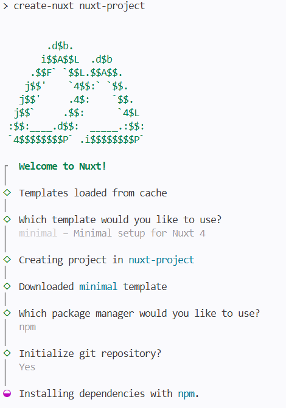

依赖版本

```json
"dependencies": {
    "nuxt": "^4.4.6",
    "vue": "^3.5.34",
    "vue-router": "^5.0.7"
  }
```

运行项目

```bash
npm install
npm run dev
```

页面效果

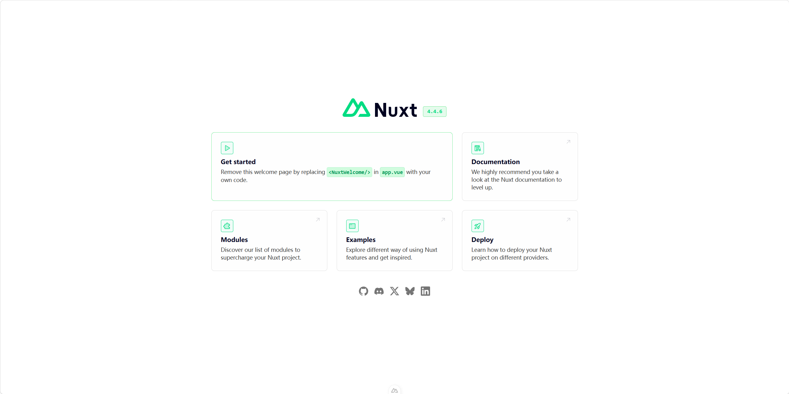

SSR 效果

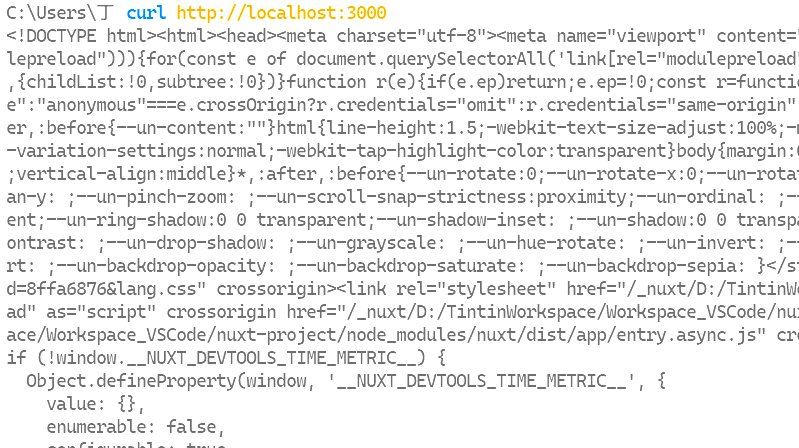

对比 纯 VUE 的 CSR 项目 只能查出未渲染后的页面

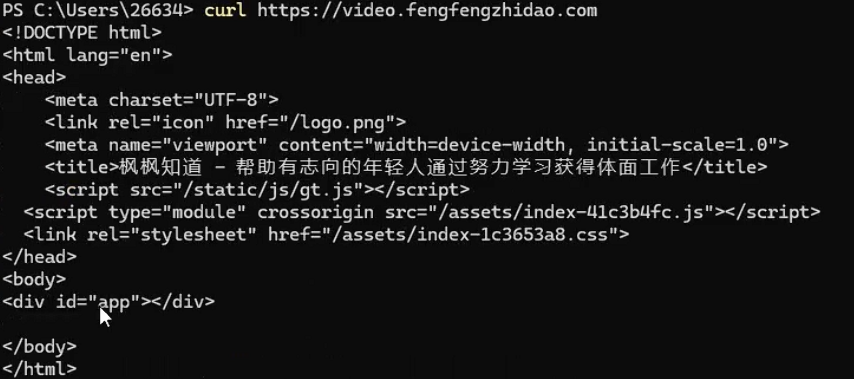

### CSR 和 SSR

- 服务端渲染 (SSR)： 所有的内容（标题、段落、数据）在离开服务器之前就已经填入到 HTML 页面中。浏览器拿到的是一个已经可以阅读的完整文档，右键“查看网页源代码”能看到完整内容。
- 客户端渲染 (CSR)：页面本身是一个空的“骨架”，内容需要依靠 JavaScript 在用户浏览器（客户端）内执行并请求数据后才能显示。右键“查看网页源代码”只能看到一个空的占位符。

| **特性**               | **SSR (Nuxt 默认)**                | **CSR (传统 SPA)**               |
| ---------------------- | ---------------------------------- | -------------------------------- |
| **SEO 搜索引擎优化**   | **极好**。爬虫直接读取完整 HTML。  | **较差**。爬虫看到的是空壳。     |
| **首屏加载速度 (FCP)** | **快**。内容随 HTML 一起到达。     | **慢**。需等 JS 下载并执行完。   |
| **服务器压力**         | **大**。服务器要负责实时生成页面。 | **小**。服务器只负责传文件。     |
| **用户体验**           | 页面跳转有时会有短暂白屏。         | 初次加载慢，但后续页面切换极快。 |

## 工程结构与规范

### 目录结构

```
nuxt-project/
  ├── .nuxt/                   # 自动生成的构建产物与类型定义（已 gitignore）
  ├── app/                     # Nuxt 4 应用核心目录
  │   └── app.vue              # 根组件入口
  ├── node_modules/            # 依赖包（已 gitignore）
  ├── public/                  # 静态资源目录（目前为空）
  ├── .gitignore               # Git 忽略规则
  ├── nuxt.config.ts           # Nuxt 配置文件
  ├── package.json             # 项目依赖与脚本
  ├── package-lock.json        # 依赖锁定文件
  ├── README.md                # 项目说明文档（模板内容）
  └── tsconfig.json            # TypeScript 配置（引用 .nuxt/ 下生成配置）
```

### 约定大于配置

使用 `app/` 目录代替根目录下的 `pages/`、`layouts/`、`middleware/`、`components/` 等，所有应用代码集中在 app/ 下

### 命名规范

- `components/`：帕斯卡拼写法（PascalCase），第一个词的首字母，以及后面每个词的首字母都大写，也叫做大写骆驼拼写法 （UpperCamelCase）
  - 符合 Vue 组件命名规范
  - 与原生 HTML 元素（小写）区分开
-  `pages/`：kebab-case，单词之间使用连字符 `-` 分隔, 而不是下划线或空格。
  - 文件名直接映射 URL 路径，用 `-` 更符合 URL 惯例
- `layouts/`：小写开头
- `middleware/`：小写开头

> `components/` 用 PascalCase 符合 Vue 组件命名规范，也能与原生 HTML 元素（小写）区分开

## 路由

### 页面即路由

约定大于配置：`pages/` 定义路由

`app/app.vue`

```vue
<template>
  <div>
    <NuxtRouteAnnouncer /><!--带有页面标题的隐藏元素，用于宣布对辅助技术的路线更改。-->
    <!--<NuxtWelcome />启动器的默认欢迎页-->
     <NuxtPage /><!-- 显示位于pages/目录中的页面 -->
  </div>
</template>

```

`app/pages/hello.vue`

```vue
<template>
  <div>
    <h1>Hello World</h1>
  </div>
</template>
```

效果


> 若创建 pages/user/info.vue，则路由未 /user/info

### 动态路由

`app/pages/article/[id].vue`

```vue
<script setup>
const route = useRoute() //已预导入
</script>

<template>
    <div>
        <h1>Article title：{{ route.params.id }}</h1>
        <p>Article query：{{ route.query }}</p>
        <p>Article content：{{ route.params.id }}</p>
    </div>
</template>
```

路由预导入

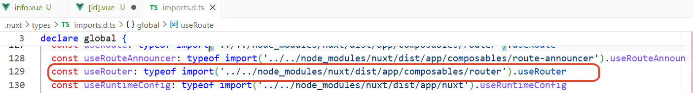

效果

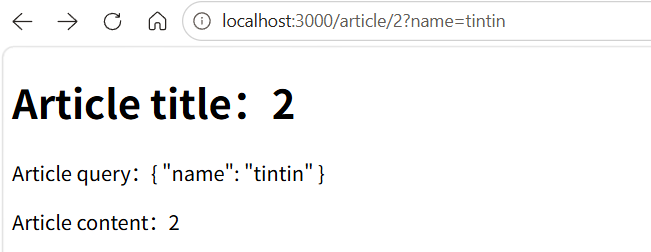

### definePageMeta

`app/pages/article/[id].vue`

```vue
<script setup>
const route = useRoute() //已预导入
definePageMeta({
    validate: async (to) => {
        // 检查 id 是否为数字
        return /^\d+$/.test(to.params.id) // 匹配失败会跳转到404页面
    }
})
</script>
```

效果


### 多个路由参数

例 /article/1/comment/1

对应路由目录结构为 `app/pages/articleId/comment/[commentId].vue`，见名知意即可

### 根路由

 `app/pages/index.vue` 表示 `/`

 `app/pages/user/index.vue` 表示 `/user`

> 此时如果存在 `app/pages/user.vue` 则 `/user` 优先显示 `app/pages/user.vue`，

### 嵌套路由

如果存在 `pages/parent.vue` 和 `pages/parent/child.vue`, 那么 `parent.vue` 内部可以通过一个 `<NuxtPage/>` 来承载子页面内容。

`app/pages/user.vue` 

```vue
<template>
    <div>
        <h1>user.vue</h1>
        <div>子页面如下</div>
        <nuxt-page />
    </div>
</template>
```

`app/pages/user/index.vue` 

```vue
<template>
    <div>
        <h1>user/index.vue</h1>
    </div>
</template>
```

效果：

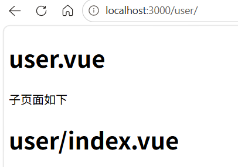

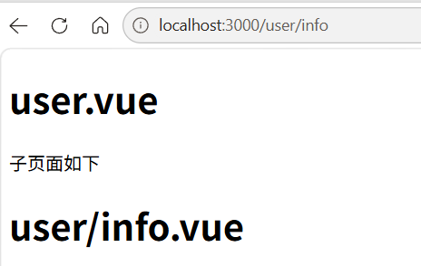

## 头部

### UseHead

专门用来管理页面元数据（Metadata）。

简单来说，它的作用就是让你在 Vue 组件中，动态地修改 HTML 文档里的 `<head>` 部分。比如修改网页标题、添加 CSS 链接、插入脚本

```vue
<script setup lang="ts">
useHead({
    title: 'Hello World'
})
</script>
```

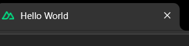

> 优先级：如果页面有 useHead 的配置，就用自己的，没有就找父级，直到 app.vue

有时候你需要在特定的页面给 `<body>` 标签加个类名（比如暗黑模式或特定背景），或者修改 `<html>` 的语言属性。

```vue
<script setup lang="ts">
useHead({
  htmlAttrs: {
    lang: 'zh-CN'
  },
  bodyAttrs: {
    class: 'article-theme-dark'
  }
})
</script>
```

需要引入一个第三方的 JS 库（比如地图 SDK、统计代码），没必要全局引入，直接局部挂载

```vue
<script setup lang="ts">
useHead({
  script: [
    {
      src: 'https://example.com/map-sdk.js',
      defer: true, // 延迟加载
      tagPosition: 'bodyClose' // 放到 body 结束标签前，避免阻塞渲染
    }
  ],
  link: [
    { rel: 'icon', type: 'image/png', href: '/favicon.png' }
  ]
})
</script>
```

效果

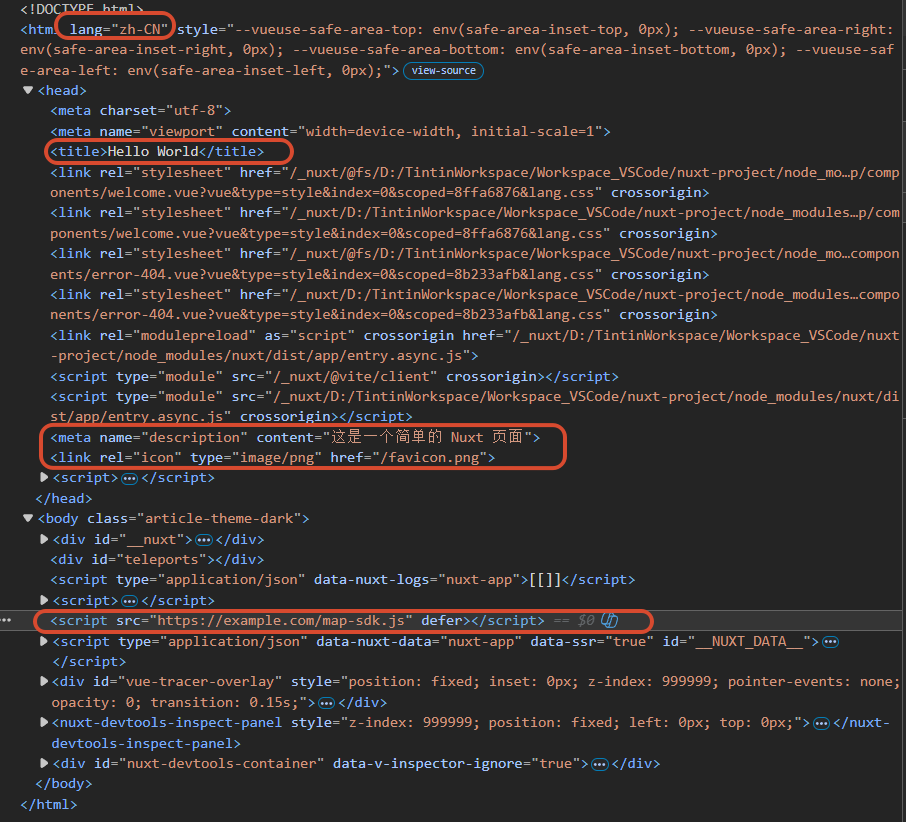


### 全局标题模板

方案一：`nuxt.config.ts`

```ts
// https://nuxt.com/docs/api/configuration/nuxt-config
export default defineNuxtConfig({
  compatibilityDate: '2025-07-15',
  devtools: { enabled: true },
  app: {
    head: {
      // title: 'Nuxt Project App',
      titleTemplate: '%s | Nuxt Project App'
    }
  }
})
```

效果


方案二：`app/app.vue`

```vue
<script setup lang="ts">
useHead({
  titleTemplate: (titleChunk) => titleChunk ? `${titleChunk} - Blog` : 'Blog'
})
</script>
```

此如果某个页面的 `title` 设为 `关于`，最终的标题会变成 `关于 | Blog`。

## SEO 优化

Nuxt 推荐在大多数 SEO 场景下使用 `useSeoMeta`。它是 `useHead` 的“快捷方式”，专门为 `meta` 标签设计，有非常棒的 TypeScript 自动补全，能防止你写错 `og:title` 或 `twitter:card` 等属性。

```
useSeoMeta({
  // 基础信息
  title: 'Nuxt 3 实战教程：从零重构博客 - 枫枫知道',
  description: '这是一门关于如何使用 Nuxt 3 解决前后端分离 SEO 痛点的课程...',
  keywords: 'Nuxt3, Vue3, SSR, SEO优化, 枫枫知道',
  
  // 社交分享 (微信、QQ、Discord等)
  ogTitle: 'Nuxt 3 实战教程：从零重构博客',
  ogDescription: '这是一门关于如何使用 Nuxt 3 解决前后端分离 SEO 痛点的课程...',
  ogImage: 'https://api.fengfeng.com/covers/nuxt-tutorial.png', // 必须是绝对路径
  ogType: 'article',
  
  // Twitter 优化
  twitterCard: 'summary_large_image',
  twitterSite: '@fengfeng_zhidao',
})
```

基础 SEO 属性 (Standard Meta Tags)：这些属性是给搜索引擎（Google, 百度）看的，决定了搜索结果的排名和展示样式。

- title: 页面标题。这是 SEO 最核心的指标，会显示在搜索结果的第一行蓝色文字上。
- description: 页面描述。通常是搜索结果标题下方的摘要文字。字数建议控制在 150 个字符左右。
- keywords: 关键词。虽然现在主流搜索引擎（如 Google）已经不再将其作为排名依据，但国内某些搜索引擎依然会参考。
- author: 作者名。标明文章的原创者。

Open Graph 属性 (OG 协议)：这些属性以 og 开头，由 Facebook 推出，现在已成为行业标准。当有人在微信、Discord、Telegram 等社交软件分享你的链接时，显示的“卡片预览”就是靠它们。

- ogTitle: 分享卡片上的标题（通常和 title 一致）。
- ogDescription: 分享卡片上的描述。
- ogImage: 极其重要！这是分享卡片上的预览图。如果没有它，分享链接只会显示一段枯燥的文字。
- ogUrl: 页面的规范链接。
- ogType: 页面类型，常用的是 website 或 article。

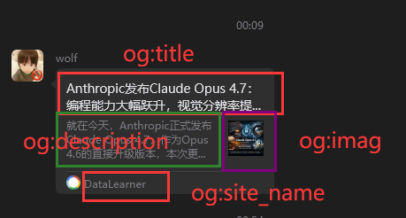

## 布局系统

布局系统 (Layouts) 是保持视觉一致性的核心。它能让你把导航栏（Header）、侧边栏（Sidebar）和页脚（Footer）这些通用组件提取出来，避免在每个 `pages/*.vue` 里重复写代码。

约定大于配置：`Layouts/` 定义布局（页面外壳）

### 默认布局

`app/layouts/default.vue`

```vue
<template>
  <div class="my-blog-layout">
    <header>
      <nav>
        <NuxtLink to="/">首页</NuxtLink>
        <NuxtLink to="/hello">你好</NuxtLink>
        <NuxtLink to="/user">用户</NuxtLink>
      </nav>
    </header>

    <main>
      <slot /> <!-- 页面内容将替换这个槽位 -->
    </main>

    <footer>
      <p>© 2026 丁丁 - Nuxt 学习</p>
    </footer>
  </div>
</template>

<style scoped>
/* 这里写全局通用的样式 */
.my-blog-layout {
  nav a{
    margin-right: 20px;
  }
}
header { border-bottom: 1px solid #eee; padding: 1rem; }
footer { margin-top: 2rem; text-align: center; color: #888; }
</style>
```

`app/app.vue`

```vue
<template>
  <div>
    <NuxtRouteAnnouncer /><!--带有页面标题的隐藏元素，用于宣布对辅助技术的路线更改。-->
    <!--<NuxtWelcome />启动器的默认欢迎页-->
    <NuxtLayout>
      <NuxtPage /><!-- 显示位于pages/目录中的页面 -->
    </NuxtLayout>
  </div>
</template>

```

效果

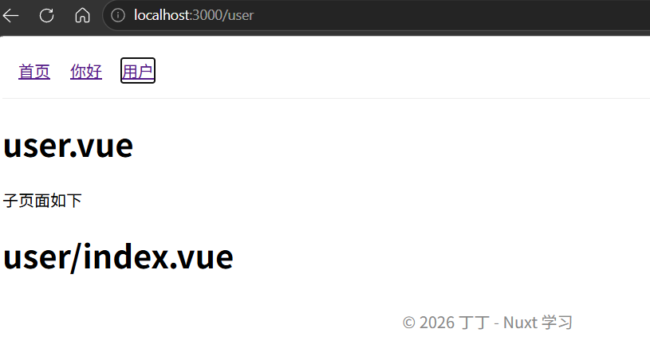

### 自定义布局

`app/layouts/user.vue`

```vue
<template>
  <div>
      <p>这是user特殊的布局👇</p>
      <slot />
      <p>这是user特殊的布局👆</p>
  </div>
</template>
```

`app/pages/user.vue`

```vue
<script setup>
definePageMeta({
  layout: 'user' // 对应 app/lay!!outs/user.vue
})
</script>
<template>
    <div>
        <h1>user.vue</h1>
        <div>子页面如下</div>
        <nuxt-page />
    </div>
</template>
```

效果

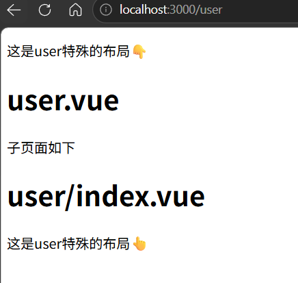

### 动态切换布局

`app/layouts/user.vue`

```vue
<script setup>
// 动态切换布局
function changeLayout() {
  setPageLayout('default')
}
</script>
<template>
  <div>
      <p>这是user特殊的布局👇</p>
      <slot />
      <p>这是user特殊的布局👆</p>
      <button @click="changeLayout">切换为默认布局</button>
  </div>
</template>
```

## 组件自动导入

在 Nuxt 中，“组件自动导入 (Components Auto-import)” 是提升开发爽感的核心特性之一。它让你告别了在每个页面顶部写一堆 import MyComponent from '...' 的痛苦。

约定大于配置：

- `components/`：定义可复用组件（自动导入）
- Nuxt 会根据目录层级自动命名。`components/User/Avatar.vue` 自动变为 `<UserAvatar />`。如果你不喜欢这种拼接，也可以直接在 components/下扁平化存放。开发的时候尽量避免文件目录和文件重名的情况，比如 `UserAvatar.vue` 和 `User/Avatar.vue`

> 文件名尽量遵循大写骆驼命名法约定

### 默认规则

`app/components/Avatar.vue`

```vue
<template>
    <div>
        
    </div>  
</template>
<style scoped>
.avatar {
    width: 100px;
    height: 100px;
    border-radius: 50%;
}
</style>
```

`app/components/user/List.vue`

```vue
<template>
    <div>
        <p>用户列表</p>
    </div>  
</template>
```

`app/pages/index.vue`

```vue
<template>
  <div>
    <h1>APP</h1>
    <Avatar />
    <UserList />
  </div>
</template>
```

效果

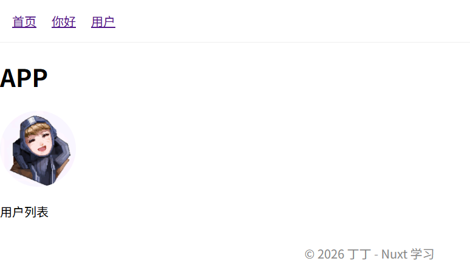

### 懒加载组件

这是优化网站性能的利器。如果你有一个组件（比如“评论弹窗”或“感谢信”）不是页面一加载就需要的，你可以通过在组件名前加 Lazy 前缀来激活懒加载。

```vue
<script setup>
const showUserList = ref(false)
</script>
<template>
  <div>
    <h1>APP</h1>
    <LazyUserList v-if="showUserList" />
    <button @click="showUserList = !showUserList">显示懒加载用户列表</button>
  </div>
</template>
```

### ClientOnly 组件

有些第三方组件（比如富文本编辑器、图表库）可能不支持服务器端渲染（因为它们依赖浏览器的 window 或 document 对象）。

如果你直接在 Nuxt 中使用它们，服务器可能会报错。这时需要包裹在 `<ClientOnly>` 中：

```vue
<template>
  <div>
    <h1>APP</h1>
    <ClientOnly>
        <UserList />
        <template #fallback>
        <p>用户列表加载中...</p>
      </template>
    </ClientOnly>
  </div>
</template>
```

### 显式导入

如果你需要动态组件（例如使用 `<component :is="...">`），你还是需要手动导入，或者使用 Nuxt 提供的 resolveComponent 辅助函数。

```vue
<script setup>
import Avatar from '~/components/avatar.vue'
</script>
<template>
  <div>
    <h1>APP</h1>
    <component :is="Avatar"></component>
  </div>
</template>
```

或

```vue
<script setup>
let dynamicComponent = resolveComponent('UserList')
</script>
<template>
  <div>
    <component :is="dynamicComponent" />
  </div>
</template>
```

## 生命周期

由于 SSR 的存在，Nuxt 相比于 Vue 会遇到各种奇葩错误，比如“window is not defined”或者“为什么我的 Console 打印在黑框框（终端）里而不是浏览器里”。

### 同构渲染

CSR 和 SSR 的优劣势是互补的，所以只要把它们二者结合起来，就能实现理想的渲染方法，也就是同构渲染。

同构渲染（Isomorphic Rendering），也常被称为通用渲染（Universal Rendering），是指代码可以同时运行在服务器端和客户端的能力。

同构渲染的工作模式可以拆解为两个阶段：

- 第一阶段：服务端渲染 (SSR)，当你第一次访问页面（或刷新页面）时：

  - 服务器执行 Vue 代码，将数据填充进组件。
  - 生成完整的 HTML 字符串。
  - 将 HTML 直接发送给浏览器。

  > 好处： 用户能立即看到内容，SEO 友好（搜索引擎爬虫能抓取到完整的 HTML）。

- 第二阶段：客户端激活 (Hydration)，HTML 到达浏览器后：

  - 浏览器下载并执行项目中的 JavaScript。
  - Vue 会在浏览器中重新运行，接管服务器生成的静态 HTML，使其恢复响应式（比如绑定点击事件、表单交互）。
    这个过程被称为 **“注水” (Hydration)**。

  > 好处： 页面后续的跳转不再需要请求服务器生成 HTML，而是像 SPA 一样丝滑，只请求数据。

### 判断当前渲染环境

如果你有一段逻辑必须分环境执行，Nuxt 提供了超简单的全局变量：

```vue
<script setup lang="ts">
if (import.meta.server) {
  console.log('这段代码只在服务器跑，比如读文件、查数据库') // 通常是第一次访问页面或刷新页面时触发
}

if (import.meta.client) {
  console.log('这段代码只在浏览器跑，比如 window.alert()') // 通常是点击浏览器路由时触发
}
</script>
```

虽然同构渲染很强大，但因为它“一份代码两处运行”，开发者需要注意：

- Window/Document 对象：在 setup()或 created()生命周期中，代码会在服务端运行。此时没有浏览器环境，直接访问 window 或 localStorage 会报错。你需要通过 `process.client` 判断或在 `onMounted` 中执行。
- 状态同步： 服务器获取的数据必须“脱水”传给客户端，客户端再“注水”还原，否则会导致客户端渲染结果与服务端不一致（Hydration Mismatch）。
- 服务器压力： 相比于纯静态文件分发，服务器需要运行 Node.js 环境来渲染页面，对 CPU 有一定消耗。

### 水合现象

水合（Hydration） 是一个非常形象的比喻。

服务器返回的是“干”的 HTML（纯文本，没有交互逻辑，就像脱水的蔬菜）。浏览器下载了 Vue 的 JavaScript 束后，Vue 会在后台运行，将这些 JS 逻辑挂载到现有的 HTML 结构上，让页面变得“湿润”起来（可点击、有动画、响应式）。

水合的过程：

1. 下载 JS：浏览器显示 HTML 后，开始下载框架代码。
2. 激活阶段：Vue 在客户端扫描服务器传来的 DOM 结构。
3. 对比与挂载：Vue 创建虚拟 DOM，并尝试将其与现有的真实 DOM 匹配。如果匹配成功，Vue 接管 DOM，绑定事件监听器。

### Nuxt 生命周期钩子

在 Vue 3 的基础上，Nuxt 的生命周期主要关注“什么时候能访问浏览器特有对象”。

- `setup()` 期间：服务端和客户端都会执行。绝对不能在这里访问 window、document 或 localStorage。
- `onMounted()`：仅在客户端执行。如果你要操作 DOM、初始化地图 SDK、或者读取 Cookie/Token，请务必放在这里。

### 前端渲染的情况

这是很多初学者最容易困惑的地方。简单来说：“首次进入是 SSR，后续跳转是 CSR。”

- 情况 A：服务端渲染 (SSR)
  - 动作： 你在浏览器地址栏输入网址敲回车，或者手动刷新页面。
  - 过程： 请求发送到 Node.js 服务器，Nuxt 执行所有初始化和数据获取钩子，生成 HTML 返回。
  - 表现： 右键查看源代码，可以看到完整的页面文字内容。
- 情况 B：客户端渲染 (CSR)
  - 动作：页面加载完成后，你点击了 `<NuxtLink>` 进行站内跳转。
  - 过程： 浏览器不会重新请求服务器拿 HTML，而是通过 JS 拦截路由，直接在浏览器里下载新页面的数据并渲染组件。
  - 表现： 体验像单页应用（SPA），没有白屏，速度极快。

> 简单来说，SSR 专门为 SEO 工作，为了搜索引擎或爬虫脚本第一次访问即可获取所有的页面内容。而当一个真实的用户正在浏览页面时，直接提供单页应用（SPA）的流畅体验即可。

## 数据获取

如果你用传统的 `axios` 放在 `onMounted` 里请求，爬虫抓到的依然是一个空壳，SEO 照样没戏。

Nuxt 提供了四个核心工具：`useFetch`、`useAsyncData`、`$fetch` 和 `useLazyFetch`。

### useFetch

它是 Nuxt 获取数据最简单的方式，会自动处理服务端渲染序列化（即：在服务器请求一次，把结果塞进 HTML，客户端直接复用，不会在浏览器里重复请求）。

`app/pages/fetch.vue`

```vue
<template >
    <div>
        <h2>Fetch Data</h2>
        <p>ID：{{ data[0]?.id  }}</p>
        <p>名称：{{ data[0]?.name }}</p>
        <p>年龄：{{ data[0]?.age }}</p>
    </div>
</template>
<script setup lang="ts">
interface User {
    id: number
    name: string
    age: number
}
const {data,  pending, error} = await useFetch<User[]>('http://localhost:3001/users')
</script>
<style lang="">
    
</style>
```

效果

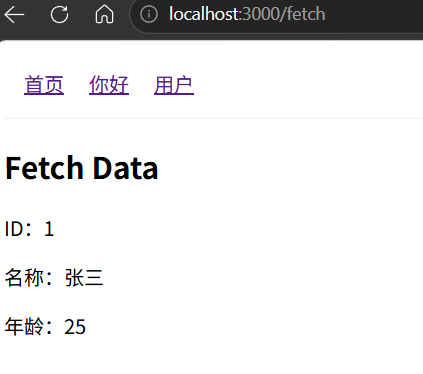

服务端发送了请求，获取并返回了序列化数据

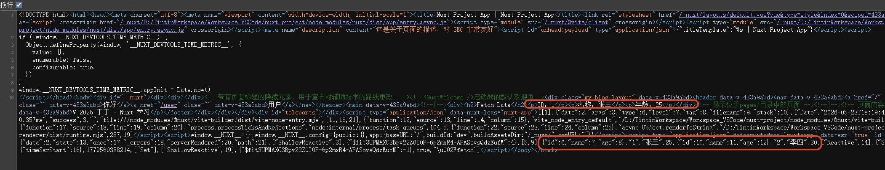

### 配置 BaseUrl

直接写绝对路径不太容易维护，我们可以只写相对路径，通过代理去请求 url、

方式一：

```ts
// https://nuxt.com/docs/api/configuration/nuxt-config
export default defineNuxtConfig({
  compatibilityDate: '2025-07-15',
  devtools: { enabled: true },
  app: {
    head: {
      titleTemplate: '%s | Nuxt Project App'
    }
  },
  nitro: {
    devProxy: {
      // 当你请求 /api 时，Nitro 会自动转发到你的 Mock 地址，只在csr下生效
      "/api": {
        target: "http://127.0.0.1:3001",
        changeOrigin: true,
      }
    }
  }
})

```

`app/pages/fetch.vue`

```vue
<template >
    <div>
        <h2>Fetch Data {{ data }}</h2>
    </div>
</template>
<script setup lang="ts">
interface User {
    id: number
    name: string
    age: number
}
const {data} = await useFetch<User[]>('/api/users')
</script>
<style lang="">
    
</style>
```

效果

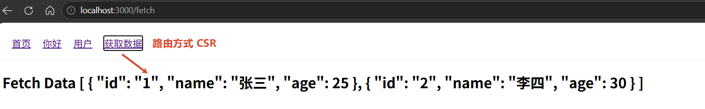

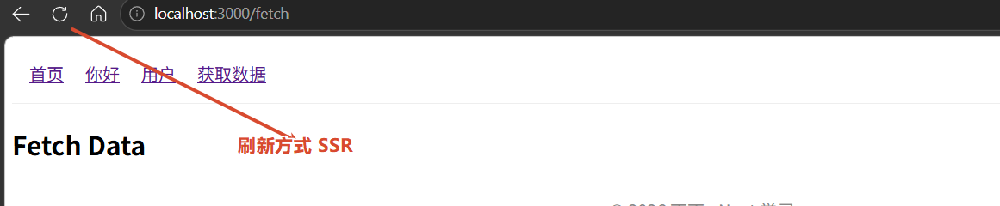

方式二：

```ts
// https://nuxt.com/docs/api/configuration/nuxt-config
export default defineNuxtConfig({
  compatibilityDate: '2025-07-15',
  devtools: { enabled: true },
  app: {
    head: {
      titleTemplate: '%s | Nuxt Project App'
    }
  },
  nitro: {
    // 如果是线上环境，使用 routeRules 进行转发 (SSR 模式下非常强)，ssr和csr都生效 
    routeRules: {
      '/api/**': { proxy: 'http://127.0.0.1:3001/**' }
    }
  }
})

```

效果

不管是 SSR 还是 CSR 都生效

### useFetch 高级用法

**带参数**

```js
const {data} = await useFetch<User[]>('/api/users', {
    method: 'POST',
      query: { id: 100 }, // URL 参数
      body: {
        title: '更新后的标题' // Body 参数
      }
})
```

**pick 筛选字段**

很多时候后端接口返回的对象非常大（比如包含 `create_time`, `update_time`, `author_email` 等），但你前端只需要 `title` 和 `content`。

```js
const {data: user} = await useFetch<User>('/api/users/1', {
    method: 'get',
    pick: ['id', 'name', 'email']
})
```

> pick 只能选第一层

**transform 数据转换**

对应大部分的 api 数据都是嵌套结构，code data msg 这样的，pick 只能选第一层，所以我们得用 transform 处理数据

```js
const {data} = await useFetch<User[]>('/api/users', {
    method: 'get',
    transform: (res) => {
        return res.map((item) => {
            return {
                id : item.id,
                name : item.name,
                email : item.email
            }
        })
    }
})
// 此时 HTML 里的 __NUXT_DATA__ 只会存：{ title: "...", content: "..."
```

服务器只传输转换后的数据，此时 HTML 里的 NUXT_DATA 只会存：{ id: "...", name: "...", emil: "..."

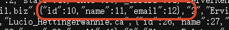

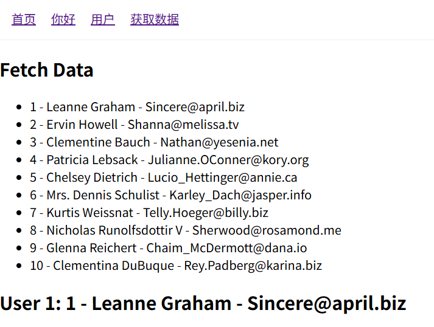

**refresh 函数**

```js
const {data , refresh: refreshUserList} = await useFetch<User[]>('/api/users')
const {data: user, refresh: refreshUser} = await useFetch<User>('/api/users/1')
// 当点击“刷新”按钮时调用 refresh()
const refreshHandle = () => {
    data.value = []
    user.value = {} as User
    refreshUserList()
    refreshUser()
}
```


### useLazyFetch

> 如果你有一个页面数据量很大（比如复杂的报表），接口可能需要 2 秒才能返回。用 `await useFetch` 用户点击后，页面卡住 2 秒没反应，用户以为点错了。

`useLazyFetch` 则打破了这种阻塞。`useLazyFetch` 是 `useFetch` 的一个变体，它的核心逻辑只有一句话：**“先跳页面，再加载数据。”**

`useLazyFetch` 等价于 `useFetch(url, { lazy: true })`。

```js
const { pending, data: posts } = useLazyFetch('/api/user/await')
```

注意：

使用 `useLazyFetch` 时，你必须处理“数据不存在” 的状态。

1. 处理空数据：因为组件是立即渲染的，此时 `data.value` 为 `null`。如果你在模板里直接访问 `data.user.name` 而不加 `v-if` 或可选链（`?.`），页面会直接报错挂掉。
2. Watch 监听：如果你需要根据获取到的数据做进一步处理，通常需要配合 `watch` 来监听 `data` 的变化，因为在 `setup` 执行的那一刻，数据还没回来。

```js
const { data } = useLazyFetch('/api/user/await')

// ❌ 这样做拿不到数据
console.log(data.value) 

// ✅ 这样做才能在数据回来时处理
watch(data, (newData) => {
  if (newData) {
    console.log('数据到货了：', newData)
  }
})
```

如果你需要这个请求在 csr 阶段，可以加一个 `server:false`，此时 SEO  效果变差。

```js
const {data, pending, status, error, refresh} =  useLazyFetch<userType>("/api/user/await", {
   server: false,
})
```

### useAsyncData

`useAsyncData` 是一个底层的数据获取工具。它不限制你获取数据的方式，你可以用它包裹任何返回 Promise 的逻辑（比如数据库查询、调用第三方 SDK 或甚至是定时器）。一般用它处理复杂的聚合逻辑

如果你需要在一个 Hook 里完成多个操作，比如：

1. 先从 API A 获取 ID。
2. 再用 ID 去 API B 获取详情。
3. 最后返回合并后的结果。

```js
const {data, pending, error, refresh } = await useAsyncData('composite-data', async () => {
    const user = await $fetch<User>('/api/users/2')
    const posts = await $fetch<Post[]>('/api/posts', {
        query: {
            userId: user.id
        }
    })
    return {user, posts}
})
```

### $fetch

简单来说，只要这个请求不是为了在页面一打开时就把内容渲染出来，而是为了响应某个动作，那就该 `$fetch` 上场了。

用法类似 axios，我们可以把它的使用场景归纳为“非页面初始化”的所有情况。

```js
interface User {
    id: number
    name: string
    email: string
}
const getUserList =  async ()=> await $fetch<User[]>('/api/users',{
    method: 'get'
})
const data = await getUserList()
```

### $fetch 文件上传和下载

$fetch 是基于 ofetch 构建的，它非常智能。处理文件上传时，它会自动识别 FormData 并设置正确的 Content-Type；处理下载时，则需要结合二进制流处理。

文件上传

```js
const handleFileChange = async (e: Event) => {
    const target = e.target as HTMLInputElement
    const file = target.files?.[0] as File
    if (!file) {
        return
    }
    const form = new FormData()
    form.append('file', file)
    form.append('title', file.name)
    const res = await $fetch('/api/upload',{
        method: 'post',
        body: form
    })
}
```

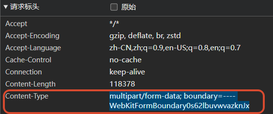

文件下载

```js
const handleFileDownload = async () => {
    try {
        // 1. 请求时指定 responseType 为 'blob'
        const res = await $fetch<Blob>('/api/avatar.jpg',{
            method: 'get',
            responseType: 'blob'
        })
        // 2. 创建一个临时的 URL 对象
        const url = window.URL.createObjectURL(res)
        const link = document.createElement('a')
        link.href = url
        
        // 3. 设置文件名
        link.setAttribute('download', `avatar.jpg`)
        document.body.appendChild(link)
        
        // 4. 模拟点击并移除
        link.click()
        document.body.removeChild(link)
        window.URL.revokeObjectURL(url) // 释放内存
    } catch (err) {
        alert('下载失败')
    }
}
```

### 获取原始响应 onResponse

```js
const res = await useFetch<User[]>('/api/users', {
    method: 'get',
    onResponse: (ores) => {
        console.log(ores)
    }
})
console.log(res)
const data = res.data.value
```

> `$fetch` 也是一样的用法

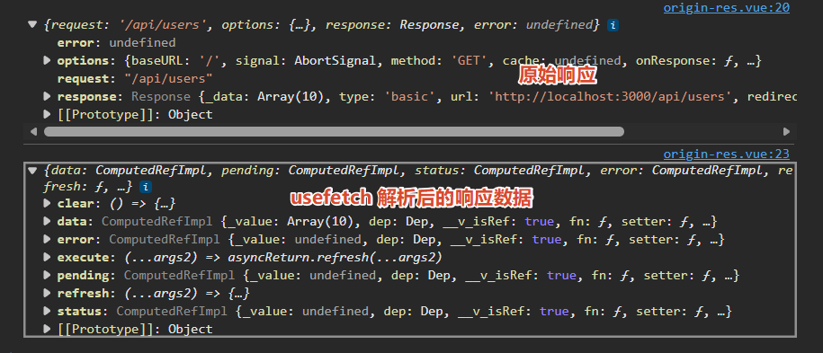

## 状态管理

在简单的应用中，我们可以通过组件之间的“传参”来传递数据。但随着应用变大，会出现以下痛点：

- “套娃”传参（Prop Drilling）： 爷爷组件的数据要传给孙子，必须经过爸爸组件，即使爸爸根本不需要这份数据。
- 跨页面同步： 用户在“设置页”改了头像，返回“首页”时，头像得立即更新。
- SSR（服务端渲染）的特殊性：数据脱水与注水。服务器算好了数据（脱水），得原封不动传给浏览器（注水）。如果没有统一的状态管理，浏览器会重新计算，导致页面闪烁（水合错误）。
- 内存隔离： 传统的全局变量在服务器上是“共享”的。如果不使用 Nuxt 提供的状态工具，A 用户的信息可能会被 B 用户看到。

### useState 介绍

`useState` 是 Nuxt 专门为 SSR（服务端渲染） 环境设计的响应式状态管理钩子。

- 它能干什么？
  - 在服务器和浏览器之间共享状态。
  - 防止状态污染：确保每个用户的请求都有独立的状态，不会把 A 用户的登录信息发给 B 用户。
  - 解决水合不匹配 (Hydration Mismatch)：确保服务器生成的 HTML 和浏览器渲染的结果完全一致，避免页面闪烁或报错。
- 适用场景：
  - 跨组件同步简单的数据（如：用户头像、弹窗开关、当前主题）。
  - 替代普通的 `ref()`，处理那些在 SSR 阶段就需要确定的随机数或时间戳。

### 水合不匹配问题

`app\pages\state\hydration.vue`

```vue
<template lang="">
    <div>
        <h1>水合不匹配</h1>
        <p>当前计数: {{ num }}</p>
    </div>
</template>
<script setup lang="ts">
const num = ref(Math.random() * 100)
</script>
<style lang="">
    
</style>
```

效果&原因：

1. 服务器端：运行 `Math.random()` 得到了 `0.123`，生成的 HTML 源码是 `<h2>0.123</h2>`。
2. 浏览器端：代码下载后重新运行，`Math.random()` 变成了 `0.456`。
3. 水合冲突：浏览器发现 HTML 里的文字是 `0.123`，但内存里的响应式数据是 `0.456`。


### useState 用法

```js
const state = useState<T>(key: string, init?: () => T | Ref<T>): Ref<T>
```

- key 是唯一标识符。Nuxt 靠这个 Key 来确保服务器的数据能精准地“投喂”给客户端对应的变量。如果 Key 重复，不同组件会共享同一个状态。
- init 是可选的，表示初始化函数。仅在状态尚未创建时执行。它必须返回一个初始值。
  - `init` 函数只在“第一次”被需要时运行。
  - 如果服务器已经运行过 `init` 并把值传给了浏览器，浏览器在执行同一行代码时，会直接跳过 `init` 函数，直接从 NUXT_DATA 里拿值。

初始化+获取

```js
const num = useState('randomNumber', () => Math.random() * 100)
```

仅获取

```js
const num = useState('randomNumber')
```

带泛型（显式定义类型）

```js
interface User {
    name: string
    age: number
}
const user = useState<User>('user', () => ({
        name: '张三',
        age: 18
    })
)
```

### useState 共享

单组件共享和跨组件共享

效果

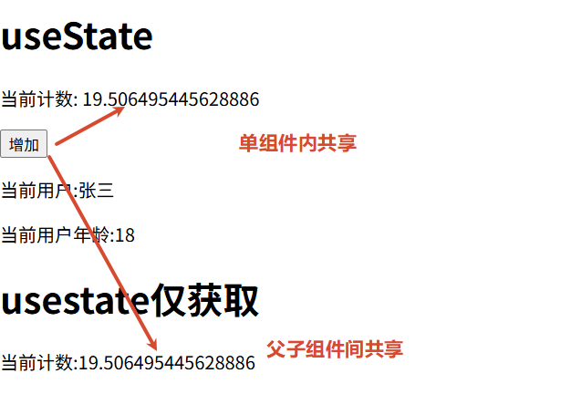

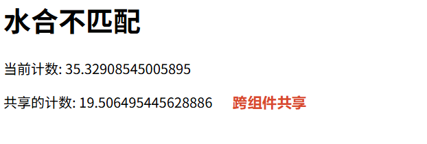

定义全局的状态文件

`app/composables/useState.ts`

```js
// 定义一个全局的用户状态
export const useUser = () => useState('user', () => ({
  nickname: '枫枫',
  isLogin: false
}))
```

在任意组件中使用

```js
const user = useUser() // 自动导入，无需 import
```


### 扩展——Pinia

当你的项目很复杂时，`useState` 的管理成本会变高，这时我们需要 Pinia。

直接使用原生 Pinia 在 Nuxt 中会导致单例模式下的内存泄漏和状态污染。`@pinia/nuxt` 模块会自动为每个 SSR 请求创建独立的 Store 实例。

约定大于配置：`stores/` 下的 pinia store 逻辑文件会自动导入

安装依赖

```bash
npm install @pinia/nuxt
```

注册模块 `nuxt.config.ts`

```js
export default defineNuxtConfig({
  modules: ['@pinia/nuxt'],
})
```

使用

```vue
<template>
    <div>
        <h1>pinia</h1>
        <div>userInfo: {{ authStore.userInfo }}</div>
        <div>getter name: {{ authStore.name }}</div>
        <div>method fetchUser:<button @click="getUser">获取用户信息</button></div>
    </div>
</template>
<script setup lang="ts">
const authStore = useAuthStore()
const getUser = async () => {
    const data = await authStore.fetchUser()
    console.log(data)
}
</script>
<style lang="">
    
</style>
```

### 扩展——useCookie

`useCookie` 是 Nuxt 提供的 SSR 友好的 Cookie 管理工具。

- 它能干什么？
  - 在浏览器和服务器之间同步 Cookie。
  - 持久化存储：即使用户刷新页面或关闭浏览器，数据依然存在。
  - SSR 安全：在服务器端（Server Side）渲染时，它能自动读取请求头里的 Cookie；在客户端（Client Side）又能通过 JS 读写。
- 使用场景：
  - 存储用户的 Token（登录凭证）。
  - 存储用户的个性化配置（如：语言设置、深色/浅色模式、侧边栏折叠状态）。

**基础读写**

`app/pages/usestate/cookie.vue`

```vue
<template>
    <div>
        <h1>计数器（刷新不重置）：{{ counter }}</h1>
        <button @click="incre">+1</button>
        <button @click="counter = 0">重置</button>
    </div>
</template>
<script setup lang="ts">
const counter = useCookie('counter', { default: () => 0 })
const incre = () => {
    counter.value++
}
</script>
<style lang="">
    
</style>
```

效果：

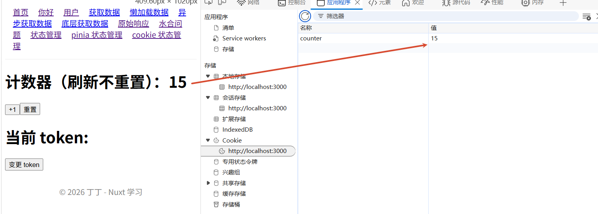

**与 useState 联动**

`app/composables/cookie.ts`

```js
// app/composables/useAuth.ts
export const useToken = () => {
  // 1. 定义一个 cookie
  const tokenCookie = useCookie('auth-token', {
    maxAge: 60 * 60 * 24 * 7, // 设置有效期 7 天
    path: '/'
  })

  // 2. 用 useState 包装，确保全应用响应式同步
  const token = useState('token', () => tokenCookie.value)

  // 3. 监听 token 变化，自动同步回 cookie
  watch(token, (newToken) => {
    tokenCookie.value = newToken
  })

  return token
}
```

监听 usestate token 的变化 ，更新到 cookie token 中

```vue
<template>
    <div>
        <div>
            <h1>当前 token: {{ token }}</h1>
            <button @click="token = 'new-token'">变更 token</button>
        </div>
    </div>
</template>
<script setup lang="ts">
const token = useToken()
</script>
<style lang="">
    
</style>
```

**useCookie 的配置项**

| **配置项** | **作用**              | **推荐值**                                                   |
| ---------- | --------------------- | ------------------------------------------------------------ |
| `maxAge`   | Cookie 有效期（秒）   | `60 * 60 * 24 * 7` (一周)                                    |
| `expires`  | 到期具体时间          | Date 对象                                                    |
| `httpOnly` | 是否禁止 JS 访问      | 存储 Token 时建议后端设置，前端 `useCookie` 无法直接设置 true |
| `secure`   | 是否仅在 HTTPS 下传输 | 生产环境建议为 `true`                                         |
| `watch`    | 自动监听并同步状态    | 默认为 `true` 或 `'shallow'`                                    |

### 状态管理总结

在 Nuxt 开发中，我们通常根据复杂程度选择不同的管理方式：

| **层次**         | **技术工具**         | **使用场景**                                                 |
| ---------------- | -------------------- | ------------------------------------------------------------ |
| **局部状态**     | `ref()`/`reactive()` | 仅在单个 `.vue` 文件内部使用（如：输入框内容）。              |
| **简单全局状态** | `useState()`         | 跨页面/组件共享，且需要兼容 SSR（如：当前用户信息、主题开关）。 |
| **复杂全局状态** | Pinia                | 大型项目、有复杂的异步逻辑、需要 DevTools 调试（如：购物车系统、权限控制）。 |
| **持久化状态**   | `useCookie()`        | 刷新页面或关闭浏览器后仍需保留的数据（如：登录 Token）。     |

## 中间件

它的主要任务是：在进入页面之前执行代码。

常见的应用场景包括：

- 权限验证：检查用户是否登录，没登录就踢回登录页。
- 路由守卫：比如 VIP 视频页面，非会员禁止进入。
- 埋点统计：记录用户从哪个页面跳到了哪个页面。
- 动态重定向：比如根据用户的语言偏好，自动跳转到/zh 或/en。

uxt 提供了三种灵活的配置方式：

| 类型          | 文件位置                 | 影响范围                   | 场景举例                   |
| ------------- | ------------------------ | -------------------------- | -------------------------- |
| 全局 (Global) | `middleware/*.global.ts` | **所有** 页面跳转都会触发   | 统计所有页面的访问量       |
| 命名 (Named)  | `middleware/auth.ts`     | 只有 **指定** 的页面才会触发 | 仅在“个人中心”开启登录检查 |
| 匿名 (Inline) | 写在 `pages/*.vue` 里     | 仅该 **当前** 页面有效       | 某个特定页面的临时逻辑     |

生命周期：中间件作用于 **路由匹配之后，渲染页面之前**。

- 首次访问（SSR）：你在浏览器输入网址回车，中间件在服务器上运行。
- 后续跳转（SPA）：你在页面点击 `<NuxtLink>`，中间件在浏览器中运行。

命名大于配置：全局中间件的名称必须包含 "global"

### 命名中间件

`app/middleware/auth.ts`

```ts
export default defineNuxtRouteMiddleware((to, from) => {
  console.log("中间件 auth.ts 执行了", to,from)
})
```

在需要保护的页面里配置

```vue
<script setup>
definePageMeta({
  middleware: 'auth' // 告诉 Nuxt：进这个页面前，先让 auth 保安查一下
})
</script>
```

### 全局中间件

注意名字要包含 global

`app/middleware/auth.global.ts`

```ts
export default defineNuxtRouteMiddleware((to, from) => {
  const token = useToken();
  const isLoggedIn = token.value !== undefined && token.value !== '' // 模拟登录状态获取逻辑

  //如果要去管理页且没登录
  if (to.path.startsWith('/admin') && !isLoggedIn) {
    // 强制跳转到登录页
    return navigateTo('/login')
  }
})
```

全局生效，页面无需单独配置

`app\pages\login.vue`

```vue
<template lang="">
    <div>
        <h1>登录页</h1>
        <p>请登录以继续</p>
        <button @click="loginHandle">登录</button>
    </div>
</template>
<script setup lang="ts">
const token = useToken()
const loginHandle = () => {
    token.value = 'new-token'
    navigateTo('/admin')
    alert('登录成功')
}
</script>
<style lang="">
    
</style>
```

`app\pages\admin.vue`

```vue
<template lang="">
    <div>
        <h1>管理员页</h1>
        <p>欢迎来到管理员页</p>
        <button @click="logoutHandle">登出</button>
    </div>
</template>
<script setup lang="ts">
const token = useToken();
const logoutHandle = () => {
    token.value = undefined
    navigateTo('/login')
    alert('登出成功')
}
definePageMeta({
    middleware: ['auth']
})
</script>
<style lang="">
    
</style>
```

### 匿名中间件

中间件逻辑只在这一特定页面有用，且永远不会被其他页面复用。

逻辑与该页面的业务紧密相关，放在一起更方便维护。

```vue
<script setup>
definePageMeta({
  // 这里的匿名函数就是一个中间件
  middleware: [
    function (to, from) {
      const config = useRuntimeConfig()
      const isEventEnded = true // 假设这是从某处获取的逻辑

      if (isEventEnded) {
        // 如果活动结束，禁止进入该页面，直接回首页
        console.log('匿名中间件拦截：活动已结束')
        return navigateTo('/')
      }
    },
    // 你甚至可以同时混合使用“命名中间件”
    'auth' 
  ]
})
</script>

<template>
  <div>
    <h1>超级限时活动页</h1>
  </div>
</template>
```

## 常见组件

### NuxtLoadingIndicator 进度条组件

可以在路由切换的时候，在顶部显示进度条。

`app/app.vue`

```vue
<NuxtLoadingIndicator color="#348feb" :height="3" />
```

### NuxtLink 链接组件

在 Nuxt 中，我们几乎永远只用 `<NuxtLink>`，来代替  Vue SPA 工程的 `RouterLink`。

| 特性                       | RouterLink (Vue Router)           | NuxtLink (Nuxt 4)                                            |
| -------------------------- | --------------------------------- | ------------------------------------------------------------ |
| 基础功能                   | 实现应用内跳转，不刷新页面。      | 包含所有 RouterLink 功能，并做了增强。                       |
| 智能 **预取** (Prefetching) | 默认不开启。                      | 核心卖点： 当链接进入视图窗口时，Nuxt 会自动预加载该页面的 JS 资源。 |
| 外部链接处理               | 不支持直接跳转外部（需用 `<a>`）。 | 全能：自动识别。如果是 `http` 开头，自动转为 `<a>` 并处理安全属性。 |
| 加载状态响应               | 无。                              | 支持 `activeClass` 且能配合 `pending` 状态做加载动画。          |

### NuxtImg 图片优化组件

虽然它属于 `@nuxt/image` 模块（通常需要额外安装），但它几乎是 Nuxt 开发的标配。它能自动实现：

- 响应式尺寸： 根据设备自动调整图片大小。
- 格式转换：自动把 PNG/JPG 转成更小的 WebP。
- 懒加载：自动开启 `loading="lazy"`。

安装依赖

```bash
npx nuxt module add @nuxt/image
# 或者
npm install @nuxt/image  
# 下面这种需要在nuxt.config.ts中启用
```

配置模块

`nuxt.config.ts`

```ts
export default defineNuxtConfig({
  modules: ['@nuxt/image'],
  image: {
    domains: ['pic.rmb.bdstatic.com'] // 必须授权，IPX 才会介入处理
  }
})
```

基础布局参数：控制图片在页面上的“长相”和基本属性。

- `src`: 图片路径。可以是 `public/` 下的本地路径，也可以是远程 URL。
- `width/height`: 设置图片的显示尺寸。
  - 提示：设置宽高可以防止累积布局偏移 (CLS)，让 SEO 分数更高。
- `alt`: 图片描述。SEO 必填项，方便搜索引擎理解图片内容。
- `sizes`: 响应式尺寸。
  - 例如：`sizes="sm:100vw md:50vw lg:400px"`。意为：手机端全屏宽，平板端半屏宽，电脑端固定 400px。

转换与优化参数：决定了图片在传输过程中的“体积”。

- `format`: 强制转换格式。
  - 可选值：`webp`, `avif`, `png`, `jpg` 等。强烈建议设为 `webp`。
- `quality`: 图片质量（1-100）。
  - 默认通常是 80，这在肉眼无损的情况下能极大地压缩体积。
- `fit`: 缩放模式。
  - 当给定的宽高比例与原图不符时，控制如何裁剪。常用：`cover`（铺满）, `contain`（缩放以完整显示）。

加载策略参数：直接关系到用户体验和加载性能。

- `loading`: 加载方式。
  - `lazy`(默认): 进入视口再加载。
  - `eager`: 立即加载。用于首屏大图。
- `preload`: 布尔值。
  - 设为 `true` 会在 HTML 头部插入预加载指令，适合文章首图。
- `placeholder`: 布尔值或路径。
  - 设为 `true` 会自动生成一个极小的模糊预览图。
- `nonce`: 用于内容安全策略（CSP）。

## 服务端 API

NuxtJS，不仅可以写前端，还能直接写后端接口。

所有的后端代码都存放在根目录的 `server/` 文件夹中。

约定大于配置：Nuxt 会自动扫描 `server/` 目录下的文件并生成对应的 API 路由：

| 目录                               | 描述                                     | 访问路径                 |
| ---------------------------------- | ---------------------------------------- | ------------------------ |
| `server/api/` 或 `server/routes/api` | 放置 API 接口文件                        | `localhost:3000/api/xxx` |
| `server/routes/`                   | 放置普通路由文件（不带 /api 前缀）       | `localhost:3000/xxx`     |
| `server/middleware/`               | 服务端中间件（注意：这和前端中间件不同） | 每次服务端请求都会       |

### API 文件

`server/api/hello.ts`

```ts
export default defineEventHandler((event) => {
  // event 包含了请求的所有信息（headers, context, etc.）
  return {
    message: 'Hello from Nuxt Server!',
    time: new Date().toISOString()
  }
})
```

**文件夹嵌套的情况**

```
server/
└── api/
    └── v1/
        ├── users.ts        // 访问路径: /api/v1/users
        └── products/
            └── list.ts     // 访问路径: /api/v1/products/list
```

**动态路由参数**

嵌套中经常配合中括号使用，用来捕获 URL 中的动态片段。

单参数：`server/api/user/[id].ts` → 访问 `/api/user/123`

```ts
export default defineEventHandler((event) => {
  const id = getRouterParam(event, 'id') // 获取路径中的 id
  return { userId: id }
})
```

全匹配：`server/api/cms/[...slug].ts` → 访问 `/api/cms/a/b/c`

```ts
export default defineEventHandler((event) => {
  const slug = getRouterParam(event, 'slug') // 结果为 "a/b/c"
  return { path: slug }
})
```

**获取请求参数**

`server/api/user.ts`

```ts
export default defineEventHandler((event) => {
  const query = getQuery(event) // 自动解析 ?id=123&name=tom
  return { id: query.id }
})
```

`server/api/login.post.ts` 

```ts
export default defineEventHandler(async (event) => {
  const body = await readBody(event) // 获取 JSON body
  return { status: 'success', data: body }
})
```

**不同的请求方式**

Nuxt 通过文件名后缀来区分不同的 HTTP 动词。如果不写后缀，默认匹配所有方式（GET, POST, PUT, DELETE 等）。

> Nuxt 文件名后缀中请保持小写

```ts
// server/api/order.get.ts
export default defineEventHandler(() => "查询订单列表")

// server/api/order.post.ts
export default defineEventHandler(() => "创建新订单")
```

### 响应流与 Server-Sent Events (SSE)

如果你要做 AI 聊天机器人（流式输出），Nuxt 的 API 是支持发送流的。

```ts
// server/api/chat.post.ts
export default defineEventHandler(async (event) => {
  // 1. 设置响应头，告诉浏览器这是一个 SSE 流
  setResponseHeaders(event, {
    'Content-Type': 'text/event-stream',
    'Cache-Control': 'no-cache',
    'Connection': 'keep-alive',
  })

  const responseText = "你好！我是 Nuxt 机器人。我可以实现流式输出，就像真的 AI 一样。有什么我可以帮你的吗？"
  const words = responseText.split('')

  // 2. 获取底层的 Node.js 响应对象
  const res = event.node.res

  // 3. 模拟流式发送
  for (const word of words) {
    // SSE 格式要求以 "data: " 开头，以 "\n\n" 结尾
    res.write(`data: ${JSON.stringify({ message: word })}\n\n`)
    
    // 模拟异步延迟
    await new Promise(resolve => setTimeout(resolve, 100))
  }

  // 4. 传输结束
  res.end()
})
```

在前端，我们不能简单的 `await useFetch`，因为那会等到所有数据传输完才返回。我们需要使用 `fetch` 结合 `ReadableStream`。

```vue
<template>
  <div class="p-10">
    <button @click="sendChat" class="bg-blue-500 text-white p-2 rounded">开始对话</button>
    
    <div class="mt-4 p-4 border rounded bg-gray-50 min-h-[100px]">
      <p>AI 回复：{{ aiReply }}</p>
    </div>
  </div>
</template>

<script setup lang="ts">
const aiReply = ref('')

const sendChat = async () => {
  aiReply.value = ''
  
  // 使用原生 fetch，因为 $fetch 目前对流式响应的直接支持比较复杂
  const response = await fetch('/api/chat', {
    method: 'POST',
  })

  if (!response.body) return

  // 1. 获取读取器
  const reader = response.body.getReader()
  const decoder = new TextDecoder()

  // 2. 循环读取流数据
  while (true) {
    const { done, value } = await reader.read()
    if (done) break

    // 3. 解码并解析 SSE 格式
    const chunk = decoder.decode(value)
    const lines = chunk.split('\n')
    
    for (const line of lines) {
      if (line.startsWith('data: ')) {
        const jsonStr = line.replace('data: ', '')
        try {
          const data = JSON.parse(jsonStr)
          aiReply.value += data.message // 逐字累加
        } catch (e) {
          console.error('解析错误', e)
        }
      }
    }
  }
}
</script>
```

效果：

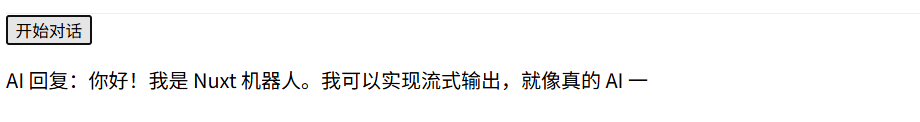

### 路由文件

`server/routes/` 目录下的文件与 `server/api/` 的写法完全一致，唯一的区别是：生成的 URL 不带 `/api` 前缀。

应用场景

- Webhooks：对接第三方平台（如 GitHub、支付回调）时，对方可能要求特定的路径，不能带 `/api`。
- RSS 订阅 / 站点地图：生成 `sitemap.xml` 或 `feed.xml`。
- 文件下载：直接提供动态生成的 PDF 或图片流。

`server/routes/health.ts`

```
export default defineEventHandler(() => {
  return "OK"; // 访问路径：http://localhost:3000/health
})
```

> 因为没有前缀，所以这里访问路径可能会和项目的静态文件地址冲突，如果冲突 `public/` 路由的优先级高于 `server/routes/` 目录。

### 服务端 api 特殊之处

- 自动映射：你不需要安装 Express 或 Koa，也不需要写 `router.get(...)`。文件名就是路由名。
  - `server/api/test.ts` → `/api/test``
  - ``server/api/auth/[...].ts` →`/api/auth/*` (全匹配路由)
- 类型安全：如果你在前端使用 `useFetch('/api/hello')`，Nuxt 会自动推断出返回值的类型。这就是所谓的 Full-stack Type Safety。
  - Nuxt 基于其背后的服务器引擎 Nitro，在开发环境下会自动生成 `.nuxt/types/nitro.ts` 等类型定义文件。
  - 当你定义一个 `server/api` 路由时，Nuxt 会通过静态分析提取 `defineEventHandler` 返回值的类型。前端的 `useFetch` 或 `$fetch` 是泛型函数，它们会自动寻找并匹配对应的路径类型。
- 运行时环境：代码运行在 Nitro 引擎上。这意味着它们不仅可以跑在 Node.js 环境，还可以无缝部署到 Cloudflare Workers、Vercel Edge 等边缘计算平台。

### 服务端中间件

这和我们之前讲的页面中间件（Route Middleware）完全不同。

- 位置：`server/middleware/log.ts`
- 作用：拦截所有发往服务器的请求（包括静态资源、API 请求）。
- 场景：打日志、给所有请求添加自定义 Header、处理跨域。

`server/middleware/log.ts`

```ts
export default defineEventHandler((event) => {
  console.log('新请求来了: ' + getRequestURL(event))
})
```

Nuxt 是根据 `server/middleware/` 目录下的文件名字母顺序来决定谁先运行的。

- `01.auth.ts` 会比 `02.log.ts` 先执行。
- 建议在文件名前加数字前缀，明确控制拦截流。

**event.context（跨文件传值）**

```ts
// server/middleware/auth.ts
export default defineEventHandler((event) => {
  const user = { id: 123, name: 'admin' } // 假设这是从 Token 解出的用户信息
  event.context.user = user // 把用户信息挂载到上下文
})

// server/api/me.ts
export default defineEventHandler((event) => {
  // 在后续的 API 里直接拿，不用重复校验 Token
  return { currentUser: event.context.user }
})
```

**utils 工具**

Nuxt 会自动扫描 `server/utils/` 目录并 **自动导入** 其中的函数。

`server/utils/db.ts`

```ts
export const formatUser = (user: any) => ({ ...user, formatted: true })
```

在任何 `server/api/*.ts` 中直接使用 `formatUser()`，无需 `import`。

> 如果不同文件里面有相同的函数，nuxt 会采用后发先至的原则，不过最好在创建之前就避免这个问题，或者使用显式导入，或者使用命名空间

命名空间

```ts
// server/utils/user.ts
export const UserUtils = {
  format: (user: any) => ({ ...user, type: 'user' })
}

// server/utils/admin.ts
export const AdminUtils = {
  format: (admin: any) => ({ ...admin, type: 'admin' })
}
```

显式导入

```ts
// server/api/test.ts
import { formatUser as formatMember } from '../utils/member'
import { formatUser as formatGuest } from '../utils/guest'

export default defineEventHandler(() => {
  // 这里可以安全地使用别名
})
```

## 运行时配置

“运行时配置”是 Nuxt 的核心特性之一，它允许你在不重新构建代码的情况下，通过环境变量动态改变应用的行为（比如在开发环境用本地数据库，在生产环境用云端 API）。

### 配置运行时变量

`nuxt.config.ts`

```ts
export default defineNuxtConfig({
  runtimeConfig: {
    // 1. 私密配置：仅在服务端（Node.js）可用
    apiSecret: '12345', 

    // 2. 公开配置：服务端和客户端（浏览器）均可用
    public: {
      apiBase: 'https://www.fengfengzhidao.com',
      siteName: '枫枫知道'
    }
  }
})
```

- runtimeConfig (顶层)：仅服务端，例如数据库密码、支付密钥、私有 Token
- public(子项)：服务端 + 客户端，例如 API 根地址、公开的 CDN 路径、SEO 信息

### 获取运行时变量

`app/pages/env.vue`

```vue
<template>
    <div>
        <h1>Env</h1>
        <p>{{ config }}</p>
        <p>{{ data.config }}</p>
    </div>
</template>

<script setup lang="ts">
const config = useRuntimeConfig()
const {data} = await useFetch('/api/env')
</script>

<style scoped>

</style>
```

`server/api/env.ts`

```ts
export default defineEventHandler((event) => {
    const config = useRuntimeConfig(event)
  return {
    message: 'Config from Server!',
    config: config
  }
})
```

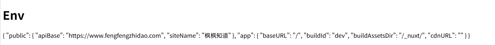

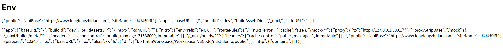

### 变量覆盖优先级

当同一个配置项在多个地方出现时，Nuxt 会按照以下顺序进行覆盖（数字越大，优先级越高）：

- 默认值：在 nuxt.config.ts 的 runtimeConfig 中定义的初始值。
- .env 文件：项目根目录下的.env 文件（在 dev 模式或手动加载时有效）。
- 系统环境变量：直接在 Linux 终端通过 export 定义，或在 Docker 启动脚本中传入的变量。
- 命令行注入：启动命令前的临时赋值（如 NUXT_API_KEY = xxx node ...）。

### .env 文件的自动加载

在开发环境下（nuxt dev），你不需要手动在终端输入命令。Nuxt 会自动读取根目录下的.env 文件。

- 命名约定：必须以 NUXT_ 开头。
- 优先级：环境变量 >.env 文件 > nuxt.config.ts 中的默认值。

`.env`

```properties
NUXT_API_SECRET=super_secret_key
NUXT_PUBLIC_API_BASE=https://staging-api.example.com
```

### 读取指定的.env 文件

Nuxt 的底层引擎 Nitro 支持通过命令行指定读取哪个 `.env` 文件。

```bash
nuxi dev # 默认读取.env
nuxi dev --dotenv .env.staging # 指定读取 .env.staging
```

修改 package.json 根据环境读取不同的 `.env` 文件

```json
{
  "scripts": {
    "dev": "nuxi dev", 
    "dev:staging": "nuxi dev --dotenv .env.staging",
    "build:staging": "nuxi build --dotenv .env.staging",
    "preview:staging": "nuxi preview --dotenv .env.staging"
  }
}
```

### 环境变量的自动覆盖

Nuxt 允许你使用以 `NUXT_` 开头的环境变量来自动覆盖 `.env` 和 `nuxt.config.ts` 中的值。

映射规则：

- 私密配置：`NUXT_API_SECRET` 对应 `apiSecret`
- 公开配置：`NUXT_PUBLIC_API_BASE` 对应 `public.apiBase`（层级用下划线隔开）

```bash
# 在 Linux 或 Docker 启动时
NUXT_PUBLIC_API_BASE=https://prod-api.com 
# windows的cmd设置环境变量，只针对当前终端生效
set NUXT_PUBLIC_API_BASE=https://prod-api.com 
node .output/server/index.mjs
```

好处：在服务器上直接修改环境变量，不需要为了修改一个 API 地址而重新执行 npm run build

## 项目部署

部署 Nuxt 项目是其作为“全栈框架”展现威力的时刻。由于 Nuxt 4 底层使用 Nitro 引擎，它的部署非常灵活：你可以把它部署成一个需要 Node.js 环境的 SSR（服务端渲染）应用，也可以将其完全静态化导出。

在部署前，你得先决定你的项目怎么运行：

| 模式             | 命令               | 产物                      | 适用场景                                             |
| ---------------- | ------------------ | ------------------------- | ---------------------------------------------------- |
| SSR (服务端渲染) | `npm run build`    | `.output/` (Node.js 运行) | 动态内容多、SEO 要求极高、有后端 API 逻辑。          |
| SSG (静态生成)   | `npm run generate` | `dist/` (纯静态文件)      | 博客、文档、内容不常变动的官网。可以托管在任何 CDN。 |

### SSR 模式部署

这是最能发挥 Nuxt 后端接口（server/api）能力的模式。

第一步：构建

```bash
npm run build
```

执行完后，你会得到一个 `.output` 文件夹。这个文件夹是独立的，它包含了运行应用所需的所有代码（包括 Nitro 引擎和依赖），你甚至不需要在服务器上重新 `npm install`。

第二步：启动服务

将 `.output` 文件夹上传到服务器，执行：

```bash
# 使用 Node 运行入口文件
node .output/server/index.mjs
```

第三步：使用 PM2 进行进程管理

在生产环境中，直接用 node 命令不安全（挂了不会自动重启）。建议使用 PM2：

```js
# ecosystem.config.js
module.exports = {
  apps: [
    {
      name: 'MyNuxtApp',
      port: '3000',
      exec_mode: 'cluster', // 开启集群模式，利用多核 CPU
      instances: 'max',
      script: './.output/server/index.mjs'
    }
  ]
}
```

启动：`pm2 start ecosystem.config.js`

第四步：反向代理，用 Nginx 在客户端和应用之间加上一层

```nginx
server {
    listen 80;
    server_name yourdomain.com;

    location / {
        proxy_pass http://localhost:3000; # 转发到 Nuxt 运行端口
        proxy_http_version 1.1;
        proxy_set_header Upgrade $http_upgrade;
        proxy_set_header Connection 'upgrade';
        proxy_set_header Host $host;
        proxy_cache_bypass $http_upgrade;
    }
}
```

可选：通过 docker 容器运行

```bash
docker pull node:24-slim

docker run -itd --name node -v /opt/nuxt-study/:/app -p 3000:3000 node:24-slim   bash
docker run -itd --name node -v /opt/nuxt-study/:/app  -p 3000:3000 node:24-slim  node /app/.output/server/index.mjs
```

> 或使用 Dockerfile 构建镜像再运行

### SSG 模式部署

在 SSG 模式下，Nuxt 会在构建时访问所有路由，并将其转换为纯 HTML、CSS 和 JS 文件。

这意味着你不需要 Node.js 运行时，和之前部署前端项目一样

```bash
npm run generate
```

生成过程：

1. 预渲染 (Prerendering)：Nuxt 会启动一个临时的 Nitro 服务，爬取你项目中的所有路由。
2. 生成文件：它会将每个页面生成对应的`.html` 文件，并将资源（JS/CSS）放入特定的目录。
3. 产物位置：生成的静态文件全部存放在项目根目录下的`.output/public`文件夹中（在某些旧版本或配置下也可能指向`dist/`，但 Nuxt 4/Nitro 统一建议查看`.output/public`）。

> 如果项目里面有动态路由，就不要用ssg部署了，用ssr部署

**Nginx 部署**

把`.output/public`文件夹里的所有内容上传到服务器的某个目录（例如`/var/www/my-nuxt-site`），然后配置 Nginx。

```nginx
server {
    listen 80;
    server_name yourdomain.com;

    root /var/www/my-nuxt-site; # 你存放静态文件的路径
    index index.html;

    location / {
        # 核心配置：尝试寻找文件，如果找不到则返回 404
        # 或者是单页面应用(SPA)模式下指向 index.html
        try_files $uri $uri/ /index.html;
    }

    # 可选：设置静态资源缓存
    location ~* \.(js|css|png|jpg|jpeg|gif|ico|svg)$ {
        expires 30d;
        add_header Cache-Control "public, no-transform";
    }
}
```

**docker 部署**

```bash
docker pull nginx:alpine
# 假设你的项目在 /opt/nuxt-study
docker run -itd --name nuxt-ssg -p 80:80 -v /opt/nuxt-study/.output/public:/usr/share/nginx/html nginx:alpine
```


## 混合架构

虽然 Nuxt 理论上可以处理一切，但“全栈 Nuxt”并不一定是所有场景的最优解

我们可以把前台页面需要seo的部分使用nuxtjs去编写，利好seo，而后台那些本身不需要seo的还是使用原来的spa单页面开发

前台门户：为什么要用 Nuxt？

- **SEO（搜索引擎优化）**：这是 Nuxt 的看家本领。Google 或百度能直接抓取到你渲染好的 HTML 内容。
- **首屏渲染 (FCP)**：用户点开链接，HTML 瞬间呈现，不需要像纯 Vue 项目那样等一大堆 JS 加载完再白屏渲染，体验极佳。
- **社交分享**：当链接分享到微信、Twitter 等平台时，Nuxt 能生成精美的卡片预览。

后台管理：为什么建议用纯 Vue/React (SPA)？

- **SEO 无关**：后台通常需要登录才能进入，搜索引擎爬虫根本进不去，SSR 毫无意义。
- **开发负担小**：SSR 环境下需要处理“水合”问题、Cookie 转发问题、服务器端没有`window` 的报错问题。在不需要 SEO 的后台，直接用纯 Vue 写，代码逻辑更简单。
- **减轻服务器压力**：后台操作频繁，如果每次点击都让服务器渲染一遍页面，会浪费昂贵的服务器 CPU 资源。纯客户端渲染直接消耗用户的浏览器资源。

### 部署方案

当你采用“混合模式”时，通常会通过Nginx 来做流量的分流：

| 访问路径            | 映射目标         | 技术栈                       |
| ------------------- | ---------------- | ---------------------------- |
| `example.com/`      | Nuxt 运行地址    | Nuxt 4 (SSR)                 |
| `example.com/admin` | 后台静态资源目录 | 纯 Vue/Vite (SPA)            |
| `example.com/api`   | 后端真实 API     | Java / Python / Go / Node.js |

# 参考资料

[Vue 开发者为什么要学 Nuxt？从 SSR 到 SEO 做一个完整项目_哔哩哔哩_bilibili](https://www.bilibili.com/video/BV19odDBrEmj)