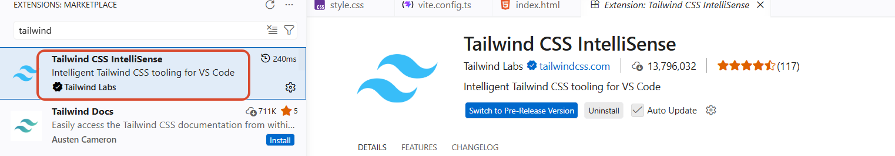
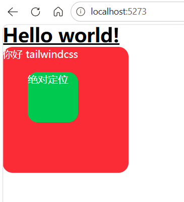
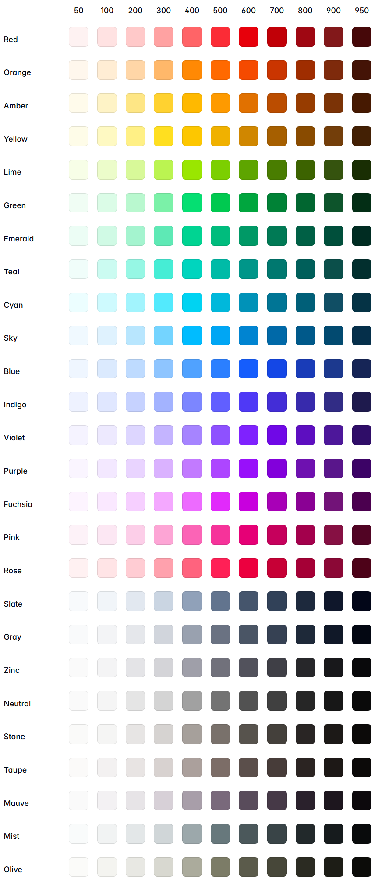

# 为什么选择 Tailwind CSS

## 主流的样式实现方案

### 原生 CSS

- 手写 CSS：这是最直接的方式。开发者手动编写 `.css` 文件，并通过 `<link>` 标签引入。
  - 痛点：随着项目变大，类名容易冲突、代码冗余、缺乏逻辑、难以维护
-  预处理器（Sass/Less）：引了变量、嵌套、混(Mixin)、继承等编程概念，增强了 CSS 的组织性和可复用性。

  - 痛点：未从根本上解决命名和全局污染问题。
- CSS 命名规范 （BEM）：通过明确的命名约定，主要解决了 CSS 中的命名冲突和样式覆盖问题。
  - 痛点：依赖于开发者自觉性 ，且类名很长

### CSS-in-JS

在 React 等组件化框架中兴起，将样式也视为组件开始成为一种趋势，主要有 [Styled-componentsX](https://styled-components.com/) 和 [Emotion](https://emotion.sh/docs/introduction)。

- 核心思想：将 CSS 样式直接写在 JavaScript 件中，为每个组件成 **唯一的、带哈希值的类名**，从而实现“作用域化样式”，彻底解决了全局污染问题。
- 优势：
  - 组件化：样式与组件逻辑内聚，便复和维护。
  - 动态样式：可以便地基于组件的 props 或 state 动态改变样式。
- 问题：
  - 运行时开销：需要在运行时解析 JS 并生成 CSS，带来一定的性能损耗。
  - 开发负担：在 JS 和 CSS 之间切换语法，并且需要学习特定库的 API。

### Utility-First-CSS

这是一种与传统“语义化 CSS”截然不同的思路，工具类优先的 CSS 提供了一系列高度可组合的、功能单一的“原子类”（AtomicCSS/ Utility Classes)。

- 核心思想：不再为组件编写专门的 CSS 类，而是直接在 HTML 中组合这些原子类来构建样式。
- 优势：
  - 开发舒适：无需思考类名，从根本上消除了为 class 命名的烦恼。样式和结构在一起，无需切换文件，
  - 极致的性能：通过 `PurgeCSS` 等工具，在构建时扫描你的文件，只将用到的原子类打包到最终的 CSS 文件中，体积通常只有几 KB。
  - 约束与一致性：所有样式都来自预设的 design tokens(在 `tailwind.config.js` 中定义)，保证了整个项目视觉上的一致性。

## Tailwind CSS 优势

- 追求极致的开发和迭代速度
  - 尤其是需要快速原型搭建的 AI 应用
- 专注功能，而非繁琐的样式细节
  - 解放生产：将更多精力投入到复杂的前端逻辑和与 A 模型的交互上。
  - 统一的设计系统：通过一份 `tailwind.config.js` 配置文件，可以定义整个应用的色彩、间距、字体、边框等设计规范，便于构建视觉一致性的系统。
- 与现代前端组件化框架的完美契合
  - 原子类与组件化思想是极度契合。一个组件的所有依赖（逻辑、结构、样式）都清晰地体现在其文件中，这使得组件的移植、复用和删除都变得极其简单和安全。
  - 性能优势：Tailwind 通过 Tree-shaking，最终生成的 CSS 文件大小只与你用到的原子类数量有关，与组件数量无关，体积极小，加载飞快。


# Tailwind CSS 基础

## 创建项目

环境

- node 24.15.0
- npm 11.12.1

vite 创建模板项目

```
npm create vite@latest 1-basic -- --template vanilla-ts
npm install
cd 1-basic
```

`nuxt.config.ts`

```ts
import { defineConfig } from "vite";
export default defineConfig({
    plugins: [],
    server: {
        port: 5273,
    },
})
```

安装 Tailwind CSS 及 插件

```
npm install -D tailwindcss @tailwindcss/vite
```

在主样式中引入 tailwind css 样式 `src/style.css`

```
@import "tailwindcss";
```

Vite 启用插件，编译器帮助分析类名放入样式文件中

```ts
import { defineConfig } from "vite";
import tailwindcss from "@tailwindcss/vite";

export default defineConfig({
    plugins: [tailwindcss],
    server: {
        port: 5273,
    },
})
```

VScode 安装 Tailwind CSS IntelliSense 插件，进行 Tailwind 类名提示



可选：通过 prettier 进行类名排序，提升代码美观度

```
npm install -D prettier prettier-plugin-tailwindcss
```

...

## 基础使用

```html
<!doctype html>
<html lang="en">
  <head>
    <meta charset="UTF-8" />
    <link rel="icon" type="image/svg+xml" href="/favicon.svg" />
    <meta name="viewport" content="width=device-width, initial-scale=1.0" />
    <title>1-basic</title>
  </head>
  <body>
    <!-- <div id="app"></div> -->
    <script type="module" src="/src/main.ts"></script>
    
    <h1 class="text-3xl font-bold underline bg-blend-colors">
      Hello world!
    </h1>
    <div class="bg-red-500 text-white size-50 relative rounded-2xl hover:bg-red-600">
      你好 tailwindcss
      <div class="bg-green-500 text-white size-20 absolute top-10 left-10 rounded-2xl hover:bg-green-600">
        绝对定位
      </div>
    </div>
  </body>
</html>

```




## 设计概念

### 属性-值模式

多数类名遵循{属性}-[值}模式：

- `text-{size}`：文字大小，例 `text-2xl`
- `font-{weight}`：字体粗细，例 `font-semibold`
- `bg-{color}-{value}`：背景颜色，例 `bg-red-500`
- `m{side}-{size}`：外边距，例 `mt-4`、`mx-auto`
- `p{side}-{size}`：内边距，例 `px-4`、 `py-4`

### 方向缩写

方向使用缩写表示：

- t：top，上方
- r：right，右侧
- b：bottom，下方
- l：left，左侧
- X：水平方向
- y：垂直方向

示例：`mt-4` 表示 `margin-top:1rem`

### 数值系统

Tailwind 使用一致的数值比例：

- 0：0
- 1：0.25rem
- 2：0.5rem
- 4：1rem
- 6：1.5rem
- 8：2rem
- 64：16rem

示例：`p-4` 表示 `padding:1rem`

>  $$
>  px = rem * 根元素字体大小
>  $$
>
>  如果 css 里面没有设定 html 的 font-size，则默认浏览器以 $1rem = 16px$ 来换算。

### 响应式设计

使用前缀实现响应式设计：

- `sm:`：小屏幕（≥640px）
- `md:`：中等屏幕（≥768px）
- `lg`：大屏幕（≥1024px）
- `×l:`：超大屏幕（≥1280px）
- `2xl:`：超超大屏幕（≥1536px）

示例：`md:text-center` 表示中等屏幕上文字居中

### 元素状态

使用前缀表示元素状态：

- `hover:`：鼠标悬停状态，例 `hover:bg-blue-500`
- `focus:`：获取焦点状态，例 `focus:outline-none`
- `active:`：激活状态（被点击），例 `active:scale-95`
- `disabled:` 禁用状态，例 `disabled:opacity-50`

### 颜色系统



## tailwindcss.config.js

Tailwind 会在项目的根目录下查找一个可选的 Tailwind.config.js 文件，您可以在其中定义任何自定义项。

```js
/** @type {import('tailwindcss').Config} */
module.exports = {
  content: ['./src/**/*.{html,js}'],
  theme: {
    colors: {
      'blue': '#1fb6ff',
      'purple': '#7e5bef',
      'pink': '#ff49db',
      'orange': '#ff7849',
      'green': '#13ce66',
      'yellow': '#ffc82c',
      'gray-dark': '#273444',
      'gray': '#8492a6',
      'gray-light': '#d3dce6',
    },
    fontFamily: {
      sans: ['Graphik', 'sans-serif'],
      serif: ['Merriweather', 'serif'],
    },
    extend: {
      spacing: {
        '8xl': '96rem',
        '9xl': '128rem',
      },
      borderRadius: {
        '4xl': '2rem',
      }
    }
  },
}
```

> 在 Tailwind CSS v4 中，`tailwindcss.config.js` 配置文件已被移除。若通过 postcss 安装 ，取而代之的是 `postcss.config.js`。
>
> 大部分配置也可以直接在 CSS 文件中通过 @ 语法引入

## 自定义样式

### @apply：组合现有工具类

当你发现有一组工具类被反复使用时，可以用 @apply 将它们组合成一个新的、类似传统 CSS 的类。

```css
/* src/style.css */
.btn-primary {
  @apply bg-blue-500 text-white font-bold py-2 px-4 rounded;
}
.btn-primary:hover {
  @apply bg-blue-700;
}
```

### @theme：引用设计令牌

在自定义 CSS 中，如果你想使用 tailwind.config.js (或 v4 的 Vite 插件配置) 中定义的设计令牌（如颜色、间距），可以使用 @theme 指令来保持一致性。

```css
/* src/style.css */
.custom-border {
  /* 引用预设的颜色值 */
  border: 2px solid theme('colors.rose.500');
}
```

### @utility：创建新的自定义工具类 (v4 新特性)

这是 v4 的强大功能，允许你创建全新的、可被修饰符（如 hover:）作用的工具类。

```css
/* 定义一个新的 text-shadow 工具类 */
@utility text-shadow {
  text-shadow: 2px 2px 4px theme('colors.black / 50%');
}
```

# Tailwind CSS 工作原理

## 核心优势

- 高度一致性的设计系统
  - Tailwind 通过其配置文件（tailwind.config.js 或 v4 的插件配置）强制实现了一个代码化的设计系统 (Design System as Code)。
  - 开发者只能在这些受约束的选项内进行选择。这从根本上杜绝了“魔术数字”和个人偏好，保证了整个应用视觉层面的高度一致性和可预测性。
- 提升样式可维护性
  - 传统 CSS 最大的痛点是全局污染和样式覆盖。修改全局都xxx样式，可能会牵一发而动全身。
  - Tailwind 将样式与 HTML 结构绑定，实现了真正的样式本地化。一个组件的样式完全内聚于其模板中。
- 机制的性能
  - 与项目规模解耦，无论你的项目有 10 个组件还是 1000 个组件，最终生成的 CSS 文件大小只与你实际用到的原子类数量有关。
  - 对于需要极致加载性能的大型应用（如电商、在线文档）来说，这是一个决定性的优势。应用规模可以无限扩展，而 CSS 的性能开销几乎是恒定的。
- 提升开发效率
  - 开发者无需思考命名规范、文件组织结构
  - Tailwind 提供了一套标准化的、通用的样式“语言”，新人无需学习项目内部复杂的 CSS 架构。

## 工作流程

Tailwind CSS 是一个 **编译时框架 (Build-Time Framework)**，它的魔法完全发生在代码构建阶段，对客户端的运行时性能几乎没有影响。

1. 触发：当 Vite 开发服务器启动或任何被监视的文件（如 .vue）发生变化时。
2. 扫描与提取：`@tailwindcss/vite` 插件会立即扫描你在配置中指定的所有内容文件。它使用高效的方式（如 AST 分析或正则表达式）来提取出所有看起来像 Tailwind 类名的字符串。
3. 生成候选列表：所有找到的类名被收集到一个无重复的集合（Set）中。
4. 引擎处理：这个类名集合被传递给 Tailwind 的核心引擎（v4 中由 Rust 编写的 Lightning CSS 驱动）。
5. 规则生成：引擎逐一解析每个类名。 
   - 它首先分离出修饰符（如 `hover:`, `md:`, `dark:`）。
   - 然后解析核心工具类（如 `bg-blue-500`）。
   - 它根据内置规则和你的配置，生成对应的 CSS 声明（如 `background-color: #3b82f6;`）。
   - 最后，它将 CSS 声明用修饰符对应的伪类或媒体查询包裹起来。
6. 注入/打包：引擎将所有生成好的 CSS 规则聚合成一个单一的 CSS 文件，然后 Vite 将这个文件通过 HMR 注入到开发中的页面，或在生产构建时将其打包。

# 参考资料

[^1]: [1 套封神！Tailwind CSS 全链路教程，实战到源码重塑 CSS 认知_哔哩哔哩_bilibili](https://www.bilibili.com/video/BV1rcCbB4EWS?vd_source=648539de92dcdfbe1ca5bd81d6d559d2&spm_id_from=333.788.videopod.sections)
[^2]: [Tailwind 类名 记个规律大概，然后去文档查Tailwind CSS 文档查阅 Tailwind CSS 是一个实 - 掘金](https://juejin.cn/post/7545774258195775526#heading-7)

