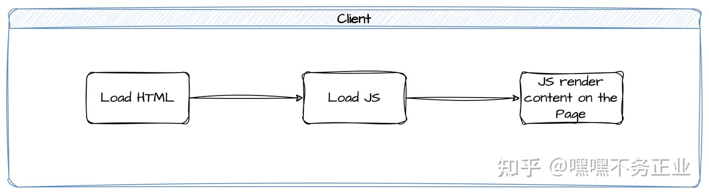
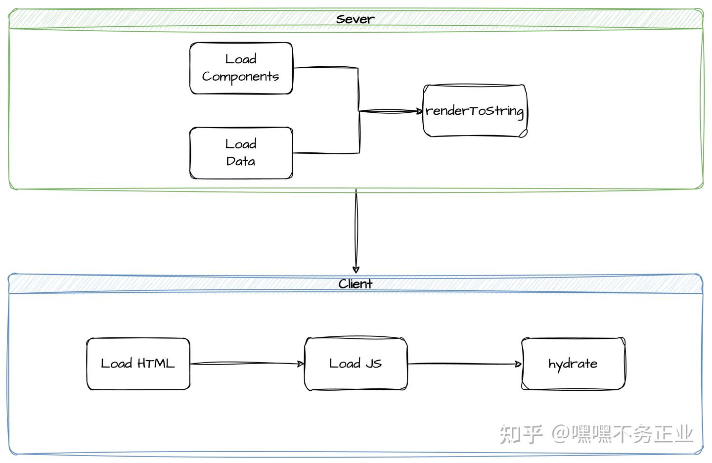
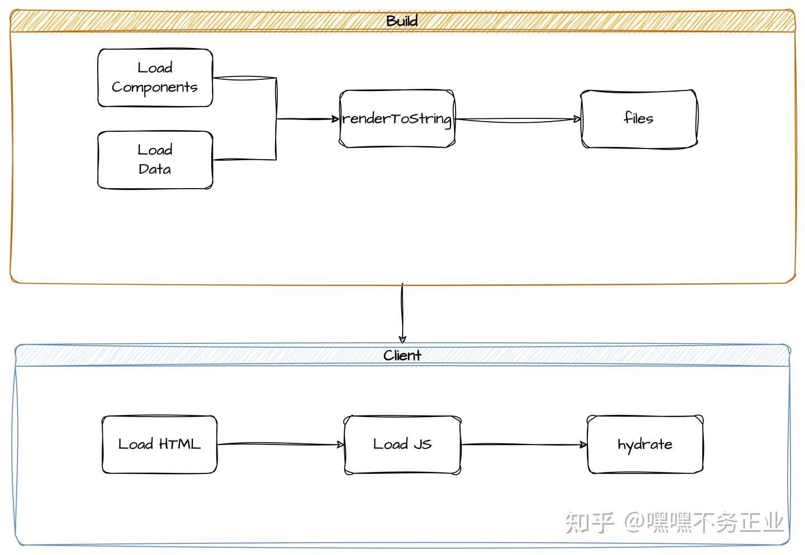
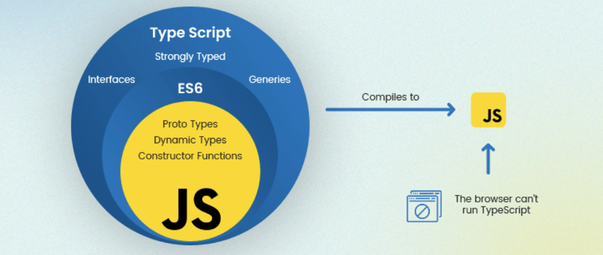

*该笔记用于广泛了解各种前端技术框架，只关注每一种前端技术的核心功能特性和解决的痛点问题*

# 前端技术遍识

## Vue 系列

### Vue

[Vue](https://cn.vuejs.org/) (发音为 /vjuː/，类似 view) 是一款用于构建用户界面的 JavaScript 框架。它基于标准 HTML、CSS 和 JavaScript 构建，并提供了一套声明式的、组件化的编程模型，帮助你高效地开发用户界面。无论是简单还是复杂的界面，Vue 都可以胜任。

- 渐进式框架：你可以根据项目的需求逐步引入 Vue 的各种功能，而不需要一次性将整个项目重构为单页面应用。这意味着你可以从简单的交互组件开始，逐步将 Vue 的功能应用到项目中，使得项目的演进更加平滑和可控。
- 单文件组件：Vue 项目使用一种类似 HTML 格式的文件来书写 Vue 组件，它被称为单文件组件 (Single-File Components， SFC)。SFC 将一个组件的逻辑 (JavaScript)，模板 (HTML) 和样式 (CSS) 封装在同一个 `.vue` 文件。
- 声明式编程：在 Vue 中，开发者只需声明 UI 的结构和行为，无需直接操作 DOM。，Vue 会根据数据变化自动更新视图。Vue 提供两种声明方式的风格——选项式 API 和 组合式 API。

### Vue Router

[Vue Router](https://router.vuejs.org) 是 Vue.js 的官方路由，为 Vue.js 提供富有表现力、可配置的、方便的路由。

### Nuxt.js

[Nuxt.js](https://nuxt.com/) 是一个基于 Vue.js 的高级框架，用于构建 web 应用。它默认使用服务端渲染（SSR)，也支持静态站点生成（SSG）、客户端渲染（SPA）等多种模式。

简单说，它是一个同时提供了前端（vue) 和后端（nitro)的全栈 Web 开发框架。

核心特性：

- 服务端渲染（SSR）：支持服务器端渲染，可以改善应用的加载速度和 SEO 性能。通过在服务器上生成 HTML，用户可以更快地看到页面内容，从而提升用户体验。
- 静态站点生成（SSG）： 可以生成静态网站。这意味着你可以在构建时生成所有页面，适合用于博客、文档等场景，提供快速的加载速度和更好的 SEO。
- 模块系统：可以通过插件和模块轻松扩展功能。社区提供了许多现成的模块，帮助开发者快速集成常用功能，如身份验证、PWA、分析等。
- 自动路由生成： 文件系统驱动的路由生成使得开发者无需手动配置路由。只需在 `pages` 目录中创建 Vue 文件，Nuxt.js 会自动生成相应的路由。
- 状态管理：与 Vuex 紧密集成，为应用提供了集中式状态管理，方便管理和共享数据。通过插件机制，开发者可以轻松处理复杂的状态管理逻辑。

其他优势：

- 开发体验：提供了热重载功能，使得开发者在修改代码后能够立即看到更改，提升开发效率。此外，Nuxt.js 也支持 TypeScript，进一步优化了开发体验。
- SEO 优化：通过服务器端渲染和动态路由，Nuxt.js 使得页面内容在搜索引擎抓取时更为友好，有助于提高搜索排名。
- 生态系统：基于 Vue.js， 可以利用 Vue 生态系统中的许多库和工具，方便与其他前端技术栈集成。

 适用场景：需要 SEO 优化的项目，如电商网站、博客、企业站点等。

## React 系列

### React

[React](https://zh-hans.react.dev/) 是由 Facebook（现 Meta）开发并于 2013 年开源的 JavaScript 库，专门用于构建用户界面，特别是单页应用程序（SPA）。React 允许开发者使用声明式的方式来构建可复用的 UI 组件。

- 组件化思想：React 应用程序是由组件组成的。一个组件是 UI（用户界面）的一部分，它拥有自己的逻辑和外观。组件可以小到一个按钮，也可以大到整个页面。

- JavaScript 为中心：一切皆 JavaScript，包括结构、样式和逻辑，用代码和标签编写组件。

  > 通常使用叫 JSX 的标签语法，JSX 允许开发者在 JavaScript 中编写类似 HTML 的代码。
  >
  > JSX 不是必须的，但是使用  JSX 书写的代码更简洁，可读性更强，结构层次更清晰。

- 响应式交互：React 组件接收数据并返回应该出现在屏幕上的内容，用户也可以通过输入向它们传递新数据。

React 更像一个库：React 专注于视图层（MVC 中的 V），它允许你将组件放在一起，但不关注路由和数据获取。要使用 React 构建整个应用程序，我们建议使用像 Next.js 或 React Router 这样的全栈 React 框架。

### React Router

### Next.js

## 前端构建工具

### Webpack

### Vite

[Vite](https://vitejs.cn/)（法语意为 "快速的"，发音 `/vit/`，发音同 "veet"）是一种新型前端构建工具，能够显著提升前端开发体验。

痛点解决： webpack 等工具构建大型的应用，大量的 JavaScript 代码量使其遇到性能瓶颈，启动开发服务器和热替换都变得迟钝。

核心特性：

- 一个开发服务器，它基于 原生 ES 模块 提供了 丰富的内建功能。
  - Vite 的热模块更新 (hot module replacement, HMR) 提供开发者非常好的本地开发体验
- 一套构建指令，它使用 Rollup 打包你的代码，并且它是预配置的，可输出用于生产环境的高度优化过的静态资源。
- 高扩展性，Vite 意在提供开箱即用的配置
  -  插件 API 和 JavaScript API 带来了高度的可扩展性，并有完整的类型支持。

目前前端社区中的绝大部分框架，都采用了 Vite，包含 Astro, Nuxt, SvelteKit, Solid Start, Qwik City 都是；基本上除了 Next 与 Angular 之外，热门的框架都是选 Vite。

## 前端渲染技术

### CSR

CSR（Client-Side Rendering，客户端渲染）是前端开发中最常见的渲染方式。在这种模式下，服务器主要负责提供静态的HTML文件（可能包含一些基本的HTML结构和JavaScript脚本），而真正的页面渲染工作则完全由客户端的浏览器来完成。或者说：只要是在客户端渲染过程中使用到了脚本都可以算作客户端渲染。

主要流程：

1. 浏览器加载页面

2. 加载对应的脚本

3. 脚本执行时向页面中渲染内容，此步骤一般包含两种方式：

4. - 向一个空节点中渲染内容，一般应用于纯粹的 `CSR` 应用。这里使用的就是上面提到的挂载组件的功能。
   - 向一个已有内容的节点中渲染内容，通常应用于 `CSR` 与其它渲染模式（`SSR`、`SSG`、`ISR`）结合的场景下

特点：响应快、动态交互、前端部署简单。首屏加载时间长、不利于SEO。

应用场景：客户端页面有动态需求或需要交互则必须使用

### SSR

SSR（Server-Side Rendering，服务端渲染）是一种在服务器端完成页面渲染的技术。在这种模式下，服务器接收到客户端的请求后，会先根据请求数据和模板文件生成完整的HTML页面，然后将这个页面直接发送给客户端。这样，用户可以直接看到完成的内容，无需等待JavaScript加载和执行。

常见流程：

1. 浏览器发起 `HTTP` 请求对应的页面
2. 服务端接收到请求后准备渲染页面所需要的数据
3. 将所需要的数据传入需要渲染的页面组件中然后通过 `renderToString` 输出为静态内容
4. 拼接页面模版、水合脚本等将生成的静态内容返回到浏览器，浏览器进行渲染
5. 浏览器渲染内容，执行水合脚本恢复页面交互和动态能力

> 水合用来将组件渲染到已有的静态内容上，用于为静态页面恢复其交互和动态能力。在 `React` 中所使用的 `API` 是 `hydrate`（`React 18` 前的版本） 和 `createHydrate`（`React 18`），在 `Vue` 中所使用的是 `createSSRApp` 后的 `mount`。`Vue` 中的 API 语义稍显奇怪，因为使用 `createSSRApp` 的场景并不一定是 SSR。
>
> 要注意水合并不是必须的，可以按需选择。比如如果你的需求是要对不同的用户展示不同的页面，然而页面上并没有任何可以交互或动态的内容，那完全可以忽略水合的部分。

特点：首屏加载快、SEO友好、适合复杂页面；服务器压力大、开发与调试困难

应用场景：出于首页打开速度、用户体验、SEO 等目的需要让用户更快的看到页面首屏内容

### SSG

SSG（Static Site Generation，静态站点生成）是一种在构建时生成静态HTML页面的技术。在这种模式下，开发者会编写一些模板文件和数据文件，然后使用构建工具（如Hugo、Gatsby等）将这些文件转换为静态的HTML页面。这些页面可以直接部署到服务器上，而不需要服务器进行实时渲染。

常见流程：

1. 在构建阶段构建脚本遍历所有需要静态构建的页面
2. 获取渲染所需要的数据并通过 `renderToString` 输出为静态内容
3. 将静态内容拼接页面模版和水合脚本等内容后保存到文件中
4. 浏览器发起请求时从服务端返回静态页面（一般直接使用静态文件服务器即可）
5. 浏览器渲染内容，执行水合脚本恢复页面交互和动态能力

> SSG 的水合过程同样不是必须的，视需求决定即可。

特点：性能卓越、安全性高；动态性受限、构建时间长、不适合频繁更新；

应用场景：对于内容更新不频繁的内容型网站（如博客、文档网站等），SSG是一个很好的选择。

### ISR

ISR （ Incremental Static Regeneration， 增量静态再生）目前使用的不多，它算是 `SSG` 的一种增强版，指的是在 `SSG` 的基础上，服务端在收到页面请求时会对页面的时效性进行判断，如果认定失效则会对该页面进行增量构建的一种模式。

## TypeScript

TypeScript 是由 Microsoft 开发的开源编程语言，TypeScript 是 JavaScript （Web 原生编程语言）的超集，同样支持 ECMAScript 6 标准，引入了更强的类型系统和工程能力。

- JavaScript 的超集：意味着任何有效的 JavaScript 代码也是有效的 TypeScript 代码，有利于迁移原有的 JavaScript 项目。
  - 原有语法向下兼容，提供 ES2015（如箭头函数、模块、类等） 等语法支持
  - 引入了更强的类型系统和工程能力。
- 编译时检查：TypeScript 需要编译为 JavaScript 才能在浏览器中运行。
  - JavaScript 是动态类型语言，变量类型在运行时确定，而 TypeScript 是静态类型语言，在编译时检查类型错误，可以减少运行时错误。
  - 丰富的类型信息使得 IDE 能够智能提示，给予良好开发体验。
- 类型系统：TypeScript 是对 JavaScript 的类型增强扩展
  - 接口（Interface）
  - 枚举（Enum）
  - 泛型（Generics）
  - 命名空间（Namespace）
  - ...

## CSS

### Tailwind CSS

[Tailwind CSS](https://www.tailwindcss.cn/) 框架本质上是一个工具集，包含了大量类似 `flex`、 `pt-4`、 `text-center` 以及 `rotate-90` 等工具类，可以组合使用并直接在 HTML 代码上实现任何 UI 设计。

核心特性：只需书写 HTML 代码，无需书写 CSS，即可快速构建美观的网站。

关键特性：

- 统一风格：工具类（Utility classes）能够为你提供一套约束系统，避免让你的 样式表中出现随意的取值。它让颜色、 间距、排版、阴影以及一切属性的取值保持一致，并最终形成一个精心构建的设计 系统。
- 体积小：Tailwind 会在针对生产环境进行构建时自动删除所有未使用到的 CSS 代码，也就是说 你所获得的最终的 CSS 代码包的尺寸是最小的。
- 响应式设计：在任何工具类前面添加一个代表屏幕尺寸的前缀，然后就能看到它神奇地作用到某个特定的断点（breakpoint）上了。
- 特殊的样式：将对应前缀添加到 CSS 类名称前，即能实现如鼠标悬停和焦点状态等状态的样式。
- 可复用：按照不同语言框架，将需要复用的样式提取到一个组件或模板中，在统一的地方进行修改了。
- 可自定义：利用 Tailwind 内置的 `@apply` 指令，可以通过复制、粘贴类名列表的方式将一系列工具类所对应的 CSS 代码提取到自定义类中。
- 可扩展：Tailwind 包含一组精心设计的、开箱即用的默认设置，但通过 tailwind.config.js 文件可以来打造你自己的 CSS 设计系统。
- 夜间模式：在配置文件中开启夜间模式，然后将 `dark:` 前缀添加到任何代表颜色的工具类名称前面，就能支持夜间模式了。

其他优势：现代化的、新颖的设计样式支持、编辑器集成提供良好的开发体验、官方 UI 组件库提供示例选择。

# 参考资料

[^1]: [【Nuxt.js】初识与搭建（一） - 知乎](https://zhuanlan.zhihu.com/p/1917360256545163174)
[^2]: [vue都有什么框架 • Worktile社区](https://worktile.com/kb/p/3515066)
[^3]: [什么是 CSR、SSR、SSG、ISR - 渲染模式详解 - 知乎](https://zhuanlan.zhihu.com/p/640900230)

