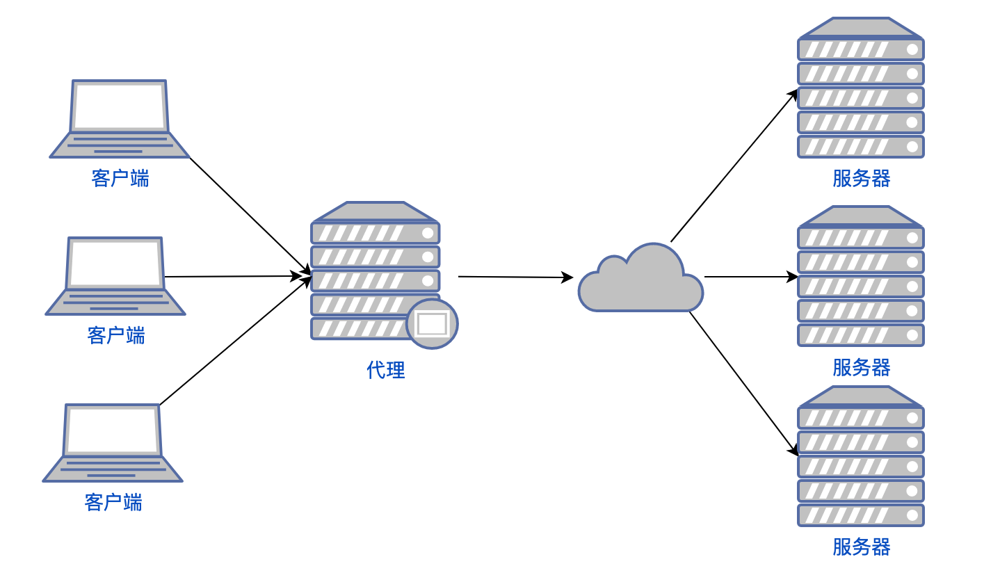
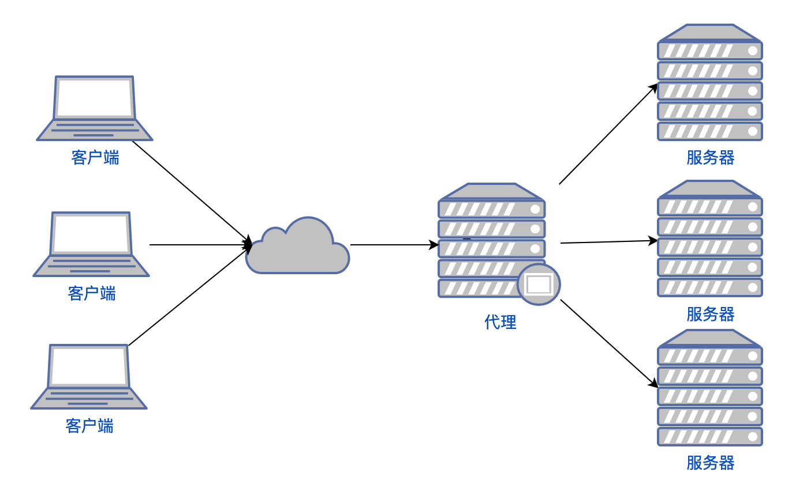
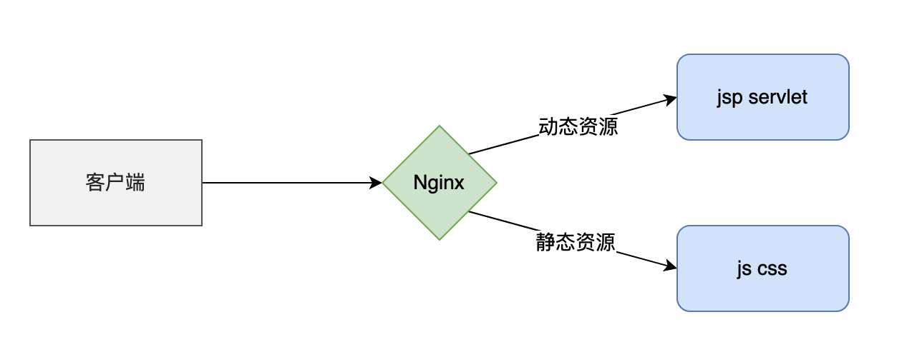
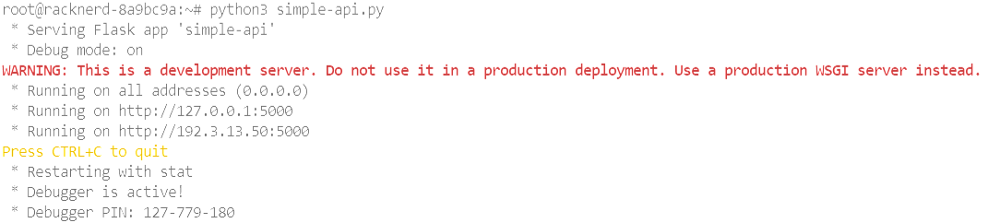
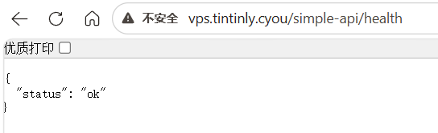
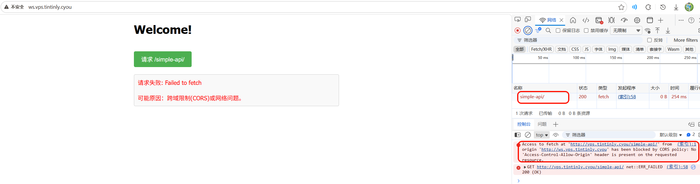
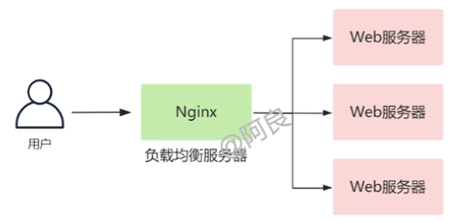
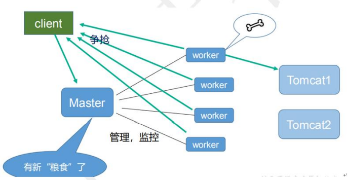

[TOC]

# Nginx

## nginx 基本概念

### nginx 是什么

Nginx  ("engine x") 是一个高性能的 HTTP 和反向代理 Web 服务器，由俄罗斯的伊戈尔·赛索耶夫开发，第一个版本发布于 2004 年 10 月 4 日。

Nginx 特点是占有 **内存占用少，并发能力强**。

中国大陆使用 Nginx 网站用户有：百度、京东、新浪、网易、腾讯、淘宝等

### Nginx 作为 web 服务器

Nginx 可以作为静态页面的 web 服务器，同时还支持 CGI 协议的动态语言，比如 perl、php 等。但是不支持 Java。Java 程序只能通过与 tomcat 配合完成。Nginx 专为性能优化而开发， 性能是其最重要的考量, 实现上非常注重效率 ，能经受高负载的考验, 有报告表明能支持高 达 50,000 个并发连接数。 <https://lnmp.org/nginx.htm>

### 正向代理

Nginx 不仅可以做反向代理，实现负载均衡。还能用作 **正向代理来进行上网等功能**。

> 如果把局域网外的 Internet 想象成一个巨大的资源库，则局域网中的客户端要访问 Internet，则需要通过代理服务器来访问，这种代理服务就称为正向代理。

需要 **在客户端配置代理服务器** 进行指定网站访问



### 反向代理

反向代理，其实客户端对代理是无感知的，因为 **客户端不需要任何配置就可以访问**，我们只需要将请求发送到反向代理服务器，由反向代理服务器去选择目标服务器获取数据后，再返回给客户端，**此时反向代理服务器和目标服务器对外就是一个服务器**，**暴露的是代理服务器 地址，隐藏了真实服务器 IP 地址。**



### 负载均衡

**性能瓶颈问题**

客户端发送多个请求到服务器，服务器处理请求，有一些可能要与数据库进行交互，服务器处理完毕后，再将结果返回给客户端。 这种架构模式对于早期的系统相对单一，并发请求相对较少的情况下是比较适合的，成本也低。但是随着信息数量的不断增长，访问量和数据量的飞速增长，以及系统业务的复杂 度增加，这种架构会造成服务器相应客户端的请求日益缓慢，并发量特别大的时候，还容易 造成服务器直接崩溃。很明显这是由于服务器性能的瓶颈造成的问题，那么如何解决这种情 况呢？ 

**提高机器性能**

我们首先想到的可能是升级服务器的配置，比如提高 CPU 执行频率，加大内存等提高机 器的物理性能来解决此问题。

**增加服务器**

我们知道摩尔定律的日益失效，硬件的性能提升已经不能 满足日益提升的需求了。最明显的一个例子，天猫双十一当天，某个热销商品的瞬时访问量 是极其庞大的，那么类似上面的系统架构，将机器都增加到现有的顶级物理配置，都是不能 够满足需求的。那么怎么办呢？ 上面的分析我们去掉了增加服务器物理配置来解决问题的办法，也就是说 **纵向解决问题的办法行不通了，那么横向增加服务器的数量** 呢？这时候 **集群的概念产生了**，单个服务器解 决不了，我们增加服务器的数量，然后将请求分发到各个服务器上，

**负载均衡 **

每台服务器的能力可能不同，比如说服务器 A 的内存比较大一点，有 100 个 G；服务器 B 的内存小一点，有 10 个 G；服务器 C 的内存更小一点，只有 1 个 G。怎么才能让没台服务器承担起它能力范围内的访问呢？**将原先请求集中到单个服务器上的情况改为将请求分发到多个服务器上，将负载分发到不同的服务器，也就是我们所说的负载均衡**


### 动静分离

在我们的软件开发中，有些请求是需要后台处理的；有些请求是不需要后台处理的，比如说 css、js 这些文件请求，这些不需要经过后台处理的文件就叫静态文件。我们可以根据一些规则，把动态资源和静态资源分开，然后通过 Nginx 把请求分开，静态资源的请求就不需要经过 Web 服务器处理了，从而提高整体上的资源的响应速度。



## nginx 安装

[Nginx](http://nginx.org/)

**软件包安装**


第一步，**安装 pcre** wget <http://downloads.sourceforge.net/project/pcre/pcre/8.37/pcre-8.37.tar.gz>

解压文件， ./configure 完成后，回到 pcre 目录下执行 make， 再执行 make install


第二步，**安装 openssl**

 第三步，**安装 zlib** yum -y install make zlib zlib-devel gcc-C++ libtool openssl openssl-devel

第四步，**安装 nginx** 1、 解压缩 nginx-xx.tar.gz 包。 2、 进入解压缩目录，执行./configure。 3、 make && make install

进入目录 /usr/local/assets/sbin/Nginx 启动服务

**apt 安装**

```shell
apt install -y nginx
```

## 常用命令

```bash
nginx # 启动
nginx -s stop #停止
nginx -s quit # 安全退出
nginx -s reload # 重新加载配置文件
nginx -t # 检查配置文件是否正确
ps aux|grep nginx # 查看nginx进程
```

## 配置文件

### 配置文件位置

Nginx 的主配置文件是 `/etc/nginx/nginx.conf`

查看配置文件位置的方法

```shell
nginx -t
# nginx: the configuration file /etc/nginx/nginx.conf syntax is ok
# nginx: configuration file /etc/nginx/nginx.conf test is successful
```

### 配置结构

Nginx 的配置结构图

```
main        # 全局配置，对全局生效
├── events  # 配置影响 Nginx 服务器或与用户的网络连接
├── http    # 配置代理，缓存，日志定义等绝大多数功能和第三方模块的配置
│   ├── upstream # 配置后端服务器具体地址，负载均衡配置不可或缺的部分
│   ├── server   # 配置虚拟主机的相关参数，一个 http 块中可以有多个 server 块
│   ├── server
│   │   ├── location  # server 块可以包含多个 location 块，location 指令用于匹配 uri
│   │   ├── location
│   │   └── ...
│   └── ...
└── ...
```

### 典型配置

```nginx
user  nginx;                        # 运行用户，默认即是nginx，可以不进行设置
worker_processes  1;                # Nginx 进程数，一般设置为和 CPU 核数一样
error_log  /var/log/nginx/error.log warn;   # Nginx 的错误日志存放目录
pid        /var/run/nginx.pid;      # Nginx 服务启动时的 pid 存放位置

events {
    use epoll;     # 使用epoll的I/O模型(如果你不知道Nginx该使用哪种轮询方法，会自动选择一个最适合你操作系统的)
    worker_connections 1024;   # 每个进程允许最大并发数
}

http {   # 配置使用最频繁的部分，代理、缓存、日志定义等绝大多数功能和第三方模块的配置都在这里设置
    # 设置日志模式
    log_format  main  '$remote_addr - $remote_user [$time_local] "$request" '
                      '$status $body_bytes_sent "$http_referer" '
                      '"$http_user_agent" "$http_x_forwarded_for"';

    access_log  /var/log/nginx/access.log  main;   # Nginx访问日志存放位置

    sendfile            on;   # 开启高效传输模式
    tcp_nopush          on;   # 减少网络报文段的数量
    tcp_nodelay         on;
    keepalive_timeout   65;   # 保持连接的时间，也叫超时时间，单位秒
    types_hash_max_size 2048;

    include             /etc/nginx/mime.types;      # 文件扩展名与类型映射表
    default_type        application/octet-stream;   # 默认文件类型

    include '/etc/nginx/conf.d/*.conf';   # 加载子配置项
    
    server {
    	listen       80;       # 配置监听的端口
    	server_name  localhost;    # 配置的域名
    	
    	location / {
    		root   /usr/share/nginx/html;  # 网站根目录
    		index  index.html index.htm;   # 默认首页文件
    		deny 172.168.22.11;   # 禁止访问的ip地址，可以为all
    		allow 172.168.33.44； # 允许访问的ip地址，可以为all
    	}
    	
    	error_page 500 502 503 504 /50x.html;  # 默认50x对应的访问页面
    	error_page 400 404 error.html;   # 同上
    }
}
```

### 语法&规范

* 配置文件由指令与指令块构成；
* 每条指令以 ; 分号结尾，指令与参数间以空格符号分隔；
* 指令块以 {} 大括号将多条指令组织在一起；
* include 语句允许组合多个配置文件以提升可维护性；
* 使用 # 符号添加注释，提高可读性；
* 使用 $ 符号使用变量；
* 部分指令的参数支持正则表达式；

### 变量

内置预定义变量，常用

| 全局变量名       | 功能                                                         |
| ---------------- | ------------------------------------------------------------ |
| $host            | 请求信息中的 Host，如果请求中没有 Host 行，则等于设置的服务器名，不包含端口 |
| $request_method  | 客户端请求类型，如 GET、POST                                 |
| $remote_addr     | 客户端的 IP 地址                                             |
| $args            | 请求中的参数                                                 |
| $arg_PARAMETER   | GET 请求中变量名 PARAMETER 参数的值，例如：$ http_user_agent(Uaer-Agent 值), $http_referer... |
| $content_length  | 请求头中的 Content-length 字段                               |
| $http_user_agent | 客户端 agent 信息                                              |
| $http_cookie     | 客户端 cookie 信息                                             |
| $remote_addr     | 客户端的 IP 地址                                               |
| $remote_port     | 客户端的端口                                                 |
| $http_user_agent | 客户端 agent 信息                                              |
| $server_protocol | 请求使用的协议，如 HTTP/1.0、HTTP/1.1                        |
| $server_addr     | 服务器地址                                                   |
| $server_name     | 服务器名称                                                   |
| $server_port     | 服务器的端口号                                               |
| $scheme          | HTTP 方法（如 http，https）                                   |

自定义变量

```nginx
  set $forward_scheme http;
  set $server         "192.168.1.117";
  set $port           37878;
# 使用 $ 符号使用变量；
proxy_set_header Host $http_host;
```

### include

include 用于加载子配置项

因为使用的 Linux 为 Debian/Ubuntu，Nginx 版本为 1.18.0，主配置文件 `/etc/nginx/nginx.conf` 通常包含：

```
include /etc/nginx/conf.d/*.conf;
include /etc/nginx/sites-enabled/*;
```

- 站点配置（不同域名/端口）放在 `sites-available` + `sites-enabled`。
- 通用配置（如缓存、代理、上游等）放在 `conf.d/`。

### 全局块

从配置文件开始到 events 块之间的内容，主要会设置一些影响 Nginx 服务器整体运行的配置指令，主要包括配 置运行 Nginx 服务器的用户（组）、允许生成的 worker process 数，进程 PID 存放路径、日志存放路径和类型以 及配置文件的引入等。这是 Nginx 服务器并发处理服务的关键配置，worker_processes 值越大，可以支持的并发处理量也越多，但是 会受到硬件、软件等设备的制约

### events 块

涉及的指令主要影响 Nginx 服务器与用户的网络连接，常用的设置包括是否开启对多 work process  下的网络连接进行序列化，是否允许同时接收多个网络连接，选取哪种事件驱动模型来处理连接请求，每个 word  process 可以同时支持的最大连接数等。 上述例子就表示每个 work process 支持的最大连接数为 1024. 这部分的配置对 Nginx 的性能影响较大，在实际中应该灵活配置。

### http 块

 Nginx 服务器配置中最频繁的部分，代理、缓存和日志定义等绝大多数功能和第三方模块的配置都在这里。

每个 http 块可以包括多个 server 块，而每个 server 块就相当于一个虚拟主机；而每个 server 块也分为全局 server 块，以及可以同时包含多个 locaton 块。

http 全局块配置的指令包括文件引入、MIME-TYPE 定义、日志自定义、连接超时时间、单链接请求数上限等。

### server 块

 这块和虚拟主机有密切关系，虚拟主机从用户角度看，和一台独立的硬件主机是完全一样的，该技术的产生是为了 节省互联网服务器硬件成本。 最常见的配置是本虚拟机主机的监听配置和本虚拟主机的名称或 IP 配置。

### location 块

 这块的主要作用是基于 Nginx 服务器接收到的请求字符串（例如 server_name/uri-string），对虚拟主机名称 （也可以是 IP 别名）之外的字符串（例如 前面的 /uri-string）进行匹配，对特定的请求进行处理。地址定向、数据缓 存和应答控制等功能，还有许多第三方模块的配置也在这里进行。

location 指令用于匹配 uri，语法：

```nginx
location [ = | ~ | ~* | ^~] uri {
	...
}
# 若 uri 不包含正则表达式
# = 精确匹配路径，如果匹配成功，不再进行后续的查找；
# ^~ 表示如果该符号后面的字符是最佳匹配，采用该规则，不再进行后续的查找；

# 若 uri 包含正则表达式
# ~ 表示用该符号后面的正则去匹配路径，区分大小写；
# ~* 表示用该符号后面的正则去匹配路径，不区分大小写。跟 ~ 优先级都比较低，如有多个location的正则能匹配的话，则使用正则表达式最长的那个；
```

## 应用场景 - Web 服务器


### 设置虚拟主机&域名

```nginx
# /etc/nginx/sites-available/web-server

server {
	listen 80;
    
	#server_name _;
    server_name ws.vps.tintinly.cyou;

   charset utf-8;    # 防止中文文件名乱码

    # 访问 http://ws.vps.tintinly.cyou 会查找文件：/var/www/static_dir/index.html
    location / {
        root /var/www/static_dir; 
        index index.html; 
    }
    
    # 访问 http://ws.tintinly.cyou/pictures/logo.png 会查找文件：/var/www/static_dir/images/logo.png
    location /pictures/ {
        alias /var/www/static_dir/images/; 
    }
}
```

> 下划线不 `_` 是一个合法的域名（域名中不允许下划线作为主标签，除非是某些特殊记录），因此它不会与任何真实的域名冲突。
>
> 在 Nginx 配置中，`server_name _;` 是一个常见的写法，用于定义一个默认的“兜底”虚拟主机。它匹配任何没有显式匹配到其他 `server_name` 的请求，尤其当请求头中的 `Host` 字段无法与任何已定义的域名对应时。


指令含义：

* `root` ：为某个路径指定一个基础根目录。
* `alias` ：将某个到一个完全不同的文件夹
* `index` ：若无指定具体文件，内部重定向为默认文件

`location` 后的路径尾部斜杠意义：

- `/xxx`：匹配任何以 `/xxx` 开头的 URI，不管后面是 `/`、`123`、`-ab` 还是直接结束。它属于 **前缀匹配**，但边界不严格。
- `/xxx/`：只匹配以 `/xxx/` 开头的 URI，**要求斜杠必须紧跟 images**，后面可以是其他路径。它匹配更精确，通常用于目录。

### 配置 HTTPS

监听 443 端口（也可以是其他端口），启用 ssl 模式。

配置 SSL 参数 指定证书和私钥

```nginx
# /etc/nginx/sites-available/web-ssl-server

server {
       listen 443 ssl;

       server_name ws.vps.tintinly.cyou;
    
       ssl_certificate /etc/ssl/certimate/cert.crt;
       ssl_certificate_key /etc/ssl/certimate/cert.key; 

       # 访问 https://ws.vps.tintinly.cyou 会查找文件：/var/www/static_dir/index.html
       location / {
       		root /var/www/static_dir; 
      		index index.html; 
       }
    
}
```


指令含义：

* `listen 443 ssl;`：端口上接收 SSL/TLS 加密的 HTTPS 请求的流量

### 简易文件服务器

```nginx
# /etc/nginx/sites-available/simple-file-server

server {
	listen 80;
    
	server_name sfs.vps.tintinly.cyou;
	charset utf-8;    # 防止中文文件名乱码
    
       # 访问 http://sfs.vps.tintinly.cyou 会列出/var/www/static_dir/resources的所有子目录及文件
    location / {
		root /var/www/resources/;
        autoindex on;
        autoindex_exact_size off;
        autoindex_localtime on;
        charset utf-8;

        #auth_basic "Please enter your username and password" | off;
		#auth_basic_user_file /var/www/tools/auth/auth_file;
    }
    
}
```

指令含义：

* `autoindex`：是否允许列出整个目录
* `autoindex_exact_size`：显示出文件的（确切 bytes /大概 KB MB GB）大小，默认为 on，。
* `autoindex_localtime`：显示的文件 GMT 时间还是显示文件的服务器时间，默认为 off。
* `charset utf-8;`：防止文件乱码显示，如果用 utf-8 还是乱码，就改成 gbk 试试
* `auth_basic "提示字符串" | off;`：是否要求认证，及其提示文本，使用 `off` 可取消继承自上级的认证设置
* `auth_basic_user_file`：账号密码文件存放位置

认证的密码文件中的密码应该使用 *crypt()* 函数加密，可以使用 *htpasswd* 或 *openssl* 工具生成。

以下是生成认证文件的命令：

```shell
# 创建认证文件并添加用户
htpasswd -c -d /var/www/tools/auth/auth_file
# 生成的文件内容如下所示：
user:aRR7B12lK021w
```


## 应用场景 - URL 重定向

### 旧域名重定向至新域名


遇到域名过期的问题，希望将访问老域名的请求都重定向到新域名，可以使用 rewrite 指令来重定向。

```nginx
# /etc/nginx/conf.d/upstream_myserver.conf
server {
	listen 80;
    server_name old.vps.tintinly.cyou;
    location / {
        return 301 http://ws.vps.tintinly.cyou;
    }
}
```


### 强制 HTTPS 连接

启用将 HTTP 连接重定向到 HTTPS 连接

```nginx
server {
    listen      80;
    server_name ws.vps.tintinly.cyou;

    # 全局非 https 协议时重定向
    if ($scheme != 'https') {
        return 301 https://$host$request_uri;
    }

    # 或者全部重定向
    return 301 https://$host$request_uri;
}
```

### rewrite

关于 `return 301 ...` 和 `rewrite ... permanent`
两者都是 301 重定向的效果。rewrite 使用了 `ngx_http_rewrite_module` 模块，适用于复杂的情况。重定向这种使用 301 效果更好。

```nginx
return 301 https://$host$request_uri;

rewrite ^/(.*)$  https://$host$1 permanent;
```

rewrite 为固定关键字，表示开始进行 rewrite 匹配规则

regex 部分是 ^/(.*) ，这是一个正则表达式，匹配完整的域名和后面的路径地址

replacement 部分是 `https://$host$1` $1，是取自 regex 部分()里的内容。匹配成功后跳转到的 URL

flag 部分 permanent 表示永久 301 重定向标记，即跳转到新的 http://www.czlun.com/$1 地址上

flag 标记说明：

* `last`：本条规则匹配完成后，继续向下匹配新的 location URI 规则
* `break`：本条规则匹配完成即终止，不再匹配后面的任何规则
* `redirect`：返回 302 临时重定向，浏览器地址会显示跳转后的 URL 地址
* `permanent`：返回 301 永久重定向，浏览器地址栏会显示跳转后的 URL 地址

### 301 和 302

301 是永久重定向，搜索引擎收录重定向之后的网址；

302 是临时重定向，收录当前网址。

尽量用 301，网站临时调整用 302。

## 应用场景 - 反向代理


### 反向代理

**例 1**：把访问 http://bilibili.vps.tintinly.cyou 的请求转发到 http://www.bilibili.com/

```nginx
# /etc/nginx/conf.d/proxy_bilibili.conf
server {
  listen 80;
  server_name bilibili.vps.tintinly.cyou;

  location / {
    proxy_pass http://www.bilibili.com;
  }
}
```

**例 2**：反向代理本地后端

首先用 python3  Flask 框架 部署一个简易的 API

```shell
python3 --version
pip3 install flask
```

编写 API 代码

```python
from flask import Flask, jsonify, request, redirect

app = Flask(__name__)

# 普通 GET 请求，返回 JSON
@app.route('/')
def home():
    return jsonify({
        "message": "Hello from local API!",
        "method": request.method,
        "path": request.path
    })

# 健康检查接口
@app.route('/health')
def health():
    return jsonify({"status": "ok"})

if __name__ == '__main__':
    # host='0.0.0.0' 可以让本机其他 IP 也能访问，测试时方便
    # 如果只想本机访问，用 host='127.0.0.1'
    app.run(host='0.0.0.0', port=5000, debug=True)
```

运行



把访问 http://vps.tintinly.cyou/simple-api 的请求转发到 http://127.0.0.1:5000

```nginx
# /etc/nginx/conf.d/proxy_in.conf
server {
  listen 80;
  server_name vps.tintinly.cyou;

  location ^~ /simple-api/ {
    proxy_pass http://127.0.0.1:5000/; # 注意末尾要加斜杠
  }
  
}
```




指令含义及其他指令：

* `proxy_pass`：转发给后端服务器的请求路径
* `proxy_set_header`：在将客户端请求发送给后端服务器之前，更改来自客户端的请求头信息；
* `proxy_connect_timeout`：配置 Nginx 与后端代理服务器尝试建立连接的超时时间；
* `proxy_read_timeout`：配置 Nginx 向后端服务器组发出 read 请求后，等待相应的超时时间；
* `proxy_send_timeout`：配置 Nginx 向后端服务器组发出 write 请求后，等待相应的超时时间；
* `proxy_redirect`：用于修改后端服务器返回的响应头中的 Location 和 Refresh。

`location` 指令说明  该指令用于匹配 URL。

1. `=` ：用于不含正则表达式的 uri 前，要求请求字符串与 uri 严格匹配，如果匹配 成功，就停止继续向下搜索并立即处理该请求。
2. `~`：用于表示 uri 包含正则表达式，并且区分大小写。
3. `~*`：用于表示 uri 包含正则表达式，并且不区分大小写。 
4. `^~`：用于不含正则表达式的 uri 前，要求 Nginx 服务器找到标识 uri 和请求字符串匹配度最高的 location 后，立即使用此 location 处理请求，而不再使用 location  块中的正则 uri 和请求字符串做匹配。 

> 注意：如果 uri 包含正则表达式，则必须要有 ~ 或者 ~* 标识。

`proxy_pass http://127.0.0.1:5000/` 末尾斜杠的意义（假设访问 `vps.tintinly.cyou/simple-api/health` ）：

- 加斜杠： 会去掉 `location` 中匹配的路径部分，只把剩余部分拼接到后端 URL 后面 → http://127.0.0.1:5000/health→ 正确
- 不加斜杠： 会保留完整的请求 URI 原样拼接到后端 URL 后面 → http://127.0.0.1:5000/simple-api/health→ 错误

### 配置 header 解决跨域

现在前后端分离的项目一统天下，经常本地起了前端服务，需要访问不同的后端地址，不可避免遇到跨域问题。

在前端服务地址为 ws.vps.tintinly.cyou 的页面请求  vps.tintinly.cyou  的后端服务导致的跨域导致的跨域



```nginx
# /etc/nginx/conf.d/proxy_in.conf
server {
  listen 80;
  server_name vps.tintinly.cyou;

  location ^~ /simple-api/ {
    proxy_pass http://127.0.0.1:5000/; # 注意末尾要加斜杠
        
	add_header 'Access-Control-Allow-Origin' $http_origin;   # 全局变量获得当前请求origin，带cookie的请求不支持*
	add_header 'Access-Control-Allow-Credentials' 'true';    # 为 true 可带上 cookie
	add_header 'Access-Control-Allow-Methods' 'GET, POST, OPTIONS';  # 允许请求方法
	add_header 'Access-Control-Allow-Headers' $http_access_control_request_headers;  # 允许请求的 header，可以为 *
	add_header 'Access-Control-Expose-Headers' 'Content-Length,Content-Range';
	
	if ($request_method = 'OPTIONS') {
		add_header 'Access-Control-Max-Age' 1728000;   # OPTIONS 请求的有效期，在有效期内不用发出另一条预检请求
		add_header 'Content-Type' 'text/plain; charset=utf-8';
		add_header 'Content-Length' 0;
    
		return 204;                  # 200 也可以
	}
  }
  
}
```


### 重定向后端口丢失问题

nginx有的时候并不像Apache那样智能，对于redirect location的处理尤为惨淡，几乎只能用户手工处理非标准端口的问题。


## 应用场景 - 负载均衡



首先，新运行两个个 api 服务，5000 端口，6000 端口。差别在于返回的 api 内容的数字不一样。

Nginx 是通过 upstream 指令来定义后端多台服务器 IP 地址和端口的

```nginx
# /etc/nginx/conf.d/upstream_myserver.conf
upstream myserver {
  	# ip_hash;  # ip_hash 方式
    # fair;   # fair 方式
    server 127.0.0.1:5000;  # 负载均衡目的服务地址
    server 127.0.0.1:6000;
    server 127.0.0.1:7000 weight=10;  # weight 方式，不写默认为 1
  }
```

然后在 location 中通过 proxy_pass 的指令来指定 upstream 的名称

```nginx
# /etc/nginx/conf.d/proxy_in.conf
server {
  listen 80;
  server_name vps.tintinly.cyou;

  location ^~ /simple-api/ {
     proxy_pass http://127.0.0.1:5000/; # 注意末尾要加斜杠
    ...
  }

  location ^~ /simple-apis/ {
    
	proxy_pass http://myserver/;
     proxy_connect_timeout 10;
  }

}
```

结果时三个 api 都会出现，api3 出现的频次较多。


Nginx 提供了几种分配方式(策略)：

1. 轮询（默认） 每个请求按时间顺序逐一分配到不同的后端服务器，如果后端服务器 down 掉，能自动剔除。
2. weight weight 代表权, 重默认为 1, 权重越高被分配的客户端越多 指定轮询几率，weight 和访问比率成正比，用于后端服务器性能不均的情况。 例如
3. ip_hash 每个请求按访问 ip 的 hash 结果分配，这样每个访客固定访问一个后端服务器，可以解决 session 的问题。 例如：
4. fair（第三方） 按后端服务器的响应时间来分配请求，响应时间短的优先分配。

## 应用场景 - 动静分离

Nginx 动静分离简单来说就是把动态跟静态请求分开，不能理解成只是单纯的把动态页面和 静态页面物理分离。严格意义上说应该是动态请求跟静态请求分开，可以理解成 使用 Nginx  处理静态页面，后端如 Tomcat 处理动态页面。

动静分离从目前实现角度来讲大致分为两种：

* 一种是纯粹把静态文件独立成单独的域名，放在独立的服务器上，也是目前主流推崇的方案； 
* 另外一种方法就是动态跟静态文件混合在一起发布，通过 Nginx 来分开。

通过 location 指定不同的后缀名实现不同的请求转发。通过 expires 参数设置，可以使 浏览器缓存过期时间，减少与服务器之前的请求和流量。具体 Expires 定义：是给一个资 源设定一个过期时间，也就是说无需去服务端验证，直接通过浏览器自身确认是否过期即可， 所以不会产生额外的流量。此种方法非常适合不经常变动的资源。（如果经常更新的文件， 不建议使用 Expires 来缓存），我这里设置 3d，表示在这 3 天之内访问这个 URL，发送 一个请求，比对服务器该文件最后更新时间没有变化，则不会从服务器抓取，返回状态码 304，如果有修改，则直接从服务器重新下载，返回状态码 200

## 应用场景 - 防盗链

用于防止其他网站盗用自家网站资源的安全机制。

Nginx 基于 http_referer 的字段，但该字段可以被伪造，所以不是绝对安全。

```nginx
# /etc/nginx/sites-available/web-server

server {
	listen 80;
    
	#server_name _;
    server_name ws.vps.tintinly.cyou;

   charset utf-8;    # 防止中文文件名乱码

    # 访问 http://ws.vps.tintinly.cyou 会查找文件：/var/www/static_dir/index.html
    location / {
        root /var/www/static_dir; 
        index index.html; 
    }
    
    # 访问 http://ws.tintinly.cyou/pictures/logo.png 会查找文件：/var/www/static_dir/images/logo.png
    location ^~ /pictures/ {
        
        
        # 嵌套 location（前缀匹配下的子匹配）只针对/pcitures/的图片防盗链
        location ~* \.(gif|jpg|jpeg|png|bmp|swf)$ {
            valid_referers none blocked ws.vps.tintinly.cyou ;  # 只允许本机 IP 外链引用，百度和谷歌也加入白名单 有利于SEO
            if ($invalid_referer){
                return 403;
            }
        }
        
        alias /var/www/static_dir/images/;  
    }
    
    # 图片防盗链
    location ~* \.(gif|jpg|jpeg|png|bmp|swf)$ {
        valid_referers none blocked ws.vps.tintinly.cyou ;  
        if ($invalid_referer){
            return 403;
        }
        root /var/www/static_dir/; 
    }
    
}
```


指令含义：

- `valid_referers`：定义允许访问的来源，包括： 
  - none：允许没有 Referer 的请求（如直接输入 URL）。
  -  blocked：允许被代理或防火墙隐藏 Referer 的请求。
  -  yourdomain.com 和 *.yourdomain.com：允许来自指定域名及其子域名的请求。

## 应用场景 - 缓存

```nginx
# 强缓存 它是一个时间戳 ，当客户端再次请求该资源的时候，会把客户端时间与该时间戳进行对比，如果大于该时间戳则已过期，否则直接使用该缓存资源。
add_header Cache-Control "public, max-age=604800";

# 协商缓存 协商缓存主要依赖的响应头包括Last-Modified和ETag，需要和服务器交互，请求资源命中协商缓存后，返回的状态码 为 304，所以304状态码不应该认为是一种错误，而是对客户端有缓存情况下服务端的一种响应。
# 开启协商缓存后每次刷新页面，都会与服务器确认资源是否更新，如果更新服务器则会返回新的资源，如果未更新则告诉浏览器启用缓存。
# Last-Modified：记录资源最后修改的时间。
# ETag：基于资源的内容编码生成一串唯一的标识字符串, 只要内容不同, 就会生成不同的ETag。
add_header Cache-Control no-cache;

# 无缓存
add_header Cache-Control no-store;

```

## nginx 配置高可用集群

### 准备工作


两台服务器


两台服务器安装 keepalived

```bash
yum install -y keepalived
```

### 高可用集群配置

修改 keepalived.conf

```con
! Configuration File for keepalived

global_defs {
   notification_email {
     acassen@firewall.loc
     failover@firewall.loc
     sysadmin@firewall.loc
   }
   notification_email_from Alexandre.Cassen@firewall.loc
   smtp_server 192.168.10.102
   smtp_connect_timeout 30
   router_id LVS_DEVEL
   vrrp_skip_check_adv_addr
   vrrp_strict
   vrrp_garp_interval 0
   vrrp_gna_interval 0
}

vrrp_script chk_http_port {
    script  "/usr/local/src/nginx_check.sh"
    interval  2 ##（检测脚本执行的间隔）
    weight  2
}


vrrp_instance VI_1 {
    state MASTER
    interface ens33
    virtual_router_id 51
    priority 100
    advert_int 1
    authentication {
        auth_type PASS
        auth_pass 1111
    }
    virtual_ipaddress {
        192.168.10.50
    }
}


}

```

脚本  nginx_check.sh 放入/usr/local/src

```shell
##!/bin/bash
A=`ps -C Nginx –no-header |wc -l`
if [ $A -eq 0 ];then
    /usr/local/assets/sbin/nginx
    sleep 2
    if [ `ps -C Nginx --no-header |wc -l` -eq 0 ];then
        killall keepalived
    fi
fi
```

启动 nginx：./Nginx

启动 keepalived：systemctl start keepalived.service

最终测试  在浏览器地址栏输入 虚拟 ip 地址 192.168.17.50

把主服务器（192.168.17.129）Nginx 和 keepalived 停止，再输入 192.168.17.50

## nginx 原理

### master 和 worke




一个 master 和多个 woker 有好处

（1）可以使用 Nginx –s reload 热部署，利用 Nginx 进行热部署操作

（2）每个 woker 是独立的进程，如果有其中的一个 woker 出现问题，其他 woker 独立的， 继续进行争抢，实现请求过程，不会造成服务中断

需要设置多少个 worker

Nginx 同 redis 类似都采用了 io 多路复用机制，每个 worker 都是一个独立的进程，但每个进 程里只有一个主线程，通过异步非阻塞的方式来处理请求， 即使是千上万个请求也不在话 下。每个 worker 的线程可以把一个 cpu 的性能发挥到极致。**所以 worker 数和服务器的 cpu 数相等是最为适宜的。** 设少了会浪费 cpu，设多了会造成 cpu 频繁切换上下文带来的损耗。

```
##设置 worker 数量。 
worker_processes 4 

##work 绑定 cpu(4 work 绑定 4cpu)。 
worker_cpu_affinity 0001 0010 0100 1000 

##work 绑定 cpu (4 work 绑定 8cpu 中的 4 个) 。 
worker_cpu_affinity 0000001 00000010 00000100 0000100
```

连接数 worker_connection

连接数 worker_connection 这个值是表示每个 worker 进程所能建立连接的最大值，所以，一 **个 Nginx 能建立的最大连接 数，应该是 worker_connections * worker_processes* *。当然，这里说的是最大连接数，对于 HTTP 请 求 本 地 资 源 来 说 ， 能 够 支 持 的 最 大 并 发 数 量 是 worker_connections *  worker_processes，如果是支持 ** http1.1 的浏览器每次访问要占两个连接 **，所以普通的静态访 问最大并发数是： worker_connections * worker_processes /2，而如果是 HTTP 作 为反向代 理来说，最大并发数量应该是 worker_connections *  worker_processes/4。因为** 作为反向代理服务器，每个并发会建立与客户端的连接和与后端服 务的连接，会占用两个连接。**


连接数 worker_connection

第一个：发送请求，占用了 woker 的几个连接数？

答案：2 或者 4 个 第二个：Nginx

有一个 master，有四个 woker，每个 woker 支持最大的连接数 1024，支持的 最大并发数是多少？

1, 普通的静态访问最大并发数是： worker_connections * worker_processes /2

2, 而如果是 HTTP 作 为反向代理来说，最大并发数量应该是 worker_connections *  worker_processes/4

# 参考资料

* [1] [Nginx 从入门到实践，万字详解！_SHERlocked_93 的博客-NGINX 开源社区](https://www.nginx.org.cn/article/detail/545)
* [2] [Nginx 七大应用场景（附配置），看看你用过几个？_哔哩哔哩_bilibili](https://www.bilibili.com/video/BV1jf421B7R7/?spm_id_from=333.1387.top_right_bar_window_history.content.click&vd_source=648539de92dcdfbe1ca5bd81d6d559d2)
* [3] [Nginx中处理重定向端口丢失问题 - Aiden郭祥跃 - 博客园](https://www.cnblogs.com/guoxiangyue/p/16522492.html)
