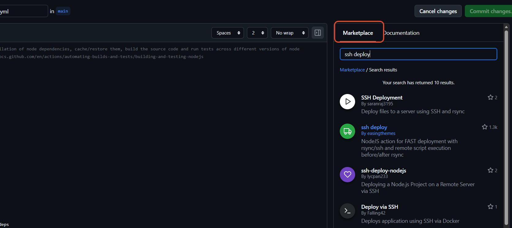

# GitHub 指南

GitHub 是一个软件项目托管平台，仅支持 Git 作为唯一的版本库格式进行托管。

除了 Git 代码仓库托管及基本的 Web 管理界面以外，还提供了订阅、讨论组、文本渲染、在线文件编辑器、协作图谱（报表）、代码片段分享（Gist）、远端构建、HTTP 回调等功能。

## GitHub Actions

GitHub Actions 是一种持续集成和持续交付 (CI/CD) 平台，支持自动化构建、测试和部署。它提供了高性能的虚拟服务器环境（包括Linux、Windows 和 macOS 虚拟机），来运行工作流。

在 GitHub Actions 存储库中直接自动化、自定义并执行您的软件开发工作流。程序员可以创建和共享操作以执行任何作业（包括 CI/CD），并将操作合并到完全自定义的工作流程中。例如搭建的个人博客，使用了 GitHub Action，可以确保每次 commit 之后，都能自动编译、打包和部署到服务器上，省去很多操作。

### Actions 入门

在 GitHub 上的存储库中，`.github/workflows`目录下创建 `demo.yml` 工作流文件。

```yaml
# 示例
name: GitHub Actions Demo
run-name: ${{ github.actor }} is testing out GitHub Actions 🚀
on: [push]
jobs:
  Explore-GitHub-Actions:
    runs-on: ubuntu-latest
    steps:
      - run: echo "🎉 The job was automatically triggered by a ${{ github.event_name }} event."
      - run: echo "🐧 This job is now running on a ${{ runner.os }} server hosted by GitHub!"
      - run: echo "🔎 The name of your branch is ${{ github.ref }} and your repository is ${{ github.repository }}."
      - name: Check out repository code
        uses: actions/checkout@v6
      - run: echo "💡 The ${{ github.repository }} repository has been cloned to the runner."
      - run: echo "🖥️ The workflow is now ready to test your code on the runner."
      - name: List files in the repository
        run: |
          ls ${{ github.workspace }}
      - run: echo "🍏 This job's status is ${{ job.status }}."
```

向存储库的分支提交工作流文件会触发 `push` 事件并运行工作流。

### 引用现成脚本

很多持续集成的操作在不同项目里面是类似的，可以共享的。Github 允许在自己的工作流文件中直接引用他人写好的 action 。



### Actions 示例

将个人笔记 VitePress 项目通过工作流实现自动编译，构建静态页面，并通过 ssh 和 rsync 部署到服务器上。

```yaml
# This workflow will do a clean installation of node dependencies, cache/restore them, build the source code and run tests across different versions of node
# For more information see: https://docs.github.com/en/actions/automating-builds-and-tests/building-and-testing-nodejs

name: ssh deploy

on:
  push:
    branches: [ "main" ]
  pull_request:
    branches: [ "mian" ]

jobs:
  build:

    runs-on: ubuntu-latest

    steps:
    - uses: actions/checkout@v3
    - name: Use Node.js Build
      uses: actions/setup-node@v3
      with:
        node-version: 24.15.0
        cache: 'npm'
    - run: npm install --legacy-peer-deps
    - run: npm run docs:build
    - run: ls -l
    - name: Deploy to Server
      uses: easingthemes/ssh-deploy@main
      with:
        REMOTE_HOST: ${{ secrets.YHY_SSH_HOST }}
        REMOTE_PORT : ${{ secrets.YHY_SSH_PORT }}
        REMOTE_USER: ${{ secrets.YHY_SSH_USER }}
        SSH_PRIVATE_KEY: ${{ secrets.YHY_SSH_KEY }}
        SOURCE: ./.vitepress/dist/
        TARGET:  ${{ secrets.YHY_MD_NOTES_PATH }}
        ARGS: "-rlgoDzvc -i --delete"
        SCRIPT_BEFORE: whoami
        SCRIPT_AFTER: whoami

```

