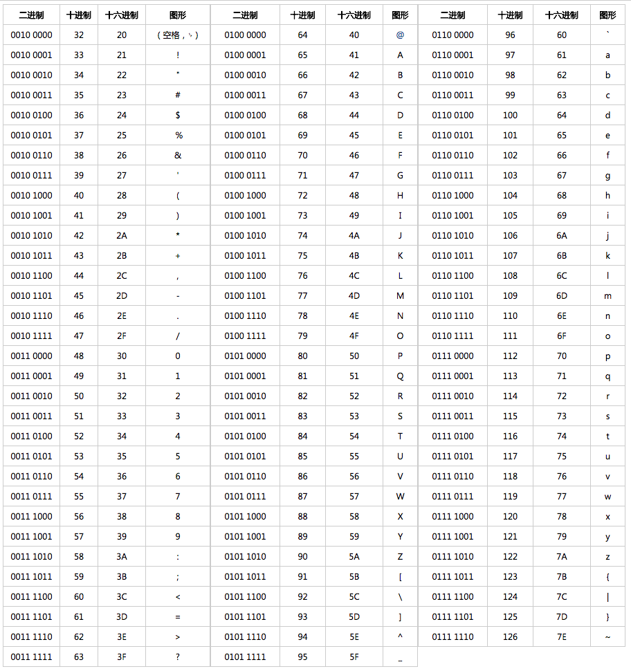
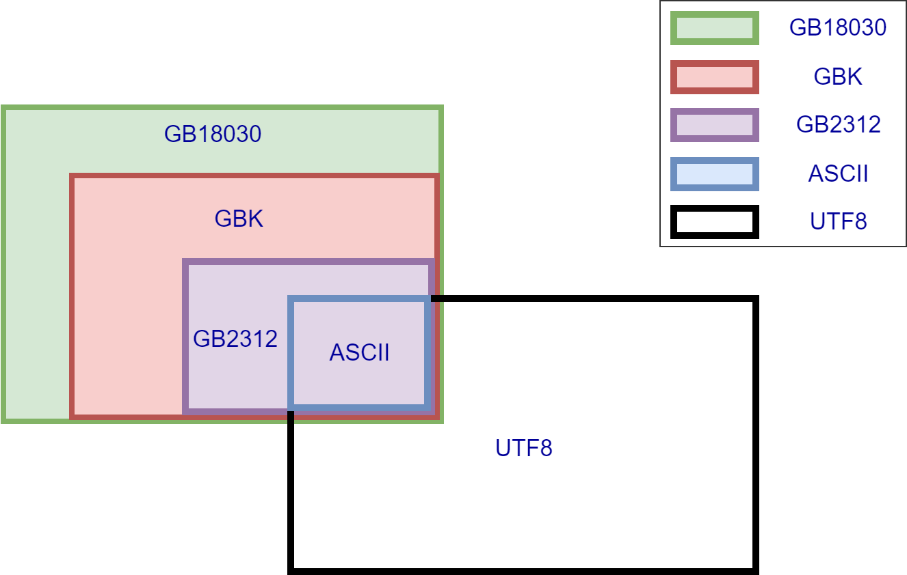

## 字符集

字符是各种文字和符号的统称，包括各个国家文字、标点符号、表情、数字等等。 

**字符集** 就是一系列字符的集合。字符集的种类较多，每个字符集可以表示的字符范围通常不同，就比如说有些字符集是无法表示汉字的。

## 字符编码

由于计算机只能存储二进制的数据，需要将这些字符和二进制的数据一一对应起来，而 **字符编码** 就是一种将字符集中的字符与计算机中的二进制数据相互转换的方法，可以看作是一种映射规则。字符转换为对应二进制数据的过程称为 "**编码**"，反之，二进制数据解析成字符的过程称为“**解码**”。

## 常见的计算机字符集

| 字符集  | 字符编码                |
| ------- | ----------------------- |
| ASCII   | ASCII 编码              |
| GB2312  | GB2312 编码             |
| GBK     | GBK 编码                |
| GB18030 | GB18030 编码            |
| Big5    | Big5 编码               |
| Unicode | UTF-8 编码、UTF-16 编码 |

字符集定义了可表示的字符范围。

字符编码决定了二进制和字符的映射规则。

### ASCII

**ASCII** (**A** merican **S** tandard **C** ode for **I** nformation **I** nterchange，美国信息交换标准代码) 是一套主要用于现代美国英语的字符集（这也是 ASCII 字符集的局限性所在）。

ASCII 字符集至今为止共定义了 128 个字符，其中有 33 个控制字符（比如回车、删除）无法显示。

一个 ASCII 码长度是一个字节也就是 8 个 bit，比如“a”对应的 ASCII 码是“01100001”。不过，最高位是 0 仅仅作为校验位，所以，ASCII 字符集可以定义 128（2^7）个字符。

> 后来，人们对其进行了扩展得到了 **ASCII 扩展字符集** 。ASCII 扩展字符集使用 8 位（bits）表示一个字符，所以，ASCII 扩展字符集可以定义 256（2^8）个字符。

### GB2312

GB2312 字符集是一种对汉字比较友好的字符集，共收录 6700 多个汉字，基本涵盖了绝大部分常用汉字。不过，GB2312 字符集不支持绝大部分的生僻字和繁体字。

对于英语字符，GB2312 编码和 ASCII 码是相同的，1 字节编码即可。对于非英字符，需要 2 字节编码。

> GB 是汉语拼音 guo  biao（国标）的首字母。

### GBK

GBK 字符集可以看作是 GB2312 字符集的扩展，兼容 GB2312 字符集，共收录了 20000 多个汉字。

> GBK 中 K 是汉语拼音 Kuo Zhan（扩展）的首字母。

### GB18030

GB18030 完全兼容 GB2312 和 GBK 字符集，纳入中国国内少数民族的文字，且收录了日韩汉字，是目前为止最全面的汉字字符集，共收录汉字 70000 多个。

### BIG5

BIG5 主要针对的是繁体中文，收录了 13000 多个汉字。

### Unicode

由于不同字符集的差异，使用错误的编码方式查看一个包含字符的文件就会产生乱码现象。

> 就比如说你使用 UTF-8 编码方式打开 GB2312 编码格式的文件就会出现乱码。示例：“牛”这个汉字 GB2312 编码后的十六进制数值为 “C5A3”，而 “C5A3” 用 UTF-8 解码之后得到的却是 “ţ”。

 为了统一所有文字的编码，Unicode 应运而生。Unicode 把所有语言都统一到一套编码里，这样就不会再有乱码问题了。

规定了能表示这些字符的二进制数据的字符编码有：

Unicode ：

UCS-4（Unicode Character Set - 4）：定长编码——编码固定占用 4 个字节，21 亿个编码空间。范围超过了 Unicode 的实际使用范围。

UTF-32（32-bit Unicode Transformation Format）：定长编码——编码固定占用 4 个字节，21 亿个编码空间。限定实际使用范围不超过 0x10FFFF，完美兼容 Unicode 标准。可以说：UTF-32 是 UCS-4 的一个子集。定长编码。

UCS-2（Unicode Character Set - 2）：定长编码——编码固定占用 2 个字节，65536 个编码空间。仅包含全世界最常用的字符编码。

UTF-16（16-bit Unicode Transformation Format）：变长编码——编码占用 2 ~ 4 个字节。额外使用 4 个字节对不常用的字符进行编码。

UTF-8（16-bit Unicode Transformation Format）：变长编码——编码占用 1 ~ 4 个字节。和 ASCII 字符集一样用 1 个字节表示英文字符，使用其他 3 个字节对其他字符进行编码。

目前，这些衍变方案中 UTF-8 和 UTF-16 被广泛使用，而 UTF-32 因为过于消耗空间很少被使用。UTF-8 是目前使用最广的一种字符编码，有利于节省网络带宽。

## 常见中文编码兼容关系图

虽然说 Unicode 字符集 和 GB 系列字符集都含有中文字符，但其中文编码格式不一样因此不兼容。

## 乱码问题

乱码问题的产生的主要原因：

- **文字的实际编码** 与 **程序解码时使用的编码** 不一致。（表现为不符合预期的、奇怪的字符）
- 系统没有支持该编码的字体。（表现为方框）

针对第一种的通用解决方法：

保存文件 =   `屏幕所见字符 --编辑改变--> 内存字符表示 --通过xx规则编码--> 原始字节（bytes）`
打开文件 = `原始字节（bytes） --通过xx规则解码--> 内存字符表示 --渲染--> 屏幕所见字符` 
只要确保这两个动作使用的规则一致

## 参考资料

[字符集详解 | JavaGuide](https://javaguide.cn/database/character-set.html)

