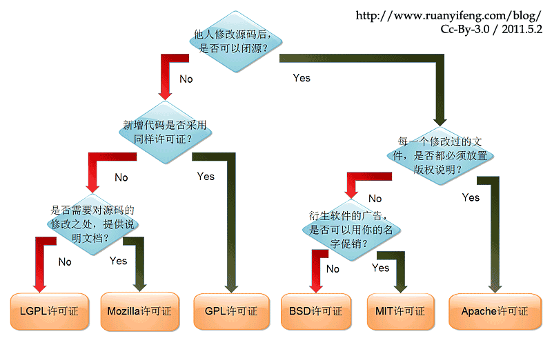
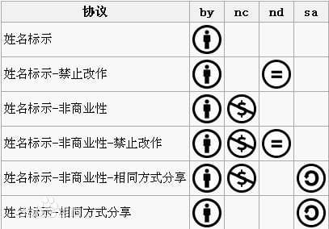
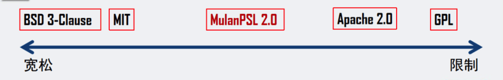
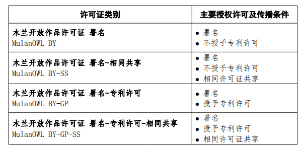

## 软件协议

大部分人都希望作品能够被多数人分享查阅。这样不仅提高自己业界的知名度，同时也方便了需要的人为开源做出了贡献。

为了公开分享你的代码，同时又让你对代码保留一定权利，在作品中声明一个许可协议是非常有必要的。

* 无协议的作品：默认为 Copy right 的，也就是版权保留。他人没有任何授权，不得复制分发修改使用等等

* 声明协议的作品：让原作者的作品在分享的同时保留了自身的一些权利，方便未来原作者的维权

**License** 是软件的授权许可，可分为 **开源** 和商业。里面详尽表述了你获得代码后拥有的权利，可以对别人的作品进行何种操作，何种操作又是被禁止的。

## 常见开源协议

最流行的六种----GPL、BSD、MIT、Mozilla、Apache 和 LGPL。

乌克兰程序员 Paul Bagwell，画了一张分析图，说明应该怎么选择，只用两分钟，你就能搞清楚这六种许可证之间的最大区别。下面是阮一峰中文翻译版本:

### Apache 许可协议

Apache 许可协议, 2.0 版本, 授予了用户大量的权利。这些权利可以应用于拷贝权，也 **可以用于专利权**。

### MIT 许可协议

MIT 协议是流行的开源协议中最简短的、使用最广泛的一种协议。MIT 协议是目前最少限制的协议。它基本上就是任何人可以对这个协议下的软件的做任何的事情，只要你能认可这个协议。

* 可以随意使用，复制，修改这个软件。
* 可以向外免费发放，或出售。
* 必须接受协议条款。

### BSD 许可协议

BSD 协议有很多分支，它们都代表了一种宽松的自由软件协议。相对其它协议，例如 GPL，它们对软件的传播给予了更少的限制。

* 基本上使用者可以自由的使用，修改源代码
* 将修改后的代码作为开源或者专有软件再发布。

发布使用 BSD 协议的代码或二次开发的使用 BSD 协议的代码时：

* BSD 协议非 copyleft，但必须声明原来代码中的 BSD 协议
* 不可用原原作者/机构名做市场推广

### GPL

GPL 的出发点是代码的开源/免费使用和引用/修改/衍生代码的开源/免费使用，但不允许修改后和衍生的代码作为闭源的商业软件发布和销售。

相比于其他的 **宽松自由软件许可协议（Permissive free software licence）**，GPL 是一个典型的 **著佐权许可证（copyleft license）**

>  Linux 就是采用了 GPL。也就是为什么我们能用各种免费的 linux。

### LGPL

LGPL 是 GPL 的一个为主要为类库使用设计的开源协议。与 GPL 的区别是，LGPL 允许闭源的商业软件通过类库引用(link)方式使用 LGPL 类库

### MPL

The Mozilla Public License，MPL 许可证出现的最重要原因就是，Netscape 公司认为 GPL 许可证没有很好地平衡开发者对源代码的需求和他们利用源代码获得的利益。

### 总结

软件的初始开发者使用了 GPL 协议并公开软件的源程序后，虽然不排斥软件原作者向用户收费，但后续使用该软件源程序开发软件者亦应当根据 GPL 协议把自己编写的源程序进行公开，这证实了 GNU 宣言中首先支持的原则——Copyleft 许可证，Copyleft 强调与 Copyright(版权)的镜像对立关系。因此，大公司对 GPL 协议又爱又恨，GPL 协议的软件经过众多程序员的完善十分成熟，但竞争对手也可以根据自己修改的源程序开发竞争产品。

正因大公司对 GPL 协议在商业上存在顾虑，因此，弱 copyleft 或无 copyleft 的协议被采用的更多。第一种是 LGPL 协议，如果只是对 LGPL 软件的程序库的程序进行调用而不是包含其源代码时，相关的源程序无需开源。第二种是 BSD 协议 。BSD 协议鼓励软件的原作者公开自己后续开发的源代码，但不强求。

## AGPL v3 开源协议

GPL 是 GPL 的一个补充, 在 GPL 的基础上加了一些限制。GPL 的约束生效前提是该软件 "发布"，有的公司就使用 GPL 组件编写 web 系统，但是不发布系统，只用这个系统在线提供服务，这样就避免了开源系统代码。而 AGPL 要求如果云服务(即 saas )用到的代码是该许可证，那云服务的代码也必须开源。

- **GPL**：GNU 通用公共许可证（GNU General Public License）
  - **GPL v3 协议**，意味着修改和使用其代码都需要开源，但是这是建立在软件分发的基础上，如果使用代码作为服务提供，而不分发软件，则不需要开源。这实际上是 GPL 协议本身的缺陷。
- **AGPL**：The GNU Affero General Public License
  - **AGPL v3 协议**，也就是说，除非获得商业授权，否则无论以何种方式修改或者使用代码，都需要开源。

因此商业公司在对互联网用户提供服务时，应慎用  AGPL v3 许可证的开源软件。

## 知识共享许可协议文本

[知识共享许可协议（Creative Commons license）](https://creativecommons.org/) 是一种公共著作权许可协议。

> 为你的作品快速选择一种 CC 协议 [Chooser - Creative Commons](https://creativecommons.org/chooser/)

六种许可协议规定了他人根据许可协议可以享有的一系列基本权利，知晓这些权利是非常有益的。

* 署名 － 非商业使用-禁止演绎 (by-nc-nd)

六种主要许可协议中限制最为严格的。这类许可协议通常被称为 **“免费广告”许可**。

只要注明原作者的姓名并与原作者建立链接，就可以下载并与他人共享原作者的作品，但不能对作品做出任何形式的修改或者进行商业性使用。

* 署名-非商业性使用-相同方式共享 (by-nc-sa)

只要注明原作者的姓名，可基于非商业目的对原作者的作品重新编排、节选或者以原作者的作品为基础进行创作，但必须在演绎作品上适用同一类型的许可许可条款。

* 署名-非商业性使用 (by-nc)

只要注明原作者的姓名，可基于非商业目的对原作者的作品重新编排、节选或者以原作者的作品为基础进行创作。

* 署名-禁止演绎 (by-nd)

只要保留原作者的署名，就可基于商业或者非商业目的，完整使用原作者的作品进行再传播

* 署名-相同方式共享 (by-sa)

该项许可协议与开放源代码软件许可协议相类似。

只要注明原作者的姓名，可基于商业或非商业目的对原作者的作品重新编排、节选或者以原作者的作品为基础进行创作，但必须在演绎作品上适用同一类型的许可许可条款。

* 署名 (by)

只要注明原作者的姓名，就可以基于商业目的发行、重新编排、节选原作者的作品。

## 木兰许可协议系列

 OSI 是定义“开源”、制定开源协议标准的组织，Mulan PSL 是国内首个被 OSI 认定的“国产开源软件协议。

### 木兰宽松许可协议

木兰宽松许可证(MulanPSL)

### 木兰公共许可协议

木兰公共版和宽松版最大的区别在于其 **传染性**，即他人使用了代码之后在特定情况下也必须采用木兰公共版进行开源。

### 木兰开放作品许可协议

类似于开源软件许可证，开放作品许可证是对开放作品的使用、复制、修改和分发等行为进行规范和约束的一种具有法律效力的格式合同，是保护创作者权利、推动开放作品发展的重要支撑。

### 木兰-白玉兰开放数据许可协议

木兰-白玉兰开放数据许可协议」是由「上海白玉兰开源开放研究院」在木兰开源社区框架和精神下所发起的一项研究项目，旨在探索创建一组标准化的、立足中国人工智能实践、推动数据要素流通、优化人工智能发展环境的数据许可协议。

## 参考文章

[如何选择开源许可证？ - 阮一峰的网络日志](https://www.ruanyifeng.com/blog/2011/05/how_to_choose_free_software_licenses.html)