# UML

UML是Unified Model Language的缩写，中文是统一建模语言，是由一整套图表组成的标准化建模语言。

## UML图的分类

- 结构图分为**类图**、轮廓图、组件图、组合结构图、对象图、部署图、包图。
- 行为图又分活动图、用例图、状态机图和交互图。
  - 交互图又分为序列图、**时序图**、通讯图、交互概览图。

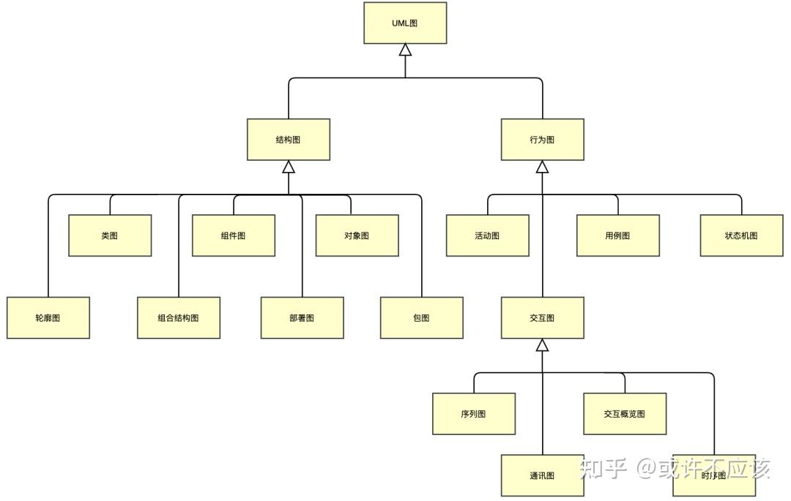

## 类图

定义：类图是一切面向对象方法的核心建模工具。类图描述了系统中对象的**类型**以及它们之间存在的各种静态**关系**。

目的：用来表示类、接口以及它们之间的静态结构和关系。

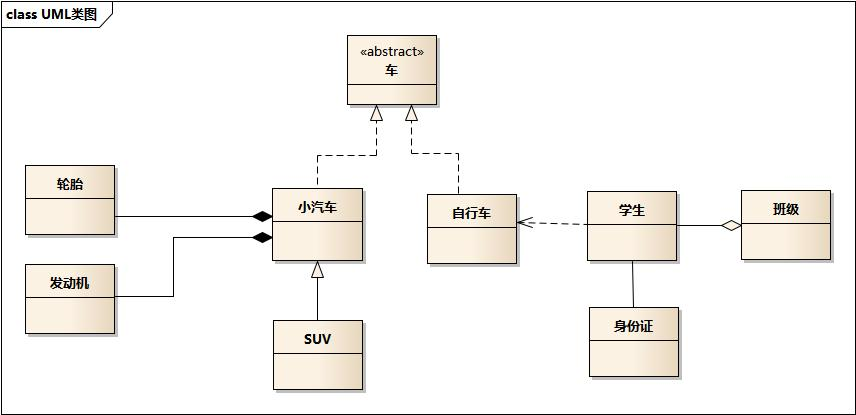

示例图中包含了类图的六种关系

### 泛化关系 generalization

关系定义：是一种**子类继承父类**的关系，表示子类继承父类的所有特征和行为；

箭头指向：用一条**带空心三角的实线**表示，三角指向父类；

代码体现：在 JAVA 代码中，泛化关系表现为继承非抽象类。

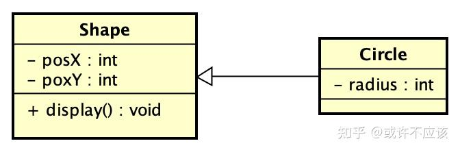

### 实现关系 Realization

关系定义：是一种**抽象与实现**的关系，表示类是接口所有特征和行为的实现。

箭头指向：用一条**带空心三角的虚线**表示，三角指向抽象的一方。

代码体现：在 JAVA 代码中，实现关系表现为继承抽象类或继承接口。

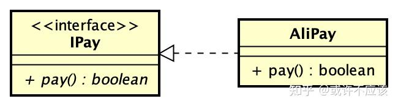

### 聚合关系 Aggregation

关系定义：是一种整体和部分的关系，且**部分可以离开整体而单独存在**。是一种强耦合的关联关系。

箭头指向：用一条**带空心菱形的实线**表示，菱形指向整体。

代码体现：在 JAVA 代码中，聚合关系表现为成员变量。

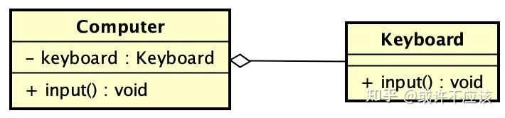

### 组合关系 Composite

关系定义：是一种整体和部分的关系，但**部分无法离开整体而单独存在**。是一种比聚合关系耦合更强的关系。

箭头指向：用一条**带实心菱形的实线**表示，菱形指向整体。

代码体现：在 JAVA 代码中，组合关系表现为成员变量。

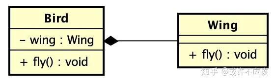

### 关联关系 Association

关系定义：是**普通的引用**关系，它使得一个类知道另一个类的属性和方法，两个类的对象生命周期彼此独立，耦合较弱。

箭头指向：用一条**实线**表示，关联关系默认不强调方向，如果特别强调方向，则加上箭头指向被拥有的一方。

代码体现：在 JAVA 代码中，关联关系表现为成员变量。

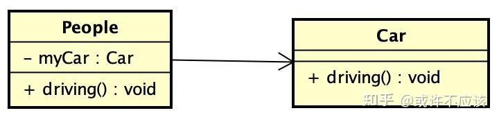

### 依赖关系 Dependency

关系定义：是一种**使用**关系，即一个类的实现需要另一个类的协助。是一种比关联关系耦合更弱的关系。

箭头指向：用一条**带普通箭头的虚线**表示，箭头指向被使用者。

代码体现：在代码中体现为类构造方法及类方法的传入参数

> 与关联关系不同的是，它是一种临时性的关系，而关联关系表示一种长期性、稳定性的拥有关系。

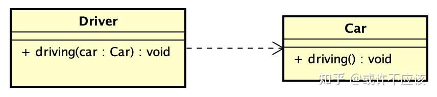

## 时序图

定义：时序图是一种 UML 交互图，描述对象之间发送消息的**时间顺序**显示多个对象之间的**动态协作**，亦称为序列图、循序图或顺序图。

目的：展示对象之间的交互顺序，将交互行为建模为消息传递，通过描述消息是如何在对象间发送和接收的来动态展示对象之间的交互。

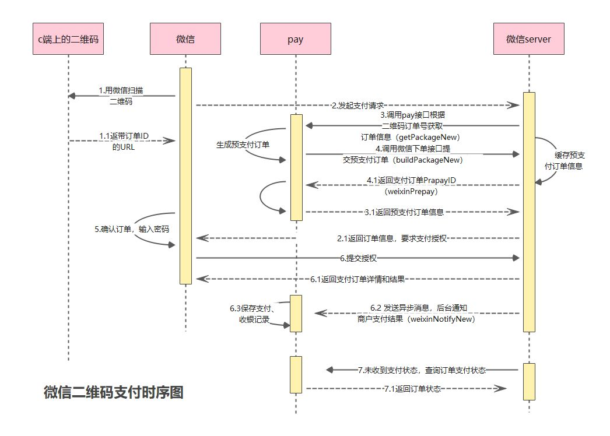

时序图会涉及以下七种元素

### 角色 Actor

系统角色，可以是人或者其他系统和子系统。以一个小人图标表示。

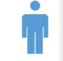

### 对象 Object 和 生命线 LifeLine

对象位于时序图的顶部,以一个矩形表示。对象的命名方式一般有三种：`对象名:类名`或`:类名`或`对象名`

生命线在时序图中表示为从对象图标向下延伸的一条虚线，表示对象存在的时间。

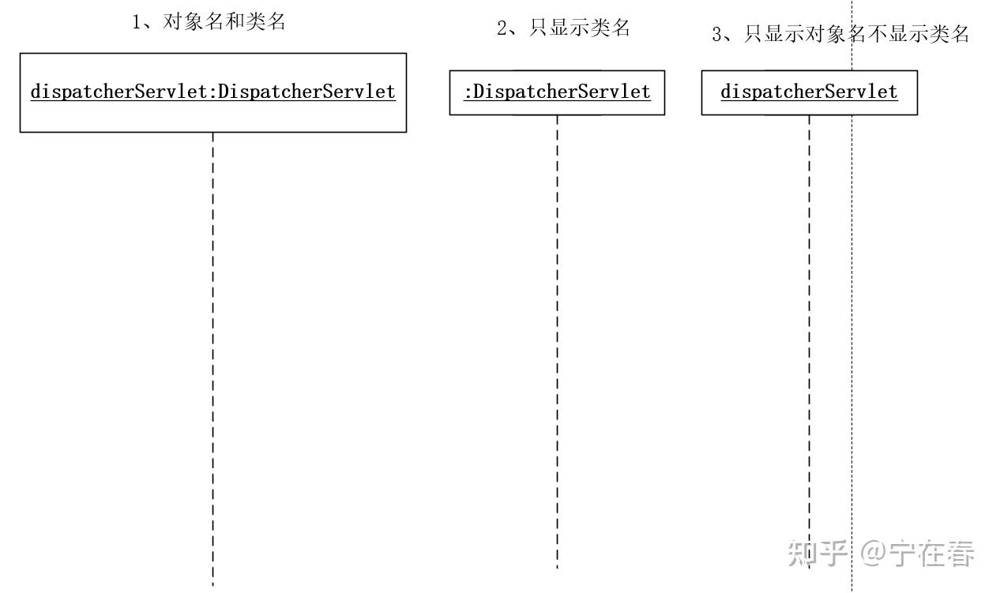

### 活动条 Activation

在生命线的虚线上可以用活动条来表示某种行为的开始和结束，一般用小矩形来表示。

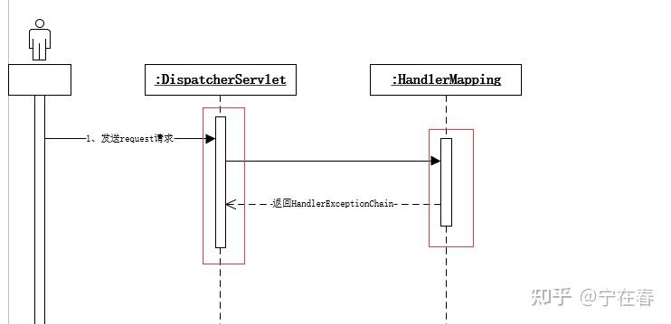

### 消息 Message

用生命线间带有实心箭头的实现表示，每条消息从发送对象指向接收对象。

在面向对象的分析和设计中，对象的行为也被称为消息，因为对象之间的行为的交互擢用也可以看成是对象之间发送消息实现的。

消息分为简单消息、同步消息和异步消息。

* 同步消息用实心箭头表示，意味着阻塞和等待，如：A向B 发送一个消息后，对象A 必须一直等到B执行完成后返回才能继续往下执行。

* 异步消息用开放式箭头表示，意味着是非阻塞，如：A向B发送消息后，直接可以执行下面代码，无需等待B的执行。

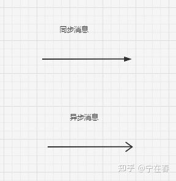

* 返回消息用虚线表示
* 自我调用消息

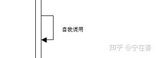

### 组合片段

UML在2.0时在时序图中加入了交互框。交互框用来解决交互执行的条件和方式。

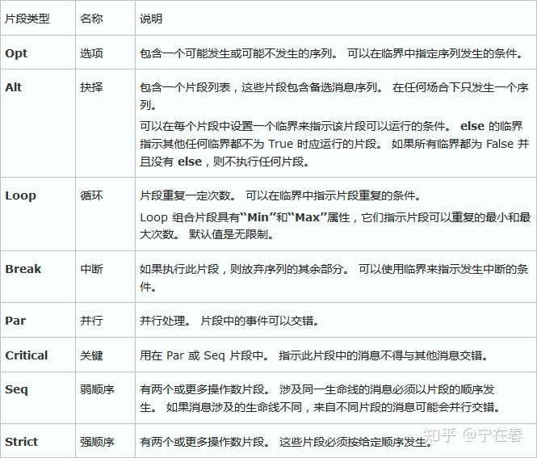

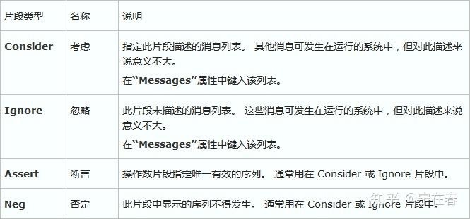

**alt (选择片段)**

Alt片段组合可以理解为if..else if...else条件语句。

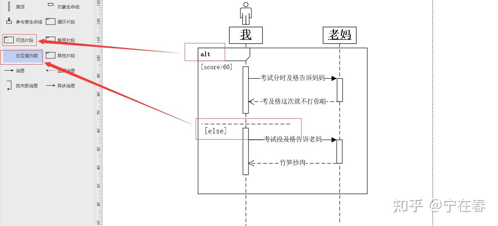

**Opt（选项）**

包含一个可能发生或不发生的序列。Opt相当于if..语句。

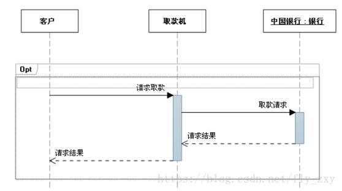

**Loop（循环）**

片段重复一定次数，可以在临界中指示片段重复的条件。Loop相当于for语句。

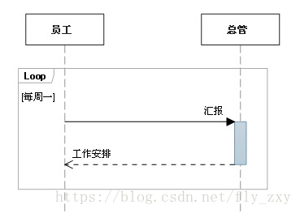

**Par（并行）**

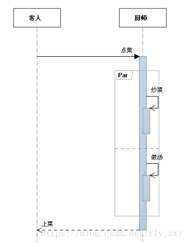

### SpringMVC 实例

SpringMVC的执行流程：

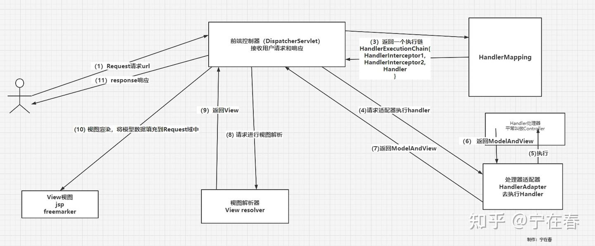

画成时序图如下：

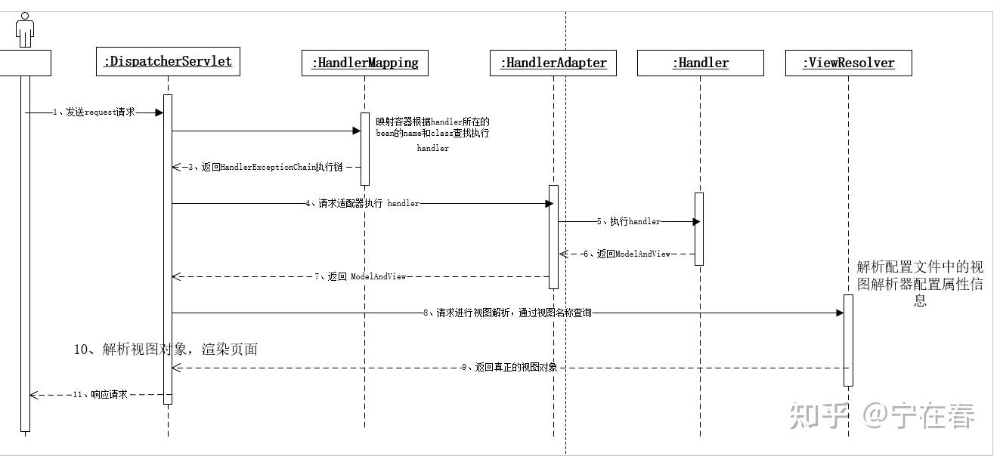

# 参考链接

[UML科普文，一篇文章掌握14种UML图 - 知乎](https://zhuanlan.zhihu.com/p/520475069)

[看懂UML类图和时序图 — Graphic Design Patterns](https://design-patterns.readthedocs.io/zh-cn/latest/read_uml.html)

[绘图之时序图 - wangxinzhi - 博客园](https://www.cnblogs.com/wangxinzhi/p/19322380)

[UML图 | 时序图（顺序、序列）绘制 - 知乎](https://zhuanlan.zhihu.com/p/422509874)
