[TOC]

# 设计模式概述

软件开发中，前人对软件系统的设计和开发总结了一些原则和模式，不管使用什么语言来开发，这些设计模式都对软件设计工作中提供指导意义。

提倡设计模式，是为了代码复用，使代码易懂，增加可维护性，保证程序的可靠性。

## 软件设计原则

[7 大原则](../开发理论/开发理论.md)

设计模式就是遵循并实现了这些原则，才达到了代码复用、增加可维护性的目的。

## GoF - 23 种设计模式

GoF（“四人组”（Gang of Four）的英文缩写） 合作出版了《设计模式：可复用面向对象软件的基础》一书，收录 23 种模式，并且分为三大类：创建型、结构型、行为型，自此树立了软件设计模式领域的里程碑。

### 创建型

用于创建对象的模式，对类的实例化进行抽象。

5 种模式

* **单例模式 Singleton**
* **工厂方法模式 Factory Method**
* 抽象工厂模式 Abstract Factory
* **建造者模式 Builder**
* 原型模式 Prototype

### 结构型

处理类或者对象的组合，有两种方式，一种是继承机制来组合接口，一种是组合对象来实现新功能。

7 种模式

* 适配器模式 Adapter
* 桥梁模式 Bridge
* **装饰器模式 Decorator**
* 门面模式 Facade
* 合成模式 Composite
* 享元模式 Flyweight
* **代理模式 Proxy**

### 行为型

在不同对象之间划分责任和算法，有两种方式，一种是使用继承关系来分配行为，一种是使用对象聚合的方式来分配行为。

11 种模式

* **模板方法模式 Template Method**
* 命令模式 Command
* 迭代器模式 Iterator
* **观察者模式 Observer**
* 调停者模式 Mediator
* 状态模式 State
* **策略模式 Strategy**
* 责任链模式 Chain of Responsibility
* 访问者模式 Visitor
* 备忘录模式 Memento
* 解释器模式 Interpreter

### 关联关系

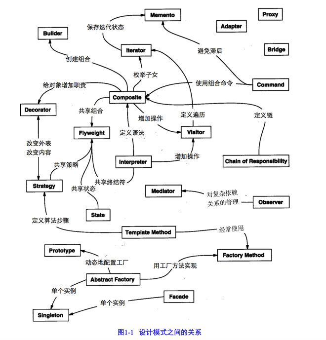

## J2EE 设计模式

J2EE设计模式是一组针对Java Enterprise Edition（J2EE）平台的特定问题而设计的模式，旨在提升 **可维护性、可扩展性、可复用性**，并降低系统耦合度。通过采用这些模式，开发者可以构建出更加健壮、可扩展和易于维护的应用程序。

这些设计模式通常结合分层架构与关注点分离原则，特别关注表现层。

- **MVC 模式（MVC Pattern）**
- 业务代表模式（Business Delegate Pattern）
- 组合实体模式（Composite Entity Pattern）
- **数据访问对象模式（Data Access Object Pattern）**
- 前端控制器模式（Front Controller Pattern）
- **拦截过滤器模式（Intercepting Filter Pattern）**
- 服务定位器模式（Service Locator Pattern）
- 传输对象模式（Transfer Object Pattern）

> 有的设计模式过于简单或者根本用不到，可以不做了解

# GoF 设计模式列表

## 创建型 - 单例模式 Singleton

### 定义

保证一个类仅有一个实例，并提供一个访问它的全局访问点。

### UML 类图

使用一个私有构造函数、一个私有静态变量以及一个公有静态函数来实现。

私有构造函数保证了不能通过构造函数来创建对象实例，只能通过公有静态函数返回唯一的私有静态变量。

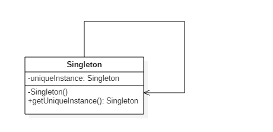

### 场景

这种模式特别适用于那些需要控制实例数量以节省系统资源的情况。

### 实现

**懒汉式**

私有静态变量的唯一实例被延迟实例化，在没用到这个类的情况时，可以节省内存资源。

但这个实现在多线程环境下时 **线程不安全** 的

```java
public class Singleton {

    private static Singleton uniqueInstance;

    private Singleton() {
    }

    public static Singleton getUniqueInstance() {
        if (uniqueInstance == null) { // uniqueInstance 为 null时，多个线程能够同时进入，那么会有多个线程执行，导致多次实例化 uniqueInstance
            uniqueInstance = new Singleton();
        }
        return uniqueInstance;
    }
}
```

**饿汉式**

类加载时就实例化 uniqueInstance，不会产生线程安全问题，但是无法像延迟实例化那样节约资源。

```java
public class Singleton {

    private static Singleton uniqueInstance = new Singleton();

    private Singleton() {
    }

    public static Singleton getUniqueInstance() {
        return uniqueInstance;
    }
}

```

**懒汉式-同步锁改进**

对 getUniqueInstance() 方法加锁，避免了多次实例化 uniqueInstance 的问题，但是其他线程的等待带来性能损耗。

```java
public static synchronized Singleton getUniqueInstance() {
    if (uniqueInstance == null) {
        uniqueInstance = new Singleton();
    }
     return uniqueInstance;
}
```

**懒汉式-双重校验锁**

第一个 `if`：只要 uniqueInstance 被实例化一次后，就可以直接使用了，线程没必要再按序等待。

`synchronized` 和第二个 `if`：类似上一个版本，为了避免多个线程获取锁后去实例化 `Singleton` 的问题

`volatile` ：第一个线程进入时，实例化 `Singleton` 的步骤如下，1 分配内存空间 >> 2 初始化对象 >> 3 将引用指向内存地址，JVM 的指令重排的特性可能使得 3 先于 2 执行，在第一个线程视角下是遵循遵守 as-if-serial 语义的（不管怎么重排序，单线程程序的执行结果都不能被改变），但可能导致 **后续某个线程在同步代码块之外拿到和操作空的 uniqueInstance**。使用 volatile 可以禁止 JVM 的指令重排，保证多线程环境下运行结果正常。

```java
public class Singleton {

    private volatile static Singleton uniqueInstance;

    private Singleton() {
    }

    public static Singleton getUniqueInstance() {
        if (uniqueInstance == null) {
            synchronized (Singleton.class) {
                if (uniqueInstance == null) {
                    uniqueInstance = new Singleton();
                }
            }
        }
        return uniqueInstance;
    }
}
```

**静态内部类实现**

当 Singleton 类加载时，静态内部类 SingletonHolder 没有被加载进内存。只有第一次调用 `getUniqueInstance()` 时，SingletonHolder 才会被加载且初始化 INSTANCE 实例。这种方式不仅具有 **延迟初始化** 的好处，而且由虚拟机提供了对 **线程安全** 的支持。

```java
public class Singleton {

    private Singleton() {
    }

    private static class SingletonHolder {
        private static final Singleton INSTANCE = new Singleton();
    }

    public static Singleton getUniqueInstance() {
        return SingletonHolder.INSTANCE;
    }
}
```

**枚举实现**

传统的的单例模式实现可以通过反射来获取私有构造器并强制实例化。除非在构造器中也加入单例的判断。

如果使用到序列化和反序列化，转换过程中也会重新创建对象。除非在类中提供一个 readResolve() 方法。

```java
public class SerializableSingleton implements Serializable{
 
	private static final SerializableSingleton SINGLETON = new SerializableSingleton();
 
	private SerializableSingleton() {
		// 防止反射破坏单例
		if (SINGLETON != null) {
			throw new RuntimeException("不允许创建多个实例！");
		}
	}
 
	public static SerializableSingleton getInstance() {
		return SINGLETON;
	}
 
	/**
	 * 解决方案。防止序列化破坏单例
	 * readResolve()方法是Java序列化机制中的一个回调方法，它在对象反序列化过程中被调用，允许开发者自定义反序列化后的对象。
	 * 其实还是创建了两个对象。发生在JVM层面的相对来说是比较安全的。
	 * 之前反序列化创建出来的对象会被 GC 回收
	 * @return SINGLETON
	 */
	private Object readResolve() {
		return SINGLETON;
	}
}
```

枚举是 **单例模式的最佳实践**，它实现简单，不仅是线程安全，还可以防止反射攻击（枚举构造方法是 `private` 且不会通过反射暴露构造方法），Java 虚拟机也会保证枚举实例反序列化时的唯一性，避免实例化多次。

```java
public enum Singleton {
    uniqueInstance;
}
```

## 创建型 - 简单工厂模式 Simple Factory

### 定义

提供一个创建对象实例的功能，而无须关心其具体实现。被创建实例的类型可以是接口、抽象类，也可以是具体的类。因为包含一个静态方法，又称静态工厂模式。

### UML 类图

简单工厂模式，又称静态工厂方法模式，不属于 GOF 定义的 23 种经典设计模式，是工厂模式家族中最简单实用的实现形式，被视为其他工厂模式的特例。

它把实例化的操作单独放到一个类的公开的静态方法中，这个类就成为简单工厂类，用于创造其他产品类。

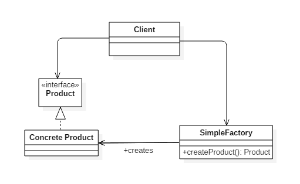

### 场景

简单工厂模式解决一个问题，当产品类的创造方式（如构造参数变了）发生改变，不需要去修改客户类，只需要修改工厂类。使用者只需要提出需求（产品接口的功能），就可直接消费产品而不需要知道其生产的细节。工厂类虽然没有去设计产品接口的实现方式，但帮助用户 **选择并获取** 到了某类产品的实例。

### 实现

**简单实现**

```java
public interface Product { // 抽象产品类
}
```

```java
public class ConcreteProduct implements Product { // 具体产品类
}
```

```java
public class ConcreteProduct1 implements Product { // 具体产品类
}
```

```java
public class ConcreteProduct2 implements Product { // 具体产品类
}
```

```java
public class SimpleFactory { // 简单工厂类
    public Product createProduct(int type) {
        if (type == 1) {
            return new ConcreteProduct1();
        } else if (type == 2) {
            return new ConcreteProduct2();
        }
        return new ConcreteProduct();
    }
}

public class Client { // 客户类
    public static void main(String[] args) {
        SimpleFactory simpleFactory = new SimpleFactory();
        Product product = simpleFactory.createProduct(1);
        // do something with the product
    }
}
```

**可配置的简单工厂**

在配置文件中，定义需要使用的具体产品类名称

在工厂类中，我们可以 **读取配置** 文件得到客户需要用到的具体产品类名称，通过 **反射** 去创建产品实例。

### 缺点

简单工厂模式的静态方法不能被继承和重写。

存在复杂的 switch 逻辑判断，不符合单一职责原则

简单工厂模式违背“开放 - 关闭原则”，一旦添加新产品就不得不修改工厂类的逻辑，这样就会造成工厂逻辑过于复杂。

为了解决上述的问题，我们又使用了一种新的设计模式：工厂方法模式。

## 创建型 - 工厂方法模式 Factory Method

### 定义

定义一个用于创建对象的接口，让子类决定实例化哪一个类，Factory Method 使一个类的实例化延迟到其工厂类的子类。

### UML 类图

在简单工厂中，创建对象的是静态方法，而在工厂方法中，是由子类来创建对象。

Factory 的 `factoryMethod()` 是抽象的，作用是创建并返回一个产品对象，需要由子类去实现，

Factory 的 `doSomething()` 方法，一般会使用 factoryMethod() 返回的产品对象。

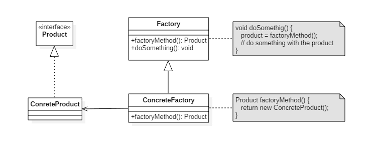

### 场景

将创建对象的任务委托给多个工厂子类中的某一个。

### 实现

```java
public abstract class Factory {
    abstract public Product factoryMethod(); // 或protected 取决于客户是否能直接获取产品
    public void doSomething() {
        Product product = factoryMethod();
        // do something with the product
        product.use();
    }
}
```

```java
public class ConcreteFactory extends Factory {
    public Product factoryMethod() {
        return new ConcreteProduct();
    }
}
```

```java
public class ConcreteFactory1 extends Factory {
    public Product factoryMethod() {
        return new ConcreteProduct1();
    }
}
```

```JAVA
public class ConcreteFactory2 extends Factory {
    public Product factoryMethod() {
        return new ConcreteProduct2();
    }
}
```

```java

public class Client {
    public static void main(String[] args){
        // 客户直接使用产品
        Factory concreteFactory = new ConcreteFactory();
        concreteFactory.doSomething();
		// 客户需要产品
        concreteFactory.factoryMethod().use();
    }
}
```

### 优点

解决了简单工厂模式的缺陷

* 工厂方法模式在添加新产品的时候就不修改工厂类逻辑而是添加新的工厂子类，符合开放封闭原则，克服了简单工厂模式中缺点。

* 每个具体工厂类只负责创建对应的产品，符合单一职责原则。

* 不使用静态方法，可以形成继承机制

### 缺点

* 添加新产品时，除了增加新产品类外，还要提供与之对应的具体工厂类，系统类的个数将成对增加，增加了系统的复杂度，带来了额外的类加载和运行的开销。

* 一个具体工厂只能创建一种具体产品

## 创建型 - 抽象工厂模式 Abstract Factory

### 定义

提供一个创建一系列相关或相互依赖对象的接口，而无需指定它们具体的类。

### UML 类图

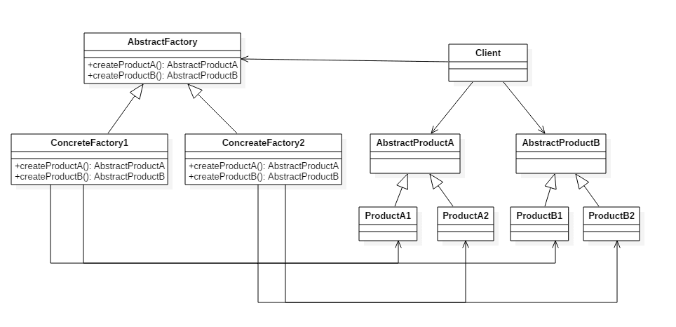

### 场景

使用一个具体工厂类创建 **相关** 的对象家族。抽象工厂模式创建的是对象家族，也就是很多对象而不是一个对象。这些对象虽然不属于同一种产品，但有着相关性，客户使用了单个具体工厂，合并得到了需要的产品家族。

例子，客户从 CPU 厂商任意购买一款 CPU，再从主板厂商任意购买了一款主板，这就是简单工厂模式或工厂方法模式，但买到了 intel 的 CPU 和 AMD 架构的主板导致无法使用。如果客户直接从电脑厂商购买配件，只需要选择某一款（AMD 架构或 Inter 架构，低端配置或高端配置）装机方案，从 CPU 到主板到内存到固态等都搭配好，避免了出现不匹配的错误，这就是抽象工厂模式。

如下情况，建议选择抽象工厂模式：

* 希望一个系统只是知道一些产品的接口，而不关心实现的时候；

* 强调相关产品的接口为一系列，以便联合使用它们的时候；

* 系统需要多个产品系列来定义的时候。

### 实现

```java
/** 
   * 产品A  下分不同实现1、2
   */  
public class AbstractProductA {
}
public class ProductA1 extends AbstractProductA {
}
public class ProductA2 extends AbstractProductA {
}

/** 
   * 产品B 下分不同实现1、2
   */  
public class AbstractProductB {
}
public class ProductB1 extends AbstractProductB {
}
public class ProductB2 extends AbstractProductB {
}
```

```php
/** 
   * 抽象工厂的接口，声明创建抽象产品对象的操作   如果要提供公共默认的方法，也可以是抽象类
   */  
public abstract class AbstractFactory {
    abstract AbstractProductA createProductA();
    abstract AbstractProductB createProductB();
}
/** 
   * 具体工厂的实现 创建一系列具体的产品对象 
   */ 
public class ConcreteFactory1 extends AbstractFactory {
    AbstractProductA createProductA() {
        return new ProductA1();
    }

    AbstractProductB createProductB() {
        return new ProductB1();
    }
}
/** 
   * 具体工厂的实现 创建一系列具体的产品对象 
   */ 
public class ConcreteFactory2 extends AbstractFactory {
    AbstractProductA createProductA() {
        return new ProductA2();
    }

    AbstractProductB createProductB() {
        return new ProductB2();
    }
}
```

```java
/** 
   * 客户端
   */ 
public class Client {
    public static void main(String[] args) {
        AbstractFactory abstractFactory = new ConcreteFactory1();
        AbstractProductA productA = abstractFactory.createProductA();
        AbstractProductB productB = abstractFactory.createProductB();
        // do something with productA and productB
    }
}
```

### 优点

* 在抽象工厂模式中，和简单工厂模式或工厂方法模式一样，解决了客户只知产品接口而不知产品实现的问题，同时还 **约束了所需一系列产品的关系**。

* 抽象工厂模式也符合了工厂方法模式的定义，工厂类的各个抽象方法都是让子类来实现，每个方法单独来看就是在创建一个对象。

* 具有灵活性，切换一个产品簇的时候，只要提供不同的抽象工厂实现就好了，也就是说现在是以产品簇做为一个整体被切换。

### 缺点

**容易造成类层次复杂**。假如已经做了一层层次的区分，如选择导入数据的形式 XML 或数据库，之后又将数据库实现分为几种，基于 oracle、基于 sqlServer、基于 MySQL，把这些实现也分出层次来很容易造成复杂的类层次结构。

对于新的产品族符合开-闭原则；对于新的产品种类不符合开-闭原则。

## 创建型 - 生成器模式 Builder

### 定义

将一个复杂对象的构建与它的表示分离，使得同样的构建过程可以创建不同的表示。又称构建器模式、建造者模式。

### UML 类图

`Builder` 是定义了如何构建各个部件，也就是知道每个部件功能如何实现，以及如何装配这些部件到产品中去，最终也是由生成器来返回产品对象。

`Director`（可选）是知道如何组合来构建产品，也就是说 Director 负责整体的构建算法，而且通常是分步骤的来执行。有了指导者，客户也无需关注生成器的具体实现，只需要传入不同的生成器来切换构造过程。`Director` 更多关注最终完整的成果，如果业务比较简单或者客户端想随心构建”半成品“，也可以直接操作 `builder`。

`Product` 是装配后产品或装配过程中的半成品

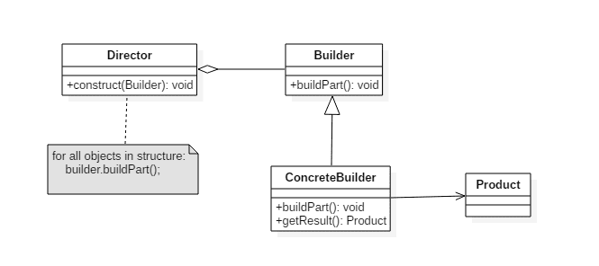

### 场景

生成器模式的主要功能是构建复杂的产品，而且是细化的，分步骤的构建产品，生成器将一个复杂的对象的构建与它的表示分离，也就是生成器模式重在解决一步一步构造复杂对象的问题。构建的过程是统一的，但是变化的部分放在了生成器的不同实现上面。**要配置不同的生成器，那么同样的构建过程，就能构建出不同的产品表示来**。

以下场景适合生成器模式：

1. 如果创建对象的算法，应该独立于该对象的组成部分以及它们的装配方式时；

2. 同一个构建过程有着不同的表示时；

例如，一份表格数据要导出成文本形式、XML 形式、excel 格式等，数据内容的一致使得其构建方式也有一定的统一性，导出的格式都分为三个部分文件头（表格标题）、文件体（分条描述数据）、文件尾（输出时间、输出人），因此可以定义生成器接口将三个步骤固化，不同的生成器实现对应不同格式的构造方式。

### 实现

**通用实现**

```java
// 生成器接口
public interface Builder { 
    public void buildPart(); // 构建某个部件
    public void buildPart2(); // 构建某个部件
    public void buildPart3(); // 构建某个部件
}
```

```java
// 具体的生成器实现
public class ConcreteBuilder implements Builder {
   
    private Product resultProduct; // 最终构建的产品对象
    
    // 获取生成器最终构建的产品对象
    public Product getResult() {
       return resultProduct;
    }

    public void buildPart() {
        ...
    }
    public void buildPart2() {
        ...
    }
    public void buildPart3() {
        ...
    }
}
```

```java
// 产品接口
public interface Product {
}
```

```java
// 指导者，指导使用生成器的接口来构建产品的对象
public class Director {
    // 持有当前需要使用的生成器对象
    private Builder builder;

    // 传入生成器对象
    public Director(Builder builder) {
       this.builder = builder;
    }

    /**
     * 指导生成器构建的方法
     */
    public void construct() {
       // 实际业务可能更加复制
       builder.buildPart1();
       builder.buildPart2();
       builder.buildPart3();
    }
}
```

 **JDK 1.8 的 StringBuilder 实现**

`AbstractStringBuilder` 为生成器接口

`StringBuilder` 为生成器具体实现

`char[]` 为构建的产品

`StringBuilder.toString()` 获取最终的字符串结果

```java
public class AbstractStringBuilder {
    protected char[] value;

    protected int count;

    public AbstractStringBuilder(int capacity) {
        count = 0;
        value = new char[capacity];
    }

    public AbstractStringBuilder append(char c) {
        ensureCapacityInternal(count + 1);
        value[count++] = c;
        return this;
    }

    private void ensureCapacityInternal(int minimumCapacity) {
        // overflow-conscious code
        if (minimumCapacity - value.length > 0)
            expandCapacity(minimumCapacity);
    }

    void expandCapacity(int minimumCapacity) {
        int newCapacity = value.length * 2 + 2;
        if (newCapacity - minimumCapacity < 0)
            newCapacity = minimumCapacity;
        if (newCapacity < 0) {
            if (minimumCapacity < 0) // overflow
                throw new OutOfMemoryError();
            newCapacity = Integer.MAX_VALUE;
        }
        value = Arrays.copyOf(value, newCapacity);
    }
}
```

```java
public class StringBuilder extends AbstractStringBuilder {
    public StringBuilder() {
        super(16);
    }

    @Override
    public String toString() {
        // Create a copy, don't share the array
        return new String(value, 0, count);
    }
}
```

```java
public class Client {
    public static void main(String[] args) {
        StringBuilder sb = new StringBuilder();
        final int count = 26;
        for (int i = 0; i < count; i++) {
            sb.append((char) ('a' + i));
        }
        System.out.println(sb.toString());
    }
}
```

**构建方法返回生成器对像**

```csharp
// 需要生成的对象
public class ConcreteProduct {
    private String field1;
    private String field2;
    private String field3;
    private String field4;

    /**
     * default访问级别是同包能访问，不希望外部的对象直接通过new来创建保险合同对象
     */
    ConcreteProduct(ConcreteBuilder builder){
       this.field1 = builder.field1();
       this.field2 = builder.field2();
       this.field3 = builder.field3();
       this.field4 = builder.field4();
    }

    public void doSomething(){
       System.out.println("doSomething"+this.contractId);
    }
}
```

```java
// 生成器
public class ConcreteBuilder {
    private String field1;
    private String field2;
    private String field3;
    private String field4;
    
    // 传入必要的参数
    public ConcreteBuilder(String field1,String field2){
       this.field1 = field1;
       this.field2 = field2;
    }
    // 选填数据，返回生成器对像
    public ConcreteBuilder setField3(String field3){
       // 此处可以加上单个数据的校验规则
       this.field3 = field3;
       return this;
    }
    // 选填数据，返回生成器对像
    public ConcreteBuilder setField4(String field3){
       // 此处可以加上单个数据的校验规则
       this.field4 = field4;
       return this;
    }
    
    /**
     * 构建真正的对象并返回
     * @return 构建的保险合同的对象
     */
    public ConcreteProduct build(){
       // 此处可以加上整体的校验规则
       return new ConcreteProduct(this);
    }
}
```

```java
public class Client {
    public static void main(String[] args) {
       //创建构建器
       ConcreteBuilder builder = new ConcreteBuilder("1","2");
       //设置需要的数据，然后构建出产品对象
       ConcreteProduct product = builder.setField3("张三").setField4("test").build();
       //操作产品对象的方法
       product.doSomething();
    }
}
```

**生成器类内联化**

构建器的功能就是为了创建被构建的对象，完全可以不用单独一个类。

重构的手法通常是将类内联化（Inline Class），放到这里来，简单点说就是把构建器对象合并到被构建对象里面去。

```java
// 需要生成的对象
public class ConcreteProduct {
    // 
    // 生成器
    public class ConcreteBuilder {
    }
}
```

```java
public class Client {
    public static void main(String[] args) {
       //创建构建器
       ConcreteBuilder builder = new ConcreteProduct.ConcreteBuilder("1","2");
       //设置需要的数据，然后构建出产品对象
       ConcreteProduct product = builder.setField3("张三").setField4("test").build();
       //操作产品对象的方法
       product.doSomething();
    }
}
```

### UML 时序图

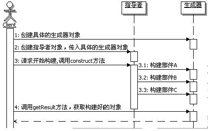

### 优点

1. 生成器模式是把产品构建的过程独立出来，使它和具体产品的表现 **松散耦合**，从而使得构建算法可以复用，而具体产品表现也可以灵活的、方便的扩展和切换。
2. builder 对象只是提供接口给 Director 使用，具体的部件创建和装配方式是被 Builder 接口隐藏了，可以 **很容易改变产品的内部表示**，只需要切换 Builder 的具体实现即可。

## 创建型 - 原型模式 Prototype

### 定义

用原型实例指定创健对象的种类，并通过拷贝这些原型创建新的对象。

### UML 类图

原型模式会要求对象实现一个可以“克隆”自身的接口，这样就可以通过拷贝或者是克隆一个实例对象本身，来创建一个新的实例。

`Prototype`: 声明了可以克隆自身的原型接口

`ConcretePrototype`：实现 `Prototype` 接口的类，这些类真正实现了克隆自身的功能。


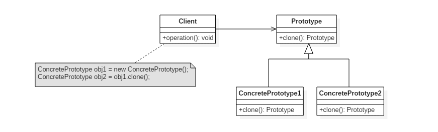

### 场景

* 如果一个系统想要独立于它想要使用的对象时，可以使用原型模式，让系统只面向接口编程，在系统需要新的对象的时候，可以通过克隆原型来得到；

* 如果需要拷贝出一模一样或差别不大的实例，可以使用原型模式，通过克隆原型来得到需要的实例；


### 实现

**通用实现**

```java
public abstract class Prototype {
    abstract Prototype myClone();
}
```

```java
public class ConcretePrototype extends Prototype {

    private String filed;

    public ConcretePrototype(String filed) {
        this.filed = filed;
    }

    @Override
    Prototype myClone() {
        return new ConcretePrototype(filed);
    }

    @Override
    public String toString() {
        return filed;
    }
}
```

```java
public class Client {
    public static void main(String[] args) {
        Prototype prototype = new ConcretePrototype("abc");
        Prototype clone = prototype.myClone();
        System.out.println(clone.toString());
    }
}
```

**使用 Java.lang.Object#clone() 和 Java.lang.Cloneable**

在 Java 中，一个类必须实现标记接口 `Cloneable` 才能使用 `clone()` 方法。如果一个类没有实现 `Cloneable` 接口并尝试调用 `clone()`，将抛出 `java.lang.CloneNotSupportedException` 异常。

`java.lang.Cloneable` 接口没有需要实现的方法，是一个标识接口。

```java
public abstract class Prototype {
    // 不需要声明自定义的克隆接口
}
```

```java
public class ConcretePrototype extends Prototype implements Cloneable {

    private String filed;

    public ConcretePrototype(String filed) {
        this.filed = filed;
    }

    public Object clone() {
        //克隆方法的真正实现，直接调用父类的克隆方法就可以了
        Object obj = null;
        try {
            obj = super.clone();
        } catch (CloneNotSupportedException e) {
            e.printStackTrace();
        }
        return obj;
    }

    @Override
    public String toString() {
        return filed;
    }
}
```

**浅度克隆和深度克隆**

浅度克隆：只负责克隆按值传递的数据（比如：基本数据类型、String 类型）。

深度克隆 **：** 除了浅度克隆要克隆的值外，还负责克隆引用类型的数据，基本上就是被克隆实例所有的属性的数据都会被克隆出来。

正确的执行深度拷贝，必须手工的对每一个引用类型的属性进行克隆，并重新设置，覆盖掉 super.clone()所拷贝的值。

```java
public Object clone(){
    PersonalOrder obj=null;
    try {
        obj =(PersonalOrder)super.clone();
        // 每一个引用类型的属性也要进行克隆，否则这个属性指向的依旧是原先的对象。
        obj.setProduct((Product)this.product.clone());
    } catch (CloneNotSupportedException e) {
        e.printStackTrace();
    }     
    return obj;
}
```

### UML 时序图

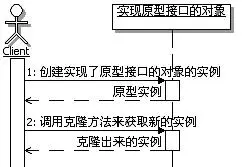

### 优点

客户端无须知道具体的实现类型就能通过原型创建新的对象，从而减少了客户端对这些具体实现类型的依赖。

### 缺点

深度克隆较为麻烦，必须要能够递归的让所有的引用类型的相关对象都要正确的实现克隆。

## 结构型 - 外观模式 Facade

### 定义

为子系统中的一组接口提供一个一致的界面，Facade 模式定义了一个高层接口，这个接口使得这一子系统更加容易使用。

遵循了迪米特法则（最少知识原则）: 只和你的密友谈话。一个类应该对自己需要耦合或调用的类知道得最少。

### UML 类图

`Facade` 包装了已有的功能，为子系统提供了一个一致的界面，但不是子系统的一部分，这个外观类组合调用子系统内部的多个模块来实现客户需要。

`SubSystem` 通常是各有交互的多个接口的组合，调用多个接口可以真正实现一个特定功能，此处接受 `Facade` 的委派。

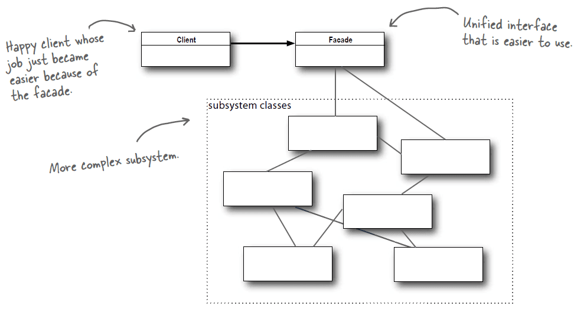

### 场景

如果希望为一个复杂的子系统提供一个简单接口的时候

如果想要让客户程序和抽象类的实现部分松散耦合

如果构建多层结构的系统

### 实现

```java
/**
   * 多个模块
   */
public interface AModuleApi {
      public void testA();
}
public class AModuleImpl implements AModuleApi{
      public void testA() {
          System.out.println("A模块里面操作testA方法");
      } 
}
public interface BModuleApi {
      public void testB();
}
public class BModuleImpl implements BModuleApi{
      public void testB() {
          System.out.println("B模块里面操作testB方法");
      } 
}
public interface CModuleApi {
      public void testC();
}
public class CModuleImpl implements CModuleApi{
      public void testC() {
          System.out.println("C模块里面操作testC方法");
      } 
}
```

```java
/**
   * 外观类
   */
public class Facade {
      /**
       * 示意方法，满足客户需要的功能
       */
      public void test(){
          //在内部实现的时候，可能会调用到内部的多个模块
          AModuleApi a = new AModuleImpl();
          a.testA();
          BModuleApi b = new BModuleImpl();
          b.testB();
          CModuleApi c = new CModuleImpl();
          c.testC();
      }
}
```

```java
public class Client {
      public static void main(String[] args) {
          //使用Facade
          new Facade().test();
      }
}
```

### UML 时序图

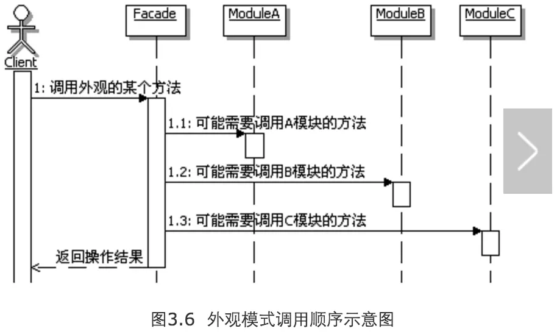

### 优点

1. 松散耦合：减少了客户端与子系统的耦合，很好地体现了最少知识原则，提高系统的易维护性和扩展性。当子系统的调用方式发生改变时，只需要修改外观类即可。
2. 划分层次：为子系统使用使用 Facade，仅暴露需要的外部功能，而隐藏内部的细节，防止客户端直接接触内部的其他功能。
3. 灵活性：外观并不限制那些需要更多定制功能的用户，允许直接越过外观去访问内部的模块的功能。
4. 简单易用、缺省实现：让外部不需要了解子系统的复杂交互，也能够更简单的使用子系统，也可以提供一个缺省的交互方式。

### 与其他模式

**中介者模式**

外观模式和中介者模式类似，但中介者模式多用于系统内部各个模块之间（如 A 模块、B 模块、C 模块之间的互相调用），外观模式通常是客户端对系统单方面的调用。

**抽象工厂**

当外观模式需要创建各个模块的实例，再调用模块的功能时，就类似于抽象工厂模式的一个工厂。因此外观类也可以通过抽象工厂来获取所需要的接口。

**单例模式**

外观类通常时只需要一个实例，可以与单例模式组合使用。

## 结构型 - 适配器模式 Adapter

### 定义

将一个类的接口转换成客户希望的另外一个接口。适配器模式使得原本由于接口不兼容而不能一起工作的那些类可以一起工作。

### UML 类图

`Client`：客户端，调用自己需要的领域接口 Target。

`Target`：定义客户端需要的跟特定领域相关的接口，也是 `Adaptee` 需要适配成为的接口。

`Adaptee` **：** 已经存在的接口，通常能满足客户端的功能要求，但是接口与客户端要求的特定领域接口不一致，**需要被适配**。

`Adapter`：**适配器**，把 `Adaptee` 适配成为 `Client` 需要的 `Target`。


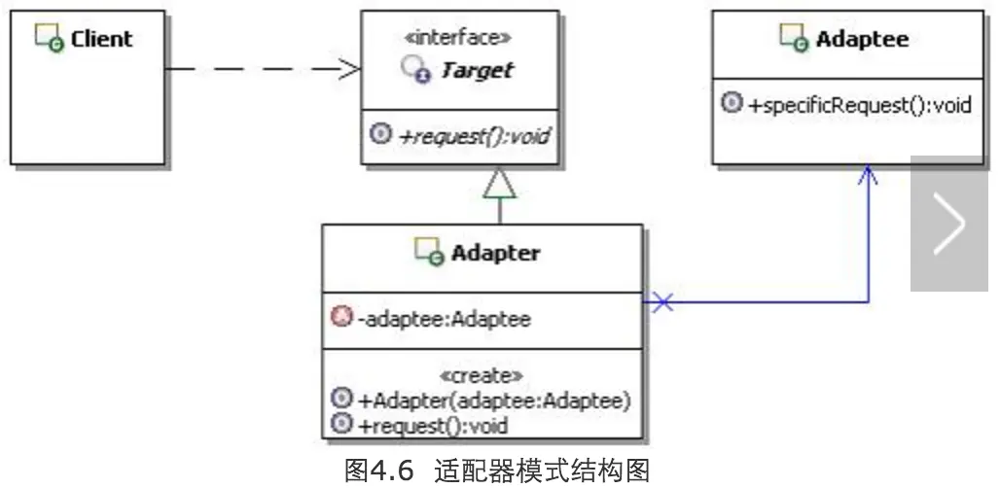

### 场景

想要使用一个已经存在的类，但不兼容当前需求的接口时，可以用适配器模式把不兼容的接口转换成客户端期望的样子就好了。

如果想使用一些已经存在的子类，也能直接适配这些子类的父类

### 实现

**Adapter 为 Target 的实现**

```csharp
// 客户端需要使用的接口
public interface Target {
    // 方法，客户端请求处理的方法
    public void request();
}
```

```java
// 能满足功能但需要适配的类
public class Adaptee {
    public void specificRequest() {
        //具体的功能处理
    }
}
```

```java
/**
   * 适配器
   */
public class Adapter implements Target {
    // 持有需要被适配的接口对象
    private Adaptee adaptee;
    
    // 构造方法，传入需要被适配的对象
    public Adapter(Adaptee adaptee) {
        this.adaptee = adaptee;
    }
    public void request() {
        //可能转调已经实现了的方法，进行适配
        adaptee.specificRequest();
    }
}
```

```java
public class Client {  
    public static void main(String[] args) {
        Adaptee adaptee = new Adaptee();
        Target target = new Adapter(adaptee);
        target.request();
    }
}
```

**双向适配器**

```java
// 客户端需要使用的接口
public interface Adaptee1 {
    public void request1();
}
public interface Adaptee2 {
    public void request2();
}
```

```java
/**
   * 双向适配器
   */
public class Adapter implements Adaptee1, Adaptee2 {
    // 持有需要被适配的接口对象
    private Adaptee1 adaptee1;
    private Adaptee2 adaptee2;
    
    // 构造方法，传入需要被适配的对象
    public Adapter(Adaptee1 adaptee1, Adaptee2 adaptee2) {
        this.adaptee1 = adaptee1;
        this.adaptee2 = adaptee2;
    }
    public void request1() {
        adaptee2.request2();
    }
    public void request2() {
        adaptee1.request1();
    }
    
}
```

```java
public class Client {  
    public static void main(String[] args) {
        Adaptee1 adaptee1 = new Adaptee1();
        Adaptee2 adaptee2 = new Adaptee2();
        
        // 使用第一版 第二版被适配
        Adaptee1 target1 = new Adapter(adaptee1, adaptee2);
        target1.request1();
        
        // 使用第二版 第一版被适配
        Adaptee2 target2 = new Adapter(adaptee1, adaptee2);
        target2.request2();
    }
}
```

**SpringMVC 的 HandlerAdapter**

**HandlerAdapter** 是 SpringMVC 中的一个重要组件，它的主要作用是 **适配不同类型的处理器（Handler）**，使得这些处理器能够被统一调用。SpringMVC 中的处理器可以有多种实现形式，例如实现 *Controller* 接口、实现 *HttpRequestHandler* 接口或者使用 *@RequestMapping* 注解的方法。由于这些处理器的实现方式不同，调用方式也不一样，因此需要使用适配器模式来进行适配。

### 优点

1. 复用性：适配器模式就可以让已有的功能得到更好的复用。
2. 扩展性：实现适配器功能可以自然的对旧的功能增添功能，有点类似装饰模式。

### 缺点

过多的使用适配器，会让系统非常零乱，不容易整体进行把握

### 与其他模式

**桥接模式**

与桥接模式结构上相似，但功能上不同。适配器模式是把两个或者多个接口的功能进行转换匹配；而桥接模式是让接口和实现部分相分离，以便它们可以相对独立的变化。

**装饰模式**

适配器模式也能模拟实现简单的装饰模式的功能，在适配过程中为已有功能增添功能。但其目的和本质时不一样的，适配器模式是为了使原有的功能兼容需要的接口，而装饰模式是不改接口的。

## 结构型 - 桥接模式 Bridge

### 定义

**将抽象部分与它的实现部分分离**，使它们都可以独立地变化。

桥接模式就是为被分离了的抽象部分和实现部分来搭桥，让抽象部分拥有实现部分的接口对象，这就桥接上了。

桥接模式可以看作是“面向抽象编程”的体现。

### UML 类图

`Abstraction`：抽象部分的接口。通常在这个对象里面，要维护一个实现部分的对象引用，在抽象对象里面的方法，需要调用实现部分的对象来完成。这个对象里面的方法，通常都是跟具体的业务相关的方法。因此是用抽象类来担任。

`RefinedAbstraction`：扩展抽象部分的实现类，通常在这些类里面，定义跟实际业务相关的方法，这些方法的实现通常会使用 `Abstraction` 中定义的方法，也可能需要调用 `Implementor` 来完成。

`Implementor`：定义实现部分的接口，`Implementor` 接口为 `Abstraction` 提供基本的操作，而 `Abstraction` 里面定义的是基于这些基本操作的更高层次的业务方法。

`ConcreteImplementor`：真正实现 `Implementor` 接口的对象。

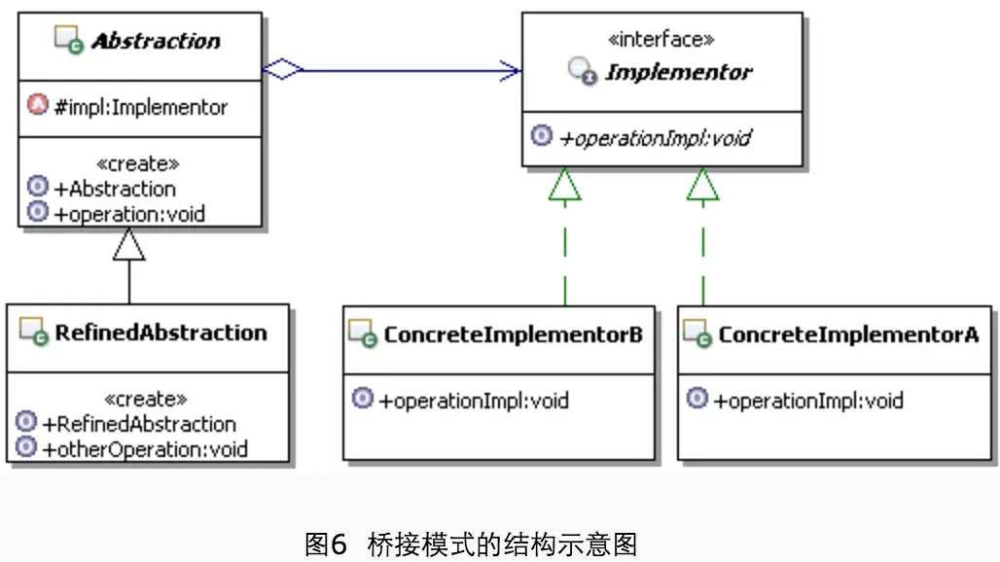

### 场景

继承是扩展对象功能的一种常见手段，通常情况下，继承扩展的功能变化纬度都是一纬的，也就是变化的因素只有一类。出现变化因素有两类的，继承实现就会比较痛苦。

例如，要实现消息发送功能会有两个维度，一个是因为消息的加急类别而进行不同的处理；另外一个是消息的发送方式（SMS、邮件）的不同。若采用继承方式，需要实现普通的 SMS、加急的 SMS、特急的 SMS、普通的邮件、加急的邮件、特急的邮件等，如果要在任何一个纬度上进行扩展，都需要实现另外一个纬度上的可变数量那么多个实现类。

**桥接模式就是用来解决这种有两个变化纬度的情况下，如何灵活的扩展功能的一个很好的方案。**

### 实现

**通用实现**

```java
// 含有实现内容的接口
public interface Implementor {  
      // 实现抽象部分需要的某些具体功能 
      public void operationDetail();  
}  

public class ConcreteImplementorA implements Implementor {  
      public void operationImpl() {   
          // 实现的操作  
      }  
}  

public class ConcreteImplementorB implements Implementor {  
      public void operationImpl() {   
          // 实现的操作  
      }  
}  
```

```java
// 抽象部分的接口
public abstract class Abstraction {  
      // 持有一个实现部分的对象 
      protected Implementor impl;  
    
      // 构造方法，传入实现部分的对象
      public Abstraction(Implementor impl){  
          this.impl = impl;  
      }  
    
      // 实现一定的功能，可能需要转调实现部分的具体方法 
      public void operation() {  
          impl.operationDetail();  
      }  
} 

// 扩充抽象部分的接口功能 
public class RefinedAbstraction extends Abstraction {  
      public RefinedAbstraction(Implementor impl) {  
          super(impl);  
      }  
      // 实现一定的功能  
      public void otherOperation(){  
          //实现一定的功能，可能会使用具体实现部分的实现方法，  
          //但是本方法更大的可能是使用Abstraction中定义的方法，  
          //通过组合使用Abstraction中定义的方法来完成更多的功能  
      }  
}
```

```java
// 由客户端自行创建需要的实现部分的对象
public class Client {
    public static void main(String[] args) {
        RefinedAbstraction refinedAbstraction = new RefinedAbstraction(new ConcreteImplementorA());
        refinedAbstraction.operation();
        refinedAbstraction.otherOperation();
        
        refinedAbstraction = new RefinedAbstraction(new ConcreteImplementorB());
        refinedAbstraction.operation();
        refinedAbstraction.otherOperation();
    }
}
```

**JDBC**

JDBC（Java 数据库连接） 是 Java 提供的一套用于执行 SQL 语句的 API，允许 Java 应用程序与各种数据库进行通信。

```dart
String sql = "具体要操作的sql语句";  

// 1：装载驱动  
Class.forName("驱动的名字");  

// 2：创建连接  
Connection conn = DriverManager.getConnection("连接数据库服务的URL", "用户名","密码");  
  
// 3：创建statement或者是preparedStatement   设置参数（可选）
PreparedStatement pstmt = conn.prepareStatement(sql);  
pstmt.setString(1, "参数");

// 4：执行sql，如果是查询，再获取ResultSet  
ResultSet rs = pstmt.executeQuery(sql);  
  
// 5：循环从ResultSet中把值取出来，封装到数据对象中去  
while (rs.next()) {  
    // 取值示意，按名称取值  
    String uuid = rs.getString("uuid");  
    // 取值示意，按索引取值  
    int age = rs.getInt(2);  
}  

//6：关闭  
rs.close();  
pstmt.close();  
conn.close();  
```

我们写的应用程序，是面向 JDBC 的 API 在开发，这些 **Java 规范的接口就相当于桥接模式中的抽象部分的接口**。

那么桥接模式中的实现部分在哪里？数据库的 JDBC 驱动程序实现了 JDBC 的 API，**驱动程序就相当于桥接模式中的具体实现部分**。

与通用实现不同的是，多了一个 `DriverManager` 起到一个类似简单工厂的功能，为抽象部分创建实现部分的对象，把抽象部分和实现部分对接起来。

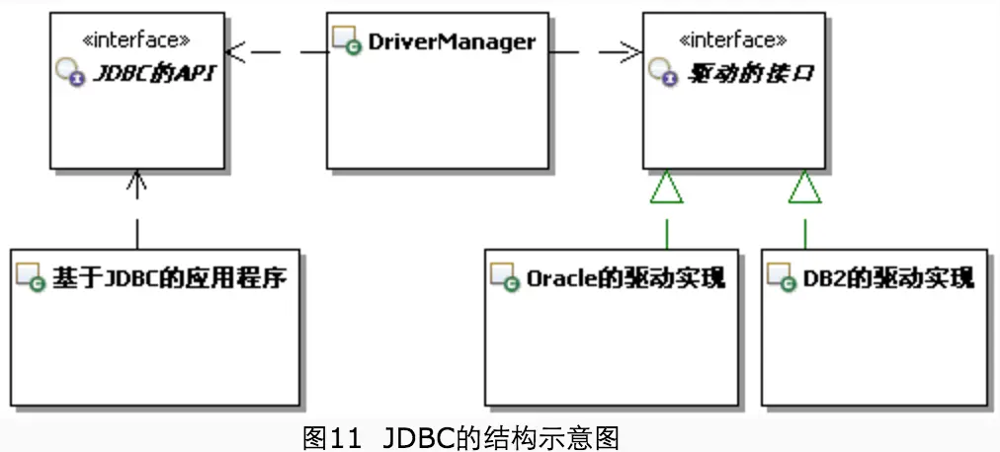

**广义上的桥接**

Java 一个很重要的原则就是“面向接口编程”，说得准确点应该是“面向抽象编程”，因为既能使用接口，也能使用抽象类来充当抽象的一部分。

考虑最常见的一个情况，客户类创建了接口的实现对象，并调用具体的方法，接口就相当于将客户类与具体的实现隔离开来，客户端和实现类可以各自扩展，不互相影响。此时客户端可以类似于桥接模式的抽象部分，其目的都是要调用具体实现来完成一定功能，只存在耦合性的差异，前者是 **依赖**，后者是 **聚合**，聚合的耦合度更强，需要长期持有实现部分的对象。

从某个角度来讲，几乎可以把所有面向抽象编写的程序，都视作是桥接模式的体现，至少是简化的桥接模式。

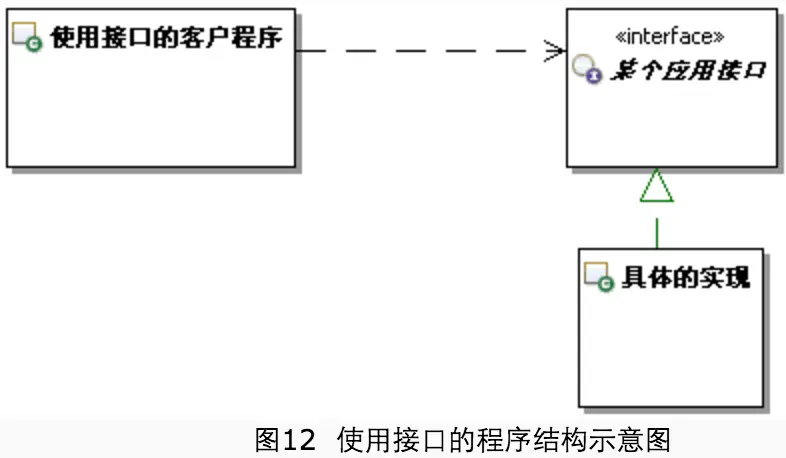

**软件三层架构**

表现层、逻辑层和数据层。上一层调用下一层的接口。

下层都可以视作从上层抽离出来的具体实现

通过面向抽象编程，三层架构的各层都能够独立的扩展和变化，而不会对其它层次产生影响

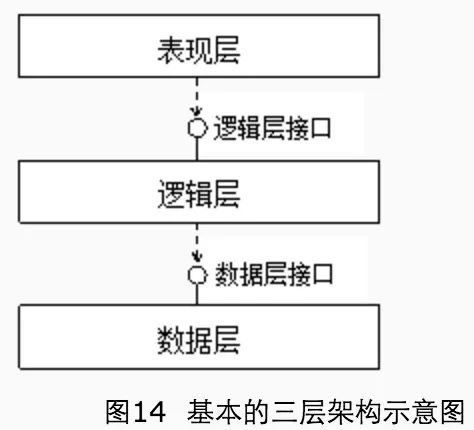

可以看出软件三层架构就是连续组合使用的桥接模式。如此类推，可以从三层架构扩展到四层、五层、直到 N 层架构，都可以使用桥接模式来组合。

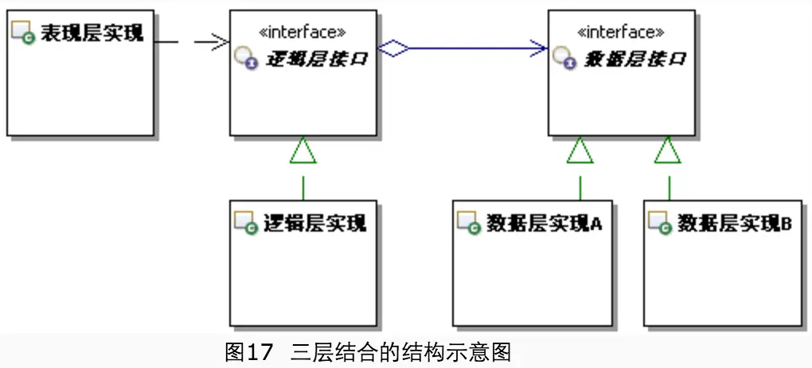

也能看出，定义上的抽象指的是“抽象程度较高，实现程度较低”，实现指的是“抽象程度较低，实现程度较高”。例如表现层只关注用户交互，隐藏了逻辑层关于业务逻辑、数据计算的具体实现，逻辑层隐藏了数据层关于数据库交互的具体实现。

### UML 时序图

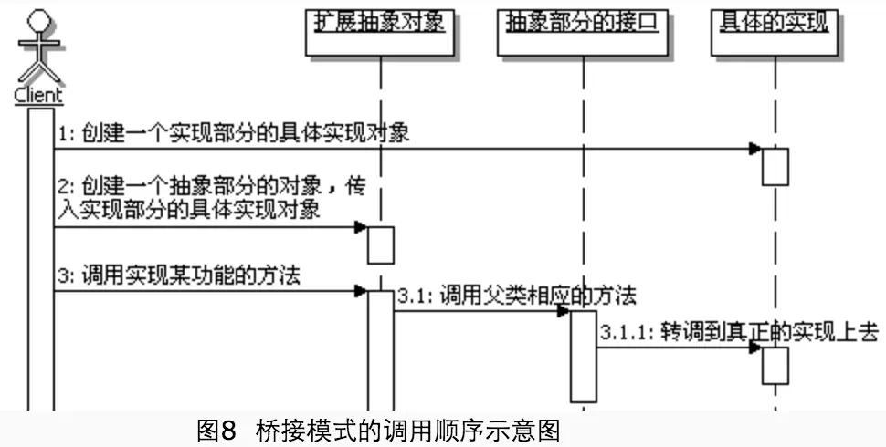

### 优点

1. 分离抽象和实现部分。有助于对系统进行分层，从而产生更好的结构化的系统。
2. 更好的扩展性。桥接模式把抽象和实现部分分离开了，而且分别定义接口，抽象部分和实现部分可以分别独立的扩展。
3. 降低系统复杂度。维度多的功能，使用桥接模式来实现的话，相比于继承来实现，可以明显地减少子类的个数。

### 与其他模式

**策略模式、状态模式**

和桥接模式有极大的相似之处。但目的不一样，策略模式的目的是封装一系列的算法，使得这些算法可以相互替换；桥接模式的目的是分离抽象和实现部分，使得它们可以独立的变化；状态模式的目的是封装状态对应的行为，并在内部状态改变的时候改变对象的行为。

## 结构型 - 组合模式 Composite

### 定义

将对象组合成树形结构以表示“部分整体”的层次结构。组合模式使得用户对单个对象和组合对象的使用具有一致性。

组合模式使得客户端不再区分操作的是组合对象还是叶子对象，而是以一个统一的方式来操作。

### UML 类图

`Component`：抽象的组件对象，为组合中的对象声明接口，让客户端可以通过这个接口来访问和管理整个树形结构，可以在里面为定义的功能提供缺省的实现。

`Leaf`：叶子节点对象，定义和实现叶子对象的行为，不再包含其它的子节点对象。

`Composite`：组合对象，通常会存储子组件，定义包含子组件的那些组件的行为，并实现在组件接口中定义的与子组件有关的操作。存在递归关联关系，在 `composite` 中含有成员变量 `composite` 集合。

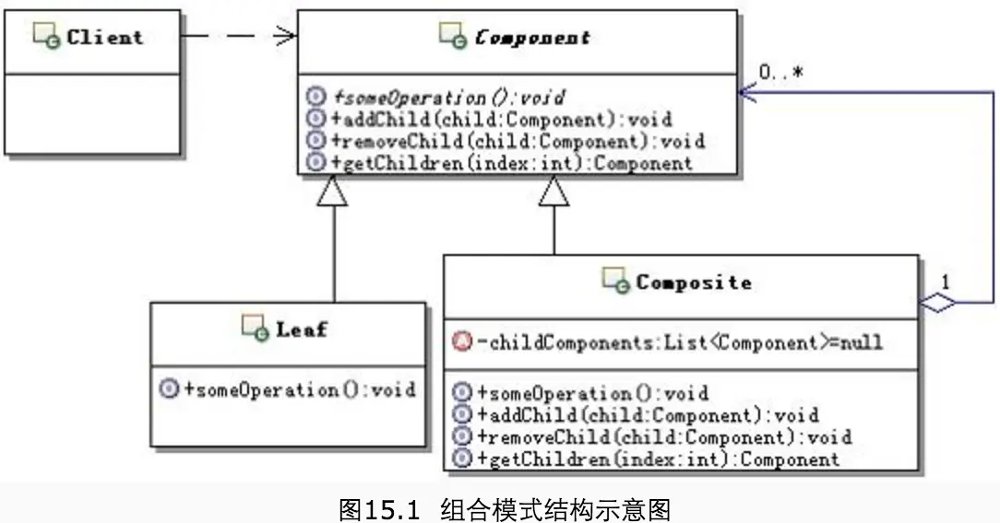

### 场景

如果你想表示对象的部分-整体层次结构，可以选用组合模式，把整体和部分的操作统一起来，使得层次结构实现更简单，从外部来使用这个层次结构也简单；

如果你希望统一的使用组合结构中的所有对象，可以选用组合模式，这正是组合模式提供的主要功能；

例如，商品类别树的管理，有些类别只是商品的一个概念下分很多子类别（容器节点），有些类别就可以用来描述商品不再下分类别（叶子节点）。通过组合模式就可以把组合对象和叶子对象统一起来，将对象构建成树形结构，一个组合对象包含其他组合对象或叶子对象。

### 实现

```java
// 抽象的组件类
public abstract class Component {
    protected String name;

    public Component(String name) {
        this.name = name;
    }

    public void print() {
        print(0);
    }

    void print(int level) {
        for (int i = 0; i < level; i++) {
            System.out.print("--");
        }
        String className = this.getClass().getName();
        System.out.println(className.substring(className.lastIndexOf(".") + 1) + ":" + name);
    };

    // 子节点是不需要节点操作的。
    // 在这里定义方法，客户端只需要面对Component，而无需关心具体的组件类型。属于透明性的实现。
    // 如果选择在Composite中定义，避免子节点误用节点操作方法。属于安全性的实现
    public void add(Component component) {
        // 缺省的实现，抛出例外，因为叶子对象没有这个功能
        throw new UnsupportedOperationException("对象不支持这个功能");
    };

    public void remove(Component component) {
        // 缺省的实现，抛出例外，因为叶子对象没有这个功能
        throw new UnsupportedOperationException("对象不支持这个功能");
    };
}
```

```java
// 实现为组合类 作为组合关系的整体
public class Composite extends Component {

    private List<Component> child; // 集合一般放在组合类中实现，因为叶节点本身不需要子节点，避免浪费。

    public Composite(String name) {
        super(name);
        child = new ArrayList<>();
    }

    @Override
    void print(int level) {
        super.print(level);
        for (Component component : child) {
            component.print(level + 1);
        }
    }

    @Override
    public void add(Component component) {
        child.add(component);
    }

    @Override
    public void remove(Component component) {
        child.remove(component);
    }
}
```

```java
// 实现为叶子类 作为组合关系的部分
public class Leaf extends Component {
    public Leaf(String name) {
        super(name);
    }
}
```

```java
public class Client {
    public static void main(String[] args) {
        Composite root = new Composite("root");
        Component node1 = new Leaf("1");
        Component node2 = new Composite("2");
        Component node3 = new Leaf("3");
        root.add(node1);
        root.add(node2);
        root.add(node3);
        Component node21 = new Leaf("21");
        Component node22 = new Composite("22");
        node2.add(node21);
        node2.add(node22);
        Component node221 = new Leaf("221");
        node22.add(node221);
        root.print();
    }
}
输出：
Composite:root
--Leaf:1
--Composite:2
----Leaf:21
----Composite:22
------Leaf:221
--Leaf:3
```

### 优点

在组合模式中，可以把叶子对象当作特殊的组合对象看待，为它们定义统一的父类，从而把组合对象和叶子对象的行为统一起来。

### 与其他模式

**装饰模式**

装饰模式在组装多个装饰器对象的时候，是一个装饰器找下一个装饰器，下一个再找下一个，如此递归下去。可以使用组合模式来帮助构建

**迭代器模式**

可以使用迭代器模式来遍历组合对象的子对象集合

## 结构型 - 装饰器模式 Decorator

### 定义

动态地给一个对象添加一些额外的职责。就增加功能来说，装饰模式比生成子类更为灵活。

### UML 类图

所谓装饰，就是把这个装饰者套在被装饰者之上，从而动态扩展被装饰者的功能（透明的给一个对象增加功能，而无需去改动这个对象）。装饰者的方法有一部分是自己的，这属于它的功能，然后调用被装饰者的方法实现，从而也保留了被装饰者的功能。

`Component`：组件对象的接口，可以给这些对象动态的添加职责。

`ConcreteComponent`：具体的组件对象，实现组件对象接口，通常就是被装饰器装饰的原始对象，也就是可以给这个对象添加职责。

`Decorator`：所有装饰器的抽象父类，需要定义一个与组件接口一致的接口，并持有一个 `Component` 对象，其实就是持有一个被装饰的对象。注意，这个被装饰的对象不一定是最原始的那个对象了，也可能是被其它装饰器装饰过后的对象，反正都是实现的同一个接口，也就是同一类型。

`ConcreteDecorator`：实际的装饰器对象，实现具体要向被装饰对象添加的功能。

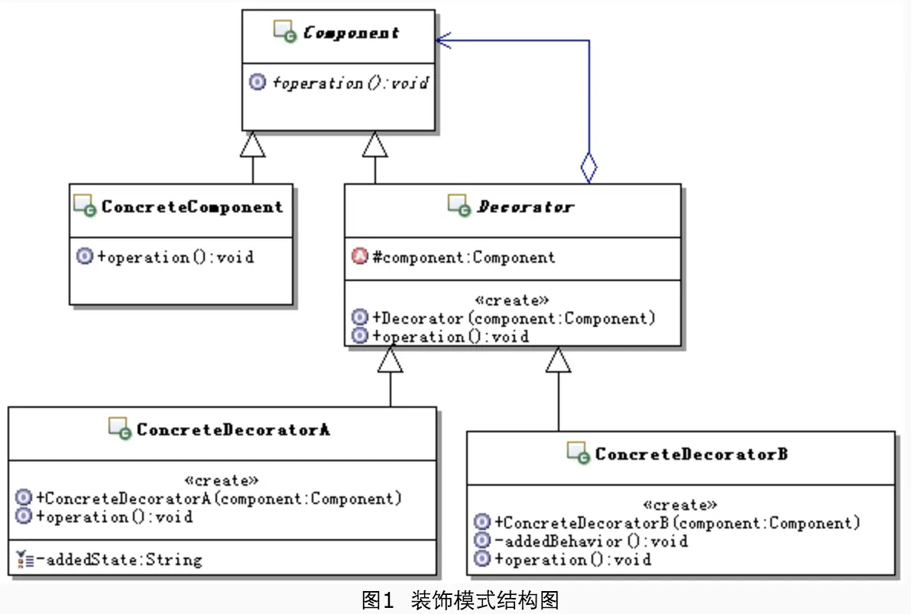

### 场景

* 如果需要在不影响其它对象的情况下，以动态、透明的方式给对象添加职责，可以使用装饰模式，这几乎就是装饰模式的主要功能
* 如果不合适使用子类来进行扩展的时候，可以考虑使用装饰模式，因为装饰模式是使用的“对象组合”的方式。所谓不适合用子类扩展的方式，比如：扩展功能需要的子类太多，造成子类数目呈爆炸性增长。

### 实现

**通用实现**

```java
/** 
   * 组件对象的接口
   */  
public abstract class Component {
      public abstract void operation();  
}
/** 
   * 被装饰者
   */  
public class ConcreteComponent extends Component {  
      public void operation() {  
          //相应的功能处理  
      }  
}  
```

```java
/** 
   * 装饰器接口，维持一个指向组件对象的接口对象，并定义一个与组件接口一致的接口 
   */  
public abstract class Decorator extends Component {  
      
      protected Component component;  // 持有组件对象 
      
      public Decorator(Component component) {  // 传入组件对象 
          this.component = component;  
      }  
      public void operation() {  
          //转发请求给组件对象，可以在转发前后执行一些附加动作  
          component.operation();
      }
}  
/** 
   * 装饰器，向组件对象添加职责 
   */  
public class ConcreteDecoratorA extends Decorator {  
      public ConcreteDecoratorA(Component component) {  
          super(component);  
      }  
    
      private void addedBehaviorA() {  
          //需要添加的职责实现  
      }  
      public void operation() {  
          //调用父类的方法，可以在调用前后执行一些附加动作  
          super.operation();  
          addedBehaviorA();
      }  
}  
/** 
   * 装饰器，向组件对象添加职责 
   */  
public class ConcreteDecoratorB extends Decorator {  
      public ConcreteDecoratorB(Component component) {  
          super(component);  
      }  
    
      private void addedBehaviorB() {  
          //需要添加的职责实现  
      }  
      public void operation() {  
          //调用父类的方法，可以在调用前后执行一些附加动作  
          super.operation();  
          addedBehaviorB();
      }  
}  
```

```java
public class Client {
    public static void main(String[] args) {
        Component component = new ConcreteComponent();
        component = new ConcreteDecoratorA(component); // 装饰
        component = new ConcreteDecoratorB(component); // 装饰
        System.out.println(component.operation());
    }
}
```

**例子：饮料价格与配料价格叠加**

设计不同种类的饮料，饮料可以添加配料，比如可以添加牛奶，并且支持动态添加新配料。每增加一种配料，该饮料的价格就会增加，要求计算一种饮料的价格。

下图表示在 DarkRoast 饮料上新增新添加 Mocha 配料，之后又添加了 Whip 配料。DarkRoast 被 Mocha 包裹，Mocha 又被 Whip 包裹。它们都继承自相同父类，都有 cost() 方法，外层类的 cost() 方法调用了内层类的 cost() 方法。

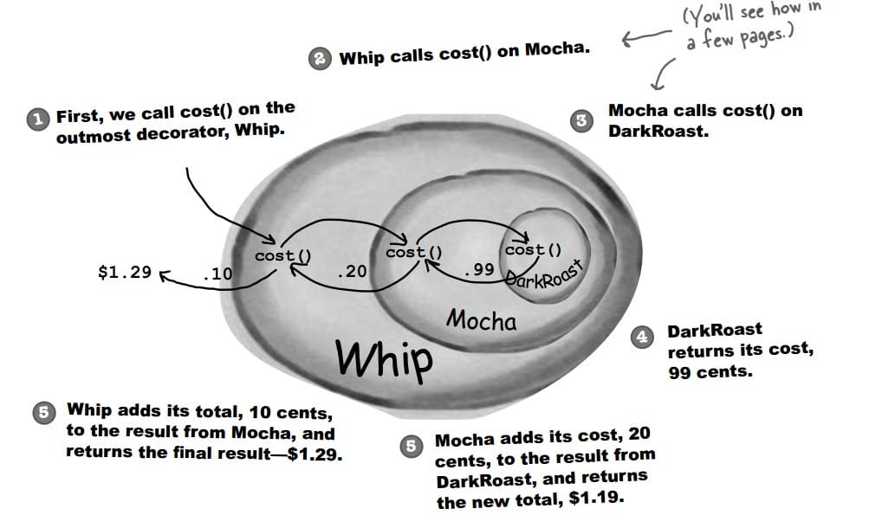

**例子：奖金的多种计算方式**

1. 每个人当月业务奖金 = 当月销售额 X 3%
2. 每个人累计奖金 = 总的回款额 X 0.1%
3. 团队奖金 = 团队总销售额 X 1%

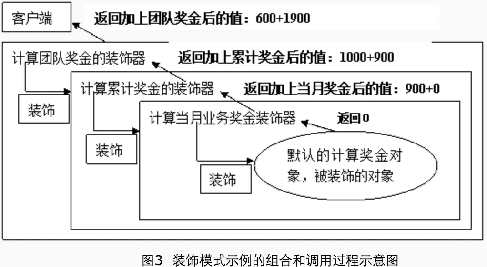

**装饰类似于对象组合**

面向对象设计的两个最常用技巧就是“对象组合”和“继承”。

对象里面定义一个引用，将其他类的行为实例赋予引用，并调用该行为实例的方法，完成方法复用。

对象组合在扩展功能上，比起继承有更好的灵活性，因为改变对象引用就能改变行为方式。

**Java 的 I/O 流**

```java
public class IOTest {
      public static void main(String[] args)throws Exception  {
          //流式读取文件
          DataInputStream din = null;
          try {
              // 装饰器的组装过程 里层即为外层的Component 外层为里层的Decorator
              din = new DataInputStream(new BufferedInputStream(new FileInputStream("IOTest.txt")));
              //然后就可以获取文件内容了
              byte bs []= new byte[din.available()]; 
              din.read(bs);
              String content = new String(bs);
              System.out.println("文件内容===="+content);
          } finally {
              din.close();
          }        
      }
}
```

结构和装饰模式的结构几乎是一样的

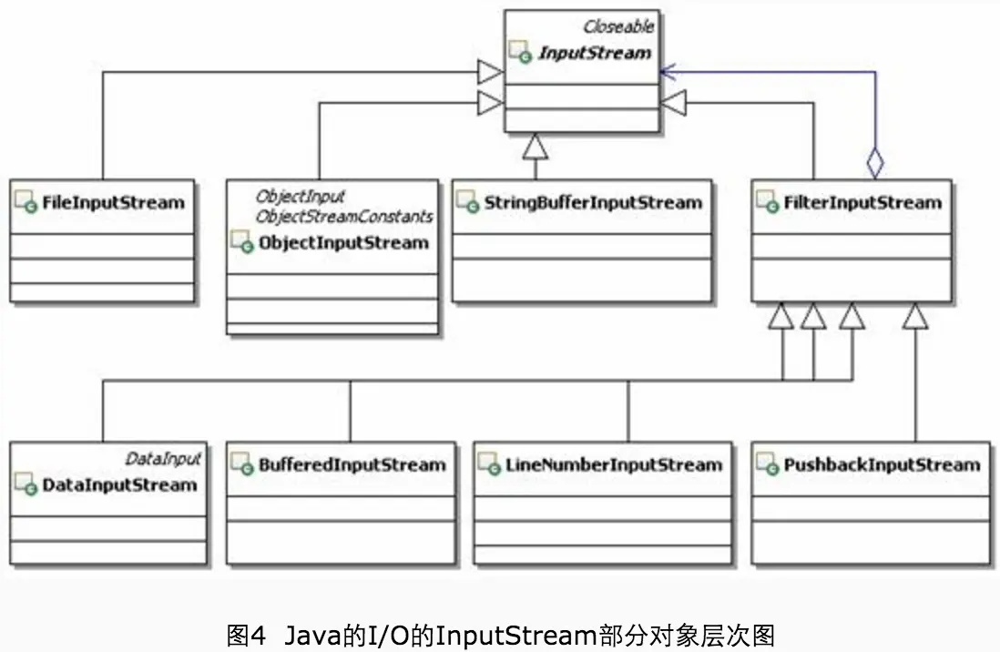

**装饰模式和 AOP**

AOP（面向方面编程）是一种编程范式，提供从另一个角度来考虑程序结构以完善面向对象编程（OOP）。

面向对象编程考虑的系统角度通常时纵向的，上层依赖于下层，例如三层软件架构。如果在各个模块之间，存在一些共性的功能，那么 AOP 就提供了一个横向的角度去思考问题。典型的 AOP 应用场景为：日志记录、事务管理、权限验证、性能监测。

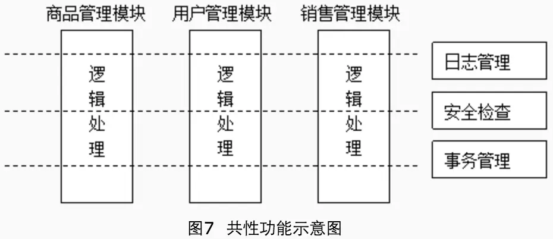

没有使用了 AOP 设计的系统，每一个常见的业务模块都要去主动调用公共模块的功能，这样业务模块就必须知晓公共模块的具体调用方法，形成依赖关系。而使用了 AOP 后，各个公共模块主动织入回到应用系统。

装饰模式也可以将一些公共的功能实现成为装饰器，给原始业务对象透明的增加了公共功能，从而模拟实现了 AOP 的功能。

### 优点

* 复用性好：可以给一个对象多次增加同一个装饰器，也可以用同一个装饰器装饰不同的对象。
* 遵循了“尽量使用对象组合，而不是对象继承”的规则来扩展和复用功能。装饰模式运用了动态的对象组合，比继承来得更灵活。

### 与其他模式

**适配器模式**

没有什么关联，但它们有一个共同的别名：Wrapper。

**策略模式**

策略模式也可以实现动态的改变对象的功能，但是策略模式只是一层选择。装饰模式不是一层，而是可以递归调用很多层。

策略模式改变的是对象的内核，而装饰模式改变的是对象的外壳。

二者可以组合使用，例如为一个员工计算多项奖金（每一项奖金计算方式不同）总和，可以使用装饰模式。在某一项奖金计算当中，由于基数不同产生不同的计算方式，可以使用策略模式。

## 结构型 - 享元模式 Flyweight

### 定义

运用共享技术有效地支持大量细粒度的对象。

内部状态分离出来共享，称之为享元，通过共享享元对象来减少对内存的占用。把外部状态分离出来，放到外部，让应用在使用的时候进行维护，并在需要的时候传递给享元对象使用。为了控制对内部状态的共享，并且让外部能简单的使用共享数据，提供一个工厂来管理享元，把它称为享元工厂。**外部对象可以共同拥有相同内部状态的享元对象。**

### 场景

* 在系统当中，存在大量的细粒度对象，而且存在大量的重复数据，严重耗费内存。
* 如果对象的大多数状态都可以转变为外部状态，比如通过计算得到，或是从外部传入等，可以使用享元模式来实现内部状态和外部状态的分离。

例如，权限控制模块中，“对 人员列表 这个安全实体 的 查看权限 限制” 需要赋予给不同的用户，权限限制有很多种、可能要赋予的对象也很多，安全实体在系统中更是海量（每一个业务实体都可能需要权限控制），将会产生大量重复的对象数据，耗费内存。**通过共享封装了安全实体和权限的对象，无论多少人拥有这个权限，实际的对象实例都是只有一个**，这样既减少了对象的数目，又节省了宝贵的内存空间，从而解决了前面提出的问题。

### UML 类图

`Flyweight`：享元接口，通过这个接口可以接受并作用于外部状态。通过这个接口传入外部的状态，在享元对象的方法处理中可能会使用这些外部的数据。

`ConcreteFlyweight`：具体的享元实现对象，必须是可共享的，需要封装 flyweight 的内部状态。

`UnsharedConcreteFlyweight`：非共享的享元实现对象，并不是所有的 Flyweight 实现对象都需要共享。非共享的享元实现对象通常是对共享享元对象的组合对象。

`FlyweightFactory`：享元工厂，主要用来创建并管理共享的享元对象，并对外提供访问共享享元的接口。

`Client`：客户端，主要的工作是维持一个对 flyweight 的引用，计算或存储享元对象的外部状态，当然这里可以访问共享和不共享的 flyweight 对象。

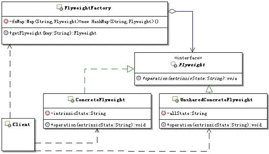

### 实现

**通用实现**

```java
// 享元接口
public interface Flyweight {
    void doOperation(String extrinsicState);
}
```

```java
// 享元实现
public class ConcreteFlyweight implements Flyweight {

    private String intrinsicState; // 描述内部状态

    public ConcreteFlyweight(String intrinsicState) {
        this.intrinsicState = intrinsicState;
    }

    @Override
    public void doOperation(String extrinsicState) {
        //具体的功能处理，可能会用到享元内部、外部的状态
        System.out.println("Object address: " + System.identityHashCode(this));
        System.out.println("IntrinsicState: " + intrinsicState);
        System.out.println("ExtrinsicState: " + extrinsicState);
    }
}
```

```java
// 不需要共享的flyweight对象
public class UnsharedConcreteFlyweight implements Flyweight{
      
      private String allState;
  
      public void operation(String extrinsicState) {
         // 具体的功能处理
      }
}
```

```java
// 享元工厂  缓存享元对象
public class FlyweightFactory {
      // 缓存多个flyweight对象，这里只是示意一下
      private Map<String,Flyweight> fsMap = new HashMap<String,Flyweight>();
      
      // 获取key对应的享元对象
      Flyweight getFlyweight(String intrinsicState) {
        if (!flyweights.containsKey(intrinsicState)) {
            Flyweight flyweight = new ConcreteFlyweight(intrinsicState);
            flyweights.put(intrinsicState, flyweight);
        }
        return flyweights.get(intrinsicState);
    }
}
```

```java
public class Client {
    public static void main(String[] args) {
        FlyweightFactory factory = new FlyweightFactory();
        Flyweight flyweight1 = factory.getFlyweight("aa");
        Flyweight flyweight2 = factory.getFlyweight("aa");
        flyweight1.doOperation("x");
        flyweight2.doOperation("y");
    }
}
------ 结果
Object address: 1163157884
IntrinsicState: aa
ExtrinsicState: x
Object address: 1163157884
IntrinsicState: aa
ExtrinsicState: y
```

**基于享元工厂的享元对象管理**

```java
/**
   * 享元工厂，通常实现成为单例
   * 加入实现垃圾回收和引用计数的功能
   */
public class FlyweightFactory {
      private static FlyweightFactory factory = new FlyweightFactory();
      private FlyweightFactory(){
         //启动清除缓存值的线程
         Thread t = new ClearCache();
         t.start();
      }
      public static FlyweightFactory getInstance(){
         return factory;
      }

      /**
       * 缓存多个flyweight对象
       */
      private Map<String,Flyweight> fsMap = new HashMap<String,Flyweight>();
      /**
       * 用来缓存被共享对象的缓存配置，key值和上面map的一样
       */
      private Map<String,CacheConfModel> cacheConfMap = new HashMap<String,CacheConfModel>();
      /**
       * 用来记录缓存对象被引用的次数，key值和上面map的一样
       */
      private Map<String,Integer> countMap = new HashMap<String,Integer>();
      /**
       * 默认保存6秒钟，主要为了测试方便，这个时间可以根据应用的要求设置
       */
      private final long DURABLE_TIME = 6*1000L;
  
      /**
       * 获取某个享元被使用的次数
       * @param key 享元的key
       * @return 被使用的次数
       */
      public synchronized int getUseTimes(String key){
         Integer count = countMap.get(key);
         if(count==null){
             count = 0;
         }
         return count;
      }
      /**
       * 获取key对应的享元对象
       * @param key 获取享元对象的key
       * @return key对应的享元对象
       */
      public synchronized Flyweight getFlyweight(String key) {
         Flyweight f = fsMap.get(key);
         if(f==null){
             f = new AuthorizationFlyweight(key);
             fsMap.put(key,f);
             //同时设置引用计数
             countMap.put(key, 1);

             //同时设置缓存配置数据
             CacheConfModel cm = new CacheConfModel();
             cm.setBeginTime(System.currentTimeMillis());
             cm.setForever(false);
             cm.setDurableTime(DURABLE_TIME);
         
             cacheConfMap.put(key, cm);
         }else{
             //表示还在使用，那么应该重新设置缓存配置
             CacheConfModel cm = cacheConfMap.get(key);
             cm.setBeginTime(System.currentTimeMillis());
             //设置回去
             this.cacheConfMap.put(key, cm);
             //同时计数加1
             Integer count = countMap.get(key);
             count++;
             countMap.put(key, count);
         }
         return f;
      }
      /**
       * 删除key对应的享元对象，连带清除对应的缓存配置和引用次数的记录，不对外
       * @param key 要删除的享元对象的key
       */
      private synchronized void removeFlyweight(String key){
         this.fsMap.remove(key);
         this.cacheConfMap.remove(key);
         this.countMap.remove(key);
      }
      /**
       * 维护清除缓存的线程，内部使用
       */
      private  class ClearCache extends Thread{
         public void run(){
             while(true){
                Set<String> tempSet = new HashSet<String>();
                Set<String> set = cacheConfMap.keySet();
                for(String key : set){
                    CacheConfModel ccm = cacheConfMap.get(key);
                    //比较是否需要清除
                    if((System.currentTimeMillis() - ccm.getBeginTime()) >= ccm.getDurableTime()){
                       //可以清除，先记录下来
                       tempSet.add(key);
                    }
                }
                //真正清除
                for(String key : tempSet){
                    FlyweightFactory.getInstance().removeFlyweight(key);
                }
                System.out.println("now thread="+fsMap.size() +",fsMap=="+fsMap.keySet());
                //休息1秒再重新判断
                try {
                    Thread.sleep(1000L);
                } catch (InterruptedException e) {
                    e.printStackTrace();
                }
             }
         }
      }
}
```


### UML 时序图

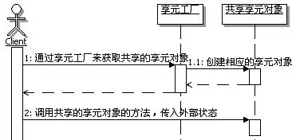


### 优点

减少对象数量，节省内存空间。

### 缺点

维护共享对象，需要额外开销。比如需要一个线程来维护垃圾回收。

### 与其他模式

**单例模式**

享元模式中的享元工厂可以实现成为单例

**组合模式**

在享元模式里面，存在不需要共享的享元实现，这些不需要共享的享元通常是对共享的享元对象的组合对象，也就是说，**享元模式通常会和组合模式组合使用，来实现更复杂的对象层次结构。**

**状态模式**

可以使用享元模式来共享状态模式中的状态对象，通常在状态模式中，会存在数量很大的、细粒度的状态对象，而且它们基本上都是可以重复使用的，都是用来处理某一个固定的状态的

## 结构型 - 代理模式 Proxy

### 定义

为其他对象提供一种代理以控制对这个对象的访问

### UML 类图

`Proxy`：实现与具体的目标对象一样的接口，这样就可以使用代理来代替具体的目标对象，也可以保存一个指向具体目标对象的引用，在需要的时候调用具体的目标对象，可以控制对具体目标对象的访问，并可能负责创建和删除它

`Subject`：目标接口，定义代理和具体目标对象的接口，这样就可以在任何使用具体目标对象的地方使用代理对象

`RealSubject`：具体的目标对象，真正实现目标接口要求的功能。

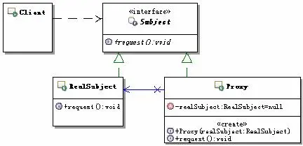

### 场景

常见

* 虚代理：根据需要来创建开销很大的对象，该对象只有在需要的时候才会被真正创建；
* 远程代理: 控制对远程对象(不同地址空间)的访问，它负责将请求及其参数进行编码，并向不同地址空间中的对象发送已经编码的请求。如 Java RMI 技术
* 保护代理：控制对原始对象的访问，如果有需要，可以给不同的用户提供不同的访问权限，以控制他们对原始对象的访问；
* 智能指引：在访问对象时执行一些附加操作，比如：对指向实际对象的引用计数、第一次引用一个持久对象时，将它装入内存等；

其他

* Copy-on-Write 代理：在客户端操作的时候，只有对象确实改变了，才会真的拷贝（或克隆）一个目标对象，算是虚代理的一个分支；
* Cache 代理：为那些昂贵的操作的结果提供临时的存储空间，以便多个客户端可以共享这些结果；
* 防火墙代理：保护对象不被恶意用户访问和操作；
* 同步代理：使多个用户能够同时访问目标对象而没有冲突；

### 实现

**虚代理 - 图片延迟展示**

根据需要创建开销很大的对象，它可以缓存实体的附加信息，以便延迟对它的访问，如在网站加载一个很大图片时，不能马上完成，可以用虚拟代理缓存图片的大小信息，然后生成一张临时图片代替原始图片。

```java
public interface Image {
    void showImage();
}

public class HighResolutionImage implements Image {

    private URL imageURL;
    private long startTime;
    private int height;
    private int width;

    public int getHeight() {
        return height;
    }

    public int getWidth() {
        return width;
    }

    public HighResolutionImage(URL imageURL) {
        this.imageURL = imageURL;
        this.startTime = System.currentTimeMillis();
        this.width = 600;
        this.height = 600;
    }

    public boolean isLoad() {
        // 模拟图片加载，延迟 3s 加载完成
        long endTime = System.currentTimeMillis();
        return endTime - startTime > 3000;
    }

    @Override
    public void showImage() {
        System.out.println("Real Image: " + imageURL);
    }
}

public class ImageProxy implements Image {
    private HighResolutionImage highResolutionImage;

    public ImageProxy(HighResolutionImage highResolutionImage) {
        this.highResolutionImage = highResolutionImage;
    }

    @Override
    public void showImage() {
        while (!highResolutionImage.isLoad()) {
            try {
                System.out.println("Temp Image: " + highResolutionImage.getWidth() + " " + highResolutionImage.getHeight());
                Thread.sleep(100);
            } catch (InterruptedException e) {
                e.printStackTrace();
            }
        }
        highResolutionImage.showImage();
    }
}
```

```java
public class ImageViewer {
    public static void main(String[] args) throws Exception {
        String image = "http://image.jpg";
        URL url = new URL(image);
        HighResolutionImage highResolutionImage = new HighResolutionImage(url);
        ImageProxy imageProxy = new ImageProxy(highResolutionImage);
        imageProxy.showImage();
    }
}
```

**Hibernate Lazy Load**

考虑一个例子：某一模块大量数据的查询只需要看到关键信息（如用户编号和姓名），对数据库一次性访问很多条数据，消耗了大量内存，但对于每条数据，非关键信息属于浪费。Hibernate 的 Lazy Load 就是使用代理来实现的，起初每个代理对象只有用户编号和姓名的数据，直到需要的时候，才会把整个用户的数据装载到内存中来。

**保护代理**

```java
/**
   * 订单的代理对象
   */
public class OrderProxy implements OrderApi{
      /**
       * 持有被代理的具体的目标对象
       */
      private Order order=null;
      /**
       * 构造方法，传入被代理的具体的目标对象
       * @param realSubject 被代理的具体的目标对象
       */
      public OrderProxy(Order realSubject){
         this.order = realSubject;
      }

      public void setProductName(String productName,String user) {
         //控制访问权限，只有创建订单的人员才能够修改
         if(user!=null && user.equals(this.getOrderUser())){
             order.setProductName(productName, user);
         }else{
             System.out.println("对不起"+user+"，您无权修改订单中的产品名称。");
         }
      }
      public void setOrderNum(int orderNum,String user) {
         //控制访问权限，只有创建订单的人员才能够修改
         if(user!=null && user.equals(this.getOrderUser())){
             order.setOrderNum(orderNum, user);
         }else{
             System.out.println("对不起"+user+"，您无权修改订单中的订购数量。");
         }
      }
      public void setOrderUser(String orderUser,String user) {
         //控制访问权限，只有创建订单的人员才能够修改
         if(user!=null && user.equals(this.getOrderUser())){
             order.setOrderUser(orderUser, user);
         }else{
             System.out.println("对不起"+user+"，您无权修改订单中的订购人。");
         }
      }

      public int getOrderNum() {
         return this.order.getOrderNum();
      }
      public String getOrderUser() {
         return this.order.getOrderUser();
      }
      public String getProductName() {
         return this.order.getProductName();
      }
      public String toString(){
         return "productName="+this.getProductName()+",orderNum="+this.getOrderNum()+",orderUser="+this.getOrderUser();
      }
}
```

在通过代理转调目标对象的时候，在代理对象里面，对访问的用户进行了权限判断，如果不满足要求，就不会转调目标对象的方法，从而保护了目标对象的方法，只让有权限的人操作。

**Java 内建代理 - Java.lang.reflect**

通常把前面自己实现的代理模式，称为 Java 的 **静态代理**，把使用 Java 内建的对代理模式支持的功能来实现的代理称为 Java 的 **动态代理**。

Java 的动态代理目前只能代理接口，基本的实现是依靠 Java 的 **反射机制** 和 **动态生成 class** 的技术，来动态生成被代理的接口的实现对象。如果要实现类的代理，可以使用 cglib（一个开源的 Code Generation Library）。

```java
/**
   * 使用Java中的动态代理
   */
public class DynamicProxy implements InvocationHandler{
      /**
       * 被代理的对象
       */
      private OrderApi order = null;
      /**
       * 获取绑定好代理和具体目标对象后的目标对象的接口
       * @param order 具体的订单对象，相当于具体目标对象
       * @return 绑定好代理和具体目标对象后的目标对象的接口
       */
      public OrderApi getProxyInterface(Order order){
         //设置被代理的对象，好方便invoke里面的操作
         this.order = order;
         //把真正的订单对象和动态代理关联起来
         OrderApi orderApi = (OrderApi) Proxy.newProxyInstance(
                order.getClass().getClassLoader(),
                order.getClass().getInterfaces(),
                this);
         return orderApi;
      }
  
      public Object invoke(Object proxy, Method method, Object[] args) throws Throwable {
         //如果是调用setter方法就需要检查权限
         if(method.getName().startsWith("set")){
             //如果不是创建人，那就不能修改
             if(order.getOrderUser()!=null && order.getOrderUser().equals(args[1])){
                //可以操作
                return method.invoke(order, args);
             }else{
                System.out.println("对不起，"+args[1]+"，您无权修改本订单中的数据");
             }
         }else{
             //不是调用的setter方法就继续运行
             return method.invoke(order, args);
         }
         return null;
      }
}
```

```java
public class Client {
      public static void main(String[] args) {
         //张三先登录系统创建了一个订单
         Order order = new Order("设计模式",100,"张三");
      
         //创建一个动态代理
         DynamicProxy dynamicProxy = new DynamicProxy();     
         //然后把订单和动态代理关联起来
         OrderApi orderApi = dynamicProxy.getProxyInterface(order);
     
         //以下就需要使用被代理过的接口来操作了
         //李四想要来修改，那就会报错
         orderApi.setOrderNum(123, "李四");
         //输出order
         System.out.println("李四修改后订单记录没有变化："+orderApi);
         //张三修改就不会有问题
         orderApi.setOrderNum(123, "张三");
         //再次输出order
         System.out.println("张三修改后，订单记录："+orderApi);
      }
}
```

### UML 时序图

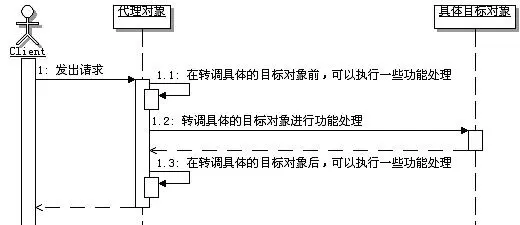

### 优点

不同的代理类型，这种附加的间接性有不同的用途

远程代理：隐藏了一个对象存在于不同的地址空间的事实

虚代理：可以根据需要来创建“大”对象，只有到必须创建对象的时候，虚代理才会创建对象

保护代理：可以在访问一个对象的前后，执行很多附加的操作，侧重于权限控制。

智能指引：跟保护代理类似，侧重于附加操作

### 与其他模式

**适配器模式**

都是组合对象的方式，为另一个对象提供间接性的访问。但功能上，适配器模式主要用来解决接口之间不匹配的问题，它通常是为所适配的对象提供一个不同的接口；而代理模式会实现和目标对象相同的接口。

**装饰模式**

实现上是基本类似的，但目的上，装饰模式的目的是为了让你不生成子类就可以给对象添加职责，装饰器独立发展，但可以灵活地组合，也就是为了动态的 **增加功能**；而代理模式的主要目的是控制对对象的访问。

## 行为型 - 责任链模式 Chain of Responsibility

### 定义

使多个对象都有机会处理请求，从而避免请求的发送者和接收者之间的耦合关系。将这些对象连成一条链，并沿着这条链传递该请求，直到有一个对象处理它为止。

职责链模式的本质：分离职责，动态组合。

### UML 类图

`Handler`：定义职责的接口通常在这里定义处理请求的方法，可以在这里实现后继链。

`ConcreteHandler`：实现职责的类在这个类里面，实现对在它职责范围内请求的处理，如果不处理，就继续转发请求给后继者。

`Client`：职责链的客户端向链上的具体处理者对象提交请求，让职责链负责处理。

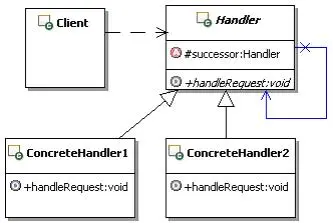

### 场景

* 如果有多个对象可以处理同一个请求，但是具体由哪个对象来处理该请求，是运行时刻动态确定的。
* 如果你想在不明确指定接收者的情况下，向多个对象中的一个提交一个请求的话，可以使用职责链模式。

### 实现

**通用实现**

```java
/**
   * 职责的接口，也就是处理请求的接口
   */
public abstract class Handler {
    /**
     * 持有后继的职责对象
     */
    protected Handler successor;
    /**
     * 设置后继的职责对象
     * @param successor 后继的职责对象
     */
    public void setSuccessor(Handler successor) {
        this.successor = successor;
    }
    /**
     * 示意处理请求的方法，虽然这个示意方法是没有传入参数，
     * 但实际是可以传入参数的，根据具体需要来选择是否传递参数
     */
    public abstract void handleRequest();
}
```

```java
/**
   * 具体的职责对象，用来处理请求
   */
public class ConcreteHandler1 extends Handler {
    public void handleRequest() {
        //根据某些条件来判断是否属于自己处理的职责范围
        //判断条件比如：从外部传入的参数，或者这里主动去获取的外部数据，
        //如从数据库中获取等，下面这句话只是个示意
        boolean someCondition = false;
     
        if(someCondition){
            //如果属于自己处理的职责范围，就在这里处理请求
            //具体的处理代码
            System.out.println("ConcreteHandler1 handle request");
        }else{
            //如果不属于自己处理的职责范围，那就判断是否还有后继的职责对象
            //如果有，就转发请求给后继的职责对象
            //如果没有，什么都不做，自然结束
            if(this.successor!=null){
                this.successor.handleRequest();
            }
        }
    }
}
```

```java
/**
   * 职责链的客户端，这里只是个示意
   */
public class Client {
    public static void main(String[] args) {
        //先要组装职责链
        Handler h1 = new ConcreteHandler1();
        Handler h2 = new ConcreteHandler2();
     
        h1.setSuccessor(h2);    
        //然后提交请求
        h1.handleRequest();
    }
}
```

**javax/jakarta.servlet.Filter#doFilter()**

Web 开发的过滤器链就类似于一个功能链，每个过滤器负责自己的处理，然后转交给下一个过滤器，直到把所有的过滤器都走完，然后进入到 Servlet 里面进行处理。最常见的过滤器功能，比如权限检查、字符集转换等，基本上都是 Web 应用的标配。

```java
@WebFilter("/*")
public class AnnotationFilter implements Filter {
    @Override
    public void doFilter(ServletRequest servletRequest, ServletResponse servletResponse, FilterChain filterChain) throws IOException, ServletException {
        System.out.println("AnnotationFilter已执行");
        filterChain.doFilter(servletRequest, servletResponse);
        System.out.println("AnnotationFilter已放行请求");
    }
}
```

### 优点

1. **请求者和接收者松散耦合。** 请求者并不知道接收者是谁，职责对象也不用管请求者或者是其它的职责对象，只负责处理自己的部分。
2. **动态组合职责。** 功能处理分散到单独的职责对象里面，可以灵活的实现和改变对象的职责，使用的时候，可以动态组合职责形成职责链。

### 缺点

1. **产生很多细粒度对象**

### 与其他对象

**装饰模式**

都可以动态地添加功能。都可以在运行期内自由组合。目的不同，装饰模式是要实现透明的为对象添加功能，而职责链模式是要实现发送者和接收者解耦，多个接收者的职责分离。

## 行为型 - 策略模式 Strategy

### 定义

定义一系列的算法，把它们一个个封装起来，并且使它们可相互替换。

策略模式的功能是把具体的算法实现，从具体的业务处理里面独立出来，把它们实现成为单独的算法类，从而形成一系列的算法，并让这些算法可以相互替换。

策略模式的本质：分离算法，选择实现。

### UML 类图

`Strategy`：策略接口用来约束一系列具体的策略算法。Context 使用这个接口来调用具体的策略实现定义的算法。

`ConcreteStrategy`：具体的策略实现也就是具体的算法实现。

`Context`：上下文，负责和具体的策略类交互通常上下文会持有一个真正的策略实现，可以由上下文来选择具体的策略算法，上下文还可以让具体的策略类来获取上下文的数据，甚至让具体的策略类来回调上下文的方法。

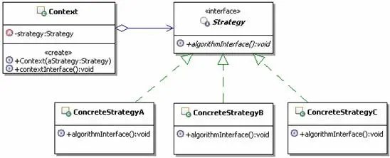

### 场景

* 出现抽象一个定义了很多行为的类，存在多个 if-elseif 语句这样一个平等的功能结构，可以考虑使用策略模式。
* 出现有许多相关的类，仅仅是行为有差别的情况，可以使用策略模式来使用多个行为中的一个来配置一个类的方法，实现算法动态切换

### 实现

**通用实现**

```java
/**
 * 策略，定义算法的接口
 */
public interface Strategy {
    /**
     * 某个算法的接口，可以有传入参数，也可以有返回值
     */
    public void algorithmInterface();
}
```

```java
/**
 * 实现具体的算法
 */
public class ConcreteStrategyA implements Strategy {
    public void algorithmInterface() {
        //具体的算法实现   
    }
}

/**
 * 实现具体的算法
 */
public class ConcreteStrategyB implements Strategy {
    public void algorithmInterface() {
        //具体的算法实现   
    }
}

/**
 * 实现具体的算法
 */
public class ConcreteStrategyC implements Strategy {
    public void algorithmInterface() {
        //具体的算法实现   
    }
}
```

```java
/**
 * 上下文对象，通常会持有一个具体的策略对象
 */
public class Context {
    /**
     * 持有一个具体的策略对象
     */
    private Strategy strategy;
    /**
     * 构造方法，传入一个具体的策略对象
     * @param aStrategy 具体的策略对象
     */
    public Context(Strategy aStrategy) {
        this.strategy = aStrategy;
    }
    /**
     * 上下文对客户端提供的操作接口，可以有参数和返回值
     */
    public void contextInterface() {
        //通常会转调具体的策略对象进行算法运算
        strategy.algorithmInterface();
    }
}
```

### UML 时序图

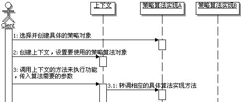

### 优点

1. **定义一系列算法**
2. **避免多重条件语句**
3. **更好的扩展性。** 只要增加新的策略实现类，然后在选择使用策略的地方选择使用这个新的策略实现就好了。

### 缺点

1. **客户必须了解每种策略的不同**
2. **增加了对象数目**
3. **只适合扁平的算法结构。** 对于出现需要嵌套使用多个算法的情况，可以考虑使用装饰模式、或是变形的职责链、或是 AOP 等方式来实现。

### 与其他模式

**桥接模式**

模式结构上看是一样的，但是实现的功能是不一样的。桥接模式将抽象和实现解耦，使它们可以独立变化，应对多维度变化。而策略模式是根据需要或者是客户端的要求来灵活选择相应的实现类，各个实现类是平等的，是可以相互替换的。

**状态模式**

模式结构上看是一样的，但是实现的功能是不一样的。状态模式是根据状态的变化来选择相应的行为，而策略模式是根据需要或者是客户端的要求来灵活选择相应的实现类，各个实现类是平等的，是可以相互替换的。

**模板方法模式**

模板方法重在封装算法骨架，而策略模式重在分离并封装算法实现。

## 行为型 - 模板方法模式 Template Method

### 定义

定义一个操作中的算法的骨架，而将一些步骤延迟到子类中。模板方法使得子类可以不改变一个算法的结构即可重定义该算法的某些特定步骤。

**模板方法的功能在于固定算法骨架，而让具体算法实现可扩展。**

模板方法很好的体现了开闭原则。算法骨架，比如一些公共的、固定的实现等等，封闭起来，尽量不修改，要扩展新的功能，那就使用子类来扩展。

模板方法很好的体现了里氏替换原则。所有的子类实现的是同一个算法模板，并能在使用模板的地方，根据需要，切换不同的具体实现。

### UML 类图

`AbstractClass`：抽象类，用来定义算法骨架和原语操作，具体的子类通过重定义这些原语操作来实现一个算法的各个步骤。在这个类里面，还可以提供算法中通用的实现。

`ConcreteClass`：具体实现类，用来实现算法骨架中的某些步骤，完成跟特定子类相关的功能。

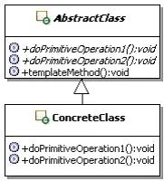

### 场景

* 需要固定定义算法骨架，实现一个算法的不变的部分，并把可变的行为留给子类来实现的情况；
* 需要控制子类扩展的情况。模板方法模式会在特定的点来调用子类的方法，这样只允许在这些点进行扩展；

例如，在同一个门户登录，分为普通用户登录和工作人员登录。普通用户和工作人员信息存放在不同数据库表，且工作人员密码是加密存储，因此形成了两套登录逻辑，但登录（获取登录填写信息-> 查询用户数据库信息-> 密码加密(可选)-> 匹配信息-> 登录结果返回）这个整体逻辑框架是一样的。设计两套登录实现，将存在相似代码太多和扩展不方便的问题，这时候可以考虑使用模板方法模式。

### 实现

**通用实现**

通常在 **“既要约束子类的行为，又要为子类提供公共功能”** 的时候使用抽象类，模板方法模式需要固定定义算法的骨架（模板方法），而具体步骤的实现可能各不相同，恰好符合选择抽象类的原则。

```java
/**
 * 定义模板方法、原语操作等的抽象类
 */
public abstract class AbstractTemplate {
    /**
     * 原语操作1，所谓原语操作就是抽象的操作，必须要由子类提供实现
     */
    public abstract void doPrimitiveOperation1();
    /**
     * 原语操作2
     */
    public abstract void doPrimitiveOperation2();
    
    /**
     * 公共功能
     */
    public final void publicMethod() {
       // 在模板中实现某些辅助的公共功能，可以提供给子类使用
    }
    
    /**
     * 钩子操作
     */
    public final void hookMethod() {
       // 默认实现的操作，可以被子类扩展的点，但不是必须的
    }
    
    /**
     * 模板方法，定义算法骨架
     */
    public final void templateMethod() {
       doPrimitiveOperation1();
       hookMethod()
       doPrimitiveOperation2();
    }
    
    
}
```

```java
/**
 * 具体实现类，实现原语操作
 */
public class ConcreteTemplate extends AbstractTemplate {
    public void doPrimitiveOperation1() {
       //具体的实现
    }
    public void doPrimitiveOperation2() {
       //具体的实现
    }
}
```

**Java 回调来实现**

回调机制是通过委托的方式来组合功能，它的耦合强度要比继承低一些，这会给我们更多的灵活性。比如某些模板实现的方法，在回调实现的时候可以不调用模板中的方法，而是调用其它实现中的某些功能，也就是说功能不再局限在模板和回调实现上了，可以更灵活组织功能。

```dart
/**
 * 登录控制的模板方法需要的回调接口，需要把所有需要的接口方法都定义出来,
 * 或者说是所有可以被扩展的方法都需要被定义出来
 */
public interface Callback {
    
    public void doPrimitiveOperation1(Template template);
    
    public void doPrimitiveOperation2(Template template);
    
    public void hookMethod(Template template);
    
}
```

```java
/**
 * 定义模板方法、原语操作等的抽象类
 */
public class Template {
    /**
     * 原语操作1，所谓原语操作就是抽象的操作，必须要由子类提供实现
     */
    public abstract void doPrimitiveOperation1();
    /**
     * 原语操作2
     */
    public abstract void doPrimitiveOperation2();
    
    
    /**
     * 钩子操作
     */
    public final void publicMethod() {
       // 默认实现的操作，可以被子类扩展的点，但不是必须的
    }
    
    /**
     * 模板方法，定义算法骨架
     */
    public final void templateMethod(Callback callback) {
       callback.doPrimitiveOperation1(this);
       callback.hookMethod(this)
       callback.doPrimitiveOperation2(this);
    }
    
    
}
```

```java
public class Client {
    public static void main(String[] args) {
        
        //准备用来进行判断的对象
        Template template = new Template();
     
        //进行登录测试，先测试普通人员登录
        template.templateMethod(new Callback(){
            public void hookMethod(Template t) {
                //自己不需要，直接转调模板中的默认实现
                return t.hookMethod(pwd);
            }
            public void doPrimitiveOperation1(Template t) {
                //具体实现
            }
            public void doPrimitiveOperation2(Template t) {
                //具体实现
            }
        });
     
    }
}
```

**典型应用：排序**

Collections 类的静态的 sort 方法，或者说 List 接口的默认的 sort 方法，就是一个模板方法。算法骨架是固定的，只是其中具体比较数据大小的步骤，需要由外部来提供。

排序的实现，实际上组合使用了 **模板方法模式和策略模式**，从整体来看是模板方法模式，但到了局部，比如排序比较算法的实现上，就是使用的策略模式了。

```java
public class Collections {
	public static <T> void sort(List<T> list, Comparator<? super T> c) {
        list.sort(c);
    }
}
```

```java
public interface List<E> extends Collection<E> {
	default void sort(Comparator<? super E> c) {
        Object[] a = this.toArray();
        Arrays.sort(a, (Comparator) c);
        ListIterator<E> i = this.listIterator();
        for (Object e : a) {
            i.next();
            i.set((E) e);
        }
    }
}
```

```java
public class Client {
    public static void main(String[] args) {
        //准备要测试的数据
        UserModel um1 = new UserModel("u1","user1",23);
        UserModel um2 = new UserModel("u2","user2",22);
        UserModel um3 = new UserModel("u3","user3",21);
        UserModel um4 = new UserModel("u4","user4",24);
        //添加到列表中
        List<UserModel> list = new ArrayList<UserModel>();
        list.add(um1);
        list.add(um2);
        list.add(um3);
        list.add(um4);
     
        System.out.println("排序前---------------------〉");
        printList(list);
        //实现比较器，也可以单独用一个类来实现
        Comparator c = new Comparator(){
            public int compare(Object obj1, Object obj2) {
                //假如实现按照年龄升序排序
                UserModel tempUm1 = (UserModel)obj1;
                UserModel tempUm2 = (UserModel)obj2;
                if(tempUm1.getAge() > tempUm2.getAge()){
                    return 1;
                }else if(tempUm1.getAge() == tempUm2.getAge()){
                    return 0;
                }else if(tempUm1.getAge() < tempUm2.getAge()){
                    return -1;
                }
                return 0;
            }
        };
     
        //排序 
        Collections.sort(list,c);
     
        System.out.println("排序后---------------------〉");
        printList(list);
    }
    private static void printList(List<UserModel> list){
        for(UserModel um : list){
            System.out.println(um);
        }
    }
}
```

**通用的增删改查**

前文已知使用了桥接模式实现了 JDBC 功能，在此基础上实现通用的增删改查的功能，常见的设计就是泛型加上模板方法模式，再加上使用 Java 回调技术，尤其是在使用 Spring 和 Hibernate 等流行框架的应用系统中很是常见。

### 优点

1. **实现代码复用。** 通过把子类的公共功能提炼和抽取，把公共部分放到模板里面去实现。

### 缺点

1. **算法骨架不容易升级。** 事实上模板和子类是非常耦合的，如果要对模板中的算法骨架进行变更，可能就会要求所有相关的子类进行相应的变化。

### 与其他模式

**策略模式**

两个模式都能实现算法的封装，但是模板方法封装的是算法的骨架，这个算法骨架是不变的，变化的是算法中某些步骤的具体实现；而策略模式是把某个步骤的具体实现算法封装起来，所有封装的算法对象是等价的，可以相互替换。

## 行为型 - 命令模式 Command

### 定义

将一个请求封装为一个对象，从而使你可用不同的请求对客户进行参数化；对请求排队或记录请求日志，以及支持可撤销的操作。

命令模式的关键之处就是把请求封装成为对象，也就是 **命令对象**，并定义了统一的执行操作的接口，这个命令对象可以被存储、转发、记录、处理、撤销等，整个命令模式都是围绕这个对象在进行。

### UML 类图

`Command`：定义命令的接口，声明执行的方法。

`ConcreteCommand`：命令接口实现对象，是“虚”的实现；通常会持有接收者，并调用接收者的功能来完成命令要执行的操作。

`Receiver`：接收者，真正执行命令的对象。任何类都可能成为一个接收者，只要它能够实现命令要求实现的相应功能。

`Invoker`：要求命令对象执行请求，通常会持有命令对象，可以持有很多的命令对象。这个是客户端真正触发命令并要求命令执行相应操作的地方，也就是说相当于使用命令对象的入口。

`Client`：创建具体的命令对象，并且设置命令对象的接收者。注意这个不是我们常规意义上的客户端，而是在组装命令对象和接收者，或许，把这个 `Client` 称为装配者会更好理解，因为真正使用命令的客户端是从 Invoker 来触发执行。

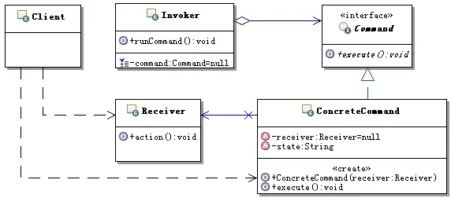

### 场景

* 如果需要抽象出需要执行的动作，并参数化这些对象。
* 如果需要支持撤销取消操作。
* 如果需要在不同的时刻指定、排列和执行请求，进行请求队列化。
* **在需要事务的系统中**，可以选用命令模式，命令模式提供了对事务进行建模的方法，命令模式有一个别名就是 Transaction。

### 实现

**通用实现**

```java
/**  
 * 命令接口，声明执行的操作  
 */    
public interface Command {    
    /**  
     * 执行命令对应的操作  
     */    
    public void execute();    
}  
/** 
 * 具体的命令实现对象 
 */  
public class ConcreteCommand implements Command {  
    /** 
     * 持有相应的接收者对象 
     */  
    private Receiver receiver = null;  
    /** 
     * 示意，命令对象可以有自己的状态 
     */  
    private String state;  
    /** 
     * 构造方法，传入相应的接收者对象 
     * @param receiver 相应的接收者对象 
     */  
    public ConcreteCommand(Receiver receiver){  
        this.receiver = receiver;  
    }     
    public void execute() {  
        //通常会转调接收者对象的相应方法，让接收者来真正执行功能  
        receiver.action();  
    }  
}  

```

```cpp
/** 
 * 接收者对象 
 */  
public class Receiver {  
    /** 
     * 示意方法，真正执行命令相应的操作 
     */  
    public void action(){  
        //真正执行命令操作的功能代码  
    }  
}  
```

```csharp
/** 
 * 调用者 
 */  
public class Invoker {  
    /** 
     * 持有命令对象 
     */  
    private Command command = null;  
    /** 
     * 设置调用者持有的命令对象 
     * @param command 命令对象 
     */  
    public void setCommand(Command command) {  
        this.command = command;  
    }  
    /** 
     * 示意方法，要求命令执行请求 
     */  
    public void runCommand() {  
        //调用命令对象的执行方法  
        command.execute();  
    }  
}  
```

```cpp
/**
 * 组装命令执行器
 */
public class Client {  
    /** 
     * 示意，负责创建命令对象，并设定它的接收者 
     */  
    public void assemble(){  
        //创建接收者  
        Receiver receiver = new Receiver();  
        //创建命令对象，设定它的接收者  
        Command command = new ConcreteCommand(receiver);  
        //创建Invoker，把命令对象设置进去  
        Invoker invoker = new Invoker();  
        invoker.setCommand(command);  
    }  
}  
```

**命令撤销**

```java
   public interface Command {    
      
    public void execute();    
       
    public void undo();
}  
public class AddCommand implements Command {  
    
    private Receiver receiver = null;  
    
    private String state;  
    
    public ConcreteCommand(Receiver receiver){  
        this.receiver = receiver;  
    }     
    
    public void execute() {  
        // 加法操作 
        receiver.add();  
    }  
    
    public void undo() {  
        // 反向 减法操作
        receiver.substract();  
    } 
}  
public class SubstractCommand implements Command {  
    
    private Receiver receiver = null;  
    
    private String state;  
    
    public ConcreteCommand(Receiver receiver){  
        this.receiver = receiver;  
    }     
    
    public void execute() {  
        // 减法操作 
        receiver.substract();  
    }  
    
    public void undo() {  
        // 反向 加法操作
        receiver.add();  
    } 
}  

```

```csharp
public class Invoker {  
    /** 
     * 命令的操作的历史记录，在撤销时候用 
     */  
    private List<Command> undoCmds = new ArrayList<Command>();  
    /** 
     * 命令被撤销的历史记录，在恢复时候用 
     */  
    private List<Command> redoCmds = new ArrayList<Command>();  
     
    private Command addCmd = null;  
    private Command substractCmd = null;  
    public void setAddCmd(Command addCmd) {  
        this.addCmd = addCmd;  
    }  
    public void setSubstractCmd(Command substractCmd) {  
        this.substractCmd = substractCmd;  
    }     
    public void addPressed(){  
        this.addCmd.execute();  
        //把操作记录到历史记录里面  
        undoCmds.add(this.addCmd);  
    }  
    public void substractPressed(){  
        this.substractCmd.execute();  
        //把操作记录到历史记录里面  
        undoCmds.add(this.substractCmd);  
    }  
    public void undoPressed(){  
        if(this.undoCmds.size()>0){  
            //取出最后一个命令来撤销  
            Command cmd = this.undoCmds.get(undoCmds.size()-1);  
            cmd.undo();  
            //如果还有恢复的功能，那就把这个命令记录到恢复的历史记录里面  
            this.redoCmds.add(cmd );  
            //然后把最后一个命令删除掉，  
            this.undoCmds.remove(cmd);  
        }else{  
            System.out.println("很抱歉，没有可撤销的命令");  
        }  
    }  
    public void redoPressed(){  
        if(this.redoCmds.size()>0){  
            //取出最后一个命令来重做  
            Command cmd = this.redoCmds.get(redoCmds.size()-1);  
            cmd.execute();        
            //把这个命令记录到可撤销的历史记录里面  
            this.undoCmds.add(cmd);  
            //然后把最后一个命令删除掉  
            this.redoCmds.remove(cmd);  
        }else{  
            System.out.println("很抱歉，没有可恢复的命令");  
        }  
    }  
} 
```

**宏命令**

宏命令是一个命令的组合。

将点菜视为下命令，每道菜是一道命令，菜单就是宏命令。服务员作为 invoker 和组装命令的人，大厨和小工接受命令。

```java
/** 
 * 菜单对象，是个宏命令对象 
 */  
public class MenuCommand implements Command {  
    /** 
     * 用来记录组合本菜单的多道菜品，也就是多个命令对象 
     */  
    private Collection<Command> col = new ArrayList<Command>();  
    /** 
     * 点菜，把菜品加入到菜单中 
     * @param cmd 客户点的菜 
     */  
    public void addCommand(Command cmd){  
        col.add(cmd);  
    }  
    public void execute() {  
        //执行菜单其实就是循环执行菜单里面的每个菜  
        for(Command cmd : col){  
            cmd.execute();  
        }  
    }  
}  
```

```java
/** 
 * 服务员，负责组合菜单，负责组装每个菜和具体的实现者， 
 * 还负责执行调用，相当于标准Command模式的Client+Invoker 
 */  
public class Waiter {  
    /** 
     * 持有一个宏命令对象——菜单 
     */  
    private MenuCommand menuCommand = new MenuCommand();  
    /** 
     * 客户点菜 
     * @param cmd 客户点的菜，每道菜是一个命令对象 
     */  
    public void orderDish(Command cmd){  
        //客户传过来的命令对象是没有和接收者组装的  
        //在这里组装吧  
        CookApi hotCook = new HotCook();  
        CookApi coolCook = new CoolCook();  
        //判读到底是组合凉菜师傅还是热菜师傅  
        //简单点根据命令的原始对象的类型来判断  
        if(cmd instanceof DuckCommand){  
            ((DuckCommand)cmd).setCookApi(hotCook);  
        }else if(cmd instanceof ChopCommand){  
            ((ChopCommand)cmd).setCookApi(hotCook);  
       }else if(cmd instanceof PorkCommand){  
            //这是个凉菜，所以要组合凉菜的师傅  
            ((PorkCommand)cmd).setCookApi(coolCook);  
        }  
        //添加到菜单中  
        menuCommand.addCommand(cmd);  
    }  
    /** 
     * 客户点菜完毕，表示要执行命令了，这里就是执行菜单这个组合命令 
     */  
    public void orderOver(){  
        this.menuCommand.execute();  
    }  
}  
```

```java
public class Client {  
    public static void main(String[] args) {  
        //客户只是负责向服务员点菜就好了  
        //创建服务员  
        Waiter waiter = new Waiter();  
         
        //创建命令对象，就是要点的菜  
        Command chop = new ChopCommand();  
        Command duck = new DuckCommand();  
        Command pork = new PorkCommand();  
         
        //点菜，就是把这些菜让服务员记录下来  
        waiter.orderDish(chop);  
        waiter.orderDish(duck);  
        waiter.orderDish(pork);  
         
        //点菜完毕  
        waiter.orderOver();  
    }  
}  
```

**队列请求**

所谓队列请求，就是对命令对象进行排队，组成工作队列，然后依次取出命令对象来执行。

1. 可以用多线程或者线程池来进行命令队列的处理
2. 单线程，一个命令一个命令的循环处理

**实现 Java 回调**

```java
public interface Command {  
    public void execute();  
    /** 
     * 设置要输出的内容 
     * @param s 要输出的内容 
     */  
    public void setStr(String s);  
}  
```

```java
public class Invoker {  
    public void startPrint(Command cmd){      
        System.out.println("在Invoker中，输出服务前");  
        cmd.execute();  
        System.out.println("输出服务结束");  
    }  
}  
```

```java
public class Client {  
    public static void main(String[] args) {  
        //准备要发出的命令，没有具体实现类了  
        //匿名内部类来实现命令   
        Command cmd = new Command() {  
            private String str = "";  
            public void setStr(String s) {  
                str = s;  
            }  
            public void execute() {  
                System.out.println("打印的内容为="+str);  
            }  
        };
        cmd.setStr("退化的命令模式类似于Java回调的示例");        
        //这个时候的Invoker或许该称为服务了  
        Invoker invoker = new Invoker();  
        //按下按钮，真正启动执行命令  
        invoker.startPrint(cmd);  
    }  
}  
```

### UML 时序图

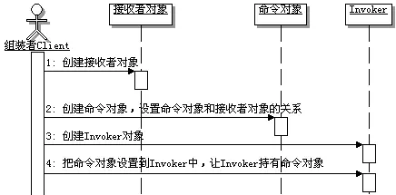

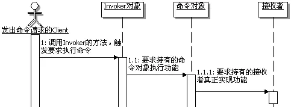

### 优点

1. **更松散的耦合。** 发起命令的对象，完全不知道具体实现对象是谁，也不知道如何实现。
2. **更动态的控制。** 命令模式把请求封装起来，可以动态对它进行参数化、队列化和日志化等操作，从而使得系统更灵活。

### 与其他模式

**模板方法模式**

从某种意义上有相似的功能，Invoker 的方法如果能完成部分实现，就类似一个算法骨架，在这个骨架里面没有具体实现，需要外部来实现，这个时候就可以通过回调命令接口来实现，不过模板方法模式一般是先调用抽象方法，然后通过子类重写父类的方法来进一步实现。

## 行为型 - 观察者模式 Observer

### 定义

定义对象间的一种一对多的依换关系，当一个对象的状态发生改变时，所有依赖于它的对象都得到通知并使自动更新。观察者模式又被称为发布-订阅模式；

**观察者模式的本质：触发联动。**

### UML 类图

`Subject`：目标对象，一个目标可以被多个观察者观察，目标提供对观察者注册和退订的维护，当目标的状态发生变化时，目标负责通知所有注册的、有效的观察者。

`Observer`：定义观察者的接口，提供目标通知时对应的更新方法，这个更新方法进行相应的业务处理，可以在这个方法里面回调目标对象，以获取目标对象的数据。

`ConcreteSubject`：具体的目标实现对象，用来维护目标状态，当目标对象的状态发生改变时，通知所有注册有效的观察者，让观察者执行相应的处理。

`ConcreteObserver`：观察者的具体实现对象，用来接收目标的通知，并进行相应的后续处理，比如更新自身的状态以保持和目标的相应状态一致。

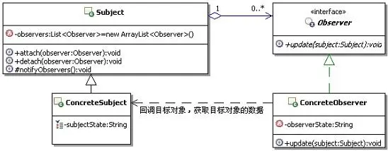

### 场景

* 当一个抽象模型有两个方面，其中一个方面的操作依赖于另一个方面的状态变化，那么就可以选用观察者模式
* 如果在更改一个对象的时候，需要同时连带改变其它的对象，而且不知道究竟应该有多少对象需要被连带改变
* 当一个对象必须通知其它的对象，但是你又希望这个对象和其它被它通知的对象是松散耦合的

例如实际生活中订阅报纸的过程，订阅者类向出版者类订阅报纸，订阅者类可以有很多，当出版者类出版新报纸的时候，多个订阅者类如何知道呢？这时候在代码设计上就可以考虑观察者模式，又被称为发布-订阅模式；

### 实现

**通用实现**

```java
/**
 * 目标对象，它知道观察它的观察者，并提供注册和删除观察者的接口
 */
public class Subject {
    /**
     * 用来保存注册的观察者对象
     */
    private List<Observer> observers = new ArrayList<Observer>();
    /**
     * 注册观察者对象
     * @param observer 观察者对象
     */
    public void attach(Observer observer) {
       observers.add(observer);
    }
    /**
     * 删除观察者对象
     * @param observer 观察者对象
     */
    public void detach(Observer observer) {
       observers.remove(observer);
    }
    /**
     * 通知所有注册的观察者对象
     */
    protected void notifyObservers() {
       for(Observer observer : observers){
           observer.update(this);
       }
    }
}
/**
 * 具体的目标对象，负责把有关状态存入到相应的观察者对象，
 * 并在自己状态发生改变时，通知各个观察者
 */
public class ConcreteSubject extends Subject {
    /**
     * 示意，目标对象的状态
     */
    private String subjectState;
    public String getSubjectState() {
       return subjectState;
    }
    public void setSubjectState(String subjectState) {
       this.subjectState = subjectState;
       //状态发生了改变，通知各个观察者
       this.notifyObservers();
    }
}
```

```java
/**
 * 观察者接口，定义一个更新的接口给那些在目标发生改变的时候被通知的对象
 */
public interface Observer {
    /**
     * 更新的接口
     * @param subject 传入目标对象，好获取相应的目标对象的状态
     */
    public void update(Subject subject);
}
/**
 * 具体观察者对象，实现更新的方法，使自身的状态和目标的状态保持一致
 */
public class ConcreteObserver implements Observer {
    /**
     * 示意，观者者的状态
     */
    private String observerState;
  
    public void update(Subject subject) {
       // 具体的更新实现
       //这里可能需要更新观察者的状态，使其与目标的状态保持一致
       observerState = ((ConcreteSubject)subject).getSubjectState();
    }
}
```

**Java.util.Observable & Java.util.Observer**

```java
/**
 * 报纸对象，具体的目标实现
 */
public class NewsPaper extends Observable {
    /**
     * 报纸的具体内容
     */
    private String content;
    /**
     * 获取报纸的具体内容
     * @return 报纸的具体内容
     */
    public String getContent() {
       return content;
    }
    /**
     * 示意，设置报纸的具体内容，相当于要出版报纸了
     * @param content 报纸的具体内容
     */
    public void setContent(String content) {
       this.content = content;
       //内容有了，说明又出新报纸了，那就通知所有的读者
       //注意在用Java中的Observer模式的时候，下面这句话不可少
       this.setChanged();
       //然后主动通知，这里用的是推的方式
       this.notifyObservers(this.content);
       //如果用拉的方式，这么调用
       //this.notifyObservers();
    }
}
```

```java
/**
 * 真正的读者，为了简单就描述一下姓名
 */
public class Reader implements Observer {
    /**
     * 读者的姓名
     */
    private String name;
    public String getName() {
       return name;
    }
    public void setName(String name) {
       this.name = name;
    }


    @Override
    public void update(Observable osv, Object arg) {
        //这是采用推的方式
        System.out.println(name+"收到报纸了，阅读先。目标推过来的内容是==="+arg);

        //这是获取拉的数据
        // System.out.println(name+"收到报纸了，阅读先。主动到目标对象去拉的内容是==="+((NewsPaper)osv).getContent());
    }
}
```

```java
public class Client {
    public static void main(String[] args) {
       //创建一个报纸，作为被观察者
       NewsPaper subject = new NewsPaper();
       //创建阅读者，也就是观察者
       Reader reader1 = new Reader();
       reader1.setName("张三");
     
       Reader reader2 = new Reader();
       reader2.setName("李四");
     
       Reader reader3 = new Reader();
       reader3.setName("王五");
     
       //注册阅读者
       subject.addObserver(reader1);
       subject.addObserver(reader2);
       subject.addObserver(reader3);
     
       //要出报纸啦
       subject.setContent("本期内容是观察者模式");
    }
}
```

**Swing 中的观察者模式**

Swing 组件是被观察的目标，而每个实现监听器的类就是观察者，监听器的接口就是观察者的接口，在调用 addXXXListener 方法的时候就相当于注册观察者。当组件被点击，状态发生改变的时候，就会产生相应的通知，会调用注册的观察者的方法，就是我们所实现的监听器的方法。

### UML 时序图

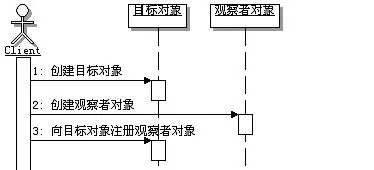 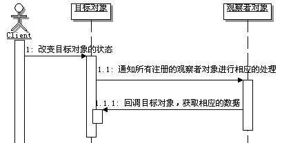

### 优点

1. **实现了观察者和目标之间的抽象耦合。** 目标和观察者就只是在抽象层面上耦合了，也就是说目标只是知道观察者接口，并不知道具体的观察者的类，从而实现目标类和具体的观察者类之间解耦。
2. **实现了动态联动。** 观察者模式对观察者注册实行管理，那就可以在运行期间，通过动态的控制注册的观察者，来控制某个动作的联动范围，从而实现动态联动。

### 与其他模式

**状态模式**

状态模式是根据不同的状态，选择不同的实现，这个实现类的主要功能就是针对状态的相应的操作，它不像观察者，观察者本身还有很多其它的功能，接收通知并执行相应处理只是观察者的部分功能。

## 行为型 - 访问者 Visitor

### 定义

表示一个作用于某对象结构中的各元素的操作，它使你可以在不改变各元素的类的前提下定义作用于这些元素的新操作。

访问者模式能给一系列对象，透明的添加新功能。

### UML 类图

`Visitor`：访问者接口，为所有的访问者对象声明一个 visit 方法，用来代表为对象结构添加的功能，理论上可以代表任意的功能。

`ConcreteVisitor`：具体的访问者实现对象，实现要真正被添加到对象结构中的功能。

`Element`：抽象的元素对象，对象结构的顶层接口，定义接受访问的操作。

`ConcreteElement`：具体元素对象，对象结构中具体的对象，也是被访问的对象，通常会回调访问者的真实功能，同时开放自身的数据供访问者使用。

`ObjectStructure`：对象结构，通常包含多个被访问的对象，它可以遍历这多个被访问的对象，也可以让访问者访问它的元素。可以是一个复合或是一个集合，如一个列表或无序集合。

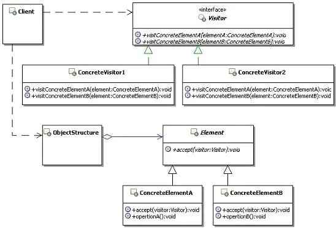

### 场景

如果想对一个对象结构，实施一些依赖于对象结构中的具体类的操作，可以使用访问者模式。

如果想对一个对象结构中的各个元素，进行很多不同的而且不相关的操作，为了避免这些操作使得类变得杂乱，可以使用访问者模式，把这些操作分散到不同的访问者对象中去，每个访问者对象实现同一类功能。

如果对象结构很少变动，但是需要经常给对象结构中的元素对象定义新的操作，可以使用访问者模式。

### 实现

**通用实现**

```java
/**
 * 访问者接口
 */
public interface Visitor {
    /**
     * 访问元素A，相当于给元素A添加访问者的功能
     * @param elementA 元素A的对象
     */
    public void visitConcreteElementA(ConcreteElementA elementA);
    /**
     * 访问元素B，相当于给元素B添加访问者的功能
     * @param elementB 元素B的对象
     */
    public void visitConcreteElementB(ConcreteElementB elementB);
}
/**
 * 具体的访问者实现
 */
public class ConcreteVisitor1 implements Visitor {
    public void visitConcreteElementA(ConcreteElementA element) {
        //把去访问ConcreteElementA时，需要执行的功能实现在这里
        //可能需要访问元素已有的功能，比如：
        element.opertionA();
    }
    public void visitConcreteElementB(ConcreteElementB element) {
        //把去访问ConcreteElementB时，需要执行的功能实现在这里
        //可能需要访问元素已有的功能，比如：
        element.opertionB();
    }
}
```

```java
/**
 * 被访问的元素的接口
 */
public abstract class Element {
    /**
     * 接受访问者的访问
     * @param visitor 访问者对象
     */
    public abstract void accept(Visitor visitor);
}
/**
 * 具体元素的实现对象
 */
public class ConcreteElementA extends Element {
    public void accept(Visitor visitor) {
        //回调访问者对象的相应方法
        visitor.visitConcreteElementA(this);
    }
    /**
     * 示例方法，表示元素已有的功能实现
     */
    public void opertionA(){
        //已有的功能实现
    }
}
/**
 * 具体元素的实现对象
 */
public class ConcreteElementB extends Element {
    public void accept(Visitor visitor) {
        //回调访问者对象的相应方法
        visitor.visitConcreteElementB(this);
    }
    /**
     * 示例方法，表示元素已有的功能实现
     */
    public void opertionB(){
        //已有的功能实现
    }
}
```

```java
/**
 * 对象结构,通常在这里对元素对象进行遍历，让访问者能访问到所有的元素
 */
public class ObjectStructure {
    /**
     * 示意，表示对象结构，可以是一个组合结构或是集合
     */
    private Collection<Element> col = new ArrayList<Element>();
    /**
     * 示意方法，提供给客户端操作的高层接口
     * @param visitor 客户端需要使用的访问者
     */
    public void handleRequest(Visitor visitor){
        //循环对象结构中的元素，接受访问
        for(Element ele : col){
            ele.accept(visitor);
        }
    }
    /**
     * 示意方法，组建对象结构，向对象结构中添加元素。
     * 不同的对象结构有不同的构建方式
     * @param ele 加入到对象结构的元素
     */
    public void addElement(Element ele){
        this.col.add(ele);
    }
}
```

```java
public class Client {
    public static void main(String[] args) {
        //创建ObjectStructure
        ObjectStructure os = new ObjectStructure();
        //创建要加入对象结构的元素
        Element eleA = new ConcreteElementA();
        Element eleB = new ConcreteElementB();
        //把元素加入对象结构
        os.addElement(eleA);
        os.addElement(eleB);    
        //创建访问者
        Visitor visitor = new ConcreteVisitor1();    
        //调用业务处理的方法
        os.handleRequest(visitor);     
    }
}
```

### UML 时序图

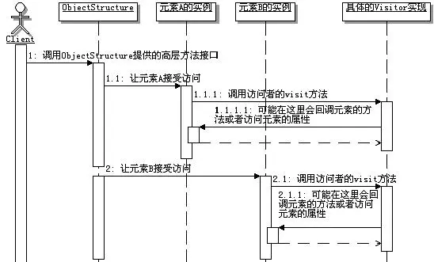

### 优点

1. **好的扩展性。** 能够在不修改对象结构中的元素的情况下，给对象结构中的元素添加新的功能。
2. **好的复用性。** 访问者来定义整个对象结构通用的功能。

### 缺点

1. **不适用于对象结构中的类经常变化的情况。**
2. **破坏封装。** 访问者模式通常需要对象结构开放内部数据给访问者和 ObjectStructrue，这破坏了对象的封装性。

### 与其他模式

**装饰模式**

装饰模式可以实现为一个对象透明的添加功能，但装饰模式基本上是在现有的功能的基础之上进行功能添加，实际上是对现有功能的 **加强或者改造**。

而访问者模式是给一系列对象，透明的添加新功能，从而避免在维护期间，对这一系列对象进行修改。

**组合模式**

通过访问者模式给组合对象预留下扩展功能的接口，使得给组合模式的对象结构添加功能非常容易。

## 行为型 - 状态模式 State

### 定义

允许一个对象在其内部状态改变时改变它的行为。对象看起来似乎修改了它的类。

状态模式的功能就是分离状态的行为，通过维护状态的变化，来调用不同的状态对应的不同的功能。状态决定行为。

### UML 类图

`Context`：环境，也称上下文，通常用来定义客户感兴趣的接口，同时维护一个来具体处理当前状态的实例对象。

`State`：状态接口，用来封装与上下文的一个特定状态所对应的行为。

`ConcreteState`：具体实现状态处理的类，每个类实现一个跟上下文相关的状态的具体处理。

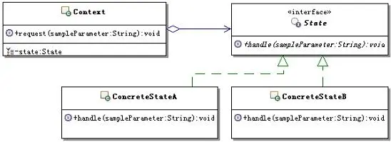

### 场景

* 如果一个对象的行为取决于它的状态，而且它必须在运行时刻根据状态来改变它的行为。
* 如果一个操作中含有庞大的多分支语句，而且这些分支依赖于该对象的状态。

### 实现

**通用实现**

```java
/**
 * 封装与Context的一个特定状态相关的行为
 */
public interface State {
    /**
     * 状态对应的处理
     * @param sampleParameter 示例参数，说明可以传入参数，具体传入
     *             什么样的参数，传入几个参数，由具体应用来具体分析
     */
    public void handle(String sampleParameter);
}
/**
 * 实现一个与Context的一个特定状态相关的行为
 */
public class ConcreteStateA implements State {
    public void handle(String sampleParameter) {
       //实现具体的处理
    }
}
/**
 * 实现一个与Context的一个特定状态相关的行为
 */
public class ConcreteStateB implements State {
    public void handle(String sampleParameter) {
       //实现具体的处理
    }
}
```

```java
/**
 * 定义客户感兴趣的接口，通常会维护一个State类型的对象实例
 */
public class Context {
    /**
     * 持有一个State类型的对象实例
     */
    private State state;
    /**
     * 设置实现State的对象的实例
     * @param state 实现State的对象的实例
     */
    public void setState(State state) {
       this.state = state;
    }
    /**
     * 用户感兴趣的接口方法
     * @param sampleParameter 示意参数
     */
    public void request(String sampleParameter) {
       //在处理中，会转调state来处理
       state.handle(sampleParameter);
    }
}
```

**状态机工作流**

企业应用常见工作流的需求，复杂的应用可能会使用工作流中间件，用工作流引擎来负责流程处理，其实工作流引擎的实现也可以应用上状态模式。

```java
/**
 * 公共状态处理机，相当于状态模式的Context
 * 包含所有流程使用状态模式时的公共功能
 */
public  class StateMachine {
    /**
     * 持有一个状态对象
     */
    private State state = null;
    /**
     * 包含流程处理需要的业务数据对象，不知道具体类型,为了简单，不去使用泛型，
     * 用Object，反正只是传递到具体的状态对象里面
     */
    private Object businessVO = null;
    /**
     * 执行工作，客户端处理流程的接口方法。
     * 在客户完成自己的业务工作后调用
     */
    public void doWork(){
       //转调相应的状态对象真正完成功能处理
       this.state.doWork(this);
    }
  
    public State getState() {
       return state;
    }
    public void setState(State state) {
       this.state = state;
    }
    public Object getBusinessVO() {
       return businessVO;
    }
    public void setBusinessVO(Object businessVO) {
       this.businessVO = businessVO;
    }
}
```

```java
/**
 * 公共状态接口
 */
public interface State {
    /**
     * 执行状态对应的功能处理
     * @param ctx 上下文的实例对象
     */
    public void doWork(StateMachine ctx);
}
public interface LeaveRequestState extends State{
    //这里可以扩展跟自己流程相关的处理
}
/**
 * 处理项目经理的审核，处理后可能对应部门经理审核、审核结束之中的一种
 */
public class ProjectManagerState implements LeaveRequestState{
    public void doWork(StateMachine request) {
        //先把业务对象造型回来
        LeaveRequestModel lrm = (LeaveRequestModel)request.getBusinessVO();

        //业务处理，把审核结果保存到数据库中
     
        //根据选择的结果和条件来设置下一步
        if("同意".equals(lrm.getResult())){
            if(lrm.getLeaveDays() > 3){
                //如果请假天数大于3天，而且项目经理同意了，就提交给部门经理
                request.setState(new DepManagerState());
                //为部门经理增加一个工作
            }else{
                //3天以内的请假，由项目经理做主,
                //就不用提交给部门经理了，转向审核结束状态
                request.setState(new  AuditOverState());
                //给申请人增加一个工作，让他查看审核结果
            }
        }else{
            //项目经理不同意的话，也就不用提交给部门经理了，转向审核结束状态
            request.setState(new  AuditOverState());
         
            //给申请人增加一个工作，让他查看审核结果
        }         
    }  
}
/**
 * 处理部门经理的审核，处理后对应审核结束状态
 */
public class DepManagerState implements LeaveRequestState{
    public void doWork(StateMachine request) {
       //先把业务对象造型回来
       LeaveRequestModel lrm = (LeaveRequestModel)request.getBusinessVO();

       //业务处理，把审核结果保存到数据库中
     
       //部门经理审核过后，直接转向审核结束状态了
       request.setState(new AuditOverState());

       //给申请人增加一个工作，让他查看审核结果
    }
}
/**
 * 处理审核结束的类
 */
public class AuditOverState implements LeaveRequestState{
    public void doWork(StateMachine request) {
       //先把业务对象造型回来
       LeaveRequestModel lrm = (LeaveRequestModel)request.getBusinessVO();

       //业务处理，在数据里面记录整个流程结束   
    }
}
```

### UML 时序图

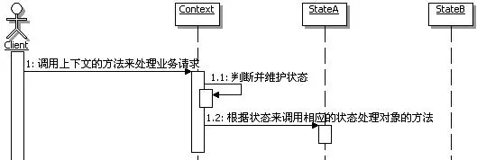

### 优点

1. **简化应用逻辑控制。** 状态模式使用单独的类来封装一个状态的处理。
2. **更好的分离状态和行为。** 状态模式通过设置所有状态类的公共接口，把状态和状态对应的行为分离开来，把所有与一个特定的状态相关的行为都放入一个对象中，使得应用程序在控制的时候，只需要关心状态的切换，而不用关心这个状态对应的真正处理。
3. **更好的扩展性。** 扩展新的状态变得非常容易，只需要新增加一个实现状态处理的公共接口的实现类

### 缺点

1. **引入太多的状态类。** 一个状态对应一个状态处理类，会使得程序引入太多的状态类，使程序变得杂乱。

### 与其他模式

**观察者模式**

这两个模式都是在状态发生改变的时候触发行为，只不过观察者模式的行为是固定的，那就是通知所有的观察（一般是触发式地回调观察者的方法），而状态模式是根据状态来选择不同的处理。观察者模式的目的是在被观察者的状态发生改变的时候，触发观察者联动，具体如何处理观察者模式不管；而状态模式的主要目的在于根据状态来分离和选择行为，当状态发生改变的时候，动态改变行为。

**策略模式**

状态模式的结构和策略模式的结构完全一样，但是，它们的目的、实现、本质都是完全不一样的。状态模式的行为是平行性的，不可相互替换的，上下文确定了状态则确定了行为；而策略模式的行为是平等性的，是可以相互替换的。

**享元模式**

如果状态改变很频繁，也就是需要频繁的创建状态对象，而且状态对象还存储着大量的信息数据，可以通过享元模式来共享状态对象

## 行为型 - 解释器模式 Interpreter

### 定义

给定一个语言，定义它的文法的一种表示，并定义一个解样器，这个解样器使用该表示来解样语言中的句子。

解释器模式使用解释器对象来表示和处理相应的语法规则，一般一个解释器处理一条语法规则。理论上来说，只要能用解释器对象把符合语法的表达式表示出来，而且能够构成抽象的语法树，那都可以使用解释器模式来处理

解释器模式的本质：分离实现，解释执行。

### UML 类图

`AbstractExpression`：定义解释器的接口，约定解释器的解释操作。

`TerminalExpression`：终结符解释器，用来实现语法规则中和终结符相关的操作，不再包含其它的解释器，如果用组合模式来构建抽象语法树的话，就相当于组合模式中的叶子对象，可以有多种终结符解释器。

`NonterminalExpression`：非终结符解释器，用来实现语法规则中非终结符相关的操作，通常一个解释器对应一个语法规则，可以包含其它的解释器，如果用组合模式来构建抽象语法树的话，就相当于组合模式中的组合对象，可以有多种非终结符解释器。

`Context`：上下文，通常包含各个解释器需要的数据，或是公共的功能。

`Client`：客户端，指的是使用解释器的客户端，通常在这里去把按照语言的语法做的表达式，转换成为使用解释器对象描述的抽象语法树，然后调用解释操作。

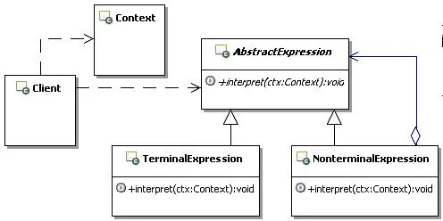

### 场景

* 当有一个语言需要解释执行，并且可以将该语言中的句子表示为一个抽象语法树的时候，可以考虑使用解释器模式。

* 在使用解释器模式的时候，还有两个特点需要考虑，一个是语法相对应该比较简单，太复杂的语法不合适使用解释器模式；另一个是效率要求不是很高，对效率要求很高的情况下，不适合使用解释器模式。

例，制定一种简单的语言，让客户端用来表达从 xml 中取值的表达式的语言，然后为它们定义一种文法的表示，也就是语法规则，然后用解释器对象来表示那些表达式，接下来通过运行解释器来解释并执行这些功能。

### 实现

**通用实现**

```java
/**
 * 抽象表达式
 */
public abstract class AbstractExpression {
    /**
     * 解释的操作
     * @param ctx 上下文对象
     */
    public abstract void interpret(Context ctx);
}
```

```java
/**
 * 终结符表达式
 */
public class TerminalExpression extends AbstractExpression{
    public void interpret(Context ctx) {
       //实现与语法规则中的终结符相关联的解释操作
    }
}
```

```java
/**
 * 非终结符表达式
 */
public class NonterminalExpression extends AbstractExpression{
    public void interpret(Context ctx) {
       //实现与语法规则中的非终结符相关联的解释操作
    }
}
```

```java
/**
 * 上下文，包含解释器之外的一些全局信息
 */
public class Context {
}
```

```java
/**
 * 使用解释器的客户
 */
public class Client {
    //主要按照语法规则对特定的句子构建抽象语法树
    //然后调用解释操作
}
```

**一个规则检验器实现**

具有 and 和 or 规则，通过规则可以构建一颗解析树，用来检验一个文本是否满足解析树定义的规则。例如一颗解析树为 D And (A Or (B C))，文本 "D A" 满足该解析树定义的规则。

```java
public abstract class Expression {
    public abstract boolean interpret(String str);
}
```

```java
public class TerminalExpression extends Expression {

    private String literal = null;

    public TerminalExpression(String str) {
        literal = str;
    }

    public boolean interpret(String str) {
        StringTokenizer st = new StringTokenizer(str);
        while (st.hasMoreTokens()) {
            String test = st.nextToken();
            if (test.equals(literal)) {
                return true;
            }
        }
        return false;
    }
}
```

```java
public class AndExpression extends Expression {

    private Expression expression1 = null;
    private Expression expression2 = null;

    public AndExpression(Expression expression1, Expression expression2) {
        this.expression1 = expression1;
        this.expression2 = expression2;
    }

    public boolean interpret(String str) {
        return expression1.interpret(str) && expression2.interpret(str);
    }
}
```

```java
public class OrExpression extends Expression {
    private Expression expression1 = null;
    private Expression expression2 = null;

    public OrExpression(Expression expression1, Expression expression2) {
        this.expression1 = expression1;
        this.expression2 = expression2;
    }

    public boolean interpret(String str) {
        return expression1.interpret(str) || expression2.interpret(str);
    }
}
```

```java
public class Client {

    /**
     * 构建解析树
     */
    public static Expression buildInterpreterTree() {
        // Literal
        Expression terminal1 = new TerminalExpression("A");
        Expression terminal2 = new TerminalExpression("B");
        Expression terminal3 = new TerminalExpression("C");
        Expression terminal4 = new TerminalExpression("D");
        // B C
        Expression alternation1 = new OrExpression(terminal2, terminal3);
        // A Or (B C)
        Expression alternation2 = new OrExpression(terminal1, alternation1);
        // D And (A Or (B C))
        return new AndExpression(terminal4, alternation2);
    }

    public static void main(String[] args) {
        Expression define = buildInterpreterTree();
        String context1 = "D A";
        String context2 = "A B";
        System.out.println(define.interpret(context1));
        System.out.println(define.interpret(context2));
    }
}
```

### UML 时序图

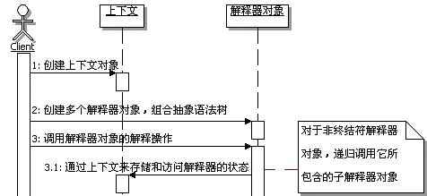

### 优点

1. **易于实现语法，易于扩展新的语法。** 一条语法规则用一个解释器对象来解释执行。扩展新的语法，也只需要创建相应的解释器对象

### 缺点

1. **不适合复杂的语法。** 构建解释器模式需要的抽象语法树的工作是非常艰巨的


### 与其他模式

**组合模式**

通常解释器模式都会使用组合模式来实现，这样能够方便的构建抽象语法树。一般非终结符解释器就相当于组合模式中的组合对象，终结符解释器就相当于叶子对象。

**迭代器模式**

在遍历整个对象结构的时候，自然可以使用迭代器模式。

## 行为型 - 迭代器模式 Iterator

### 定义

提供一种方法顺序访问一个聚合对象中各个元素，而又不需暴露该对象的内部表示。

迭代器模式的功能主要在于提供对聚合对象的迭代访问。

迭代器模式的本质：控制访问聚合对象中的元素。

### UML 类图

`Iterator`：迭代器接口。定义访问和遍历元素的接口。

`ConcreteIterator`：具体的迭代器实现对象。实现对聚合对象的遍历，并跟踪遍历时的当前位置。

`Aggregate`：聚合对象。定义创建相应迭代器对象的接口。

`ConcreteAggregate`：具体聚合对象。实现创建相应的迭代器对象。

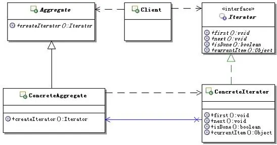

### 场景

* 如果你希望提供访问一个聚合对象的内容，但是又不想暴露它的内部表示的时候，
* 如果你希望有多种遍历方式可以访问聚合对象
* 如果你希望为遍历不同的聚合对象提供一个统一的接口

### 实现

**通用实现**

```java
/**
 * 迭代器接口，定义访问和遍历元素的操作
 */
public interface Iterator {
    /**
     * 移动到聚合对象的第一个位置
     */
    public void first();
    /**
     * 移动到聚合对象的下一个位置
     */
    public void next();
    /**
     * 判断是否已经移动到聚合对象的最后一个位置
     * @return true表示已经移动到聚合对象的最后一个位置，
     *         false表示还没有移动到聚合对象的最后一个位置
     */
    public boolean isDone();
    /**
     * 获取迭代的当前元素
     * @return 迭代的当前元素
     */
    public Object currentItem();
}
```

```java
/**
 * 具体迭代器实现对象，示意的是聚合对象为数组的迭代器
 * 不同的聚合对象相应的迭代器实现是不一样的
 */
public class ConcreteIterator implements Iterator {
    /**
     * 持有被迭代的具体的聚合对象
     */
    private ConcreteAggregate aggregate;
    /**
     * 内部索引，记录当前迭代到的索引位置。
     * -1表示刚开始的时候，迭代器指向聚合对象第一个对象之前
     */
    private int index = -1;
    /**
     * 构造方法，传入被迭代的具体的聚合对象
     * @param aggregate 被迭代的具体的聚合对象
     */
    public ConcreteIterator(ConcreteAggregate aggregate) {
       this.aggregate = aggregate;
    }

    public void first(){
       index = 0;
    }
    public void next(){
       if(index < this.aggregate.size()){
           index = index + 1;
       }
    }
    public boolean isDone(){
       if(index == this.aggregate.size()){
           return true;
       }
       return false;
    }
    public Object currentItem(){
       return this.aggregate.get(index);
    }
}
```

```java
/**
 * 聚合对象的接口，定义创建相应迭代器对象的接口
 */
public abstract class Aggregate {
    /**
     * 工厂方法，创建相应迭代器对象的接口
     * @return 相应迭代器对象的接口
     */
    public abstract Iterator createIterator();
}
```

```java
/**
 * 具体的聚合对象，实现创建相应迭代器对象的功能
 */
public class ConcreteAggregate extends Aggregate {
    /**
     * 示意，表示聚合对象具体的内容
     */
    private String[] ss = null;

    /**
     * 构造方法，传入聚合对象具体的内容
     * @param ss 聚合对象具体的内容
     */
    public ConcreteAggregate(String[] ss){
       this.ss = ss;
    }
  
    public Iterator createIterator() {
       //实现创建Iterator的工厂方法
       return new ConcreteIterator(this);
    }
    /**
     * 获取索引所对应的元素
     * @param index 索引
     * @return 索引所对应的元素
     */
    public Object get(int index){
       Object retObj = null;
       if(index < ss.length){
           retObj = ss[index];
       }
       return retObj;
    }
    /**
     * 获取聚合对象的大小
     * @return 聚合对象的大小
     */
    public int size(){
       return this.ss.length;
    }
}
```

```java
public class Client {
    /**
     * 示意方法，使用迭代器的功能。
     * 这里示意使用迭代器来迭代聚合对象
     */
    public void someOperation(){
       String[] names = {"张三","李四","王五"};
       //创建聚合对象
       Aggregate aggregate = new ConcreteAggregate(names);
       //循环输出聚合对象中的值
       Iterator it = aggregate.createIterator();
       //首先设置迭代器到第一个元素
       it.first();
       while(!it.isDone()){
           //取出当前的元素来
           Object obj = it.currentItem();
           System.out.println("the obj=="+obj);
           //如果还没有迭代到最后，那么就向下迭代一个
           it.next();
       }
    }
    public static void main(String[] args) {
       //可以简单的测试一下
       Client client = new Client();
       client.someOperation();
    }
}
```

**Java 最简单的统一访问聚合的方式**

Java 5 以上版本本身的特性

```java
Collection<PayModel> payList = payManager.getPayList();
for(PayModel pm : payList){
	System.out.println(pm);
}
PayModel[] pms = salaryManager.getPays();
for(PayModel pm : pms){
	System.out.println(pm);
}
```

**Java 的迭代器 Java.util.Iterator**

直接实现 Java.util.Iterator 接口的类就是迭代器类。

**不同迭代策略的迭代器**

如实现过滤功能的迭代器，持有的不再是完整的聚合对象，而是过滤了数据元素的聚合对象

**双向迭代器**

在 Java util.ListIterator 接口就是一个双向迭代器的示例

### 优点

1. **更好的封装性。** 访问一个聚合对象的内容，而无需暴露该聚合对象的内部表示
2. **不同的遍历方式来遍历一个聚合，迭代器自有迭代状态。** 同一个聚合对象同时进行多个不同的遍历，每个迭代器保持它自己的遍历状态。

### 与其他模式

**组合模式**

组合模式是一种递归的对象结构，在枚举某个组合对象的子对象的时候，通常会使用迭代器模式。

**工厂方法模式**

在聚合对象创建迭代器的时候，通常会采用工厂方法模式来实例化相应的迭代器对象。

## 行为型 - 中介者模式 Mediator

### 定义

用一个中介对象来封装一系列的对象交互。中介者使得各对象不需要显式地相互引用，从而使其耦合松散，而且可以独立的改变它们之间的交互。

中介者的功能非常简单，就是封装对象之间的交互。

### UML 类图

`Mediator`：中介者接口。在里面定义各个同事之间交互需要的方法，可以是公共的通讯方法，比如 changed 方法，大家都用，也可以是小范围的交互方法。

`ConcreteMediator`：具体中介者实现对象。它需要了解并维护各个同事对象，并负责具体的协调各同事对象的交互关系。

`Colleague`：同事类的定义，通常实现成为抽象类，主要负责约束同事对象的类型，并实现一些具体同事类之间的公共功能，比如：每个具体同事类都应该知道中介者对象，也就是具体同事类都会持有中介者对象，就可以定义到这个类里面。

`ConcreteColleague`：具体的同事类，实现自己的业务，在需要与其它同事通讯的时候，就与持有的中介者通信，中介者会负责与其它的同事交互。

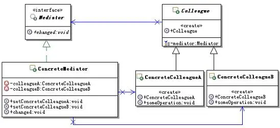

### 场景

如果一组对象之间的通信方式比较复杂，导致相互依赖、结构混乱。

如果一个对象引用很多的对象，并直接跟这些对象交互，导致难以复用该对象。

### 实现

```java
/**
 * 同事类的抽象父类
 */
public abstract class Colleague {
    /**
     * 持有中介者对象，每一个同事类都知道它的中介者对象
     */
    private Mediator mediator;
    /**
     * 构造方法，传入中介者对象
     * @param mediator 中介者对象
     */
    public Colleague(Mediator mediator) {
       this.mediator = mediator;
    }
    /**
     * 获取当前同事类对应的中介者对象
     * @return 对应的中介者对象
     */
    public Mediator getMediator() {
       return mediator;
    }
}
/**
 * 具体的同事类A
 */
public class ConcreteColleagueA extends Colleague {
    public ConcreteColleagueA(Mediator mediator) {
       super(mediator);
    }
    /**
     * 示意方法，执行某些业务功能
     */
    public void someOperation() {
       //在需要跟其它同事通信的时候，通知中介者对象
       getMediator().changed(this);
    }
}

/**
 * 具体的同事类B
 */
public class ConcreteColleagueB extends Colleague {
    public ConcreteColleagueB(Mediator mediator) {
       super(mediator);
    }
    /**
     * 示意方法，执行某些业务功能
     */
    public void someOperation() {
       //在需要跟其它同事通信的时候，通知中介者对象
       getMediator().changed(this);
    }
}
```

```java
/**
 * 中介者，定义各个同事对象通信的接口
 */
public interface Mediator {
    /**
     * 同事对象在自身改变的时候来通知中介者的方法，
     * 让中介者去负责相应的与其它同事对象的交互
     * @param colleague 同事对象自身，好让中介者对象通过对象实例去获取同事对象的状态
     */
    public void changed(Colleague colleague);
}
/**
 * 具体的中介者实现
 */
public class ConcreteMediator implements Mediator {
    /**
     * 持有并维护同事A
     */
    private ConcreteColleagueA colleagueA;
    /**
     * 持有并维护同事B
     */
    private ConcreteColleagueB colleagueB;
  
    /**
     * 设置中介者需要了解并维护的同事A对象
     * @param colleague 同事A对象
     */
    public void setConcreteColleagueA(ConcreteColleagueA colleague) {
       colleagueA = colleague;
    }
    /**
     * 设置中介者需要了解并维护的同事B对象
     * @param colleague 同事B对象
     */
    public void setConcreteColleagueB(ConcreteColleagueB colleague) {
       colleagueB = colleague;
    }  

    public void changed(Colleague colleague) {
       //某个同事类发生了变化，通常需要与其它同事交互
       //具体协调相应的同事对象来实现协作行为
    }
}
```

**广义中介者**

中介者模式在实际使用的时候，变得繁琐或困难。做一下简化

去掉同事类，让任意的对象，只要需要相互交互，就可以成为同事；

不定义 Mediator 接口，把具体的中介者对象实现成为单例；

同事对象不再持有中介者，而是在需要的时候直接获取中介者单例并调用；

中介者也不再持有同事对象，而是在具体处理方法里面去创建

### UML 时序图

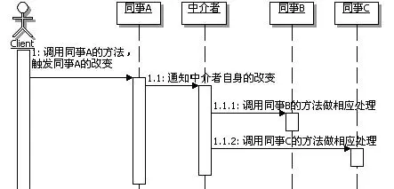

### 优点

1. **松散耦合。** 同事对象之间松散耦合，基本上可以做到互不依赖。
2. **集中控制交互。** 交互行为发生变化的时候，只需要修改中介者对象就可以了
3. **多对多变成一对多。** 引入中介者对象过后，中介者对象和同事对象的关系通常变成了双向的一对多，这会让对象的关系更容易理解和实现。

### 缺点

1. **过度集中化。** 假如同事对象的交互非常多，而且比较复杂，当这些复杂性全部集中到中介者的时候，会导致中介者对象变得十分的复杂，而且难于管理和维护。

### 与其他模式

**外观模式**

观模式封装的是子系统外部和子系统内部模块间的交互；而中介者模式是提供多个平等的同事对象之间交互关系的封装，一般是用在内部实现上。

**观察者模式**

中介者模式可以组合使用观察者模式，来实现当同事对象发生改变的时候，通知中介对象，让中介对象去进行与其它相关对象的交互。

## 行为型 - 备忘录 Memento

### 定义

在不破坏封装性的前提下，捕获一个对象的内部状态，并在该对象之外保存这个状态。这样以后就可将该对象恢复到原先保存的状态。

### UML 类图

Memento：备忘录。主要用来存储原发器对象的内部状态，但是具体需要存储哪些数据是由原发器对象来决定的。另外备忘录应该只能由原发器对象来访问它内部的数据，原发器外部的对象不应该能访问到备忘录对象的内部数据。

Originator：原发器。使用备忘录来保存某个时刻原发器自身的状态，也可以使用备忘录来恢复内部状态。引入一个存储状态的备忘录对象，为了让外部无法访问这个对象的值，一般把这个对象实现成为需要保存数据的对象的内部类，通常还是私有的

Caretaker：备忘录管理者，或者称为备忘录负责人。主要负责保存备忘录对象，但是不能对备忘录对象的内容进行操作或检查。

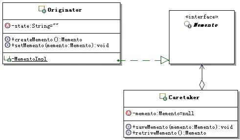

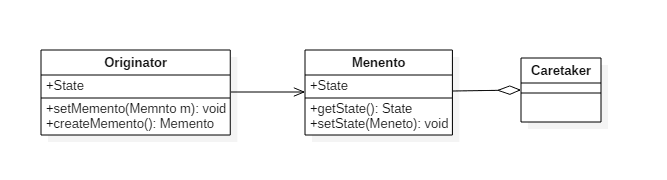

### 场景

如果必须保存一个对象在某一个时刻的全部或者部分状态，这样在以后需要的时候，可以把该对象恢复到先前的状态。

如果需要保存一个对象的内部状态，且不暴露对象的实现细节，避免破坏对象的封装性。可以使用备忘录模式，把备忘录对象实现成为原发器对象的内部类，而且还是私有的，从而保证只有原发器对象才能访问该备忘录对象。

### 实现

```java
/**
 * 备忘录的窄接口，没有任何方法定义
 */
public interface Memento {
    //
}
```

```java
/**
 * 原发器对象
 */
public class Originator {
    /**
     * 示意，表示原发器的状态
     */
    private String state = "";
    /**
     * 创建保存原发器对象的状态的备忘录对象
     * @return 创建好的备忘录对象
     */
    public Memento createMemento() {
       return new MementoImpl(state);
    }
    /**
     * 重新设置原发器对象的状态，让其回到备忘录对象记录的状态
     * @param memento 记录有原发器状态的备忘录对象
     */
    public void setMemento(Memento memento) {
       MementoImpl mementoImpl = (MementoImpl)memento;
       this.state = mementoImpl.getState();
    }
    /**
     * 真正的备忘录对象，实现备忘录窄接口
     * 实现成私有的内部类，不让外部访问
     */
    private static class MementoImpl implements Memento{
       /**
        * 示意，表示需要保存的状态
        */
       private String state = "";
       public MementoImpl(String state){
           this.state = state;
       }
       public String getState() {
           return state;
       }
    }
}
```

```java
/**
 * 负责保存备忘录的对象
 */
public class Caretaker{
    /**
     * 记录被保存的备忘录对象
     */
    private Memento memento = null;
    /**
     * 保存备忘录对象
     * @param memento 被保存的备忘录对象
     */
    public void saveMemento(Memento memento){
       this.memento = memento;
    }
    /**
     * 获取被保存的备忘录对象
     * @return 被保存的备忘录对象
     */
    public Memento retriveMemento(){
       return this.memento;
    }
}
```

```java
public class Client {
    public static void main(String[] args) {
       // 创建模拟运行流程的对象
       Originator originator = new Originator();
       //运行流程的第一个阶段
       originator.doSomething();     
       //创建一个管理者
       Caretaker careTaker = new Caretaker();
       //创建此时对象的备忘录对象，并保存到管理者对象那里，后面要用
       Memento memento = originator.createMemento();
       careTaker.saveMemento(memento);
     
       //运行流程后半部分
       originator.doSomething2();     
     
       //从管理者获取备忘录对象，然后设置回去，
       //让模拟运行流程的对象自己恢复自己的内部状态
       originator.setMemento(careTaker.retriveMemento());
     
    }
}
```

**窄接口和宽接口**

窄接口：管理者只能看到备忘录的窄接口，窄接口的实现里面通常没有任何的方法，只是一个类型标识，窄接口使得管理者只能将备忘录传递给其它对象。

宽接口：原发器能够看到一个宽接口，允许它访问所需的所有数据，来返回到先前的状态。理想状况是：只允许生成备忘录的原发器来访问该备忘录的内部状态，通常实现成为原发器内的一个私有内部类。

### UML 时序图

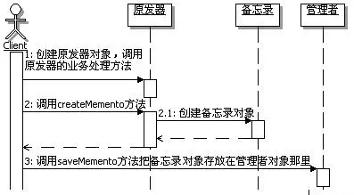

### 优点

1. **更好的封装性。** 备忘录模式通过使用备忘录对象，来封装原发器对象的内部状态。备忘录对象的窄接口并不提供任何方法，这样有效的保证了对原发器对象内部状态的封装，不把原发器对象的内部实现细节暴露给外部。
2. **简化了原发器。** 备忘录模式中，备忘录对象被保存到原发器对象之外，让客户来管理他们请求的状态，从而让原发器对象得到简化。

### 缺点

1. **可能会导致高开销。** 备忘录模式基本的功能，就是对备忘录对象的存储和恢复，它的基本实现方式就是缓存备忘录对象。这样一来，如果需要缓存的数据量很大，或者是特别频繁的创建备忘录对象，开销是很大的。

### 与其他模式

**原型模式**

如果原发器对象中全部或者大部分的状态都需要保存，一个简洁的方式就是直接克隆一个原发器对象。也就是说，这个时候备忘录对象里面存放的是一个原发器对象的实例。

**命令模式**

备忘录可以实现命令模式中的撤销和重做功能

# J2EE 设计模式列表

## MVC 模式

MVC 模式代表 Model-View-Controller（模型-视图-控制器） 模式。

- Model（模型） - 负责数据和业务逻辑，通常包含数据存储、检索和业务规则。
- View（视图） - 负责显示数据（模型）的用户界面，不包含业务逻辑。
- Controller（控制器） - 接收用户的输入，调用模型和视图去完成用户的请求。

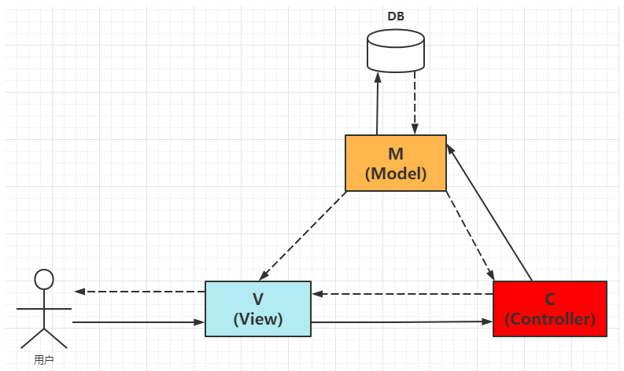

MVC 严格来说并不是一种分层的上下关系的，而是相互协作的关系。

应用实例：

Web应用程序中，用户通过浏览器（视图）发送请求，服务器端的控制器处理请求，模型进行数据处理。

## 数据访问对象模式

数据访问对象模式（Data Access Object Pattern）或 DAO 模式用于把低级的数据访问 API 或操作从高级的业务服务中分离出来。以下是数据访问对象模式的参与者。

DAO 模式主要包含三个核心部分：

* DAO 接口及实现：声明数据访问和操作接口，实现所有访问逻辑。
* 数据传输对象（Data Transfer Object, DTO）：封装从数据源检索的数据，用于业务逻辑层与数据访问层之间的数据传输。
* 数据源及连接：数据库或其他持久化存储，DAO实现与之交互以存取数据。

**实现**

1. 创建数据传输对象或值对象（VO）

   ```java
   public class Student {
      private int id;
      private String name;
      private int rollNo;
    
      // get/set
   }
   ```

2. 创建数据访问对象接口及其实现

   ```java
   public interface StudentDao {
      public List<Student> getAllStudents();
      public Student getStudent(int rollNo);
      public void updateStudent(Student student);
      public void deleteStudent(Student student);
   }
   public interface StudentDaoImpl {
      public List<Student> getAllStudents(){
      		// jdbc为例
          List<Student> students = new ArrayList<>();
           String query = "SELECT * FROM users";
           try (Connection conn = DriverManager.getConnection(DB_URL, DB_USER, DB_PASSWORD);
                PreparedStatement pstmt = conn.prepareStatement(query);
                ResultSet rs = pstmt.executeQuery()) {
               while (rs.next()) {
                   int id = rs.getInt("id");
                   String name = rs.getString("name");
                   String rollNo = rs.getString("rollNo");
                   users.add(new Student(id, name, rollNo));
               }
           } catch (SQLException e) {
               e.printStackTrace();
           }
           return students;
      }
      //...
   }
   ```

3. 进行数据访问

   ```java
   public class DaoPatternDemo {
      public static void main(String[] args) {
         StudentDao studentDao = new StudentDaoImpl();
    
         //输出所有的学生
         for (Student student : studentDao.getAllStudents()) {
            System.out.println("Student: [RollNo : "
               +student.getRollNo()+", Name : "+student.getName()+" ]");
         }
    
    
         //更新学生
         // ...
    
         //获取学生
         // ...     
      }
   }
   ```

## 拦截过滤器模式

拦截过滤器模式（Intercepting Filter Pattern）用于对应用程序的请求或响应做一些预处理/后处理。定义过滤器，并在把请求传给实际目标应用程序之前应用在请求上。

使用场景：当需要在请求处理流程中插入额外的逻辑，而这些逻辑与业务逻辑无关时，如执行日志记录、安全检查、事务管理等操作。

- 过滤器链：一系列过滤器按照特定顺序执行。
- 过滤器：对请求和响应进行预处理和后处理的组件。
- 目标对象：请求处理的最终目的地。

**实现**

1. 创建过滤器接口 Filter及 Filter 实体过滤器

   ```java
   public interface Filter {
      public void execute(String request);
   }
   public class AuthenticationFilter implements Filter {
      public void execute(String request){
         System.out.println("Authenticating request: " + request);
      }
   }
   public class DebugFilter implements Filter {
      public void execute(String request){
         System.out.println("request log: " + request);
      }
   }
   ```

2. 创建目标对象 tartget

   ```java
   public class Target {
      public void execute(String request){
         System.out.println("Executing request: " + request);
      }
   }
   ```

3. 创建过滤器链

   ```java
   public class FilterChain {
      private List<Filter> filters = new ArrayList<Filter>();
      private Target target;
    
      public void addFilter(Filter filter){
         filters.add(filter);
      }
    
      public void execute(String request){
         for (Filter filter : filters) {
            filter.execute(request);
         }
         target.execute(request);
      }
    
      public void setTarget(Target target){
         this.target = target;
      }
   }
   ```

4. 过滤管理及示例

   ```java
   public class FilterManager {
      FilterChain filterChain;
    
      public FilterManager(Target target){
         filterChain = new FilterChain();
         filterChain.setTarget(target);
      }
      public void setFilter(Filter filter){
         filterChain.addFilter(filter);
      }
    
      public void filterRequest(String request){
         filterChain.execute(request);
      }
   }
   public class Client {
      FilterManager filterManager;
    
      public void setFilterManager(FilterManager filterManager){
         this.filterManager = filterManager;
      }
    
      public void sendRequest(String request){
         filterManager.filterRequest(request);
      }
   }
   public class InterceptingFilterDemo {
      public static void main(String[] args) {
         FilterManager filterManager = new FilterManager(new Target());
         filterManager.setFilter(new AuthenticationFilter());
         filterManager.setFilter(new DebugFilter());
    
         Client client = new Client();
         client.setFilterManager(filterManager);
         client.sendRequest("HOME");
      }
   }
   ```

   

# 参考链接

[♥ 设计模式知识体系详解 ♥ | Java 全栈知识体系](https://www.pdai.tech/md/dev-spec/pattern/1_overview.html)

[Carson 带你学设计模式：这是一份全面 & 详细的设计模式学习指南 - 简书](https://www.jianshu.com/p/6e5eda3a51af)

[一张图 24 种设计模式&7 种设计原则 - 简书](https://www.jianshu.com/p/6ee99cf66e4d)

[设计模式 | 菜鸟教程](https://www.runoob.com/design-pattern/design-pattern-tutorial.html)